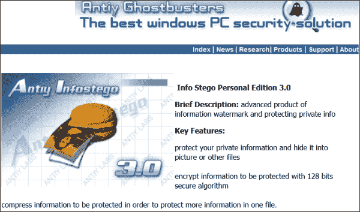
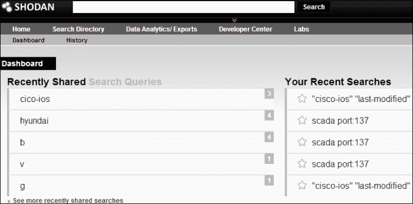
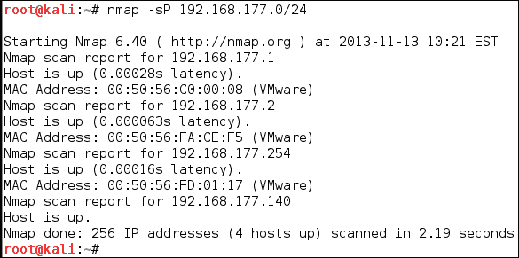
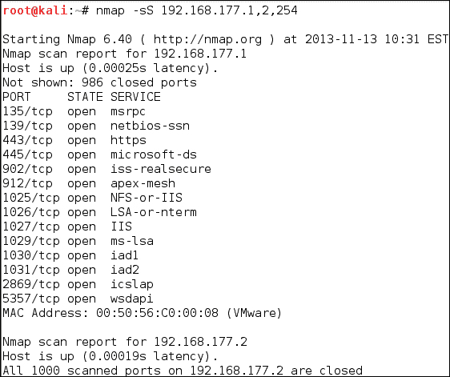
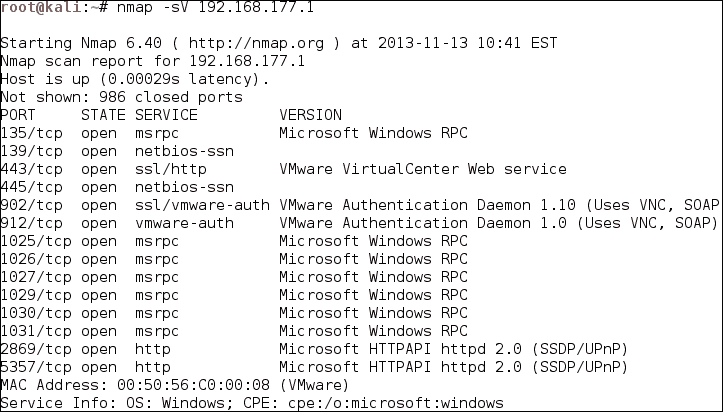
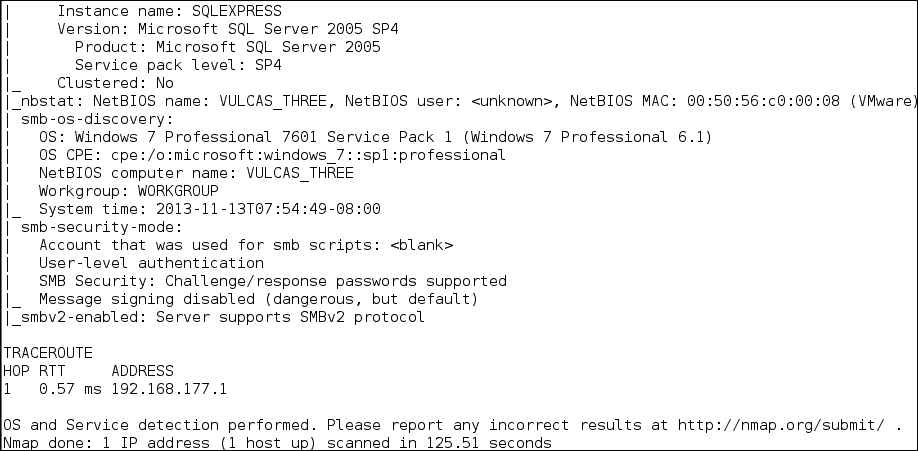
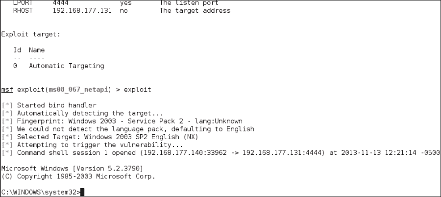
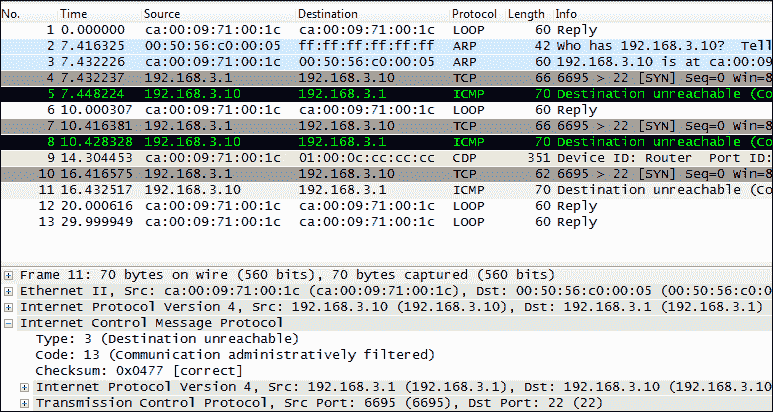

# 第一章：渗透测试简介

在本章中，我们将讨论渗透测试在专业安全测试框架中的作用。我们将讨论以下主题：

+   定义安全测试

+   一个抽象的安全测试方法论

+   关于渗透测试的神话和误解

如果您已经进行了一段时间的渗透测试，并且对专业安全测试的方法和概念非常熟悉，您可以跳过本章，或者只是粗略地看一下，但您可能会学到一些新东西，或者至少对渗透测试有不同的看法。我们将在本章建立一些基本概念。

# 安全测试

如果您询问 10 位顾问今天如何定义安全测试，您很可能会得到各种回答。如果我们参考维基百科，他们的定义是：

> “安全测试是一个确定信息系统是否按预期保护和维护功能的过程。”

在我看来，这是渗透测试中最重要的方面。安全是一个过程，而不是一个产品。我还想补充一点，它是一种方法论，而不是一个产品。

我们讨论的另一个组成部分是，安全测试考虑了安全模型的主要领域；以下是一个示例：

+   认证

+   授权

+   保密性

+   完整性

+   可用性

+   不可否认

在组织进行环境安全保护的过程中，每个组成部分都必须被考虑。每个领域本身都有许多子领域，在构建安全架构时也必须考虑到。重点是，当我们测试安全性时，我们必须处理这些领域中的每一个。

## 认证

需要注意的是，今天几乎所有的系统和/或网络都具有某种形式的认证，因此这通常是我们首先保护的领域。这可能是用户选择复杂密码或添加额外因素到认证中，比如令牌、生物特征或证书等。在今天的网络中，没有单一的认证因素被认为是安全的。

## 授权

授权的概念经常被忽视，因为它被假定为某些安全模型的组成部分。这是一种方法，但更倾向于在大多数测试模型中包含它。授权的概念是至关重要的，因为这是我们分配访问资源的权利和权限的方式，我们希望确保其安全性。授权允许我们在系统中存在不同类型的用户，并具有不同的特权级别。

## 保密性

保密性的概念是我们希望在计算机或网络上受到保护的东西是安全的，不会有被破坏的风险。由于今天运行互联网的协议（TCP/IP）是在 20 世纪 70 年代初开发的，这使得保密性变得更加困难。那时，互联网只在少数计算机上使用，现在互联网已经发展到今天的规模，而我们仍在使用那些早期的协议，这使得保密性变得更加困难。

需要注意的是，当开发人员创建协议时，网络规模很小，并且与潜在通信对象存在固有的信任感。这种信任感是我们今天从安全角度继续对抗的。从早期的创造中得出的概念是，当数据来自可靠来源时，你可以信任数据。我们知道现在互联网规模很大。然而，情况绝对不是这样。

## 完整性

完整性类似于保密性。在这里，我们关心的是信息的泄霎以及数据的准确性，以及它在传输过程中或从其原始形式中未被修改。一个常见的做法是使用哈希算法来验证文件是否未被篡改。

## 可用性

最难保护的之一是可用性，即在需要时拥有服务的权利。关于“可用性”的讽刺之处在于，当特定资源对一个用户可用时，它对所有用户都可用。从一个诚实/合法用户的角度来看，一切似乎都很完美；然而，并非所有用户都是诚实/合法的，因为资源是有限的，它们可能会被淹没或耗尽。因此，保护这一领域更加困难。

## 不可否认性

不可否认性声明声称发送者不能否认发送某物；因此，这是我通常遇到最困难的问题。我们知道计算机系统可以被/已经被多次篡改，欺骗的艺术也不是一个新概念。有了这些事实，声称“我们可以保证特定人员从特定计算机发送的传输的来源”并不完全准确。

由于我们不知道机器的状态，机器是否安全且未被篡改，这可能是一个准确的说法。然而，在今天的网络中提出这种说法将是一件非常困难的事情。

只需要一个被篡改的机器，那么“你可以保证发送者”的理论就不成立了。我们不会在这里详细介绍安全测试的每个组件，因为这超出了我们试图实现的范围。我们想在这一部分传达的观点是，安全测试是查看安全的每个组件并通过确定组织从中获得的风险量来解决它们的概念。

# 抽象测试方法

如前所述，当我们进行安全测试时，我们专注于一个过程并将其应用于我们的安全组件。为此，我们在这里描述了一个抽象的方法。我们将在第四章中详细介绍一些方法和它们的组件，*确定范围架构*，在那里我们将通过探索可用的测试参考来确定一种方法。

我们将定义我们的测试方法，包括以下步骤：

+   规划

+   非侵入式目标搜索

+   侵入式目标搜索

+   数据分析

+   报告

## 规划

这是专业测试的关键步骤，但不幸的是，这是很少被给予足够时间的步骤之一。有很多原因导致这种情况，然而，最常见的原因是预算。客户不愿意花很多时间让顾问规划他们的测试。事实上，由于这个原因，规划通常在合同中只占很小的一部分时间。另一个重要的规划注意事项是，潜在的对手会花很多时间在这上面。有两件事是测试人员应该告诉客户的，那就是有两件事是专业测试人员做不到的，而攻击者可以做到的，它们分别是：

+   六到九个月的规划

+   违法

我可能会违法，然后被监禁，但这不是我感兴趣的事情，因此我不会这样做。此外，作为一名持证黑客和持牌渗透测试人员，你必须遵守道德誓言，我不确定，但我相信在测试时违法是违反这个道德准则的。

## 非侵入式目标搜索

非侵入式目标搜索有许多名字。其中一些是开源情报、公共信息搜索和网络情报。无论你使用什么名字，它们都归结为同一件事，即使用公共资源来提取有关你正在研究的目标或公司的信息。有大量的工具可用于此。我们将简要讨论以下工具，以了解概念，那些不熟悉它们的人可以自行尝试：

+   NsLookup:

NsLookup 工具在我们遇到的大多数操作系统中都作为标准程序存在。这是一种查询 DNS 服务器以确定有关潜在目标信息的方法。它非常简单易用，并提供大量信息。在您的计算机上打开一个**命令提示符**窗口，输入`nslookup www.packt.net`。这将导致类似于下面屏幕截图所示的输出：

你可以在上面的屏幕截图中看到我们的命令的响应是**www.packt.net**域的 DNS 服务器的 IP 地址。你还可以看到他们的 DNS 配置了 IPv6 地址。如果我们正在测试这个站点，我们会进一步探索这一点。或者，我们也可以使用另一个名为**dig**的出色的 DNS 查找工具。现在，我们将把它留下，转到下一个资源。

+   Serversniff:

[www.serversniff.net](http://www.serversniff.net)网站有许多工具，我们可以用来收集关于潜在目标的信息。有关**IP**、**加密**、**域名服务器**、**Web 服务器**等工具。该站点的主页示例如下所示：

有许多工具我们可以展示，但我们只想简要介绍我们安全测试的每个领域的工具。打开一个**命令提示符**窗口，输入`tracert www.microsoft.com`。如果你使用的是 Microsoft Windows 操作系统，你会发现命令失败，如下面的屏幕截图所示：

阅读本书的大多数人可能知道为什么会被阻止，对于那些不知道的人，这是因为 Microsoft 已经阻止了 ICMP 协议，这是`tracert`命令默认使用的协议。很容易绕过这个问题，因为服务器正在运行服务，我们可以使用特定的协议来到达它，而在这种情况下，该协议是 TCP。转到 Serversniff 页面，导航到**IP 工具** | **TCP Traceroute**。然后，在**IP 地址**或**主机名框**字段中输入`www.microsoft.com`并进行 traceroute。你会看到现在它会成功，如下面的屏幕截图所示：

+   Way Back Machine ([www.archive.org](http://www.archive.org)):

这个网站证明了互联网上的任何东西都不会消失！有许多评估中，客户会告诉团队他们正在测试一个尚未投入生产的 Web 服务器，当他们被告知该站点已经被复制和存储时，他们会惊讶地知道这实际上是发生了的。我喜欢使用该站点下载一些我喜欢的演示文稿、工具等，这些东西已经从一个站点上删除，有时甚至该站点已经不存在了。例如，用于向学生展示隐写术概念的工具之一是*Infostego*。这个工具是由 Antiy Labs 发布的，它为学生提供了一个易于使用的工具来理解这些概念。如果你去他们的网站[www.antiy.net](http://www.antiy.net)，你会发现根本没有提到这个工具。事实上，在他们的任何页面中都找不到它。他们现在更专注于防病毒市场。他们网站的一部分如下图所示：

现在让我们利用**Way Back Machine**的力量来找到我们的软件。打开你选择的浏览器，输入`www.archive.org`。Way Back Machine 就托管在这里，这个站点的一个示例可以在下面的截图中看到：

如所示，在撰写本书时，有 3660 亿个页面被归档。在 URL 部分输入`www.antiy.net`，然后点击**浏览历史**。这将导致该站点搜索其存档以查找输入的 URL，几秒钟后，搜索结果将显示出来。下面的截图显示了一个示例：

我们知道我们不想访问最近归档的页面，所以为了安全起见，点击**2008**。这将导致显示日历，显示站点在**2008**年归档的所有日期。你可以选择任何一个你想要的。下面的截图显示了从 12 月 18 日归档的站点的示例。你可以看到*Infostego*工具是可用的，你甚至可以下载它！如果你愿意，可以随意下载并尝试使用这个工具。

+   Shodanhq：

Shodan 站点是我们可以使用的最强大的云扫描仪之一。你需要在该站点注册才能执行更高级的查询。强烈建议你在该站点注册，因为扫描仪的功能和你可以发现的信息相当令人印象深刻，特别是在注册后。登录后呈现的页面如下截图所示：

前面的截图显示了最近共享的搜索查询，以及已登录用户进行的最近搜索。如果你正在进行专业安全测试，这是另一个你应该深入探索的工具。现在，我们将看一个例子，然后继续，因为我们可以写一本完整的书来介绍这个工具。如果你以注册用户身份登录，你可以在搜索查询窗口中输入`iphone ru`。这将返回包含 iPhone 的页面，大部分在俄罗斯，但像任何工具一样，也会在其他站点上有一些命中。下面的截图显示了这次搜索的结果示例：

这次搜索的结果示例如下

## 侵入式目标搜索

侵入式目标搜索是开始真正的黑客活动的步骤。这是当你探测和探索目标网络的时候；因此，请确保你有明确书面的许可来进行这项活动。未经许可进行侵入式目标搜索是不允许的，因为这份书面授权是区分你和恶意黑客的唯一因素。没有它，你会被视为犯罪分子。

在这一步中，有一些组成部分进一步定义了方法论，如下所示：

+   查找活跃系统：

无论我们的技能有多好，我们都需要找到可以攻击的系统。这可以通过探测网络并寻找响应来实现。其中一个最流行的工具是由 Fyodor 编写的优秀的开源工具 nmap。你可以从[www.nmap.org](http://www.nmap.org)下载 nmap，或者你可以使用任何数量的工具包分发工具。我们将使用出色的渗透测试框架 Kali Linux。你可以从[www.kali.org](http://www.kali.org)下载这个发行版。

无论你使用哪个版本的 nmap，它们的命令语法都是相似的，如果不是完全相同的。在终端或命令提示符窗口（如果你在 Windows OS 上运行它）中，输入 `nmap –sP <插入网络 IP 地址>`。我们正在扫描的网络是 192.168.177.0/24 网络；你的可能会不同。这个 ping 扫描命令的示例显示在以下截图中：

我们现在有了网络上的实时系统，可以进一步调查。

+   发现开放端口：

与我们有实时系统的情况类似，我们接下来想看看这些机器上有什么开放。端口的一个很好的类比是门，也就是说，如果门是开着的，那么我可以走向这扇开着的门。一旦我到达门口，可能还有一些事情要做才能进入，但如果门是开着的，那么我知道可以进入，如果门是关着的，那么我知道我不能通过那扇门。端口也是一样的；如果它们关闭了，那么我们就不能通过那个门进入那台机器。我们有很多种方法来检查是否有任何开放的端口，我们将继续使用相同的主题并使用 nmap。我们已经确定了一些机器，所以不必像之前那样扫描整个网络。我们只扫描当前正在使用的机器。

另外，我们找到的其中一台机器是我们自己的机器；因此，我们不会扫描自己，虽然我们可以，但这不是最好的计划。我们网络上活跃的目标是 1、2 和 254。我们可以通过输入 `nmap –sS 192.168.177.1,2,254` 来扫描这些目标。对于那些想了解更多不同类型扫描的人，可以参考[`nmap.org/book/man-port-scanning-techniques.html`](http://nmap.org/book/man-port-scanning-techniques.html)。或者，你可以使用 `nmap –h` 选项来显示选项列表。扫描结果的第一部分显示在以下截图中：

+   发现服务：

我们现在有了在机器上运行的实时系统和开放端口。下一步是确定我们发现的这些端口上运行的是什么。必须确定机器上正在运行什么，以便在我们深入方法论时使用它。我们再次转向 nmap。在大多数命令和终端窗口中，都有历史记录可用。希望你也是这样，你可以用键盘的箭头键访问它。对于我们的网络，我们将输入 `nmap –sV 192.168.177.1`。根据我们之前的扫描，我们确定其他机器已关闭了所有扫描的端口；为了节省时间，我们将不再对它们进行扫描。这种扫描的示例可以在以下截图中看到：

这种扫描的示例可以看到

从结果中，你现在可以看到我们对目标上开放的端口有更多的信息。我们可以使用这些信息来使用我们之前介绍的一些工具在互联网上搜索，或者我们可以让一个工具为我们做这件事。

+   枚举：

这是提取有关潜在目标的更多信息的过程，包括操作系统、用户名、机器名称和其他我们可以发现的细节。nmap 的最新版本有一个脚本引擎，将尝试发现许多细节，并实际上对系统进行枚举。要使用 nmap 进行枚举，我们使用 `–A` 选项。在命令提示符中输入 `nmap –A 192.168.177.1`。提醒一下，如果你的目标地址与我们的不同，你将不得不输入你的目标地址。此外，这个扫描将需要一些时间来完成，并会在网络上产生大量的流量。如果你想要更新，你可以随时按空格键来获得更新。这个命令的输出非常广泛，所以以下截图显示了一个缩短版本：

正如截图所示，你对目标有大量的信息，并且已经准备好开始测试的下一个阶段。此外，我们已经正确识别了操作系统；在这一步之前我们还没有。

+   识别漏洞：

在我们完成了到这一点的步骤之后，我们获得了有关机器上正在运行的软件的服务和版本的信息。我们可以针对每个版本搜索互联网上的漏洞，或者我们可以使用工具。对于我们的目的，我们将选择后者。市场上有许多漏洞扫描工具，你选择的工具在很大程度上取决于个人偏好。商业工具大多具有比免费和开源工具更多的信息，因此你需要进行实验，看看你更喜欢哪一个。

我们将使用 Rapid7 的 Nexpose 漏洞扫描工具。他们的工具有一个社区版本，只能扫描有限数量的目标，但是值得一试。你可以从[www.rapid7.com](http://www.rapid7.com)下载 Nexpose。一旦你下载了它，你就必须注册并通过电子邮件接收一个密钥来激活它。我们将略过这些细节，让你自己去体验。Nexpose 有一个 Web 界面，所以一旦你安装并启动了工具，你就必须访问它。你可以通过输入`https://localhost:3780`来访问它。它似乎需要很长时间来初始化，但最终，它会呈现给你一个登录页面，如下截图所示：

登录所需的凭证应该在安装过程中创建。设置扫描是相当复杂的，因为我们只是详细介绍了这个过程，并且有一个很好的快速入门指南，所以我们将直接转到扫描的结果。随着书的进展，我们将有足够的时间来探索这个领域。典型扫描的结果如下截图所示：

典型扫描的结果如下所示

正如你所看到的，目标机器的情况很糟糕。Nexpose 的一个好处是，由于他们也拥有 metasploit；他们将列出在 metasploit 中已知的漏洞。

+   利用：

这是安全测试中备受关注的一步，简单来说，这是验证发现的漏洞的过程。需要注意的是，这并不是一个完全成功的过程，有些漏洞没有利用，有些漏洞只有针对某个补丁级别的操作系统才有利用。正如我们所说，这不是一门精确的科学，在现实中，这只是专业安全测试的一个非常小的部分，但它很有趣，所以我们将简要地看一下这个过程。我们在安全测试中还喜欢说，我们必须验证和核实工具向你报告的一切，这就是我们在利用中尝试做的。关键是你在客户的机器上执行了一段代码，这段代码可能会造成损害。最受欢迎的免费利用工具是 metasploit，现在由 Rapid7 拥有。关于这个工具有整整一本书的内容，所以我们只会展示运行工具和利用机器的结果。

可用的选项如下截图所示：

选项中有相当多的信息，但我们需要涵盖的选项是因为我们正在利用漏洞 MS08-067，这是服务器服务中的一个漏洞。这是一个很好的选项，因为它几乎总是有效的，你可以一次又一次地利用它。如果你想了解更多关于这个漏洞的信息，你可以在[`technet.microsoft.com/en-us/security/bulletin/ms08-067`](http://technet.microsoft.com/en-us/security/bulletin/ms08-067)上查看。选项设置好后，我们准备尝试利用漏洞，如下一张截图所示，我们成功地在目标机器上获得了一个 shell：

## 数据分析

数据分析经常被忽视，可能是一个耗时的过程。这是需要最多时间来开发的过程。大多数测试人员可以运行工具，进行手动测试和利用，但真正的挑战在于将所有结果进行分析。我们将在下一张截图中看一个例子。花点时间来审查 Wireskark 工具的协议分析捕获。作为分析师，你需要知道协议分析器正在向你展示什么。你知道到底发生了什么吗？不用担心，截图后我们会告诉你。花一分钟时间，看看你能否确定工具报告的是下一张截图中显示的数据包：

看看你能否确定工具报告的是显示的数据包

从前面的截图中，我们观察到 IP 地址为**192.168.3.10**的机器回复了一个类型为 3，代码为 13 的**ICMP**数据包。换句话说，数据包被拒绝是因为通信被行政过滤；此外，这告诉我们有一个路由器，并且它有一个阻止数据包的**访问控制列表**（**ACL**）。此外，这告诉我们管理员没有遵循最佳实践来吸收数据包，并且没有回复任何错误消息，因为那可能会帮助攻击者。这只是数据分析步骤的一个小例子；你将遇到许多事情，还有更多需要分析以确定在测试环境中发生了什么。记住，管理员越聪明，渗透测试就会变得更具挑战性。这对安全性来说实际上是一件好事！

## 报告

这是培训课程中经常被忽视的另一个测试领域。这是不幸的，因为这是你需要掌握的最重要的事情之一。你必须能够向客户呈现你的发现报告。这些发现将帮助他们改善他们的安全状况，如果他们喜欢这份报告，这通常是他们与合作伙伴和其他同事分享的内容。这是你与其他人的区别的广告。它展示了你不仅知道如何遵循专业测试的系统化过程和方法论，还知道如何将其转化为可以作为客户参考的输出形式。 

最终，作为专业的安全测试人员，我们希望帮助客户改善他们的安全状况，这就是报告的作用。有许多关于报告的参考资料，所以我们在这里要涵盖的是发现的处理。在处理发现时，我们使用了两个组件；第一个是以表格形式提供发现摘要，以便客户可以在报告的早期参考发现。第二个是详细的发现部分。这是我们放置有关发现的所有信息的地方。我们根据严重程度对其进行评级，并包括以下数据：

+   **描述**：这是我们提供漏洞描述的地方，具体描述了漏洞是什么以及受到了什么影响。

+   **分析/暴露**：对于这一部分，您希望向客户展示您已经进行了研究，而不仅仅是重复扫描工具告诉您的内容。非常重要的是，您要研究多种资源，并对漏洞是什么以及对客户站点构成的威胁进行良好的分析和解释。

+   **建议**：我们希望为客户提供一个可以帮助减轻这种漏洞风险的补丁的参考。我们从不告诉客户*不*使用它。我们不知道他们的政策是什么，这可能是他们必须要支持他们的业务。在这些情况下，作为顾问，我们的工作是推荐并帮助客户确定减轻风险或消除风险的最佳方式。当补丁不可用时，我们提供潜在的解决方法的参考。

+   **参考资料**：如果有微软公告编号、CVE 编号等参考资料，那么这就是我们放置它的地方。

# 渗透测试的神话和误解

在进行了二十多年的专业安全测试后，我发现很多人对渗透测试是什么感到困惑，这真是令人惊讶。我曾多次参加会议，客户坚信他们想要进行渗透测试。然而，当我准确解释了渗透测试是什么时，他们都震惊地看着我。那么，渗透测试到底是什么呢？还记得我们的抽象方法论中有一个侵入式目标搜索的步骤，而这一步骤的一部分是扫描的另一个方法论吗？嗯，扫描方法论的最后一项，也就是利用，就是渗透测试的标志性步骤。这一步就是漏洞验证，这就是渗透测试的定义。再次强调，这并不是大多数客户在引入团队时所想的。实际上，他们大多数想要的是漏洞评估。当您开始向他们解释您将在他们的系统和/或网络上运行一些利用代码和所有这些非常酷的东西时，他们通常会感到惊讶。大多数情况下，客户会要求您停在验证步骤。在某些情况下，他们会要求您证明您所发现的内容，然后您可能会展示验证。我曾经在一个外国国家的股票市场 IT 部门的会议上，当我解释我们将要进行的漏洞验证时，IT 主管的反应是“那是我的股票经纪人记录，如果我们丢失了它们，我们将损失很多钱！”。因此，我们没有在那次测试中执行验证步骤。

# 总结

在本章中，我们已经定义了安全测试与本书的关系，并确定了一个包括以下步骤的抽象方法论：规划、非侵入式目标搜索、侵入式目标搜索、数据分析和报告。更重要的是，当涉及到侵入式目标搜索时，我们扩展了抽象模型，并在其中定义了一种扫描方法论。这包括识别活动系统、查看开放端口、恢复服务、枚举、识别漏洞，最后是利用。

此外，我们讨论了渗透测试是什么，以及它是漏洞验证的一部分，并且在我们的扫描方法论中有一个步骤来识别它。不幸的是，大多数客户并不理解，当您验证漏洞时，需要运行可能会损坏机器甚至更糟的数据的代码。由于这个原因，大多数客户要求不要参与测试。在本章中，我们已经为渗透测试创建了一个基准，并将在本书中使用这个定义。在下一章中，我们将讨论选择虚拟环境的过程。
