# 第二章：选择虚拟环境

在本章中，我们将讨论可供选择的不同虚拟环境平台。我们将研究大多数主要的虚拟技术平台。我们将讨论以下主题：

+   商业环境

+   图像转换

+   从物理环境转换为虚拟环境

我们必须做的最具挑战性的事情之一是决定我们想要使用的虚拟化软件。我们不仅需要决定我们选择的软件要做什么，还需要决定我们是否要构建一个专用的虚拟平台，还是在现有系统上运行软件。在本书中，我们将专注于在现有系统上创建虚拟环境。然而，至少简要讨论创建裸金属环境的选项仍然很重要。

当我们安装裸金属环境（也称为虚拟环境的类型 1 安装）时，操作系统由产品以 Hypervisor 的形式提供。虽然这是创建强大和复杂架构的一种极其有用的方式，但它需要专用硬件，并且因此大部分时间我们无法随身携带。如果您在实验室环境中构建实验室，那么您绝对应该探索这一点，因为您在创建机器时拥有的功能和选项。

以下屏幕截图显示了类型 1 裸金属架构的示例：

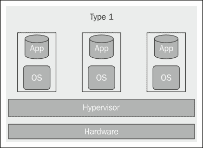

如前面的屏幕截图所示，在类型 1 或裸金属架构中，Hypervisor 安装在系统硬件中，并且虚拟化资源由 Hypervisor 提供。当您使用虚拟裸金属解决方案时，可以配置大量选项，包括资源分配。

类型 1 虚拟化在构建渗透测试实验室时提供了一个强大而极其有用的解决方案。然而，使其具有挑战性的一件事是操作系统已经由硬件中已安装的 Hypervisor 提供，这可能会对某些硬件版本造成挑战；此外，这种类型的解决方案大部分时间最好在台式机或服务器类型的机器上实施。虽然它可以在笔记本电脑上实施，但在其他平台上更常见。一个潜在的选择是创建您的实验室环境，然后远程访问它。从虚拟化的角度来看，它不会影响我们创建的机器；无论是类型 1 还是类型 2 都可以。在本书中，我们将使用类型 2 虚拟化。以下屏幕截图显示了类型 2 虚拟化的示例：

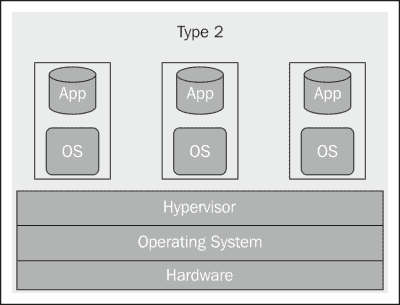

如图所示，在类型 2 虚拟化中，Hypervisor 运行在操作系统上，操作系统运行在系统硬件上。在本书的进展中，这是我们将使用的架构。现在，我们将研究类型 1 和类型 2 的解决方案。从第三章开始，*规划一个范围*，我们将专注于类型 2 解决方案。

# 开源和免费环境

有许多免费和开源的虚拟环境；我们将在这里看一些更受欢迎的。在本节中，我们将讨论以下产品：

+   VMware Player

+   VirtualBox

+   Xen

+   Hyper-V

+   vSphere Hypervisor

## VMware Player

VMware 团队创建了许多不同的免费产品。在撰写本书时，VMware Player 仍然可以免费使用，但不幸的是，只有家庭用户可以使用。过去的最大限制之一是您无法使用 VMware Player 构建和创建虚拟机。幸运的是，最新版本允许您创建虚拟机。当前版本的限制在网络部分；这是因为您无法使用 VMware Player 工具创建其他交换机。对于我们构建虚拟渗透测试实验室的目的，这是我们真正需要的东西，如果您决定使用它，那么您只能将 VMware Player 用于基本网络架构。它是免费的，这就是为什么我们要介绍它。您要做的第一件事是下载它。您可以从[`my.vmware.com/web/vmware/free#desktop_end_user_computing/vmware_player/6_0`](https://my.vmware.com/web/vmware/free#desktop_end_user_computing/vmware_player/6_0)下载它。下载后，您将需要通过注册网站来获取许可证密钥。一旦您获得密钥，您可以在安装期间或以后输入它，它将使您能够使用该工具。作为参考，用户指南是一个很好的来源，互联网上也有几个教程。再次强调，它在提供给我们的东西方面有限，但一个可行的解决方案是使用它来测试您构建的机器以及其他机器，而无需购买软件的另一个许可证。

## VirtualBox

Oracle VirtualBox 是一个非常强大的工具，是在选择虚拟化解决方案时最受欢迎的工具之一。它如此强大且免费，使其成为一个很好的选择。该工具在各种平台上表现良好，并提供桌面和企业级功能。撰写本书时的当前版本是 4.3.2；您可以从[`www.virtualbox.org/wiki/Downloads`](https://www.virtualbox.org/wiki/Downloads)下载它。有适用于 Windows、Mac、Linux 和 Solaris 的版本。关于 VirtualBox 3 版本的评论报告了一些问题，但自从 4 版本推出以来，就没有关于先前版本的问题的报告了。

由于它如此受欢迎且是一个可行的选择，我们将使用该工具创建虚拟机。如果您以前没有使用过 VirtualBox，则用户指南也非常有用。您可以从[`www.virtualbox.org/wiki/Documentation`](https://www.virtualbox.org/wiki/Documentation)下载它。

安装软件后，程序将自动启动，并且您应该看到类似于以下截图的屏幕：

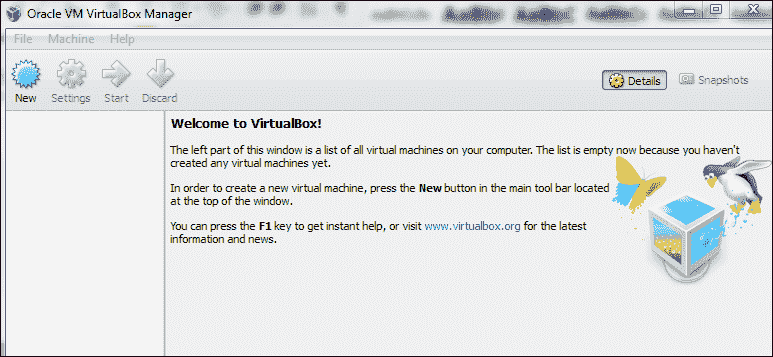

我们需要一个 ISO 镜像来用于我们的虚拟机。为此，我们将使用优秀的工具 Samurai Web 测试框架（WTF）。这是一个网络应用测试框架，是一个预先配置为 Web 渗透测试框架的 Linux 实时环境。CD 包含一些最好的开源和免费工具，用于测试和攻击网站。您可以从[`www.samurai-wtf.org/`](http://www.samurai-wtf.org/)下载 ISO 镜像。

要开始创建虚拟机，请单击“新建”以开始该过程。在打开以创建虚拟机的窗口中，在名称字段中输入`Samurai`，并选择 Linux 作为操作系统。然后，选择所需的版本，然后单击“下一步”。

在接下来弹出的窗口中，您将为虚拟机选择 RAM；您可以将设置保留在默认的 256 MB，也可以将其更改为最适合您的其他值。此窗口的示例如下截图所示：

我们接下来要做的事情是为我们的虚拟机创建一个硬盘，但出于我们的目的，我们不打算使用硬盘；因此，我们将选择**不添加虚拟硬盘**设置，并单击**创建**。您将收到有关创建没有硬盘的虚拟机的警告，但这没关系，因为这正是我们要做的。因此，请阅读警告并单击**继续**。

恭喜！如果一切顺利，你刚刚在 VirtualBox 中创建了一个虚拟机。现在你应该看到一个窗口显示你创建的虚拟机，它看起来类似于以下的截图：

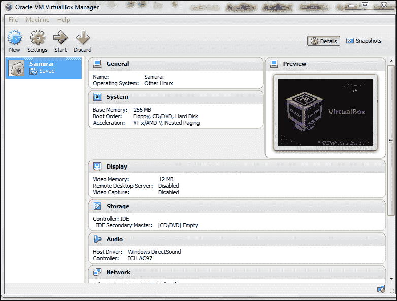

现在我们准备启动我们的虚拟机！单击**启动**设置并启动虚拟机。这时会收到一条消息，告诉你需要选择一个光盘映像进行引导，这就是我们下载的映像派上用场的地方。所以，我们现在就来做这个。在提示符下，导航到您下载的 ISO 映像并启动 Samurai-WTF 虚拟机。这就是使用 VirtualBox 的过程，我们将不再继续下去。欢迎你自己进行实验和练习。需要注意的一点是，有时候，对于某些机器，VirtualBox 软件可能会在键盘和输入方面出现困难。如果发生这种情况，建议您加载可以在[`www.virtualbox.org/wiki/Downloads`](https://www.virtualbox.org/wiki/Downloads)找到的扩展。这也是为什么 VirtualBox 不是本书选择的软件的原因之一。

## Xen

众所周知，i386 市场多年来一直被 VMware 提供的解决方案所主导，但随着时间的推移，市场上有很多解决方案不断增加其追随者的规模。这就是 Xen 的用武之地。它已经变得很受欢迎，并且随着人们对它的了解和产品的不断改进，它的受欢迎程度还在不断增加。如果你是 Xen 的新手，你可能会问这个问题：Xen 是什么？这是一个很好的问题，详细解释超出了本书的范围。有很多关于 Xen 的专著，所以我们只会在这里介绍基础知识。Xen 起源于英国剑桥大学。从那时起，Xen 游戏中有很多参与者，这增加了工具的功能和能力，进而增加了它的受欢迎程度。

一旦 Xen 项目起步，就像 IT 世界典型的情况一样，创始人成立了自己的公司，名为 XenSource，然后这家公司被 Citrix 收购。Citrix 扩展了这个项目，并将其作为与 VMware ESX 类似的解决方案提供。此外，其他供应商也将 Xen 纳入其产品供应商，如 Red Hat 和 Novell。

有关最新信息或下载 Xen，请参阅网站[www.citrix.com](http://www.citrix.com)。要获得非常好的教程，即在 SUSE Linux 机器上设置 Xen 的逐步指南，您可以参考网址[`searchservervirtualization.techtarget.com/tip/Xen-and-virtualization-Preparing-SUSE-Linux-Enterprise-Server-10-for-virtualization`](http://searchservervirtualization.techtarget.com/tip/Xen-and-virtualization-Preparing-SUSE-Linux-Enterprise-Server-10-for-virtualization)。请注意，阅读该文档需要免费注册，即提供您的电子邮件地址。这是值得的，因为他们会在新文章发布时发送链接，因此它成为一个不错的快速参考，以保持更新。

### 注意

我在大学本科时有一位教授给了我一些建议，我至今仍然遵循并推荐其他人也这样做：每天花一个小时阅读与 IT 行业相关的内容或做与之相关的事情。那些正在阅读本书的人可能知道 IT 行业处于不断变化的状态，数据是易逝的，因此我们必须做一些事情来保持其新鲜。对我来说，每天一个小时已经成为我生活的一部分超过 25 年，并帮助我保持更新。

最后，当我们结束这一部分关于 Xen 的内容时，我们构建复杂环境所需的一个功能是能够将一个格式转换为另一个格式。这是我们稍后将在本章中介绍的内容，但对于 Xen，我们将与您分享一个参考资料，详细解释了如何将 Xen 虚拟机转换为 Hyper-V 格式。您可以在[`technet.microsoft.com/en-us/library/hh427283.aspx`](http://technet.microsoft.com/en-us/library/hh427283.aspx)找到这些信息。您会注意到这个参考资料来自微软，您还会注意到这仅适用于特定版本的 Microsoft System Centre 软件，但知道这是可能的是很好的。因此，如果您曾经发现或拥有一个 Xen 虚拟机，并希望将其转换为 Hyper-V 以供使用，这是可能的。

## Hyper-V

这是微软的虚拟化工具，是他们虚拟 PC 产品的延续。虽然在虚拟化领域仍然相对较新，但微软正在迅速赶上。我发现他们的工具中一个缺乏的领域是与 Linux 和 Unix 上的桌面界面的网络和集成。一旦他们解决了这些问题，他们将成为您在进行渗透测试实验室时选择虚拟环境的严肃考虑对象。最初，Hyper-V 仅作为微软服务器产品的一部分提供，从 Windows Server 2008 开始，目前是 Windows Server 2012。

现在，有安装 Windows 8 的能力。微软做出这个决定是基于这样一个事实，即该工具在他们软件的服务器版本上如此受欢迎，他们希望扩展它，为客户在虚拟化方面提供更多选择。

Hyper-V 有两个主要要求。第一个要求是操作系统必须是 64 位。经常被忽视的第二个要求是机器中处理器的功能。Hyper-V 技术要求芯片支持**二级地址转换**（**SLAT**）。要在服务器以外的平台上运行 Hyper-V，您需要具备以下条件之一：

+   Windows 8 专业版

+   Windows 8 企业版

一旦您选择了您的平台，您可以将其添加为一个功能（如果您使用的是其中一个服务器），或者如果您选择了 Windows 8 平台之一，那么您可以从[`www.microsoft.com/en-us/download/details.aspx?id=36188`](http://www.microsoft.com/en-us/download/details.aspx?id=36188)下载 Hyper-V。微软将非服务器产品的 Hyper-V 版本称为客户端 Hyper-V。

无论平台如何，安装和配置都遵循相同的顺序。现在您有了 Hyper-V，我们将创建一个虚拟机，以便您可以通过创建一个虚拟机的过程来进行工作。使用 Hyper-V，我们必须设置一个网络，我们将连接到该网络。我们可以在开始时设置这个网络，也可以在创建虚拟机之后设置它。对于我们的目的，我们将在开始虚拟机创建过程之前创建网络。在基本架构中，我们需要两个网络，一个连接到外部世界（例如，互联网），第二个网络连接到内部机器。为简单起见，我们将它们称为**ExternalNet**和**InternalNet**。

你需要做的第一件事是为 DHCP 服务器定义一个`192.168.177.0/24`的 DHCP 范围。这是用于外部访问的网络，如果你要使用这台机器，实验室需要设置成这样。如果你使用的是服务器平台，设置网络的步骤如下：

1.  导航到**开始** | **管理工具** | **Hyper-V 管理器**。

1.  在 Hyper-V 的右窗格上点击**虚拟网络管理器**，**虚拟网络管理器**窗口将出现。

1.  在左窗格上选择**新建虚拟网络**，并选择**外部**作为网络类型，然后点击**添加**。如下面的屏幕截图所示：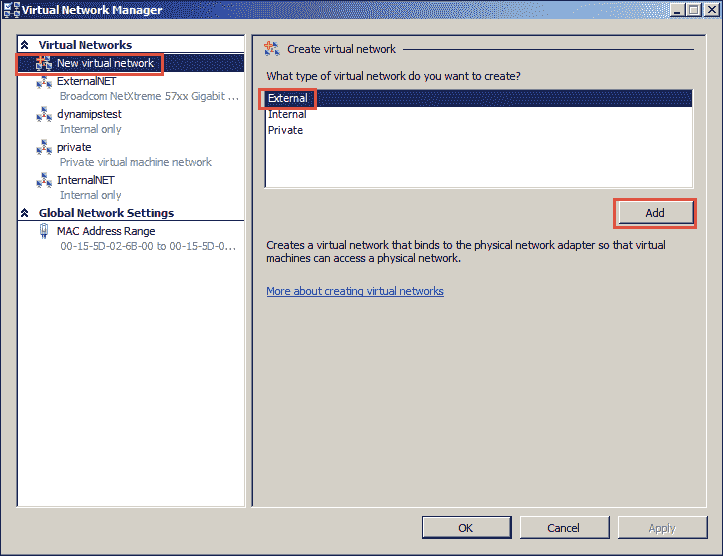

创建 InternalNet 的过程是相同的，所以我们不会在这里重复。我们将按照使用 Hyper-V 创建虚拟机的步骤，直到成功启动，然后我们将继续进行下一章。

你将需要一个 ISO 镜像，如果你有一个想要使用的，那就很好。我们将使用 Offensive Security Kali Linux 的流行渗透测试框架。你可以从[`www.kali.org/downloads/`](http://www.kali.org/downloads/)下载 ISO 镜像。一旦你打开这个链接，选择你想要使用的版本并下载它。一旦你下载了它，启动 Hyper-V。如果你使用的是服务器平台，步骤如下：

1.  导航到**开始** | **管理工具** | **Hyper-V 管理器**。

1.  当程序打开时，导航到**操作** | **新建** | **虚拟机**，当新的虚拟机向导打开时，点击**下一步**。

1.  为虚拟机输入一个名称，并点击**下一步**。在内存部分，输入你可以输入的最大 RAM，至少应该是 1024 KB。Kali 需要至少 1GB 的内存才能有效运行。一旦你输入了 RAM，点击**下一步**。

1.  这将带出网络连接选择；点击**未连接**，然后点击**下一步**两次。

1.  在安装选项窗口中，选择单选按钮**从引导 CD/DVD-ROM 安装操作系统**，然后选择镜像文件（ISO），并浏览到 Kali 镜像。参考下面的屏幕截图：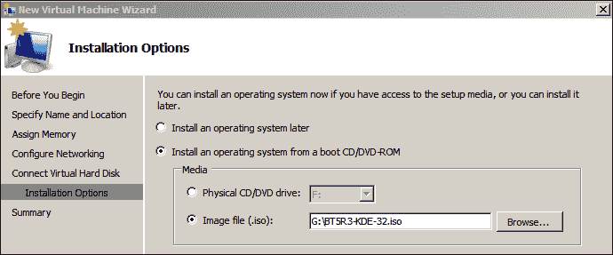

这是你参考的安装选项屏幕

1.  一旦你导航到 ISO 镜像，点击**下一步**。验证你的设置是否正确，然后点击**完成**。

1.  现在我们想要配置我们的网络适配器。在 Hyper-V 环境中，这可能是一个棘手的过程；所以，当你处理不是来自 Windows 家族的机器时，最安全的方法是选择传统的网卡。右键单击你创建的 Kali 虚拟机，选择**传统网络适配器**。然后，点击**添加**，如下面的屏幕截图所示：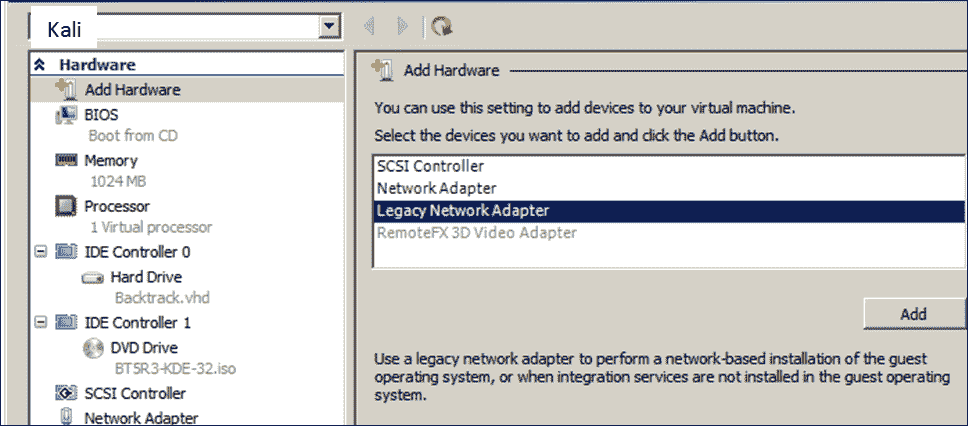

1.  现在我们已经选择了我们的网络适配器类型，我们必须将其连接到我们的网络。在下拉窗口中，选择**外部**网络，点击**应用**，然后点击**确定**。

1.  一个新的虚拟网络将出现在窗口的左侧。选择它，然后在窗口的右侧窗格中输入名称为`ExternalNet`。确保选择了**External**单选按钮，点击计算机的网络适配器，然后点击**应用**，如下面的屏幕截图所示：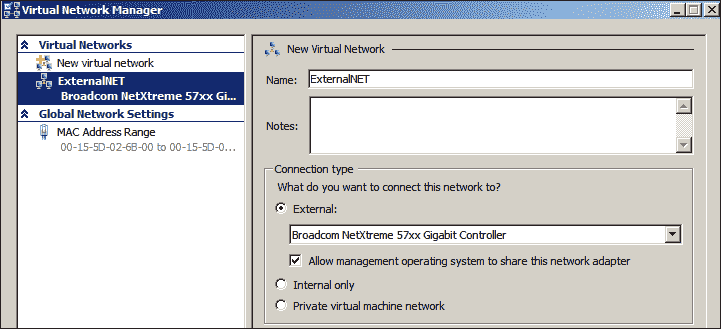

1.  如果你收到类似下一个屏幕截图的警告消息，点击**是**以清除它。这只是为了让你知道你可能会失去连接，并且必须重新输入静态网络配置数据，如果你失去了网络连接。

1.  如果你不想再被警告打扰，那么在点击**是**之前选择**请不要再次询问我**复选框，如下面的屏幕截图所示：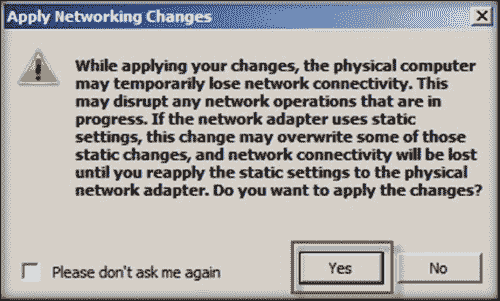

1.  我们现在准备启动我们的虚拟机。右键单击 Kali 虚拟机，然后选择**启动**。然后，再次右键单击并选择**连接**。您的虚拟机应该启动，并且您可以输入`startx`，这将启动环境。在这一点上，您可以自行决定要探索这个虚拟机多少。我们将继续本章，以便我们可以了解不同的虚拟化选项，并继续朝着更大更美好的事物前进。

## vSphere Hypervisor

这是商业实体的免费版本，这是您应该考虑用于实验室环境的东西。有一些版本可以在笔记本电脑上运行，并将其作为移动实验室环境的一部分，但在我看来，这不是充分利用这种类型 1 虚拟化解决方案的方式。

如前所述，类型 1 解决方案使 Hypervisor 运行在系统的实际硬件上。不需要模拟例程或与操作系统的交互；这是一个纯粹的裸机环境，在大多数情况下等同于原始动力。

虽然设置非常容易进行，大多数人可以在没有帮助的情况下完成，但 VMware 网站提供了出色的资源，以帮助您进行安装。您可以在以下网站上查看这些资源，包括如何执行设置的视频：

[`www.vmware.com/products/vsphere-hypervisor/gettingstarted.html`](http://www.vmware.com/products/vsphere-hypervisor/gettingstarted.html)

当您访问该网站时，您会发现 VMware 团队为您提供了大量参考资料，以帮助您安装、配置和部署他们的虚拟化解决方案。在这里要提到的最后一件事是网站上列出的硬件要求；其中大多数被认为是建议，最好在将其作为首选解决方案之前测试产品的硬件。这也是为什么我们不建议在移动或笔记本平台上使用该解决方案的另一个原因；在大多数情况下，笔记本电脑没有我们在裸机虚拟解决方案中想要的动力。

# 商业环境

与免费提供的一样，我们想在本书中讨论一些商业环境。我们将研究类型 1 和类型 2 的虚拟化解决方案。

## vSphere

这是与 VMware Hypervisor 讨论的功能的一个非常强大的延续；增加的功能和特性使得投资部署复杂和复杂的虚拟架构非常值得。该工具提供了许多超出免费变体的附加选项。这些选项如下：

+   跨多个物理主机汇集计算和存储资源

+   使用 VMware vCenter Server™对多个主机进行集中管理

+   提供改进的服务水平和运营效率

+   执行虚拟机的实时迁移

+   利用自动负载平衡、业务连续性和虚拟机的备份和恢复功能

如您所见，该工具有许多优化选项；但是，除非您正在构建一个复杂和精密的测试实验室，否则该工具超出了我们作为解决方案的需求。如果您发现自己在运行大型全球团队，那么这绝对是一个您应该考虑的选项，如果它在您的预算范围内的话。

## VMware Player Plus

截至目前，VMware Player Plus 是 VMware 团队的一个相对较新的产品。我们已经讨论过 VMware Player 工具。这个版本提供了额外的功能。该工具旨在通过允许您使用配置了您的桌面图像的虚拟机来提供托管桌面的能力。这样就不需要向客户或其他组织发送硬件。

VMware Player Plus 的另一个功能是可以用于运行由其他商业 VMware 产品创建的受限制的虚拟机。这意味着您可以对机器进行密码保护，如果用户没有密码，则无法运行该机器。以下是一个受密码保护的机器的示例截图：

在撰写本书时，该工具并不提供试用下载，但您可以从[`www.vmware.com/products/player/`](http://www.vmware.com/products/player/)了解更多信息。

## XenServer

Citrix 团队开发了一款强大的竞争对手，即 XenServer 解决方案，这在其 XenServer 产品中表现出来。他们声称他们是云和桌面解决方案的领先数据中心平台；此外，根据他们的说法，五大主机云中有四个是由 XenServer 托管的，这确实是一个大胆的说法。该产品可以提供解决方案的一些示例如下：

+   高度安全和灵活的网络结构

+   创建和委派权限

+   高可用性和负载平衡支持

与 vSphere 商业解决方案一样，这并不是我们构建实验室真正需要的东西，但对于那些想要使用除了 VMware 产品之外的东西的人来说，这是一个选择。您可以从[`www.citrix.com/products/xenserver/how-it-helps.html`](http://www.citrix.com/products/xenserver/how-it-helps.html)了解更多信息并进行下载。

## VMware Workstation

VMware 团队在虚拟化领域已经有一段时间了，当您使用他们的 Workstation 产品时就会显现出来。对我来说，将 VMware Workstation 与其他大多数设备相对无缝地集成是它脱颖而出的地方。虽然使用 VMware Workstation 是需要付费的，但成本相对较低，并且提供了强大的功能，可以创建非常多样化和复杂的架构。这绝对是我最喜欢的工具，我将在下一章和接下来的章节中继续使用它。正如我所提到的，微软的产品虽然只在市场上短短时间，但确实在不断改进，随着产品的成熟，这将是一场有趣的竞赛。这对我们来说是件好事！作为消费者，我们只会从这些供应商互相竞争中受益。

如前所述，强烈建议您考虑购买该软件。您可以从[`www.vmware.com/products/workstation/workstation-evaluation`](http://www.vmware.com/products/workstation/workstation-evaluation)下载最新版本的 VMware Workstation。与其他软件版本一样，您必须注册并获取密钥才能启动虚拟机。

下载后，您可以安装该软件，这非常简单。如果您有任何问题，VMware Workstation 用户指南写得很好，是您的绝佳参考。您也可以使用以下链接进行下载：

[`www.vmware.com/pdf/desktop/ws1001-using.pdf`](http://www.vmware.com/pdf/desktop/ws1001-using.pdf)

还有一个大型社区论坛，也是关于该工具的绝佳参考。支持是 VMware 继续在虚拟化的主要领域中领先的另一个原因。安装程序安装并打开后，您应该在屏幕上看到与以下截图类似的显示：

正如您在前面的屏幕截图中所看到的，我们有许多选项可供选择。由于我们之前使用过 ISO 映像，我们将继续这种趋势，并添加另一个任务来创建一个虚拟机。为简单起见，我们将使用之前使用过的 ISO Samurai WTF 映像，但您也可以下载您选择的 ISO 映像并从中创建机器。一旦您选择了要使用的 ISO 映像，我们就准备开始安装。要开始使用这个虚拟机，我们将执行以下步骤：

1.  点击**创建新的虚拟机**。这将启动新的虚拟机向导。接受**典型**的默认设置，然后点击**下一步**。

1.  在下一个窗口中，选择**安装程序光盘映像文件（iso）**的单选按钮，并浏览到 ISO 文件的位置。然后，点击**下一步**，如下图所示：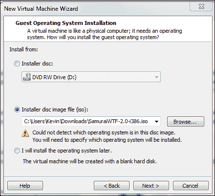

在上一个屏幕截图中，您可能注意到操作系统没有被自动检测到；因此，我们将不得不手动输入详细信息。如果它被检测到，向导在大部分情况下将会在用户不进行交互的情况下执行安装。

1.  在客户操作系统窗口中，选择**Linux**，在下拉菜单中，点击**其他** **Linux 2.6.x kernel**。一旦您做出选择，点击**下一步**。接受默认设置，然后点击**下一步**。

1.  在**指定磁盘容量**屏幕上，阅读有关分割磁盘的优缺点的信息。如果您希望更改默认设置，可以这样做，但对于大多数人来说，默认设置是可以接受的，除非您打算拥有大型机器。

1.  一旦您做出决定，点击**下一步**。这应该是最后一个屏幕；花点时间审查信息。然后，点击**完成**并创建您的虚拟机。您应该看到您创建的机器和机器配置信息，如下图所示：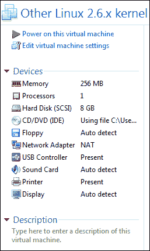

1.  唯一剩下的事情就是启动虚拟机。点击**启动此虚拟机**，您的机器将启动。

现在，我们将为本书中其他章节中将使用的机器创建一个虚拟机。我们将要使用的机器已经创建并以 VMware VMDK 文件格式作为虚拟机可用。我们将在本章后面更多地介绍虚拟硬盘的不同格式。我们想要从**Open Web Application Security Group**（**OWASP**）的[www.owasp.org](http://www.owasp.org)上下载 Broken Web Application Project 虚拟机。这个虚拟机由 Mandiant 赞助，是一个练习 Web 应用程序测试的绝佳教程。您可以从[`sourceforge.net/projects/owaspbwa/files/`](http://sourceforge.net/projects/owaspbwa/files/)下载 VM。

一旦 VM 下载完成，将 VM 提取到您机器上的一个文件夹。文件提取完成后，我们需要启动 VMware Workstation 并开始访问过程。以下是需要执行的步骤：

1.  点击**打开虚拟机**。导航到您提取文件的文件夹，并找到 Broken Web Application 项目 VM 的配置文件。

1.  一旦您找到文件，选择它并点击**打开**以打开文件。这将打开 VM，您应该在配置屏幕上，如下图所示：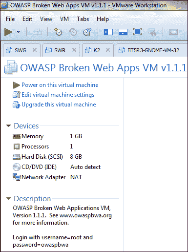

正如您在前面的屏幕截图中所看到的，VM 配置为在 NAT 接口上启动，并且我们将在启动 VM 时使用这个接口。在本节结束时，我们将看一下在 VM 环境中这个 NAT 接口的含义。

1.  现在我们要启动这台机器；点击**启动此虚拟机**，您的机器将启动。

1.  一旦机器启动，您将看到用于访问该机器的登录信息。我们可以在本地登录到机器，但实际上没有理由这样做。如果您想要检查机器或四处浏览，欢迎这样做，但出于我们的目的，我们将通过网络访问它。这是访问它的首选方式，因为它为我们提供了 VM 内的所有不同工具的图形用户界面。启动后显示状态的 VM 屏幕如下截图所示：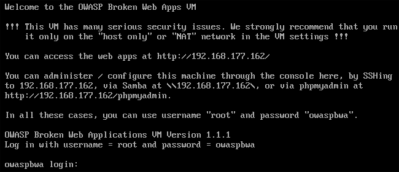

我们想要的信息是分配给 VM 的 IP 地址，以便我们可以访问并检查它！打开您选择的浏览器，输入显示的 IP 地址，并打开 Broken Web Application Project VM 的 Web 界面。向您展示的网页示例如下截图所示：

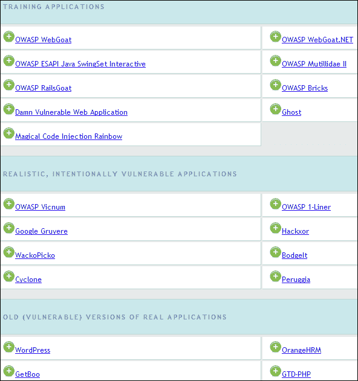

正如截图所示，这个 VM 分发中有许多工具，这是任何测试人员都可以从中受益的。这里包含的教程和应用程序允许用户练习他们的技能和在不同技能水平上设置的挑战。鼓励您在这里花费大量时间，并经常回来。我们将在整本书中根据情况使用它。再次感谢 Mandiant 的赞助，VM 增加了许多额外的挑战。阅读本书的一些人可能熟悉 OWASP 的优秀教程 Web Goat。这个项目只是这个教程的延伸，它还添加了 Irongeek 工具 Mutillidae。您可以在[`www.irongeek.com/i.php?page=mutillidae/mutillidae-deliberately-vulnerable-php-owasp-top-10`](http://www.irongeek.com/i.php?page=mutillidae/mutillidae-deliberately-vulnerable-php-owasp-top-10)上阅读更多关于 Mutillidae 的信息，甚至观看一些信息视频在[www.irongeek.com](http://www.irongeek.com)。

在我们继续本章之前，我们还有一个主题要讨论；那就是 VMware Workstation 内部网络的功能。这是我支付并继续支付 VMware Workstation 的主要原因之一。在您的 VMware Workstation 中，导航至**编辑** | **虚拟网络编辑器**。窗口打开后，您将看到 VMware 中配置的当前交换机。默认情况下，VMware 配置了三个虚拟交换机，它们是用于桥接接口的 Vmnet0，用于主机接口的 Vmnet1，以及用于 NAT 接口的 Vmnet8。我们不会在这里详细介绍，因为有很多来源可以让我们了解更多关于网络以及它们的含义，其中最好的之一就是我们在本章前面提到的 VMware Workstation 用户指南。VMware Workstation 的强大之处在于我们可以拥有多达 10 个虚拟交换机！这意味着我们可以有效地构建 10 个不同的网络段。VMware 网络配置允许我们设置所需的 IP 地址范围，并提供 DHCP 服务器。在大多数情况下，10 个已经足够了，而且在 10x 及更高版本中，我们现在可以在 Windows 和 Linux 主机上分别拥有 20 和 255 个网络段。这是非常多的网络！正是这一点以及其他因素使得它成为我们的首选软件。在构建分层和分段架构时，我们需要交换功能。我的机器上的网络配置示例如下截图所示：

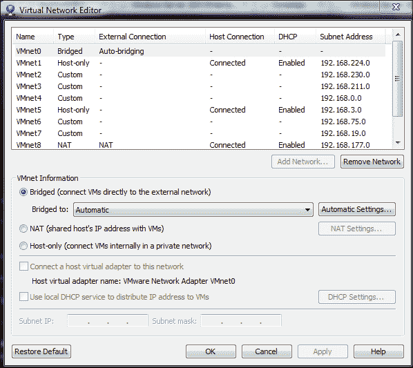

在上述截图中，您可以看到在我的机器上，大部分 10 个可能的网络都是可见的。我已经在一段时间内构建了许多复杂的架构，并添加了一个以上的自定义网络。

很可能您已经安装了软件提供的三个默认交换机。如果您想要查看该过程是如何进行的，可以随意添加一个交换机。这使我们能够构建一个真正的分层架构，模拟我们在参与中可能看到的情况。事实上，在测试中很少会出现单一段或扁平架构，尤其是在任何类型的外部测试中。因此，当我们构建和测试高级技术时，我们必须能够提供多层保护，以便我们可以通过或绕过某种方式来实现妥协。

# 图像转换

最近，我在为一个广泛使用虚拟环境的客户开发实验室时，被要求将虚拟机从 VMware 迁移到 Hyper-V。由于我对 Hyper-V 的经验很少，这是一个具有挑战性的任务，花了三周的时间才完成。满足感是生活中的一部分，当我们接受挑战并克服它们带来的障碍时，就能实现满足感。

此外，在 VMware 中完美运行的一些东西在 Hyper-V 中无法完成；其中一个无法运行的是路由器仿真软件。迁移的主要问题与虚拟硬盘格式有关。Hyper-V 需要 VHD，而 VMware 使用 VMDK 格式作为其虚拟机硬盘。为了克服图像转换的障碍，我在寻找一种可以帮助进行转换的工具。

幸运的是，这样的工具存在，而且是免费的！当您构建虚拟机时，如果您想使用另一个工具，或者更常见的是您有一个与您尝试使用的工具不匹配的格式，那么这个工具就非常适合您！我经常使用的工具是 Starwind Software 提供的 Starwind V2V Converter，可在[`www.starwindsoftware.com/`](http://www.starwindsoftware.com/)上获得。

这里需要注意的一点是：根据我的经验，该工具并不完美，但它已经成功将大多数 VMDK 文件转换为 Hyper-V 的 VHD 格式，没有任何问题。唯一在转换过程中出现问题并在 Hyper-V 上运行的操作系统是“FreeBSD”。讽刺的是，版本 9x 之前的 FreeBSD 似乎可以正常工作。

您可以从[`www.starwindsoftware.com/converter`](http://www.starwindsoftware.com/converter)下载该软件。请注意，您需要注册，并且该应用程序在 Windows 上运行。下载软件后，安装并运行程序。这是一个易于使用的工具；您可以通过导航到文件图像来选择要转换的文件。随后，该工具将显示格式输出的选项。以下是一个示例截图：

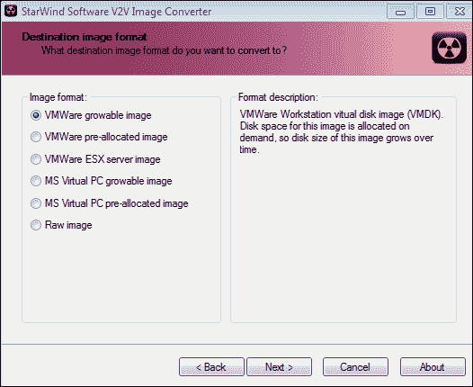

选择输出格式后，转换过程将开始运行，一旦完成，您只需要按照之前涵盖的步骤进行所选工具的操作。正如讨论过的，该工具运行非常好，节省了大量时间，并且可以选择任何您喜欢的平台来构建渗透测试环境。

# 从物理到虚拟环境的转换

在许多工具中，用于帮助我们创建机器的另一个选项是物理到虚拟功能，有时被称为 P2V 概念；此外，这为我们提供了构建任何机器的能力，运行转换过程以将物理机器转换为虚拟机。这种功能允许您构建自定义的渗透测试平台机器，然后执行转换并将机器带到您在外面的任何地方。我们将讨论几种选项。有一个免费选项，由 VMware 提供，称为 vCenter Converter。使用这个工具，你不仅可以转换物理的 Windows 机器，还可以转换 Linux 机器。要尝试一下并看看它的效果如何，你可以从[`www.vmware.com/products/converter/`](http://www.vmware.com/products/converter/)下载它。我们还有另一个选项，即使用我们的 VMware Workstation 安装中的功能。这是我们的首选选项。如果你打开软件，你会看到有一个选项可以将物理机器转换为虚拟机，这个选项叫做**虚拟化物理机器…**。请注意，在 VMware Workstation 中首次选择该选项时，你将需要安装转换器，如下面的截图所示：

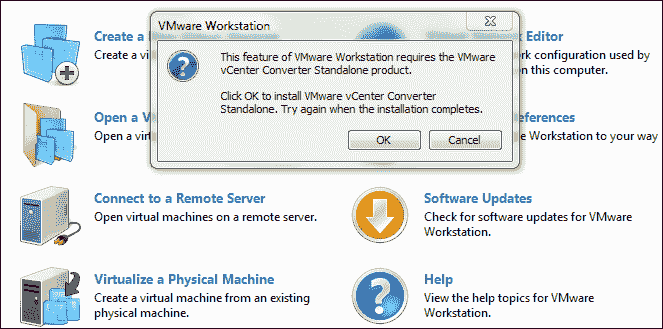

# 总结

在本章中，我们讨论了不同类型的虚拟化，其中类型 1，也称为裸机虚拟化，提供了可以直接访问和安装在硬件中的 Hypervisor，而类型 2，在操作系统中安装了 Hypervisor。类型 1 解决方案的优势之一是直接安装在硬件中的 Hypervisor 提供了更好的性能；这种解决方案的缺点是硬件必须与产品的 Hypervisor 集成，并且您必须确保它确实如此。

我们研究了可能的不同开源虚拟化方案，并在多种工具中安装、配置基本设置和创建了虚拟机。我们下载并使用 ISO 镜像来创建我们的虚拟机，并在创建后启动了该机器。此外，我们下载了 OWASP Broken Web Application Project 虚拟机，并使用现有配置来运行该机器。

我们还研究了一些商业虚拟化方案，并在这里解释了为什么我们将从现在开始使用虚拟化产品 VMware Workstation。此外，我们还讨论了 XenServer 和 vSphere 产品的强大功能。

我们面临的挑战之一是使用不同的虚拟化方案来处理旧的和现有的机器，因此我们讨论了 Starwind Software 团队的一个工具，可以用来将 VMDK 转换为 VHD 文件和 VHD 转换为 VMDK 文件，除了一些例外，转换效果非常好。

我们在本章中总结了 P2V 的概念，即物理到虚拟转换，这为我们提供了一种将现有或新的物理机器转换为虚拟机的方法。在下一章中，我们将探讨规划和构建我们的范围的挑战。
