# 第三章：规划一个范围

在本章中，我们将开始规划测试环境所需的过程。我们将讨论搜索和发现要测试的漏洞，并为测试一种漏洞创建实验室环境。我们将讨论以下内容：

+   规划

+   识别漏洞

本章将为我们提供一个明确定义的架构，以构建和支持我们必须执行的测试类型。

# 规划

完成的一个重要步骤是规划；还将讨论我们试图实现的概念以及我们将如何实现它。这是许多人没有花足够时间的领域之一。正如我们在第一章中讨论的那样，*介绍渗透测试*，我们不能像潜在的攻击者那样花费六到九个月来规划我们的抽象方法。话虽如此，我们可以花费大量时间规划我们想要为我们的高级渗透测试实验室构建的架构。因此，我们将从计划中得到什么开始。我们将讨论的计划包括以下部分。

## 我们试图实现什么？

我们试图测试一个 Web 应用程序、一个应用程序、一个设备，还是其他什么？这是我们开始确定我们的虚拟化环境将需要什么的地方；此外，我们还确定了我们将如何配置和构建所需的组件。

## 我们必须在什么时候完成？

这一步是我们定义我们尝试创建的时间框架。在这个领域，有一个明确定义的时间表是很重要的；否则，我们可能会继续建设，而没有设定的结果。虽然一些不一致或未知是过程的一部分，但我们定义时间的越好，我们就会更加高效。这就像目标设定；如果你设定了目标，但从未指定时间框架，那么这就不是一个明确定义的目标。

当您阅读本文时，您可能会想知道目标设置是如何出现在这些页面中的。对于那些好奇的人，我将提供一个例子。在为客户的培训课程开发实验室时，我试图创建和构建一个非常有效的思科路由器仿真能力。由于我没有决定尝试的次数，更重要的是，这项活动的时间框架，导致了三天的徒劳活动。我将在本章后面介绍这一点，并提供如何在本章后面构建您自己的步骤。

课程所需的虚拟平台将是 Hyper-V。我在 VMware 环境中使用了这个解决方案超过五年，但无论我如何努力，在我开始在 Hyper-V 中构建平台时，它都不起作用。我首先尝试使用 Starwind 软件转换我的一个虚拟机 VMDK 文件，但没有成功。网络无法与路由器仿真器通信，也无法与主机通信。因此，简而言之，没有连接性。然后我从头开始构建虚拟机，以为这样可能会起作用，但也没有成功。我花了三天时间，阅读每一篇博客文章、白皮书或任何我能找到的东西。一个更好的计划应该是给它一天的时间，或者限制尝试的次数，但当我开始计划时，我没有给它任何时间表，因此花了我三天的时间。我现在与您分享这一点，希望您不会犯我犯过的同样错误。

量化和跟踪计划的一个好方法是使用时间表或项目工具的形式。有几种可用的方法，但超出了本书的范围。你使用哪种并不重要。如果你像我一样，你可能想使用一个简单的，而不必学习另一个程序。所以，我使用的是 Microsoft Outlook 中的日历。你们中的一些人可能使用 Microsoft Project；那很好，使用适合你的任何工具。我相信大多数人，如果不是全部人，在某个时候都使用过邮件程序，如果邮件程序中有这个功能，那就值得探索一下。

我们来看一个例子。我将任务和事件组件结合在一起使用，所以如果你启动你的 Microsoft Outlook 程序，你可以在菜单的顶部点击**新建项目**。这将带出创建新项目的菜单。以下是一个示例截图：

在 Outlook 中创建新项目的菜单（裁剪的文本不重要）

我们想创建一个新任务；为此，我们点击**任务**选项，这将打开一个新菜单，如下截图所示：

单击任务选项后的菜单屏幕（裁剪的文本不重要）

从这一点开始，创建任务并跟踪它们是一个相对简单的过程；此外，你可以随时参考你的任务列表，看看还有哪些任务没有完成。在规划网络架构时，我们鼓励你使用任务和事件。我们将在本书中为你提供逐步的过程来构建你的环境，但当你偏离本书之外时，你可能会遇到像创建路由器仿真这样的挑战。当你遇到这种情况时，你需要计划可能的时间延迟和其他意外情况。你在规划阶段花费的时间越多，你在后期开发阶段遇到的障碍就越少。

# 识别漏洞

由于我们已经将渗透测试定义为漏洞的验证和确认，这是我们在准备建立渗透测试实验室时的主要关注点之一。我们必须找到可以利用的漏洞，以便在工作范围允许的情况下获取访问权限。你将花费大部分时间在准备阶段，试图找到能够提供我们所需访问权限并且可靠的漏洞。

要记住的重要一点是，所有系统都会有漏洞，但并非所有漏洞都会有利用。很多时候你会发现有漏洞，但你的搜索找不到针对那个漏洞的利用；此外，你可能会找到一个利用，但它对你的目标不起作用。这是因为，正如我们喜欢说的那样，利用并非百分之百。经常情况下，你会做对一切，但利用就是失败！欢迎来到渗透测试的真实世界。

在我们查找漏洞的一些位置信息之前，我们将讨论我们想要了解的潜在漏洞的一些事情，我们将用来利用的漏洞。我们想要了解以下一些，如果不是全部，关于可利用性的方面：

+   访问向量

我们需要在本地机器上，本地子网上，还是远程从任何位置上？

+   复杂性

利用是否需要编写代码，将不同组件链接在一起，或者我们必须做一些额外的工作才能成功利用漏洞？

+   认证

是否需要认证，或者我们可以在没有凭证的情况下利用漏洞？如果需要认证，我们需要做什么来突破认证？我们可以暴力破解吗，字典攻击，或者有默认密码吗？

这只是我们在开始研究脆弱性特征时可能要考虑的一小部分样本。以下屏幕截图显示了使用**通用漏洞评分系统**（**CVSS**）的示例：

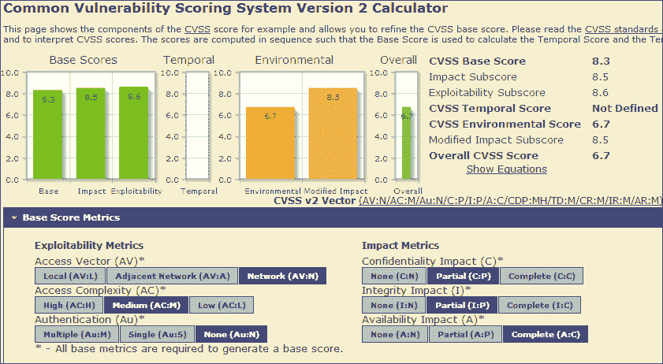

通用漏洞评分系统参考表（裁剪的文本不重要）

识别漏洞是我们初始阶段的关键部分；我们必须找到漏洞才能进行渗透测试。你们中的一些人可能会认为我们可以随意启动我们选择的漏洞扫描器，然后让扫描器告诉我们那里存在什么漏洞；此外，你们可能会认为你可以让一个利用框架来协助。虽然这一切都是真的，但这不是我们试图实现的范围和重点。记住，我们想要构建渗透测试实验室环境，为此我们需要找到要利用的漏洞；此外，我们需要在进行实际测试之前发现这些漏洞。在这一部分，关键是找到我们想要在实验室架构中测试的漏洞，相应地，我们将记录利用该漏洞和获得访问权限的步骤和要求。我们这样做是为了当我们遇到它时，我们知道会发生什么。

一个微妙但非常重要的概念是，我们可以构建任何可能的环境，但我们必须根据我们想要实现的目标来构建环境。例如，Microsoft Internet Explorer 中存在许多漏洞；其中大多数与内存问题有关，这些被称为**Use after Free**漏洞。此外，这是一个我们在渗透测试中很可能会遇到的软件。因此，我们迫切需要跟踪和关注 Internet Explorer 上的漏洞，这也是我们对可能遇到的所有软件和硬件采取的方法。

一种常见的方法，也是我们推荐的方法，是跟踪在商业领域非常流行的产品的漏洞。我们已经提到了 Internet Explorer；其他要跟踪的产品包括思科、红帽、甲骨文、Adobe 等等。这就是专业安全测试的力量；我们知道所有这些供应商以及其他许多供应商都可能存在漏洞，所以一旦我们发现任何一个漏洞，我们就可以开始利用它来获得一些形式的访问权限。该过程包括获取漏洞的详细信息，然后构建实验室以测试和实验漏洞。因此，如果我们有一个 Internet Explorer 漏洞，我们将创建一个安装了易受攻击软件的计算机，然后我们将开始系统地利用该漏洞来获得某种形式的访问权限。这里要强调的另一点是，我们并不总是需要运行利用代码或执行某种形式的利用来获得访问权限。通常，我们会发现另一个弱点，比如服务上的默认密码，这将允许我们获得我们需要的访问权限。所有这些将在适当的时候讨论，但现在我们必须研究获取漏洞信息的技术。

## 漏洞网站

与互联网上的大多数事物一样，漏洞报告站点比我们能够跟踪的要多。因此，建议的方法是选择几个站点，然后通过定期检查来保持一致性。或者，你可以订阅一个服务，它会发送给你定制的漏洞列表。然而，作为一名专业的安全测试人员，我们没有设置可以跟踪的系统、服务和/或网络的奢侈。然而，我们可以维护一个我们可能会遇到的流行软件和系统的概要，但这又是一个试错的过程。我和我的学员们实践的方法是经常访问三到四个站点，并保持一贯的访问；这就是我们跟踪公共领域最新信息的方式。你还应该注意供应商的补丁发布日期，并跟踪它们。为了证明这是多么艰巨的任务，我们将进行一个实验；打开你最喜欢的搜索引擎，搜索漏洞站点。

在 Microsoft 的 Bing 中进行此搜索的示例如下截图：

在 Microsoft 的 Bing 上搜索漏洞站点（裁剪的文本不重要）

正如前面的截图所示，这些术语有超过 1000 万次点击。现在，正如你们许多人可能已经意识到的那样，我们进行的搜索并不是一个狭窄和精确的搜索；我们可以输入`漏洞 + 站点`来返回这两个词在结果中的匹配。此外，我们可以使用漏洞站点来使结果精确匹配。我们在这里不会这样做，但这是你可以做的事情，可以得到更精细的结果，并节省一些时间。

当我们审查结果时，我们看到列表的顶部是国家漏洞数据库，这是我们喜欢使用的数据库之一。因此，在浏览器中输入[`nvd.nist.gov`](http://nvd.nist.gov)。一旦网站打开，查看漏洞信息；在主页的左上角，点击**漏洞**。

这将带出漏洞的搜索界面；从这里开始，只需要输入你的搜索参数并查看结果。这个搜索页面在以下截图中显示：

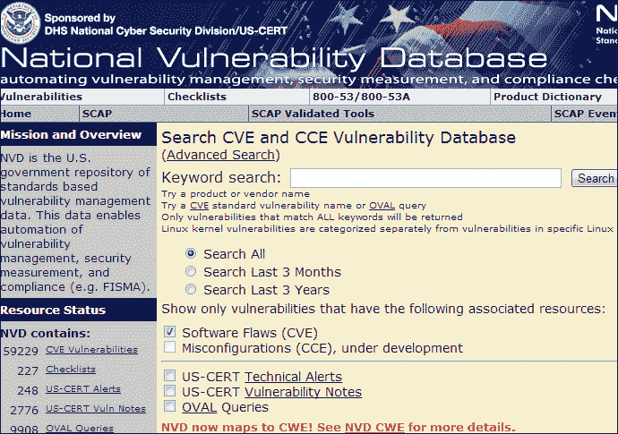

漏洞搜索界面（裁剪的文本不重要）

正如你所看到的，有许多我们可以搜索的内容。另一个功能是搜索特定的时间范围，如果你只是想要最近的列表，这将是有益的。

例如，在关键字搜索栏中输入`Adobe`，然后点击**搜索**。这将返回 Adobe 的漏洞，并且由于它是一个流行的程序，总是有攻击者试图利用它。此外，它为我们提供了跨平台利用的能力，这是我们在测试时喜欢看到的另一个特性。

在以下截图中显示了此搜索的示例：

显示返回 Adobe 漏洞的屏幕（裁剪的文本不重要）

这就是我们喜欢看到的！在前面的截图中，当我们看到 CVSS 严重性时，7 表示它是一个高漏洞，而 10 表示它不能更严重，因为它是最大的严重性。正如你所看到的，在这次搜索时返回了 997 个结果。这是因为 Adobe 是一个频繁的目标，因此继续受到攻击者的攻击。

下一步是进一步研究漏洞，并了解漏洞的特征以及找到利用漏洞的方法。由于这是一种客户端软件类型的漏洞，这意味着我们将不得不进行某种欺骗，让用户访问某个网站或点击某个东西。目前，我们对这个网站的主要意图已经有了了解，我们将继续前往另一个网站。鼓励您随时探索该网站，了解更多信息。

您可能已经注意到我们必须输入信息才能显示漏洞；这可能不太理想，所以我们现在将去查看我们的第一个提供最新漏洞列表的网站。

返回到国家漏洞数据库网站的主页，然后在页面的左侧中间位置找到附加链接；找到并点击**US-CERT Vuln notes**。这将显示来自 US-CERT 团队的漏洞注释。这方面的一个例子如下截图所示：

屏幕显示了美国计算机应急响应小组（US-CERT）团队的漏洞注释（裁剪的文本不重要）

我们现在有一个漏洞列表，它为我们提供了一个可以用作参考的时间表。有一个列表使得这个列表成为一个一站式服务；我们可以查看最新信息并继续前进，这是我们从我们选择的前三到四个网站中想要的。此外，我们仍然可以参考更多的网站，但我们使用选择的三到四个网站来获取更新，然后当我们发现感兴趣的内容时，我们可以查看其他网站并了解他们对漏洞的描述。

我们希望能够进一步探索我们的漏洞，所以我们现在将以一个例子来做到这一点。当我们查看上一个屏幕截图中的漏洞清单时，我们看到了一个关于思科的漏洞。由于我们喜欢及时了解这些受欢迎产品的最新信息，其中包括思科，我们将进一步探索。请随意使用您的结果中的漏洞，或者查看我们在 2013 年 11 月 12 日的结果中的思科数据。

当我们点击漏洞后，另一页将打开，显示有关漏洞的额外详细信息。我们看到这是一个输入验证问题，这是我们经常看到的问题。程序员在开发应用程序时没有很好地对其输入进行消毒。漏洞的详细信息示例如下截图所示：

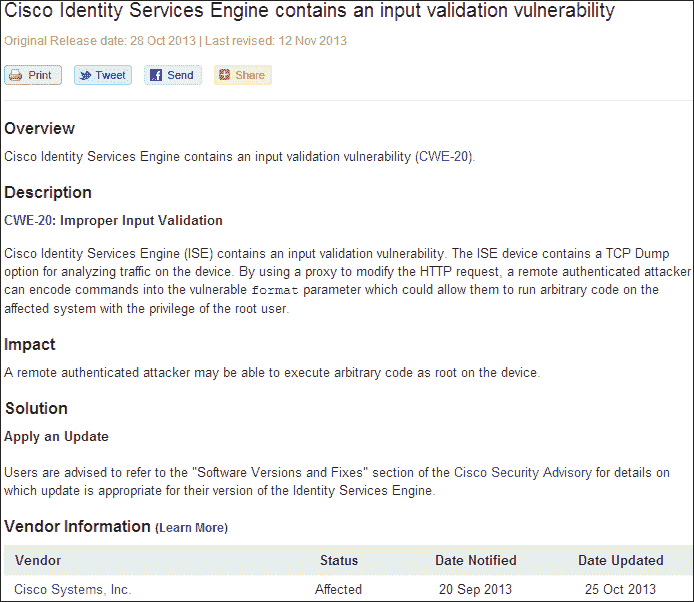

屏幕显示了漏洞的详细信息（裁剪的文本不重要）

当我们审查漏洞详细信息时，我们可以开始制定我们将如何构建一个测试环境的计划。在某些情况下，我们可能需要额外的硬件。这里的主要观点是理解这个过程，一旦你理解了，你就可以从那里开始。过程不会改变，只有漏洞会改变。

当您审查漏洞的详细信息时，您可能会注意到有一个名为**通用弱点枚举**（**CWE**）的项目，在这种情况下是**CWE-20**。这个 CWE 是一个标识符，就像我们喜欢从 Mitre 团队使用的其他标准一样，它可以帮助我们获得有关弱点的额外信息。更重要的是，它为我们提供了一个标准术语来搜索，就像**通用漏洞和暴露**（**CVE**）编号一样。

如果我们选择漏洞的 CWE 编号，它将为我们提供有关漏洞的额外详细信息。这方面的一个例子如下截图所示：

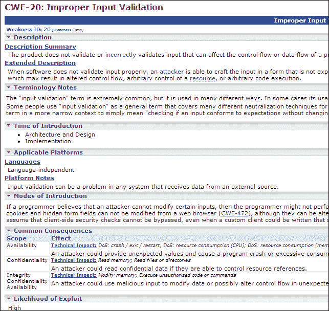

屏幕显示了有关漏洞的一些额外详细信息（裁剪的文本不重要）

当您审查信息时，我们的漏洞有许多额外的细节，因此它为我们的规划和测试目的提供了更多的数据。我们想要看的一件事是有一个区域标识了利用的可能性，正如我们从前面的截图中看到的那样，在**High**漏洞的情况下，这正是我们要找的。再次，有许多网站可供参考，因此您可以使用我们在整本书中展示的网站，或者您可以自行研究。在我们查看这两个网站时，我们没有找到更多有关利用方面的信息；这是我们想要的，因此我们现在将查看提供此信息的网站。

我们将要查看的下一个网站是我们搜索结果返回的第二名的**Security Focus**网站。打开您选择的浏览器，输入[`www.securityfocus.com`](http://www.securityfocus.com)。这将带您到 Security Focus 的主页；以下是此的一个示例截图：

显示 Security Focus 主页的屏幕（裁剪的文本不重要）

正如前面的截图所示，当我们进行这次搜索时，Mozilla 度过了糟糕的一天。我们喜欢**Security Focus**网站的一点是他们为我们提供了许多我们认为有用的额外细节，其中之一就是有关利用的信息。选择主页上列出的一个漏洞。**Mozilla Firefox/Thunderbird/SeaMonkey JavaScript Engine Multiple Buffer Overflow Vulnerabilities**的漏洞示例显示在以下截图中：

显示 Mozilla Firefox/Thunderbird/SeaMonkey JavaScript Engine Multiple Buffer Overflow Vulnerabilities 的漏洞（裁剪的文本不重要）

当您查看漏洞详细信息时，您会发现有许多我们感兴趣的标签，主要是**exploit**标签。如果有关于野外利用的信息，这将潜在地为我们提供有关漏洞的可利用性的信息。由于这些漏洞基本上是新的，因此没有任何利用的信息。但它仍然是一个很好的参考，因为它为我们提供了有关漏洞的额外细节。我们可以在我们的测试中使用的 Nagios 漏洞的一个示例显示在以下截图中，以提供有关读取利用信息的参考：

现在我们可以开始了，因为我们有了用于利用漏洞的字符串，只是建立实验室并进行测试的问题。这一切都需要时间，现在我们将继续审查不同的网站，以用作潜在的参考。随着我们追求漏洞，漏洞越新越好。这是因为很可能还没有为漏洞编写签名来检测它；此外，如果它是一个零日漏洞，那么它在公开上是未知的，这使得它是理想的。我们有几个网站可以提供有关零日漏洞的信息，我们将首先查看的是该网站的零日追踪器。在您的浏览器中，输入[`www.eeye.com/Resources/Security-Center/Research/Zero-Day-Tracker`](http://www.eeye.com/Resources/Security-Center/Research/Zero-Day-Tracker)。以下是该网站的一部分截图：

网站的一部分[`www.eeye.com/Resources/Security-Center/Research/Zero-Day-Tracker`](http://www.eeye.com/Resources/Security-Center/Research/Zero-Day-Tracker)（裁剪的文本不重要）

您可以看到访问该网站后，它专门致力于零日发现。这是我们讨论过的我们想要在研究中做的事情，这个网站为我们提供了一个很好的参考。因此，让我们进一步探索列表。选择一个漏洞并查看更多详细信息。更多详细信息的示例如下截图所示：

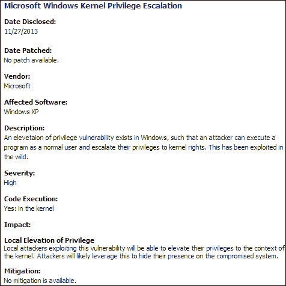

在您审查截图时，有许多漏洞的特征我们需要更仔细地查看。我们看到目前没有可用的缓解措施。这意味着在此披露时无法进行防御。这使得它成为我们工具箱的理想补充。您会注意到它影响了 Windows XP 机器，这很好地说明了为什么微软继续努力消除它在行业中的存在。这个操作系统相当陈旧，确实需要被替换；问题在于它长期以来一直是一个值得信赖的操作系统，人们，包括我在内，一直很喜欢使用它。然而，微软已经宣布不再支持它。因此，从我们的测试角度来看，如果有漏洞被发布，这意味着将永远不会有补丁，因此漏洞将永远存在。

安全社区中的许多人认为，有许多 Windows XP 的漏洞一直被攻击者憋着，等待 Windows XP 的生命周期结束。这是因为一旦不再受支持，那么任何发布的漏洞都将成为攻击者利用的理想对象，相应地，也适用于我们在测试中使用。

您还会从屏幕截图中注意到漏洞已被利用，并且已经有人在野外利用它。同样，这些都是我们测试的理想对象；此外，它们应该成为我们的利用收集的一部分，以备我们遇到这种类型的目标。这是一个过程的一部分；我们确定在我们的实验环境中有效的内容，记录下来，并使其成为我们安全测试收集的一部分。

另一个需要注意的是，虽然它在内核级别权限下执行，这是好的，但所需的位置是本地的，这对我们的测试来说是不好的。嗯，也不是那么糟糕，这只是意味着我们无法远程执行，因此我们必须获得本地访问权限来利用漏洞，并相应地进行利用。当您审查这样的漏洞时，我们将最优先和首选的能够远程利用的能力。虽然这个样本利用不太理想，但我们仍然可以测试它，并看看我们需要做什么才能使利用成功。由于要求是本地的，这意味着我们很可能需要使用某种诱饵来让客户端与我们的诱饵进行交互，以便能够利用它。我们可以使用的一些方法是电子邮件，例如，向网站发送电子邮件，看看我们是否能诱使任何人点击该电子邮件。当我们研究不同类型的测试以模拟时，我们将讨论不同的诱饵和诱使受害者的方法。

我们将要查看的下一个网站是由**TippingPoint**赞助的零日计划网站，现在已成为惠普的一部分。在您的浏览器中，打开链接[`www.zerodayinitiative.com`](http://www.zerodayinitiative.com)。该网站首页的示例如下截图所示：

在您审查前面的屏幕截图时，您会看到有关**即将发布的警报**以及**已发布的警报**的部分。我们将重点关注**已发布的警报**，但**即将发布的警报**也很有趣，您可能希望自行探索。

这些是已通知供应商但尚未发布补丁的警报。当您看到自供应商被通知以来已经过去的天数以及仍然没有发布补丁的事实时，可能会感到惊讶。然而，再次强调，这不是我们要讨论的内容，但这是值得了解的信息。我们将查看**已发布的警报**。单击**已发布的警报**，它将显示当前已发布的警报列表，如下面的屏幕截图所示：

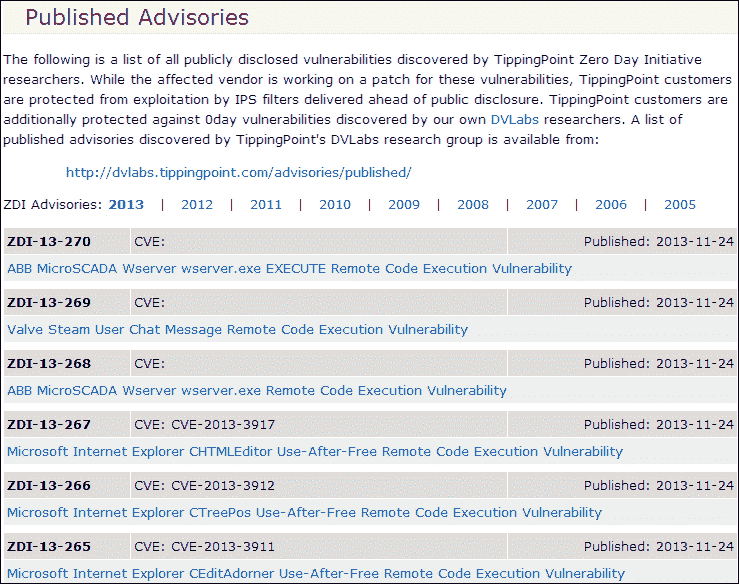

当您审查前面的屏幕截图时，您会看到一些有**CVE**。我们可以使用这个 CVE 来跟踪不同工具和网站上的漏洞，以收集额外的信息。此外，几乎所有工具都与 CVE 编号进行了交叉引用，因此，这使我们的工作变得更加容易。流程是创建我们想要测试的实验室环境，然后使用工具并查看它在数据包级别上的操作。要在数据包级别上查看信息，我们只需使用协议分析器，如 Wireshark 或其他工具。

我们不会在这里详细介绍该网站，但我们确实想更仔细地查看漏洞详情中可用的信息。我们将选择一个在上一个屏幕截图中未显示的示例。我们选择的漏洞是**思科数据中心管理器**中的 CVE 编号**2013-5486**，并于**2013 年 11 月 24 日**修补。一旦我们选择了漏洞，它会显示有关漏洞本身的其他信息。作为测试人员，我们希望尽可能多地研究漏洞，以便在需要时在测试环境中或在实地测试时更好地模拟它。漏洞的一个示例显示在下一个屏幕截图中：

特别值得注意的是，漏洞于 2013 年 2 月 22 日报告给供应商，一直持续到 2013 年 11 月 24 日。这就是修补的现实；在安全方面，它并不能拯救我们。现在对我们来说是好事，因为我们正在测试，但最终是坏事，因为我们正在测试和进攻，所以我们要在防御方面保护自己。我喜欢说，修补是一个有缺陷的系统，但不幸的是，这是我们在试图减轻软件中这些漏洞时唯一拥有的系统。

所有这些网站都遵循了负责任的披露规则，这包括通知供应商并为他们提供充足的时间来构建补丁并修复漏洞。并非所有网站都会遵守这种思维方式；有些是我们所谓的全面披露，也就是说，一旦发现任何漏洞，他们就会立即发布，而不通知供应商。由于这些网站的性质，使用时请谨慎。此外，这些网站来来去去，因此它们经常会在互联网上短暂消失。需要注意的重要事情是，总会有一些网站不遵守负责任的披露，而这些就是我们想要添加到我们的资源中以找到验证和确认我们的漏洞的方法的网站。

另一件缺失的事情是，大部分网站中几乎没有限制性的利用代码。**Security Focus**上有一些关于利用和一些代码的信息，但这就是我们所知道的。

我们首先从一些倾向于或实际上是全面披露的网站开始；因此，大多数这些网站都提供了漏洞利用信息或链接。我们将首先看一下来自**SecuriTeam**的网站；打开链接[`www.securiteam.com`](http://www.securiteam.com)。这是另一个为我们提供大量信息的网站，超出了本书的探索范围；然而，我们确实想看一下这里的一些优秀信息和资源。在主页的右侧，你会看到关于漏洞利用和工具的信息，如下截图所示：

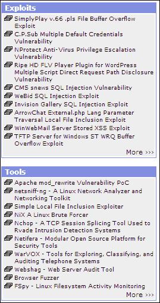

再次强调，这是一个你想要经常访问并阅读一些资源和信息的网站。我们的方法是要求对环境进行测试。你的下一步是计划和准备你的实验室；我们之前讨论过的其他网站也提供了这样的机会，让你去寻找那里的东西，然后尝试在实验室环境中创建它，这样当你进入测试领域时就知道可以期待什么。

现在我们将看一下其中一个漏洞利用，看看这个网站为我们提供了什么。我们将选择主页顶部的漏洞利用选项卡，并寻找我们选择的漏洞利用。要跟着做，点击**漏洞利用**。这将打开在撰写本书时列出的漏洞利用列表，如下截图所示：

我们选择了列表中的这一部分有特定的原因。在撰写本书时，我们为一个高端客户进行了安全测试，在初步发现期间，客户问了我们这个问题：“你在 Windows 之外的其他操作系统上找到了什么吗？”这个问题经常遇到，因为有一种误解，认为 Linux 或 Unix 自动比 Windows 更安全。我们不打算在本书的页面内进行这个讨论；而且，这忽略了安全的重点，即过程而不是操作系统是最重要的。也就是说，如果你没有一个有效的补丁管理流程，那么无论使用什么操作系统，都会发现漏洞。在这里就是这种情况；因为他们没有有效的漏洞管理系统，所以在他们的 Linux 和 Unix 平台上发现了漏洞。

在之前的截图中有一些值得调查的漏洞。但我们将集中在列表中倒数第二个；它是在 FreeBSD 中，恰好是我最喜欢部署在防火墙架构中的操作系统之一，唯一优先于它的是**OpenBSD**。让我们进一步探索一下。漏洞利用信息的示例如下截图所示：

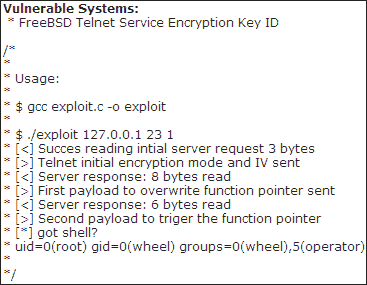

关于这个漏洞利用的一点需要注意的是，我们是连接到本地主机，所以这是一个本地漏洞利用，我们需要在本地机器上进行利用。正如之前提到的，这并不理想，但我们可以建立实验室来尝试远程利用。重要的是过程；我们从那里开始，然后进行实验，看看我们在遇到这种情况时如何使用它，比如在现场遇到一个 FreeBSD 机器。当然，我们还需要这个漏洞利用所需的盒子运行 telnet 服务。在之前的截图中没有显示，但在网站上可以找到的是漏洞利用的实际源代码。

我们将要查看的下一个网站是**packet storm**。在浏览器中输入[`www.packetstormsecurity.com`](http://www.packetstormsecurity.com)。packet storm 不仅有安全公告和利用信息，还是一个你可以下载文件的存储库。在大多数情况下，这是一个黑客工具或类似的东西，你会在这里找到。

一旦你查看了 packet storm 的主页，我们要看一下利用区域。点击**利用**并查看显示的信息。这里有大量的利用列表。以下是利用列表的示例截图：

显示利用列表示例的屏幕（裁剪的文本不重要）

正如我们从其他网站看到的，如果你点击利用标题，它将为你提供有关利用的信息、细节和代码。

我们已经看过许多不同的网站，正如我们所讨论的，这只是一个小样本。我们鼓励你在本书之外探索和发现你想要添加到资源工具包中的网站。

本节我们将要介绍的最后一个网站是我们在寻找有关零日漏洞和利用方面最好的参考来源。该网站被称为 millw0rm，但创始人很难维持网站的运行，因此关闭了它。幸运的是，Offensive Security 团队继续了原始网站的传统。在浏览器中打开链接[`www.exploit-db.com`](http://www.exploit-db.com)以打开该网站。正如你所看到的，该网站根据利用所需的位置分成了不同的部分。以下是该网站的示例截图：

与以前一样，我们可以查看利用代码，但由于我们已经完成了这一点，我们将看一下该网站极为强大且经常被忽视的另一个功能。这就是搜索利用的能力。

在主页的顶部是一个菜单列表；花一分钟时间查看选项。以下是该菜单的截图：

显示在主页顶部的菜单列表的屏幕（裁剪的文本不重要）

我们要选择的选项是**搜索**选项，所以点击**搜索**。这将打开工具的搜索窗口，并为我们提供了许多查找利用的方法。此外，我们可以按端口、CVE 和多种方法进行搜索。这使我们的参考和资源变得完整；我们已经涵盖了许多获取漏洞和其他详细信息的方法，现在这为我们提供了搜索利用的能力。因此，我们现在拥有了一个完整的武器库，用于识别在利用漏洞和攻击目标时要使用的东西。

我们可以搜索各种参数；选择主要取决于你在研究过程中发现了什么。我们将提供一个简单的例子。我们已经在 FreeBSD 中发现了一个漏洞，所以我们将搜索数据库，看看与 FreeBSD 相关的内容。在搜索窗口中，在**描述**字段中输入`FreeBSD`。然后，点击**搜索**按钮提交搜索到数据库，将返回一些结果。以下是一个示例截图：

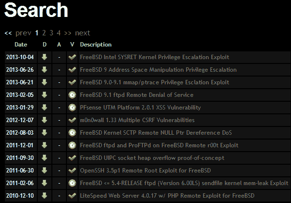

有趣的是，我们在探索 SecuriTeam 网站时没有看到我们发现的 telnet 漏洞利用。这就是为什么在进行研究时我们使用多种不同的参考和资源。总会有一种可能性是一个网站有而另一个没有。也有可能是列表在另一个参数下。因此，我们可以尝试使用另一个参数进行搜索，看看能找到什么。我们不会在这里尝试，因为我们已经从之前的网站得到了漏洞利用代码，因此我们可以建立实验环境并尝试利用。在涉及漏洞网站时，我们已经涵盖了足够的内容；此外，这为您提供了一个良好的基础，可以帮助您在实验环境中找到漏洞并尝试验证它们。

## 供应商网站

我们查看了许多可供我们用作资源的网站。我们尚未涵盖的一件事是供应商的网站。我们可以从供应商网站上获取一些有用的细节。话虽如此，正如零日倡议网站所显示的，供应商并不总是提供有关漏洞的信息，除非这对他们方便。有一个案例是 Cisco 报告了一个拒绝服务漏洞，而安全研究人员并没有止步于供应商报告的内容。在他的研究中，发现这不仅是一个拒绝服务漏洞，还是一个远程代码执行拒绝服务。这一事件后来被称为“思科门”。您可以在[`www.wired.com/science/discoveries/news/2005/08/68435`](http://www.wired.com/science/discoveries/news/2005/08/68435)上阅读相关内容。简而言之，它解释了一个研究人员遵循规则并告诉思科及其公司他将在研究结果中呈现的内容，后来却因在 Blackhat 会议上做演讲而被起诉的事件。

这并不意味着供应商会明确不发布漏洞的完整细节，只是当您使用供应商网站时，您必须将他们的信息与其他网站进行交叉参考，并做出判断。如果一切都失败了，那么您可以进行实验并自行测试。

在规划我们的渗透测试实验环境时，我们希望专注于您最有可能遇到的供应商，这一点无法过分强调。我们知道，我们继续在某些供应商中看到如此多的漏洞的原因之一是因为它们是受欢迎的，这为攻击者和我们提供了更好的目标丰富环境。

由于您将遇到的大多数目标将基于 Microsoft Windows，因此从那里开始是有道理的。要记住的一个重要日期是每个月的第二个星期二，这一天被专门指定为 Microsoft 的“补丁星期二”。一旦列表出来，黑客社区就会聚在一起举行整夜的“代码马拉松”，看看他们是否能为当天全世界都知道的新漏洞创建利用。寻找这些漏洞利用的最佳地方是 Exploit Database 网站，黑客们一旦使其工作，就会发布这些漏洞利用。

Microsoft 有一个漏洞公告编号，我们在尝试从不同网站协调信息时可以使用它；它类似于 CVE 之类的参考，但它来自 Microsoft 内部。下一个截图显示了 2013 年 11 月的 Microsoft 公告列表的示例：

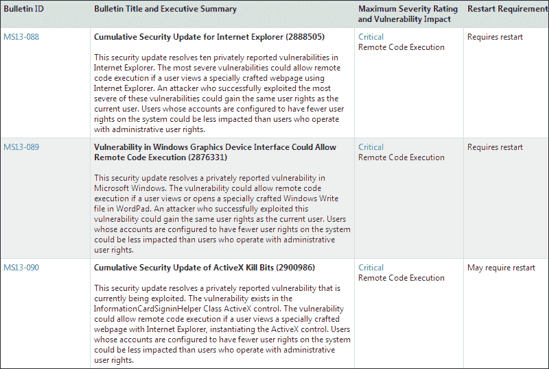

当您查看列表时，您会发现这三个是关键的，这正是我们在寻找漏洞时要寻找的东西。我们已经发现了许多获取信息的方法，使用公告编号作为参考只是另一种方法。

正如你可能还记得我们访问 Exploit Database 网站时所看到的，针对微软平台的一些利用程序有一个微软公告编号的参考，我们将查看**MS13-009**的公告编号作为参考；这里，MS13 表示它是 2013 年的。由于我们在 Exploit Database 中有它，我们知道有一个利用程序。现在，我们的下一步是审查利用程序，看看我们能发现什么。

理想情况下，当这些利用程序在 Exploit Database 中时，它们已经是 metasploit 框架的一部分。我认为几乎每个阅读本书的人都听说过由 Rapid7 拥有的出色的利用框架，而且，作为收购的结果，现在有了商业版本。我们将在整本书中使用开源版本。如果你碰巧不熟悉这个工具，你可以在[`www.metasploit.org/`](http://www.metasploit.org/)上发现更多信息。主页的一个示例在下面的屏幕截图中显示：

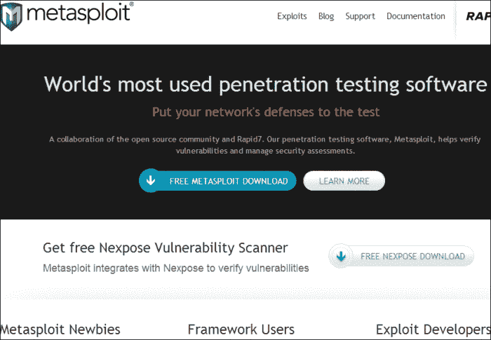

屏幕显示[`www.metasploit.org/`](http://www.metasploit.org/)（裁剪的文本不重要）

该网站包含了优秀的参考和资源，因此鼓励你查阅该网站的文档，并将其添加到你的参考资料工具箱中。关键点是，一旦我们发现利用程序已经输入 metasploit 框架，我们在虚拟环境中的测试工作就会变得更加容易。

我们从 Exploit Database 网站的 MS13-009 的示例利用程序中得知，这是针对微软 Internet Explorer 软件的。这是我们在执行测试任务时很可能会遇到的情况，它有一个一贯的习惯，几乎每个*补丁星期二*都会给我们提供漏洞。现在我们将进一步探索这个漏洞。当我们在 Exploit Database 网站时，我们点击**exploit**来打开利用程序代码。利用程序代码标题的一个示例在下面的屏幕截图中显示：

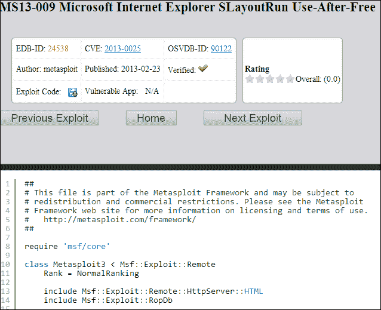

屏幕显示一个利用代码标题的示例（裁剪的文本不重要）

正如前面的屏幕截图所示，这个利用程序是 metasploit 框架的一部分，因此，我们可以从框架内部调查利用所需的参数。我们将在下一节选择并构建一个攻击者机器；所以现在我们将展示利用在 metasploit 中的样子，而不提供构建机器的细节。利用程序选项的一个示例在下面的屏幕截图中显示：

正如前面的屏幕截图所示，我们只需要设置两个选项，**SRVHOST**和**SRVPORT**，来尝试利用漏洞。这里的重要一点是，一旦它在框架中，我们验证漏洞的任务就变得更容易了。不过需要注意的是，仅仅因为我们在 metasploit 中有了利用程序，并不意味着我们一定会成功。这就是为什么存在“利用并非 100%”这样的说法。

正如我们所展示的，供应商网站可以作为额外的信息来源，但绝不是唯一的来源。需要一个系统的过程来识别感兴趣的漏洞，并与多个来源协调以取得成功。

# 摘要

在本章中，我们研究了在尝试构建范围之前所需的初步步骤。我们从规划的第一步开始，讨论了规划我们架构的重要性。在本节中，我们确定了我们要实现的目标，并讨论了实现这一目标的计划。

我们看了一些我们可以用来识别我们想要在架构中测试的漏洞的方法。现在我们知道了发现漏洞的方法，我们准备建立范围的基础。这样，当我们发现一个新的或零日漏洞时，我们可以在我们的范围上部署它，看看我们能做些什么来利用它并访问不同的目标。这个基础将在下一章中建立。
