# 第四章：确定范围架构

在本章中，我们将看看创建机器来构建我们的测试实验室架构基础的过程。我们将讨论以下主题：

+   构建机器

+   选择网络连接

+   选择范围组件

本章将为我们提供一个坚实的基础，因为我们将探讨如何构建环境来支持我们需要执行的测试类型。

# 构建机器

现在我们已经规划并准备好了我们的测试工作，是时候来看看如何构建这些机器了。我们在第三章 *规划范围*中简要介绍了这一点，但现在我们将专注于为我们的渗透测试实验室构建环境。有许多构建测试架构的方法，我们将根据以下图表构建实验室：

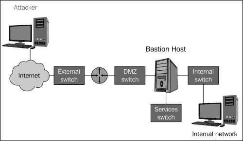

前面的图表显示了一个为我们提供多层防御的架构；以此作为我们的参考点将使我们能够执行各种各样的测试技术。此外，我们可以添加机器并连接到我们测试所需的虚拟交换机中。该图表使我们能够模拟您在渗透测试中可能遇到的任何环境。

注意**堡垒主机**；这是将作为我们架构防火墙的盒子。我们可以安装几乎任何基于软件的防火墙并在测试中使用。需要注意的一个重要点是，在大多数情况下，内部网络将使用**网络地址转换**（**NAT**），在正常的外部测试场景中，我们将无法将数据包路由到内部网络。要做到这一点，我们需要客户端交互，这将在我们逐步学习不同的渗透测试技术时进行讨论。现在，我们已经有了图表和所需的信息，所以是时候开始构建了！

正如我们在第三章 *规划范围*中所展示的，我们可以使用一些产品作为我们的虚拟化平台，你可以自由选择使用任何一个；因此，实验室设置的初始阶段可能与我们在书中展示的有所不同。你使用哪种解决方案并不重要；一旦机器建好，它们在启动时基本上都是一样的。

为了我们的目的，我们将使用 VMware Workstation 工具。在创建机器时，该工具有三种选择。我们将在以下部分讨论这三种选择。

## 构建新机器

构建新机器已经涵盖了，并且它为我们提供了从 ISO 映像引导的选择，就像我们在第三章 *规划范围*中所做的那样。或者，它为我们提供了使用安装媒体的选择，挂载它，然后通过与在专用机器上安装操作系统的方式进行安装过程。需要注意的是，VMware Workstation 工具为我们提供了一个简单的安装向导，如果它识别出您为机器创建的操作系统，那么它将大部分自动创建、构建和安装操作系统。

需要注意的一点是：在创建虚拟机时，请确保创建一个符合您需要的版本的机器。也就是说，如果您使用的是最新版本，即在撰写本书时的版本 10，那么创建机器时默认会将其创建为版本 10。如果将其移动到早于此版本的平台上，虚拟机将无法工作。这种情况已经发生过不止一次，因此请确保在创建虚拟机时考虑您的虚拟机可能在其中使用的环境。

## 转换

这是我们在第二章中简要介绍的另一个选项，*选择虚拟环境*。我们看过将物理机转换为虚拟机，或者称为 P2V；因此，在这里没有新内容可覆盖。

## 克隆虚拟机

到目前为止，我们还没有讨论过克隆虚拟机的概念。这是一个有价值的方法来构建我们的环境。这比我们将讨论的下一个技术——快照——更复杂。通过克隆，我们有两种选择；我们可以创建一个链接克隆，它将链接到原始机器。通过选择链接克隆，我们假设始终可以访问原始机器，因为启动虚拟机需要它。链接克隆的优势在于它占用更少的存储空间。另一个选择，也是更常见的选择，是创建完整克隆；这是原始机器在其当前状态的完全副本。由于它完全独立，因此需要更多的磁盘空间来存储。

克隆的优势和力量在于，一旦我们建立了用于测试实验室的机器，我们只需克隆它并对配置进行更改，而无需再建立另一个。我们现在就要这样做。启动 VMware Workstation，一旦程序打开，打开您选择的虚拟机，您可以使用我们在第三章中创建的虚拟机，或者创建一个新的虚拟机，并导航到**VM** | **管理**。这将弹出菜单，如下面的截图所示：

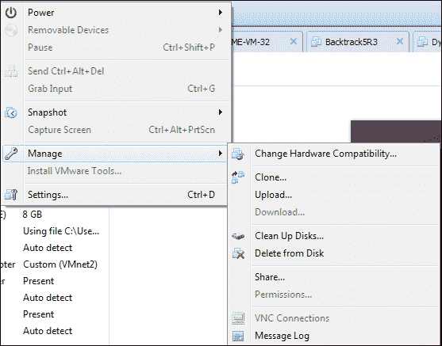

显示菜单的屏幕（裁剪的文本不重要）

点击弹出的窗口中的**克隆**，然后点击**下一步**。在**克隆源**选择窗口中，接受虚拟机当前状态的默认设置，然后点击**下一步**。这将弹出选择克隆类型的窗口；选择**创建完整克隆**，然后点击**下一步**，如下面的截图所示：

在下一个窗口中，是时候为克隆选择一个名称和存储位置了。这是另一种创建克隆然后将其存储在共享设备甚至可移动驱动器上的方法。这些都是我们在创建机器时可能要考虑的选项。输入您选择的名称或接受默认名称，如果要将克隆存储在另一个位置，浏览到该位置。一旦输入所需信息，点击**完成**。

如果一切顺利，点击**完成**后，克隆操作应该开始，在短时间内，您应该看到克隆操作完成的消息，如下面的截图所示：

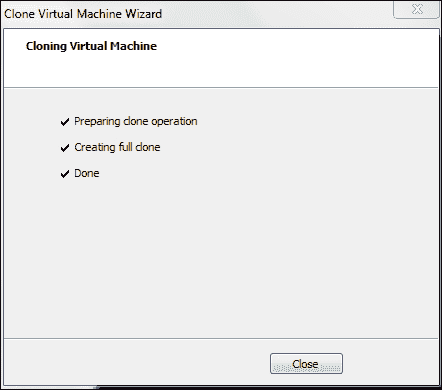

就是这样！现在您有了一个完整的虚拟机克隆，它将独立于原始虚拟机运行。这是构建实验室机器的强大方式。单击**关闭**，您克隆的虚拟机将在新窗口中打开。从这一点开始，您可以启动虚拟机或像原始机器一样进行任何操作。

我们想要谈论的最后一个概念是快照。由于克隆可以创建整个机器，有时仅创建机器的快照是有利的。快照就是它听起来的样子；在那个时间点的机器的快照。在开发过程中，我们喜欢大量使用快照；这符合工程中的概念，即您总是留下回到初始状态的方法。在构建我们的机器时，这是至关重要的。在编写任何新代码、程序或可能引起问题的任何内容之前，请确保在当前状态下对机器进行快照，以便在出现问题时返回到正常状态。这是一种做法，我希望供应商在其软件更新中使用。

得到一个新的补丁，当您安装它时，消息显示一旦安装了补丁，您将无法恢复到原始状态！这违反了所有工程最佳实践，而且，编程设计！我们总是需要有一条回到原始状态的路径。快照的过程最好通过一个例子来解释。当我们构建我们自己的开源工具时，面临的一个挑战是找到所需软件的所有依赖项的正确版本。因此，在系统上安装或更新任何软件之前，我们必须拍摄快照。这将使我们始终能够返回到原始状态。

# 选择网络连接

在本节中，我们将看一下在构建我们的环境时可以选择的网络选项。我们必须使用 VMware Workstation 工具的网络功能，并利用它为我们提供的功能。打开您的 VMware Workstation 软件并打开您选择的虚拟机。这样做时，您会看到一个作为配置的一部分的网络适配器。我们稍后会看到这个。导航到**编辑虚拟机设置** | **网络适配器**。这将打开适配器的配置窗口，如下面的屏幕截图所示：

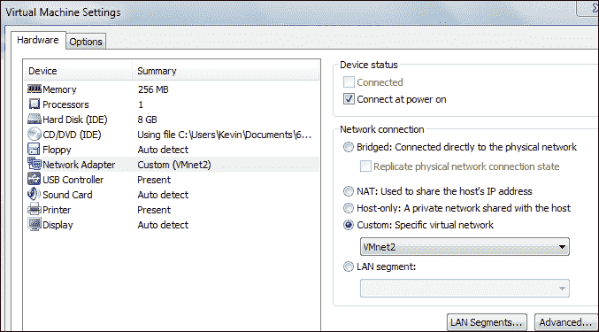

正如您在上面的屏幕截图中所看到的，我们可以在网络上进行许多设置。我们要做的是理解每个设置代表一个交换机，当您使用该设置创建网络适配器时，相当于将该机器连接到交换机。一旦我们讨论不同的选项及其含义，我们将更仔细地研究这一点。

## 桥接设置

当我们配置网络适配器使用桥接设置时，它将网络适配器连接到实际物理网络。这与将单独的机器连接到网络相同。VMware 将其指示为 VMware VMnet0 接口。这可以更改，但在大多数情况下，我们不需要这样做。还有许多其他设置可以使用，但它们超出了范围，对我们正在构建的内容并不是必需的。除非您需要从外部机器访问您的虚拟环境，否则我们通常不会配置桥接网络。

桥接设置的示例如下图所示：

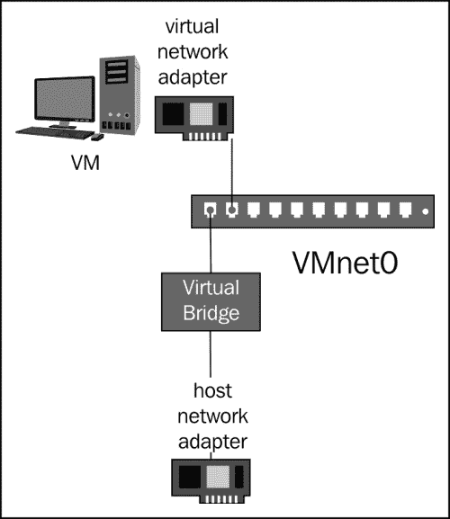

桥接设置为我们提供了具有自己在网络上的位置的虚拟机；这意味着它不与主机共享网络连接。

## 网络地址转换

在大多数情况下，NAT 是我们最常使用的设置。当我们选择 NAT 设置时，我们与客户共享主机网络卡，没有自己的地址，但仍然可以访问互联网。保留给 NAT 的开关是 VMnet8。值得一提的是，当创建虚拟机时，默认设置是 NAT。由于 NAT 设置是架构内的私有网络设置，提供了 DHCP 服务器来根据需要分配地址。NAT 配置的示例如下图所示：

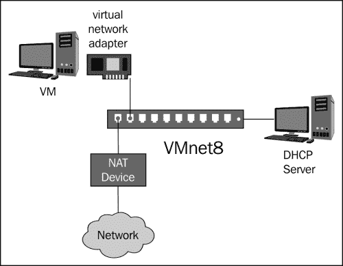

在 NAT 配置中，主机系统有一个连接到 NAT 网络的虚拟网络适配器。这使得主机和虚拟机可以相互通信。当接收到 VMnet8 网络的数据时，外部网络会识别每个虚拟网络机器的传入数据包，并将它们发送到正确的目的地。

在正常配置中，NAT 机器无法从外部网络访问。然而，可以改变这一点，设置端口转发，使外部机器可以发起连接并将流量发送到连接到 NAT 设备的机器中。对于我们的目的，我们更喜欢保留 NAT 的默认设置，不配置端口转发，因为我们不希望外部机器连接到内部机器，因为这是我们测试的大多数网络的配置方式。尽管我们不使用这个功能，但这可能是你想要尝试的东西。构建虚拟测试实验室就是关于实验和找到适合你的方法。因此，要访问端口转发配置，打开 VMware Workstation，导航到**编辑** | **虚拟网络编辑器...** | **VMnet8** | **NAT 设置...** | **添加**。这将打开端口转发设置窗口，这里有其他设置可以自定义，但大部分情况下，默认设置对我们的目的效果很好。端口转发选项的示例如下截图所示：

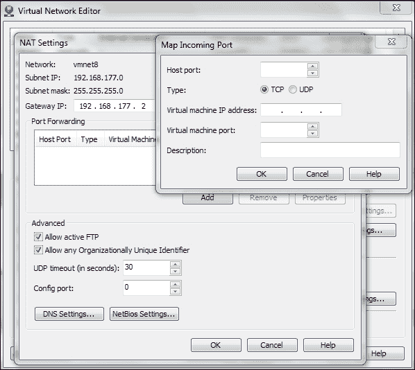

在这里需要补充的一点是，无论你在 VMware 中添加了多少个开关，主机的 IP 地址都将是`X.X.X.1`，网关将是`X.X.X.2`，如果你使用 DHCP 服务器，地址将从`X.X.X.100`开始。这些是默认设置，但像大多数事情一样，你可以修改以满足你环境的设置要求。

## The host-only switch

正如我们在第三章中提到的，*规划范围*，在安装 VMware Workstation 时默认配置的主机专用开关是 VMnet1。主机专用连接意味着虚拟机无法访问互联网。该开关被隔离，用于虚拟机和主机之间的通信，没有连接到主机外部的能力。实际上，我们拥有一个完全包含在主机内的隔离网络。这对我们构建渗透测试实验室时是另一个很好的特性。通过隔离的私有网络，我们可以强制流量使用我们测试所需的路由。

在主机专用配置中，虚拟机和主机系统之间的网络连接由主机操作系统上可见的虚拟网络适配器提供。与 VMware Workstation 提供的其他开关一样，该开关有一个与之关联的 DHCP 服务器，为连接到网络的机器提供 IP 地址。主机专用网络配置的示例如下图所示：

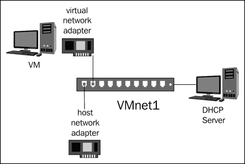

这里需要提到一些注意事项。我们之前说过，仅主机网络是一个隔离的网络。嗯，就像虚拟化的大多数事物一样，您可以改变这一点，使得隔离的网络不再完全隔离。再次强调，出于我们的目的，这不是我们要探讨的内容，但我们只是想简要介绍一些打破或至少削弱隔离的方法。您可以设置路由或代理将网络连接到外部网络，如果您使用的是 Windows Server 2003 或 Windows XP，您可以使用**Internet Connection Sharing**选项连接到外部网络。

## 自定义设置

到目前为止，我们已经看到了安装 VMware Workstation 软件时包含的三个交换机，这些为我们提供了桥接、NAT 和仅主机配置功能。然而，按照我们计划的构建网络架构，仅有这三个交换机会限制我们，并且无法提供我们所需的功能。

现在是时候把所有东西都放在一起，开始构建我们的分层架构。您可能还记得，我们之前展示的架构是一个高层次的黑匣子视图。我们现在有了完整呈现架构的知识。以下图表显示了一个示例：

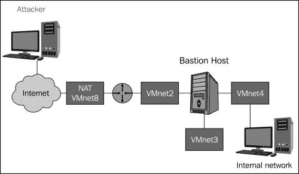

如前面的图表所示，我们现在有了我们定义的交换机，这就是自定义的力量。我们可以使用我们之前介绍的技术来构建和配置这些交换机以满足我们的要求。接下来，我们将为交换机定义以下 IP 寻址方案：

+   VMnet8: 192.168.177.0/24

+   VMnet1: 10.1.0.0/24

+   VMnet2: 10.2.0.0/24

+   VMnet3: 10.3.0.0/24

+   VMnet4: 10.4.0.0/24

这些将在整本书中使用。您可以使用自己的寻址方案，但是在书中构建的机器将与您构建的机器不同。正如您可能已经注意到的那样，我们在先前的图表中没有列出 VMnet1，但是我们为其分配了一个 IP 地址。这是因为我们希望有一个交换机专门用于我们的测试。我们将在下一节详细解释这一点。

我们之前已经介绍了如何自定义网络交换机，但为了节省您不必回头查找这些信息的麻烦，我们将在这里重复 VMnet1 交换机的步骤。我们在第三章中配置了 VMnet8 交换机，*规划范围*。打开您的 VMware Workstation 并导航到**编辑** | **虚拟网络编辑器…** | **VMnet1**。在子网 IP 框中，输入`10.1.0.0`。将其余设置保持为默认设置。您可以验证您的设置是否与以下截图中显示的设置相匹配：

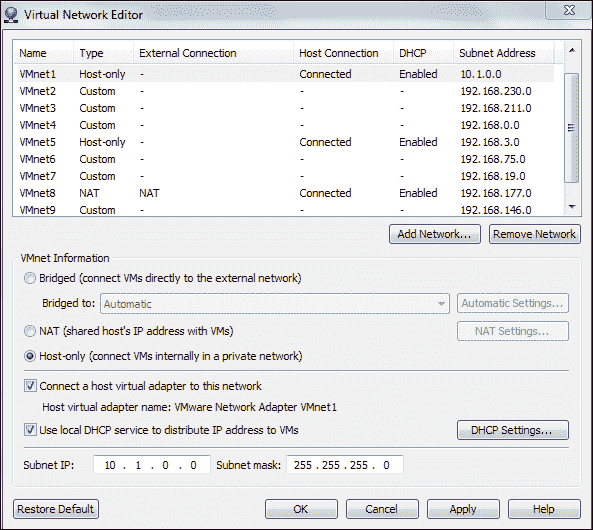

验证设置后，点击**应用**，然后点击**确定**。执行相同的步骤来配置其余的网络。对于 VMnet2 和 VMnet4，您将需要选择使用 DHCP 服务器的框；这在 VMnet1 中默认启用，但对于其余的交换机则不是。在完成配置网络后，验证您的设置是否与以下截图中显示的设置相匹配，然后继续到下一节：

屏幕显示设置（裁剪的文本不重要）

我们现在应该已经为我们想要实现的分层环境设置好了网络交换机和架构。我们将在我们创建的所有机器上配置至少两张网络卡，这样我们就可以对扁平网络进行第一轮测试。这是因为如果我们在网络是扁平的并且直接连接时无法攻击它，那么就没有理由对架构进行分层然后再次尝试。这个概念经常被忽视，你在**夺旗赛**（**CTF**）比赛中看到的网络都是扁平的。它们可能有多个网络卡，以便你可以进行枢纽（使用受损的机器来到达下一个目标），但它们是扁平的，这并不代表一个真正的测试环境。此外，它们已经禁用了防火墙，或者启用了防火墙但配置为允许流量通过。

将所有这些放在一起，我们将在所有机器上都有一个连接到架构中的交换机的网络适配器，以及一个连接到 VMnet1 网络的第二个适配器。因此，这将允许我们在 VMnet1 交换机上测试所有机器，一旦测试完成并成功，我们将从网络的真实架构点进行查看。为了防止虚拟环境中可能发生的任何数据包泄漏，第一次测试后的所有测试都将包括禁用或移除连接到 VMnet1 交换机的网络适配器。因此，现在是时候通过选择组件来开始填充我们的架构了！

# 选择范围组件

在这一部分，我们想要选择我们将在整个架构中使用的组件。主要问题是我们有一个网络设计图，现在我们要做的就是填充它。我们想要放置在架构中的第一台也是最重要的机器是我们用来进行攻击的机器。

## 攻击者机器

在选择我们的攻击者机器时，有很多选择。这通常基于测试人员对不同工具和更重要的是操作系统的经验。通常会构建多个攻击者机器，并对其进行定制以在不同的环境中工作。你可以随时创建和构建自己的机器，但在本书中，我们将使用最流行的发行版之一，那就是 Kali Linux。你可能还想构建一个 Backtrack 5R3 发行版的机器。Kali Linux 确实是 Backtrack 发行版的延续，但在 Backtrack 5R3 中有一些在 Kali 中不再存在的工具，比如 Gerix WiFi Cracker 和 Nessus。同样，这在很大程度上是个人偏好的问题。在本书中，我们将专注于 Kali 发行版作为我们的平台选择。

在第三章中，*规划范围*，我们使用了 Kali ISO 镜像构建了一个虚拟机，这可以使用，但我们更喜欢实际使用虚拟机而不是一个实时引导镜像作为我们的主要攻击者机器。你仍然可以保留我们在第三章中创建的 ISO 镜像，但我们想要获取已经以 VMware VMDK 格式存在的实际发行版。这样做的一个优点是 VMware 工具已经安装，这在虚拟环境中为我们提供了更好的操作系统集成。首先，我们需要从 Kali 网站下载虚拟机；你可以在[`www.kali.org/downloads/#`](http://www.kali.org/downloads/#)下载它。

对于那些想要构建自己的机器的人，有一个位于[`docs.kali.org/downloading/live-build-a-custom-kali-iso`](http://docs.kali.org/downloading/live-build-a-custom-kali-iso)的参考文档可以帮助你完成这个任务。

一旦下载了虚拟机，将其解压到您选择的位置，然后使用 VMware Workstation 打开它。一旦打开，我们要做的第一件事是添加另一个网络适配器，因为虚拟机有一个连接到 NAT-VMnet8 接口的适配器，这为我们提供了与外部点的连接。但是，我们也希望我们的机器连接到 VMnet1 开关，以便在添加过滤器和保护层之前直接测试事物。

我们 Kali 配置的一个示例如下截图所示：

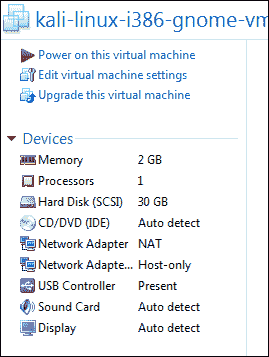

显示我们 Kali 配置示例的屏幕（裁剪的文本不重要）

正如前面的截图所示，我们现在在我们的 Kali Linux 机器上有两张网卡：一张连接到 VMnet8 NAT 开关，另一张连接到 VMnet1 主机专用开关。这为我们提供了直接访问这两个网络的能力，而无需配置任何额外的设置。正如我们所提到的，我们将使用 VMnet1 开关进行测试，一旦测试完成，我们将把目标放在架构所需的位置，然后对其进行测试。

我们之前提到过，但值得重复一下；您必须在一个平面网络上攻击目标并验证其是否有效。否则，设置过滤器只会是浪费时间。

现在我们来看一个简单的例子。在 VMware Workstation 中的 Kali 虚拟机中，点击**Power on this virtual machine**启动虚拟机。一旦机器加载完成，您将通过点击**Other**来登录。这将打开机器的登录页面。输入`root`作为用户名，`toor`作为密码。一旦桌面出现，导航到**Applications** | **Accessories** | **Terminal**打开一个终端窗口。在窗口中，输入`ifconfig eth1`来查看连接到开关的接口的 IP 地址信息。

在我们做任何其他操作之前，我们将更新 Kali 发行版。这里需要注意的是：有时更新会出现错误，因此在执行更新之前，强烈建议我们对机器进行快照。在 VMware Workstation 中，导航到**VM** | **Take snapshot**。在打开的窗口中，输入快照的名称，然后点击**Take snapshot**。

正如我们讨论过的，在 VMware 中，主机将是子网的第一个 IP 地址，所以对我们来说，主机是**10.1.0.1**。现在，我们将进行一个小实验。我们将使用流行的工具 Nmap 扫描我们的主机。我们要确保我们的防火墙在主机上是禁用的。在终端窗口中，输入`nmap -sS 10.1.0.1`并扫描主机。扫描完成后，您应该看到类似于以下截图中显示的结果：

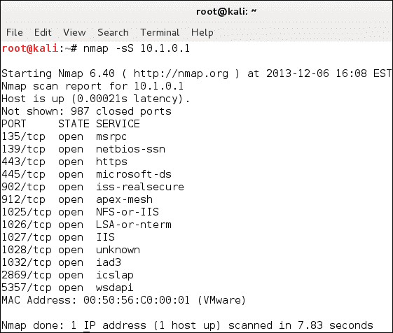

正如我们所看到的，主机上有许多端口是开放的，但现在我们想要打开防火墙。一旦你打开了防火墙，再次进行相同的扫描。正如你所看到的，现在防火墙已经打开，结果是不同的。这是许多测试人员不理解的事情；这是 Windows 防火墙，我们曾经认为它很容易被渗透，但正如我们的小实验刚刚表明的那样，情况已经不再是这样了。如果你在互联网上搜索并寻找如何渗透防火墙的指导，你会读到关于分段扫描和许多其他方法。我们鼓励你自己尝试所有这些不同的技术，而不是在这里覆盖每一种；我们将去找 Nmap 工具的创建者 Fyodor。他有一些高级扫描参考资料，其中之一实际上是一本书。因此，当我们四处寻找时，我们发现渗透防火墙建议使用自定义扫描。就像你读到的任何东西一样，过程是创建一个实验环境，然后自己测试和验证。在 Kali 的终端窗口中，输入`nmap -sS -PE -PP -PS80,443 -PA3389 -PU40125 -A -T4 10.1.0.1`。

这将使用一些额外的参数进行扫描，据说可以穿过防火墙。我们不会在这里覆盖每一个选项，但鼓励你阅读手册页面，并探索每一个选项的功能。此外，你可能想运行 Wireshark 并查看扫描在数据包级别上在做什么。一旦你运行了扫描，它成功了吗？扫描的一个示例输出如下截图所示：

正如前面的屏幕截图所示，从扫描中收集的信息确实不多。因此，声称这可以渗透防火墙是行不通的，至少不适用于 Windows 防火墙。这是我们作为测试人员必须理解的事情。如果环境配置良好，并且防火墙对入站和出站流量都有强大的规则，它可能会成为一个难以攻破的目标。这并不是一件坏事；最终，我们都希望为我们的客户改善安全姿态。不幸的是，从安全的角度来看，我们所面对的大多数架构总是存在弱点。虽然这对安全来说是不好的，但对我们的测试来说是很好的！

## 路由器

我们之前看过的架构的一部分示例如下图所示：

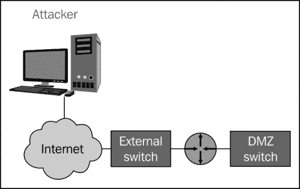

正如前面的图表所示，在我们的架构中，我们遇到的第一层防御是路由器。我们可能会遇到许多不同的设备，如果我们有一个不是移动的实验室环境，我们可以使用实际的物理设备。我相信你们许多人都知道的一个来源是拍卖网站，比如 eBay，它们可以帮助以合理的价格购买二手设备。我个人多次使用的另一个网站是[`www.routermall.com`](http://www.routermall.com)，我喜欢这个网站的原因是在购买设备时会附带电缆和 IOS 软件。正如我们之前所说的，我们更关心的是建立一个可以携带在笔记本电脑上的渗透测试实验室，因此物理路由器无法提供这种能力。因此，我们必须寻找可以放入机器中并模拟或执行路由器功能的解决方案。

虽然我们可以使用设备的数据包转发功能将任何机器变成路由设备，但这并不是我们想要用我们的路由设备实现的唯一功能。当你在测试中遇到周边设备时，该设备很可能会有某种形式的过滤。因此，我们希望我们选择的路由器组件具有执行某种形式过滤的能力。

我们想与您分享的一个解决方案是思科路由器仿真软件 Dynamips，最初由 Christophe Follet 于 2005 年编写，并在 2008 年之前维护。原始的 Dynamips 软件已不再维护，但对于我们的目的，最后一个版本将提供我们所需的所有功能。要使用任何思科模拟器，有一个要求，那就是您必须有一个思科 IOS 版本来访问和引导。在下一节中，我们将为那些无法获得思科 IOS 镜像的人提供另一种解决方案。

从这一点开始，我们将使用**Dynamips**软件，然后使用**Dynagen**作为基于文本的前端。对于那些想要基于 GUI 的界面和最新版本的 Dynamips 的人，可以访问[www.gns3.net](http://www.gns3.net)并在那里获取所需的软件。此外，您还可以获取有关该软件的大量资源和文档，它不仅适用于思科设备，还适用于 Juniper 设备。这是一个非常好的参考，可以帮助您开发模拟各种设备的实验室。该软件还有一个 Windows 安装程序包，您可以在 Windows 环境中运行模拟器。

以下截图显示了更多关于 GNS3 工具的详细信息的示例：

关于这个问题讨论够了，让我们建立一个路由器！我们希望使用 Ubuntu 作为我们的路由器仿真软件平台。您可以访问 Ubuntu 网站并从[`www.ubuntu.com/download/desktop`](http://www.ubuntu.com/download/desktop)下载软件。在撰写本书时，最新的稳定版本是 12.04，这是我们将用于路由器平台的版本。64 位版本可能会有一些挑战；对于我们的目的，32 位或 64 位版本都可以使用。

下载了 ISO 镜像后，您将在 VMware Workstation 中创建一个新的虚拟机并挂载 ISO 镜像。我们在第三章中介绍了这些步骤，*规划一个范围*，所以您应该对它们很熟悉。如果不熟悉，可以参考该章节以获取确切的步骤序列。VMware Workstation 很可能会识别 ISO 镜像并提供执行简单安装的选项。这是可以接受的，也可以不接受，这取决于个人偏好。

创建了机器并从 ISO 镜像引导后，您将通过安装提示安装软件到虚拟机的硬盘中。在大多数情况下，您可以接受默认安装，但随时根据需要进行更改。请记住，这是虚拟环境的优势之一。如果我们搞砸了什么，我们可以创建另一个，或者正如我们讨论过的，如果我们已经拍摄了快照，我们可以恢复到那个状态。Ubuntu 的一个很棒的功能是在安装完成后添加软件包的能力。

安装完成后，默认情况下，虚拟机将有一个连接到 NAT 交换机的网络适配器，但是根据我们设计的架构，我们知道我们的路由器需要两个接口。如下图所示，这是为了提供连接性：

要使用 Ubuntu 机器创建我们的架构，我们必须添加一个网络适配器并将其连接到 VMnet2 交换机。在 VMware Workstation 中，您无需关闭虚拟机即可添加新的适配器。在软件中，导航到**View** | **Console View**以打开虚拟机的配置视图。单击**Edit virtual machine settings**，添加一个网络适配器并将其连接到 VMnet2。所需配置的示例如下截图所示：

现在我们已经为路由器机器设置了配置，我们需要获取一个 IOS 镜像并将其复制到机器中。正如我们所提到的，如果您无法访问 IOS 镜像，您将无法使用 Dynamips 工具。在下一节中，我们将提供一个不需要访问 IOS 镜像并提供我们所需的相同过滤功能的解决方案。

Dynamips 软件可以从 Ubuntu 的软件存储库中获取；在您的 Ubuntu 机器上，通过单击屏幕左侧菜单栏上的终端图标来打开终端窗口。如果您看不到终端图标，您可以单击**Ubuntu 软件中心**并搜索它。 

在终端窗口中，输入`sudo apt-get install dynamips`。这将获取 Dynamips 软件并安装它。安装完成后，我们将安装该工具的前端应用程序。在终端窗口中输入`sudo apt-get install dynagen`。

为了不必为每个命令输入`sudo`，输入`sudo -i`。我们用来配置路由器的配置文件被复制到一个相当长的路径，我们现在将修复这个问题。我们将使用示例配置文件`simple1.net`。输入`cp /usr/share/doc/dynagen/examples/sample_labs/simple1/simple1.net /opt/config.net`。

现在我们已经复制了配置文件，让我们来看一下它。输入`more /opt/config.net`。默认配置文件的示例如下截图所示：

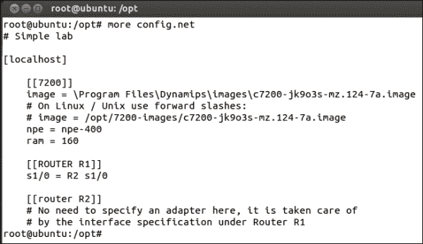

我们将专注于我们的配置的两个区域。在路由器镜像部分，我们必须指定系统上 IOS 镜像的路径。第二个区域是路由器部分。在示例中，我们将为路由器使用名称`R1`，如您所见，路由器 R1 有一个串行接口，连接到 R2 的串行接口。这是一个双路由器的示例配置，对于我们的目的，我们不需要那么多路由器。您可以探索不同的配置，但在本书中，我们将专注于只有一个路由器，因为这是我们在设计中确定的边界设备。

我们希望我们的 R1 路由器配置有两个网络接口；一个将连接到 VMnet8 NAT 交换机，另一个将连接到 VMnet2 交换机。因此，我们在 Ubuntu 机器上配置了两张网络卡，所以只需将接口的配置输入到`config.net`文件中即可。我们必须输入能够识别接口的配置，这就是所谓的 tap 接口，这超出了我们在这里讨论的范围；但是，如果您想了解更多，请参考[`www.innervoice.in/blogs/2013/12/08/tap-interfaces-linux-bridge`](http://www.innervoice.in/blogs/2013/12/08/tap-interfaces-linux-bridge)。通过输入`gedit /opt/config.net`来打开您的`config.net`文件。根据需要更改路径为 IOS 镜像文件的路径，然后在 R1 路由器部分，输入以下内容以替换当前的串行接口：

`f0/0 = NIO_linux_eth:eth0`

`f1/0 = NIO_linux_eth:eth1`

这将把快速以太网接口连接到 Ubuntu 机器的接口。您可能想要更改的另一个设置是 RAM 分配。默认值为 160 MB，这有点低，所以我建议您将其增加到**320**。此步骤的配置示例如下截图所示：

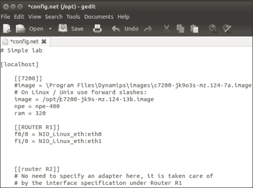

另外，注释掉路由器 R2，因为我们不使用它。现在我们准备测试我们的配置。在终端窗口中，输入`dynamips -H 7200`。这将在端口 7200 上启动 Dynamips 服务器。如果一切顺利，您应该看到类似于以下截图的输出：

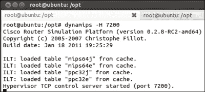

下一步是启动我们的配置文件，并与我们在机器上加载的 Cisco IOS 进行交互。我们在本书中使用的示例 IOS 镜像是用于 7200 系列路由器的，因此我们可以在其上配置许多接口。但是，对于我们的目的，我们只需要两个快速以太网接口来执行我们的路由，更重要的是，随着我们在架构的各个部分之间进行流量过滤，我们需要这样做。 

在另一个终端窗口中，输入 `dynagen /opt/config.net`。这将读取我们创建的配置文件并加载 IOS 镜像以进行访问。希望您在这里不会遇到任何错误，但如果遇到了，那么现在是时候进行故障排除了。最常见的错误是路径错误。如果是路径错误，您将看到一条消息，说找不到镜像。应该看到的示例如下截图所示：

此时，我们准备启动路由器 R1；您可以通过在 Dynagen 提示符中输入 `console R1` 命令来实现这一点。这将使您登录到路由器，就好像您是通过控制台电缆连接一样。您应该会看到另一个窗口打开。这是连接到路由器的访问。按下 *Enter* 键应该会带您到登录提示符，如下截图所示：

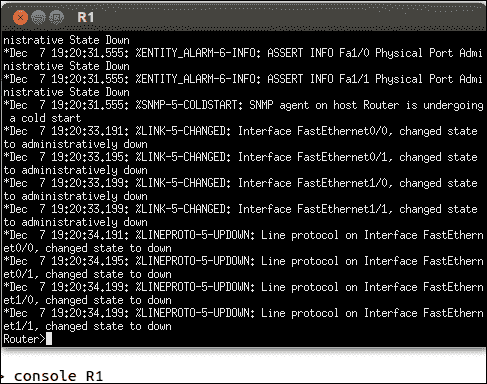

从这里开始，就是使用路由器命令来配置我们的路由器的两个接口；在路由器提示符下输入 `en` 进入路由器的特权模式。一旦进入特权模式，输入 `show ip int brief` 来查看路由器的接口配置。您会看到还没有接口配置，所以我们必须进行配置。命令的输出示例如下截图所示：

现在我们要配置这些接口（f0/0 和 f1/0），因为它们目前还没有设置。我们可以通过终端选项的全局配置来实现这一点。要访问这个，输入 `conf t` 在路由器命令提示符下。这将使您进入配置模式。输入 `int f0/0` 进入接口配置菜单，并输入 IP 地址 `192.168.177.10 255.255.255.0`。这将为 f0/0 接口创建一个连接到我们的 VMnet8 NAT 交换机的配置。输入 `no shut` 命令来启动接口。完成后，我们将对下一个接口执行相同的操作。在提示窗口中，输入 `int f1/0` 进入 f1/0 接口的配置菜单。接下来，我们必须配置连接到我们的 VMnet2 交换机的 IP 地址，因此输入 IP 地址 `10.2.0.10 255.255.255.0`。在接口配置窗口中，通过输入 `no shut` 来启动接口。现在我们应该已经配置好了接口。要返回到主路由器提示符，按下 *Ctrl* + *Z*。通过输入 `show ip int brief` 来验证您的配置。接下来，我们将验证我们在 VMnet8 交换机上是否有连接性，输入 `ping 192.168.177.1`。完成的配置示例如下截图所示：

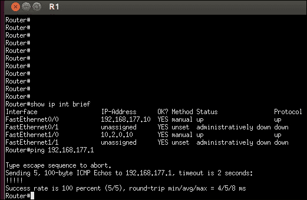

直到您连接某些东西到内部虚拟交换机，您将无法验证另一个交换机。这是因为 VMnet2 交换机在您的主机上不是一个适配器，除非您在创建时选择了该选项。接下来我们要做的是保存我们的配置；这也是最重要的事情之一。要做到这一点，输入 `write mem`。对于阅读本文的人，您可能知道另一种方法，那就是 `copy run start` 命令。

现在我们在 Ubuntu 机器上有一个完整的 Cisco 7200 路由器，我们可以在 IOS 中配置任何我们想要的东西，比如 IPsec 和其他东西。现在，我们将停止使用 Dynamips 工具，继续进行，对于那些不想获取 Cisco IOS 镜像的人。在您的 dynagen 提示符中，输入 `stop R1` 以关闭路由器。

对于那些没有访问 Cisco IOS 镜像的人，我们可以用几乎任何你想使用的 Linux 或 Unix 机器来完成我们架构所需的工作。由于我们在第一个示例中使用了 Ubuntu 平台，我们将在这里使用另一个。我们的目的是具有过滤功能，我们可以通过使用安装了 iptables 软件的操作系统来实现这一点。我们将使用 Debain 发行版来完成这项任务。您可以从官方 Debian 网站[www.debian.org](http://www.debian.org)下载 Debian。下载镜像后，您需要创建一个虚拟机并运行安装过程。安装操作系统后，您需要配置网络。一个安装的网络适配器将连接到 VMnet8 NAT 交换机，第二个将需要连接到 VMnet2 交换机。进行配置更改后，您的设置应与下一个截图中显示的设置相匹配：

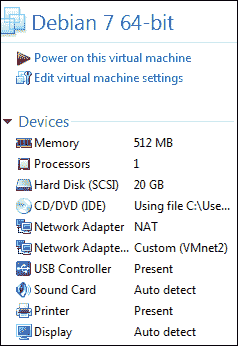

我们创建的两个虚拟交换机的配置为我们提供了一个 DHCP 服务器来分配 IP 地址，但由于这将作为路由器运行，最好为接口设置静态地址，这将允许我们在创建过滤规则时拥有更精细的过滤规则。此外，我们不必在每次启动机器时更改设置，因为地址不会像 DHCP 那样发生变化。

Debian 发行版使用一个配置文件来设置网络卡在启动时要具有的参数。使用您选择的编辑器，打开`/etc/network/interfaces`；我们要配置我们的两个网络接口，eth0 和 eth1。完成的配置示例如下截图所示：

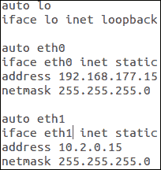

我们本可以配置与 Dynamips 中使用的相同地址，但是如果将来我们想同时运行 Debian 和 Ubuntu 机器，我们将会遇到 IP 地址冲突。因此，总是一个很好的设计决策是为这种可能性做好计划并配置唯一的地址。我们想使用 IP 表工具来执行我们的过滤，启动 Debian 机器并登录。要验证是否安装了 iptables，在终端窗口中输入`iptables -h`以显示工具的用法。这个命令的输出示例如下截图所示：

我们现在已成功设置了 Debian 机器，下一步是配置 IP 表以支持我们需要的过滤。这是我们在开始测试设备时要做的事情。

## 防火墙

现在我们已经配置并设置了路由器，我们架构中的下一个组件是防火墙。与路由器选项一样，我们可以选择许多选项。首先，让我们看一下关于防火墙的网络架构。这在下一个图表中显示：

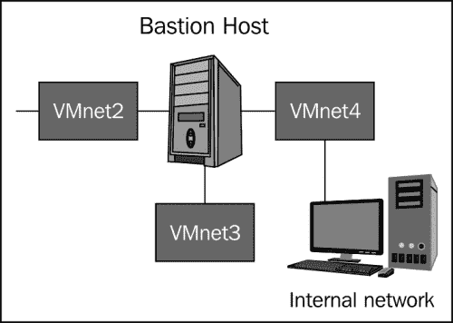

在上一个图表中显示，我们的堡垒主机有三个接口，用作我们的防火墙；这将要求我们连接三个交换机。我们将使用的防火墙是**Smoothwall**防火墙的免费版本。再次强调的一个重要点是，你放入架构中的防火墙有时取决于你计划的合同。因此，我们的意图是提供一个防火墙，以便我们在练习中测试我们在研究过程中发现的不同漏洞时可以测试多种不同的配置。您可以从[`www.smoothwall.org/download/`](http://www.smoothwall.org/download/)下载 Smoothwall 防火墙的 ISO 镜像。

下载 ISO 镜像后，创建一个虚拟机。我们希望这台机器有三个接口，以满足我们的网络设计所需的连接性。这种配置的示例如下截图所示：

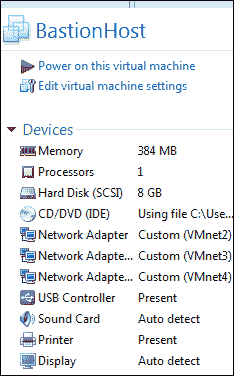

这台机器需要三张网卡，每张网卡都将连接到堡垒主机接口，接口如下：

+   VMnet2—eth0—红色

+   VMnet3—eth1—绿色

+   VMnet4—eth2—橙色

我们需要做的另一件事是更改硬盘类型。默认情况下，安装程序会将其设置为 SCSI 硬盘，这会导致工具出现问题。为了避免这种情况，我们将把设置更改为 IDE。导航至**编辑虚拟机设置** | **硬盘** | **移除**。硬盘移除后，导航至**编辑虚拟机设置** | **硬盘** | **下一步** | **IDE** | **下一步** | **下一步** | **完成**。

当您启动机器时，安装程序将启动。阅读不同步骤的说明，并接受安装过程的默认设置。接受**半开放**的默认配置。此设置将安装谨慎的安全方法，即在大多数情况下，未明确定义的内容是不允许的。

在**网络配置**类型中，我们要更改配置以匹配所需的交换机设计，即绿色、橙色和红色。在网络配置窗口中，选择**绿色 + 橙色 + 红色**，然后按*Enter*。

### 注意

您无法使用鼠标，因此需要使用箭头键和*TAB*键在菜单中移动。

请按照下一个截图中显示的连接设置进行验证：

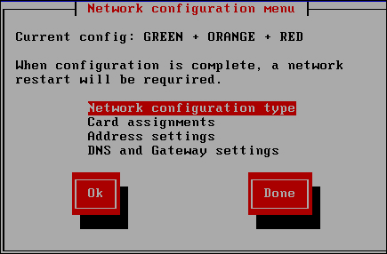

我们需要设置的下一件事是卡分配；当您选择此选项时，我们创建的网络配置将被探测。因此，每次检测到一个网络卡，它将被分配到一个接口。接口的顺序将是红色、绿色，然后是橙色。因此，我们需要按照这个顺序进行分配，因为它将分别匹配 eth0、eth1 和 eth2。

一旦所有网卡都被分配，下一步要做的是设置 IP 地址。IP 地址将配置如下：

+   红色—DHCP

+   绿色—10.4.0.10

+   橙色—10.3.0.10

分配完网卡后，您将被提示设置两个密码：一个用于远程访问，另一个用于 root 用户。我建议您将它们设置为易记的密码，因为这只是用于测试环境。我通常使用用户名后跟`pw`。因此，对于 root 用户，密码将是`rootpw`。您可以自由设置任何密码。设置密码后，系统将重新启动。重新启动后，您需要登录并验证三个接口是否按照我们的意图设置。登录后，请验证接口是否配置如下一个截图所示：

首选方法是通过绿色接口从 Web 浏览器访问配置。我们可以在 VMnet4 交换机上设置另一台机器，或者另一种方法是使用主机进行配置。为了具有这种功能，我们必须将交换机连接到主机。在 VMware Workstation 中，导航至**编辑** | **虚拟网络编辑器** | **VMnet4**，并选择**连接主机虚拟适配器到此网络**。下一个截图显示了已完成的配置示例：

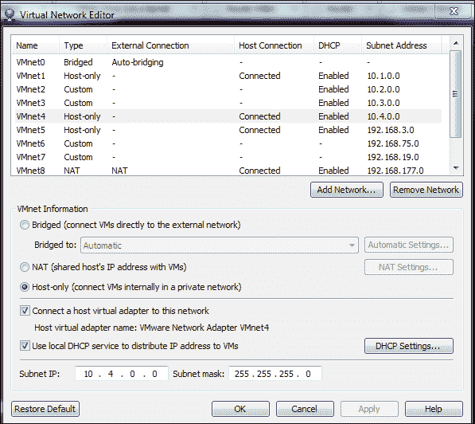

下一步是打开您选择的浏览器，并输入`https://10.4.0.10:441`；这将打开 Web 登录界面。输入在安装过程中配置的管理员用户名和密码。登录后，您将进入防火墙的主菜单。导航至**网络** | **传入**，这将显示配置的入站流量规则。下一个截图显示了一个示例：

前面的屏幕截图显示，默认情况下，Smoothwall 不允许任何发起的流量进入；这是架构应该开始的方式。然后，流程是通过策略添加组织想要允许的协议。对于我们的目的，当我们想要测试某些东西并将其放置在橙色接口上时，我们将不得不在这里放置一个规则。如果我们想要进入内部网络或绿色接口，那么除非您强制它，否则它不会让您配置。这是因为从外部，不应允许连接到内部。通过使用这个平台，我们现在有一个默认关闭的良好配置的堡垒主机。我们接下来要看的是出站或出口流量。单击**出站**以打开配置。

下一个截图显示了此默认配置的示例：

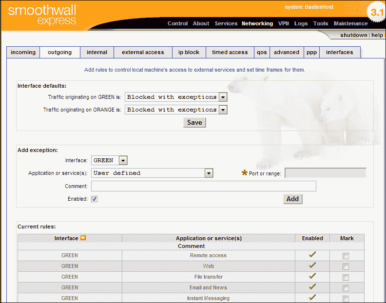

默认配置允许绿色接口上的任何机器访问大多数网络用户所需的任何服务。这是半开放安装的强大之处；它允许我们在防火墙的内部接口上绑定所有我们需要的端口，然后在外部接口上没有打开任何端口，除了我们需要满足安全策略需求的端口。

现在，我们将在这里停下，因为我们已经涵盖了防火墙作为堡垒主机的主要配置，是时候转移到另一个主题了。鼓励您根据需要对防火墙进行实验和测试。测试它的一个好方法是启动您选择的黑客工具，并将目标设置为堡垒主机红色接口上的接口。

## Web 服务器

现在我们已经建立了我们的架构，所以是时候为我们的测试添加组件了。这取决于我们遵循的测试方法论的结果。也就是说，我们希望有许多不同的 Web 服务器进行测试和练习。在第三章中，我们从 OWASP 组织下载并使用了破损的 Web 应用虚拟机。所以，我们有一个很好的 Web 服务器。接下来，我们将下载另一个易受攻击的 Web 服务器进行练习。我们想要下载并使用 Rapid7 提供给我们的 metasploitable 虚拟机。您可以从以下链接下载虚拟机：

[www.rapid7.com/metasploit](http://www.rapid7.com/metasploit)

您将需要注册才能下载该应用程序。下载后，打开虚拟机并添加一个连接到 VMnet1 接口的网络适配器。与大多数虚拟机一样，默认情况下，网络适配器设置为 VMnet8 接口，我们可以将其用于直接测试。每当我们想要将 Web 服务器移动到我们架构的另一个位置时，我们只需更改适配器连接的交换机。此外，我们可以拍摄快照，并为我们想要测试的每个位置拍摄一个快照；此外，我们可以克隆机器，并在我们的架构周围克隆机器。我们如何做并不重要。意图是拥有机器来测试我们的技能，然后在我们和目标之间或之间放置障碍，并学习如何克服它们的方法。

一旦您启动了机器，请使用用户名`msfadmin`和密码`msfadmin`登录到机器。登录后，请注意 IP 地址，打开浏览器并连接到机器上的 Web 服务器。机器主页的示例如下截图所示：

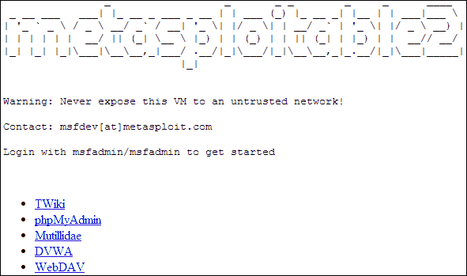

在上一个屏幕截图中，metasploitable 虚拟机为我们提供了多个测试站点；我们有 Mutillidae，Damn Vulnerable Web App 等。这将为我们提供多种测试网络的技术。

目前，metasploitable 机器与我们下载的虚拟机的组合已经足够。我们仍然需要在我们的网络架构中构建一些组件，并且我们将在本书的后续章节中进行讨论。

# 总结

在本章中，我们已经研究了建立范围所需的规划和准备工作。我们研究了创建机器的过程，以及在我们的网络上放置机器的计划，使我们能够模拟多种不同的分层架构。

然后，我们开始讨论范围组件，并确定了在边界需要具有过滤功能的路由设备的需求。此外，我们探讨了一个能够运行我们软件的堡垒主机机器的选项。我们用讨论如何创建一个 Web 服务器结束了本节。为此，我们下载了 metasploitable 虚拟机。正如我们在本章中讨论的那样，我们将为我们的范围添加更多的组件，但目前，我们添加的组件已经足够继续前进。在下一章中，我们将探讨一些专业测试时可用的测试方法。
