# 第五章。确定方法论

在这一章中，我们将针对测试方法论看一些不同的参考资料。在第一章中，*介绍渗透测试*，我们讨论了一个抽象的方法论，但在这一章中，我们将更详细地研究它。这是因为现在我们已经为设计设置了初始目标范围环境，我们希望研究一种系统化的测试实践过程。如果没有一个方法论，我们就会陷入所谓的**临时**测试组，这是专业测试人员应该避免的。我们将讨论以下主题：

+   **开源系统测试方法手册**（**OSSTMM**）

+   检查

+   NIST SP-800-115

+   攻击性安全

+   其他方法论

+   定制

本章将为我们提供多种测试方法，以便我们在选择或构建自己的测试方法时能够做出明智和知情的选择。

# OSSTMM

**OSSTMM**于 2001 年由**安全和开放方法学研究所**（**ISECOM**）首次创建。来自世界各地的许多研究人员参与了它的创作。ISECOM 是一个非营利组织，设在西班牙巴塞罗那和纽约。

OSSTMM 的前提是验证。OSSTMM 是一本经过同行评审的手册，提供了专业的测试方法和指导。此外，由于它是由多个来源开发的，该手册具有国际风味。

OSSTMM 正在不断发展；您可以从[`www.isecom.org/research/osstmm.html`](http://www.isecom.org/research/osstmm.html)下载最新版本。

在撰写本书时，OSSTMM 的当前版本是版本 3，但正在审查草案版本 4。下载这两个版本并审查更新版本中正在进行的差异和更改是一个好主意。以下是下载页面的示例：

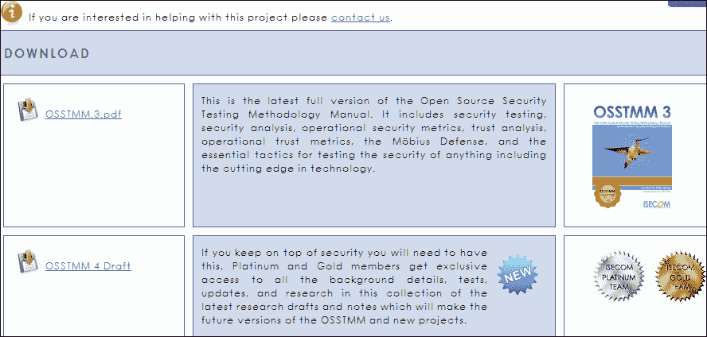

如前面的屏幕截图所示，您必须成为 ISECOM 的金牌或白金团队的一部分，才能下载手册的草稿版本。

下载图像后，打开手册。我们将查看手册的一些部分，更重要的是测试方法。您将在手册中注意到的第一件事是关于手册提供的声明。这个重要声明的一部分在这里引用：

> *"这本手册提供了导致经过验证的事实的测试案例。这些事实提供了可衡量地改进您的运营安全的可操作信息。通过使用 OSSTMM，您不再需要依赖于一般最佳实践、轶事证据或迷信，因为您将拥有特定于您需求的经过验证的信息，以便基于您的安全决策。"*

正如声明所说，这本手册提供了一个适用于我们测试挑战的方法和解决方案。对于我们的目的，我们不会阅读整本手册。我们的目的是在本章介绍一些不同的方法论，然后让您进行研究并采用其中的一种。或者，您可以遵循推荐的方法，即根据您研究过的这些和其他方法论的部分和组件创建自己的方法论。

在部署遵循 OSSTMM 的安全测试时使用的主要项目是**安全测试审计报告**（**STAR**）。其示例位于 OSSTMM 的末尾。在查看报告之前，我们将讨论 OSSTMM 关注的组件。OSSTMM 要澄清的主要事情之一是，它不是一本黑客书籍；它是一种依赖于以下内容的专业测试方法：

+   您想要测试的目标类型

+   您将如何测试它们

+   发现的控制类型

当您审查 OSSTMM 时，您会发现该手册的主要目的是为操作安全的准确表征提供科学方法。该手册可以为我们几乎所有的测试角色提供参考；此外，该方法可以应用于渗透测试、道德黑客、安全评估、漏洞评估、红队行动等。事实上，该手册可以用于支持我们可能参与的任何测试环境。

根据其创建者的说法，该手册还有第二个目的，即提供完成经认证的 OSSTMM 审计的指南。OSSTMM 审计侧重于以下组件：

+   测试进行得很彻底

+   测试包括所有必要的渠道

+   测试的姿态符合法律

+   结果可以以可量化的方式进行衡量

+   结果是一致的和可重复的

+   结果仅包含从测试中得出的事实

正如预期的那样，该手册侧重于 OSSTMM 流程的认证。如果您希望实现这一目标，欢迎您进行研究。对于我们在本书中的目的，我们只会关注该方法的一些不同组成部分。213 页的长度可能需要一些时间来审查该方法中包含的所有材料。我们在这里要讨论的组件列表的主要观点是结果是一致的和可重复的。这是我们在测试中想要实现的，即它应该是一个可重复的过程，无论我们尝试哪种测试，系统化的过程都是相同的。

OSSTMM 关注操作安全是通过查看跨多个渠道的安全性来实现的，这些渠道包括人类、物理、无线、电信和可以通过任何矢量访问的数据网络。

在讨论这些渠道之前，我们将看一下 OSSTMM 流程的主要要点。您可能还记得，OSSTMM 提供了操作安全的测量。正如手册所述，这种操作安全是分离和控制的概念。此外，对于威胁要有效，它必须与它试图攻击的资产进行交互。

当你看到这个时，OSSTMM 所说的是，如果我们能够实现威胁和资产之间的完全分离，我们就可以实现 100%的安全！虽然这是我们希望实现的目标，但对于今天大多数网络和服务来说是不可能的。因此，我们应用控制措施来减轻和降低提供可能被威胁利用的访问的风险。OSSTMM 将操作安全分解为以下元素：

+   攻击面

+   矢量

+   渗透测试安全

**攻击面**是特定分离和控制的缺乏。**矢量**是与在目标上发现的弱点进行交互的方向，最后是**渗透测试安全**，它平衡了安全性和控制与其操作和限制。手册继续定义了完整的术语，但这超出了我们想要涵盖的范围。

与其查看每个渠道的细节，我们将回顾其中一个渠道的细节，即无线渠道。我们将讨论频谱安全的组件，并将其定义为**电子安全**（**ELSEC**）、**信号安全**（**SIGSEC**）和**辐射安全**（**EMSEC**）的安全分类，其定义如下：

+   **ELSEC**：这是拒绝未经授权访问来自电磁源的信息的措施

+   **SIGSEC**：这是保护无线通信免受未经授权访问和干扰的措施

+   **EMSEC**：这是防止拦截无线通信中使用的机器和设备的辐射的措施。

在测试无线设备时，有许多因素需要考虑。其中最重要的因素之一是测试人员的安全。有许多电磁和微波辐射源可能对听力和视力造成伤害。因此，分析人员在接近任何测量为-12dB 及以上的源时可能需要佩戴防护设备。不幸的是，这经常被忽视，但测试人员在可能使他们处于危险之中的环境中必须得到保护是至关重要的。从这些类型的源的近距离可能存在许多潜在危险。因此，在室外测试时，确保已经评估了测试地点附近信号的频率和强度。OSSTMM 中详细讨论了这些防护措施。手册中一些考虑因素的例子如下图所示：

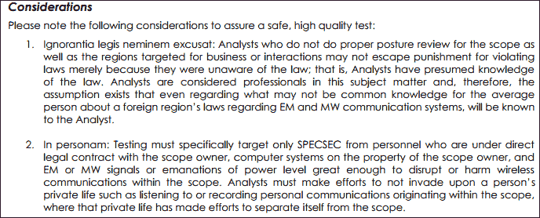

现在已经简要讨论了物理考虑因素，接下来要讨论的是姿势审查。

## 姿势审查

姿势审查由以下组成：

+   **政策**：审查和记录政策、合同和**服务级别协议**（**SLA**）

+   **法规**：审查和记录国家和行业法规

+   **文化**：审查和记录组织安全文化

+   **年龄**：审查和记录系统、软件和所需服务的年龄

+   **脆弱的物品**：审查和记录需要特殊处理的系统、软件和服务

## 后勤工作

接下来我们要做的是后勤工作；这被定义为准备通道环境，以帮助我们防止可能导致不准确结果的假阳性和假阴性。对于我们的无线测试，我们将考虑三个方面，它们如下：

+   **通信设备**：我们希望确保在测试之前和测试期间对所有源的辐射进行图表记录。关于这一点的攻击被称为范埃克窃听。关于这一点的简明解释，请参考[`www.techopedia.com/definition/16167/van-eck-phreaking`](http://www.techopedia.com/definition/16167/van-eck-phreaking)。

+   **通信**：测试在整个传输媒介中使用的协议

+   **时间**：这是进行测试的时间框架。例如，我们可以进行 24 小时的测试，或者有特定的测试时间框架。

现在我们准备进行测试的下一步，即主动检测验证。

## 主动检测验证

这是一个过程，我们确定了哪些控制措施已经就位；同样，这有助于我们减少测试中的假阳性数量。重要的是要注意，作为测试人员，我们希望向客户解释，他们能够提供的信息越多，我们在测试方面就能做得越多。我们可以在测试的过程中研究所有信息，但这让我们更深入地了解了测试开始时的环境。这使我们更能集中精力关注弱点的细节，而不是发现过程。我们想要审查的主要两个方面如下：

+   **通道监控**：这涉及到入侵监控和信号篡改的控制措施

+   **通道调节**：确定是否已经设置了提供潜在信号屏蔽或干扰的控制措施，并寻找未经授权的活动

## 可见性审计

在审查方法论时，我们接下来遇到了一个可见性审计步骤。这是人员可见性的枚举和验证测试过程。根据 OSSTMM，我们要处理三个领域，它们如下：

+   拦截：定位访问控制和周界安全以及拦截或干扰无线信道的能力

+   被动信号检测：确定可以泄漏到被测试区域内或外的频率和信号，使用多种不同的天线

+   主动信号检测：检查源触发响应，如目标区域内的射频识别（RFID）

## 访问验证

接下来我们要审查的是访问验证。这是一个测试，用于列举范围内人员的访问点。我们检查以下内容：

+   评估对无线设备的管理访问：确定在不使用时是否关闭了接入点

+   评估设备配置：测试和记录使用天线分析，无线设备是否设置为最低可能的功率设置，以保持足够的操作，使传输保持在定义的边界内

+   评估无线网络的配置、认证和加密：验证接入点的服务集标识符（SSID）是否已从默认值更改，并且管理界面未设置为默认密码

+   认证：列举和测试认证和授权方法中的不足之处

+   访问控制：评估访问控制、周界安全和拦截或干扰通信的能力

## 信任验证

接下来我们将讨论信任验证；这一步是测试范围内人员之间的信任和对信息的访问，而无需身份识别或认证。这一测试步骤涉及以下项目：

+   误导：测试和记录客户端的认证方法

+   欺诈：测试和记录使用欺诈证书访问无线设备的要求数量

+   资源滥用：测试和记录发送数据到已知和信任来源之外的要求数量，而没有建立的凭据

+   盲目信任：测试和记录与虚假或受损接收器的连接

## 控制验证

既然我们已经讨论了信任验证过程，接下来我们将看看控制验证的过程。这包括以下项目：

+   不可否认性：列举和测试正确识别和记录对特定属性的访问或交互的挑战

+   保密性：列举和测试使用减幅设备减少电磁信号传输以及保护无线传输的控制措施

+   隐私：确定用于保护设备的物理访问控制水平

+   完整性：确定数据只能被授权用户访问修改，并确保适当的加密已就位

## 过程验证

过程验证用于检查已建立的流程中人员的功能安全意识的维护，这些流程在姿势审查中定义。这一步的组成部分如下：

+   基线：检查和记录基线配置，以确保安全立场符合安全策略

+   适当的屏蔽：检查并确定适当的屏蔽是否已就位以阻止无线信号

+   尽职调查：映射和验证实践与要求之间的差距

+   赔偿：记录和列举目标和服务是否投保以防盗或损坏

## 配置验证

配置验证是我们检查资产功能安全的能力是否被规避或中断的步骤。这一步所需的项目如下：

+   常见的配置错误：对接入点进行暴力攻击，以确定密码的强度。验证使用的密码是否复杂，并包含多种不同的字符类型。

+   **配置控制**：检查控制并根据安全策略验证配置。

+   **评估和测试布线和排放**：验证所有布线是否进出有屏蔽设施。

## 财产验证

财产验证检查可能非法或不道德的信息和物理财产；这一步包括以下内容：

+   **共享**：验证财产在人员之间共享的程度，无论是有意还是无意地通过许可证、资源或疏忽管理

+   **流氓无线收发器**：对所有设备进行完整清点，并验证组织是否有足够的安全策略来处理无线技术的使用

## 分离审查

分离审查是对私人和个人信息与商业信息适当分离的测试。审查包括以下内容：

+   **隐私遏制映射**：映射私人信息，例如存储信息的内容、方式和位置，以及通过哪些渠道进行通信

+   **披露**：检查和记录私人信息的披露类型

+   **限制**：检查并记录与该渠道相关的身体限制的门户和替代渠道

## 暴露验证

暴露验证是发现可能导致经过身份验证的访问或允许使用相同身份验证访问多个位置的信息的过程。此步骤的要求如下：

+   **暴露映射**：列举和映射有关组织的人员信息，以及隐含存储和分类为敏感的任何信息

+   **配置文件**：使用各种天线检查和验证无线信号与设备信息是否超出所需范围

## 竞争情报侦察

竞争情报侦察测试是用于分析作为商业情报的可分析财产的搜寻；这是一种用于识别企业竞争对手的市场领域。其要求包括以下内容：

+   **商业磨合**：通过分析被动和主动辐射以及信息的存储和通信方式、位置，映射范围内的目标

+   **商业环境**：探索和记录业务细节，包括联盟、合作伙伴、主要客户、供应商和分销商

+   **组织环境**：检查和记录业务财产在运营过程中的披露

## 隔离验证

隔离验证是确定和衡量隔离的有效使用，因为它涉及对目标的访问和内部。其要求如下：

+   **遏制过程识别**：识别和检查目标中所有渠道的隔离方法和过程，以应对侵略性联系

+   **遏制级别**：验证遏制状态，包括互动的长度和所有渠道，其中有隔离方法

## 特权审计

特权审计测试将调查用户提供凭据的地方以及是否允许使用这些凭据进行测试。其要求如下：

+   **识别**：检查和记录通过合法和欺诈手段获取身份的过程

+   **授权**：验证使用欺诈授权获取特权

+   **升级**：验证并映射通过普通用户权限访问信息的方式，并尝试获取更高的权限

+   **征服**：列举并测试所有渠道使用或启用控制的不足

## 生存能力验证

生存能力验证是确定和衡量目标在试图导致服务故障的范围内的弹性的过程。其要求如下：

+   **连续性**：列举并测试访问延迟和服务响应时间

+   弹性：绘制并记录从安全漏洞中断连接通道的过程

## 警报和日志审查

警报和日志审查是对执行的活动之间的差距分析，包括从第三方方法记录的这些活动的真实深度。对此的要求如下：

+   **警报**：验证和列举警告系统

+   **存储和检索**：记录和验证对报警、日志和存储位置的非特权访问

这结束了 OSSTMM 的无线测试部分。正如你所看到的，这是一个非常深入的参考资料，在行业中得到了充分的认可。虽然 OSSTMM 是一个很好的参考资料，但我们大多数人将使用它的组件，而不是所有必需的流程。我们将从 OSSTMM 中介绍的最后一件事是 STAR。STAR 的目的是提供一份信息的执行摘要，陈述了目标的攻击面与测试范围相关的情况。您可以在第十三章中了解更多信息，*构建完整的网络安全范围*。

# CHECK

我们包含了关于 CHECK 的信息，因为多年来我们在英国进行了许多评估；因此，在那里进行评估时，这是一个重要的部分，特别是当您为政府或国防部进行安全评估时。

所以，你可能想知道 CHECK 是什么。在我们定义它之前，我们将提供有关成立 CHECK 的团体的额外细节。这个团体是国家信息保障技术权威，或者他们通常被称为通信电子安全组（CESG）。CESG 是提供 IT 健康检查的机构，用于评估处理标记信息的系统。

当一家公司属于 CHECK 时，如果遵守了 CHECK 的指南，它向客户提供了公司将提供高质量服务的保证。CHECK 可以用于包含机密信息的系统，但对于机密信息，需要从 CESG 获得额外的许可。公司成为 CHECK 成员的挑战之一是，为了访问受保护的标记信息，测试人员或团队成员必须至少持有**安全审查**（SC）许可。更多信息可以在以下链接找到：

[`www.cesg.gov.uk/servicecatalogue/CHECK/Pages/WhatisCHECK.aspx`](http://www.cesg.gov.uk/servicecatalogue/CHECK/Pages/WhatisCHECK.aspx)

此外，团队成员可以通过成功通过考试来满足要求。考试的详细信息将不在此讨论，但以下截图显示了一个带有额外参考信息的示例：

现在我们已经简要地了解了 CHECK 是什么，我们现在可以看看在进行我们的渗透测试或评估时，它为我们提供了什么。CHECK 包括确定 CHECK 系统基本要求的基本原则。

以下截图显示了成员资格和分配的两个组成部分的示例：

我们想从 CHECK 中了解的最后一件事是报告要求。作为专业安全测试人员，我们做的最重要的事情之一就是制作报告。不幸的是，这通常是得到最少关注的事情之一。在测试方面，大多数课程都会向您展示利用和其他技能。然而，现实是，您花在学习如何起草和创建报告的时间越多，您就越能够提供客户想要的东西，那就是关于您的发现的报告，而且更重要的是，基于这些发现提出改进他们的安全姿态的完整建议清单。

在 CHECK 中提交报告要求的信息示例如下截图所示：

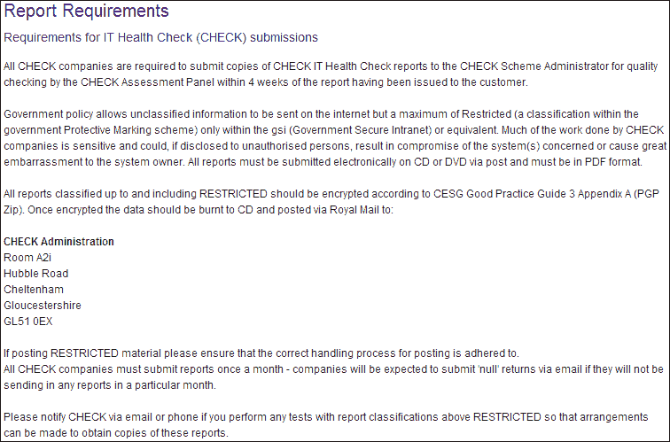

在 CHECK 中，我们有关于报告构成的信息。这是一个高层抽象，包括六个主要主题。有关每个主题的额外解释，请参考以下链接：

[`www.cesg.gov.uk/servicecatalogue/CHECK/Pages/CHECKReportRequirements.aspx`](http://www.cesg.gov.uk/servicecatalogue/CHECK/Pages/CHECKReportRequirements.aspx)

六个主要主题如下：

+   报告作者应确保报告可被客户阅读和获取

+   报告应提供参与健康检查的个人的详细信息

+   报告应被标记为网络包含信息所需的

+   报告应传达健康检查的背景、范围和内容

+   漏洞应该被准确识别

+   每个确定的漏洞都应该与一个补救方案相关联

再次强调，这是对主题的简要解释，但它符合我们的目的。作为提醒，如果你的参与或者你的合同投标涉及到英国国防部或英国政府的范围和领域，你会想熟悉 CHECK。值得注意的是加拿大也参与了 CHECK 的要求。

# NIST SP-800-115

国家标准与技术研究所特别出版物（NIST-SP-800-115）是信息安全测试和评估的技术指南。该出版物由 NIST 的**信息技术实验室**（ITL）制作。

该指南将安全评估定义为确定被评估实体如何有效地满足特定安全要求的过程。当你审查该指南时，你会发现它包含大量关于测试的信息。虽然该文档的更新频率不如我们希望的那样频繁，但它是我们在构建测试方法论时的一个可行的参考资源。该文档包括以下主要章节：

+   介绍

+   安全测试和审查概述

+   审查技术

+   目标识别和分析技术

+   目标漏洞验证技术

+   安全评估规划

+   安全评估执行

+   测试后活动

就像我们在 OSSTMM 中所做的那样，我们只会看文档的一小部分细节。NIST 网站有许多参考资料，我们应该熟悉。以下是**特别出版物**主页的一个示例截图：

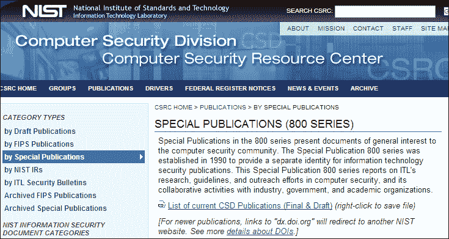

NIST 网站和参考资料应该被收藏在你最喜欢的浏览器中，因为他们不断发布审查的出版物。花一些时间审查这些预发布的出版物总是一个好主意；这是帮助你保持科技更新的另一种方法。

根据 NIST 出版物，该文档为我们提供了专业信息安全测试和评估的流程和技术指导的参考，并且具体的要点如下截图所示：

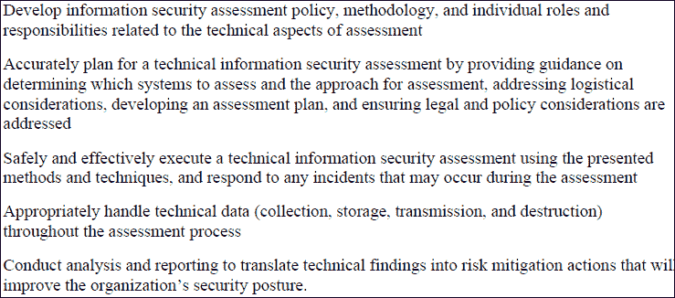

对于那些想要更详细审查 NIST SP800-115 的人，你也可以从 NIST 网站下载它以及其他特别出版物的文件 [`csrc.nist.gov/publications/PubsSPs.html`](http://csrc.nist.gov/publications/PubsSPs.html)。

根据 NIST，为了使组织从安全评估中获得最大价值，建议如下：

+   建立信息安全评估政策

+   实施可重复和有文档记录的评估方法

+   确定每个安全评估的目标，并相应地调整方法

+   分析发现并开发风险缓解技术以解决弱点

正如这些建议所示，这是组织需要遵循以帮助改善其安全姿态的坚实基础。不幸的是，尤其是在我参与的评估中，很少发现一个明确定义并实施了这些准则的组织。列表中的第一项，安全政策，是最重要的准则之一，但通常得到组织最少的关注。组织不仅需要有一个明确定义的政策，而且需要遵守它！我们不会专注于这些项目，因为我们更感兴趣的是本书的测试和评估的过程和方法论。然而，作为测试人员，我们知道这些类型的建议很重要，这样我们就可以将这些信息传递给我们的客户，或者至少为他们提供参考信息，以便他们自行探索。

我们需要查看的出版物的第一部分是安全测试和审查概述；这部分分为以下几个部分：

+   信息安全评估方法

+   技术评估技术

+   比较测试和评估

+   测试观点

## 信息安全评估方法

随着我们在本书中的进展，我们将继续强调遵循方法论的重要性，这也是我们将从 NIST 出版物中提取并关注的内容。在 NIST 指南中，他们将方法论定义为可重复和有文档记录的评估过程，这是有益的；它为测试提供了一致性和结构，为新的评估人员提供了培训，并解决了与安全评估相关的资源限制。几乎所有的评估都会有某种类型的限制；这些限制可能是时间、人员、硬件、软件或其他一些挑战。为了减轻这些类型的挑战，组织需要了解他们将执行什么类型的安全测试和审查。

通过制定适当的方法论，花时间确定所需资源，并规划评估的结构，组织可以缓解资源可用性的挑战。这样做的一个强大的好处是，组织可以建立可以在后续评估中使用的组件。随着组织进行越来越多的评估，这个过程将继续得到完善，并同时改善测试所需的时间。

NIST 的方法是定义阶段，最小阶段定义如下：

+   **规划**：这是安全评估的关键阶段；用于收集必要信息。正如我们之前讨论过的，您花在规划评估上的时间越多，评估的发展就越好。在 NIST 规划阶段内，我们确定资产、存在于定义资产之上的威胁以及用于缓解这些定义威胁的安全控制。

+   **执行**：执行阶段的主要目标是识别漏洞并在适当时验证它们。正如我们之前讨论过的，漏洞的验证是对已识别漏洞的实际利用。我们也讨论过，这并不是大多数评估工作范围内包含的内容，但如果在工作范围内，这就是根据 NIST 指南确定的位置。值得注意的是，没有两个评估会完全相同。因此，这一步的实际构成将根据正在进行的过程和方法论而变化。

+   **执行后**：执行后阶段侧重于分析已识别的漏洞，以确定根本原因，建立缓解建议，并制定最终报告。

NIST 还定义了其他存在的方法论，因此，专业的安全测试人员需要看到不止一种方法。这也是我们同意的，这也是为什么我们展示存在的不同方法论并讨论结合它们的方法。

## 技术评估技术

有许多不同的技术评估技术可用，而不是讨论它们，我们将看看在 NIST 出版物的这一部分中专门讨论的技术。该出版物涵盖了以下评估技术：

+   **审查技术**：这些是用于评估系统、应用程序、网络、政策和程序以发现漏洞的审查技术。审查技术通常是手动进行的。

+   **目标识别和分析技术**：这些技术可以识别系统、端口、服务和潜在的漏洞。这些可以手动执行；然而，更常见的是使用自动化工具来完成这些工作。

+   **目标漏洞验证技术**：在这个过程中，我们要么手动验证漏洞，要么使用工具。这里的技术，比如密码破解、渗透测试、社会工程和应用安全测试，都是模拟攻击者的技术。

正如我们已经多次提到的，没有一种方法能够展现完整的图片，因此专业的安全测试人员将使用多种不同的技术来获取所需的信息。

NIST 出版物明确指出，它不是一个能够为您提供应该使用哪种技术的答案的参考资料。相反，重点更多地放在了检查不同技术技巧如何执行上。

## 比较测试和审查

审查是通过审查组织的文件来定义的。这是审查的唯一功能，这是我们验证组织是否有定义的政策并且是否遵循的地方。经常发现不准确的领域之一是架构图，这是我们进行审查步骤时要检查的领域之一。

在大多数情况下，审查对系统或网络没有影响。虽然有可能会有影响，但这种情况极为罕见，对于我们的目的，我们将坚持认为对正在测试的系统或网络没有影响。

使用扫描和其他技术进行测试可以并很可能会提供比审查获得的更准确的组织安全状况的图片。然而，这种审查也可能会影响组织的系统和/或网络。因此，在某些情况下，使用审查文档将被用来限制对正在评估的站点的影响。正如 NIST 所说：

> 在许多情况下，结合测试和审查技术可以提供更准确的安全视图。

这是我们一直遵循的方法，随着书籍的进展，我们将继续遵循这一方法。

## 测试观点

众所周知，测试可以从许多角度进行。我们将讨论其中一些位置以及它们如何成为我们评估方法的一部分。根据 NIST 出版物，我们将讨论外部和内部观点。外部测试是在组织的边界之外进行的，从外部查看安全状况；此外，它是从互联网和外部攻击者的角度进行的。对于内部测试，评估人员从内部工作，并模拟成内部人员或已突破边界防御的外部攻击者。这种测试侧重于系统级安全和配置，以及身份验证、访问控制和系统加固。

当需要进行内部和外部测试时，通常首先进行外部测试。当同一测试人员进行测试时，这是有益的，以防止他们获得外部测试人员不会有的内部信息，从而使测试无效或不够真实。在进行内部测试时，客户不应对网络架构进行任何更改。

## 明显和隐蔽

根据 NIST，明显或白帽测试涉及在 IT 工作人员的知识下进行外部和/或内部测试。也就是说，工作人员处于警觉状态，并知道正在进行评估。在某些情况下，这可以帮助限制测试的影响。此外，这可以作为一个培训机会，让组织工作人员了解更多关于测试的信息，并在某些情况下，学习如何为他们的组织进行自我评估。

根据 NIST，隐蔽或黑帽测试采用对抗性的测试方法。也就是说，它在组织的 IT 工作人员不知情的情况下进行测试，但得到了上级工作人员和管理层的许可。有时，组织需要指定一个可信赖的第三方来确保测试不会导致事件响应计划启动。隐蔽测试的目的是检查对手可能造成的损害。此外，这种测试不关注识别漏洞，也不测试每个安全控制。这种测试纯粹是对抗性的，通常涉及发现漏洞，然后利用它来获取对系统和/或网络的访问权限。

隐蔽测试可能耗时且昂贵。这就是为什么大多数测试以明显的方式进行的原因。这并不意味着客户永远不会要求隐蔽测试。总是有可能会这样，这就是为什么它仍然是 NIST 方法论的一个重要组成部分。

我们想要看的 NIST 出版物的下一部分是目标识别和分析技术部分。从这一点开始，我们将不会审查部分内的所有主题。我们将强调继续时要记住的重要点。在这一部分，我们将提到评估团队成员的技能。以下截图显示了一个例子：

正如前面的截图所示，四种主要技术中的三种需要 TCP/IP 知识作为基本技能。这与我在行业中看到的情况相符，即理解协议的重要性，并能够在数据包级别对其进行分析。你们中的许多人可能认为，在涉及 TCP/IP 时，你需要具有广泛的背景和高水平的知识，这是一件好事。不幸的是，我遇到的大多数顾问或想成为顾问的人并没有所需的 TCP/IP 详细知识。这促使我编写了一门关于安全基础和核心概念的课程。课程的主要组成部分之一就是 TCP/IP。作为测试人员，理解网络模型的所有层是至关重要的，而且，你需要在相应的层次上解释和分析不同的事件。

我们接下来要从 NIST 出版物中审查的是目标漏洞验证技术部分。这个专业安全测试步骤被称为渗透测试。根据 NIST 的定义，出版物的这一部分涉及验证在方法论的其他步骤中发现的漏洞。这一步的目标是证明漏洞不仅存在，而且还会造成安全风险，可以被利用。正如我们之前提到的，漏洞验证的行为，更常被称为利用，不是 100%确定的。因此，在测试阶段，我们进行了彻底和系统的测试，以便识别那些最有可能成功验证的漏洞。需要注意的是，这种技术带来了最大的风险。这是因为这些技术更有可能影响目标。此外，这种技术在多次情况下可能会导致被测试目标崩溃。在进行验证时，任何时候都要谨慎进行。

NIST 定义的渗透测试包含在这一部分中。根据 NIST 的定义，渗透测试概念分为四个阶段。这四个阶段是**规划**、**发现**、**攻击**和**报告**。NIST 出版物中的一个例子如下图所示：

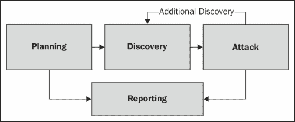

在规划阶段，规则被确定，并且获得批准并进行最终记录。必须确保批准书是来自组织的合格代表的书面形式。规划为成功的渗透测试奠定了基础。

发现阶段包括两个部分；第一部分是实际测试的开始，涵盖信息收集和扫描。在发现阶段的第一部分收集的信息如下截图所示：

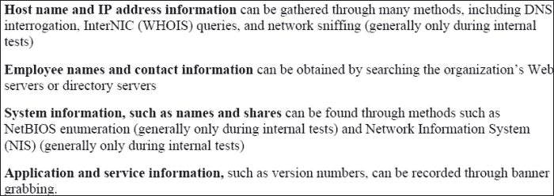

发现阶段的第二部分是漏洞分析的过程。这涉及将我们先前发现的信息与漏洞数据库进行比较。就像我们在本书的前面所做的那样，这个过程寻找我们已经确定的信息，然后找到我们在进入下一个攻击阶段时可能利用的漏洞。在大多数情况下，这最初是通过自动扫描程序进行的。一旦扫描程序确定了潜在的漏洞，我们就会进行更深入的调查，以查看它是否确实存在弱点，以及我们如何利用或验证这个漏洞。因此，这个过程是手动的，可能会耗费时间。

攻击阶段是我们通过尝试利用已识别的潜在漏洞来验证它们的阶段。如果验证成功，那么意味着利用成功，漏洞存在。因此，如果利用不成功，这并不意味着漏洞不存在；这只是意味着我们在尝试验证时无法成功利用它。这可能有很多原因，超出了本章的范围。另一个要考虑的问题是，我们可能会利用机器，但只能获得低或非特权用户的访问级别。测试人员可能能够提升他们的权限并访问其他资源。当我们发现可以潜在利用的信息时，这些都是我们作为测试人员所做的组成部分。

以下截图显示了一个例子：

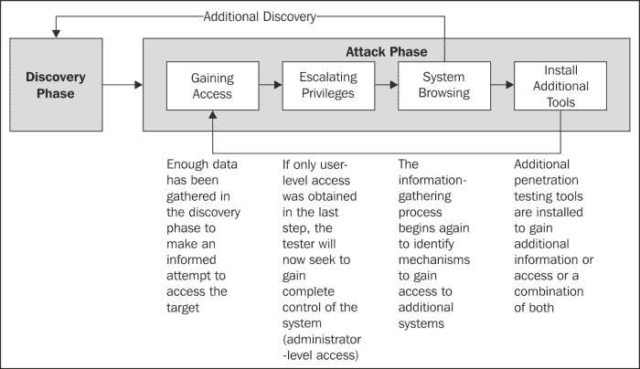

在攻击阶段前面屏幕截图中的阶段将在很大程度上取决于工作范围。因此，正如我们已经提到的，为规划阶段定义清晰简明的工作范围对于专业安全测试的后续组成部分至关重要。

根据 NIST 出版物中定义的渗透测试的最后阶段是报告阶段。正如我们之前提到的，正是在这个阶段我们为客户制作交付物。这也是一个与其他阶段同时进行的关键组成部分。因此，在测试结束时，我们会制作一份发现结果的报告并提供给客户。这是评估的展示；它向客户展示了已经完成的工作，并为他们提供了发现结果的详细清单。此外，对于每个发现，它都提供了分析和建议或程序，以消除或减轻漏洞的风险。

我们将通过解释 NIST 出版物中的内容来结束对其的讨论。所有技术和技术组合都存在风险。因此，为了确保尽可能安全和准确地执行每种技术，建议测试人员具有一定水平的技能。其中一些在前面的屏幕截图中已经显示，而在本节中，我们还有另一个关于技能的指南，如下面的屏幕截图所示：

值得注意的是，前面屏幕截图中确定的技能仍然涉及 TCP/IP 知识，但现在我们已经从一般知识的水平发展到了广泛的知识水平。再次强调，以专业安全测试人员的身份，理解 TCP/IP 的最低级别是至关重要的。

## Offensive Security

Offensive Security 团队负责多个项目，我们将作为专业安全测试人员来探索这些项目。其中包括 Kali 发行版、metasploit unleashed 指南、Google Hacking Database 和 Exploit Database。如果您访问 Offensive Security 网站[`www.offensive-security.com/`](http://www.offensive-security.com/)，您将找不到实际方法的参考，但由于 Kali 发行版是该团队维护的一个项目，我们可以在其中寻找方法。Kali 中存在的方法的一个示例如下面的屏幕截图所示：

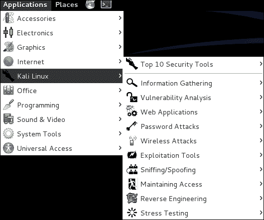

如前面的屏幕截图所示，Kali 发行版中包含的方法与我们在其他示例中介绍的步骤相似。正如前面提到的，Offensive Security 团队还维护着出色的**metasploit unleashed**参考资料。在这些步骤中，我们可以练习一种方法，如下面的屏幕截图所示：

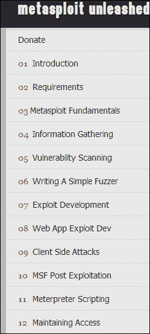

**metasploit unleashed**参考资料的一个很棒的地方在于，在其中的主题中，有详细的步骤来支持测试方法中不同步骤中使用 metasploit 框架。在**Meterpreter Scripting**下可以找到的步骤的示例如下屏幕截图所示：

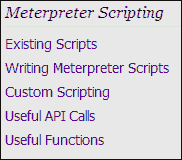

我们将在这里结束对**metasploit unleashed**参考资料的讨论。在继续之前，建议您研究这里提供的信息，如果您想更加熟练地使用 metasploit 框架。这是我们释放工具力量的最佳参考之一。

## 其他方法

如果您在互联网上搜索，您会发现在安全测试方法方面有许多参考资料，如果扩展到包括风险评估，那么数字将会更多。您找到的许多参考资料已经有一段时间没有更新了。我们已经涵盖了其中的一些，在这里，我们将简要介绍另一个。

如果您曾经参加过国际电子商务顾问委员会提供的认证道德课程，您会发现在课程的每个模块结束时，都有一个专门用于渗透测试的部分。在其中，您会发现一个流程图，显示了每个步骤，并提供了一个用于获得该步骤结果的工具示例。以下是一个示例截图：

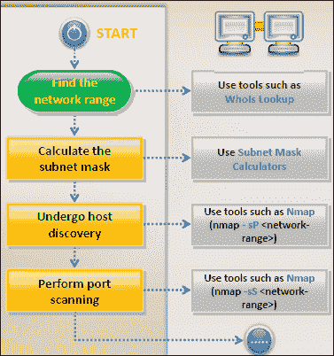

前面的示例是渗透测试的枚举步骤的流程图；这是创建您的渗透测试方法文件的绝佳起点。事实上，建议您制作这些流程图并将其覆膜，以便您可以携带它们到现场，并作为您遇到的不同类型测试的参考。

## 定制

我们已经讨论了许多方法，从中可以得出的结论是审查现有的不同参考资料，然后根据您的研究定制自己的方法是非常重要的。强调的另一个重点是您的方法应该是动态的，并且随着测试的进行，根据需要进行调整和定制以满足您和您的团队的需求。

让我们重新审视我们在第一章中介绍的高层抽象方法，*介绍渗透测试*。该方法包括以下步骤：

+   规划

+   非侵入性目标搜索

+   侵入性目标搜索

+   数据分析

+   报告

这种方法对我们最初接触专业安全测试是足够的，但现在我们已经审查了许多参考资料，我们的方法需要更新。我们想要做的是在我们的抽象方法中添加两个额外的步骤。这两个步骤是远程目标和本地目标评估。这些将被放置在我们的方法之后侵入性目标搜索。具有这两个额外步骤的我们的方法的示例如下：

+   规划

+   非侵入性目标搜索

+   侵入性目标搜索

+   远程目标评估

+   本地目标评估

+   数据分析

+   报告

通过远程目标评估，这是从外部位置评估目标的过程。因此，接下来的本地目标评估是指从本地机器内部评估目标的过程。虽然这两个步骤被视为独立的组成部分，但重要的是一旦在一台机器上获得了访问权限，本地评估可以像测试人员本地位于机器上一样进行。

这是我们在整本书中需要参考的方法。这是一个简单易行的格式，为我们进行测试提供了很大的灵活性。此外，它允许我们根据需要进行扩展。此外，这是一个经过验证的过程，满足了我们在构建实验室环境时的测试需求。

# 总结

在本章中，我们已经研究了许多不同的流程和方法参考，这些参考可以在我们进行专业安全测试实践时使用。

我们从 OSSTMM 的综合国际参考开始了本章。我们研究了参考中进行无线评估的过程和步骤。

根据 OSSTMM，我们简要介绍了 CHECK，这是英国进行安全评估的一部分。我们还讨论了包含标记数据的网络的评估。

我们接下来审查的是 NIST SP 800-115。我们调查了文件的格式，并讨论了参考文献中的一些部分。我们查看了评估和渗透测试所需技能的示例。其中一个常见的项目是对 TCP/IP 的了解。

我们查看了 CEH 课程材料中的一个示例流程图，并在本章结束时使用了我们在第一章中介绍的抽象方法，以及两个额外的步骤。我们将在下一章建立一个外部测试架构。
