# 第六章：创建外部攻击架构

在本章中，我们将构建一个外部架构，我们将在攻击的不同阶段中使用它。我们将在本章讨论以下主题：

+   建立分层架构

+   配置防火墙架构

+   部署 IDS/IPS 和负载均衡器

+   集成 Web 应用防火墙

本章将为我们提供一个外部攻击架构，该架构将提供模拟多种不同测试环境的能力。在本章中，我们将通过配置作为架构连接设备的范围核心设备的过程，如路由器、交换机和防火墙机器来工作。因此，我们可以轻松地构建目标机器或设备，并将其插入我们的架构中，立即开始测试。

# 建立分层架构

我们的意图是提供多个层次，作为一个外部攻击者，我们可能需要穿越这些层次才能到达目标。这是外部测试的现实；许多目标将在攻击者和目标之间设置多重保护。幸运的是，由于这些机器需要允许外部访问服务，它们也将允许我们进行测试时的访问。

我们将构建我们的网络架构，以提供以下图表中显示的层次：

建立分层架构

当我们审查架构时，我们看到我们已经在原始设计中添加了一个 Web 服务器和一个堡垒主机，并且路由器连接到 VMnet8 和 VMnet 2 交换机。正如在第四章中所讨论的，*识别范围架构*，这就是我们计划架构的强大之处；我们只需在想要测试的地方插入机器。在前面的图表中显示的架构中，我们有一个路由器设备，我们将用于测试。正如我们在第三章中提到的，*规划范围*，我们正在使用 Dynamips Cisco 软件仿真器进行本书的工作，并且需要配置它以允许我们的服务。如果您使用**iptables**选项，那么您将需要配置该设备以支持您的架构的服务。

第一步是在 VMware Workstation 中启动路由器设备。一旦机器启动完成，使用您在安装软件时创建的用户名和密码登录。输入`dynamips –H 7200`来启动路由器。一旦它启动，您需要通过打开另一个终端窗口并输入`dynagen config.net`来加载配置文件。配置加载完成后，输入 R1console 并访问正在运行的路由器。在路由器提示符下，输入`en`进入路由器的特权模式。

在这一点上，我们接下来输入`show ip int brief`来显示路由器接口的配置；您的输出应该类似于以下屏幕截图中显示的内容：

建立分层架构

如前面的屏幕截图所示，我们的路由器上有两个接口，显示**状态**为**up**，**协议**也为**up**，这正是我们想要的。如果您的路由器屏幕没有显示这些内容，您将不得不回到我们在第四章中使用的过程，*识别范围架构*，看看出了什么问题。希望您至少能看到 IP 地址信息是正确的。如果是这种情况，那么可能只是需要激活接口，这可以通过在接口配置菜单中输入`no shut`来完成。要激活接口，请输入以下命令：

```
conf t
int <interface name eg: f0/0>
no shut

```

如果您没有正确的地址信息，那么您可能没有保存我们在第四章*识别范围架构*中创建的配置，因此您将不得不返回到该章节并按照步骤进行，以获得前面截图中显示的结果。

### 提示

现在我们的架构中有一个路由器，虽然我们可能会遇到一个没有过滤的路由器，但很可能我们不会那么幸运；因此，我们需要在我们的路由器设备上设置过滤。这绝对是我们想要添加的东西，但现在我们将建立网络并确保它正常工作，然后再应用过滤。这样我们就可以根据需要进行故障排除，而不必处理过滤。

由于我们有一个路由器，我们需要添加一个目标机器并连接我们的架构；我们将通过向我们的架构添加一个 Web 服务器来实现这一点。我们的意图是在第一级创建网络，如下图所示：


我们可以继续构建我们架构的更多层，但更好的设计方法是在进入下一层之前测试每一层。当我们回顾前面的图表时，我们有三台机器是架构的组成部分。我们现在要添加这些机器并进行测试。路由器已经运行起来了，所以我们有两台机器要启动。我们要启动的下一台机器是攻击者。就像我们在第四章*识别范围架构*中所做的那样，我们将使用 Kali Linux 发行版机器。首选的机器是我们以 VM 格式下载的那台。VM 的配置如下截图所示：


我们要确保的主要事情是我们的网络卡之一连接到 VMnet8（NAT）交换机，在这种情况下，我们确实有。一旦我们验证了网络适配器，我们就可以启动虚拟机。一旦机器启动，使用您创建的用户名和密码登录，或者如果您没有更改密码，则使用默认密码。每次启动 Kali VM 时更新发行版都是一个好主意。但是，在这样做之前，始终在更新期间拍摄快照以防出现问题。导航到**VM** | **快照** | **拍摄快照**。在打开的窗口中，输入快照的名称，然后单击**拍摄快照**。拍摄快照后，通过输入以下命令更新发行版：

```
apt-get update
apt-get dist-upgrade

```

升级完成后，下一步是测试与路由器的连接。在 Kali 上，输入`ping 192.168.177.10 –c 5`，如果一切顺利，您应该会看到一个回复，如下截图所示：


现在我们已经有了连接，我们准备添加我们的下一个机器，这是我们的 Web 服务器。正如我们在第四章*识别范围架构*中提到的，当我们要添加 Web 服务器时，我们有很多选择，这实际上是一个个人偏好的问题。正如我们所知，我们将在架构中有两台 Web 服务器；我们可以为第二台机器选择不同的 Web 服务器。对于书中的第一台 Web 服务器，我们将从 OWASP 和 Mandiant 中选择**Broken Web Application VM**。由于这将连接到 DMZ 交换机，我们只需要确保网络适配器连接到 VMnet2 交换机。

此配置示例如下截图所示：


一旦配置已经验证，我们将要做的下一件事是启动虚拟机。机器启动后，您将注意到分配给 VM 的 IP 地址。现在我们的机器已经启动运行，我们想要验证我们是否可以访问它。我们有几种选择。我们可以使用简单的 ping，或者我们可以使用应用程序层并通过浏览器连接。在这里，我们将使用浏览器。在撰写本书时，我们的机器被分配了 IP 地址`10.2.0.132`，因此我们打开浏览器到该 IP 地址。此示例如下屏幕截图所示：


打开地址为 10.2.0.132 的浏览器时显示的屏幕。 (裁剪的文本不重要)

发生了什么？为什么我们无法连接？这实际上是在构建虚拟环境时非常常见的问题，但在我们揭示原因之前，我们将按步骤进行逻辑推理。接下来，我们将尝试从路由器 ping 它。选择您的 Dynamips 机器，在路由器窗口中，输入 ping `10.2.0.132`以验证您可以在平面网络上访问该机器。此示例如下屏幕截图所示。您的 IP 地址可能不同，这种情况下，您将使用分配的 IP 地址。


这表明当它是平的时候，我们有连接，我们也知道我们可以从之前的测试中 ping 通路由器的外部接口；那么，下一步是什么？我们想要查看到目标的路径。因此，在您的主机上打开命令提示符，输入`tracert 10.2.0.132`。此命令的输出示例如下屏幕截图所示：

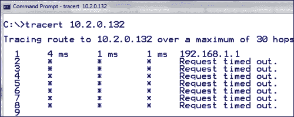

问题的关键在于，在第一跳时，网关应指向路由器接口；然而，它当前指向机器连接的无线路由器。这在构建架构时非常常见；此外，当我们执行诸如枢纽之类的技术时，我们必须设置路由，以便可以访问目标。我们可以更改默认网关，但这是最不理想的选择，因为我们用它将流量从 NAT 接口传输到互联网。因此，更好的选择是手动添加路由。当我们要跨网络通信时，所有机器都需要这样做。用于添加路由的语法将因不同操作系统而异。我们将首先在主机 Windows 机器上添加路由。打开管理员命令提示符，在命令提示符中，输入`route add 10.2.0.0 mask 255.255.255.0 192.168.177.10 metric 2`，然后测试它。此示例如下屏幕截图所示：

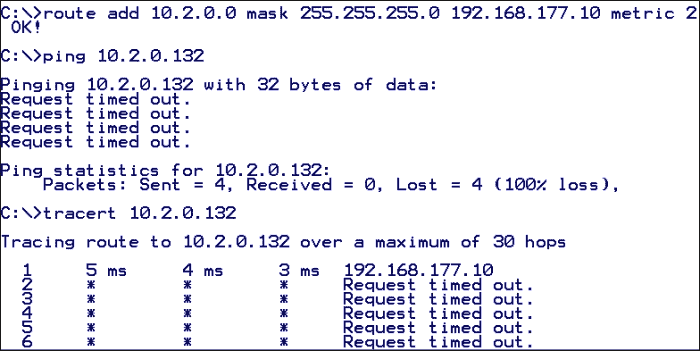

等一下！为什么它不起作用？这是构建环境的过程的一部分；我们喜欢说挫折是好的，因为这是您学习的时候。一旦遇到困难，退一步思考，然后更加努力。在前一个图像中，我们看到流量朝着正确的方向前进，即朝着路由器接口；然而，在那一跳之后它没有返回任何东西。这是您必须牢记的另一个常见问题。我们在主机上添加了路由，但我们没有在目标上添加路由，这是必需的；我们必须在网络会话的两侧配置路由。

选择破损的 web 应用程序**VM**，并登录到该机器。登录后，我们将输入添加路由的命令。您可以输入`man route`并查看主页，以确定添加路由所需的语法。输入`route add –net 192.168.177.0 netmask 255.255.255.0 dev eth0`并将路由添加到该机器。返回到您的主机并测试配置。

测试后的示例如下截图所示：


我们现在已经在我们的第一层中建立了连接。我们还需要在我们的攻击机器中添加路由。幸运的是，语法是相同的；这并不总是这样，但这次是这样。在你的 Kali 攻击机器中，输入“route add –net 10.2.0.0 netmask 255.255.255.0 dev eth0”并通过 ping 目标来测试配置；成功测试的示例如下截图所示：


我们现在已经安装了我们防御基线的第一层，并且更重要的是，我们已经建立并运行了网络连接。我们的配置中有一个问题，那就是路由。我们还没有设置路由以在重启后生效。我们有多种选项可以做到这一点，我们不会覆盖所有选项。在 Windows 中的一个选项是使用一个带有路由语句的“批处理”文件，然后根据需要运行它。在 Windows 中还有另一个选项，你可以使用 route 命令本身的`-p`选项。这将路由设置为持久路由，当你这样做时，它会将路由添加到注册表中。这个路由的位置被插入到注册表的`HKEY_LOCAL_MACHINE\SYSTEM\CurrentControlSet\Services\Tcpip \Parameters\PersistentRoutes`键中。对于我们的目的，我们不需要使路由持久，但这只是一个选项，这就是为什么我们涵盖它的原因。

接下来，我们将配置我们的第二层；这要求我们将一个 Web 服务器连接到我们在第三章中设置的橙色或 eth2 接口，*规划一个范围*，在堡垒主机上。为了进一步完成我们的第二层，我们将在连接机器后添加路由。我们第二层的示例如下图所示：


正如前面的图表所示，我们需要为连接到**VMnet3**交换机的第二层构建另一个 Web 服务器。这将作为一个由路由器和堡垒主机屏蔽的独立服务子网架构，有效地构成了一个两层的防御架构。

我们可以使用我们在第一层防御架构中拥有的相同平台，但是在设计外部环境时，我们希望使用各种各样的机器；因此，我们将使用另一台机器。我们已经从 Rapid7 下载了 metasploitable 虚拟机，所以我们将把它用作我们的第二个 Web 服务器。我们只需要配置它以满足我们第二层防御的要求。

这个配置的示例如下截图所示：


我们现在已经为子网设置了我们的机器；因此，是时候启动所有机器并进行测试了！一旦机器启动，你将测试连接；最简单的方法是从堡垒主机虚拟机进行测试。为了测试目的，我们将启动 Kali、路由器、堡垒主机和 metasploitable。当 metasploitable 启动时，我们将记录其 IP 地址。由于我们已经设置了带有 DHCP 服务器的 VMnet3，地址应该在启动时自动分配。登录到机器并输入`ifconfig`以显示 Web 服务器的网络配置。

这个示例如下截图所示：


正如我们在构建第一层时发现的，我们必须建立路由。由于我们处于隔离的子网中，我们可以配置默认网关，而不是逐个添加子网。在 metasploitable 虚拟机中，输入`sudo route add default gw 10.3.0.10`来添加路由到表中。这为我们提供了一条路由；每当一个数据包到达我们的 Web 服务器时，如果它不知道该往哪个方向去，它将把数据包转发到默认网关，即 Bastion Host 上的接口。要测试连接性，你必须从 Bastion Host 到 Web 服务器的方向进行 ping。默认情况下，Smoothwall 防火墙不允许你从橙色子网向外部 ping。这对于安全是件好事，也对我们的测试是好事，因为除非管理员犯错并打开这样的漏洞，否则我们将遇到相同类型的默认配置。橙色子网成功测试的一个例子如下截图所示：


我们接下来要做的是验证攻击者路由器对橙色子网的访问。为了做到这一点，我们需要从路由器测试到 Web 服务器。为了实现这一点，我们必须在路由器中添加一个到我们的`10.3.0.0`子网的路由。你可能还记得，我们将 Bastion Host 虚拟机的红色接口设置为 DHCP。现在我们已经为我们的架构添加了另一层，这是我们可能要重新考虑的一件事。如果你愿意，你可以将 IP 更改为静态。对于我们的目的，我们将使用在 Bastion Host 启动时分配的 IP。要确定这个命令的 IP 地址，输入`ifconfig eth0`在 Bastion Host 中，并注意接口上的 IP 地址。

一个例子如下截图所示：


正如前面的屏幕截图所示，eth0 接口上分配的 IP 地址是`10.2.0.131`；我们将使用这个地址在路由器中添加我们的路由。切换到路由器，并在路由器终端窗口中输入`show ip route`。命令的输出将显示我们没有到 10.3.0.0 网络的路由；因此，我们必须添加这个路由，以便我们可以访问该子网。在路由器中，输入`conf t`进入配置模式。一旦你在这里，输入`ip route 10.3.0.0 255.255.255.0 10.2.0.131`来添加路由到表中。如你从命令中看到的，我们使用 eth0 接口的 IP 地址来路由流量。一旦你输入了命令，通过输入*Ctrl* + *Z*返回到主提示符。输入`ping 10.3.0.10`来 ping Bastion Host 的 eth2 接口。接下来我们将测试与 Web 服务器机器的连接。输入`ping 10.3.0.128`；你会注意到这个失败了！为什么呢？嗯，你必须再次考虑架构。Bastion Host 充当防火墙，正如我们在第三章中所示，“规划一个范围”，Smoothwall 防火墙的入口过滤默认设置为不允许任何入站；因此，我们必须打开从外部到橙色 eth2 子网的连接。

我们需要访问 Smoothwall 防火墙的配置，正如你可能还记得来自第三章，“规划一个范围”，我们可以通过 Web 浏览器来做到这一点。打开您选择的 Web 浏览器，并输入`https://10.4.0.10:441`来打开登录页面。然后，输入您在创建机器时配置的用户名和密码。

一旦配置页面出现，转到**Networking** | **incoming**打开传入流量的配置页面。当您审查可用的信息时，您会注意到允许 ICMP 入站不是一个选项；因此，我们只能允许 UDP 或 TCP。因此，这也是为什么我们喜欢在架构我们的范围时使用 Smoothwall 防火墙的另一个原因。我们知道 metasploitable 机器上有一个 Web 服务器，所以我们将配置防火墙以允许访问服务器。

我们将配置规则，以满足以下截图中确定的设置：


我们可以通过指定外部源 IP 的特定 IP 块使规则更加精细，但对于我们的目的，这就足够了；此外，您可能希望将 Web 服务器中的 IP 地址设置为静态，以避免 IP 地址更改并破坏我们的规则的可能性，但这很容易做到，并且已经涵盖过了，所以这里不再涵盖。

接下来我们要做的是测试我们的规则。我们已经看到我们无法使用 ping 从我们的路由器访问机器。所以，我们现在将尝试访问 Web 服务器，这是 Web 服务器的端口 80，因为我们已经将其添加到我们的防火墙规则集中。在路由器终端窗口中，输入`telnet 10.3.0.128 80`，一旦连接完成，输入`get / http/1.1`，然后按两次*Enter*。这将尝试从 Web 服务器返回主页，并验证您通过堡垒主机对 Web 服务器的连通性。示例如下截图所示：


我们现在必须添加一个路由并从我们的攻击机器进行测试；此外，我们还必须在堡垒主机中添加一条返回到 192.168.177.0 网络的路由。这是经常被忽视的一个领域。您必须维护目标范围的网络流量路由，这是至关重要的。

在 Kali 和堡垒主机上添加路由。在 Kali 机器上，输入`route add 10.3.0.0 netmask 255.255.255.0 dev eth0`，在堡垒主机上输入`route add 192.168.177.0 netmask 255.255.255.0 dev eth0`。

一旦路由被添加，打开您选择的浏览器并连接到 metasploitable VM 上的 Web 服务器；或者，您可以使用我们从路由器使用的 telnet 方法。您应该看到的示例如下截图所示：

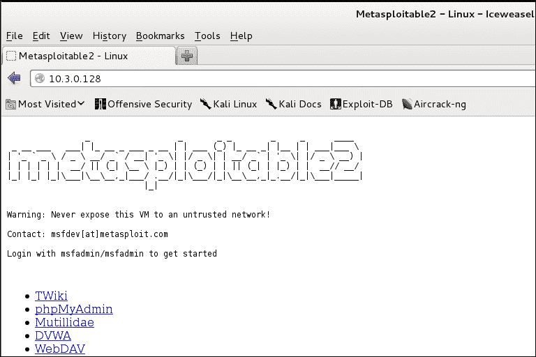

恭喜！你成功了！我们已经建立了我们的外部架构！建立它需要一些时间，但一旦建立完成，我们就可以执行任何类型的外部测试，这就是虚拟化的力量。

### 注意

关于路由的一点说明；如果您搞混了并犯了错误，这可能是一件麻烦的事情，因此，您可能希望考虑永久存储路由更改以在重新启动或其他意外挑战中生存。

您可以像我们讨论的那样创建批处理文件，另一种方法是将路由配置保存在文本文件中，并根据需要复制和粘贴它们。最后，如果您真的想要更加永久地设置路由，那么您可以设置一个 cron 作业或将路由命令放在配置文件中。对于那些想要这样做的人，这留作作业给您！

我们完成的外部架构示例如下图所示：

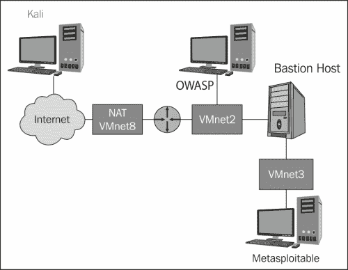

我们现在已经在这里设置了基线架构，并且准备好开始构建和配置各种组件。首先，我们必须进行一些配置更改，因为我们的架构在过滤方面有些松散。我们现在就来做这个。在继续之前，保存我们已经构建的路由器配置。在路由器提示符下输入`write mem`。

对于那些使用 iptables 机器的人，我们将开始解决这个配置的一些变化。到目前为止，这些变化是不需要的，而且你有一个优势，不需要像使用 Cisco IOS 的人那样进行路由器配置条目。

# 配置防火墙架构。

我们已经在我们的 Smoothwall 防火墙中配置了一个规则，这是我们配置的唯一过滤规则。虽然我们很想从外部位置进行测试，并且不设置任何过滤规则，这样就可以实际上给我们一个扁平的网络，但实际上，这种情况很少发生。因此，我们希望在我们的架构中设置一组最小的过滤规则，这将类似于我们在典型网络架构中可能看到的东西。这里有一个重要的观点：如果我们遇到一个良好配置的分层和受保护的架构，我们只能通过它们必须允许进入其服务的端口通过。这就是测试的现实情况；一个良好配置的架构不会为我们提供许多向量，除非它们必须允许的向量。因此，这并不是一件坏事，因为我们知道会有漏洞，我们几乎总是会有一个 Web 服务器和 Web 应用程序可以使用。

在当前的架构配置中，我们在第一层防御上没有设置任何过滤规则，你们中的一些人，如果不是所有人，可能知道，即使我们的外围设备充当路由器，路由器的核心功能之一是过滤流量。虽然传统的路由器过滤被认为是无状态的，即除了它正在处理的当前数据包之外没有任何记忆。今天的外围路由器和过滤功能通常是有状态的，并且与我们传统的防火墙工作方式基本相同。对于我们在书中的目的，我们将保持传统的无状态过滤方法。这是为了提供我们想要测试的弱点，而且它仍然是非常可行的，因为许多管理员会按照传统的方式配置路由器。因此，即使在今天，我们在测试中仍然会遇到弱的过滤配置，你需要知道如何在测试的早期阶段进行测试和识别。

在你的路由器窗口中，输入`sh access-lists`并显示路由器上配置的访问列表，你会看到此时路由器上没有访问列表。这就是为什么我们不仅可以 ping 通过它，还可以通过它访问 Web 服务器。因此，我们想要做的第一件事是配置访问列表。在我们这样做之前，先说一下访问列表。我们可以在访问列表或**访问控制列表**（ACL）中放置多种配置，但是要覆盖这些内容需要一个或两章的篇幅，所以我们只会涵盖基础知识。我们的目的是一旦你在你和目标之间有一个访问列表，我们想看到我们的网络数据包在我们的测试方法中的行为。对于那些想了解更多的人，可以在[`gtcc-it.net/billings/acltutorial.htm`](http://gtcc-it.net/billings/acltutorial.htm)找到一个优秀的教程。

在您的路由器中创建访问控制列表，输入`ip access-list extended External`并按*Enter*。接下来要做的是创建规则；我们希望始终允许 ICMP，以便进行故障排除。我们知道我们只想从 VMnet8（NAT）子网访问，并且可以使用规则设置这一点；输入`permit icmp 192.168.177.0 0.0.0.255 any`并按*Enter*。接下来我们想要配置的是对我们的网页服务器的访问；我们可以制定两条规则，并将它们设置得足够精细，只允许端口 80 的流量到达网页服务器。然而，出于测试目的，允许访问路由器后面的整个子网是可以接受的。此外，这将使我们的测试比始终为每个协议配置一个规则更容易。这是在生产环境中的做法，但我们有一个测试架构的奢侈。在路由器窗口中，输入`permit tcp any any eq 80`，然后按*Enter*。现在我们已经设置好了配置，需要应用它。按*Ctrl* + *Z*返回到主提示符，然后输入以下内容：

```
conf t 
int f0/0
ip access-group External in .

```

现在我们已经准备好测试了；ping 然后访问位于 10.3.0.0 子网的网页服务器。您应该成功，如果没有，那么现在是我们最喜欢的故障排除时间。要查看路由器中的访问列表是否起作用，请按*Ctrl* + *Z*返回到主提示符。一旦在那里，输入`show access-lists`以显示访问列表信息。以下是一个示例截图：


在查看访问列表时的关键是您是否看到匹配项？如果看到匹配项，那么您的访问列表就起作用了。这就是我们防火墙配置的范围。从这一点开始，我们可以向我们的架构添加任何我们想要的东西，并且这正是我们将继续进行各种不同测试技术以模拟我们需要计划的内容时所做的。我们对路由器进行了许多更改，因此在继续保存我们构建的路由器配置之前，请在路由器提示符处输入`write mem`。

现在，对于那些没有 Cisco IOS 访问权限的人，我们将使用我们在第四章*识别范围架构*中设置的 iptables。正如已经提到的，到目前为止，我们的配置几乎没有什么区别，但这将发生改变。iptables 必须配置为允许流量到堡垒主机和位于我们公共 DMZ 中的 OWASP 网页服务器。除此之外，我们的配置没有任何改变。这也是我们选择这个方向的另一个原因。我们构建的架构使我们能够在不改变其后面的任何内容的情况下将任何设备或虚拟机放置为外围设备。对于我们的堡垒主机也是如此；我们可以在构建不同环境时更改它，我们的架构允许我们这样做。

# iptables

对于那些没有 Cisco IOS 的人，我们可以使用 **iptables** 的过滤功能来创建我们在 Dynamips 虚拟机中使用的防火墙功能。

在第四章*识别范围架构*中，我们创建了一个 Debian 发行版作为我们的 iptables 机器。我们还可以使用 iptables 作为我们的堡垒主机过滤器，但出于本书的目的，我们将继续使用 iptables 机器作为第一层防御。当然，您可以在架构中的任何地方构建和插入机器，因为它是灵活的，只是一个基线分层配置。

即使您已经构建了**Cisco Dynamips**机器，您仍应跟着完成添加 iptables 机器到您的架构中的步骤，因为您可能会遇到这种情况。毫无疑问，许多组织正在将 Linux 添加到其企业中，几乎所有这些组织都配备了某种形式的过滤功能。此外，这种 iptables 过滤功能几乎是所有发行版的一部分。

如果您回想一下我们构建 iptables 机器时，我们选择了与我们用于 Dynamips 虚拟机的不同地址。我们这样做是为了始终可以在架构中拥有这两台机器，并且这使我们能够涵盖作为渗透测试人员可能遇到的潜在不同情况。我们所要做的就是在外部机器（Kali）中添加路由，并将其指向 iptables 机器的接口。虚拟配置与 Dynamips 相同。下面的截图显示了一个示例：

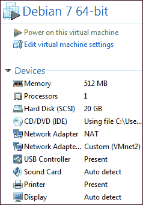

配置中棘手的部分在于路由的配置；因此，在我们处理实际的过滤规则语法之前，我们将先处理这个问题。请注意，我们可以启用数据包转发，然后测试我们的路由，但现在我们只需设置路由方向并验证它是否到达我们想要到达的位置。

打开您的 Debian 虚拟机，一旦启动，请使用您在构建机器时创建的用户名和密码登录。打开一个终端窗口，输入`ifconfig`以显示接口配置信息。请记住，如果您没有以`root`身份登录，您将需要使用`su`命令提升权限，然后输入 root 密码以使命令生效。我们机器的配置示例如下截图所示：

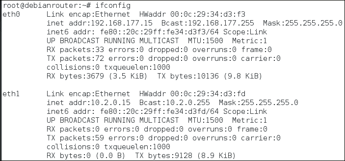

正如前面的截图所示，我们在两个接口上都有 15 地址。我们在本章前面添加了路由，但这些路由是通过 Dynamips 虚拟机的。因此，如果您同时启动这两台机器，就不会有 IP 冲突，但您必须调整其他机器中的路由，以确保流量通过正确的机器。最简单和推荐的方法是在继续之前暂停 Dynamips 虚拟机。要在 VMware Workstation 中暂停机器，请导航至**VM** | **Power** | **Suspend Guest**。

现在机器已经暂停，我们将在 Kali 机器中输入一个路由并进行测试。如果您仍然为 Dynamips 机器输入了路由，那么它将起作用，因为我们只是使用了子网 10.2.0.0，并没有为网关机器添加条目。要测试您的路由，请输入`ping 10.2.0.15 –c 3`以测试您是否具有连接性。如果没有，那么您的路由表中不再有该路由。我们已经展示了如何做到这一点，但为了让您不必考虑或参考本章前面的内容，下面的截图显示了查看表格、添加和测试路由的方法示例：

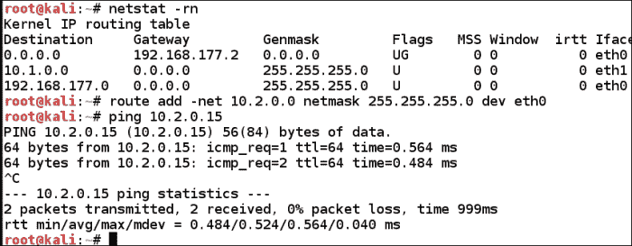

屏幕显示了查看表格、添加和测试路由的方法示例（裁剪的文本不重要）

一旦您成功测试了对 iptables 机器接口的访问，我们将接下来测试与我们构建的 OWASP Web 服务器的连接。在终端窗口中，输入`ping 10.2.0.132 –c 3`来测试与 Web 服务器的连接。请记住，如果您的 OWASP 机器位于另一个 IP 地址，您将不得不输入该地址。但是，您会注意到这次失败了。你知道为什么吗？希望您记得我们在 Dynamips 机器上有一个路由器，因此路由已经设置好了。大多数 Linux 机器的默认安装不会打开 IP 转发。因此，我们必须手动打开它以提供路由器的功能。在 iptables 机器上，在终端窗口中输入`cat /proc/sys/net/ipv4/ip_forward`来检查 IP 转发的设置；如果转发已打开，则该值应为`1`。要打开转发，请输入`echo 1 > /proc/sys/net/ipv4/ip_forward`并用`1`覆盖`0`。转发现在已启用。以下屏幕截图显示了启用转发的示例：


一旦您打开它，您可能无法完成成功的测试。在之前配置路由时，我们没有像应该那样精细化。我们出于一个原因这样做：为了向那些可能对网络技能有点生疏的人展示；此外，您可能已经忘记了您以前拥有的路由知识，如果您一直在更高层花费大量时间的话。我们在这里要表达的是，您必须在 route 命令中放置一个网关。有时，没有网关也可以工作，就像在我们之前的章节中一样，但通常会失败，因此最好尽可能具体地设置我们的路由，以避免这种情况。您必须在 Kali 和 OWASP 虚拟机中输入路由。

以下屏幕截图显示了两台机器的 route 命令示例：

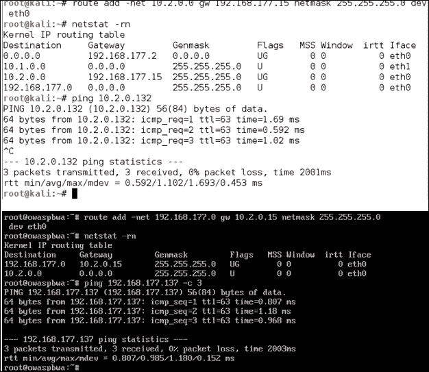

屏幕显示了两台机器的 route 命令示例（裁剪的文本不重要）

提醒一下，如果您设置了自己的方案，您的 IP 地址可能会有所不同。我们现在已经建立了我们的网络架构，所以是时候配置和设置过滤了，因为我们可以访问 OWASP 机器上的任何端口。打开浏览器并验证您是否可以访问 OWASP 机器上的 Web 服务器。

我们现在将在 Debian 机器上配置 iptables。当您配置 iptables 时，可以直接从命令行配置规则。但是，我们将在这里使用的方法是在命令行上输入规则，然后保存它们。在 Debian 中，默认情况下没有设置在启动时加载 iptables 的设置。因此，这不是我们想要保留的状态。为了更正，我们将添加`iptables-persistent`软件包。在终端窗口中，输入`apt-get install iptables-persistent`来获取并安装该软件包。

安装完软件包后，将在`/etc/iptables`文件夹中找到一个名为`rules.ip4`的配置文件。如果你想查看文件，输入`more /etc/iptables/rules.v4`来显示文件内容。正如你所看到的，默认情况下，所有链都设置为`ACCEPT`。我们现在将更改它。因此，我们将使用命令行，然后使用保存实用程序保存我们的更改。在我们这样做之前，我们将测试我们的架构是否具有连通性；我们可以通过 ping OWASP 机器来做到这一点。一旦你成功完成了这一点，现在是时候改变它并阻止数据包的转发了。在 Debian 机器上，输入`iptables –P FORWARD DROP`来将策略设置为拒绝并且不转发所有数据包。我们这样做是因为这是安全的谨慎方法，也是我们在测试环境中会遇到的情况。问题是，如果我们不保存规则，那么当我们重新启动时，规则将不复存在。在我们下载的软件包中，有一个工具可以做到这一点。在终端窗口中，输入`iptables-save /etc/iptables/rules.v4`来将配置保存到文件中。这将使我们在重新启动机器后仍然可以使用规则。未来规则文件应该如下截图所示：


这条规则应该阻止你能够 ping 机器，这正是我们想要实现的。我们目前有一个默认的拒绝策略，并将根据需要添加规则以允许我们需要的流量。我们需要允许的流量是发送到 Web 服务器的 Web 流量。在终端窗口中，输入`iptables –A FORWARD –p tcp –d 10.2.0.0/24 –dport 80 –j ACCEPT`来创建一个规则，将入站端口 80 的流量转发到 OWASP 机器。我们还需要另一个方向的规则。我们可以使用状态指令和其他方法，但我们希望尽可能地创建路由器的功能，这需要两条规则，而无状态过滤器则需要。

我们要输入的第二条规则是`iptables –A FORWARD –p tcp –s 10.2.0.0/24 –sport 80 –j ACCEPT`，以添加返回流量的规则。一旦输入了规则，你可以通过输入`iptables-save /etc/iptables/rules.v4`来保存它们。配置保存后，你现在应该可以访问 Web 服务器，但不能访问 OWASP 机器上的其他内容，这正是我们想要的。这个配置文件的示例如下截图所示：

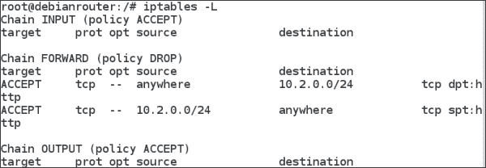

这完成了我们的配置。我们可以根据需要向 iptables 过滤器添加协议，并练习我们很可能会遇到的几乎所有形式的测试。

## 部署 IDS/IPS 和负载均衡器

我们现在基本上已经构建了我们架构的主要组件；因此，现在是时候讨论向我们的测试范围添加监控功能了。有一件重要的事情需要注意：无论我们选择什么监控解决方案，我们都无法预测网站将如何配置它！这是我们在测试时不能忽视的唯一事情。我们可以测试并成功规避我们放置在范围上的监控系统，但由于这些系统主要是基于策略和配置的，有可能我们在实验室中取得的成功不会在现实中得到同样的结果。在本节中，我们将讨论一些可用的监控系统类型的示例，并在书的后面讨论逃避时部署其中一个。

## 入侵检测系统（IDS）

在选择我们的架构的 IDS 时，有一些事情我们需要考虑，比如我们想要将哪种产品设置为我们的实践 IDS。有许多可用的产品，这可能会成为一项艰巨的任务，但由于最受欢迎的产品之一是 Snort，我们将集中讨论它。Snort 的另一个优点是它有免费版本和商业版本。

当我们在网络上部署我们的 Snort 机器时，我们有几种选择，但在解决这个问题之前，我们需要讨论我们将在虚拟环境中部署 Snort 传感器的位置以及流量将如何到达传感器。

在实际的架构中，交换机是一个单播设备，只会将流量转发到目的端口。此外，广播流量是唯一发送到所有端口的流量。在部署 IDS 网络传感器时，这可能会带来问题，我们必须使用 SPAN 端口或 TAP。有关这些选项的更多信息和比较，您可以访问以下链接：

[`www.networktaps.com/`](http://www.networktaps.com/)

幸运的是，在 VMware 交换机中我们没有这个问题。交换机被设置为我们可以看到交换机上的流量，这使我们能够连接 IDS 网络传感器，而不必担心配置 SPAN 端口。要验证这一点，你可以在两台机器之间进行 ping 测试，并在第三台机器上运行`tcpdump`，检查是否可以看到两台其他机器之间的流量。例如，我们将在 OWASP Web 服务器和堡垒主机之间进行 ping 测试；我们将通过在 Kali 机器上运行`tcpdump`来查看 ping 流量。

这在以下截图中有例子：


一旦我们确定我们可以查看交换机上的流量，我们想讨论的下一件事是传感器的位置。对于基于网络的 IDS，正常的配置是在每个段上都有一个网络传感器。因此，唯一的要求是所有的机器都必须连接到同一个交换机。在未来，当我们部署和监控我们的范围时，我们将遵循这种方法。我们的带有 IDS 传感器的外部架构示例如下图所示：


现在我们已经确定了我们架构中传感器的位置，我们将讨论如何在我们的虚拟配置中实现这一点。我们可以构建另一台虚拟机作为 IDS 传感器，但这样我们可能会感受到现有 RAM 的压力。因此，我们更倾向于有一台机器，并配置多个网络卡，并在每个已连接到所需交换机的现有卡上配置 Snort 传感器。

### 注意

为了实现这一目标，我们需要构建一台运行 Snort 的机器。我们可以从头开始构建一台机器，但为了本书的目的，我们将考虑其他选择。然而，从头开始构建一台机器是一次有趣的经历，留给读者作业。关于如何为 Snort 做到这一点的出色资源，也提供了一些平台的指导，可以在[`www.snort.org/docs`](http://www.snort.org/docs)找到。关于这些学习指南的一个注意事项，它们并不是 100%准确的，所以你的实际情况可能有所不同。

为了创建我们的 Snort 传感器，我们将使用一个已经安装了 Snort 程序和所有依赖项的发行版。我们将使用的发行版是**网络安全工具包**。它包含 125 个顶级安全工具，这是值得添加到您的架构中的东西。我们最喜欢的是它设置 Snort 的简易性。您可以从[`sourceforge.net/projects/nst/files/`](http://sourceforge.net/projects/nst/files/)下载 ISO 映像。下载 ISO 映像后，您需要创建一个虚拟机。由于我们已经涵盖了这一点，我们不会再重复。您需要做的是挂载 ISO 映像并引导它。一旦机器引导，您将安装它到硬盘。在桌面上，有一个图标用于安装到硬盘。桌面的一个示例如下截图所示：


双击图标并按照提示将映像安装到硬盘。这将需要一些时间。您可能想知道为什么我们要安装到硬盘，而不是直接从 ISO 映像引导。我们之所以要安装到硬盘，是因为我们希望将 NST VM 作为实际的机器，这样我们就可以保存和构建各种配置，然后保存它们。如果安装时选择了自定义分区，请单击图标并将其更改为自动分区，因为这样可以节省时间。安装完成后，双击桌面上的图标并设置系统密码。设置密码后，在桌面区域右键单击并选择**在终端中打开**以打开新的终端窗口，然后输入`shutdown –h now`以关闭系统。系统关闭后，我们需要配置机器以支持我们需要连接 Snort 传感器的三个接口。

这种配置的一个示例如下截图所示：


正如您可能已经注意到的，在上一个截图中，ISO 映像不再挂载；删除该设置是一个好主意，以避免任何潜在的冲突。一旦验证了您的配置并启动了虚拟机，我们将继续配置机器以满足我们外部架构范围的 IDS 需求。打开一个终端窗口并输入`ifconfig`，验证您是否有三个接口，如下截图所示：

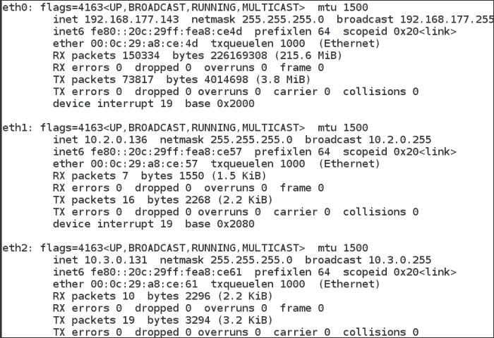

现在我们已经设置了接口，准备启动 Snort。我们选择网络安全工具包的原因是它为我们提供了一个非常简单的 Snort 传感器设置。单击**活动**，选择 Firefox 图标并打开浏览器，系统将提示您输入用户名和密码。输入用户名`root`和安装到硬盘时设置的密码。在 Web 界面中，单击**安全** | **入侵检测** | **Snort IDS**以打开配置 Snort 的 GUI。这种配置的一个示例如下截图所示：


显示配置 Snort 的 GUI 的屏幕（裁剪的文本不重要）

要配置传感器，请选择您要启动的传感器的单选按钮，即 eth0 接口。选择接口后，向下滚动并单击**设置/启动 Snort**以启动传感器。给它一些时间，然后单击**检查状态**以查看传感器是否已启动。有时需要尝试两次，如果显示停止，请单击**启用**，然后再次运行该过程。一旦成功，您应该看到接口上正在运行的进程。对其他两个接口执行相同的步骤。这种配置的一个示例如下截图所示：


显示在接口上运行的进程的屏幕（裁剪的文本不重要）

就是这样！我们现在使用 Snort 工具拥有了一个完全分布式的 IDS，并且我们已经将传感器连接到架构的每个交换机上。我们不会在这里详细介绍如何使用 IDS，因为当我们展示规避方法时，我们将会详细介绍。现在，我们至少想简单地查看一种验证您的 Snort 安装是否正常工作的方法。在传感器的右侧，有许多按钮；点击**规则**按钮以选择 eth0 接口。这将显示您可以在接口上配置的规则；当您审查规则时，您会发现这个基本安装并没有启用太多规则；这是为了避免误报。通常，网站会禁用扫描规则，因为它可能导致许多误报，而实际上，扫描是如此常见。我们希望通过在单选按钮中选择它来启用接口的扫描规则。一旦您对规则进行了更改，您将需要重新加载接口。点击**仅包括所选规则**。以下是此示例的屏幕截图：


下一步是重新加载传感器以更新规则。点击**管理 Snort 进程**以管理 Snort 传感器，然后点击**重新加载**按钮。现在我们准备测试我们的传感器！打开一个终端窗口并输入`cd /etc/snort_eth0`以进入在运行 NST 脚本文件时配置的目录。当您使用 Web 界面启动传感器时，所有配置文件都位于此处。从这里开始，流程是再次启动 Snort 传感器并执行快速测试。再次强调，这只是一个测试传感器的快速参考；在规避部分，我们将更多地使用 NST 分发。正如您所见，我们必须启用扫描规则以便检测扫描，这是非常常见的。

此外，即使启用了扫描规则，也有方法可以避免检测，但这是另一回事。在终端窗口中，输入`snort –A console –c snort.conf`以启动另一个 Snort 实例并将信息记录到控制台。如果您没有 root 权限，您将需要以`root`身份运行该命令。打开另一个终端并输入`nmap –sX –p 137,445 192.168.177.1`以对主机进行圣诞树扫描。以下是您应该在 Snort 控制台上看到的警报的示例屏幕截图：


这证实了我们已经配置了 Snort 并且规则正在工作。此时，我们不会再做更多的工作。欢迎您自行探索。NST 分发拥有大量的工具，值得进一步探索学习，建议您将 NST 作为 Kali 机器的一个很好的补充。

## 入侵防范系统（IPS）

我们已经部署了 IDS，现在是时候把注意力转向 IPS 了。在 IDS 的早期，IDS 为我们提供了三个功能；它们是监视、检测和响应。这就是 IPS 的来源；今天的响应功能是响应和潜在地防止攻击。在大多数情况下，网络 IPS 的响应是根据 IP 地址进行阻止。对于基于主机或机器的 IPS，阻止进程访问某些内容。这方面的一个有限的例子是 Windows 最新版本的**用户账户控制**（**UAC**）保护。这些方法的问题在于我们要求软件检测真实攻击与可能不真实攻击的区别。也就是说，我们要求软件进行思考。我认为，无论媒体或娱乐行业如何描绘，我们都没有思考的软件。例如，当我们在机器上执行一个涉及 UAC 的操作时，它会警告我们有事情发生；问题在于它警告我们太多，以至于我们只是点击**是**。因此，这不是一种有效的保护方法。我们知道用户很可能会点击；这对测试有好处，对安全有害。

多年前，我们会伪装客户端网站使用的 IP 地址，比如他们的网关，然后发动攻击。响应动作是阻止 IP 地址，结果他们阻止了自己的网关，没有人能够访问他们网络之外的任何内容。因此，可以想象，IPS 在部署时可能会引起问题；因此，根据我的经验，如果部署了 IPS，通常会配置为监视模式而不是阻止模式。

在 IPS 方面，我们的范围内可用的产品并不多，而且都是商业产品。因此，我们暂时不会在我们的范围内添加 IPS。当我们到了规避部分时，我们会再次考虑这个问题。我们在范围内的 IPS 部署将取决于我们在客户端遇到的情况和工作范围的细节。

## 负载均衡器

在向我们的架构添加负载均衡器时，有几种选择。测试的主要问题是检测负载均衡器是否就位，并在进行测试时处理相关问题。

我们将集中讨论在我们的架构中实现负载均衡的潜在选择。我们只会讨论协议负载均衡。我们有能力在 iptables 中使用负载均衡。关于这一点的例子，请参考以下屏幕截图：


在上一个屏幕截图中的示例中，使用了在三台机器之间旋转数据包的概念。配置负载均衡将传入的 HTTPS 流量分配到三个不同的 IP 地址，使用`counter 0`来处理每第三个数据包。

我们下一个负载均衡的例子是 pfsense 防火墙；在防火墙配置中有负载均衡的功能。要获取有关配置入站负载均衡的额外信息和教程，请参考这个网站[`doc.pfsense.org/index.php/Inbound_Load_Balancing`](https://doc.pfsense.org/index.php/Inbound_Load_Balancing)。此外，Lee Allen 的书《高度安全环境的高级渗透测试：终极安全指南》中有关于如何使用 pfsense 进行负载均衡的详细信息。

## 集成 Web 应用防火墙

在撰写本书时，您遇到的越来越多的架构开始部署其 Web 服务器的保护。此外，部署 Web 应用防火墙（或 WAF，通常所说的）变得越来越普遍。因此，我们需要在我们的架构中部署它们，以测试并确定如何通过它们。我们将在后面的部分详细介绍这些细节。现在，我们将看看如何向我们的架构添加 WAF 功能。最受欢迎的免费开源 WAF 之一是 ModSecurity。我们将在后面的章节中重新讨论这个问题；现在，我们将向我们之前架构中使用的现有 metasploitable VM 添加一个 WAF。

在安装和配置 WAF 之前，我们将克隆机器并为我们的架构创建一个 WAF 设备。这将允许我们将 WAF 机器连接到我们范围的任何地方，以便我们可以测试我们通过它的能力。这将为我们提供以下图表中显示的配置：

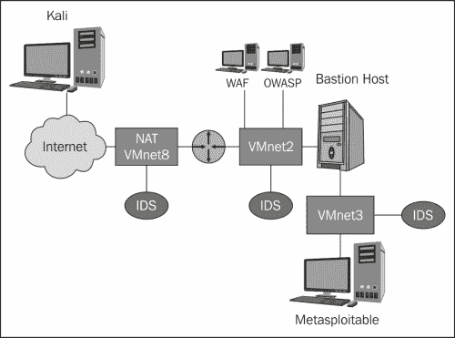

由于我们需要访问互联网，您需要更改网络适配器，以便它连接到 NAT 开关并为我们提供互联网的链接。更改配置后，启动机器。登录后，输入`sudo –i`以假定特权的根级别。

我们需要下载软件，我们将使用`wget`命令。当您阅读本书时，链接将会有所不同。因此，转到网站并验证当前可用的版本，并更改版本号以匹配您发现的版本，然后下载应该正常进行。在终端窗口中，输入`wget http://www.applicure.com/downloads/5.12/Linux/i386/dotDefender-5.12.Linux.i386.deb.bin.gz`以连接并下载软件。软件下载完成后，是时候安装它了。但是，在这之前，我们必须解压缩它并使其可执行。输入`gunzip dotDefender-5.12.Linux.i386.deb.bin.gz`以解压文件。文件解压缩后，我们现在必须使其可执行。输入`chmod +x dotDefender-5.12.Linux.i386.deb.bin`并更改执行权限。这些命令的示例如下图所示：

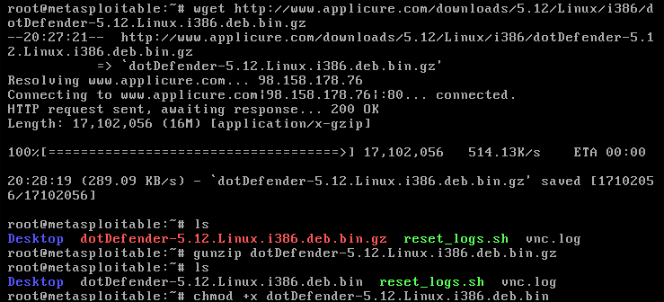

现在我们准备开始安装过程。输入`./dotDefender-5.12.Linux.i386.deb.bin`以开始安装过程。按默认设置进行，直到您必须输入 Apache 可执行文件的路径。输入`/usr/sbin/apache2`作为 Apache 服务器的位置，并继续使用安装默认设置，直到您输入要访问应用程序的 URI。输入`dotDefender`。然后，输入管理员访问密码；在测试环境中，您可以输入任何您选择的密码，但我喜欢保持简单，所以我们将使用密码`adminpw`并继续安装。在更新选项中，选择**任一**选项并继续安装。如果提示更新周期选项，请选择您选择的任何一个，然后单击**下一步**。选择第一个选项从网站获取更新，然后单击**下一步**继续安装。

如果一切顺利，您应该看到安装完成的成功消息，如下图所示：

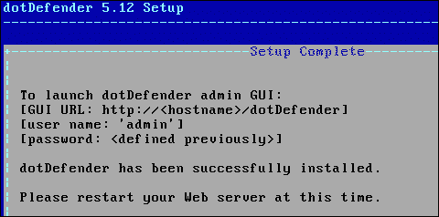

现在，根据完成消息的指示，我们需要重新启动 Apache；输入`/etc/init.d/apache2 restart`以重新启动服务器。重新启动 Web 服务器后，我们将访问 WAF。打开您选择的浏览器，并使用 Metasploitable 机器的 URL 连接到 WAF。连接后，输入管理员用户名和您在安装过程中选择的密码，并访问配置页面；如下图所示的示例：

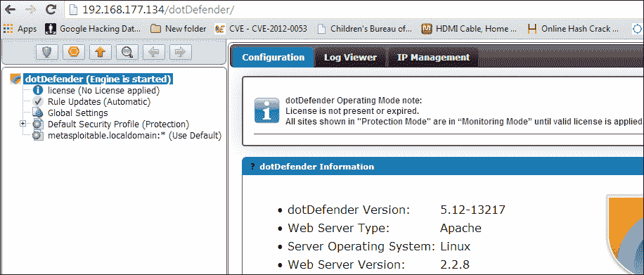

由于我们尚未应用许可证，我们只处于监控模式，但对于我们的测试和使用 WAF 进行练习来说，这已经足够了。现在我们想要测试我们的 WAF，并且我们将使用 Kali 发行版进行测试。在 Kali 机器上，打开一个终端窗口，输入`nikto –h 192.168.177.134`来使用 nikto 网络扫描程序，看看 dotDfender WAF 是否会发出警报。如果您的 WAF 位于不同的 IP 地址，则必须将目标地址更改为您的 WAF 的 IP 地址。扫描完成后，返回到您的 dotDefender，并导航到**日志查看器** | **Metasploitable**，查看来自 WAF 的日志。您应该会看到来自 nikto 扫描的一些警报；以下是一个示例截图：


我们现在已经为外部测试以及其他方法构建了一个强大而完整的架构。我们拥有可以在许多不同情况下重复使用的组件；因此，从本章的角度来看，我们的需求已经得到满足，我们也完成了我们的目标。最后要做的一件事是对本章中配置的所有机器进行快照，以防万一出现问题。

# 总结

在本章中，我们建立了一个分层架构，以满足我们可能遇到的各种情况的需求。我们从分层方法开始，以满足我们外部测试的需求。

在定义了各层之后，我们开始向架构的每个部分添加所需的组件。我们还研究了过滤和路由的需求，并构建和配置了 Cisco 路由器模拟器以及 iptables 机器，以满足我们的过滤需求。

一旦我们配置并测试了第一层组件，我们就开始添加防火墙到架构中的任务。我们使用了流行的工具 Smoothwall 作为我们的防火墙，并将其配置为支持一个服务以进行测试。

在构建了防火墙并测试了配置之后，我们接下来着手添加监控功能到网络。我们在所有三个所需的子网上构建和配置了 Snort，以支持我们对入侵检测的需求。然后，我们讨论了向配置中添加 IPS 和负载平衡的过程。

最后，我们讨论了集成 Web 应用防火墙的内容。我们安装并配置了 Web 应用防火墙 dotDefender。一旦我们建立了机器，我们对其进行了克隆，这样我们现在就有了一个可以连接到架构中任何位置的 WAF 机器。在完成克隆过程后，我们使用了一个工具 nikto 来测试我们的 WAF 是否能检测到 Web 应用程序类型的攻击。

本章到此结束。您现在拥有一个完整的分层架构，包括路由需求。现在，只需连接所需的目标到这个架构，并测试看看对目标的攻击是否奏效。从这一点开始，我们将看看可能遇到的目标，然后进行实验，看看我们能发现什么。范围的基础和核心已经建立，现在是时候添加目标了。我们将遇到的第一个保护，也是目标，将是某种设备；因此，这将是我们下一章的起点。
