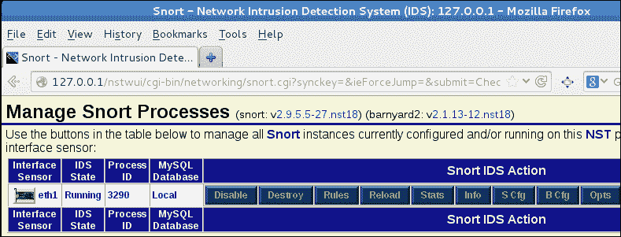
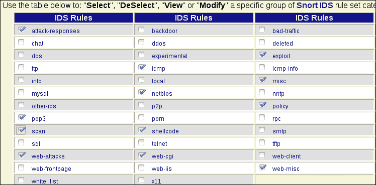
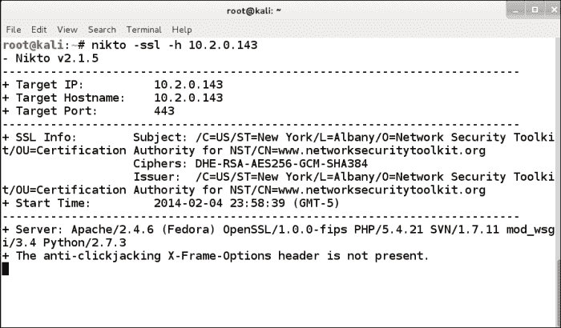
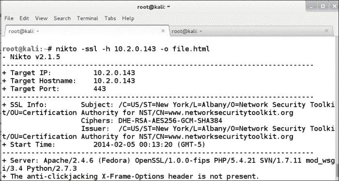
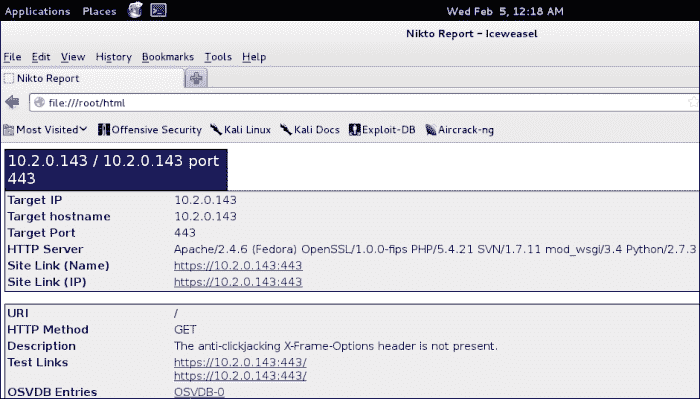
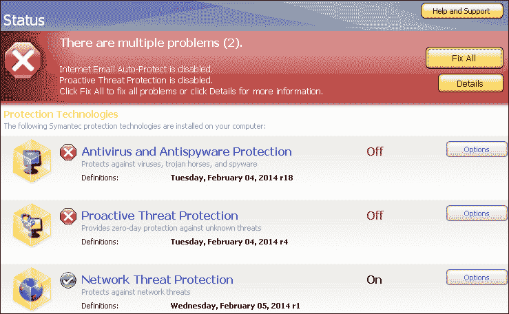
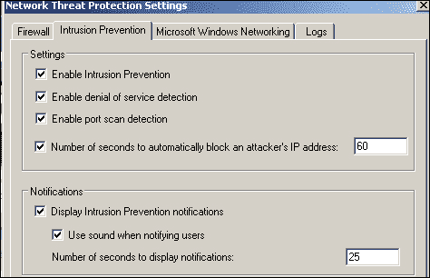
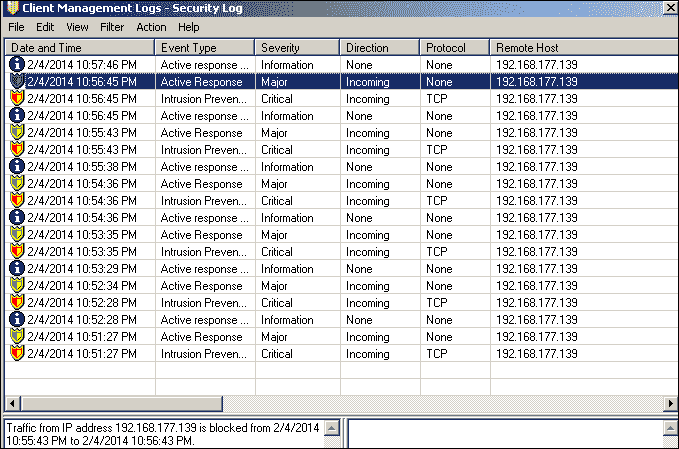
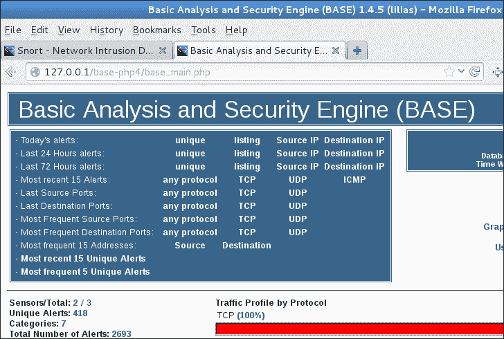
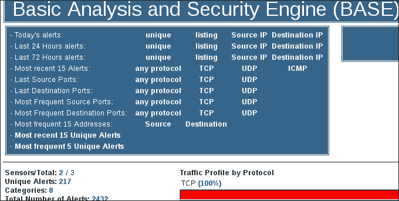

# 第八章。设计 IDS/IPS 范围

在本章中，我们将学习设计和构建各种 IDS/IPS 功能到我们的网络范围的技术。我们还将研究典型主机和端点安全配置的部署。我们将讨论以下主题：

+   部署基于网络的 IDS

+   实施基于主机的 IPS 和端点安全

+   使用虚拟交换机

+   规避

本章将为我们提供一种方法论，用于当我们遇到多种不同的监控设备时使用。在本章中，我们将研究规避，即避免被检测到的技术。虽然这是一个热门话题，作为专业的安全测试人员，现实情况是很少被要求；而且，它取决于很多因素，不是一件容易准备的事情。成功很大程度上取决于入侵检测系统（IDS）传感器的类型和位置以及其配置。有可能会要求您规避检测作为工作范围的一部分，这就是为什么我们在本书中涵盖这一内容。

# 部署基于网络的 IDS

正如我们在第六章中讨论的那样，当我们部署基于网络的入侵检测系统（IDS）时，我们在网络的每个段上放置一个传感器。传感器由放置在混杂模式的网络卡组成，这会关闭 MAC 地址过滤。所有的流量都会通过堆栈传递到监视传感器的应用程序。我们还讨论了在交换机上部署传感器的挑战，因为流量不会发送到所有端口，这可能会对向传感器提供数据构成挑战。

对于基于网络的 IDS，IDS 的功能是在数据包级别处理网络流量，然后分析其中可能表明攻击的特征或模式。在考虑这一点时，请记住网络传感器正在捕获数据包；那么在任何时候有多少数据包在网络中传输？这是基于网络的 IDS 的挑战之一（如何处理网络速度不断增加的流量）。然而，我们正在超前。我们要做的第一件事是设计我们的架构，以便我们能够充分代表我们可能在客户网络上看到的典型 IDS。我们将使用以下图表：


我们的架构

我们可以在每个点构建架构并测试传感器，但实际上这样做没有意义。这是因为我们有幸使用虚拟环境，比如 VMware。因此，一旦我们决定要测试什么，我们只需将网络适配器更改为连接到该交换机。这也是我们做出选择的另一个原因。

还有一件事要注意的是，我们希望有一个受害者来攻击并查看 IDS 的响应，但更好的方法，特别是在规避方面，是将攻击流量直接引导到网络传感器。这将使我们有能力看到攻击是否能够在不被检测到的情况下通过传感器。我们将在*规避*部分中进行这项工作。

接下来，我们将启动三台机器并验证我们是否已经启动并运行了 IDS。在执行此操作之前，您应该使用网络安全工具包、Kali 机器和受害者验证您的设置，并检查它们是否都连接到 VMnet2 开关。您可能会想知道为什么我们不使用 VMnet8 开关，因为它可以为我们提供互联网连接和 VMware 的其他内置功能。这是一个有效的问题，我们选择另一个开关的最大原因是我们希望确保没有任何偶发或异常的流量会给传感器带来问题。VMnet8 开关与主机机器共享适配器配置，并且通常会传输数据包，可能会干扰我们的结果。一旦机器启动，我们将启动 Snort 传感器。登录到网络安全工具包虚拟机，然后点击**活动**并选择 Firefox 图标。

当 Firefox 网络浏览器启动时，如果用户名和密码详情没有填写，请输入所需信息，然后点击**确定**。这将使您进入网络安全工具包 Web 用户界面的主页。然后，转到**安全** | **入侵检测** | **Snort IDS**，如下截图所示：


一旦 Snort 页面打开，您将想要查看您暂停或关闭虚拟机时留下的机器状态。如果您没有看到列出的状态传感器，则必须为传感器配置接口。即使我们之前解释过这一点，我们将再次进行操作，以便您不必寻找它。如果您没有看到列出的传感器，则需要向下滚动并选择适当的接口。对于本书，我们使用 eth1 接口，因此接下来的示例将基于此。如果您已将 VMnet2 开关设置为另一个接口，则必须选择该接口而不是我们使用的接口。

一旦您选择了适当接口的单选按钮，然后点击**设置/启动 Snort**来启动接口上的传感器。

### 注意

您很可能需要点击两次按钮才能使传感器真正启动。

一旦传感器成功启动，您应该看到 Snort 传感器处于**运行**状态，如下截图所示：



显示 Snort 传感器处于运行状态的屏幕（裁剪的文本不重要）

一旦进程处于我们想要的状态，我们将验证我们的规则是否已打开。点击**规则**并验证是否选择了**扫描**规则。如下截图所示：



验证屏幕是否选择了扫描规则（裁剪的文本不重要）

### 注意

如果您更改了规则，则必须重新加载传感器。重新加载按钮位于**规则**按钮的右侧。

现在我们的规则已经达到我们想要的效果，我们准备验证我们的传感器是否正在运行。我们之前已经介绍了这些步骤，但我们不会让您自己去找。我们必须打开一个终端窗口并输入以下命令：

```
cd /etc/snort_eth0
snort –A –c snort.conf

```

一旦您启动了 Snort，打开另一个窗口并使用非法标志组合扫描来验证传感器是否正常工作。作为提醒，在第六章中，我们使用了圣诞树扫描，*创建外部攻击架构*，您可以使用这个或包含非法标志（如 FIN 或 NULL 扫描）的任何扫描。

除了 Snort 的易于设置之外，我们还喜欢网络安全工具包的另一点是我们有出色的 Snort 工具。我们将查看**Base Analysis Search Engine**（**BASE**）工具。要启动 BASE，您需要导航到**安全** | **入侵检测** | **BASE**。示例如下截图所示：

部署基于网络的 IDS

当 BASE 工具启动时，将要求您进行身份验证。凭据应该已经为您输入，如果没有，则必须输入适当的凭据以访问 GUI。完成后，单击**确定**，如下截图所示：

部署基于网络的 IDS

BASE GUI 允许我们在图形显示中记录传感器检测到的警报。返回到您的 Kali 机器并再次运行圣诞树扫描。作为提醒，您可以使用**X**选项配置扫描。扫描完成后，返回到**BASE**显示并刷新显示，您现在应该看到检测到的 TCP 流量，如下截图所示：

部署基于网络的 IDS

BASE 工具的一个好处是您可以从警报中检查的信息。我们现在将这样做。单击百分比数字，这将打开另一个窗口，其中列出了传感器检测到的警报。示例如下截图所示：

部署基于网络的 IDS

接下来要做的是检查警报。单击警报时，将看到有关警报的其他信息。示例如下截图所示：

部署基于网络的 IDS

如前面的截图所示，可以查看数据包的组成，包括封装数据的显示。这显示了**Nmap**工具设置 FIN、PUSH 和 URGENT 标志以表示扫描。一些工具在执行扫描时会设置所有六个标志。

**Meta**部分和**触发签名**下有两个链接。单击 Snort 链接，将显示触发签名的规则。示例如下截图所示：

部署基于网络的 IDS

前面的截图显示了您可以检查的信息，以发现有关签名的其他详细信息，以及触发事件的影响。此外，您还可以了解有关误报率的信息。这很重要，因为许多实施 IDS 的管理员会关闭生成大量误报警报的签名。事实上，您可能还记得，我们不得不打开扫描规则，这是因为它有很高的误报率。现在我们将检查 Nmap XMAS 扫描的误报率。向下滚动并查看信息。示例如下截图所示：

部署基于网络的 IDS

现在我们有一个 IDS 范围，可以用来观察我们不同的工具和技术的反应。在这之前，我们将清除机器中的任何警报，为此，您需要转到**查询结果**屏幕的底部，然后导航到**操作** | **删除警报**。完成此操作后，单击**整个查询**按钮以删除警报，然后通过单击**主页**返回到主屏幕。我们将使用 Nikto Web 扫描工具来查看 Snort 传感器在使用扫描程序时的反应。我们将扫描 Snort 传感器网络上的网络安全工具包 Web 服务器。要在 Kali Linux 机器上进行扫描，打开终端窗口并输入`nikto –ssl –h <传感器的 IP 地址>`，如下截图所示：



`ssl` 选项用于强制检查 **安全套接字层** (**SSL**)，因为在默认配置中，网络安全工具包在端口 80 没有 web 服务器；只有 HTTPS 端口 443 可以访问。扫描完成后，您会注意到有几个发现。要查看这些发现，您需要向后滚动并寻找它们。与大多数工具一样，有更好的方法，我们现在将探讨这一点。

在终端窗口中，我们将使用工具的输出功能将其写入文件。输入 `nikto –ssl –h <传感器的 IP 地址> -o file.html`，如下面的截图所示：



这将工具发现的输出写入了一个 HTML 文件。通过导航到 **应用程序** | **互联网** | **Iceweasel Web 浏览器** 来打开 **Iceweasel**。当浏览器打开时，打开您创建的文件并查看结果。您会看到输出结果更容易阅读，如下面的截图所示：



现在是时候返回到我们的 Snort 传感器和 BASE 显示，看看是否有任何警报。我们进行了许多网络扫描，想要看看检测到了什么。返回到您的网络安全工具包，刷新 BASE 显示并查看信息。以下是示例截图：


正如前面的截图所示，我们没有警报！为什么呢？这是试错过程的一部分。我们知道在配置 Snort 传感器时加载了特定规则，因为我们过去必须启用一些规则。因此，从这里开始的过程将是尝试启用更多规则并查看发生了什么。还有很大的可能性存在其他问题，但只要我们发送非法的标志组合数据包进去，我们就会收到某种警报，这告诉我们传感器正在工作。在这种情况下，即使您打开了所有规则，也不会有警报。我们将在规避部分得到答案。

# 实施基于主机的 IDS 和端点安全

一个站点可以配置和部署他们的基于主机的保护或者说他们的端点安全的不同方式。作为测试人员，在实施这些措施时需要进行实验。这些产品大多是商业产品，您必须从供应商那里获取试用版本或请求概念实施。无论哪种方式，您在网络范围内部署这些产品的能力将在很大程度上取决于您的客户拥有什么。这是在您进行非侵入式目标搜索的早期阶段获取的信息。然而，通常在会议上确定工作范围时或在允许并且在范围内的测试的社会工程阶段提供给您。

我们将查看 Symantec 的一些热门端点保护软件。正如我们在前一段中所说，您可能会遇到其他软件，但在这些检测解决方案的大多数中，都设置了一些警报或报警阈值。作为测试人员，这就是我们需要确定的。因此，这将在规避部分进行讨论。

我们将要查看的 Symantec 版本是较旧的版本（版本 11.0），但它将满足我们的目的。这里的意图是，当您准备进行一项工作时，您将在实验室环境中尽可能多地创建。一旦您安装了基于主机的 IDS 或 IPS，您将查看其配置，以了解工具用于检测和/或阻止事件的内容。

使用 Symantec 工具，我们查看工具配置中的选项以获取这些信息。以下是仪表板的示例截图：



正如前面的屏幕截图所示，有三个主要的保护区域。我们目前只启用了一个，这是我们首先要看的。我们将导航到**选项** | **更改设置** | **入侵防范**，以打开菜单来更改阻止疑似攻击流量的设置。以下是此示例的示例：



正如前面的屏幕截图所示，我们有许多数值可以配置和自定义，这是我们作为测试人员面临的挑战之一。如果管理员已经调整或更改了设置为不同的值，我们可能无法逃避检测，但我们现在还没有进入逃避部分。我们已经在这里更改了默认值。

接下来我们需要做的是看看我们是否能够检测到潜在的攻击并实际上阻止 IP 地址。我们可以使用 Nmap，但我们更喜欢使用更具攻击性的工具，这就是 Nikto 的用武之地。我们将把它指向 Symantec 机器的 IP 地址，看看会发生什么。以下是结果的示例：


正如前面的屏幕截图所示，攻击已被检测到并且 IP 地址现在被阻止；这就是为什么我们将阻止时间改为 60 秒，这样 Nikto 扫描就不会花太长时间。扫描完成后，我们可以在 Symantec 工具中查看检测历史和相应的阻止。所有这些功能对用户来说非常好用，但对攻击者也很有利。以下是 Nikto 扫描的日志结果示例：



正如前面的屏幕截图所示，入侵防范工具已经检测到并随后阻止了来自该工具的攻击尝试。问题在于，正如你们中的许多人可能知道的那样，IP 阻止并不总是一个好主意，因为我们可以伪造 IP 地址，然后用户将被阻止。这就是为什么 IP 阻止通常只针对可能导致重大损失的东西进行配置的原因之一。

Symantec 工具还有其他几个部分，我们这里不会全部涵盖。但是，我们将看一下一个与网络无关但实际上与主机相关的部分。我们现在要看的功能是**防病毒和防间谍软件保护**。我们要做的第一件事是点击**修复所有**按钮，这将打开所有的保护措施，如下一张屏幕截图所示：


屏幕显示所有的保护措施（裁剪的文本不重要）

我们现在已经启用了所有的端点保护；因此，任何我们尝试放入机器上被视为威胁的程序都将被保护机制标记。为了证明这一点，我们将使用 Jamie Butler 于 2005 年编写的 FU rootkit 来展示 Microsoft 使用 Intel 架构环的弱点。这个问题的详细解释超出了本书的范围，但是对于想了解更多的人，可以获取他与 Greg Hoglund 合著的书籍*Rootkits: Subverting the Windows Kernel, Addison Wessely*。

当我们将 FU rootkit 的可执行文件复制到受保护的机器上时，它立即被检测为威胁，如下一张屏幕截图所示：


正如前面的截图所示，它已被检测并分类为**Hacktool.Rootkit**，因为被视为威胁，所以被删除了。我们可以通过单击防病毒和防间谍软件保护来查看检测的更多细节。导航到**选项** | **查看日志** | **风险日志**以查看已检测到的风险。以下是一个示例截图：


正如前面的截图所示，检测是在两个文件上进行的，可执行文件是一个，`msdirectx.sys`是加载和用于访问内核内存的驱动程序。FU rootkit 是一个先驱，因为它是第一个实现**Direct Kernel Object Memory**（**DKOM**）操纵的。

那么，这对我们的范围架构有什么影响呢？嗯，正如已经提到的，你将会遇到各种各样的产品。所以，在大多数情况下，我们等待并查看客户可用的产品，然后开始研究获取副本并进行实验。正如你们中的许多人可能知道的那样，关键在于我们因文件的签名而被检测到。因此，我们将使用工具来更改该签名；然而，这是逃避，所以我们将在本章后面进行讨论。

# 使用虚拟交换机

在构建我们的范围时，我们必须考虑我们拥有的交换机类型，以及我们是否需要配置**Switch Port Analyzer**（**SPAN**）或**Test Access Point**（**TAP**）。像大多数事情一样，每种方法都有优缺点。您可以在网站[`www.networktaps.com`](http://www.networktaps.com)上了解更多信息。以下是网站上的比较示例截图：


如果您正在使用物理交换机构建您的范围，那么这是您必须考虑的事情。但是，如果您使用虚拟交换机，那么我们就没有这个挑战。我们已经看过一次，但我们想从入侵检测的角度来看。为此，我们将运行我们的扫描，但这次不是直接在传感器上。在继续之前，您需要 Kali Linux 机器、OWASP 和 Network Security Toolkit。启动这三台虚拟机器后，我们将继续。

一旦机器上线，我们将从我们的 Kali Linux 机器对 OWASP 机器进行扫描，并跨 VMnet2 交换机运行 Network Security Toolkit 上的 Snort 传感器。设置如下图所示：


接下来，您需要在 Network Security Toolkit 机器上启动 Snort 传感器。我们在本章前面介绍了这些步骤。

### 注意

在正确的接口上启动传感器，选择连接到 VMnet2 的接口。在本书中，我们使用 eth1 接口。

传感器运行后，启动 BASE GUI 并清除当前列出的所有警报。我们接下来要做的是从 Kali Linux 机器对 OWASP 机器进行扫描。我们可以使用任何工具，但是为了演示，我们将使用之前使用过的 Nikto 工具。我们的 OWASP 机器的目标 IP 地址是`10.2.0.132`，这是我们在工具中将使用的地址。在 Kali Linux 终端窗口中，输入`nikto –h 10.2.0.132`来扫描 OWASP 机器。返回到 BASE 显示并查看攻击是否被检测到。

以下是示例截图：



显示 BASE 显示的屏幕（裁剪的文本不重要）

正如前面的截图所示，流量已经生成了一些警报。接下来我们要做的是查看传感器生成的警报。点击**100%**，这将显示传感器报告的警报列表。由于我们使用 Nikto 工具，我们正在寻找与 Web 流量相关的警报。以下是一个示例：


现在我们有了警报，所以选择其中一个并进一步检查。在本章早些时候我们检查警报时，我们看到了有关生成警报的数据包的附加信息。然而，我们没有任何有关数据包有效载荷的信息。这是因为没有有效载荷可以捕获。由于这些数据包是攻击模式，我们有更好的机会找到有效载荷。以下是目录遍历攻击的有效载荷示例：


你可以看到，虚拟交换机上的传感器不需要 SPAN 或镜像来查看网络流量，就像物理交换机一样，所以我们准备继续下一节。

# 规避

在这一部分，我们将讨论规避的主题。这来自于经常提到的**永远不要被抓住！**的概念。虽然这在戏剧中很有趣，但现实是渗透测试很少会要求这样做。此外，这高度依赖于管理员如何配置他们的环境。没有保证我们会通过，但我们可以进行实验，并至少找到一些可能在我们的工作范围内起作用的东西。

## 确定阈值

我们想要关注的是所有这些工具都必须有某种阈值，并且在达到这个阈值时会发出警报。这就是我们可以找到规避检测的方法。如果我们重新审视我们的 Snort 传感器并清除所有现有的警报，我们可以尝试一些不同的事情，看看何时被探测到，何时没有被探测到。

### 注意

要记住的一件事是，任何带有非法标志组合的扫描都会立即被探测到，所以如果规避是你工作范围的一部分，要避免这些。

对于 Snort 传感器，阈值似乎在五个关闭的端口左右，也就是说，收到 RST 数据包会让你被探测到；因此，只要你在任何时候扫描的端口数保持在五个以下，你就不会被探测到。

## 压力测试

我们可能需要对我们的 IDS 传感器进行的另一种测试是压力测试。通过这种技术，我们产生大量噪音，看攻击是否能被噪音掩盖，或者传感器是否会被压倒而停止工作。在 Kali 发行版中，有许多工具可以做到这一点，欢迎你去尝试。你可以通过导航到**应用程序** | **Kali Linux** | **压力测试**来找到它们，并查看那里的程序。我们将把这个测试留给你做家庭作业。你会发现 IDS 工具已经存在了很长时间，不会被这些攻击淹没。话虽如此，总会有机会，这就是为什么我们要涵盖它的原因。

## Shell 代码混淆

在检测利用程序时，被检测到的数据是 shell 代码；此外，还有该代码的签名。由于这是一个标准，工具很容易检测到它。我们现在来看看这个。你需要你的 Kioptrix 机器，因为我们要利用它。我们已经讨论了许多这样做的方法，对于我们的目的，我们将使用 metasploit 工具来利用它。当我们试图规避检测时，有许多参数可以操纵，不幸的是，没有保证。如果你使用 Armitage 工具，那么你可以选择**显示高级选项**来查看我们可以使用的额外参数。以下是一个示例：


我们将首先使用默认设置进行漏洞利用，看看 BASE 工具检测到了什么。再次强调，逃避没有保证，所以这是一个实验和记录你的发现的问题。漏洞利用尝试的示例如下截图所示：


如前面的截图所示，我们并没有成功，所以现在我们将修改载荷，看看我们是否有更好的运气。这是一个过程：你尝试不同的方法，找出什么有效，什么无效。这就是为什么很少会要求逃避的好事。

在高级选项中，我们可以修改许多参数，但在撰写本书时，我们无法成功地使用这些工具逃避检测。如果你想了解更多，你可以收集更多信息，并查看一个针对反病毒逃避编写的脚本：[`healthtalkie.com/discussion/script-for-av-evasion-uz3mb.php`](http://healthtalkie.com/discussion/script-for-av-evasion-uz3mb.php)。

关于逃避，我们还有最后一件事要尝试。有时，尝试不同的端口可能更容易，因为你知道默认情况下 IDS 不会检查的端口。这种遗漏是正常的，因为流量会产生太多的误报。

在本章的前面，我们使用 Nikto 工具对网络安全工具包进行了扫描，并没有发现任何问题。现在我们将更仔细地研究一下。我们对 NST 进行的扫描是针对端口 443 和协议*HTTPS*的。为什么没有被检测到可能有多个原因。首先，我们将测试是否没有被检测到是因为攻击是针对端口 443 的，实际上这是加密流量，IDS 对此是盲目的。我们有几种选择来完成这个测试。我们可以在 NST 虚拟机上启动 web 服务器，或者在 OWASP 机器的服务器上激活 HTTPS 协议。我们将使用 NST 机器；我们必须导航到配置文件并取消注释 HTTP 行以在机器上运行它。在终端窗口中，输入`gvim /etc/httpd/conf/httpd.conf`来打开配置文件。

滚动到服务器配置部分，并删除`#`以取消注释`Listen 80`，如下截图所示：


编辑完成后，通过导航到**文件** | **保存-退出**退出编辑器。接下来你需要做的是重新启动 web 服务器。在终端窗口中，输入`service httpd restart`来重新启动服务。服务重新启动后，我们将使用 Nikto 对 NST 机器进行扫描。对于第一次扫描，我们将使用 SSL 选项，但在此之前，请确保清除 BASE 中的所有查询。返回到你的 Kali 机器并扫描 NST 机器的 IP 地址。在我们的例子中，机器地址是 10.2.0.144，这就是我们将要使用的。在终端窗口中，输入`nikto -ssl -h 10.2.0.144`。扫描完成后，返回到你的 BASE 并查看扫描是否被检测到。你被检测到了吗？答案应该是否定的！为什么呢？好吧，在回答这个问题之前，和所有的良好测试一样，我们将证明它。你的 BASE 显示中不应该有任何警报。返回到你的 Kali 机器并再次运行扫描，不要强制它通过 SSL。在终端窗口中，输入`nikto -h 10.2.0.144`。扫描完成后，返回到 BASE 显示并查看扫描是否被检测到。仪表板的示例如下截图所示：



显示 BASE 显示的屏幕（裁剪的文本不重要）

正如前面的屏幕截图所示，我们可以将攻击定向到 SSL 端口 443，但传感器没有设置警报。这是相当常见的，但管理员总是有可能打开规则来检查 HTTPS 流量。然而，这确实给了我们一个规避检测的潜在方法。再次强调，您的成功将有所不同，但如果这是工作范围的一部分，这些技术中的一些可能会帮助您规避客户的监控能力。这种技术也是隧道技术的过程，我们通过另一个端口进行协议隧道，比如 SSH 端口，这样 IDS 可能不会检查它，因为通常是加密的。

# 总结

在本章中，我们讨论了在我们的范围架构中构建 IDS/IPS 能力的要求。我们讨论了如何部署基于网络的 IDS 以及在每个网络段上放置传感器的配置。我们部署了 Snort IDS，并在部署后检测到了许多攻击。

在网络 IDS 之后，我们研究了基于主机的保护以及赛门铁克提供的一种端点保护方法。我们尝试使用 Web 攻击工具 Nikto 攻击机器，并在检测到攻击后触发软件阻止 IP 地址。我们通过尝试将恶意文件传输到机器中来完成端点保护部分，赛门铁克工具成功检测到并在文件传输到机器之前将其删除。

最后，我们讨论了逃避检测的话题，结束了这一章节。我们解释说，在专业测试范围内很少会被要求进行逃避检测，但也有可能会被要求。正如本章所讨论的，这方面并没有保证，因为我们的成功取决于设备管理员的配置。话虽如此，当我们使用包含加密数据的端口时，成功率最高。此外，我们在未被发现的情况下扫描了网络安全工具包虚拟机的 443 端口，但当我们在 80 端口运行攻击时被发现了。

这结束了本章。您现在已经在您的范围环境中部署了 IDS/IPS，并且已经了解了规避检测的方法。在下一章中，我们将研究如何将 Web 服务器和 Web 应用程序添加到我们的范围架构中。
