# 第九章。评估 Web 服务器和 Web 应用程序

在本章中，您将学习评估我们可能遇到的绝大多数环境中的 Web 服务器和 Web 应用程序的技术。我们将讨论以下主题：

+   分析 OWASP 十大攻击

+   识别 Web 应用程序防火墙

+   渗透 Web 应用程序防火墙

+   工具

本章将为我们提供有关最受欢迎的攻击向量之一的信息，这种攻击向量几乎可以在任何环境中访问。几乎所有组织都需要一定形式的在线存在。因此，我们很可能会有一个 Web 服务器，可能还有一些 Web 应用程序，我们可以尝试利用它们来破坏客户系统和/或网络。

# 分析 OWASP 十大攻击

开放式网络应用安全项目（OWASP）组是我们可以利用的最佳资源之一，不仅可以收集有关不同类型的攻击信息，还可以了解防御这些攻击和安全编码指南的方法。在测试模式下，我们将集中关注攻击。关于这一点的一个很好的参考是 OWASP 十大攻击。您可以在[`www.owasp.org/index.php/Category:OWASP_Top_Ten_Project`](https://www.owasp.org/index.php/Category:OWASP_Top_Ten_Project)下载最新版本。

OWASP 组还有一个名为 WebGoat 的优秀教程。您可以在[`www.owasp.org/index.php/OWASP/Training/OWASP_WebGoat_Project`](https://www.owasp.org/index.php/OWASP/Training/OWASP_WebGoat_Project)找到有关教程的更多信息。

选择 OWASP Broken Web Application 虚拟机的一个优势是附带的工具。一旦启动了 OWASP 虚拟机，将为我们需要连接的接口分配一个地址。在本书的示例中，接口被分配了 IP 地址 10.2.0.132，因此所有示例将使用此地址。

一旦机器启动，我们将从 Web 浏览器访问它。因此，我们打开我们选择的浏览器，并输入`http://10.1.0.132`以打开机器的主页。

### 注意

您将需要一个连接到主机的 VMnet2 交换机，才能从主机上的浏览器访问虚拟机。如果使用虚拟机，则只要在 VMnet2 交换机上就可以了。


用户登录后显示的页面

现在，我们准备使用此项目中包含的功能来查看特定的攻击。

## 注入漏洞

注入漏洞已经成为 OWASP 十大攻击的多个版本中的头号攻击，并且仍然保持领先地位。最流行的注入类型是臭名昭著的 SQL 注入。尽管我们警告开发人员并提供了许多资源，以便他们能够设计安全的应用程序，我们仍然看到这种攻击仍然成功。在注入攻击中，这只是众多方法中的一个。我们可以进行 HTML、XML 和 LDAP 注入。所有这些攻击的主要组成部分都是让应用程序执行意外的操作，或者在未经授权的情况下访问数据。

我们将使用 WebGoat 工具来了解这是如何完成的。在 OWASP Broken Web Application 首页，单击**OWASP WebGoat**以打开登录页面。在登录页面中，输入用户名`guest`和密码`guest`以进入教程。教程首页的示例如下截图所示：

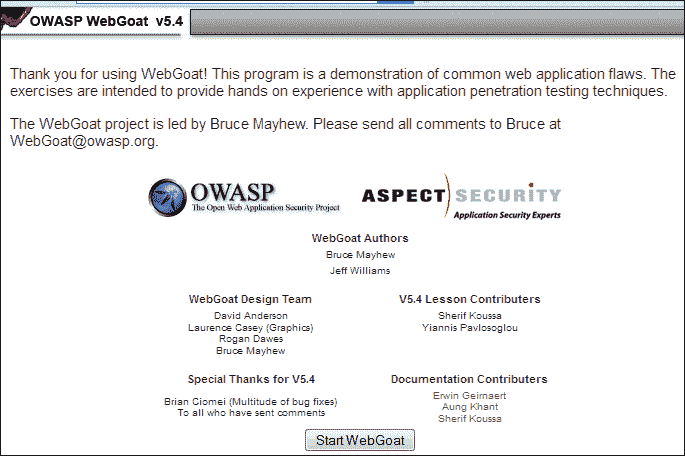

点击**Start WebGoat**来启动工具。这将带你进入工具内包含的可用培训课程的界面。你可以看到有大量的可用课程，因此，花时间学习这些课程将是有益的。由于我们正在讨论注入缺陷，你会在菜单的左侧看到相关内容。点击这个并展开该主题下的不同课程。一个例子如下截图所示：

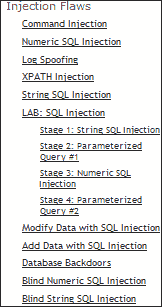

主题下的不同课程（裁剪的文本不重要）

正如前面的截图所示，我们可以处理各种各样的缺陷，主要的是与 SQL 注入有关的。我们将查看列表中的第五个，所以点击**String SQL Injection**来打开课程的第一页并查看描述。一个例子如下截图所示：


正如前面的截图所示，并且在查看教程时你会看到，有**提示**和**解决方案视频**可以帮助你完成课程。你们中的许多人可能知道，测试 SQL 注入最简单的方法是输入一个单引号（`'`）字符，看看我们是否能通过前端到后端数据库并产生错误消息。我们现在尝试一下。输入一个单引号字符作为名称，然后点击**Go!**。这将提交给应用程序。结果的例子如下截图所示：


那么，前面截图中的结果告诉我们什么？它告诉我们，我们现在有证据表明我们输入的字符通过了前端应用程序，因为它被放入了一个查询中！如果前端捕捉到它，那么它就不会成为查询的一部分。我们看到的错误是因为这不是一个有效的 SQL 查询。现在的问题是输入一个会评估为真的字符串。我们在 SQL 注入攻击中最常用的字符串是`' OR 1=1 --`，当数据输入没有得到适当的净化时，可以倾倒数据库的内容。当我们使用这个常见的攻击字符串时返回的结果如下截图所示：

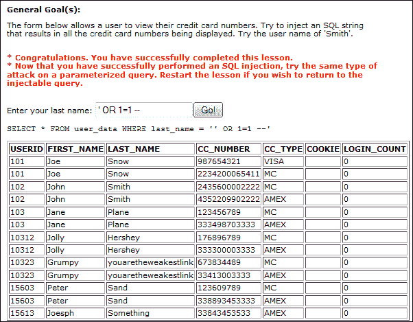

正如前面的截图所示，我们已经成功地倾倒了整个数据库的内容。输出还告诉我们，课程已经切换到了一个参数化查询，让我们再试一次。你可以尝试这个，但我们提前告诉你，一旦查询切换到基于参数的条件，攻击将不再起作用。这里有很多 SQL 注入的课程，鼓励你去探索。我们将继续下一个攻击项目。

## 破损的身份验证和会话管理

当一个应用程序被设计时，设计者必须保护用于身份验证的令牌和会话密钥。不幸的是，这个领域经常被忽视或者从安全的角度实施得很差，因此，为我们提供了一个很好的攻击向量。这种攻击通常涉及捕获身份验证令牌的某种形式，然后破解令牌或使用令牌来假扮某人的身份。在我们的 WebGoat 工具中，我们有两个部分来学习这些攻击，它们是身份验证缺陷和会话管理缺陷。我们将看看身份验证缺陷。在 WebGoat 教程中，屏幕的左侧，导航到**Authentication Flaws** | **Basic Authentication**来打开课程。一个例子如下截图所示：

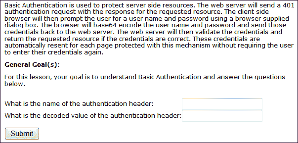

当您阅读课程信息时，显然我们需要拦截应用程序和客户端的流量，以查看其编码方式。最常见的方法是使用代理，有许多代理可供选择。我们将使用一个简单的插件，它是 Firefox 的插件**Tamper Data**。

一旦您将插件添加到浏览器中，我们就准备好从服务器捕获流量了。在您的 Firefox 浏览器中，导航到**工具** | **Tamper Data**以打开工具。示例如下图所示：

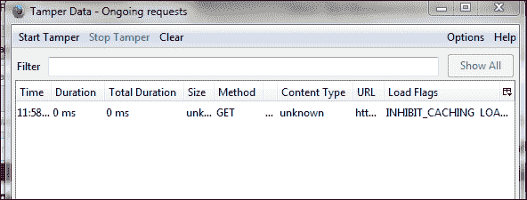

要开始使用代理捕获数据，请点击**开始 Tamper**。接下来要做的是返回 WebGoat 课程并点击**提交**按钮将查询发送到应用程序。当工具接收到请求时，您将收到一条消息，如果收到多条消息，请确保您选择要篡改的消息具有 OWASP 虚拟机的 URL。所需请求的示例如下图所示：


当您审查拦截的信息时，您会看到我们有**Cookie**和**Authorization**字段，我们将集中在这两个字段上。我们还将专注于**Authorization**字段中的值。这是 Base64 编码的，有许多方法可以解码该值。可以在[`base64-decode.com`](http://base64-decode.com)找到一个网站，它将获取值并为您解码。解码后的值为`guest:guest`。

现在我们有了完成课程所需的信息；至少看起来是这样。我们将返回 WebGoat 课程并输入身份验证字段的名称，即**Authorization**，以及编码字符串的值为`guest:guest`，然后点击**提交**将值加载到应用程序中。预期结果的示例如下图所示：


正如之前的屏幕截图所示，我们已经成功。但我们还有更多工作要做；这不仅仅是一个步骤的课程。现在我们需要尝试让应用程序接受我们的登录为`basic:basic`。为了实现这一点，我们需要破坏数据并强制应用程序在破坏后进行身份验证。当您按照课程的指示操作时，您会看到它说要选择**基本身份验证**课程以继续挑战。当您这样做时，您将看到**Tamper Data**中的页面：点击**Tamper**以打开页面以便修改。关键在于我们需要破坏**Cookie**和**Authorization**这两个字段，删除每个字段中的一个字符。一旦应用程序检测到破坏，它将提示再次输入凭据，当它这样做时，输入`basic`作为用户名和`basic`作为密码，如下图所示：


输入凭据后，点击**确定**将数据提交给应用程序。检查拦截的查询，您会注意到您的密码现在是`basic`，并且它是 Base64 编码的。我们现在已经将`basic`作为用户进行了身份验证，但我们还没有完成。

我们必须说服 WebGoat 工具我们是用户`basic`，我们已经在服务器端完成了这一点。所以，现在我们需要说服 WebGoat 工具。最简单的方法是破坏**JSESSIONID**，如下图所示：

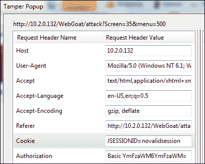

如前面的截图所示，你需要输入`novalidsession`来破坏会话并强制 WebGoat 再次请求凭据，这将验证你为用户`basic`。一旦发生这种情况，你点击**基本身份验证**链接完成课程。示例如下截图：


点击基本身份验证链接后的屏幕（裁剪的文本不重要）

这就是 Web 应用程序测试的过程；有很多不同的编写代码的方式，你必须分析和解释代码在做什么。在这节课中，我们首先必须拦截查询，以确定我们需要与之交互的参数的名称。一旦我们做到了这一点，我们必须先破坏服务器端，然后再破坏客户端，才能成功完成课程的要求。这里有很多课程，你练习得越多，就越能够识别认证和会话管理的特征。

## 跨站脚本攻击

另一个经受住时间考验的攻击是**跨站脚本攻击**（**XSS**）。这是一个应用程序接受不受信任的数据并在没有适当验证的情况下发送到 Web 浏览器的过程。有两种验证类型，反射和存储，它们已经被非常成功地使用。

在使用 WebGoat 工具之前，我们将看一下我们可以在 OWASP 机器上使用的另一种方法：

1.  在机器的主页面上，向下滚动直到看到**测试工具的应用程序**。

1.  点击**OWASP-ZAP-WAVE**打开我们想要测试的应用程序。

1.  导航到**活动漏洞** | **跨站脚本攻击** | **简单 XSS**，在表单参数中打开一个表单供我们测试 XSS。

1.  在表单字段中输入`<script>alert("Hello")</script>`并点击**提交**进行 XSS 测试。示例如下截图：

现在我们已经成功进行了 XSS 攻击，我们将把注意力转向 WebGoat 工具中的课程：

1.  登录到 WebGoat 教程。

1.  一旦你开始了程序，点击**跨站脚本攻击**链接并展开它。我们将要学习的课程的示例如下截图：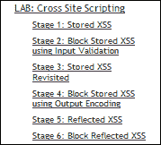

我们将从**阶段 1**开始。点击它并阅读课程的指示。正如指示所述，我们将对 Jerry 执行 XSS 攻击。为了做到这一点，我们必须将信息存储到 Tom 的记录中，这样当 Jerry 访问它时，他就会陷入 XSS 陷阱。

### 注意

我们只显示弹出框，以说明一旦发现弱点，你可以做更多的事情。一旦找到向量，就可以使用许多 Java 调用。

按照指示以 Tom 的身份登录应用程序：

1.  一旦你以 Tom 的身份登录，你导航到**查看个人资料** | **编辑个人资料**来访问 Tom 的个人资料。

1.  一旦你访问了它，你将在地址字段中输入脚本标记。在**街道**字段中，输入`<script>alert("Hello")</script>`，然后点击**上传个人资料**上传个人资料。

1.  现在你将注销并以 Jerry 的身份重新登录。

1.  一旦你以 Jerry 的身份登录，你将导航到**Tom Cat** | **查看个人资料**，看看你是否成功。示例如下截图：

我们不会执行**阶段 2**，因为它会改变代码以防止攻击，而我们是进攻方，所以我们不打算进行任何防御。接下来，我们将使用以下步骤执行**阶段 3**课程：

1.  点击**阶段 3：存储型 XSS 再审**以打开登录页面，然后通过阅读指示开始下一个阶段。

1.  我们将首先以`David`的身份登录，然后导航到**Bruce** | **View Profile**记录，并验证`David`是否是 XSS 的受害者。示例如下截图所示：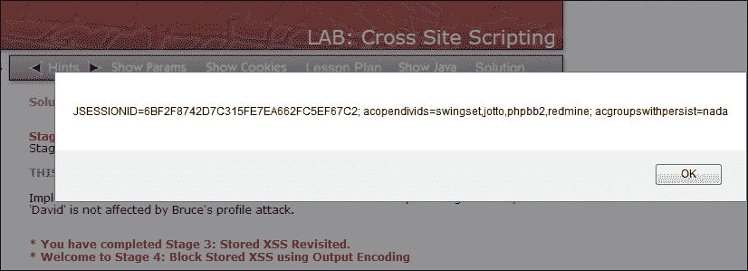

正如前面的截图所示，我们不仅仅是弹出一个窗口，而是通过在警报框内使用`document.cookie`来访问了 cookie。

我们现在准备进入**第 5 阶段**。再次强调，我们不会执行**第 4 阶段**，因为这涉及到防御措施的设置，而我们现在不打算这样做。但是，你可以与其他阶段一起工作。只需记住你需要使用开发者包。

在**第 5 阶段**，我们将按照以下方式使用反射型 XSS：

1.  点击**Stage 5: Reflected XSS**以打开课程并阅读此阶段所需的说明。根据说明，你必须在应用程序的搜索功能中嵌入一个 XSS 字符串。

1.  我们需要做的第一件事是以其中一个用户的身份登录。由于我们已经在应用程序中列出了用户`Larry`，所以我们将使用这个用户。

1.  以用户`Larry`的身份登录，然后点击**SearchStaff**以打开应用程序代码的搜索部分。

1.  在**Name**字段中输入`<script>alert("You are Hacked")</script>`，然后点击**FindProfile**按钮来运行脚本。结果的示例如下截图所示：

就是这样！你已经进行了许多不同的 XSS 攻击，而且它们确实相对容易防止。然而，我们继续在 Web 应用程序中看到这些问题，并且它们将在一段时间内仍然作为一种可行的攻击向量存在。

## 不安全的直接对象引用

使用直接对象引用时，开发人员引用文件或其他对象而不使用任何形式的身份验证或访问控制检查。当我们发现这一点时，我们可以操纵数据并在不提供任何授权的情况下访问它。

我们将再次参考 WebGoat 工具来对抗应用程序的这种攻击。在 OWASP WebGoat 中，你要关注的区域是**访问控制漏洞**。一旦你扩展了它，你会看到有许多课程供我们使用。课程列表如下截图所示：

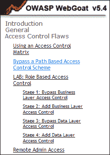

我们想要打开的课程是列表中的第二个。点击**Bypass a Path Based Access Control Scheme**并阅读课程的说明。任何基于路径的控制保护的关键在于我们可以打破预期目录并访问位于另一个区域的文件。该课程应用程序的第一页如下截图所示：

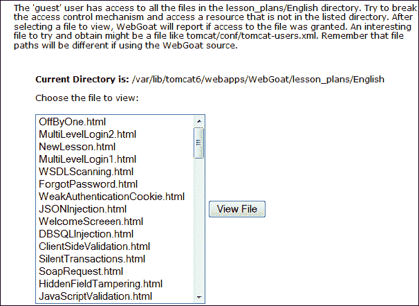

因此，挑战在于修改路径并访问当前目录之外的文件；在这种情况下，文件是**tomcat-users.xml**。你认为我们可以如何做到这一点？我们需要拦截某些东西，为此，我们必须使用代理来捕获查询。之前，我们使用了一个名为 Tamper Data 的工具，我们将再次使用它。首先，让我们启动一个工作空间来记录我们目前所拥有的信息。我们将使用记事本，但你可以使用任何你选择的程序。我们需要将当前目录路径和我们想要访问的文件的路径复制并粘贴到这个文档中。我们的工作空间示例如下截图所示：


当我们查看工作空间中的信息时，我们发现在当前目录的路径中有几个目录，然后才能到达`tomcat`目录。然而，有一个问题。我们得到的当前目录有一个`tomcat6`目录，但我们的目标文件目录没有这个。说明中确实说过路径可能会不同，在这种情况下就是这样。我们需要使`tomcat`目录与当前目录匹配为`tomcat6`。突破访问控制的关键是使用`../`目录遍历技术来跳出目录。由于在`tomcat6`文件夹之前有四个目录，我们至少需要输入这么多目录遍历。因此，我们可以始终输入更多以确保安全。尝试绕过访问控制的字符串的工作空间示例如下截图所示：


接下来的步骤是使用 Tamper Data 工具拦截查询，然后将我们的路径粘贴到包含我们正在尝试从应用程序上传的文件的字段中：

1.  我们将导航到**OffByOne.html** | **查看文件**并拦截查询。拦截到的查询示例如下截图所示：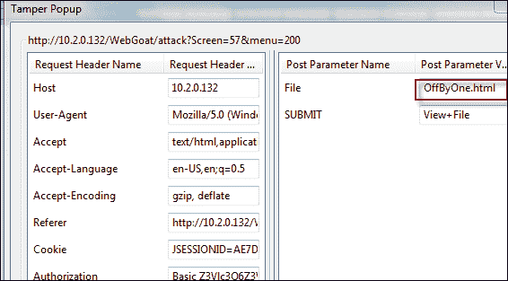

拦截的查询显示我们正在查看**文件**字段，这就是我们需要放置我们准备好的字符串的地方。

1.  将字符串粘贴到字段中，然后单击**确定**将字符串发送到应用程序。返回到 WebGoat 课程并查看发生了什么。示例如下截图所示：

1.  正如前面的截图所示，我们第一次尝试并不成功，但错误消息告诉我们，我们似乎在我们的路径中只有一个目录。我们将在我们的字符串中再添加一个目录遍历，看看会发生什么。添加了一个目录遍历后的结果示例如下截图所示：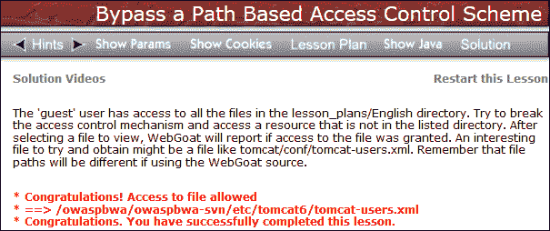

最终我们成功地突破了基于路径的访问控制。这可能是一个耗时的过程，这就是为什么我们通常使用 Web 应用程序测试工具来帮助我们识别需要进一步调查的领域。

## 安全配置错误

一种常见的攻击方法是寻找管理员设置的默认配置或名称，或者只是保留在安装状态下。对于 Web 应用程序，几乎总会有某种形式的配置访问，可用于配置或管理站点。我们在 WebGoat 工具中有一个关于这个的课程。导航到**不安全配置** | **强制浏览**以打开课程。正如您在说明中所读到的，通常会有一些可访问的配置来执行维护。我们可以尝试一些不同的文件名，但由于 OWASP 机器是一台 Linux 机器，这些机器最常见的配置文件是`conf`文件。因此，在浏览器中，将 URL 更改为`http://10.2.0.132/WebGoat/conf`，以查看是否有配置文件位于此处。这个结果的示例如下截图所示：

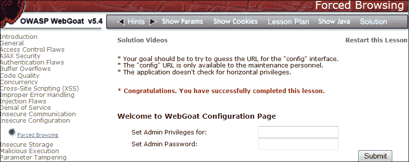

就是这样！我们找到了一个不应该向公众开放的配置访问，但它却是。这是网站经常犯的一个错误。

## 敏感数据暴露

大多数 Web 应用程序没有正确保护它们要么处理的数据，要么存储的数据。发现数据未经加密或编码不当是很常见的。此外，当应用程序处理数据时，在许多情况下会暴露数据。

在 WebGoat 工具中，有一个课程可以让我们更加熟悉不同的编码技术。导航到**不安全存储** | **编码基础**以打开课程；以下是一个示例截图：

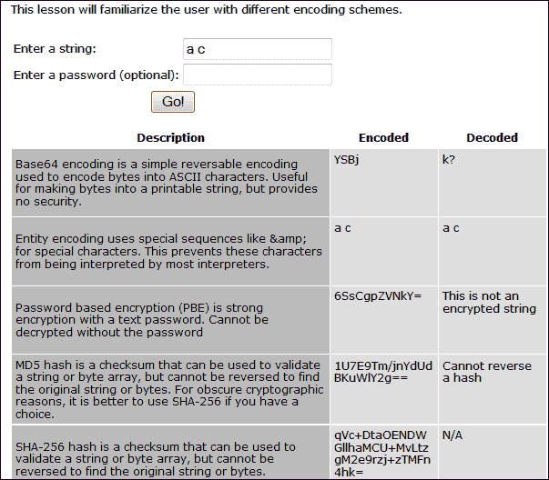

这个课程非常简单，所以我们不会在这里再详细介绍。鼓励您输入几个字符串，然后在提供的表格中查看结果。

## 缺少功能级访问控制

这种弱点是由于开发人员在将功能可见于**用户界面**（**UI**）之前未验证功能级访问控制。一旦发现这一点，您就可以伪造请求并可能在没有适当授权的情况下获得访问权限。

## 跨站请求伪造

在**跨站请求伪造**（**CSRF**）攻击中，我们需要用户登录到一个已建立会话并使用 cookie 的网站。当满足这些条件时，攻击会获取包含的身份验证信息并将其提交给一个易受攻击的应用程序。由于应用程序存储了身份验证信息，因此请求被视为合法。

在 WebGoat 工具中，我们有一些关于 CSRF 的课程。它们位于关于跨站脚本攻击 XSS 的部分。在 WebGoat 工具中，导航到**跨站脚本攻击（XSS）** | **跨站请求伪造**以打开课程并查看课程说明。

对于这种攻击，我们需要向嵌入的 URL 添加一个转账功能，以获取用户的身份验证信息并用于验证我们的交易。我们将在 URL 中附加代码来转账。按照说明，我们可以通过右键单击页面左侧的课程标题并将其保存到剪贴板来复制 URL。我们想要使用``标签来存储我们的 URL。过程是发送一封电子邮件，让用户在登录到我们欺骗使用的应用程序时点击链接进行转账。

我们需要在两个区域输入信息。第一个是**标题**，第二个是**消息**。让我们按照以下方式进行：

1.  将`CSRF-1`输入为标题的名称，然后输入以下字符串作为消息，要注意 IP 地址可能在您的攻击中有所不同。输入以下内容作为消息：

```

```

以下是一个示例截图：


输入代码的 CSRF 屏幕（裁剪的文本不重要）

1.  确认命令后，点击**提交**按钮。这将把您的标题放在应用程序的底部。

1.  在您点击之前，启动您的 Tamper Data 代理并拦截请求。以下是拦截请求的示例截图：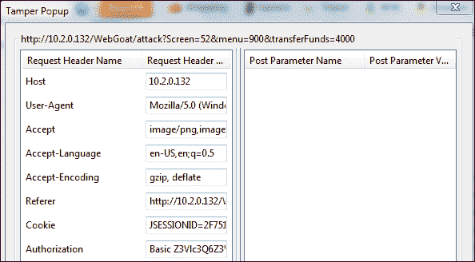

在拦截的查询中查看信息后，点击**确定**，让查询发送到应用程序。如果需要，刷新 WebGoat 课程。您现在应该看到绿色的勾号，表示您成功了，如下面的截图所示：


还有更多这样的课程可供您练习 CSRF，并鼓励您通过它们来完善您的技能、知识和对 Web 应用程序攻击的理解。

## 使用已知的易受攻击组件

在应用程序开发中，使用现有库和函数创建代码是一种常见做法，最近这种做法已被利用在攻击中。如果我们可以感染一个库、框架或其他流行组件，那么使用它的每一个应用程序都将面临漏洞。这是传播漏洞最有效的方式之一，也是越来越常见的事情，基于这一点，它在 2013 年被添加到顶级攻击列表中。

## 无效的重定向和转发

在这次攻击中，我们利用了许多 Web 应用程序会在没有适当验证的情况下使用重定向和转发，这可能导致流量重定向到恶意软件和其他恶意网站。

# 识别 Web 应用防火墙

当我们进行测试时，很可能会遇到**Web 应用防火墙**（**WAF**）。这些旨在识别本章中大部分攻击（嗯，大部分基于 URL 的攻击）。我们将再次转向 Kali Linux 发行版来识别 WAF。您需要您的 Kali Linux 机器和我们在第六章中创建的 WAF 机器，*创建外部攻击架构*。

一旦机器开始运行，我们要做的第一件事是确定我们的网站是否受到 Web 应用防火墙的保护。我们有几种方法可以做到这一点，每种方法的成功率都不同。我们将尝试的第一种方法是**Nmap**工具。

在您的 Kali Linux 机器上，打开终端窗口，输入`nmap –p 80 -–script –http-waf-detect <目标 IP 地址>`。这个脚本引擎将尝试确定是否存在 Web 应用防火墙。示例如下截图所示：


正如前面的屏幕截图所示，脚本没有检测到我们正在运行 WAF，所以它并不总是有效。接下来，我们将查看**dotDefender**控制台，看它是否检测到我们的扫描。为此，我们需要打开浏览器，输入防火墙的地址，然后登录。示例如下截图所示：


正如前面的屏幕截图所示，它检测到正在运行的脚本，但不幸的是，它没有告诉我们是否正在运行 WAF。所以，我们将查看另一个工具。在 Kali 中，我们有一个用于此目的的工具。转到**应用程序** | **Kali** | **IDS/IPS 识别** | **Wafw00f**，如下截图所示：


一旦工具打开，输入`wafw00f –v www.example.com`在终端窗口中对站点进行扫描。我们正在扫描站点并比较从我们的探测中收到的信息。示例结果如下截图所示：

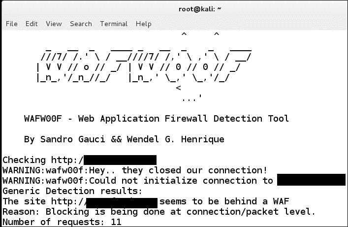

结果显示，该网站似乎在防火墙后面。现在，我们将使用该工具扫描我们的 dotDefender 机器。我们通过将目标更改为我们机器的 IP 地址来执行此操作。示例结果如下截图所示：

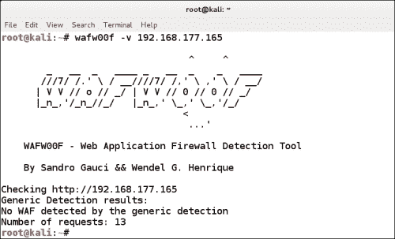

正如前面的屏幕截图所示，使用 wafw00f 工具似乎无法检测到最新版本的 dotDefender。这就是安全测试的现实，一旦某个东西存在一段时间后，就会有一群人试图找出改变或至少修改产品对工具的反应方式的方法。这就是为什么我们建立实验环境并查看什么有效和无效的原因。有时候，我们会很幸运地找到另一种识别错误的方法；此外，在某些情况下，错误消息可以列出设备的身份。这都是试错的过程。

# 渗透 Web 应用防火墙

正如我们之前讨论过的，规避检测可能是一个挑战，这与管理员如何配置策略有关。互联网上有很好的参考资料，您可以使用它们来查看您的混淆技术是否有效。免费开源的 WAF **ModSecurity**提供了一个网站，您可以在该网站上测试字符串，以查看它是否可能被 WAF 检测到。您可以在此位置找到该网站[`www.modsecurity.org/demo`](http://www.modsecurity.org/demo)。

一旦网站打开，您会看到有一个区域可以发布不同的字符串并查看结果。在您这样做之前，您还会看到他们列出了许多商业供应商用来展示其工具的网站。以下是此示例的屏幕截图：


屏幕显示了许多商业供应商用来展示其工具的网站列表（裁剪的文本不重要）

单击页面上的**ModSecurity CRS Evasion Testing Demo**链接。这将测试该字符串是否符合 ModSecurity 工具的**核心规则集**签名，并且您将找到输入潜在混淆脚本以查看是否被检测到的区域。它不仅告诉您是否被检测到，还为字符串提供了一个数值分数的排名。对于我们的第一个示例，我们将尝试一个简单的示例来查看表单的工作原理。在表单框中，输入经典的 SQL 注入字符串`' OR 1=1 –-`，然后单击**发送**按钮并查看结果。以下是结果的示例屏幕截图：

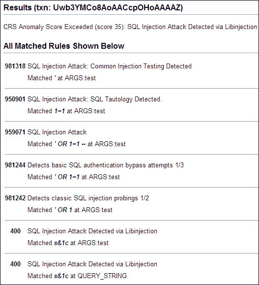

正如前面的屏幕截图所示，我们已经被检测到了！嗯，我们希望如此，因为我们使用了最常见和经典的字符串进行测试。我们还看到我们得分是 35。我们将看看是否可以降低得分。输入此字符串：`1' AND non_existant_table ='1`。以下是结果的示例屏幕截图：

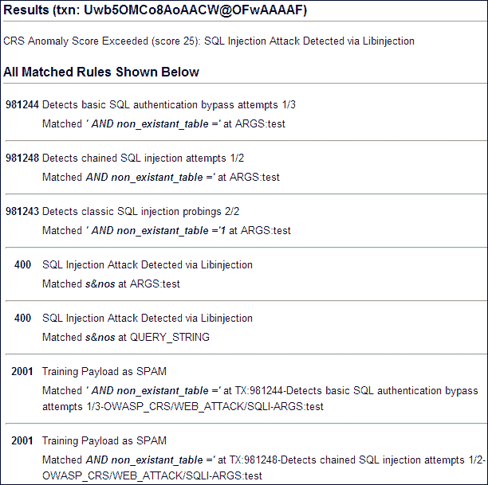

该死！我们又被检测到了！至少有一些好消息；我们已经将得分降低到 25。这就是我们尝试找到得分更低或不被检测到的字符串的过程。我们将尝试一个 SQL 的字符串，然后继续尝试一个 XSS 的字符串。在负载窗口中，输入此字符串：`&#49&#39&#32&#79&#82&#32&#39&#49&#39&#61&#39&#49`。

以下是结果的示例，显示在下面的屏幕截图中：

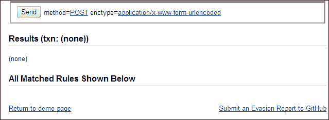

我们成功了！这是您在 Security Compass 的**SQL Inject-Me**工具中找到的字符串。您可以在他们的网站[`www.securitycompass.com`](http://www.securitycompass.com)找到该工具。现在我们准备看看是否可以找到一个不被检测到的 XSS 字符串。我们将为您节省一些时间，并尝试一个我们认为有很大机会要么得到低分，要么不被检测到的字符串。在负载窗口中，输入此字符串：`prompt%28%27xss%27%29`。以下是结果的示例屏幕截图：

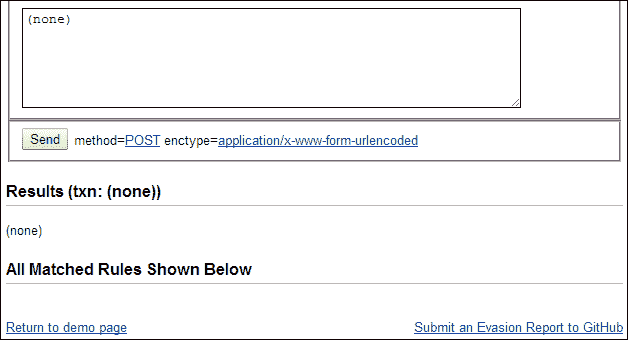

我们再次成功了。现在我们有一个不被检测到的 XSS 和 SQL 注入字符串。当然，现实情况是我们已经提交了这些字符串，所以有人可能会做功课，然后在您阅读本书时我们将被检测到。如果发生这种情况，我们的工作就是继续尝试不同的方法，直到找到一个有效的方法。此外，这只是潜在地让我们通过 WAF，接下来就取决于应用程序开发人员是否使用了安全编码准则或最佳实践。欢迎来到专业安全测试的世界！

# 工具

到目前为止，在本书中，我们并没有专门设置关于工具的主题点。在大多数情况下，我们保持了过程中心，并在每个章节中讨论了一些工具。对于网页应用程序测试来说，情况就不同了。正如您在本章中看到的那样，有许多种输入和与网页应用程序交互的方式，这就是这种测试的挑战所在。因此，最好使用工具来获取大量数据，然后手动去调查感兴趣的领域。市面上有大量的工具，我们在这里不会逐一介绍。

我们喜欢使用的工具之一是**Burp Suite**，它有免费版本和商业版本。我们喜欢它，因为它允许我们在测试时做各种各样的事情，而且我们也喜欢商业版本的价格非常合理。您可以在[`www.portswigger.net`](http://www.portswigger.net)找到有关该工具的信息。免费版本也可以在 Kali Linux 发行版中找到。要访问它，请导航至**应用程序** | **Web 应用程序** | **Web 应用程序模糊器** | **burpsuite**以打开该工具。该工具的菜单示例如下截图所示：


正如前面的屏幕截图所示，该工具具有许多功能，可以在进行网页应用程序测试时帮助我们。

# 总结

在本章中，我们讨论了对 Web 服务器和 Web 应用程序的评估。我们从讨论 OWASP 十大漏洞开始了本章。在讨论之后，我们使用了 WebGoat 工具，并进行了一些课程，展示了网页应用程序测试的概念和技术。

在研究了 OWASP 十大漏洞之后，我们研究了识别我们和目标之间的网页应用程序防火墙的方法。我们使用了 wafw00f 工具来潜在地检测已部署的保护类型。

一旦我们了解了如何检测 WAF，我们就讨论了如何渗透它。我们研究了我们可以使用的混淆方法，以尝试绕过 WAF 提供的保护。我们将样本字符串提交到 ModSecurity 演示站点，并成功地逃避了 SQL 注入字符串和 XSS 字符串的检测。

最后，我们讨论了在进行网页测试时需要工具的必要性，特别是网页应用程序测试。

这结束了本章。您现在已经练习了网页应用程序攻击以及检测和规避防火墙的方法。

在下一章中，我们将研究对平面和内部网络的测试。
