# 第十一章：攻击服务器

在本章中，我们将确定我们用来攻击服务和服务器的方法。好消息是，我们知道服务器必须运行服务，并且更重要的是，必须将套接字处于监听状态，准备接受连接。此外，这意味着服务器只需坐在那里等待我们来攻击它。这对我们来说是好事，因为我们已经在第九章中涵盖了这一点，*评估 Web 服务器和 Web 应用程序*。我们将看到的最常见的攻击向量是运行在 Web 服务器上的 Web 应用程序。我们不打算在这里再次涵盖这一点；相反，我们将专注于我们可以攻击的其他服务器平台上的其他事物。在本章中，我们将讨论以下主题：

+   服务器的常见协议和应用程序

+   数据库评估

+   操作系统平台特定

本章将为我们提供有关我们在测试时可以针对的服务器的信息。由于目标是服务器，我们可能会通过操作系统漏洞或缺陷来获取访问权限。不幸的是，这种情况变得越来越少见。微软和其他供应商已经做了他们的功课，对操作系统的攻击向量并没有消失，但可以认为它们处于生命支持状态。因此，我们希望专注于运行在服务器上的协议和应用程序，因为它们通常会为我们提供成功攻击的最佳机会。

# 服务器的常见协议和应用程序

在本节中，我们将看一些通常在服务器上找到的常见协议和应用程序。

## 网络

再次强调，尽管我们已经涵盖了这一点，但它仍然是服务器上最常见的应用程序之一，因此也是我们潜在的攻击向量之一。在涉及到 Web 应用程序时，由于应用程序编码中的常见错误，我们有更多潜在的攻击领域。

## 文件传输协议

**文件传输协议**（**FTP**）已经存在很长时间了。在本节中，我们将使用一种高级的 FTP 方法，当您遇到不允许标准 FTP 客户端/服务器通信工作的环境时可以使用。关于协议的信息的一个很好的参考是 Network Sorcery 网站；您可以在[`www.networksorcery.com`](http://www.networksorcery.com)找到它。这里有大量的参考信息；我们想要专注的领域是**RFC** **Sourcebook** | **Protocols**。以下是此页面的示例屏幕截图：


RFC 协议（裁剪的文本不重要）

当您查看网站时，您会发现顶部有一个按字母顺序排列的菜单栏。这是我们想要选择我们在进行专业安全测试时可能遇到的协议的地方。我们想要查看 FTP 信息。导航到**F** | **FTP**以打开包含有关 FTP 信息的页面。以下是此示例的屏幕截图：


屏幕显示包含有关 FTP 信息的页面（裁剪的文本不重要）

当我们进行测试时，通常为时已晚以获取我们可能需要的某些协议的详细知识；这就是 RFC Sourcebook 可以帮助我们的地方。这个网站很有用，因为它还提供了协议数据包头信息。单击**IP**以显示头部。以下是头部的示例屏幕截图：


## 协议研究

在研究协议时，你可以发现很多东西；然而，要能够做到这一点，我们需要了解协议的行为方式。这就是我们在研究协议时想要做的事情；此外，我们想知道如何利用 FTP。由于大多数客户端，如果不是所有的话，都在机器上有一个 FTP 客户端，这是一个很好的传输文件的方式。例如，如果我们发现了我们在第七章中讨论的弱过滤器，我们通常会这样做，*设备评估*。在我们能够做到这一点之前，我们需要更多地了解 FTP 以及它是如何创建连接的。我们将为您节省一些时间并提供一个示例；然而，我们鼓励您研究该协议以了解更多可以使用的技巧。

### 注意

你需要知道的主要事情是 FTP 端口命令通过逗号而不是我们通常使用的小数点来识别 IP 地址。

此外，它使用字节模式系统，端口以 Base 256 格式表示。因此，要连接到 IP 地址`192.168.177.10`的端口`1024`，命令如下：

```
port 192,168,177,10,4,0

```

这是一个端口的分解，端口由*4x256=1024*表示。再次强调，当我们遇到常见的 FTP 协议时，了解这些是很有用的，它位于一个由弱过滤规则保护的 DMZ 中。

这最好用一个例子来表示。你需要一台机器作为过滤器；你可以使用我们在本书中之前创建的**Dynamips**机器或**IP Tables**机器。然后，你需要一台作为内部机器的机器，它将运行 FTP 服务器。我们将在本书中使用 Windows 7 机器，但它可以是任何具有运行 FTP 服务器能力的机器。然后，我们需要一台作为外部机器的机器，从外部发送流量。你需要在过滤设备的两侧创建路由。此外，创建允许 FTP 流量和返回流量的规则。请记住，返回流量的源端口将是 20。一旦你建立了所需的架构，只是一个通过命令来工作的问题。我们将使用 Kali Linux 机器发送命令并运行`netcat`；我们将使用受保护机器上的 3com FTP 服务器。

正如我们之前提到的，对于路由器和无状态过滤器来说，管理员通常允许诸如 FTP 之类的协议的返回流量，正如我们所展示的，我们可以利用这一点来绕过已经设置的过滤器。此外，我们可以利用我们对 FTP 行为方式和与 FTP 服务器交互所使用的命令的知识。

一旦我们建立了我们的环境，我们需要做的第一件事就是启动我们的 FTP 服务器。一旦服务器启动，我们需要使用来自源端口 20 的能力从 Kali Linux 机器连接到它。在 Kali Linux 的终端窗口中，输入以下命令：

```
enter nc –p 20 <IP Address of the server> 21

```

这将连接到位于过滤设备内部的 FTP 服务器。下面的截图显示了一个示例：


正如前面的截图所示，我们成功的一个很好的指示是我们看到了服务器的横幅。这是一个常见的配置，当内部机器被允许连接到外部 FTP 服务器时，服务器将从源端口 20 发送数据。然后，允许此连接的规则在过滤设备中；因此，通过从这个端口发送数据，我们可以渗透到一个弱过滤器中。我们使用内部的 FTP 服务器来证明这一点。我们本可以选择机器上的任何开放端口来展示这一点。现在我们需要登录服务器，很可能`anonymous`将被启用。因此，将用户输入为`anonymous`，一旦看到用户的确认，输入密码为`password123`。

一旦收到用户已登录的确认，您可以输入`help`以查看命令。从可用的 FTP 命令中，我们想要使用的是`nlst`命令，它将为我们提供所在目录的列表。在 FTP 登录窗口中，输入`nlst`以列出目录。您成功了吗？答案是否定的！这是因为要使其工作，程序必须知道客户端正在侦听的端口，以便将数据发送到该端口。为了设置这一点，我们需要打开另一个窗口，以便可以获取连接返回的数据。当您打开另一个终端窗口时，可以将它们排列在一起，以便同时看到它们。在新窗口中，输入以下命令：

```
nc –l –p 2048

```

这将在 Kali Linux 机器上打开一个端口，用于接收来自服务器的数据。一旦端口处于侦听状态，我们需要告诉服务器将数据发送到哪个端口，我们使用`port`命令来做到这一点：

```
port <IP address separated by commas> 8,0 

```

这将通知服务器将数据发送到端口 2048。数据发送后，您输入`nlst`命令。这将显示服务器上列出的目录。以下屏幕截图显示了一个示例：


正如前面的屏幕截图所示，我们在服务器上有一个名为`account.txt`的文件。我们现在将使用 FTP 服务器将文件发送给我们。我们希望将接收到的数据输出到一个文件中；我们将使用输出重定向（`>`）运算符来实现这一点。这个过程与之前的一样。在带有`netcat`工具的窗口中，输入以下命令：

```
nc –l –p 2048 > trophy.txt.

```

我们现在准备运行命令序列。输入与我们之前输入到端口命令相同的命令。一旦输入了端口命令，我们需要获取文件。我们通过输入`retr accounts.txt`来实现这一点。以下屏幕截图显示了一个示例：

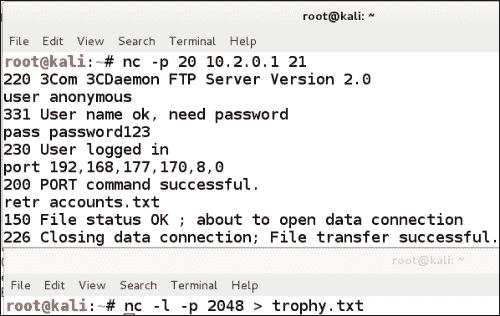

正如前面的屏幕截图所示，我们已经将文件传输到我们的 Kali Linux 机器上。为了验证这一点，我们输入`trophy.txt`。结果如下屏幕截图所示：

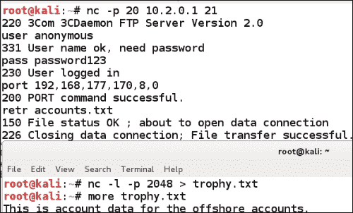

正如前面的屏幕截图所示，我们已成功传输了一个文件。重要的是要记住，这可以是任何文件。要求是找到弱过滤规则，然后利用它为我们谋利。

我们已经讨论了如何识别漏洞以及进行这方面的许多资源，这在整本书中都有提到。FTP 服务器是一种软件，因此也存在漏洞。事实上，我们使用的 FTP 服务器版本 3com Daemon 确实存在一个可利用的漏洞。但是，由于这是我们的测试实验室，我们在很大程度上控制着我们的机器以及在这些机器上运行的应用程序。

我们可以访问 Exploit DB 网站（[`www.exploit-db.com`](http://www.exploit-db.com)）来查看我们所指的内容。一旦我们在网站上，我们搜索在端口 21 上运行的所有漏洞。以下屏幕截图显示了搜索结果的示例：


## 安全外壳

**安全外壳**（**SSH**）协议非常常见，所以在测试时很可能会遇到。我们应用于 FTP 的技术在某些情况下也可以应用于 SSH；这取决于管理员如何配置对 SSH 服务器的访问。我们不会在这里专注于此，因为我们已经涵盖了关于 FTP 的过程和步骤。

那么，SSH 协议是什么？它最初是作为 Telnet 协议明文弱点的替代品而设计的。了解更多关于该协议的方法是访问 Network Sorcery 网站。

SSH 的解释示例如下屏幕截图所示：


现在我们对 SSH 协议有了一个简要的了解，让我们来看看与之相关的漏洞。如果我们回到我们的 Exploit DB 并搜索 SSH 的端口，即 22，我们可以查看协议本身的漏洞。这次搜索的结果的一个例子如下截图所示：


我们的搜索结果返回了一些漏洞利用；然而，这次搜索并没有返回最新版本的漏洞。起初，我们会说这使得我们今天很难找到一个可以用来攻击网站的漏洞。在许多环境中，我们发现并继续发现 SSH 协议的旧版本，所以未来不要排除使用它。

SSH 协议的另一个好处是，它的强度取决于管理员的配置。如果管理员允许存在弱密码，那么我们仍然有机会使用 SSH 协议获得访问权限。这带我们来到一个非常重要的观点，那就是，我们并不总是必须利用漏洞才能进入系统！我们可以使用其他方法访问机器，所以并不总是必须找到一个漏洞。此外，漏洞的验证或利用必须根据工作范围来允许。

我们可以做的一个强大的事情是使用 SSH 来掩盖我们的存在并使客户网络的监控失效。由于 SSH 是加密的，我们可以利用它来远程执行命令一旦我们利用了一台机器。在这个演示中，我们将使用 Kioptrix 虚拟机。过程将是利用它，然后破解密码并使用它通过 SSH 登录到机器，然后在加密隧道中执行我们的命令。我们将一直运行 Wireshark，这样我们可以看到受害者的网络监控系统会看到什么。

正如我们之前发现的，我们知道我们有一个易受攻击的 Samba 版本，所以我们将使用它作为我们的初始攻击向量。我们可以使用 metasploit 或者来自 exploit 数据库的代码。我们需要运行 Wireshark 并查看我们攻击时能看到什么。在书中的例子中，我们将使用代码而不是 metasploit。我们决定使用这个是因为 metasploit Meterpreter shell 很棒，但如果我们没有 Windows 机器，那么我们的 shell 选择就有限了。为了提醒你，我们使用的是 C 文件`10.c`，我们已经将其编译成了`sambaexp`的名称，所以我们想要运行`./sambaexp`命令来看如何使用这个工具。记住，你必须在程序的目录中才能执行该命令。这个结果的一个例子如下截图所示：


在终端窗口中，我们需要输入以下命令：

```
./sambaexp –b 0 –v <IP address of the target>

```

这个命令应该会在机器上获取 shell，一旦你做到了这一点，你就可以复制密码文件并破解密码。或者，你可以创建一个用户或者更改 root 密码。你选择哪一个取决于你。下面的截图显示了一个被利用的机器的例子：


我们现在在机器上有了 root 用户，但问题是我们正在通过网络进行，所以任何监控系统都会看到我们的操作。我们可以输入一些命令，然后在 Wireshark 中查看信息。输入`/sbin/ifconfig`来查看 IP 信息。然后，输入`nmap`来看看我们是否幸运地管理员已经在机器上安装了 Nmap。这个命令的一个例子如下截图所示：


输入 nmap 后出现的屏幕（裁剪的文本不重要）

正如前面的截图所示，我们很幸运；嗯，并不是那么幸运，因为这是一个非常旧的 Nmap 版本。不过，我们的活动呢？我们被注意到了吗？Wireshark 捕获了什么？可以想象，我们所做的大部分事情都是明文的；因此，Wireshark 会显示我们的活动。以下截图显示了一个例子：


正如前面的截图所示，我们截取了我们的通信，监视设备会知道我们在做什么。由于我们在机器上有 Nmap 工具，我们可以用它运行命令。但是，如果有人查看网络流量，我们会再次被发现；因此，最好使用隧道，我们现在就这样做。

在本书的示例中，我们已将受损机器上的 root 密码更改为`password`。要通过 SSH 连接，我们输入`ssh root@192.168.177.148`。以下截图显示了这个示例：


正如前面的截图所示，我们登录到了 root 账户。一旦我们进入，我们进行了一个 Nmap 扫描。这都很好，但我们想知道的是我们的网络流量对我们潜在客户的监视设备揭示了什么。以下截图显示了 Wireshark 信息的示例：


我们的网络流量显示了握手过程，其中包含了不同算法的明文信息以及客户端和服务器的横幅。一旦握手完成，其余数据就被加密了，因此我们无法看到在我们的隧道中发生了什么；这正是我们的目标。很多类型的架构都经常使用 SSH，如果我们攻击了一台机器并执行后期利用任务而不被监视，我们就可以利用这一点。

## 邮件

我们想讨论的下一个服务是邮件。这是我们可以指望在客户端服务器上找到的服务之一。我们面临的第一个挑战之一是正在使用的邮件服务器类型。一旦我们确定了这一点，我们就可以开始寻找攻击它的方法，或者至少在测试时利用它。我们遇到的大多数服务器将运行**简单邮件传输协议**（**SMTP**），这是一件容易确定的事情。SMTP 运行的端口是 25，但管理员可以更改这一点，而且经常这样做。因此，要找到返回的横幅以发现服务运行的位置。

我们可以使用我们之前使用的相同技术，并在 Exploit DB 中搜索，看看是否可能有某种利用。以下截图显示了对 SMTP 利用的搜索示例：

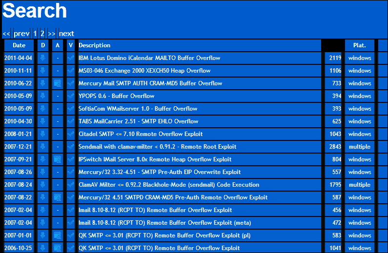

正如前面的截图所示，我们在 SMTP 服务的利用部门实际上并没有什么最新的内容。这只是我们在测试中可能遇到的邮件类型之一，所以让我们再探索另一种类型，看看我们是否能有更多的运气。我们将查看运行在端口 110 上的**邮局协议**（**POP**）的服务的利用搜索的示例如下截图所示：


我们在这里并没有太多运气，这就是搜索利用的现实。所有系统和服务都会有漏洞，但并非所有漏洞都会有利用。我们还有一种邮件类型可以寻找，那就是运行在端口 143 上的**互联网消息访问协议**（**IMAP**）。以下截图显示了对利用的搜索示例：


嗯，我们在邮件服务的利用上没有取得任何进展，那么现在该怎么办呢？放弃吗？还没有！我们可以在 SMTP 中与邮件服务器交互，可能发送一封电子邮件。只要社会工程学是我们工作范围的一部分，这是可能的。你可以连接到端口 25 并发送电子邮件。多年前，你可以以任何你选择的用户身份发送电子邮件。以英国女王或美国总统的名义发送电子邮件是很有趣的。这是因为可以手动连接端口 25，并输入邮件服务器发送邮件时使用的命令。在 2000 年，这种邮件欺骗攻击被用来攻击 Emulex 公司，散布关于该公司的虚假信息。这直接影响了股价，并导致公司损失超过 20 亿美元，直到发现这是一封欺骗和非法的电子邮件。由于 Emulex 攻击后可用的中继站很少，你仍然需要对其进行测试。此外，我可以通过连接到端口 25 以合法用户的身份发送电子邮件。这通常被称为 SMTP 中继。步骤如下：

1.  telnet <site> 25

1.  mail from: kevin@company.com

1.  rcpt to: victim@spoofed.com

1.  数据

1.  主题：IT 部门的消息

1.  你好，这是 IT 部门，请发送一封电子邮件，附上您的用户名和密码，以访问 XYZ 项目文件。谢谢。

1.  (这是一个单独一行的句号，表示数据结束)

这是手动连接和发送电子邮件的过程。再次强调，大多数组织会阻止这样做，但值得一试。此外，在内部测试中，你可能会更成功。以下是一个失败的尝试示例：

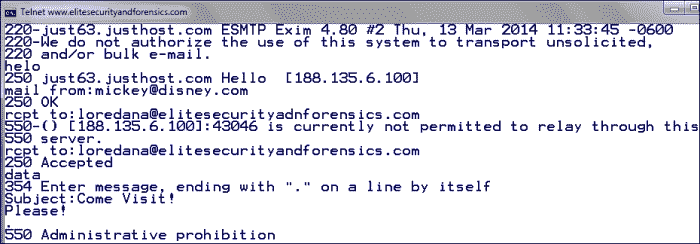

正如前面的截图所示，第一个`rcpt to`是发送到一个错误的电子邮件地址，并立即被拒绝，显示中继不被允许的消息。这是因为一段时间前通过 Emulex 攻击以及其他攻击所学到的教训。在今天的环境中，这很可能不会奏效，但总有机会。

# 数据库评估

我们正在测试我们想要视为有价值资产的东西之一：我们客户的数据库。这是公司通常拥有大部分数据的地方，如果泄露，可能会给公司造成巨大的损失。有许多不同的数据库。我们将只集中在其中的三个：**Microsoft SQL** (**MSSQL**), **MySQL**, 和 **Oracle**。

## MSSQL

多年来，MSSQL 数据库为我们提供了许多漏洞，但随着数据库版本的成熟，漏洞大大减少。我们将首先搜索在 Exploit DB 网站上是否能找到任何 MSSQL 数据库利用。搜索结果如下截图所示：

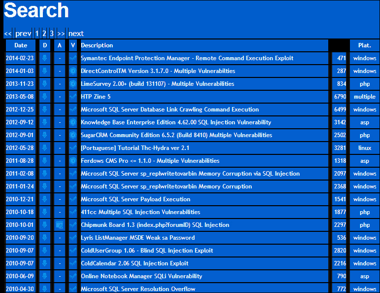

正如前面的截图所示，我们没有太多针对 MSSQL 数据库的利用选择，但我们有一个针对 Symantec Endpoint Protection Manager 的有趣利用。然而，这不是针对 MSSQL 的，所以我们将把这留作作业，供那些想要追求的人。有趣的是，它通过 SQL 注入等方式攻击终端保护系统。

由于在搜索利用数据库时我们并没有发现太多东西，我们将把注意力转向我们在遇到 MSSQL 目标时使用的过程。与所有测试一样，要遵循的顺序与我们在整本书中讨论过的方法论非常相似。我们将使用的第一种方法是我们 Kali Linux 发行版中的 Nmap 工具。你需要一个 SQL Server 作为目标。如果你没有，你可以从微软网站上下载软件。请记住，你安装的版本越新，你就需要更改设置，使其更易受攻击。打开一个终端窗口，输入`nmap –p 1433 --script ms-sql-info <target>`。这个命令的结果示例如下截图所示：

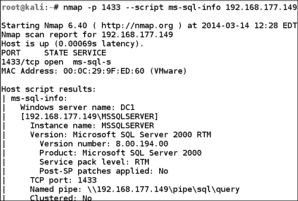

正如前面的截图所示，我们有一个旧版本的 SQL Server，这应该会让我们的工作更容易。一旦我们获得了数据库的信息，我们需要看看是否能确定管理账户的密码，这个账户是 MSSQL 中的 SA 账户。我们在 Nmap 中有一个脚本，可以进行暴力破解尝试来找到密码。在终端窗口中，输入`nmap –p 1433 --script ms-sql-brute` `192.168.177.149`来确定密码。

尝试的示例如下截图所示：


不幸的是，我们的尝试失败了，在这种情况下，我们无法破解 SA 密码。通常，密码将是默认的，即`<blank>`。由于我们在这方面失败了，我们将在尝试从这个数据库中提取更多数据时面临更多挑战。由于我们控制着目标，我们可以创建一个具有默认或已知密码的目标，以便我们可以继续我们的测试。如果我们确实获得了 SA 账户的凭据，我们可以尝试转储密码哈希。要做到这一点，在 Kali 的终端窗口中输入`nmap –p 1433 --script ms-sql-empty-password,ms-sql-dump-hashes <target>`。这个命令的示例如下截图所示：


我们想要探索的是 SQL Server 中的存储过程。由于我们已经确定了凭据是默认的，我们可以在服务器上执行命令。在终端窗口中，输入`nmap –p 1433 --script ms-sql-xp-cmdshell,ms-sql-empty-password` -`p 1433 192.168.177.149`来在服务器上运行命令。默认情况下，命令将是`ipconfig /all`，但如果你想运行其他命令，可以进行更改。重要的是要注意，这个命令行访问与在服务器上打开命令提示符窗口是一样的。

这个命令的部分输出示例如下截图所示：

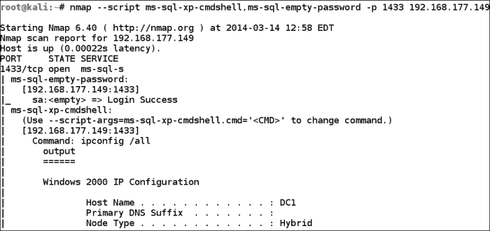

现在我们几乎完全可以访问这台机器。当然，它正在运行 SQL Server 2000；但是，如果它正在运行 SQL Server 2005 呢？我们现在将看一下一个 Windows Server 2003 机器。要记住的主要事情是，对于 SQL Server 2005，这些存储过程默认是禁用的，管理员必须启用它们。此外，SA 密码必须保持默认，因此当你遇到 Server 2005 时，你可能无法像在 SQL Server 2000 配置中那样获得信息。此外，如果密码无法确定，你将无法执行命令。下面的截图示例显示了 SQL Server 2000 未配置默认密码的情况：


到目前为止，我们只使用了 Nmap 中的脚本功能。我们还可以在 metasploit 中进行数据库测试。在终端窗口中输入`msfconsole`启动 metasploit 工具。一旦 metasploit 工具启动，输入`use auxiliary/scanner/mssql/mssql_ping`，然后设置`RHOSTS`并运行模块。模块的输出示例如下截图所示：


我们现在已经了解了数据库服务器的信息以及正在运行的 SQL 版本。接下来我们需要做的是查看 SQL Server 的配置。在 metasploit 窗口中，输入`use auxiliary/scanner/mssql/mssql_login`，设置`RHOSTS`，然后运行命令。这个命令的输出示例如下截图所示：


现在我们已经有足够的关于我们的目标、它正在运行的数据库以及数据库的配置的信息。是时候尝试使用 metasploit 对数据库进行枚举了。在 metasploit 窗口中，输入`use auxiliary/admin/mssql/mssql_enum`来枚举有关数据库的信息。这个命令的输出非常广泛。

这个命令的输出的第一部分示例如下截图所示：


正如前面的截图所示，我们已经能够确定了许多配置参数，并且知道了已创建的数据库的名称。输出的另一部分示例如下截图所示：

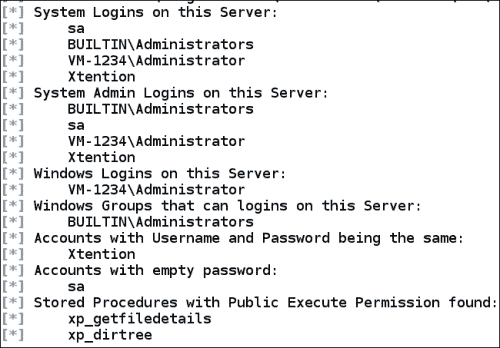

我们现在有了管理员登录和数据库配置允许的存储过程的列表。这里只显示了部分列表，但是建议您查看在 MSSQL 数据库中可以找到的所有可能的存储过程。

正如你所期望的，我们有能力使用这些存储过程执行命令，就像我们在 Nmap 中所做的一样。我们现在就来做这个。在终端窗口中，输入`use auxiliary/admin/mssql/mssql_exec`来访问模块。一旦进入模块，输入`set CMD 'dir'`来显示机器上的目录。请记住，这是一个具有系统权限的命令行，因此唯一的限制就是你的想象力。这个命令的输出示例如下截图所示：

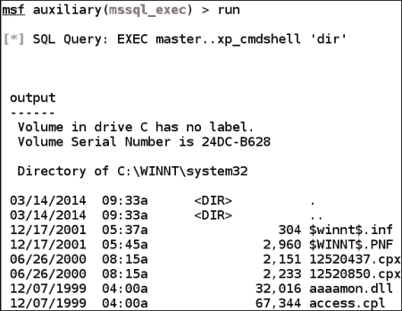

## MySQL

接下来我们将看一下 MySQL 数据库，这是一个免费开源的数据库。和之前一样，我们将从 Exploit DB 网站开始搜索，看看在这个数据库方面可能有哪些利用程序。以下截图显示了搜索结果的一个示例：


正如前面的截图所示，我们有许多关于 MySQL 的漏洞，针对这些漏洞已经有了利用程序。现在，我们将继续使用识别和枚举 MySQL 数据库中的信息的方法。

我们首先需要一个 MySQL 数据库来进行操作，所以我们可以使用我们的 CentOS 虚拟机。要安装数据库，输入`yum install mysql-server mysql`。安装完成后，需要进行检查。输入`chkconfig mysqld on`，一旦完成，输入`/etc/init.d/mysqld start`来启动数据库。

这是我们进行测试所需要做的。我们将使用 Nmap，就像我们在之前的部分中所做的一样，针对数据库进行操作。我们将输入的第一个命令是利用数据库已经设置了默认设置这一事实，因此根帐户没有密码。在 Kali 上的终端窗口中，输入`nmap -p 3306 --script mysql-empty-password,mysql-databases <target>`。这个命令的结果示例如下截图所示：


如前面的截图所示，这个版本的 MySQL 不允许连接。这是默认安装配置的更改。我们有几个选项。我们可以尝试在没有密码的情况下进行枚举；这可能不会让我们走得很远。此外，我们可以设置密码并配置数据库，看看我们能发现什么；但是，为了节省时间，我们将使用 metasploitable 虚拟机。我们只需要启动 MySQL 服务器。在 metasploitable 虚拟机终端窗口中，输入`sudo /etc/init.d/mysql start`。提示时，输入所需的密码。返回到您的 Kali 机器，输入`nmap -p 3306 --script mysql-empty-password,mysql-databases <target>`。此命令的输出示例如下截图所示：


现在我们有了空密码的 MySQL 数据库，我们可以继续探索 Nmap 中的不同命令。在 Kali 终端窗口中，输入`nmap -sV --script mysql-empty-password,mysql-databases,mysql-users <target>`来枚举数据库中的用户。此命令的输出示例如下截图所示：

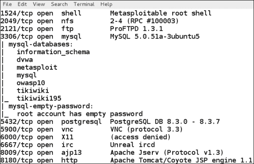

metasploit 工具还有许多针对 MySQL 数据库的模块。我们在这里不会探索它们，因为它与我们在查看 MSSQL 数据库时涵盖的过程非常相似。我们已经涵盖了这个过程，因此鼓励您自行探索。

## 甲骨文

这是我们可能会遇到的最流行的数据库之一。Oracle 数据库在从小型到大型企业中被广泛使用。因此，在测试时很可能会遇到它；因此，我们需要查看一些测试它的技术。该产品是商业产品，但他们提供了一个您可以免费使用的 express 版本。您可以从 Oracle 网站下载它，但您需要注册。

互联网上有很多参考资料，可以帮助您设置 Oracle，可以查看 Oracle 自己发布的文档；请参阅[`docs.oracle.com/html/B13669_01/toc.htm`](http://docs.oracle.com/html/B13669_01/toc.htm)。一旦您设置好了 Oracle 盒子，我们可以尝试多种技术来提取信息并进行测试。

版本 9 之后的 Oracle 数据库开始保护数据库中的信息。我们需要做的第一件事是确定 Oracle 数据库的 SID。我们将尝试使用 metasploit 模块来进行此操作。在 metasploit 终端窗口中，输入`use auxiliary/scanner/oracle/sid_enum`进入模块。一旦进入模块，您需要设置`RHOSTS`的值，然后输入`run`。此命令的输出示例如下截图所示：

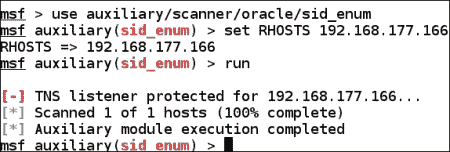

如前面的截图所示，如果遇到新于 v9 的 Oracle 数据库，则 SID 受到保护。我们可以运行暴力破解攻击来确定 SIDs。还要注意一点，有一些默认值。安装 Oracle 数据库时，您可以在那里查看默认的 SID。要尝试暴力破解 SIDs，请在 metasploit 终端窗口中输入`use auxiliary/admin/oracle/sid_brute`进入模块。设置 RHOST，然后运行模块。此模块的输出示例如下截图所示：


如前面的截图所示，我们现在有一些 SID 可以参考。由于我们安装的是 Express Edition 安装包，很高兴看到有一个默认的 SID 为 XE。

接下来我们可以尝试暴力破解数据库账户的密码。我们可以使用 metasploit 中的另一个模块来实现这一点。在 metasploit 窗口中，输入`use auxiliary/scanner/oracle/oracle_login`进入模块。一旦进入模块，你需要设置`RHOSTS`值和`RPORTS`值。Oracle 的默认端口是 1521，所以你很可能会设置这个端口。这个命令的部分输出示例如下截图所示：

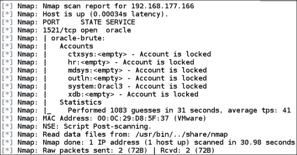

正如前面的截图所示，我们现在已经锁定了所有账户。这总是尝试暴力破解时的危险，但至少我们是在我们的测试实验室中进行的，而不是在客户的实时数据库中进行的。

# 操作系统平台的具体情况

由于本章我们正在研究服务器，所以我们想看一下在测试服务器时可能遇到的一些平台特性。

## Windows legacy

这些是较旧的 Windows 服务器，即 Windows 2000 和 Windows Server 2003。尽管 Windows 2000 服务器已经存在多年，但在测试时发现它并不罕见。特别是在测试**监控和数据采集**（**SCADA**）系统时，发现这种情况非常普遍。在 SCADA 网络上经常看到这些系统。

确定我们可以针对这个平台做些什么的一个好方法是返回到我们的 Exploit DB 并搜索漏洞。搜索结果的示例如下截图所示：


正如前面的截图所示，我们有一些可用的漏洞利用，但随着操作系统变得过时，我们在数据库中真的没有那么多。我们也可以在互联网上搜索。Windows Server 2003 平台存在一些我们可以利用的漏洞。我们已经介绍了一些方法，所以当你遇到这些机器时，你可以使用这些技术来发现潜在的漏洞。

## Windows Server 2008 和 2012

Windows Server 2008 和 2012 服务器代表了微软安全的不同方法，因此在很大程度上已被证明是难以攻击的目标，特别是 64 位版本。事实上，在撰写本书时，64 位漏洞利用并不多。在 Exploit DB 中搜索 64 位漏洞利用的示例如下截图所示：


正如前面的截图所示，在 Exploit DB 中搜索 64 位漏洞利用时，只返回了六个结果。这很好地表明了当涉及编写漏洞利用代码时，最新版本的 Microsoft 提供了挑战；因此，攻击这些操作系统的更常见方法是通过配置错误或在机器上运行的应用程序。

## Unix

在测试时可能会遇到一些 Unix 服务器，但当你搜索它们时，你不会找到很多漏洞利用。这部分是因为最受攻击的平台是 Windows，因此没有很多人攻击 Unix。此外，商业 Unix 提供商并不多。仍然有**Solaris**，所以我们可以搜索 Solaris 漏洞利用。

这次搜索的结果示例如下截图所示：

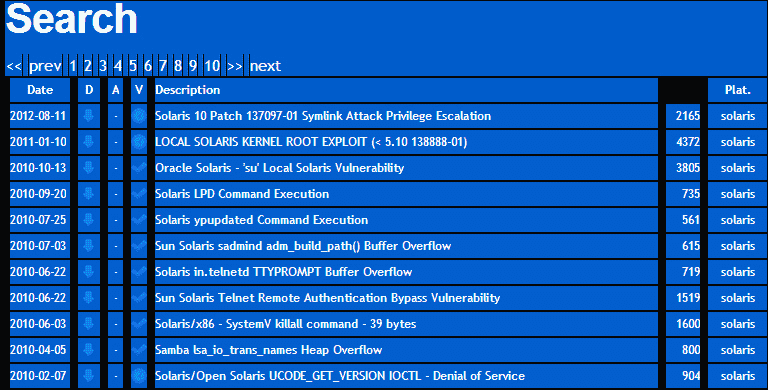

## Linux

Linux 操作系统的受欢迎程度不断增加，随之而来的是发现的漏洞数量也在增加。今天有很多 Linux 发行版，当你进行测试时，有可能会遇到各种发行版。Exploit DB 网站的搜索如下截图所示：


正如前面的截图所示，2014 年有许多可用的漏洞利用，因此漏洞利用作者继续探索 Linux 代码的弱点。

## MAC

有一个常见的误解是 MAC OS 没有漏洞利用。好吧，为了驳斥这一点，我们首先必须了解 MAC 是基于 Unix 的；因此，它有可能存在类似类型的漏洞。在下面的截图中显示了对漏洞利用数据库的搜索：


正如前面的截图所示，我们确实有一些可以用于 MAC 机器的 OS X 的漏洞利用。有关 MAC 平台上恶意软件的更多信息，请参考来自 Blackhat 会议的以下简要介绍：[`www.blackhat.com/asia-14/briefings.html#Tsai`](https://www.blackhat.com/asia-14/briefings.html#Tsai)。

# 总结

在本章中，我们讨论了评估服务器的过程。我们从查看服务器运行的常见协议开始这一章。我们研究了 FTP、电子邮件和 SSH。我们探讨了在服务器运行这些服务时如何提取信息的方法。

在探索常见协议之后，我们继续研究了数据库以及我们如何评估它们。我们研究了 MySQL、MSSQL 和 Oracle。我们发现这些最新版本都有更多的保护措施，因此，在数据库配置了安全性方面，提取信息需要一些努力。

最后，我们结束了这一章，看了不同的服务器操作系统以及根据我们发现的平台可以获得的信息。我们遇到的平台越新，我们在测试方面面临的挑战就越大。

这就结束了这一章。在下一章中，我们将看看由于供应商改进了他们的安全性，我们对攻击的更常见的向量，即客户端攻击向量。
