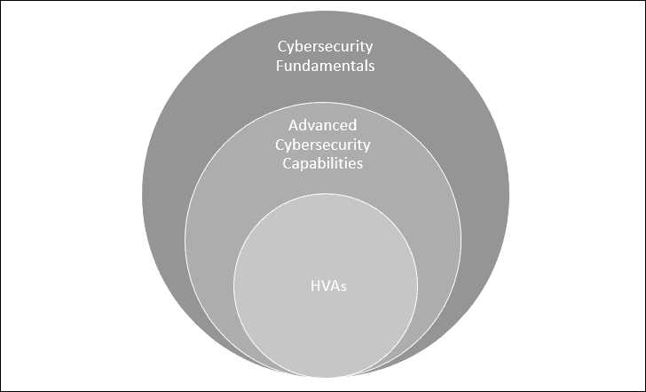
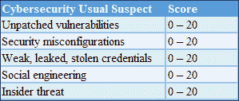
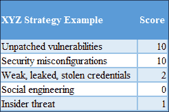
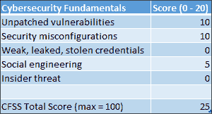
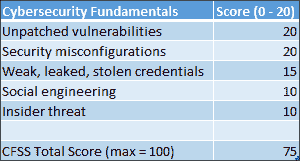
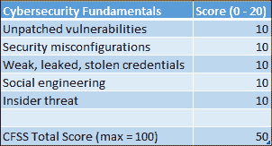
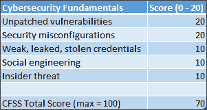
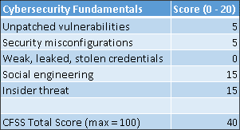
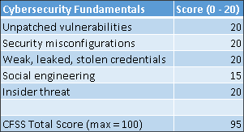

# 五、网络安全策略

每个企业都应该有一个网络安全策略，每个组织的 CISO 都应该能够清楚地表达出来。不管你的组织有没有策略，我希望这一章能引发一些思考，并提供一些有用的工具。

在本章中，我们将讨论以下主题:

*   过去二十年中采用的网络安全策略示例，包括:
    *   保护和恢复策略
    *   终端保护策略
    *   实物控制和安全审查策略
    *   合规性作为一种安全策略
    *   以应用为中心的策略
    *   以身份为中心的策略
    *   以数据为中心的策略
    *   以攻击为中心的策略
*   看看 DevOps
*   零信任简介

让我们从讨论哪种策略适合您的组织开始。

# 介绍

在第一章、*成功网络安全策略的要素*中，我讨论了成功网络安全策略的要素。其中包括我认为是理解网络安全常见疑点的一个关键因素，即组织最初受到危害的五种方式。我在最后三章讨论了 CISOs 和安全团队通常关心的最常见威胁，包括漏洞、利用、恶意软件和政府对数据的访问。在这一章中，我将把所有这些概念结合起来，对过去几十年来我在业界看到的一些网络安全策略进行分析。你可能以前见过其中的一些，也可能用过其中的一些。我这一章的目的不是向你展示一堆策略，让你从中选择一个来使用。我的目标是为您提供一个框架，以确定网络安全策略的有效性，包括我在本章中不会讨论的策略，但您可能会在您的职业生涯中遇到。换句话说，我希望教你如何钓鱼，而不是给你一个一刀切的策略，我知道这只会帮助一小部分使用它的组织。

对您的组织来说，正确的策略是有助于减轻您的组织面临的最重要的风险的策略。风险是相对的；因此，没有一种策略能成为所有组织的灵丹妙药。我会忍住诱惑，简单地告诉你使用 NIST 网络安全框架(NIST，北达科他州)，ISO/IEC 27001 (ISO，北达科他州)，或任何其他可用的伟大框架。您的组织可能已经采用了这些框架中的一个或多个，从**治理、风险和法规遵从性** ( **GRC** )的角度来看，这对于企业规模的组织来说是不可避免的；也就是说，你的组织必须证明它正在做其他行业正在做的事情，否则它将被视为局外人。GRC 框架通常旨在帮助组织在事故发生后免除责任，随后许多组织会优先考虑这些框架。然而，尽管有大量优秀的框架可用，数据泄露的速度并没有放缓。举个的例子，**欧洲数据保护委员会** ( **EDPB** )公布了一份关于**通用数据保护条例** ( **GDPR** )在 GDPR 实现的前九个月后的结果报告。在前九个月，EDPB 收到了近 65，000 份数据泄露通知。

这些组织中的绝大多数很可能完全符合自己的安全政策，从而说明了网络安全与合规之间的区别。这可能只是冰山一角，但它给了我们一些提示，无论大小，组织都需要网络安全策略方面的帮助。

> “北欧国家从 31 个欧洲经济区国家报告的病例总数是 206.326。可以区分三种不同类型的案件，即基于投诉的案件、基于数据泄露通知的案件和其他类型的案件。大多数案件与投诉有关，特别是 94.622 起，而 64.684 起是根据主计长发出的数据违规通知启动的。”(欧洲数据保护委员会，2019 年)

在这一章中，我会给你一个稍微相反的观点，意在引起思考。如果你的组织已经有了一个网络安全策略，并且使用了行业框架，本章将会给你一些问题来问你自己关于你当前策略的有效性。如果您的组织没有一个可以清晰表达的网络安全策略，本章将向您介绍其他组织已经使用的一些策略、它们的优点、缺点以及衡量它们潜在有效性的方法。

正如你在*第一章*、*成功网络安全策略的要素*中看到的，我在那里描述了什么是网络安全策略，我有意简化了这些策略的描述。我和一些 CISOs 谈过，他们的网络安全策略非常密集，很少有人能完全理解或重复。不幸的是，这些组织中的大多数都出现过数据泄露。最终，在所有这些案例中，最初的妥协都是由于缺乏对网络安全基础的关注或管理失误。保持策略的简单性使得涉众社区和从事这项工作的人更容易理解策略，并向他们的团队解释它(重复一遍)。It 部门和网络安全小组中可能只有几个团队负责理解和执行完整的策略。您可以保留超级复杂的策略版本，覆盖治理、风险、合规性、产品开发、招聘、支持当地网络安全教育计划、继任规划和其他组件，供需要并理解所有细节和抱负的利益相关方使用。

不管网络安全策略有多复杂，它的成功依赖于我在第一章中描述的要素，最重要的是，它如何很好地解决网络安全的基本问题。衡量该策略在一段时间内的表现非常重要，这样就可以进行调整来改进它。接下来，让我们看看如何衡量功效。

# 衡量网络安全策略的效力

让我用我在第一章*中介绍的两个概念重新向你们介绍一下，成功的网络安全策略*的*要素。我们将使用这两个概念来衡量我们研究的策略的潜在功效。*

请记住，网络安全通常怀疑组织最初受到危害的五种方式包括:

1.  未修补的漏洞
2.  安全错误配置
3.  脆弱、泄露或被盗的凭据
4.  社会工程
5.  内部威胁

这是组织最初受到损害的五种方式。一旦 IT 环境最初被破坏，攻击者就可以使用许许多多**战术、技术和程序** ( **TTPs** )横向移动、窃取凭证、破坏基础设施、保持持久性、窃取信息、破坏数据和基础设施等等。这些 TTP 中的大多数已经存在多年了。偶尔，行业会看到攻击者采用新的方法。减轻网络安全通常的嫌疑是我所说的网络安全基础。专注于真正擅长网络安全基础知识的组织会让攻击者更难得逞。网络安全通常怀疑，专注于所有攻击者最初危害网络所做的事情，是组织采用的任何策略或策略组合的硬性要求。

换句话说，如果一个组织的网络安全策略不包括在网络安全基础方面的卓越表现，那么它就是在为失败做准备。为什么呢？我们知道，99.9%的成功妥协都始于网络安全的常见疑点。如果这是真的，为什么您的组织要使用一种至少不能缓解这些攻击媒介的策略呢？为什么您会使用一种您知道存在漏洞、攻击者已经使用了几十年的策略来攻击其他组织呢？还记得我在这本书的序言部分使用的潜艇比喻吗？你为什么要乘坐一艘明知船体有缺陷的潜艇出航？你有足够的信心在潜艇中下潜两英里，并允许巨大的压力在船体的每一平方毫米上累积吗？这听起来很鲁莽，对吗？你们中的一些人会愿意承担一些风险，这样你们就可以在快速发展、竞争激烈的行业中竞争。

这就是我遇到的一些高管感觉他们必须在网络安全和快速行动之间做出选择的地方。但是快速移动和动态变化并不相互排斥；这不是他们必须做出的选择，因为如果他们有一个使他们能够这样做的策略，他们就可以同时获得网络安全效率和业务速度、敏捷性和可扩展性。投资于那些故意无法解决组织受到危害的最常见方式的方法是徒劳的。此外，如果网络已经遭到破坏，组织仍然需要关注网络安全基础，以防止更多的攻击者在他们的网络中获得立足点，从而防止已经居住在网络中的攻击者再次进入网络，如果他们曾经被赶出网络的话。无论一个组织采用什么策略，它都需要纳入网络安全的基本原则。

一旦一个组织磨练了其进行网络安全基础工作的能力，并建立了一个可以依靠的基础，那么投资于高级网络安全能力是有意义的——专注于网络安全基础工作以外的事情的能力。您的策略需要一个坚实的基础，即使它拥有先进的网络安全功能，因为这些功能所依赖的信息平台及其自身的安全性可能会受到未打补丁的漏洞、安全错误配置、社会工程、内部威胁以及弱密码、泄露密码和被盗密码的破坏。

在生产和开发/测试环境中出色地解决所有网络安全基础问题是在您的 IT 环境中成功部署和运行高级网络安全功能的必要条件。例如，如果一个组织没有计划来扫描和修补他们作为其高级网络安全能力的一部分而部署的硬件和软件中的安全漏洞和错误配置，他们就不应该费心部署它们，因为随着时间的推移，它们只会增加组织的攻击面。

您可能想知道，如果您的组织确实擅长网络安全基础知识，为什么您必须投资于高级网络安全能力。因为你必须为失败做准备。你必须假设组织会被攻破，这不是是否会被攻破的问题，只是发生的时间和频率的问题。这种“假定违约”的理念很重要，至少有两个原因。首先，历史告诉我们，计划在一段持续的时间内为大型内部 IT 环境实现 100%的完美保护是一种过于乐观的雄心。你的组织和供应链中的人会犯错误，其中一些是与安全相关的。

例如，您的应用程序，无论是内部开发还是通过供应商开发，都会有缺陷。其中一些错误将是安全漏洞。其中一些漏洞将被利用。你需要为这种可能性做好准备。您需要为管理员可能犯的导致安全配置错误的错误做好准备。您需要为您的供应商中受信任的供应商受到威胁或变得恶意的情况做好准备。这是一个红队可以在现实中制定策略的领域，因为他们擅长利用不切实际的假设。

组织需要采用假定违规理念的第二个原因是，它允许他们的安全团队思考一些关键问题，那些认为他们可以永远实现 100%有效保护的安全团队从来不会问自己这些问题。

例如，他们如何知道自己何时受到了威胁？当他们受到威胁时会怎么做？这些是许多安全团队从来没有问过自己的问题，因为他们不会，或者不能，采用一种假设违反哲学。

一些企业文化不会容忍失败，因此他们为失败做计划的想法对他们来说毫无意义；这就像承认他们不够好，不能胜任自己的工作。在其他组织中，高级管理人员不会支持失败的计划。我遇到过许多高管，他们不明白自己身处一艘承受巨大压力、被恶劣环境包围的潜艇中。我交谈过的一些高管认为，他们在一场可以打赢的战斗中。他们相信，如果他们足够聪明，雇用正确的人，并购买正确的保护能力，他们将赢得这场战斗。但网络安全是一个旅程，而不是目的地。它不像战争那样有开始和结束。它是恒定的，就像潜艇船体上的压力。为失败做准备是他们世界观的对立面，因此他们拒绝支持那些知道他们需要采用更现代的网络安全方法的 CISOs。这就是为什么我总是试图花时间与网络安全策略利益相关者，而不是 CISO 和安全团队在一起的原因之一。通常，安全团队理解我在这里写的一切，但一两个高管或董事会成员有不知情的观点。

高级网络安全能力是您的策略的一部分，将帮助您识别、保护、检测、响应和恢复(NIST，未标明)。这是您的策略的一部分，有助于增强和识别网络安全基础中的缺点。你需要这两者来使策略成功。策略的**高价值资产** ( **HVAs** )组成部分承认 HVAs 的重要性。正如我在*第一章*、*成功网络安全策略的要素*中提到的，如果 HVA 的保密性、完整性或可用性受到损害，这通常意味着组织本身将会失败。HVA 的持续妥协可能是一个公司的灭绝事件(Ashford，2016 年)，并促使公共部门组织重新使用铅笔、纸张和他们在投资之前使用的流程。

除了网络安全基础知识和高级网络安全能力之外，专门针对 HVAs 的安全规划和投资将有助于组织管理其最重要资产的风险。

图 5.1:网络安全策略示意图

不管组织的 HVAs 和他们决定投资于哪些先进的网络安全能力(这在组织之间有很大的差异)，我在这里概述的整个策略模型都依赖于网络安全基础提供的基础。如果没有专注于网络安全基础的坚实基础，一项策略将会失败。企业追求的任何网络安全策略都需要至少关注网络安全的基本原则。有鉴于此，我将介绍一种简单的方法来帮助确定一项策略的潜在效力，方法是评估它在多大程度上融入了网络安全基础知识，并减少了网络安全常见的疑点。

我将使用一个简单的评分系统来评估我们所研究的网络安全策略的潜在功效。我称这个系统为**网络安全基础评分系统** ( **CFSS** )。这个系统根据策略降低风险的程度，为每个网络安全常见嫌疑人分配一个 0 到 10 分的分数。更高的分数意味着该策略在缓解每一个特定的网络安全常见嫌疑方面更加有效。例如，20 分意味着该策略完全降低了与特定网络安全常见嫌疑相关的风险。较低的分数(例如 1 分)意味着该策略降低风险的能力相对较低。CFSS 包括五个网络安全常见嫌疑人的单独分数，如*表 5.1* 所示:

表 5.1:粮安委汇总

所有五个分数的总和就是该策略的 CFSS 总分。一项策略的最低 CFSS 总分是零，最高是 100。例如，如*表 5.2* 所示，假设我们有一个名为“XYZ”的策略，我们估计 CFS 中五个指标的得分。当我们将个人得分相加时，我们得到 CFSS 总分 23 分(满分为 100 分):

表 5.2:食品安全标准示例

我们的目标是找到一个给我们满分的策略，尽管这可能更有抱负而不是可能。但这种类型的评分系统为我们提供了一种方法来评估一种策略缓解组织最初受到攻击的所有五种方式的能力，以及一种在网络安全基础上比较策略的方法。潜在地，这种方法可以帮助我们确定一种策略组合，如果没有单一的策略可以做到这一点，那么这种策略组合可以在网络安全的常见问题中给我们满分或高分。最后，它还可以帮助我们确定组织当前使用的策略中的差距。如果你知道弱点或差距在哪里，那么你可以制定一个计划来解决这些不足之处。

在我们开始使用这个框架来衡量策略之前，我想指出使用这种评级的隐藏风险。与大多数基于风险的方法一样，它基于这样的假设:CISOs 和安全团队将能够准确地估计风险水平并确定有效的缓解措施。根据我的经验，我见过一些首席信息安全官高估了自己的能力和有效降低风险的能力，同时又低估了风险本身和网络安全基础的有效性。

既然我们已经有了网络安全策略的概念和帮助我们确定不同方法的相对效力的评分系统，让我们更详细地检查众多的网络安全策略。

# 网络安全策略

正如我在*第一章*、*成功网络安全策略的要素*中提到的，当“策略”一词在网络安全环境中使用时，我遇到的一些网络安全专业人士有负面反应。这个词至少有几种不同的用法。安全和法规遵从性专业人员在提到框架、模型或标准时，有时会使用术语“策略”。我在第一章中详细解释了我使用这个术语的意思。如果你还没有读过那一章，我建议你读一读，因为它提供了一大堆背景知识，我不会在这里重复。你会看到我在所有章节中交替使用框架、方法、模型等术语。当我使用这些术语时，请随意联想对您最有意义的术语。

下面的列表包含了我在过去二十年中在这个行业中看到的许多策略。我将详细检查这些策略中的每一个，并为每个策略提供一个估计的 CFSS 分数。我提供的 CFSS 分数是我自己的主观意见，受我自己的假设和偏见的影响。我向您提供一些背景信息，说明为什么每个网络安全常见嫌疑人都是这样评分的，这样您就可以理解我的方法，并同意或不同意它。

我邀请您思考一下您自己对这些策略的 CFSS 评分估计:

*   保护和恢复策略
*   端点保护策略
*   作为一项策略的实物控制和安全审查
*   合规性作为一种安全策略
*   以应用为中心的策略
*   以身份为中心的策略
*   以数据为中心的策略
*   以攻击为中心的策略

当我们回顾这些策略时，即使您的组织没有使用它们中的任何一个，请问问您自己是否知道作为您供应链一部分的供应商是否使用它们中的任何一个。如果您不知道他们用于管理其组织和客户风险的策略，那么您可能需要询问他们如何减轻网络安全常见问题。这是他们应该为自己和客户做的最起码的事情。

我认为有两种方法更多的是关于文化、哲学、过程、实现和支持技术的交集，而不是策略本身。这是 DevSecOps 和 Zero Trust。这些不是传统意义上的网络安全策略，我名单上的其他人都是。除了 DevSecOps 和/或零信任之外，组织可能还会使用我列表中的一个或多个策略。因此，我将把这些方法与前面列出的其他方法分开来讨论。

## 保护和恢复策略

让我们从一个相对古老的策略开始，我称之为保护和恢复策略。它也被称为外围安全策略。正如老话所说，它通常被描述为有一个坚硬的外壳和一个柔软的，有时是胶粘的中心。这种类比是经常使用的，因为一旦组织的外围防御被渗透，很少或没有什么可以阻止攻击者在环境中横向移动并无限期地持续下去。组织不得不尝试恢复原始数据和 IT 环境，但通常成败参半。按照今天的标准，这被认为是一个过时的策略，但是我发现一个惊人数量的组织仍然坚持它。

顾名思义，这种策略的重点是通过投资防火墙、**非军事区** ( **非军事区**)、代理服务器和微分段等保护技术来防止攻击者得逞。让我们回到 2003 年，看看为什么这种策略如此流行的一个很好的例子。到 2003 年，互联网上已经出现了成功的大规模蠕虫攻击，如 Code Red 和 Nimda。这种攻击的风险不再是理论上的，因为当时许多人认为是理论上的。业界刚刚开始认识到软件有漏洞，其中一些是可利用的。当时，我在微软面向客户的安全事件响应团队工作。我帮助过的许多组织指责微软没有采取更多措施来保护 Windows 免受此类攻击。

企业客户普遍认为，如果他们用另一个操作系统替换他们的微软视窗系统，他们就安全了。他们是世界上最常用的操作系统的制造商，随后获得了合法安全研究人员和攻击者的大量关注。当然，现在，这么多年过去了，我想大家都明白，所有厂商的软件和硬件都有漏洞。如果你对此仍有任何疑问，请返回并重新阅读*第二章*、*利用漏洞趋势降低风险和成本*。在 2003 年，未打补丁的漏洞所带来的风险的缓解手段是防火墙。当微软在 Windows XP Service Pack 2 中默认打开 Windows 防火墙时，人们希望这可以防止利用 Windows 服务和监听网络的应用程序中的漏洞。

Windows 防火墙和其他一些安全缓解措施，包括自动更新，成功地抵御了那个时代的大规模蠕虫攻击。2003 年，许多企业规模的组织已经在其网络外围安装了公司防火墙。但是大多数都有例外，允许所有流量进出端口 80 和 443，以便 HTTP 和 HTTPS 流量可以自由流动；这些就是所谓的“通用防火墙旁路端口”在接下来的几年里，还没有 dmz 的企业建立了 dmz，以便更好地控制进出互联网的网络流量。

安全策略的这一演变对行业来说是重要而有效的一步。但是在这个过程中，外围安全的最初好处被扭曲了。最终，外围安全应该为组织提供两件事情。首先，它保护了那些被认为是私有的资源不被公众访问。第二，阻止匿名入站网络流量进入监听网络的易受攻击服务，让组织有更多的时间来测试和部署安全更新。但是，在应用层功能被内置到这些产品中的 5 到 10 年前，防火墙、dmz 和网络分段可以以某种方式为漏洞管理或其他四个网络安全常见问题提供长期解决方案的想法是错误的。

保护和恢复策略的基本假设是，组织将能够部署和运行足够的保护技术和流程。如果这些都失败了，那么复苏就是他们的计划。因为该组织在保护方面非常出色，所以它实际上不需要投资于检测和响应能力。采用这种方法的大多数组织还投资了备份和恢复功能。他们不一定出于安全目的投资备份和恢复功能；相反，这些降低了数据丢失的风险。当他们的保护策略最终失败时，他们的备份和恢复能力是他们的后盾。因此，尽管这两个组件不一定是连贯的网络安全策略的一部分，但它们在企业环境中部署得如此普遍，以至于它们可以很好地相互补充。如果组织可以永远 100%有效地保护自己的假设被证明是不正确的，那么他们可以从备份中恢复。

这种方法的特点是主要投资于外围和网络保护，以及备份和恢复。具有网络专业知识的专业人员可以将其专业知识扩展到安全领域。这很有意义，因为几乎 100%的攻击都是利用网络进行的。对于许多企业来说，他们的网络小组扩展了他们章程的范围，包括网络安全、dmz 和管理防火墙。

保护和恢复策略有一些优势。与应用程序安全、恶意软件反向工程或红蓝团队等其他安全领域相比，TCP/IP、路由和交换、防火墙配置和操作等技术和领域拥有训练有素的员工。因为这是一个相对成熟的策略，所以有一个非常成熟的供应商和咨询生态系统，他们有几十年的经验来支持它。训练有素的员工队伍和这一生态系统使这一策略成为组织的自然选择，这些组织限制自己主要使用已经与他们签订了网络安全合同的 IT 员工和供应商。

当然，这种策略也有一些缺点。历史已经证明这是一个糟糕的网络安全策略。有些人可能不同意我对这种策略的描述，但你不能否认，在过去 15 年或 20 年中，几乎每一次成为头条新闻的重大入侵中，受害组织都以某种方式使用了这种方法。这种方法一次又一次失败的原因是因为它的潜在假设存在严重缺陷。假设该组织永远不会妥协，因为它将 100%成功地保护自己是过于乐观了。如今，除了保护和恢复能力之外，不投资于检测和响应能力的企业可能会被视为疏忽大意。

减少妥协和检测之间的时间被视为一个现代网络安全咒语，而保护和恢复策略并没有被设计为拥抱。随后，使用这种策略的组织可能会有很长的妥协期和检测期，有时长达数百天或数年。这种策略没有认识到攻击者比防御者拥有不成比例的优势；防守者需要 100%的完美，这是一个不切实际的愿望，而进攻者只需要好一次或者运气好一次。

这种策略依赖于开发人员、管理员、供应商、合作伙伴和用户不要犯任何可能导致危害的错误或不可信的决策。但是正如我们几十年来所看到的，用户将会不知不觉地通过外围防御层带来威胁。如果没有检测和响应能力，一旦组织被渗透，攻击者通常会无限期地持续下去，从而使恢复变得令人向往且代价高昂。

好消息是，随着时间的推移，许多过去使用保护和恢复策略的组织已经成熟了他们的方法。他们仍然采用这种策略，但与其他策略结合使用。他们还升级了他们所依赖的技术和产品。今天，下一代防火墙已经远远超出了过滤 TCP 和 UDP 端口的范围，可以执行深度数据包检测。但是，这些组织仍然需要考虑的一个问题是，他们的业务伙伴和供应链伙伴是否仍然采用这种旧策略。多年来，攻击者一直将目标锁定在规模较小、不太成熟的合作伙伴和供应商身上，以获取他们大客户的基础设施和数据。为此，小型法律公司、营销和广告公司，甚至供暖和空调供应商都成了目标。世界各地许多像这样的小公司仍在使用保护和恢复策略。

### 网络安全基础评分系统分数

保护和恢复策略在多大程度上缓解了网络安全常见问题？*表 5.3* 包含我的 CFSS 分数估计值:

表 5.3:保护和恢复策略的 CFSS 分数估计值

您可能已经从我对这一策略的描述中发现，尽管它有一些好处，但它并没有很好地解决网络安全的基本问题。对于未打补丁的漏洞，我给这个策略打了 10/20。

这个分数反映了防火墙和分段可以使攻击者和恶意软件更难访问监听网络端口的可利用漏洞。如果网络流量无法到达易受攻击的服务的端口，则该漏洞就无法被利用。但这种缓解并不是可利用漏洞的永久条件。一旦管理员更改了阻止端口的防火墙过滤器的规则，该漏洞就有可能在管理员不知情的情况下被立即利用。通常，过滤器会阻止某个端口的未经请求的入站流量，但允许入站流量，这是同一端口上合法出站流量的结果。在适当的条件下，服务或应用程序可能会被诱使与攻击者控制下的目的地建立出站连接。防火墙只能暂时缓解未打补丁的漏洞，从而给漏洞管理团队更多的时间来查找和修补漏洞。易受攻击的软件需要从系统中卸载(这对于大多数操作系统组件来说不容易做到)或者需要打补丁。保护和恢复策略并不关注漏洞管理。安全错误配置也是如此。这种策略并不能帮助我们完全缓解这两种网络安全常见的嫌疑——它最多只能延迟利用。为此，我在这两个方面给它打了偏分。

这种策略无法解决脆弱、泄露或被盗的凭证或内部威胁。因此，两者都得了零分。最后，我给这个策略减轻社会工程的能力打了部分分。防火墙和 dmz 可以根据 URL 和 IP 地址过滤连接。它们可以防止被诱骗点击恶意链接的用户连接到已知的恶意服务器和未经授权的站点。可以阻止和标记出站流量以及对此类出站流量的入站回复。面临的挑战是跟上攻击者的步伐，这些攻击者在世界各地使用受威胁的系统来发起复杂的多组件攻击，并不断改变攻击的来源和目的地。历史告诉我们，这种方法并不能非常有效地缓解社会工程攻击。这是因为它仍然依赖用户和管理员来做出合理的信任决策，这一直是一个挑战。尽管如此，我还是给了它社会工程的部分分数。

CFSS 总分为 25 分(满分为 100 分),显然，该策略必须与其他策略结合使用，以便真正关注网络安全基础，并为企业提供一个可以依赖的基础。许多组织已经得出了这个结论，并发展了他们的方法。但是他们供应链中的一些较小的组织可能仍然使用这种策略，因为他们缺乏专业知识和资源来发展。有多少小型企业和独立顾问仍然依赖内置于无线接入点的防火墙进行保护？

### 保护和恢复策略摘要

该策略的 CFSS 总分是 25/100。它必须与其他策略结合使用。

优势:

*   帮助组织实现和运营的大型供应商生态系统
*   具有多年经验的相对较大的训练有素的劳动力

缺点:

*   历史已经证明这是一个糟糕的策略
*   进攻者比防守者有不成比例的优势，因为防守者必须是完美的
*   它依赖于开发人员、管理员和用户不会犯错误或做出导致危害的不可信决策
*   个人通过边界和基于主机的防御带来威胁
*   问自己一个问题:你的合作伙伴或供应链还在使用这种策略吗？
*   一旦被入侵，攻击者可能会无限期地坚持下去，因为缺乏对检测和响应能力的投资

现在，让我们研究一种不以网络边界为重点的策略。

## 端点保护策略

接下来，我将讨论另一个相对较老的策略，即端点保护策略。这就是我所说的“代理”策略。这里的想法是，端点，如个人电脑、移动设备、某些类型的物联网设备等，用于处理、存储和传输数据。因此，如果我们保护这些端点，我们就是在通过代理保护数据，这就是数据保护的全部意义。换句话说，如果终端/设备受到危害，数据将受到危害，因此终端必须受到保护。从前，许多组织单独使用这种策略来保护他们的资产。基本假设是，保护终端和设备是保护组织数据的有效代理。

终端保护策略的特点是投资主机保护技术，如清单和漏洞管理解决方案、反恶意软件解决方案、文件完整性监控、基于主机的防火墙、应用程序白名单、web 浏览器保护、移动设备管理、企业配置管理和终端强化等。其中许多功能已经内置于 Windows 和 Linux 操作系统中，但这并没有阻止终端保护供应商提供这些功能的更好实现，这些功能通常具有集成的管理和报告功能。

什么是端点？原来有很多可能的定义。首先，重要的是要了解不同的操作系统制造商允许第三方 ISV 访问不同级别的系统，这可能会对他们的解决方案有很大的影响。销售终端保护解决方案的供应商有自己的定义来支持他们特定的价值主张。这曾经是主要防病毒供应商的简短列表，但是最近几年，该列表已经增长，并且供应商已经变得更加多样化。目前，我估计至少有 20 家不同的供应商在积极营销终端保护平台解决方案。其中包括(按字母顺序排列):BitDefender、BlackBerry Cylance、Carbon Black、Check Point Software Technologies、Cisco、Crowdstrike、ESET、FireEye、Fortinet、F-Secure、Kaspersky、Malwarebytes、McAfee、Microsoft、Palo Alto Networks、Panda Security、SentinelOne、Sophos、Symantec 和 Trend Micro。这一领域还有许多其他供应商，包括东亚某大国的地区供应商等等。

其中一些供应商拥有拥有数十年经验的反病毒实验室，而其他供应商则利用安全公司收购和其他领域的创新来试图扰乱终端保护市场。许多供应商现在将分析和云功能作为其解决方案的一部分。

我在反恶意软件实验室和安全事件响应团队工作了多年，对这种方法非常欣赏。端点是数据泄露期间大多数操作发生的地方。无论防火墙和 IDS 供应商的产品有多好，它们都没有端点设备通常拥有的优势。当你在鱼缸里时，你可以比在鱼缸外看鱼看得更清楚。直接安装在终端上的解决方案支持持续监控和一系列触发时的自动操作。端点防护扫描引擎是世界上最令人印象深刻的编程技术之一。这些引擎必须在模拟真实操作系统的虚拟计算环境中解开攻击者可能嵌套的大量文件压缩和混淆格式，以便近乎实时地确定文件是否是恶意的。

威胁可以是跨不同操作系统和文件系统的基于文件的、宏、脚本、多态病毒、引导病毒、根工具包等等。当然，他们有更多的功能，如启发式，行为分析，浏览器保护，恶意 IP 地址过滤，等等。当您深入了解其中一些终端保护解决方案的功能，并考虑开发这些解决方案并使其保持最新的难度时，您会发现它们令人印象深刻。然而，仅有工程是不够的。这些解决方案的好坏取决于关心和支持它们的研究和响应实验室。维持大量优秀的研究人员、分析人员和支持人员是这些供应商提供的重要功能。令人印象深刻的工程设计与世界一流的研究和响应实验室相结合，是选择有效的终端保护供应商的关键。我之前描述的大型供应商生态系统非常积极。这是因为它创造了健康的竞争，这些供应商通过支持第三方测试([【av-test.org】](http://av-test.org)和[【av-comparatives.org】](http://av-comparatives.org)等)和行业会议(年度病毒公告国际会议(Virus Bulletin International Conference(Virus Bulletin，n.d .))来保持彼此的诚实，在这些会议上，他们讨论如何管理他们的行业，等等。

但是当然，这种方法也有挑战。历史告诉我们，终端保护策略本身是不够的。在过去 10 年成为头条新闻的大规模数据泄露事件中，是否有受害者没有运行终端保护解决方案？首先，依靠病人来诊断和治愈本身是一种乐观的方法。一旦系统的可信计算基础遭到破坏，终端保护解决方案如何可靠地使用它来检测系统上的威胁并清除它们？几十年来，终端保护解决方案一直是攻击者及其恶意软件的目标。许多恶意软件家族在最初危及系统安全后，首先会禁用或破坏终端保护解决方案。这就是远程证明服务可以提供帮助的地方，但是根据我的经验，很少有组织使用这样的服务，因为它们很复杂。一些供应商使用虚拟化技术来保护他们的解决方案免受攻击者的攻击。但请放心，攻击者将继续研究破坏终端保护解决方案的方法。

在这场游戏中，比赛场地从来都不公平。攻击者可以购买市场上所有可用的终端解决方案，并在攻击之前测试他们的恶意软件和工具，以确保没有解决方案可以检测或清除它们。终端保护供应商没有同样的优势。但更根本的是，病人真的可以被信任治愈自己吗？一些组织将使用端点解决方案清理受损系统，并允许它们在生产中继续运行，而其他组织则制定了策略来消除和重建任何受损系统。虚拟化使这变得更容易，而云，正如我将在后面详细讨论的，使这变得更加容易和有效。但是这种方法的关键仍然是准确的威胁检测。请记住，尽管所有这些解决方案的理想目标是检测、阻止并在必要时清除 100%的威胁，但这是不现实的。研究和响应实验室的内部目标通常更加现实和可实现。例如，对“动物园”(他们的私人恶意软件库)中的威胁进行 100%的检测，或者对“野外”恶意软件(常见威胁)进行 100%的检测，可能是这些供应商的共同目标。但是对新出现的威胁的检测目标可能是 80%。毕竟，研究和响应实验室需要时间来获取威胁样本、处理它们并为客户部署适当的保护措施，特别是当攻击者使用大规模自动化不断生成数百万个威胁时。

你会乘坐一艘目标是将 80%的水保持在船体外部的潜艇出航吗？可能不会。但是正如我在*第三章*、*威胁格局的演变——恶意软件*中所写的，如果您不使用终端保护，因为它不能保护终端免受 100%的威胁，那么您就不能保护终端免受终端保护解决方案所能保护的数百万威胁的侵害。

### 网络安全基础评分系统分数

让我们看看终端保护策略如何帮助组织解决网络安全基础问题。*表 5.4* 包含了我对 CFSS 分数的估计。请记住，这些只是基于我的经验的估计，并不反映终端保护的最新水平。如果您认为我的估计与您的相去甚远，请随意提出您自己的估计:

表 5.4:终端保护策略的 CFFS 评分估计值

对于减少未打补丁的漏洞和安全错误配置，我给这个策略打了满分。盘点、扫描、更新、加固和监控的结合非常有效。对于脆弱、泄露和被盗的凭据，我估计终端保护缓解率为 15/20。使用安全访问工作站或特权访问工作站(专门针对查找缓存管理员凭据的攻击而强化的端点)作为其端点策略的一部分的组织可以在很大程度上缓解这种类型的威胁，但不能完全缓解。终端保护解决方案还可以帮助部分缓解社会工程和内部威胁，使用户和管理员更难犯一些常见的错误和不良的信任选择，从而导致危害，但它不能完全缓解恶意的内部威胁。

尽管终端保护策略本身是不够的，但如果不将其与其他策略结合使用，很难想象会有成功的企业网络安全策略。随着越来越多与我交谈过的组织计划在不久的将来评估和采用**安全协调、自动化和响应** ( **SOAR** )解决方案，行业似乎同意这一评估。一些供应商将 SOAR 描述为端点保护的一个进化步骤，因为它结合了一堆不同功能的功能，包括端点保护和响应。

### 终端保护策略摘要

该策略的 CFSS 总分是 75/100。它必须与其他策略结合使用。

优点:

*   终端上运行的卓越可见性和控制
*   大型供应商生态系统有助于积累数十年的经验
*   持续的威胁研究、响应和不断发展的技术，以领先于攻击者

缺点:

*   历史已经证明，这本身就是一个糟糕的策略，因为它无法阻止许多头条新闻中的重大数据泄露事件。
*   用户抵制限制性太强或影响生产力的系统；在许多情况下，个人通过防御自己带来威胁。这种方法只能部分地减轻开发人员、管理员和用户所犯的导致妥协的错误或不良信任决策。
*   速度是一个因素。相对缓慢和复杂的漏洞管理过程给了攻击者优势。拥有良好终端策略但部署安全更新和其他保护措施相对较慢的组织会接受更多风险。
*   端点保护套件具有不一致的性能历史和期望的性能目标。不了解终端保护供应商内部目标的组织可能无法完全了解相关风险。
*   管理终端安全性依赖于准确及时的资产清点和管理功能。众所周知，这在内部环境中非常困难。稍后我将讨论云如何让这变得更容易。
*   许多组织允许员工使用个人未管理或部分管理的移动设备，这被称为自带设备 ( **自带设备**)策略。随后，与在这些设备上传输、存储和处理公司数据相关的风险可能没有被完全理解。
*   路由、交换、存储、物联网和其他硬件设备可能不会集成到组织的终端保护策略中，但应该集成。

这就是终端保护策略。现在，让我们继续讨论涉及物理控制和安全审查的安全策略。

## 作为安全策略的实物控制和安全检查

我认为下一个策略会被广泛使用，尤其是公共部门组织。我称这个策略为物理控制和安全检查策略。正如您可能从名称中看出的那样，它依赖于对用于传输、存储和处理数据的基础设施的物理控制，以及数据分类和相关的安全许可。这种策略背后的想法是，并非所有数据对控制它的组织都具有相同的相对价值。通过将数据分为反映数据相对价值的不同类别，我们可以确保最有价值的数据得到与其价值相称的保护。

公共和私营部门使用许多不同的数据分类方案；许多组织已经开发了自己的数据分类方案。我们不必比美国联邦政府看得更远，就能看到一个已经大规模部署的数据分类方案的伟大例子。第 13926 号行政命令(美国政府出版办公室，2009 年)定义了国家安全信息分类的三级系统。它将这三个等级定义为绝密、秘密和机密。另一个类似的例子是英国政府对第三方供应商的安全分类(英国内阁办公室，2013 年)。它还定义了三个表明信息敏感性的分类。这些类别包括绝密、秘密和官方。还有许多其他数据分类方案的例子。

诸如此类的数据分类策略可以规定处理每个类别中的数据所必须采用的人员、流程和技术。因此，组织采用的数据分类方案中类别的数量和性质会对组织的文化、招聘实践、IT 投资和预算等产生巨大影响。

这就是安全审查成为一个因素的地方。对于一些组织来说，为了允许人员访问被分类到特定类别的信息，这些人员必须具有允许访问该类别信息的当前安全许可。例如，如果某人没有权限访问被归类为机密的数据，那么他们就不应该被授予访问被归类为机密的信息的权限。为了获得安全许可，可能会涉及背景调查，其中一些调查比其他调查更深入、更复杂。

例如，一些安全审查需要犯罪历史调查。其他更深入的背景调查要求进行犯罪历史调查、就业背景调查和金融信用评分调查，此外，申请人还需提供个人证明资料，作为背景调查过程的一部分，他们将接受面试。一些安全许可有特定的公民身份要求。一些许可有申请人必须经历的一次性过程，而其他许可需要定期更新。一些技术供应商让他们的客户了解他们对员工进行的背景调查。微软就是一个例子；他们已经发布了 Office 365 人事控制(微软公司，2019 年)。

你可能想知道为什么雇主不定期进行这些检查。不同的国家和司法管辖区都有保护员工隐私和权利的当地劳动法和法规。例如，在美国，过多的信用检查会降低个人的信用评分。允许雇主制定可能对现有或潜在员工产生负面影响的行政程序并不明智。请注意，一些数据分类方案不需要安全审查，因为它们旨在为处理数据的工作人员提供一种了解应该如何处理数据的方式。

从安全的角度来看，认真对待这种方法的组织实际上是在试图为他们的数据创建一个具有高级安全保证的封闭系统。处理数据(尤其是敏感数据)的人员将接受审查，以最大限度地降低他们怀有恶意或容易被贿赂或勒索以违反组织政策的可能性。这种保证的概念也延伸到他们的过程和技术。例如，一些组织的政策规定，数据只能由通过认证流程的硬件和软件传输、存储和处理。所有其他电子设备都不允许进入他们的内部环境。这包括任何有电源线或电池的东西。这些经过审查的员工用来操作其认证系统的业务流程经过精心设计，以确保可审计性，并确保多人参与，以保持彼此诚实。使这个封闭系统工作的基本假设是，组织对其整个基础架构具有端到端的控制，并且其供应链受其安全许可和认证流程的制约。众多值得信赖的 IT 供应商参与了这些类型的供应链。

这种策略的精髓可以追溯到几十年前，如果不是几个世纪的话，它被世界各地的军队和国家安全组织大量采用。当然，历史上也有国家安全失败的例子，这告诉我们这种方法并不是万无一失的。到了现代，这种模式一直在进化。它在小范围内运行良好，但随着规模的扩大，管理起来会越来越困难。为了扩大运营规模，这些组织在内部管理所有 it 变得更加困难。使用这种模式的组织类型面临着与其他行业相同的 IT 资源和招聘挑战。

随后，他们中的许多人将大部分 IT 外包出去以应对这些挑战。在许多情况下，这意味着他们用来管理 IT 的承包商可以实际访问数据中心和处理数据的服务器。

更具体地说，在工作过程中，这些承包商可以访问在这些服务器上运行的操作系统和虚拟机管理程序、虚拟化工作负载以及这些工作负载中的数据。但是拥有数据的组织必须维护他们的封闭系统来保护数据，这是他们的策略。由于承包商有可能接触机密数据，他们需要与本组织正式人员相同的安全审查。承包商的数据中心和其中的 IT 基础设施也必须通过组织的认证流程。尽管所有的努力都致力于清除，历史告诉我们，他们不能完全减轻内部威胁。由于这一切都很复杂，完成起来非常昂贵，为了使其在经济上可行，这些组织与合格承包商之间的合同往往是非常长期的，有时长达 10 年、20 年，甚至 30 年。这种托管服务提供商模式是过去 20 多年来外包给这些组织的方式。当然，使用托管服务提供商有很多优点和缺点；稍后我会谈到其中的一些。

总而言之，物理控制和安全审查策略的重点是硬件和软件的安全保证，以及对数据中心工作人员和管理员的定期背景调查。它的特点是在人员、流程和技术方面的投资，有助于维护物理安全、保证以及对数据中心员工和管理员的信心。数据分类通常在帮助保护最重要的数据方面起着至关重要的作用。这种方法有很多好处。一些政府使用这种策略已经有数百年的历史了。它可以通过识别潜在的风险职位候选人和可能访问敏感数据的人员，帮助部分缓解内部威胁。第三方对硬件和软件可信度的验证或证明有助于安全保证，并有助于证明尽职调查。有一个大型的供应商生态系统来帮助想要实现这种策略的组织。

当然，这种策略也有一些重要的缺点和局限性。首先，数据分类对大多数组织来说都是一项挑战。对于希望确保其最敏感的数据得到适当保护的组织来说，使用数据分类非常有帮助。将所有数据视为对组织具有相同的相对价值是管理数据最昂贵的方式。但是众所周知，数据分类方案很难在大型组织中成功实现。根据我的经验，在数据分类方面取得最大成功的组织是那些安全性深深植根于文化中的组织。军事和准军事组织、执法机构、国防部门和情报机构是数据分类深深植根于文化、人员、流程和支持技术的组织的一些例子。

许多商业组织已经尝试并失败了，有些是多次尝试，以建立数据分类方案。这些组织面临的典型挑战是找到一种方法来对数据进行分类，而不会使信息工作者难以或不可能完成工作。允许创建数据的同一批人对数据进行分类的组织通常最终会得到大量过度分类或分类不足的数据，这取决于对员工的影响。例如，在军事组织中，数据分类不足可能会导致严重后果，如生命损失或刑事指控。这些组织中的数据往往会被过度分类，因为员工的安全胜于遗憾；他们很少会因为过度分类数据而陷入麻烦，尽管大型组织中的每个人都习惯性地这样做，会产生巨大的额外成本。

在没有生死后果或国家安全问题的组织中，数据可以更容易地分类，使信息工作者更容易完成工作。其中一些组织的高管认为这些规则不适用于他们，并要求临时访问他们需要的任何数据，不管这些数据是如何分类的或为什么分类。这是他们经常成为商业电子邮件妥协方案和其他社会工程攻击的目标的一个原因。他们可以访问任何数据，并且通常可以免于不方便的安全控制，这些安全控制可以减轻此类攻击。一个经常被意识到的灾难的配方。

当然，在这两种数据分类不足或过度的情况下，数据分类都没有实现它的承诺。一些商业和公共部门组织决定不制定数据分类计划，因为它们过去这样做的尝试都失败了，或者没有达到预期的目标。相反，这些组织认为数据分类过于复杂和昂贵，不值得。对他们来说，将所有数据视为相同的价值更容易、更有效。其中一些将采用不太正式的非常简单的数据分类方案，将一些文件和数据标记为机密或内部专用。但是所有数据的数据保护要求都是一样的。

请记住，在许多组织中，通常存储、处理和传输所有分类数据的系统是电子邮件。组织拥有两个独立的电子邮件系统的情况相对较少，一个电子邮件系统用于非机密数据，另一个用于机密数据。随后，所有分类的数据都可能出现在电子邮件中，这可能成为数据泄露的来源。

数据驻留通常是采用这种安全策略的组织的一项要求。也就是说，他们要求所有处理和存储数据的数据中心必须位于特定的国家或管辖区。例如，联邦政府部门的所有数据都必须留在他们国家的国界内。数据驻留要求有几个不同的原因，但最常见的一个原因是数据驻留为数据提供了更好的安全性，并且组织需要数据主权，而在另一个国家的边界内他们可能不会拥有数据主权。为了维护他们的封闭系统，他们不能冒险将数据中心放在另一个政府拥有主权控制权的地方。

数据驻留并没有减轻任何网络安全常见的嫌疑。这是因为 99%的攻击都是通过网络远程发生的，与数据中心的物理位置无关。攻击者并不关心数据中心的物理位置，因为这对于绝大多数攻击来说并不是一种有效的缓解措施。

这就是为什么许多采用物理控制和安全检查策略的组织在他们的网络中设置了“空隙”。换句话说，他们的网络不直接连接到互联网。组织试图用几种方法来实现气隙。有些人干脆不从 ISP 处获得互联网连接。有些使用经认证的数据二极管，只允许网络流量单向流动。当网络位于具有非常具体的防火墙规则的隔离区之后时，一些组织称之为“空气间隙”。随着时间的推移，要实现和维护一个真正的无线网络是非常困难的。移动设备、物联网设备和普通办公设备(如复印机)无处不在，这些设备希望给家里打电话提供库存和服务信息，这使得保持断开网络连接变得非常困难。一些组织维护两个网络，一个用于机密信息，另一个用于非机密信息。这些环境中的信息工作者通常在他们的桌子上有两台计算机，每台计算机连接到一个网络。一些使用无线网络的组织要求将所有移动设备、笔记本电脑和电子设备存放在设施前门的储物柜中。

实现和维护无线网络的组织可以使攻击者更难利用网络安全通常的嫌疑人来最初危害他们的网络。然而，正如多年来 Stuxnet 攻击和许多其他对空中网络的攻击所证明的那样，这不是一个不可克服的挑战。此外，数据驻留远不如其他可用的控制措施有效，这些控制措施有助于减轻这些组织对其数据驻留要求的风险，如加密和有效的密钥管理。正如我稍后将讨论的那样，借助现代加密和密钥管理技术，组织可以在操作数据的同时实现非常强大的数据保护，从而帮助他们更快地做出更好的决策。

或许物理控制和安全审查策略面临的最大挑战是，世界在某些关键方面已经发生了变化，随着时间的推移，所有这些都将使这一策略变得更加难以实现，也更加低效。目前使用这种策略的组织正受到多方面的挑战。

例如，今天的大多数组织都希望利用机器学习和人工智能。他们将面临这样的挑战:在其经认可的内部、空气间隙 IT 环境中，或者通过其传统托管服务提供商的数据中心，以可扩展的方式做到这一点。为了跟上不受相同认证和鉴定流程限制的对手，组织必须改变采购和运营 IT 服务的方式。要做到这一点，他们将不得不放弃一些他们已经拥有了几十年的端到端控制。他们的封闭系统将不得不进化。对于其中一些组织来说，这种改变非常困难，因为它最初与他们过去几十年在治理、风险和法规遵从性方面的做法大相径庭。这并不意味着他们必须满足于不太安全的 IT 环境，但是他们必须重新评估如何在一个他们不拥有端到端基础架构的世界中减轻他们所关心的风险。面对一波又一波的云创新浪潮，维持现状的内部 IT 成本不断上升，这意味着采用这种策略的组织要么会成功发展，要么会变得越来越无关紧要。

### 网络安全基础评分系统分数

让我们看一下*表 5.5*–物理控制和安全审查策略在多大程度上有助于解决网络安全基础问题？我将评估这种策略的两种风格的得分，一种有气隙网络，另一种没有气隙网络。正如你将看到的，这个在分数方面有很大的不同。

表 5.5:具有气隙网络的物理控制和安全许可策略的 CFSS 分数估计值

这种策略的所有属性，如数据分类、安全检查或认证硬件的端到端控制，都无法帮助完全缓解未打补丁的漏洞、安全错误配置以及脆弱、泄露或被盗的密码。像保护和恢复策略一样，有空隙的网络可以给安全团队更多的时间来解决这些网络安全的常见问题，但它们仍然必须得到解决。如果没有对目标网络的远程网络访问，则脆弱、泄露和被盗的凭证更难使用。如果准确一致地应用最小特权原则，就更难实现对敏感数据的未授权访问。

正如我在本章前面所讨论的，数据分类和安全检查有助于减轻内部威胁，尤其是恶意的内部威胁。但是，它并不能完全减轻用户和管理员犯错误或做出导致危害的不良信任决策的风险。正因为如此，我给它的内部威胁和社会工程打了部分分。这种方法似乎是为了减少非法的政府数据访问而优化的，比如军事间谍。对于我与之交谈过的使用这种策略的组织类型来说，这无疑是一个真正的风险，也许是他们最优先考虑的风险。但显然，这不是他们需要缓解的唯一高优先级风险。

我见过一些组织使用这种策略，却没有实现一个无线网络。如果没有无线网络，依靠数据分类、安全检查和端到端认证硬件在解决网络安全基础问题上的效率会大大降低:

表 5.6:没有气隙网络的物理控制和安全许可策略的 CFSS 分数估计值

为了真正缓解网络安全常见的疑虑，无论是否使用了空中网络，这种方法都需要与其他网络安全策略结合使用。我见过许多组织，他们已经知道这一点，并且多年来一直在寻求补充策略。但是这些组织的文化使他们很难采用新的方法和技术；套用一句话来说，在全球变暖的时代，他们有一种冷漠的态度。互联网和云使 IT 民主化，给了每个人前所未有的能力。使用这种策略数年或数十年的组织面临的挑战是如何足够快速地调整其当前的方法，以使他们能够应对比过去更多的资源充足的对手。

### 实物控制和安全审查策略摘要

使用气隙网络时，CFSS 对该策略的总估计分数为 55/100。对于使用这种策略，但没有有效的气隙网络的组织，我估计 CFSS 总分是 20/100。我的结论是，这一策略必须与其他网络安全策略结合起来使用，以便充分解决网络安全的基本问题。

优点:

*   军队和政府有数百年使用类似方法的实践
*   空气间隙网络有助于部分缓解一些常见的网络安全问题
*   通过使恶意内部人员更难得逞，帮助部分缓解内部威胁，包括非法的政府数据访问
*   硬件的第三方验证/证明有助于安全保证，并有助于证明尽职调查
*   拥有一个庞大的供应商生态系统来帮助采用这种方法的组织

缺点:

*   这种方法通常利用的认证基础架构类型通常会带来巨大的成本
*   数据驻留提供更好的安全性这一基本假设是不成立的
*   由于大多数攻击都是远程实现的，没有对硬件的物理访问，也不考虑数据的物理位置，因此这种方法的成功在很大程度上取决于网络空气间隙，以部分缓解网络安全常见问题
*   高度受限的空气间隙环境中的数据可能更难操作
*   不能完全缓解内部威胁，因为它关注的是恶意的内部人员，而不是自动化，这也有助于缓解非恶意的内部威胁
*   让攻击者获得优势，因为他们可以比防御者更快地使用新技术

现在，让我们继续，考虑一些组织如何使用法规遵从性作为安全策略。

## 合规性作为一种安全策略

合规性和网络安全是两个不同的、略有重叠的学科。法规遵从性通常侧重于证明一个组织满足监管、行业和/或内部标准中定义的要求。合规可以在许多方面有所帮助，其中最主要的是网络安全保险目的和证明尽职调查以限制责任。这与网络安全不同，后者侧重于识别、保护、检测、响应和恢复(NIST，未注明日期)。但是我看到许多组织将这些不同的学科融合在一起，因为它们可以相互重叠，正如我在*图 5.2* 中所展示的。我见过类似的例子，合规是网络安全的一个子集，反之亦然。我认为所有这些方法都是有道理的。我与之讨论过这个问题的一些组织所采用的方法是将这两个圆圈在彼此之上旋转，并假装它们是同一个东西。

这并不是说组织不能协调他们的努力来追求合规性和网络安全。这是大多数组织需要做的，但许多组织没有做到:

图 5.2:法规遵从性和安全性规程重叠但不同

我发现，组织将合规性和网络安全混为一谈有多种原因。首先，一些受监管的标准有与之相关的违规处罚或罚款。这为组织提供了激励，以证明他们符合这些标准，并投资于法规遵从性计划。但由于大多数组织都有资源限制，许多组织认为他们被迫决定是将资源用于合规性还是网络安全。在某些情况下，组织最终会使用这种策略，因为他们的资源充足、意图良好的法规遵从性组织功能过多。也就是说，他们的努力不仅仅是证明他们符合适用的标准，还包括执行您通常会看到安全团队执行的功能。这没有错，但是我们需要认识到他们的专业领域和他们计划的重心是法规遵从性。我见过的一些使用这种策略的组织这样做，仅仅是因为他们的合规计划比他们的网络安全计划更老、更成熟；他们在行业中已经有几年或几十年的合规义务，而网络安全对他们来说是一项相对较新的投资。

此策略的基本假设是，满足法规遵从性义务足以保护组织的数据。随后，重点是满足组织的法规、行业和内部合规性义务，并在审计中证明这一点。

这些标准可能包括 PCI、HIPAA、GDPR、NIST 标准、ISO 标准或组织自己的内部 IT 安全标准等。这一策略的特点是对人员、流程和技术的投资，帮助组织履行其法规遵从性义务。这通常表现为定义良好的控制集和定期审计的可重复流程。

对于没有网络安全策略或治理实践不成熟的组织来说，这种策略可能非常有利、健康和积极。大多数行业制定的安全相关标准都提供了一组最低要求，组织应该努力达到这些要求。组织通常需要采取一些步骤来使其 IT 治理、基础架构和运营处于良好状态，以便根据行业标准进行首次审核，这些步骤可以极大地改善其安全状况和整体网络安全计划。组织不应低估与遵守监管标准和行业标准相关的努力和潜在变化。这种努力通常会获得比开始时更好的安全性，以及他们可以扩展并继续构建的基础。

许多组织面临的挑战是认识到大多数受监管的安全相关标准都是最低要求，而不是意味着它们不能被破坏的某种认证。尽管许多组织都需要法规遵从性，但这不足以保护他们的系统和数据免受现代威胁。这就是作为安全策略的法规遵从性的不足之处。历史告诉我们，这是一个糟糕的策略。不乏资金雄厚的大型组织达到监管标准，但同样遭到违反的例子。想想所有那些符合行业监管标准，但还是被违反的金融机构、零售商和餐馆。想一想全球医疗保健行业中所有努力遵守严格的行业数据保护标准的组织，他们将患者数据的控制权拱手让给了攻击者。在过去的 15 年里，在所有这些行业的数据泄露事件中，我自己的个人数据已经被多次泄露。这并不意味着受监管的安全相关标准毫无价值。正如我提到的，它们对许多许多组织都非常积极。我宁愿在一家试图遵守 PCI DSS 的餐厅使用我的信用卡，而不是在一家不遵守的餐厅。

受监管的安全相关标准本身是不够的。这至少有几个原因。首先，像这样的标准通常有一个定义的范围，比如信用卡持有人信息或患者信息。支持这些标准的控制集是为定义范围内的基础设施和数据而设计的。但是组织拥有的其他人道主义援助呢？如果组织使用其有限的资源只解决被审计的范围并受到处罚，他们可能不会对其他 hva 及其更广泛的基础设施给予足够的关注。监管标准不足的第二个原因是，它们很少跟上威胁形势或技术进步的步伐。这更多的是与行业采用标准的速度及其经济影响有关，而不是与标准机构本身有关。将更新的安全相关标准要求部署到全球数百万零售商和餐馆需要数年时间。这就是为什么组织需要一个更广泛的网络安全策略，包括合规性，但以物质方式补充其缺点。简单来说，企业需要双管齐下。

### 网络安全基础评分系统分数

我对作为安全策略的合规性的 CFSS 评分估计显示，这种策略可以部分缓解所有网络安全常见问题。请记住，我们的目标是找到一种策略或策略组合,让我们获得完美的 100/100 CFSS 总分。随后，该策略将需要与其他策略结合使用，以全面解决网络安全常见的问题:

表 5.7:CFSS 对作为安全策略的合规性的评分估计

我给这种策略打了全面的分数，因为它可以帮助组织缓解所有这些威胁，但它通常使用范围有限，并且适应威胁形势变化的速度很慢。这一策略能够并且确实创建了一个基础，尽管不完整，但是许多组织可以在此基础上使用补充方法。

### 法规遵从性作为一种安全策略摘要

该策略的 CFSS 总估计分数为 50/100。作为更广泛的网络安全策略的起点，这种策略对组织非常有益。将合规性要求整合到更全面的网络安全策略中的组织有可能降低复杂性、成本并实现更好的安全性。

优点:

*   对于没有安全策略或治理实践不成熟的组织来说，这是非常积极的
*   审计师的第三方验证/证明对于证明尽职调查很有价值
*   大型供应商和审计公司生态系统有助于
*   将合规性要求整合到整体网络安全策略中的组织有可能降低复杂性、成本并实现更好的安全性
*   遵守一些监管标准，例如 GDPR，将提高许多组织的标准

缺点:

*   历史表明这是一个糟糕的策略，因为许多遵守标准的组织无论如何都会被违反。
*   通常依靠合规和审计团队以及第三方审计员来仲裁组织的安全状况。
*   侧重于实现监管标准中规定的控制集，具体范围通常不包括所有 hva。
*   仅达到法规上次发布时规定的最低要求；很少反映现代风险和缓解措施。
*   进攻者比防守者有更大的优势。这是因为他们可以完全了解合规所需的控制集，而这些控制集很少能跟上威胁形势的变化。
*   在某些情况下，监管合规性使用了本可用于更有效的网络安全的资源。

现在，让我们看看以应用程序为中心的策略。

## 以应用为中心的策略

这是另一种代理策略。应用程序处理、存储和传输数据。如果我们保护应用程序，那么通过代理，我们也在保护数据。这种方法通过减少应用程序中的漏洞数量以及这些漏洞的严重性来保护应用程序。它还努力使应用程序中不可避免的漏洞变得非常难以利用，如果不是不可能的话。这些也是我在*第二章*、*中介绍的利用漏洞趋势降低风险和成本*的漏洞改进框架的基本原则。这种方法的一个基本假设是，在应用程序发布之前修复错误和减少漏洞的成本要低得多。这包括对人员、流程和技术的投资，其中可能包括威胁建模、安全开发生命周期、静态和动态代码分析工具、渗透测试、移动设备管理、移动应用程序管理、bug 奖金等。

我非常相信这个策略；毕竟，你会在一艘有人从内部在船体上钻孔的潜艇里出航吗？这仍然是一个被低估的风险，因为企业似乎仍然没有根据他们的安全开发实践来选择供应商或解决方案。

我领导微软**安全开发生命周期**(**【SDL】**)(微软公司，挪威)的营销传播已经有几年了，亲眼目睹了它是如何帮助开发团队的。

你不必有一个像微软这样的大规模开发组织来从这个策略中获益。俗话说，水涨船高。随着时间的推移，CISOs、安全团队、合规专业人员和开发组织都可以通过实现工具支持的安全开发教育、策略和流程来帮助提升其组织的安全潮头，从而帮助提高内部开发的软件和从第三方采购的软件的质量。例如，在开发人员编写任何代码之前，要求每个内部开发的应用程序都需要一个威胁模型，这有助于改进设计并减少潜在的漏洞。类似地，在开发的特定里程碑要求静态代码分析可以帮助减少进入生产的漏洞的数量和严重性。没有在开发过程的每个阶段都实现安全需求的组织通常会在部署应用程序后为这个决策付出更高的代价。

但是像所有其他策略一样，这个策略也有缺点和限制。相同的操作系统特性、工具、ide、开发库和框架(C++、JRE、.NET 等等)也可能是漏洞的持续来源。Java 运行时环境 ( **JRE** )是常年的例子。这为开发团队节省了大量的时间和费用，但是机会成本是他们的应用程序可能会继承 JRE 本身需要修补的漏洞。在这些框架中发现漏洞和修复漏洞之间的时间间隔对其应用程序的用户来说是一种风险。

这种策略的另一个缺点是，尽管更少的漏洞和更低严重性的漏洞是可衡量的指标，但它们很难转化为商业价值，我已经多次看到组织在努力解决这个问题。对于 CISOs 和开发组织领导人来说，辩称攻击不是因为应用程序安全投资而发生的，这可能是一个难以理解的论点，其他高管也难以理解。对 CISOs 和漏洞管理团队来说似乎是常识的东西，对其他利益相关者来说可能仍然模糊不清。

正如我在*第二章*、*中所写的那样，利用漏洞趋势降低风险和成本*，利用来自漏洞管理程序的关于环境状态的数据，可以帮助您证明应用程序安全性的合理性。尝试将未修补漏洞的数量降至零，并使用数据来帮助其他高管了解实现这一目标的进度和相关成本，可以帮助他们理解为什么防止新的漏洞通过第三方和内部应用程序被引入环境非常重要。

### 网络安全基础评分系统分数

综上所述，让我们看看以应用为中心的策略在 CFSS 中的表现如何:

表 5.8:以应用为中心的策略的 CFSS 评分估计值

我给这个策略打了满分，因为它能够减少未打补丁的漏洞和安全错误配置。我知道这对于大多数组织来说有点乐观，但是在某些情况下这是可能的。我给这个策略打了部分分，因为它能够减轻内部威胁、社会工程以及脆弱、泄露或被盗的凭证。例如，设计需要 MFA 并提供丰富的日志和审计功能的应用程序可以帮助部分缓解这些威胁。

### 以应用为中心的策略摘要

所有组织都可以从这种方法中获益。然而，就其本身而言，其 CFSS 总评估分数为 70/100。我建议各组织采纳这一策略，并通过其他有助于全面解决所有网络安全基础问题的方法来支持这一策略。

优点:

*   可以减少组织内部采购和开发的软件中漏洞的数量和严重性。
*   可以降低维护成本，最大限度地减少业务中断，并显著提高应用程序的安全性。
*   利用操作系统、ide、开发库和框架(C++、JRE、.NET 等等)和容器。这降低了开发团队的复杂性、成本和工作量，同时潜在地提高了安全性。
*   大型现有供应商生态系统可以提供帮助。

缺点:

*   依赖开发人员生成无漏洞的源代码或使漏洞无法被利用；历史告诉我们这是乐观的
*   易受操作系统、ide、开发库、框架和容器等漏洞的影响
*   业务投资回报的沟通可能具有挑战性

现在，继续以身份为中心的策略。

## 以身份为中心的策略

您会记得网络安全的一个常见疑点是薄弱、泄露和被盗的密码。几十年来，凭证及其保护的资产一直是攻击者的货币。许多人在应用程序、系统和服务中重复使用密码。当其中一个遭到破坏并且凭据被盗时，攻击者会立即在互联网上的其他系统和服务上尝试这些凭据，例如主要的在线银行门户、电子商务网站、社交网络等。业界长期以来一直希望弃用密码而采用更好的身份验证方法，并使用来自身份验证和授权系统的数据来做出更好的资源访问决策。这些概念是以身份为中心的策略的核心。

虽然身份和证明你的身份的概念是古老的，但以身份为中心的策略是一种相对较新的策略，它迅速获得了流行。这种策略背后的想法是，在大多数成功的数据泄露过程中，在某些时候，攻击者将使用合法的凭据。我们如何利用这一优势来保护、检测和响应攻击？嗯，认证和授权过程可能会生成一些有用的元数据。例如，如果我们可以确定身份验证或授权请求来自的大致位置，我们就可以计算出其合法性的可信度。类似地，如果我们可以将请求的一些关键属性与来自同一帐户的过去请求的特征进行比较，这也可以帮助我们在一定程度上确信请求是合法的。有很多这样的元数据可以帮助组织保护、检测和响应攻击。以下是此类数据的部分列表:

*   用于请求的凭据强度(旧协议与新协议)
*   位置和时间数据:
    *   请求的来源位置
    *   一天中的请求时间
    *   来自不同地点的请求之间的时间间隔–在请求之间的时间间隔内不可能在这些地点之间旅行吗？
*   发出请求的设备的可信度:
    *   组织是否安装了有效的数字证书？
    *   它是公司管理的设备还是不受管理的个人设备？
    *   硬件或操作系统版本是否有已知的未打补丁的漏洞？
*   用户行为:
    *   用户输入了多少次不正确的凭据？
    *   用户上一次被提升 MFA 是什么时候，结果如何？

这种策略的基本假设是，通过更好地保护用于访问数据的身份，并使用身份元数据来寻找危害迹象，组织可以更好地保护数据、检测危害并更快地做出响应。这种方法的重点是保护用于访问组织数据的凭据，尤其是特权帐户(如管理员)的凭据。事件响应团队、取证专家以及红蓝团队都知道，特权帐户凭据对攻击者来说就像金子一样珍贵。当我在微软面向客户的事件响应团队工作时，攻击者的作案手法非常一致；一旦攻击者最初使用网络安全常见的嫌疑人之一来危害 IT 环境，在几秒钟内，他们的脚本就开始运行，试图在被危害的系统上获取缓存的凭据。如果可能的话，他们会使用这些凭据在环境中横向移动，沿途寻找更多缓存的凭据。找到特权帐户的缓存凭据使得攻击者更容易深入环境，然后访问更多资源和数据。如果攻击者能够泄漏受害者的 Microsoft Active Directory 的副本，他们将执行离线攻击，使用彩虹表和/或其他工具相对快速地获得更多凭据(维基百科，未注明)。一旦攻击者到了这个阶段，恢复是令人向往的。这些年来，我遇到过许多处于这种情况下的组织。他们中的一些人决定与攻击者“共享”他们的 IT 环境，因为恢复成本太高，而且需要大量资源。其他人决定从头开始重建他们的基础设施，或者利用这种妥协作为在云中重新开始的动力。由于攻击者试图理所当然地获取凭据，因此许多组织专注于保护凭据，并使用身份元数据来加速检测。

以身份为中心的策略的特点是投资 MFA、实现最小特权原则、身份管理技术、凭证保险和卫生实践，以及检测被滥用的凭证(例如 Pass-the-Hash 和 Golden Ticket 攻击)。例如，为了对抗对微软活动目录的攻击，微软已经采取了许多措施来使攻击者更难得逞。除了对其产品进行工程改进，他们还发布了关于如何强化 Active Directory 的指南(微软公司，2017)。

他们还发布了许多关于所谓的“红色森林”或增强的安全管理环境的内容。这种类型的体系结构有助于保护特权凭证，并使攻击者更难获得这些凭证。但是这些先进的架构和配置并不适合胆小的人。在隔离的域中使用**特权访问工作站** ( **PAWs** )在理论上听起来不错，但是很少有组织拥有在如此严格控制的环境中管理和操作其 IT 所需的管理自律。然而，在本地分布式环境中保护凭据从来都不容易。

在过去的 20 年里，身份空间爆炸式增长。有专门从事访问管理、特权访问、身份治理和其他几个领域的供应商。一些销售支持以身份为中心的策略的技术的供应商将身份称为“新边界”,以强调保护凭据和凭据安全的重要性。身份空间中有几家供应商可以帮助简化凭据保护，并提供对重要元数据的访问以加速异常检测。我所看到的一些组织利用的供应商包括 CyberArk、Okta、Ping Identity、BeyondTrust、Microsoft 等等。

### 网络安全基础评分系统分数

以身份为中心的策略在 CFSS 中得分如何？它没有完全解决任何网络安全的基本问题:

表 5.9:以身份为中心的策略的 CFSS 评分估计值

这种策略不能减少未打补丁的漏洞或安全错误配置。但是一些漏洞和安全错误配置需要经过身份验证的访问才能被利用。专注于实现最小特权原则和实践良好凭证卫生的组织可以使可靠利用漏洞和错误配置变得更加困难，并“限制爆炸半径”随后，我给这个策略的这两个网络安全基础打了偏分。我不能给它减轻脆弱的、泄露的和被盗的凭证打满分，因为遗留应用程序倾向于通过这种策略而失败；MFA 通常不能在任何地方部署，元数据也不总是可用的。类似地，这种方法可以通过实现**即时** ( **JIT** )和**即时管理** ( **JEA** )模型、凭证保险库和其他缓解措施来帮助部分缓解内部威胁。社会工程可以通过 MFA 和最小特权等控制来部分缓解，但不能完全缓解。

### 以身份为中心的策略总结

该策略需要与其他策略结合使用，以充分缓解网络安全常见问题。虽然它没有得到特别高的分数，但它肯定是一种有价值的、现代的、补充性的方法来提高保护、检测和遏制能力。然而，这可能低估了身份在现代网络安全策略中的重要性。身份仍将是有效网络安全策略的核心。在这一领域的投资可以为 CISOs 带来丰厚的回报。

优点:

*   专注于改善历史记录不佳的治理和技术
*   大型供应商生态系统有助于
*   可以帮助管理与弱密码、泄露密码和被盗密码相关的风险
*   多因素身份认证正变得无处不在
*   凭证的强度、登录尝试的位置、设备的可信度和多因素身份认证控制都有助于建立对身份认证请求合法性的信心
*   能够快速识别认证/授权异常
*   会增加身份验证/授权过程中的摩擦，使攻击者更难渗透
*   可以加强遏制力度，使攻击者更难横向移动

缺点:

*   传统上，联合身份系统复杂、昂贵且难以治理和管理；简单地说，认同一直都很难
*   使用现代的以身份为中心的策略来管理和保护遗留应用程序是一项挑战
*   MFA 通常不会在所有地方实现，这给攻击者留下了漏洞和机会
*   在企业内部环境中完全实现可能非常复杂、耗时且成本高昂。

接下来，让我们来看一个重新流行起来的策略——以数据为中心的策略。

## 以数据为中心的策略

以数据为中心的策略越来越受欢迎，原因有几个，包括许多高调的数据泄露，政府数据收集项目的曝光，以及日益增长的知识产权盗窃威胁。也有越来越多的监管要求旨在帮助保护消费者隐私，并有与之相关的重大违规罚款，例如 GDPR。此外，由于我们讨论的保护和恢复策略、终端保护策略、以应用为中心的策略、**自带设备** ( **自带设备** ) IT 环境的流行以及物联网的出现，一些组织已经决定停止使用仅依靠代理来保护其数据的策略。他们的策略不是依赖防火墙、终端和应用程序提供的安全性，而是保护数据，无论数据在哪里。

无论他们的数据是在其边界内，从受管设备访问，还是由满足其安全开发要求的应用程序处理，数据仍然需要受到保护。一些 CISOs 假设终端不能被完全信任，并且数据可以在他们不知情的情况下以意想不到的方式移动。他们希望确保即使在他们无法控制数据的情况下，数据仍然受到保护。

这就是以数据为中心的策略可以发挥作用的地方。这种方法有几个基本假设。首先，数据，而不是处理、传输或存储数据的系统，才是 HVA。与其关注处理数据的硬件和软件的安全性，不如关注数据本身。另一个假设是，数据会在未经组织批准或组织不知情的情况下移动，因此无论数据在哪里，都必须受到保护。一些 CISOs 甚至假设处理其数据的一些系统已经被破坏，并且数据必须在被破坏的环境中得到保护。最后，组织仍然要求他们的数据可以在组织内部以及与授权合作伙伴(如外部制造、营销、公关和律师事务所)适当共享。也就是说，尽管数据必须是安全的，但它仍然必须可以在内部和外部访问和使用。此策略的重点是保护数据，无论数据在哪里传输、处理和存储，最好是永久保护，但要保护一段合理的时间。这种方法的特点是投资于**数据丢失预防** ( **DLP** )、加密和密钥管理技术，以及潜在的数据分类。

一个简化的例子是加密的 PDF 文件，授权用户可以阅读，但内容不能复制和粘贴。当然，一个更复杂的例子是区块链平台提供的极端的以数据为中心的解决方案，它们将数据保护机制作为数据本身的一部分来实现。

这个策略的核心是加密和密钥管理；如果数据在任何地方、任何时候都是加密的，那么攻击面就会大大缩小。例如，不要试图保护所有文件，不管它们现在在哪里，将来会在哪里，加密可以帮助使其更易于管理。

通过将重点从保护所有文件转移到保护数量少得多的加密密钥，加密所有文件减少了攻击面。如果采用了强有力的、正确实现的加密，那么主要关注点可以从加密文件的安全性转移到管理用于加密和解密它们的密钥。当然，如果你没有访问加密文件的权限，就无法解密，数据也就丢失了。所以，你不应该仅仅因为你的数据是加密的就对它漫不经心。然而，正确实现的强加密的数学特性有助于降低风险。

除了减少攻击面，加密还为组织赢得了时间。也就是说，正确加密的数据看起来与随机噪声一样，如果没有密钥来解密数据，攻击者可能要花很多年的时间来解密一部分数据。在此期间，数据的机密性和完整性得到保护。但是假设加密数据有一个有限的生命周期仍然是谨慎的。定期轮换密钥和重新加密数据有助于延长寿命，但在某种程度上，面对新技术和密码分析的进步，所用的算法或密钥长度将不再提供足够的保护。需要一种深思熟虑的方法来管理加密、解密和密钥；这不是一个“一劳永逸”的数据保护解决方案。

您可能想知道，鉴于各种类型的加密已经存在了数千年，如果加密和密钥管理如此强大，那么为什么组织不总是在任何地方加密任何东西呢？为什么会有这么多涉及未加密数据的数据泄露事件？传统上，保护信息和操作信息之间存在矛盾。让我给你举一个这种紧张的例子。我将使用一个完全虚构的场景，在这个场景中，未经授权访问信息会产生生死后果——一个证人保护计划。

在这个虚构的场景中，程序保护的证人名单是手写在纸上的。这份名单没有以任何方式被数字化；它只存在于纸面上。没有人见过整个列表，因为列表的各个部分是由不同的项目经理管理的，并且在物理上是分开的。名单被放入一个防火文件柜中，文件柜有密码锁，抽屉上有钢条锁。这些锁的钥匙交给不同的项目官员，要求他们所有人都在场才能打开文件柜。

文件柜在一个保险库里，在警察总部中间的一个安全区域，被值班的警察包围着，大楼的一个设防入口处有武装警卫 24 小时把守。当然，这栋建筑有一个广泛的安全系统，包括视频监控，陷阱，和卡钥匙进入点。在特定条件下，只有遵循特定的协议，需要另外两名高级执法官员的参与，才能打开保险库。

我希望您同意这种情况下的列表已经受到保护，减少了许多潜在的风险，并且对列表的未授权访问将需要非常措施。《碟中谍》中的伊森·亨特也许能够突破所有这些控制，但我相信你会同意这对大多数其他人来说是困难的。然而，这些控制的另一个后果是，对名单的合法授权访问受到阻碍，使之成为一个复杂而缓慢的过程。在这种情况下，由于未经授权的访问可能会带来生死攸关的后果，因此访问被故意设计为缓慢、繁琐和细致的。然而，如果出现紧急情况或其他需要快速访问或重复访问列表的情况，这一过程会阻碍这些需要。

在另一个虚构的场景中，一家专门提供股票交易实时建议的公司面临着不同的挑战。如果这家公司不能接近实时地访问信息、处理信息并向其庞大的客户群提供有价值的建议，他们将会破产。他们拥有的数据通常会在几分钟内失去价值。安全控制对该公司非常重要，因为他们有非常积极的竞争对手和监管机构，他们希望了解他们的成功秘诀是什么。但是，如果安全控制阻碍了信息在公司内部或向客户的近实时分发，公司将无法兑现对客户的承诺，并在高度竞争的市场中破产。这家公司有意将速度和敏捷性置于安全之上。如果他们不这样做，他们的生意就不会持续太久。

这两种情况表明了数据安全性需求和信息可操作性需求之间的矛盾，这一直是组织面临的挑战。将这种紧张关系与加密和密钥管理传统上需要特定的、相对难以找到且昂贵的专业知识这一事实结合起来，这就开始解释为什么组织没有始终简单地加密他们的所有数据。

由于这种紧张关系和与加密相关的传统挑战，许多组织决定只加密他们最敏感的数据。这降低了复杂性和成本，同时仍然确保他们最有价值的数据得到保护。为此，许多组织采用了数据分类，以便识别和更有效地保护高价值数据。但是正如我在本章前面所讨论的，众所周知，组织很难实现和遵守数据分类策略。我接触过的许多组织，尤其是那些试图实现数据分类策略但失败了的组织，都认为将所有数据视为相同的值会更有效。对他们来说，这种方法比试图一致地识别单个数据集的相对值并基于该值应用不同的安全控制集要简单和便宜。但是这些组织仍然面临着管理加密和密钥管理的挑战。

如果 CISOs 不用做这些取舍，岂不是很酷？也就是说，他们可以拥有一切-不折不扣的数据安全性、使组织能够快速移动的运营能力、在需要时共享数据的能力以及更好的可见性和控制力。谁不想这样呢？这就是以数据为中心的策略所要实现的目标。不只是管理处理数据的硬件和软件的安全性，而是使用加密、密钥管理、认证和授权来保护数据本身。在一个数据泄露变得普遍的世界里，当所有其他保护机制失效时，这种策略可以提供一条有效的防线。此外，如果加密和解密功能需要身份验证和授权，那么从这些活动中生成的元数据可以提供关于数据在哪里以及谁在试图访问数据的有用信息。

从高层次来看，用于支持这些功能的技术包括客户端或服务器端加密库或应用程序、**公钥基础设施**(**PKI**)、具有授权功能的联合身份系统，以及日志和报告功能。结合所有这些组件的服务的一个很好的例子是**Azure Rights Management**(**Azure RMS**)(微软公司，2019)。让我举一个例子，从较高的层面说明这项服务是如何工作的。

一家公司需要保护机密信息不落入他人之手，但需要以仍能保护数据机密性和完整性的方式与外部律师事务所共享这些信息。他们使用 Azure RMS 加密文件，并为其分配一个策略，定义谁有权打开和解密文件。他们通过 Office 365 电子邮件将文件发送给律师事务所。当律师事务所的工作人员试图打开文件时，他们会被提示输入他们的 Azure Active Directory 凭据。因为他们也是 Office 365 企业用户，并且使用该公司的帐户配置了身份联盟，所以当他们输入凭据时，Azure Active Directory 会对他们进行身份验证，并读取策略以确定允许他们对文件执行的操作类型。该政策允许律师事务所打开文件、解密并阅读。如果文件被转发给没有这些权限的人，他们将无法打开或解密它。同时，公司可以跟踪打开文件的身份验证请求来自何处，身份验证请求中使用了哪些凭据，打开文件的尝试成功与否，等等。相当酷。我将在*第八章*、*云——实现安全性和合规性的现代方法*中讨论云提供的其他超酷功能。

您可能已经注意到，支持我描述的示例场景的一个关键组件是身份。这种以数据为中心的策略要取得成功，需要一种身份策略，就像我在本章前面描述的以身份为中心的策略。如果没有身份验证和授权功能，以数据为中心的策略是不可扩展的。

**数据丢失防护** ( **DLP** )也可以在以数据为中心的策略中使用。DLP 是一个强大的工具，有助于防止数据以未经授权的方式离开组织，包括恶意和非恶意的数据窃取和泄漏。DLP 可以监控通过网络、电子邮件、USB 驱动器和其他可移动介质传输的数据。但是日益普遍的加密会使 DLP 更难实现完全可见性。此外，违反 DLP 政策很少会给违反政策的员工和高管带来后果；这几乎没有激励人们关注 DLP 相关政策。最后，DLP 只能减缓恶意内部人员窃取信息的速度，而不能完全阻止他们。

他们几乎总能找到从 IT 环境中窃取信息的方法，例如，使用手机上的摄像头在运行 DLP 的安全工作站的屏幕上直接拍摄信息。但是，DLP 与物理控制和安全许可策略相结合，在一个强制执行禁止所有外部电子设备(包括手机)的政策的设施中建立一个空气隙网络，以物理方式移除设施中计算机上的 USB 和外围设备端口，并在员工进出设施时对其进行搜索，可以更好地防止数据失窃。但是除了那些负责国家安全的组织之外，很少有组织实现这种类型的控制。

### 网络安全基础评分系统分数

也许出乎意料的是，以数据为中心的策略本身并没有获得很高的 CFSS 分数。毕竟，如果用于加密、密钥管理、身份验证、授权、日志记录、DLP 和其他功能的底层基础设施被一个或多个网络安全常见嫌疑人破坏，那么攻击者可能会在加密之前访问数据，或者他们可以访问凭据或解密密钥。保护数据是一种强有力的缓解措施，但它要求使之成为可能的组件也受到保护:

表 5.10:以数据为中心的策略的 CFSS 评分估计值

对于未打补丁的漏洞和安全错误配置，我给这种方法打了部分分，因为它可以保护数据的机密性和完整性，同时漏洞管理团队扫描和更新系统；像保护和恢复策略一样，这种方法可以给漏洞管理团队更多的时间来完成这项工作。

在利用漏洞和错误配置后，它还可以在一段时间内保护数据。但这并不能阻止攻击者使用勒索软件破坏数据或自己加密数据。至关重要的是，它不能防止攻击者利用基础设施中的漏洞，横向移动，收集凭据，持久化，以及在数据在 web 浏览器和电子邮件客户端中被加密之前收集数据，等等。当然，Microsoft Active Directory 和其他现代目录服务中的大多数凭证都是加密的，但这不是以数据为中心的策略的重点。它没有提供新的保护密码的功能，因为它依赖于身份系统和联合身份。随后，我给它的弱密码、泄露密码和被盗密码打了零分(满分 20 分)。

当与最小特权原则和有意义的职责分离一起使用时，这种策略可以减轻某些形式的社会工程。内部威胁也是如此。加密的数据可以保持机密，即使管理员犯了错误，导致不良的安全后果，但也有限制。有意义的职责分离限制了恶意内部人员对关键材料的访问，这可能会使他们的日子更加难过。因此，我给社会工程和内部威胁都打了部分分。

### 以数据为中心的策略摘要

尽管它的 CFSS 分数相对较低，但我是以数据为中心的策略的粉丝。经过认证、授权的加密和解密操作对于保护数据非常有效。我认为使用我描述的元数据对安全团队也很有帮助。对于那些试图保护所有东西的 CISOs 来说，就好像它们对组织的价值是一样的(这可能导致灾难)，大幅减少他们必须关注的攻击面可能非常有帮助。

对于许多组织来说，数据分类有助于确定他们需要重点保护哪些数据集。但是众所周知，数据分类很难实现和遵守。现代的加密和密钥管理方法使得随时加密一切变得更加容易和便宜，尤其是在云中。

优点:

*   通过关注终端、电子邮件、网络、代理服务器和云中的数据，潜在地减少了需要保护的外围应用。
*   可以帮助保护数据、检测数据泄露，并以比以往更快的速度响应事件。
*   现代的、正确实现的加密可以在相对长的时间内有效地保护数据免受未经授权的访问。这段时间很有帮助，因为安全团队可以更加自信地专注于网络安全基础知识和其他高级功能。
*   加密有助于使数据销毁更容易；销毁密钥实际上也就销毁了数据。
*   DLP 是一种强大的工具，有助于防止数据离开组织，并有助于检测数据泄漏。

缺点:

*   随着时间的推移，许多组织发现数据分类策略和技术很难一致地实现和使用。随后，许多组织尝试以有意义的方式进行数据分类，但都失败了。
*   对于一些组织来说，密钥管理可能具有挑战性。内部 PKI 不适合胆小的人，需要专业技术知识。一个失败的 PKI 可能会产生灾难性的影响；云让这变得容易多了。
*   许多组织终止加密通信，以便在数据移动时检查数据并应用 DLP 策略。对传输中的数据和静态数据越来越多地使用加密技术，这使得 DLP 变得更加难以发挥作用。
*   对于某些 CISOs 来说，强制执行违反 DLP 政策的行为具有挑战性；高级管理人员因违反 DLP 政策而受到谴责的频率有多高？许多组织在被 DLP 标记为违反政策时并没有充分执行。
*   依赖于完善的身份策略和联合身份实现，这对于设计、实现、操作和治理来说可能是一个挑战。

接下来，我将讨论的最后一个网络安全策略是以攻击为中心的策略。

## 以攻击为中心的策略

以攻击为中心的策略背后的理念是，如果 CISOs 从攻击者实际使用的**TTP**中获知信息，那么 CISOs 就可以保护系统、检测危害并对攻击者做出响应。换句话说，了解攻击者如何操作并围绕其规划防御会使这些防御更加有效。这种方法的基本假设是在入侵尝试期间多次迫使攻击者成功，这使得他们更加难以得逞，并减少了检测和恢复时间。这种方法的重点是了解攻击者如何操作，并使他们使用的每个步骤和每个策略无效。通过增加与攻击相关的时间、精力和成本来降低攻击者的投资回报率，将迫使攻击者重新思考或放弃他们的攻击。这种方法的特点是在许多领域进行投资，以在攻击者攻击的每个阶段阻止或阻碍攻击者。

这种方法的两个完美例子是洛克希德·马丁公司的入侵杀伤链(埃里克·m·哈钦斯、迈克尔·j·克洛普特、罗汉·m·阿明博士)和米特里·ATT & CK 公司(米特里)。这两种互补的方法都受到攻击者攻击受害者的步骤以及他们使用的具体战术、技术和程序的影响。例如，入侵杀伤链方法定义了攻击过程中的七个阶段:侦察、武器化、交付、开发、安装、指挥和控制，以及对目标的行动(Eric M. Hutchins，Michael J. Cloppert，Rohan M. Amin，博士)。了解了这一点，组织就可以分层防御，在攻击的每个阶段进行检测、否认、破坏、降级、欺骗和摧毁(Eric M. Hutchins、Michael J. Cloppert、Rohan M. Amin 博士)。这将使攻击者更难成功，因为他们必须潜在地击败多层防御，这些防御是围绕他们的作案手法专门设计的。

同样，米特 ATT&CK 被设计成攻击者 TTP 的知识库。目前有三种口味的 ATT & CK，即前 ATT & CK，企业版 ATT & CK，移动版 ATT&CK(MITRE ATT&CK)。预 ATT & CK 专注于攻击的最初阶段，在受害者妥协之前。

按照入侵杀伤链的说法，前 ATT 和 CK 涵盖了攻击利用之前的所有阶段。ATT 和 CK 然后涵盖了攻击的其余阶段，但在一个较低的水平，比入侵杀伤链方法描述的方式更精细。例如，ATT&CK 帮助防御者设计跨初始访问、执行、持久性、权限提升、防御规避、凭证访问、发现、横向移动、收集、命令和控制、渗透和影响(MITRE)的功能层。这种方法对我来说很有意义，因为它与我在*第一章*、*成功网络安全策略的要素、*中介绍的策略非常一致，其中包括网络安全基础知识和高级网络安全能力。基于此，让我们看看以攻击为中心的策略如何使用 CFSS 得分。

### 网络安全基础评分系统分数

以攻击为中心的策略是我在本章中研究的所有策略中 CFSS 得分最高的。事实上，我对它解决所有网络安全基础问题的能力的评估给了它一个近乎完美的分数，如*表 5.11* 所示:

表 5.11:以攻击为中心的策略的 CFSS 分数估计值

这种方法得分如此之高的原因是，它侧重于攻击者最初破坏 it 环境的方式以及他们在最初破坏后使用的方法和工具。也就是说，它涵盖了所有的基础。我没有给它一个完美的 100/100 分的原因是，社会工程在企业中几乎不可能完全缓解。有人曾经杜撰了一句话“问题存在于椅子和键盘之间”(PEBCK)。

尽管业界尽了最大努力来教育信息工作者、高管和 IT 管理员，并设计软件和硬件来使社交工程攻击更难成功，但攻击者越来越依赖它。在一个对网络安全常见嫌疑人的缓解措施管理良好的环境中，攻击者被迫转向他们知道最有可能成功的策略:社会工程。正如我在*第三章*、*威胁格局的演变——恶意软件*中提供的研究表明的那样，他们将继续依赖人类来犯错误和做出不可信的决定。

### 以攻击为中心的策略摘要

以攻击为中心的策略获得了很高的 CFSS 分数。它可以帮助 CISOs 及其团队专注于网络安全基础知识，进而为其他更高级的网络安全能力奠定坚实的基础。这种策略还能够帮助安全团队超越基础，周到地实现高级网络安全功能，并帮助保护他们的 HVAs。也就是说，对于大多数资源有限的组织来说，设计、采购、实现、操作和支持一层又一层的网络安全能力并不容易，也不便宜。许多渴望使用这种方法的组织意识到，他们没有技术专长或预算来真正长期采用这种方法。

根据组织以前采用的策略，他们可能只投资于保护，而不一定投资于检测和响应。随后，如果他们开始使用以攻击为中心的策略，他们可能会增加在检测和响应方面的投资。

优点:

*   由于攻击者和防御者都了解攻击者的 TTP，因此有可能在攻击者和防御者之间建立公平的竞争环境
*   迫使攻击者成功多次，而不是像许多其他网络安全策略那样只成功一次或两次
*   旨在帮助在攻击的早期检测入侵，以减少补救和恢复的时间和成本
*   庞大的供应商生态系统提供帮助

缺点:

*   这种方法要求大多数组织增加对检测和响应能力的投资，因此通常会增加复杂性和成本。
*   通常依赖多家供应商的技术协同工作来保护、检测和响应威胁。这可能需要跨多个供应商技术的技术专长；对于许多资源和技术人才有限的组织来说，这可能不是一个现实的要求。
*   由于这种方法需要所有的层，因此在架构、部署和操作方面都具有挑战性。
*   这可能是一个相对昂贵的策略。

我们已经走过了相当多的地方！让我们通过总结我们一直在讨论的内容来结束我们对这些策略的回顾。

## 网络安全策略摘要

我们回顾了几种流行的网络安全策略。这些策略包括:

*   保护和恢复策略
*   端点保护策略
*   实物控制和安全审查策略
*   合规作为一项网络安全策略
*   以应用为中心的策略
*   以身份为中心的策略
*   以数据为中心的策略
*   以攻击为中心的策略

在*表 5.12* 中提供了我对这些策略的 CFSS 评分估计值的总结。如您所见，我给了以攻击为中心的策略最高的估计 CFSS 分数。在我看来，这是唯一一个最有潜力帮助组织解决网络安全基础问题并减少网络安全常见问题的策略:

表 5.12: CFSS 分数估计汇总

现实情况是，我见过的大多数组织都使用了其中一些策略的组合。例如，即使行业提供更新、更好的技术，企业不同时拥有外围安全策略和终端安全策略也是大胆的。许多组织都有一些必须注意的法规遵从性要求。对于那些已经使用这些方法中的一些方法的组织来说，有意和深思熟虑地调和过度投资和投资不足以及当前存在的差距可能会有所帮助。这是以攻击为中心的策略相对于其他策略及其组合的另一个优势——投资和差距分析内置于其中。我将在*第七章*、*衡量表现和有效性*中对此进行更详细的讨论。

你可能不同意我对部分或全部策略的 CFSS 评分估计。很好。我鼓励你使用 CFS 对我在本章中研究的所有方法和我没有涉及的其他方法进行评分评估。安全专业人员都有不同的经历，这可能导致他们对其中一个或多个策略的评分比我高或低。坦率地说，这是意料之中的事，因为我从未见过没有自己观点的安全专家。尽管如此，大多数组织并没有一个他们的首席信息安全官或其他高管可以阐明的网络安全策略。我本章的目的是引发对组织处理网络安全的方式的批判性思考，并为 CISOs 和安全团队提供借鉴。

现在，让我们来看几个其他潜在有用的方法，它们在某些重要方面不同于本章讨论的更经典的方法。先说 DevOps。

## DevOps 和 DevSecOps

DevOps 代表了组织传统应用程序开发和部署方式的改变。传统上，开发人员和运营人员是作为独立的学科来管理的，很少在一起工作。开发人员会根据规范编写代码，当他们想要部署时，他们会将代码“扔给”运营团队。有时，运营团队在部署应用程序时会遇到问题，因此他们会将应用程序发回给开发团队，并指出妨碍成功部署的问题。开发人员和运营人员将重复这一过程，通常速度缓慢且令人沮丧。因为这些小组只是定期地相互交流，所以开发人员通常缺乏能够帮助他们开发能够在真实的 IT 环境中部署和运行的应用程序的操作和环境上下文。类似地，运营团队通常没有关于应用程序的技术细节来帮助他们执行成功的部署。团队之间的反馈循环很慢，导致里程碑延迟、缓慢的开发周期和质量问题。

DevOps 试图通过紧密整合开发人员和运营人员来应对这些挑战。当他们日复一日地一起工作时，他们可以更有效、更快地给彼此反馈。操作人员可以在开发应用程序时告知开发人员所做的设计和功能选择。开发人员可以从操作人员那里获得关于他们想法的可行性和可支持性的持续反馈。这可以导致更快的开发和部署周期、更高质量的应用程序、更少的返工和更快乐的团队。

DevOps 通常包括概念，如持续测试、**持续集成** ( **CI** )、**持续交付** ( **CD** )、持续部署和持续性能监控。这超越了支持这些概念的技术、服务和产品，因为大多数组织必须对他们的开发哲学、文化和过程做出重大的改变来接受 DevOps。

DevSecOps 是 DevOps，明确承认安全性必须嵌入理念、文化、流程和支持技术中，这种方法才能成功。有些人认为 DevSecOps 中的“Sec”是不必要的，因为如果不嵌入安全性，DevOps 就无法正常运行。我完全同意。如果您的组织目前正在进行 DevOps，并且已经决定以后将发展成 DevSecOps 方法，那么您很可能已经做错了 DevOps。还记得吗，最近有人说“文化早餐吃策略。”这就是 DevOps 对 IT 组织来说如此强大和具有变革性的原因。

当 DevOps 与容器和/或云计算一起使用时，它的价值得到了扩展。例如，因为基础设施是云中的代码，所以使用代码来部署、配置和支持基础设施。这意味着在云中配置和管理基础设施可以受益于 DevOps 的优点。开发人员可以根据运营团队提供的需求和持续反馈，在他们编写的代码中指定基础设施的硬件、软件和配置。这种方法使组织能够以比传统方法更快的速度调配基础架构，并且几乎可以达到任何所需的规模。

从安全角度来看，DevOps 为构建和部署应用程序和基础设施提供了一个强大的模型。这就是 CI/CD 管道概念有用的地方。管道通常处理诸如将代码签入存储库、自动构建、自动测试以及将测试过的代码部署到生产中之类的功能。管道本身可以由来自一个或多个供应商的工具、产品和服务的组合组成。一些已经采用 DevOps 的组织通过 CI/CD 管道部署所有应用和所有基础设施。换句话说，除非通过管道，否则任何东西都不能进入他们的生产环境。与传统方法相比，实现这样的管道策略至少可以为组织提供一些优势。例如，当应用程序和基础架构需要通过一个管道，并且该管道具有自动检查功能以确保符合法规、行业和内部安全标准时，那么进入生产环境的一切都处于这种已知的良好状态。

这种保证使得每隔几个小时就可以丢弃基础架构并以已知的良好状态重新部署，从而使短期环境成为可能。如果该基础架构遭到破坏，攻击者将只能在相对较短的时间内控制该资产，然后该资产将被销毁和替换。这使得攻击者更难在环境中立足并保持持久性。它还有助于显著减少漏洞管理团队的工作量。他们可以扫描系统的安全漏洞、打补丁并重启系统，而不是不断地对系统进行清点。他们可以扫描和修补用于基础架构部署的相对较少的“黄金映像”。当一个短命的基础架构被丢弃和替换时，新的基础架构基于最新的黄金映像。对于漏洞管理团队来说，验证短期基础架构的补丁状态工作量较少，对业务的影响也较小。合规团队以及内部和外部审计人员也有类似的优势。

当然，DevOps 不是万能的。DevOps 和 CI/CD 管道做得不好对组织来说可能是一件坏事。迄今为止，我讨论过的大多数组织只在其 it 环境的一部分中使用 DevOps，而组织的其余部分仍然被遗留模型所束缚。开发人员可能会迷恋 CI/CD 管道。例如，采用 CI/CD 管道的开发人员可能会花更多的时间为他们的管道开发工具和自动化，而不是开发应用程序和基础设施。组织也可能最终拥有过多的 CI/CD 管道。可以预见的是，一些攻击者看到潜在的受害者转移到 DevOps 并使用 CI/CD 管道，因此他们将目标锁定在管道基础设施本身；对于一些组织来说，CI/CD 管道最终可能会变成 hva，并且需要比最初准备的更加严格的安全性。

我认为 DevOps 和 CI/CD 管道的安全和非安全优势超过了它们带来的任何挑战。这就是为什么整个行业都在转向这种模式，并且在未来的许多年里还会继续这样做。

## 零信任

我在本章中讨论的所有策略的一个基本假设是，一旦用户或系统对 IT 环境的访问通过了身份验证，那么它就是可信的。企业中普遍存在的**单点登录** ( **SSO** )需求证明了这一点。有趣的是这个假设和我研究的最古老的策略一样古老。自从企业开始采购他们的第一台个人电脑以来，这种假设并没有改变多少。一些人会说，这种假设是行业在过去几十年中出现如此多数据泄露的原因之一。我认为公平地说，零信任模型的拥护者会同意这一点。尽管这种方法还处于萌芽阶段，但据业内人士称，它是由一群首席信息安全官在大约 15 年前首次构想出来的。

这个模型背后的概念是，所有资源，包括边界内的资源，都不应该被信任。在这样一个世界里，越来越少的 IT 基础设施和越来越少的信息工作者在公司防火墙后面，这是很有意义的。例如，物联网设备的持续爆炸应该会轻松超过数据中心的台式电脑和服务器的数量，就像移动设备在过去 15 年中大幅超越它们一样。此外，正如我在对保护和恢复策略的研究中所讨论的，历史告诉我们，老式的外围安全方法本身就是失败的，因为它的基本假设被证明是过于乐观的。您应该记得，其中一个假设是安全团队可以永远实现完美的保护，并且他们不需要在检测和响应能力方面进行投资。

如果我们假设所有网络流量、系统、设备和用户都不可信，不管它们是否在企业边界之内，这可能会从根本上改变安全团队的方法。对应用程序、网络连接、设备和用户尝试的每个操作进行身份验证和授权，而不仅仅是在第一次访问时进行身份验证和授权，可以使攻击者更难一开始就破坏环境、横向移动和持续存在。不要相信，要经常核实。

将这种严格性与我讨论的以身份为中心的策略的功能结合起来，可以帮助实时做出更好的身份验证和授权决策。这种方法还可能受益于端点保护策略的许多功能，以提供端点所需的可见性和控制。一些供应商正在恢复**网络访问控制** ( **NAC** )和**网络访问保护** ( **NAP** )以确保端点满足安全更新状态和防病毒保护等其他要求的公司政策。事实上，这种方法可以从我讨论的所有策略中借鉴一些东西，以解决网络安全的基本问题。

假设一切都是不可信的，肯定会对许多组织的安全状况带来积极的改善。我认为这是毫无疑问的。例如，它可能会对一些开发人员提出挑战，让他们尝试设计能够在被认为已经受到威胁的系统上进行交易的电子商务应用程序。结果应该比假设系统*永远不会*被破坏要好，对吗？

然而，这一模式的成功将取决于其实现。例如，我提到一些供应商在他们的零信任解决方案中使用 NAC/NAP。NAC/NAP 第一次在业界流行时失败的原因是他们强加给用户的可怕的用户体验。所有连接到他们实现 NAC/NAP 的办公室的 VPN 用户都曾有过同样可怕的经历；他们只想查看电子邮件、下载演示文稿或快速访问一些信息，结果却被隔离并被迫缓慢下载和安装安全更新、防病毒签名、忍受重启等等。尽管确保系统在连接到公司网络之前打补丁有积极的好处，但它大大降低了用户体验，以至于用户会尽可能长时间地避免连接到网络。当他们最终不得不连接到网络时，用户体验甚至更糟，因为系统需要大量更新。这对安全性产生了与预期相反的影响。那些提供零信任解决方案的供应商，利用同样的方法，注定会有同样的命运。用户只会在日常工作中处理这么多的开销，然后才会主动尝试避免或解决它。

在实现零信任的环境中，用户体验不应该更差，而应该更好。这一因素可能会决定零信任模型的有效性和命运。

# 章节摘要

作为最低要求，CISOs 和安全团队应根据其解决网络安全基础问题的能力来选择其组织的网络安全策略。如果不检查他们的策略如何减轻所有网络安全常见的嫌疑，他们可能会哄骗自己进入一个错误的安全感。网络安全基础评分系统(CFSS)可以帮助安全团队确定他们当前或未来的策略在多大程度上解决了网络安全基础问题。

在本章研究的策略中，以攻击为中心的策略被认为是最有能力缓解网络安全常见问题并实现高级网络安全能力的策略。端点保护策略和以应用为中心的策略是本次评估中的前三大策略，但需要与其他策略结合使用，以全面解决网络安全基础问题。

DevOps 是一种全面的方法，它为采用它的组织带来了开发哲学、文化和过程的变化。这是许多组织渴望达到的目标。这种方法可能对遗留的 IT 环境没有好处，在这些环境中，我所研究的更传统的网络安全策略可能会在向现代架构(如云)过渡的过程中使用。

零信任模型有可能提高整个行业的安全底线。但是这种方法如何实现以及它所带来的用户体验将决定它的有效性和命运。

我对网络安全策略的研究到此结束。在下一章中，我们将深入探讨 CFSS 评估总分最高的策略的实现示例，即以攻击为中心的策略。

# 参考

1.  华盛顿州阿什福德市(2016 年 8 月 3 日)。研究显示，五分之一受到勒索软件攻击的企业被迫关闭。检索自《计算机周刊:[`www . computer weekly . com/news/450301845/One-in-five-business-hit-by-ransomware-forced-to-close-study-shows`](https://www.computerweekly.com/news/450301845/One-in-five-businesses-hit-by-ransomware-are-forced-to-close-study-shows)
2.  Eric M. Hutchins，Michael J. Cloppert，Rohan M. Amin，博士(未注明)。*情报驱动的计算机网络防御，通过对手活动和入侵杀伤链分析提供信息*。检索自洛克希德·马丁:[T3【https://Lockheed Martin . com/content/dam/Lockheed-Martin/rms/documents/cyber/LM-White-Paper-Intel-Driven-defense . pdfT5】](https://lockheedmartin.com/content/dam/lockheed-martin/rms/documents/cyber/LM-White-Paper-Intel-Driven-Defense.pdf)
3.  欧洲数据保护委员会。(2019).*首先概述 GDPR 的实现情况以及国家监督机构的作用和手段*。布鲁塞尔:欧洲数据保护委员会。
4.  ISO。(未注明日期)。 *ISO/IEC 27001 信息安全管理*。从 ISO 检索:【https://www.iso.org/isoiec-27001-information-security.html】[T3T5】](https://www.iso.org/isoiec-27001-information-security.html)
5.  微软公司。(2017 年 5 月 31 日)。*保护活动目录的最佳实践*。从微软检索:[T3】https://docs . Microsoft . com/en-us/windows-server/identity/ad-ds/plan/security-best-practices/best-practices-for-securing-active-directoryT5】](https://docs.microsoft.com/en-us/windows-server/identity/ad-ds/plan/security-best-practices/best-practices-for-securing-active-directory)
6.  微软公司。(2019 年 10 月 19 日)。 *Office 365 人员控制*。检索自微软公司:[`docs . Microsoft . com/en-us/office 365/enterprise/office-365-personal-controls`](https://docs.microsoft.com/en-us/office365/enterprise/office-365-personnel-controls)
7.  微软公司。(2019 年 11 月 30 日)。*什么是 Azure 权限管理？*从微软公司检索:[`docs . Microsoft . com/en-us/azure/information-protection/what-is-azure-rms`](https://docs.microsoft.com/en-us/azure/information-protection/what-is-azure-rms)
8.  微软公司。(未注明)。*活动目录管理层级模型*。检索自微软:[T3【https://docs . Microsoft . com/en-us/windows-server/identity/securing-privileged-access/securing-privileged-access-reference-materialT5】](https://docs.microsoft.com/en-us/windows-server/identity/securing-privileged-access/securing-privileged-access-reference-material)
9.  微软公司。(未注明日期)。*微软安全工程*。从微软公司检索:【https://www.microsoft.com/en-us/securityengineering/sdl/】[T3T5】](https://www.microsoft.com/en-us/securityengineering/sdl/ )
10.  米特 ATT 和 CK。(未注明日期)。*米特 ATT & CK 常见问题*。从米特里取回 ATT&CK:[T3】https://attack.mitre.org/resources/faq/T5】](https://attack.mitre.org/resources/faq/)
11.  米特雷。(未注明日期)。ATT & CK 。从米特里取回 ATT&CK:[T3】https://attack.mitre.org/T5】](https://attack.mitre.org/)
12.  NIST。(未注明日期)。*网络安全框架*。检索自 NIST:[`www . NIST . gov/cyber framework/online-learning/five-functions`](https://www.nist.gov/cyberframework/online-learning/five-functions)
13.  NIST。(未注明日期)。*网络安全框架*。从 https://www.nist.gov/cyberframework 取回:[T3T5】](https://www.nist.gov/cyberframework)
14.  PA 咨询公司。(未注明日期)。*橡木门数据二极管*。检索自 PA 咨询:[`www . PA Consulting . com/services/product-design-and-engineering/data-diode/`](https://www.paconsulting.com/services/product-design-and-engineering/data-diode/)
15.  英国内阁办公室。(2013 年 10 月)。*介绍政府安全等级*。检索自 GOV . UK:[`assets . publishing . service . GOV . UK/Government/uploads/system/uploads/attachment _ data/file/251481/Government-Security-Classifications-Supplier-Briefing-Oct-2013 . pdf`](https://assets.publishing.service.gov.uk/government/uploads/system/uploads/attachment_data/file/251481/Government-Security-Classifications-Supplier-Briefing-Oct-2013.pdf)
16.  美国政府出版办公室。(二 00 九年十二月二十九日)。*2009 年 12 月 29 日第 13526 号行政命令*。检索自 gov info:[T3】https://www . gov info . gov/content/pkg/CFR-2010-title 3-vol 1/pdf/CFR-2010-title 3-vol 1-EO 13526 . pdfT5】](https://www.govinfo.gov/content/pkg/CFR-2010-title3-vol1/pdf/CFR-2010-title3-vol1-eo13526.pdf)
17.  病毒公告。(未注明日期)。*病毒公告*。从病毒公告中检索到:【https://www.virusbulletin.com/】[T3T5】](https://www.virusbulletin.com/)
18.  维基百科。(未注明日期)。*彩虹表*。从维基百科检索:【https://en.wikipedia.org/wiki/Rainbow_table】[T3T5】](https://en.wikipedia.org/wiki/Rainbow_table)