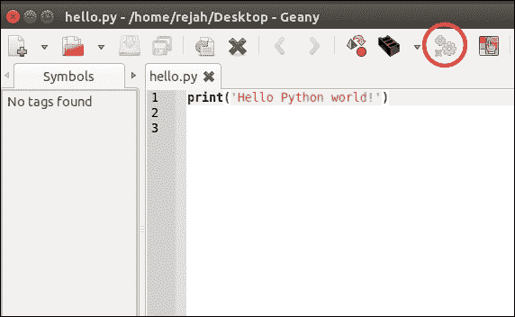

# 第一章。Python 脚本基础知识

Python 仍然是渗透测试（pentesting）和信息安全领域中的主导语言。基于 Python 的工具包括各种工具（用于输入大量随机数据以查找错误和安全漏洞）、代理和甚至利用框架。如果您对渗透测试任务感兴趣，Python 是最好的学习语言，因为它拥有大量的逆向工程和利用库。

多年来，Python 已经接受了许多更新和升级。例如，Python 2 于 2000 年发布，Python 3 于 2008 年发布。不幸的是，Python 3 不向后兼容，因此大部分用 Python 2 编写的程序在 Python 3 中将无法运行。尽管 Python 3 于 2008 年发布，但大多数库和程序仍在使用 Python 2。为了更好地进行渗透测试，测试人员应该能够阅读、编写和重写 Python 脚本。

作为一种脚本语言，安全专家更倾向于使用 Python 作为开发安全工具包的语言。其易读的代码、模块化设计和大量的库为安全专家和研究人员提供了一个起点，可以用它来创建复杂的工具。Python 带有一个庞大的库（标准库），几乎包含了从简单的 I/O 到特定于平台的 API 调用的所有内容。许多默认和用户贡献的库和模块可以帮助我们在渗透测试中构建工具来完成有趣的任务。

在本章中，我们将涵盖以下内容：

+   在不同操作系统中设置脚本环境

+   安装第三方 Python 库

+   使用虚拟环境

+   Python 语言基础知识

# 设置脚本环境

您的**脚本环境**基本上是您日常工作中使用的计算机，以及您用来编写和运行 Python 程序的所有工具。最好的学习系统就是您现在正在使用的系统。本节将帮助您在计算机上配置 Python 脚本环境，以便您可以创建和运行自己的程序。

如果您在计算机上使用的是 Mac OS X 或 Linux 安装，可能已经预先安装了 Python 解释器。要查看是否已安装，请打开终端并输入`python`。您可能会看到类似以下内容：

```py
$ python
Python 2.7.6 (default, Mar 22 2014, 22:59:56) 
[GCC 4.8.2] on linux2
Type "help", "copyright", "credits" or "license" for more
information.
>>> 

```

从前面的输出中，我们可以看到在这个系统中安装了`Python 2.7.6`。通过在终端中输入`python`，您启动了交互模式下的 Python 解释器。在这里，您可以尝试使用 Python 命令，您输入的内容将立即运行并显示输出。

您可以使用您喜欢的文本编辑器来编写 Python 程序。如果没有的话，可以尝试安装 Geany 或 Sublime Text，它们非常适合您。这些都是简单的编辑器，提供了编写和运行 Python 程序的简单方式。在 Geany 中，输出显示在单独的终端窗口中，而 Sublime Text 使用嵌入式终端窗口。Sublime Text 是收费的，但它有灵活的试用政策，允许您在没有任何限制的情况下使用编辑器。它是为初学者设计的少数跨平台文本编辑器之一，具有针对专业人士的全套功能。

## 在 Linux 中设置

Linux 系统的构建方式使用户可以轻松开始 Python 编程。大多数 Linux 发行版已经预装了 Python。例如，最新版本的 Ubuntu 和 Fedora 都预装了 Python 2.7。此外，最新版本的 Redhat Enterprise（RHEL）和 CentOS 都预装了 Python 2.6。不过，您可能还是想要检查一下。

如果未安装 Python，安装 Python 的最简单方法是使用发行版的默认包管理器，如`apt-get`，`yum`等。通过在终端中输入以下命令来安装 Python：

+   对于 Debian / Ubuntu Linux / Kali Linux 用户，请使用以下命令：

```py
 $ sudo apt-get install python2

```

+   对于 Red Hat / RHEL / CentOS Linux 用户，请使用以下命令：

```py
 $sudo yum install python

```

要安装 Geany，请利用您的发行版软件包管理器：

+   对于 Debian / Ubuntu Linux / Kali Linux 用户，请使用以下命令：

```py
 $sudo apt-get install geany geany-common

```

+   对于 Red Hat / RHEL / CentOS Linux 用户，请使用以下命令：

```py
 $ sudo yum install geany

```

## 在 Mac 中设置

尽管 Macintosh 是学习 Python 的好平台，但实际上使用 Mac 的许多人在计算机上运行某些 Linux 发行版，或者在虚拟 Linux 机器中运行 Python。最新版本的 Mac OS X，Yosemite，预装了 Python 2.7。验证它是否正常工作后，安装 Sublime Text。

要在 Mac 上运行 Python，您必须安装 GCC，可以通过下载 XCode，较小的命令行工具来获得。此外，我们需要安装 Homebrew，一个软件包管理器。

要安装 Homebrew，请打开终端并运行以下命令：

```py
$ ruby -e "$(curl -fsSL https://raw.githubusercontent.com/Homebrew/install/master/install)"

```

安装 Homebrew 后，您必须将 Homebrew 目录插入到您的`PATH`环境变量中。您可以通过在您的`~/.profile`文件中包含以下行来实现：

```py
export PATH=/usr/local/bin:/usr/local/sbin:$PATH

```

现在我们准备安装 Python 2.7。在终端中运行以下命令，其余的将由命令完成：

```py
$ brew install python

```

要安装 Sublime Text，请转到 Sublime Text 的下载页面[`www.sublimetext.com/3`](http://www.sublimetext.com/3)，然后单击**OS X**链接。这将为您的 Mac 获取 Sublime Text 安装程序。

## 在 Windows 中设置

Windows 上没有预先安装 Python。要检查是否已安装，请打开命令提示符，输入单词`python`，然后按*Enter*。在大多数情况下，您将收到一条消息，指出 Windows 不认识`python`作为命令。

我们必须下载一个安装程序，将 Python 设置为 Windows。然后我们必须安装和配置 Geany 以运行 Python 程序。

转到 Python 的下载页面[`www.python.org/downloads/windows/`](https://www.python.org/downloads/windows/)，并下载与您的系统兼容的 Python 2.7 安装程序。如果您不知道您的操作系统架构，请下载 32 位安装程序，它将适用于两种架构，但 64 位只适用于 64 位系统。

要安装 Geany，请转到 Geany 的下载页面[`www.geany.org/Download/Releases`](http://www.geany.org/Download/Releases)，并下载包含描述**Full Installer including GTK 2.16**的完整安装程序变体。默认情况下，Geany 不知道 Python 在系统中的位置。因此，我们需要手动配置它。

为此，在 Geany 中编写一个`Hello world`程序，并将其另存为`hello.py`，然后运行它。

您可以使用三种方法在 Geany 中运行 Python 程序：

+   选择**构建** | **执行**

+   按下**F5**

+   点击带有三个齿轮图标的图标



在 Geany 中运行`hello.py`程序时，请执行以下步骤：

1.  转到**构建** | **设置构建命令**。

1.  然后使用`C:\Python27\python -m py_compile "%f"`输入 python 命令选项。

1.  使用`C:\Python27\python "%f"`执行命令。

1.  现在您可以在 Geany 中编写代码时运行 Python 程序。

建议将 Kali Linux 发行版作为虚拟机运行，并将其用作脚本编写环境。Kali Linux 预装了许多工具，基于 Debian Linux，因此您还可以安装各种其他工具和库。此外，一些库在 Windows 系统上可能无法正常工作。

# 安装第三方库

在本书中，我们将使用许多 Python 库，本节将帮助您安装和使用第三方库。

## Setuptools 和 pip

最有用的第三方 Python 软件之一是**Setuptools**。使用 Setuptools，您可以使用单个命令下载和安装任何符合条件的 Python 库。

在任何系统上安装 Setuptools 的最佳方法是从[`bootstrap.pypa.io/ez_setup.py`](https://bootstrap.pypa.io/ez_setup.py)下载`ez_setup.py`文件，并使用您的 Python 安装运行此文件。

在 Linux 中，在终端中运行以下命令，正确路径指向`ez_setup.py`脚本：

```py
$ sudo python path/to/ez_setup.py

```

对于安装了 PowerShell 3 的 Windows 8 或旧版本的 Windows，以管理员权限启动 PowerShell，并在其中运行以下命令：

```py
> (Invoke-WebRequest https://bootstrap.pypa.io/ez_setup.py).Content | python -

```

对于未安装 PowerShell 3 的 Windows 系统，请使用 Web 浏览器从上述链接下载`ez_setup.py`文件，并使用您的 Python 安装运行该文件。

Pip 是一个包管理系统，用于安装和管理用 Python 编写的软件包。成功安装 Setuptools 后，您可以通过简单地打开命令提示符并运行以下命令来安装`pip`：

```py
$ easy_install pip

```

或者，您还可以使用默认的发行版包管理器安装`pip`：

+   在 Debian、Ubuntu 和 Kali Linux 上：

```py
 $ sudo apt-get install python-pip

```

+   在 Fedora 上：

```py
 $ sudo yum install python-pip

```

现在您可以从命令行运行`pip`。尝试使用`pip`安装一个软件包：

```py
$ pip install packagename

```

## 使用虚拟环境

虚拟环境有助于分离不同项目所需的依赖项，通过在虚拟环境中工作，还有助于保持全局 site-packages 目录的清洁。

### 使用 virtualenv 和 virtualwrapper

**Virtualenv**是一个 Python 模块，用于为我们的脚本实验创建隔离的 Python 环境，它会创建一个包含所有必要可执行文件和模块的文件夹，用于基本的 Python 项目。

您可以使用以下命令安装`virtualenv`：

```py
 $ sudo pip install virtualenv

```

要创建一个新的虚拟环境，请创建一个文件夹，并从命令行进入该文件夹：

```py
$ cd your_new_folder 
$ virtualenv name-of-virtual-environment 

```

这将在当前工作目录中使用提供的名称初始化一个文件夹，其中包含所有 Python 可执行文件和`pip`库，然后将帮助在您的虚拟环境中安装其他软件包。

您可以通过提供更多参数来选择您选择的 Python 解释器，例如以下命令：

```py
$ virtualenv -p /usr/bin/python2.7 name-of-virtual-environment 

```

这将创建一个使用 Python 2.7 的虚拟环境。在开始使用此虚拟环境之前，我们必须激活它：

```py
$ source name-of-virtual-environment/bin/activate

```


现在，在命令提示符的左侧，将显示活动虚拟环境的名称。在此提示符中使用`pip`安装的任何软件包都将属于活动虚拟环境，该环境将与所有其他虚拟环境和全局安装隔离开来。

您可以使用以下命令退出当前虚拟环境：

```py
$ deactivate

```

**Virtualenvwrapper**提供了一种更好的使用`virtualenv`的方法。它还将所有虚拟环境组织在一个地方。

要安装，我们可以使用`pip`，但在安装`virtualwrapper`之前，让我们确保已安装了`virtualenv`。

Linux 和 OS X 用户可以使用以下方法安装它：

```py
$ pip install virtualenvwrapper

```

还要将以下三行添加到您的 shell 启动文件，例如`.bashrc`或`.profile`：

```py
export WORKON_HOME=$HOME/.virtualenvs 
export PROJECT_HOME=$HOME/Devel 
source /usr/local/bin/virtualenvwrapper.sh 

```

这将把您的主目录中的`Devel`文件夹设置为您的虚拟环境项目的位置。

对于 Windows 用户，我们可以使用另一个软件包：`virtualenvwrapper-win`。这也可以使用`pip`安装：

```py
$ pip install virtualenvwrapper-win

```

使用`virtualwrapper`创建一个虚拟环境：

```py
$ mkvirtualenv your-project-name

```

这将在`~/Envs`中创建一个以提供的名称命名的文件夹。

要激活此环境，我们可以使用`workon`命令：

```py
$ workon your-project-name

```

这两个命令可以组合成一个单一的命令，如下所示：

```py
$ mkproject your-project-name

```

我们可以使用`virtualenv`中的相同 deactivate 命令来停用虚拟环境。要删除虚拟环境，可以使用以下命令：

```py
$ rmvirtualenv your-project-name

```

# Python 语言基础知识

在本节中，我们将介绍变量、字符串、数据类型、网络和异常处理的概念。对于有经验的程序员，本节将是对您已经了解的 Python 知识的总结。

## 变量和类型

Python 在变量方面非常出色。变量指向存储在内存位置中的数据。这个内存位置可能包含不同的值，比如整数、实数、布尔值、字符串、列表和字典。

当您给变量设置某个值时，Python 会解释并声明变量。例如，如果我们设置*a = 1*和*b = 2*。

然后我们用以下代码打印这两个变量的和：

```py
print (a+b) 

```

结果将是`3`，因为 Python 会判断*a*和*b*都是数字。

然而，如果我们赋值*a = "1"* 和 *b = "2"*。那么输出将是`12`，因为*a*和*b*都将被视为字符串。在这里，我们不需要在使用变量之前声明变量或其类型，因为每个变量都是一个对象。`type()`方法可用于获取变量类型。

## 字符串

与其他任何编程语言一样，字符串是 Python 中的重要内容之一。它们是不可变的。因此，一旦定义，它们就无法更改。有许多 Python 方法可以修改字符串。它们不会对原始字符串进行任何操作，而是创建一个副本并在修改后返回。字符串可以用单引号、双引号或在多行的情况下，我们可以使用三引号语法进行分隔。我们可以使用`\`字符来转义字符串中的额外引号。

常用的字符串方法如下：

+   `string.count('x')`: 这将返回字符串中`'x'`的出现次数

+   `string.find('x')`: 这将返回字符串中字符`'x'`的位置

+   `string.lower()`: 这将把字符串转换为小写

+   `string.upper()`: 这将把字符串转换为大写

+   `string.replace('a', 'b')`: 这将用`b`替换字符串中的所有`a`

此外，我们可以使用`len()`方法获取字符串中字符的数量，包括空格：

```py
#!/usr/bin/python 
a = "Python" 
b = "Python\n" 
c = "Python  " 

print len(a) 
print len(b) 
print len(c) 

```

您可以在这里阅读更多关于字符串函数的内容：[`docs.python.org/2/library/string.html`](https://docs.python.org/2/library/string.html)。

## 列表

列表允许我们在其中存储多个*变量*，并提供了一种更好的方法来对 Python 中的对象数组进行排序。它们还有一些方法可以帮助我们操作其中的值：

```py
list = [1,2,3,4,5,6,7,8] 
print (list[1])  

```

这将打印`2`，因为 Python 索引从 0 开始。要打印整个列表，请使用以下代码：

```py
list = [1,2,3,4,5,6,7,8]
for x in list:
 print (x)

```

这将循环遍历所有元素并将它们打印出来。

有用的列表方法如下：

+   `.append(value)`: 这将在列表末尾添加一个元素

+   `.count('x')`: 这将获取列表中`'x'`的数量

+   `.index('x')`: 这将返回列表中`'x'`的索引

+   `.insert('y','x')`: 这将在位置`'y'`插入`'x'`

+   `.pop()`: 这将返回最后一个元素并将其从列表中删除

+   `.remove('x')`: 这将从列表中删除第一个`'x'`

+   `.reverse()`: 这将颠倒列表中的元素

+   `.sort()`: 这将按字母顺序或数字顺序对列表进行排序

## 字典

Python 字典是一种存储键值对的方法。Python 字典用大括号`{}`括起来。例如：

```py
dictionary = {'item1': 10, 'item2': 20} 
print(dictionary['item2']) 

```

这将输出`20`。我们不能使用相同的键创建多个值。这将覆盖重复键的先前值。字典上的操作是唯一的。字典不支持切片。

我们可以使用 update 方法将两个不同的字典合并为一个。此外，如果存在冲突，update 方法将合并现有元素：

```py
a = {'apples': 1, 'mango': 2, 'orange': 3} 
b = {'orange': 4, 'lemons': 2, 'grapes ': 4} 
a.update(b) 

Print a 

```

这将返回以下内容：

```py
{'mango': 2, 'apples': 1, 'lemons': 2, 'grapes ': 4, 'orange': 4} 

```

要从字典中删除元素，我们可以使用`del`方法：

```py
del a['mango'] 
print a 

```

这将返回以下内容：

```py
{'apples': 1, 'lemons': 2, 'grapes ': 4, 'orange': 4}
```

## 网络

套接字是计算机网络通信的基本组成部分。所有网络通信都通过套接字进行。因此，套接字是任何通信渠道的虚拟端点，这些通信渠道发生在两个应用程序之间，这两个应用程序可能位于同一台计算机上，也可能位于不同的计算机上。

Python 中的 socket 模块为我们提供了一种更好的方式来创建 Python 网络连接。因此，要使用这个模块，我们必须在脚本中导入它：

```py
import socket 
socket.setdefaulttimeout(3) 
newSocket = socket.socket() 
newSocket.connect(("localhost",22)) 
response = newSocket.recv(1024) 
print response 

```

此脚本将从服务器获取响应标头。我们将在后面的章节中更多地讨论网络。

## 处理异常

尽管我们编写了语法正确的脚本，但在执行它们时可能会出现一些错误。因此，我们必须正确处理这些错误。在 Python 中处理异常的最简单方法是使用`try-except`：

尝试在 Python 解释器中将一个数字除以零：

```py
>>> 10/0
Traceback (most recent call last):
 File "<stdin>", line 1, in <module>
ZeroDivisionError: integer division or modulo by zero

```

因此，我们可以使用`try-except`块重写这个脚本：

```py
try: 
   answer = 10/0 
except ZeroDivisionError, e: 
   answer = e 
print answer 

```

这将返回错误`整数除法或取模为零`。

### 提示

**下载示例代码**

您可以从[`www.packtpub.com`](http://www.packtpub.com)的帐户中下载本书的示例代码文件。如果您在其他地方购买了这本书，可以访问[`www.packtpub.com/support`](http://www.packtpub.com/support)并注册，文件将直接通过电子邮件发送给您。

您可以按照以下步骤下载代码文件：

1.  使用您的电子邮件地址和密码登录或注册到我们的网站。

1.  将鼠标指针悬停在顶部的**支持**选项卡上。

1.  单击**代码下载和勘误**。

1.  在**搜索**框中输入书名。

1.  选择您要下载代码文件的书籍。

1.  从下拉菜单中选择您购买此书的地点。

1.  单击**代码下载**。

您还可以通过单击书的网页上的`代码文件`按钮来下载代码文件，该网页位于 Packt Publishing 网站上。可以通过在**搜索**框中输入书名来访问此页面。请注意，您需要登录到您的 Packt 帐户。

下载文件后，请确保使用以下最新版本的软件解压或提取文件夹：

+   WinRAR / 7-Zip for Windows

+   Zipeg / iZip / UnRarX for Mac

+   7-Zip / PeaZip for Linux

该书的代码包也托管在 GitHub 上，网址为[`github.com/PacktPublishing/Effective-Python-Penetration-Testing`](https://github.com/PacktPublishing/Effective-Python-Penetration-Testing)。我们还有其他丰富的图书和视频代码包可供下载，网址为[`github.com/PacktPublishing/`](https://github.com/PacktPublishing/)。快去看看吧！

# 摘要

现在我们已经了解了编码前必须进行的基本安装和配置。此外，我们已经学习了 Python 语言的基础知识，这可能有助于我们在后面的章节中加快脚本编写的速度。在下一章中，我们将讨论使用 Scapy 进行更多的网络流量调查、数据包嗅探和数据包注入。
