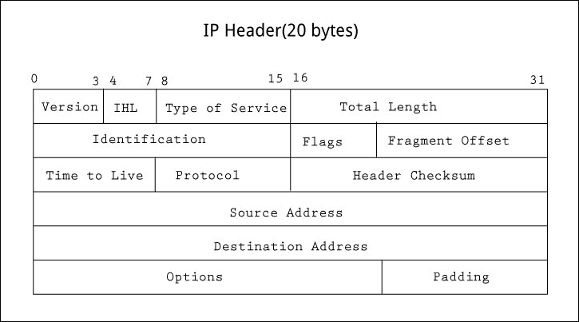
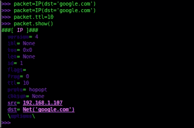
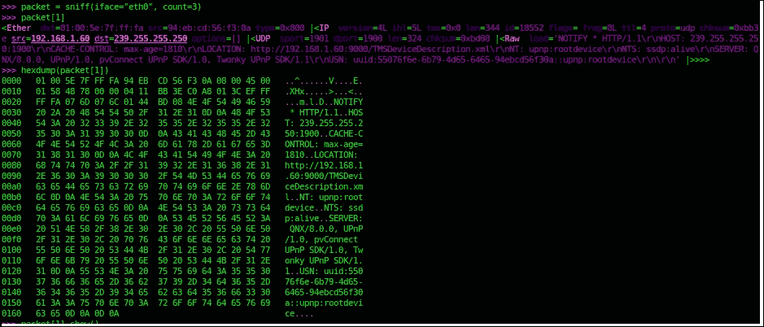
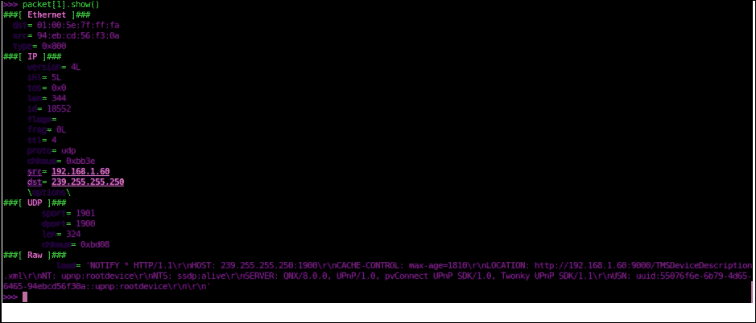

# 第二章。使用 Scapy 分析网络流量

流量分析是拦截和分析网络流量以推断通信信息的过程。两个主机之间交换的数据包大小，通信系统的详细信息，通信的时间和持续时间是攻击者的一些有价值的信息。在本章中，我们将学习如何使用 Python 脚本分析网络流量：

+   网络基础知识

+   原始套接字编程

+   使用 Scapy 进行数据包嗅探

+   使用 Scapy 进行数据包注入

+   使用 Scapy 解析 DNS 流量

+   使用 Scapy 进行操作系统指纹识别

# 套接字模块

网络套接字是一种使用标准 Unix 文件描述符与其他计算机通信的方式，它允许在同一台或不同机器上的两个不同进程之间进行通信。套接字几乎类似于低级文件描述符，因为诸如`read()`和`write()`之类的命令也可以与套接字一样与文件一起使用。

Python 有两个基本的套接字模块：

+   **套接字**：标准的 BSD 套接字 API。

+   **SocketServer**：一个以服务器为中心的模块，定义了处理同步网络请求的类，简化了网络服务器的开发。

## 套接字

`socket`模块几乎包含了构建套接字服务器或客户端所需的一切。在 Python 的情况下，`socket`返回一个对象，可以对其应用套接字方法。

### 套接字模块中的方法

套接字模块具有以下类方法：

+   `socket.socket(family, type)`：创建并返回一个新的套接字对象

+   `socket.getfqdn(name)`: 将字符串 IP 地址转换为完全合格的域名

+   `socket.gethostbyname(hostname)`：将主机名解析为 IP 地址

**实例方法**需要从`socket`返回的套接字实例。`socket`模块具有以下实例方法：

+   `sock.bind( (address, port) )`：将套接字绑定到地址和端口

+   `sock.accept()`: 返回带有对等地址信息的客户端套接字

+   `sock.listen(backlog)`: 将套接字置于监听状态

+   `sock.connect( (address, port) )`：将套接字连接到定义的主机和端口

+   `sock.recv( bufferLength[, flags] )`：从套接字接收数据，最多`buflen`（要接收的最大字节数）字节

+   `sock.recvfrom( bufferLength[, flags] )`：从套接字接收数据，最多`buflen`字节，并返回数据来自的远程主机和端口

+   `sock.send( data[, flags] )`：通过套接字发送数据

+   `sock.sendall( data[, flags] )`：通过套接字发送数据，并继续发送数据，直到所有数据都已发送或发生错误

+   `sock.close()`: 关闭套接字

+   `sock.getsockopt( lvl, optname )`：获取指定套接字选项的值

+   `sock.setsockopt( lvl, optname, val )`：设置指定套接字选项的值

### 创建套接字

可以通过在`socket`模块中调用类方法`socket()`来创建套接字。这将返回指定域中的套接字。该方法的参数如下：

+   **地址族**：Python 支持三种地址族。

+   **AF_INET**：用于 IP 版本 4 或 IPv4 互联网寻址。

+   **AF_INET6**：用于 IPv6 互联网寻址。

+   **AF_UNIX**：用于**UNIX 域套接字**（**UDS**）。

+   **套接字类型**：通常，套接字类型可以是`SOCK_DGRAM`用于**用户数据报协议**（**UDP**）或`SOCK_STREAM`用于**传输控制协议**（**TCP**）。`SOCK_RAW`用于创建原始套接字。

+   **协议**：通常保持默认值。默认值为 0。

以下是创建套接字的示例：

```py
import socket #Imported sockets module 
import sys 
try: 
   #Create an AF_INET (IPv4), STREAM socket (TCP) 
   tcp_socket = socket.socket(socket.AF_INET, socket.SOCK_STREAM) 
except socket.error, e: 
   print 'Error occurred while creating socket. Error code: ' + str(e[0]) + ' , Error message : ' + e[1] 
   sys.exit(); 
print 'Success!' 

```

### 连接到服务器并发送数据

创建的套接字可以在服务器端或客户端端使用。

套接字对象的`connect()`方法用于将客户端连接到主机。这个*实例方法*接受主机名或一个包含主机名/地址和端口号的元组作为参数。

我们可以重写前面的代码，向服务器发送消息如下：

```py
import socket #Imported sockets module  
import sys  

TCP_IP = '127.0.0.1'  
TCP_PORT = 8090 #Reserve a port  
BUFFER_SIZE = 1024  
MESSAGE_TO_SERVER = "Hello, World!"  

try:  
    #Create an AF_INET (IPv4), STREAM socket (TCP)  
    tcp_socket = socket.socket(socket.AF_INET, socket.SOCK_STREAM)  
except socket.error, e:  
    print 'Error occurred while creating socket. Error code: ' + str(e[0]) + ' , Error message : ' + e[1] 
    sys.exit();  

tcp_socket.connect((TCP_IP, TCP_PORT))  

try :  
    #Sending message  
    tcp_socket.send(MESSAGE_TO_SERVER)  
except socket.error, e: 
    print 'Error occurred while sending data to server. Error code: ' + str(e[0]) + ' , Error message : ' + e[1] 
    sys.exit()  

print 'Message to the server send successfully' 

```

### 接收数据

我们需要一个服务器来接收数据。要在服务器端使用套接字，`socket`对象的`bind()`方法将套接字绑定到地址。它以元组作为输入参数，其中包含套接字的地址和用于接收传入请求的端口。`listen()`方法将套接字放入监听模式，`accept()`方法等待传入连接。`listen()`方法接受一个表示最大排队连接数的参数。因此，通过将此参数指定为`3`，这意味着如果有三个连接正在等待处理，那么第四个连接将被拒绝：

```py
import socket #Imported sockets module 

TCP_IP = '127.0.0.1' 
TCP_PORT = 8090 
BUFFER_SIZE = 1024 #Normally use 1024, to get fast response from the server use small size 

try: 
   #Create an AF_INET (IPv4), STREAM socket (TCP) 
   tcp_socket = socket.socket(socket.AF_INET, socket.SOCK_STREAM) 
except socket.error, e: 
   print 'Error occurred while creating socket. Error code: ' + str(e[0]) + ' , Error message : ' + e[1] 
   sys.exit(); 

tcp_socket.bind((TCP_IP, TCP_PORT)) 
# Listen for incoming connections  (max queued connections: 2) 
tcp_socket.listen(2) 
print 'Listening..' 

#Waits for incoming connection (blocking call) 
connection, address = tcp_socket.accept() 
print 'Connected with:', address 

```

方法`accept()`将返回服务器和客户端之间的活动连接。可以使用`recv()`方法从连接中读取数据，并使用`sendall()`进行传输：

```py
data = connection.recv(BUFFER_SIZE) 
print "Message from client:", data 

connection.sendall("Thanks for connecting")  # response for the message from client 
connection.close() 

```

最好通过将`socket_accept`放在循环中来保持服务器处于活动状态，如下所示：

```py
#keep server alive  
while True:  
   connection, address = tcp_socket.accept()  
   print 'Client connected:', address  

   data = connection.recv(BUFFER_SIZE)  
   print "Message from client:", data  

   connection.sendall("Thanks for connecting")  #Echo the message from client  

```

将此保存到`server.py`并在终端中启动服务器如下：

```py
 $ python  server.py

```

然后服务器终端可能如下所示：


现在我们可以修改客户端脚本以从服务器接收响应：

```py
import socket #Imported sockets module  
import sys  

TCP_IP = '127.0.0.1'  
TCP_PORT = 8090 # Reserve a port  
BUFFER_SIZE = 1024  
MESSAGE_TO_SERVER = "Hello, World!"  

try:  
    #Create an AF_INET (IPv4), STREAM socket (TCP)  
    tcp_socket = socket.socket(socket.AF_INET, socket.SOCK_STREAM)  
except socket.error,  e:  
    print 'Error occured while creating socket. Error code: ' + str(e[0]) + ' , Error message : ' + e[1] 
    sys.exit();  

tcp_socket.connect((TCP_IP, TCP_PORT))  

try :  
    #Sending message  
    tcp_socket.send(MESSAGE_TO_SERVER)  
except socket.error, e: 
    print 'Error occurred while sending data to server. Error code: ' + str(e[0]) + ' , Error message : ' + e[1] 
    sys.exit() 

print 'Message to the server send successfully'  
data = tcp_socket.recv(BUFFER_SIZE)  
tcp_socket.close() #Close the socket when done  
print "Response from server:", data 

```

将此保存到`client.py`并运行。请确保服务器脚本正在运行。客户端终端可能如下所示：


### 处理多个连接

在上一个示例中，我们使用 while 循环来处理不同的客户端；这只能一次与一个客户端交互。为了使服务器与多个客户端交互，我们必须使用多线程。当`main`程序接受连接时，它会创建一个新线程来处理此连接的通信，然后返回以接受更多连接。

我们可以使用线程模块为服务器接受的每个连接创建线程处理程序。

`start_new_thread()`接受两个参数：

+   要运行的函数名称

+   传递给该函数的参数元组

让我们看看如何使用线程重写前面的示例：

```py
import socket #Imported sockets module  
import sys  
from thread import *  

TCP_IP = '127.0.0.1'  
TCP_PORT = 8090 # Reserve a port  

try:  
    #create an AF_INET (IPv4), STREAM socket (TCP)  
    tcp_socket = socket.socket(socket.AF_INET, socket.SOCK_STREAM)  
except socket.error, e:  
    print 'Error occured while creating socket. Error code: ' + str(e[0]) + ' , Error message : ' + e[1] 
    sys.exit();  

#Bind socket to host and port  
tcp_socket.bind((TCP_IP, TCP_PORT))  
tcp_socket.listen(10)  
print 'Listening..'  

#Function for handling connections. Used to create threads  
def ClientConnectionHandler(connection):  
    BUFFER_SIZE = 1024  
    #Sending message to client  
    connection.send('Welcome to the server')  

    #infinite loop to keep the thread alive.  
    while True:  
        #Receiving data from client  
        data = connection.recv(BUFFER_SIZE)  
        reply = 'Data received:' + data  
        if not data:  
            break  
        connection.sendall(reply)  

    #Exiting loop  
    connection.close()  

#keep server alive always (infinite loop)  
while True:  
    connection, address = tcp_socket.accept()  
    print 'Client connected:', address  
    start_new_thread(ClientConnectionHandler ,(connection,))  

tcp_socket.close() 

```

### 提示

有关套接字模块的更多详细信息，请访问[`docs.python.org/2.7/library/socket.html`](https://docs.python.org/2.7/library/socket.html)。

## SocketServer

`SocketServer`是一个有趣的模块，它是用于创建网络服务器的框架。它具有预定义的类，用于使用 TCP、UDP、UNIX 流和 UNIX 数据报处理同步请求。我们还可以使用混合类创建每种类型服务器的分叉和线程版本。在许多情况下，您可以简单地使用现有的服务器类。`SocketServer`模块中定义的五种不同的服务器类如下：

+   `BaseServer`: 定义 API，不直接使用

+   `TCPServer`: 使用 TCP/IP 套接字

+   `UDPServer`: 使用数据报套接字

+   `UnixStreamServer`: Unix 域流套接字

+   `UnixDatagramServer`: Unix 域数据报套接字

要使用此模块构建服务器，我们必须传递要监听的地址（由地址和端口号组成的元组）和一个请求处理程序类。请求处理程序将接收传入的请求并决定采取什么行动。这个类必须有一个方法，覆盖以下任何一个`RequestHandler`方法；大多数情况下，我们可以简单地覆盖`handle()`方法。对于每个请求，都会创建此类的新实例：

+   `setup()`: 在`handle()`方法之前调用以准备请求处理程序的请求

+   `handle()`: 解析传入的请求，处理数据并响应请求

+   `finish()`: 在`handle()`方法之后调用以清理`setup()`期间创建的任何内容

### 使用 SocketServer 模块的简单服务器

以下脚本显示了如何使用`SocketServer`创建一个简单的回显服务器：

```py
import SocketServer #Imported SocketServer module  

#The RequestHandler class for our server.  
class TCPRequestHandler( SocketServer.StreamRequestHandler ):  
  def handle( self ):  
   self.data = self.request.recv(1024).strip()  
   print "{} wrote:".format(self.client_address[0])  
   print self.data  
   #Sending the same data  
   self.request.sendall(self.data)  

#Create the server, binding to localhost on port 8090  
server = SocketServer.TCPServer( ("", 8090), TCPRequestHandler ) 
#Activate the server; this will keep running untile we interrupt 
server.serve_forever() 

```

脚本的第一行导入了`SocketServer`模块：

```py
import SocketServer 

```

然后我们创建了一个请求处理程序，该处理程序继承了`SocketServer.StreamRequestHandler`类，并覆盖了`handle()`方法来处理服务器的请求。`handle()`方法接收数据，打印它，然后向客户端发送相同的数据：

```py
class TCPRequestHandler( SocketServer.StreamRequestHandler ):  
  def handle( self ):  
   self.data = self.request.recv(1024).strip()  
   print "{} wrote:".format(self.client_address[0])  
   print self.data  
   # sending the same data  
   self.request.sendall(self.data) 

```

对于服务器的每个请求，都会实例化这个请求处理程序类。这个服务器是使用`SocketServer.TCPServer`类创建的，我们提供服务器将绑定到的地址和请求处理程序类。它将返回一个`TCPServer`对象。最后，我们调用`serve_forever()`方法来启动服务器并处理请求，直到我们发送一个显式的`shutdown()`请求（键盘中断）：

```py
tcp_server = SocketServer.TCPServer( ("", 8090), TCPRequestHandler )  
tcp_server.serve_forever() 

```

### 提示

有关 Socket 模块的更多详细信息，请访问[`xahlee.info/python_doc_2.7.6/library/socketserver.html`](http://xahlee.info/python_doc_2.7.6/library/socketserver.html)。

# 原始套接字编程

我们在互联网上发送和接收的所有内容都涉及数据包；我们接收的每个网页和电子邮件都作为一系列数据包发送，我们发送的每个内容都作为一系列数据包离开。数据以一定大小的字节分成数据包。每个数据包携带用于识别其目的地、源和互联网使用的协议的其他细节以及我们数据的一部分的信息。网络数据包分为三部分：

+   **标头**：这包含了数据包携带的指令

+   **有效载荷**：这是数据包的数据

+   **尾部**：这是尾部，通知接收设备数据包的结束

像 TCP/IP 这样的协议的标头由内核或操作系统堆栈提供，但我们可以使用原始套接字为该协议提供自定义标头。原始套接字在 Linux 的本机套接字 API 中得到支持，但在 Windows 中不支持。尽管原始套接字在应用程序中很少使用，但在网络安全应用程序中广泛使用。

所有数据包都以相同的格式结构化，包括 IP 标头和可变长度的数据字段。首先是以太网标头，固定大小为 14 个字节，然后是 IP 标头（如果是 IP 数据包），或者 TCP 标头（如果是 TCP 数据包），根据以太网标头的最后两个字节指定的以太网类型：


在以太网标头中，前六个字节是目标主机，接着是六个字节的源主机。最后两个字节是以太网类型：


IP 标头长 20 个字节；前 12 个字节包括版本、**IHL**、**总长度**、**标志**等，接下来的四个字节表示源地址。最后四个字节是目标地址：



### 提示

有关 IP 数据包结构的更多详细信息，请访问[`www.freesoft.org/CIE/Course/Section3/7.htm`](http://www.freesoft.org/CIE/Course/Section3/7.htm)。

## 创建原始套接字

要使用 Python 创建原始套接字，应用程序必须在系统上具有根权限。以下示例创建了一个`IPPROTO_RAW`套接字，这是一个原始 IP 数据包：

```py
import socket #Imported sockets module  

try: 
  #create an INET, raw socket  
  raw_socket = socket.socket(socket.AF_INET, socket.SOCK_RAW, socket.IPPROTO_RAW)  
except socket.error as e:  
  print 'Error occurred while creating socket. Error code: ' + str(e[0]) + ' , Error message : ' + e[1] 
  sys.exit() 

```

创建`raw`套接字后，我们必须构造要发送的数据包。这些数据包类似于 C 语言中的结构，而在 Python 中不可用，因此我们必须使用 Python 的`struct`模块来按照先前指定的结构打包和解包数据包。

## 基本原始套接字嗅探器

最基本的`raw`套接字嗅探器如下：

```py
import socket #Imported sockets module  

try:  
  #create an raw socket  
  raw_socket = socket.socket(socket.PF_PACKET, socket.SOCK_RAW, socket.htons(0x0800))  
except socket.error, e:  
  print 'Error occurred while creating socket. Error code: ' + str(e[0]) + ' , Error message : ' + e[1] 
  sys.exit();  

while True:  
  packet = raw_socket.recvfrom(2048)  
  print packet 

```

像往常一样，在第一行导入了 socket 模块。稍后我们使用以下代码创建了一个套接字：

```py
raw_socket = socket.socket(socket.PF_PACKET, socket.SOCK_RAW, socket.htons(0x0800))
```

第一个参数表示数据包接口是`PF_PACKET（Linux 特定，我们必须在 Windows 上使用 AF_INET）`，第二个参数指定它是原始套接字。第三个参数指示我们感兴趣的协议。值`0x0800`指定我们对 IP 协议感兴趣。之后，我们调用`recvfrom`方法以无限循环接收数据包：

```py
while True:  
  packet = raw_socket.recvfrom(2048)  
  print packet 

```

现在我们可以解析`packet`，因为前 14 个字节是以太网头部，其中前 6 个字节是目标主机，接下来的 6 个字节是源主机。让我们重写无限循环并添加代码来解析以太网头部的目标主机和源主机。首先我们可以按如下方式去掉以太网头部：

```py
ethernet_header = packet[0][0:14] 

```

然后我们可以使用`struct`解析和解包头部，如下所示：

```py
eth_header = struct.unpack("!6s6s2s", ethernet_header) 

```

这将返回一个包含三个十六进制值的元组。我们可以使用`binascii`模块中的`hexlify`将其转换为十六进制值：

```py
print "destination:" + binascii.hexlify(eth_header[0]) + " Source:" + binascii.hexlify(eth_header[1]) +  " Type:" + binascii.hexlify(eth_header[2] 

```

同样，我们可以获取 IP 头部，即数据包中的接下来 20 个字节。前 12 个字节包括版本、IHL、长度、标志等，我们对此不感兴趣，但接下来的 8 个字节是源 IP 地址和目标 IP 地址，如下所示：

```py
ip_header = packet[0][14:34] 
ip_hdr = struct.unpack("!12s4s4s", ip_header) 
print "Source IP:" + socket.inet_ntoa(ip_hdr[1]) + " Destination IP:" + socket.inet_ntoa(ip_hdr[2])) 

```

最终脚本如下：

```py
import socket #Imported sockets module  
import struct  
import binascii  

try:  
  #Create an raw socket  
  raw_socket = socket.socket(socket.PF_PACKET, socket.SOCK_RAW, socket.htons(0x0800))  
except socket.error, e:  
  print 'Error occurred while creating socket. Error code: ' + str(e[0]) + ' , Error message : ' + e[1] 
  sys.exit();  

while True:  
  packet = raw_socket.recvfrom(2048)  
  ethernet_header = packet[0][0:14]  
  eth_header = struct.unpack("!6s6s2s", ethernet_header)  
  print "destination:" + binascii.hexlify(eth_header[0]) + " Source:" + binascii.hexlify(eth_header[1]) +  " Type:" + binascii.hexlify(eth_header[2])  
  ip_header = packet[0][14:34]  
  ip_hdr = struct.unpack("!12s4s4s", ip_header)  
  print "Source IP:" + socket.inet_ntoa(ip_hdr[1]) + " Destination IP:" + socket.inet_ntoa(ip_hdr[2]) 

```

这将输出网络卡的源和目标 MAC 地址，以及数据包的源和目标 IP。确保数据包接口设置正确。`PF_PACKE`是 Linux 特定的，我们必须在 Windows 上使用`AF_INET`。同样，我们可以解析 TCP 头部。

### 提示

有关`struct`模块的更多详细信息，请阅读[`docs.python.org/3/library/struct.html`](https://docs.python.org/3/library/struct.html)。

## 原始套接字数据包注入

我们可以使用原始套接字发送自定义制作的数据包。与之前一样，我们可以使用 socket 模块创建原始套接字，如下所示：

```py
import socket #Imported sockets module  

try:  
  #create an INET, raw socket  
  raw_socket = socket.socket(socket.PF_PACKET, socket.SOCK_RAW, socket.htons(0x0800))  
except socket.error, e:  
  print ('Error occurred while creating socket. Error code: ' + str(e[0]) + ' , Error message : ' + e[1])  
  sys.exit() 

```

要注入数据包，我们需要将套接字绑定到一个接口：

```py
raw_socket.bind(("wlan0", socket.htons(0x0800))) 

```

现在我们可以使用`struct`的`pack`方法创建以太网数据包，其中包含源地址、目标地址和以太网类型。此外，我们可以向数据包添加一些数据并发送它：

```py
packet =  struct.pack("!6s6s2s", '\xb8v?\x8b\xf5\xfe', 'l\x19\x8f\xe1J\x8c', '\x08\x00') 
raw_socket.send(packet + "Hello") 

```

注入 IP 数据包的整个脚本如下：

```py
import socket #Imported sockets module  
import struct  

try:  
  #Create an raw socket  
  raw_socket = socket.socket(socket.PF_PACKET, socket.SOCK_RAW, socket.htons(0x0800))  
except socket.error as e:  
  print 'Error occurred while creating socket. Error code: ' + str(e[0]) + ' , Error message : ' + e[1] 
  sys.exit();  

raw_socket.bind(("wlan0", socket.htons(0x0800)))  
packet =  struct.pack("!6s6s2s", '\xb8v?\x8b\xf5\xfe', 'l\x19\x8f\xe1J\x8c', '\x08\x00')  
raw_socket.send(packet + "Hello")  

```

# 使用 Scapy 调查网络流量

在前面的部分中，我们使用原始套接字嗅探和注入数据包，其中我们必须自己进行解析、解码、创建和注入数据包。此外，原始套接字不兼容所有操作系统。有许多第三方库可以帮助我们处理数据包。Scapy 是一个非常强大的交互式数据包操作库和工具，它在所有这些库中脱颖而出。Scapy 为我们提供了不同级别的命令，从基本级别到高级级别，用于调查网络。我们可以在两种不同的模式下使用 Scapy：在终端窗口内交互式地使用，以及通过将其作为库导入到 Python 脚本中以编程方式使用。

让我们使用交互模式启动 Scapy。交互模式类似于 Python shell；要激活它，只需在终端中以 root 权限运行 Scapy：

```py
 $ sudo scapy

```

这将返回一个交互式的 Scapy 终端：


以下是一些交互式使用的基本命令：

+   `ls()`: 显示 Scapy 支持的所有协议

+   `lsc()`: 显示 Scapy 支持的命令列表

+   `conf`: 显示所有配置选项

+   `help()`: 显示特定命令的帮助信息，例如，`help(sniff)`

+   `show()`: 显示有关特定数据包的详细信息，例如，`Newpacket.show()`

Scapy 有助于基于其支持的大量协议创建自定义数据包。现在我们可以在交互式 Scapy shell 中使用 Scapy 创建简单的数据包：

```py
>>> packet=IP(dst='google.com')
>>> packet.ttl=10

```

这将创建一个数据包；现在我们可以使用以下方法查看数据包：

```py
>>> packet.show()

```

数据包的使用如下截图所示：



Scapy 通过每个数据包中的层和每个层中的字段来创建和解析数据包。每个层都封装在父层内。Scapy 中的数据包是 Python 字典，因此每个数据包都是一组嵌套字典，每个层都是父层的子字典。`summary()`方法将提供数据包层的详细信息：

```py
>>> packet[0].summary()
'Ether / IP / UDP 192.168.1.35:20084 > 117.206.55.151:43108 / Raw'

```

数据包的层结构可以通过括号的嵌套（`<`和`>`）更好地看到：

```py
>>> packet[0]
<Ether  dst=6c:19:8f:e1:4a:8c src=b8:76:3f:8b:f5:fe type=0x800 |<IP  version=4L ihl=5L tos=0x0 len=140 id=30417 flags=DF frag=0L ttl=64 proto=udp chksum=0x545f src=192.168.1.35 dst=117.206.55.151 options=[] |<UDP  sport=20084 dport=43108 len=120 chksum=0xd750 |<Raw  load='\x90\x87]{\xa1\x9c\xe7$4\x07\r\x7f\x10\x83\x84\xb5\x1d\xae\xa1\x9eWgX@\xf1\xab~?\x7f\x84x3\xee\x98\xca\xf1\xbdtu\x93P\x8f\xc9\xdf\xb70-D\x82\xf6I\xe0\x84\x0e\xcaH\xd0\xbd\xf7\xed\xf3y\x8e>\x11}\x84T\x05\x98\x02h|\xed\t\xb1\x85\x9f\x8a\xbc\xdd\x98\x07\x14\x10\no\x00\xda\xbf9\xd9\x8d\xecZ\x9a2\x93\x04CyG\x0c\xbd\xf2V\xc6<"\x82\x1e\xeb' |>>>>

```

我们可以通过名称或列表索引中的索引号深入特定层。例如，我们可以使用以下方法获取前面数据包的 UDP 层：

```py
>>> packet[0]
.[UDP].summary()

```

或者您可以使用以下方法获取 UDP 层：

```py
>>> packet[0]
.[2].summary()

```

使用 Scapy，我们可以解析每个层中字段的值。例如，我们可以使用以下方法获取以太网层中的源字段：

```py
 >>> packet[0]
    [Ether].src

```

## 使用 Scapy 进行数据包嗅探

使用 Scapy，使用`sniff`方法`sniff`数据包非常简单。我们可以在 Scapy shell 中运行以下命令，在接口`eth0`中`sniff`：

```py
>>>packet = sniff(iface="eth0", count=3)

```

这将从`eth0`接口获取三个数据包。使用`hexdump()`，我们可以以`hex`格式转储数据包：



`sniff()`方法的参数如下：

+   `count`：要捕获的数据包数量，但 0 表示无限

+   `iface`：嗅探的接口；仅在此接口上嗅探数据包

+   `prn`：在每个数据包上运行的函数

+   `store`：是否存储或丢弃嗅探到的数据包；当我们只需要监视时设置为 0

+   `timeout`：在给定时间后停止嗅探；默认值为 none

+   `filter`：采用 BPF 语法过滤器以过滤嗅探

如果我们想查看更多的数据包内容，`show()`方法很好。它将以更清晰的方式显示数据包，并产生格式化的打印输出，如下所示：

```py
>>>packet[1].show()

```

此命令将产生以下输出：



要实时查看嗅探到的数据包，我们必须使用 lambda 函数，以及`summary()`或`show()`方法：

```py
 >>> packet=sniff(filter="icmp", iface="eth0″, count=3, prn=lambda x:x.summary())

```

此外，使用 Scapy 还可以将数据包写入`pcap`文件。要将数据包写入`pcap`文件，我们可以使用`wrpcap()`方法：

```py
 >>>wrpcap("pkt-output.cap" packets)

```

这将把数据包写入`pkt-output.cap`文件。我们可以使用`rdpcap()`从`pcap`文件中读取：

```py
 >>> packets = rdpcap("pkt-output.cap")

```

## 使用 Scapy 进行数据包注入

在注入之前，我们必须创建一个伪造的数据包。使用 Scapy，如果我们知道数据包的分层结构，创建数据包非常简单。要创建 IP 数据包，我们使用以下语法：

```py
 >>> packet = IP (dst="packtpub.com")

```

要向此数据包添加更多子层，我们只需添加以下内容：

```py
 >>> packet = IP (dst="packtpub.com")/ICMP()/"Hello Packt"

```

这将创建一个具有 IP 层、`ICMP`层和原始有效载荷的数据包，如`"Hello Packt"`。`show()`方法将显示此数据包如下：

```py
>>> packet.show()
###[ IP ]###
 version= 4
 ihl= None
 tos= 0x0
 len= None
 id= 1
 flags= 
 frag= 0
 ttl= 64
 proto= icmp
 chksum= None
 src= 192.168.1.35
 dst= Net('packtpub.com')
 \options\
###[ ICMP ]###
 type= echo-request
 code= 0
 chksum= None
 id= 0x0
 seq= 0x0
###[ Raw ]###
 load= 'Hello world'

```

发送数据包有两种方法：

+   `sendp()`: 第二层发送；发送第二层数据包

+   `send()`: 第三层发送；仅发送第三层数据包，如 IPv4 和 Ipv6

发送命令的主要参数如下：

+   `iface`：发送数据包的接口

+   `inter`：两个数据包之间的时间（以秒为单位）

+   `loop`：设置为`1`以无限发送数据包

+   `packet`：数据包或数据包列表

如果我们使用的是第二层发送，我们必须添加一个以太网层并提供正确的接口来发送数据包。但是对于第三层，发送所有这些路由信息将由 Scapy 自己处理。因此，让我们使用第三层发送先前创建的数据包：

```py
>>> send(packet)

```

我们可以使用另一个 Scapy 交互式终端来嗅探我们发送的数据包。输出将如下所示，第二个数据包是我们从`packtpub.com`收到的响应：


类似地，要发送第二层数据包，我们必须添加以太网标头和接口，如下所示：

```py
 >>> sendp(Ether()/IP(dst="packtpub.com")/ICMP()/"Layer 2 packet", iface="eth0")

```

## Scapy 发送和接收方法

这些方法用于在期望收到响应时发送数据包或一组数据包。有四种不同类型的发送和接收方法。它们如下：

+   `sr()`: 第三层发送和接收，返回答案和未答案数据包

+   `sr1()`: 第 3 层发送和接收，仅返回答案或已发送的数据包

+   `srp()`: 第 2 层发送和接收，返回答案和未答复的数据包

+   `srp1()`: 第 2 层发送和接收，仅返回答案或已发送的数据包

这些方法几乎与`send()`方法相似。要发送数据包并接收其响应，请使用以下命令：

```py
>>> packet = IP (dst="packtpub.com")/ICMP()/"Hello Packt"
>>> sr(packet)
Begin emission:
.Finished to send 1 packets.
.*
Received 3 packets, got 1 answers, remaining 0 packets
(<Results: TCP:0 UDP:0 ICMP:1 Other:0>, <Unanswered: TCP:0 UDP:0 ICMP:0 Other:0>)

```

在等待响应时，Scapy 收到了三个数据包，并在收到响应时退出。如果我们使用`sr1()`，这将仅等待一个响应并打印响应数据包。同样，我们可以使用`srp()`和`srp1()`方法发送第 2 层数据包。

## 使用 Scapy 进行编程

早些时候，我们在交互模式下使用了 Scapy。但在某些情况下，我们可能需要在脚本中使用 Scapy。如果在我们的程序中导入了 Scapy，Scapy 可以作为一个库来使用。我们可以按照以下方式导入所有 Scapy 函数：

```py
from scapy.all import* 

```

或者，如果我们只需要一些功能，我们可以导入特定的包，如下所示：

```py
from scapy.all Ether, IP, TCP, sr1 

```

例如，我们可以创建一个 DNS 请求。使用`sr1()`方法，我们可以创建并获取 DNS 请求的响应。由于 DNS 数据包是由 IP 和 UDP 数据包构建的，因此我们可以在其中创建一个包含 IP 和 UDP 层的 DNS 数据包：

```py
from scapy.all import * #Import Scapy 
# Create a DNS request Packet to 8.8.8.8  
dns_packet = IP(dst="8.8.8.8")/UDP(dport=53)/DNS(rd=1,qd=DNSQR(qname="packtpub.com")) 

# Send packet and get the response 
dns_request = sr1(dns_packet,verbose=1) 
# Print the response 
print dns_request[DNS].summary() 

```

我们必须以 root 权限运行此脚本。如果 verbose 选项为`1`，输出将如下所示：

```py
$ sudo python dns_scapy.py 
 WARNING: No route found for IPv6 destination :: (no default route?)
 Begin emission:
 Finished to send 1 packets
 Received 18 packets, got 1 answers, remaining 0 packets
 DNS Ans "83.166.169.231"

```

要解析 DNS 数据包，我们可以使用`sniff()`方法。`sniff()`中的`prn`参数可用于更改 Scapy 对每个数据包的输出。它有助于用我们自己的函数替换默认的 Scapy 打印输出，因此我们可以决定 Scapy 如何打印每个数据包的输出。在以下示例中，每次通过过滤器匹配数据包并使用 Scapy 进行嗅探时，我们都使用`select_DNS()`函数：

```py
from scapy.all import * #Import Scapy 
from datetime import datetime 
interface = 'eth0' #Interface to sniff 
filter_bpf = 'udp and port 53' #BPF filter to filter udp packets in port 53 

#Runs this for each packet 
def select_DNS(packet): 
    packet_time = packet.sprintf('%sent.time%') 
    try: 
        if DNSQR in packet and packet.dport == 53: 
        #Print queries 
           print 'DNS queries Message from '+ packet[IP].src + '
           to ' + packet[IP].dst +' at ' + packet_time 

        elif DNSRR in packet and packet.sport == 53: 
        #Print responses 
           print 'DNS responses Message from '+ packet[IP].src + '
           to ' + packet[IP].dst +' at ' + packet_time 
    except: 
        pass 
#Sniff the packets  
sniff(iface=interface, filter=filter_bpf, store=0, prn=select_DNS) 

```

像往常一样，在前两行中导入了必要的模块 Scapy 和 datetime；稍后，我们声明了要嗅探的接口和使用**伯克利数据包过滤器**（**BPF**）语法从端口`53`获取`udp`数据包的过滤器：

```py
from scapy.all import * #Import Scapy 
from datetime import datetime 

interface = 'eth0' #Interface to sniff 
filter_bpf = 'udp and port 53' #BPF filter to filter udp packets in port 53 

```

然后我们声明了每次使用`sniff()`方法嗅探数据包时要调用的函数。这将修改`sniff()`中的默认打印摘要并提供自定义输出。在这里，它将检查 DNS 数据包并输出其源目的地和时间。`prn`参数用于将此函数绑定到`sniff()`方法：

```py
def select_DNS(packet): 
    packet_time = packet.sprintf('%sent.time%') 
    try: 
        if DNSQR in packet and packet.dport == 53: 
        #Print queries 
           print 'DNS queries Message from '+ packet[IP].src + '
           to ' + packet[IP].dst +' at ' + packet_time 

        elif DNSRR in packet and packet.sport == 53: 
        #Print responses 
           print 'DNS responses Message from '+ packet[IP].src + '
           to ' + packet[IP].dst +' at ' + packet_time 
    except: 
        pass 

```

最后，我们将使用`sniff()`方法和`select_DNS()`函数作为`prn`参数进行调用。

```py
sniff(iface=interface, filter=filter_bpf, store=0, prn=select_DNS) 

```

### 提示

有关伯克利数据包过滤器（BPF）语法的更多详细信息，请阅读[`biot.com/capstats/bpf.html`](http://biot.com/capstats/bpf.html)。

让我们来检查另一个操作系统指纹识别的示例；我们可以通过两种方法来实现：

+   Nmap 指纹识别

+   p0f

如果您的系统上安装了 Nmap，我们可以利用其主动 OS 指纹数据库与 Scapy 一起使用。确保签名数据库位于`conf.nmap_base`中指定的路径中。如果您使用默认安装目录，Scapy 将自动检测指纹文件。

我们可以使用以下命令加载`nmap`模块：

```py
load_module("nmap") 

```

然后我们可以使用`nmap_fp()`函数开始对操作系统进行指纹识别。

```py
nmap_fp("192.168.1.1",oport=443,cport=1) 

```

如果我们安装了`p0f`，我们可以使用它来识别操作系统。确保配置`conf.p0f_base`是正确的。我们可以从单个捕获的数据包中猜测操作系统，方法如下：

```py
sniff(prn=prnp0f) 

```

### 提示

有关 Scapy 的更多详细信息，请阅读[`www.secdev.org/projects/scapy/doc/usage.html`](http://www.secdev.org/projects/scapy/doc/usage.html)。

# 总结

我们已经学习了使用各种 Python 模块进行数据包制作和嗅探的基础知识，并且发现 Scapy 非常强大且易于使用。到目前为止，我们已经学习了套接字编程和 Scapy 的基础知识。在我们的安全评估过程中，我们可能需要原始输出和对数据包拓扑的基本访问权限，以便我们可以自行分析和做出决策。Scapy 最吸引人的部分是可以将其导入并用于创建网络工具，而无需从头开始创建数据包。

我们将在下一章更详细地讨论使用 Python 进行应用指纹识别。
