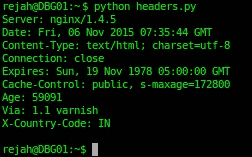
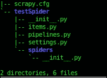
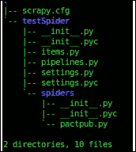

# 第三章。使用 Python 进行应用指纹识别

在 Web 应用程序安全评估期间的一个重要步骤是指纹识别。作为安全研究人员/渗透测试人员，我们必须精通指纹识别，这可以提供有关底层技术（如软件或框架版本、Web 服务器信息、操作系统等）的大量信息。这有助于我们发现影响应用程序和服务器的所有众所周知的漏洞。

在本章中，我们将涵盖以下主题：

+   网络爬虫

+   电子邮件收集

+   操作系统指纹识别

+   EXIF 数据提取

+   应用指纹识别

# 网络爬虫

尽管一些网站提供 API，但大多数网站主要设计供人类使用，只提供为人类格式化的 HTML 页面。如果我们想要程序从这样的网站获取一些数据，我们必须解析标记以获取所需的信息。网络爬虫是使用计算机程序分析网页并获取所需数据的方法。

有许多方法可以使用 Python 模块从网站获取内容：

+   使用`urllib`/`urllib2`创建将获取网页的 HTTP 请求，并使用`BeautifulSoup`解析 HTML

+   要解析整个网站，我们可以使用 Scrapy（[`scrapy.org`](http://scrapy.org)），它有助于创建网络爬虫

+   使用 requests 模块获取并使用 lxml 解析

## urllib / urllib2 模块

Urllib 是一个高级模块，允许我们脚本化不同的服务，如 HTTP、HTTPS 和 FTP。

### urllib/urllib2 的有用方法

Urllib/urllib2 提供了一些方法，可用于从 URL 获取资源，包括打开网页，编码参数，操作和创建标头等。我们可以按以下方式使用其中一些有用的方法：

+   使用`urlopen()`打开网页。当我们将 URL 传递给`urlopen()`方法时，它将返回一个对象，我们可以使用`read()`属性以字符串格式从该对象获取数据，如下所示：

```py
        import urllib 

        url = urllib.urlopen("http://packtpub.com/") 

        data = url.read() 

        print data 

```

+   下一个方法是参数编码：`urlencode()`。它接受字段字典作为输入，并创建参数的 URL 编码字符串：

```py
        import urllib 

        fields = { 
          'name' : 'Sean', 
          'email' : 'Sean@example.com' 
        } 

        parms = urllib.urlencode(fields) 
        print parms 

```

+   另一种方法是使用参数发送请求，例如，使用 GET 请求：URL 是通过附加 URL 编码的参数来构建的：

```py
        import urllib 
        fields = { 
          'name' : 'Sean', 
          'email' : 'Sean@example.com' 
        } 
        parms = urllib.urlencode(fields) 
        u = urllib.urlopen("http://example.com/login?"+parms) 
        data = u.read() 

        print data 

```

+   使用 POST 请求方法，URL 编码的参数分别传递给方法`urlopen()`：

```py
        import urllib 
        fields = { 
          'name' : 'Sean', 
          'email' : 'Sean@example.com' 
        } 
        parms = urllib.urlencode(fields) 
        u = urllib.urlopen("http://example.com/login", parms) 
        data = u.read() 
        print data 

```

+   如果我们使用响应头，那么可以使用`info()`方法检索 HTTP 响应头，它将返回类似字典的对象：

```py
        u = urllib.urlopen("http://packtpub.com", parms) 
        response_headers = u.info() 
        print response_headers 

```

+   输出如下：



+   我们还可以使用`keys()`来获取所有响应头键：

```py
>>> print response_headers.keys() 
['via', 'x-country-code', 'age', 'expires', 'server',
        'connection', 'cache-control', 'date', 'content-type']

```

+   我们可以按如下方式访问每个条目：

```py
>>>print response_headers['server'] 
nginx/1.4.5 

```

### 注意

Urllib 不支持 cookies 和身份验证。它只支持 GET 和 POST 请求。Urllib2 是建立在 urllib 之上的，具有更多功能。

+   我们可以使用 code 方法获取状态码：

```py
        u = urllib.urlopen("http://packtpub.com", parms) 
        response_code = u.code 
        print response_code 

```

+   我们可以使用`urllib2`修改请求头，如下所示：

```py
        headers = { 
         'User-Agent' : 'Mozilla/5.0 (X11; Ubuntu; Linux x86_64;
        rv:41.0) Gecko/20100101 Firefox/41.0' 
        }
        request = urllib2.Request("http://packtpub.com/",
         headers=headers)
        url = urllib2.urlopen(request)
        response = url.read()

```

+   可以如下使用 cookies：

```py
        fields = {  
        'name' : 'sean',  
        'password' : 'password!',  
        'login' : 'LogIn'  
        }  

        # Here we creates a custom opener with cookies enabled 
        opener = urllib2.build_opener(  
        urllib2.HTTPCookieProcessor()  
        )  

        # creates request 
        request = urllib2.Request(  
          "http://example.com/login",  
          urllib.urlencode(fields))  

        # Login request sending 
        url = opener.open(request)  
        response = url.read()  

        # Now we can access the private pages with the cookie  
        # got from the above login request 
        url = opener.open("http://example.com/dashboard")  
        response = url.read() 

```

### 请求模块

我们也可以使用 requests 模块而不是`urllib`/`urllib2`，这是一个更好的选择，因为它支持完全的 REST API，并且它只需将字典作为参数而不需要任何编码的参数：

```py
import requests 
response = requests.get("http://packtpub.com", parms) 

# Response 
print response.status_code # Response Code   
print response.headers # Response Headers   
print response.content # Response Content 

# Request 
print response.request.headers # Headers we sent 

```

### 使用 BeautifulSoup 解析 HTML

前面的模块只能用于获取文件。如果我们想要解析通过`urlopen`获得的 HTML，我们必须使用`BeautifulSoup`模块。`BeautifulSoup`接受来自`urlopen`的原始 HTML 和 XML 文件，并从中提取数据。要运行解析器，我们必须创建一个解析器对象并提供一些数据。它将扫描数据并触发各种处理程序方法。Beautiful Soup 4 适用于 Python 2.6+和 Python 3。

以下是一些简单的示例：

+   要使 HTML 格式化，使用以下代码：

```py
         from bs4 import BeautifulSoup  

         parse = BeautifulSoup('<html><head><title>Title of the
         page</title></head><body><p id="para1" 
         align="center">This is a paragraph<b>one</b><a 
         href="http://example1.com">Example Link 1</a> </p><p 
         id="para2">This is a paragraph<b>two</b><a 
         href="http://example2.com">Example Link 2</a></p></body>
         </html>')  

         print parse.prettify()  

```

+   输出如下：


+   使用`BeautifulSoup`导航 HTML 的一些示例方法如下：

```py
parse.contents[0].name
>>> u'html'
parse.contents[0].contents[0].name
>>> u'head'
head = soup.contents[0].contents[0]
head.parent.name
>>> u'html'
head.next
>>> <title>Page title</title>
head.nextSibling.name
>>> u'body'
head.nextSibling.contents[0]
>>> <p id="para1" align="center">This is a 
        paragraph<b>one</b><a href="http://example1.com">Example 
        Link 1</a> </p>
head.nextSibling.contents[0].nextSibling
>>> <p id="para2">This is a paragraph<b>two</b><a 
        href="http://example2.com">Example Link 2</a></p> 

```

+   搜索 HTML 标签和属性的一些方法如下：

```py
parse.find_all('a')
>>> [<a href="http://example1.com">Example Link 1</a>, <a
        href="http://example2.com">Example Link 2</a>]
parse.find(id="para2")
>>> <p id="para2">This is a paragraph<b>two</b><a 
        href="http://example2.com">Example Link 2</a></p>

```

### 下载页面上的所有图像

现在我们可以编写一个脚本来下载页面上的所有图像，并将它们保存在特定位置：

```py
# Importing required modules 
import requests   
from bs4 import BeautifulSoup   
import urlparse #urlparse is renamed to urllib.parse in Python  

# Get the page with the requests 
response = requests.get('http://www.freeimages.co.uk/galleries/food/breakfast/index.htm')   

# Parse the page with BeautifulSoup 
parse = BeautifulSoup(response.text) 

# Get all image tags 
image_tags = parse.find_all('img') 

# Get urls to the images 
images = [ url.get('src') for url in image_tags] 
# If no images found in the page 

if not images:   
    sys.exit("Found No Images") 
# Convert relative urls to absolute urls if any 
images = [urlparse.urljoin(response.url, url) for url in images]   
print 'Found %s images' % len(images) 

# Download images to downloaded folder 
for url in images:   
    r = requests.get(url) 
    f = open('downloaded/%s' % url.split('/')[-1], 'w') 
    f.write(r.content) 
    f.close() 
    print 'Downloaded %s' % url 

```

# 使用 lxml 解析 HTML

另一个强大、快速、灵活的解析器是 lxml 附带的 HTML 解析器。由于 lxml 是一个用于解析 XML 和 HTML 文档的广泛库，它可以处理过程中混乱的标签。

让我们从一个例子开始。

在这里，我们将使用 requests 模块检索网页并用 lxml 解析它：

```py
#Importing modules 
from lxml import html 
import requests 

response = requests.get('http://packtpub.com/') 
tree = html.fromstring(response.content) 

```

现在整个 HTML 保存在`tree`中，以一种良好的树结构，我们可以用两种不同的方式来检查：XPath 或 CSS 选择。XPath 用于在结构化文档（如 HTML 或 XML）中导航元素和属性以查找信息。

我们可以使用任何页面检查工具，如 Firebug 或 Chrome 开发者工具，来获取元素的 XPath：


如果我们想要从列表中获取书名和价格，找到源代码中的以下部分。

```py
<div class="book-block-title" itemprop="name">Book 1</div> 

```

从中我们可以创建 Xpath 如下：

```py
#Create the list of Books: 

books = tree.xpath('//div[@class="book-block-title"]/text()') 

```

然后我们可以使用以下代码打印列表：

```py
print books 

```

### 注意

在[lxml.de](http://lxml.de)上了解更多关于 lxml 的信息。

## Scrapy

Scrapy 是一个用于网页抓取和爬取的开源框架。这可以用来解析整个网站。作为一个框架，它有助于为特定需求构建蜘蛛。除了 Scrapy，我们还可以使用 mechanize 编写可以填写和提交表单的脚本。

我们可以利用 Scrapy 的命令行界面来为新的爬虫脚本创建基本样板。Scrapy 可以通过`pip`安装。

要创建一个新的蜘蛛，我们必须在安装 Scrapy 后在终端中运行以下命令：

```py
 $ scrapy startproject testSpider

```

这将在当前工作目录`testSpider`中生成一个项目文件夹。这也将在文件夹内创建一个基本结构和文件，用于我们的 spider：



Scrapy 有 CLI 命令来创建一个蜘蛛。要创建一个蜘蛛，我们必须输入`startproject`命令生成的文件夹：

```py
 $ cd testSpider

```

然后我们必须输入生成蜘蛛命令：

```py
 $ scrapy genspider pactpub pactpub.com

```

这将生成另一个名为`spiders`的文件夹，并在该文件夹内创建所需的文件。然后，文件夹结构将如下所示：



现在打开`items.py`文件，并在子类中定义一个新项目，名为`TestspiderItem`：

```py
from scrapy.item import Item, Field 
class TestspiderItem(Item): 
    # define the fields for your item here: 
    book = Field() 

```

大部分爬取逻辑都是由 Scrapy 在`spider`文件夹内的`pactpub`类中提供的，所以我们可以扩展这个来编写我们的`spider`。为了做到这一点，我们必须编辑 spider 文件夹中的`pactpub.py`文件。

在`pactpub.py`文件中，首先我们导入所需的模块：

```py
from scrapy.spiders import Spider 
from scrapy.selector import Selector 
from pprint import pprint 
from testSpider.items import TestspiderItem 

```

然后，我们必须扩展 Scrapy 的 spider 类，以定义我们的`pactpubSpider`类。在这里，我们可以定义域和爬取的初始 URL：

```py
# Extend  Spider Class 
class PactpubSpider(Spider): 
    name = "pactpub" 
    allowed_domains = ["pactpub.com"] 
    start_urls = ( 
        'https://www.pactpub.com/all', 
    ) 

```

之后，我们必须定义解析方法，它将创建我们在`items.py`文件中定义的`TestspiderItem()`的一个实例，并将其分配给项目变量。

然后我们可以添加要提取的项目，可以使用 XPATH 或 CSS 样式选择器。

在这里，我们使用 XPATH 选择器：

```py
    # Define parse 
    def parse(self, response): 
        res = Selector(response) 
        items = [] 
        for sel in res.xpath('//div[@class="book-block"]'): 
            item = TestspiderItem() 
            item['book'] = sel.xpath('//div[@class="book-block-title"]/text()').extract() 
            items.append(item) 
        return items 

```

现在我们准备运行`spider`。我们可以使用以下命令运行它：

```py
 $ scrapy crawl pactpub --output results.json

```

这将使用我们定义的 URL 启动 Scrapy，并且爬取的 URL 将传递给`testspiderItems`，并为每个项目创建一个新实例。

## 电子邮件收集

使用之前讨论的 Python 模块，我们可以从网页中收集电子邮件和其他信息。

要从网站获取电子邮件 ID，我们可能需要编写定制的抓取脚本。

在这里，我们讨论了一种从网页中提取电子邮件的常见方法。

让我们通过一个例子。在这里，我们使用`BeautifulSoup`和 requests 模块：

```py
# Importing Modules  
from bs4 import BeautifulSoup 
import requests 
import requests.exceptions 
import urlparse 
from collections import deque 
import re 

```

接下来，我们将提供要爬取的 URL 列表：

```py
# List of urls to be crawled 
urls = deque(['https://www.packtpub.com/']) 

```

接下来，我们将处理过的 URL 存储在一个集合中，以便不重复处理它们：

```py
# URLs that we have already crawled 
scraped_urls = set() 

```

收集的电子邮件也存储在一个集合中：

```py
# Crawled emails 
emails = set() 

```

当我们开始抓取时，我们将从队列中获取一个 URL 并处理它，并将其添加到已处理的 URL 中。此外，我们将一直这样做，直到队列为空为止：

```py
# Scrape urls one by one queue is empty 
while len(urls): 
    # move next url from the queue to the set of Scraped urls 
    url = urls.popleft() 
    scrapped_urls.add(url) 

```

使用`urlparse`模块，我们将获得基本 URL。这将用于将相对链接转换为绝对链接：

```py
    # Get  base url 
    parts = urlparse.urlsplit(url) 
    base_url = "{0.scheme}://{0.netloc}".format(parts) 
    path = url[:url.rfind('/')+1] if '/' in parts.path else url 

```

URL 的内容将在 try-catch 中可用。如果出现错误，它将转到下一个 URL：

```py
    # get url's content 
    print("Scraping %s" % url) 
    try: 
        response = requests.get(url) 
    except (requests.exceptions.MissingSchema, requests.exceptions.ConnectionError): 
        # ignore  errors 
        continue 

```

在响应中，我们将搜索电子邮件并将找到的电子邮件添加到电子邮件集合中：

```py
    # Search e-mail addresses and add them into the output set 
    new_emails = set(re.findall(r"[a-z0-9\.\-+_]+@[a-z0-9\.\-+_]+\.[a-z]+", response.text, re.I)) 
    emails.update(new_emails) 

```

在抓取页面后，我们将获取所有链接到其他页面的链接并更新 URL 队列：

```py
    # find and process all the anchors 
    for anchor in soup.find_all("a"): 
        # extract link url 
        link = anchor.attrs["href"] if "href" in anchor.attrs else '' 
        # resolve relative links 
        if link.startswith('/'): 
            link = base_url + link 
        elif not link.startswith('http'): 
            link = path + link 
        # add the new url to the queue 

        if not link in urls and not link in scraped_urls: 
            urls.append(link) 

```

# OS 指纹识别

渗透测试中的常见过程是识别主机使用的操作系统。通常，这涉及到像 hping 或 Nmap 这样的工具，在大多数情况下，这些工具为了获取这样的信息而相当激进，并可能在目标主机上引发警报。OS 指纹主要分为两类：主动 OS 指纹和被动 OS 指纹。

主动指纹识别是发送数据包到远程主机并分析相应响应的方法。在被动指纹识别中，它分析来自主机的数据包，因此不会向主机发送任何流量，并充当嗅探器。在被动指纹识别中，它嗅探 TCP/IP 端口，因此可以避免被防火墙检测或停止。被动指纹识别通过分析 IP 头数据包中的初始**生存时间**（**TTL**）以及 TCP 会话的第一个数据包中的 TCP 窗口大小来确定目标 OS。TCP 会话的第一个数据包通常是 SYN（同步）或 SYN/ACK（同步和确认）数据包。

以下是一些操作系统的正常数据包规格：

| **OS** | **初始 TTL** | **TCP 窗口大小** |
| --- | --- | --- |
| Linux 内核 2.x | 64 毫秒 | 5,840 千字节 |
| Android / Chrome OS | 64 毫秒 | 5,720 千字节 |
| Windows XP | 128 毫秒 | 65,535 千字节 |
| Windows 7/ Server 2008 | 128 毫秒 | 8,192 千字节 |
| Cisco 路由器（IOS 12.4） | 255 毫秒 | 4,128 千字节 |
| FreeBSD | 64 毫秒 | 65,535 千字节 |

被动 OS 指纹识别不如主动方法准确，但它有助于渗透测试人员避免被检测到。

在指纹系统时另一个有趣的领域是**初始序列号**（**ISN**）。在 TCP 中，对话的成员通过使用 ISN 来跟踪已看到的数据和下一个要发送的数据。在建立连接时，每个成员都将选择一个 ISN，随后的数据包将通过将该数字加一来编号。

Scrapy 可用于分析 ISN 增量以发现易受攻击的系统。为此，我们将通过在循环中发送一定数量的 SYN 数据包来收集来自目标的响应。

使用`sudo`权限启动交互式 Python 解释器并导入 Scrapy：

```py
>>> from scrapy.all import *
>>> ans,unans=srloop(IP(dst="192.168.1.123")/TCP(dport=80,flags="S"))

```

在收集了一些响应后，我们可以打印数据进行分析：

```py
>>> temp = 0
>>> for s,r in ans:
...     temp = r[TCP].seq - temp
...     print str(r[TCP].seq) + "\t+" + str(temp)

```

这将打印出用于分析的 ISN 值。

如果我们安装了 Nmap，我们可以使用 Nmap 的主动指纹数据库与 Scapy 一起使用，方法如下；确保我们已经配置了 Nmap 的指纹数据库`conf.nmap_base`：

```py
>>> from scapy.all import *
>>> from scapy.modules.nmap import *
>>> conf.nmap_base ="/usr/share/nmap/nmap-os-db" 
>>> nmap_fp("192.168.1.123")

```

此外，如果我们的系统上安装了`p0f`，我们还可以使用它来猜测 Scapy 的 OS：

```py
>>> from scapy.all import *
>>> from scapy.modules.pof import *
>>> conf.p0f_base ="/etc/p0f/p0f.fp"
>>> conf.p0fa_base ="/etc/p0f/p0fa.fp"
>>> conf.p0fr_base ="/etc/p0f/p0fr.fp"
>>> conf.p0fo_base ="/etc/p0f/p0fo.fp"
>>> sniff(prn=prnp0f) 

```

# 获取图像的 EXIF 数据

我们可以从在线发布的图像中找到大量信息。对于我们用智能手机或相机拍摄的每张照片，它都记录了日期、时间、快门速度、光圈设置、ISO 设置、是否使用了闪光灯、焦距等等。这些信息存储在照片中，被称为*EXIF*数据。当我们复制一张图像时，EXIF 数据也会被复制，作为图像的一部分。这可能会带来隐私问题。例如，使用 GPS 启用的手机拍摄的照片，可以显示拍摄的位置和时间，以及设备的唯一 ID 号：

```py
import os,sys 

from PIL import Image 

from PIL.ExifTags import TAGS 

for (i,j) in Image.open('image.jpg')._getexif().iteritems(): 

        print '%s = %s' % (TAGS.get(i), j) 

```

首先，我们导入了`PIL`图像和`PIL TAGS`模块。`PIL`是 Python 中的图像处理模块。它支持许多文件格式，并具有强大的图像处理能力。然后我们遍历结果并打印数值。

还有许多其他模块支持 EXIF 数据提取，比如`ExifRead`。

# Web 应用指纹识别

Web 应用指纹识别是安全评估信息收集阶段的主要部分。它帮助我们准确识别应用程序并找出已知的漏洞。这也允许我们根据信息定制有效载荷或利用技术。最简单的方法是在浏览器中打开网站并查看其特定关键字的源代码。同样，使用 Python，我们可以下载页面然后运行一些基本的正则表达式，这可以给你结果。

我们可以使用`urllib`/`requests`模块与 BeautifulSoup 或 lxml 结合下载网站，就像我们在本章讨论的那样。

# 总结

在本章中，我们讨论了下载和解析网站的可能方法。使用本章讨论的基本方法，我们可以构建自己的扫描器和网络爬虫。

在下一章中，我们将讨论更多使用 Python 的攻击脚本技术。
