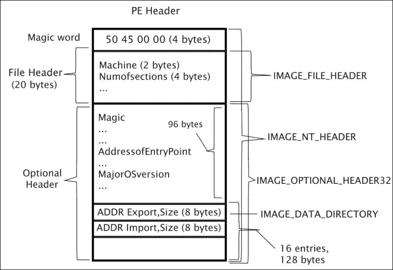

# 第六章：调试和逆向工程

调试器是逆向工程中使用的主要工具。使用调试器，我们可以在运行时执行分析以了解程序。我们可以识别调用链并跟踪间接调用。使用调试器，我们可以分析和监视程序运行时，以指导我们的逆向工程。在本章中，我们将学习如何在脚本中使用调试器。

本章涵盖的主题如下：

+   可移植可执行文件分析

+   使用 Capstone 进行反汇编

+   带有 Capstone 的 PE 文件

+   使用 PyDBG 进行调试

# 逆向工程

逆向工程分析主要有三种类型：

+   **静态分析**：分析二进制文件的内容。这有助于确定可执行部分的结构，并打印出可读部分，以获取有关可执行文件目的的更多细节。

+   **动态分析**：这种类型将执行二进制文件，无论是否附加调试器，以发现其目的和可执行文件的工作方式。

+   **混合分析**：这是静态和动态分析的混合。在静态分析之间重复，然后进行动态调试，将更好地了解程序。

# 可移植可执行文件分析

任何 UNIX 或 Windows 二进制可执行文件都将具有描述其结构的头部。这包括其代码的基地址、数据部分和可以从可执行文件中导出的函数列表。当操作系统执行可执行文件时，首先操作系统读取其头部信息，然后加载二进制数据从二进制文件中以填充相应进程的代码和数据部分的地址内容。

**可移植可执行文件**（**PE**）文件是 Windows 操作系统可以执行或运行的文件类型。我们在 Windows 系统上运行的文件是 Windows PE 文件；这些文件可以具有 EXE、DLL（动态链接库）和 SYS（设备驱动程序）扩展名。此外，它们包含 PE 文件格式。

Windows 上的二进制可执行文件具有以下结构：

+   DOS 头部（64 字节）

+   PE 头部

+   部分（代码和数据）

我们现在将详细研究每一种。

## DOS 头部

DOS 头部以魔术数字`4D 5A 50 00`开头（前两个字节是字母`MZ`），最后四个字节（`e_lfanew`）指示二进制可执行文件中 PE 头部的位置。所有其他字段都不相关。

## PE 头部

PE 头部包含更多有趣的信息。以下是 PE 头部的结构：



PE 头部由三部分组成：

+   4 字节的魔术代码

+   20 字节的文件头，其数据类型为**IMAGE_FILE_HEADER**

+   224 字节的可选头，其数据类型为**IMAGE_OPTIONAL_HEADER32**

此外，可选头部有两部分。前 96 字节包含诸如主要操作系统和入口点之类的信息。第二部分由 16 个条目组成，每个条目有 8 个字节，形成 128 字节的数据目录。

### 注意

您可以在以下链接中了解更多关于 PE 文件的信息：[`www.microsoft.com/whdc/system/platform/firmware/PECOFF.mspx`](http://www.microsoft.com/whdc/system/platform/firmware/PECOFF.mspx) 以及文件头中使用的结构：[`msdn2.microsoft.com/en-gb/library/ms680198.aspx`](http://msdn2.microsoft.com/en-gb/library/ms680198.aspx)。

我们可以使用`pefile`模块（一个用于处理 PE 文件的多平台全功能 Python 模块）在 Python 中获取这些文件头的所有细节。

### 加载 PE 文件

加载文件就像在模块中创建 PE 类的实例一样简单，参数是可执行文件的路径。

首先，导入`pefile`模块：

```py
Import pefile
```

使用可执行文件初始化实例：

```py
pe = pefile.PE('path/to/file')
```

## 检查头部

在交互式终端中，我们可以对 PE 文件头进行基本检查。

像往常一样，导入`pefile`并加载可执行文件：

```py
>>>import pefile 
>>>pe = pefile.PE('md5sum.exe') 
>>> dir(pe)

```

这将打印对象。为了更好地理解，我们可以使用`pprint`模块以可读格式打印此对象：

```py
>>> pprint.pprint(dir(pe))

```

这将以可读格式列出所有内容，如下所示：


我们还可以打印特定标头的内容，如下所示：

```py
>>> pprint.pprint(dir(pe.OPTIONAL_HEADER))

```

您可以使用 hex()获取每个标头的十六进制值：

```py
>>>hex( pe.OPTIONAL_HEADER.ImageBase)

```

## 检查节

要检查可执行文件中的节，我们必须迭代`pe.sections`：

```py
>>>for section in pe.sections:
 print (section.Name,
      hex(section.VirtualAddress),
      hex(section.Misc_VirtualSize),
      section.SizeOfRawData)

```

## PE 打包器

**打包器**是用于压缩 PE 文件的工具。这将减小文件的大小，并为被静态反向工程的文件添加另一层混淆。尽管打包器是为了减小可执行文件的总体文件大小而创建的，但后来，许多恶意软件作者利用了混淆的好处。打包器将压缩的数据包装在一个工作的 PE 文件结构中，并将 PE 文件数据解压缩到内存中，并在执行时运行它。

我们可以使用签名数据库来检测可执行文件是否被打包。可以通过搜索互联网找到签名数据库文件。

为此，我们需要另一个模块`peutils`，它与`pefile`模块一起提供。

您可以从本地文件或 URL 加载签名数据库：

```py
Import peutils
signatures = peutils.SignatureDatabase('/path/to/signature.txt')
```

您还可以使用以下内容：

```py
signatures = peutils.SignatureDatabase('handlers.sans.org/jclausing/userdb.txt')
```

加载签名数据库后，我们可以使用这个数据库运行 PE 实例，以识别使用的打包器的签名：

```py
matches = signatures.match(pe, ep_only = True)
print matches
```

这将输出可能使用的打包器。

另外，如果我们检查打包的可执行文件中的节名称，它们将有轻微的差异。例如，使用 UPX 打包的可执行文件，其节名称将是`UPX0`，`UPX1`等。

# 列出所有导入和导出的符号

导入项可以列出如下：

```py
for entry in pe.DIRECTORY_ENTRY_IMPORT:
  print entry.dll
  for imp in entry.imports:
    print '\t', hex(imp.address), imp.name
```

同样，我们无法列出导出项：

```py
for exp in pe.DIRECTORY_ENTRY_EXPORT.symbols:
  print hex(pe.OPTIONAL_HEADER.ImageBase + exp.address), exp.name, exp.ordinal
```

# 使用 Capstone 进行反汇编

**反汇编**是组装的相反过程。反汇编器试图从二进制机器代码创建汇编代码。为此，我们使用一个名为**Capstone**的 Python 模块。Capstone 是一个免费的、多平台和多架构的反汇编引擎。

安装后，我们可以在我们的 Python 脚本中使用这个模块。

首先，我们需要运行一个简单的测试脚本：

```py
from capstone import *
cs = Cs(CS_ARCH_X86, CS_MODE_64)
for i in cs.disasm('\x85\xC0', 0x1000)
   print("0x%x:\t%s\t%s" %(i.address, i.mnemonic, i.op_str))
```

脚本的输出将如下所示：

```py
0x1000:     test  eax, eax

```

第一行导入模块，然后使用`Cs`初始化`capstone` Python 类，它需要两个参数：硬件架构和硬件模式。在这里，我们指示对 x86 架构的 64 位代码进行反汇编。

下一行迭代代码列表，并将代码传递给`capstone`实例`cs`中的`disasm()`。`disasm()`的第二个参数是第一个安装的地址。`disasm()`的输出是`Cslnsn`类型的安装列表。

最后，我们打印出一些这些输出。`Cslnsn`公开了有关已反汇编安装的所有内部信息。

其中一些如下：

+   **Id**：指令的指令 ID

+   **地址**：指令的地址

+   **助记符**：指令的助记符

+   **op_str**：指令的操作数

+   **size**：指令的大小

+   **字节**：指令的字节序列

像这样，我们可以使用 Capstone 反汇编二进制文件。

# 使用 Capstone 的 PEfile

接下来，我们使用`capstone`反汇编器对我们使用`pefile`提取的代码进行反汇编，以获取组装代码。

像往常一样，我们首先导入所需的模块。在这里，这些是`capstone`和`pefile`：

```py
from capstone import *
import pefile
pe = pefile.PE('md5sum.exe')
entryPoint = pe.OPTIONAL_HEADER.AddressOfEntryPoint
data = pe.get_memory_mapped_image()[entryPoint:]
cs = Cs(CS_ARCH_X86, CS_MODE_32)
for i in cs.disasm(data, 0x1000):
    print("0x%x:\t%s\t%s" %(i.address, i.mnemonic, i.op_str))
```

`IMAGE_OPTIONAL_HEADER`中的`AddressofEntryPoint`值是相对于图像基地址的入口点函数的指针。对于可执行文件，这是应用程序代码开始的确切位置。因此，我们使用`pefile`获取代码的起始位置，如`pe.OPTIONAL_HEADER.AddressOfEntryPoint`，并将其传递给反汇编器。

# 调试

调试是修复程序中的错误的过程。调试器是可以运行并监视另一个程序执行的程序。因此，调试器可以控制目标程序的执行，并监视或更改目标程序的内存和变量。

## 断点

断点有助于在调试器中选择的位置停止目标程序的执行。在那时，执行停止并控制传递给调试器。

断点有两种不同的形式：

+   **硬件断点**：硬件断点需要 CPU 的硬件支持。它们使用特殊的调试寄存器。这些寄存器包含断点地址、控制信息和断点类型。

+   **软件断点**：软件断点用一个陷阱调试器的指令替换原始指令。这只能在执行时中断。它们之间的主要区别是硬件断点可以设置在内存上。但是，软件断点不能设置在内存上。

# 使用 PyDBG

我们可以使用 PyDBG 模块在运行时调试可执行文件。我们可以通过一个基本的 PyDBG 脚本来了解它的工作原理。

首先，我们导入模块：

```py
from pydbg import *
import sys
```

然后我们定义一个处理断点的函数。它也将`pydbg`实例作为参数。在这个函数内部，它打印出进程的执行上下文，并指示`pydbg`继续执行：

```py
define breakpoint_handler(dbg):
   print dbg.dump_context()
   return DBG_CONTINUE
```

然后我们初始化`pydbg`实例，并设置`handler_breakpoint`函数来处理断点异常：

```py
dbg = pydbg()
dbg.set_callback(EXEPTION_BREAKPOINT, breakpoint_handler)
```

然后附加需要使用`pydbg`调试的进程的进程 ID：

```py
dbg.attach(int(sys.argv[1]))
```

接下来我们将设置触发断点的地址。在这里，我们使用`bp_set()`函数，它接受三个参数。第一个是设置断点的地址，第二个是可选的描述，第三个参数指示`pydbg`是否恢复此断点：

```py
dbg.bp_set(int(sys.argv[1], 16), "", 1)
```

最后，在事件循环中启动`pydbg`：

```py
dbg.debug_event_loop()
```

在这个例子中，我们将断点作为参数传递给这个脚本。所以，我们可以按照以下方式运行这个脚本：

```py
$ python debug.py 1234 0x00001fa6

```

### 注意

`pydbg`包含许多其他有用的功能，可以在文档中找到：[`pedramamini.com/PaiMei/docs/PyDbg/public/pydbg.pydbg.pydbg-class.html`](http://pedramamini.com/PaiMei/docs/PyDbg/public/pydbg.pydbg.pydbg-class.html)。

# 总结

我们已经讨论了可以用 Python 编程逆向工程和调试二进制文件的基本工具。现在你将能够编写自定义脚本来调试和逆向工程可执行文件，这将有助于恶意软件分析。我们将在下一章讨论一些 Python 中的加密、哈希和转换函数。
