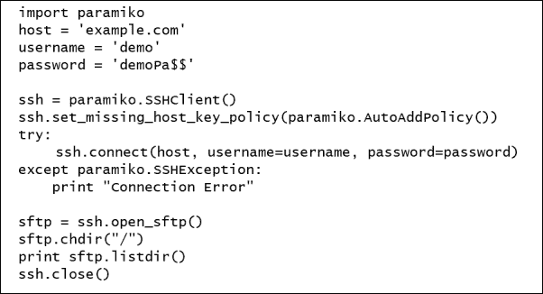
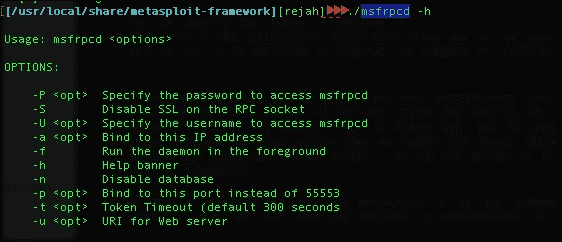
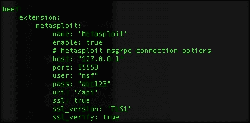

# 第九章。攻击自动化

自动化工具使我们能够探索和利用比任何手动方法可能的漏洞更多。在我看来，没有什么能比得上由经验丰富的安全专家执行的手动安全测试结合一组自动化部分。复杂的脚本可以将攻击分散到多个主机，并避免被列入黑名单。

本章涵盖的主题如下：

+   使用 paramiko 进行 SFTP 自动化

+   Nmap 自动化

+   W3af REST API

+   使用 MSGRPC 进行 Metasploit 脚本化

+   OWASP zap API

+   破解验证码

+   使用 Python 访问 BeEF API

+   使用 Python 访问 Nessus 6 API

# Paramiko

通过 SSH 在远程系统中运行命令是自动化的最常见组件之一。Python 模块 paramiko 通过提供对 SSH 的编程接口，使这变得容易。Paramiko 通过导入库为您提供了在 Python 中使用 SSH 功能的简便方法。这使我们能够执行通常需要手动执行的 SSH 任务。

## 使用 paramiko 建立 SSH 连接

paramiko 的主要类是`paramiko.SSHClient`，它提供了一个基本的接口来初始化服务器连接：


这将创建一个新的 SSHClient 实例，然后我们调用`connect()`方法，该方法连接到 SSH 服务器。

当我们使用任何 SSH 客户端连接到远程机器时，该远程主机的密钥将自动存储在我们的主目录中的`.ssh/known_hosts`文件中。因此，第一次连接到远程系统时，我们将收到以下消息：


当您在此消息中输入“是”时，它将在`known_hosts`文件中添加一个条目。通过接受此消息，为该主机添加了一定程度的信任。相同的规则适用于 paramiko。默认情况下，SSHClient 实例将拒绝连接没有在我们的`known_hosts`文件中保存密钥的主机。这将在创建自动化脚本时造成问题。我们可以将主机密钥策略设置为使用 paramiko 自动添加丢失的主机密钥，如下所示：

```py
ssh.set_missing_host_key_policy(paramiko.AutoAddPolicy()) 

```

现在，连接到`ssh`并自动添加主机密钥的脚本将如下所示：


## 使用 paramiko 运行命令

我们现在使用 paramiko 连接到远程主机。然后，我们可以使用此连接在远程主机上运行命令：

```py
stdin, stdout, stderr = sshObj.exec_command('uptime') 
for line in stdout.readlines():

        print line.strip()

ssh.close()

```

响应数据将是元组（`stdin`，`stdout`，`stderr`），我们可以读取输出并写入输入。例如，如果我们运行一个需要输入的命令，我们可以使用`stdin`：

```py
stdin, stdout, stderr = ssh.exec_command("sudo ls") 
stdin.write('password\n') 
stdin.flush() 
for line in stdout.readlines(): 
        print line.strip()

```

有了这个，我们可以创建一个可以自动化许多任务的交互式 shell。

## 使用 paramiko 进行 SFTP

我们还可以使用 paramiko 处理远程主机上的文件操作。

### 提示

**SFTP**代表**SSH 文件传输协议**，或**安全文件传输协议**。这是一个单独的协议，几乎与通过 SSH 进行安全连接的 FTP 相同。

为此，我们首先像以前一样实例化一个新的`paramiko.SSHClient`实例：



然后，在连接到远程主机后，我们使用`open_sftp()`，它将返回一个`paramiko.SFTPClient`客户端对象。`paramiko.SFTPClient`将支持所有的 SFTP 操作。在这里，我们列出了远程服务器根目录中的文件。

我们可以使用`get()`方法下载文件，使用`put()`方法上传文件。

要下载远程密码文件：

```py
remotepath = '/etc/passwd' 
localpath = '/home/remote-passwd' 
sftp.get(remotepath, localpath)

```

要将文件上传到远程主机：

```py
remotepath = '/home/some-image.jpg' 
localpath = '/home/some-image.jpg' 
sftp.put(localpath, remotepath) 

```

# python-nmap

**网络映射器**（**Nmap**）是用于网络发现和安全审计的免费开源工具。它可以在所有主要计算机操作系统上运行，并且 Linux、Windows 和 Mac OS X 都提供官方的二进制软件包。`python-nmap`库有助于以编程方式操作`nmap`的扫描结果，以自动化端口扫描任务。

像往常一样，在安装了`python-nmap`后，我们必须导入模块`nmap`：

```py
import nmap

```

实例化`nmap`端口扫描程序：

```py
nmap = nmap.PortScanner() 
host = '127.0.0.1' 

```

设置要扫描的`host`和`port`范围：

```py
nmap.scan(host, '1-1024') 

```

我们可以打印用于扫描的`command_line`命令：

```py
print nmap.command_line()

```

此外，我们可以获取`nmap`扫描信息：

```py
print nmap.scaninfo()

```

现在我们扫描所有主机：

```py
for host in nmap.all_hosts(): 
    print('Host : %s (%s)' % (host, nmap[host].hostname())) 
    print('State : %s' % nmap[host].state()) 

```

我们还扫描所有协议：

```py
for proto in nmap[host].all_protocols(): 
    print('Protocol : %s' % proto) 

listport = nmap[host]['tcp'].keys() 
listport.sort() 

for port in listport: 
    print('port : %s\tstate : %s' % (port, nmap[host][proto][port]['state']))
```

此脚本将提供以下输出：


### 提示

您可以从这里获取更多关于`python-nmap`的选项：[`bitbucket.org/xael/python-nmap`](https://bitbucket.org/xael/python-nmap)。

# W3af REST API

**Web 应用程序审计和攻击框架**（**W3af**）是一个强大而灵活的环境，用于 Web 漏洞评估和利用 Web 应用程序漏洞。它有许多插件可以相互通信。例如，发现插件收集不同的 URL 进行测试，并传递给审计插件，审计插件使用这些 URL 来搜索漏洞。W3af 还可以利用它发现的漏洞。

W3af 有八种不同类型的插件：

+   **发现插件**：爬行 Web 应用程序以查找新的 URL、表单和许多其他有趣的 Web 应用程序部分。这些插件在循环中运行，输出作为输入提供给下一个插件。

+   **审计插件**：这些是 W3af 的主要部分，它们将发现插件的输出作为输入，并扫描各种 Web 应用程序漏洞，如 SQL、XSS 注入等。

+   **Grep 插件**：像 UNIX grep 实用程序一样，它们搜索每个 HTTP 请求和响应，以查找异常和有趣的信息。它可以是 IP 地址、错误代码、电子邮件 ID、信用卡号，甚至是风险的 JavaScript 代码。

+   **Bruteforce 插件**：这些插件有助于暴力破解在发现阶段发现的基本 HTTP 身份验证和表单登录身份验证。

+   **攻击插件**：此插件将从知识库中读取漏洞对象并尝试利用它们。

+   **Mangle 插件**：这些插件有助于基于 sed 编辑器的正则表达式修改请求和响应。

+   **Evasion 插件**：这些插件有助于避免简单的**入侵检测规则**（**IDS**）。

+   **输出插件**：这些插件有助于创建不同文件格式的输出文件，如报告。

我们可以使用`w3af` API 连接到`w3af`并使用这些模块。首先，我们必须运行`w3af` API。要做到这一点，获取`w3af`并运行`w3af_api`：

```py
 $ ./w3af_api

```

`w3af` API 已经配置了一些可用于特定任务的配置文件。例如，`OWASP_TOP10`配置文件包括几个发现、审计和 grep 插件，用于执行 OWASP Top 10 安全性分析。因此，我们可以使用这些配置文件，或者我们可以创建自己的配置文件来运行`w3af`。

使用`w3af_api_client`从脚本中访问`w3af_api`。安装`w3af_api_client`并导入它：

```py
from w3af_api_client import Connection, Scan

```

现在我们可以创建到`w3af` API 的连接。这将在端口`5000`上运行：

```py
connection = Connection('http://127.0.0.1:5000/')

```

我们可以通过检查其版本来确保连接正确：

```py
print connection.get_version() 

```

现在，我们可以定义配置文件和要扫描的目标 URL：

```py
profile = file('w3af/profiles/OWASP_TOP10.pw3af').read() 
target = ['http://localhost'] 

```

然后，我们实例化扫描实例：

```py
scan = Scan(connection) 

```

现在我们可以开始扫描：

```py
scan.start(profile, target) 

```

开始扫描后，我们可以获取发现、URL 和日志：

```py
scan.get_urls() 
scan.get_log() 
scan.get_findings() 

```

我们可以使用以下方法获取`fuzzable` URL：

```py
scan.get_fuzzable_requests()

```

由于 W3af 是一个 Python 工具，我们可以在脚本中将`w3af`作为模块导入并在脚本中使用其功能。为此，我们必须下载`w3af`的`setup.py`。我们可以从[`github.com/andresriancho/w3af-module`](https://github.com/andresriancho/w3af-module)获取整个模块的文件。

下载此模块并验证子模块文件夹`w3af`中是否包含所有文件。如果没有，请从[`github.com/andresriancho/w3af`](https://github.com/andresriancho/w3af)下载`w3af`文件夹并替换该文件夹。

然后，运行以下命令：

```py
 $ sudo python setup.py install

```

这将安装`w3af`作为 Python 模块。接下来，我们可以像导入其他 Python 模块一样导入它：

```py
import w3af 

```

或者，我们可以导入其他`w3af`模块，例如：

```py
from w3af.core.data.kb.shell import Shell
```

# 使用 MSGRPC 的 Metasploit 脚本

**Metasploit**是一个开源项目，提供公共资源用于开发、测试和执行利用。它还可以用于创建安全测试工具、利用模块，以及作为渗透测试框架。

Metasploit 是用 Ruby 编写的，不支持用 Python 编写的模块或脚本。

然而，Metasploit 确实有一个 MSGRPC，使用 MSGPACK 的双向 RPC（远程过程调用）接口。`pymetasploit` Python 模块有助于在 Python 和 Metasploit 的`msgrpc`之间进行交互。

因此，在编写脚本之前，我们必须加载`msfconsole`并启动`msgrpc`服务。接下来，让我们启动 Metasploit 和 MSGRPC 接口。我们可以在 Metasploit 中使用`msfrpcd`启动 MSGRPC。以下是`msfrpcd`的完整选项：

```py
$ ./msfrpcd

```

输出如下：



以密码`123456`启动 MSGRPC：

```py
$ ./msfrpcd -P 123456 -n -f 

```


现在 Metasploit 的 RPC 接口正在侦听端口`55553`。我们可以继续编写我们的 Python 脚本。

与 MSGRPC 交互几乎与与`msfconsole`交互类似。首先，我们必须创建`msfrpc`类的实例。然后，使用凭据登录到`msgrpc`服务器，并创建一个虚拟控制台。

我们可以使用 PyMetasploit Python 模块来自动化 Python 的利用任务。从[`github.com/allfro/pymetasploit`](https://github.com/allfro/pymetasploit)克隆该模块：

```py
$ git clone https://github.com/allfro/pymetasploit.git

```

转到以下模块文件夹：

```py
$ cd pymetasploit

```

安装模块：

```py
$ python setup.py install

```

现在，我们可以在我们的脚本中导入该模块：

```py
from metasploit.msfrpc import MsfRpcClient

```

然后，我们可以为`MsfRpcClient`创建一个新实例。我们必须对 Metasploit 进行身份验证才能在其中运行任何命令。因此，传递密码以对 Metasploit 进行身份验证：

```py
client = MsfRpcClient('123456') 

```

我们可以通过这个实例浏览核心 Metasploit 功能：

```py
dir(client) 

```

这将列出核心功能。现在我们可以列出辅助选项：

```py
auxilary = client.modules.auxiliary 
for i in auxilary: 
   print "\t%s" % I

```

类似地，我们可以使用相同的语法列出所有利用、编码器、有效载荷和后续的核心模块。我们可以使用`use`方法激活其中一个模块：

```py
scan = client.modules.use('auxiliary', 'scanner/ssh/ssh_version') 

```

然后，我们可以设置参数：

```py
scan['VERBOSE'] = True 
scan['RHOSTS'] = '192.168.1.119'

```

最后，运行模块：

```py
Print scan.execute() 

```

如果执行成功，则输出如下：

```py
{'job_id': 17, 'uuid': 'oxutdiys'}

```

如果失败，`job_id`将为 none。

接下来，如果攻击成功，我们可以使用会话方法访问 shell 和控制台：

```py
client.sessions.list

```

这将列出所有当前活动的会话。如果攻击为受害者提供了 shell 访问权限，那么我们可以获取可用的 shell，并使用以下方法访问它们：

```py
shell = client.sessions.session(1) 
shell.write('whoami\n') 
print shell.read() 

```

我们还可以连接到控制台并运行命令，就像在`msfconsole`中一样：

导入模块：

```py
from metasploit.msfrpc import MsfRpcClient 
from metasploit.msfconsole import MsfRpcConsole 

```

创建客户端：

```py
client = MsfRpcClient('123456', user='msf') 

```

使用客户端创建控制台：

```py
console = MsfRpcConsole(client) 

```

现在我们可以使用这个实例来运行 Metasploit 命令，如下所示：

```py
console.execute('use scanner/ssh/ssh_version') 
console.execute('set RHOSTS 192.168.1.119') 
console.execute('set VERBOSE True') 
console.execute('run')

```

输出将打印在控制台本身。

在这里，我们使用了 PyMetasploit 模块，但我们也可以使用 msgrpc 模块（[`github.com/SpiderLabs/msfrpc`](https://github.com/SpiderLabs/msfrpc)）。这将帮助我们访问底层功能，并在脚本中处理结果和控制台输出。

# 使用 Python 的 ClamAV 防病毒软件

我们可以使用 pyClamd，一个开源的 Python 模块，在 Linux、MacOSX 和 Windows 上使用 ClamAV 防病毒引擎。要从 Python 中以编程方式使用 ClamAV，您必须运行`clamd`守护程序的一个实例。

### 提示

您可以在 Windows、Linux 和 MacOSx 上安装 ClamAV。要在 Windows 和 Linux 上安装它，请参考官方 ClamAV 文档[`www.clamav.net/documents/installing-clamav`](http://www.clamav.net/documents/installing-clamav)。要在 MacOSX 上安装，请使用 homebrew。

安装 ClamAV 后，配置它以与网络套接字或 Unix 套接字一起工作。为此，我们必须更新`clamd`配置。您可以在 Linux 的`/etc/clamav/`文件夹中找到两个配置文件，Windows 的`c:\clamAV\`，以及 MacOSX 的`/usr/local/etc/clamav`。文件如下：`freshclam.conf`和`clamd.conf`。

如果找不到这些配置文件，请从示例配置文件创建它们，并在`freshclam.conf`文件中更新数据库镜像 URL。Freshclam 将获取防病毒数据库更新，因此我们应立即运行它以获取初始数据库：

```py
DatabaseMirror database.clamav.net

```

更新数据库镜像后，使用以下命令下载 ClamAV 数据库：

```py
$ freshclam -v

```

在`clamd.conf`中启用 Unix 套接字或网络套接字。要启用 Unix 套接字，请使用以下内容更新`clamd.conf`：

```py
LocalSocket /tmp/clamd.sock 

```

现在，您可以在终端窗口中使用`clamd`命令运行`clamd`守护程序。

在 Windows 中将`clamd`安装为服务时，请运行安装程序，并让其安装到默认位置`c:\clamav\`。还要确保正确配置 Unix 套接字，并且您在`config`文件中指定的位置存在。

然后，您可以从 Python 脚本中使用`clamd`。导入`pyclamd`模块：

```py
import pyclamd

```

接下来，尝试使用 Unix 套接字连接到`clamd`守护程序，如果失败，则尝试使用网络套接字连接：

```py
try: 
   clamd = pyclamd.ClamdUnixSocket() 
   # test if clamd unix socket is reachable 
   clamd.ping() 
except pyclamd.ConnectionError: 
   # if failed,  test for network socket 
   clamd = pyclamd.ClamdNetworkSocket() 
   try: 
         clamd.ping() 
   except pyclamd.ConnectionError: 
         raise ValueError('could not connect to clamd server either by unix
         or network socket')

```

我们可以通过打印`clamd`版本来确认代码：

```py
print(clamd.version()) 

```

最后，扫描文件或文件夹以查找病毒：

```py
print(clamd.scan_file('path-to-file-or-folder-to-scan')) 

```

如果发现病毒签名，这将输出详细信息。

### 提示

您可以在此处获取完整的 pyclamd 文档：[`xael.org/pages/python-module-pyclamd.html`](http://xael.org/pages/python-module-pyclamd.html)。

# 从 Python 中的 OWASP ZAP

**OWASP ZAP**（**Zed Attack Proxy**）是一个开源的跨平台 Web 应用程序安全扫描器，用 Java 编写，并在所有流行的操作系统中都可用：Windows、Linux 和 Mac OS X。

OWASP ZAP 提供了一个 REST API，允许我们编写脚本以编程方式与 Zap 通信。我们可以使用`python-owasp-zap`模块来访问此 API。可以使用 pip 安装`python-owasp-zap-v2.4`模块。

首先加载所需的模块：

```py
from zapv2 import ZAPv2 
from pprint import pprint 
import time 

```

定义要扫描的目标：

```py
target = 'http://127.0.0.1'

```

现在，我们可以实例化`zap`实例，如下所示：

```py
zap = zapv2()
```

这将使用假设`zap`在默认端口`8080`上监听来实例化一个新实例。如果 Zap 监听非默认端口，则必须将自定义代理设置作为参数传递，如下所示：

```py
zap = ZAPv2(proxies={'http': 'http://127.0.0.1:8090', 'https': 'http://127.0.0.1:8090'}) 

```

设置目标并在`zap`中启动会话：

```py
zap.urlopen(target) 

```

最好等一段时间，以便 URL 列表在`zap`中得到更新：

```py
time.sleep(2)

```

现在，我们可以开始爬虫任务：

```py
zap.spider.scan(target) 

```

我们可以使用以下命令开始被动扫描：

```py
zap.ascan.scan(target)

```

最后，我们可以使用`pprint`来打印警报：

```py
pprint (zap.core.alerts())

```

这为我们提供了来自`zap`的警报。

## 破解弱验证码

**验证码**（**Completely Automated Public Turing test to tell Computers and Humans Apart**）是一种挑战-响应测试，用于确保响应是由人类生成的。它有助于防止机器人发送垃圾邮件、欺诈性注册、虚假的抽奖参与等。

许多网站实施自己的验证码，在这种情况下，我们可以从源获取验证码图像。这可以是一个链接，每次访问 URL 时都会生成一个带有新随机数字的图像。因此，为了绕过验证码，我们需要获取该图像中的随机数字或单词。

我们已经学会了如何使用 Python 自动发送 post 请求。在这里，我们可以学习如何从图像中获取随机代码。我们可以使用`pytesseract` Python 模块来读取带有**光学字符识别**（**OCR**）引擎的图像。

### 提示

您可以在此处阅读更多关于 pytesseract 的内容，以在您的系统上安装它：[`github.com/madmaze/pytesseract`](https://github.com/madmaze/pytesseract)。

像往常一样，我们可以导入所需的模块：

```py
import pytesseract 
from urllib import urlretrieve 
from PIL import Image 

```

下载验证码图像并保存：

```py
link = 'http://www.cs.sfu.ca/~mori/research/gimpy/ez/96.jpg' 
urlretrieve(link,'temp.png') 

```

使用 OCR 引擎读取图像：

```py
print pytesseract.image_to_string(Image.open('temp.png'))  

```

这将打印出验证码中的单词。有时，根据验证码图像中使用的噪音，需要进行一些图像操作。我们可以使用`PIL`库的功能来实现这一目的。以下是一个使字母加粗的示例：

```py
img = Image.open('temp.png') 
img = img.convert("RGBA") 
pix = img.load() 

for y in xrange(img.size[1]): 
   for x in xrange(img.size[0]): 
         if pix[x, y][0] < 90: 
               pix[x, y] = (0, 0, 0, 255) 

for y in xrange(img.size[1]): 
   for x in xrange(img.size[0]): 
         if pix[x, y][1] < 136: 
               pix[x, y] = (0, 0, 0, 255) 

for y in xrange(img.size[1]): 
   for x in xrange(img.size[0]): 
         if pix[x, y][2] > 0: 
               pix[x, y] = (255, 255, 255, 255) 

img.save("temp.png", "png")
```

然后，使用此输出图像来输入 OCR 引擎。在获取验证码图像中的单词后，我们可以填写验证码值并提交表单。

### 提示

为了更好的准确性，我们可以训练 OCR 引擎。要了解有关训练 Tesseract 的更多信息：[`github.com/tesseract-ocr/tesseract/wiki/TrainingTesseract`](https://github.com/tesseract-ocr/tesseract/wiki/TrainingTesseract)。

## 用 Python 自动化 BeEF

**浏览器利用框架**（**BeEF**）是一种利用浏览器漏洞来评估目标安全问题的安全工具。BeEF 是一个框架，为安全测试人员提供了客户端攻击向量。此外，它允许我们为每个浏览器和上下文选择特定的模块。本节将讨论如何使用框架提供的 REST API 自动化任务及其功能。

BeEF 专注于使用 JavaScript 挂钩的客户端上下文。它创建一个可以从控制面板控制的僵尸网络。当用户浏览包含挂钩的网站时，该浏览器将自动成为该僵尸网络的一部分。然后，攻击者可以向挂钩发送指令，以执行受害者的挂钩 Web 浏览器上的任务。这将提供有关 Web 浏览器的基本信息，启用或禁用插件和扩展，或者可以强制导航到另一个网站。由于它是在受害者访问的网页上下文中运行的简单 JavaScript 文件，因此关闭包括挂钩在内的此网站将使浏览器与僵尸网络断开连接，从而解决问题。

### 安装 BeEF

BeEF 是用 Ruby 开发的。因此，它需要在您的系统上安装 Ruby 解释器。通常，使用 BeEF 和 Metasploit 等多个工具会有点困难，因为它们都是用 Ruby 开发的，并且使用不同版本的 Ruby。因此，最好使用**Ruby 版本管理器**（**RVM**）在您的系统上管理多个 Ruby 版本。

您可以在 RVM 的官方网站上查看官方网站 [`rvm.io`](https://rvm.io)。

这将有助于使事情变得更容易，您将节省大量时间。

要安装 BeEF，请使用以下命令从 GitHub 下载项目的最新版本：

```py
$ git clone https://github.com/beefproject/beef.git beef-lastest 

```

然后安装 bundler：

```py
$ sudo gem install bundler

```

然后安装 BeEF：

```py
$ cd beef-lastest 
$ bundle install

```

要运行 BeEF，请使用以下命令：

```py
$ ./beef

```

输出将如下所示：


+   从 Web 界面管理多个受害者是低效和繁琐的。BeEF 有一个 REST API，可以帮助自动化许多任务。要访问此 API，需要一个 API 密钥，该密钥在 BeEF 启动时生成。


### 连接 BeEF 与 Metasploit

BeEF 可以与 Metasploit 集成，并在挂钩的受害者浏览器中运行利用和有效载荷。要使用 Metasploit 扩展，我们必须在 Metasploit 框架中使用`msfrpcd`实用程序启动 MSGRPC，如前所述。除此之外，我们还必须在 BeEF 中启用可用的 Metasploit 扩展，通过更改 BeEF 文件夹根目录中的主配置文件（`config.yaml`）中的`"extension"`部分来启用 Metasploit 扩展：

```py
metasploit:
enable: false
```

要：

```py
metasploit:
enable: true
```

主配置文件已准备好支持 Metasploit 扩展，并且 MSGRPC 服务已启动。现在，我们必须更新扩展设置以更新连接详细信息到 MSGRPC 服务器。要做到这一点，编辑 Metasploit 扩展的配置文件（`extensions/metasploit/config.xml`）：



现在，我们可以启动 BeEF。如果连接成功，将会有一个额外的通知，指示加载的 Metasploit 利用的数量如下：


### 使用 Python 访问 BeEF API

BeEF 的 Rest API 几乎包含了从 Web UI 执行的自动化活动所需的一切。这个 API 并不复杂，因为只需要发送带有正确参数的 HTTP 请求。因此，可以使用 Python 使用不同的库自动化这些 HTTP 请求。

正如我们在前几章中讨论的，Python 有许多处理 HTTP 请求的库，如`urllib`、`urllib2`、`httplib`和`requests`。在这里，我们将使用一个简单的库，称为 BeEF-API，它是使用`requests`模块编写的。

我们可以从 GitHub [`github.com/byt3bl33d3r/BeEF-API`](https://github.com/byt3bl33d3r/BeEF-API)下载 BeEF-API Python 库。要安装它，只需运行带有参数`install`的`setup.py`脚本。

然后，我们可以导入`BeefAPI`模块并登录到 BeEF-API：

```py
from beefapi import BeefAPI
Beef =  BeefAPI ({})
Beef.login ( 'beef' , 'beef' )
```

现在，我们可以列出所有加载的模块：

```py
for module in beef.modules: 
   print module.id, module.name
```

我们可以使用以下代码搜索特定字符串的模块：

```py
for module in beef.modules.findbyname('firefox'):
   print module.id, module.name
```

这将打印出所有名称中包含字符串`firefox`的模块。

我们可以针对一个或多个挂钩浏览器运行一个模块，为此我们必须获取相应的浏览器对象，然后通过指定要针对浏览器使用的模块的标识符在其上运行该模块。每个挂钩浏览器对象都有一个名为`run`的方法，该方法接收表示模块标识符的数值作为参数：

```py
for hook in  beef.hooked_browsers.online:
   commandID=  hook.run(231)['command_id']
   print  beef.modules.findbyid(231).results(hook.session, commandID)
```

具有标识符`231`的模块是*替换视频*模块。该模块将重写所有匹配链接的 href 属性。`run`方法将执行指定的模块，并以`.json`格式返回一个带有命令标识符(`command_id`)的结构，随后将用于获取模块返回的结果。

# 使用 Python 访问 Nessus 6 API

Nessus 是由 Tenable Network Security 开发的流行漏洞扫描器之一，它会扫描计算机，并在发现攻击者可能用来访问您连接到网络的任何计算机的漏洞时发出警报。Nessus 提供了 API 以便以编程方式访问。我们可以使用 Python 中丰富的 HTTP 请求库来进行 HTTP 请求。Tenable 创建了一个`python`库 nessrest ([`github.com/tenable/nessrest`](https://github.com/tenable/nessrest))，其中使用了 Nessus 6 的`requests`模块。

要在我们的 Python 脚本中使用此模块，请在安装后导入它。我们可以使用`pip`安装`nessrest`模块：

```py
$ pip install nessrest

```

然后，在我们的脚本中导入它：

```py
from nessrest import ness6rest
```

现在我们可以初始化扫描器，因为我们正在使用自签名证书运行 Nessus，所以我们必须禁用 SSL 证书检查。为此，将另一个参数`insecure=True`传递给`Scanner`初始化程序。

```py
scan = ness6rest.Scanner(url="https://localhost:8834", login="user", password="password", insecure=True)
```

要添加和启动扫描，请指定目标并运行扫描：

```py
scan.scan_add(targets="192.168.1.107")
scan.scan_run()
```

我们可以使用以下代码获取扫描结果：

```py
scan.scan_results()
```

### 提示

要了解 Nessus 6 中可用的服务，可以查看 Nessus 安装中包含的文档`https://localhost:8834/nessus6-api.html`。您必须启动 Nessus 实例才能查看此文档。

# 总结

我们已经介绍了一些可用于安全自动化的库。现在我们准备在我们的脚本中使用这些模块。这将帮助我们自动化许多安全任务。我们还可以将一个脚本或工具的结果用于另一个，从而级联工具以自动化渗透测试。

本书深入探讨了 Python 及其相关模块的基本用法，帮助读者在渗透测试方面获得深入的知识。本书的章节概括了使用 Python 进行安全测试的基本思想。读者可以借助本书中介绍的技术和资源在安全测试方面取得前所未有的成就。Python 的潜力尚未完全发挥。它在安全测试中的影响广泛，我们让读者自行探索更深入的内容。
