# 构建 Python 脚本

本章将涵盖所有编程语言的核心概念。这包括条件语句、循环、函数和包。我们将看到这些概念在 Python 中与其他编程语言中基本相同，只是在一些语法上有所不同。但语法只需要练习；其他一切都会自动顺利进行。本章我们将要涵盖的主题如下：

+   条件语句

+   循环

+   函数

+   模块和包

+   理解和生成器

# 技术要求

确保你具备以下继续学习所需的先决条件：

+   一台工作的计算机或笔记本电脑

+   Ubuntu 操作系统（最好是 16.04）

+   Python 3.x

+   一个工作的互联网连接

# 缩进

如果你来自 Java、C 或 C++等语言的背景，你可能熟悉使用花括号来分组逻辑连接语句的概念。然而，在 Python 中情况并非如此。相反，逻辑连接的语句，包括类、函数、条件语句和循环，都是使用缩进来分组的。缩进可以使代码保持清晰易读。我们将在接下来的部分中更详细地探讨这一点。但现在，让我们和花括号说再见。我建议你使用制表符进行缩进，因为在每一行输入相同数量的空格会非常耗时。

# 条件语句

与所有其他语言一样，Python 使用条件语句来执行条件操作。Python 支持的条件语句如下：

+   `if`条件

+   `if...else`条件

+   `else...if`条件梯，在 Python 中称为`elif`

Python 不支持`switch`语句。

# if 条件

`if`条件或`if`语句接受一个语句，并在评估该语句后返回布尔值`True`或`False`。如果条件返回`True`，则执行`if`语句后面的代码（同样缩进）。如果语句/条件评估为`False`，那么如果有`else`代码块，则执行`else`代码块，否则执行`if`块后面的代码，因此`if`块实际上被跳过。让我们看看`if`代码的运行情况。

从现在开始，我们将看一下脚本是如何工作的。我们将要么创建脚本文件，要么进行练习。因此，请继续在 gedit 或你选择的任何编辑器上创建一个名为`if_condition.py`的文件。或者，我们可以在终端中输入`gedit if_condition.py`：


然后我们输入以下代码：

```py
a=44
b=33
if a > b:
    print("a is greater") 
print("End")
```

现在，为了运行这个脚本，我们可以在终端中简单地输入`python3.5 if_condition.py`：


Python 的`print`方法默认会在要打印的字符串后添加`\n`，这样我们可以看到两个不同行的输出。请注意`if`语句的语法如下：

`if <条件>：然后缩进的代码`

我们是否使用括号与条件是由我们决定的。正如你所看到的，条件评估为`True`，所以打印了`a is greater`。对于 Python 中的`if`条件，任何不评估为零（`0`）、`False`、`None`或`空`的东西都会被视为`True`，并且执行`if`语句后面的代码。

让我们看一个`if`条件与`and...or`和`and...not`逻辑运算符结合的另一个例子。

让我们创建另一个名为`if_detailed.py`的文件，并输入以下代码：

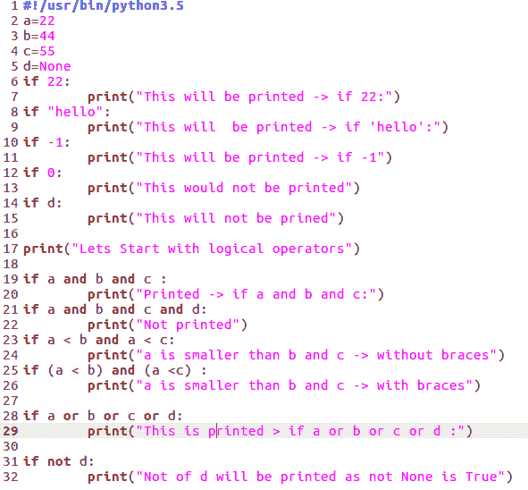

你可能已经注意到，在文件的开头，我们有一个语句，写着`#! /usr/bin/python3.5`。这意味着我们不必每次执行代码时都输入`python3.5`。它指示代码使用位于`/usr/bin/python3.5`的程序来执行它，每次作为可执行文件执行时。我们需要改变文件的权限使其可执行。这样做，然后按照以下方式执行代码：

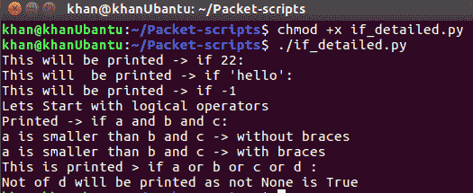

产生的输出是不言自明的。正如我之前提到的，任何不等于`0`、`False`、`None`或`empty`的东西都被视为`True`，并且执行`if`块。这解释了为什么前三个`if`条件被评估为`True`并且消息被打印出来，但第四个消息没有被打印。从第 19 行开始，我们使用了逻辑运算符。在 Python 中，合取操作由`and`运算符执行，这与我们在 C、C++和 Java 中使用的`&&`相同。对于短路布尔运算符，在 Python 中我们有`or`关键字，它与 C、C++和 Java 中的`||`相同。最后，`not`关键字在 Python 中提供否定，就像其他语言中的`!`一样。

应该注意，在 Python 中，`null`字节字符由保留关键字`None`表示，这与 Java 或 C#等语言中的`null`相同。

# `if...else`条件

`if...else`条件在任何其他语言中基本上是一样的。如果`if`条件评估为`True`值，那么缩进在`if`下面的代码块将被执行。否则，缩进在`else`块下面的代码块将被执行：

```py
a=44
b=66
if a > b:
    print("a is Greater") 
else:
    print("B is either Greater or Equal")
print("End")
```

让我们创建一个名为`if_else.py`的文件，并看看如何使用它：

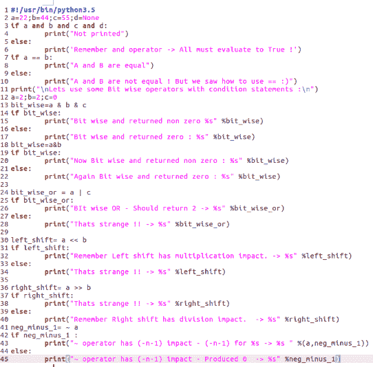

这里的输出也是不言自明的。在这段代码中，我们探讨了一些位运算符与`if...else`代码结构一起使用的情况。我们还使用了变量，这些变量将被打印出来。`%s`是一个占位符，并指定`%s`的值应该被字符串变量替换，其值将在字符串结束后立即出现。如果我们有多个值要替换，它们可以作为一个元组传递，如`%(val1,val2,val3)`：


# `if...elif`条件

`if...elif`梯，在其他编程语言中如 C、C++和 Java 中被称为**if...else if**，在 Python 中具有相同的功能。`if`条件让我们在代码的`else`部分旁边指定一个条件。只有条件为`true`时，才会执行条件语句后面的部分：

```py
a=44
b=66
if a > b:
    print("a is Greater") 
elif b > a:
    print("B is either Greater or Equal")
else:
    print("A and B are equal")
print("End")
```

必须注意的是，前面代码片段中的第三个`else`是可选的。即使我们不指定它，代码也能正常工作：

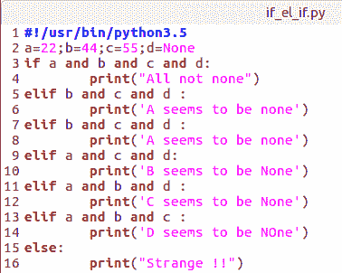

让我们创建一个名为`if_el_if.py`的文件，并看看它如何使用：


# 循环

**循环**是每种编程语言都具有的实用工具。借助循环，我们可以执行重复性的任务或语句，如果没有循环，将需要大量的代码行。这在某种程度上违背了首先拥有编程语言的目的。如果你熟悉 Java、C 或 C++，你可能已经遇到了`while`、`for`和`do...while`循环。Python 基本上是一样的，只是它不支持`do...while`循环。因此，我们将在下一节中学习的 Python 中的循环是以下的：

+   `while`循环

+   `for`循环

# while 循环

请记住，当我们在书的第一章讨论列表时，我们提到在 Python 中列表实际上可以包含异构数据类型。列表可以包含整数、字符串、字典、元组，甚至是嵌套列表。这个特性使得列表非常强大，非常容易和直观地使用。让我们看下面的例子：

```py
my_list=[1,"a",[1,2,3],{"k1":"v1"}]
my_list[0] -> 1
my_List[1] -> "a"
my_list[2] -> [1,2,3]
my_list[2][0] -> 1
my_list[2][2] -> 3
my_list[3] -> {"k1":"v1"}
my_list[3]["k1"] -> "v1"
my_list[3].get("k1") -> "v1
```

让我们通过以下代码更仔细地了解`while`循环，我们将其称为`while_loops.py`。我们还将看到如何使用`while`循环迭代列表：

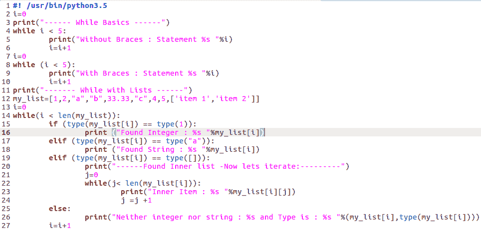

代码的第一部分，第 2 到 6 行，描述了`while`循环的简单用法，我们在其中打印了一个语句五次。请注意，为了执行循环指定的条件可以放在括号内或括号外，如第 7 到 10 行所示。

在第 12 行，我们声明了一个包含数字、字符串、浮点数和嵌套列表的列表。然后，在从第 14 行开始的最后一个`while`循环中，我们通过将循环控制变量设置为小于列表长度来迭代列表的元素。在循环中，我们检查列表变量的类型。`if`类型(`1`)返回一个整数类，类型(`a`)返回一个字符串类，类型(`[]`)返回一个列表类。当类型是列表时，我们再次在嵌套的`while`循环中迭代它的元素，并打印每一个，如第 19 到 24 行所示：

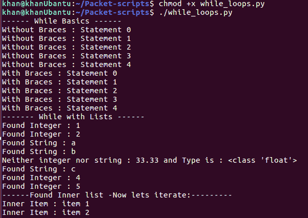

# for 循环

`for`循环在 Python 中被广泛使用，每当我们需要迭代不可改变的列表时，它都是默认选择。在继续使用`for`循环之前，让我们更仔细地了解 Python 中的**迭代**、**可迭代**和**迭代器**这些术语的含义。

# 迭代、可迭代和迭代器

**迭代**：迭代是一个过程，其中一组指令或结构按顺序重复指定次数，或直到满足条件。每次循环体执行时，都称为完成一次迭代。

**可迭代**：可迭代是一个具有`__iter__`方法的对象，它返回一个迭代器。迭代器是任何包含可以迭代的元素序列的对象，然后可以执行操作。Python 字符串、列表、元组、字典和集合都是可迭代的，因为它们实现了`__iter__`方法。看下面的代码片段，看一个例子：


在上面的代码片段中，我们声明了一个字符串`a`，并将值`hello`放入其中。要查看 Python 中任何对象的所有内置方法，我们可以使用`dir(<object>)`方法。对于字符串，这将返回可以在字符串类型上执行的所有操作和方法。在第二行，第 5 个操作是我们之前提到的`iter`方法。可以看到`iter(a)`返回一个字符串迭代器。


同样，列表对象的`iter`方法将返回一个列表迭代器，如前所示。

**迭代器**：迭代器是一个具有`__next__`方法的对象。`next`方法始终返回调用原始`iter()`方法的序列的`next`元素，从索引 0 开始。下面的代码片段中展示了这一点：


正如在字符串和列表的示例中所看到的，迭代器上的`next`方法总是返回我们迭代的序列或对象中的`next`元素。必须注意的是，迭代器只能向前移动，如果我们想让`iter_a`或`list_itr`返回到任何元素，我们必须重新将迭代器初始化为原始对象或序列：


# 更仔细地看一下 for 循环

Python 中的`for`循环超出了其他编程语言中`for`循环的能力。当调用诸如字符串、元组、列表、集合或字典等可迭代对象时，`for`循环内部调用`iter`来获取迭代器。然后，它调用`next`方法来获取可迭代对象中的实际元素。然后，它重复调用 next 直到引发`StopIteration`异常，然后它会在内部处理并将我们从循环中取出。`for`循环的语法如下所示：

```py
for var in iterable:
    statement 1
    statement 2
    statement n
```

让我们创建一个名为`for_loops.py`的文件，它将解释`for`循环的基本用法：


在前面的示例中，我们使用了 Python 的 range 函数/方法，它帮助我们实现了传统的`for`循环，我们在其他编程语言（如 C、C++或 Java）中学到的。这可能看起来像`for i =0 ;i < 5 ;i ++`。Python 中的 range 函数需要一个必需参数和两个默认参数。必需参数指定迭代的限制，并且从索引`0`开始，返回数字，直到达到限制，就像代码的第 3 和第 4 行所示的那样。当使用两个参数调用时，第一个参数作为范围的起点，最后一个作为终点，就像我们代码的第 7 和第 8 行所示的那样。最后，当使用三个参数调用`range`函数时，第三个参数作为步长，默认为 1。这在下面的输出和示例代码的第 12 和第 13 行中显示：

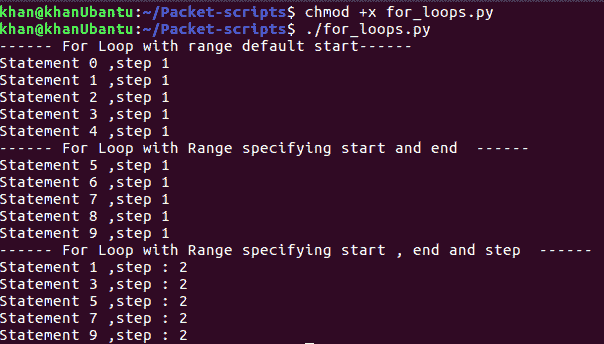

让我们看看另一个`for`循环的例子，我们将用它来迭代 Python 定义的所有可迭代对象。这将使我们能够探索`for`循环的真正威力。让我们创建一个名为`for_loops_ad.py`的文件：

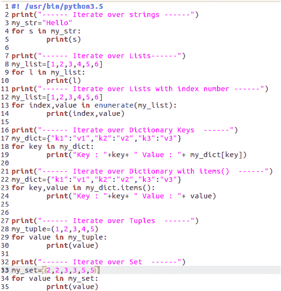

之前，我们看到了如何从列表、字符串和元组中读取值。在前面的示例中，我们使用`for`循环枚举字符串、列表和字典。我们之前了解到，`for`循环实际上调用可迭代对象的`iter`方法，然后为每次迭代调用`next`方法。这在下面的示例中显示：


当我们使用`for`循环迭代 Python 字典时，默认情况下会将字典键返回给我们。当我们在字典上使用`.items()`时，每次迭代都会返回一个元组，其中键在元组的第 0 个索引处，值在第一个索引处。

# Python 中的函数和方法

函数和方法用于设计或制作可以在脚本或其他脚本的整个过程中重复使用的逻辑代码单元。函数实际上构成了代码重用的基础，并为代码结构带来了模块化。它们使代码更清晰，更容易修改。

建议我们总是尝试将逻辑分解为小的代码单元，每个单元都是一个函数。我们应该尽量保持方法的大小在代码行方面尽可能小。

以下代码代表了在 Python 中定义方法的基本语法：

```py
def print_message(message):
    print(message)
    statement 2
    statement 
```

Python 方法在其定义中没有返回类型，就像您在 C、C++或 Java 中看到的那样，例如`void`、`in`、`float`等。Python 方法可能返回值，也可能不返回值，但我们不需要明确指定。方法在 Python 中非常强大和灵活。

应该注意到每个 Python 脚本的默认名称是`main`，并且它被放置在一个全局变量中，可以在整个 Python 上下文中访问，称为`__name__`。我们将在接下来的示例中使用它。

让我们探索使用我们的`method_basics.py`脚本调用方法的各种方式：

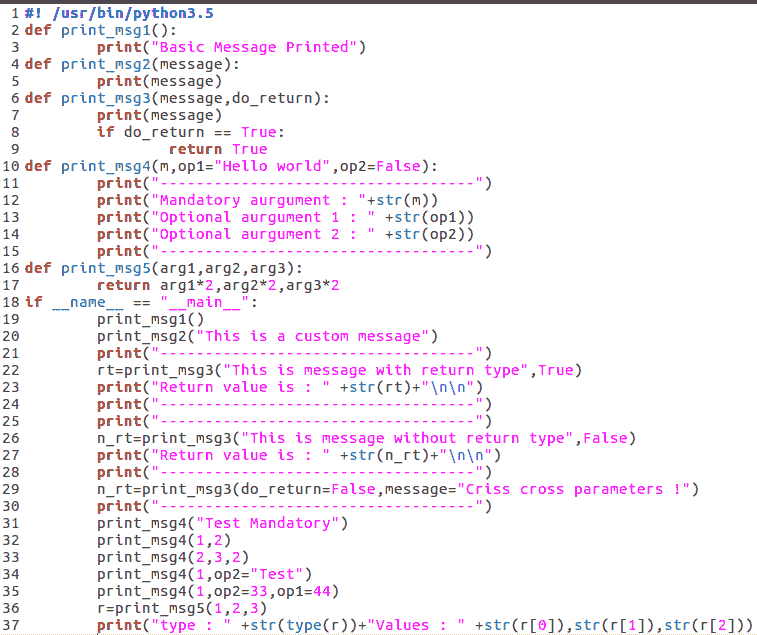

现在让我们将其分解成更小的部分，并尝试理解发生了什么：

+   `print_msg1()`: 这是一个基本的方法，只是在控制台上打印一个字符串。它在第 2 行定义，在第 19 行调用。

+   `print_msg2()`: 这是一个方法，接受变量消息作为参数，然后在屏幕上打印该变量的值。请记住，Python 变量不需要指定类型，因此我们可以将任何数据传递给`message`变量。这是一个接受单个参数的 Python 方法的示例。请记住，参数的类型是 Python 对象，它可以接受传递给它的任何值。输出可以在以下截图中看到：

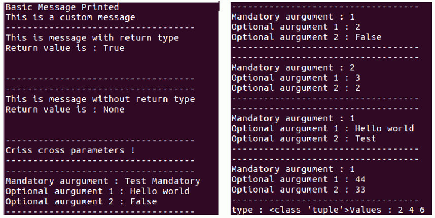

+   `print_msg3()`: 这是一个 Python 方法，接受两个参数。它类似于我们之前看到的`print_msg2()`方法。不同之处在于它有时可能会返回一个值。它的调用方式也不同。请注意，在第 22 行，我们通过将第二个参数传递为`True`来调用此方法。这意味着它返回一个值为`True`，但是我们在第 26 行不使用`True`作为第二个参数调用它，因此它不返回任何值。因此，我们在屏幕上得到`None`。在其他编程语言中，如 C、C++或 Java，调用方法时参数的顺序非常重要。这是因为我们传递参数的顺序应该与传递给方法的顺序相同。然而，在 Python 中，我们可以调用方法并在调用过程中传递命名参数。这意味着顺序并不重要，只要名称与方法参数的名称匹配即可。这在第 29 行中得到了体现，我们将消息作为第二个参数传递，即使它在方法定义中是第一个参数。这样做完全有效，如输出所示。

+   `print_msg4()`: 这是我们熟悉 Python 默认参数以及它们如何与方法一起使用的地方。默认参数是在声明方法时分配默认值的变量。如果调用者为此参数或变量传递了一个值，则默认值将被调用者传递的值覆盖。如果在调用过程中没有为默认参数传递值，则变量将保持其初始化的默认值。`print_msg4()`方法有一个必填参数`m`，和两个可选参数`op1`和`op2`。

+   `print_msg4('Test Mandatory')`: 这在第 31 行被调用。这表示必填参数应传递`Test mandatory`字符串，另外两个`op1`和`op2`变量将被初始化为默认值，如输出所示。

+   `print_msg4(1,2)`: 这在第 32 行被调用。这表示必填参数应传递一个带有`value=1`的整数，另一个带有`value=2`的整数应传递给`op1`。因此，`op1`的默认值将被覆盖。`op2`将保留默认值，因为没有传递值。

+   `print_msg4(2,3,2)`: 这在第 33 行被调用。这表示必填参数应传递一个带有`value=2`的整数，另一个带有`value=3`的整数应传递给`op1`，因此`op1`和`op2`的默认值将被覆盖。

+   `print_msg4(1,op2='Test')`: 这在第 34 行被调用。必填参数接收一个带有`value=1`的整数。对于第二个参数，在调用过程中我们指定了一个命名参数，因此`Test`的顺序对`op2`不重要，它将被复制到调用者的`op2`。

+   `print_msg4(1,op2=33,op1=44)`: 这在第 35 行被调用。必填参数接收`value=1`。对于第二个参数，我们指定了一个命名参数`op2`，对于第三个参数，我们传递了`op1`。同样，我们可以在输出中看到顺序并不重要。

+   `print_msg5()`: 通常，在其他编程语言中，函数或方法总是可以返回一个值。如果需要返回多个值，必须将这些值放入数组或另一个结构中，然后返回它们。Python 为我们抽象地处理了这种情况。如果你阅读代码，你可能会认为该方法返回了多个值，而实际上它返回的是一个元组，其中每个值都乘以了二。这可以从输出中验证。

让我们现在探索一些更进一步的方法和传递参数的方式，使用以下示例`methods_adv.py`。以下代码片段表示 Python 中的可变参数类型方法。从输出中可以验证，`method_1`接受任意大小的普通序列作为输入，这意味着我们可以向方法传递任意数量的参数。当方法声明为由`*`符号前缀的参数时，所有传递的参数都被转换为序列，并且一个元组对象被放置在`args`中。另一方面，当在调用方法时使用`*`与参数一起使用时，参数类型从序列中更改，内部将每个元素`if`序列作为单个参数传递给调用者，如`method_1_rev`中所示。

此外，当在方法声明中使用`if`与参数一起使用时，它会将所有命名参数内部转换为 Python 字典，键为名称，值为`=`运算符后的值。这可以在`method_2`中看到。最后，当`**`与调用者参数一起使用时，该参数会从 Python 字典内部转换为命名参数。这可以通过`method_2_rev`进行验证：

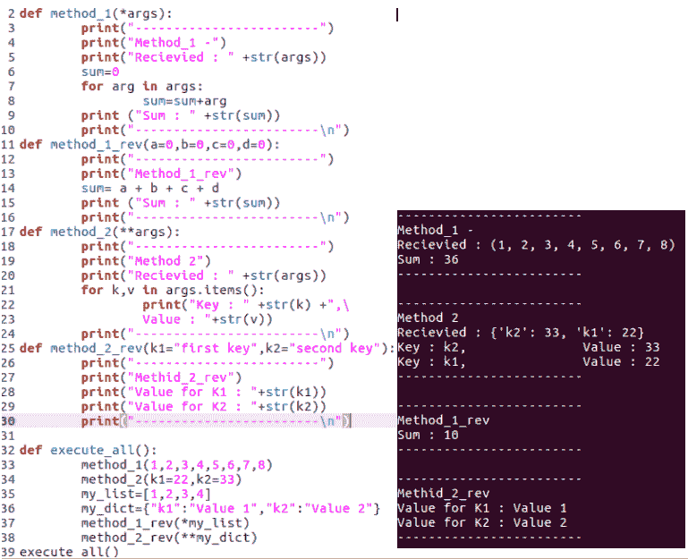

# 模块和包

每个 Python 脚本都被称为一个模块。Python 被设计为可重用和易于编码。因此，我们创建的每个 Python 文件都成为 Python 模块，并有资格在任何其他文件或脚本中被调用或使用。你可能已经学过在 Java 中如何导入类并与其他类一起重用。这里的想法基本上是一样的，只是我们将整个文件作为模块导入，我们可以重用导入文件的任何方法、类或变量。让我们看一个例子。我们将创建两个文件`child.py`和`parent.py`，并在每个文件中放置以下代码：

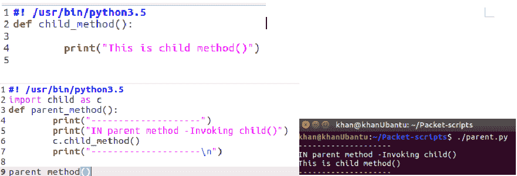

前五行属于`child.py`，最后八行属于`parent.py`。我们将运行父文件，如输出所示。应该注意的是，导入的文件可以被赋予别名。在我们的例子中，我们导入了 child 并给它起了别名 C。最后，我们从父 Python 脚本中调用了该模块的`child_method()`类。

让我们现在尝试探索 Python 包以及它们如何被使用。在 Java 中，包只是收集 Java 中逻辑连接的类文件的文件夹或目录。包在 Python 中也是如此；它们收集逻辑连接的 Python 模块。始终建议使用包，因为这样可以保持代码整洁，使其可重用和模块化。

如前所述，Python 包是一个普通的目录。唯一的区别是，为了使普通目录像 Python 包一样运行，我们必须在目录中放置一个空的`__init__.py`文件。这告诉 Python 应该使用哪些目录作为包。让我们继续创建一个名为`shapes`的包。我们将放置一个空的 Python 文件`__init__.py`和另一个名为`area_finder.py`的文件在其中：

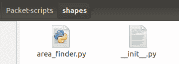

让我们现在把以下代码放在`area_finder.py`文件中。我们还要创建另一个名为`invoker.py`的文件，并将其放在我们创建的 shapes 文件夹之外。调用者的代码在下图的右侧，而`area_finder`的代码在左侧：


上面的代码是 Python 中如何使用包的一个简单示例。我们创建了一个名为`shapes`的包，并在其中放置了一个名为`area_finder`的文件，用于计算形状的面积。然后，我们继续创建了一个名为`invoker.py`的文件，放在`shapes`文件夹外，并以多种方式导入了包中的`area_finder`脚本（仅用于演示目的）。最后，我们使用其中一个别名来调用`find_area()`方法。

# 生成器和推导式

**生成器**是 Python 中一种特殊的迭代器。换句话说，Python 生成器是通过发出`yield`命令返回生成器迭代器的函数，可以进行迭代。可能会有一些情况，我们希望一个方法或函数返回一系列值，而不仅仅是一个值。例如，我们可能希望我们的方法部分执行任务，将部分结果返回给调用者，然后从上次返回最后一个值的地方恢复工作。通常，当方法终止或返回一个值时，它的执行会从头开始。这就是生成器试图解决的问题。生成器方法返回一个值和一个控制给调用者，然后从离开的地方继续执行。生成器方法是一个带有 yield 语句的普通 Python 方法。以下代码片段`generators.py`解释了如何使用生成器：


请注意，由于`genMethod`中有一个 yield 语句，它变成了一个生成器。每次执行 yield 语句时，"a"的值都会作为控制返回给调用者（记住生成器返回一系列值）。每次对生成器方法进行`next()`调用时，它都会从之前离开的地方恢复执行。

我们知道，每次执行 yield 时，生成器方法都会返回一个生成器迭代器。因此，与任何迭代器一样，我们可以使用`for`循环来迭代生成器方法。这个`for`循环会一直持续，直到它到达方法中的 yield 操作。使用`for`循环的相同示例如下：


你可能会想为什么我们要使用生成器，当相同的结果可以通过列表实现。生成器非常节省内存和空间。如果需要大量处理来生成值，使用生成器是有意义的，因为我们只根据需求生成值。

生成器表达式是可以产生生成器对象的一行表达式，可以进行迭代。这意味着可以实现相同的内存和处理优化。以下代码片段显示了如何使用生成器表达式：


# 推导式

**Python 推导式**，通常称为**列表推导式**，是 Python 中非常强大的实用工具，如果我们需要对列表的所有或部分元素执行一些操作，它会很方便。列表推导式将返回一个带有应用修改的新列表。假设我们有一个数字列表，我们想要对列表中的每个数字进行平方。

让我们看看解决这个问题的两种不同方法：


左侧的代码片段是更传统的方法，需要九行。使用推导式的相同代码只需要三行。列表推导式在方括号内声明，并对列表的每个元素执行任何操作。然后返回带有修改的新列表。让我们看另一个推导式的例子。这次，我们将使用一个`if`条件（称为推导式过滤器），以及带有推导式的嵌套循环。我们将命名文件为`list_comp_adv.py`，并输入以下代码：


前面的代码片段是不言自明的。它向我们展示了如何在推导式中使用`if`条件（第 4 行）。它还向我们展示了如何使用嵌套循环来累加两个列表（第 5 行）。最后，它向我们展示了如何在推导式中使用字典（第 6 行）。

# Map、Lambda、zip 和 filters

在本节中，我们将了解一些非常方便的 Python 函数。这些函数允许我们对 Python 可迭代对象（如列表）进行快速处理操作。

+   `Map()`: 正如我们之前看到的，当我们需要对列表中的所有或部分元素执行操作时，列表推导式非常方便。同样的操作也可以通过`map`函数实现。它接受两个参数，第一个是将对列表元素执行操作的函数，第二个是列表本身。以下示例`map_usage.py`演示了这一点：


+   `Lambda()`: Lambda 函数是小巧但功能强大的内联函数，可用于数据操作。它们对于小的操作非常有用，因为实现它们所需的代码很少。让我们再次看同一个示例，但这次我们将使用 Lambda 函数代替普通的 Python 函数：


+   `Zip()`: `zip`方法接受两个列表或可迭代对象，并在多个可迭代对象之间聚合元素。最后，它返回一个包含聚合的元组迭代器。让我们使用一个简单的代码`zip_.py`来演示这个函数：


+   `Filter()`: `filter`方法用于过滤出列表中满足特定条件的元素。`filter`方法接受两个参数，第一个是返回特定元素为`true`或`false`的方法或 Lambda 函数，第二个是该元素所属的列表或可迭代对象。它返回一个包含条件评估为`true`的元素的列表。让我们创建一个名为`filter_usage.py`的文件，并添加以下内容：


# 摘要

在本章中，我们讨论了条件、循环、方法、迭代器、包、生成器和推导式。所有这些在 Python 中被广泛使用。我们之所以涵盖这些主题，是因为当我们进入后面的自动化渗透测试和网络安全测试用例时，我们将看到这些概念在我们的代码文件中被广泛使用。在下一章中，我们将探讨 Python 的面向对象特性。我们将探讨如何在 Python 中处理 XML、CSV 和 JSON 数据。我们还将了解有关文件、IO 和正则表达式的内容。

# 问题

1.  举一个现实生活中使用生成器的用例。 

1.  我们可以将函数名称存储在变量中，然后通过变量调用它吗？

1.  我们可以将模块名称存储在变量中吗？

# 进一步阅读

+   生成器和推导式：[`jpt-pynotes.readthedocs.io/en/latest/generators-comprehensions.html`](http://jpt-pynotes.readthedocs.io/en/latest/generators-comprehensions.html)

+   模块：[`docs.python.org/3/tutorial/modules.html`](https://docs.python.org/3/tutorial/modules.html)
