# 概念处理

这一章将使我们熟悉 Python 中的各种面向对象的概念。我们将看到 Python 不仅可以用作脚本语言，而且还支持各种面向对象的原则，并且因此可以用来设计可重用和可扩展的软件组件。此外，我们还将探讨正则表达式、文件和其他基于 I/O 的访问，包括 JSON、CSV 和 XML。最后，我们将讨论异常处理。在本章中，我们将涵盖以下主题：

+   Python 中的面向对象编程

+   文件、目录和其他基于 I/O 的访问类型

+   Python 中的正则表达式

+   使用 XML、JSON 和 CSV 数据进行数据操作和解析

+   异常处理

# Python 中的面向对象编程

任何编程语言的面向对象特性都教会我们如何处理类和对象。对于 Python 也是如此。我们将要涵盖的一般面向对象特性包括：

+   类和对象

+   类关系：继承、组合、关联和聚合

+   抽象类

+   多态

+   静态、实例和类方法和变量

# 类和对象

**类**可以被认为是一个包含了方法和变量定义的模板或蓝图，用于与该类的对象一起使用。**对象**只是类的一个实例，其中包含实际值而不是变量。一个类也可以被定义为对象的集合。

简单来说，一个类是变量和方法的集合。方法实际上定义了类执行的行为或操作，而变量是操作所针对的实体。在 Python 中，使用 class 关键字声明类，后跟类名。以下示例显示了如何声明一个基本的员工类，以及一些方法和操作。让我们创建一个名为`Classes.py`的 Python 脚本：


以下项目符号解释了前面的代码及其结构：

+   `class Id_Generator()`：为了在 Python 中声明一个类，我们需要将其与 class 关键字关联起来，这就是我们在代码的第 2 行所做的。在等同缩进的情况下，`Id_Generator`类的内容是类的一部分。这个类的目的是为每个新创建的员工生成一个员工 ID。它使用`generate()`方法来实现这一点。

+   每个 Python 或任何其他编程语言中的类都有一个构造函数。这要么是显式声明的，要么没有声明，隐式地采用默认构造函数。如果你来自使用 Java 或 C++的背景，你可能习惯于构造函数的名称与类名相同，但这并不总是这样。在 Python 中，类构造方法是使用`__init__`单词定义的，并且它总是以`self`作为参数。

+   `self`：`self`类似于关键字。在 Python 中，`self`表示类的当前实例，并且在 Python 中，每个类方法都必须将`self`作为其第一个参数。这也适用于构造函数。值得注意的是，在调用实例方法时，我们不需要显式地将类的实例作为参数传递；Python 会隐式地为我们处理这个问题。任何实例级变量都必须使用`self`关键字声明。这可以在构造函数中看到——我们已经声明了一个实例变量 ID 为`self.id`并将其初始化为`0`。

+   `def generate(self)`：`generate`是一个实例方法，它递增 ID 并返回递增的 ID。

+   `class Employee()`：`employee`类是一个用于创建员工的类，它具有构造函数。它使用`printDetails`方法打印员工的详细信息。

+   **`def __init__(self,Name,id_gen)`**：构造函数有两种类型——带参数和不带参数。任何带参数的构造函数都是带参数的构造函数。在这里，`employee`类的构造函数是带参数的，因为它接受两个参数：要创建的员工的姓名和`Id_Generator`类的实例。在这个方法中，我们只是调用了`Id_Generator`类的`generate`方法，它会返回员工 ID。构造函数还将传递给`self`类实例变量的员工姓名`name`进行初始化。它还将其他变量`D_id`和`Salary`初始化为`None`。

+   **`def printDetails(self)`**：这是一个打印员工详细信息的方法。

+   24-32 行：在代码的这一部分，我们首先创建了`Id_Generator`类的实例并命名为`Id_gen`。然后，我们创建了`Employee`类的一个实例。请记住，类的构造函数在我们创建类的实例时被调用。由于在这种情况下构造函数是带参数的，我们必须创建一个带两个参数的实例，第一个参数是员工姓名，第二个参数是`Id_Generator`类的实例。这就是我们在第 25 行所做的：`emp1=Employee('Emp1',Id_gen)`。正如前面提到的，我们不需要显式传递`self`；Python 会隐式处理这个问题。之后，我们为`Emp1`实例的`Salary`和`D_id`实例变量赋一些值。我们还创建了另一个名为`Emp2`的员工，如第 28 行所示。最后，我们通过调用`emp1.printDetails()`和`emp2.printDetails()`来打印两个员工的详细信息。

# 类关系

面向对象编程语言最大的优势之一是代码重用。这种可重用性是由类之间存在的关系所支持的。面向对象编程通常支持四种关系：继承、关联、组合和聚合。所有这些关系都基于**is-a**、**has-a**和**part-of**关系。

# 继承

类继承是一个功能，我们可以使用它来扩展类的功能，通过重用另一个类的能力。继承强烈促进了代码的重用。举个简单的继承例子，假设我们有一个`Car`类。车辆类的一般属性包括`category`（如 SUV、运动型、轿车或掀背车）、`mileage`、`capacity`和`brand`。现在假设我们有另一个名为`Ferrari`的类，除了普通汽车的特征外，还具有特定于跑车的额外特征，如`Horsepower`、`Topspeed`、`Acceleration`和`PowerOutput`。在这种情况下，我们在两个类之间建立了继承关系。这种关系是子类和基类之间的**is-a**关系。我们知道 Ferrari 是一辆车。在这种情况下，汽车是基类，Ferrari 是子类，它从父类继承了通用汽车属性，并具有自己的扩展特征。让我们扩展我们之前讨论的例子，我们创建了一个`Employee`类。现在我们将创建另一个名为`Programmer`的类，并看看如何在两者之间建立继承关系：


以下几点解释了前面的代码及其结构：

+   `Class Programmer(Employee)`：在前面的情况下，我们创建了另一个名为`Programmer`的类，它继承自`Employee`基类。`Programmer`和`Employee`之间存在**is a**关系。除了`Employee`类的所有变量和方法外，`Programmer`类还定义了一些自己的变量和方法，如语言、数据库、项目和其他技能。

+   **`def __init__(self,name,id_gen,lang,db,projects,**add_skills)`**：`Programmer`类的`init`方法接受一些自解释的参数。请注意(`Employee`类) `super().__init__()` 超类构造函数的调用，位于第 32 行。在其他高级语言如 Java 和 C++中，我们知道基类或超类构造函数会自动从子类构造函数中调用，当没有指定时，这是隐式从子类构造函数中执行的第一个语句。但在 Python 中并非如此。基类构造函数不会从子类构造函数中隐式调用，我们必须使用 super 关键字显式调用它，就像在第 32 行中看到的那样。

+   **`def printSkillDetails(self)`**：这是帮助我们探索继承力量的方法。我们在这个方法中使用了基类的变量（`iD`，`name`和`salary`），以及一些特定于`Programmer`类的变量。这显示了如何使用继承来重用代码并得到一个**是一个**关系。

+   第 52-62 行：最后，我们创建了`Programmer`类的一个实例并调用了`printSkillDetails`方法。

# Python 中的访问修饰符

在 Python 中，我们没有像 Java 和 C++中那样的访问修饰符。然而，有一种部分解决方法可以用来指示哪些变量是`公共的`，`受保护的`和`私有的`。这里的**指示**一词很重要；Python 并不阻止使用受保护或私有成员，它只是指示成员是哪个。让我们看一个例子。创建一个名为`AccessSpecifiers.py`的类：

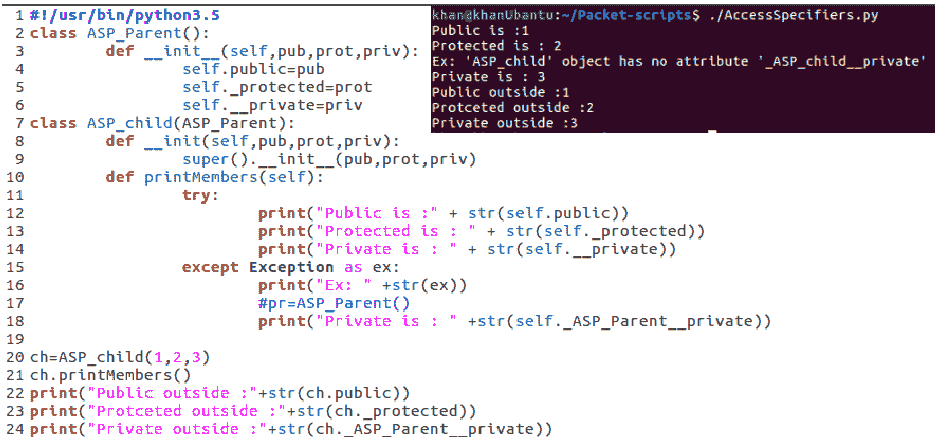

上面的例子向我们展示了如何在 Python 中使用访问限定符。在类中简单声明的任何变量默认为公共，就像我们声明的`self.public`一样。Python 中的受保护变量是通过在它们前面加下划线(`_`)来声明的，就像第 5 行中看到的`self._protected`一样。但必须注意的是，这并不能阻止任何人使用它们，就像在第 23 行中看到的那样，我们在类外部使用了受保护成员。Python 中的私有成员是通过在它们前面加双下划线(`__`)来声明的，就像第 6 行中看到的`self.__private`一样。然而，同样地，没有任何东西可以阻止这个成员在类外部被使用。然而，访问它们的方式有点不同；对于私有成员，如果它们要在类外部被访问，会遵循一个特定的约定：`instance._<className><memberName>`。这被称为**名称修饰**。

我们在这里学到的关于 Python 中访问修饰符的知识是，Python 确实有符号来表示类的公共、私有和受保护成员，但它没有任何方式让成员在其范围之外被使用，因此这仅仅是用于标识目的。

# 组合

面向对象编程中的**组合**表示类之间的**部分**关系。在这种关系中，一个类是另一个类的一部分。让我们考虑以下示例`Composition.py`，以了解类之间的组合关系：

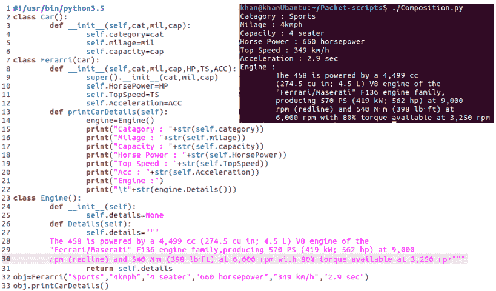

在上面的例子中，法拉利汽车和发动机之间的关系是组合类型。这是因为发动机是汽车的一部分，而汽车是法拉利类型的。

# 关联

关联关系维护了类的对象之间的**拥有**关系。**拥有**关系可以是一对一，也可以是一对多。在下面的例子中，我们可以看到`Employee`和`Manager`类之间存在一对一的关联关系，因为一个`Employee`只会有一个`Manager`类。我们还有一个`Employee`和`Department`之间的一对一关联关系。这些关系的反向将是一对多的关系，因为一个`Department`类可能有很多员工，一个经理可能有很多员工报告给他们。以下代码片段描述了关联关系：


# 聚合

聚合关系是一种特殊的**拥有**关系，它总是单向的。它也被称为单向关联关系。例如，`Employee`和`Address`之间的关系是单向关联，因为员工总是有地址，但反过来并不总是成立。以下示例描述了`Employee`和`Address`之间的聚合关系：

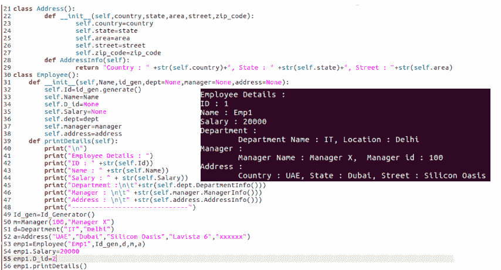

# 抽象类

有许多情况下，我们可能希望部分实现一个类，使得该类通过模板定义其目标，并且还定义了它必须如何通过一些已实现的方法获取其目标的一部分。类目标的剩余部分可以留给子类来实现，这是强制性的。为了实现这样的用例，我们使用抽象类。抽象基类，通常称为`abc`类，是一个包含抽象方法的类。抽象方法是一种没有实现的方法。它只包含声明，并且应该在实现或继承抽象类的类中实现。

关于抽象类的一些重要要点包括以下内容：

+   在 Python 中，抽象方法是使用`@abstractmethod`装饰器声明的。

+   虽然抽象类可以包含抽象方法，但没有任何阻止抽象类同时拥有普通或非抽象方法的限制。

+   抽象类不能被实例化。

+   抽象类的子类必须实现基类的所有抽象方法。如果没有这样做，它就无法被实例化。

+   如果抽象类的子类没有实现抽象方法，它将自动成为一个抽象类，然后可以由另一个类进一步扩展。

+   Python 中的抽象类是使用`abc`模块实现的。

让我们创建一个名为`Abstract.py`的类，并看看如何在 Python 中使用抽象类：


在上面的例子中，我们创建了一个名为`QueueAbs`的抽象类，它继承自名为`ABC`的抽象基类。该类有两个抽象方法，`enqueue`和`dequeue`，还有一个名为`printItems()`的具体方法。然后，我们创建了一个名为`Queue`的类，它是`QueueAbs`抽象基类的子类，并实现了`enqueue`和`dequeue`方法。最后，我们创建了`Queue`类的实例并调用了方法，如前所示。

值得记住的一件事是，在 Java 和 C#中，抽象类不能实现抽象方法。但在 Python 中不是这样。在 Python 中，抽象方法可能有默认实现，也可能没有，但这并不妨碍子类对其进行重写。无论抽象类方法是否有实现，子类都必须对其进行重写。

# 多态

多态性是指一个实体可以存在多种形式的属性。在编程方面，它指的是创建一个可以与多个对象或实体一起使用的结构或方法。在 Python 中，多态性可以通过以下方式实现：

+   函数多态性

+   类多态性（抽象类）

# 函数多态性

让我们考虑两个类，`Ferrari`和`McLaren`。假设两者都有一个返回汽车最高速度的`Speed()`方法。让我们思考在这种情况下如何使用函数多态性。让我们创建一个名为`Poly_functions.py`的文件：

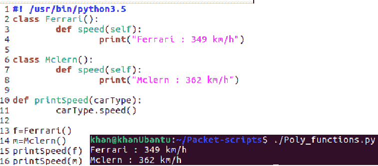

我们可以看到我们有两个类，`Ferrari`和`McLaren`。两者都有一个打印两辆车速度的共同速度方法。一种方法是创建两个类的实例，并使用每个实例调用打印速度方法。另一种方法是创建一个接受类实例并在接收到的实例上调用速度方法的公共方法。这就是我们在第 10 行定义的多态`printSpeed(carType)`函数。

# 类多态性（抽象类）

也许有时我们希望根据类必须做什么来定义类的模板，而不是如何做到这一点 - 我们希望将这留给类的实现。这就是我们可以使用抽象类的地方。让我们创建一个名为`Poly_class.py`的脚本，并添加以下代码：

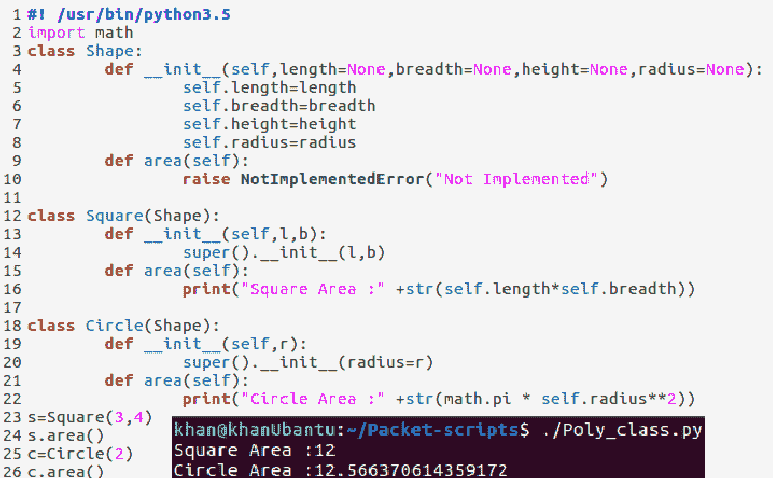

可以看到我们有一个名为`Shape`的抽象类，它有一个`area`方法。`area`方法在这个类中没有实现，但会在子类中实现。`Square`和`Circle`子类重写了`area`方法。`area`方法是多态的，这意味着如果一个正方形重写它，它实现了正方形的面积，当`Circle`类重写它时，它实现了圆的面积。

# Python 中的静态、实例和类方法

在 Python 类中可以定义三种方法。到目前为止，我们大部分时间都在处理实例方法，我们已经使用我们的 Python 类实例调用了它们：

+   **实例方法和变量：** 在 Python 类中定义的任何方法，使用类的实例调用，以 self 作为其第一个位置参数，被称为实例方法。实例方法能够访问类的实例变量和其他实例方法。使用`self.__class__`构造，它也能够访问类级别的变量和方法。另一方面，实例变量是在 Python 类中使用`self`关键字声明的任何变量。

+   **类方法和变量：** 使用`@classmethod` Python 装饰器声明的任何方法都被称为类方法。类方法也可以在没有`@classmethod`装饰器的情况下声明。如果是这种情况，必须使用类名调用它。类方法只能访问在类级别标记或声明的变量，并且不能访问对象或实例级别的类变量。另一方面，类变量可以在任何方法之外声明。在类内部，我们必须在不使用 self 关键字的情况下声明变量。因此，类变量和方法在某种程度上类似于我们在 Java 中学习的静态方法和变量，但有一个陷阱，如下所述：

在 Java 和 C#中，我们知道静态变量不能通过类的实例访问。在 Python 中，静态变量是类级变量，实际上可以通过类的实例访问。但是访问是只读访问，这意味着每当使用类的实例访问类级变量并且实例尝试修改或更新它时，Python 会自动创建一个同名的变量副本并将其分配给类的这个实例。这意味着下次使用相同实例访问变量时，它将隐藏类级变量，并提供对新创建的实例级副本的访问。

+   **静态方法：** 在 Python 类中使用`@staticmethod`装饰器声明的任何方法都被称为静态方法。Python 中的静态方法与我们在 Java 和 C#中看到的不同。静态级别的方法无法访问实例或对象级别的变量，也无法访问类级别的变量。

让我们以一个名为`Class_methods.py`的示例来进一步解释：


以下是前面代码的延续：


前面的代码片段解释了静态、实例和类方法的用法。每当类方法由类的实例调用时，Python 会在内部自动将实例类型转换为类类型，这可以在第 42 行看到。

输出如下截图所示：

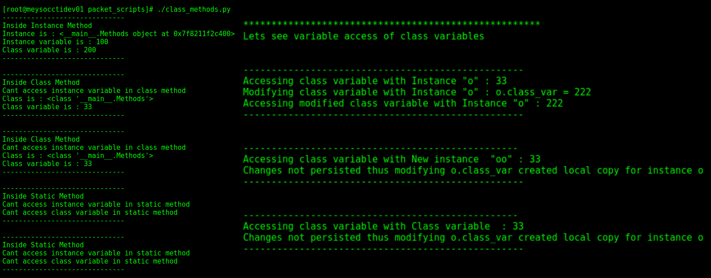

# 文件、目录和 I/O 访问

与其他编程语言一样，Python 提供了一个强大且易于使用的接口来处理 I/O、文件和目录。我们将在接下来的章节中更详细地探讨这些内容。

# 文件访问和操作

我们可以在 Python 中读取、写入和更新文件。Python 有一个`open`结构，可以用来提供文件操作。当我们打开一个文件时，可以以各种模式打开该文件，如下所示：

+   `r`：读取模式，这以文本模式读取文件（默认）。

+   `rb`：这以二进制模式读取文件。

+   `r+`：这以读取和写入模式读取文件。

+   `rb`：这以二进制模式打开文件进行读取和写入。

+   `w`：这仅以写入模式打开文件。它会覆盖现有文件。

+   `wb`：这以二进制模式打开文件进行写入。它会覆盖现有文件。

+   `w+`：这以写入和读取模式打开文件。它会覆盖现有文件。

+   `wb+`：这以二进制模式打开文件进行读取和写入。它会覆盖现有文件。

+   `a`：这以追加模式打开文件，并在文件不存在时创建文件。

+   `ab`：这以追加二进制模式打开文件，并在文件不存在时创建文件。

+   `a+`：这以追加和读取模式打开文件，并在文件不存在时创建文件。

+   `ab+`：这以追加读取二进制模式打开文件，并在文件不存在时创建文件。

在以下代码块中，`open`方法调用的第一个参数是要打开的文件的路径。第二个参数是文件打开的`mode`，第三个是可选的缓冲参数，指定文件的期望`buffer`大小：`0`表示无缓冲，`1`表示行缓冲，任何其他正值表示使用大约该大小的缓冲（以字节为单位）。负缓冲表示应使用系统默认值。对于 tty 设备，通常是行缓冲，对于其他文件，通常是完全缓冲。如果省略，将使用系统默认值。

```py
open("filepath","mode",buffer)
```

通过缓冲，我们不是直接从操作系统的原始文件表示中读取（这样会有很高的延迟），而是将文件读入操作系统缓冲区，然后从那里读取。这样做的好处是，如果我们有一个文件存在于共享网络上，并且我们的目标是每 10 毫秒读取一次文件。我们可以将其加载到缓冲区中，然后从那里读取，而不是每次都从网络中读取，这将是昂贵的。

看一下`File_access.py`文件中的以下片段以了解更多：

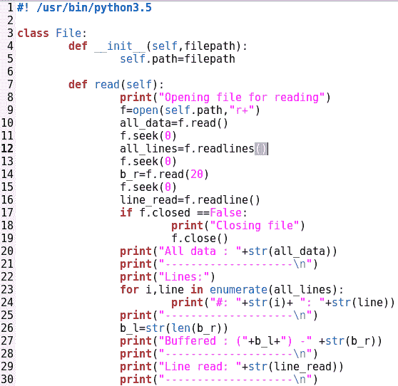

前面截图中的代码片段来自`File_access.py`文件，解释了如何在 Python 中使用文件。`File`类的`read()`方法接受文件路径，如果没有给出整个路径，则假定当前工作目录是起始路径。在文件实例上调用的`read()`方法将整个文件读入程序变量。`read(20)`将从当前文件指针位置加载 20 个字节的文件。当我们处理大文件时，这非常方便。

`readlines()`方法返回一个列表，每个条目都指向文件的一行。`readline()`方法返回文件的当前行。`seek()`方法将文件指针移到参数中指定的位置。因此，每当我们执行`seek(0)`时，文件指针都会指向文件的开头：


# 重命名和删除文件以及访问目录

在 Python 中，对文件目录和各种其他操作系统命令的系统级访问是由`os`模块提供的。`os`模块是一个非常强大的实用程序。在本节中，我们将看到它在重命名、删除、创建和访问目录方面的一些用法，借助`os_directories.py`文件中的以下片段：

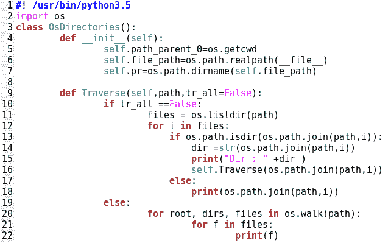

前面截图中的代码片段展示了在 Python 中使用`os`模块与文件和目录一起使用的各种方式，以重命名和删除文件以及创建和更改目录。它还向我们展示了如何重命名和遍历所有文件（包括嵌套文件）从一个子文件夹。需要注意的是，如果我们想要删除一个文件夹，我们可以使用`os.rmdir()`方法，但是文件夹中的所有文件都应该被显式删除才能使其工作：

+   以下输出显示了文件在创建前后的变化：


+   以下输出显示了文件名的更改：

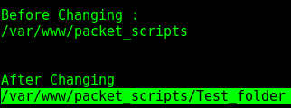

+   以下输出显示了文件被删除后的变化：


# 控制台 I/O

到目前为止，我们已经处理了大部分以硬编码数据作为输入的 Python 程序。让我们看看如何在 Python 中从用户那里获取输入并在我们的代码中使用。我们将创建一个名为`user_input.py`的文件：

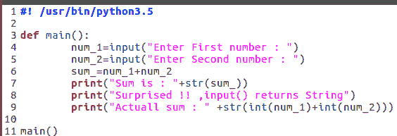

这是相当不言自明的。为了获取用户输入，我们使用`input()`方法，它会暂停屏幕，直到用户提供输入。它总是返回一个字符串：


# Python 中的正则表达式

**正则表达式**非常强大，在网络安全领域被广泛用于模式匹配，无论是处理解析日志文件、Qualys 或 Nessus 报告，还是 Metasploit、NSE 或任何其他服务扫描或利用脚本生成的输出。Python 中提供对正则表达式支持的模块是`re`。我们将使用 Python 正则表达式（`re`模块）的一些重要方法，如下所述：

| `match()` | 这确定正则表达式是否在字符串开头找到匹配项`re.match(pattern,string,Flag=0)`。标志可以用`&#124;`或操作符指定。最常用的标志是`re.Ignore-Case`，`re.Multiline`和`re.DOTALL`。这些标志可以用或操作符指定为(`re.M&#124; re.I`)。 |
| --- | --- |
| `search()` | 与 match 不同，search 不仅在字符串开头寻找匹配项，而是在整个字符串中搜索或遍历以寻找给定的搜索字符串/正则表达式，可以指定为`re.search(pattern,string,Flag=0)`。 |
| `findall()` | 这在字符串中搜索正则表达式匹配项，并返回所有子字符串作为列表，无论它在哪里找到匹配项。 |
| `group()` | 如果找到匹配项，则`group()`返回正则表达式匹配的字符串。 |
| `start()` | 如果找到匹配项，则`start()`返回匹配项的起始位置。 |
| `end()` | 如果找到匹配项，则`end()`返回匹配项的结束位置。 |
| `span()` | 如果找到匹配项，则`span()`返回一个包含匹配项的起始和结束位置的元组。 |
| `split()` | 这根据正则表达式匹配来拆分字符串，并返回一个列表。 |
| `sub()` | 这用于字符串替换。它会替换所有子字符串的匹配项。如果找不到匹配项，则返回一个新字符串。 |
| `subn()` | 这用于字符串替换。它会替换所有子字符串的匹配项。返回类型是一个元组，新字符串在索引 0 处，替换的数量在索引 1 处。 |

现在我们将尝试通过`regular_expressions.py`脚本中的以下片段来理解正则表达式：

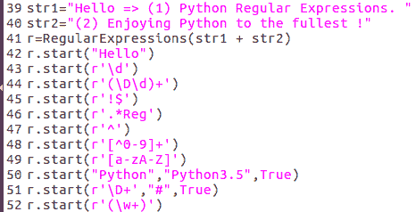

`match`和`search`之间的区别在于，`match`只在字符串开头搜索模式，而`search`则在整个输入字符串中搜索。代码行 42 和 50 产生的输出将说明这一点：

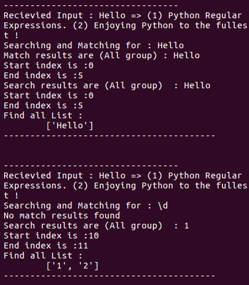

在前面的屏幕中，可以看到当输入`Hello`时，`match`和`search`都能够定位到字符串。然而，当输入为`\d`时，表示任何十进制数，`match`无法定位，但`search`可以。这是因为`search`方法在整个字符串中搜索，而不仅仅是开头。

同样，可以从以下截图中看到，`match`没有返回数字和非数字的分组，但`search`有。

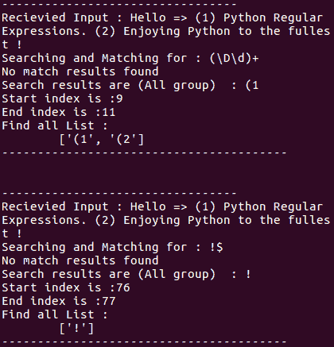

在以下输出中，搜索了`Reg`关键字，因此`match`和`search`都返回了结果：


注意，在下面的截图中，`findall()`与`match`和`search`不同：

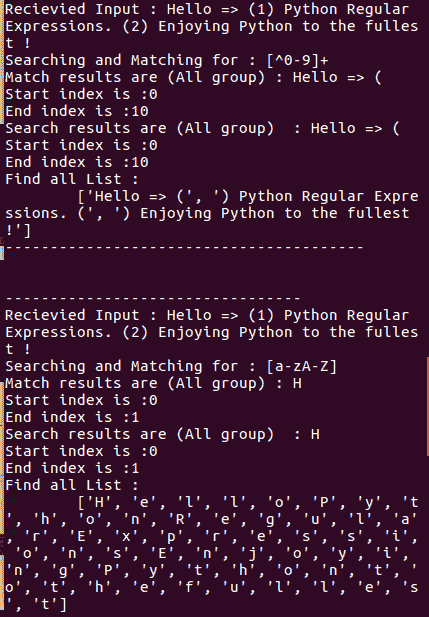

这些例子已经展示了`match()`和`search()`的不同操作方式，以及`search()`在执行搜索操作时更加强大：

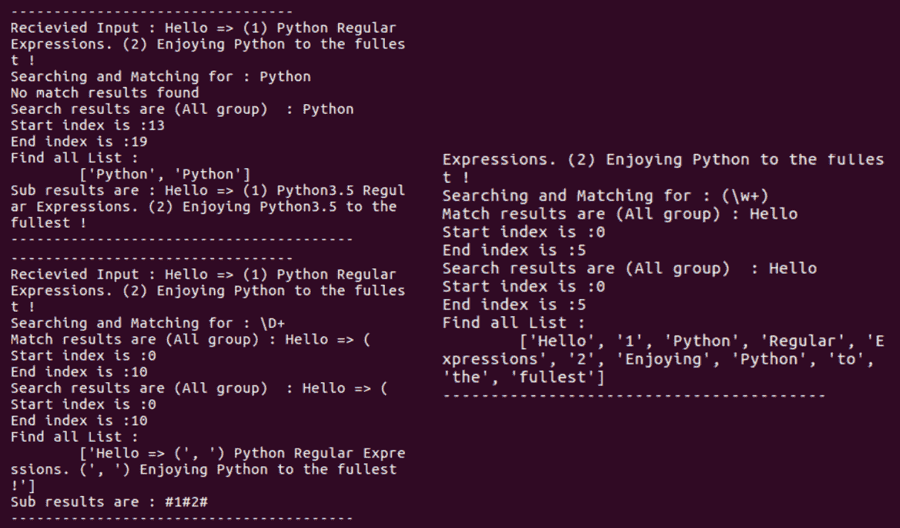

让我们来看一下 Python 中一些重要的正则表达式：

| **正则表达式** | **描述** |
| --- | --- |
| `\d` | 这匹配字符串中的零到九的数字。 |
| `(\D\d)` | 这匹配了`\D`非数字和`\d`数字，它们被分组在一起。括号(`()`)用于分组。 |
| `.*string.*` | 如果在字符串中找到一个单词，不管它前面和后面是什么，都会返回一个匹配项。`.*`符号表示任何东西。 |
| `^` | 尖号符号表示它匹配字符串的开头。 |
| `[a-zA-Z0-9]` | `[...]`用于匹配放在大括号内的任何内容。例如，`[12345]`表示应该找到介于一和五之间的任何数字的匹配项。`[a-zA-Z0-9]`表示应该将所有字母数字字符视为匹配项。 |
| `\w` | `\w`与`[a-zA-Z0-9_]`相同，匹配所有字母数字字符。 |
| `\W` | `\W`是`\w`的否定形式，匹配所有非字母数字字符。 |
| `\D` | `\D`是`\d`的否定形式，匹配所有不是数字的字符。 |
| `[^a-z]` | `^`，当放置在`[]`内时，作为否定形式。在这种情况下，它意味着匹配除了`a`到`z`之间的字母以外的任何内容。 |
| `re{n}` | 这意味着精确匹配前面表达式的`n`次出现。 |
| `re{n ,}` | 这意味着匹配前面表达式的`n`次或更多次出现。 |
| `re {n,m}` | 这意味着匹配前面表达式的最少`n`次和最多`m`次出现。 |
| `\s` | 这意味着匹配空格字符。 |
| `[T&#124;t]est` | 这意味着匹配`Test`和`test`。 |
| `re*` | 这意味着匹配`*`后面的表达式的任何出现。 |
| `re?` | 这意味着匹配`?`后面的表达式的任何出现。 |
| `re+` | 这意味着匹配`+`后面的表达式的任何出现。 |

# 使用 XML、JSON 和 CSV 数据进行数据操作和解析

在本节中，我们将首先看看如何在 Python 中操作 XML 数据，然后看看如何操作 JSON 数据。之后，我们将重点介绍 CSV 的 pandas Python 实用程序。

# XML 数据操作

在本节中，我们将看看如何在 Python 中操作 XML 数据。虽然有许多方法可以解析 Python 中的 XML 文档，但简单且最常用的方法是使用`XML.etree`模块。让我们看看以下示例，它将说明在 Python 中解析 XML 文档和字符串是多么简单和容易。创建一个名为`xml_parser.py`的脚本。我们将使用一个名为`exmployees.xml`的 XML 文档：

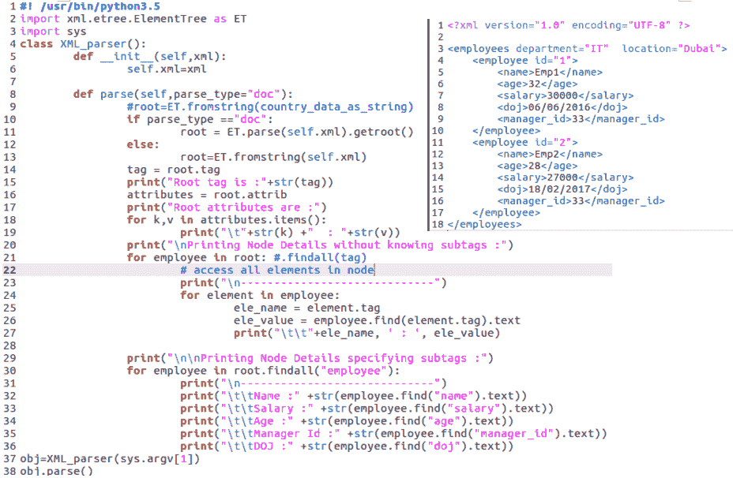

正如前面的例子中所示，我们简单地使用`xml.etree.ElementTree`模块，并将其别名为 ET。在类的解析方法中，我们通过调用`parse`方法（在前一种情况下）或`fromstring`方法（在后一种情况下）来提取 XML 文档或 XML 字符串的根。这将返回`<class 'xml.etree.ElementTree.Element'>` ET 元素类的实例。我们可以遍历它以获取所有子节点，如从第 21 行到第 26 行所示。如果我们不知道节点的属性名称，类的`attrib`属性返回一个字典，其中包含属性名称和其值的键值映射。如果我们知道子节点的名称，我们可以遵循第二种方法，如从第 29 行到第 36 行所示，其中我们指定节点的名称。

如果我们传递的是 XML 字符串而不是文件，则唯一的变化在于初始化根元素的方式；其余部分保持不变。关于此脚本的另一点要注意的是，我们使用了命令行参数。`sys.argv[]`用于访问这些命令行参数，文件的 0 索引具有脚本本身的名称，从索引 1 开始是参数。在我们的示例中，XML 文件的名称作为命令行参数传递给脚本，并使用`sys.argv[1]`属性进行访问。如下所示：

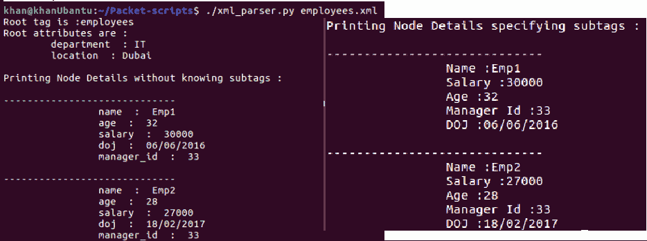

# JSON 数据操作

现在让我们看看如何使用 Python 操作 JSON 数据。 JSON（JavaScript 对象表示）是一种非常广泛使用的数据存储和交换格式。随着互联网的成熟，它变得越来越受欢迎，并成为基于 REST 的 API 或服务中信息交换的标准。

Python 为我们提供了一个用于 JSON 数据操作的 JSON 模块。让我们创建一个名为`employees.json`的 JSON 文件，并查看如何使用 JSON 模块访问 JSON 内容。假设我们的目标是读取员工数据，然后找出工资超过 30,000 的员工，并用`A`级标记他们。然后我们将那些工资低于 30,000 的员工标记为`B`级：

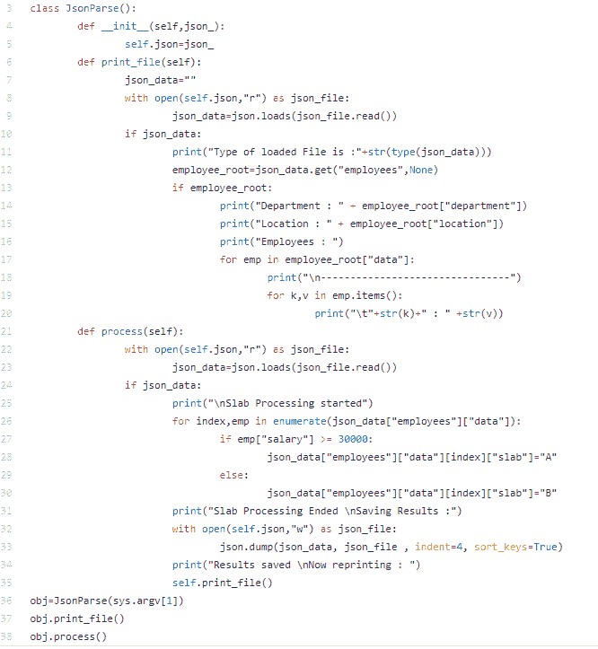

获得的输出如下截图所示：

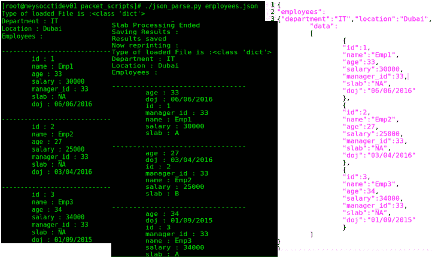

从前面的代码可以推断出，JSON 文件被加载为 Python 字典，可以通过`json.load()`命令实现。`load()`方法期望提供 JSON 文件路径作为参数。如果 JSON 数据不是作为外部文件而是作为 Python 字符串存在，我们可以使用`json.loads()`方法，并将 JSON 字符串作为参数传递。这将再次将字符串转换为 Python 本机类型，可能是列表或字典。如下所示：

```py
>>> a='{"k1":"v1"}'
>>> d=json.loads(a)
>>> type(d)
<class 'dict'
```

在`json_parse.py`文件中，第 10 到 20 行简单地迭代 Python 字典和内部列表，并显示员工详细信息。这是我们之前见过的。脚本的目标实际上是更新员工的工资档次，这是在`process()`方法中实现的。我们再次打开并加载 JSON 文件到 Python 本机类型（第 23 行）。然后，我们迭代 Python 字典。在第 27 行，我们检查员工的工资是否大于或等于 30,000。如果是，我们修改员工的档次，通过修改加载所有详细信息的原始`json_data`对象。`json_data["employees"]["data"][index]["slab"]`语句将指向当前员工的档次，确定他们的工资是多还是少于 30,000，并将其设置为`A`或`B`。最后，我们将在`json_data`对象中得到修改后的员工详细信息，并使用`json.dump()方法`覆盖原始 JSON 文件的内容。这将把 Python 本机对象（列表、字典或元组）转换为其 JSON 等效形式。它将`file_object`作为第二个参数，指示 JSON 数据必须放在哪里。它还接受格式选项，如`indent`、`sort_keys`等。同样，我们还有一个`json.dumps()`方法，它将 Python 本机类型转换为其 JSON 字符串等效形式。如下所示：

```py
>>> json.dumps({"k1":"v1"})
'{"k1": "v1"}'
```

应该记住，外部 JSON 文件不能在原地修改。换句话说，我们不能修改外部 JSON 文件的一部分，然后保持其余部分不变。在这种情况下，我们需要用新内容覆盖整个文件。

# CSV

**CSV 数据**在网络安全和数据科学领域被广泛使用，无论是作为日志文件的形式，作为 Nessus 或 Qualys 报告的输出（以 Excel 格式），还是用于机器学习的大型数据集。Python 提供了内置的 CSV 模块对 CSV 文件提供了出色的支持。在本节中，我们将探讨这个模块，并关注 CSV 的 pandas Python 实用程序。

让我们首先看一下 Python 提供的内置 CSV 模块。下面的代码片段，名为`csv_parser.py`，演示了这个模块：

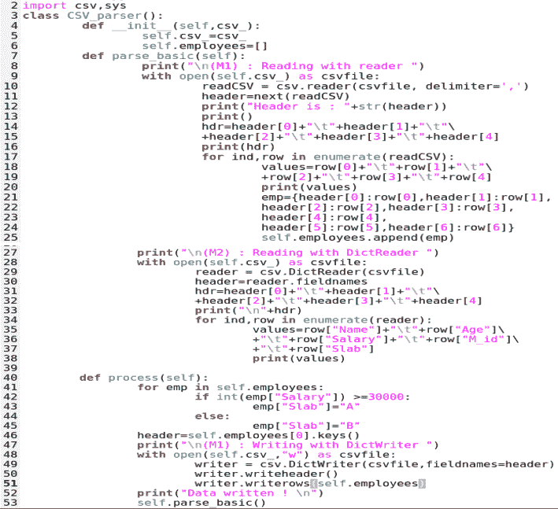

前面的代码帮助我们了解如何使用 CSV 模块在 Python 中读取 CSV 文件。建议始终使用 CSV 模块，因为它内部处理分隔符、换行符和字符。有两种从 CSV 文件中读取数据的方法，第一种是使用`csv.reader()`方法（第 10-25 行），它返回一个 CSV 字符串列表。列表的每一行或项将是表示 CSV 文件一行的字符串列表，可以通过索引访问每个项。另一种读取 CSV 文件的方法是使用`csv.DictReader()`（第 29-38 行），它返回一个字典列表。每个字典将具有一个键值对，键表示 CSV 列，值是实际的行值。

产生的输出如下所示：


为了写入 CSV 文件，有两种不同的方法。一种方法是使用`csv.DictWriter()`指令，它返回一个 writer 对象，并且具有将 Python 列表或字典直接推送到 CSV 文件的能力。当我们在列表或字典上调用`writerows()`方法时，这将在内部将 Python 列表或字典转换为 CSV 格式。这在第 40-53 行中展示：我们检查员工的薪水，将适当的分级与之关联，最后使用`writerows()`方法覆盖修改后的 CSV 文件。`csv.DictWriter()`支持`writerows()`和`write row()`方法。`writerows()`方法将简单地获取一个字典并将其写入 CSV 文件。

写入 CSV 文件的第二种方法是使用`csv.Writer()`方法。这将返回一个 writer 对象，该对象将以列表的形式作为`writerows()`方法的参数，并将结构写入外部 CSV 文件。这两种方法的示例如下屏幕截图所示：


虽然前面介绍的访问和处理 CSV 文件的方法很好，但如果 CSV 文件非常大，这些方法就不适用了。如果 CSV 文件大小为 10GB，系统的 RAM 只有 4GB，那么`csv.reader()`或`csv.DictReader()`都无法很好地工作。这是因为`reader()`和`DictReader()`都会将外部 CSV 文件完全读入变量程序内存中，也就是 RAM。对于一个巨大的文件，直接使用 CSV 模块是不可取的。

另一种方法是使用迭代器或按字节块读取文件，如下面的屏幕截图所示：

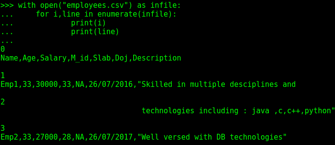

前面的代码片段不会将整个文件加载到内存中，而是一次读取一行。这样，我们可以处理和存储该行到数据库中，或执行任何相关操作。由于文件是逐行读取的，如果我们有多行的 CSV 数据，这将会造成麻烦。正如我们在前面的示例中看到的，`Emp1`的第一条记录没有完全读取；它被分成两行，第二行只包含`Description`字段的一部分。这意味着以前的方法对于大型或多行的 CSV 文件是行不通的。

如果我们试图按块或字节来读取，就像我们之前看到的那样，我们将不知道多少块或字节对应于一行，因此这也会导致不一致的结果。为了解决这个问题，我们将使用 Pandas，这是一个强大的 Python 数据分析工具包。

有关 Pandas 的详细信息，请参阅以下链接：[`pandas.pydata.org/pandas-docs/stable/`](http://pandas.pydata.org/pandas-docs/stable/)。

首先，我们需要安装 pandas，可以按照以下步骤进行：

```py
pip3.5 install pandas
```

以下代码片段解释了如何使用 pandas 以小块读取巨大的 CSV 文件，从而减少内存使用：


如前面的代码片段所示，我们声明块大小为 100,000 条记录，假设我们有一个非常大的 CSV 文件要处理。块大小是上限；如果实际记录少于块大小，程序将只获取两者中较小的值。然后，我们使用`pd.read_csv()`加载 CSV 文件，指定块大小作为参数。`chunk.rename()`方法实际上会从列名中删除换行符（如果有的话），`chunk.fillna('')`将填充 CSV 文件返回的空值。最后，我们使用`iterrows()`方法迭代行，该方法返回一个元组，然后按照所示打印值。应该注意的是，`pd.read_csv()`返回一个 pandas DataFrame，可以被视为内存中的关系表。

# 异常处理

异常，我们都知道，是意想不到的条件。它们可能在运行时出现并导致程序崩溃。因此，建议将可疑代码（可能导致异常）放在异常处理代码块中。然后，即使发生异常，我们的代码也会适当地处理它并采取所需的操作。与 Java 和 C#一样，Python 也支持用于处理异常的传统 try 和 catch 块。然而，有一个小改变，就是 Python 中的 catch 块被称为 except。

以下代码片段显示了我们如何在 Python 中进行基本的异常处理：


前面的代码是不言自明的。Python 使用`try`和`except`，而不是`try`和`catch`。我们使用`raise`命令来手动抛出异常。最终块的工作方式与其他语言相同，核心条件是无论异常是否发生，最终块都应该被执行。

应该注意，在前面的例子中，我们在 except 块中处理异常时使用了一个通用的 Exception 类。如果我们确定代码可能引发什么样的异常，我们可以使用特定的异常处理程序，比如`IOError`、`ImportError`、`ValueError`、`KeyboardINterupt`和`EOFError`。最后，还应该记住，在 Python 中，我们可以在`try`块旁边使用一个 else 块。

# 摘要

在本章中，我们讨论了 Python 的 OOP、文件、目录、IO、XML、JSON、CSV 和异常处理。这些是 Python 的核心构造，被广泛使用。当我们转向使用 Python 实现渗透测试和网络安全时，我们将经常使用所有这些结构和概念，因此我们对它们有很好的理解是很重要的。在下一章中，我们将讨论更高级的概念，如 Python 中的多线程、多进程、子进程和套接字编程。通过那一章，我们将完成对 Python 先决条件的探索，这将进而引导我们学习有关 Python 的渗透测试和网络安全生态系统。

# 问题

1.  我们经常听说 Python 是一种脚本语言。将其用作面向对象的语言的典型优势是什么？你能想到任何特定的产品或用例吗？

1.  列举一些解析 XML 和 CSV 文件的方法。

1.  我们能否在不看类结构的情况下检测到类的所有属性？

1.  什么是方法装饰器？

# 进一步阅读

+   pandas: [`pandas.pydata.org/`](https://pandas.pydata.org/)

+   NumPy: [`www.numpy.org/`](http://www.numpy.org/)

+   Python GUI 编程：[`www.python-course.eu/python_tkinter.php`](https://www.python-course.eu/python_tkinter.php)
