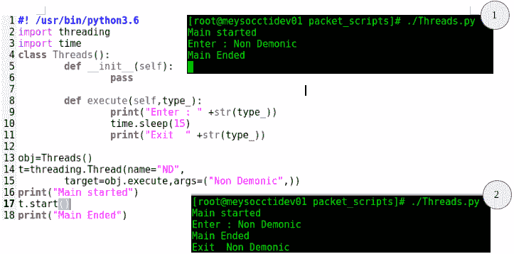
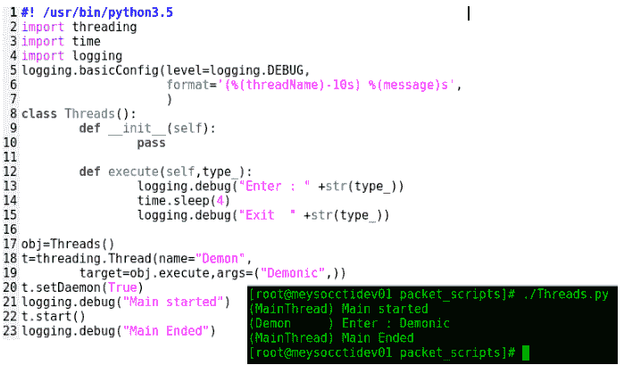
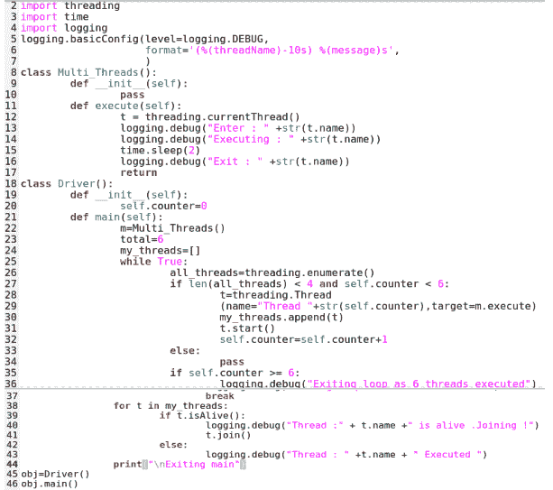
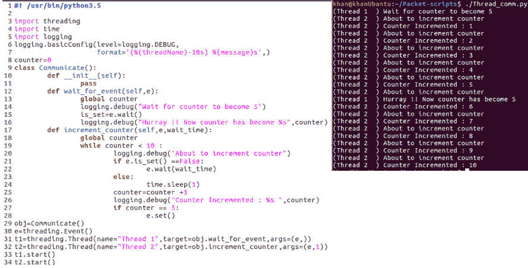
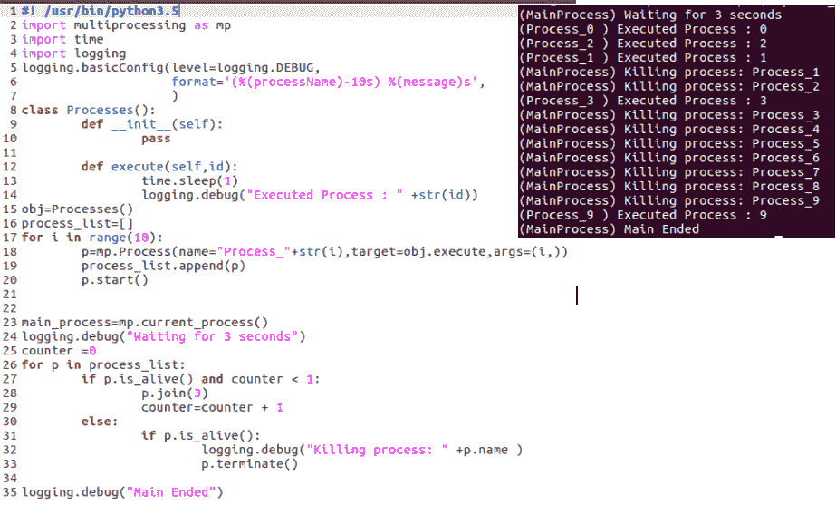
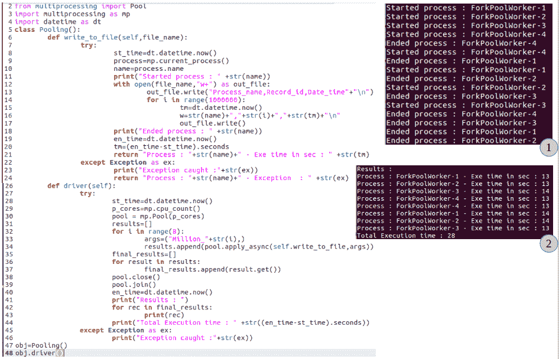
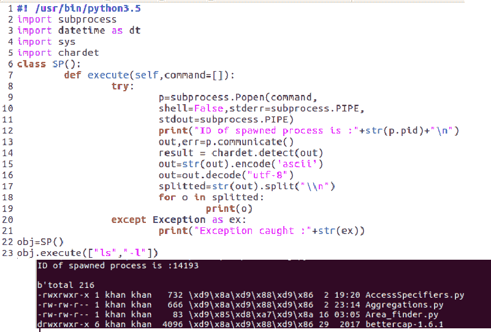
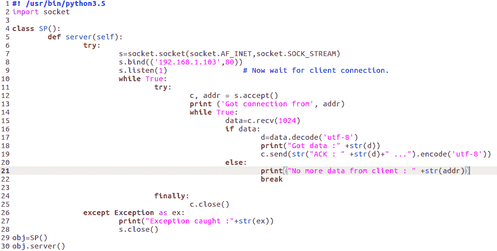
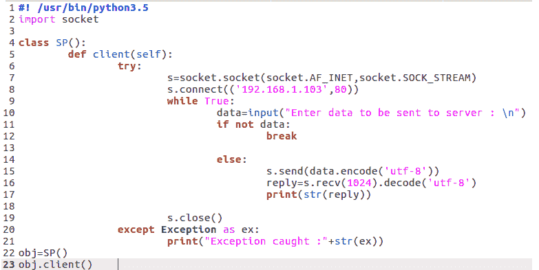
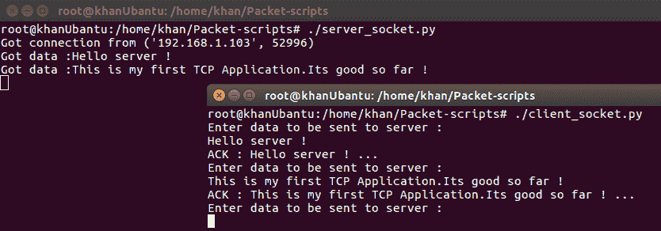

# 第四章：高级 Python 模块

本章将使我们熟悉一些高级 Python 模块，当涉及到响应时间、处理速度、互操作性和通过网络发送数据等参数时非常有用。我们将研究如何使用线程和进程在 Python 中进行并行处理。我们还将了解如何使用 IPC 和子进程在进程之间建立通信。之后，我们将探讨 Python 中的套接字编程，并通过实现反向 TCP shell 进入网络安全领域。本章将涵盖以下主题：

+   使用线程进行多任务处理

+   使用进程进行多任务处理

+   子进程

+   套接字编程的基础

+   使用 Python 实现反向 TCP shell

# 使用线程进行多任务处理

**线程**是一个轻量级的进程，与其父进程共享相同的地址和内存空间。它在处理器核心上并行运行，从而为我们提供了并行性和多任务处理能力。它与父进程共享相同的地址和内存空间的事实使得整个多任务处理操作非常轻量级，因为没有涉及上下文切换开销。在上下文切换中，当调度新进程以执行时，操作系统需要保存前一个进程的状态，包括进程 ID、指令指针、返回地址等。

这是一个耗时的活动。由于使用线程进行多任务处理不涉及创建新进程来实现并行性，线程在多任务处理活动中提供了非常好的性能。就像在 Java 中我们有`Thread`类或可运行接口来实现线程一样，在 Python 中我们可以使用`Thread`模块来实现线程。通常有两种在 Python 中实现线程的方法：一种是 Java 风格的，另一种更符合 Python 的风格。让我们一起来看看这两种方法。

以下代码显示了类似于 Java 的实现，我们在其中对线程类进行子类化并覆盖`run()`方法。我们将希望与线程并行运行的逻辑或任务放在`run()`方法内：

```py
import threading
>>> class a(threading.Thread):
... def __init__(self):
... threading.Thread.__init__(self)
... def run(self):
... print("Thread started")
... 
>>> obj=a()
>>> obj.start()
Thread started
```

在这里，我们有一个方法（`run()`），在这种情况下，它被设计为并行执行。这就是 Python 探索的另一种线程方法，在这种方法中，我们可以使用线程使任何方法并行执行。我们可以使用我们选择的任何方法，该方法可以接受任何参数。

以下代码片段显示了使用线程的另一种方式。在这里，我们可以看到我们通常定义了一个`add(num1,num2)`方法，然后在线程中使用它：

```py
>>> import threading
>>> def add(num1,num2):
...     print(num1 + num2)
... 
>>> for i in range(5):
...     t=threading.Thread(target=add,args=(i,i+1))
...     t.start()
... 
1
3
5
7
9
```

`for`循环创建了一个线程对象`t`。在调用`start()`方法时，会调用在创建线程对象时指定的目标参数中的方法。在前面的例子中，我们将`add()`方法传递给了线程实例。要传递给使用线程调用的方法的参数作为元组传递给`args`参数。`add()`方法通过线程调用了五次，并且输出显示在屏幕上，如前面的例子所示。

# 恶魔线程和非恶魔线程

必须注意的是，线程是从主程序中调用的，主程序不会退出（默认情况下）直到线程完全执行。原因是主程序默认以非恶魔模式调用线程，这使得线程在前台运行，而不是等待它在后台运行。因此，非恶魔线程是在前台运行的，导致主程序等待运行线程完成执行。另一方面，恶魔线程是在后台运行的，因此不会导致主程序等待其完成执行。请看下面的例子：



从前面的代码片段可以看出，当我们创建和执行一个非恶魔线程（默认情况下）时，在打印`Main Ended`后，终端窗口会暂停 4 秒，等待`ND`线程完成执行。当它完成时，我们会得到一个`Exit Non Demonic`的消息，这时主程序退出。在此之前，主程序不会退出。

让我们看看这在恶魔线程中如何改变，它在后台运行：



在前面的代码片段中，我们看到了如何使用一个恶魔线程。有趣的是，主程序并没有等待恶魔线程完成执行。恶魔线程在后台运行，当它完成时，主线程已经从内存中退出，因此我们没有在屏幕上看到`Exit: Daemonic`的消息。在这种情况下，我们正在使用日志记录模块。默认情况下，日志记录模块将记录到`stdout`，在我们的情况下，这是终端。

# 线程加入和枚举

正如我们在前一节中看到的，主线程默认情况下会等待线程执行。尽管如此，主方法的代码仍将被执行，因为主线程将在不同的处理器核心上运行，与子线程不同。有时我们可能希望控制主线程的执行，与子线程的执行周期一致。假设我们希望在子线程执行后仅执行主线程的一部分代码。这可以通过`join()`方法实现。如果我们在主线程 M 的第 X 行调用线程 T 上的`join()`，那么主线程的 X+1 行将在 T 线程完成执行之前不会被执行。换句话说，我们将主线程的尾部与线程 T 连接起来，因此主线程的执行将在 T 完成之前暂停。让我们看下面的例子，我们在其中使用线程枚举和`join()`来批量执行线程。

主程序必须在退出之前验证所有线程是否已执行：



以下截图描述了前面代码的输出：


# 线程之间的互通

尽管线程应该独立执行，但有许多情况下需要线程之间进行通信，例如如果一个线程需要在另一个线程达到某个特定点时才开始任务。假设我们正在处理生产者和消费者问题，其中一个线程（生产者）负责将项目放入队列。生产者线程需要向消费者线程发送消息，以便它知道可以从队列中消费数据。这可以通过 Python 中的线程事件来实现。调用`threading.event()`返回一个事件实例，可以使用`set()`方法设置，使用`clear()`方法重置。

在下面的代码块中，我们将看到一个示例，其中一个线程将递增一个计数器。另一个线程需要在计数器值达到 5 时执行一个动作。必须注意，事件还有一个`wait()`方法，它会等待事件被阻塞或设置。事件可以等待一个超时间隔，或者可以无限期等待，但一旦设置标志为`true`，`wait()`方法将不会实际阻塞线程的执行。这在下面的代码中有所体现：



# 线程并发控制

有许多情况下，多个线程需要共享资源。我们希望确保如果一个线程正在改变对象的状态，另一个线程必须等待。为了避免不一致的结果，在改变其状态之前必须锁定共享资源。状态改变后，应释放锁。Python 提供了线程锁来做到这一点。看一下下面的代码片段`Thread_locking.py`，它演示了线程锁定和并发控制：


前面的代码片段显示了线程锁定。在这里，`count`是一个多个线程尝试更新的共享变量。第一个输出没有锁定机制（第 16 行和第 22 行被注释掉）。当没有锁定时，可以看到`thread_3`在获取锁时将值读为 1，`thread_4`也是一样。每个线程将计数的值增加 1，但到`thread_4`结束时，计数的值为 3。当我们使用锁定时，可以从第二个输出中看到，当共享资源`counter`被更新时，没有其他线程实际上可以读取它，因此获得的结果是一致的。

# 使用进程进行多任务处理

与线程模块一样，多进程模块也用于提供多任务处理能力。线程模块实际上有点误导：它在 Python 中的实现实际上不是用于并行处理，而是用于在单个核心上进行时间共享的处理。默认的 Python 实现**CPython**在解释器级别上不是线程安全的。每当使用线程时，都会在 Python 线程中访问的对象上放置一个**全局解释器锁**（**GIL**）。这个锁以时间共享的方式执行线程，给每个线程一小部分时间，因此我们的程序中没有性能增益。因此，多进程模块被开发出来，以提供并行处理给 Python 生态系统。这通过将负载分布到多个处理器核心上来减少执行时间。看一下下面的代码，它使用了多进程：

```py
>>> import multiprocessing
>>> def process_me(id):
... print("Process " +str(id))
... 
>>> for i in range(5):
... p=multiprocessing.Process(target=process_me,args=(i,))
... p.start()
>>> Process 0
>>> Process 1
>>> Process 2
>>> Process 3
>>> Process 4
import multiprocessing as mp
>>> class a(mp.Process):
... def __init__(self):
... threading.Thread.__init__(self)
... def run(self):
... print("Process started")
... 
>>> obj=a()
>>> obj.start()
Process started
```

前面的代码片段表示了两种多进程的实现：一种简单的方法和一种基于类的方法。

# 恶魔和非恶魔进程

我们已经学习了什么是恶魔和非恶魔线程。同样的原则也适用于进程。恶魔进程在后台运行而不阻塞主进程，而非恶魔进程在前台运行。这在下面的示例中显示出来：


可以从前面的代码片段中看到，当我们创建和执行一个非恶魔进程（默认选项）时，如输出 1 和第 20 行所示，在打印`Main Ended`后，终端窗口会在等待非恶魔进程完成执行时停顿 4 秒。当它完成时，我们会得到`Exit Non Daemonic`的消息，这时主程序退出。在第二种情况下（如输出 2 所示），主程序不会等待恶魔进程完成执行。恶魔进程在后台运行，当它完成时，主线程已经从内存中退出。因此，我们没有在屏幕上看到`Exit :Daemonic`的消息打印出来。

# 进程连接、枚举和终止

关于线程连接和枚举的相同理论也可以应用于进程。进程可以连接到主线程或另一个进程，以便另一个线程在连接的进程完成之前不会退出。除了连接和枚举之外，我们还可以在 Python 中显式终止进程。

看一下以下代码片段，演示了上述概念。以下代码的目标是生成一些进程，并使主进程等待 10 秒，以便生成的进程完成执行。如果它们没有完成，那些仍在运行的进程将在退出之前被终止：



上述代码`Join_enumerate_terminate.py`非常简单；我们所做的与之前的线程相同。这里唯一的区别是我们仅应用了 3 秒的加入操作，以便故意获得一些仍在运行的进程。然后我们通过对它们应用`terminate()`来终止这些进程。

# 多进程池

多进程库中最酷的功能之一是**池化**。这让我们可以将任务均匀分配到所有处理器核心上，而不必担心同时运行的进程数量。这意味着该模块有能力批量生成一组进程。假设我们将批处理大小定义为 4，这是我们可能拥有的处理器核心数量。这意味着，任何时候，可以执行的最大进程数量为四个，如果其中一个进程完成执行，也就是说现在有三个正在运行的进程，模块会自动选择下一组进程，使批处理大小再次等于四。该过程将持续进行，直到我们完成分布式任务或明确定义条件。

看一下以下示例，我们需要在八个不同的文件中写入 800 万条记录（每个文件中有 100 万条记录）。我们有一个四核处理器来执行此任务。理想情况下，我们需要两次生成一个批处理大小为四的进程，以便每个进程在文件中写入 100 万条记录。由于我们有四个核心，我们希望每个核心执行我们任务的不同部分。如果我们选择一次生成八个进程，我们将在上下文切换中浪费一些时间，因此我们需要明智地使用我们的处理器和处理能力，以获得最大的吞吐量：



在上述代码`Multiprocess_pool.py`中，我们在第 30 行创建了一个多进程池。我们将池的大小定义为`size=mp.cpu_count()`，在我们的情况下是`4`，因此我们定义了一个大小为四的池。我们需要创建八个文件，每个文件包含 100 万条记录。我们使用`for`循环来定义八个进程，这些进程将通过在创建的池对象上调用`apply_async()`来发送到池对象。`apply_async()`方法期望我们希望使用多进程模块作为参数执行的方法的名称。第二个参数是传递给我们希望执行的方法的参数。请注意，当使用池模块执行进程时，进程还具有从方法返回数据的能力。

从输出中可以看到，没有同时执行的进程超过四个。还可以验证，第一个完成的进程是`Forkpoolworker4`。当批处理大小为 3 时，模块会立即生成另一个进程。这可以通过输出来验证，输出中在第一部分的第六行中声明了`Started process Poolworker4`。

请注意，两个批次是并行执行的。每个进程花费了 13 到 14 秒，但由于它们是并行执行的，每个批次的整体执行时间为 14 秒。因此，两个批次的总时间为 28 秒。很明显，通过使用并行处理，我们在短短 28 秒内解决了问题。如果我们选择顺序或线程方法，总时间将接近*(13*8) = 104*秒。作为练习，您可以自己尝试。

现在让我们举另一个例子，展示池模块的另一个强大功能。假设作为我们的要求的一部分，我们需要解析创建的 800 万个文件中的四个文件，其 ID`％1700`的结果为零。然后我们必须将所有四个文件的结果合并到另一个文件中。这是分布式处理和结果聚合的一个很好的例子：这些进程不仅应该并行读取文件，还必须聚合结果。这与 Hadoop 的映射-减少问题有些类似。在典型的映射-减少问题中，有两组操作：

+   **映射**：这涉及将一个巨大的数据集分布在分布式系统的各个节点上。每个节点处理它接收到的数据块。

+   **减少**：这是聚合操作，其中来自每个节点的映射阶段的输出被返回，并且根据逻辑，最终聚合并返回结果。

我们在这里做的是相同的事情，唯一的区别是我们使用处理器核心代替节点：


如前面的代码片段所示，借助`Pool`模块的`map()`方法，我们可以让多个进程并行处理不同的文件，然后将所有结果组合并作为单个结构发送。这些进程是并行执行的，对于`record_id％1700`返回零的记录将被返回。最后，我们将聚合结果保存在`Modulo_1700_agg`文件中。这是多进程模块的一个非常强大的特性，如果使用正确，可以大大减少处理时间和聚合时间。

# 子进程

从另一个进程调用外部进程称为**子处理**。在这种情况下，进程之间的通信是通过操作系统管道进行的。换句话说，如果进程 A 被进程 B 作为子进程调用，那么进程 B 可以通过操作系统管道向其传递输入，也可以通过操作系统管道从中读取输出。在自动化渗透测试和使用 Python 调用其他工具和实用程序时，该模块至关重要。Python 提供了一个非常强大的模块，称为`subprocess`来处理子处理。看一下下面的代码片段`Subprocessing.py`，它展示了如何使用子处理来调用一个名为`ls`的系统命令：


在前面的代码片段中，我们使用了`subprocess.Popen()`方法来调用`subprocess`。还有一些其他调用或调用`subprocess`的方法，比如`call()`，但我们在这里讨论的是`Popen`。这是因为`Popen`方法返回将要生成的进程的进程 ID，从而使我们对该进程有很好的控制。`Popen`方法接受许多参数，其中第一个实际上是要在操作系统级别执行的命令。命名参数包括`stderr=subprocess.PIPE`，这意味着如果外部程序或脚本产生错误，该错误必须重定向到操作系统管道，父进程必须从中读取错误。`stdout=subprocess.PIPE`表示子进程产生的输出也必须发送到管道到父进程。`shell=True`表示无论给出什么命令，第一个参数都必须被视为`shell`命令，如果有一些参数，它们必须作为要调用的进程的参数传递。最后，如果我们希望父进程读取子进程产生的输出和错误，我们必须在调用的`subprocess`上调用`communicate()`方法。`communicate()`方法打开`subprocess`管道，通信从子进程向管道的一端写入开始，父进程从另一端读取。必须注意`communicate()`方法将使父进程等待子进程完成。该方法返回一个元组，其中 0 号索引处是输出，1 号索引处是标准错误。

应该注意的是，我们在现实世界的示例中不应该使用`shell=True`，因为这会使应用程序容易受到 shell 注入的攻击。避免使用以下行：

`>>> subprocess.Popen(command, shell=True) #这将删除所有内容！！`

看一下以下示例，我们将使用`shell=False`。使用`shell=False`，我们调用的进程/命令的命令和参数必须作为列表分开传递。让我们尝试使用`shell=False`执行`ls -l`：



这就是我们如何使用 Python 执行外部进程的方式，借助于 subprocess 模块。

# 套接字编程基础

当我们谈论套接字时，我们指的是 TCP 套接字和 UDP 套接字。**套接字**连接只是 IP 地址和端口号的组合。我们可以想到的每个在端口上运行的服务都在内部实现和使用套接字。

例如，我们的 Web 服务器总是在端口`80`（默认情况下）上监听，它打开一个套接字连接到外部世界，并绑定到具有 IP 地址和端口`80`的套接字。套接字连接可以以以下两种模式使用：

+   服务器

+   客户端

当套接字用作服务器时，服务器执行的步骤顺序如下：

1.  创建一个套接字。

1.  绑定到套接字。

1.  在套接字上监听。

1.  接受连接。

1.  接收和发送数据。

另一方面，当套接字连接用作客户端连接到服务器套接字时，步骤顺序如下：

1.  创建一个套接字。

1.  连接到套接字。

1.  接收和发送数据。

看一下以下代码片段`server_socket.py`，它在端口`80`实现了一个 TCP 服务器套接字：



在前面的案例中，我们使用`socket.socket`语句创建了一个套接字。在这里，`socket.AF_INET`表示 IPv4 协议，`socket.SOCK_STREAM`表示使用基于流的套接字数据包，这些数据包仅是 TCP 流。`bind()`方法以元组作为参数，第一个参数是本地 IP 地址。您应该将其替换为您的个人 IP，或`127.0.0.1`。传递给元组的第二个参数是端口，然后调用`bind()`方法。然后我们开始监听套接字，最后开始一个循环，我们接受客户端连接。请注意，该方法创建了一个单线程服务器，这意味着如果任何其他客户端连接，它必须等到活动客户端断开连接。`send()`和`recv()`方法是不言自明的。

现在让我们创建一个基本的客户端套接字代码`client_socket.py`，连接到之前创建的服务器并向其传递消息：



客户端和服务器套接字产生的输出如下：



这是我们如何使用 UDP 进行套接字连接的方式：

```py
sock = socket.socket(socket.AF_INET,socket.SOCK_DGRAM)

```

# 使用 Python 进行反向 TCP shell

现在我们已经了解了子进程、多进程等基础知识，使用 Python 实现基本的 TCP 反向 shell 非常简单。在这个例子`rev_tcp.py`中，我们将使用基于 bash 的反向 TCP shell。在本书的后面章节中，我们将看到如何完全使用 Python 传递反向 shell：


需要注意的是，`OS.dup2`用于在 Python 中创建文件描述符的副本。`stdin`被定义为文件描述符`0`，`stdout`被定义为文件描述符`1`，`stderr`被定义为文件描述符`2`。代码行`OS.dup2(s.fileno(),0)`表示我们应该创建`stdin`的副本并将流量重定向到套接字文件，该套接字文件恰好位于本地主机和端口`1234`（Netcat 正在监听的地方）。最后，我们以交互模式调用 shell，由于我们没有指定`stderr`、`stdin`和`stdout`参数，默认情况下，这些参数将被发送到系统级的`stdin`和`stdout`，再次映射到程序的范围内的套接字。因此，前面的代码片段将以交互模式打开 shell，并将其传递给套接字。所有输入都从套接字作为`stdin`接收，所有输出都通过`stdout`传递到套接字。可以通过查看生成的输出来验证这一点。

# 总结

在本章中，我们讨论了一些更高级的 Python 概念，这些概念可以帮助我们增加吞吐量。我们讨论了多进程 Python 模块以及它们如何用于减少所需时间并增加我们的处理能力。通过本章，我们基本上涵盖了我们进入渗透测试、自动化和各种网络安全用例所需的 Python 的一切。需要注意的是，从现在开始，我们的重点将是应用我们到目前为止所学的概念，而不是解释它们的工作原理。因此，如果您有任何疑问，我强烈建议您在继续之前澄清这些疑问。在下一章中，我们将讨论如何使用 Python 解析 PCAP 文件，自动化 Nmap 扫描等等。对于所有的安全爱好者，让我们开始吧。

# 问题

1.  我们可以使用 Python 的其他多进程库吗？

1.  在 Python 中，线程在哪些情况下会变得有用，考虑到它们实际上在同一个核心上执行？

# 进一步阅读

+   多进程：[`docs.python.org/2/library/multiprocessing.html`](https://docs.python.org/2/library/multiprocessing.html)

+   子进程：[`docs.python.org/2/library/subprocess.html`](https://docs.python.org/2/library/subprocess.html)
