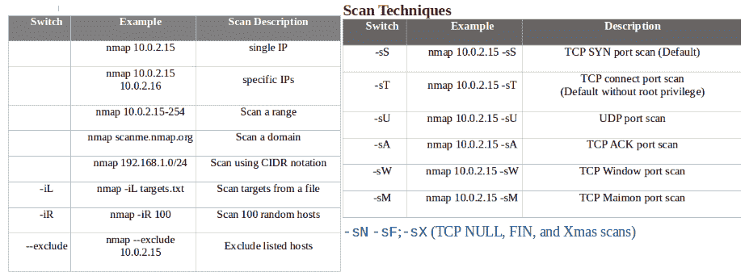
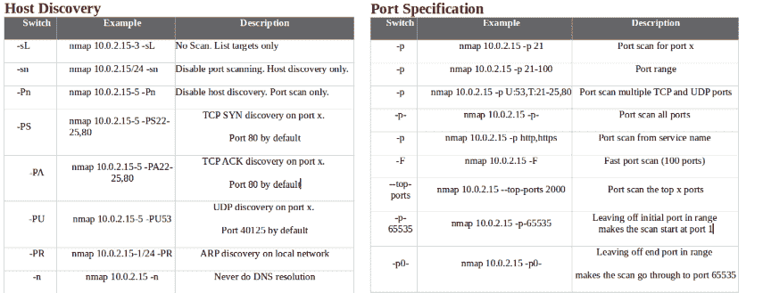
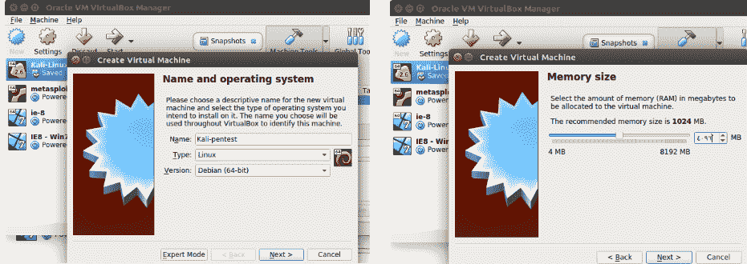
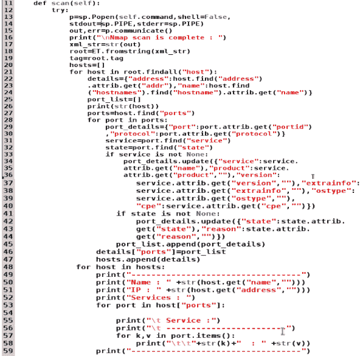
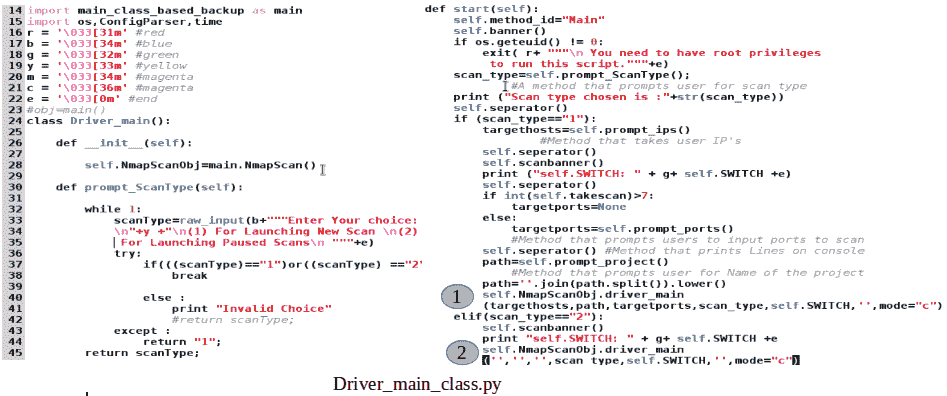
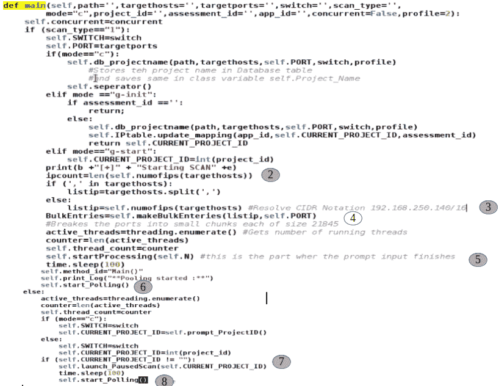
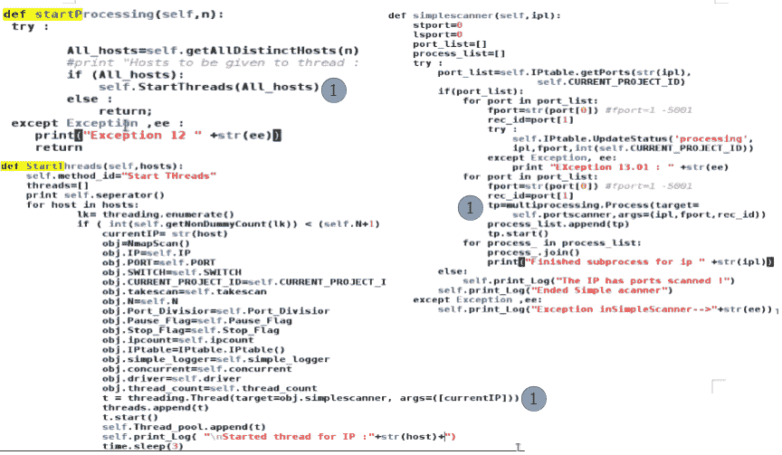
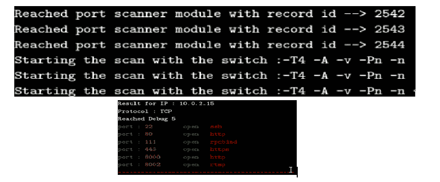
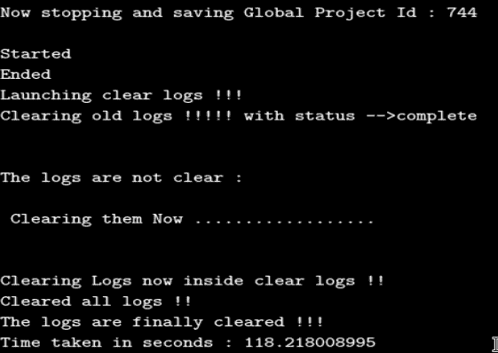

# 漏洞扫描器 Python - 第 1 部分

当我们谈论端口扫描时，自动想到的工具就是 Nmap。Nmap 有良好的声誉，可以说是最好的开源端口扫描器。它具有大量功能，允许您在网络上执行各种扫描，以发现哪些主机是活动的，哪些端口是开放的，以及主机上运行的服务和服务版本。它还有一个引擎（Nmap 扫描引擎），可以扫描用于发现运行服务的常见漏洞的 NSE 脚本。在本章中，我们将使用 Python 来自动执行端口扫描的过程。本章将为我们的自动化漏洞扫描器奠定基础，并将补充下一章，该章将专注于自动化服务扫描和枚举。

本章涵盖以下主题：

+   介绍 Nmap

+   使用 Python 构建网络扫描器

# 介绍 Nmap

我们的端口扫描器将基于 Nmap 构建，具有额外的功能和能力，例如并行端口扫描目标，暂停和恢复扫描。它还将具有一个 Web GUI，我们可以用来进行扫描。

让我们来看看 Nmap 的各种属性：

+   以下截图显示了 Nmap 可用的不同扫描技术：



+   以下截图显示了主机发现和端口规范，以及一些示例：



+   以下截图显示了服务和版本检测以及操作系统检测，以及一些示例：


+   以下截图显示了时间和性能，以及一些示例：


+   以下截图显示了 NSE 脚本以及一些示例：


+   以下截图显示了防火墙/IDS 回避和欺骗，以及一些示例：


+   以下截图显示了一些有用的 Nmap 输出示例：


前面的截图提供了我们在日常操作中经常使用的 Nmap 命令的全面列表。我们将不会涵盖如何在终端上运行 Nmap 命令，因为这被认为是直接的。

需要注意的是，从现在开始，我们将使用 Kali Linux 作为我们的渗透测试实验室操作系统。因此，我们将在 Kali Linux 上实施所有 Python 自动化。要安装 Kali Linux VM/VirtualBox 镜像，请参考[`www.osboxes.org/Kali-linux/`](https://www.osboxes.org/Kali-linux/)。要下载 VirtualBox，请参考[`www.virtualbox.org/wiki/Downloads`](https://www.virtualbox.org/wiki/Downloads)。下载后，执行以下截图中显示的步骤。

首先，输入新虚拟机的名称，类型和版本；在我们的案例中，这是 Linux 和 Debian（64 位）。之后，分配内存大小：



接下来，选择虚拟硬盘文件，如下截图所示：


# 使用 Python 构建网络扫描器

现在我们已经设置好了 VirtualBox 镜像，让我们来看一个简单的 Python 脚本，它将帮助我们调用 Nmap 并启动扫描。稍后，我们将优化此脚本以使其更好。最后，我们将使其成为一个功能齐全的端口扫描 Python 引擎，具有暂停，恢复和多进程能力：


前面脚本产生的信息对 Python 代码来说很难过滤和存储。如果我们想要将所有打开的端口和服务存储在字典中，使用前面的方法会很困难。让我们考虑另一种方法，可以解析并处理脚本产生的信息。我们知道`oX`标志用于以 XML 格式生成输出。我们将使用`oX`标志将 XML 字符串转换为 Python 字典，如下节所示。

# 使用脚本控制 Nmap 输出

在下面的示例中，我们重复使用了之前学习的相同概念。我们将 Nmap 输出重定向为 XML 格式显示在屏幕上。然后，我们将产生的输出作为字符串收集起来，并使用`import xml.Etree.elementTree` Python 模块作为`ET`，以将 XML 输出转换为 Python 字典。使用以下代码，我们可以使用我们的程序控制 Nmap 并过滤出所有有用的信息：



然后，我们可以将这些信息存储在数据库表中：


接下来，运行以下命令：

```py
Nmap=NmapPy(["Nmap","-Pn","-sV","-oX","-","127.0.0.1"])
Nmap.scan()
```

虽然前面的方法很好，并且让我们对 Nmap 输出有细粒度的控制，但它涉及处理和解析代码，这可能是我们每次使用 Nmap 进行扫描时都不想编写的。另一种更好的方法是使用 Python 内置的 Nmap 包装模块。我们可以使用`pip install`安装 Python 的 Nmap 模块，它几乎与我们之前做的事情一样，但允许我们避免编写所有处理和子处理逻辑。这使得代码更清晰、更可读。每当我们希望有更细粒度的控制时，我们总是可以回到前面的方法。

# 使用 Nmap 模块进行 Nmap 端口扫描

现在让我们继续安装 Python Nmap 模块，如下所示：

```py
pip install Nmap
```

上述命令将安装`Nmap`实用程序。以下部分提供了有关如何使用该库的概述：

```py
import Nmap # import Nmap.py module
 Nmap_obj = Nmap.PortScanner() # instantiate Nmap.PortScanner object
 Nmap_obj.scan('192.168.0.143', '1-1024') # scan host 192.1680.143, ports from 1-1024
 Nmap_obj.command_line() # get command line used for the scan : Nmap -oX - -p 1-1024 192.1680.143
 Nmap_obj.scaninfo() # get Nmap scan informations {'tcp': {'services': '1-1024', 'method': 'connect'}}
 Nmap_obj.all_hosts() # get all hosts that were scanned
 Nmap_obj['192.1680.143'].hostname() # get one hostname for host 192.1680.143, usualy the user record
 Nmap_obj['192.1680.143'].hostnames() # get list of hostnames for host 192.1680.143 as a list of dict
 # [{'name':'hostname1', 'type':'PTR'}, {'name':'hostname2', 'type':'user'}]
 Nmap_obj['192.1680.143'].hostname() # get hostname for host 192.1680.143
 Nmap_obj['192.1680.143'].state() # get state of host 192.1680.143 (up|down|unknown|skipped)
 Nmap_obj['192.1680.143'].all_protocols() # get all scanned protocols ['tcp', 'udp'] in (ip|tcp|udp|sctp)
 Nmap_obj['192.1680.143']['tcp'].keys() # get all ports for tcp protocol
 Nmap_obj['192.1680.143'].all_tcp() # get all ports for tcp protocol (sorted version)
 Nmap_obj['192.1680.143'].all_udp() # get all ports for udp protocol (sorted version)
 Nmap_obj['192.1680.143'].all_ip() # get all ports for ip protocol (sorted version)
 Nmap_obj['192.1680.143'].all_sctp() # get all ports for sctp protocol (sorted version)
 Nmap_obj['192.1680.143'].has_tcp(22) # is there any information for port 22/tcp on host 192.1680.143
 Nmap_obj['192.1680.143']['tcp'][22] # get infos about port 22 in tcp on host 192.1680.143
 Nmap_obj['192.1680.143'].tcp(22) # get infos about port 22 in tcp on host 192.1680.143
 Nmap_obj['192.1680.143']['tcp'][22]['state'] # get state of port 22/tcp on host 192.1680.143
```

这为 Alexandre Norman 编写的出色实用程序提供了一个快速入门。有关此模块的更多详细信息，请访问[`pypi.org/project/python-Nmap/`](https://pypi.org/project/python-nmap/)。我们将使用相同的模块来进行 Nmap 的并行端口扫描，并具有暂停和恢复扫描的附加功能。

# 目标和架构概述

在深入了解代码细节之前，重要的是我们理解我们在做什么以及为什么这样做。默认情况下，Nmap 非常强大并且具有大量功能。在使用操作系统工具进行典型的网络渗透测试时，采用的方法是使用 Nmap 进行端口扫描以获取打开的端口、运行的服务和服务版本。根据端口扫描结果，测试人员通常使用各种服务扫描脚本来获取服务版本和相关的 CVE ID（如果有的话），然后再根据这些，测试人员可以使用 Metasploit 来利用这些漏洞。对于服务扫描，测试人员使用各种开源技术，如 NSE、Ruby、Python、Java、bash 脚本，或者诸如 Metasploit、w3af、nikto、Wireshark 等工具。整个周期形成了一个需要每次遵循的流程，但它非常分散。我们在这里尝试提出的想法是，在接下来的部分中，我们将编排渗透测试人员需要执行的所有活动，并使用 Python 自动化所有这些活动，以便所有需要运行的工具和脚本都可以预先配置并一次性运行。我们不仅仅是编排和自动化活动，还使代码优化以利用多进程和多线程来减少扫描时间。

代码的架构可以分为以下几部分：

+   端口扫描（服务/端口发现）

+   服务扫描

# 端口扫描

端口扫描部分是指我们将如何在 Python 代码中实现它。想法是使用线程和多进程的组合。如果我们想要扫描 10 个主机，我们将把它分成 5 个批次。每个批次有两个主机（批次大小可以根据实验室机器的 RAM 和处理器能力增加）。对于四核处理器和 2GB RAM，批次大小应为 2。在任何时候，我们将处理一个批次，并为每个主机分配一个单独的线程。因此，将有两个线程并行运行，扫描两个主机。一旦一个主机被分配给一个线程，线程将选择要扫描该主机的端口范围（假设在 1 到 65535 之间）。逻辑不是顺序扫描端口，而是将整个范围分成三个大小为 21,845 的块。现在，单个主机的三个块并行扫描。如果处理器核心数量更多，块大小可以增加。对于四核处理器和 2GB RAM，建议使用三个块：


总之，主机被分成大小为 2 的批次，并专门用于单个主机。进一步的端口被分成块，并且一个多进程过程被专门用于扫描每个块，使得端口扫描可以并行进行。因此，在任何时候，将有两个线程和六个进程用于端口扫描活动。如果用户想要暂停扫描，他们可以在终端窗口使用*Ctrl* + *C*来暂停。当他们重新运行代码时，他们将被提示选择启动新的扫描或恢复先前暂停的扫描。

# 服务扫描

当端口扫描活动结束时，我们将所有结果保存在我们的 MySQL 数据库表中。根据发现的服务，我们有一个配置好的脚本列表，如果找到特定的服务，我们需要执行这些脚本。我们使用 JSON 文件来映射服务和相应的脚本以执行。用户将得到端口扫描结果，并有选择重新配置或更改结果的选项，以减少误报。一旦最终配置完成，服务扫描就开始了。我们从数据库中逐个选择一个主机，并根据发现的服务，从 JSON 文件中读取适当的脚本，为这个特定的主机执行它们，并将结果保存在数据库中。这将持续到所有主机的服务都被扫描。最后，生成一个包含格式化结果和屏幕截图的 HTML 报告，以附加到概念验证（POC）报告中。

服务扫描的架构图如下：


以下屏幕截图显示了 JSON 文件如何配置以执行脚本：


如前面的屏幕截图所示，JSON 文件中有各种类别的命令。Metasploit 模板显示了用于执行 Metasploit 模块的命令。单行命令用于执行 NSE 脚本和所有非交互式的模块或脚本。其他类别包括`interactive_commands`和`single_line_sniffing`，在这里我们需要嗅探流量并执行脚本。JSON 文件的一般模板如下：


键是服务的名称。标题有文件描述。`method_id`是应调用的实际 Python 方法，以调用要执行的外部脚本。请注意，对于单行命令，我们还在`args`参数下的第一个参数中指定了以秒为单位的超时参数。

# 代码的更详细查看

让我们来看一下我们将使用 Python 构建网络扫描器所需的基本文件和方法的概述：

+   `Driver_main_class.py`：这是提示用户输入信息的 Python 类、文件或模块，例如项目名称、要扫描的 IP 地址、要扫描的端口范围、要使用的扫描开关和扫描类型。

+   `main_class_based_backup.py`：这是包含我们之前讨论的所有端口扫描主要逻辑的 Python 类、文件或模块。它从`Driver_main_class.py`获取输入并将输入存储在数据库中。最后，它使用线程和多进程在我们的目标上启动端口扫描。

+   `Driver_scanner.py`：端口扫描结束后，下一步是执行服务扫描，这个 Python 类调用另一个类`driver_meta.py`，该类获取要执行服务扫描的项目名称或 ID。

+   `driver_meta.py`：这个类显示端口扫描的默认结果，并给用户重新配置结果的选项。重新配置后，该类从数据库表中读取当前项目的主机，为其执行服务扫描。对于每个主机，它然后读取 JSON 文件以获取要执行的命令，并对于要执行的每个命令，它将控制传递给另一个文件`auto_comamnds.py`。

+   `auto_commands.py`：这个文件从`driver_meta.py`获取参数，并调用外部技术，如 NSE、Ruby、Python、Java、bash 脚本，或者工具，如 Metasploit、Wireshark 和 Nikto。然后用于执行所选服务、主机和端口的服务扫描。命令执行结束后，它将结果返回给`driver_meta.py`以保存在数据库中。

+   `IPtable.py`：这是将端口扫描结果存储在数据库表中的类。它代表了我们的漏洞扫描器的数据层。

+   `IPexploits.py`：这是将服务扫描结果存储在数据库表中的类。它还代表了我们的漏洞扫描器的数据层。

# 入门

整个代码库可以在以下 GitHub 存储库中找到。安装说明在主页上指定。我们将查看代码部分和具有实现扫描器的中心逻辑的文件。请随时从存储库下载代码并按照执行部分中指定的方式执行。或者，我创建了一个即插即用的 Kali VM 映像，其中包含所有先决条件安装和开箱即用的代码库。可以从 URL[<https://drive.google.com/file/d/1e0Wwc1r_7XtL0uCLJXeLstMgJR68wNLF/view?usp=sharing>](http://%3Chttps://drive.google.com/file/d/1e0Wwc1r_7XtL0uCLJXeLstMgJR68wNLF/view?usp=sharing%3E)下载并无忧地执行。默认用户名为：`PTO_root`，密码为：`PTO_root`

如前所述，我们将讨论代码的中心逻辑，该逻辑由以下代码片段表示：



整个类可以在 URL[<https://github.com/FurqanKhan1/Dictator/blob/master/Dictator_service/Driver_main_class.py>](http://%3Chttps://github.com/FurqanKhan1/Dictator/blob/master/Dictator_service/Driver_main_class.py%3E)找到`Driver_main_class.py`。该类的构造函数声明了在`main_class_based_backup.py`中找到的`NmapScan`类的对象。**（1）**和**（2）**标记的行是在收集所有输入后触发实际逻辑的地方，包括项目名称、IP、端口范围、扫描开关和扫描类型。扫描类型 1 表示新扫描，而扫描类型 2 表示恢复先前暂停的现有扫描。`self.scanbanner()`方法提示用户输入用户希望使用的 Nmap 扫描开关。有七种开关类型在日常扫描中最常用。以下截图显示了配置文件`Nmap.cfg`中配置的扫描开关：


以下代码片段代表了`main_class_based_backup.py`类的流程：


这个截图代表了主要的`NmapScan`类。该类的构造函数包含了我们将在整个类的执行流程中使用的各种变量。如前所述，`IPtable`是一个用于将数据推送到后端数据库的 Python 类。数据库的结构将在`db_structure`部分讨论。目前，我们应该理解，通过使用 MySQLdb db 连接器/Python 模块，我们将通过`IPtable`类将所有端口扫描的详细信息推送到后端表中。此外，`textable`是一个用于在终端窗口上绘制表格以表示数据的 Python 模块。`Simple_Logger`是一个用于在文件中记录调试和错误消息的 Python 模块。

正如我们之前所看到的，当我们查看`Driver_main_class.py`时，实际执行流程始于`NmapScan`类的`driver_main`方法（在`Driver_main_class.py`类的代码片段**(1)**和**(2)**中突出显示）。以下截图更详细地显示了这个方法：


前面的代码片段很简单。该方法接收来自调用者的所有参数。我们将扫描的开始时间保存在一个名为`start`的变量中。突出显示的代码片段**(1)**调用了同一类的另一个`main`方法，并将所有接收到的参数传递给它。这是启动所有主机的端口扫描的方法。一旦调用的`self.main`方法完成执行，如代码片段(2)所示，我们需要检查所有主机是否成功扫描。这可以从一个后台表中推断出，该表维护了所有正在扫描的主机的`status_code`，由当前项目 ID 引用。如果主机成功扫描，状态将是 complete，否则将是 processing 或 incomplete。如果当前项目不处于暂停状态，并且仍有一些主机的状态是 incomplete 或 processing，我们需要再次处理这些主机，这是代码片段(3)所突出显示的内容。如果所有主机的处理状态都是 complete，我们将最终项目状态更新为 complete，由`self.IPtable.clearLogs`方法指定。最后，我们显示执行时间（以秒为单位）。在下一个代码片段中，我们将看一下`NmapScan`类的`main`方法，让事情开始运行：



`main`方法开始检查`scan_type`。必须注意`scan_type="1"`表示新扫描，`scan_type="2"`表示恢复先前暂停的扫描。代码还检查扫描模式。注意`c`代表命令行模式。我们正在制作的漏洞扫描器在 GUI 模式和命令行模式下都可以操作，我们稍后会讨论。我们现在可以忽略`g-init`和`g-start`模式。

在第 6 行，代码将当前项目名称存储在后端数据库中。代码的逻辑由`self.db_projectname`方法处理。该方法接受项目名称，将其存储在数据库表中，返回一个唯一的项目 ID，并将其存储在名为`self.CURRENT_PROJECT_ID`的类变量中。它还在父项目文件夹的根目录下的`Results`文件夹下创建一个名为`Results_project_id`的文件夹。该方法的完整细节可以在以下路径找到：[<https://github.com/FurqanKhan1/Dictator/blob/master/Dictator_service/main_class_based_backup.py>](http://%3Chttps://github.com/FurqanKhan1/Dictator/blob/master/Dictator_service/main_class_based_backup.py%3E)。

高亮显示的代码片段**(2)**调用了一个名为`self.numofips(targethosts)`的方法，该方法返回要扫描的主机数量。如果有多个主机，它们应该被输入为逗号分隔（例如`192.168.250.143`，`192.168.250.144`）或 CIDR 表示法（例如`192.168.250.140/16`）。如果它们是逗号分隔的，那么`targethosts.split(',')`将分割输入并返回 IP 列表给`listip`变量。如果是 CIDR 表示法，代码片段**(3)**将把 CIDR IP 列表转换为本机 Python IP 列表并返回结果，结果将再次存储在`listip`变量中。

高亮显示的代码片段**(4)**负责将端口分成小块并将它们存储在数据库中，与之前讨论的当前项目 ID 相关。假设我们有两个要扫描的主机，`192.168.250.143`和`192.168.250.136`，并且我们想要扫描主机的整个端口范围（从 1 到 65,535）。在这种情况下，方法的调用将是`self.makeBulkEntries([192.168.250.143,192.168.250.136], "1-65535")`。该方法处理输入并将其转换为以下内容：

`[[192.168.250.143,"1-21845"],[192.168.250.143,"21845-43690"],[192.168.250.143,"43690-65535"],[192.168.250.144,"1-21845"],[192.168.250.144,"21845-43690"],[192.168.250.144,"43690-65535"]]`。

前面的列表被插入到数据库表中，共有六行，每行的扫描状态为不完整。

在下一行，`threading.enumurate()`返回当前运行线程的数量。它应该返回一个值为 1，因为只有主线程在运行。

高亮显示的代码片段**(5)**调用了`startProcessing`方法。这个方法从后端数据库表中读取一批不完整状态的不同主机，然后为这些主机分配一个线程进行扫描。必须注意的是，`self.N`表示批处理大小，我们已经讨论过它是 2，并且在类的构造函数中初始化。我们可以增加这个数字以获得更高的处理器数量。

`startProcessing`方法会生成线程并为每个未扫描的主机分配一个线程，但必须有一些逻辑来检查主机何时完全扫描，例如，如果批处理大小为`2`，并且扫描了 1 个主机，它会提取另一个未扫描的主机并为其分配一个线程。该方法还需要检查所有主机是否完全扫描。如果是这种情况，扫描必须结束。这段逻辑由`start_Polling()`方法处理，如标有**(6)**的代码片段所示。

高亮显示的代码片段**(7)**将调用一个方法来恢复暂停的扫描。因此，它将加载所有处于暂停状态的扫描的项目 ID。用户可以选择任何有效的项目 ID 来恢复扫描。

最后，代码片段**(8)**提到了`Start_Polling()`，它具有与之前讨论的相同功能，但在这种情况下是为恢复的扫描。

在下面的代码片段中，`startProcessing()`方法简单地从数据库表中提取所有不完整状态的不同主机，并将它们放入本机 Python 列表`All_hosts`中。对于当前示例，它将返回以下列表：[`192.168.250.143`, `192.168.250.144`]。之后，高亮显示的代码片段**(1)**将调用`startThreads`方法，其中一个线程将被分配给一个主机：



`startThreads()`方法很简单。我们遍历主机列表并为每个主机分配一个线程，通过调用`obj.simplescanner`方法并将当前 IP 列表传递给它。对于我们当前的示例，`simplescanner`方法将被调用两次。首先，它将为线程 1 调用，该线程具有 IP 地址`192.168.250.143`，然后它将为线程 2 调用，该线程具有 IP 地址`192.168.250.144`。这由代码片段**(1)**突出显示。

`simpleScanner（）`方法也很简单，使用了我们之前学习的多进程概念。首先，它读取调用它的当前主机的所有记录或端口块。例如，当它针对主机`192.168.250.143`调用时，它会读取数据库行[`[192.168.250.143，"1-21845"]，[192.168.250.143，"21845-43690"]和[192.168.250.143，"43690-65535"]`]。之后，它将更新所有这些记录的状态，并将它们标记为：处理中，因为我们将要专门处理端口块的进程。最后，我们遍历端口列表，并为当前 IP 和当前端口块调用多进程进程，如**（1）**部分所示。根据当前示例，我们将为 Thread 1 运行三个并行进程，为 Thread 2 运行三个并行进程：

+   进程 1（方法=端口扫描器（），IP=192.168.250.143，portx=1-21845，rec_id=100）

+   进程 2（方法=端口扫描器（），IP=192.168.250.143，portx=21845-43690，rec_id=101）

+   进程 3（方法=端口扫描器（），IP=192.168.250.143，portx=43690-65535，rec_id=102）

+   进程 4（方法=端口扫描器（），IP=192.168.250.144，portx=1-21845，rec_id=103）

+   进程 5（方法=端口扫描器（），IP=192.168.250.144，portx=21845-43690，rec_id=104）

+   进程 6（方法=端口扫描器（），IP=192.168.250.144，portx=43690-65535，rec_id=105）

理想情况下，每个进程将在处理器核心上执行。拥有七个核心的处理器将是很棒的。在这种情况下，主程序将利用一个核心，其余六个核心将在前面的六个进程之间并行分配。然而，在我们的情况下，我们有一个四核处理器，其中一个核心被主线程使用，其余三个核心被生成的六个进程共享。这将涉及由于上下文切换而产生一定的延迟。还要注意，我们正在使用多进程库的 mp.Process 实用程序。请随时使用批处理模块，如我们在前几章中讨论的，批处理大小为 3，看看扫描时间是否有任何差异。最后，我们希望 Thread 1 线程保持活动状态，直到所有主机块都被扫描，因为我们的轮询逻辑表明，如果一个线程完成，那么主机扫描就结束了。因此，我们在当前线程上调用`join（）`方法。这确保了 Thread 1 和 Thread 2 在所有进程完成之前都保持活动状态；换句话说，所有块都被扫描。

以下代码是不言自明的。我们使用 Python 的内置 Nmap 实用程序来扫描主机和端口块。如果扫描成功，我们只需解析结果并分别提取 TCP 和 UDP 结果。提取结果后，我们只需使用`self.IPtable .Update（）`方法将结果保存在后端数据库表中。我们将状态标记为完成，并保存发现为开放的端口和服务的结果。另一方面，如果端口扫描结果和 IP 返回任何异常，我们将尝试进行三次重复扫描：


经过三次重试，如果扫描不成功，那么对于该记录（`I`，`port-chunk`，`project_id`），我们将更新状态为错误完成，如下截图所示：


`start_Polling`方法不断监视活动线程的数量，如**(1)**和**(2)**所示。如果发现只有一个正在运行的线程，然后它检查后端表，看是否所有主机都标记为`complete`状态。如果只有一个正在运行的线程（`main`）并且所有主机都标记为 complete，则它会跳出无限轮询循环。另一方面，如果发现当前运行的线程数量小于最大允许的批处理大小，并且数据库表中还有一些未扫描的主机，它会选择一个未扫描的主机，并通过调用`startProcessing()`方法为其分配一个线程。这在以下代码片段的**(3)**和**(4)**部分中得到了突出显示：


以下代码处理了如何恢复暂停的扫描。`self.IPtable.MakeUpdate`方法将未扫描主机的状态更新为`incomplete`。当有主机的状态从`processing`更改为`incomplete`时，返回 1。如果在将主机放入数据库表之前扫描被暂停，则返回状态`2`。在这种情况下，我们需要重新进行批量输入。其余代码很简单；我们调用`startProcessing()`方法来委派一个线程来扫描主机：


必须注意的是，为了暂停扫描，我们只需在控制台或终端窗口上按下*Ctrl* + *C*。当前扫描将被暂停，并在后端数据库中针对当前项目 ID 适当地更新状态。还应该注意，正如前面提到的，上述方法构成了我们漏洞扫描器的端口扫描部分的核心逻辑。确切的代码还有一些其他功能，详细信息可以在 GitHub 存储库[<https://github.com/FurqanKhan1/Dictator>](http://%3Chttps://github.com/FurqanKhan1/Dictator%3E)中找到。

# 执行代码

在执行代码之前，请参考 GitHub URL [<https://github.com/FurqanKhan1/Dictator/wiki>](http://%3Chttps://github.com/FurqanKhan1/Dictator/wiki%3E)上的安装和设置说明。安装指南还介绍了如何设置后端数据库和表。或者，您可以下载预先安装和预配置了所有内容的即插即用的虚拟机。

要运行代码，请转到`/root/Django_project/Dictator/Dictator_Servicepath`并运行`driver_main_class.py`代码文件，命令为`python Driver_main_class.py`：


以下屏幕截图显示了程序正在进行扫描的过程：



以下屏幕截图显示了日志详情：



可以看到在前面的屏幕截图中，为一个主机生成了三个子进程并创建了一个线程。

# 漏洞扫描器端口扫描部分的数据库架构

让我们试着了解我们正在使用的后端数据库以及数据库中各种表的结构。使用`show databases`命令列出 MySQL 中存在的所有数据库：

 

为了使用当前数据库，也就是我们的漏洞扫描器相关的数据库，我们使用`nmapscan`命令。此外，要查看当前数据库中的所有表，我们使用`show tables`命令：


为了查看将保存所有扫描项目的表的结构或模式，我们使用`desc project`命令。要查看我们扫描的项目的数据，我们发出以下 SQL 查询：


`IPtable` 是保存我们目标端口扫描结果的表。以下命令 `desc IPtable` 显示了表的模式：


以下截图显示了当前项目`744`中`IPtable`中的数据。我们可以看到所有的服务扫描结果都以 CSV 格式放在表中：


一旦项目的端口扫描成功完成，项目的所有细节都将从 `IPtable` 移动到 `IPtable_history`。这是为了在 `IPtable` 上快速进行查找操作。因此，`IPtable_history` 表的模式将与 IPtable 完全相同。这可以在以下截图中验证：


# 总结

在本章中，我们讨论了如何使用 Python 内置的 Nmap 实用程序来进行和自动化端口扫描，同时具有暂停和恢复扫描的附加功能，并使用线程和多进程添加了优化层。在下一章中，我们将继续使用我们的漏洞扫描程序，了解如何现在可以使用端口扫描结果来进一步自动化和编排服务扫描。我们还将讨论我们的漏洞扫描程序的 GUI 版本，它具有大量功能和非常直观的仪表板。

# 问题

1.  为什么我们要使用线程和多进程的组合来自动化端口扫描？

1.  我们可能如何进一步优化吞吐量？

1.  是否有其他 Python 模块或库可以用来自动化 Nmap？

1.  我们可以使用其他扫描程序，如 Angry-IP 或 Mass Scan，使用相同的方法吗？

# 进一步阅读

+   关于如何使用 Nmap 和从`python3`访问扫描结果的 Python 课程：[`pypi.org/project/python-Nmap/`](https://pypi.org/project/python-Nmap/)

+   Nmap 教程：[ https://hackertarget.com/Nmap-tutorial/](https://hackertarget.com/Nmap-tutorial/)

+   Python MySQL：[`www.w3schools.com/python/python_mysql_getstarted.asp`](https://www.w3schools.com/python/python_mysql_getstarted.asp) 和 [`dev.mysql.com/doc/connector-python/en/`](https://dev.mysql.com/doc/connector-python/en/)
