# 漏洞扫描器 Python - 第 2 部分

当我们谈论使用开源脚本进行服务扫描时，首先想到的是利用各种 NSE 脚本获取配置的服务的服务版本和相关漏洞。在典型的手动网络渗透测试中，我们不仅使用 NSE 脚本来完成工作，还使用各种 Ruby、Perl 和 Bash 脚本，以及 Java 类文件。我们还运行 Metasploit 辅助模块进行服务扫描和利用模块来利用漏洞并创建 POC。我们还可能运行各种 Kali 工具，比如用于 Web 扫描的 Nikto，或者用于捕获未正确配置的 FTP 或 SSH 服务的明文用户名和密码的 SQLmap、w3af 和 Wireshark。所有这些工具和脚本产生了大量信息，测试人员需要手动枚举和整合。还必须消除误报，以得出哪些服务存在哪些漏洞的结论。手动服务扫描的另一个方面是缺乏标准化，更多地依赖于个人的专业知识和所使用的脚本的选择。重要的是要记住，要使用的脚本大多是相互分离的，以至于一个人必须按顺序运行所有所需的脚本和模块。我们可以实现有限的并行性。

在本章中，我们将看到我们的漏洞扫描器如何自动化所有这些活动，并为整个生态系统带来标准化。我们还将看到自动化扫描器如何调用和编排所有 Kali 工具，以为渗透测试人员生成一个集成报告，供其快速分析使用。我们还将研究漏洞扫描器的图形用户界面版本，该版本具有更高级的功能，并补充了现有的漏洞扫描器，如 Nessus。必须指出的是，当我使用 *补充* 这个词时，我绝不是在将我们的扫描器与 Nessus 或 Qualys 进行比较。它们都是经过多年研发的优秀商业产品，并有一些优秀的工程师在其中工作。然而，我们将构建出一个运行非常出色的东西；了解代码可以让您有机会为扫描器做出贡献，从而帮助它随着时间的推移变得更好更大。

# 架构概述

我们已经在第五章 *漏洞扫描器 Python - 第 1 部分* 中看过了扫描器的架构。让我们重新审视扫描器的服务扫描部分，并思考整个生态系统是如何工作的。以下图表显示了我们的服务扫描架构：

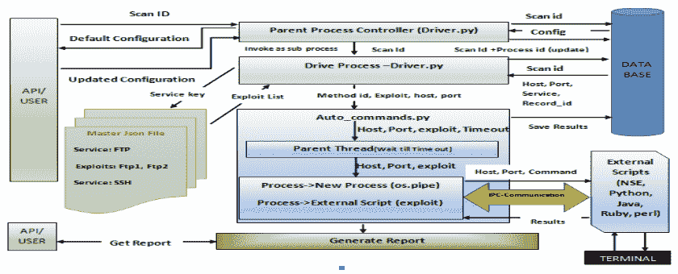

项目 ID 将与使用 Nmap 端口扫描完成的所有扫描相关联。用户可以选择要进行服务扫描的项目 ID，并且还可以查看已成功完成端口扫描的所有项目 ID。应该注意，只有已完成的项目的项目 ID 将被显示；暂停端口扫描的项目将不会被显示。

一旦选择了项目 ID，代码就会读取数据库表 `IPtable_history`，显示开放端口和默认配置，这指的是开放端口和相关脚本（取决于服务名称）。用户可以重新配置扫描结果，包括手动添加任何被忽略的开放端口或删除任何显示为开放但实际上不可访问的条目。一旦用户重新配置了结果，我们就可以运行服务扫描了。应该注意，如果用户发现端口扫描结果都正确，可以跳过重新配置步骤。

扫描活动结束后，我们将把所有结果保存在我们的 MySQL 数据库表中。在服务扫描的情况下，根据发现的服务，我们将得到一个配置好的脚本列表，如果找到特定的服务，我们需要执行这些脚本。我们使用一个 JSON 文件来映射服务和相应的要执行的脚本。

在端口扫描的情况下，用户将收到端口扫描结果，并有选择重新配置结果（以减少误报）。最终配置设置后，将开始服务扫描。逻辑是从数据库中逐个选择一个主机，并根据发现的服务，从 JSON 文件中读取适当的脚本，并为该特定主机执行它们。最后，在执行脚本后，结果应保存在数据库中。这将持续到所有主机都扫描其服务为止。最后，将生成一个包含格式化结果和 POC 截图的 HTML 报告。以下截图显示了如何配置 JSON 文件以执行脚本：


从前面的截图可以看出，JSON 文件中包含各种类别的命令。Metasploit 模板包含用于执行 Metasploit 模块的命令。单行命令用于执行 NSE 脚本以及所有非交互式的模块和脚本，可以用单个命令触发。其他类别包括`interactive_commands`和`single_line_sniffing`（需要在执行脚本的同时嗅探流量）。JSON 文件的一般模板如下：


**key**是服务的名称。标题包含文件的描述。`method_id`是应调用的实际 Python 方法，以调用要执行的外部脚本。请注意，对于单行命令，我们还在`args`参数下的第一个参数中指定了一个`timeout`参数，单位为秒。

# 代码的更详细查看

应该注意到整个代码库可以在 GitHub 上找到[`github.com/FurqanKhan1/Dictator`](https://github.com/FurqanKhan1/Dictator)。我们将查看所有构成服务扫描器核心逻辑的基本代码文件。或者，我创建了一个即插即用的 Kali VM 镜像，其中包含所有必需的安装和开箱即用的代码库。可以从以下 URL[`drive.google.com/file/d/1e0Wwc1r_7XtL0uCLJXeLstMgJR68wNLF/view?usp=sharing`](https://drive.google.com/file/d/1e0Wwc1r_7XtL0uCLJXeLstMgJR68wNLF/view?usp=sharing)下载并无忧地执行。默认用户名是`PTO_root`，密码是`PTO_root`。

让我们概览一下我们将使用的基本文件和方法，来构建我们的服务扫描引擎，使用 Python。

# Driver_scanner.py

端口扫描结束后，下一步是执行服务扫描。这个 Python 类调用另一个类`driver_meta.py`，它接受要执行服务扫描的项目名称/ID，如下面的代码片段所示：


# driver_meta.py

这个类显示了端口扫描的默认结果，并给用户重新配置结果的选项。重新配置后，这个类从数据库表中读取要执行服务扫描的项目的主机。对于每个主机，它然后从 JSON 文件中读取要执行的命令，对于要执行的每个命令，它将控制传递给另一个文件`auto_comamnds.py`：


前面的类代表了这个 Python 模块的主要父类。正如我们所看到的，我们已经导入了其他各种 Python 模块，如 JSON、SYS 和 psutil，以便与这个类一起使用。我们还可以看到，我们已经在这个模块中使用了其他类，如`auto_commands`、`Auto_logger`、`IPexploits`和`IPtable`。这些不是 Python 的内置模块，而是我们自己的类，用于执行我们服务扫描引擎的不同功能。我们将在稍后更详细地讨论这些。

# main()

看一下这个类的`main()`方法，从这里实际上开始执行循环：

`main()`方法是用于 CLI 版本和 GUI 版本的相同代码片段，因此有许多参数只有在以 GUI 模式调用时才相关。我们将在本节讨论在 CLI 模式下需要的参数。我们可以看到`mode`变量在`main()`方法的定义中初始化为`c`。 

在下面的屏幕截图中标记为**(1)**的部分中，我们为`texttable()` Python 模块初始化了一个对象，该模块将用于在控制台窗口上绘制一个表，以显示可以执行服务扫描的项目 ID。第二部分从数据库中收集了所有已完成的项目，第三部分将检索到的行添加到程序变量中，以在屏幕上显示。随后的代码很简单。在第四部分，功能实际上删除了先前已完成服务扫描的项目的详细信息，以便用户可以用新的服务扫描操作覆盖结果：

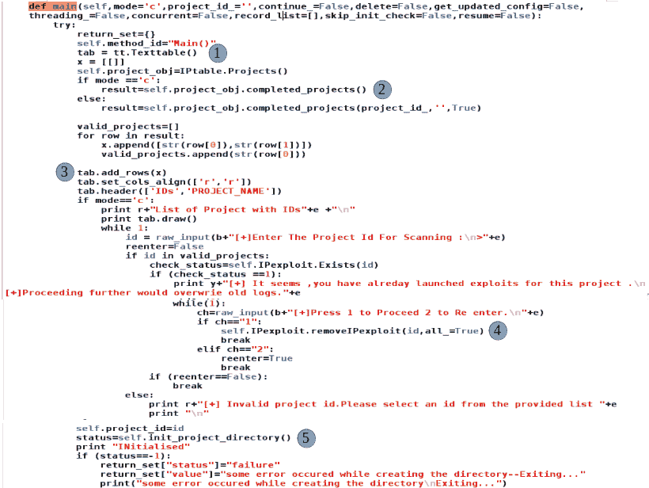

第五部分创建了一个名为`<project_id>`的目录，位于`results`文件夹下。例如，如果当前项目 ID 是`744`，则命令`init_project_directory()`将在`<parent_folder_code_base>/results/<744_data>`下创建一个子文件夹。所有日志文件、扫描配置和最终报告都将放在这个文件夹中。正如我们已经讨论过的，我们有一个预配置的 JSON 文件，其中包含服务名称和要针对该服务执行的测试用例之间的映射。

以下部分显示了 JSON 文件的配置方式。让我们以`http`服务为例，看看如何配置要针对 HTTP 服务执行的测试用例：


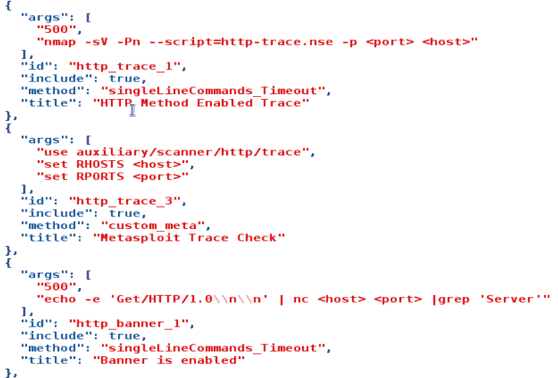


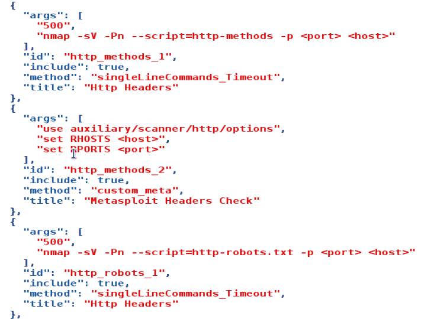

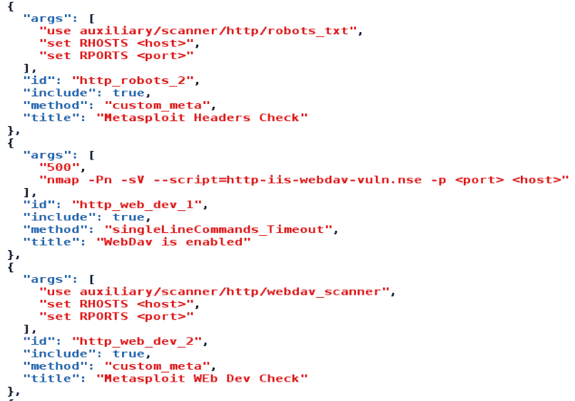


从前面的分叉中可以看出并分类，名为`http`的服务的所有测试用例将放在一个 JSON 列表中，其键为`Commands`。`Commands`列表中的每个条目都将是一个 JSON 字典，其中包含以下条目：`{"args":[],"id":"","method":"","include":"","title":""}`。每个字典构成一个要执行的测试用例。让我们试着理解每个条目：

+   `args`：`args`参数实际上是一个包含要针对目标执行的实际命令和 NSE 脚本的列表。要执行的所有命令/脚本被分类为我们将在方法部分中看到的五个不同类别。现在，了解`args`包含要在 Kali 控制台上用 Python 执行的实际命令就足够了。

+   `id`：给定要执行的每个命令都有一个唯一的 ID，这使得枚举变得容易。对于所有基于 HTTP 的命令，我们可以看到 ID 是`http_1`，`http_2`，`http_3`等等。

+   `method`: 这个特定的条目非常重要，因为它指的是应该调用的实际 Python 方法来执行这个测试用例。这些方法位于一个名为 `auto_commands.py` 的 Python 文件/模块中，该类别有不同的方法与 JSON 文件进行了映射。通常，要执行的所有脚本被分成五类/类别，并且每个类别都有一个相应的方法与之关联。脚本的类别及其相应的方法如下：

+   `Single_line_comamnds_timeout`: 所有需要一次性调用并为您生成输出的命令/脚本，而不需要在其间进行任何交互的命令/脚本都属于这一分类。例如，可以执行一个 NSE 脚本，命令如下：`nmap -p80 --script <scriptname.nse> 10.0.2.15`；它不需要任何其他输入，只需执行并给出最终输出。或者，可以如下调用一个用于执行目录枚举的 Perl 脚本：`perl http-dir-enum.pl http://10.0.2.15:8000`。同样，所有 Python 脚本、Bash 命令和 Kali 工具，如 Nikto 或 Hoppy，都属于这一类别。所有这些脚本都由一个名为 `singleLineCommands_timeout()` 的 Python 方法处理，该方法位于 `auto_comamnds.py` 模块中。需要注意的是，所有这些脚本还需要一个额外的 `timeout` 参数。有时单个脚本由于某些原因而挂起（主机可能无响应，或者可能遇到未经测试的意外情况），脚本的挂起将导致队列中的其他脚本处于等待状态。为了解决这种情况，我们在 `args[]` 列表中指定一个阈值参数作为第一个参数，这是我们希望脚本执行的最长时间（以秒为单位）。因此，从先前的配置中，我们可以看到为 ID 为 `http_5` 的 NSE 脚本指定了 `500` 秒的超时时间。如果脚本在 `500` 秒内未执行完毕，操作将被中止，并执行队列中的下一个脚本。

+   `General_interactive`: 除了需要执行单行命令并执行的脚本外，我们还有其他需要在执行后进行一些交互的 Bash 命令、Kali 工具和开源脚本。一个典型的例子是 SSH 到远程服务器，通常我们需要传递两组命令。这可以一次完成，但为了更好地理解，让我们举个例子：

+   `ssh root@192.168.250.143 [Command 1]`

+   `password:<my_password> [Command 2]`

另一个例子可能是工具，如 SQLmap 或 w3af_console，需要一定程度的用户交互。请注意，通过这种自动化/扫描引擎，我们可以通过自动调用 Python 来解决脚本的问题。所有需要交互的脚本或测试用例都由一个名为 `general_interactive()` 的方法处理，该方法位于 Python 模块 `auto_comamnds.py` 中。

+   +   `General_commands_timeout_sniff`: 有许多情况下，我们需要执行一个脚本或一个 Bash 命令，同时我们希望 Wireshark 在接口上嗅探流量，以便我们可以找出凭据是否以明文传递。在执行此类别中的脚本时，流量必须被嗅探。它们可以是单行脚本，如 NSE，也可以是交互式命令，如 `ssh root@<target_ip>` 作为第一个命令，`password:<my_password>` 作为第二个命令。所有需要这种调用的脚本都由 Python 方法 `generalCommands_Tout_Sniff()` 处理，该方法同样位于 `auto_comamnds.py` 模块中。

+   Metasploit_Modules：这是执行和处理所有 Metasploit 模块的类别。每当我们需要执行任何 Metasploit 模块时，该模块（无论是辅助还是利用）都将放置在此分类中。执行委托的方法称为`custom_meta()`，放置在`auto_commands.py`下。

+   `HTTP_BASED`：最终类别包含所有需要在目标上发布 HTTP GET/POST 请求进行测试的测试用例，并且这些情况由名为`http_based()`的方法处理，该方法再次放置在`auto_commands.py`模块中。

+   `include`**: **`include`参数有两个值：`True`和`False`）如果我们不希望将测试用例/脚本包含在要执行的测试用例列表中，我们可以设置`include=False`。在选择扫描配置文件时，此功能非常有用。有时我们不希望在目标上运行耗时的测试用例，例如 Nikto 或 Hoppy，并且更喜欢仅运行某些强制性检查或脚本。为了具有该功能，引入了包含参数。我们将在查看我们的扫描仪的 GUI 版本时进一步讨论这一点。

+   `title`：这是一个信息字段，提供有关要执行的基础脚本的信息。

现在我们对将加载到我们的`self.commandsJSON`类变量中的 JSON 文件有了很好的理解，让我们继续进行我们的代码。

突出显示的部分**(6)**读取我们的`all_config_file`程序变量中的 JSON 文件，最终进入`self.commandsJSON`类变量。突出显示的代码部分**(7)，(8)**和**(9)**加载要与扫描一起使用的扫描配置文件：


默认情况下，我们的代码的命令行版本的扫描配置文件是**强制性配置文件**。该配置文件基本上包含应针对目标执行的所有测试用例；它只删除了一些耗时的测试用例。但是，如果我们希望更改`mandatory_profile`的定义，以添加或减去测试用例，我们可以编辑`mandatory.json`文件，该文件位于与我们的代码文件`driver_meta.py`相同的路径上。

以下是`mandatory.json`文件中为`http`服务存在的条目：


突出显示的部分(9)将加载项目 ID`744`的端口扫描获得的所有结果，结果将保存在数据库表`IPtable_history`中，以下屏幕截图给出了将加载的记录的想法：


我们可以从前面的屏幕截图中看到，基本上有三条记录对应于我们的 ID`744`的扫描。表列的模式是`(record_id,IP,port_range,status,project_id,Services_detected[CSV_format])`。

后端执行的实际查询如下：


返回的结果将是一个可以迭代的列表。第一个内部列表的第 0 个索引将包含以 CSV 格式加载的检测到的服务。格式将是`(主机;协议;端口;名称;状态;产品;额外信息;原因;版本;配置;cpe)`，可以从前面的屏幕截图中验证。所有这些信息将放在`results_`列表中。

在第**(10)**部分中，如下片段所示，我们正在遍历`results_`列表，并将字符串数据拆分为新行`\n`。我们进一步将返回的列表拆分为`；`，最后将所有结果放在一个列表`lst1 []`中：

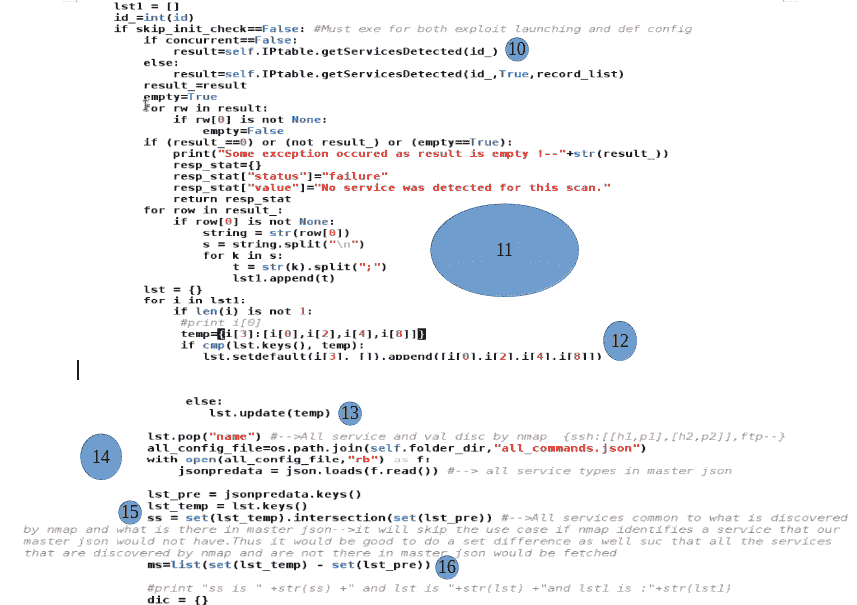

对于当前示例，在第(11)部分之后，`lst1`将包含以下数据：

```py
lst1=[
[10.0.2.15,tcp,22,ssh,open,OpenSSH,protocol 2.0,syn-ack,OpenSSH-7.2p2 Debian 5,10,cpe:/o:linux:linux_kernel],                                                                    [10.0.2.15,tcp,80,http,open,nginx,,syn-ack,nginx-1.10.2,10,cpe:/a:igor_sysoev:nginx:1.10.2],
  [10.0.2.15,tcp,111,rpcbind,open,,RPC #100000,syn-ack,-2-4,10,],
  [10.0.2.15,tcp,443,https,open,nginx,,syn-ack,nginx-1.10.2,10,cpe:/a:igor_sysoev:nginx:1.10.2],
  [10.0.2.15,tcp,8000,http,open,nginx,,syn-ack,nginx-1.10.2,10,cpe:/a:igor_sysoev:nginx:1.10.2],
  [10.0.2.15,tcp,8002,rtsp,open,,,syn-ack,-,10,]
]
```

因此，`lst1[0][0]`将给我们`10.0.2.15`，`lst1[2][2]=111`等等。

在代码的第**(12)**节中，我们正在按服务类型对`lst1`中的数据进行排序。我们声明了一个字典`lst={}`，并希望根据它们的服务类型对所有主机和端口进行分组，以便第**(12)**，**(13)**节的输出如下：

```py
lst = {
"ssh":[[10.0.2.15,22,open,OpenSSH-7.2p2 Debian 5;10]],
"http":[[10.0.2.15,80,open,nginx-1.10.2],[10.0.2.15,8000,open,nginx-1.10.2]],
"rcpbind":[[10.0.2.15,111,open,-2-4,10]],
"https":[[10.0.2.15,443,open,nginx-1.10.2]],
"rtsp":[[10.0.2.15,8002,open,-]]
}
```

在第**（15）**节中，`ss = set(lst_temp).intersection(set(lst_pre))`，我们对包含字典键的两个结构进行了交集运算。一个结构包含来自字典`lst`的键，该字典包含我们的端口扫描程序发现的所有服务。另一个包含从预配置的 JSON 文件中加载的键。这样做的目的是让我们看到所有已映射测试用例的发现服务。所有已发现和映射的服务键/名称都放在列表**SS**中，代表要扫描的服务。

在第**（16）**节中，`ms=list(set(lst_temp) - set(lst_pre))`，我们正在比较未在 JSON 文件中配置的服务与发现的服务。我们的 JSON 文件在常见服务方面非常详尽，但仍然有时 Nmap 可能会在端口扫描期间发现未在 JSON 文件中预先配置的服务。在本节中，我们试图识别 Nmap 发现但在我们的 JSON 文件中没有针对它们映射测试用例的服务。为此，我们对这两种结构进行了集合差异。我们将标记这些服务为`new`，用户可以对其进行配置测试用例，或者离线分析以执行自定义测试用例。所有这些服务将被放在一个名为`ms`的列表中，其中**ms**代表**未发现的服务**。

在代码片段中显示的第**(17)**和**(18)**节中，我们再次将两个未发现和映射的服务重新构建为两个不同的字典，格式如前所述：`{"ssh":[[10.0.2.15,22,open,OpenSSH-7.2p2 Debian 5;10]],...}`。发现的服务将放在`dic`字典中，然后放入`self.processed_services`类变量中。未发现的服务将放入`ms_dic`，最终放入`self.missed_services`中。

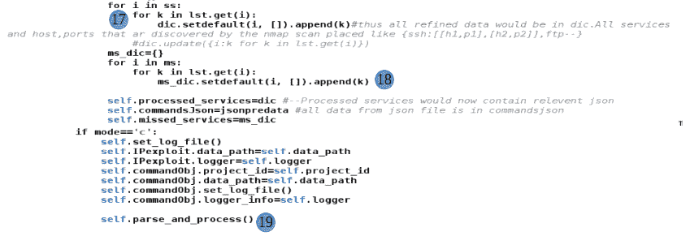

最后，在第**（19）**节中，我们调用`parse_and_process()`方法，该方法将调用显示发现和未发现服务的逻辑，并为用户提供必要时执行任何重新配置的选项。

重新配置完成后，`parse_and_process()`将调用另一个方法`launchExploits()`，该方法将实际从 JSON 配置文件中读取`method_name`，用发现的适当主机 IP 和端口替换`<host>`和`<port>`，并将控制传递给`auto_command.py`模块的相关方法（根据读取的`method_name`）。

一旦对所有发现的主机和端口执行了所有测试用例，就该生成包含屏幕截图和相关数据的报告了。这部分由第**(20)**和**(21)**节处理，如下面的代码片段所示：


# 解析和处理()

在接下来的部分中，我们将了解`parse_and_process()`方法的工作原理。值得注意的是，对于 CLI 版本，mode 变量的值为`c`，我们将只关注通向`mode=c`的代码部分。代码的其他分支将用于 GUI 模式，如果您想了解更多，可以自由阅读。

在第**(1)，(2)，(3)**和**(4)**节中的`parse_and_process()`方法开始执行，通过迭代`self.missed_services`和`self.processed_services`。这里的迭代思想是将这些发现的服务、主机、端口和`command_template`放入不同的数据库表`IPexploits`。我们将稍后讨论`command_template`。对于当前的示例，`self.processed_services`将包含以下数据：

```py
self.processed_services= {
"ssh":[[10.0.2.15,22,open,OpenSSH-7.2p2 Debian 5;10]],
"http":[[10.0.2.15,80,open,nginx-1.10.2],[10.0.2.15,8000,open,nginx-1.10.2]],
"rcpbind":[[10.0.2.15,111,open,-2-4,10]],
"https":[[10.0.2.15,443,open,nginx-1.10.2]],
}
self.missed_services ={
"rtsp":[[10.0.2.15,8002,open,-]]
}
```

这是因为除了`rtsp`之外，所有发现的服务都在 JSON 文件中映射了。


代码的第**(5)**部分遍历此字典，并尝试获取诸如`getTemplate(k)`的内容，其中`k`是当前正在迭代的服务。`getTemplate()`是一个读取 JSON 文件并返回要执行的测试用例的命令 ID 的方法。


以下示例将说明这一点。假设`getTemplate`在`http`上被调用，如`getTemplate('http')`。这将返回以下结构：

```py
entries= {"Entries": {"http_5": [true, "0", "0"], "http_trace_1": [true, "0", "0"], "http_trace_2": [true, "0", "0"], "http_trace_3": [true, "0", "0"], "http_banner_1": [true, "0", "0"], "http_banner_2": [true, "0", "0"], "http_robots_1": [true, "0", "0"], "http_robots_2": [true, "0", "0"], "http_headers_1": [true, "0", "0"], "http_headers_2": [true, "0", "0"], "http_methods_1": [true, "0", "0"], "http_methods_2": [true, "0", "0"], "http_web_dev_1": [true, "0", "0"], "http_web_dev_2": [true, "0", "0"]}}
```

结构如下：`{"http_5"：['include_command,commands_executed,results_obtained]}`。如果`http_5`是键，那么值是一个包含三个条目的列表。第一个条目表示命令是要包含还是执行（取决于所选择的扫描配置文件）。第二个条目保存在终端上执行的实际命令。最初它设置为 0，但一旦执行，`http_5`的`0`将被替换为`nmap -Pn --script=banner.nse -p 80 10.0.2.15`。第三个`0`实际上将被执行命令产生的结果所替换。

代码`entries=getTemplate(k)`将为每种服务类型返回一个类似上述的条目。我们准备一个名为`rows`的列表，其中放置主机、端口、服务、开/关状态和条目/`command_template`。执行该活动的代码片段是`self.rows.append((self.project_id, str(h_p[0]), str(h_p[1]), str(k), 'init', entries, service_status, str(h_p[2]), str(h_p[3])))`。

`type=new`的服务或未映射的服务将由代码部分**(2)**处理。这将在我们的示例条目中放置以下内容：

`entries={"Entries": {"new": true, "unknown": false}}`

代码部分**(6)**检查诸如`if(is_custom==True)`之类的内容。这意味着有一些服务可以与其他服务多次使用。例如，`ssl`的测试用例可以与`https`一起使用，如`[http +ssl]`，`ftps`作为`[ftp + ssl]`，`ssh`作为`[ssh + ssl]`。因此，诸如`https`，`ftps`等服务被标记为`custom`，当发现`https`时，我们应该加载`http`和`ssl`的两个模板。这就是在第**(6)**部分中所做的。

在第(6)部分结束时，`self.rows`将为所有主机和端口的所有服务类型保存类似`[project_id,host,port,service,project_status,command_template,service_type,port_state,version]`的条目。在我们当前的示例中，它将为所有服务类型保存六行。

在第**(7)**部分，`self.IPexploit.insertIPexploits(self.rows)`，我们一次性将`self.rows`的所有数据推送到后端数据库表`IPexploits`中。必须记住，后端数据库中`command_template/entries`的数据类型也标记为 JSON。因此，我们需要 MySQL 版本 5.7 或更高版本，支持 JSON 数据类型。

执行此命令后，我们当前项目`744`的后端数据库将如下所示：


必须注意的是，我没有加载`command_template`（在后端命名为`Exploits`），因为数据会变得混乱。让我们尝试加载两个服务的模板，如`rtsp`和`ssh`：


同样，我们还将有`http`，`ssl`和`rcpbind`的条目。应该注意的是，我们预计表中有六行，但实际上有七行。这是因为`https`服务被分为两类`http`和`ssl`，因此，在端口`443`上，我们不是有`https`，而是有两个条目：`http-443`和`ssl-443`。

在下一部分，项目的默认配置（主机、端口、要执行的测试用例）从同一数据库表中获取，并显示给用户。第八部分调用代码使用`launchConfiguration()`：

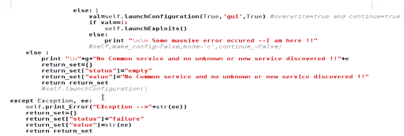

# launchConfiguration()

在这一节中，让我们来看一下`launchConfiguration()`方法，它加载默认配置，并且还允许用户进行微调或重新配置。此外，它调用了文件的中心逻辑，实际上会启动脚本执行，即`launchExploits()`。

对于 CLI 版本，`launchExploits()`是由`launchConfiguiration()`调用的。然而，在 GUI 版本中，`launchExploits()`只能由`parse_and_process()`方法调用。有关此方法的更多信息可以从前面的截图中看到。

以下代码片段的第 1 节加载了放置在当前项目的`IPexploits`表中的所有细节。我们已经看到了将被拉出并放置在`IPexploits`列表下的七行。请记住，在后端表中，我们只有命令 ID，例如`http_1`或`http_2`放在`Template`下，但是为了显示所选的配置和要执行的命令，我们拉出实际的脚本，它将映射到`http-1`等等。这就是第 2 节在做什么。它读取 JSON 文件以获取实际命令。

在第 3 节中，我们将拉取的细节放在`tab_draw`变量中，它将在控制台窗口上绘制一个表，并表示加载的配置：


第 4 节是不言自明的；我们将所有拉取的细节放在一个名为`config_entry`的字典中。这将被保存到一个文件中，因为最终选择的配置与扫描将被启动：


最后，在第 6 节下，我们调用`launchExploits()`。如果需要执行重新配置，第 7 节调用`self.reconfigure()`方法，该方法很简单，可以从代码库或以下 URL <https://github.com/FurqanKhan1/Dictator/blob/master/Dictator_service/driver_meta.py> 中找到：

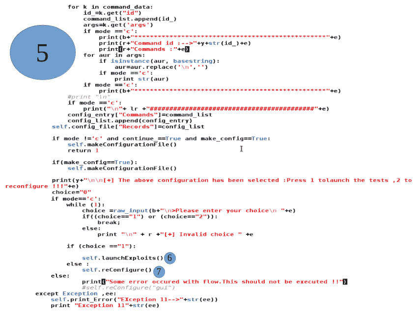

第 5 节将如下显示屏幕上的配置：


# launchExploits()

接下来的部分将讨论`launchExploits()`方法。

以下代码的第 9 节加载了放置在当前项目的`IPexploits`表中的所有细节。我们已经看到了将被拉出并放置在`IPexploits_data`列表下的七行。我们不需要关注`if(concurrent=False)`的`else`块，因为那是指在 GUI 版本中调用的代码。现在，让我们只考虑`if`块，因为对于 CLI 版本，`concurrent=False`。接下来，我们遍历`IPexploits_data: "for exploit in IPexploits_data:"`结构：


在第 10 节中，我们从当前正在迭代的服务的 JSON 结构中加载细节。请记住，`self.commandsJSON`保存了整个 JSON 文件数据，我们在其中映射了服务和测试用例。然后，我们加载该特定服务的所有命令和测试用例，并将它们放在一个名为`meta`的列表下。例如，如果`service = http`，那么 meta 将包含`[http_1,http_2,http_3,http_4,http_5 ...]`。现在，请记住，在最后一节中，对于七条记录中的每条记录，`project_status`都是`init`。在下一行（第 11 节），我们将当前记录的`(host,port,service,record_id)`组合的状态更新为`processing`。因为我们已经选择了执行此服务，我们希望更改数据库状态。

在第 12 节中，我们加载了为项目选择的扫描配置所执行的特定服务用例的所有启用服务用例。

还有一些项目/扫描可能需要一些用户定义的参数，例如要使用的用户名、密码等。所有这些参数都放在一个`Project_params.json`文件中，第**(13)**节将要执行的命令中的项目特定用户名和密码替换为适用的项目特定用户名和密码：


`Self.commandObj`保存了`auto_commands.pl`类的对象。第**(14)**节初始化了与要执行的当前记录集相关的类的实例变量（主机、端口、服务等）。正如我们之前讨论的，JSON 文件中的`args`参数包含要执行的实际命令。我们将`args`的值加载到程序变量 args 中。我们知道，这是一个包含命令的列表。我们遍历这个列表，并将诸如`<host>`之类的条目替换为要扫描的实际 IP，将`<port>`替换为要扫描的实际端口。我们将逐个为所有测试用例重复这个活动。对于当前示例，如果我们假设`http`是要扫描的当前服务，代码将遍历所有命令`[http_1,http_2..]`。最后，`http_5`和端口`80`的`final_args`列表将被指定为`[500, nmap -Pn --script=banner.nse -P80 10.0.2.5]`：

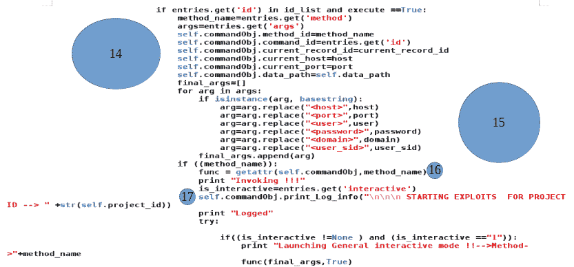

在第**(16)**节中，我们实际上是从`auto_comamnds.py`模块中调用适当的方法。让我们思考一下这是如何工作的。`getattr(object, name[, default])`返回`object`的命名属性的值。如果字符串是对象属性之一的名称，则结果是该属性的值。例如，`getattr(x,'Method_name')`等同于`x. Method_name`：

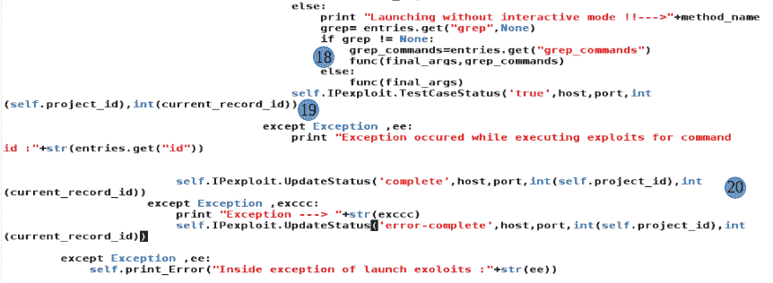

正如我们已经讨论过的，要执行脚本/模块的方法的名称在 JSON 文件中预先配置，并且在前面的代码中它被读入变量方法。`func = getattr(self.commandObj,method_name)`将返回该方法的引用，并且可以被调用，比如`func(args)`。这就是第**(18)**节中所做的：`func(final_args,grep_commands)`。当执行该方法时，它将自动将结果保存在数据库中。一旦一个服务的所有测试用例都执行完毕，我们希望将该行的状态从`processing`更新为`complete`，这就是第**(20)**节所做的。相同的操作会重复，直到所有主机的所有发现的服务都被扫描。让我们看一下当执行一个测试用例时数据库表是什么样子的。我们将从不同的项目 ID 中取一些例子：


从前面的屏幕截图可以看出，项目 ID 736 的这一行在服务扫描之前的数据如下：`Pid=736,Service='ssl',Exploits={"Entries" :{"ssl_1":[true,0,0]} ... }`。然而，一旦执行结束，第一个 0 将被一个包含执行的命令的列表所替换。第二个 0 的位置，我们有最终结果的字符串形式。

# 自动 _commands.py

在下一节中，我们将看一下实际工作的方式，即调用的方法如何自动化服务扫描的过程。我们将探索 Python 模块或文件`auto_commands.py`。必须记住，在本节中，我们将涵盖该类的基本方法。除此之外，还有一些其他方法是为特定用例定制的。您可以在 GitHub 存储库的确切代码文件中查看[<https://github.com/FurqanKhan1/Dictator/blob/master/Dictator_service/auto_commands.py>](http://%3Chttps://github.com/FurqanKhan1/Dictator/blob/master/Dictator_service/auto_commands.py%3E)。让我们首先看一下这个类是什么样子的：


我们导入的模块之一是**pexpect**。在接下来的部分中，让我们试着理解这个模块的作用以及它为什么重要。

# Pexpect

Pexpect 是一个类似 Unix 的 expect 库的 Python 模块。这个库的主要目的是自动化交互式控制台命令和实用程序。Pexpect 是一个纯 Python 模块，用于生成子应用程序、控制它们，并响应其输出中的预期模式。Pexpect 允许您的脚本生成子应用程序并控制它，就像一个人在键入命令一样。Pexpect 可用于自动化交互式应用程序，如 SSH、FTP、passwd、telnet 等。

我们将使用 Pexpect 来使用 Python 自动化 Metasploit，并且还将调用需要用户交互的终端自动化的各种用例。必须注意的是，还有另外两种用 Python 代码调用 Metasploit 的方法："msfrpc"，它调用了建立在 Metasploit 之上的服务 API，以及".rc"脚本。然而，我们观察到使用 Pexpect 模块的成功率最高。

Pexpect 模块有一个 spawn 类，用于生成任何终端命令、进程或工具。生成的工具应作为代码的子进程生成。

spawn 类构造函数的语法如下：

`pexpect.spawn(command, args=[], timeout=30, maxread=2000, searchwindowsize=None, logfile=None, cwd=None, env=None, ignore_sighup=False, echo=True, preexec_fn=None, encoding=None, codec_errors='strict', dimensions=None, use_poll=False)`

`spawn`类构造函数有许多参数，但强制参数是`command`。`command`是我们希望在 Unix 终端上执行的实际命令。如果我们希望传递参数给调用的命令，我们可以在命令本身中指定参数，用空格分隔，或者将参数作为 Python 列表传递到第二个参数`args`下。第三个参数是`timeout`，默认为 30 秒。这意味着如果在 30 秒内未生成进程，整个操作将被终止。如果我们的服务器负载很高，或者我们有性能问题，我们可以增加`timeout`参数。以下代码表示如何使用 Pexpect 调用 SSH 会话：

```py
child = pexpect.spawn('/usr/bin/ftp')
child = pexpect.spawn('/usr/bin/ssh user@example.com')
```

我们还可以使用参数列表构造它，如下所示：

```py
child = pexpect.spawn('/usr/bin/ftp', [])
child = pexpect.spawn('/usr/bin/ssh', ['user@example.com'])
```

当在终端上执行命令时，会创建一个会话，并通过返回的进程进行控制，该进程被放置在`child`变量下，如前面的示例所示。

`pexpect`的另一个重要类是`expect`。如其名称所示，Expect 规定了在成功执行`spawn`命令时可能产生的预期输出或输出。例如，如果`spawn`命令是`pexpect.spawn('/usr/bin/ssh',['user@example.com'])`，我们通常期望 ssh 服务器要求我们输入密码。从先前指定的命令中可能期望的所有可能模式或字符串都作为参数传递给`pexpect.expect`类，如果任何模式匹配，我们可以根据匹配定义要发送到终端的下一个命令。如果没有匹配，我们可以中止操作并尝试调试。

以下语法查找流，直到匹配模式。模式是重载的，可能有多种类型。模式可以是字符串类型、EOF、编译的正则表达式，或者是任何这些类型的列表：

`pexpect.expect(pattern, timeout=-1, searchwindowsize=-1, async_=False, **kw)`

如果传递了模式列表，并且有多个匹配项，则流中选择第一个匹配项。如果此时有多个模式匹配，则选择模式列表中最左边的模式。例如：

```py
# the input is 'foobar'
index = p.expect(['bar', 'foo', 'foobar'])
# returns 1('foo') even though 'foobar' is a "better" match
```

`child.sendLine(command)`是一个方法，它接受要发送到终端的命令，假设一切都按预期模式工作：

```py
child = pexpect.spawn('scp foo user@example.com:.')
child.expect('Password:')
child.sendline(mypassword)
```

让我们通过使用 Pexpect 进行 SSH 自动化的小例子来更清楚地说明问题：

```py
child = pexpect.spawn(ssh root@192.168.250.143)
i=child.expect(['.*Permission denied.*', 'root@.* password:.*','.* Connection refused','.*(yes/no).*',pexpect.TIMEOUT,'[#\$]',pexpect.EOF],timeout=15)
if(i==1):
       child.sendline('root')
       j=child.expect(['root@.* password:.*', '[#\$] ','Permission denied'],timeout=15)
       if(j==1):   
           self.print_Log( "Login Successful with password root")
       else:
           self.print_Log("No login with pw root")
```

在前面的代码中，我们只考虑成功的情况。必须注意，如果终端期望输入列表的第 1 个索引`'root@.* password:.'`，那么我们将使用`sendline`方法将密码作为 root 传递。注意`'root@.* password:.'`表示 root 后面的任何 IP 地址，因为它是一个正则表达式模式。根据匹配的字符串/正则表达式模式的索引，我们可以制定逻辑来指示接下来应该做什么。

# 自定义 _meta()

现在让我们来看一下`custom_meta`方法，它负责处理所有的 Metasploit 模块。它借助 Pexpect 库完成这一工作。

正如在以下片段的第**(1)**部分中所示，我们使用`pexpect.spawn`在我们的终端上调用`"msfconsole -q"`。这将在虚拟终端上调用一个 Metasploit 进程，并将该进程的控制返回给声明为 child 的变量：


每当我们调用 msfconole 时，如果没有错误，我们将得到一个 Metasploit 提示符，如`msf>`。这就是我们在第**(2)**部分中指定的，[.*>, .., ..]，作为第 0 个索引。这里暗示的是，我们期望任何`>`之前的内容都能成功执行，因此我们将传递运行 Metasploit 模块所需的命令。如果 child.expect 返回的索引为 0，我们将遍历 JSON 文件的命令列表，并将每个命令发送到我们的 Metasploit 控制台。对于我们的 projectID `744`和`http`服务，我们配置了一些 Metasploit 模块。其中一个如下所示：

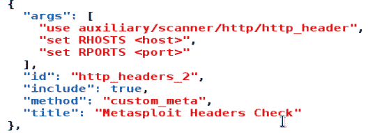

在前面的 JSON 结构的`args`键中的任何内容都将作为列表传递给`custom_meta`方法，并存储在 commands 列表中。在第**(3)**部分，我们遍历 commands 列表，并且，正如我们之前学过的那样，`<host>`和`<port>`实际上将被实际主机和正在扫描的端口替换。

在这一部分中，每个命令都会使用`child.sendline(cmd)`命令逐个发送到 msfconsole 终端。发送每个命令后，我们需要检查控制台是否符合我们的预期，也就是说它应该包含`msf>`提示符。我们调用`pexpect.expect`并将`".*>"`指定为我们输入列表的第 0 个索引。注意，索引 0 定义了我们继续的成功标准。只要我们得到与索引 0 匹配的输出，我们就继续，如第**(4)**部分所指定的那样。如果我们在任何时候观察到除索引 0 之外的任何内容（超时或文件结束-EOF），我们意识到某些事情并没有按预期发生，因此我们将布尔变量设置为 false：

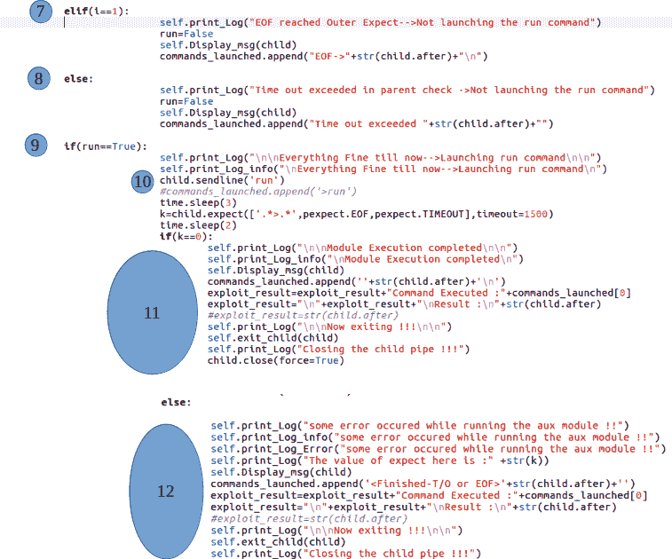

当我们退出这个迭代循环时，我们转到第**(9)**部分，检查 run == True。如果为真，我们假设所有参数都已正确设置以执行 Metasploit 模块。我们使用`sendline`发出`'run'`命令，如第**(10)**部分所示。

最后，如果一切顺利，模块成功执行，那么现在是收集结果的时候了。在第**(11)**部分，如果一切如预期那样进行，我们将在`exploits_results`变量中收集结果，并在`commands_launched`变量中收集命令。如果出现错误，我们将在第**(12)**部分中收集错误详情：


最后，在第**(14)**部分，我们通过调用`saveDetails()`方法将结果保存在数据库表中。必须注意，结果将以与之前讨论的相同的 JSON 结构保存在`"http_headers_2"`键下，这是脚本的 ID。`saveDetails`方法的定义如下。请注意，它将被应用于我们将讨论的所有不同方法：


**（1）**部分调用了放置在类文件`IPexploits.py`中的方法，该方法将在数据库中插入详细信息。整个代码文件可以在 GitHub 存储库中找到。

# singleLineCommands_Timeout()

在本节中，我们将看到`singleLineCommands_Timeout`方法的定义。这部分代码解释了线程和多进程的强大之处。我们之前学习了所有概念，但在本节中，我们将看到如何应用线程和进程的概念来解决现实世界的问题。

手头的问题是执行所有可以通过在控制台上输入一行命令来执行的命令和脚本的所有类别。这些产生输出。这可能看起来很简单，但有一个问题。请记住，我们讨论过脚本的执行可能因为某些不可预见的原因而需要很长时间，我们应该设计我们的解决方案，以便所有可能出现这种情况的脚本类别都有一个关联的超时。在这里，我们将使用线程来实现超时功能。线程和进程的组合将帮助我们实现我们的目标。

核心思想是调用一个线程并将其绑定到一个方法"x"。我们在调用的线程上调用`join()`，`join()`的持续时间将是 JSON 文件中指定的超时时间。正如我们之前学过的，当从主线程'm'上的线程't'上调用`join()`方法时，将导致主线程'm'等待，直到't'完成其执行。如果我们在主线程'm'上的线程't'上调用`join(20)`，这将导致主线程'm'等待 20 秒，直到't'完成。20 秒后，主线程将继续执行并退出。我们可以使用相同的类比来实现我们的任务：


在**（1）**和**（2）**部分，我们正在创建一个`thread`对象，并将其附加到`"execute_singleLine"`方法。应该注意的是，有时我们希望从最终输出中提取出一些内容，这就是为什么我们要检查`grep`参数是否设置。如果设置了，我们将`grep`字符串作为参数发送到线程方法；否则，我们只发送方法应该调用的控制台脚本/命令。现在我们不需要担心 grep 条件。

在**（3）**部分，我们可以看到我们正在收集超时参数，该参数始终位于命令列表的索引 0 处，或者位于 JSON 文件的 args 的第 0 个索引处。我们在线程上调用 start 方法，该方法将调用`"execute_singleLine"`方法，并将要执行的命令作为参数传递。之后，我们在调用的线程上调用`join(timeout)`，代码将在那里暂停，直到超时指定的秒数为止。在**（3）**部分之后不会执行任何行，直到`"execute_singleLine"`方法完成或时间超过超时。在继续之前，让我们更仔细地看看`"execute_singleLine"`方法中发生了什么：

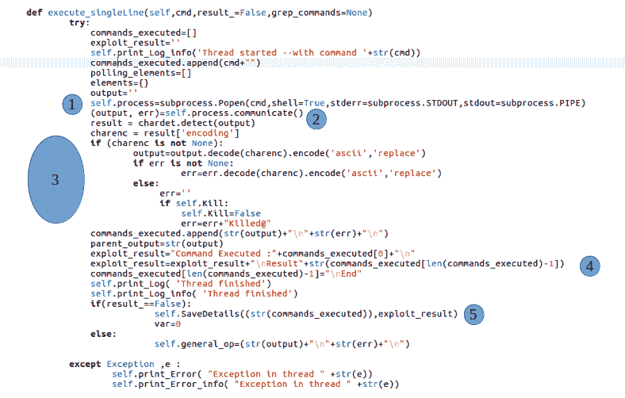

如`"execute_singleLine()"`方法的**（1）**部分所述，我们正在利用 Python 的 subprocess 模块来生成一个子进程。进程将由`cmd`变量中的命令指定。因此，如果`cmd`包含"`nmap -Pn --script=banner.nse -p 80 192.168.250.143`"，则相同的命令将在终端上执行，这只是操作系统级别的一个进程。进程类的实例将被返回并放置在`self.process`类变量下。该实例具有各种属性，如`"id"`，`"is_alive()"`等，这些属性给我们提供了有关进程状态的信息。

由于我们确定了传递给进程的参数（因为它们不是直接来自用户），我们可以继续进行。但是，最好使用`shell=False`并将参数指定为列表`[]`，或者使用 Python 的**shelx**实用程序自动将字符串参数转换为列表并使用`shell=False`。

我们希望父进程等待子进程执行，我们也希望子进程将其产生的所有数据返回给父进程。我们可以通过在调用的进程上调用`communicate()`来实现这一点。`communicate()`方法将返回一个元组，其中包含来自进程的输出的第 0 个索引和产生的错误的第一个索引。由于我们指定了`output=subprocess.PIPE`和`error=subprocess.PIPE`，输出和错误都将通过 OS 管道传输到父进程，这就是我们实现进程间通信的方式。这在第(2)部分中有所强调。

我们的下一个挑战是将控制台输出转换为标准的 ASCII 格式，以便我们可以将数据干净地保存在数据库中。需要注意的是，不同的工具和脚本以不同的格式和编码生成数据，这些格式和编码适合控制台显示。控制台支持各种编码，但我们需要将输出保存在数据库表中，因此在推送数据之前，我们需要将其从控制台编码转换为 ASCII 格式。这就是我们在第(3)部分所做的事情。

在第(4)部分中，我们通过调用`process = psutil.Process(self.process.pid).`来控制父进程。

在第(5)部分中，清理数据后，我们通过调用`saveDetails()`方法将执行的两个命令和生成的数据推送到数据库表中。

在第(3)部分之后，我们通过调用`thread.is_alive()`来检查线程是否仍然活动。如果返回`false`，这意味着线程已经成功在指定的时间内执行，通过内部调用`subprocess.Process`命令，并且详细信息也保存在数据库表中。但是，如果`thread.is_alive()`返回`true`，这意味着外部脚本仍在运行，因此我们需要强制将其终止，以免影响其他要执行的脚本的执行。请记住，调用的进程会将我们保存在`self.process`类变量下的进程实例返回给我们。我们将在这里使用该变量来终止进程。Python 有一个非常强大的实用程序叫做`"psutil"`，我们可以使用它来不仅终止进程，还可以终止该进程调用的所有子进程。我们还需要终止子进程，因为我们不希望它们在后台运行并消耗我们的 CPU。例如，诸如 Nikto 之类的工具会调用许多子进程来加快整个操作，我们希望终止所有这些进程，以确保父进程被终止并且所有系统资源都被释放供其他进程使用。一旦我们获取了父进程，我们使用`for`循环迭代其每个子进程，`for proc in process.children(recursive=True):`，并通过发出命令`proc.kill()`来终止每个子进程。这在第(5)部分中有所强调。最后，在第(6)部分，我们通过调用`self.process.kill()`确保终止父进程。

# general_interactive()

在这一部分，我们将了解`general_interactive()`方法的工作原理。虽然我们也可以使用这种方法实现 Metasploit 命令，但为了保持类别的分离，我们单独实现了 Metasploit。

`general_interactive`的目标是自动化交互式工具和 Bash 命令。这意味着 JSON 文件包含了定义执行工作流程的成功模式和失败模式。我们将使用 Pexpect 来实现这一点，如下所示：


让我们通过进行干运行来更仔细地研究这个方法，如下所示：


正如我们在`args[]`中看到的，第一个参数是超时时间。第二个索引保存我们希望使用一般交互方法自动化的命令。对于这个类别，第一个参数将始终是`超时时间`，第二个参数将是要执行的命令。从这里开始，定义了一个交替模式。第三个索引将保存预期输出列表和成功标准。如果满足成功标准，第四个索引将保存要发送到控制台的下一个命令。第五个索引将再次保存基于第四个索引发送的命令的预期输出列表，并且它还保存成功标准。模式很简单，根据我们计划自动化的底层命令或工具所需的，同样的交替序列将继续进行。

成功标准在预期输出列表的第一个索引处定义。如果有多个成功结果或索引，它们可以作为逗号分隔的输入给出在第一个索引处。让我们以`rlogin`的上述示例为例，我们正在尝试使用 root 作为用户名和密码进行远程登录，并尝试理解预期输出列表的内容和意义。索引 3 处的列表包含`['0,1','.* password: .*","[$,#]",".*No route.*"]`。在这里，第 0 个索引“0,1”定义了成功标准。这意味着如果终端期望`".* password: .*"`或`"[$,#]"`中的任何一个，我们就假设输出符合预期，因此我们将下一个命令发送到控制台，这在我们的情况下是`"root"`。如果我们得到的不是索引 0 或 1，我们就假设工具或脚本的行为不符合预期，因此中止操作。

要配置属于此类别的命令和脚本，测试人员需要知道脚本在成功和失败条件下的执行方式，并制定配置文件。前面的代码很简单，实现了我们之前讨论的相同逻辑。

# generalCommands_Tout_Sniff()

这里的想法类似于我们如何使用线程实现`singleLineComamnd()`方法。请注意，要执行的命令的类别要么是`interactive`，要么是`"singleLineCommand_Timeout"`，还有一个嗅探操作。我们将创建一个线程，并将嗅探任务委托给它，通过将它附加到`start_sniffing`方法。我们还将重用我们之前创建的方法。我们要么按照**(1)**指定的方式调用`singleLineCommands_Timeout()`，要么按照**(2)**指定的方式调用`general_interactive()`：


在第**(3)**和**(4)**节中，我们检查嗅探进程是否仍然存活，如果是，则将其终止：

```py
start_sniffing()
```

我们通常使用 Wireshark 来捕获接口上的所有流量。然而，由于 Wireshark 是一个桌面应用程序，在这种情况下，我们将使用**Tshark**。Tshark 代表终端 shark，是 Wireshark 的 CLI 版本。Tshark 调用命令在第(2)部分中指定，我们指定要嗅探流量的端口。我们还指定需要嗅探流量的主机，或目标主机。我们指定主机和端口的原因是我们想要保持结果的完整性；工具的 GUI 版本可以部署在服务器上，并且多个用户可以使用它进行扫描。如果我们指定它应该在接口上嗅探，那么其他用户的其他运行会话的数据也会被嗅探。为了避免这种情况，我们对主机和端口非常具体。我们还指定了它嗅探的超时持续时间。我们将输出保存在指定的文件中`"project_id_host_port_capture-output.pcap"`。

在第(2)部分，我们使用子进程模块调用`tshark`进程，这是我们之前讨论过的：


# HTTP_based()

以下的`http_based`方法很简单。我们使用 Python 的请求库向目标发送 GET 请求，捕获响应，并将其保存在数据库中。目前，我们只是发送 GET 请求，但您可以在自己的时间内调整代码以处理 GET 和 POST。我们将在下一章节中更多地介绍 Python 请求和抓取：


# IPexploits.py

服务扫描引擎的数据库层处理另一个重要的代码文件是`IPexploits.py`。这个文件很简单；它包含各种方法，每个方法的目的要么是从数据库表中获取数据，要么是将数据放入数据库表中。我们不会在这里讨论这个模块，但我建议你看一下可以在 GitHub 存储库[`github.com/FurqanKhan1/Dictator/blob/master/Dictator_service/IPexploits.py`](https://github.com/FurqanKhan1/Dictator/blob/master/Dictator_service/IPexploits.py)找到的代码。

# 执行代码

在执行代码之前，请仔细参考 GitHub 存储库[`github.com/FurqanKhan1/Dictator/wiki`](https://github.com/FurqanKhan1/Dictator/wiki)中的安装和设置说明。安装指南还讨论了如何设置后端数据库和表。或者，您可以下载预先安装和预配置了所有内容的即插即用的虚拟机。

要运行代码，请转到以下路径：`/root/Django_project/Dictator/Dictator_Service`。运行代码文件`driver_main_class.py`，如`:python Driver_scanner.py`。必须注意的是，结果是使用 Python 库生成的，该库将控制台输出转换为其 HTML 等效。更多细节可以在以下代码文件[`github.com/PacktPublishing/Hands-On-Penetration-Testing-with-Python`](https://github.com/PacktPublishing/Hands-On-Penetration-Testing-with-Python)的`generate_results()`方法中找到。

# 漏洞扫描器的服务扫描部分的数据库模式

要扫描服务扫描的扫描结果，请转到 IPexploits 表，其模式如下：


# 漏洞扫描器的 GUI 版本

先前讨论的相同代码库可以进行增强，以开发一个基于 Web 的漏洞扫描仪版本，具有端口扫描和服务扫描功能。该工具具有许多不同的功能，包括四层架构，其中包括 Web 层呈现、Web 层服务器、API 层和 DB 层。从 GitHub 存储库[`github.com/FurqanKhan1/Dictator/wiki`](https://github.com/FurqanKhan1/Dictator/wiki)下载并安装工具的 Web 版本。或者，您可以使用即插即用的虚拟机，只需登录并在`https://127.0.0.1:8888`上打开浏览器即可访问该工具。

扫描仪 GUI 版本的各种功能包括以下内容：

+   并行端口扫描

+   暂停和恢复端口扫描

+   服务扫描

+   所有测试用例自动化

+   暂停和恢复服务扫描 **（不在 CLI 中）**

+   并行服务扫描 **（不在 CLI 中）**

+   Nmap 报告上传和解析 Qualys 和 Nessus 报告

# 使用[PTO-GUI]

以下部分将介绍扫描仪的 GUI 版本的用法。

# 扫描模块

基于正在进行的基础设施上的扫描类型和性质，渗透测试人员有多种可用选项，并且可以选择最适合被测试基础设施的选项。可用的各种使用模式在以下部分中进行了介绍。

# 顺序模式

在顺序模式中，工具将从发现开始，然后重新配置，然后开始服务扫描。因此，这是一个三步过程。请注意，在顺序模式中

+   在所有主机都被扫描之前，无法开始服务扫描

+   一旦服务扫描开始，就无法重新配置

+   一旦开始服务扫描，所有服务都将开始扫描。用户无法控制先扫描哪个服务，后扫描哪个服务


# 发现完成后重新配置

为了减少误报和漏报，请分析端口扫描结果，如果需要，重新配置/更改它们。如果有任何服务/端口被遗漏，您还可以额外添加测试用例。


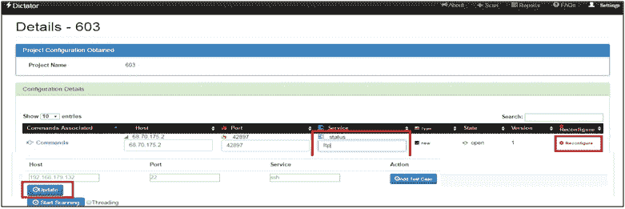

在上述截图中，我们将类型为**状态**的服务更改为`ftp`类型。因此，测试用例将为`ftp`运行。注意：只有在确定发现的服务不正确或类型为`Unknown`时才这样做。我们将很快了解服务类型。

如果 nmap 错过了主机/端口/服务，可以手动添加，如下所示：


添加测试用例后，我们可以点击“开始扫描”选项开始服务扫描。我们可以选择启用线程选项以加快结果的速度，也可以选择不使用线程选项开始服务扫描，如下图所示：


查看中间结果：当用户点击“开始扫描”时，他/她将被重定向到扫描页面。每次执行一个测试用例，UI 都会更新，并且一个蓝色的图标会出现在正在扫描的服务前面的屏幕上。用户可以点击该图标查看测试用例的结果。

当服务的所有“测试用例”都被执行时，图标将变为绿色。

以下图显示了中间测试用例的结果：


在任何时候，用户都可以离开 UI 而不会影响正在运行的扫描。如果用户希望查看当前正在运行的扫描，可以从顶部的“扫描状态”选项卡中选择正在运行的扫描。将显示以下屏幕：

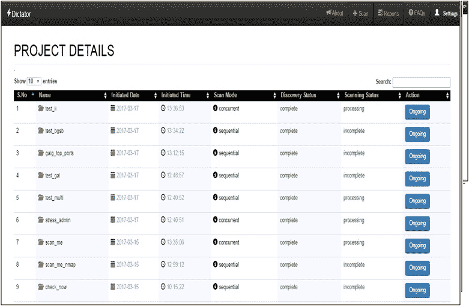

根据扫描的状态，它将显示适当的操作。如果扫描正在进行中，**操作**列将显示**进行中**。用户可以点击此按钮以获取其扫描当前状态的 UI 屏幕。

用户可以点击扫描名称以查看扫描最初启动时的配置（主机、端口、开关）。

# 并发模式

在顺序模式中，直到所有端口的端口扫描结果可用并且主机已经扫描完毕，服务扫描才能开始。因此，渗透测试人员可能需要等待获取这些结果。此外，在此模式下，渗透测试人员无法控制哪些服务可以先扫描，哪些可以稍后扫描。所有服务将一次性扫描，限制了对服务扫描的控制粒度。这些是并发模式处理的顺序模式的限制。

并发模式提供了在服务发现完成后立即启动服务扫描的灵活性，并进一步提供了根据渗透测试人员选择启动选择性服务扫描的选项。

1.  点击**扫描**选项卡下的**新扫描**选项卡。

1.  填写扫描参数，并选择**并发**扫描模式：


1.  其余步骤将相同，唯一的例外是在此扫描模式中，用户无需等待所有主机和端口都被扫描才能开始服务扫描。此外，用户可以选择希望扫描哪些服务。如下图所示：

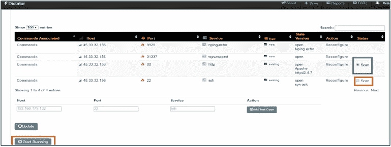

如前面的屏幕截图所示，用户可以选择先扫描`http`，而不立即扫描 ssh。用户可以决定何时扫描哪项服务。

并发模式也具有重新配置、查看结果等所有功能。

# 顺序默认模式

使用此模式，服务扫描将在发现完成后立即开始，从而跳过重新配置阶段。此模式的实用性在于调度扫描的情况下更为相关，渗透测试人员可以安排扫描在其他时间开始，并且可能无法进行重新配置，同时希望继续使用默认的端口扫描结果进行服务扫描。因此，此扫描模式跳过重新配置阶段，并在获取默认的`nmap`端口扫描结果后直接启动服务扫描。

1.  点击**扫描**选项卡下的**新扫描**选项卡

1.  填写扫描参数，并选择**顺序默认**扫描模式


当端口扫描结果完成后，它将自行开始服务扫描，无论用户当前是否已登录。

# 暂停和恢复扫描

无论扫描模式如何，任何处于发现或服务扫描状态的扫描都可以暂停。中间结果将被保存，用户可以随时在将来恢复扫描。

必须注意，如果在发现过程中暂停扫描（端口扫描可能正在进行），则已经扫描的端口的端口扫描结果将被保存；用户恢复后，将对未扫描的端口进行扫描。同样，如果在服务扫描过程中暂停扫描，则已经扫描的服务的结果将被保存，用户可以灵活分析将要扫描的服务的结果。扫描恢复后，将对未扫描的服务进行服务扫描。

以下屏幕截图显示了如何暂停正在进行的扫描：


要恢复扫描，可以转到**当前扫描**选项卡或**暂停的扫描**选项卡。默认情况下，操作列会有两个按钮：

+   **恢复**：这将从暂停的状态恢复扫描。

+   **分析**：如果扫描在扫描时暂停，渗透测试人员可以分析已经扫描的服务的结果。如果您希望恢复扫描，那么他/她可以选择分析选项。通过这个选项，用户可以看到已完成服务的中间测试用例结果。

如果扫描在端口扫描期间暂停，分析选项可能不会出现，因为如果端口扫描正在进行并且模式不是并发的话，就不会执行`test_cases`来分析。**分析**选项不会出现在并发扫描中，**恢复**按钮将执行并发模式中的恢复和分析扫描的联合功能。

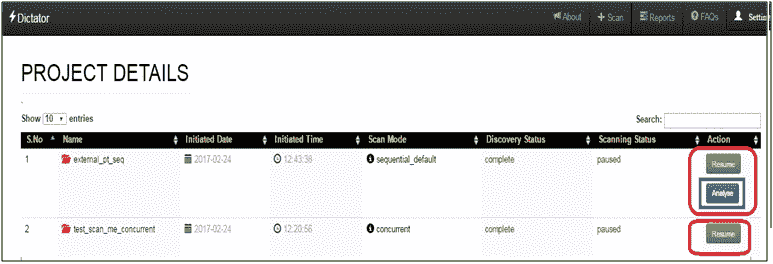

# 下载报告或分析扫描何时完成

当扫描完成时，用户将在 UI 上获得**全部下载**的选项。如果用户访问**当前扫描**选项卡，对于所有发现和服务扫描状态为**完成**的扫描，**操作**列将默认具有下载结果的选项，以进行离线分析或在线分析结果，如下图所示：

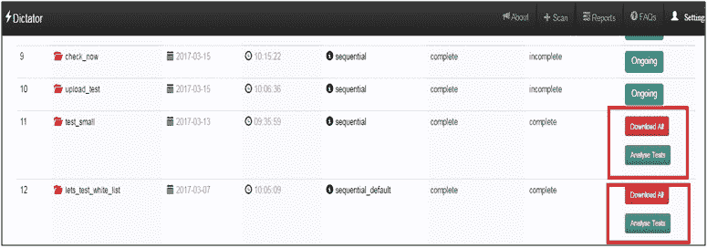

点击**全部下载**，将下载一个压缩文件夹。它将包括：

+   包含所有测试用例结果的最终 HTML 报告。

+   Pcap 文件可以嗅探需要嗅探的某些服务。Pcap 文件可以用 Wireshark 打开并分析文本/凭据是以明文还是加密格式传递的。注意：Pcap 文件的名称将类似于`<project_id>_capture_output.pcap`。因此，如果在`host1`上对端口`21`和项目 ID`100`进行嗅探，Pcap 文件名称将是`100_host1_21_capture_output.pcap`。

+   下载的文件夹还将包含最终选择的配置（服务-测试用例），用于启动扫描（JSON 格式）

+   另一方面，点击**分析测试**将带我们到用户界面，我们可以在那里看到所有`test_cases`的结果。

# 报告

要上传 Nmap 报告，请转到**上传报告**并选择 Nmap 报告。这是一个结果导入模块，可以读取现有的`Nmap.xml`报告文件中的结果，并将这些发现导入到我们的自定义数据库中，并进一步使用这些发现来启动测试用例/服务扫描。因此，这使用户可以在两种模式下使用我们的工具：

+   发现和服务扫描一起

+   仅服务扫描模式


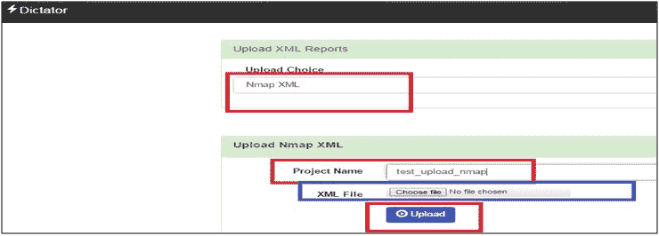

点击**上传**，报告将被解析和上传。用户可以转到**当前扫描**选项卡，会发现已上传的项目`test_upload_nmap`列在那里，其**发现状态**为**完成**，**服务扫描**状态为**未完成**。用户可以点击**操作**选项卡**进行中**，重新配置结果，然后开始服务扫描。

+   Qualys 和 Nessus 报告解析器

要使用此选项，请转到**上传报告**选项卡，并选择**Qualys**/**Nessus**报告。我们有一个报告合并模块，可以合并从 Qualys、Nessus 和手动测试用例获得的结果。为了合并报告，它们必须首先被解析。我们有 Qualys、Nmap 和 Nessus 报告解析器。它们都将以 XML 格式接收报告，并解析报告并将其放置在本地存储中，以便查询和将结果与其他报告集成变得更容易：


在这里上传报告的目的是将其与某个手动项目合并。因此，从下拉列表中选择要将 Nessus/Qualys 报告合并的项目。

+   报告合并：

要使用此选项，请转到**合并报告**选项卡，并选择您希望将 Qualys 和 Nessus 结果集成的手动项目的**ID**/**名称**。

它假定 Nessus 和 Qualys 报告已经被上传并链接到它们应该合并的项目。

该模块合并了手动测试用例、解析的 Qualys 报告、解析的 Nessus 报告，并将 CVE 映射到利用，最后，将为用户提供下载集成报告的选项，格式包括（XML、HTML、CSV、JSON），从而提供一个统一的分析视图。


最终可下载的报告有四种格式（HTML、CSV、JSON、XML）。

合并报告将根据 Nessus/Qualys 和手动测试用例中发现的共同结果进行合并。它将共同的主机和端口聚合到一组中，以便分析变得更容易。

# 摘要

在本章中，我们讨论了如何使用各种 Python 模块来实现服务扫描自动化的任务。我们还研究了如何使用线程和多进程的组合来解决现实世界的问题。本章讨论的所有概念在前几章中都有所提及。通过本章的学习，读者应该对 Python 在网络安全领域有多么强大以及我们如何使用它来创建自己的扫描器有了很好的理解。我们还在 GUI 模式下概述了漏洞扫描器。

在下一章中，我们将看到如何使用机器学习和自然语言处理来自动化渗透测试阶段的手动报告分析。

# 问题

1.  为什么我们不使用 msfrpc 来自动化 Metasploit？

1.  我们可能还可以做些什么来进一步优化吞吐量？

1.  使用 JSON 文件是强制性的吗？我们可以使用数据库吗？

1.  我们还可以将哪些其他工具与扫描仪集成？

# 进一步阅读

+   Python-nmap 0.6.1：[`pypi.org/project/python-nmap/`](https://pypi.org/project/python-nmap/)

+   从 Python 使用 nmap：[`xael.org/pages/python-nmap-en.html`](https://xael.org/pages/python-nmap-en.html)

+   JSON 编码器和解码器：[`docs.python.org/2/library/json.html`](https://docs.python.org/2/library/json.html)
