# 第七章：机器学习和网络安全

如今，**机器学习**（**ML**）是一个我们经常遇到的术语。在本章中，我们将概述机器学习的确切含义，它解决的问题类型，以及它在网络安全生态系统中的应用类型。我们还将研究各种不同类型的机器学习模型，以及在哪些情况下可以使用哪些模型。值得注意的是，本书的范围不是详细介绍机器学习，而是提供对机器学习及其在网络安全领域的应用的扎实理解。

本章将详细介绍以下主题：

+   机器学习

+   基于回归的机器学习模型

+   分类模型

+   自然语言处理

# 机器学习

让我们从一个基本问题开始：*什么是机器学习，为什么我们要使用它？*

我们可以将机器学习定义为数据科学的一个分支，可以有效解决预测问题。假设我们有过去三个月电子商务网站客户的数据，数据包含特定产品的购买历史（`c_id`，`p_id`，`age`，`gender`，`nationality`，`purchased[yes/no]`）。

我们的目标是利用数据集来识别可能购买产品的客户，基于他们的购买历史。我们可能认为一个好主意是考虑购买列，并假设那些先前购买产品的人最有可能再次购买。然而，一个更好的业务解决方案将考虑所有参数，包括发生最多购买的地区，客户的年龄组和性别等。基于所有这些领域的排列，业务所有者可以更好地了解受产品影响最大的客户类型，因此营销团队可以设计更具体、有针对性的活动。

我们可以通过两种不同的方式来做到这一点。第一种解决方案是使用我们选择的编程语言编写软件，并编写逻辑，给每个讨论的参数赋予特定的权重。然后逻辑将能够告诉我们所有潜在的买家是谁。然而，这种方法的缺点是需要大量时间来起草逻辑，如果添加了新的参数（例如客户的职业），逻辑将需要更改。此外，编写的逻辑只能解决一个特定的业务问题。这是在机器学习开发之前采用的传统方法，目前仍被各种企业使用。

第二种解决方案是使用机器学习。基于客户数据集，我们可以训练一个机器学习模型，并让其预测客户是否是潜在的买家。训练模型涉及将所有训练数据提供给一个机器学习库，该库将考虑所有参数并学习购买产品的客户的共同属性，以及未购买产品的客户的属性。模型学到的内容将被保存在内存中，获得的模型被称为经过训练的。如果模型被提供新客户的数据，它将使用其训练并基于学到的通常导致购买的属性进行预测。以前必须用计算机程序和硬编码逻辑解决的同样的业务问题现在用数学机器学习模型解决。这是我们可以使用机器学习的许多案例之一。

重要的是要记住，如果手头的问题是一个预测问题，机器学习可以应用来获得良好的预测。然而，如果问题的目标是自动化手动任务，机器学习将无济于事；我们需要使用传统的编程方法。机器学习通过使用数学模型来解决预测问题。

**人工智能**（**AI**）是另一个我们经常会遇到的词。现在让我们试着回答另一个问题：**什么是人工智能，它和机器学习有什么不同？**

# 在 Kali Linux 中设置机器学习环境

所有的机器学习库都打包在一个叫做`anaconda`的包中。这将安装 Python 3.5 或最新版本的 Python。要运行机器学习代码，我们需要 Python 3 或更高版本：

1.  从以下网址下载 anaconda：[`conda.io/miniconda.html`](https://conda.io/miniconda.html)。

1.  通过运行`bash Anaconda-latest-Linux-x86_64.sh.>`来安装所有的包。

1.  有关更多详细信息，请参考以下网址：[`conda.io/docs/user-guide/install/linux.html`](https://conda.io/docs/user-guide/install/linux.html)。

# 基于回归的机器学习模型

当我们需要预测连续值而不是离散值时，我们使用回归模型。例如，假设数据集包含员工的工作经验年限和工资。基于这两个值，这个模型被训练并期望根据他们的*工作经验年限*来预测员工的工资。由于工资是一个连续的数字，我们可以使用基于回归的机器学习模型来解决这种问题。

我们将讨论的各种回归模型如下：

+   简单线性回归

+   多元线性回归

+   多项式回归

+   支持向量回归

+   决策树回归

+   随机森林回归

# 简单线性回归

**简单线性回归**（**SLR**）对线性数据进行特征缩放，如果需要的话。**特征缩放**是一种用来平衡各种属性影响的方法。所有的机器学习模型都是数学性质的，所以在用数据训练模型之前，我们需要应用一些步骤来确保所做的预测不会有偏差。

例如，如果数据集包含三个属性（`age`，`salary`，和`item_purchased[0/1]`），我们作为人类知道，可能会去商店的年龄段在 10 到 70 之间，工资可能在 10,000 到 100,000 或更高之间。在进行预测时，我们希望同时考虑这两个参数，知道哪个年龄段的人在什么工资水平下最有可能购买产品。然而，如果我们在不将年龄和工资缩放到相同水平的情况下训练模型，工资的值会因为它们之间的巨大数值差异而掩盖年龄的影响。为了确保这种情况不会发生，我们对数据集应用特征缩放来平衡它们。

另一个必需的步骤是数据编码，使用**独热编码器**。例如，如果数据集有一个`国家`属性，这是一个分类值，假设有三个类别：俄罗斯、美国和英国。这些词对数学模型来说没有意义。使用独热编码器，我们将数据集转换成（`id`，`age`，`salary`，`Russia`，`UK`，`USA`，`item_purchased`）。现在，所有购买产品并来自俄罗斯的顾客在名为俄罗斯的列下会有数字 1，在美国和英国的列下会有数字 0。

举个例子，假设数据最初如下所示：

| **ID** | **国家** | **年龄** | **工资** | **购买** |
| --- | --- | --- | --- | --- |
| 1 | 美国 | 32 | 70 K | 1 |
| 2 | 俄罗斯 | 26 | 40 K | 1 |
| 3 | 英国 | 32 | 80 K | 0 |

进行数据转换后，我们会得到以下数据集：

| **ID** | **俄罗斯** | **美国** | **英国** | **年龄** | **工资** | **购买** |
| --- | --- | --- | --- | --- | --- | --- |
| 1 | 0 | 1 | - | 0.5 | 0.7 | 1 |
| 2 | 1 | 0 | 0 | 0.4 | 0.4 | 1 |
| 3 | 0 | 0 | 1 | 0.5 | 0.8 | 0 |

可以看到得到的数据集是纯数学的，所以我们现在可以把它交给我们的回归模型来学习，然后进行预测。

需要注意的是，帮助进行预测的输入变量被称为自变量。在前面的例子中，`country`、`age`和`salary`是自变量。定义预测的输出变量被称为因变量，在我们的例子中是`Purchased`列。

# 回归模型如何工作？

我们的目标是在数据集上训练一个机器学习模型，然后要求模型进行预测，以确定应根据员工的工作经验给予的薪资。

我们考虑的例子是基于 Excel 表的。基本上，我们有一家公司的数据，其中薪资结构是基于工作经验年限的。我们希望我们的机器学习模型能够推导出工作经验年限和给定薪资之间的相关性。根据推导出的相关性，我们希望模型能够提供未来的预测并指定建模薪资。机器通过简单线性回归来实现这一点。在简单线性回归中，通过给定的散点数据绘制各种线条（趋势线）。趋势线的理念是它应该最佳拟合（穿过）所有的散点数据。之后，通过计算建模差异来选择最佳的趋势线。这可以进一步解释如下：


继续使用相同的例子，让我们以员工“e”为例，他在实际工作中拥有 10 年的经验，薪资为 100,000。然而，根据模型，员工实际上应该获得的薪资要低一些，如绿色`+`所示，绿色`+`下方的线实际上低于组织所遵循的线（建模薪资）。绿色虚线表示实际薪资和建模薪资之间的差异（约 80K）。它由*yi -yi^*给出，其中*yi*是实际薪资，*yi^*是模式。

SLR 通过数据绘制所有可能的趋势线，然后计算整条线的*（y-y^）*²*的和。然后找到计算平方的最小值。具有最小平方和的线被认为是最适合数据的线。这种方法称为**最小二乘法**或**欧几里得距离法**。最小二乘法是一种数学回归分析方法，它为数据集找到最佳拟合线，提供了数据点之间关系的可视化演示。

以下屏幕截图表示回归模型绘制的各种预测线：

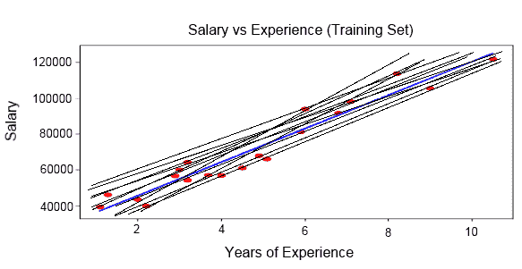

基于平方和方法，选择了最佳拟合线，如下所示：

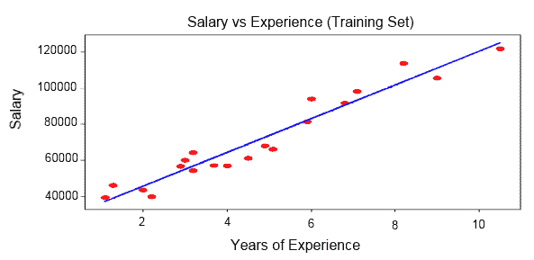

基本上，绘制的数据点不在一条直线上，而是在直线的两侧对称绘制，如下所示：

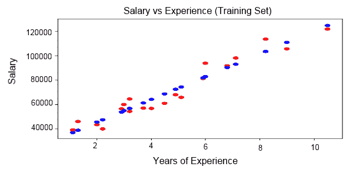

以下部分代表了实现 SLR 的代码：


# 多元线性回归

SLR 适用于具有一个自变量和一个因变量的数据集。它在*XY*维度空间中绘制两者，根据数据集绘制趋势线，最后通过选择最佳拟合线进行预测。然而，现在我们需要考虑的是如果因变量的数量超过*一个*会发生什么。这就是多元线性回归出现的地方。**多元线性回归**（**MLR**）使用多个自变量并在 n 维空间中绘制它们以进行预测。

我们现在将处理一个包含与 50 家初创公司相关信息的不同数据集。数据基本上包括公司在各种垂直领域（如研发、行政和营销）上的支出。它还指示了公司所在的州以及每个垂直领域的净利润。显然，利润是因变量，其他因素是自变量。

在这里，我们将从投资者的角度进行分析，他想要分析各种参数，并预测应该在哪些垂直领域投入更多的收入，并在哪个州，以最大化利润。例如，可能有一些州在其中更多地投入研发会带来更好的结果，或者其他一些州在其中更多地投入营销更有利可图。该模型应该能够预测应该投资哪些垂直领域，如下所示：

！[](img/f49826c0-9324-4325-a2e5-5da36f4187d5.png)

鉴于我们有多个自变量，如下所示，对于我们来说，识别哪些是实际有用的，哪些是无用的也很重要：

！[](img/82204bed-9eeb-48f0-b68f-04c601b37613.png)

虽然一些自变量可能会对最终的因变量产生影响，但其他一些可能不会。为了提高模型的准确性，我们必须消除对因变量影响较小的所有变量。有五种方法可以消除这些变量，如下图所示，但最可靠的是**向后消除**： 

！[](img/38446cdc-c2a3-44bf-9cbd-ea35b7243dae.png)

向后消除的工作原理如下所示：

！[](img/35ac9100-ec27-4f8e-a22f-9adfd8722ff8.png)

我们在前面的方法中所说的显著水平是指能够表明正在检查的变量对因变量或最终预测至关重要的最低阈值值。

**P 值**是确定因变量和自变量之间关系是否随机的概率。对于任何给定的变量，如果计算得到的 P 值等于 0.9，这将表明该自变量与最终因变量之间的关系是 90%随机的，因此对自变量的任何改变可能不会直接影响因变量。另一方面，如果另一个变量的 P 值为 0.1，这意味着该变量与因变量之间的关系并非是随机的，对该变量的改变将直接影响输出。

我们应该从分析数据集开始，找出对预测有重要意义的自变量。我们必须只在这些变量上训练我们的数据模型。以下代码片段表示了向后消除的实现，这将让我们了解哪些变量应该被排除，哪些应该被保留：

！[](img/035d5bc5-1d47-4097-bfc1-2c07b2c491d1.png)

以下是前面代码片段中使用的主要函数的解释：

+   `X[:,[0,1,2,3,4,5]]`表示我们将所有行和从 90 到 5 的所有列传递给向后消除函数

+   `sm.OLS`是一个内部 Python 库，用于 P 值计算

+   `regressor_OLS.summary()`将在控制台上显示一个摘要，帮助我们决定哪些数据变量要保留，哪些要排除

在下面的示例中，我们正在对所有变量进行模型训练。但是建议使用之前获得的`X_Modeled`，而不是`X`：

！[](img/8d93203b-2aed-462a-a4cc-539647e36472.png)

在 MLR 中，应该注意的是，预测也是基于最佳拟合线进行的，但在这种情况下，最佳拟合线是在多个维度上绘制的。以下屏幕截图给出了数据集在 n 维空间中的绘制方式：

！[](img/83debebc-309c-4c0a-9bad-1bf7706ccca2.png)

还有其他各种回归模型适用于其他类型的数据集，但涵盖它们都超出了本书的范围。然而，提到的两个模型应该让我们了解回归模型的工作原理。在下一节中，我们将讨论**分类模型**。我们将更详细地研究一个分类模型，并看看我们如何在自然语言处理中使用它来应用 ML 在渗透测试生态系统中。

# 分类模型

与回归模型不同，回归模型预测连续数字，分类模型用于预测给定类别列表中的类别。之前讨论的业务问题，我们在过去三个月内有关电子商务网站客户的数据，其中包含特定产品的购买历史（`c_id`，`p_id`，`age`，`gender`，`nationality`，`salary`，`purchased[yes/no]`）。我们的目标与之前一样，是根据他们的购买历史来识别可能购买产品的客户。根据所有独立变量（`age`，`gender`，`nationality`，`salary`）的排列组合，分类模型可以进行 1 和 0 的预测，1 表示给定客户将购买产品的预测，0 表示他们不会。在这种情况下，有两个类别（0 和 1）。然而，根据业务问题，输出类别的数量可能会有所不同。常用的不同分类模型如下所示：

+   朴素贝叶斯

+   逻辑回归

+   K 最近邻

+   支持向量机

+   核 SVM

+   决策树分类器

+   随机森林分类器

# 朴素贝叶斯分类器

让我们尝试通过朴素贝叶斯分类器来理解分类模型的工作原理。为了理解朴素贝叶斯分类器，我们需要理解贝叶斯定理。贝叶斯定理是我们在概率中学习的定理，并可以通过一个例子来解释。

假设我们有两台机器，两台机器都生产扳手。扳手上标有生产它们的机器。M1 是机器 1 的标签，M2 是机器 2 的标签。

假设有一个扳手是有缺陷的，我们想找到有缺陷的扳手是由机器 2 生产的概率。提供 B 已经发生的情况下 A 发生的概率由朴素贝叶斯定理确定。因此，我们使用贝叶斯定理如下：


+   P(A)代表事件发生的概率。

+   p(B/A)代表 A 发生的情况下 B 发生的概率。

+   P(B)代表 B 发生的概率。

+   p(A/B)代表 B 发生的情况下 A 发生的概率（假设 B 已经发生的情况下 A 发生的概率）。

+   如果我们用概率来表示数据，我们得到以下结果：

| 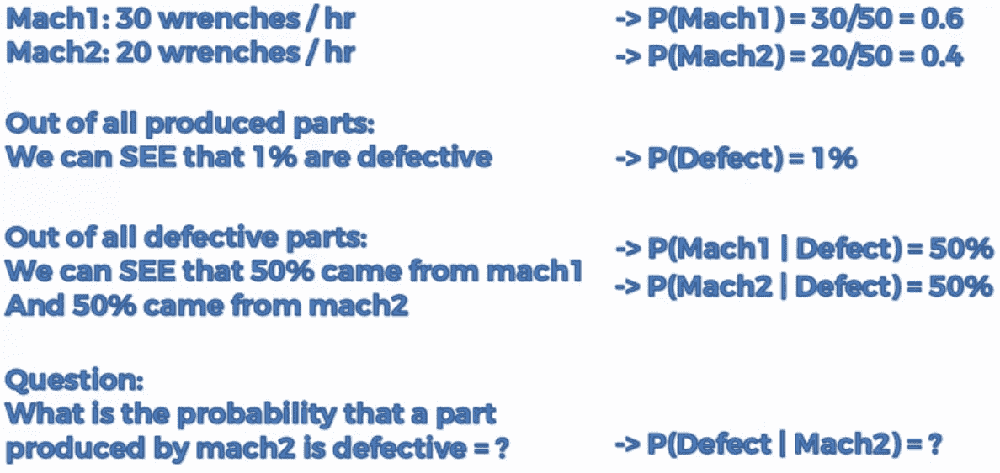 |  |
| --- | --- |

假设我们有一个人的数据集，有些人步行上班，有些人开车上班，这取决于他们所属的年龄类别：

|  |                      |
| --- | --- |

如果添加了一个新的数据点，我们应该能够判断那个人是开车上班还是步行上班。这是监督学习；我们正在对数据集进行机器训练，并从中得出一个学习模型。我们将应用贝叶斯定理来确定新数据点属于步行类别和驾驶类别的概率。

为了计算新数据点属于步行类别的概率，我们计算*P(Walk/X)*。这里，*X*代表给定人的特征，包括他们的年龄和工资：

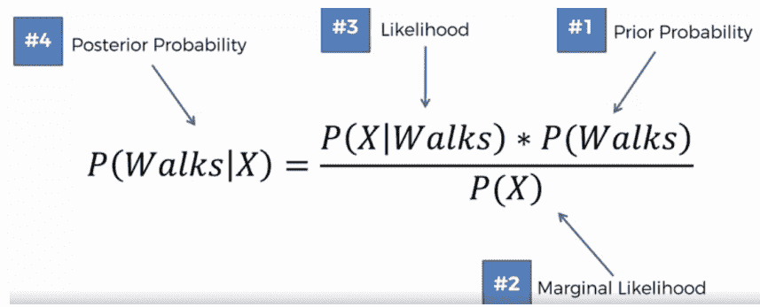

为了计算新数据点属于驾驶类别的概率，我们计算*P(Drives/X)*如下所示：

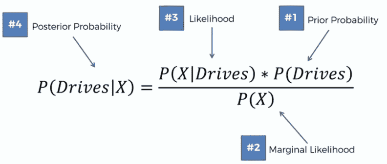

最后，我们将比较*P(Walks/X)*和*P(Drives/X)。*基于这个比较，我们将确定在哪个类别中放置新数据点（在概率更高的类别中）。最初的绘图发生在 n 维空间中，取决于独立变量的值。

接下来，我们计算边际似然，如下图所示，即 P(X)：

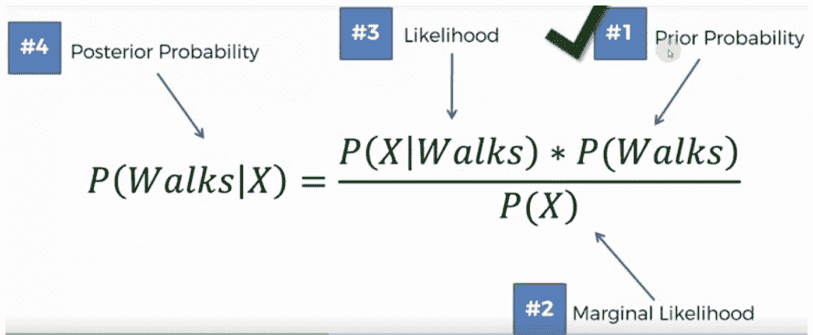

*P(X)*实际上是指将新数据点添加到具有相似特征数据点的概率。该算法将划分或在发现具有与即将添加的数据点相似特征的数据点周围画一个圆。然后，计算特征的概率为*P(X) =相似观察的数量/总观察数量*。

+   圆的半径在这种情况下是一个重要的参数。这个半径作为算法的输入参数给出：


+   在这个例子中，圆内的所有点被假定具有与要添加的数据点相似的特征。假设我们要添加的数据点与一个 35 岁，年薪 40,000 美元的人相关。在这种情况下，圆内的所有人都会被选中：

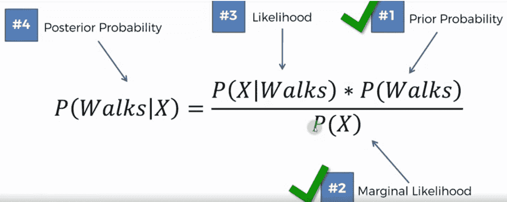

+   接下来，我们需要计算似然，即随机选择一个步行者包含 X 的特征的概率。以下将确定*P(X/walks)*：


+   我们将使用相同的方法来推导数据点属于驾驶部分的概率，假设它具有与步行者相同的特征

+   在这种情况下，P(X)等于落在之前所示圆内的相似观察的数量，除以总观察数量。P(X) = 4/30 = 0.133

+   P(drives) = P(# who drive) / (#total) = 20/30 = 0.666

+   P(X|Drivers) = P(相似的驾驶员观察) / 总驾驶员 = 1/20 = 0.05

+   应用我们得到的值，得到 P(Drivers|X) = 0.05 * 0.666 / 0.133 = 0.25 => 25

对于给定的问题，我们将假设数据点属于步行者的集合。

# 总结朴素贝叶斯分类器

以下项目将迄今讨论的所有概念整合起来，总结了我们对朴素贝叶斯分类器的学习：

+   应该注意的是，朴素贝叶斯分类器在训练后并没有一个计算出的模型。事实上，在预测时，所有数据点只是根据它们属于哪个类别进行简单的标记。

+   在预测时，根据独立变量的值，数据点将在 n 维空间中的特定位置计算并绘制。目标是预测数据点在 N 个类别中属于哪个类别。

+   基于独立变量，数据点将在接近具有相似特征的数据点的向量空间中绘制。然而，这仍然不能确定数据点属于哪个类别。

+   根据最初选择的最佳半径值，将在该数据点周围画一个圆，将圆的半径内的一些其他点包围起来。

+   假设我们有两个类别，A 和 B，我们需要确定新数据点 X 的类别。贝叶斯定理将用于确定 X 属于类 A 的概率和 X 属于类 B 的概率。具有更高概率的那个类别就是预测数据点所属的类别。

# 实现代码

假设我们有一家名为 X 的汽车公司，拥有一些关于人们的数据，包括他们的年龄、薪水和其他信息。它还包括关于这些人是否购买了公司以非常昂贵的价格推出的 SUV 的详细信息。这些数据用于帮助他们了解谁购买了他们的汽车：


我们将使用相同的数据来训练我们的模型，以便它可以预测一个人是否会购买一辆汽车，给定他们的`年龄`、`薪水`和`性别`：

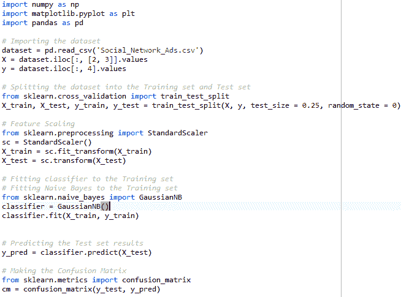

以下截图显示了前 12 个数据点的`y_pred`和`y_test`之间的差异：

|  | 前面的截图代表了混淆矩阵的输出。

+   单元格[0,0]代表了输出为 0 且被预测为 0 的总案例。

+   单元格[0,1]代表了输出为 0 但被预测为 1 的总案例。

+   单元格[1,0]代表了输出为 1 但被预测为 0 的总案例。

+   单元格[1,1]代表了输出为 1 且被预测为 1 的总案例。

如果我们从先前的数据集中获取统计数据，我们可以看到在 100 次预测中，有 90 次是正确的，10 次是错误的，给出了 90%的准确率。

# 自然语言处理

**自然语言处理**（**NLP**）是关于分析文本、文章并进行对文本数据的预测分析。我们将制作的算法将解决一个简单的问题，但相同的概念适用于任何文本。我们也可以使用 NLP 来预测一本书的类型。

考虑以下的 Tab 分隔值（TSV），这是一个用于应用 NLP 并查看其工作原理的制表符分隔的数据集：


这是我们将要处理的数据的一小部分。在这种情况下，数据代表了关于餐厅的顾客评论。评论以文本形式给出，并且有一个评分，即 0 或 1，表示顾客是否喜欢这家餐厅。1 表示评论是积极的，0 表示不是积极的。

通常，我们会使用 CSV 文件。然而，在这里，我们使用的是 TSV 文件，分隔符是制表符，因为我们正在处理基于文本的数据，所以可能会有逗号，这些逗号并不表示分隔符。例如，如果我们看第 14 条记录，我们可以看到文本中有一个逗号。如果这是一个 CSV 文件，Python 会将句子的前半部分作为评论，后半部分作为评分，而`1`会被视为一个新的评论。这将破坏整个模型。

该数据集大约有 1,000 条评论，并且已经被手动标记。由于我们正在导入一个 TSV 文件，`pandas.read_csv`的一些参数需要更改。首先，我们指定分隔符是制表符分隔的，使用/t。我们还应该忽略双引号，可以通过指定参数 quoting=3 来实现：


导入的数据集如下所示：


我们可以看到成功导入了 1,000 条评论。所有评论都在评论列中，所有评分都在**Liked**列中。在 NLP 中，我们必须在使用文本数据之前对其进行清理。这是因为 NLP 算法使用词袋概念工作，这意味着只保留导致预测的单词。词袋实际上只包含影响预测的相关单词。例如`a`，`the`，`on`等单词在这种情况下被认为是不相关的。我们还摆脱点和数字，除非需要数字，并对单词进行词干处理。词干处理的一个例子是用`love`代替`loved`。我们应用词干处理的原因是因为我们不希望最终有太多的单词，并且还要将`loving`和`loved`等单词重新组合成一个单词`love`。我们还去掉大写字母，并将所有内容转换为小写。要应用我们的词袋模型，我们需要应用标记化。这样做后，我们将有不同的单词，因为预处理将消除不相关的单词。

然后，我们取出不同评论的所有单词，并为每个单词创建一列。可能会有许多列，因为评论中可能有许多不同的单词。然后，对于每条评论，每个列将包含一个数字，指示该特定评论中该单词出现的次数。这种类型的矩阵称为稀疏矩阵，因为数据集中可能有许多零。

`dataset['Review'][0]`命令将给出我们的第一条评论：


我们使用正则表达式的一个子模块，如下所示：


我们正在使用的子模块称为减法函数。这将从我们的输入字符串中减去指定的字符。它还可以将单词组合在一起，并用您选择的字符替换指定的字符。要替换的字符可以输入为字符串，也可以输入为正则表达式格式。在前面的示例中，正则表达式格式中的^符号表示不，[a-zA-Z]表示除 a-z 和 A-Z 之外的所有内容应该被一个空格' '替换。在给定的字符串中，点将被移除并替换为空格，产生以下输出：`Wow Loved this place`。

我们现在删除所有不重要的单词，例如`the`，`a`，`this`等。为此，我们将使用`nltk`库（自然语言工具包）。它有一个名为 stopwords 的子模块，其中包含所有与句子意义获取无关的单词（通用单词）。要下载停用词，我们使用以下命令：


这将从当前路径下载停用词，然后可以直接使用它们。首先，我们将评论分成单词列表，然后我们遍历不同的单词，并将它们与下载的停用词进行比较，删除那些不必要的单词：


在前面的代码片段中，我们正在使用一个 for 循环。在 review 前面声明`[]`符号表示列表将包含从 for 循环返回的单词，这些单词在这种情况下是停用词。

在`for`循环之前的代码表示我们应该分配字符串单词，并且每次单词出现在评论列表中并且不出现在`stopwords.words('English')`列表中时，更新列表中的新单词。请注意，我们正在使用`set()`函数将给定的停用词列表实际转换为集合，因为在 Python 中，集合上的搜索操作比列表快得多。最后，评论将包含我们的无关紧要的单词。在这种情况下，对于第一条评论，它将包含[`wov`，`loved`，`place`]。

下一步是进行词干提取。我们应用词干提取的原因是为了避免稀疏性，即在我们的矩阵中有大量的零（称为稀疏矩阵）时发生的情况。为了减少稀疏性，我们需要减少矩阵中零的比例。

我们将使用 portstemmer 库对每个单词应用词干提取：


现在，评论将包含[`wov`, `love`, `place`]。

在这一步中，我们将通过调用`join`将列表中转换后的字符串评论连接成一个字符串。我们将使用空格作为`delimiter` `' '.join(review)`将评论列表中的所有单词连接在一起，然后我们使用`' '`作为分隔符来分隔单词。

现在评论是一个包含所有小写相关单词的字符串：

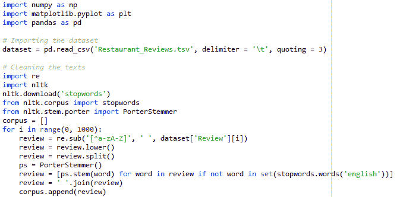

执行代码后，如果我们比较原始数据集和获得的语料库列表，我们将得到以下结果：

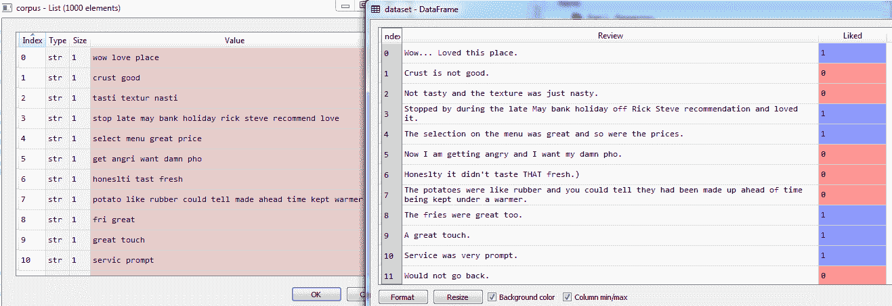

由于停用词列表中也有单词`Not`，索引 1 处的字符串`Crust is not good`（`Liked`评分为 0）变为了`crust good`。我们需要确保这不会发生。同样，`would not go back`变成了`would go back`。处理它的一种方法是使用一个停用词列表，如`set(stopwords.words('english'))]`。

接下来，我们将创建一个词袋模型。在这里，将使用获得的语料库（句子列表）中的不同单词，并为每个不同的单词创建一列。不会重复任何单词。

因此，诸如`wov love place`，`crust good`，`tasti textur nasti`等单词将被取出，并为每个单词创建一列。每一列将对应一个不同的单词。我们还将有评论和一个条目编号，指定该特定评论中单词存在的次数。

有了这种设置，我们的表中会有很多零，因为可能有一些单词并不经常出现。目标应该始终是将稀疏性保持到最低，这样只有相关的单词才能指向预测。这将产生一个更好的模型。我们刚刚创建的稀疏矩阵将成为我们的词袋模型，并且它的工作方式就像我们的分类模型一样。我们有一些独立变量取一些值（在这种情况下，独立变量是评论单词），并且根据独立变量的值，我们将预测依赖变量，即评论是积极的还是否定的。为了创建我们的词袋模型，我们将应用一个分类模型来预测每个新评论是积极的还是消极的。我们将使用标记化和一个名为**CountVectoriser**的工具来创建一个词袋模型。

我们将使用以下代码来使用这个库：

```py
from sklearn.feature_extraction.text import CountVectorizer
```

接下来，我们将创建这个类的一个实例。参数中有一个停用词作为其中一个参数，但由于我们已经将停用词应用到我们的数据集中，我们不需要再次这样做。这个类还允许我们控制大小写和标记模式。我们也可以选择使用这个类来执行之前的所有步骤，但是分开执行可以更好地进行细粒度控制。


请注意，行`cv.fit_transform`实际上会将稀疏矩阵拟合到 cv，并返回一个具有语料库中所有单词的特征矩阵。

到目前为止，我们已经制作了我们的词袋，或者稀疏矩阵，一个独立变量的矩阵。下一步是使用分类模型，并在词袋的一部分-X 上训练模型，以及在相同索引上的依赖变量-Y。在这种情况下，依赖变量是`Liked`列。

执行上述代码将创建一个包含大约 1565 个特征（不同列）的特征矩阵。如果不同特征的数量非常大，我们可以限制最大特征并指定最大阈值。假设我们将阈值数指定为 1500，那么只有 1500 个特征或不同的单词将被纳入稀疏矩阵，那些与前 1500 个相比较少的将被移除。这将更好地相关独立和因变量，进一步减少稀疏性。

现在我们需要在词袋模型单词和因变量上训练我们的分类模型：

提取因变量如下：


`X`和`Y`如下所示：

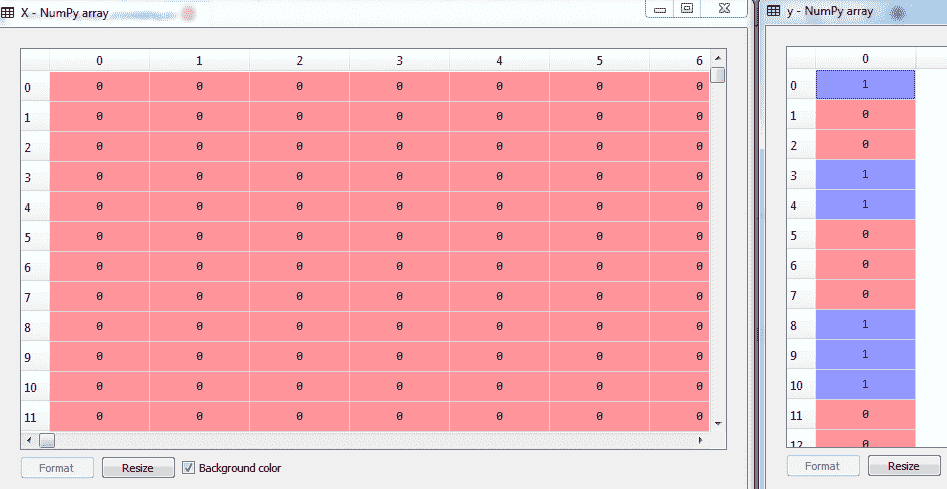

请注意，在前面的情况下，每个索引（0-1499）对应于原始语料库列表中的一个单词。我们现在拥有了分类模型中的内容：独立变量和结果的度量，负面评价为 0，正面评价为 1。然而，我们仍然有相当多的稀疏性。

我们的下一步是利用分类模型进行训练。有两种使用分类模型的方法。一种方法是测试所有分类模型并确定假阳性和假阴性，另一种方法是基于经验和过去的实验。在 NLP 中最常用的模型是朴素贝叶斯和决策树或随机森林分类。在本教程中，我们将使用朴素贝叶斯模型：


整个代码如下所示：

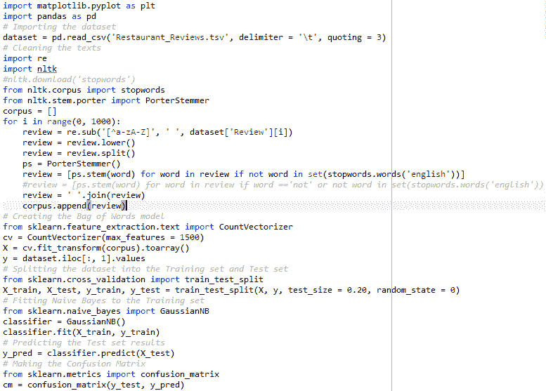

从上述代码中，我们可以看到我们将训练集和测试集分为 80%和 20%。我们将给训练集 800 个观察值，测试集 200 个观察值，并查看我们的模型将如何表现。执行后的混淆矩阵的值如下：

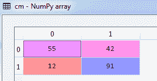

负面评价有 55 个正确预测，正面评价有 91 个正确预测。负面评价有 42 个错误预测，正面评价有 12 个错误预测。因此，在 200 次预测中，有 146 次正确预测，相当于 73%。

# 使用自然语言处理处理渗透测试报告

我在网络安全领域中使用 ML 的一个应用是自动化报告分析以发现漏洞。我们现在知道上一章中构建的漏洞扫描器是如何工作的，但所有集成脚本和工具产生的数据量巨大，我们需要手动处理或分析它。在 Typical scanners 如 Nessus 或 Qualys 中，插件实际上是脚本。由于它们是由 Nessus 和 Qualys 内部开发的，这些脚本旨在发现缺陷并以易于理解的方式报告它们。然而，在我们的情况下，我们正在集成许多开源脚本和工具集，并且产生的输出并不是集成的。为了自动化这项任务并获得漏洞的概述，我们需要弄清楚脚本或工具产生的输出，在标记漏洞的情况下，以及在返回安全检查的情况下。根据我们的理解和每个脚本的预期输出模式，我们必须起草我们的 Python 代码逻辑，以发现哪个插件产生了不安全的检查结果，哪个返回了安全检查。这需要大量的工作。每当我们增加集成脚本的数量时，我们的代码逻辑也需要更新，所以你可以选择是否要走这条路。

我们手头还有另一种方法，那就是利用机器学习和 NLP。由于我们可以获得大量的历史渗透测试数据，为什么不将其提供给机器学习模型，并训练它理解什么是不安全的，什么是安全的呢？多亏了我们使用漏洞扫描器执行的历史渗透测试报告，我们的数据库表中有大量数据。我们可以尝试重用这些数据，利用机器学习和 NLP 自动化手动报告分析。我们谈论的是监督学习，它需要一次性的工作来适当地标记数据。假设我们拿过去进行的最后 10 次渗透测试的历史数据，每次测试平均有 3 个 IP。我们还假设每个 IP 平均执行 100 个脚本（取决于开放端口的数量）。这意味着我们有 3000 个脚本的数据。

我们需要手动标记结果。或者，如果测试人员在用户界面中呈现数据时，可以通过复选框选择**易受攻击**/**不易受攻击**，这将作为数据的标记。假设我们能够将所有结果数据标记为 1，表示测试用例或检查结果安全，标记为 0，表示测试用例结果不安全。然后我们将得到标记的数据进行预处理，并提供给我们的 NLP 模型进行训练。一旦模型训练完成，我们就会持久化模型。最后，在实时扫描期间，我们将测试用例的结果传递给我们训练好的模型，让它对结果易受攻击的测试用例进行预测。测试人员只需要专注于易受攻击的测试用例，并准备其利用步骤。

为了演示这个概念的 POC，让我们拿一个项目的结果，并只考虑运行`ssl`和`http`的脚本。让我们看看代码的运行情况。

# 第 1 步-标记原始数据

以下是我们使用漏洞扫描器扫描的一个项目上进行的`ssl`和`http`检查的输出。数据是从后端 IPexploits 表中获取的，并且标记为 0 表示检查不容易受攻击，标记为 1 表示测试不安全。我们可以在以下截图中看到这一点。这是一个带有模式（`command_id`，`recored_id`，`service_result`，`vul[0/1]`）的 TSV 文件：


现在我们已经标记了数据，让我们处理和清理它。之后，我们将用它来训练我们的 NLP 模型。我们将使用 NLP 的朴素贝叶斯分类器。我在当前数据集上使用这个模型取得了不错的成功。测试各种其他模型并看看是否能够获得更好的预测成功率将是一个很好的练习。

# 第 2 步-编写训练和测试模型的代码

以下代码与我们在 NLP 部分讨论的内容完全相同，只是在使用`pickle.dump`将训练好的模型保存到文件中时添加了一些内容。我们还使用`pickle.load`来加载保存的模型：


以下截图显示了我们训练模型为数据集提供的混淆矩阵的结果。我们在 80%的数据集上训练了模型，并在 20%的数据集上进行了测试。得到的结果表明，我们的模型预测准确率为 92%。需要注意的是，对于更大的数据集，准确性可能会有所不同。这里的想法是让您了解 NLP 如何与渗透测试报告一起使用。我们可以改进处理以提供更干净的数据，并改变模型选择以获得更好的结果：


# 摘要

在本章中，我们讨论了如何使用 Python 进行机器学习，以及如何将其应用于网络安全领域。在网络安全领域中，数据科学和机器学习有许多其他精彩的应用，涉及日志分析、流量监控、异常检测、数据外泄、URL 分析、垃圾邮件检测等。现代 SIEM 解决方案大多建立在机器学习之上，并且使用大数据引擎来减少人工分析。请参考进一步阅读部分，了解机器学习在网络安全中的其他用例。还必须注意的是，渗透测试人员有必要了解机器学习，以便发现漏洞。在下一章中，用户将了解如何使用 Python 自动化各种网络应用攻击类型，包括 SQLI、XSS、CSRF 和点击劫持。

# 问题

1.  与机器学习相关的各种漏洞是什么？

1.  什么是大数据，有哪些已知漏洞的大数据产品示例？

1.  机器学习和人工智能之间有什么区别？

1.  哪些渗透测试工具使用机器学习，以及原因？

# 进一步阅读

+   使用机器学习检测钓鱼网站：[`github.com/abhishekdid/detecting-phishing-websites`](https://github.com/abhishekdid/detecting-phishing-websites)

+   使用机器学习进行日志分析：[`github.com/logpai`](https://github.com/logpai)

+   网络安全的自然语言处理：[`www.recordedfuture.com/machine-learning-cybersecurity-applications/`](https://www.recordedfuture.com/machine-learning-cybersecurity-applications/)

+   使用机器学习进行垃圾邮件检测：[`github.com/Meenapintu/Spam-Detection`](https://github.com/Meenapintu/Spam-Detection)

+   Python 深度学习：[`www.manning.com/books/deep-learning-with-python`](https://www.manning.com/books/deep-learning-with-python)
