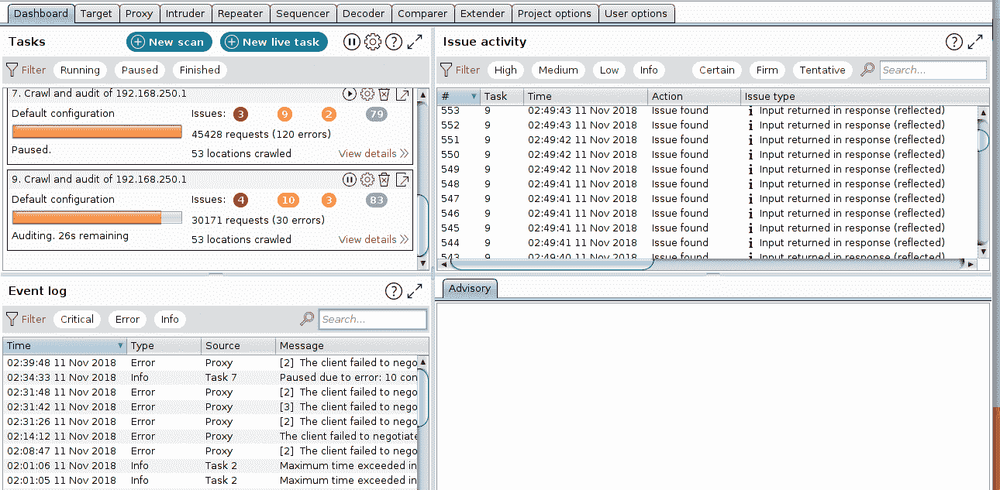
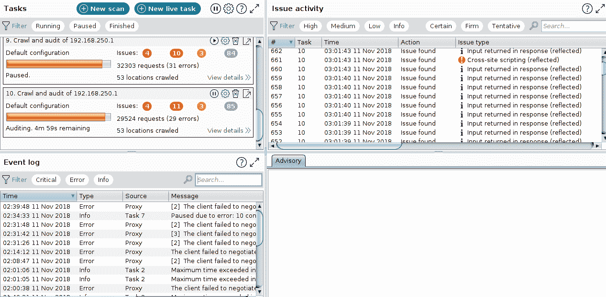
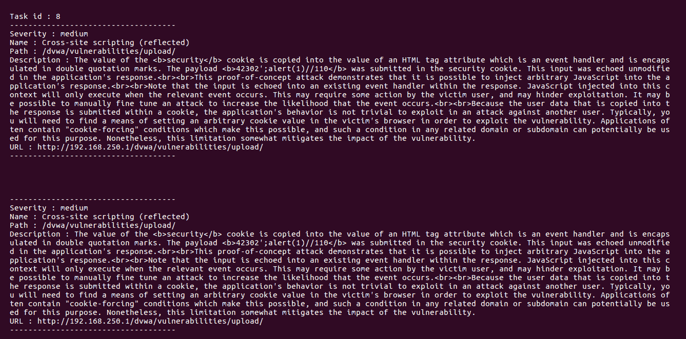
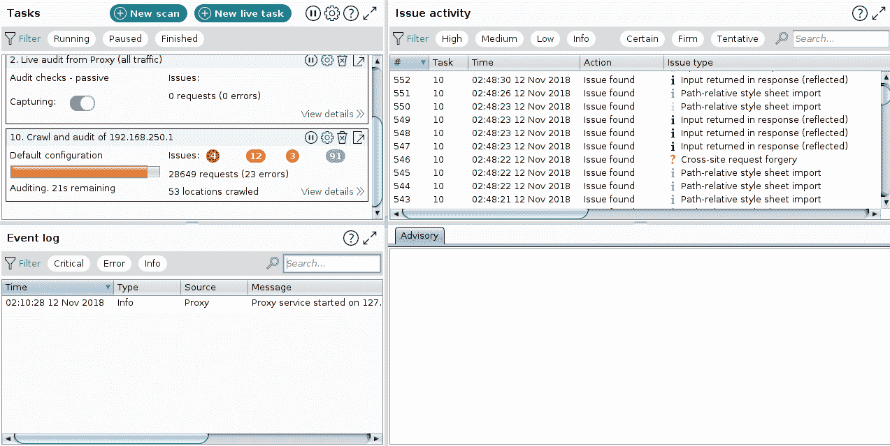
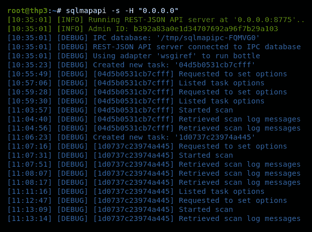
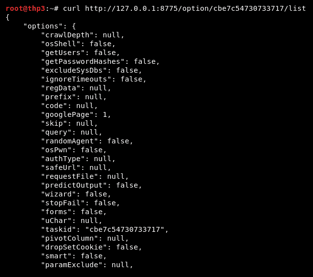

# 自动化 Web 应用程序扫描-第 1 部分

当我们谈论 Web 应用程序扫描时，会想到各种攻击向量，如 SQL 注入、XSS、CSRF、LFI 和 RFI。当我们谈论 Web 应用程序测试时，我们可能会想到 Burp Suite。在本章中，我们将研究如何使用 Python 来尝试自动化 Web 应用程序攻击向量检测。我们还将看看如何使用 Python 来自动化 Burp 扫描，以覆盖我们否则需要手动发现的漏洞。在本章中，我们将研究以下主题：

+   使用 Burp Suite 自动化 Web 应用程序扫描

+   使用 Python 自动化 Burp

+   SQL 注入

+   使用 Python 自动检测 SQL 注入

# 使用 Burp Suite 自动化 Web 应用程序扫描

Burp Suite Professional 在其 API 方面为渗透测试人员提供了额外的功能。借助 Burp Suite Professional API，测试人员可以自动调用扫描并将其发现与其他工具集成。

Burp Suite 目前在其许可版本（burp-suite 专业版）中提供 API 支持。这是所有网络安全专业人员必须拥有的工具之一。我建议获取 Burp Suite 的许可版本，以便充分利用本章内容。

启动 Burp Suite 并按以下方式配置 API：


然后，启动 API 并按以下方式配置 API 密钥：


单击按钮时，密钥将被复制到剪贴板。我们可以按以下方式使用它：


我们可以看到 API 正在端口`1337`上监听。我们使用 API 密钥来引用此端点地址。API 公开了三个端点：获取问题定义、启动扫描和获取正在运行扫描的状态。

让我们看看我们需要的参数，以启动对 Damn Vulnerable Web Application 的新扫描。

应用可以从以下 URL 安装：

+   [`www.dvwa.co.uk/`](http://www.dvwa.co.uk/)

+   [`github.com/ethicalhack3r/DVWA`](https://github.com/ethicalhack3r/DVWA)

安装并设置好后，我们可以使用以下`curl`命令来在网站上启动 Burp 的主动扫描：

```py
curl -vgw "\n" -X POST 'http://127.0.0.1:1337/<API KEY>/v0.1/scan' -d '{"application_logins":[{"password":"password","username":"admin"}],"name":"My first project","scan_configurations":[{"name":"Crawl strategy - fastest","type":"NamedConfiguration"}],"scope":{"exclude":[{"rule":"http://192.168.250.1/dvwa/logout.php","type":"SimpleScopeDef"}],"include":[{"rule":"http://192.168.250.1/dvwa","type":"SimpleScopeDef"}]},"urls":["http://192.168.250.1/dvwa/login.php"]}'

```

包含更详尽的爬行和审计测试的更通用请求如下所示：

```py
curl -vgw "\n" -X POST 'http://127.0.0.1:1337/<API KEY>/v0.1/scan' -d '{"application_logins":[{"password":"password","username":"admin"}],"scope":{"exclude":[{"rule":"http://192.168.250.1/dvwa/logout.php","type":"SimpleScopeDef"}],"include":[{"rule":"http://192.168.250.1/dvwa/","type":"SimpleScopeDef"}]},"urls":["http://192.168.250.1/dvwa/"]}'
```

应注意，前面的请求可以通过 Ubuntu 上的终端发送，也可以使用 Burp API 提供的 Web 界面生成请求。应注意，如果以前面显示的方式调用请求，它将不会返回任何内容，而是会创建一个带有任务 ID 的新扫描。

这可以在 Burp Suite 控制台上看到，如下所示：



在上一张屏幕截图中，我们可以看到创建了一个 ID 为`9`的新任务，并且正在扫描我们本地托管的 Damn Vulnerable Web Application。当截图被捕获时，该任务能够识别出四个高级问题、十个中级问题和三个低级问题。在接下来的部分中，我们可以看到如何使扫描器不断告诉我们扫描的状态。为了做到这一点，我们需要设置一个回调 URL。换句话说，我们需要有一个监听端口，扫描器将不断发送结果。我们可以在控制台上打印如下内容：

```py
curl -vgw "\n" -X POST 'http://127.0.0.1:1337/Sm2fbfwrTQVqwH3VERLKIuXkiVbAwJgm/v0.1/scan' -d '{"application_logins":[{"password":"password","username":"admin"}],"scan_callback":{"url":"http://127.0.0.1:8000"},"scope":{"exclude":[{"rule":"http://192.168.250.1/dvwa/logout.php","type":"SimpleScopeDef"}],"include":[{"rule":"http://192.168.250.1/dvwa/","type":"SimpleScopeDef"}]},"urls":["http://192.168.250.1/dvwa/"]}'
```


扫描的状态和所有发现的内容将发送回指定的地址：



鉴于我们现在了解了如何使用 Burp Suite API 自动化扫描，让我们编写一个 Python 脚本来实现这一点。我们将创建一个 Python 脚本来调用扫描，同时该脚本将监听回调请求并解析响应以显示所有高、中和低问题。

# 使用 Python 进行 Burp 自动化

让我们创建一个简单的 Python 脚本并将其命名为`burp_automate.py`。输入以下代码：

```py
import requests
import json
from urlparse import urljoin
import socket
import ast
import time
class Burp_automate():
    def __init__(self):
        self.result=""
        self.api_key="odTOmUX9mNTV3KRQ4La4J1pov6PEES72"
        self.api_url="http://127.0.0.1:1337"

    def start(self):
        try:

            data='{"application_logins":[{"password":"password","username":"admin"}],"scan_callback":{"url":"http://127.0.0.1:8001"},"scope":{"exclude":[{"rule":"http://192.168.250.1/dvwa/logout.php","type":"SimpleScopeDef"}],"include":[{"rule":"http://192.168.250.1/dvwa/","type":"SimpleScopeDef"}]},"urls":["http://192.168.250.1/dvwa/"]}'
            request_url=urljoin(self.api_url,self.api_key)
            request_url=str(request_url)+"/v0.1/scan"
            resp=requests.post(request_url,data=data)

            self.call_back_listener()
        except Exception as ex:
            print("EXception caught : " +str(ex))

    def poll_details(self,task_id):
        try:
            while 1:
                time.sleep(10)
                request_url=urljoin(self.api_url,self.api_key)
                request_url=str(request_url)+"/v0.1/scan/"+str(task_id)
                resp=requests.get(request_url)
                data_json=resp.json()

                issue_events=data_json["issue_events"]
                for issues in issue_events:

                    if issues["issue"]["severity"] != "info":
                        print("------------------------------------")
                        print("Severity : " + issues["issue"].get("severity",""))
                        print("Name : " + issues["issue"].get("name",""))
                        print("Path : " + issues["issue"].get("path",""))
                        print("Description : " + issues["issue"].get("description",""))
                        if issues["issue"].get("evidence",""):
                            print("URL : " + issues["issue"]["evidence"][0]["request_response"]["url"])
                        print("------------------------------------")
                        print("\n\n\n")
                if data_json["scan_status"]=="succeeded":
                    break

        except Exception as ex:
            print(str(ex))

    def call_back_listener(self):
        try:
            if 1 :
                task_id=0
                s=socket.socket(socket.AF_INET, socket.SOCK_STREAM)
                s.bind(('127.0.0.1', 8001))
                s.listen(10)

                conn, addr = s.accept()

                if conn:
                    while True:
                        data = conn.recv(2048)
                        if not data:
                            break
                        try:
                            index=str(data).find("task_id")
                            task_id=str(data)[index:index+12]
                            task_id=task_id.replace('"',"")
                            splitted=task_id.split(":")
                            t_id=splitted[1]
                            t_id=t_id.lstrip().rstrip()
                            t_id=int(t_id)
                            if t_id:
                                task_id=t_id
                                break
                        except Exception as ex:
                            print("\n\n\nNot found" +str(ex))

                if task_id:
                    print("Task id : " +str(task_id))
                    self.poll_details(task_id)
                else:
                    print("No task id obtaimed,  Exiting : " )

        except Exception as ex:
            print("\n\n\n@@@@Call back exception :" +str(ex))

obj=Burp_automate()
obj.start()

```

当我们执行脚本时，它将显示 Burp 扫描报告的所有问题，这些问题可能是“高”、“中”或“低”性质。

如下截图所示：



以下截图表示扫描的状态和发出的请求总数。脚本将持续运行，直到扫描完成，状态为**成功**：



# SQL 注入

**SQL 注入攻击**是一种攻击，通过该攻击可以更改 SQL 查询的执行以满足攻击者的需求。Web 应用程序可能在后端与数据库交互，并且可能接受用户输入，这些输入形成参数或 SQL 查询的一部分，用于插入、删除、更新或检索数据库表中的数据。在这种情况下，开发人员必须非常小心，不要直接将用户提供的参数传递给后端数据库系统，因为这可能导致 SQL 注入。开发人员必须确保使用参数化查询。假设我们在应用程序上有一个登录页面，该页面从用户那里获取用户名和密码，并将此信息传递给后端 SQL 查询，如下所示：`select * from users where email ='"+request.POST['email']+"' and password ='"+request.POST['password']"`.

应用程序中编写的逻辑将检查查询返回的行数。如果有，那么用户是合法的，并且将为用户分配有效的会话，否则将显示错误消息“无效凭据”。

假设用户将其电子邮件地址设置为`admin@abc.com`，密码设置为`admin@123`，在这种情况下，将在后端执行以下查询：`select * from users where email ='admin@abc.com' and password ='admin@123'`。

然而，如果用户将电子邮件输入为`hacker@abc.com'`或`'1'='1`，并且他们的密码为`hacker'`或`'1'='1`，那么将在后端执行以下查询：`select * from users where email ='hacker@abc.com' or '1'='1' and password ='hacker' or '1'='1'`。

因此，返回的数据集的第一条记录将被视为试图登录的用户，由于 SQL 注入而绕过了身份验证。

# 使用 Python 自动检测 SQL 注入

我们的重点是了解如何使用 Python 自动化检测 SQL 注入。每当我们谈论 SQL 注入时，我们想到的工具就是 SQLmap，这是一个非常好的工具，也是我个人在检测 Web 应用程序中的 SQL 注入时的首选。互联网上有许多关于如何使用 SQLmap 检测 SQL 注入的教程。在本节中，我们将看到如何使用 SQLmap 的服务器版本，该版本公开了一个 API，以自动化整个检测 SQL 注入漏洞的过程。我们将使用 Python 脚本来自动化检测过程。

让我们启动 SQLmap 服务器：



现在服务器在本地主机（端口`8775`）上运行，让我们看看如何使用 cURL 和 API 扫描应用程序（DVWA）进行 SQL 注入：

+   创建一个新任务如下：


+   为新任务设置`scan`选项如下：


+   为新任务设置`list`选项如下：



+   使用以下`set`选项开始扫描：


+   检查创建的扫描的“状态”，以发现 SQL 注入，如下所示：


前面的屏幕截图验证了后端数据库是 MySQL，参数 ID 容易受到 SQL 注入攻击。

让我们借助 Python 脚本自动化整个过程，如下所示。将脚本命名为`sql_automate.py`：

```py
import requests
import json
import time
import pprint

class SqliAutomate():

 def __init__(self,url,other_params={}):
 self.url=url
 self.other=other_params 

 def start_polling(self,task_id):
 try:
 time.sleep(30)
 poll_resp=requests.get("http://127.0.0.1:8775/scan/"+task_id+"/log")
 pp = pprint.PrettyPrinter(indent=4)
 #print(poll_resp.json())
 pp.pprint(poll_resp.json())
 except Exception as ex:
 print("Exception caught : " +str(ex))

 def start(self):
 try: 
 task_resp=requests.get("http://127.0.0.1:8775/task/new")
 data=task_resp.json()
 if data.get("success","") ==True:
 task_id=data.get("taskid")
 print("Task id : "+str(task_id))
 data_={'url':self.url}
 data_.update(self.other)
 opt_resp=requests.post("http://127.0.0.1:8775/option/"+task_id+"/set",json=data_)
 if opt_resp.json().get("success")==True:
 start_resp=requests.post("http://127.0.0.1:8775/scan/"+task_id+"/start",json=data_)
 if start_resp.json().get("success")==True:
 print("Scan Started successfully .Now polling\n")
 self.start_polling(task_id)
 except Exception as ex:
 print("Exception : "+str(ex))

other={'cookie':'PHPSESSID=7brq7o2qf68hk94tan3f14atg4;security=low'}
obj=SqliAutomate('http://192.168.250.1/dvwa/vulnerabilities/sqli/?id=1&Submit=Submit',other)
obj.start()

```

让我们执行脚本并获取 SQL 注入的输出，如下所示：

```py
root@thp3:~/sqli_automate# python sqli_automate.py
Task id : d0ba910ae1236ff4
Scan Started successfully .Now polling

{   u'log': [   {   u'level': u'INFO',
                    u'message': u'testing connection to the target URL',
                    u'time': u'13:13:15'},
                {   u'level': u'INFO',
                    u'message': u'checking if the target is protected by some kind of WAF/IPS/IDS',
                    u'time': u'13:13:15'},
                {   u'level': u'INFO',
                    u'message': u'testing if the target URL content is stable',
                    u'time': u'13:13:15'},
                {   u'level': u'INFO',
                    u'message': u'target URL content is stable',
                    u'time': u'13:13:16'},
                {   u'level': u'INFO',
                    u'message': u"testing if GET parameter 'id' is dynamic",
                    u'time': u'13:13:16'},
                {   u'level': u'WARNING',
                    u'message': u"GET parameter 'id' does not appear to be dynamic",
                    u'time': u'13:13:16'},
                {   u'level': u'INFO',
                    u'message': u"heuristic (basic) test shows that GET parameter 'id' might be injectable (possible DBMS: 'MySQL')",
                    u'time': u'13:13:16'},
                {   u'level': u'INFO',
                    u'message': u"heuristic (XSS) test shows that GET parameter 'id' might be vulnerable to cross-site scripting (XSS) attacks",
                    u'time': u'13:13:16'},
                {   u'level': u'INFO',
                    u'message': u"testing for SQL injection on GET parameter 'id'",
                    u'time': u'13:13:16'},
                {   u'level': u'INFO',
                    u'message': u"testing 'AND boolean-based blind - WHERE or HAVING clause'",
                    u'time': u'13:13:16'},
                {   u'level': u'WARNING',
                    u'message': u'reflective value(s) found and filtering out',
                    u'time': u'13:13:16'},
                {   u'level': u'INFO',
                    u'message': u"testing 'AND boolean-based blind - WHERE or HAVING clause (MySQL comment)'",
                    u'time': u'13:13:16'},
                {   u'level': u'INFO',
                    u'message': u"testing 'OR boolean-based blind - WHERE or HAVING clause (MySQL comment)'",
                    u'time': u'13:13:17'},
                {   u'level': u'INFO',
                    u'message': u"testing 'OR boolean-based blind - WHERE or HAVING clause (MySQL comment) (NOT)'",
                    u'time': u'13:13:18'},
                {   u'level': u'INFO',
                    u'message': u'GET parameter \'id\' appears to be \'OR boolean-based blind - WHERE or HAVING clause (MySQL comment) (NOT)\' injectable (with --not-string="Me")',
                    u'time': u'13:13:18'},
                {   u'level': u'INFO',
                    u'message': u"testing 'MySQL >= 5.5 AND error-based - WHERE, HAVING, ORDER BY or GROUP BY clause (BIGINT UNSIGNED)'",
                    u'time': u'13:13:18'},
                {   u'level': u'INFO',
                    u'message': u"testing 'MySQL >= 5.5 OR error-based - WHERE or HAVING clause (BIGINT UNSIGNED)'",
                    u'time': u'13:13:18'},
                {   u'level': u'INFO',
                    u'message': u"testing 'MySQL >= 5.5 AND error-based - WHERE, HAVING, ORDER BY or GROUP BY clause (EXP)'",
                    u'time': u'13:13:18'},
                {   u'level': u'INFO',
                    u'message': u"testing 'MySQL >= 5.5 OR error-based - WHERE or HAVING clause (EXP)'",
                    u'time': u'13:13:18'},
                {   u'level': u'INFO',
                    u'message': u"testing 'MySQL >= 5.7.8 AND error-based - WHERE, HAVING, ORDER BY or GROUP BY clause (JSON_KEYS)'",
                    u'time': u'13:13:18'},
                {   u'level': u'INFO',
                    u'message': u"testing 'MySQL >= 5.7.8 OR error-based - WHERE or HAVING clause (JSON_KEYS)'",
                    u'time': u'13:13:18'},
                {   u'level': u'INFO',
                    u'message': u"testing 'MySQL >= 5.0 AND error-based - WHERE, HAVING, ORDER BY or GROUP BY clause (FLOOR)'",
                    u'time': u'13:13:18'},
                {   u'level': u'INFO',
                    u'message': u"GET parameter 'id' is 'MySQL >= 5.0 AND error-based - WHERE, HAVING, ORDER BY or GROUP BY clause (FLOOR)' injectable ",
                    u'time': u'13:13:18'},
                {   u'level': u'INFO',
                    u'message': u"testing 'MySQL inline queries'",
                    u'time': u'13:13:18'},
                {   u'level': u'INFO',
                    u'message': u"'ORDER BY' technique appears to be usable. This should reduce the time needed to find the right number of query columns. Automatically extending the range for current UNION query injection technique test",
                    u'time': u'13:13:28'},
                {   u'level': u'INFO',
                    u'message': u'target URL appears to have 2 columns in query',
                    u'time': u'13:13:29'},
                {   u'level': u'INFO',
                    u'message': u"GET parameter 'id' is 'MySQL UNION query (NULL) - 1 to 20 columns' injectable",
                    u'time': u'13:13:29'},
                {   u'level': u'WARNING',
                    u'message': u"in OR boolean-based injection cases, please consider usage of switch '--drop-set-cookie' if you experience any problems during data retrieval",
                    u'time': u'13:13:29'},
                {   u'level': u'INFO',
                    u'message': u'the back-end DBMS is MySQL',
                    u'time': u'13:13:29'}],
    u'success': True}
```

获取的输出可以被解析并打印在屏幕上。

# 总结

在本章中，我们讨论了可以使用 Python 自动化 Web 应用程序扫描和评估的方法。我们看到了如何使用 Burp Suite API 来扫描底层应用程序，并研究了一系列评估结果。我们还讨论了 SQL 注入以及 Python 如何与我们喜爱的工具 SQLmap 一起使用。最后，我们看了一下如何使用 Python 调用 SQLmap 来自动化整个 SQL 注入检测过程。在下一章中，我们将了解使用 Python 自动化检测其他 Web 应用程序漏洞，如 XSS、CSRF、点击劫持和 SSL 剥离。

# 问题

1.  还有哪些使用 Python 代码与 Burp 的方法？

1.  还有哪些 SQL 注入工具可以用 Python 自动化？

1.  使用自动化的 Web 应用程序扫描方法的优缺点是什么？

# 进一步阅读

+   Burp 和 SQL 插件：[`github.com/codewatchorg/sqlipy`](https://github.com/codewatchorg/sqlipy)

+   使用 SQLmap 扩展 Burp 以检测 SQL 注入：[`www.codewatch.org/blog/?p=402`](https://www.codewatch.org/blog/?p=402)

+   Burp 扩展：[`portswigger.net/burp/extender`](https://portswigger.net/burp/extender)
