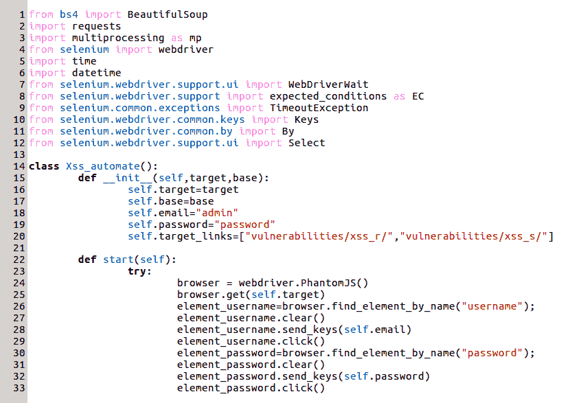
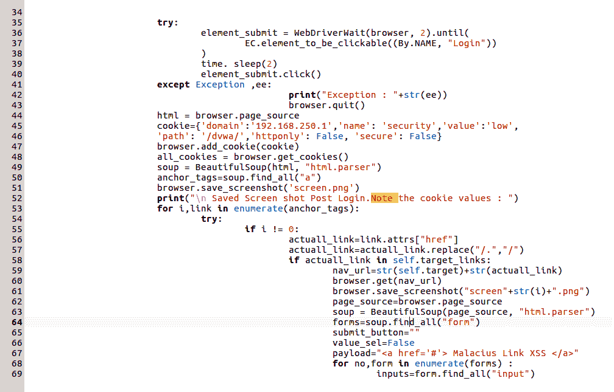
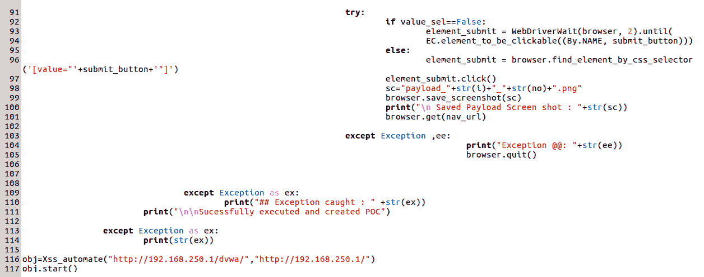
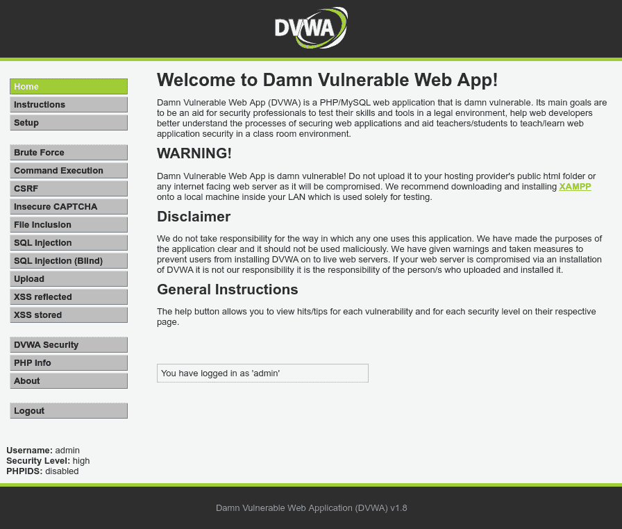
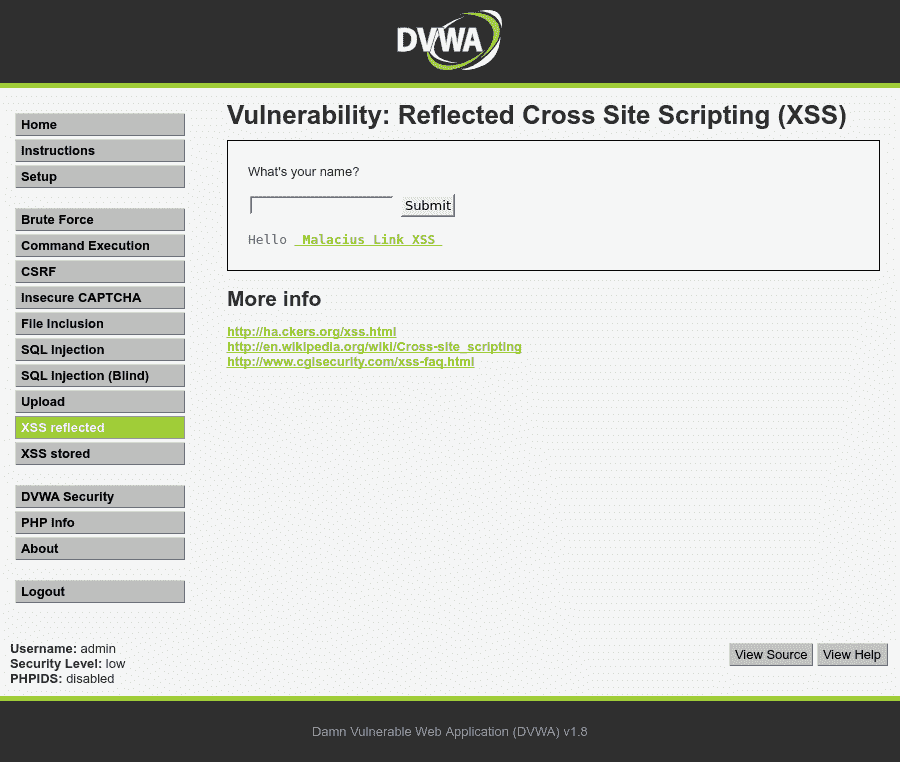
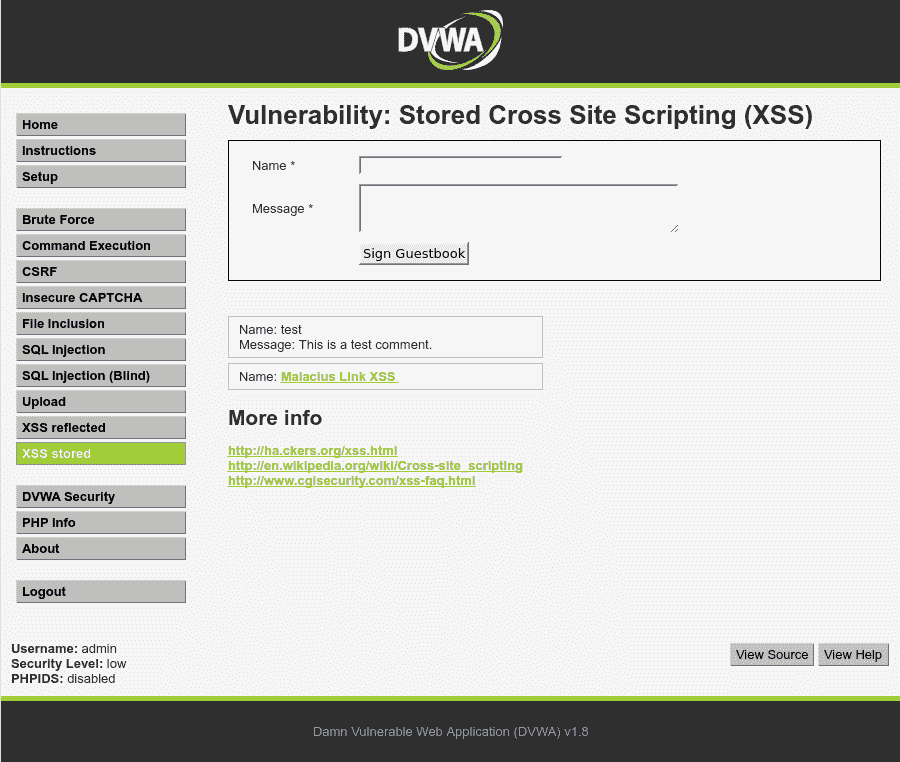
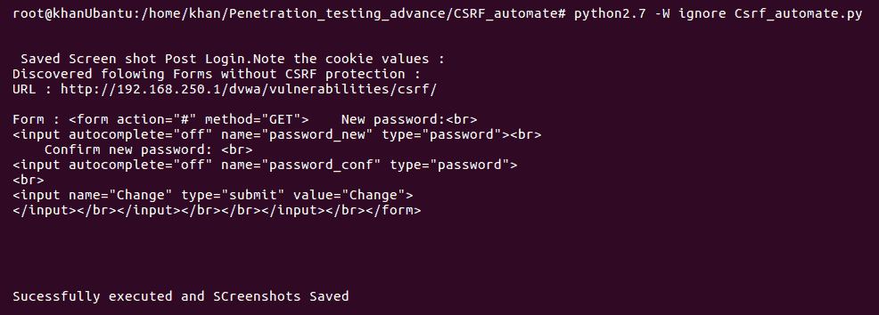
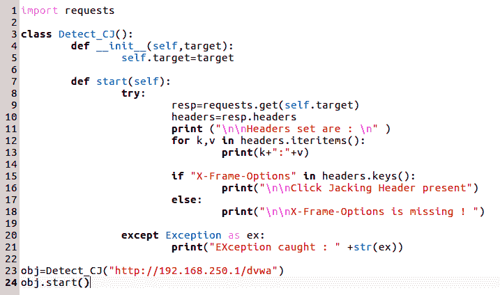
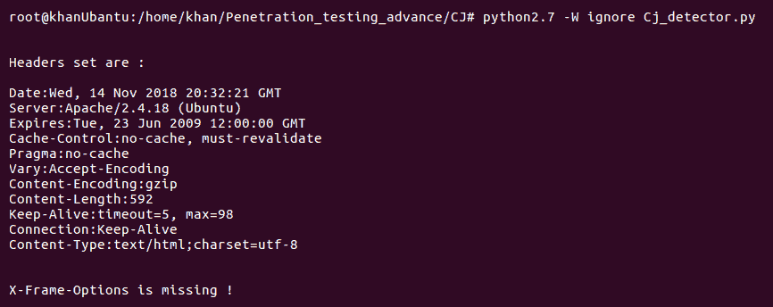
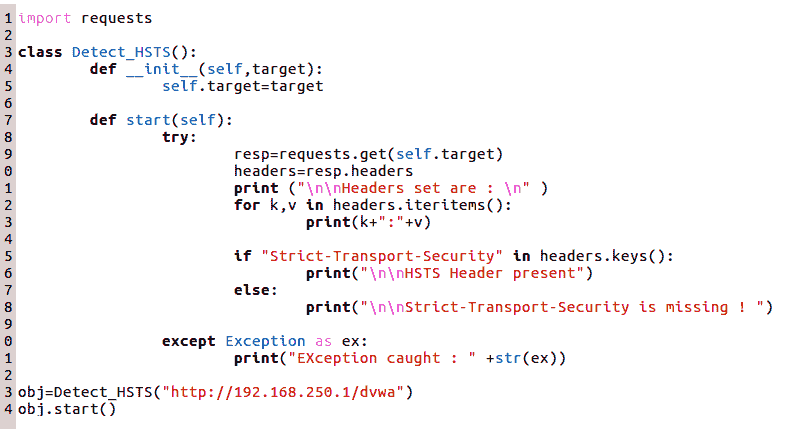

# 自动 Web 应用程序扫描-第 2 部分

继续我们在上一章的讨论，我们现在将学习如何使用 Python 自动检测**跨站脚本**（**XSS**）、**跨站请求伪造**（**CSRF**）、点击劫持和**安全套接字层**（**SSL**）剥离。本章讨论的所有技术将帮助我们加快 Web 应用程序评估过程。我建议您不要局限于本章讨论的方法。讨论的方法可以作为基线，相同的想法可以扩展和改进，以得到更好的解决方案或开发工具，以帮助渗透测试社区。本章将讨论以下主题：

+   跨站脚本

+   跨站请求伪造

+   点击劫持

+   SSL 剥离（缺少 HSTS 标头）

# XSS

**XSS**攻击属于 Web 应用程序攻击的注入类别。它们主要是由于未对来自最终用户的 Web 应用程序传递的用户输入进行消毒而引起的。这不会导致服务器被攻破，但对用户数据的影响非常严重。攻击发生在攻击者能够将某种 Java 脚本或 HTML 内容注入到将提供给用户的网页中时。这种恶意内容可能会尝试从访问网站的用户那里窃取敏感信息。在接下来的章节中，我们将看看不同类型的 XSS 攻击。

# 存储或 Type 1 XSS 攻击

**存储型 XSS**是攻击，其中来自攻击者的恶意输入被持久化并存储在后端数据库或存储库中。每当检索并呈现该内容以在网页上显示时，浏览器完全不知道它，它要么执行来自数据库的恶意 JavaScript，要么呈现恶意 HTML 标记，而不是将其显示为文本。存储型 XSS 将永久保留在数据库中，并影响访问受影响网页的所有用户。

# 反射型或 Type 2 XSS 攻击

**反射型 XSS**攻击是 XSS 攻击向量的第二种类型，其中恶意的 XSS 有效负载不会存储在数据库表中以进行持久化，但仍然被注入到返回给用户的网页的某些参数中。浏览器对此更改毫不知情，只是简单地呈现注入的恶意 HTML 或执行注入的恶意 JavaScript 代码，再次导致用户数据被泄露。

# 基于 DOM 或 Type 0 XSS 攻击

基于**文档对象模型**的 XSS 是 XSS 攻击的第三类。在这里，XSS 有效负载不会发送到服务器，而是由于实现缺陷和使用客户端 JavaScript 改变网页状态/DOM，攻击者放置有效负载，该有效负载将由负责操纵网页状态的 JavaScript 拾取。

我们的重点是了解如何使用 Python 自动检测 XSS。

# 使用 Python 自动检测 XSS

在这里，我们将看到一种方法，我们将使用 Python、Beautifulsoup、Selenium 和 Phantomjs 自动检测 Web 应用程序中的 XSS。

通过运行以下命令来安装依赖项：

```py
pip install BeautifulSoup
pip install bs4
pip install selenium
sudo apt-get install libfontconfig
apt-get install npm
npm install ghostdriver
wget https://bitbucket.org/ariya/phantomjs/downloads/phantomjs-2.1.1-linux-x86_64.tar.bz2
tar xvjf phantomjs-2.1.1-linux-x86_64.tar.bz2
sudo cp phantomjs-2.1.1-linux-x86_64/bin/phantomjs /usr/bin/
sudo cp phantomjs-2.1.1-linux-x86_64/bin/phantomjs /usr/local/bin/
```

让我们了解每个的目标：

+   **BeautifulSoup**是一个出色的 Python 库，用于网页抓取和解析网页。

+   **Selenium**是用于自动测试 Web 应用程序的自动化框架。其功能在安全领域尤为重要，用于浏览器模拟和自动遍历 Web 应用程序的工作流程。

+   **Phantomjs**是一种用于无头浏览的实用程序。它执行浏览器的所有活动，而不实际加载它，而是在后台运行，使其轻巧且非常有用。

安装 Phantomjs 后，我们需要在控制台上执行以下命令：`unset QT_QPA_PLATFORM`。这是用来处理 Ubuntu 16.04 上 Phantomjs 版本抛出的错误的，错误如下：`Message: Service phantomjs unexpectedly exited. Status code was: -6`。

应该注意，这个练习的目的是模拟正常用户行为，并找到 Web 应用程序中的注入点。我们所说的*注入点*是指用户可以提供输入的所有输入字段。为了找到注入点，我们将使用`BeautifulSoup`库。从网页中，我们提取所有类型为文本、密码或文本区域的字段。一旦找到注入点，我们将使用 selenium 在注入点传递我们的有效负载值。一旦有效负载设置在注入点，我们将再次使用`BeautifulSoup`来定位表单的提交按钮。然后，我们将传递提交按钮的 ID 给 selenium，点击它，以提交表单。

我们将使用的有效负载是`<a href=#> Malicious Link XSS </a>`。如果这个被创建了，我们可以推断网站存在 XSS 漏洞。还必须注意的是，在提交有效负载后，我们还捕获了网页的截图，以查看链接是否真的被创建，这将作为概念的证明。

应该注意，我们将在本地 IP`http://192.168.250.1/dvwa`上运行的 DVWA 应用程序上演示我们脚本的概念验证。正如我们所知，该应用程序需要用户登录。我们将首先让我们的脚本自动登录应用程序，然后设置适当的 cookie 和会话。然后，在登录后，我们将导航到存在 XSS 的页面，并执行上述操作。我们还将更新 cookie 值，并设置 security=low，以便在 DVWA 应用程序中可能发生 XSS。应该注意，相同的概念可以扩展并应用于任何 Web 应用程序，因为我们使用了一种非常通用的方法来识别注入点并在其中提交有效负载。根据需要修改脚本并进一步扩展。我将致力于在这个脚本的基础上开发一个功能齐全的 XSS 检测工具，它将位于我的 GitHub 存储库中。请随时为其做出贡献。

在下一节中，我们将看一下极端自动化。

# 脚本在执行

让我们将我们的脚本命名为`Xss_automate.py`，并添加以下截图中显示的内容：








现在可以运行脚本如下：


让我们去检查当前路径，看看截图是否已经创建：


正如我们之前所指出的，已经创建并捕获了三个截图。让我们打开每一个来验证概念的证明。成功使用我们的脚本登录后，下面的截图就是我们看到的：



下面的截图显示了反射 XSS 漏洞的利用，创建了链接。请注意，security 的值被设置为 low：



下面的截图显示了存储的 XSS 漏洞：



需要注意的是，我们只将先前的方法应用于检测两个页面中的 XSS，只是为了减少执行时间并展示概念的威力。然而，这可以扩展到应用程序的所有网页。我们需要删除检查从`<a>`标签中获取的 URL 是否存在于列表中的条件：`self.target_links=["vulnerabilities/xss_r/","vulnerabilities/xss_s/"]`。尝试这种方法，删除这个条件，并根据需要修改脚本，看看它覆盖了什么。

# CSRF

**CSRF**是一种攻击，攻击者利用有效的用户会话以允许在当前登录用户的名义下执行某些操作。例如，假设管理员用户已登录应用程序，并在浏览器中设置了有效的会话 cookie。管理员可以通过单击删除所有按钮来删除网站上的所有用户，内部调用 HTTP 请求`http://www.mysite.com/delete?users=all`。Web 浏览器的一个属性是在用户登录到应用程序后，为每个后续请求向服务器发送会话参数/cookie。攻击者可以利用这一点，通过制作一个包含 HTML 图像的伪造页面，例如``。攻击者可以将这个伪造页面的链接发送给当前已登录到他的网站`mysite.com`的管理员。如果管理员用户加载了这个网页，将会以他们的名义触发删除所有用户的 HTTP 请求，并发送有效的会话 cookie，导致服务器删除所有用户。

# 使用 Python 自动检测 CSRF

在这里，我们将介绍一种使用 Python、Beautifulsoup、Selenium 和 Phantomjs 自动检测 Web 应用程序中 CSRF 的方法。然而，在自动化检测之前，让我们讨论一下我们将采取的方法。我们知道可以通过实现反 CSRF 令牌来减轻 CSRF 攻击。

从服务器提供的任何可能修改服务器状态的表单都应该包含一个包含随机加密值的隐藏字段，称为 CSRF 令牌。大多数 CSRF 令牌背后的原则是，这个表单和一个 cookie 也必须设置为一个与在隐藏字段中提供的令牌的相同值的加密值。当表单被提交回服务器时，会提取 cookie 的秘密值并与在隐藏字段中提交回服务器的秘密值进行比较。如果两个秘密匹配，请求被认为是真实的，并进一步处理。

我们将在我们的检测机制中使用相同的方法。对于任何要提交回服务器的表单，我们将提取所有输入字段并将它们与各种技术中常用的 CSRF 隐藏字段参数名称列表进行比较，如 Java、PHP、Python/Django、ASP.NET 和 Ruby。此外，我们还将查看在提交表单之前设置的 cookie 的名称，并将这些 cookie 的名称与所有知名技术堆栈中常用的 CSRF 保护名称进行比较。

需要再次注意的是，脚本将模拟正常的人类行为。它将登录应用程序并保持有效会话，然后尝试查找 CSRF 漏洞。这里显示了最常用的 CSRF 隐藏字段参数以及技术堆栈：

+   `ASP.NET [Hiddenfiled : __RequestVerificationToken, Cookie : RequestVerificationToken]`

+   `PHP [Hiddenfiled : token, Cookie : token], [Hiddenfileld :_csrfToken, Cookie : csrfToken]`

+   `PHP [Hiddenfiled : _csrftoken, Cookie : csrftoken]`

上述列表可能更详尽，但对我们的目的来说已经足够了。我们将使用 DVWA 应用程序来创建我们的概念验证脚本。

# 脚本在执行

让我们继续创建一个名为`Csrf_detection.py`的脚本，其中包含以下屏幕截图中显示的内容：


当我们执行脚本时，我们得到以下输出：



创建的屏幕截图显示在这里：


DVWA 应用程序的捕获屏幕截图显示在这里：


应该注意的是，我们只在一个页面上应用了先前的方法来检测 CSRF，只是为了减少执行时间并展示概念的威力。然而，这可以扩展到应用程序的所有网页。我们需要删除检查从`<a>`标签中获取的 URL 是否在列表中的条件：`self.target_links=["vulnerabilities/csrf"]`。尝试相同的方法，删除此条件，并根据需要修改脚本以查看它覆盖了什么。

# 点击劫持

**点击劫持**是一种攻击，攻击者在合法网站或网页上叠加自制的攻击页面。考虑与 CSRF 攻击案例中提到的相同情景。可以使能够删除所有用户的网页以透明的方式呈现，使用户看不到页面上的按钮。因此，用户看到的是一个透明层下的合法网页的攻击页面。例如，攻击者可以制作一个显示 iPhone 优惠的网页，可能有一个按钮写着**立即赢取 iPhone**，放在透明按钮**删除所有用户**下面。因此，当受害者，**管理员用户**，认为他们点击的是赢取 iPhone 的按钮时，实际上他们点击的是透明按钮，从数据库中删除所有用户。

网站防止点击劫持的一种方法是实施一个名为 X-Frame-Options 的特殊头部，该头部在以下部分中定义。

# X-Frame-Options

网站可以通过特殊的 HTTP 响应头部**X-Frame-Options**声明不应在框架或 iframe 中呈现。客户端浏览器在接收到此头部时，检查设置在框架限制内的值，并根据设置的值采取适当的操作。各种值显示在这里：

+   **DENY**：此值将阻止网页加载到框架或 iFrame 中。这是建议使用的值。

+   **SAMEORIGIN**：如果尝试将页面加载到 iframe 中的页面来自与被加载页面相同的源，则此值将允许页面仅在框架或 iframe 中加载。

+   **ALLOW-FROM**：此值定义了允许将页面加载到框架或 iframe 中的位置。

# 使用 Python 自动检测点击劫持

在这里，我们将看到一种我们将用来查看网站是否容易受到点击劫持的方法。我们将使用一个简单的 Python 脚本，检查应用程序渲染的响应头中是否存在 X-Frame-Options。我们将调用脚本`CJ_detector.py`并添加以下内容：



我们将运行脚本，看看 DVWA 应用程序是否受到点击劫持的保护：



# SSL 剥离（缺少 HSTS 头部）

**SSL 剥离**，或**SSL 降级**，是一种将 HTTPS 连接降级为 HTTP 的攻击向量。这种攻击是由位于受害者和 Web 服务器之间的攻击者执行的，并充当透明代理。它进一步与受害者保持基于 HTTP 的下行连接，并与服务器保持适当的基于 HTTPS 的上行连接。

因此，攻击是通过 ARP 欺骗、SSL 剥离和在攻击者和受害者之间设置透明代理的组合来进行的。假设一个受害者想要访问一个名为`abc.com`的网站。默认情况下，`abc.com`由 HTTPS 服务器提供，如`https://www.abc.com`，但当用户在浏览器中输入 URL`abc.com`时，浏览器将请求发送为`http://www.abc.com`到服务器，服务器响应 302 响应并将用户重定向到`https://www.abc.com`。重要的是要注意，用户浏览器到服务器的第一个请求是通过纯 HTTP 进行的，因为用户输入了`abc.com`。这就是攻击者使用 SSL 剥离所利用的。

考虑一个放置在同一网络上并且正在 ARP 欺骗受害者和路由器的攻击者。在这种情况下，受害者对`abc.com`的请求首先到达攻击者。攻击者设置了一个透明代理，可以将请求转发到实际服务器。服务器响应 302 响应。攻击者代理发送一个请求到`https://abc.com`并接收响应，这只是一个网页。攻击者代理还有一个额外的功能，可以解析整个响应，用纯 HTTP 替换所有 HTTPS 链接，然后将一个纯页面呈现给受害者。在下一个请求中，受害者发布他们的凭据，却不知道流量是通过攻击者传递的。

为了防止这种攻击，网站必须在发送给客户端的响应中包含一个特殊的头。这个头将保存在浏览器首选项中，因此每当连接到网站时，第一个请求本身将通过 HTTPS 发送；因此，使得攻击者无法窃听流量。

**HTTP 严格传输安全**（**HSTS**）是一种安全机制，浏览器会记住这个主机是一个 HSTS 主机，并将详细信息保存在浏览器首选项中。因此，每当再次访问该站点时，即使用户在浏览器中输入`abc.com`，在向服务器释放请求之前，浏览器也会在内部将请求转换为 HTTPS，因为它检查其 HSTS 列表并发现目标主机或服务器投诉。如果第一个请求是 HTTPS，攻击者就没有机会降级请求。

# 使用 Python 自动检测缺失的 HSTS

在这里，我们将看到一种方法，我们将使用它来确定网站是否容易受到点击劫持的攻击。我们将使用一个简单的 Python 脚本来检查应用程序呈现的响应头中是否存在 Strict-Transport-Security。我们将命名脚本为`HSTS_detector.py`，并将以下内容放入其中：



让我们运行脚本，看看应用程序 DVWA 是否受到了点击劫持的保护：


# 摘要

在本章中，我们讨论了我们可以使用的方法来使用 Python 自动化我们的 Web 应用程序扫描和评估。我们看到了如何使用 Python 自动化检测 Web 应用程序的漏洞，如 XSS、CSRF、点击劫持和 SSL 剥离。所有这些在实际评估中都非常有用，并将帮助您作为渗透测试人员对使用 Python 自动化事物有一个相当好的掌握。

在下一章中，我们将探讨与逆向工程、模糊测试和缓冲区溢出相关的各种概念。

# 问题

1.  还有哪些应用程序安全用例可以使用 Python 自动化处理？

1.  我们如何使用 Python 集成网络扫描和 Web 应用程序扫描？

# 进一步阅读

+   学习 Python 网络渗透测试：[`www.lynda.com/Python-tutorials/Learning-Python-Web-Penetration-Testing/521198-2.html`](https://www.lynda.com/Python-tutorials/Learning-Python-Web-Penetration-Testing/521198-2.html)

+   渗透测试人员的 Python：[`www.pentesteracademy.com/course?id=1`](https://www.pentesteracademy.com/course?id=1)

+   使用 Python 和 Kali Linux 进行渗透测试自动化：[`niccs.us-cert.gov/training/search/pluralsight/penetration-testing-automation-using-python-and-kali-linux`](https://niccs.us-cert.gov/training/search/pluralsight/penetration-testing-automation-using-python-and-kali-linux)
