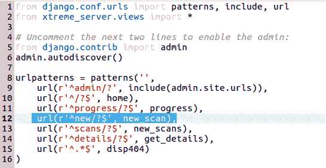
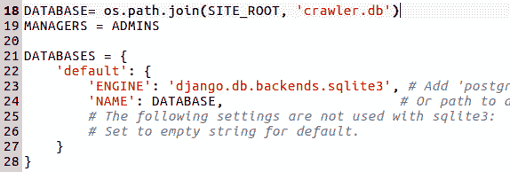
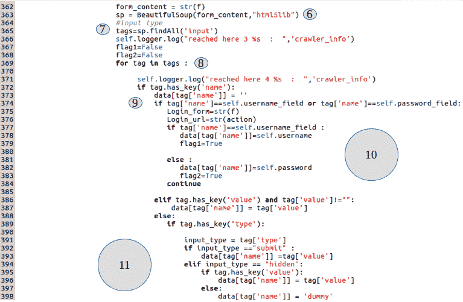
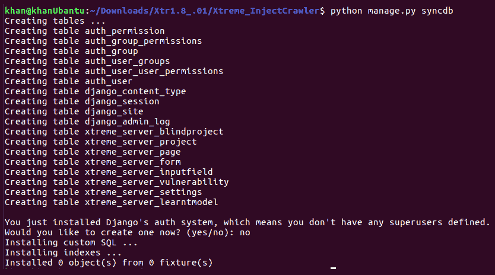
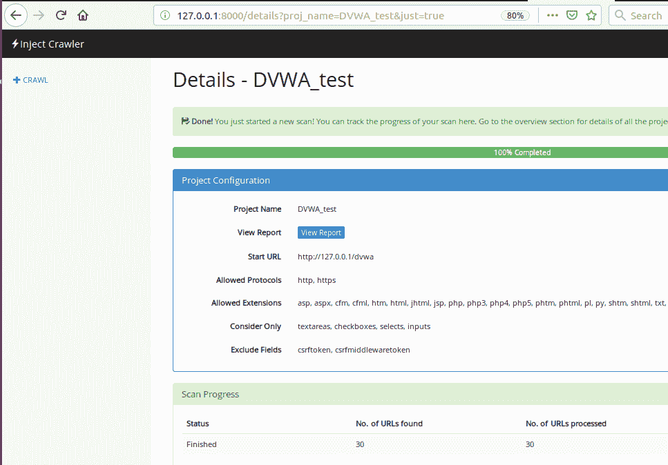

# 构建自定义爬虫

当我们谈论 Web 应用程序扫描时，我们经常会遇到内置在我们用于 Web 应用程序扫描的自动扫描工具中的爬虫。诸如 Burp Suite、Acunetix、Web Inspect 等工具都有精彩的爬虫，可以浏览 Web 应用程序并针对爬取的 URL 尝试各种攻击向量。在本章中，我们将了解爬虫是如何工作的，以及在幕后发生了什么。本章的目标是使用户了解爬虫如何收集所有信息并形成各种攻击的攻击面。相同的知识可以稍后用于开发可能自动化 Web 应用程序扫描的自定义工具。在本章中，我们将创建一个自定义 Web 爬虫，它将浏览网站并给出一个包含以下内容的列表：

+   网页

+   HTML 表单

+   每个表单中的所有输入字段

我们将看到如何以两种模式爬取 Web 应用程序：

+   无身份验证

+   有身份验证

我们将在 Django（Python 的 Web 应用程序框架）中开发一个小型 GUI，使用户能够在测试应用程序上进行爬取。必须注意，本章的主要重点是爬虫的工作原理，因此我们将详细讨论爬虫代码。我们不会专注于 Django Web 应用程序的工作原理。为此，本章末尾将提供参考链接。我将在我的 GitHub 存储库中分享整个代码库，供读者下载和执行，以便更好地理解该应用程序。

# 设置和安装

要使用的操作系统是 Ubuntu 16.04。该代码在此版本上经过测试，但读者可以自由使用任何其他版本。

通过运行以下命令安装本章所需的先决条件：

```py
pip install django==1.6 pip install beautifulsoup4 pip install requests pip install exrex pip install html5lib pip install psutil sudo apt-get install sqlitebrowser
```

应注意，该代码经过 Python 2.7 的尝试和测试。建议读者在相同版本的 Python 上尝试该代码，但它也应该适用于 Python 3。关于打印语句可能会有一些语法上的变化。

# 开始

典型的 Django 项目遵循基于 MVC 的架构。用户请求首先命中`Urls.py`文件中配置的 URL，然后转发到适当的视图。视图充当后端核心逻辑和呈现给用户的模板/HTML 之间的中间件。`views.py`有各种方法，每个方法对应于`Urls.py`文件中的 URL 映射器。在接收请求时，`views`类或方法中编写的逻辑从`models.py`和其他核心业务模块中准备数据。一旦所有数据准备好，它就会通过模板呈现给用户。因此，模板形成了 Web 项目的 UI 层。

以下图表代表了 Django 请求-响应循环：


# 爬虫代码

如前所述，我们有一个用户界面，将收集要爬取的 Web 应用程序的用户参数。因此，请求被转发到`views.py`文件，然后我们将调用爬虫驱动文件`run_crawler.py`，然后再调用`crawler.py`。`new_scan`视图方法获取所有用户参数，将它们保存在数据库中，并为爬取项目分配一个新的项目 ID。然后将项目 ID 传递给爬虫驱动程序，以便引用并使用 ID 提取相关项目参数，然后将它们传递给`crawler.py`开始扫描。

# Urls.py 和 Views.py 代码片段

以下是`Urls.py`文件的配置，其中包含 HTTP URL 和映射到该 URL 的`views.py`方法之间的映射关系。该文件的路径是`Chapter8/Xtreme_InjectCrawler/XtremeWebAPP/Urls.py`：



前面突出显示的行表示新爬行项目的 URL 与满足请求的`views`方法之间的映射。因此，我们将在`views.py`文件中有一个名为`new_scan`的方法。文件的路径是`Chapter8/Xtreme_InjectCrawler/XtremeWebAPP/xtreme_server/views.py`。方法定义如下：


# 代码解释

`new_scan`方法将接收用户的`HTTP GET`和`POST`请求。`GET`请求将被解析为提供用户输入项目参数的页面，`POST`请求将把所有参数发布到先前的代码，然后可以进一步处理。正如代码的**（1）**部分所突出显示的那样，项目参数正在从用户请求中检索，并放置在 Python 程序变量中。代码的**（2）**部分也是如此。它还从用户提供的设置中获取一些其他参数，并将它们放在一个名为 settings 的 Python 字典中。最后，当所有数据收集完毕，它将所有细节保存在名为`Project`的后端数据库表中。正如在第 261 行所示，代码初始化了一个名为`Project()`的类，然后从第 262 行到 279 行，它将从用户那里获得的参数分配给`Project()`类的实例变量。最后，在第 280 行，调用了`project.save()`代码。这将把所有实例变量作为单行放入数据库表中。

基本上，Django 遵循开发的 ORM 模型。**ORM**代表**对象关系映射**。Django 项目的模型层是一组类，当使用`python manage.py syncdb`命令编译项目时，这些类实际上会转换为数据库表。我们实际上不在 Django 中编写原始的 SQL 查询来将数据推送到数据库表或提取它们。Django 为我们提供了一个模型包装器，我们可以将其作为类访问，并调用各种方法，如`save()`、`delete()`、`update()`、`filter()`和`get()`，以执行对数据库表的**创建、检索、更新和删除**（**CRUD**）操作。对于当前情况，让我们看一下包含`Project`模型类的`models.py`文件：


因此，当代码被编译或数据库同步发生时，使用`python manage.py syncdb`命令，一个名为`<project_name>_Project`的表将在工作数据库中创建。表的架构将根据类中实例变量的定义进行复制。因此，对于项目表的前面情况，将创建 18 个列。表将具有`project_name`的主键，Django 应用程序中其数据类型被定义为`CharField`，但在后端将被转换为类似`varchar(50)`的东西。在这种情况下，后端数据库是 SQLite 数据库，在`settings.py`文件中定义如下：



代码片段的**（3）**和**（4）**部分很有趣，因为这是工作流执行实际开始的地方。可以在**（3）**部分看到，我们正在检查操作系统环境。如果操作系统是 Windows，那么我们将调用`crawler_driver`代码`run_crawler.py`作为子进程。

如果底层环境是基于 Linux 的，那么我们将使用与 Linux 环境相关的命令来调用相同的驱动文件。正如我们之前可能观察到的那样，我们使用子进程调用来将此代码作为单独的进程调用。拥有这种类型的架构背后的原因是为了能够使用异步处理。用户发送的 HTTP 请求应该能够快速得到响应，指示爬取已经开始。我们不能让相同的请求一直保持，直到整个爬取操作完成。为了适应这一点，我们生成一个独立的进程并将爬取任务卸载到该进程中，HTTP 请求立即返回一个指示爬取已经开始的 HTTP 响应。我们进一步将进程 ID 和后端数据库中的项目名称/ID 进行映射，以持续监视扫描的状态。我们通过将控制权重定向到详细 URL 来将控制权返回给用户，详细 URL 反过来返回模板`details.html`。

# 驱动代码 - run_crawler.py

以下代码是`run_crawler.py`文件的代码：


还记得我们如何从`views.py`代码中调用这个文件吗？我们通过传递一个命令行参数来调用它，这个参数是项目的名称。如第**(1)**部分所示，`run_crawler.py`的前面代码将这个命令行参数加载到一个`project_name`程序变量中。在第**(2)**部分，代码尝试从后端数据库表`project`中读取所有参数，使用`project.objects.get(project_name=project_name)`命令。正如之前提到的，Django 遵循 ORM 模型，我们不需要编写原始的 SQL 查询来从数据库表中获取数据。前面的代码片段将在内部转换为`select * from project where project_name=project_name`。因此，所有项目参数都被提取并传递给本地程序变量。

最后，在第**(3)**部分，我们初始化`crawler`类并将所有项目参数传递给它。一旦初始化，我们调用标记为第**(4)**部分的`c.start()`方法。这是爬取开始的地方。在接下来的部分，我们将看到我们的爬虫类的工作方式。

# 爬虫代码 - crawler.py

以下代码片段代表了`crawler`类的构造函数。它初始化了所有相关的实例变量。`logger`是一个自定义类，用于记录调试消息，因此如果在爬虫执行过程中发生任何错误，它将作为一个子进程被生成并在后台运行，可以进行调试：


现在让我们来看一下`crawler`的`start()`方法，从这里开始爬取实际上开始：


在第**(1)**部分可以看到，对于第二次迭代（`auth=True`），我们会向用户提供的登录 URL 发出`HTTP GET`请求。我们使用 Python `requests`库中的`GET`方法。当我们向 URL 发出`GET`请求时，响应内容（网页）会被放入`xx`变量中。

现在，如第**(2)**部分所示，我们使用`xx.content`命令提取网页内容，并将提取的内容传递给`Beautifulsoup`模块的实例。`Beautifulsoup`是一个非常好用的 Python 工具，可以使解析网页变得非常简单。从这里开始，我们将用别名 BS 来表示`Beautifulsoup`。

第三部分使用了 BS 解析库中的`s.findall('form')`方法。`findall()`方法接受要搜索的 HTML 元素类型作为字符串参数，并返回一个包含搜索匹配项的列表。如果一个网页包含十个表单，`s.findall('form')`将返回一个包含这十个表单数据的列表。它看起来如下：`[<Form1 data>,<Form2 data>, <Form3 data> ....<Form10 data>]`。

在代码的第四部分，我们正在遍历之前返回的表单列表。这里的目标是在网页上可能存在的多个输入表单中识别登录表单。我们还需要找出登录表单的操作 URL，因为那将是我们`POST`有效凭据并设置有效会话的地方，如下面的截图所示：




让我们试着分解前面的不完整代码，以了解到目前为止发生了什么。然而，在我们继续之前，让我们看一下用户界面，从中获取爬取参数。这将让我们对先决条件有一个很好的了解，并帮助我们更好地理解代码。以下屏幕显示了用户输入参数的表示：


如前所述，爬虫工作分为两次迭代。在第一次迭代中，它尝试在没有身份验证的情况下爬取 Web 应用程序，在第二次迭代中，它使用身份验证爬取应用程序。身份验证信息保存在`self.auth`变量中，默认情况下初始化为`false`。因此，第一次迭代将始终没有身份验证。

应该注意的是，前面提到的代码的目的是从登录网页/URL 中识别登录表单。一旦识别出登录表单，代码就会尝试识别该表单的所有输入字段。然后，它将制定一个包含合法用户凭据的数据有效载荷，以提交登录表单。提交后，将返回并保存一个有效的用户会话。该会话将用于基于身份验证的第二次爬取迭代。

在代码的第五部分，我们正在调用`self.process_form_action()`方法。在此之前，我们提取了表单的操作 URL，以便知道数据将被*发布*的位置。它还将相对操作 URL 与应用程序的基本 URL 结合起来，这样我们最终会将请求发送到一个有效的端点 URL。例如，如果表单操作指向名为`/login`的位置，当前 URL 为`http://127.0.0.1/my_app`，这个方法将执行以下任务：

1.  检查 URL 是否已经添加到爬虫应该访问的 URL 列表中

1.  将操作 URL 与基本上下文 URL 组合并返回`http://127.0.0.1/my_app/login`

这个方法的定义如下所示：


可以看到，在这个方法中首先调用的是另一个方法`self.check_and_add_to_visit`。这个方法检查所讨论的 URL 是否已经被添加到爬虫应该爬取的 URL 列表中。如果已经添加，则执行`no9`操作。如果没有，爬虫将该 URL 添加到稍后重新访问。这个方法还检查许多其他事情，比如 URL 是否在范围内，协议是否被允许等等。这个方法的定义如下所示：


如图所示，如果第 158 行下的`self.already_seen()`返回`false`，那么在当前项目的后端数据库`Page`表中将创建一行。这一行再次通过 Django ORM（模型抽象）创建。`self.already_seen()`方法只是检查`Page`表，看看爬虫是否以当前项目名称和当前认证模式访问了问题 URL。这是通过访问标志来验证的：


`Page.objects.filter()`相当于`select * from page where auth_visited=True/False and project='current_project' and URL='current_url'`。

在代码的第**（6）**部分，我们将当前表单的内容传递给一个新创建的 BS 解析模块的实例。这样做的原因是我们将解析并提取当前处理的表单中的所有输入字段。一旦输入字段被提取，我们将比较每个输入字段的名称与用户在`username_field`和`password_field`下提供的名称。我们这样做的原因是可能会有多个表单在登录页面上，比如搜索表单、注册表单、反馈表单和登录表单。我们需要能够识别这些表单中的哪一个是登录表单。当我们要求用户提供**登录用户名/电子邮件**字段名称和**登录密码**字段名称时，我们的方法是从所有表单中提取输入字段并将它们与用户提供的内容进行比较。如果我们两个字段都匹配，我们将`flag1`和`flag2`设置为`True`。如果我们在一个表单中找到匹配，很可能这就是我们的登录表单。这是我们将在其中将用户提供的登录凭据放在适当字段下并在操作 URL 下提交表单的表单。这个逻辑由第**（7）**、**（8）**、**（9）**、**（10）**、**（11）**、**（12）**、**（13）**和**（14）**部分处理。

还有一个重要的考虑因素。登录网页上可能还有注册表单。假设用户已经在我们的代码中指定了`username`和`user_pass`作为用户名和密码参数的字段名称，以便在这些字段名称下提交正确的凭据以获得有效会话。然而，注册表单还包含另外两个字段，也称为`username`和`user_pass`，还包含一些其他字段，如**地址**、**电话**、**电子邮件**等。然而，正如前面讨论的，我们的代码只识别这些提供的字段名称的登录表单，并可能将注册表单视为登录表单。为了解决这个问题，我们将所有获取的表单存储在程序列表中。当所有表单都被解析和存储时，我们应该有两个可能的登录表单候选。我们将比较两者的内容长度，长度较短的将被视为登录表单。这是因为注册表单通常比登录表单有更多的字段。这个条件由代码的第**（15）**部分处理，它枚举了所有可能的表单，并最终将最小的表单放在`payloadforms[]`列表和`actionform[]`列表的索引 0 处。

最后，在第 448 行，我们将提供的用户凭据发布到有效解析的登录表单。如果凭据正确，将返回有效会话并放置在会话变量`ss`下。通过调用`POST`方法进行请求，如下所示：`ss.post(action_forms[0],data=payload,cookie=cookie)`。

用户提供要爬取的 Web 应用程序的起始 URL。第**（16）**部分获取该起始 URL 并开始爬取过程。如果有多个起始 URL，它们应该用逗号分隔。起始 URL 被添加到`Page()`数据库表中，作为爬虫应该访问的 URL：


在第**(17)**节中，有一个爬行循环调用`there_are_pages_to_crawl()`方法，该方法检查后端的`Page()`数据库表，看看当前项目中是否有任何未被访问的页面，visited flag`set = False`。如果表中有尚未被爬行器访问的页面，此方法将返回`True`。由于我们刚刚在第**(16)**节将起始页面添加到`Page`表中，因此此方法将对起始页面返回`True`。其思想是对该页面进行`GET`请求，并提取所有进一步的链接、表单或 URL，并不断将它们添加到`Page`表中。只要有未被访问的页面，循环将继续执行。一旦页面完全解析并提取了所有链接，visited flag 就会被设置为`True`，以便不会再提取该页面或 URL 进行爬行。该方法的定义如下所示：


在第**(18)**节中，我们通过调用`get_a_page_to_visit()`方法从后端的`Page`表中获取未访问的页面，该方法的定义在这里给出：


在第**(19)**节中，我们向该页面发出 HTTP `GET`请求，同时携带会话 cookie `ss`，因为第**(19)**节属于处理`auth=True`的迭代。一旦向该页面发出请求，页面的响应将进一步处理以提取更多链接。在处理响应之前，我们检查应用程序产生的响应代码。

有时候，某些页面会返回重定向（`3XX`响应代码），我们需要适当保存 URL 和表单内容。假设我们向页面 X 发出了`GET`请求，响应中有三个表单。理想情况下，我们将以 X 为标记保存这些表单。但是，假设在向页面 X 发出`GET`请求时，我们得到了一个 302 重定向到页面 Y，并且响应 HTML 实际上属于设置重定向的网页。在这种情况下，我们最终会保存与 URL X 映射的三个表单的响应内容，这是不正确的。因此，在第(20)和(21)节中，我们处理这些重定向，并将响应内容与适当的 URL 进行映射：


第(22)和(23)节的代码与前面提到的第(19)、(20)和(21)节完全相同，但(22)和(23)节是针对`authentication=False`的迭代进行的：


如果在处理当前页面时遇到任何异常，第(24)节将处理这些异常，将当前页面的 visited flag 标记为`True`，并在数据库中放置适当的异常消息。

如果一切顺利，控制将传递到第(26)节，从那里开始处理从当前正在访问的页面上的`GET`请求获取的 HTML 响应内容。此处理的目标是进行以下操作：

+   从 HTML 响应中提取所有进一步的链接（`a href`、`base`标签、`Frame`标签、`iframe`标签）

+   从 HTML 响应中提取所有表单

+   提取 HTML 响应中的所有表单字段

代码的第**(26)**节提取了返回的 HTML 响应内容中`base`标签下（如果有的话）存在的所有链接和 URL。

第**(27)**和**(28)**节使用 BS 解析模块解析内容，提取所有锚标签及其`href`位置。一旦提取，它们将被传递以添加到`Pages`数据库表中，以供爬行器以后访问。必须注意的是，只有在检查它们在当前项目和当前身份验证模式下不存在后，才会添加这些链接。

第（29）节使用 BS 解析模块解析内容，以提取所有`iframe`标签及其`src`位置。一旦提取，它们将被传递以添加到`Pages`数据库表中，以便爬虫以后访问。第（30）节对 frame 标签执行相同的操作：


第（31）节使用 BS 解析模块解析内容，以提取所有选项标签，并检查它们是否在`value`属性下有链接。一旦提取，它们将被传递以添加到`Pages`数据库表中，以便爬虫以后访问。

代码的第（32）节尝试探索从网页中提取任何遗漏链接的所有其他选项。以下是检查其他可能性的代码片段：


第（33）和第（34）节从当前 HTML 响应中提取所有表单。如果识别出任何表单，将提取并保存表单标签的各种属性，例如 action 或 method，保存在本地变量中：


如果识别出任何 HTML 表单，下一个任务是提取所有输入字段、文本区域、选择标签、选项字段、隐藏字段和提交按钮。这是由第（35）、（36）、（37）、（38）和（39）节执行的。最后，所有提取的字段以逗号分隔的方式放在`input_field_list`变量下。例如，假设识别出一个名为`Form1`的表单，其中包含以下字段：

+   `<input type ="text" name="search">`

+   `<input type="hidden" name ="secret">`

+   `<input type="submit" name="submit_button>`

所有这些都被提取为`"Form1" : input_field_list = "search,text,secret,hidden,submit_button,submit"`**.**

代码的第（40）节检查数据库表中是否已经保存了具有当前项目和当前`auth_mode`相同内容的任何表单。如果没有这样的表单存在，则使用 Django ORM（`models`）包再次将表单保存在`Form`表中：


先前代码的第（41）节继续并将这些唯一的表单保存在以当前项目名称命名的 JSON 文件中。然后可以使用简单的 Python 程序解析此文件，以列出我们爬取的网页应用程序中存在的各种表单和输入字段。此外，在代码的末尾，我们有一个小片段，将所有发现/爬取的页面放在一个文本文件中，以便以后参考。片段如下所示：

```py
 f= open("results/Pages_"+str(self.project.project_name))
    for pg in page_list:
        f.write(pg+"\n")
 f.close()
```

代码的第（42）节更新了刚刚解析内容的网页的访问标志，并标记为当前`auth`模式的已访问。如果在保存期间发生任何异常，这些异常将由第（43）节处理，该节再次将访问标志标记为`true`，但另外添加异常消息。

在第（42）和第（43）节之后，控制再次回到代码的第（17）节。爬虫尚未访问的下一页从数据库中获取，并重复所有操作。这将持续到爬虫访问了所有网页为止。

最后，我们检查当前迭代是否在第（44）节中进行身份验证。如果没有进行身份验证，则调用爬虫的`start()`方法，并将`auth`标志设置为`True`。

成功完成两次迭代后，假定网页应用程序已完全爬取，并且代码的第（45）节将项目状态标记为**已完成**。

# 代码的执行

我们需要做的第一步是将模型类转换为数据库表。可以通过执行`syncdb()`命令来完成，如下所示：



创建数据库表后，让我们启动 Django 服务器，如下所示：


我们将测试我们的爬虫针对著名的 DVWA 应用程序，以查看它发现了什么。我们需要启动 Apache 服务器并在本地提供 DVWA。可以通过运行以下命令启动 Apache 服务器：

```py
service Apache2 start
```

现在，让我们浏览爬虫界面，并提供以下扫描参数：


点击**开始爬取**按钮：



现在让我们浏览应用程序的`results`文件夹，位于`<Xtreme_InjectCrawler/results>`路径，以查看发现的 URL 和表单如下：


首先打开 JSON 文件查看内容：


现在，让我们打开`Pages_Dvwa_test`文件，查看发现的 URL 如下：


因此，可以验证爬虫已成功爬取了应用程序，并识别了前一个截图中显示的链接：


# 摘要

在本章中，我们看到了如何从头开始编写自定义爬虫。使用 Python 的模块，如 requests，BeautifulSoup 等，可以更轻松地完成这项任务。随意下载整个代码库，并测试爬虫与其他各种网站，以检查其覆盖范围。爬虫可能无法达到 100%的覆盖率。看看爬虫的局限性以及如何改进它。

# 问题

1.  如何改进爬虫以涵盖 JavaScript 和 Ajax 调用？

1.  我们如何使用爬虫结果来自动化 Web 应用程序测试？

# 进一步阅读

+   使用 Python 和 Kali Linux 进行渗透测试自动化：[`www.dataquest.io/blog/web-scraping-tutorial-python/`](https://www.dataquest.io/blog/web-scraping-tutorial-python/)

+   *Requests: 人类使用的 HTTP*：[`docs.python-requests.org/en/master/`](http://docs.python-requests.org/en/master/)

+   *Django 项目*：[`www.djangoproject.com/`](https://www.djangoproject.com/)

+   使用 Python 和 Kali Linux 进行渗透测试自动化：[`scrapy.org/`](https://scrapy.org/)
