# 网络威胁情报

到目前为止，本书一直关注网络安全的攻击方面。我们主要关注使用 Python 在渗透测试领域。在本章中，我们将尝试理解 Python 如何在网络安全的防御方面使用。当我们谈论网络安全的防御时，首先想到的是监控。**安全运营中心**是一个常用于监控团队的术语，负责持续监控组织的安全格局。这个团队使用一种称为**安全信息与事件管理**（**SIEM**）的工具，它作为一个聚合器，收集需要监控的各种应用程序和设备的日志。除了聚合，SIEM 还有一个规则引擎，其中配置了各种规则用于异常检测。规则因组织而异，取决于业务背景和需要监控的日志。如今，我们经常有许多基于大数据集群构建的 SIEM 解决方案，这些解决方案使用机器学习算法，并由人工智能模型驱动，结合规则引擎，使监控更加有效。那么网络威胁情报在这一切中的作用是什么？我们将在本章中学习这一点，以及以下主题：

+   网络威胁情报

+   工具和 API

+   威胁评分：为每个 IOC 给出一个分数

+   STIX 和 TAXII 以及外部查找

# 网络威胁情报简介

**网络威胁情报**是处理原始收集信息并将其转化为可操作情报的过程。广义上说，威胁情报是一个包括手动情报收集和使用自动化工具来增强组织安全格局的过程。让我们在本节中尝试理解自动化和手动威胁情报。

# 手动威胁情报

手动威胁情报是手动收集情报并将其转化为可操作情报的过程。让我们以一个特定于组织的手动威胁情报为例。

为组织“X”的网络安全团队工作的分析师对组织的内部情况非常了解，包括高层管理、关键流程和关键应用。作为网络安全和情报团队的一员，这名员工的职责之一就是在深网/暗网上搜索可能针对组织的潜在威胁。威胁的范围总是多种多样的。可能包括泄露的电子邮件或在暗网上的痕迹，这可能会引起组织的警惕。另一个威胁可能是针对特定行业（如电信行业）的勒索软件。如果员工发现了这一点，组织就能提前得到警报，并加强对勒索软件的防御机制。

手动威胁情报的另一个例子是收集与内部威胁相关的信息。对于一个拥有庞大员工群体和大量流程的组织来说，监控每个人总是很困难的。安全信息与事件管理系统（SIEM）通常难以监控行为威胁。假设有一个服务器 X（Web 服务器），通常每天与服务器 Y（数据库）和 Z（应用程序）通信。然而，SIEM 的一些痕迹表明服务器 X 正在通过 SMB 端口`445`与服务器 A 通信。这种行为很奇怪和可疑。现在，要对各个服务器之间的日常通信进行基线分析，并创建规则以检测异常对于 SIEM 来说将会非常困难，因为组织内通常有大量系统。虽然现在有一些解决方案是基于人工智能引擎和大数据构建的，用于进行此类异常检测，但手动威胁狩猎目前仍然效果最好。在组织内手动识别异常的这一过程被称为**内部威胁狩猎**。

# 自动化威胁情报

正如我们所讨论的，**威胁情报**是一个先进的过程，使组织能够不断收集基于上下文和情境风险分析的有价值的网络威胁见解。它可以根据组织特定的威胁格局进行定制。简单来说，威胁情报是基于识别、收集和丰富相关网络威胁数据和信息的分析输出。网络威胁数据通常包括威胁迹象（IOCs），如恶意 IP、URL、文件哈希、域名、电子邮件地址等。

这个收集信息并将其转化为可供安全产品（如 SIEM 工具、IDS/IPS 系统、防火墙、代理服务器、WAF 等）使用的可操作情报的过程是我们在本章中将重点关注的。这个收集和情境化信息的过程可以手动完成，如前所述，也可以自动化。自动化可以进一步分为分离的自动化（在脚本级别）或使用中央编排引擎的自动化。我们将考虑两者的优缺点。

有各种安全网站和社区公开分享网络情报数据，作为一种协作措施来对抗黑客活动，并保护组织免受新兴威胁。这些社区通常使用所谓的威胁共享源或威胁源。共享的数据包含恶意 URL、恶意 IP、恶意文件、恶意文件的签名、恶意域名、恶意 C&C 服务器等。所有共享的数据都是由组织报告的，表示已经做了可疑的事情。这可能是 SSH 扫描活动、水平扫描、钓鱼网站、暴力 IP、恶意软件签名等。

收集的所有信息都与 SIEM 共享，并在 SIEM 上创建规则，以检测组织内部针对标记为恶意的 IOCs 的任何通信。如果 SIEM 指示内部服务器或资产与收集的 IOCs 之间存在通信，它将警告组织，然后可以采取适当的预防措施。虽然这个过程可能看起来很简单，但实际上并不像看起来那么简单。行业面临的主要挑战是 IOCs 的质量。值得注意的是，已经收集了数百万个 IOCs。组织拥有的高质量 IOCs 越多，检测就越好。然而，拥有数百万个 IOCs 并不能默认提高检测能力。我们不能只是以自动化的方式收集 IOCs 并将其提供给 SIEM。从不同格式（如 JSON、CSV、STIX、XML、txt 和数据库文件）的各种来源收集的 IOCs 带有大量噪音。这意味着非恶意的域和 IP 也被标记。如果直接将这些嘈杂的数据提供给 SIEM，并在其上创建规则，这将导致大量的误报警报，从而增加分析师所需的工作量。

在本章中，我们将学习如何消除误报警报并提高收集的 IOCs 的质量。我们将编写一个自定义的 Python 算法来提高 IOCs 的质量，并为每个收集的 IOCs 关联一个威胁分数。威胁分数将在 1 到 10 的范围内。较高端的分数表示更严重的潜在严重性，而较低端的分数可能不太严重。这将使我们只与 SIEM 共享高质量的 IOCs，从而提高真正的阳性率。

# 网络威胁情报平台

如前所述，情报收集的过程可以通过不同的脚本自动化，我们可以将它们组合起来，或者建立一个能够收集和分享网络威胁情报的中央平台。具有这种能力的中央平台被称为网络威胁情报平台。让我们试着理解网络威胁情报收集的半自动化和完全自动化过程：

+   以下图表代表了威胁情报平台试图解决的问题陈述。在一个大型组织中，SIEM 工具每分钟生成 100-100,000 个事件，规则引擎每小时触发 20-50 个警报。分析师需要手动验证每个警报，并检查相关的 IP 或域名是否合法。分析师必须使用各种安全查找站点，手动解释它们，并决定警报是否有资格进一步调查，或者是否是误报。这就是大量人力投入的地方，也是我们需要自动化网络威胁情报的地方：

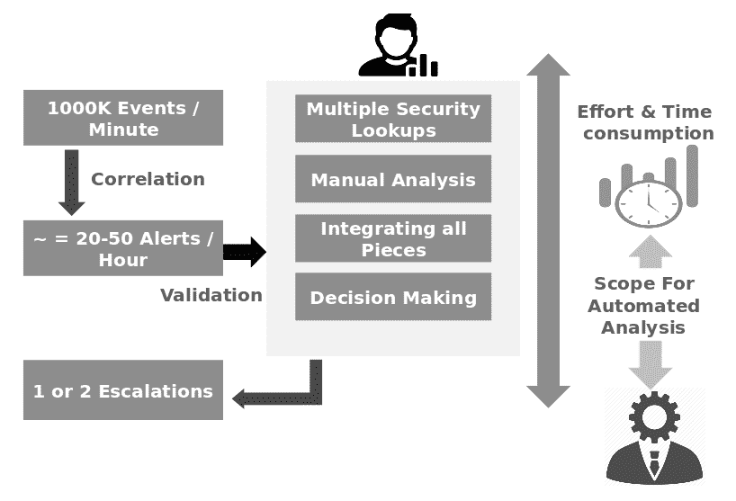

+   情报数据收集的各种来源包括以下内容：

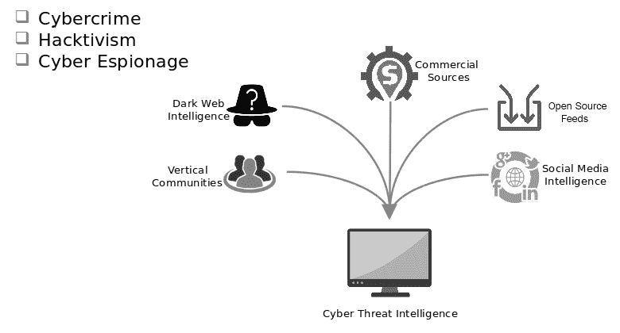

+   一个完全成熟的威胁情报平台的能力包括以下内容：

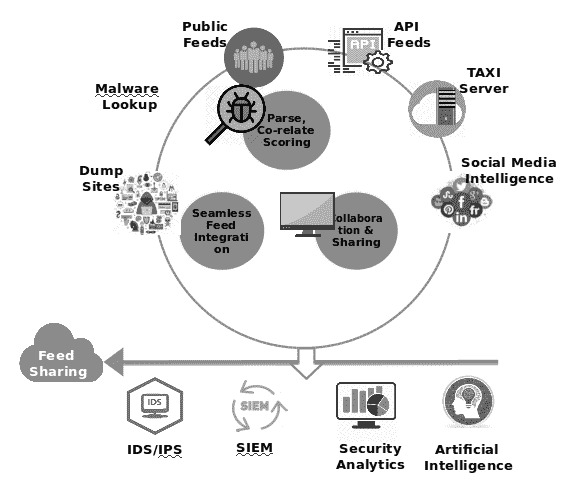

# 工具和 API

当我们谈论网络威胁情报平台时，有许多商业和开源工具可用于收集、情境化和分享情报。一些最知名的商业工具包括以下内容：

+   IBM X-Force Exchange

+   Anomali ThreatStream

+   Palo Alto Networks AutoFocus

+   RSA NetWitness 套件

+   LogRhythm 威胁生命周期管理（TLM）平台

+   FireEye iSIGHT Threat Intelligence

+   LookingGlass Cyber Solutions

+   AlienVault 统一安全管理（USM）

最知名的开源工具包括以下内容：

+   MISP

+   OpenIOC

+   OpenTAXII

+   Yeti

+   AbuseHelper

+   sqhunter

+   sqhunter

所有先前提到的开源工具都非常好，并且具有不同的功能。我个人发现**恶意软件信息共享平台**（**MISP**）在功能和特性方面都非常有用。它成为我最喜欢的原因是其可扩展的架构和其 API，使其能够与其他编程语言协作。这是我们将在本章重点关注的开源威胁情报平台。我们的目标是了解 MISP 开箱即用提供了什么，以及我们可以添加哪些附加功能，以获得高质量的 IOC 源文件到 SIEM 工具。MISP 暴露了一个很棒的`pymisp`API，用于从 Python 中消费收集的 IOCs。

# MISP

**MISP**是一个用 cakePHP 编写的框架，有着出色的社区支持。该框架的目标是从发布恶意内容的各种源头收集威胁情报，并将其存储在后端存储库中。相同的内容可以在以后进行分析并与安全工具（如 SIEM、防火墙和 IDS/IPS 系统）共享。该工具有很多功能，包括以下内容：

+   它有一个中央解析器，能够解析各种 IOC 源文件，如纯文本、CSV、TSV、JSON 和 XML。这是一个很大的优势，因为这意味着我们不必担心情报以何种格式从源头提供。不同的源头以不同的格式提供情报。中央解析器解析 IOC 信息，并将其转换为与 MISP 支持的后端模式匹配的一致格式。

+   它有一个 API，使我们能够直接与 SIEM 工具共享情报（但这是一个缺点，因为 MISP 尚未具有误报消除能力）。

+   它具有与其他 MISP 实例集成并具有用于提供威胁共享的服务器的能力。

+   它具有基于角色的访问 Web 界面的功能，允许分析人员了解和关联收集的 IOC。

+   它具有基于队列的后端工作系统，其中可以安排一系列源在任何时间/一天的任何时间进行。我们还可以更改这应该重复多久。后端工作程序和排队系统基于 Redis 和 CakeResque。

+   MISP 不仅在收集威胁信息方面非常出色，而且在相关性和以多种格式共享信息方面也非常出色，例如 CSV、STIX、JSON、文本、XML 和 Bro-IDS 签名。

MISP 提供的完整功能列表可以在官方存储库中找到：[`github.com/MISP/MISP`](https://github.com/MISP/MISP)。

# 安装 MISP

安装说明可以在先前提到的 GitHub 存储库中找到。我们已经在 CentOS 7 上测试了代码并使用了它。执行以下说明在 CentOS 7 上设置 MISP：

```py
# INSTALLATION INSTRUCTIONS
## for CentOS 7.x

### 0/ MISP CentOS 7 Minimal NetInstall - Status
--------------------------------------------
!!! notice
Semi-maintained and tested by @SteveClement, CentOS 7.5-1804 on 20181113<br />
It is still considered experimental as not everything works seemlessly.
CentOS 7.5-1804 [NetInstallURL](http://mirror.centos.org/centos/7.5.1804/os/x86_64/)

{!generic/globalVariables.md!}

```bash

# CentOS 特定

RUN_PHP='/usr/bin/scl enable rh-php71 '

RUN_PYTHON='/usr/bin/scl enable rh-python36 '

PHP_INI=/etc/opt/rh/rh-php71/php.ini

```py
 ### 1/ Minimal CentOS install 
```

1.  使用以下软件安装一个最小的 CentOS 7.x 系统：

```py
- OpenSSH server
- LAMP server (actually, this is done below)
- Mail server
```bash

# 确保将主机名设置为正确的，而不是像一个蛮人（手动在/etc/hostname 中）

使用 sudo hostnamectl set-hostname misp.local #或者您希望它成为什么

# 确保您的系统是最新的：

使用 sudo yum update -y

```py
 ### 2/ Dependencies *
 ----------------
```

1.  安装完成后，您可以以 root 或使用`sudo`执行以下步骤：

```py
```bash

# 我们需要一些来自企业 Linux 额外软件包存储库的软件包

使用 sudo yum install epel-release -y

# 自 MISP 2.4 起，PHP 5.5 是最低要求，因此我们需要比 CentOS 基础提供的更新版本

# 软件集合是一种方法，参见 https://wiki.centos.org/AdditionalResources/Repositories/SCL

使用 sudo yum install centos-release-scl -y

# 安装 vim（可选）

使用 sudo yum install vim -y

# 安装依赖项：

使用 sudo yum install gcc git httpd zip redis mariadb mariadb-server python-devel python-pip python-zmq libxslt-devel zlib-devel ssdeep-devel -y

# 从 SCL 安装 PHP 7.1，参见 https://www.softwarecollections.org/en/scls/rhscl/rh-php71/

使用 sudo yum install rh-php71 rh-php71-php-fpm rh-php71-php-devel rh-php71-php-mysqlnd rh-php71-php-mbstring rh-php71-php-xml rh-php71-php-bcmath rh-php71-php-opcache -y

# 从 SCL 安装 Python 3.6，参见

# https://www.softwarecollections.org/en/scls/rhscl/rh-python36/

使用 sudo yum install rh-python36 -y

# rh-php71-php 仅为来自 SCL 的 httpd24-httpd 提供 mod_ssl mod_php

# 如果我们想要使用 CentOS 基础的 httpd，我们可以使用 rh-php71-php-fpm

使用 sudo systemctl enable rh-php71-php-fpm.service

使用 sudo systemctl start rh-php71-php-fpm.service

使用 sudo $RUN_PHP "pear channel-update pear.php.net"

使用 sudo $RUN_PHP "pear install Crypt_GPG"    #我们需要版本>1.3.0

```py
!!! notice
$RUN_PHP makes php available for you if using rh-php71\. e.g: sudo $RUN_PHP "pear list | grep Crypt_GPG"
```bash

# GPG 需要大量的熵，haveged 提供熵

使用 sudo yum install haveged -y

使用 sudo systemctl enable haveged.service

使用 sudo systemctl start haveged.service

# 启用并启动 redis

使用 sudo systemctl enable redis.service

使用 sudo systemctl start redis.service

```py
### 3/ MISP code
------------
```bash

```py

3.  Download MISP using `git` in the `/var/www/` directory:

```

使用 sudo mkdir $PATH_TO_MISP

使用 sudo chown apache:apache $PATH_TO_MISP

cd /var/www

使用 sudo -u apache git clone https://github.com/MISP/MISP.git

cd $PATH_TO_MISP

使用 sudo -u apache git checkout tags/$(git describe --tags `git rev-list --tags --max-count=1`)

# 如果最后一个快捷方式不起作用，请手动指定最新版本

# 例如：git checkout tags/v2.4.XY。以下是经过测试的：（git checkout tags/v2.4.79）

# 关于“分离的 HEAD 状态”的消息是预期行为

# （如果要更改内容并进行拉取请求，只需创建一个新分支）

# 获取子模块

使用 apache 用户执行 git submodule update --init --recursive

# 使 git 忽略子模块的文件系统权限差异

使用 apache 用户执行 git submodule foreach --recursive git config core.filemode false

# 创建一个 python3 虚拟环境

sudo -u apache $RUN_PYTHON "virtualenv -p python3 $PATH_TO_MISP/venv"

cd /var/www/MISP/app

cd /var/www/MISP/app/files/scripts/python-stix

sudo -u apache $PATH_TO_MISP/venv/bin/pip install -U pip setuptools

# 通过运行以下命令安装 Mitre 的 STIX 及其依赖项：

sudo yum install python-importlib python-lxml python-dateutil python-six -y

cd /var/www/MISP/app/files/scripts

post_max_size = 50M

sudo chown apache:apache /var/www/MISP/app/files/terms

CakeResque 通常使用 phpredis 连接到 redis，但它有一个（有缺陷的）通过 Redisent 的备用连接器。强烈建议使用"yum install php-redis"安装 phpredis

```py

4.  If your `umask` has been changed from the default, it is a good idea to reset it to `0022` before installing the Python modules:

```

UMASK=$(umask)

umask 0022

sudo mkdir /usr/share/httpd/.composer

sudo -u apache $PATH_TO_MISP/venv/bin/pip install .

# 安装 maec

sudo -u apache $PATH_TO_MISP/venv/bin/pip install -U maec

# 安装 zmq

sudo -u apache $PATH_TO_MISP/venv/bin/pip install -U zmq

# 建议：在/etc/opt/rh/rh-php71/php.ini 中更改一些 PHP 设置

sudo -u apache $PATH_TO_MISP/venv/bin/pip install -U redis

# 安装 magic、lief、pydeep

sudo -u apache $PATH_TO_MISP/venv/bin/pip install -U python-magic lief git+https://github.com/kbandla/pydeep.git

# 安装 mixbox 以适应新的 STIX 依赖项：

cd /var/www/MISP/app/files/scripts/

sudo -u apache git clone https://github.com/CybOXProject/mixbox.git

cd /var/www/MISP/app/files/scripts/mixbox

完成

# sudo -u apache $RUN_PHP "php composer.phar install"

cd /var/www/MISP/PyMISP

sudo chmod -R g+ws /var/www/MISP/app/files/scripts/tmp

sudo chown apache:apache /usr/share/httpd/.cache

# 为 php-fpm 启用 python3

安装 PyMISP

sudo sed -i.org -e 's/^;\(clear_env = no\)/\1/' /etc/opt/rh/rh-php71/php-fpm.d/www.conf

sudo systemctl restart rh-php71-php-fpm.service

umask $UMASK

```py
 ### 4/ CakePHP
 -----------
#### CakePHP is now included as a submodule of MISP and has been fetch by a previous step.
```

1.  sudo ln -s ../php-fpm.d/timezone.ini /etc/opt/rh/rh-php71/php.d/99-timezone.ini

```py
```bash

```py
```bash

cd /var/www/MISP/app/files/scripts/python-cybox

sudo chown apache:apache /usr/share/httpd/.composer

echo 'source scl_source enable rh-python36' | sudo tee -a /etc/opt/rh/rh-php71/sysconfig/php-fpm

sudo $RUN_PHP "pecl install redis"

sudo -u apache $RUN_PHP "php composer.phar config vendor-dir Vendor"

sudo -u apache $RUN_PHP "php composer.phar require kamisama/cake-resque:4.1.2"

# sudo -u apache git clone https://github.com/STIXProject/python-stix.git

sudo find /var/www/MISP -type d -exec chmod g=rx {} \;

echo "extension=redis.so" |sudo tee /etc/opt/rh/rh-php71/php-fpm.d/redis.ini

sudo ln -s ../php-fpm.d/redis.ini /etc/opt/rh/rh-php71/php.d/99-redis.ini

sudo systemctl restart rh-php71-php-fpm.service

# 如果您尚未在 php.ini 中设置时区

echo 'date.timezone = "Europe/Luxembourg"' |sudo tee /etc/opt/rh/rh-php71/php-fpm.d/timezone.ini

使用以下命令作为 root 用户确保权限设置正确：

# sudo -u apache git clone https://github.com/CybOXProject/python-cybox.git

# max_execution_time = 300

# memory_limit = 512M

# upload_max_filesize = 50M

# sudo -u apache $PATH_TO_MISP/venv/bin/pip install enum34

sudo -u apache $PATH_TO_MISP/venv/bin/pip install .

对于 upload_max_filesize、post_max_size、max_execution_time、max_input_time 和 memory_limit 等键

sudo sed -i "s/^\($key\).*/\1 = $(eval echo \${$key})/" $PHP_INI

sudo -u apache $PATH_TO_MISP/venv/bin/pip install .

sudo systemctl restart rh-php71-php-fpm.service

```py

6.  To use the scheduler worker for scheduled tasks, perform the following commands:

```

sudo cp -fa /var/www/MISP/INSTALL/setup/config.php /var/www/MISP/app/Plugin/CakeResque/Config/config.php

```py
```

1.  设置权限如下：

如果您打算使用内置的后台作业，请安装 CakeResque 以及其依赖项：

# 确保使用以下命令作为 root 用户正确设置权限：

sudo chown -R root:apache /var/www/MISP

安装 redis

sudo chmod -R g+r,o= /var/www/MISP

sudo chmod -R 750 /var/www/MISP

sudo chmod -R g+ws /var/www/MISP/app/tmp

sudo chmod -R g+ws /var/www/MISP/app/files

sudo chown -R apache:apache /var/www/MISP

sudo chown apache:apache /var/www/MISP/app/files

sudo mkdir /usr/share/httpd/.cache

sudo chown apache:apache /var/www/MISP/app/files/scripts/tmp

sudo chown apache:apache /var/www/MISP/app/Plugin/CakeResque/tmp

sudo chown -R apache:apache /var/www/MISP/app/Config

sudo chown -R apache:apache /var/www/MISP/app/tmp

sudo chown -R apache:apache /var/www/MISP/app/webroot/img/orgs

sudo chown -R apache:apache /var/www/MISP/app/webroot/img/custom

```py 
```

1.  按如下方式创建数据库和用户：

```py
```bash

# 启用，启动和保护您的 mysql 数据库服务器

sudo systemctl enable mariadb.service

sudo systemctl start mariadb.service

sudo yum install expect -y

# 如果需要，添加您的凭据，如果 sudo 有 NOPASS，请注释掉相关行

#pw="Password1234"

期望 -f - <<-EOF

设置超时时间为 10

生成 sudo mysql_secure_installation

#期望"*?assword*"

#发送 -- "$pw\r"

期望"输入 root 的当前密码（不输入则为空）："

发送 -- "\r"

期望"设置 root 密码？"

发送 -- "y\r"

期望"新密码："

发送 -- "${DBPASSWORD_ADMIN}\r"

期望"重新输入新密码："

发送 -- "${DBPASSWORD_ADMIN}\r"

期望"删除匿名用户？"

发送 -- "y\r"

期望"禁止远程 root 登录？"

发送 -- "y\r"

期望"删除测试数据库和对其的访问权限？"

发送 -- "y\r"

期望"现在重新加载权限表？"

发送 -- "y\r"

期望 eof

EOF

sudo yum remove tcl expect -y

# 此外，让数据库服务器只在本地侦听可能是一个好主意

echo [mysqld] |sudo tee /etc/my.cnf.d/bind-address.cnf

echo bind-address=127.0.0.1 |sudo tee -a /etc/my.cnf.d/bind-address.cnf

sudo systemctl restart mariadb.service

# 进入 mysql shell

mysql -u root -p

```py
```

MariaDB [(none)]> create database misp;

MariaDB [(none)]> grant usage on *.* to misp@localhost identified by 'XXXXXXXXX';

MariaDB [(none)]> grant all privileges on misp.* to misp@localhost ;

MariaDB [(none)]> 退出

```py
#### copy/paste:
```bash

sudo mysql -u $DBUSER_ADMIN -p$DBPASSWORD_ADMIN -e "create database $DBNAME;"

sudo mysql -u $DBUSER_ADMIN -p$DBPASSWORD_ADMIN -e "grant usage on *.* to $DBNAME@localhost identified by '$DBPASSWORD_MISP';"

sudo mysql -u $DBUSER_ADMIN -p$DBPASSWORD_ADMIN -e "grant all privileges on $DBNAME.* to '$DBUSER_MISP'@'localhost';"

sudo mysql -u $DBUSER_ADMIN -p$DBPASSWORD_ADMIN -e "flush privileges;"

```py
```

1.  从`MYSQL.sql`导入空的 MySQL 数据库如下：

```py
```bash sudo -u apache cat $PATH_TO_MISP/INSTALL/MYSQL.sql | mysql -u $DBUSER_MISP -p$DBPASSWORD_MISP $DBNAME

```py
```

1.  接下来，配置您的 Apache 服务器：

```py
!!! notice
SELinux note, to check if it is running:
```bash

$ sestatus

SELinux 状态：已禁用

```py
If it is disabled, you can ignore the **chcon/setsebool/semanage/checkmodule/semodule*** commands.

!!! warning
This guide only copies a stock **NON-SSL** configuration file.

```bash

# 现在使用 DocumentRoot /var/www/MISP/app/webroot/配置您的 apache 服务器

# 可以在/var/www/MISP/INSTALL/apache.misp.centos7 中找到一个示例 vhost

sudo cp /var/www/MISP/INSTALL/apache.misp.centos7.ssl /etc/httpd/conf.d/misp.ssl.conf

# 如果服务器尚未创建有效的 SSL 证书，请创建自签名证书：

sudo openssl req -newkey rsa:4096 -days 365 -nodes -x509 \

-subj "/C=${OPENSSL_C}/ST=${OPENSSL_ST}/L=${OPENSSL_L}/O=${OPENSSL_O}/OU=${OPENSSL_OU}/CN=${OPENSSL_CN}/emailAddress=${OPENSSL_EMAILADDRESS}" \

-keyout /etc/pki/tls/private/misp.local.key -out /etc/pki/tls/certs/misp.local.crt

# 由于启用了 SELinux，我们需要允许 httpd 写入某些目录

sudo chcon -t usr_t /var/www/MISP/venv

sudo chcon -t httpd_sys_rw_content_t /var/www/MISP/app/files

sudo chcon -t httpd_sys_rw_content_t /var/www/MISP/app/files/terms

sudo chcon -t httpd_sys_rw_content_t /var/www/MISP/app/files/scripts/tmp

sudo chcon -t httpd_sys_rw_content_t /var/www/MISP/app/Plugin/CakeResque/tmp

sudo chcon -R -t usr_t /var/www/MISP/venv

sudo chcon -R -t httpd_sys_rw_content_t /var/www/MISP/app/tmp

sudo chcon -R -t httpd_sys_rw_content_t /var/www/MISP/app/tmp/logs

sudo chcon -R -t httpd_sys_rw_content_t /var/www/MISP/app/webroot/img/orgs

sudo chcon -R -t httpd_sys_rw_content_t /var/www/MISP/app/webroot/img/custom

```py

!!! warning
Revise all permissions so update in Web UI works.

```bash

sudo chcon -R -t httpd_sys_rw_content_t /var/www/MISP/app/tmp

# 允许 httpd 通过 tcp/ip 连接到 redis 服务器和 php-fpm

sudo setsebool -P httpd_can_network_connect on

# 启用并启动 httpd 服务

sudo systemctl enable httpd.service

sudo systemctl start httpd.service

# Open a hole in the iptables firewall

sudo firewall-cmd --zone=public --add-port=80/tcp --permanent

sudo firewall-cmd --zone=public --add-port=443/tcp --permanent

sudo firewall-cmd --reload

# We seriously recommend using only HTTPS / SSL !

# Add SSL support by running: sudo yum install mod_ssl

# Check out the apache.misp.ssl file for an example

```py
 !!! warning
 To be fixed - Place holder 
```

1.  To rotate these logs, install the supplied `logrotate` script:

```py
```bash

# MISP saves the stdout and stderr of it's workers in /var/www/MISP/app/tmp/logs

# To rotate these logs install the supplied logrotate script:

sudo cp $PATH_TO_MISP/INSTALL/misp.logrotate /etc/logrotate.d/misp

sudo chmod 0640 /etc/logrotate.d/misp

# Now make logrotate work under SELinux as well

# Allow logrotate to modify the log files

sudo semanage fcontext -a -t httpd_log_t "/var/www/MISP/app/tmp/logs(/.*)?"

sudo chcon -R -t httpd_log_t /var/www/MISP/app/tmp/logs

# Allow logrotate to read /var/www

sudo checkmodule -M -m -o /tmp/misplogrotate.mod $PATH_TO_MISP/INSTALL/misplogrotate.te

sudo semodule_package -o /tmp/misplogrotate.pp -m /tmp/misplogrotate.mod

sudo semodule -i /tmp/misplogrotate.pp

```py
```

1.  Run the following script to configure the MISP instance:

```py
```bash

# There are 4 sample configuration files in $PATH_TO_MISP/app/Config that need to be copied

sudo -u apache cp -a $PATH_TO_MISP/app/Config/bootstrap.default.php $PATH_TO_MISP/app/Config/bootstrap.php

sudo -u apache cp -a $PATH_TO_MISP/app/Config/database.default.php $PATH_TO_MISP/app/Config/database.php

sudo -u apache cp -a $PATH_TO_MISP/app/Config/core.default.php $PATH_TO_MISP/app/Config/core.php

sudo -u apache cp -a $PATH_TO_MISP/app/Config/config.default.php $PATH_TO_MISP/app/Config/config.php

echo "<?php;?>

class DATABASE_CONFIG {

public \$default = array(

'datasource' => 'Database/Mysql',

//'datasource' => 'Database/Postgres',

'persistent' => false,

'host' => '$DBHOST',

'login' => '$DBUSER_MISP',

'port' => 3306, // MySQL & MariaDB

//'port' => 5432, // PostgreSQL

'password' => '$DBPASSWORD_MISP',

'database' => '$DBNAME',

'prefix' => '',

'encoding' => 'utf8',

);

}" | sudo -u apache tee $PATH_TO_MISP/app/Config/database.php

# Configure the fields in the newly created files:

# config.php : baseurl (example: 'baseurl' => 'http://misp',) - don't use "localhost" it causes issues when browsing externally

# core.php : Uncomment and set the timezone: `// date_default_timezone_set('UTC');`

# database.php : login, port, password, database

# DATABASE_CONFIG has to be filled

# With the default values provided in section 6, this would look like:

# class DATABASE_CONFIG {

# public $default = array(

# 'datasource' => 'Database/Mysql',

# 'persistent' => false,

# 'host' => 'localhost',

# 'login' => 'misp', // grant usage on *.* to misp@localhost

# 'port' => 3306,

# 'password' => 'XXXXdbpasswordhereXXXXX', // identified by 'XXXXdbpasswordhereXXXXX';

# 'database' => 'misp', // create database misp;

# 'prefix' => '',

# 'encoding' => 'utf8',

# );

#}

```py

Change the salt key in `/var/www/MISP/app/Config/config.php`. The admin user account will be generated on the first login; make sure that the salt is changed before you create that user. If you forget to do this step, and you are still dealing with a fresh installation, just alter the salt.
Delete the user from MYSQL and log in again using the default admin credentials (`admin@admin.test/admin`).

13.  If you want to change the configuration parameters from the web interface, run the following script and proceed by generating a GPG encryption key:

```

sudo chown apache:apache /var/www/MISP/app/Config/config.php

sudo chcon -t httpd_sys_rw_content_t /var/www/MISP/app/Config/config.php

# Generate a GPG encryption key.

cat >/tmp/gen-key-script <<EOF

%echo Generating a default key

Key-Type: default

Key-Length: $GPG_KEY_LENGTH

Subkey-Type: default

Name-Real: $GPG_REAL_NAME

Name-Comment: $GPG_COMMENT

Name-Email: $GPG_EMAIL_ADDRESS

Expire-Date: 0

Passphrase: $GPG_PASSPHRASE

# Do a commit here, so that we can later print "done"

%commit

%echo done

EOF

sudo gpg --homedir /var/www/MISP/.gnupg --batch --gen-key /tmp/gen-key-script

sudo rm -f /tmp/gen-key-script

sudo chown -R apache:apache /var/www/MISP/.gnupg

# And export the public key to the webroot

sudo gpg --homedir /var/www/MISP/.gnupg --export --armor $GPG_EMAIL_ADDRESS |sudo tee /var/www/MISP/app/webroot/gpg.asc

sudo chown apache:apache /var/www/MISP/app/webroot/gpg.asc

# Start the workers to enable background jobs

sudo chmod +x /var/www/MISP/app/Console/worker/start.sh

sudo -u apache $RUN_PHP /var/www/MISP/app/Console/worker/start.sh

if [ ! -e /etc/rc.local ]

then

echo '#!/bin/sh -e' | sudo tee -a /etc/rc.local

echo 'exit 0' | sudo tee -a /etc/rc.local

sudo chmod u+x /etc/rc.local

fi

sudo sed -i -e '$i \su -s /bin/bash apache -c "scl enable rh-php71 /var/www/MISP/app/Console/worker/start.sh" > /tmp/worker_start_rc.local.log\n' /etc/rc.local

# 确保它将被执行

sudo chmod +x /etc/rc.local

echo "Admin (root) DB Password: $DBPASSWORD_ADMIN"

echo "User (misp) DB Password: $DBPASSWORD_MISP"

```py
```

# 一些 misp-modules 依赖项

sudo yum install -y openjpeg-devel

sudo chmod 2777 /usr/local/src

sudo chown root:users /usr/local/src

cd /usr/local/src/

git clone https://github.com/MISP/misp-modules.git

cd misp-modules

# pip install

sudo -u apache $PATH_TO_MISP/venv/bin/pip install -I -r REQUIREMENTS

sudo -u apache $PATH_TO_MISP/venv/bin/pip install .

sudo yum install rubygem-rouge rubygem-asciidoctor -y

##sudo gem install asciidoctor-pdf --pre

# 安装 STIX2.0 库以支持 STIX 2.0 导出：

sudo -u apache $PATH_TO_MISP/venv/bin/pip install stix2

# 安装扩展对象生成和提取的其他依赖项

sudo -u apache ${PATH_TO_MISP}/venv/bin/pip install maec lief python-magic pathlib

sudo -u apache ${PATH_TO_MISP}/venv/bin/pip install git+https://github.com/kbandla/pydeep.git

# 启动 misp-modules

sudo -u apache ${PATH_TO_MISP}/venv/bin/misp-modules -l 0.0.0.0 -s &

sudo sed -i -e '$i \sudo -u apache /var/www/MISP/venv/bin/misp-modules -l 127.0.0.1 -s &\n' /etc/rc.local

```py
 {!generic/MISP_CAKE_init_centos.md!}
 {!generic/INSTALL.done.md!}
 {!generic/recommended.actions.md!}
 {!generic/hardening.md!}
```

# 威胁评分能力

一旦所有依赖关系都得到解决，并且工具设置好了，我们将需要通过增强 MISP 后端系统来扩展 IOC 威胁评分能力。值得注意的是，MISP 并不具备开箱即用的威胁评分能力，这是 SIEM 的一个非常重要的功能。我们对 MISP 后端系统/代码库所做的改进是确保我们可以在 MISP 之上构建 IOC 威胁评分能力。为了适应这一点，我们在后端创建了一个名为`threat_scoring`的表。该表记录了每个 IOC 的适当威胁评分。

设置数据库后，让我们打开 MySQL 控制台，并按以下方式删除 MISP 数据库：

```py
mysql -u <username> -p <password>
delete database misp;
create database misp;
exit
```

一旦我们执行这些命令，我们现在需要将修改后的数据库模式添加到新创建的`misp`数据库中。可以按以下方式将其添加到后端系统中：

```py
mysql -u <username> -p misp < mod_schema.sql
```

执行上述命令后，我们将拥有 MISP 后端数据库的更新实例。mod_schema.sql 可以在本章的 GITHUB URL 中找到。

# MISP UI 和 API

MISP 具有基于 PHP 的前端，可以通过 Web 浏览器访问。它带有许多重要功能。您可以参考原始网站，了解所有这些功能的完整概念：[`www.misp-project.org/`](https://www.misp-project.org/)。在本节中，让我们看看一些关键功能，这些功能将让我们了解如何使用 MISP 实施威胁情报并收集 IOCs。

一旦我们登录到门户，我们可以转到源选项卡，查看 MISP 中预先配置的源。值得注意的是，源只是提供 JSON、CSV、XML 或平面文件格式的 IOCs 的基于 Web 的本地来源。MISP 中预先配置了各种源。一旦我们安排了源收集作业，MISP 的中央引擎就会访问所有配置的源，从中提取 IOCs，并将它们放入中央数据库，如下图所示：

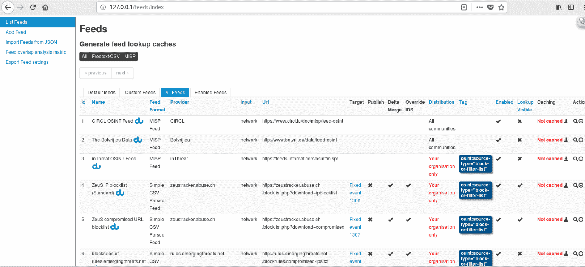

如前面的屏幕截图所示，我们可以转到**添加源**选项卡，并从那里配置更多的源。

在下面的屏幕截图中，我们可以看到从配置的源下载和解析源的中央调度程序。我们可以选择一天、一周或一年中的任何时间，指示我们希望何时下载源。我们还可以配置调度程序重复的频率：

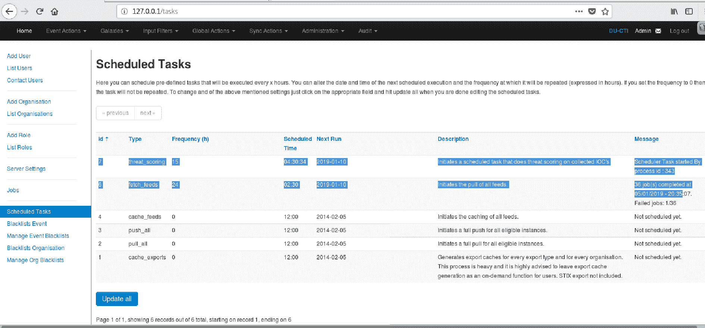

我们将专注于前面截图中的突出显示的行。在第二行，我们有一个**fetch_feeds**作业。双击频率和计划时间/日期字段可以让我们更改设置。此外，应该注意到前面突出显示的`threat_scoring`行不是 MISP 的默认安装内容。我们通过修改后端数据库注入了这个（我们在改进部分中介绍了这一点）。

一旦订阅被下载和解析，它们被放置在一个虚拟/逻辑实体中，称为**事件**。MISP 中的事件可以被视为 IOC 的集合。我们可以为不同的订阅创建单独的事件。或者，我们可以将所有基于 IP 的 IOC 放入单独的事件中，域名等等。以下截图显示了事件集合：


如果我们点击前面截图中任何一个事件的详细信息图标，我们将看到该特定事件实际持有的 IOC。这在以下截图中显示：

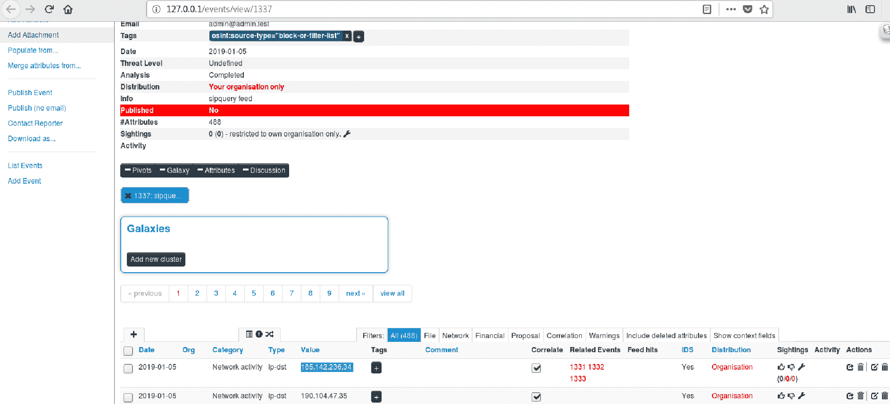

# MISP API（PyMISP）

如前所述，MISP 配备了一个非常稳定的 API，我们可以通过它在 MISP 中获取事件和被称为属性的 IOC，并与我们的安全工具共享。API 需要设置身份验证密钥。身份验证密钥可以在用户通过 MISP Web 门户登录时找到。这里展示了如何使用 MISP API 从 MISP 后端数据库获取特定事件的详细信息的示例：

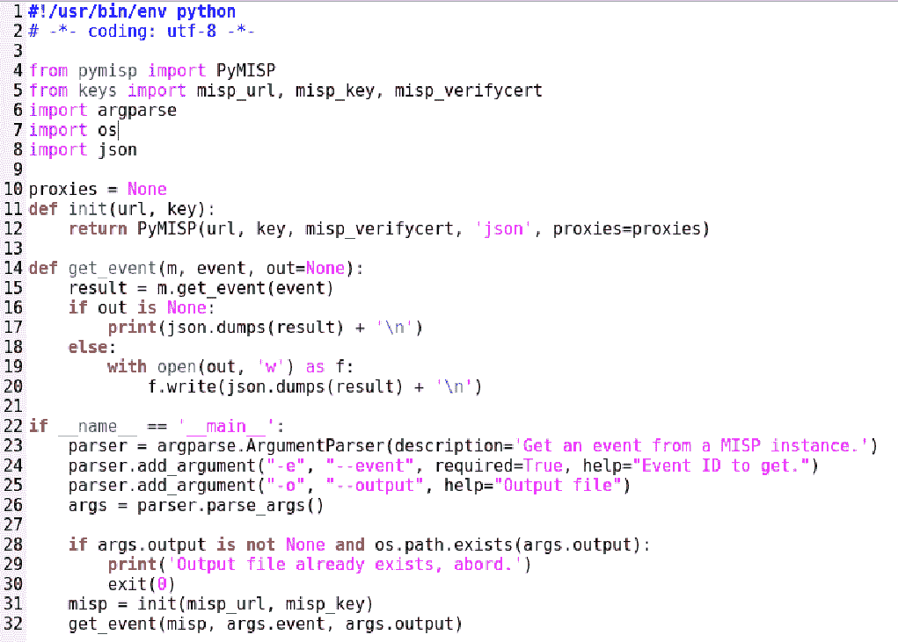

MISP API 的完整详情可以在以下链接找到：[`github.com/MISP/PyMISP/tree/2c882c1887807ef8c8462f582415470448e5d68c/examples`](https://github.com/MISP/PyMISP/tree/2c882c1887807ef8c8462f582415470448e5d68c/examples)。

在前面的代码片段中，我们只是在第 31 行初始化了 MISP API 对象，并调用了`get_api` API 方法。前面的代码可以按如下方式运行：


如前面的截图所示，我们得到了与`1512`事件 ID 相关联的所有 IOC。如果我们指定`out`参数，输出也可以保存在 JSON 文件中。

# 威胁评分

正如我们之前讨论过的，威胁评分是威胁情报的一个非常重要的部分。通常收集到数百万个 IOC，它们通常包含大量的误报。如果这些信息直接输入到 SIEM 工具中，将导致大量的误报警报。为了解决这个问题，我们尝试编写一个算法，该算法在 MISP 收集的 IOC 之上工作，并为每个 IOC 关联一个威胁评分。这个想法是，在 10 分制上得分为五分或更高的 IOC 更有可能是真正恶意的 IOC，并且应该输入到 SIEM 中。这个算法工作的威胁评分标准如下所示：

+   **日期**：IOC 的日期占 30%的权重。如果一个 IOC 是一到三个月前的，它将获得 30%的全部 100%，即 3 分。如果是四个月前，它将获得 90%，或 2.9 分，依此类推。完整的细节将在下一节中给出。

+   **相关性**：IOC 的相关性计数占权重的 54%。我们所说的相关性是指在多个事件或多个数据源中出现的频率。假设我们配置了 30 个数据源，每个数据源的 IOC 都会进入不同的事件，结果就是 30 个事件。现在，如果有一个 IOC 在所有 30 个事件中都出现，这表明该 IOC 极有可能是高度恶意的，因为有 30 个不同的来源引用了它。这个 IOC 将获得相关性分配的整个 54%权重，即 5.4 分。如果一个 IOC 出现在 90%的配置数据源中，它将获得相应数量的分数。相关性权重的实际分配将在以下部分给出。

+   **标签**：许多 IOC 数据源会使用与其关联的活动类型对 IOC 进行标记，例如扫描、僵尸网络和钓鱼网站。标签所占权重为 15%。需要注意的是，该部分根据与 IOC 关联的标签数量而非标签类型进行工作。标签数量越多，占 15%权重的分数就越高。

+   **评论**：最后，剩下的 1%分配给标签部分。一些 IOC 也带有特定的评论。如果一个 IOC 有相关评论，它将获得整个 1%，即 0.1 分，如果没有，它在这一部分将获得 0 分。

# 威胁评分加权文件

这些标准并未硬编码在程序逻辑中，而是在 JSON 文件中配置，以便用户可以随时更改它们，代码将获取更新后的值并相应地分配分数。我们在 JSON 文件中设置了以下值：


如前面的截图所示，`标签`的权重为 15%。这在 8-12 行进一步分配。第 8 行表示任何具有最少五个标签和最多 10,000 个标签的 IOC 将获得整个 15%。第 9 行表示任何具有四个标签的 IOC 将获得 15%的 90%，依此类推。

`日期`也有类似的分配。最多 30 分，任何 0 到 90 天的 IOC 都将获得整个 30 分的 100%，即 3 分。任何 91-100 天的 IOC 将获得 30 分的 90%，即 2.7 分，依此类推。

`相关性`的权重为 54%，如下截图所示。在相关性的情况下，权重的分配有些不同。第 41 行的数字 35 并不表示绝对数量，而是一个百分比。这意味着在配置的总数据源中，如果一个 IOC 在 35%的数据源或事件中被发现，那么它应该获得整个 5.4 分。其他行可以类似地解释。

最后，还有 1%的权重分配给 IOC 是否带有任何评论：

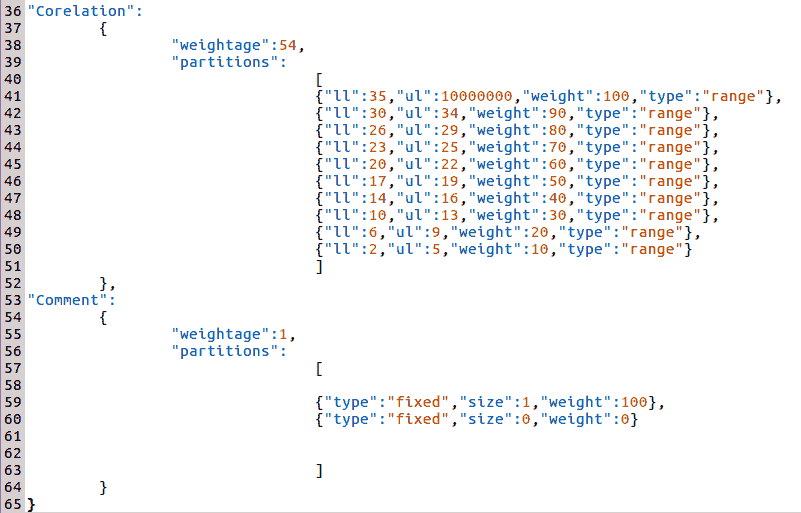

# 威胁评分算法

看一下我们编写的以下代码，用于对 MISP IOC 集合进行威胁评分。完整的代码可以在以下链接找到：[`github.com/PacktPublishing/Hands-On-Penetration-Testing-with-Python`](https://github.com/PacktPublishing/Hands-On-Penetration-Testing-with-Python)：

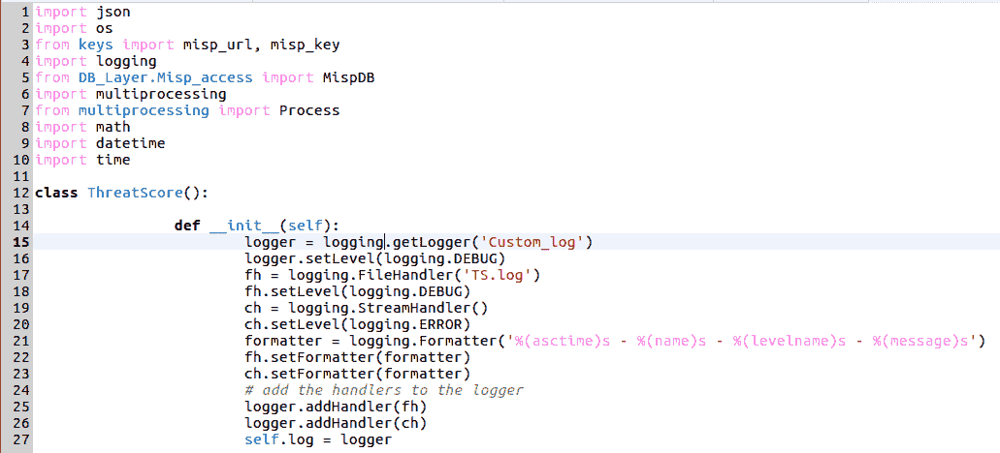

让我们试着理解到目前为止编写的代码。这段代码利用了我们在本书中学到的概念。其想法是从 MISP `attributes`后端表中读取所有 IOCs，并根据之前讨论的逻辑为每个 IOCs 赋予威胁分数。现在，有数百万个属性，所以如果我们尝试按顺序读取它们并对它们进行评分，将需要很长时间。这就是 Python 在多进程方面的优势所在。我们将读取所有属性，并根据底层机器的处理器核心将属性分成相等的块。每个处理器核心将一次性处理一个块。它还将为属于该块的 IOCs 分配威胁分数。我使用的硬件具有 8GB 的 RAM 和 4 核处理器。

假设我们总共有 200 万个属性，这些属性将被分成四个块，每个块将包含 50 万个属性。评分过程将由专用处理器核心在该块上执行。如果对 200 万个块进行顺序操作需要 4 小时，那么多进程方法将需要 1 小时。在 40 和 51 行之间编写的逻辑负责确定我们将使用的块的总数。它还包含推断块大小的逻辑，如下截图所示：


应该注意的是，在第 5 行导入的模块`from DB_Layer.Misp_access import MispDB`代表一个名为`MISPDB`的自定义类，声明在`MISP_access.py`模块中。该类具有从`misp`数据库中提取数据的原始 SQL 代码。

在 54 和 56 行之间，我们将块放入一个名为`limit_offset`的自定义列表中。假设我们在后端数据库表中有 200 万个属性。在第 56 行之后，该列表将更新如下：

```py
limit_offset=[{"offset":0,"limit":500000},{"offset":500000,"limit":500000},{"offset":1000000,"limit":500000},{"offset":1500000,"limit":500000}]
```

在 61 和 64 行之间，我们为每个块调用一个单独的进程。进程将执行的方法是`StartProcessing()`，我们将当前块作为参数传递。在剩余的 69-97 行中，我们正在更新状态以将状态代码返回给调用`UpdateThreatScore()`方法的代码。让我们来看一下处理器核心执行的方法：

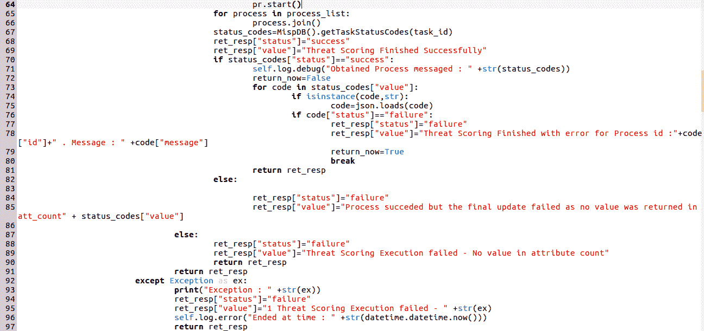

以下代码的核心逻辑位于第 186 行，代码接受当前块并调用`self.Scoring()`方法。该方法通过组合每个属性的标签、相关性、日期和注释威胁分数产生威胁分数。最后，一旦获得累积分数，它将更新后端`threat_scoring`数据库表。这在下面的片段中显示：

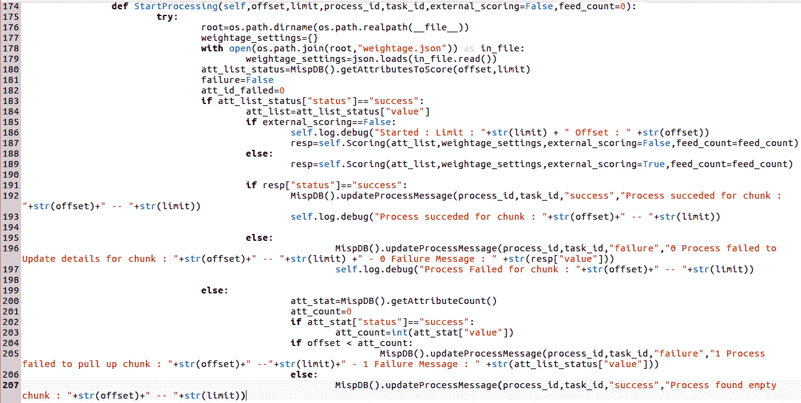

如图所示，`Scoring()`方法在 130-133 行下进一步调用四种不同的方法。它将分数总结并将其推送到数据库表中。让我们看一下它调用的四种方法： 

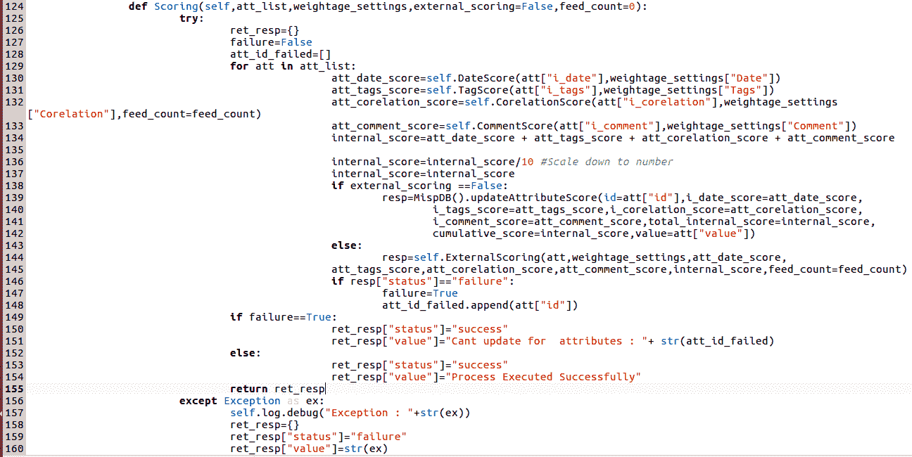

如下截图所示，所有四种方法都从 JSON 文件中读取配置值，并将它们传递给一个名为`ComputeScore`的公共方法，该方法最终根据传递的配置值计算分数并返回计算出的分数：

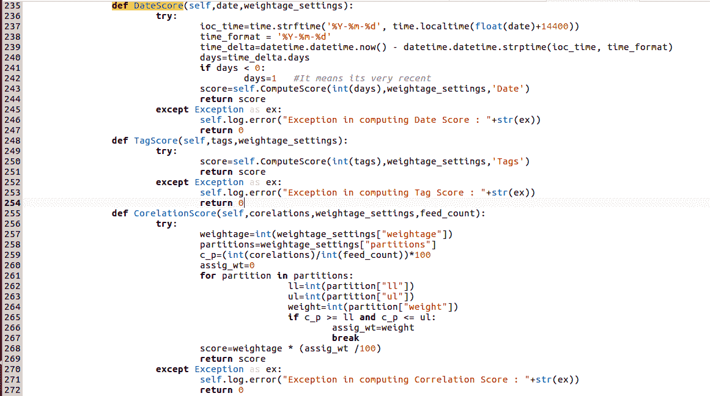

以下代码将所有部分连接在一起并返回计算出的分数。该代码将在单独的处理器核心上并行调用所有块：

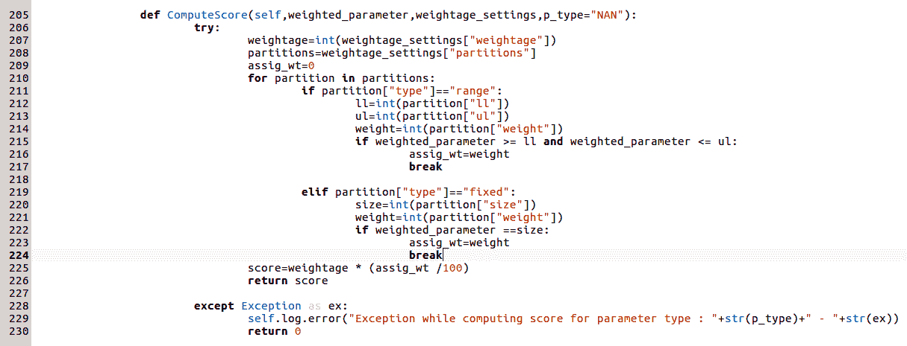

最后，我们将创建该类的对象并调用`Update`方法，如下所示：

```py
ob=ThreatScore()
ob.UpdateThreatScore()
```

# 执行代码

整个代码可以在以下 GitHub 存储库中找到，[`github.com/PacktPublishing/Hands-On-Penetration-Testing-with-Python`](https://github.com/PacktPublishing/Hands-On-Penetration-Testing-with-Python)，并且可以按如下方式调用：

```py
python3.6 TS.py
```

该代码将所有执行和调试消息放入一个`log`文件中，该文件将自动在相同的文件夹中创建，并称为`TS.log`。一旦代码成功执行，它将具有以下内容：


当代码执行时，有四个并行的读/写操作在数据库上执行，因为每个处理器核心将分别读取和写入。如下图所示：

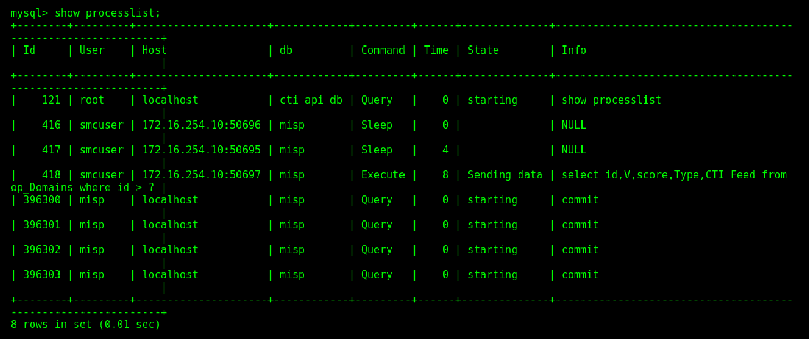

可以看到，有四个名为`misp`的用户帐户正在尝试同时从数据库中读取和写入。

以下屏幕截图表示了威胁评分表的架构：

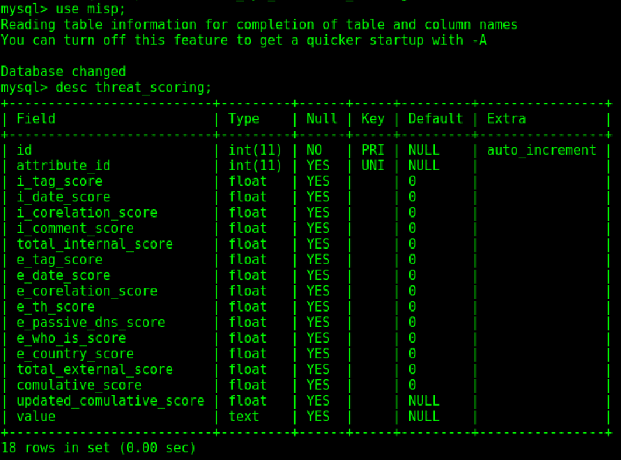

以下屏幕截图显示了 IOC 的威胁评分。


以下屏幕截图显示了一些 IP 地址：

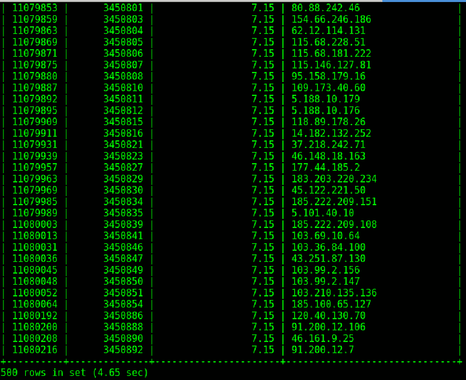

# STIX 和 TAXII 和外部查找

STIX 和 TAXII 术语在威胁情报领域中经常被使用。我们将尝试使用以下示例来理解它是什么。

假设我们有一个名为 A 的组织，它拥有大量的威胁情报数据。数据来自外部源以及内部威胁情报数据。组织 A 是一家银行组织，使用平台 X 来存储和管理他们的威胁情报数据。现在，组织 A 希望通过与银行部门中的其他组织（如 B 和 C 组织）共享他们的威胁情报数据来帮助银行社区。他们也希望其他组织也分享他们的数据。问题是，虽然组织 A 使用平台 X 来管理他们的威胁情报数据，但组织 B 和 C 使用完全不同的平台。那么组织 A 如何与 B 和 C 分享其情报呢？这就是 STIX 和 TAXII 派上用场的地方。

STIX 和 TAXII 通过提供一个使用通用格式存储和检索情报的平台来解决威胁情报共享的问题。例如，如果组织 X 需要使用属于组织 Y 的网站，它们将通过组织 Y 使用的 Web 服务器上的 HTTP/HTTPS 协议进行。 HTTP 是由 Web 服务器提供的基于 Web 的信息的通信模式。同样，STIX 是用于交换威胁情报数据的协议，并由称为 TAXII 服务器的服务器提供。TAXII 服务器能够理解 STIX 内容并将其提供给客户端。在细粒度上，STIX 的内容只是一个 XML 文档，它以一定的方式格式化，并带有符合 STIX 格式的特定标记，以便 TAXII 服务器能够理解。这意味着所有使用 TAXII 服务器的组织都将能够在 STIX 协议下共享威胁情报数据。

MISP 还具有与 TAXII 服务器集成的能力。通过 TAXII 服务器在 MISP 中共享的内容被放置在 TAXII 服务器的数据库中，以及在 MISP 数据库中。要获取有关 MISP 和 TAXII 服务器集成的完整详细信息，请参阅官方网址：[`github.com/MISP/MISP-Taxii-Server`](https://github.com/MISP/MISP-Taxii-Server)。

TAXII 服务器有用 Python 编写的客户端，这使得集成无缝且非常容易。就像市场上有不同的 Web 服务器，例如 Apache、nginx 和 Tomcat 一样，TAXII 服务器有一些不同的实现，包括以下内容：

+   [`github.com/eclecticiq/OpenTAXII`](https://github.com/eclecticiq/OpenTAXII)

+   [`github.com/oasis-open/cti-taxii-server`](https://github.com/oasis-open/cti-taxii-server)

+   [`github.com/freetaxii/server`](https://github.com/freetaxii/server)

+   [`github.com/SecurityRiskAdvisors/sra-taxii2-server`](https://github.com/SecurityRiskAdvisors/sra-taxii2-server)

+   [`github.com/StephenOTT/TAXII-springboot-bpmn`](https://github.com/StephenOTT/TAXII-springboot-bpmn)

我们可以在官方 GitHub 存储库中了解每个的功能。了解哪些实现具有哪些功能对您将会很有用。

# 外部查找

有许多付费和开源的外部查找网站暴露了获取有关 IOC 信息的 API。其中一些最著名的包括以下内容：

+   IPvoid：[`www.ipvoid.com/`](http://www.ipvoid.com/)

+   URLvoid：[`www.urlvoid.com/`](https://www.urlvoid.com/)

+   Cymon：[`api.cymon.io/v2/ioc/search/`](https://api.cymon.io/v2/ioc/search/)

+   恶意软件域：[`www.malwaredomainlist.com/mdl.php`](http://www.malwaredomainlist.com/mdl.php)

+   Threat Miner：[`www.threatminer.org/`](https://www.threatminer.org/)

+   Threatcrowd：[`www.threatcrowd.org/`](https://www.threatcrowd.org/)

其中许多都暴露了 API，可以完全自动化 IOC 查找的过程。例如，让我们看一下通过 Cymon 暴露的 API 自动化 IOC 查找的以下代码片段：

```py
import requests 
from urllib.parse import urljoin
from urllib.parse import urlparse
cymon_url='https://api.cymon.io/v2/ioc/search/'
type_="ip-src"
ip="31.148.219.11"
if type_ in ["ip-src","ip-dst","domain|ip","ip-dst|port","ip-src|port","ip"]:
 cymon_url=urljoin(cymon_url,"ip/")
 cymon_url=urljoin(cymon_url,ip)
response = requests.get(cymon_url, data={},  headers=headers)
print(response)
```

我们可以在这些网站上搜索并阅读 API 文档，以便自动化 IOC 针对这些网站的查找过程。

# 总结

在本章中，我们探讨了 Python 在防御安全中的用途。应该注意的是，我们只捕捉了 Python 在防御安全中的一小部分用途。还有许多其他用途，包括编排、自动化重复任务、开发将 IDS/IPS 签名与 Qualys/Nessus CVE 相关联的脚本。本章奠定了 Python 的用途基础，我鼓励读者进行进一步研究。

在下一章中，我们将看到一些其他常见的网络安全用例，其中 Python 非常方便。

# 问题

1.  我们如何进一步改进威胁评分算法？

1.  我们能否使用先前讨论过的威胁评分代码与基于 Python 的调度程序？

# 进一步阅读

+   STIX 和 TAXII：[`threatconnect.com/stix-taxii/`](https://threatconnect.com/stix-taxii/)

+   MISP：[`github.com/longld/peda`](https://github.com/longld/peda)

+   威胁情报：[`www.cisecurity.org/blog/what-is-cyber-threat-intelligence/`](https://www.cisecurity.org/blog/what-is-cyber-threat-intelligence/)
