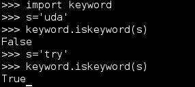
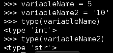
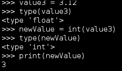
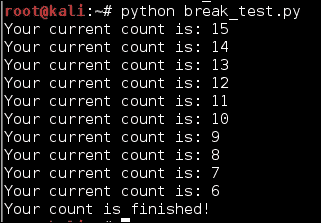
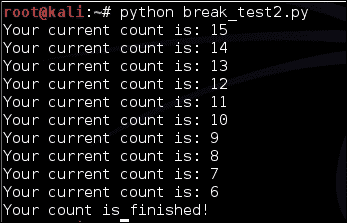

# 第二章：Python 脚本的基础知识

在开始编写你的第一个 Python 脚本之前，应该先了解一些概念。现在学习这些内容将有助于你将来更快地开发代码。这将提高你作为渗透测试人员的能力，或者理解评估人员在创建实时自定义代码时在做什么以及你应该问什么问题。你还应该了解如何创建脚本以及你试图实现的目标。你会经常发现你的脚本会随着时间而变化，目的可能会改变。这可能是因为你意识到脚本的真正需求可能不存在，或者有一个特定功能的现有工具。

许多脚本编写者会觉得沮丧，因为他们可能已经花了很多时间在一个项目上，但最终发现这个工具具有更高级工具的重复功能。不要把这看作是一个失败的项目，而是把这个活动看作是一个经历，在这个过程中你学到了一些最初不知道的新概念和技术。此外，无论何时你在开发代码片段时，都要时刻记在心里，这些代码片段可以在将来的其他项目中使用。

因此，尽量编写清晰的代码，用注释说明你在做什么，并使其模块化，这样一旦学会了如何构建函数，它们可以在将来的其他脚本中被剪切和粘贴。这个旅程的第一步是以高层次描述计算机科学词汇表，这样你就可以理解将来的章节或其他教程。如果不理解这些基本概念，你可能会误解如何实现你想要的结果。

### 注意

在运行本书中的任何脚本之前，我建议你在 git 存储库上运行设置脚本，这将为你的 Kali 实例配置所有必要的库。该脚本可以在[`raw.githubusercontent.com/funkandwagnalls/pythonpentest/master/setup.sh`](https://raw.githubusercontent.com/funkandwagnalls/pythonpentest/master/setup.sh)找到。

# 理解解释型语言和编译型语言之间的区别

Python、Ruby 和 Perl 等语言都是解释型语言，这意味着代码在执行脚本时会被转换为机器语言并运行。需要在运行之前编译的语言，比如 Cobol、C 或 C++，可能更有效率和更快，因为它在执行之前被编译，但这也意味着代码通常不太可移植。由于编译代码是为特定环境生成的，当你需要在异构环境中移动时，它可能不太有用。

### 注意

异构环境是一个具有多个系统类型和不同发行版的环境。因此，可能会有多个 Unix/Linux 发行版、Mac OS 和 Windows 系统。

解释型代码通常具有可移植性的好处，只要解释器可用。因此，对于 Python 脚本，只要安装了解释器并且库是本地可用的，脚本就应该可以运行。始终记住环境中会有特殊情况，在使用脚本之前，应该在类似的测试环境中进行彻底测试。

那么为什么你应该学习 Python 而不是其他脚本语言呢？我在这里不做这个论点，原因是最好的评估人员使用他们所评估的环境中可用的工具。你将编写对评估环境有用的脚本，Python 非常适合这样做，但当你获得对系统的访问权限时，最好使用可用的工具。

高度安全的环境可能会阻止您使用渗透框架，或者评估规则可能会做同样的事情。当这种情况发生时，您必须查看系统上可用的内容并继续前进。如今，新一代 Windows 系统使用 PowerShell 进行攻击。在当前的 Mac、Linux、Unix 和 Windows 操作系统中，尤其是在开发环境中，您可以找到 Python 的版本。在 Web 服务器上，您会发现 Ruby、Python 或 Perl。在所有形式的操作系统上，您都会找到本机 shell 语言。它们提供了许多功能，但通常具有过时的语言结构，需要比其他脚本语言更多的代码行来完成相同的任务。这些 shell 语言的示例包括 Bourne-again Shell（BASH）、Korn Shell（KSH）、Windows 命令 Shell 和等效物。

在大多数渗透系统中，您会发现所有的语言，因为大多数黑客笔记本电脑或 HackTops 使用多个虚拟机（VMs）和许多操作系统。旧的评估工具是用 Perl 编写的，因为该语言在当时提供了其他解释语言无法提供的多种功能。新工具通常是用 Ruby 和 Python 创建的。事实上，今天正在创建的许多库都是为了改进这些语言的能力，特别是为了评估组织被恶意行为者威胁的潜在可行性。

### 提示

请记住，您的 HackTop 有多个虚拟机，不仅提供攻击工具，还提供一个安全测试平台来测试您的脚本。在您的 HackTop 上恢复虚拟机的快照很容易，但是告诉客户为什么您使用未经测试的脚本损坏了他们的业务关键组件却不容易。

编译语言并非毫无价值；许多工具是用 C、C++和 Java 创建的。这些类型的工具的示例包括 Burp Suite、Cain & Abel、DirBuster、Zed Attack Proxy（ZAP）、CSRFtester 等。您可能会注意到，这些工具中的大多数最初是在评估环境的早期创建的。随着系统变得更加强大和解释器变得更加高效，我们看到其他工具转移到了解释语言而不是编译语言。

那么这里的教训是什么？尽可能多地学习，以在尽可能多的环境中操作。这样，当遇到障碍时，您可以返回到代码并脚本化以获得必要的访问级别。

# Python-优点和缺点

Python 是创建可实现切实结果的工作代码的最简单的语言之一。事实上，Python 具有本地交互式解释器，通过它可以直接测试代码，只需在 CLI 中执行单词`python`。这将带来一个界面，可以在尝试编写脚本之前测试代码的概念。此外，这个界面不仅允许测试新概念，还允许导入模块或其他脚本作为模块，并使用它们创建强大的工具。

Python 的这种测试能力不仅允许评估者验证概念，还可以避免处理繁琐的调试器和测试用例，快速原型化攻击代码。当参与项目并确定特定的攻击训练是否能够及时产生有用的结果时，这一点尤为重要。最重要的是，使用 Python 和导入特定库通常不会破坏整个工具套件，卸载特定库也非常容易。

### 注意

为了维护客户环境的完整性，你应该避免在客户系统上安装库。如果有必要这样做，确保你与你的联系人一起工作，因为可能会产生意想不到的后果。这也可能被视为违反组织的**系统开发生命周期**（**SDLC**）和其变更控制流程。最终结果是，你可能会为客户创造比原始评估意图更多的风险。

Python 的语言结构虽然与许多其他形式的编码不同，但非常简单。阅读 Python 类似于阅读一本书，但有一些细微的注意事项。在撰写本书时，基本上有两种不同形式的 Python 开发树——Python 2.X 和 Python 3.X。大多数评估工具在 2.X 版本上运行，这也是我们将重点关注的，但是语言版本的改进基本上已经停止。你可以编写适用于两个版本的代码，但这需要一些努力。

实质上，Python 3.X 版本已经开发成更加**面向对象**（**OO**），这意味着为它编码意味着专注于面向对象的方法和属性。这并不是说 2.X 不是面向对象的；只是它没有 3.X 版本发展得那么好。最重要的是，一些库与两个版本都不兼容。

信不信由你，Python 脚本不完全兼容的最常见原因是内置的`print`函数。

### 注意

在 Python 2.X 中，`print`是一个语句，在 3.X 中，它是一个函数，你将在下面看到。在本书中，单词语句和函数的使用可能是可以互换的，但理解它们之间的区别是构建版本无关脚本的关键。

尝试使用`print`在屏幕上打印一些东西可以通过两种方式完成。一种是使用包裹在参数中，另一种是不使用它们。如果使用包裹在参数中，它与 2.X 和 3.X 兼容；如果不是，那么它只能与 2.X 一起使用。

以下示例显示了一个仅适用于 2.X 的`print`函数的样子：

```py
print "You have been hacked!"

```

这是一个与 2.X 和 3.X Python 解释器兼容的`print`函数的示例：

```py
print("You have been hacked!")

```

在你开始创建脚本之后，你会注意到你在脚本中经常使用`print`函数。因此，在大型脚本中进行大规模的文本替换可能是费力且容易出错的，即使使用自动化方法也是如此。例如，包括`sed`、`awk`和其他数据处理工具。

随着你成为一个更好的评估者，你应该努力编写你的脚本，使它们可以在任何一个版本中运行。原因是，如果你妥协了一个环境，你需要一个自定义脚本来完成一些后渗透活动，你不会希望因为版本不兼容而减慢速度。开始的最佳方式是确保你使用与 Python 两个版本兼容的`print`函数。

### 注意

面向对象编程意味着语言支持可以根据需要创建和销毁的对象来完成任务。已经开发了整个培训课程来解释和扩展面向对象的概念。这些概念的深入解释超出了本书的范围，但建议进一步学习。

除了面向对象的思维过程和支持面向对象的代码的构建之外，还有创建“Python 化”或“Pythonic 脚本”。这不是虚构的；相反，它是一种定义创建和编写 Python 脚本的正确方法。你可以以许多方式编写 Python 脚本，多年来，最佳实践已经发展。这就是所谓的**Pythonic**，因此，我们应该始终努力以这种方式编写。原因是，当我们作为贡献者向社区提供脚本时，它们更容易阅读、维护和使用。

### 注意

Pythonic 是一个很好的概念，因为它涉及到影响其他语言的采用和社区中不良实践的一些最重要的事情。

# Python 交互式解释器与脚本

Python 语言有两种使用方式。一种是通过交互式解释器，允许快速测试函数、代码片段和想法。另一种是通过一个完整的脚本，可以保存并在不同系统之间传输。如果你想尝试交互式解释器，只需在命令行中输入`python`。

### 注意

交互式解释器在不同操作系统中的功能方式相同，但与系统交互的库和调用函数可能不同。如果引用了特定位置，或者命令和/或库使用特定于操作系统的功能，功能将不同。因此，在脚本中引用这些细节将大大影响其可移植性，因此不被认为是一种主流做法。

# 环境变量和 PATH

这些变量对于执行 Python 编写的脚本很重要，但不是用于编写脚本。如果它们没有配置，Python 二进制文件的位置必须通过其完全限定的路径位置引用。例如，在 Windows 中，没有声明环境变量的情况下执行 Python 脚本的示例：

```py
C:\Python27\python wargames_print.py

```

如果脚本顶部没有列出对正确解释器的引用，并且文件在当前目录中，则在 Linux 或 Unix 中相当于以下内容：

```py
/usr/bin/python ./wargames_print.py

```

在 Windows 中，如果环境变量已设置，只需输入`python`和脚本名称即可执行脚本。在 Linux 和 Unix 中，我们在脚本顶部添加一行以使其更具可移植性。对我们（渗透测试人员）的好处是，这使得脚本在许多不同类型的系统上都很有用，包括 Windows。这行在 Windows 操作系统中被忽略，因为它被视为注释。所有 Python 脚本的顶部应包含以下引用行：

```py
#!/usr/bin/env python

```

这行让操作系统根据`PATH`环境变量中设置的内容确定正确的解释器来运行。在互联网上的许多脚本示例中，你可能会看到对解释器的直接引用，比如`/usr/bin/python`。这不被认为是一种良好的做法，因为它会使代码不够可移植，并且更容易出现潜在的系统更改错误。

### 提示

设置和处理`PATH`和环境变量对每个操作系统都是不同的。有关 Windows，请参阅[`docs.python.org/2/using/windows.html#excursus-setting-environment-variables`](https://docs.python.org/2/using/windows.html#excursus-setting-environment-variables)。对于 Unix 和 Linux 平台，详细信息可以在[`docs.python.org/2/using/unix.html#python-related-paths-and-files`](https://docs.python.org/2/using/unix.html#python-related-paths-and-files)找到。此外，如果有一天需要为特定工具创建特殊的环境变量，可以在[`docs.python.org/2/using/cmdline.html`](https://docs.python.org/2/using/cmdline.html)找到详细信息。

# 理解动态类型语言

Python 是一种动态类型的语言，这意味着很多东西，但最关键的方面是变量或对象的处理方式。动态类型的语言通常与脚本语言等同，但这并不总是如此，需要明确。当你编写脚本时，这对你的意义是变量在运行时被解释，因此它们不必按大小或内容定义。

# 第一个 Python 脚本

现在你对 Python 是什么有了一个基本的概念，让我们创建一个脚本。我们不使用著名的 `Hello World!` 介绍，而是使用一个文化电影的例子。脚本将定义一个函数，该函数将打印出 1983 年文化经典电影 *WarGames* 中的一句名言。有两种方法可以做到这一点，如前面提到的；第一种是通过交互式解释器，第二种是通过脚本。打开交互式解释器并执行以下命令：

```py
print("Shall we play a game?\n")

```

前面的打印语句将显示代码执行成功。要退出交互式解释器，可以输入`exit()`，或者在 Windows 中使用 *Ctrl* + *Z*，在 Linux 中使用 *Ctrl* + *D*。现在，在你喜欢的编辑工具中创建一个脚本，比如 vi、vim、emacs 或 gedit。然后将文件保存在 `/root/Desktop` 中，命名为 `wargames_print.py`：

```py
#!/usr/bin/env python
print("Shall we play a game?\n")

```

保存文件后，使用以下命令运行它：

```py
python /root/Desktop/wargames_print.py

```

你将再次看到脚本执行相同的结果。在这个例子中要注意一些事项。`python` 脚本是通过引用完全限定的路径来运行的，以确保调用正确的脚本，无论位置如何。如果脚本驻留在当前位置，可以以以下方式执行：

```py
python ./wargames_print.py

```

### 提示

Kali 不需要本地执行这些脚本的 `./`，但养成这个习惯是很好的，因为大多数其他 Linux 和 Unix 操作系统都需要。如果你不习惯这种做法，而且在评估时有点睡眠不足，你可能意识不到你的脚本为什么一开始没有执行。这种技巧可以在多人团队合作中避免一些尴尬。

# 开发脚本和识别错误

在我们开始创建大规模的脚本之前，你需要了解可能产生的错误。如果你开始创建脚本并产生了一堆错误，你可能会感到沮丧。请记住，Python 在指导你需要查看的内容方面做得相当不错。然而，错误的产生者通常要么就在引用的行之前，要么就是调用的函数。这可能会产生误导，为了防止沮丧，你应该了解 Python 可能在错误中引用的定义。

## 保留字、关键字和内置函数

保留字、关键字和内置函数也被称为**禁用**，这意味着这些名称不能用作变量或函数。如果重复使用这些单词或函数，将会显示错误。Python 中本地设置了一些保留字和内置函数，取决于你使用的版本，它们可能会发生变化。现在你不必太担心这个问题，但如果你看到与变量或值的定义相关的错误，要考虑到你可能使用了关键字或内置函数。

### 注意

关于关键字和内置函数的更多细节可以在 [`docs.python.org/2/library/keyword.html`](https://docs.python.org/2/library/keyword.html) 找到。

以下是一些 Python 关键字的示例和简要定义。这些将在本章的其余部分详细描述：

| 示例关键字 | 目的 |
| --- | --- |
| `for` | 一种用于迭代的 Python 循环类型 |
| `def` | 在当前脚本中创建的函数的定义 |
| `if` | 评估语句并确定结果行动的方法 |
| `elif` | `if` 语句的后续评估，允许超过两种不同的结果 |
| `import` | 导入库的方式 |
| `print` | 输出数据到 **标准输出** (**STDOUT**) 的语句 |
| `try` | 条件处理程序测试 |

如果你想确认一个名称是否是关键字，可以启动交互式解释器，并将一个变量设置为特定的关键字名称。然后，通过关键字的函数运行它。如果返回 `true`，那么你就知道它是一个关键字；如果返回 `false`，你就知道它不是。参考以下截图更好地理解这个概念：



## 全局和局部变量

全局变量是在函数外定义的，局部变量是在特定函数内定义的。这很重要，因为如果在函数内重复使用名称，其值通常只会在该函数内保留。如果你希望改变全局变量的值，你可以使用 global 关键字调用全局版本并设置一个新值。如果可能的话，应该避免这样做。关于局部和全局变量的使用示例，请参见以下代码：

```py
#!/usr/bin/env python

hacker = "me"

def local_variable_example():
    hacker = "you"
    print("The local variable is %s") % (hacker)

local_variable_example()
print("The global variable is %s") % (hacker)
```

这个脚本的输出显示了在`local_variable_example`函数示例中打印局部变量`hacker`，然后在函数执行后打印全局变量`hacker`。


### 注意

前面的例子展示了如何通过变量将值插入到字符串中。在本章的后面，将提供几种方法来实现这一点。

## 理解命名空间

Python 中变量的基本概念是一个名称；这些名称驻留在一个桶中。每个模块或脚本都有自己的全局命名空间，这些名称驻留在这个桶中，这个桶被称为命名空间。这意味着当一个名称被使用时，它是为特定目的而保留的。如果你再次使用它，会导致两种情况之一：要么你会覆盖这个值，要么你会看到一个错误。

## 模块和导入

在 Python 中，可以导入库或模块来执行特定任务或补充功能。当你编写自己的脚本时，你可以将一个脚本作为模块导入到一个新的脚本中使用。有几种方法可以做到这一点，每种方法都有其优点和缺点：

```py
import module
```

这允许你导入一个模块并使用它和函数，通过引用它们类似于一个函数。例如，你可以引用模块和模块内的函数为`module.function()`。这意味着你的命名空间保持简单，你不必担心覆盖和冲突，不像以下方法：

```py
from module import *
```

这在 Python 脚本和互联网上的示例中非常常见。危险在于所有函数或模块内的函数都直接引入。这意味着如果你在脚本中定义了一个名为`hacker_tool`的函数，而`hacker_tool`（被导入的模块包含同名的模块），你可能会遇到命名空间冲突并产生多个错误。在运行时，当脚本被解释时，它将占用更多的内存空间，因为不必要的函数被导入。然而，好处是你不必识别必要的函数，也不必使用`module.function()`的方法。相反，你可以直接调用`function()`。

接下来的两种方法是引用模块或函数为不同的名称。这允许你缩短需要重用的语句，并且通常可以提高可读性。相同的命名空间冲突存在，因此你的导入和引用应该谨慎定义。第一种是将模块声明为不同的名称：

```py
import module as a
```

第二种是将函数声明为不同的名称：

```py
from module import function as a
```

还有其他执行这些任务的方法，但这已经足够阅读大部分生成的脚本并创建有用的工具了。

### 提示

你知道 Python 模块本身就是脚本吗？你可以通过查看 Windows Python 安装中的`Lib`目录来了解这些产品的工作方式，默认情况下为`C:\Python27\Lib`对于 Python 2.7\. 在 Kali Linux 中，它可以在`/usr/lib/python2.7`找到。

# Python 格式化

这种语言对我来说最大的卖点是它的格式。将脚本放在一起需要很少的工作，由于其简单的格式要求，您减少了出错的机会。对于有经验的程序员来说，可恶的`;`和`{}`符号不再会因为语法错误而影响您的开发时间。

## 缩进

在 Python 中最重要的是缩进。Python 使用缩进来显示逻辑块的更改位置。因此，如果您正在编写一个简单的`print`脚本，就像前面提到的那样，您不一定会看到这一点，但是如果您正在编写一个`if`语句，您会看到。请参见以下示例，它打印了先前在此处提到的语句：

```py
#!/usr/bin/env python
execute=True
if execute != False:
    print("Do you want to play a game?\n")
```

有关此脚本的操作和执行的更多详细信息可以在本章的*复合语句*部分找到。以下示例在执行不是`False`时将语句打印到屏幕上。这个缩进表示该函数将其与全局代码分开。

有两种创建缩进的方法：通过空格或制表符。四个空格相当于一个制表符；前面代码中的缩进表示代码逻辑与全局代码的分离。这样做的原因是，当从一个系统类型移动到另一个系统时，空格的转换效果更好，这样可以使您的代码更具可移植性。

# Python 变量

Python 脚本语言有五种变量类型：数字、字符串、列表、字典和元组。这些变量具有不同的预期目的、使用原因和声明方法。在了解这些变量类型的工作方式之前，您需要了解如何调试变量并确保您的脚本正常工作。

### 注意

列表、元组和字典属于一个名为**数据结构**的变量类别。本章涵盖了足够的细节来让您起步并运行，但是您在帮助论坛中注意到的关于 Python 的大部分问题都与数据结构的正确使用和处理有关。在您开始在本书中给出的细节之外进行自己的项目时，请记住这一点。有关数据结构及其使用方法的更多信息可以在[`docs.python.org/2/tutorial/datastructures.html`](https://docs.python.org/2/tutorial/datastructures.html)找到。

## 调试变量值

调试变量值的简单解决方案是确保预期的数据传递给变量。如果需要将变量中的值从一种类型转换为另一种类型，这一点尤为重要，这将在本章后面进行介绍。因此，您需要知道变量中的值，通常还需要知道它的类型。这意味着您将不得不在构建脚本时调试它们；这通常是通过使用`print`语句来完成的。您经常会看到初始脚本中散布着`print`语句。为了帮助您在以后的某个时间点清理它们，我建议给它们添加注释。我通常使用一个简单的`#DEBUG`注释，如下所示：

```py
print(variable_name) #DEBUG
```

这将允许您快速搜索并删除`#DEBUG`行。在 vi 或 vim 中，这非常简单——首先按下*Esc*，然后按下*:*，然后执行以下命令，搜索并删除整行：

```py
g/.*DEBUG/d

```

如果您想暂时注释掉所有`#DEBUG`行并稍后删除它们，可以使用以下方法：

```py
%s/.*DEBUG/#&

```

## 字符串变量

保存字符串的变量基本上是放置在引用中的单词、语句或句子。这个项目允许在脚本中需要时轻松重用值。此外，这些变量可以被操纵以在脚本的过程中产生不同的值。要将值传递给变量，需要在选择单词后使用等号来分配一个值。在字符串中，值要么用单引号括起来，要么用双引号括起来。以下示例显示了如何使用双引号分配一个值：

```py
variable_name = "This is the sentence passed"

```

以下示例显示了单引号分配给一个变量：

```py
variable_name = 'This is the sentence passed'

```

允许使用单引号和双引号的原因是为了让程序员能够将其中一个插入变量作为句子的一部分。请参考以下示例以突出显示差异：

```py
variable_name = 'This is the "sentence" passed'

```

除了通过此方法传递字符串或打印值，您还可以使用相同类型的引号来转义特殊字符。这是通过在任何特殊字符之前加上`\`符号来完成的，这有效地转义了特殊功能。以下示例突出了这一点：

```py
variable_name = "This is the \"sentence\" passed"

```

声明字符串的重要事项是选择一种引号类型——单引号或双引号——并在脚本中一致使用。此外，正如您在 Python 中所看到的，变量大小不必在初始时声明。这是因为它们在运行时被解释。现在您知道如何创建包含字符串的变量了。下一步是创建包含数字的变量。

## 数字变量

创建保存数字的变量非常简单。您定义一个变量名，然后通过在等号的右侧放置一个数字来为它赋值，如下所示：

```py
variable_name = 5

```

一旦变量被定义，它就保存了它传递的值的引用。这些变量可以被覆盖，可以对它们执行数学运算，并且甚至可以在程序运行中更改。以下示例显示了相同类型的变量被相加并打印出来。首先，我们展示了相同的变量相加并打印，然后我们展示了两个不同的变量。最后，这两个变量被相加，分配给一个新变量，并打印出来。


请注意，传递给变量的数值没有引号。如果有引号，Python 解释器会将它们视为字符串，结果会有显著不同。请参考以下截图，显示了将相同的方法应用于具有字符串等效的数字变量：


如您所见，这些值不是相加在一起，而是合并成一个字符串。Python 具有内置函数，允许我们将字符串解释为数字，将数字解释为字符串。此外，您可以使用`type`函数确定变量的类型。这个截图显示了两个变量的声明，一个是字符串，一个是整数：



如果变量中包含小数值，它将被声明为浮点数或简称为`float`。这仍然是一个数值变量，但它需要不同的存储方法，正如您所看到的，解释器已经为您确定了这一点。以下截图显示了一个例子：


## 转换字符串和数字变量

如数字变量部分所述，Python 具有内置函数，允许您将一个变量类型转换为另一个变量类型。作为一个简单的例子，我们将把一个数字转换为一个字符串，将一个字符串转换为一个数字。在使用交互式解释器时，如果变量值没有传递给新变量，它将立即打印出来；但是，在脚本中，它不会。如果数据通过**命令行界面**（**CLI**）传递，并且您想确保数据的处理方法，这种操作方法非常有用。

这是使用以下三个函数执行的：`int()`、`str()`和`float()`。这些函数确切地做了你认为它们会做的事情；`int()`将其他类型的适用变量更改为整数，`str()`将其他适用变量类型转换为字符串，`float()`将适用变量转换为浮点数。重要的是要记住，如果变量无法转换为所需的类型，您将收到一个`ValueError`异常，如此截图所示：


举个例子，让我们拿一个字符串和一个整数并尝试将它们加在一起。如果这两个值不是相同类型，你将会收到一个`TypeError`异常。这在以下屏幕截图中得到了证明：


这就是你必须确定变量的类型并选择其中一个转换为相同类型的地方。你选择转换哪一个将取决于预期的结果。如果你想要一个包含两个数字总值的变量，那么你需要将字符串变量转换为数字类型变量。如果你想要将值组合在一起，那么你将把非字符串变量转换为字符串。这个例子展示了两个值的定义：一个是字符串，一个是整数。字符串将被转换为整数以允许数学运算继续进行，如下所示：


现在你可以看到这是多么容易，考虑一下如果一个字符串变量代表一个`float`值并被转换为整数会发生什么。数字的小数部分将会丢失。这不会将值四舍五入；它只是去掉小数部分并给出一个整数。请参考以下屏幕截图以了解这个例子：



所以一定要将数字变量更改为适当的类型。否则，一些数据将会丢失。

## 列表变量

列表是一种数据结构，以一种可以组织、调整和轻松操作的方式保存值。在 Python 中识别列表的简单方法是通过`[]`，它表示值将驻留的位置。对这些列表的操作是基于通常通过位置调整值。要创建一个列表，定义一个变量名，并在等号的右侧放置用逗号分隔的值的括号。这个简单的脚本计算预定义列表的长度，并迭代并打印列表的位置和值。重要的是要记住，列表从位置 0 开始，而不是 1。由于列表可以包含不同类型的变量以包含其他列表，我们将打印值作为字符串以确保安全：

```py
#!/usr/bin/env python

list_example = [100,222,333,444,"string value"]
list_example_length = len(list_example)
for iteration in list_example:
 index_value = list_example.index(iteration)
 print("The length of list list_example is %s, the value at position %s is %s") % (str(list_example_length), str(index_value), str(iteration).strip('[]'))

print("Script finished")

```

以下屏幕截图显示了此脚本的成功执行：


正如你所看到的，从列表中提取值并将它们转换为数字或字符串值是重要的概念。列表用于保存多个值，并提取这些值以便它们可以被表示通常是必要的。以下代码向你展示了如何对字符串执行此操作：

```py
#!/usr/bin/env python

list_example = [100,222,333,444]
list_value = list_example[2]
string_value_from_list = str(list_value)
print("String value from list: %s") % (str(list_value))

```

重要的是要注意，列表不能被打印为整数，所以它必须要么转换为字符串，要么通过迭代打印。为了只显示简单的差异，以下代码演示了如何从列表中提取一个整数值并打印它和一个字符串：

```py
#!/usr/bin/env python

list_example = [100,222,333,444]
list_value = list_example[2]
int_value_from_list = int(list_value))
print("String value from list: %s") % (str(list_value))
print("Integer value from list: %d") % (int_value_from_list)

```

列表值可以进一步使用特定于列表的函数进行操作。您只需调用列表的名称，然后在列表中添加`.function(x)`，其中`function`是您想要完成的特定活动的名称，`x`是您想要操作的位置或数据。一些常用的函数包括向列表末尾添加值，例如数字 555，可以这样完成：`list_example.append(555)`。您甚至可以合并列表；这是使用`extend`函数完成的，它将相关项目添加到列表的末尾。通过执行以下函数来完成：`list_example.extend(list_example2)`。如果要删除值 555，只需执行`list_example.remove(555)`。可以使用名为`insert`的适当命名的函数在特定位置插入值，如此：`list_example.insert(0, 555)`。这里将描述的最后一个函数是`pop`函数，它允许您通过传递位置值来删除特定位置的值，或者通过指定没有值来删除列表中的最后一个条目。

## 元组变量

元组类似于列表，但与列表不同的是，它们使用`()`进行定义。此外，它们是不可变的；也就是说，它们不能被更改。这样做的动机是为了在复杂操作中控制数据的方式，以便在过程中不破坏它。元组可以被删除，并且可以创建一个新的元组来保存不同元组数据的部分，并显示数据已更改的样子。元组的简单规则如下：如果要保持数据不变，请使用元组；否则，请使用列表。

## 字典变量

字典是将键与值关联起来的一种方式。如果看到花括号，这意味着您正在查看一个字典。键表示对存储在无序数据结构中的特定值的引用。您可能会问自己为什么要这样做，当标准变量已经做了类似的事情。字典为您提供了存储其他变量和变量类型作为值的手段。它们还允许根据需要快速轻松地引用。您将在后面的章节中看到字典的详细示例；现在，请查看以下示例：

```py
#!/usr/bin/env python
dictionary_example = {'james':123,'jack':456}
print(dictionary_example['james'])

```

此示例将打印与`'james'`键相关的数字，如下图所示：


向字典中添加数据非常简单；您只需为字典分配一个新的键和一个该键的值。例如，要将值`789`添加到`'john'`键，您可以执行以下操作：`dictionary_example['john'] = 789`。这将为字典分配新的值和键。关于字典的更多细节将在后面介绍，但这已足以理解它们。

## 理解默认值和构造函数

以前编程或脚本编写过的人可能习惯于声明具有默认值的变量或设置构造函数。

在 Python 中，这并不是必须的，但在使用变量之前设置默认值是一个好习惯。除了是一个良好的实践外，它还可以减轻脚本出现意外错误和崩溃的一些原因。这也将增加可追溯性，如果将意外值传递给变量。

### 提示

在 Python 中，当实例化新对象时，构造方法由`__init__`和`__new__`处理。然而，当创建新类时，只需要使用`__init__`函数作为类的构造函数。这将在很久以后才需要，但请记住；如果您想开发多线程应用程序，这很重要。

## 将变量传递给字符串

假设你想要生成一个带有动态值的字符串，或者在打印字符串时包含一个变量并实时解释值。使用 Python，你可以用多种方式做到。你可以使用算术符号，比如`+`，来组合数据，或者使用特殊的字符组合来插入值。

第一个例子将使用两个字符串和一个变量的组合与语句一起创建一个动态语句，如下所示：

```py
#!/usr/bin/env python
name = "Hacker"
print("My profession is "+name+", what is yours?")
```

这将产生以下输出：


创建第一个脚本后，可以通过直接将值插入字符串来改进它。这是通过使用`%`特殊字符并附加`s`用于字符串或`d`用于数字来实现的。然后在`print`语句后附加`%`符号，并在所需的变量或变量周围包装参数。这样可以快速轻松地控制数据，并在原型设计或创建脚本时清理细节。

参数中的变量被传递以替换语句中的键入符号。以下是这种类型脚本的一个例子：

```py
#!/usr/bin/env python
name = "Hacker"
print("My profession is %s, what is yours?") % (name)
```

下图显示了代码的执行：


另一个好处是，你可以在不大幅改变脚本的情况下插入多个值，就像下面的例子所示：

```py
#!/usr/bin/env python

name = "Hacker"
name2 = "Penetration Tester"

print("My profession is %s, what is yours? %s") % (name, name2)

```


可以像前面提到的那样使用数字进行插入，并将`%s`更改为`%d`：

```py
#!/usr/bin/env python

name = "Hacker"
name2 = "Penetration Tester"
years = 15

print("My profession is %s, what is yours? %s, with %d years experience!") % (name, name2, years)

```

输出可以在这个截图中看到：


可以直接传递语句，而不是使用变量。通常没有这样做的理由，因为变量提供了一种改变代码并将其应用于整个脚本的方法。在可能的情况下，应该使用变量来定义必要的语句。当你开始编写将传递给系统的语句时，这一点非常重要。使用组合的变量来创建将在 Python 脚本中执行的命令。如果这样做，你可以通过简单更改特定值来改变提供给系统的内容。稍后将介绍更多关于这方面的例子。

# 运算符

Python 中的运算符是代表功能执行的符号。

### 注意

关于这方面的更多细节可以在[`docs.python.org/2/library/operator.html`](https://docs.python.org/2/library/operator.html)找到。

重要的是要记住，Python 具有广泛的功能，允许进行复杂的数学和比较操作。这里只涵盖了其中的一部分，以便为更详细的工作做好准备。

## 比较运算符

比较运算符根据评估方法检查条件是否为真或假。简单来说，我们试图确定一个值是否等于、不等于、大于、小于、大于等于或小于等于另一个值。有趣的是，Python 的比较运算符非常直接。

下表将帮助定义运算符的细节：

| 比较测试 | 运算符 |
| --- | --- |
| 两个值是否相等？ | == |
| 值是否不相等？ | != |
| 左边的值是否大于右边的值？ | > |
| 左边的值是否小于右边的值？ | < |
| 左边的值是否大于或等于右边的值？ | >= |
| 左边的值是否小于或等于右边的值？ | <= |

## 赋值运算符

当人们从其他语言过渡时，赋值运算符会让大多数人感到困惑。原因在于 AND 赋值运算符与大多数语言不同。习惯于在其他语言中使用`variable++`格式的增量器简写的人，往往会困惑地发现在 Python 中并没有进行完全相同的操作。

在 Python 中，变量增量器的功能等效于`variable=+1`，这与`variable = variable + 1`是一样的。然而，你可能会注意到这里的一点；你可以在这个表达式中定义要添加到变量中的内容。因此，与双加号表示“将 1 添加到这个变量”不同，AND 表达式允许你向其中添加任何你想要的东西。

当你编写漏洞利用时，这很重要，因为你可以使用这个运算符将多个十六进制值附加到同一个字符串上，就像前面的字符串连接示例中所示，其中两个字符串被相加在一起。第八章，*使用 Python、Metasploit 和 Immunity 进行漏洞开发*，将在开发**远程代码执行**（**RCE**）漏洞时涵盖更多内容。在那之前，考虑一下这个表格，看看不同的赋值运算符及其用途：

| 赋值操作 | 运算符 |
| --- | --- |
| 将一个值设置为某物 | = |
| 添加一个值到左边的变量，并将新值设置为左边的同一个变量 | += |
| 从左边的变量中减去一个值，并将新值设置为左边的同一个变量 | -= |
| 乘以左边的变量的值，并将新值设置为左边的同一个变量 | *= |
| 除以左边的变量的值，并将新值设置为左边的同一个变量 | /= |

## 算术运算符

算术运算符总体上非常简单，就像你所期望的那样。加法运算使用`+`符号，减法运算使用`-`，乘法运算使用`*`，除法运算使用`/`。还有其他可以使用的项目，但这四个涵盖了你将要看到的大多数情况。

## 逻辑和成员运算符

逻辑和成员运算符使用单词而不是符号。一般来说，Python 中最令人困惑的运算符是成员运算符，因为新的脚本编写者会把它们当作逻辑运算符。所以让我们来看看逻辑运算符到底是什么。

逻辑运算符帮助语句或复合语句确定是否满足多个条件，从而证明“真”或“假”条件。那么这在通俗的术语中是什么意思呢？看看下面的脚本，它有助于确定两个变量是否包含所需的值以继续执行：

```py
#!/usr/bin/env python

a = 10
b = 5
if a == 10 and b == 5:
 print("The condition has been met")
else:
 print("the condition has not been met")

```

逻辑运算符包括`and`、`or`和`not`，可以与更复杂的语句结合使用。这里的`not`运算符可能会与成员运算符中的`not in`混淆。`not`测试会反转组合条件测试。以下示例特别突出了这一点；如果两个值都为`False`或不相等，则条件满足；否则，测试失败。原因在于测试检查它是否都是。类似于这样的示例确实会出现，但并不常见，如果你对逻辑流程还不感到舒适，可以避免使用这种类型的代码：

```py
#!/usr/bin/env python

a = False
b = False
if not(a and b):
 print("The condition has been met")
else:
 print("The condition has not been met")

```

成员运算符则测试变量是否为其一部分的值。这两种类型的运算符是`in`和`not in`。以下是它们的使用示例：

```py
#!/usr/bin/env python

variable = "X-Team"

if "Team" in variable:
 print("The value of Team is in the variable")
else:
 print("The value of Team is not in the variable")

```

这段代码的逻辑将导致语句返回为`True`，并且第一个条件消息将被打印到屏幕上。

# 复合语句

复合语句包含其他语句。这意味着测试或执行`true`或`false`时，会执行其中的语句。关键是编写语句，使其既高效又有效。这包括`if then`语句、循环和异常处理的示例。

## if 语句

`if`语句测试特定条件，如果满足（或不满足）条件，则执行语句。`if`语句可以包括一个简单的检查，以查看变量是`true`还是`false`，然后打印详细信息，如下例所示：

```py
x = 1
if x == 1:
 print("The variable x has a value of 1")

```

`if`语句甚至可以用于同时检查多个条件。请记住，它将执行满足条件的复合语句的第一部分并跳过其余部分。以下是一个建立在前一个示例基础上的示例，使用`else`和`elif`语句。**else**语句是一个捕获所有的语句，如果没有满足`if`或`elif`语句，则执行。`elif`测试是一个后续的`if`测试。它的条件可以在`if`之后和`else`之前进行测试。请参考以下示例以更好地理解：

```py
#!/usr/bin/env python
x=1
if x == 3:
 print("The variable x has a value of 3")
elif x == 2:
 print("The variable x has a value of 2")
elif x == 1:
 print("The variable x has a value of 1")
else:
 print("The variable x does not have a value of 1, 2, or 3")

```

从这些语句中可以看出，第二个`elif`语句将处理结果。将`x`的值更改为其他值，然后查看脚本流程是如何工作的。

请记住一件事：测试条件需要仔细思考测试结果。以下是一个`if`测试的示例，根据变量值可能不会提供预期结果：

```py
#!/usr/bin/env python

execute=True
if execute != False:
 print("Do you want to play a game?\n")

```

这个脚本将`execute`变量设置为`True`。然后，`if`是带有`print`语句的脚本。如果变量既没有被设置为`True`也没有被设置为`False`，语句仍然会被打印。原因是我们只是测试`execute`变量不等于`False`。只有当`execute`被设置为`False`时，才不会打印任何内容。

## Python 循环

循环是一种语句，它一遍又一遍地执行，直到条件满足或不满足为止。如果在另一个循环中创建了一个循环，则称为嵌套循环。在渗透测试中，通常不认为在彼此之间有多个循环是最佳实践。这是因为如果它们没有得到适当控制，它可能会导致内存耗尽的情况。循环有两种主要形式：`while`循环和`for`循环。

### while 循环

`while`循环在情况为真或假且您希望测试在条件有效时执行时非常有用。例如，此`while`循环检查`x`的值是否大于`0`，如果是，则循环将继续处理数据：

```py
x=5
while x > 0:
print("Your current count is: %d") % (x)
 x -= 1

```

### for 循环

`for`循环的执行是基于已经建立的情况并对其进行测试的想法。举个简单的例子，您可以创建一个脚本，逐个计算 1 到 15 之间的一系列数字，然后打印结果。以下是一个`for`循环语句的示例：

```py
for iteration in range(1,15,1):
 print("Your current count is: %d") % (iteration)

```

#### 中断条件

`break`条件用于退出循环并从下一个语句继续处理脚本。当循环内发生特定情况而不是循环的下一个迭代时，使用`break`来控制循环。尽管`break`可以用于控制循环，但您应该考虑以这样的方式编写代码，以便您不需要`break`。以下带有`break`条件的循环将在变量值等于`5`时停止执行：

```py
#!/usr/bin/
numeric = 15
while numeric > 0:
    print("Your current count is: %d") %(numeric)
    numeric -= 1
    if numeric == 5:
        break
print("Your count is finished!")
```

此脚本的输出如下：



尽管这样可以工作，但可以通过更好设计的脚本实现相同的结果，如下面的代码所示：

```py
#!/usr/bin/env python

numeric = 15
for iteration in range(numeric,5,-1):
 print("Your current count is: %d") % (iteration)

print("Your count is finished!")

```

如您所见，使用更干净和更易管理的代码产生了相同的结果：



## 条件处理程序

Python，像许多其他语言一样，具有处理异常或相对意外情况发生的能力。在这种情况下，会发生捕获并捕获错误和后续活动的情况。这是通过`try`和`except`子句完成的，它们处理条件。例如，我经常使用条件处理程序来确定是否安装了必要的库，如果没有安装，它会告诉您如何在哪里获取它。这是一个简单但有效的例子：

```py
try:
 import docx
 from docx.shared import Inches
except:
 sys.exit("[!] Install the docx writer library as root or through sudo: pip install python-docx")

```

# 函数

Python 函数允许脚本作者创建可重复的任务，并在整个脚本中频繁调用它。当函数是类或模块的一部分时，这意味着可以从另一个脚本，也称为模块，中专门调用脚本的某个部分，一旦导入就执行任务。使用 Python 函数的另一个好处是减少脚本大小。一个经常意想不到的好处是能够从一个脚本复制函数到另一个脚本，加快开发速度。

## 动态类型语言对函数的影响

请记住，变量保存对对象的引用，因此在编写脚本时，您正在使用引用值执行测试。关于这一点的一个事实是变量可以更改，仍然可以指向原始值。当变量通过参数传递给函数时，它作为原始对象的别名进行。因此，当您编写函数时，函数内的变量名称通常会有所不同——而且应该有所不同。这可以更容易地进行故障排除，使脚本更清洁，并且更准确地控制错误。

## 花括号

如果您曾经在另一种语言中编写过，会让您感到惊讶的是没有像这样的花括号`{}`。这通常是为了界定逻辑测试或复合语句的代码停止和开始的地方，比如循环，`if`语句，函数，甚至整个类。相反，Python 使用前面提到的缩进方法，缩进越深，语句嵌套越多。

### 注意

嵌套语句或函数意味着在逻辑测试或复合语句中，正在执行另一个额外的逻辑测试。一个例子是在另一个`if`语句中的`if`语句。这种类型的更多示例将在本章后面看到。

为了看到 Python 和其他语言中逻辑测试之间的差异，将展示 Perl 函数的一个示例，称为子例程。还将演示等效的 Python 函数，以展示差异。这将突出显示 Python 如何在整个脚本中控制逻辑流。随时尝试这两个脚本，看看它们是如何工作的。

### 注意

由于包含了`return`语句，以下 Python 脚本比 Perl 脚本稍长。这对于此脚本并非必需，但许多脚本作者会养成这个习惯。此外，`print`语句已经修改，如您所见，以支持 Python 的 2.X 版本和 3.X 版本。

这是`Perl`函数的一个例子：

```py
#!/usr/bin/env perl

# Function in Perl
sub wargames{
 print "Do you want to play a game?\n";
print "In Perl\n";
}

# Function call
wargames();

```

以下函数是 Python 中的等效函数：

```py
#!/usr/bin/env python

# Function in Python
def wargames():
 print("Do you want to play a game?")
print("In Python")
return

# Function call
wargames()

```

这两个脚本的输出可以在这个截图中看到：


相反，在 Python 中，花括号用于字典，如本章的*Python 变量*部分中先前描述的。

## 如何注释您的代码

在脚本语言中，注释对于阻止代码和/或描述其试图实现的内容非常有用。Python 中有两种类型的注释：单行和多行。单行注释使`#`符号到行尾的所有内容都成为注释；它不会被解释。如果您在行上放置代码，然后在行尾跟上注释，代码仍将被处理。以下是有效的单行注释用法的示例：

```py
#!/usr/bin/env python
#Author: Chris Duffy
#Date: 2015
x = 5 #This defines the value of the x followed by a comment

```

这样做也可以，但使用多行注释可能更容易，因为在前面的代码中有两行是注释。多行注释是通过在开始和结束注释块的每一行放置三个引号来创建的。以下代码展示了这种情况的一个例子：

```py
"""
Author: Chris Duffy
Date: 2015
"""

```

# Python 风格指南

在编写脚本时，有一些命名约定是常见的，适用于脚本和编程。这些约定更多是指导方针和最佳实践，而不是硬性规定，这意味着你会听到双方的意见。由于脚本是一种艺术形式，你会看到一些反驳这些建议的例子，但遵循它们会提高可读性。

### 注意

这里的大部分建议都是从 Python 的风格指南中借鉴而来的，可以在[`legacy.python.org/dev/peps/pep-0008/`](http://legacy.python.org/dev/peps/pep-0008/)找到，并且有后续的风格指南。

如果你在这里看到了与本指南不直接匹配的具体内容，请记住，所有的评估者都会养成不同的习惯和风格。关键是尽可能地融入尽可能多的最佳实践，同时不影响开发的速度和质量。

## 类

类通常以大写字母开头，第一个单词的其余部分是小写的。之后的每个单词也以大写字母开头。因此，如果你看到一个定义的引用被使用，并且以大写字母开头，那么它很可能是一个类或模块名。在定义类时，单词之间不应该使用空格或下划线，尽管人们通常会忘记或打破这个规则。

## 函数

在开发函数时，记住单词应该是小写的，并用下划线分隔。

## 变量和实例名称

变量和实例应该是小写的，用下划线分隔单词，如果它们是私有的，必须以两个下划线开头。`公共`和`私有`变量在主要的编程语言中很常见，但在 Python 中并不是真正必要的。如果你想要在 Python 中模拟`私有`变量的功能，你可以用`__`开头来定义它为私有。在 Python 中，私有成员的主要好处是防止命名空间冲突。

# 参数和选项

脚本可以传递参数的多种方式；我们将在未来的章节中更多地涵盖这一点，因为它们适用于特定的脚本。获取参数的最简单方式是在没有选项的情况下传递它们。参数是传递给脚本的值，以赋予它们一些动态能力。

选项是表示对脚本的特定调用的标志，说明将要提供的参数。换句话说，如果你想要获取脚本的帮助或使用说明，通常会传递`-h`选项。如果你编写一个既接受 IP 地址又接受 MAC 地址的脚本，你可以配置它使用不同的选项来表示即将提供给它的数据。

编写脚本以接受选项要详细得多，但并不像人们所说的那么难。现在，让我们只看一下基本的参数传递。参数可以通过`sys`库和`argv`函数本地创建。当参数被传递时，包含它们的列表被创建在`sys.argv`中，从位置 0 开始。

提供给`argv`的第一个参数是运行的脚本的名称，随后提供的每个参数代表其他的参数值：

```py
#!/usr/bin/env python

import sys

arguments = sys.argv
print("The number of arguments passed was: %s") % (str(len(arguments)))
i=0
for x in arguments:
 print("The %d argument is %s") % (i,x)
 i+=1

```

这个脚本的输出产生了以下结果：


# 你的第一个评估脚本

现在您已经了解了在 Python 中创建脚本的基础知识，让我们创建一个对您实际有用的脚本。在后面的章节中，您需要了解每个接口的本地和公共 IP 地址，主机名，**媒体访问控制**（**MAC**）地址和**完全限定域名**（**FQDN**）。接下来的脚本演示了如何执行所有这些操作。这里的一些概念可能仍然显得陌生，特别是如何从接口中提取 IP 和 MAC 地址。不要担心这一点；这不是您要编写的脚本。您可以使用这个脚本，但它在这里是为了向您展示，您可以拯救脚本的组件，甚至看似复杂的组件，以开发自己的简单脚本。

### 注意

此脚本使用一种技术，通过查询基于已在多个 Python 模块和示例中使用的接口的详细信息来提取 Linux/Unix 系统的 IP 地址。这种技术的具体方法可以在许多地方找到，但对这种技术的最好记录参考可以在[`code.activestate.com/recipes/439094-get-the-ip-address-associated-with-a-network-inter/`](http://code.activestate.com/recipes/439094-get-the-ip-address-associated-with-a-network-inter/)找到。

让我们将脚本分解为其组件。这个脚本使用了一些函数，使执行更清晰和可重复。第一个函数称为`get_ip`。它接受一个接口名称，然后尝试为该接口识别 IP 地址：

```py
def get_ip(inter):
 s = socket.socket(socket.AF_INET, socket.SOCK_DGRAM)
 ip_addr = socket.inet_ntoa(fcntl.ioctl(s.fileno(), 0x8915, struct.pack('256s', inter[:15]))[20:24])
 return ip_addr

```

第二个名为`get_mac_address`的函数标识特定接口的 MAC 地址：

```py
def get_mac_address(inter):
 s = socket.socket(socket.AF_INET, socket.SOCK_DGRAM)
 info = fcntl.ioctl(s.fileno(), 0x8927,  struct.pack('256s', inter[:15]))
 mac_address = ''.join(['%02x:' % ord(char) for char in info[18:24]])[:-1]
 return mac_address

```

正如您所看到的，这些函数依赖于 socket 库的低级网络接口语言。您的注意力不应该放在理解这个函数的每个细节上，而应该放在信息流、使用的变量类型以及库的集成方式上。原因是您将稍后生成一个需要更少组件并复制获取公共 IP 地址活动的脚本。

第三个函数获取主机的详细信息，并将它们返回给脚本的主要部分。它确定主机是否为 Windows，以便调用正确的函数。该函数接受两个列表，一个用于 Linux/Unix 中典型的以太网接口和无线接口。这些接口通过在这个更大的函数中调用的先前函数进行处理。这允许决策由`get_localhost_details`函数处理，然后返回主机的值，这些值将由脚本末尾的`print`语句表示：

```py
def get_localhost_details(interfaces_eth, interfaces_wlan):
    hostdata = "None"
    hostname = "None"
    windows_ip = "None"
    eth_ip = "None"
    wlan_ip = "None"
    host_fqdn = "None"
    eth_mac = "None"
    wlan_mac = "None"
    windows_mac = "None"
    hostname = socket.gethostbyname(socket.gethostname())
    if hostname.startswith("127.") and os.name != "nt":
        hostdata = socket.gethostbyaddr(socket.gethostname())
        hostname = str(hostdata[1]).strip('[]')
        host_fqdn = socket.getfqdn()
        for interface in interfaces_eth:
            try:
                eth_ip = get_ip(interface)
                if not "None" in eth_ip:
                    eth_mac = get_mac_address(interface)
                break
            except IOError:
                pass
        for interface in interfaces_wlan:
            try:
                wlan_ip = get_ip(interface)
                if not "None" in wlan_ip:
                    wlan_mac = get_mac_address(interface)
                break
            except IOError:
                pass
    else:
        windows_ip = socket.gethostbyname(socket.gethostname())
        windows_mac = hex(getnode()).lstrip('0x')
        windows_mac = ':'.join(pos1+pos2 for pos1,pos2 in zip(windows_mac[::2],windows_mac[1::2]))
        hostdata = socket.gethostbyaddr(socket.gethostname())
        hostname = str(hostdata[1]).strip("[]\'")
        host_fqdn = socket.getfqdn()
    return hostdata, hostname, windows_ip, eth_ip, wlan_ip, host_fqdn, eth_mac, wlan_mac, windows_mac
```

此脚本中的最后一个函数称为`get_public_ip`，它查询已知网站的 IP 地址，并将该 IP 地址以简单的原始格式返回到网页。有许多网站可以执行此操作，但请确保您知道可接受的使用和授权的服务条款。该函数接受一个输入，即您要执行查询的网站：

```py
def get_public_ip(request_target):
    grabber = urllib2.build_opener()
    grabber.addheaders = [('User-agent','Mozilla/5.0')]
    try:
        public_ip_address = grabber.open(target_url).read()
    except urllib2.HTTPError, error:
        print("There was an error trying to get your Public IP: %s") % (error)
    except urllib2.URLError, error:
        print("There was an error trying to get your Public IP: %s") % (error)
    return public_ip_address
```

对于 Windows 系统，此脚本利用简单的`socket.gethostbyname(socket.gethostname())`函数请求。这对 Linux 有效，但它依赖于`/etc/hosts`文件具有所有接口的正确信息。正如前面的参考所指出的，这个脚本的大部分可以被`netifaces`库替代。这将大大简化脚本，并且其使用示例将在下一章中展示。`netifaces`库不是默认安装的，因此您需要在要运行此脚本的每台主机上安装它。由于通常不希望对主机的完整性产生任何影响，因此特定脚本被设计为避免冲突。

### 提示

这个脚本的最终版本可以在[`raw.githubusercontent.com/funkandwagnalls/pythonpentest/master/hostdetails.py`](https://raw.githubusercontent.com/funkandwagnalls/pythonpentest/master/hostdetails.py)找到。

以下截图显示了运行此脚本的输出。本脚本的组件将在后续章节中使用，并且它们允许自动化开发利用配置和对网络进行侦察。


因此，您的有用脚本将使用这个脚本的组件，并且只会找到您所在系统的公共 IP 地址。我建议您在查看以下代码（显示实际脚本的样子）之前尝试这样做。如果您想跳过这一步，可以在这里看到解决方案：

```py
import urllib2

def get_public_ip(request_target):
    grabber = urllib2.build_opener()
    grabber.addheaders = [('User-agent','Mozilla/5.0')]
    try:
        public_ip_address = grabber.open(target_url).read()
    except urllib2.HTTPError, error:
        print("There was an error trying to get your Public IP: %s") % (error)
    except urllib2.URLError, error:
        print("There was an error trying to get your Public IP: %s") % (error)
    return public_ip_address
public_ip = "None"
target_url = "http://ip.42.pl/raw"
public_ip = get_public_ip(target_url)
if not "None" in public_ip:
    print("Your Public IP address is: %s") % (str(public_ip))
else:
    print("Your Public IP address was not found")
```

您的脚本的输出应该类似于这样：


### 提示

这个脚本可以在[`raw.githubusercontent.com/funkandwagnalls/pythonpentest/master/publicip.py`](https://raw.githubusercontent.com/funkandwagnalls/pythonpentest/master/publicip.py)找到。

# 总结

本章重点介绍了 Python 脚本语言的基础知识，并通过示例开发了您自己的代码。它还指出了与创建评估脚本相关的常见陷阱。本章的最后一节重点介绍了如何创建有用的脚本，即使只是简单地拼凑已生成的示例的组件。

在接下来的章节中，我们将更深入地探讨这个主题，使用`nmap`、`scapy`和 Python 进行自动化，对环境进行适当的侦察。
