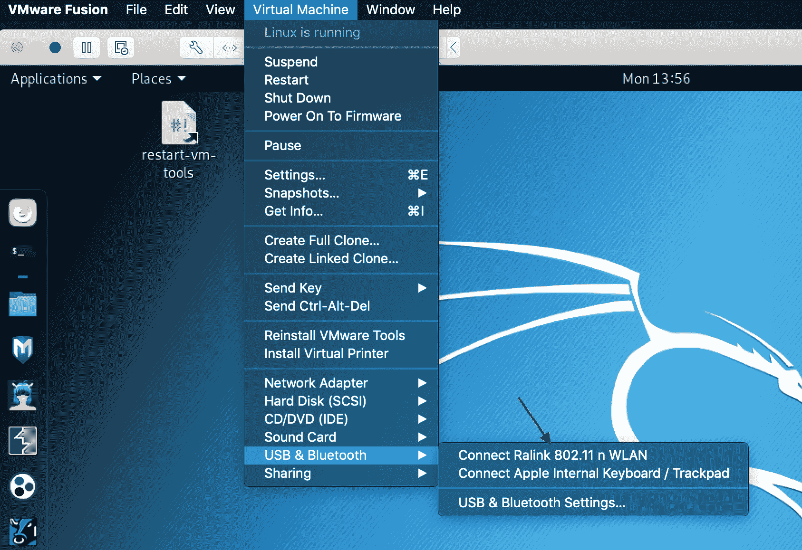
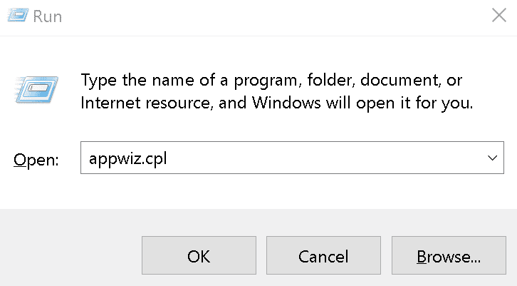
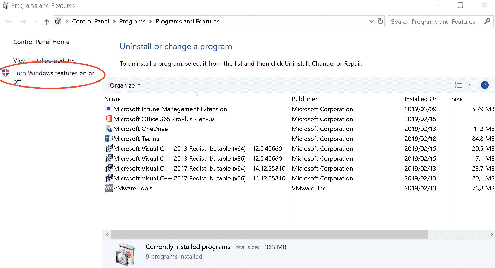
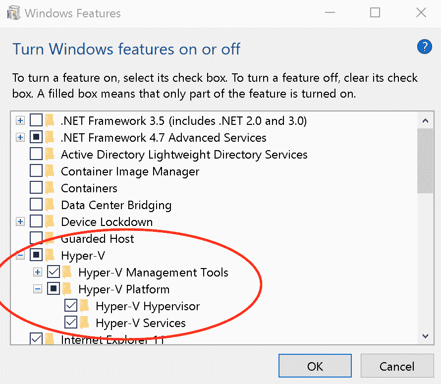

# 第一章：渗透测试简介

在本章中，我们将通过建立坚实的基础来开始我们的旅程。对渗透测试基础知识的深入了解将有助于您进行成功的渗透测试，而不是盲目扫描网络和进行测试。我们将定义渗透测试以及它与其他安全评估的区别。在实际的渗透测试发生之前，需要做一些事情，以确保正确的授权和正确的范围得到定义。每个成功的渗透测试学生都需要一个实验室环境——建立一个可能令人生畏，但不要绝望。我们将看看实验室环境的哪些选项存在。

随着本章的进行，您将学到以下内容：

+   什么是渗透测试？

+   渗透测试的阶段

+   开始您的实验室

+   在 VMware、Hyper-V 和 Virtualbox 中创建虚拟机（VMs）

# 技术要求

本章需要以下技术要求：

+   Kali Linux 2019.1 版

+   任何虚拟化软件，如 VMware、Hyper-V 或 Virtualbox

# 什么是渗透测试？

今天，渗透测试经常与漏洞评估、红队评估和其他安全评估混淆。然而，它们之间存在一些区别，如下所示：

+   漏洞评估：这是识别系统中的漏洞和风险的过程。在漏洞评估中，漏洞不会被利用。它只是突出显示风险，以便业务可以识别风险并制定补救计划。

+   渗透测试：这是一种授权的过程，通过在预定的时间范围内查找和利用漏洞来对网络、应用程序或主机进行入侵。渗透测试可以由内部团队或外部第三方进行。与漏洞评估相比，渗透测试更进一步，因为渗透测试利用漏洞以确保它不是虚假阳性。渗透测试不涉及任何未经授权或协调的行为。在渗透测试期间，一些测试可能会影响业务应用程序并导致停机。因此，通常需要管理和员工层面的意识。

+   红队评估：这类似于渗透测试，但更有针对性。渗透测试的主要目的是发现多个漏洞并利用它们，而红队评估的目标是测试组织的响应能力并利用满足其目标的漏洞。在红队评估中，团队将尝试以任何可能的方式访问信息并保持尽可能安静。在红队评估中，隐秘性是关键。红队评估的持续时间比渗透测试长得多。

在开始渗透测试之旅时，了解渗透测试的含义非常重要。为了说明渗透测试是什么，让我们考虑一个场景。

您目前拥有一个持有客户数据的组织。在您的组织中，您拥有 SQL 数据库、面向公众的网站、面向互联网的服务器和大量用户。您的组织是多种攻击的主要目标，例如 SQL 注入、针对用户的社会工程和弱密码。如果您的组织受到损害，存在客户数据被泄露等风险。

为了减少您面临的风险，您需要确定当前安全状况中的漏洞。渗透测试可以帮助您以受控的方式识别这些漏洞，而不是等到攻击者这样做。渗透测试使用攻击者可能利用的真实攻击；目标是获得有关攻击者在您的网络中可以深入多深以及攻击者可以获得多少信息的准确信息。渗透测试的结果为组织提供了漏洞的开放视图，并允许他们在对手采取行动之前修补这些漏洞。

把渗透测试看作是从敌人的角度来看。

渗透测试通常被称为道德黑客、白帽黑客、渗透测试或渗透测试。

由于组织的安全成熟度不同，渗透测试的范围也会有所不同。一些组织可能已经建立了非常好的安全机制，而其他一些可能没有。由于企业有政策、业务连续性计划、风险评估和灾难恢复作为整体安全的重要组成部分，渗透测试需要被纳入其中。

# 渗透测试的阶段

现在您了解了什么是渗透测试，您可能想知道渗透测试的流程是什么。渗透测试有许多阶段，每个阶段都是整个渗透测试的重要组成部分。

有各种与渗透测试相关的标准。本书没有专门遵循其中任何一个。还有其他已知的标准，例如以下：

+   NIST SP800-115 标准 - [`csrc.nist.gov/publications/detail/sp/800-115/final`](https://csrc.nist.gov/publications/detail/sp/800-115/final)

+   **开源安全测试方法手册**（**OSSTMM**） - [`www.isecom.org/research`](http://www.isecom.org/research)

接下来的阶段遵循**渗透测试执行标准**（**PTES**），我发现这是一个很好的起点。完整的标准可以在[`www.pentest-standard.org/`](http://www.pentest-standard.org/)找到。

# 预约

这是每次渗透测试中最重要的阶段。在这个阶段，您开始为渗透测试定义蓝图，并将这个蓝图与客户的业务目标对齐。目标是确保所有参与者都在同一页面上，并且预期提前设定。

在这个阶段，作为渗透测试人员，您需要花时间了解客户的需求和目标。例如，为什么客户要进行渗透测试？客户是否受到了侵害？客户进行渗透测试纯粹是为了满足合规要求，还是客户打算对发现的问题进行修复？与客户交谈并了解他们的业务目标将帮助您规划和确定渗透测试的范围，以避免任何棘手的情况。

预约阶段包括您需要考虑的一些额外组件。

# 范围

这个组件定义了将要测试的内容。在这里，关键在于在时间、成本和业务目标之间找到平衡。重要的是要注意，在范围内达成的一切都必须清楚地记录，并且必须考虑所有的法律影响。

在这个组件中，您将提出以下问题：

+   将要测试的 IP 地址范围或系统的数量是多少？

+   渗透测试是否涵盖物理安全、无线网络、应用服务器、社会工程等？

+   渗透测试的禁区是什么？企业可能有关键任务系统，如果这些系统受到渗透测试的影响，可能会导致收入损失。

+   渗透测试是现场进行还是远程进行？

+   渗透测试的范围中是否包括第三方服务器？

+   您是否进行了白盒、灰盒或黑盒渗透测试？

列出的问题并不涵盖所有内容，问题会因客户而异。要获得更全面的问题清单，可以参考 PTES 标准[`www.pentest-standard.org/index.php/Pre-engagement`](http://www.pentest-standard.org/index.php/Pre-engagement)。

**白盒**测试可以完全开放地访问系统、代码、网络图等。它提供了对一般攻击者不可得的更全面的结果。

**灰盒**测试可以让你获取一些关于内部系统的信息；其目的是从已经侵入系统的攻击者的角度获取信息。

**黑盒**测试不提供任何关于网络的信息或访问权限。这种测试更实际，因为你模拟了一个外部攻击者。

在确定渗透测试范围时，要非常小心**范围蔓延**。**范围蔓延**是指在最初的范围内没有达成一致的任何额外工作。这会给你的渗透测试引入风险，可能导致你的收入损失，客户不满意，甚至法律责任。**范围蔓延**是一个容易陷入的陷阱。

在确定范围阶段要考虑渗透测试的成本。渗透测试的价格取决于需要测试的内容。例如，测试复杂的网络应用程序将需要更多的时间和精力，因此与简单的网络渗透测试相比，成本会更高。进行渗透测试的频率也是影响成本的另一个因素。

# 时间表

客户可以设定时间表，规定何时可以进行渗透测试。一些客户可能有在特定时间窗口内进行补丁更新的业务关键服务器，这些服务器在那段时间内可能是禁区。

确保定义了开始和结束日期。这样可以让渗透测试有一个明确的结束日期。

# 处理第三方

如今，许多企业正在利用云服务。在你的渗透范围内很可能会遇到云服务器。重要的是要记住谁拥有这台服务器。在云环境中，服务器不是由进行渗透测试的企业拥有，而是由云提供商拥有。

云领域的大公司，如微软、亚马逊和谷歌，都有渗透测试的规则文件。这些文件详细说明了你可以做什么，以及你不能做什么。

微软在这里定义了其参与规则：[`www.microsoft.com/en-us/msrc/pentest-rules-of-engagement`](https://www.microsoft.com/en-us/msrc/pentest-rules-of-engagement)。亚马逊在这里定义了其参与规则：[`aws.amazon.com/security/penetration-testing/`](https://aws.amazon.com/security/penetration-testing/)。谷歌在这里定义了其参与规则：[`cloud.google.com/security/overview/`](https://cloud.google.com/security/overview/)。

确保从云服务提供商那里获得正确的批准，如果你的渗透范围内涉及云服务；否则可能会导致法律后果。

# 支付

支付条款的讨论至关重要，因为大型组织常常会延迟付款。你需要事先定义支付条款。应明确规定付款应该何时进行。

不要忘记定义成本；例如，您将以每个 IP 地址 500 美元的成本对 10 个 IP 地址进行渗透测试。

# 你的“免于入狱的牌”

在进行渗透测试时，您将发现大量对现实世界攻击者有价值的信息，您还将进行一些非法活动。唯一将渗透测试人员与恶意黑客区分开来的是权限。

获得相关许可构成了您的“免于入狱的牌”。业务提供的许可详细说明了任何限制，并授权您执行在范围协议中定义的活动。

这是业务正式批准开始渗透测试。

# 情报收集

完成了前期阶段后，您需要在开始攻击之前收集尽可能多的信息。在情报收集阶段，也称为信息收集，您开始查看有关目标的信息。您将从公开可访问的资源中收集信息。这被称为**开源情报**（**OSINT**）。您将开始利用可以帮助您的工具，如 Maltego 和 Shodan。

情报收集的重要性在于您能够发现进入目标组织的入口点。企业和员工并未考虑他们在互联网上可以暴露多少数据，因此这些数据对于决心攻击者来说成为了丰富的信息。

在第三章中，*进行信息收集*，我们将更详细地介绍信息收集。

# 威胁建模

一旦您在情报收集阶段收集了信息，您就开始进行威胁建模。在威胁建模中，您开始创建威胁的结构以及它们与目标环境的关系。例如，您将识别持有有价值信息的系统，然后您将确定与系统相关的威胁以及系统中存在的漏洞，这些漏洞可以允许攻击者对威胁采取行动。

威胁建模有一些方法，例如以下：

+   **欺骗、篡改、否认、信息披露、拒绝服务、权限提升**（**STRIDE**）

+   **攻击模拟和威胁分析过程**（**PASTA**）

+   **视觉敏捷和简单威胁建模**（**VAST**）

有一些工具可以用于威胁建模；最常见的是以下两种：

+   **Microsoft 威胁建模工具**：[`aka.ms/tmt`](https://aka.ms/tmt)

+   **OWASP 威胁龙**：[`www.owasp.org/index.php/OWASP_Threat_Dragon`](https://www.owasp.org/index.php/OWASP_Threat_Dragon)

# 漏洞分析

一旦您定义了可能导致威胁的威胁，就是时候发现这些威胁存在哪些漏洞。在漏洞分析阶段，您开始发现系统中的漏洞以及如何利用这些漏洞。

在这里，您将进行主动或被动分析。请记住，任何失败的利用都可能导致被发现。

主动漏洞分析可以包括以下内容：

+   网络扫描仪

+   Web 应用程序扫描仪

+   自动化扫描仪

被动漏洞分析可以包括以下内容：

+   监控流量

+   元数据

今天存在许多漏洞扫描器。例如，更常用的是 Nessus，但还有许多其他的，如 OpenVAS、Nikto 和 QualysGuard。

# 利用

在利用阶段，您开始专注于获取对系统的访问权限，并规避任何现有的安全阻碍。通过在利用阶段进行漏洞分析，您可以制定一个精确的计划来执行。

在这个阶段，您将开始使用许多工具。有些漏洞利用可以很容易地完成，而其他一些可能会很复杂。

# 后期利用

后渗透覆盖了一旦目标成功被利用就可以执行的活动。

后渗透阶段真正展示了您作为渗透测试人员的技能。当恶意黑客侵入系统时，他们开始在环境中寻找高价值目标。他们还开始创建后门，以便他们可以轻易地重新访问受损的系统。

作为渗透测试人员，您将执行任务，就好像您是攻击者一样。一旦您侵入了系统，就是寻找高价值目标和有价值的信息的时候，尝试访问提升的特权，横向移动，并查看您如何进行枢轴。

# 报告

在渗透测试的最后阶段，需要以有意义的方式向企业提供发现。在这里，您需要定义从您如何进入他们的环境到您发现了什么的一切。重要的是要向企业提供如何修复您在渗透测试中暴露的漏洞的建议。

您的报告应该有执行摘要和技术报告。每个部分都需要针对您呈现的受众进行定制。例如，在执行摘要中，您不会说您在使用**MS17-010 EternalBlue**漏洞来攻击系统，但您会在技术报告中这样说。

# 执行摘要

执行摘要将定义渗透测试的目标，并以非常高的层次概述发现。由于执行摘要的受众通常是业务决策者，您需要以他们的层次进行沟通。为了做到这一点，执行摘要可能包含以下部分：

+   **背景**：在背景部分，您需要解释渗透测试的目的。

+   **整体姿态**：在这里，您将定义渗透测试在预约期阶段定义的目标方面的有效性。

+   **风险排名**：这定义了企业所处的整体风险评级。例如，企业可能处于**极端**、**高**、**中等**或**低风险**。您必须解释这个评级，以便企业清楚地了解他们为什么属于这种风险等级。

+   **一般发现**：这部分提供了在渗透测试期间发现的问题的简要总结。通常在这里可以找到突出安全风险类别的图表，例如缺失的补丁和操作系统加固。

+   **建议摘要**：这概述了应该执行哪些任务来纠正发现。在这里不要详细说明，因为详细内容在技术报告中有所涉及。

+   **战略路线图**：这为企业提供了一个可操作的路线图来纠正发现。这个路线图必须是有优先级的，并且与潜在影响的业务级别保持一致。路线图可以分解成部分，例如**1 到 3 个月**、**3 到 6 个月**和**6 到 12 个月**的计划。在每个部分中，应该定义行动；例如，在**1 到 3 个月**的计划中，企业应该解决低影响的缺失补丁。

# 技术报告

技术报告将包括比执行摘要更多的细节。在技术报告中，您将全面定义范围、信息、攻击方法和纠正步骤。在这份报告中，您可以使用易于理解的技术术语，例如远程 shell、传递哈希和 NTLM 哈希。

技术报告将包括以下部分：

+   **介绍**：这部分将包括渗透测试的范围、联系人、涉及的系统和方法等主题。

+   **信息收集**：在这里，您将解释您能够收集到目标的多少信息。在本节中，您可以深入挖掘，以突出通过**被动情报**（公开可用的信息、DNS 记录、IP 地址信息等）、**主动情报**（端口扫描、足迹、等）和**人员情报**（从社会工程、钓鱼等获得的信息）等方式获得了哪些信息。

+   **漏洞评估**：在本节中，您将定义发现的漏洞类型、如何发现它们，并提供漏洞的证据。

+   **利用/漏洞验证**：本节提供了您对发现的漏洞采取行动的详细步骤。应包括攻击的时间表、目标、成功/失败比率和获得的访问级别等详细信息。

+   **后期利用**：此处包括的详细信息将是升级路径、数据提取、信息价值、反制措施的有效性（如果有的话）、持久性和枢纽点等活动。

+   **风险/暴露**：前面各节的结果被结合并与风险和暴露评级联系起来。本节将包含每次事件的预估损失、执行某种攻击所需的技能、反制措施的强度和风险评级（关键、高、中、低）等信息。

+   **结论**：结论应该始终以积极的方式结束。在这里，您将强调通过对渗透测试的最终概述来增加业务安全姿态的任何指导。

现在我们已经建立了关于渗透测试是什么、其阶段以及它与漏洞评估和红队评估的区别的基础，是时候深入实验室环境了。

# 开始使用您的实验室

当您阅读本书时，您将学习如何在受控环境中使用不同的工具。为了拥有受控环境，我们需要构建一个。

我们有三种选项来构建渗透实验室。它们如下：

+   **使用云服务提供商**：微软 Azure、亚马逊 Web 服务和谷歌云等云服务提供商为您提供了在部署系统方面灵活性和可伸缩性，成本仅为购买专用硬件的一小部分。使用云服务提供商的唯一问题是，您可能需要获得在部署服务上执行渗透测试的许可。

+   **使用高性能笔记本电脑或桌面计算机与虚拟化软件**：由于高性能笔记本电脑和桌面计算机相对便宜，这可能是许多人喜欢的选择。通过使用 Microsoft Hyper-V、VMware 和 Virtualbox 等虚拟化软件，您可以在主机计算机上部署一个完全隔离的网络。

在使用虚拟化软件进行渗透测试时，Hyper-V 存在一个限制。目前，Hyper-V 不允许您直接将 USB 无线网卡连接到虚拟机，而 VMware 和 Virtualbox 则允许。这在尝试利用无线渗透测试的监视模式时会引入问题。VMware 和 Virtualbox 允许您直接将 USB 无线网卡连接到虚拟机。下面的截图描述了将无线网卡直接连接到虚拟机（*图 1*）：



图 1：将无线网卡连接到虚拟机。

+   **使用专用硬件**：这是更昂贵的选择。在这里，您将需要一整套网络设备，包括专用服务器和工作站。

让我们首先看看如何使用虚拟化工具（如 VMware、Hyper-V 和 VirtualBox）构建实验室环境。

# 在 VMware、Hyper-V 和 VirtualBox 中创建虚拟机

利用虚拟化管理程序可以以最小的硬件成本构建实验室环境。如今，任何一台体面的笔记本电脑或台式机都能运行虚拟化管理软件。在选择虚拟化管理程序时，确保适当地配置虚拟网络。例如，如果需要使虚拟机相互隔离，可以使用“仅主机模式”。如果需要让虚拟机访问互联网，可以使用“网络地址转换”或“桥接网络”。网络地址转换和桥接网络的区别在于，使用桥接网络时，虚拟机将获得自己的 IP 地址，而使用网络地址转换时，虚拟机将利用主机的 IP 地址进行外部通信。

请注意，不同虚拟化管理程序之间的选项可能不同，但概念是相同的。

# Microsoft Hyper-V

Hyper-V 是微软的一款虚拟化产品，可以用来创建虚拟机。Microsoft Hyper-V 可以在 Windows 10 上使用。它可以在 Windows 10 企业版、教育版和专业版上启用。

Hyper-V 可以通过多种方式进行安装。

使用 Powershell，可以使用以下代码安装 Hyper-V 角色：

```
Enable-WindowsOptionalFeature -Online -FeatureName Microsoft-Hyper-V -All
```

此外，还可以使用以下 DISM 和 CMD（以管理员身份运行）代码：

```
DISM /Online /Enable-Feature /All /FeatureName:Microsoft-Hyper-V
```

Hyper-V 也可以通过 Windows 的程序和功能进行安装。在 Windows 10 中，可以按照以下步骤进行操作：

1.  按下 Windows 键 + *R* 打开运行对话框。输入 `appwiz.cpl` 打开程序和功能，如 *图 2* 所示：



图 2：打开程序和功能。

1.  点击如 *图 3* 所示的“打开或关闭 Windows 功能”：



图 3：打开或关闭 Windows 功能。

1.  选择如 *图 4* 所示的 Hyper-V 角色：



图 4：选择 Hyper-V 角色。

1.  点击确定。

计算机需要重新启动以安装 Hyper-V 角色。

Hyper-V 目前无法直接连接 USB 设备到虚拟机。这会给用于无线渗透测试的无线网卡带来问题，因为无法切换到监视模式。

有关 Microsoft Hyper-V 的更多信息，请访问 [`docs.microsoft.com/en-us/virtualization/hyper-v-on-windows/about/`](https://docs.microsoft.com/en-us/virtualization/hyper-v-on-windows/about/)。

# VMware

VMware 是一款提供免费和付费版本的虚拟化软件。VMware 支持 Microsoft Windows、Linux 和 Mac OS。

VMware Workstation Player ([`www.vmware.com/products/workstation-player.html`](https://www.vmware.com/products/workstation-player.html)) 可以免费在 Microsoft Windows 和 Linux 操作系统上使用。还有一个付费版本叫做 VMware Workstation Pro ([`www.vmware.com/products/workstation-pro.html`](https://www.vmware.com/products/workstation-pro.html))，相比免费版本提供了一些额外的功能。VMware Fusion ([`www.vmware.com/products/fusion.html`](https://www.vmware.com/products/fusion.html)) 也是一个付费版本，适用于 macOS。

# VirtualBox

Virtualbox 是一款开源的免费虚拟化管理程序。它支持 Microsoft Windows、Linux 和 macOS。Virtualbox 还有一些可用的扩展，包括对 USB3、PXE 引导、磁盘加密等的支持。

Virtualbox 可以在 [`www.virtualbox.org/wiki/Downloads`](https://www.virtualbox.org/wiki/Downloads) 下载。

# 目标机器

在我们阅读本书的过程中，我们将对目标机器执行一些渗透测试。

当我们谈论目标机器时，这些是将用于测试本书中各种工具和概念的虚拟机。

对于 Microsoft Windows，我们将利用评估中心下载 Windows 10 企业版和 Server 2012 R2。

可以在[`www.microsoft.com/en-us/evalcenter/`](https://www.microsoft.com/en-us/evalcenter/)访问 Microsoft 评估中心。

Windows Server 2012R2 的直接链接是[`www.microsoft.com/en-us/evalcenter/evaluate-windows-server-2012-r2`](https://www.microsoft.com/en-us/evalcenter/evaluate-windows-server-2012-r2)，而 Windows 10 企业版的直接链接是[`www.microsoft.com/en-us/evalcenter/evaluate-windows-10-enterprise`](https://www.microsoft.com/en-us/evalcenter/evaluate-windows-10-enterprise)。

对于两个操作系统，您将使用`.iso`文件，并使用您选择的 hypervisor 进行安装。

# Metasploitable

Metasploitable 是一个有意设置的易受攻击的机器，您可以使用它来测试 Metasploit 漏洞以获取 shell 权限。Metasploitable 与其他易受攻击的机器不同，因为它更专注于操作系统和网络层。

到目前为止，Metasploitable 目前有三个版本，它们分别被称为 Metasploitable、Metasploitable 2 和 Metasploitable 3。

每个版本都有重大变化，超出了您如何设置它们的范围。

Metasploitable（版本 1）是基于 VM 的定制 Ubuntu 镜像。在这个镜像中，安装了许多易受攻击和配置不良的软件。例如，您可能会有使用 Metasploit 轻松可利用的弱凭据的 Tomcat。

Metasploitable（版本 1）可在 Vulnhub 上下载，链接为[`www.vulnhub.com/entry/metasploitable-1,28/`](https://www.vulnhub.com/entry/metasploitable-1,28/)。

Metasploitable 2 更加强大，引入了更多的漏洞。它包括超过 30 个暴露的端口，会在 Nmap 扫描中显示出来。它还包括易受攻击的 Web 应用程序，如**Damn Vulnerable Web App**（**DMVA**）和**Mutillidae**。这使人们能够测试他们的 Web 应用程序渗透测试技能。

Metasploitable（版本 2）可在[`information.rapid7.com/download-metasploitable-2017.html`](https://sourceforge.net/projects/metasploitable/)下载。

Metasploitable 3 提升了游戏水平。版本 1 和 2 是基于 Linux 的，但版本 3 是基于 Windows 的。Metasploitable 3 利用了自动化和配置。构建过程简单而强大，所有脚本都是开源的，并且利用了**vagrant**和**packer**等工具。在撰写本书时，Metasploitable 3 支持 VMware 和 Virtualbox。

Metasploitable 3 可从[`github.com/rapid7/metasploitable3`](https://github.com/rapid7/metasploitable3)下载。

在启动 Metasploitable 之前，需要安装其他软件。以下是必需的：

+   Packer（可在[`www.packer.io/intro/getting-started/install.html`](https://www.packer.io/intro/getting-started/install.html)下载）

+   Vagrant（可在[`www.vagrantup.com/docs/installation/`](https://www.vagrantup.com/docs/installation)下载）

+   Vagrant reload 插件（可在[`github.com/aidanns/vagrant-reload#installation`](https://github.com/aidanns/vagrant-reload#installation)下载）

+   Virtualbox 或 VMware

+   Metasploitable 3（可在[`github.com/rapid7/metasploitable3`](https://github.com/rapid7/metasploitable3)下载）

Metasploitable 3 的构建步骤相对简单，并且可以在 Rapid7 维护的 GitHub 存储库上找到（[`github.com/rapid7/metasploitable3`](https://github.com/rapid7/metasploitable3)）。互联网上有一些资源可供下载预构建的 Metasploitable 3 VMs。

在第五章中，*深入了解 Metasploit 框架*，我们将执行在这里讨论的 Metasploitable 实验室中的各种任务。

# 摘要

在本章中，我们开始建立坚实的基础，您了解了渗透测试与漏洞和红队评估的区别。我们定义了利用渗透测试方法或标准的重要性，例如 PTES 标准及其中的各个阶段。在每个阶段中，我们讨论了涉及的内容，并强调了一些不容忽视的重要方面，比如“免于入狱的卡”。最后，我们看了一个实验室环境，目前存在的各种虚拟化程序，以及如何构建一个用于将来使用的 Metasploitable 实验室环境。

在下一章（第二章《开始使用 Kali Linux》）中，我们将深入探讨 Kali Linux，探索 Kali Linux 的不同安装选项以及一些必需的初始配置。我们将探讨 Kali Linux 中一些基本工具及其主要用途。

# 问题

1.  渗透测试的目的是什么？

1.  至少列举两种渗透测试标准。

1.  为什么对渗透测试进行范围界定很重要？

1.  至少列举两种威胁建模方法。

1.  Metasploitable 与其他易受攻击的机器有何不同？
