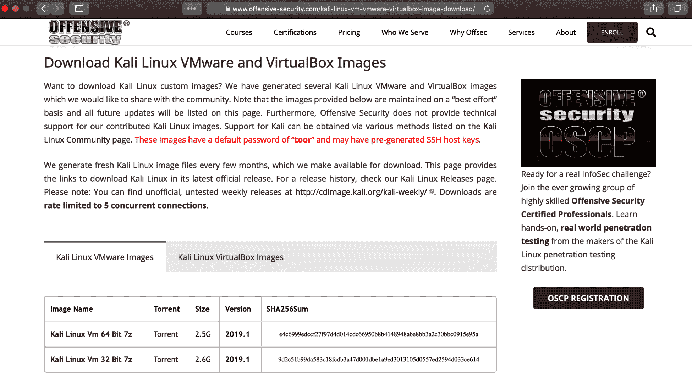
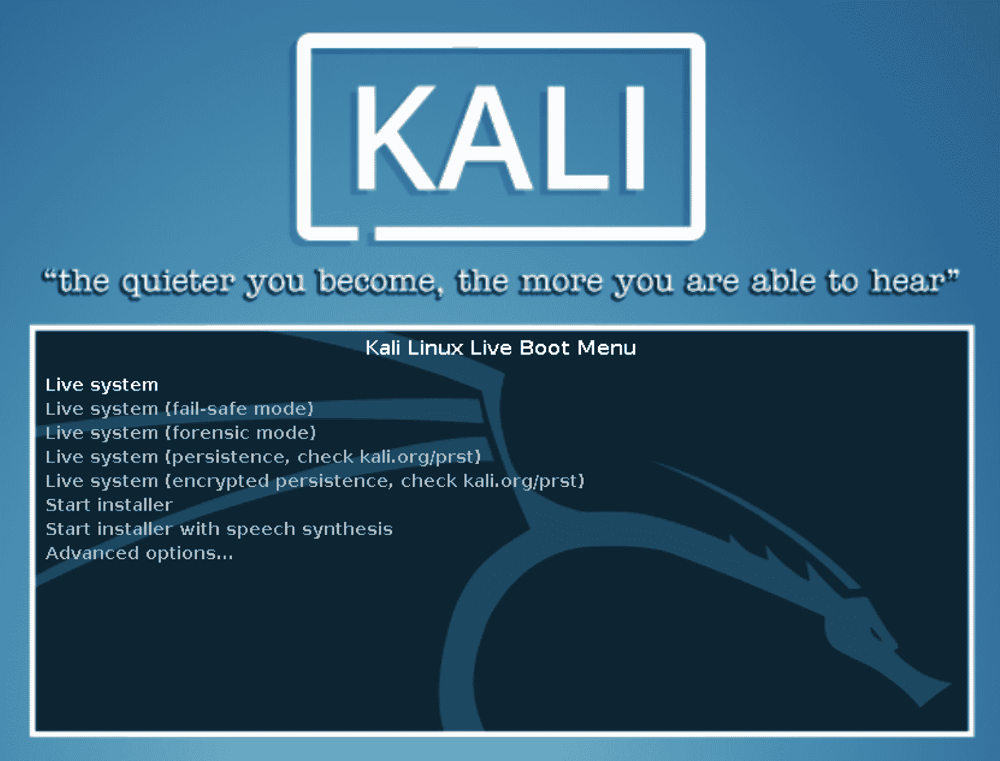
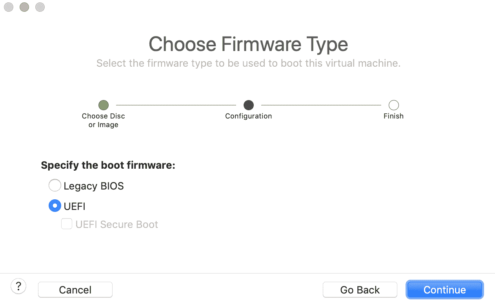
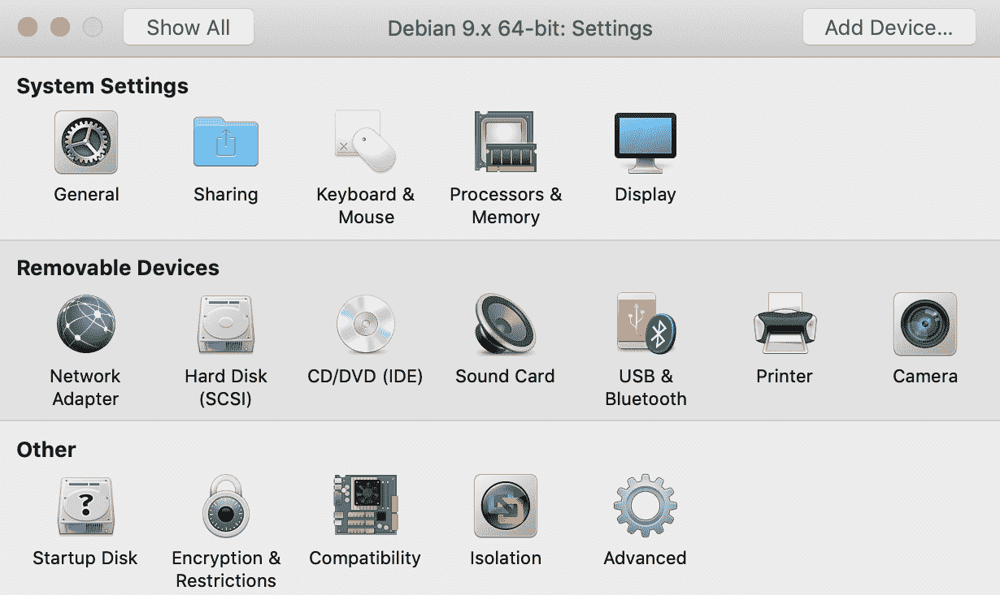
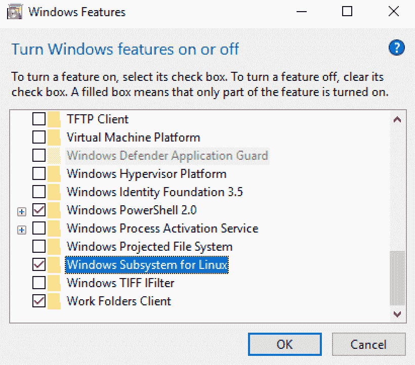
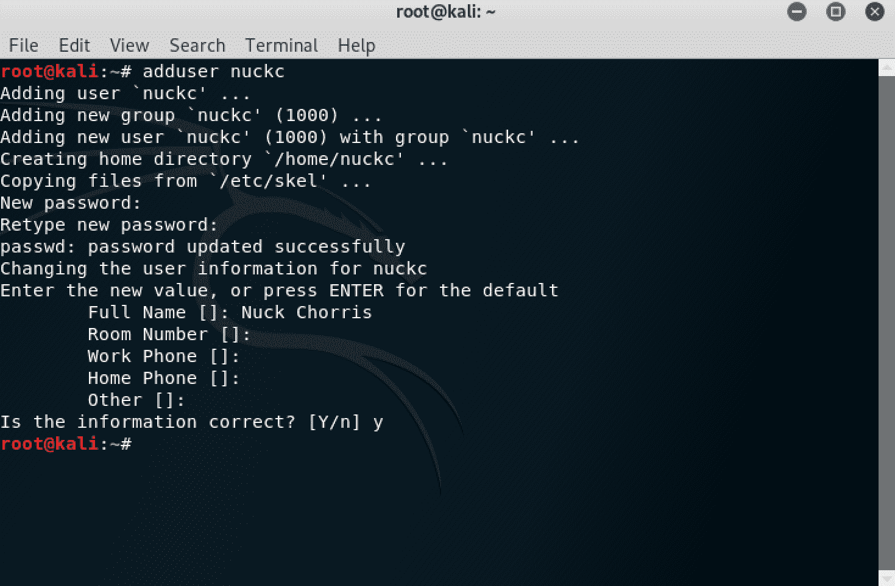
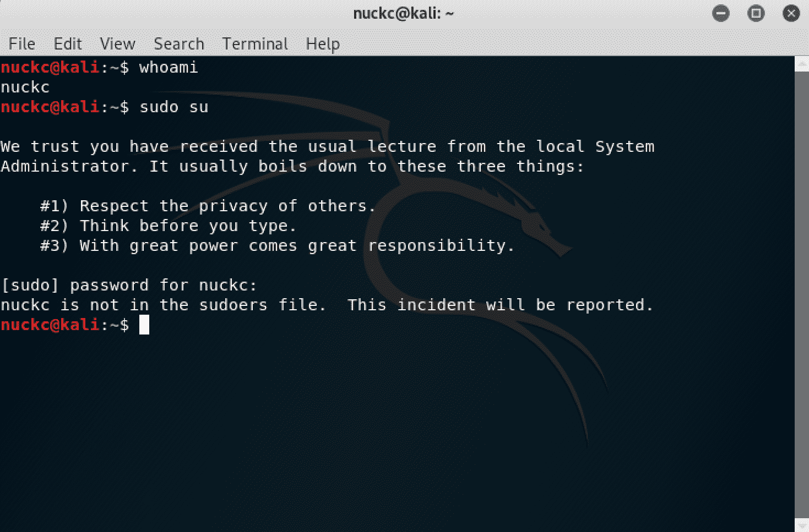
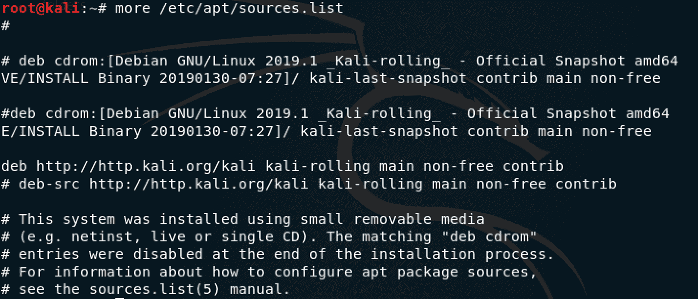

# 开始使用 Kali Linux

在本章中，我们将深入研究 Kali Linux 作为我们的首选渗透测试平台。Kali Linux 有各种安装选项，因此我们将探讨存在哪些选项并了解如何使用它们。在演示安装过程后，需要在 Kali Linux 上完成一些初始任务，因此我们将通过初始设置来确保我们准备好开始使用 Kali Linux。脚本编写应该已经成为您的工具库的一部分，因此我们将深入研究基本脚本编写，然后开始探索 Kali Linux 上可用的一些常用工具。

在本章中，您将学习以下主题：

+   Kali Linux 简介

+   安装和配置 Kali Linux

+   Kali Linux 中的基本命令

+   在 Kali Linux 中编写脚本

+   Kali Linux 的基本工具

# 技术要求

本章的技术要求如下：

+   任何虚拟化程序，如 VMware、Hyper-V 或 VirtualBox

+   Windows 10 专业版或企业版

+   Kali Linux 2019.1

# Kali Linux 简介

在本书中，Kali Linux 将是我们的首选平台。Kali Linux 是一个免费的渗透测试分发平台，提供了广泛的工具，如用于网络渗透测试的 Metasploit，用于端口和漏洞扫描的 Nmap，用于无线网络测试的 Aircrack-Ng，用于社会工程攻击的**社会工程工具包**（SET）等等。

Kali Linux 是一个维护的分发；这意味着它会不断更新和维护。在撰写本文时，Kali Linux 的当前版本是 2019.1。

2019.1 版本引入了对 Metasploit 的大规模更新（Metasploit 将在第五章中介绍，*深入 Metasploit 框架*），包括错误修复、内核更新等。

本书使用的是 Kali Linux 2019.1 版本；请注意，如果在不同版本的 Kali Linux 上执行这些练习，可能会有所不同。

Kali Linux 可以在[`www.kali.org/downloads`](https://www.kali.org/downloads)下载，有多种选项可供下载。您可以选择下载最新版本 Kali Linux 的 32 位或 64 位`.iso`，如*图 1*所示：


图 1：Kali Linux 的下载选项

还有为 VMware 和 VirtualBox 预构建的虚拟机，可以从 Offensive Security 下载；这些可以在[`www.offensive-security.com/kali-linux-vm-vmware-virtualbox-image-download/`](https://www.offensive-security.com/kali-linux-vm-vmware-virtualbox-image-download/)找到，如*图 2*所示：



图 2：Kali Linux 的预构建虚拟机

Kali 可以作为已安装的操作系统或作为实时版本运行，如*图 3*所示。对于实时版本，您需要在 USB 驱动器上设置持久存储，即如果您希望保留在实时模式下使用 Kali 时收集的任何数据：



图 3：Kali Linux 的不同启动选项

正如您所知，有多种方法可以运行 Kali Linux。例如，您可以使用 Kali Linux 的 USB 磁盘进行便携式运行。这意味着您可以将其插入任何 PC 以运行 Kali。此外，一些用户可能更喜欢使用预构建的虚拟机，这样可以省去从头安装操作系统的麻烦。或者，其他用户可能更喜欢在安装过程中自定义 Kali Linux，并希望直接使用`.iso`文件安装 Kali Linux。

# 安装和配置 Kali Linux

现在您已经下载了 Kali Linux，我们需要安装并准备好。您会注意到有几种安装 Kali Linux 的选项；我将使用一个预构建的虚拟机，当前版本为 2019.1。

# 安装

如果您使用 Kali Linux 预构建的虚拟机，您只需在 VMware 或 VirtualBox 中打开它。VMware 预构建的虚拟机需要被提取，但您可以使用 7zip 来提取虚拟机。

利用预构建的虚拟机可以节省您手动安装 Kali Linux 的时间。请注意，如果在打开预构建的虚拟机时提示，那么您可以简单地选择“我复制了它”。

7Zip 可以从[`www.7-zip.org/download.html`](https://www.7-zip.org/download.html)下载。

# 在 macOS 上安装 Kali Linux

如果您想要在 macOS 上使用 VMware Fusion 从头开始安装 Kali Linux，您可以执行以下步骤：

1.  在 VMware Fusion 中，按下*Ctrl *+ *N*或*Command* + *N*（macOS），这将打开新的虚拟机对话框，如图 4 所示：


图 4：在 VMware Fusion 中安装 VM 的不同选项

1.  将 Kali Linux 的`.iso`文件拖入窗口，然后单击“继续”。接下来，选择 Linux 作为操作系统，然后选择 Debian 9.x 64 位，然后单击“继续”，如图 5 所示：


图 5：客户操作系统的选项

1.  选择 UEFI 作为引导固件，然后单击“继续”，如图 6 所示：



图 6：VM 操作系统的固件类型选项

1.  单击“自定义”以对分配给虚拟机的 RAM 和 CPU 进行一些更改。您可以根据需要进行调整；在我的配置中，我将使用两个 CPU 和 2GB 的 RAM，如图 7 所示：



图 7：虚拟机的设置

1.  启动虚拟机后，选择启动安装程序，并按照提示进行操作，直到安装完成，如图 8 所示：


图 8：Kali Linux 的不同引导选项

完成安装步骤后，您将看到 Kali Linux 已经新安装，如前面的截图所示（图 8）。您现在可以继续进行配置阶段。

# 使用 Windows 子系统用于 Linux（WSL）安装 Kali Linux

Kali Linux 能够在 Windows 中使用 WSL 和**Windows 商店应用**本地运行。为了使 Kali 能够运行并安装必要的工具，需要执行以下安装步骤：

1.  首先，安装 WSL；为此，请按下 Windows 键+*r*，输入`appwiz.cpl`，然后单击“确定”。

1.  选择 Windows 子系统用于 Linux 复选框，如图 9 所示。请注意，一旦安装完成，您的计算机将需要重新启动：



图 9：选择 Windows 子系统用于 Linux

1.  在 Windows 商店中搜索“Kali Linux Windows 商店应用”，然后安装该应用。一旦打开应用程序，它将执行一些初始步骤，例如创建一个新的 root 用户帐户。完成后，您可以继续使用`sudo apt-get update`命令更新 Kali Linux，如图 10 所示：


图 10：在 WSL 中更新 Kali Linux

1.  为了查看可用软件包的完整列表，请使用`sudo apt-cache search kali-linux`命令。您会注意到软件包被分成特定的渗透测试领域，如图 11 所示：


图 11：WSL 中 Kali Linux 软件包的列表

请注意，软件包的大小会有所不同；例如，在撰写本文时，`kali-linux-top10`软件包的大小为 2.9 GB。您需要确保 Windows 10 上的防病毒软件对 Kali Linux 软件包有排除。软件包的路径是

`C:\Users\[username]\AppData\Local\Packages\`。另外，请注意，`[username]`表示您登录的用户。

在 Windows 中使用 Kali Linux 工具的另一种方法是通过**Ubuntu Windows Store App**和**Katoolin**等工具。

要这样做，请重复之前提到的 1 到 2 步骤；但是，不要从 Windows Store 安装 Kali Linux 应用程序，而是安装 Ubuntu 应用程序。

应用程序安装完成后，您可以继续以下步骤：

1.  打开**Ubuntu Windows Store App**并使用以下命令更新和升级应用程序：

```
sudo apt-get update

sudo apt-get upgrade
```

1.  更新 Ubuntu 后，您需要安装 Python 2.7 版本；可以使用以下命令完成：

```
sudo apt-get install python
```

1.  您还可以使用`katoolin`等工具，可以使用以下命令进行克隆：

```
git clone https://github.com/lionsec/katoolin.git && cp katoolin/katoolin.py /usr/bin/katoolin

chmod +x /usr/bin/katoolin
```

1.  您可以使用`sudo katoolin`命令运行**Katoolin**工具，它将呈现一个菜单，您可以使用该菜单添加 Kali 存储库并安装在类别中列出的各种工具，如*图 12*所示：


图 12：在 WSL 中安装的 Ubuntu 中的 Katoolin

本书将使用安装在虚拟机或物理主机上的 Kali Linux。本书的范围不涵盖在 WSL 中使用 Kali Linux。

# 使用 VirtualBox 完成 Kali Linux 的安装

VirtualBox 是一个跨平台的虚拟机监视器；在 Windows 和 macOS 中导入预构建的 Kali Linux 虚拟机是相同的过程。

下载预构建的虚拟机后，它将以`.ova`格式存在。可以使用以下步骤将其导入 VirtualBox：

1.  打开 VirtualBox，如果您使用的是 macOS 版本，请点击导入；或者，如果您使用的是 Windows 版本，请点击文件*|*导入。

1.  导航到您下载预构建虚拟机的位置，并选择`.ova`文件。然后，点击下一步按钮。

1.  现在，您将看到虚拟机的设置和存储位置。您可以自定义或保留其默认设置。

1.  最后，点击导入。

导入完成后，您可以启动 Kali Linux 虚拟机。您可能会收到与 USB 硬件相关的错误，但 VirtualBox 会提到您可以安装什么来解决这个问题。

# 配置 Kali Linux

在您启动并运行 Kali Linux 之后，您需要执行一些额外的步骤。

如果您手动安装了 Kali Linux，则将提示您为 root 帐户提供用户名和密码。或者，如果您使用预构建的虚拟机，则默认用户名是`root`，密码是`toor`。为了更改密码，您可以使用`passwd`实用程序，如*图 13*所示：


图 13：更改 Kali Linux 中的 root 密码

Kali Linux 中的大多数工具需要 root 级别的权限才能运行。然而，始终使用 root 级别帐户存在风险；例如，考虑您正在浏览互联网以寻找漏洞，偶然着陆在一个恶意网站上。这个恶意网站可能包含一个将远程 shell 放置到 Kali Linux 上的 Dropper。由于使用的帐户是 root 级别帐户，攻击者将在您的系统上拥有具有 root 权限的远程 shell。

为了提供额外的安全层，您需要创建一个没有 root 级别权限的普通帐户。可以通过执行以下步骤来完成：

1.  使用`adduser [username]`命令。

1.  按照提示完成用户详细信息，如*图 14*所示：



图 14：添加非 root 用户

如果您没有将用户添加到正确的组中，那么新创建的用户将无法提升到根级别权限，如*图 15*所示：



图 15：用户不在 sudo 组中

1.  为了将用户添加到正确的组中，您需要输入以下命令：

```
usermod -a -G sudo [username]
```

这里，`-a`表示追加，`-G`指定组。

1.  一旦您将用户添加到`sudo`组中，您需要允许用户利用`bash` shell。这可以通过以下命令完成：

```
chsh -s /bin/bash [username]
```

`chsh`命令用于更改登录 shell，而`-s`开关用于指定 shell。

一旦用户被添加到`sudo`组并更改了登录 shell，用户就可以被提升到根级别权限，如下面的屏幕截图所示（*图 16*）：


图 16：用户现在被提升到根级别权限

接下来，我们需要确保能够更新 Kali Linux。我们需要检查的第一件事是`sources.list`文件；这个文件可以在`/etc/apt/sources.list`找到。

有一些存储库可以使用；Kali Linux 网站上定义的标准存储库如下：

```
deb http://http.kali.org/kali kali-rolling main non-free contrib
```

Kali Linux 在他们的网站上列出了他们的官方存储库，可以在这里找到：

[`docs.kali.org/general-use/kali-linux-sources-list-repositories`](https://docs.kali.org/general-use/kali-linux-sources-list-repositories)。

您可以通过运行`more /etc/apt/source.list`或`cat /etc/apt/sources.list`命令来确认您的存储库没有被注释掉，如下面的屏幕截图所示（*图 17*）：



图 17：列出 Kali Linux 中的 sources.list 文件

如果您需要编辑`sources.list`文件，那么您可以使用 Leafpad、Nano 或您喜欢的文本编辑器来进行编辑。

此外，您需要在 Kali Linux 上执行更新，以确保您拥有最新版本的工具和系统文件。

执行更新的命令是`apt update`，执行升级的命令是`apt upgrade`**<q>。</q>**这些命令可以一起使用以节省时间；组合命令是`apt update && apt upgrade`。此外，您还可以使用`apt update && apt full-upgrade`来包括分发升级，如下面的屏幕截图所示（*图 18*）：


图 18：更新和升级 Kali Linux

默认情况下，Kali Linux 启动时不会自动启动某些服务。Kali Linux 包含诸如`ssh`、`http`等服务。如果这些服务设置为自动启动，它们将暴露端口，这将导致 Kali Linux 暴露和脆弱。

如果您想要启用特定服务，您需要使用`systemctl` `start [service name]`。例如，如果您想要启用`ssh`服务器，您可以使用`systemctl`命令启动`ssh`。另一方面，如果您希望它在启动时自动启动，您可以使用`systemctl`命令启用`ssh`。

下面的屏幕截图（*图 19*）显示`ssh`服务默认情况下未启动，并演示了如何启用它：


图 19：启用 ssh 服务

现在我们已经安装并更新了 Kali Linux，让我们继续学习一些基本命令。

# Kali Linux 中的基本命令

Kali Linux 中有一些非常有用的基本命令。其中一些有用的基本命令包括`locate`、`chmod`、`find`、`ls`、`cd`和`pwd`：

+   `locate`：我经常使用这个命令；它可以用来轻松定位特定文件。在使用`locate`命令之前，您需要使用`updatedb`执行数据库更新，如下面的屏幕截图所示（*图 20*）：


图 20：使用 locate 命令

+   `chmod`：如果您需要控制文件的权限，这个命令很有用。有些工具在下载时需要您修改权限，以便能够执行它们。例如，`chmod 600`设置文件，只有所有者可以读取和写入，如*图 21*所示：


图 21：使用 chmod 命令

+   `find`：这个命令是比`locate`命令更强烈的搜索工具；在这里，`find`搜索任何给定的路径，如*图 22*所示：


图 22：使用 find 命令

+   `ls`：这个命令用于列出当前目录的内容。使用`-a`开关将显示隐藏的文件和文件夹。

+   `cd`：这个命令用于更改当前工作目录。它也被称为`chdir`命令。

+   `pwd`：该命令打印工作目录，简单地显示您当前工作的目录名称。

所有这些列出的命令都是让您熟悉 Kali Linux 核心功能的良好起点。如果您正在寻找完整的命令 A-Z 列表，可以很容易地使用您喜欢的搜索引擎找到。

# Kali Linux 中的脚本编写

Kali Linux 相对冗长——您可以利用 bash 脚本创建复杂的脚本，然后用于渗透测试。

执行`Nmap`扫描的示例脚本如下：

```
read -p "Target IP/Range: " $targetIP
echo "$targetIP"
Nmap -sS -O -v "$targetIP"
```

在这个脚本中，我们告诉系统打印出`read -p "目标 IP/范围：`文本，我们将其绑定到`$targetIP`变量。在下一行，我们使用`echo`命令显示 IP 范围，作为参数传递。在最后一行，我们执行一个简单的`Nmap`扫描，使用`-sS`开关，执行 TCP SYN 端口扫描；`-O`执行远程操作系统检测；和`-v`，增加了详细级别，如*图 23*所示：


图 23：一个示例 Nmap 脚本

在本书的过程中，我们将探讨其他脚本（例如，在第三章中，*执行信息收集*，使用脚本搜索 Shodan 等）。随着您在渗透测试旅程中的进展，您可能会开发出自己有用的脚本列表。

# Kali Linux 的基本工具

Kali Linux 包含数百个用于渗透测试、取证等的工具。浏览内置工具以及互联网上可用的其他工具可能是一项具有挑战性和压倒性的任务。

在本节中，我们将讨论您可能经常使用的基本工具。随着您在本书中的进展，您将了解到其他内置或需要下载的工具。以下列表只是冰山一角，您可以期待在整本书中看到更多这样的工具。

# Nmap

Nmap 已经存在多年了；它是最常用的网络映射工具之一，而且是免费的。此外，它有命令行和图形版本。图形版本称为 Zenmap。Nmap 的主要特点如下：

+   **主机发现**：这对于检测网络中的主机很有用

+   **操作系统检测**：这可用于确定目标设备的操作系统

+   **应用程序版本检测**：这提供了应用程序版本和目标设备名称的见解

+   **端口扫描**：这允许您枚举哪些端口对主机是暴露的

+   **脚本编写**：这利用了**Nmap 脚本引擎**（**NSE**），允许您编写自定义脚本，提供在使用 Nmap 时的速度和效率

有许多关于 Nmap 的作弊表可以在互联网上找到。例如，可以在[`pen-testing.sans.org/blog/2013/10/08/nmap-cheat-sheet-1-0/`](https://pen-testing.sans.org/blog/2013/10/08/nmap-cheat-sheet-1-0/)找到。

在第三章 *执行信息收集*中，我们将更深入地使用 Nmap，并使用其一些功能，如 NSE。

# Aircrack-ng

Aircrack-ng 是一个无线安全套件，其中包含数据包分析器、WPA 和 WPA2 审计工具等。Aircrack-ng 的主要特点如下：

+   **有线等效隐私**（**WEP**）和**Wi-Fi 保护访问**（**WPA**）密码解密

+   数据包注入

+   支持 WPA 和 WPA2-PSK 密码解密

+   将捕获的数据导出到文件进行进一步处理

+   重放攻击、去认证等等

Aircrack-ng 将在第九章 *开始无线攻击*中更详细地使用和解释。

# John the Ripper（JTR）和 Hydra

JTR 是一个密码学工具，允许您对密码进行暴力破解攻击。JTR 支持诸如 SHA-1、DES、Windows 的 LM/NTLM 哈希等众多加密算法。JTR 的一些主要特点如下：

+   它执行字典攻击和暴力破解能力

+   它有能力作为 cron 作业运行

+   它提供了自定义的暴力破解规则和字典攻击列表

Hydra，通常与 JTR 一起使用，支持广泛的网络协议。Hydra 是一个在线密码破解器，而 JTR 是一个离线密码破解器。Hydra 的一些主要特点如下：

+   它支持广泛的协议

+   它执行字典攻击和暴力破解能力

+   它有能力添加模块以扩展功能

在第六章 *理解密码攻击*中，我们将开始使用 JTR 和 Hydra 进行密码攻击。

# SET

SET 提供了多种方式让您进行社会工程攻击。它基于 Python，是开源的。SET 能够进行的一些攻击包括 WiFi AP 攻击、基于电子邮件的攻击、基于 Web 的攻击、基于短信的攻击，并涉及创建有效载荷。

SET 能够与第三方模块集成，支持 PowerShell 攻击向量，生成钓鱼攻击等等。

# Burp Suite

Burp Suite 用于 Web 应用程序渗透测试；它是一个强大的工具，可以用于覆盖 Web 应用程序测试的各个方面。Burp Suite 的一些主要特点包括以下内容：

+   **拦截代理**：这用于检查和修改浏览器向目标 Web 应用程序发出的请求和响应

+   蜘蛛：这可以用来列出 Web 服务器上的所有目录

+   **入侵者**：这用于创建和执行定制的攻击

+   **重复者**：这用于重放请求

Kali Linux 包含大量有用的工具，我们在这里介绍的只是冰山一角。从第三章 *执行信息收集*开始，我们将在 Kali Linux 中使用更多的工具。

# 总结

在本章中，我们看了我们选择的渗透测试平台，即 Kali Linux。我们探讨了安装、配置和初始设置。然后我们开始使用基本的 bash 脚本和常用命令。最后，我们看了一些包含在 Kali Linux 中的基本工具。

您现在有能力从头开始安装 Kali Linux，知道从哪里下载预构建的虚拟机，并且已经学会了如何在 WSL 中安装 Kali Linux。除此之外，您还学会了如何执行 Kali Linux 的初始配置，如更新、升级和添加新用户账户。我们还探讨了如何在 bash 环境中编译基本脚本。您现在应该对一些基本命令及其用途有了很好的理解，以及 Kali Linux 中一些常见工具及其主要特性。

在第三章中，*执行信息收集*，我们将探讨不同类型的信息收集和您可以使用的工具来执行此操作。我们将首先使用 Kali Linux 中的工具来执行各种类型的信息收集。

# 问题

1.  为什么 Kali Linux 是渗透测试人员首选的发行版之一？

1.  Kali Linux 有哪些安装选项？

1.  用于更新 Kali Linux 的命令是什么？

1.  如何在 Kali 中启动特定服务？

1.  至少列举三种 Kali 中的基本工具。
