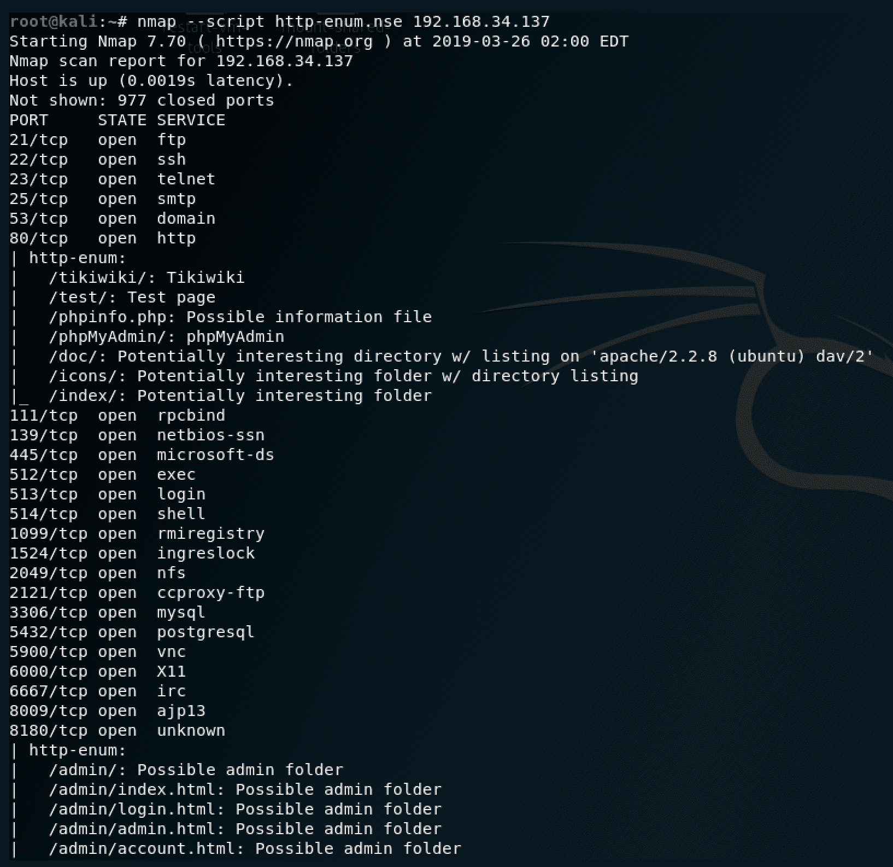
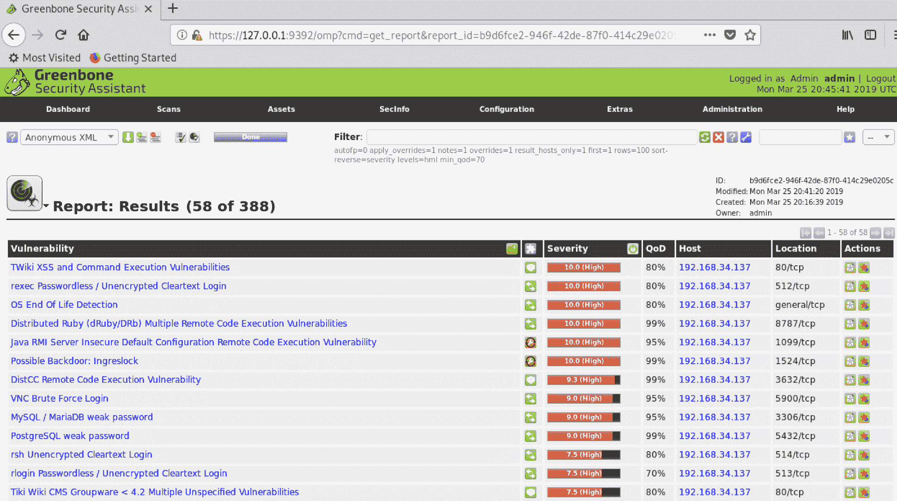
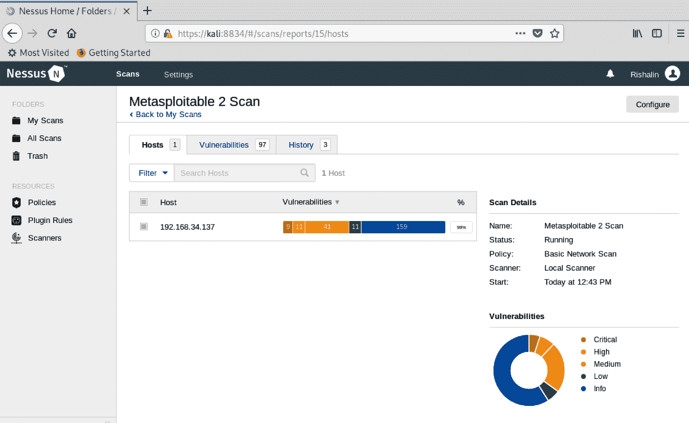
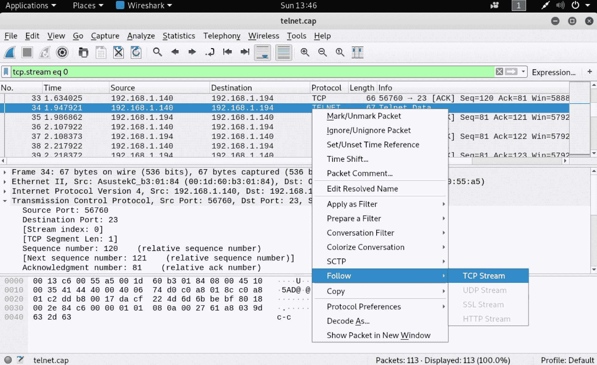

# 执行信息收集

收集关于目标的信息的技能是任何渗透测试人员都应该具备的重要技能。

被动信息收集和主动信息收集之间存在很大的区别。被动信息收集利用公开可用的信息。主动信息收集涉及与目标系统的直接交互。在特定国家的法律中，主动信息收集越过了界限，因为一些国家认为未经许可进行任何类型的渗透测试是非法的——这就是你的“免于监禁”（如第一章，*渗透测试简介*中讨论的）的重要性。在进行任何主动信息收集之前，获得正确的授权是非常重要的。

你收集的关于目标的信息将被用来规划你的攻击。在这个阶段，你将寻找任何可能暴露目标信息的东西。例如，他们的公共服务器是否暴露了已知的易受攻击的端口？是否有任何文件或信息（比如社交媒体帖子）在互联网上包含敏感信息？当你建立你的信息库时，你可以开始威胁建模，并寻找可以在你的攻击计划中使用的漏洞。

随着你在本章的学习过程中，你将了解以下主题：

+   被动信息收集

+   主动信息收集

+   漏洞扫描

+   已知的易受攻击的服务

+   捕获流量

# 技术要求

本章适用以下技术要求：

+   Kali Linux 2019.1

+   Metasploitable 2 和 3

# 被动信息收集

被动信息收集通常被称为**开源情报**（**OSINT**）。当你进行被动信息收集时，主要目的是在不引起目标注意的情况下尽可能多地收集有关目标的信息。在被动信息收集阶段，你将利用使用多种工具和第三方数据库发布的公开信息。你会惊讶于你可以从公开资源中获得多少信息。

常见的被动信息收集技术如下：

+   调查 DNS 记录以查找邮件服务器详细信息、子域等

+   在搜索引擎上使用精心设计的搜索来发现任何信息，比如文件

+   发现互联网连接的设备

+   使用工具获取信息，比如电子邮件地址

OSINT 框架旨在从免费可用的资源中收集信息。我鼓励你查看一个很好的在线资源，如下：[`osintframework.com`](https://osintframework.com)。

让我们通过使用充满信息的东西——互联网来进行一些信息收集。

# 使用互联网

在收集信息时，你的主要工具之一将是互联网。互联网充斥着信息。社交媒体、博客、消息服务等都是人们日常使用的常见媒介。员工可能会发布关于他们组织的信息，这对他们来说可能毫无意义，但对攻击者来说，这可能是一个金矿。

# 谷歌 dork

谷歌 dork（也称为谷歌黑客）实际上是一个特别设计的搜索字符串，返回的信息在目标网站上并不容易获得。它通过利用高级搜索运算符来实现这一点。

使用谷歌 dork 是在目标上执行信息收集的一个很好的方法。你可以返回诸如用户名和密码、敏感信息、登录门户等数据。

谷歌内的搜索运算符可以用来查询特定信息。此类搜索运算符的示例如下：

+   **site**：提供了你定义的网站特定的 URL 输出。

+   **inurl**：使用此查询，您可以定义一个特定的字符串，结果将返回包含该字符串的网站。

+   **filetype**：在这里，您可以定义您要查找的特定文件类型。例如，您可以指定 PDF、XLS、DOC 或任何其他您想要的文件扩展名。

搜索运算符可以一起使用进行巧妙的搜索。例如，在`microsoft.com`上查找具有`.doc`扩展名的文件时，您可以使用`Google.com`中的搜索查询`filetype:doc site:microsoft.com`来实现这一点。

Exploit-DB 存放着 Google Hacking 数据库，如下截图所示（*图 1*）。在这里，您将找到一个不断更新的大量 Google dorks：

Exploit-DB 上 Google Hacking 数据库的确切位置如下：[`www.exploit-db.com/google-hacking-database`](https://www.exploit-db.com/google-hacking-database)。


图 1：在 exploit-db.com 上列出的 Google Hacking 数据库

您会注意到有多个类别，您可以在其中找到各种 Google dorks。让我们使用其中一个 dork 进行信息收集：

```
intext:password "Login Info" filetype:txt
```

谷歌的结果显示了有多少网站的密码以明文形式暴露，如*图 2*所示：


图 2：使用 Google Dork 暴露的密码

在收集有关目标的信息时，您可以利用在 Google 中精心设计的搜索查询来发现可用的信息。

# Shodan

Shodan 不是您平均的搜索引擎。它经常被称为黑客的搜索引擎。在其网站上，Shodan 被称为*互联设备的世界第一搜索引擎*。Shodan 可以通过[`www.shodan.io`](https://www.shodan.io)访问，如*图 3*所示：


图 3：https://www.shodan.io 的登录页面

Shodan 有什么独特之处？谷歌和必应等搜索引擎索引网站，但 Shodan 索引一切，如网络摄像头、数据库服务器、医疗设备、路由器等等。任何连接到互联网的东西都被 Shodan 索引。

正如 Shodan 的创始人 John Matherly 在他的书*Shodan 完全指南*中所定义的，Shodan 的算法很简单。

1. 创建一个随机的 IPv4 地址

2. 查看 Shodan 了解的端口列表并选择一个随机端口

3. 使用步骤 1 生成的 IPv4 地址和步骤 2 生成的端口，执行连接并抓取横幅

4. 重复步骤 1

这个算法不仅仅是爬取网站，它找到一切并对其进行索引。让我们看一下可以使用 Shodan 运行的一些查询。

# Shodan 脚本

正如我们在第二章中学到的，*使用 Kali Linux 入门*，在 Kali Linux 中，您可以使用脚本。让我们看一下可以与 Shodan 一起使用的脚本。

您应该做的第一件事是在 Shodan 注册一个帐户。这可以通过直接导航到[`account.shodan.io/register`](https://account.shodan.io/register)来完成。创建帐户后，导航到我的帐户并获取您的**API 密钥**。保留 API 密钥，因为您将在脚本中使用它。

从您的 Kali Linux 机器上，您需要在开始编写脚本之前执行一些任务：

1.  确保您正在运行最新的更新和升级，并且已安装`python 2.7`。运行以下命令将确保您满足此要求：

```
sudo apt-get update && sudo apt-get install python2.7
```

1.  我们将利用`pip`命令来安装所需的`shodan`文件。使用以下命令完成此操作：

```
sudo pip install shodan
```

安装了所有要求后，您可以创建一个执行您想要执行的任何搜索的脚本。请注意，对于所有利用 Shodan 的查询，您需要使用您的**API 密钥**。您可以用您的实际**API 密钥**替换文本`"insert your API key here"`。我们将创建一个脚本，允许我们对目标进行信息收集。通过使用下面的示例脚本，我们可以利用 Shodan 使用`api.search`查询来获取结果。

1.  我们将使用`nano shodan-iis.py`命令和以下代码创建一个新的 Python 脚本：

```
import shodan
SHODAN_API_KEY = "insert your API key here"
api = shodan.Shodan(SHODAN_API_KEY)
# Wrap the request in a try/ except block to catch errors
try:
        # Search Shodan
        results = api.search('IIS')

        # Show the results
        print('Results found: {}'.format(results['total']))
        for result in results['matches']:
                print('IP: {}'.format(result['ip_str']))
                print(result['data'])
                print('')
except shodan.APIError, e:
        print('Error: {}'.format(e))
```

要在 nano 中保存文件，您可以使用*Ctrl* + *O*，然后使用*Ctrl* + *X*退出。文件保存后，我们可以使用`python shodan-iis.py`命令运行它。

请注意，我的搜索不针对任何特定国家，我只是在搜索 IIS 服务器：

如果您购买了 Shodan 的订阅，您可以在 API 查询中使用更多的搜索运算符。免费版本限制您进行基本搜索，只能看到 2 页的结果。


图 4：shodan-iis 脚本的输出

在上述输出(*图 4*)中，我们有许多结果。现在，我们可以过滤结果，以便只有 IP 地址。使用这些 IP 地址，我们可以利用一个简单的 Nmap 脚本来对 IP 地址进行扫描。

1.  修改脚本，以便只显示 IP 地址。为此，我们需要从`print('IP: {}'.format(result['ip_str']))`行中删除`IP`，并删除`print(result['data'])`和`print('')`行。新代码应如下所示：

```
import shodan
SHODAN_API_KEY = "insert your API key here"
api = shodan.Shodan(SHODAN_API_KEY)
# Wrap the request in a try/ except block to catch errors
try:
        # Search Shodan
        results = api.search('IIS')

        # Show the results
        print('Results found: {}'.format(results['total']))
        for result in results['matches']:
                print(' {}'.format(result['ip_str']))
except shodan.APIError, e:
        print('Error: {}'.format(e))
```

请注意，我们现在只有 IP 地址。使用这个，我们可以将输出导入到一个文本文件中，使用`python shodan-iis.py >> shodan-iis.txt`命令，如*图 5*所示：


图 5：shodan-iis 脚本的输出，仅过滤 IP 地址。

现在我们有了 IP 地址，我们可以创建一个简单的 bash 脚本来对它们进行 Nmap 扫描。

1.  通过输入`nano shodan-nmap-iis.sh`命令创建一个简单的 bash 脚本。在 nano 中，输入以下代码：

```
#!/bin/bash 
cat shodan-iis.txt | while read line
do
nmap -sS -sV $line
done
```

保存脚本，然后更改权限以使其能够使用`chmod +x shodan-nmap-iis.sh`命令运行。然后，使用`./shodan-nmap-iis.sh`命令运行脚本。

在上面的代码中，我们从 crunchbang (`#!`)开始，并定义了我们将在其中运行脚本的 shell。然后，我们定义了源文件。当脚本读取每一行时，它会执行 Nmap TCP syn 扫描(`-sS`)，以及对端口的服务和版本检测(`-sV`)。结果如*图 6*所示：


图 6：bash 脚本的结果

Shodan 确实是黑客的搜索引擎。可以获取任何类型的互联网连接设备的大量信息。

# 使用 Kali Linux

Kali Linux 有许多内置工具，可以用于被动和主动信息收集。在这里，我们将看一些可以用于被动信息收集的工具。

# Maltego

Maltego 是一个使用 OSINT 的好工具。Maltego 能够可视化有关目标的信息是如何连接的。Maltego 有免费和付费版本。在本书中，我们将利用免费版本。Maltego 也预装在 Kali Linux 中，所以不需要安装它。您会注意到，即使我们使用免费版本，它也能够为您的目标提供大量信息。

Maltego 使用公开可用的信息来可视化连接和信息。在对公共目标进行分析时，不应该有法律影响，但请确保您检查您当地特定国家的法律。

让我们开始运行 Maltego。要启动 Maltego，在 Kali 终端中输入`maltego`。在首次启动 Maltego 时，您需要选择要使用的版本。免费版本名为**Maltego CE**。注册帐户并登录后，您将看到 Maltego 的启动屏幕。

Maltego 使用**变换**，允许您通过插入各种网站（如 Shodan、VirusTotal 和 Threatminer）获得更丰富的结果。您会注意到变换中心有许多附加功能，可以增强您的结果，如*图 7*所示：


图 7：在 Maltego 中的变换列表

在 Maltego 中，我们有运行**机器**的选项。将机器视为运行一组预定义的带有各种配置的**变换**的脚本或宏。使用机器可以快速启动信息收集。要运行机器，您需要单击运行机器，并选择所需的机器。在我们的示例中，我们将运行 Footprint L3 机器，该机器在指定的域上执行了一个强烈的足迹，如*图 8*所示：


图 8：在 Maltego 中运行机器

扫描完成后，您将获得大量信息。在此示例中，我对我的个人域名进行了信息收集扫描。Maltego 能够捕捉到托管在我的托管公司共享 DNS 上的其他域，我的域的网站，共享的公共 IP，MX 记录等，如*图 9*所示：


图 9：Maltego 收集的信息

您会注意到图表非常大。出于说明目的，我已经放大了与我的域相关的数据。您可以在自己的个人域上执行此测试，并观察 Maltego 呈现的结果。

Maltego 对信息收集非常有用。当您使用额外的变换时，它将允许您获取有关目标的大量信息。

# 主动信息收集

主动信息收集是指我们开始与系统进行交互，以便收集更多信息。在主动信息收集期间，有可能触发警报，从而警告目标，因此，根据计划的攻击类型，您需要谨慎行事。

一些渗透测试有意触发警报，以测试警报、日志甚至现有对策的响应时间的有效性。

# Nmap

**网络映射器**（**Nmap**）是一种允许您进行网络发现和安全审计的工具。它仅在命令行中可用，并且有一个名为**Zenmap**的图形版本。Nmap 能够跨多个平台工作，如 macOS、Windows 和 Linux。Nmap 非常强大，不仅可以检测开放端口，还可以检测目标上运行的操作系统和服务，Kali Linux 默认包含 Nmap。Nmap 可用于执行以下操作：

+   **网络发现**：允许您检测目标网络上的任何活动主机

+   **端口发现**：允许检测开放端口

+   **服务发现**：提供检测与特定端口相关的软件版本的能力

+   **操作系统发现**：提供正在运行的操作系统和版本的信息

+   **漏洞扫描**：提供使用脚本检测漏洞的能力

Nmap 有许多扫描选项可供使用。以下是一些常见的扫描：

+   `-sS`：这是一个 TCP SYN 扫描。这种扫描是最常用的扫描类型之一，因为它通过不完成 TCP 连接来提供隐蔽性。

+   `-sT`：这是一个 TCP 连接扫描。这种扫描对目标端口进行完整连接，可能会被目标检测到。

+   -sU：这执行了对 UDP 协议的扫描。使用这种扫描，您可以发现与 DHCP、DNS、SNMP 等相关的端口。

+   -p：定义特定的端口或端口范围。范围用破折号`-`分隔。如果不指定端口或范围，扫描将扫描所有的 65,535 个端口。

+   -sC：使用默认的脚本集执行扫描。

+   -sV：通过引用 Nmap 服务数据库中的知名服务，执行版本检测。一旦引用完成，Nmap 就能够显示在端口上运行的服务。尽管这种链接非常准确，但您可能会发现管理员将不同的应用程序链接到常用端口的情况。 

+   -O：通过发送一些精心制作的数据包（如 TCP 采样、窗口检查大小和 IP 选项）并将它们与`nmap-os-db`进行比较，执行操作系统检测。一旦匹配，Nmap 将显示目标的操作系统。

+   --script：使用逗号分隔的列表来定义脚本，用于不同的类别、名称和目录。例如，`--script "http-*"`将加载处理 http 的每个脚本。`--script "default,safe"`将加载**default**和**safe**类别中的脚本。

SANS 目前有一份很好的 Nmap 备忘单供您参考。它位于这里：[`blogs.sans.org/pen-testing/files/2013/10/NmapCheatSheetv1.1.pdf`](https://blogs.sans.org/pen-testing/files/2013/10/NmapCheatSheetv1.1.pdf)。

Nmap 最初用于端口扫描，但该工具已经发展到可以执行漏洞扫描。利用**Nmap 脚本引擎**（**NSE**）允许您编写自己的脚本，并使用免费提供的脚本。在 Kali Linux 中，可以在`/usr/share/nmap/scripts`位置找到许多脚本。脚本有各种类别，如信息收集、漏洞扫描、暴力破解等。要查看当前在 Kali Linux 中可用的脚本的完整列表，可以在 Kali Linux 中的终端窗口中运行`ls /usr/share/nmap/scripts`命令。或者，您可以使用您在上一章学到的`locate`命令：`locate *.nse`。

如果您不确定脚本的作用，可以使用`nmap -script-help [script name]`命令，如*图 10*所示：


图 10：Nmap 脚本帮助

让我们对 Metasploitable 2 虚拟机执行一些扫描。确保您的 Kali Linux 和 Metasploitable 2 虚拟机都在同一个虚拟网络上：

1.  我们将使用 Kali Linux 终端窗口中的`netdiscover`命令进行一些网络发现。过一段时间，您的 Metasploitable 2 IP 地址将被显示出来。

1.  我们将使用`nmap -sS [ip address]`命令对 Metasploitable 2 虚拟机进行基本的 TCP SYN 扫描。扫描完成后，我们将看到所有开放端口的列表，如*图 11*所示。在输出中，我们看到了当前的开放端口列表。但让我们结合一些更多的参数来获得更丰富的结果：


图 11：Nmap TCP SYN 扫描

请注意，Metasploitable 2 上的`nfs`端口`2049`/TCP 是开放的。使用文件浏览器，您可以导航到您的 Metasploitable 2 虚拟机的`nfs://[IP]`。您将可以在没有身份验证的情况下访问文件系统。您可以利用这个漏洞并浏览到`/etc/`，并将`shadow`和`passwd`文件复制到您的 Kali Linux。您将在第六章中使用这些文件，*理解密码攻击*。

1.  使用`nmap -sS -sV -O -sU [IP 地址]`命令，我们能够获得更多信息的结果。您会注意到，我们现在可以看到与**TCP**和**UDP**端口号相关的服务版本，以及操作系统的信息，如*图 12*所示：


图 12：Nmap 扫描结合各种扫描选项

1.  由于这个版本的 Metasploitable 正在运行 Apache 服务器，让我们利用一个脚本为我们提供更多信息。使用`nmap --script http-enum.nse [IP 地址]`命令，我们能够检测与开放的 HTTP 端口相关的信息，如*图 13*所示：



图 13：Nmap 在终端中显示机器的开放端口

您可以使用第 3 步中的开关对 Metasploitable 3 系统执行 Nmap 扫描，但是您需要添加`-oX`，将输出导出到一个`.xml`文件中。在第五章中，*深入 Metasploit 框架*，您将使用这个。

通过对 Nmap 有很好的理解，您在进行渗透测试时可以获益良多。确保您在实验室内进行了各种扫描的练习，以便您对输出和如何在特定情况下使用不同的扫描有很好的理解。

# 漏洞扫描

一旦您收集了必要的信息，就是时候开始对现有的漏洞进行一些额外的研究了。漏洞扫描使用诸如 Nessus 和 OpenVAS 之类的软件。通常，漏洞扫描器将具有与特定漏洞相关的签名。一旦扫描器运行并完成，您将收到一份报告，显示与特定系统相关的所有漏洞。漏洞扫描器只能检测**已知**的漏洞；任何**未知**的漏洞都不会被漏洞扫描器检测到。漏洞扫描器在您的渗透测试工具包中至关重要。它们经常会暴露您可能忽视的漏洞。

让我们看看一些您可以在渗透测试中使用的漏洞扫描器。

# OpenVAS

OpenVAS 是一个开源的漏洞扫描器，有免费和付费版本。OpenVAS 的目标是成为一个集成各种内置测试的全能漏洞扫描器。截至 2019 年 1 月，OpenVAS 包含超过 50,000 个网络漏洞测试（NVTS），并且不断增长。Kali Linux 默认未安装 OpenVAS，因此您需要安装它。要安装 OpenVAS，您需要按照以下步骤进行：

1.  从 Kali Linux 终端窗口，使用`apt-get install openvas`命令下载 OpenVAS。这将连接到 OpenVAS 存储库并下载所需的文件。

1.  下载完成后，是时候使用`openvas-setup`命令安装 OpenVAS 了。这将开始 OpenVAS 的安装过程并下载 NVT feeds。安装完成后，最后会显示一个系统生成的密码。请注意这一点，因为您需要用它登录 OpenVAS 并将密码更改为您想要的内容，如*图 14*所示：


图 14：OpenVAS 安装完成，屏幕上显示登录详细信息

如果您忘记了 OpenVAS 的用户名和密码，可以使用以下命令更改它们：

`openvasmd –user=[用户名]–new-password=[密码]`

因此，例如，您可以使用`openvasmd –user=admin –new-password=Sup3rS3cretPa55w0rd`。

1.  安装完成并登录到 OpenVAS 的用户界面后，您可以通过点击顶部导航栏上的“扫描”选项卡执行漏洞扫描。要执行新的扫描，您可以使用**任务向导**或**创建新任务**按钮。这些按钮由魔杖（**任务向导**）和星号（**创建新任务**）表示。让我们创建一个任务，以便我们可以对 Metasploit 2 进行漏洞扫描。使用**创建新任务**功能，我们可以定义任务的名称并定义目标，如*图 15*所示。


图 15：新的 OpenVAS 任务创建

1.  一旦任务创建完成，您可以在任务的“操作”部分使用绿色播放图标来运行它。

1.  任务完成后，您将看到一个仪表板，显示结果的高层视图。点击“报告”部分，如*图 16*所示：


图 16：高层概述

1.  一旦您在报告概述中，要查看扫描的完整报告，您需要点击扫描日期，如*图 17*所示：


图 17：报告概述

1.  现在，您将获得 OpenVAS 发现的所有漏洞的完整列表，如*图 18*所示：



图 18：发现漏洞的报告

一旦您获得报告，您可以展开漏洞以查看其完整细节。OpenVAS 为您提供解决方案类型（如供应商修复或解决方法）和**检测质量**（**QoD**）。

我鼓励您使用 OpenVAS 对自己的网络或主机执行漏洞扫描，以便更熟悉这个漏洞扫描器。

# Nessus

Nessus 是市场上最受欢迎的漏洞扫描器之一。与其他漏洞扫描器一样，Nessus 包含了跨不同平台和协议的已知漏洞的数据库。Nessus 有付费版本（通常由渗透测试人员和内部安全部门用于执行漏洞扫描）和免费版本，称为 Nessus Home。在本书中，我们将使用 Nessus Home，它只能扫描几个 IP 地址。由于 Kali Linux 默认未安装 Nessus，我们需要安装它。

按照以下步骤执行：

1.  转到[`www.tenable.com/products/nessus-home`](https://www.tenable.com/products/nessus-home)注册 Nessus Home 的激活码。注册完成后，您将有下载 Nessus 的选项。Nessus 下载页面的直接链接是[`www.tenable.com/downloads/nessus#download`](https://www.tenable.com/downloads/nessus#download)。

1.  根据您的 Kali Linux 架构下载标题为 Debian 6, 7, 8, 9/Kali Linux 1, 2017.3 AMD64 或 Debian 6, 7, 8, 9/Kali Linux 1, 2017.3 i386（32 位）的版本。尽管软件版本显示为 Kali Linux 的旧版本，但它将在本书中使用的当前版本（2019.1 版）中运行。

1.  一旦下载了正确的版本，您可以通过导航到下载目录并使用`dpkg -I`命令在 Kali Linux 中安装它。安装应该相对快速。完成后，您将看到摘要，如*图 19*所示：


图 19：Nessus 安装

1.  通过运行`/etc/init.d/nessusd start`或`service nessusd start`命令启动 Nessus 扫描器，并使用内置于 Kali Linux 中的 Firefox ESR 导航到位于`https://kali:8834`的图形界面。

图形界面的 URL 可能在您的环境中有所不同。请注意安装完成后的摘要。

一旦 Nessus 启动并导航到管理员 URL，您将看到一些选项来创建新的用户帐户。帐户创建后，Nessus 将执行一些安装后任务，如安装插件。完成所有任务后，您将能够登录到管理员门户，如*图 20*所示：


图 20：Nessus 管理员门户

让我们对 Metasploitable 2 虚拟机执行漏洞扫描（您在第一章中了解到的，*渗透测试简介*）。要启动并运行您的 Metasploitable 2 虚拟机，请使用您的超级管理程序打开`metasploitable.vmx`（在我的情况下，我正在使用 VMware Fusion）。一旦 Metasploitable 2 加载完成，使用默认用户名和密码`msfadmin`登录，并发出`ifconfig`命令以显示虚拟机的 IP 地址，如*图 21*所示。确保 Kali Linux 与 Metasploitable 在同一个虚拟网络上：


图 21：Metasploitable 2 IP 地址

从 Nessus 管理员门户选择新的扫描。您将看到许多扫描模板。扫描模板是一组预定义的任务，您可以快速利用它们进行特定类型的扫描。一些模板仅在 Nessus 的付费许可版本中可用。对于我们的演示，我们将使用基本网络扫描模板。选择了这个模板后，我们将看到许多选项。

在“设置”选项卡中，在“常规”部分，我们将提供“名称”、“描述”和“目标”字段的输入，如*图 22*所示：


图 22：Nessus 扫描常规配置

接下来我们要配置的部分是在“发现”部分下，我们将选择的扫描类型是端口扫描（常见端口）。之后，我们将选择“评估”并选择“扫描所有 Web 漏洞（复杂）”选项。最后，我们将点击“保存”。保存扫描后，您将被引导回主管理员页面，在那里您现在可以选择您保存的扫描，然后点击“启动”按钮。您的扫描现在将开始运行，过一会儿，您将看到输出，如*图 23*所示：



图 23：Nessus 扫描结果

正如我们所看到的，Nessus 在 Metasploitable 2 中发现了许多漏洞。Nessus 按严重性对这些发现进行排序。Nessus 能够提供有关发现的详细信息。例如，通过查看一个关键发现，我们可以看到 Nessus 提供了有关可利用性的信息。它甚至进一步介绍了漏洞可以利用的内容，如*图 24*所示：


图 24：Nessus 漏洞信息

您可以对 Metasploitable 2 和 3 虚拟机执行 Nessus 扫描。在第五章中，*深入了解 Metasploit 框架*，您将使用 Nessus 扫描 Metasploitable 3 虚拟机。

Nessus 和 OpenVAS 都是优秀的漏洞扫描工具。重要的是要注意，作为渗透测试人员，了解如何解释漏洞评估结果是一项关键技能。通常，需要手动验证结果，以确保您获得全面的图片并消除任何错误的阳性。

# 捕获流量

学习如何使用数据包捕获工具对于任何安全专业人员来说都是至关重要的。在本节中，我们将介绍两种数据包捕获工具：Wireshark（基于 GUI）和`tcpdump`（基于 CLI）。

在我们开始使用这些工具之前，让我们退一步来理解在进行渗透测试时为什么需要捕获流量。网络流量以数据包形式传输，每个数据包包含一些字段，其中包含它需要在网络中传输并执行某个功能所需的信息。进行数据包捕获（或数据包嗅探）将允许你查看数据包的结构，以及任何可用的数据。一些协议流量是未加密的，比如 FTP。这将允许你看到明文中的用户名和密码。

数据包嗅探是一种应用于计算机网络的窃听类型。你可以将其类比为电话窃听，其中一段对话被监听。

# Wireshark

Wireshark 一直是全球许多用户进行数据包捕获的首选工具。它是一个跨平台工具，允许你进行数据包捕获和分析。

Wireshark 的一些主要特点如下：

+   实时数据包捕获与分析（离线分析或即时分析）

+   深度数据包检查

+   诸如 SSL/TLS、IPSEC、SNMPv3、Kerberos、WPA/WPA2 等协议的解密支持

在 Wireshark 中，你有能力应用**捕获过滤器**和**显示过滤器**。理解这两种过滤器之间的区别以及如何应用它们将帮助你捕获相关的数据包并过滤掉噪音。

**捕获过滤器**用于减少原始数据包捕获的大小，而**显示过滤器**用于过滤捕获的内容并只显示特定数据。**捕获过滤器**在捕获开始前应用，不能在捕获过程中更改。另一方面，**显示过滤器**可以随时应用。

一些**捕获过滤器**可以非常基本和简单。让我们看几个例子：

+   捕获特定主机的流量如下：

```
host 192.168.90.1
```

+   捕获特定子网的流量如下：

```
net 192.168.90.0/24
```

+   一些**捕获过滤器**可以很复杂，比如用于检测心脏出血漏洞的过滤器：

```
tcp src port 443 and (tcp[((tcp[12] & 0xF0) >> 4 ) * 4] = 0x18) and (tcp[((tcp[12] & 0xF0) >> 4 ) * 4 + 1] = 0x03) and (tcp[((tcp[12] & 0xF0) >> 4 ) * 4 + 2] < 0x04) and ((ip[2:2] - 4 * (ip[0] & 0x0F)  - 4 * ((tcp[12] & 0xF0) >> 4) > 69))
```

显示过滤器也可以是基本的。让我们看几个例子：

+   显示特定源和目的地之间通信的流量如下：

```
ip.src==192.168.90.0/24 and ip.dst==192.168.90.1
```

+   查找特定端口的流量使用以下命令：

```
tcp.port eq 445 
```

在下面的截图（*图 25*）中，我标记了定义显示和捕获过滤器的字段：


图 25：显示和捕获过滤器

Wireshark 有能力显示未加密流量中的明文凭据。例如，在捕获 Telnet 流量时，我们可以使用 Follow | TCP Stream 来跟踪 TCP 流，如*图 26*所示：



图 26：使用 Follow | TCP Stream

请注意，通过使用 Follow | TCP Stream 选项，我们能够看到明文中的用户名和密码，如*图 27*所示：


图 27：明文的 FTP 凭证

前面的捕获来自[`packetlife.net/captures`](http://packetlife.net/captures)。你可以在[`packetlife.net/captures/Wireshark`](http://packetlife.net/captures/Wireshark)找到更多可以免费下载以测试 Wireshark 功能的数据包捕获。

使用 Wireshark 的图形界面使得处理数据包捕获更容易。然而，如果你无法使用 Wireshark，那么你需要知道如何利用命令行数据包捕获工具如`tcpdump`。

# tcpdump

`tcpdump`是最广泛使用的数据包捕获实用程序。它在 Linux/Unix 操作系统上可用，这意味着它在 Kali Linux 中默认安装。它有能力将捕获保存到`.pcap`文件并读取`.pcap`文件。

`tcpdump`有许多开关可以使用。它的一些常见开关如下：

+   `tcpdump -d`：显示接口列表

+   `tcpdump -i [interface]`：指定要在其上执行数据包捕获的接口

+   `tcpdump -c`：指定要捕获的数据包数量

+   `tcpdump -w /path`：定义`tcpdump`应写入的文件

+   `tcpdump -r /path`：读取捕获文件

+   `tcpdump -XX`：以 ASCII 或 HEX 格式捕获数据包

以下是使用`tcpdump`捕获 FTP 流量的实际示例。使用`tcpdump`，您可以看到明文中的用户名和密码，如*图 28*所示：


图 28：明文登录详细信息

您可以通过使用一个公开可访问的`ftp`服务器来复制前面的测试，该服务器用于速度测试。URL 是`speedtest.tele2.net`。

# 总结

在本章中，我们看了信息收集和漏洞扫描。我们定义了主动和被动信息收集之间的区别。我们通过各种工具来进行被动和主动信息收集，并介绍了漏洞扫描所需的工具。最后，我们使用图形和命令行工具进行了数据包捕获。

您现在可以使用开源情报进行信息收集，这是被动信息收集。您已经学会了如何使用 Nmap 进行主动信息收集，以及如何利用 Nmap 脚本引擎。您已经掌握了使用漏洞扫描器（如 OpenVAS 和 Nessus）的必要技能，并知道如何执行漏洞扫描以规划攻击。数据包捕获教会了您如何**嗅探**网络中的流量，以及如何从不安全的协议中获取有价值的信息。

在下一章（第四章，*精通社会工程*）中，我们将看看什么是社会工程以及您可以使用哪些不同工具来执行社会工程。我们将利用 Kali Linux 中的内置工具，以及一些需要安装的其他工具。

# 问题

1.  被动信息收集和主动信息收集之间有什么区别？

1.  列出两种可用于被动信息收集的工具。

1.  Nmap 如何从传统端口扫描器发展而来？

1.  列出两种漏洞扫描器。

1.  为什么您需要知道如何执行数据包捕获？
