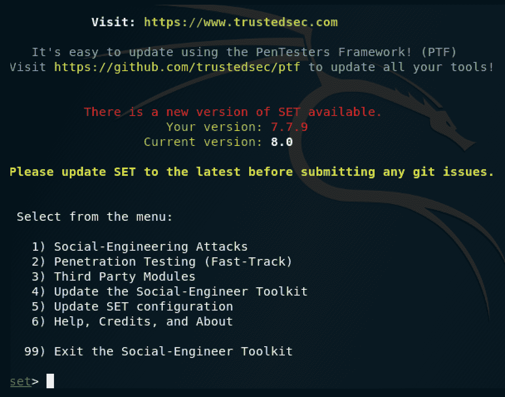
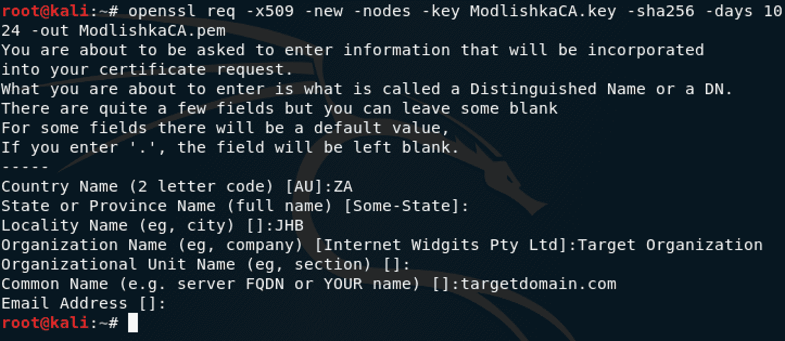
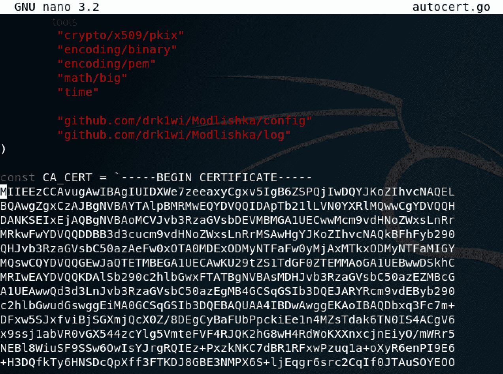
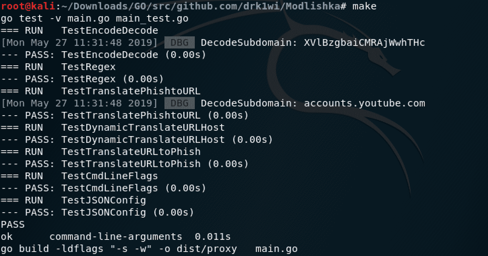
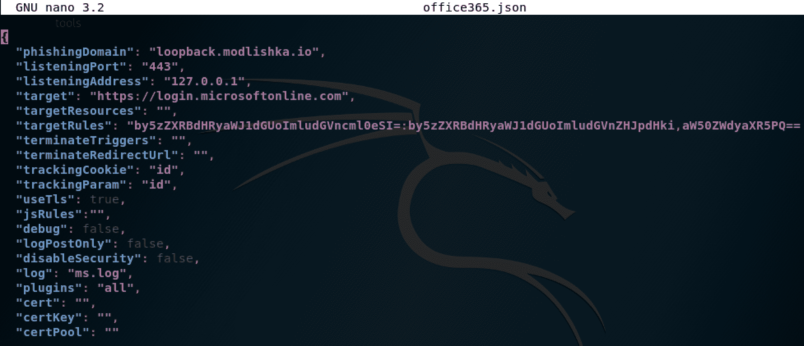
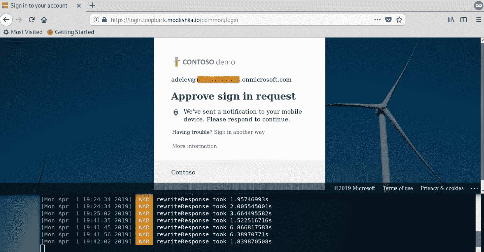
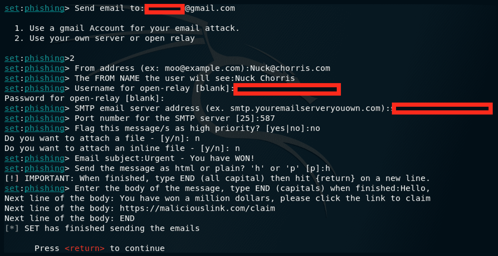

# 掌握社会工程

渗透测试并不总是涉及使用计算机和利用漏洞。在本章中，我们将学习如何掌握社会工程的艺术，这是每个渗透测试人员都应该具备的技能。社会工程可能很复杂，因为你试图使用心理操纵来影响目标的思维。

在本章中，你将受益于了解什么是社会工程，社会工程的不同类型以及可以用来执行社会工程的工具。通过学习如何使用 Kali Linux 内的工具构建社会工程攻击，你将获得技能。通过继续探索和巩固你的社会工程技能，你可以构建一种社会攻击，如果对目标执行得当，可以通过最小的软件漏洞实现你的目标。

随着你在本章的学习过程中，你将了解以下主题：

+   什么是社会工程？

+   社会工程工具

+   创建社会工程活动

# 技术要求

本章需要以下技术要求：

+   Kali Linux 2019.1

# 什么是社会工程？

社会工程可以被定义为一种心理操纵形式，说服一个人放弃机密信息。这是一种利用欺骗和欺诈而不是使用任何类型的软件漏洞的网络攻击形式。当然，软件参与了构建社会工程攻击，但主要组成部分是你如何欺骗目标相信你所做的是合法的。

软件和人类实际上并没有那么不同。你可能想知道人类和软件如何如此相似。当涉及到软件和人类的漏洞时，攻击者可以利用这些漏洞来获取他们想要的东西。与软件相关的漏洞通常是被利用的，这导致了软件的缺陷，攻击者可以利用这些缺陷。

对于人类来说，我们的本性使得人们很容易利用心理操纵来攻击其他人。人类有各种情感，这让我们与其他生物有所不同。然而，其中一些情感是社会工程攻击的主要目标。例如，我们有以下情感特征：

+   帮助他人

+   信任他人

+   恐惧

+   服从权威

社会工程攻击利用我们情感的脆弱性，说服我们执行某种活动，比如点击欺诈链接、访问恶意网站或打开恶意文件。

大多数组织都在培训员工有关社会工程方面投入了大量的精力，但遗憾的是，有些组织没有这样做。无论设置了什么安全控制措施，最终用户最终都将能够访问可能对组织造成伤害的敏感信息。好奇心会导致一个人捡起地上的 USB 并插入，看看里面有什么。在目标组织周围放置感染的 USB 存储设备是一种常见的渗透测试技术，攻击者也会使用这种方法。

社会工程有许多形式，让我们来探索其中一些。

# 假设

假设可以被定义为以他人身份出现，目的是获取信息的做法。假设者可以冒充同事、IT 人员、银行家、朋友和家人，或者任何被视为值得信赖或对目标有权威的人。

假设形成了任何社会工程攻击的基础。当你进行渗透测试时，确保你花足够的时间建立一个坚实可信的假设。

例如，我们都收到过声称我们继承了一笔小财富的电子邮件，但为了领取它，我们需要提供某种信息或点击一个链接。一个人上当的机会非常渺茫，因为借口非常差。假设您总是在亚马逊上网购，现在您收到了一封来自亚马逊的邮件，声称由于缺少信息无法交付包裹。这样的借口更加可信。

在渗透测试期间，您可能需要模拟社会工程攻击。对目标进行适当的信息收集对构建一个可信的借口至关重要。您需要考虑的一些事情包括公司规模、地点、员工人数、电子邮件、员工信息等。您还需要考虑从技术角度来看有哪些可用的东西，比如面向公众的网络服务器、VPN 和电子邮件服务器。

一旦您获得足够的信息，您可以开始为每个借口定义成功的标准。例如，如果目标组织在全国范围内没有分布办公室，那么假扮成员工的成功几率就很低，因为员工可能是众所周知的。然而，如果该组织在多个国家拥有大量业务，您就有更高的成功率，可以假扮成另一个地点部门的员工。

# 网络钓鱼

网络钓鱼是一种网络攻击，攻击者使用伪装的电子邮件从目标那里获取敏感信息。获取的信息可以是信用卡详细信息、用户登录信息、网络凭证等任何东西。这种类型的攻击针对个人和大型组织。您可能已经在个人电子邮件中收到了许多网络钓鱼邮件，因为这些攻击是在非常大的规模上进行的。在这种类型的攻击中，攻击者对任何特定的人都不感兴趣。他们只是在广泛地投网，以说服任何不起疑的人提供有价值的信息。

一些网络钓鱼邮件的常见特征如下：

+   **附件**：您经常会在声称包含发票或文件的电子邮件中发现附件。这些通常包含一个宏，其中包含一个可以释放远程 shell 的有效负载，使攻击者可以访问您的计算机，甚至释放勒索软件等恶意软件。最近，一些这样的邮件包含`.html`文件，通常是`.doc`或`.js`格式。这些文件的杀毒软件检测率较低，因为它们通常不与电子邮件攻击相关联。当然，随着杀毒软件的成熟，攻击者的策略也在不断发展。

+   **超链接**：一些网络钓鱼邮件可能包含一个链接，将您重定向到一个看起来合法的网站。常见的网络钓鱼邮件类型包括要求您重置密码，或者确认您的详细信息以避免您的帐户被禁用等。通常，当您将鼠标悬停在链接上时，您会看到实际的 URL，这并非合法，但随着攻击者策略的成熟，他们开始使用看起来非常类似于合法的 URL。例如，[`www.facebook.com/`](https://www.facebook.com/)可能被描述为[www.faccebook.com](https://www.facebook.com/)或[www.faceboook.com](https://www.facebook.com/)，如果您不仔细观察，很容易被忽略。

+   **好得令人难以置信**：许多网络钓鱼邮件中都有旨在吸引人们注意的陈述。这些通常与诱人的优惠有关，比如赢得设备、彩票，或者从远亲那里继承一笔小财富。要记住的一件事是，如果看起来太好以至于难以置信，那可能就是如此。

网络钓鱼工具包在暗网上很容易获得。这些工具包的可用性使得具有最低技能的攻击者可以轻松发动网络钓鱼攻击。网络钓鱼工具包捆绑了网站资源和工具，可以直接安装在服务器上。一旦安装完成，攻击者只需向受害者发送电子邮件，将他们引导到网络钓鱼网站。

要及时了解当前的网络钓鱼链接，请查看 OpenPhish（[`openphish.com`](https://openphish.com)）和 PhishTank（[`www.phishtank.com`](https://www.phishtank.com)）上托管的网络钓鱼信息。

# 鱼叉式网络钓鱼

鱼叉式网络钓鱼是针对特定个人、部门或公司的网络攻击，看起来来自一个可信任的来源。这种类型的攻击很难被发现，经过深思熟虑，通常在进行此类攻击之前会对目标进行深入研究。这不像普通的网络钓鱼攻击，攻击者会广泛投放网，鱼叉式网络钓鱼是一种有针对性的攻击。

鱼叉式网络钓鱼攻击的核心组成部分是信息收集。收集有关电子邮件地址、人员以及他们在目标组织内的职位的信息（使用 LinkedIn 等 OSINT 工具）将有助于您确定您的目标和您可以冒充的人。正如我们在第三章中所学到的，*执行信息收集*，开源情报可以为您提供关于目标的大量信息。

一些常见的鱼叉式网络钓鱼攻击特征如下：

+   **商业电子邮件欺诈（BEC）**：这旨在滥用诸如工资单或发票之类的流程。攻击将利用来自可靠来源（在`from`字段内）的电子邮件，并包含与发票相关的文件。对于普通人来说，看起来一切正常，他们会打开那张发票，最终暴露他们的系统受到攻击。

+   **多向威胁**：这种攻击使用多种攻击向量。例如，鱼叉式网络钓鱼电子邮件将包含动态 URL、恶意下载和文档中编码的有效负载，以避免被检测。

+   **几乎无法检测**：由于精心制作的鱼叉式网络钓鱼电子邮件没有大量普通网络钓鱼电子邮件中的特征，使得它更难以被传统的声誉和垃圾邮件过滤器检测到。

+   **鲸鱼式网络钓鱼**：在这种类型的攻击中，鱼叉式网络钓鱼活动针对的是高调目标，通常是组织中的高管。高调人士通常比普通人拥有更多的特权信息，这使得他们成为主要目标。在鲸鱼式攻击中窃取的任何信息在黑市上都更有价值，除了攻击者可以使用的特权凭证的可能性之外。

# 尾随

尾随（也称为搭便车）是一种身体社会工程学形式。尾随可以被定义为未经授权的人跟随经过授权的人进入安全区域的一种物理安全漏洞。

一种常见的尾随类型可能是有人在一个公共区域等待，双手拿满了东西，等待一个授权人员打开一个受控门。在这段时间里，未经授权的人可能会请求他们把门打开，然后他们就可以冲进去。其他形式可能包括在一个公共吸烟区与员工攀谈。等到员工吸完烟，他们很可能会为您开门，假装是员工。人类有常见的礼貌，这可能导致漏洞，比如为未经授权的人开门。

一些组织在物理安全方面做得很好，所以这种方法可能并不适用于所有地方。然而，对目标的物理安全进行充分的信息收集将有助于您计划攻击。

在执行渗透测试时，您可以利用上述任何技术。对每种技术的良好背景了解将有助于您更有效地规划渗透测试。

# 社会工程工具

互联网上有许多社会工程学工具包可供使用。有些用于执行社会工程任务以形成意识，而其他一些则在暗网上出售以恶意目的。我们不会专注于暗网上的社会工程工具，因为这超出了本书的范围，但我们将看看 Kali Linux 中可用的工具以及您可以安装的其他工具。

# 社会工程工具包（SET）

**社会工程工具包**（SET）是一套工具，允许您在进行渗透测试时专注于人的因素。社会工程工具包的主要目的是创建您可以使用的社会工程攻击。该工具是一个由 Python 驱动的工具，目前在 Linux 上受支持。撰写本文时，它正在 macOS 的实验阶段。

社会工程工具包允许您创建多种社会工程攻击。撰写本文时，包括以下攻击：

+   **鱼叉式网络钓鱼攻击**：允许您创建电子邮件网络钓鱼活动。

+   **网站攻击**：允许您创建网站克隆等攻击。

+   **传染性媒体生成器**：可创建可用于 USB 设备的自动运行。

+   **创建有效载荷和监听器**：创建反向 shell 有效载荷，允许访问目标机器。

+   **大规模邮件攻击**：创建可发送给大量受众的网络钓鱼邮件。

+   **基于 Arduino 的攻击**：允许您利用 Arduino 设备（如 Teensy）创建攻击。插入 PC 时，它被检测为键盘，允许将漏洞传递到目标机器。

+   **无线接入点攻击**：允许创建恶意无线接入点，并允许您拦截通过的流量。

+   **QR 码生成器攻击**：生成您指定的任何 URL 的 QR 码。这对将目标重定向到恶意 URL 很有用。

+   **Powershell 攻击**：创建基于 Powershell 的攻击，可用于执行盲目 shell 或转储 SAM 数据库。

+   **短信欺骗攻击**：创建可用于社会工程目标的短信。

撰写本文时，社会工程工具包的当前版本为`8.0`。Kali Linux 2019.1 中预安装的版本为`7.7.9`：



图 1：Kali 2019.1 中预安装的版本

要升级到最新版本，您需要从 TrustedSec GitHub 存储库下载最新版本，该存储库位于[`github.com/trustedsec/social-engineer-toolkit`](https://github.com/trustedsec/social-engineer-toolkit)。

下载完成后，您可以将文件夹的内容从`.zip`文件提取到`/usr/share/set`以覆盖必要的文件。完成后，您将能够通过在 Kali Linux 中的终端窗口中运行`setoolkit`命令来启动最新版本。

社会工程工具包具有大量功能，可用于您的渗透测试。探索它提供的各种技术将有助于您制定有效的网络钓鱼活动。社会工程工具包预装在 Kali Linux 2019.1 中。您可以在终端窗口中使用`setoolkit`命令访问它。

# Gophish

Gophish 是一个开源框架，可用于进行钓鱼活动。它专为企业和渗透测试人员设计。Gophish 是跨平台的，因此您可以在 Windows、macOS 和基于 Linux 的操作系统上运行此工具。Gophish 具有图形界面，使构建钓鱼活动变得简单易行。您可以构建一个活动并安排在您喜欢的时间启动。

Gophish 的一些主要特点如下：

+   使用模板并创建自己的模板的能力

+   克隆网站并定义着陆页面

+   捕获凭证

+   安排活动

+   创建有关钓鱼活动的报告

Gophish 未预装在 Kali Linux 中，可在此处下载：[`github.com/gophish/gophish/releases`](https://github.com/gophish/gophish/releases)。

# Modlishka

Modlishka 将钓鱼活动提升到一个新的水平。它是一个灵活而强大的反向代理，为钓鱼攻击提供了高度自动化。

Modlishka 的目标是做到以下几点：

+   更加关注进行有效的钓鱼活动的渗透测试人员，以显示钓鱼是一个严重的威胁

+   查看当前**双因素认证**（**2FA**）的弱点，并突出这些弱点，以便可以制定解决方案

+   提高对钓鱼技术的认识

Modlishka 的独特之处在于不需要模板。在其他社会工程工具中，您需要使用模板，甚至构建自己的模板。Modlishka 通过反向代理工作，以便目标网站可以实时打开。

Modlishka 的一些主要特点如下：

+   支持大多数 2FA 方案

+   无需创建网站模板，只需将 Modlishka 指向目标域名

+   TLS **跨**源流完全由目标浏览器控制

+   钓鱼场景易于配置和灵活

+   能够使用基于模式的 JavaScript 负载注入

+   剥离加密和安全标头的能力

+   凭证收集

+   插件支持

安装 Modlishka 需要**Go**语言。Go 语言是由 Google 开发的开源编程语言。它使用类似脚本语言的语法，因此易于构建简单、可靠和高效的软件。

我们将在本章后面介绍 Modlishka 的安装。

# Wifiphisher

钓鱼不仅涉及特制的电子邮件和附件。WiFi 接入点可以用来对目标发起钓鱼攻击。有大量的无线网络可用，其中许多是开放的，提供免费的互联网访问。Wifiphisher 是一个工具，允许您对无线网络进行自动化的钓鱼攻击，以窃取凭证或释放恶意软件等有效载荷。Wifiphisher 能够使用现代攻击技术，如 KARMA、已知信标和恶意双胞胎：

+   **已知信标**：此技术允许 Wifiphisher 广播已知的 ESSIDs

+   **KARMA**：这是一种技术，Wifiphisher 伪装成公共网络

+   **恶意双胞胎**：此技术创建了恶意访问点

Wifiphisher 的一些主要特点如下：

+   能够在树莓派等设备上运行。

+   它非常灵活，支持多种参数，并使用社区驱动的钓鱼模板，可用于各种场景。

+   它允许您编写基于 Python 的简单或复杂模块。Wifiphisher 允许您编写自定义的钓鱼场景，可以在有针对性的渗透测试中利用。

+   它很简单使用，因为它允许您运行`./bin/wifiphisher`命令。这将启动一个交互式文本界面，帮助您构建攻击。

以下截图显示了可用的钓鱼场景列表：


图 2：Wifiphisher 中可用的钓鱼场景列表

在撰写本文时，Wifiphisher 目前仅在 Linux 上受支持，Kali Linux 是其官方支持的发行版。为了使用 Wifiphisher，您必须拥有一个能够进行数据包注入并支持监视模式的无线网络卡。我们将在第九章中深入探讨这一点，即*开始无线攻击**。***Wifiphisher 不是 Kali Linux 2019.1 的默认安装程序。

可以使用以下命令安装 Wifiphisher：

```
apt-get install Wifiphisher 
```

# 创建社会工程活动

让我们来看看为渗透测试创建一个社会工程活动。在这个活动中，我们将使用 Modlishka 针对 Office 365 用户进行目标定向。

# 安装 Modlishka

为了使用 Modlishka，我们需要在 Kali Linux 中安装 Go 语言。执行以下步骤进行安装：

1.  在 Kali Linux 的终端窗口中，发出`apt-get install golang`命令。这将安装 Go 语言。我们需要使用`export GOPATH=$HOME/Downloads/GO`命令定义一个`GOPATH`。为了确认我们设置的路径，我们可以使用`echo $GOPATH`命令：


图 3：安装 Go 并定义 GOPATH

1.  接下来，我们需要将 Modlishka 下载到`GO`文件夹中。我们通过运行`go get -u github.com/drk1wi/Modlishka`命令来实现这一点。这将开始将 Modlishka 下载到我们在*步骤 1*中定义的`GO`文件夹中。如果您使用了前面的命令，那么您的 Modlishka 安装将位于`/root/Downloads/go/src/github.com/drk1wi/Modlishka`中：


图 4：下载 Modlishka

1.  现在，我们需要创建 SSL 证书。或者，您可以使用已与您的钓鱼域相关联的证书。在我们创建证书之前，我们需要生成 RSA 私钥。这可以使用`openssl genrsa -out ModlishkaCA.key 2048`命令完成。在这里，我们生成一个`2048`位的密钥：


图 5：生成 RSA 私钥

1.  接下来，我们使用在*步骤 3*中创建的密钥生成证书。为了创建证书，我们使用`openssl req -x509 -new -nodes -key ModlishkaCA.key -sha256 -days 1024 -out ModlishkaCA.pem`命令。输入命令后，您将被提示提供有关证书的详细信息。

在这些字段中，您将填写与您要对其执行钓鱼攻击的目标域中所做的类似的详细信息。记得将此证书导入您将用于钓鱼活动的服务器中。在这个演示案例中，我已经将其导入到 Kali Linux 上的 Firefox ESR 中：



图 6：生成 SSL 证书

1.  现在，您需要将密钥和证书导入 Modlishka 证书配置文件。您可以使用任何文本编辑器打开`ModlishkaCA.pem`和`ModlishkaCA.key`文件。认证配置文件位于`GO`文件夹中。如果您使用了前面的命令，那么它将位于`/root/Downloads/go/src/github.com/drk1wi/Modlishka/plugin/autocert.go`中。

1.  您需要将`CA CERT =`和`CA CERT KEY =`字段的值分别替换为`ModlishkaCA.pem`和`ModlishkaCA.key`。确保您将每个文件中的数据粘贴在引号内：



图 7：粘贴证书和密钥文件数据

1.  导入证书后，您需要使用`make`命令编译工具：



图 8：运行 Modlishka 中 make 命令的输出

现在，该工具已准备好使用。我们将使用默认安装在`/templates`文件夹中的模板。为了演示的目的，钓鱼网址将保留在 Kali Linux 本地。

在真实的渗透测试中，您可以修改模板文件或创建自己的模板文件。您需要修改字段，如`phishingDomain`，`listening port`，`listeningAddress`，`target`等。在此演示中，我们将使用`office365.json`模板，不做任何更改：



图 9：Office365.json 模板配置

这就完成了 Modlishka 的设置。现在，我们将继续使用 Modlishka 执行钓鱼攻击。

# 执行攻击

以下步骤演示了如何使用 Modlishka 执行钓鱼攻击：

1.  现在 Modlishka 已经设置好，让我们使用 Office 365 模板启动程序。可以使用`./dist/proxy -config templates/office365.json`命令启动 Modlishka。请注意，一旦工具启动，它将为您提供代理地址。如果您已经按照上一节中的步骤进行操作，我们没有定义任何地址，而是使用内置的`https://loopback.modlishka.io`：


图 10：Modlishka 反向代理已启动

1.  现在，我们可以像用户一样执行登录。我使用了我目前拥有的演示 Office 365 租户。在下面的屏幕截图中，您将注意到呈现的页面是 Office 365 登录页面，但请注意 URL。为了说明的目的，我将其保留为默认的`loopback.modlishka.io`，但是当您在渗透测试中执行钓鱼攻击时，您将需要拥有一个与目标几乎相同的域名：


图 11：Office 365 登录页面通过 Modlishka 代理

登录过程的工作方式就好像用户正在登录 Office 365 一样，因为用户实际上正在登录 Office 365。Modlishka 充当流量的代理，以便我们可以拦截任何凭据。输入密码后，用户将收到一个 2FA 提示来批准登录。请注意背景窗口中的`rewriteResponses`：



图 12：2FA 通过 Modlishka 代理

1.  一旦用户批准登录请求，就可以访问 Office 365，并且用户可以继续正常工作。让我们看看 Modlishka 在日志文件中能够检测到什么。在 JSON 配置文件中，我们使用字符串`"log": "ms.log"`定义了日志文件的名称。这将位于 Modlishka 文件夹的根目录中。通过使用基本的连接命令来查找字段，如`"login="`和`"passwd="`，我们可以看到用户的凭据以纯文本形式显示：


图 13：纯文本中的凭据

用户名中的`％40`是 HTML 字符集代码，将被转换为`"@"`符号。

# 使用 SET 创建钓鱼攻击

让我们使用**社会工程工具包**（**SET**）执行简单的钓鱼攻击：

1.  从终端窗口中，键入`setoolkit`命令以启动社会工程工具包。

1.  工具包加载后，我们需要选择选项 5，`大规模邮件发送攻击`，然后选择选项 1，`单个电子邮件地址的电子邮件攻击`：


图 14：选择大规模邮件发送攻击

1.  接下来，我们将定义电子邮件的参数。在这里，您可以指定源地址和发件人和收件人的名称，以及附加恶意文件等内容。我们不会附加文件，而是使用恶意的钓鱼链接。该链接是为了说明目的而输入的，但该链接不存在。填写完所有字段后，电子邮件将被发送：



图 15：定义钓鱼电子邮件的参数

互联网上有许多开放中继邮件服务器。您可以使用`Mailgun`和`SendGrid`等服务在自己的环境中进行测试。

请注意，电子邮件已经在目标邮箱中按照我们定义的参数接收到了：


图 16：目标邮箱中收到的恶意电子邮件

社会工程工具包有很多提供，了解各种选项以及如何使用它们将有助于您在渗透测试中计划您的钓鱼活动。请在您自己的实验室环境中探索各种选项。

# 总结

社会工程实际上归结为利用人类信任他人的本性。它使用依赖于人类弱点而不是软件或硬件弱点的技术。互联网上有许多社会工程工具可供您利用，以便在您的渗透测试中发起社会工程攻击。

在本章中，您已经了解了社会工程学是什么，以及各种类型的社会工程学。我们强调了每种技术的主要特点，并看了看您可以在哪里找到当前存在的最新钓鱼链接的存储库。我们看了一些可以用来创建社会工程活动的常见工具，并致力于创建一个针对 Office 365 的活动。

在下一章（第五章，*深入了解 Metasploit 框架*）中，我们将开始使用 Metasploit。我们将看看 Metasploit 是什么，您可以用它实现什么，以及如何使用 Metasploit 中的各种漏洞。

# 问题

1.  什么是社会工程学？

1.  社会工程学依靠什么来进行成功的攻击？

1.  构建社会工程攻击的一个重要基础步骤是什么？

1.  列举两种社会工程攻击类型。

1.  Modlishka 独有的工具是什么？
