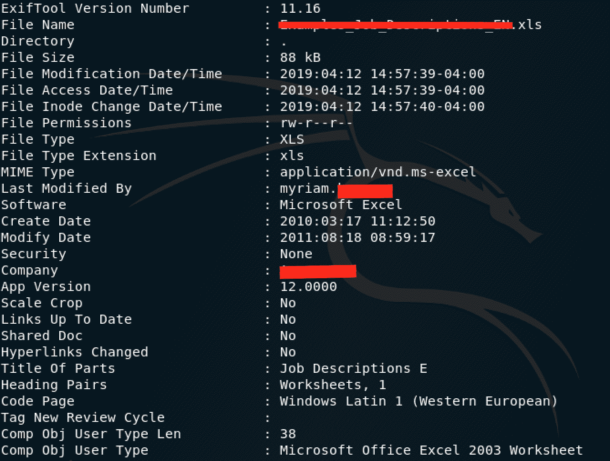
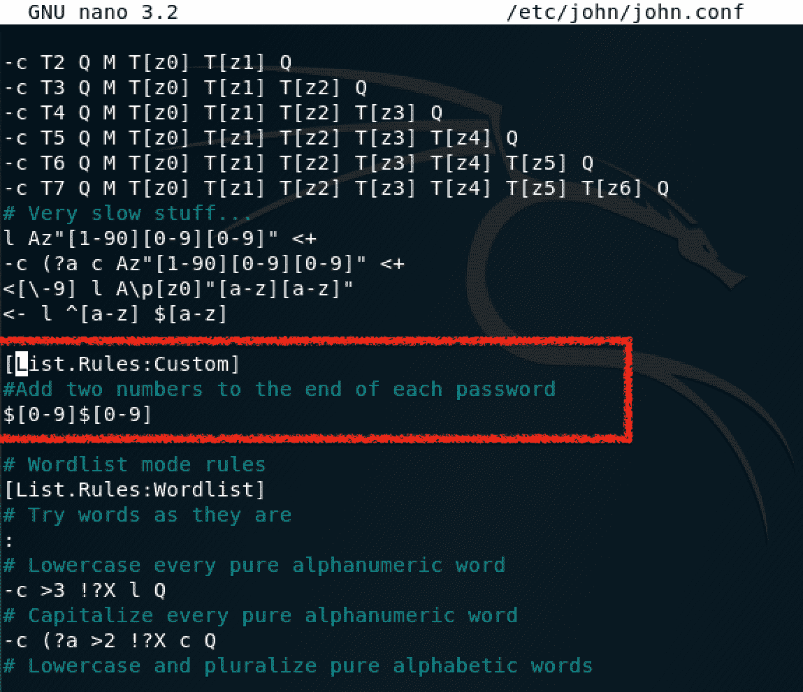
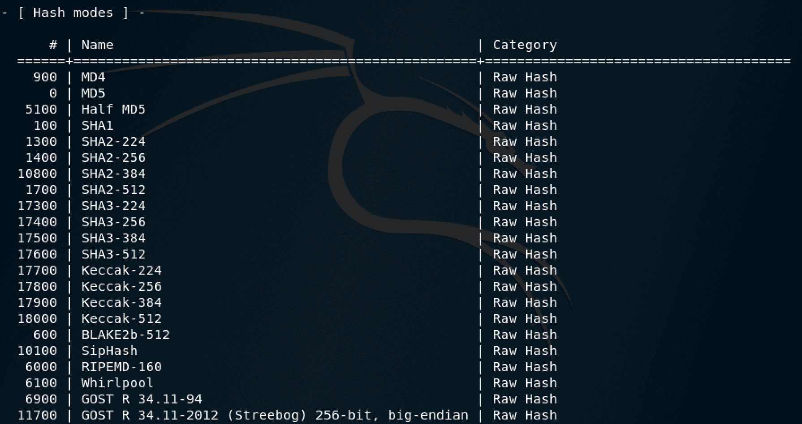
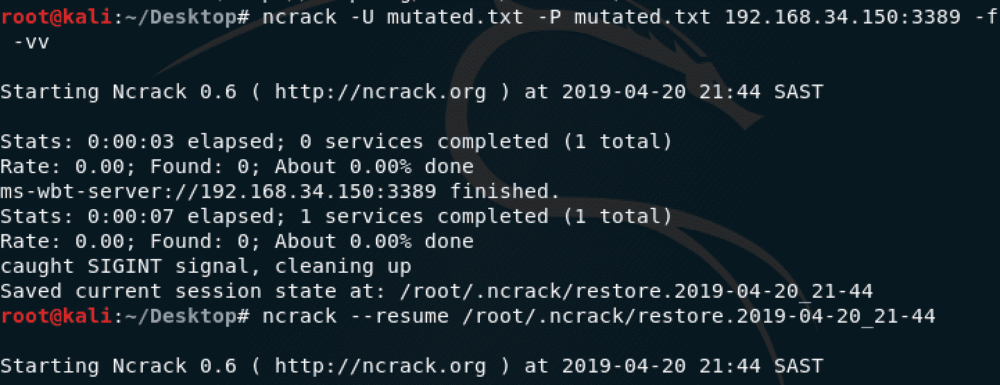
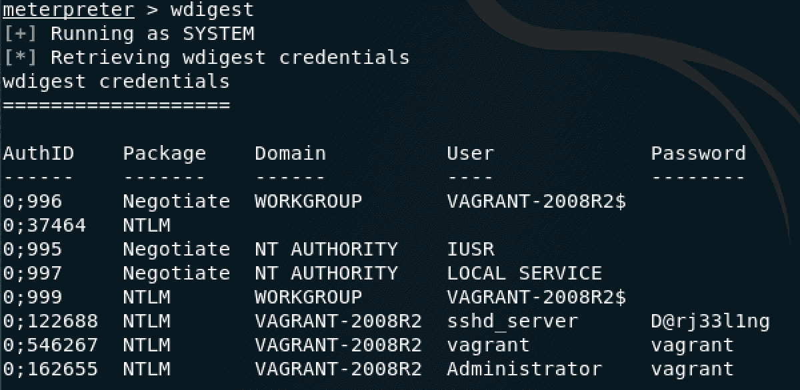

# 第六章：了解密码攻击

在密码分析中，密码破解可以被定义为通过使用其哈希对应物来恢复明文密码短语的过程。密码是我们日常生活的一部分；我们几乎在所做的一切事情中都使用它们。随着系统安全性的发展，以寻找各种加密密码的方法，可以破解它们的工具也在发展。

在本章中，您将受益于了解密码如何成为我们日常生活的一部分。您将学会查找、构建和定制单词列表的技能。您将学会如何利用单词列表，并在 Kali Linux 中使用各种密码破解工具。您将了解各种工具，以及它们在渗透测试中何时以及如何使用。

随着您在本章的学习，您将学到以下内容：

+   密码攻击简介

+   使用单词列表

+   离线密码破解

+   在线密码破解

+   从内存中转储密码

# 技术要求

本章需要以下技术要求：

+   Kali Linux 2019.1

+   Metasploitable 2 和 3 虚拟机

# 密码攻击简介

密码并不是什么新鲜事物。它们已经存在了几个世纪。例如，罗马军队使用密码来区分敌我。在 20 世纪 60 年代初，密码的概念被用于访问计算机系统和共享数据。目的是帮助保持个人文件对其他人的保密。从那时起，它成为了计算机安全的事实标准，无论是个人还是企业使用。在最初，保护密码并不是多大的问题。随着时间的推移，由于互联网的蓬勃发展，安全性变得更加重要，因为人们开始在互联网上存储敏感信息。

哈希和盐后来被引入以帮助密码的安全性。哈希对密码进行单向转换，实质上将密码转换为一串字符。盐是添加到密码中的唯一数据值，导致生成不同的哈希。比较简单哈希的密码和加盐哈希的密码将导致两个完全不同的哈希。

今天，用户名和密码是人们每天使用的组合。诸如计算机系统、移动设备、游戏机、平板电脑等设备都受到密码的保护。作为计算机用户，您可能有许多用途的密码，例如登录系统、访问电子邮件、数据库、网络、网站、应用程序和提升服务。

在渗透测试过程中，您经常会遇到密码作为最小的障碍。安全成熟度较高的企业仍然会有用户成为最薄弱的环节。正如我们在第四章*，掌握社会工程学*中所学到的，用户可以通过社会工程学来被利用。用户也是可以预测的，大多数人会使用容易预测的密码。

密码引入了一个不可分割的问题。较短的密码更容易记住，也更容易猜测。较长的密码更难破解，但也更难记住。增加复杂性后问题仍然存在。如果密码要求太复杂，用户最终会忘记它们，甚至更糟的是，写下来。这会引入诸如大量密码重置的问题，您可以通过社会工程学来利用。写下密码可以在走过建筑物时轻松注意到。现在，让我们考虑一下用户为多个在线服务（如亚马逊、Spotify、iTunes、Facebook 和 Instagram 等）使用密码的事实，列表还在继续。跟踪这么多密码很困难，导致许多人多次使用相同的密码。如果攻击者能够获得一个密码，这将引入一个重大问题，一切都可以被访问。

让我们看看如何利用各种方法来破解密码，有些情况下，您甚至不需要破解密码就可以使用服务。

# 使用单词列表

为了破解密码，您需要有一个可以尝试的凭据列表。您可以使用用户列表（仅包含用户名）、密码列表（仅包含密码）或结合两者的列表。

**用户列表**是包含用户名的列表。它可以通过对目标进行侦察来构建，或者在某些情况下，可能会为您提供进行渗透测试。如果您需要构建自己的**用户列表**，有一些问题需要考虑。目标是否使用`firstname.lastname`作为用户名？也许目标的用户名与其电子邮件地址相同？查找用户名的好方法是查看公开发布在互联网上的文件的元数据。您可以使用简单的 Google 查询来查找特定的文件类型，使用`filetype:`搜索字符串。

在第三章中，*执行信息收集*，我们看了如何使用 Google **dorks**进行信息收集。

在 Kali Linux 中，使用 Firefox ESR，并使用搜索字符串`filetype:xls`，我能够找到一些文档，其中包含可以给我提供用户名结构线索的详细信息*（如下面的屏幕截图所示）*。您可以使用诸如 ExifTool**之类的工具执行相同的分析。**ExifTool 是一个跨平台工具，支持多种文件格式。它很轻便，您可以从文件中获取大量信息。

要在 Kali Linux 中安装 ExifTool，您需要从终端窗口运行以下命令：

```
apt install libimage-exiftool-perl
```

安装后，您可以使用`exiftool [options] file`命令查询文件。要查看选项的完整列表，可以使用`man exiftool`命令，在终端中显示文档，如下面的屏幕截图所示：



图 1：使用 exiftool 提取元数据

在前面的屏幕截图中，我们能够确定这家特定公司的用户名结构是`name.surname`。我们可以使用 LinkedIn 进行进一步调查，以获取在该公司工作的员工名单，并从中生成用户名列表。

**密码列表**包含密码。您可以下载这些密码列表，甚至创建自己的密码列表。Kali Linux 包含一些密码列表，尽管这些列表不如您在互联网上找到的那些全面。

内置的单词列表位于`/usr/share/wordlists`，包含著名的`rockyou.txt`密码列表，如下面的屏幕截图所示：


图 2：Kali Linux 内置的单词列表

Kali Linux 中的一些工具有自己的单词列表；例如，工具**John the Ripper**在`/usr/share/John/password.lst`中有一个密码列表。

Metasploit 框架中有许多单词列表，位于`/usr/share/metasploit-framework/data/wordlists`中。

有许多在线资源可以获取密码列表。一些网站托管着不经常更新的旧密码列表。那些经常更新的位于 WeakPass（[`weakpass.com`](https://weakpass.com)）和 Seclists（[`github.com/danielmiessler/SecLists/tree/master/Passwords`](https://github.com/danielmiessler/SecLists/tree/master/Passwords)）等网站。可以使用`apt install seclists`命令在 Kali Linux 中安装 Seclists。这将把当前版本的密码列表下载到`/usr/share/seclists`路径中，如下面的屏幕截图所示：


图 3：Seclists 的密码列表

一些网站，如 CrackStation（[`crackstation.net/crackstation-wordlist-password-cracking-dictionary.htm`](https://crackstation.net/crackstation-wordlist-password-cracking-dictionary.htm)），托管着一个相当大的数据库，并提供在线哈希破解器。

# 密码概要

在规划渗透测试时，拥有一个专门针对目标的定制密码列表非常重要。拥有一个概要密码列表可以帮助渗透测试的成功，因为你可以省去使用通常非常广泛的公共单词列表所花费的时间。

定制密码列表并使其更具体于目标的一种方法是使用密码概要技术。密码概要涉及从您正在针对的组织中提取单词或短语，并将其包含在单词列表中，以提高找到有效密码的机会。

在第三章中，*执行信息收集*，我们对 Metasploitable 2 和 3 虚拟机进行了 Nmap 扫描。一些开放的服务包括 SSH（端口`22`）和 FTP（端口`21`）。在之前的第五章中，*深入研究 Metasploit 框架*，我们探讨了一些针对这些易受攻击的虚拟机的攻击。现在，我们将执行一些利用密码文件的攻击，但我们不会使用来自互联网的密码文件，其中包含成千上万个密码，而是构建一个经过概要处理的密码文件。

Kali Linux 带有一个名为**CeWL**的工具。CeWL 可以对给定的 URL 进行蜘蛛爬行，您可以指定深度，并返回可以使用的单词列表。CeWL 是可定制的，允许您指定单词的最小和最大长度，从文件的元数据中提取单词等等。

要构建与 Metasploitable 虚拟机相关的单词列表，可以使用[`github.com/rapid7/metasploitable3/wiki`](https://github.com/rapid7/metasploitable3/wiki)上提供的 wiki 页面。

使用以下命令，我们将生成用于密码暴力破解的单词列表。在命令中，我们定义了最小单词计数（`-m 7`）、蜘蛛深度（`-d 1`），然后我们指示 CeWL 将输出写入到名为`metasploitable-dict.txt`的桌面文件中（`-w`），如下所示：

```
cewl https://github.com/rapid7/metasploitable3/wiki -m 7 -d 1 –w /root/Desktop/metasploitable-dict.txt 
```

一旦命令完成，我们就有了一个当前包含 2,443 个单词的单词列表，如下面的屏幕截图所示：


图 4：CeWL 生成的单词列表

要对文本文件进行单词计数，可以使用`wc -w` [文件]命令。

现在，我们可以使用刚刚创建的单词列表进行测试。我们将运行单词列表针对 Metasploitable 3 虚拟机，以检查我们是否可以使用**服务器消息块**（**SMB**）协议访问它。这可以通过使用辅助模块`auxiliary/scanner/smb/smb_login`进行检查，具体步骤如下：

1.  从终端窗口中，使用`msfconsole`命令打开 Metasploit 框架。在运行`msfconsole`命令之前，请确保已启动 PostgreSQL 服务。

1.  使用`use auxiliary/scanner/smb/smb_login`命令加载辅助扫描器。

1.  接下来，我们将定义以下选项：

+   `SET RHOSTS [IP]`：在这里，您将定义 Metasploitable 3 虚拟机的 IP 地址。这可以使用`netdiscover -r [subnet]`或通过登录虚拟机并使用命令提示符窗口中的`ipconfig`命令来检查其 IP 地址来获取。

+   `SET USER_FILE [path]`和`SET PASS_FILE [path]`：在这里，我们定义了字典。使用**CeWL**生成的字典，我们定义的路径是`/root/Desktop/metasploitable-dict.txt`。

+   `SET STOP_ON_SUCCESS true`：这告诉扫描器一旦找到成功的凭据就停止扫描。

+   `SET VERBOSE false`：这将阻止扫描器在屏幕上显示输出。它只会显示成功的输出。

1.  一旦定义了选项，我们使用`run`命令运行扫描器。一旦找到成功的凭据，输出将显示如下截图所示：


图 5：Metasploit Framework SMB 登录扫描器的输出

Metasploit 将发现的凭据存储在其数据库中。可以使用`creds`命令访问凭据。

要记住的一个关键点是，您的字典越大，花费的时间就越长。通过使用配置文件字典，您可以减少寻找有效登录所花费的时间。

# 密码变异

用户经常以各种方式变异他们的密码。一些变异类型包括在密码末尾添加数字，交换字符，例如使用 3 代替“e”，使用大写字母等。

使用 John the Ripper，我们可以对密码列表执行变异。John the Ripper 附带一个包含许多预定义密码变异规则的广泛配置文件。此配置文件可以在`/etc/John/john.conf`中找到。

配置文件中定义为`[List.Rules:<name>]`的规则集，例如`[List.Rules:Wordlist]`或`[List.Rules:hashcat]`，还有很多。您可以使用简单的连接查询来查看各种当前规则：`cat /etc/john/john.conf |grep List.Rules`，如下截图所示：


图 6：John the Ripper 中当前规则集的片段

让我们执行一些变异。为了说明，我将创建一个名为`mutate-test.txt`的新文件，并在其中放入一个单词`password`，然后将其存储在桌面上。您可以使用 leafpad、nano 或您喜欢的文本编辑器来完成这个操作。

创建文件后，我们可以执行一些变异并观察输出。编辑`John.conf`文件，我根据以下截图添加了一个自定义规则集，名为`List.Rules:Custom`：



图 7：自定义规则变异

在这个自定义规则中，我告诉 John the Ripper 在每个密码的末尾添加两个额外的数字。以下是您可以在规则集中使用的常见命令列表：

+   `$`：这会在单词后附加一个字符或数字。在前面的自定义规则中，您会注意到我定义了一个由`0-9`表示的一组数字。这将在单词后附加`0`、`1`、`2`、`3`、`4`、`5`、`6`、`7`、`8`和`9`。您还可以附加一个单个字符；例如，使用命令`$9`将只在单词后附加`9`。

+   `^`：这会在单词前添加一个字符或数字。在这里，您可以根据前面的`$`命令定义范围。

+   `l`：这将所有字符转换为小写，`c`将它们转换为大写。

+   `t`：这会切换单词中所有字符的大小写。

让我们使用以下命令查看此规则的输出：

```
john --wordlist=/root/Desktop/mutate-test.txt --rules:Custom --stdout > mutated.txt
```

我们有一个名为`mutated.txt`的新文件，其中包含在`mutation-test.txt`中定义的单词的变异。`stdout`命令用于输出候选密码。请注意，`mutated.txt`文件的内容在主要单词末尾包含两个额外的字符，如前面的截图所示：


图 8：变异密码列表

当您使用密码变异时，您会发现一些规则比其他规则更有效。关键是找到适合您目标的方法，并知道您可以使用 John the Ripper 来执行密码变异。

# 离线密码攻击

离线密码攻击是一种在不被发现的情况下破解密码的方法。由于没有对活动服务进行暴力破解，因此被发现的风险要小得多。目标是获取密码的哈希版本并将其逆转回纯文本。不同的哈希算法输出不同位长度的哈希。由于哈希由十六进制数字组成，每个数字占四位，因此识别哈希位长度将涉及计算十六进制数字的数量并乘以四。

例如，哈希值`63640264849A87C90356129D99EA165E37AA5FABC1FEA46906DF1A7CA50DB492`包含 64 个字符。**64 x 4 = 256**。这告诉我们哈希的位长度为`256`位。在这个例子中，最常见的哈希算法输出`256`位哈希的算法是`SHA-256`。如果您有一个`128`位的哈希呢？在这里，有一些算法可以发挥作用，比如`MD2`、`MD4`、`MD5`和`RipeMD-128`。在识别您拥有的哈希时，您的直觉就发挥作用了。例如，如果您从 MySQL 数据库中提取了一个哈希，那么这个哈希很可能是一个`MD5`哈希。

幸运的是，有一些工具可以帮助您识别哈希，从而使您在进行手动计算时花费的时间大大减少。然而，知道如何计算哈希位长度并训练您的感知能力永远不会是浪费。

在当前版本的 Kali Linux（2019.1）中，有一个名为**Hash Identifier**的工具，它将尝试识别哈希。可以使用`hash-identifier`命令从终端窗口运行此工具。让我们尝试识别之前讨论的`SHA-256`哈希。请注意以下截图中的输出：


图 9：使用 hash-identifier 识别哈希

使用`hash-identifier`可以简化识别哈希的过程，因为识别出的哈希非常具体。

# John the Ripper

John the Ripper 既功能丰富又快速。它在一个程序中利用了几种破解模式，并且是完全可配置的（正如我们在密码变异中所见）。John the Ripper 可在多个平台上使用，这使得在多个系统上使用相同的破解程序变得容易。它默认包含在 Kali Linux 中。

John the Ripper 的一些特点如下：

+   哈希类型可以自动检测

+   跨平台支持

+   支持多种哈希算法

John the Ripper 的语法如下：

```
john [options] [password file]
```

现在我们已经确定了哈希算法，让我们尝试使用 John the Ripper 来破解这个哈希，采取以下步骤：

+   **步骤 1**：使用文本编辑器将哈希添加到文本文件中。我将文件命名为`sha256hash.txt`。

+   **步骤 2**：在终端窗口中运行以下命令：

```
john --format=raw-sha256 [filename] --wordlist=[wordlist path]. 
```

在我的示例中，我使用了`rockyou.txt`单词列表。因此，在我的环境中，完整的命令如下：

```
john --format=raw-sha256 sha256hash.txt --wordlist=/usr/share/wordlists/rockyou.txt
```

请注意以下截图中的输出：


图 10：使用 John the Ripper 破解 SHA-256 哈希

John the Ripper 将所有破解的密码存储在一个`john.pot`文件中，该文件位于您安装 John the Ripper 的位置。在 Kali Linux 2019.1 中，默认情况下，它位于`/root/.John/john.pot`，如下面的截图所示：


图 11：存储在 john.pot 文件中的破解密码。

让我们尝试破解我们从第五章*，深入 Metasploit 框架*中转储的哈希，使用 John the Ripper。从终端窗口，使用以下命令：

```
john --wordlist=/usr/share/wordlists/rockyou.txt --format=NT [filename] --rules=wordlist --pot=[filename].pot 
```

在这个命令中，我们定义要使用的单词列表（`rockyou.txt`）、要使用的规则集（`wordlist`）以及要存储破解的哈希的位置（`meta3.pot`）：


图 12：使用 John the Ripper 破解从 Metasploitable 3 获得的哈希

破解密码哈希有时可能非常耗时，在渗透测试期间时间紧迫时可能不可行。利用转储的密码哈希的另一种方法是使用用户名和 NTLM/LM 哈希的有效组合重新验证到远程系统。这种技术称为**传递哈希**（**PTH**），自 1997 年以来一直存在。

尽管我们只能破解三个密码，但我们仍然破解了一个特权帐户，即**管理员**帐户。如果我使用更复杂的单词列表和更复杂的规则在 John the Ripper 中，它可能会破解所有哈希。请记住，随着你增加更多的复杂性，破解密码所需的时间会稍长一些。

为了破解 Linux 系统上的帐户，您将需要以下两个文件：

+   `/etc/passwd`：包含用户信息

+   `/etc/shadow`：包含用户的相应密码哈希

在我们能够破解密码之前，这两个文件需要合并。这可以通过使用`unshadow`命令来完成，如下截图所示：


图 13：使用 unshadow 命令组合 passwd 和 shadow 文件

现在，我们可以使用以下命令将这个组合文件与 John the Ripper 结合起来：

```
john --wordlist=/usr/share/wordlists/rockyou.txt [filename] --pot=[potname] 
```

John 将开始破解 Linux 哈希的密码（如下截图所示）。请注意，在这种情况下，我们没有定义格式；John the Ripper 能够识别`哈希类型`并应用正确的破解算法，如下截图所示：


图 14：使用 John the Ripper 破解从 Metasploitable 2 获得的哈希

尽管在前面的截图中`root`密码没有被破解，但利用更复杂的单词列表和 John the Ripper 中的规则很可能会破解密码。

# Hashcat

Hashcat 是另一个离线密码破解工具，据称是世界上最快和最先进的密码恢复实用程序。它默认安装在 Kali Linux 中，并将 CPU 和 GPU 版本结合在一个程序中。

该程序支持多种哈希算法，具有用于破解密码的独特模式。Hashcat 支持多个平台，如 Windows、macOS 和 Linux。

Hashcat 的一些特点如下：

+   它支持多线程

+   多哈希支持（同时破解多个哈希）

+   多设备支持（在同一系统中利用多个设备）

+   多设备类型（在同一系统中使用混合设备类型）

+   它是基于多算法的（MD4、MD5、SHA1、DCC、NTLM、MySQL 等）

+   它使用专门的规则来扩展攻击模式

运行 Hashcat 的语法如下：

```
hashcat [options]... hash|hashfile|hccapxfile [dictionary|mask|directory]...
```

一些常用的选项如下：

+   `-m`使用哈希的编号定义哈希类型。例如，MD5 是编号 0，SHA1 是 100。

+   `-a`定义攻击模式。

+   `-o`定义输出文件。

Hashcat 中的攻击模式定义如下：

+   **字典攻击**：（也称为直接模式或攻击模式零），尝试给定列表中的所有单词。

+   **组合攻击**：（称为模式*1*），这将多个单词列表中的单词连接起来。

+   **暴力和掩码攻击**：（模式 3）尝试给定字符集中的所有字符。

+   **混合攻击：**（模式*6*和*7*）结合了单词列表和掩码，反之亦然。规则也可以与此攻击模式一起使用。

Hashcat 支持多种哈希算法；当您从终端窗口使用`hashcat -h`命令时，可以在`[Hash modes]`部分看到这些算法，如下截图所示。以下截图只是支持的哈希算法的一部分。当您在自己的实验室运行命令时，您将看到完整的列表。



图 15：Hashcat 支持的算法

如果您有 GPU，您可以真正利用 Hashcat 进行密码破解的能力。不幸的是，GPU 破解不在本书的范围内。

# 在线密码攻击

就像使用自动漏洞扫描器一样，我们可以利用工具自动尝试登录服务并找到有效的凭据。这些工具旨在自动化在线密码攻击，直到服务器响应有效的登录。在线密码攻击可以被定义为尝试通过暴力破解凭据登录到一个活动服务，直到发现有效的组合。

在线密码攻击的问题在于它们可能会很吵，触发警报。让我们来看一些常用的在线密码攻击工具。

# Hydra

Hydra 是一个非常快速和灵活的登录破解器。它支持可以轻松添加的模块。它为许多协议和服务提供了强大的身份验证暴力破解。

Hydra 的语法如下：

```
hydra [username options] [password options] [options] [IP address] [protocol] -V -f
```

以下是一些可用的选项：

+   `-l`表示一个单一的用户名。

+   `-L`定义用户名列表。

+   `-p`定义一个单一的密码。

+   `-P`定义密码列表。

+   `-t`用于限制并发连接。

+   `-V`告诉 Hydra 显示详细输出。

+   `-f`用于在正确登录时停止。

+   `-s`用于定义一个端口。

+   `-x`利用暴力破解模式。例如，`-x 5:8:A1`生成长度为 5 到 8 个字符的密码，包括大写字母和数字。

Hydra 支持多种服务，其中一些包括`ssh`、`smb`、`smtp[s]`、LDAP、http/s、Telnet 和 MySQL。

让我们利用 Hydra 攻击 Metasploitable 2 虚拟机上的服务。

在第三章*，执行信息收集*中，我们对 Metasploitable 2 虚拟机进行了 Nmap 扫描。我们发现的其中一个服务是`ftp`端口`21`。使用我们之前生成的密码列表，我们可以使用 Hydra 来进行在线密码攻击。

从 Kali Linux 的终端窗口，我们使用以下命令：

```
hydra -L [username file] -P [password file] [IP address] [service] -f
```

在这个命令中，我们定义了一个`用户名`和`密码`列表。您会注意到在我的例子中，我使用了相同的文件。如果您有一个专门的`用户名文件`，您可以利用它。我们要攻击的服务是`ftp`，我们希望 Hydra 在找到有效登录后停止，所以我们使用了`-f`选项，如下截图所示：


图 16：使用 Hydra 对 Metasploitable 2 的 FTP 服务进行暴力破解登录

Hydra 有恢复取消扫描的能力。在以下截图中，您会注意到我使用了一个更大的密码列表，并故意使用了*Ctrl* + *C*键序列取消了扫描。请注意 Hydra 写下的以下消息。Hydra 创建了一个`hydra.restore`文件，可以用来恢复会话：


图 17：Hydra 恢复功能

重要的是要记住，大多数服务都配置为在一定数量的登录尝试失败后锁定帐户。这是被目标的 IT 人员注意到的一种方式。当登录尝试迅速连续发生时，入侵防范设备也可能发挥作用。关键是要减慢对服务的密码尝试次数。然而，这会花费您时间。

Hydra 是您应该在渗透测试工具包中拥有的工具。它能够运行大量的用户名、密码和目标列表。可以使用各种标志对其进行调整，以适应渗透测试中可能遇到的情况。

# Medusa

Medusa 声称是一个快速、并行和模块化的登录暴力破解工具。它支持许多允许远程认证的服务。

以下是 Medusa 的一些关键特性：

+   **并行测试**：这提供了同时针对多个主机、用户或密码进行测试的能力。

+   **可变用户输入**：这提供了以各种方式指定目标信息的能力。例如，您可以使用包含主机列表的文件，或者可以在命令中定义单个主机。

+   **模块化设计**：模块存在为独立文件（`.mod`）。如果需要对模块进行任何更改，核心应用程序无需修改。

+   **支持多种协议**：与 Hydra 类似，Medusa 支持广泛的应用程序，包括`smtp`、`http`、`pop3`和`sshv2`。

以下是 Medusa 提供的一些选项：

+   `-h`定义目标主机名或 IP 地址。

+   `-H`指定包含多个目标的文件。

+   `-U`指定包含用户名的文件。

+   `-P`指定包含密码的文件。

+   `-g [num]`定义 Medusa 放弃尝试连接的秒数。

+   `-r [num]`定义重试尝试之间的秒数。

+   `-M`指定将使用的模块的名称。请注意，这是没有`.mod`扩展名的。

+   `-m`定义传递给模块的参数。

+   `-Z`定义了您想要恢复的先前扫描。

Medusa 支持多个模块。可以使用终端窗口中的`medusa -d`命令查看当前支持的模块列表，如下面的屏幕截图所示：


图 18：Medusa 支持的模块列表

Medusa 的语法如下：

```
medusa [-h host|-H file] [-u username|-U file] [-p password|-P file] [-C file] -M module [OPT]
```

让我们使用 Medusa 执行 FTP 攻击，就像我们用 Hydra 一样。使用的命令如下：

```
medusa -U [username file] -P [password file] -h [host IP address] -M [module] [options]
```

在这里，我正在使用相同的文本文件作为`用户名`和`密码`。正在使用的模块是`ftp`，我希望 Medusa 在第一次匹配时停止使用`-f`选项，如下面的屏幕截图所示：


图 19：使用 Medusa 进行 FTP 暴力破解

Medusa 有恢复取消扫描的能力，如下面的屏幕截图所示。可以使用`-Z [唯一代码]`命令恢复这些扫描：


图 20：Medusa 恢复功能

Medusa 是另一个应该在您的渗透测试工具包中的工具。它灵活，并支持与 Hydra 相比不同的协议集。

# Ncrack

Ncrack 是一个强大而快速的密码破解工具，专注于依赖认证的基于网络的服务。它被设计为模块化，利用命令行语法，如果您熟悉 Nmap 的语法，这并不陌生。您可以将使用 Nmap 执行的扫描集成到 Ncrack 中。Ncrack 支持的协议包括`ssh`、`rdp`、`ftp`、`telnet`、`http/s`、`smb`等等。

Ncrack 已包含在 Kali Linux 中，因此无需安装，因为它可以直接使用。Ncrack 的语法如下：

```
ncrack [Options] [target:service specification/port number]
```

以下是 Ncrack 提供的一些选项：

+   `-cl`定义最小并发并行连接数。

+   `-CL`定义最大并发并行连接数。

+   `-at`定义每个连接的认证尝试次数。这是避免帐户锁定的好方法。

+   `-U`指定用户名文件。

+   `-P`指定密码文件。

+   `-iX`定义从 Nmap XML 输出文件（Nmap 中的`-oX`开关）输入的文件。

+   `-iN`定义从 Nmap 正常输出文件（Nmap 中的`-oN`开关）输入的文件。

+   -`iL`定义主机或网络列表。

要显示 Ncrack 支持的当前模块列表，可以运行`ncrack -V`命令，如下面的截图所示：


图 21：Ncrack 支持的模块

由于 Ncrack 具有执行暴力破解攻击的能力，让我们对 Metasploitable 3 虚拟机执行此攻击。使用以下命令：

```
ncrack -U [username file] -P [password file] IP:service -f -vv
```

在这个命令中，我正在使用相同的文件来存储用户名和密码。我正在使用`-f`选项来在匹配时停止，`-vv`用于增加详细输出，如下面的截图所示：


图 22：使用 Ncrack 攻击 Metasploitable 3 的 RDP 服务

在使用 Ncrack 执行 RDP 暴力破解登录时，Metasploitable 3 虚拟机会话被锁定。这是在进行渗透测试时需要牢记的事情。如果活动用户或管理员正在使用系统并且他们的会话被锁定，这肯定会引起警报。

如果您终止扫描，Ncrack 可以通过保存还原文件来恢复当前会话，如下面的截图所示*。*可以使用`ncrack --resume [filename]`命令来恢复此扫描：



图 23：恢复 Ncrack 会话

您在渗透测试中尝试暴力破解的协议将决定您将使用的工具。在某些情况下，您可能可以选择多个工具，您的选择可能取决于工具本身的速度。加快暴力破解攻击的常见选项是增加登录线程的数量。在某些情况下，例如 RDP 和 SMB，由于协议相关的限制，这可能是不可能的。

另一个要考虑的因素是协议认证协商。例如，RDP 等协议的认证协商比 HTTP 更耗时。然而，如果您成功地暴力破解了 RDP 协议，您的回报通常会更大，因为这可能会导致更高特权的附加哈希。使用在线工具进行暴力破解的技巧在于在发起攻击之前仔细选择目标、用户列表和密码文件，并且要有直觉。

# 从内存中获取密码

破解密码确实可以很有趣，但从受损主机的内存中获取密码要快得多。这将使您快速访问凭据，从而可以提升权限或在环境中横向移动。一些系统可能配置了`wdigest`认证，这将为您提供明文密码，而其他系统可能更安全，您可以利用它们进行哈希传递攻击。

让我们来看看从内存中获取密码的一些可能性。我们将利用前一章学到的知识（第五章*，深入了解 Metasploit 框架)*，并对 Metasploitable 3 虚拟机执行`eternalblue`漏洞利用。对于有效载荷，我们将利用`meterpreter` shell，如下面的截图所示：


图 24：EternalBlue 漏洞利用中使用的选项

一旦我们建立了`meterpreter`会话，我们可以利用 Metasploit 框架的内置工具，或者使用诸如**Mimikatz**或**Windows 凭据编辑器**之类的工具。从`meterpreter`会话中使用 Mimikatz 不会加载任何内容到远程系统（不会触及磁盘）。这种方法的美妙之处在于它更难以检测，因为没有任何内容被写入磁盘。使用**Windows 凭据编辑器**（**WCE**）这样的工具需要我们将工具上传到远程系统，然后从内存中获取凭据。由于这涉及向远程系统磁盘写入，因此检测的可能性更大。

在 Metasploit 中内置了从`meterpreter`会话中使用`msv`命令获取内存中的哈希的功能。您将在以下截图中注意到，我们已经从当前用户的内存中转储了`LM`和`NTLM`哈希：


图 25：使用 Metasploit 转储 MSV 哈希

我们下一个选择是从内存中转储 Kerberos 凭据。这可以使用`meterpreter`会话中的`kerberos`命令来完成，如下截图所示。

请注意，我们能够获取明文凭据：


图 26：使用 Metasploit 转储 Kerberos 凭据

使用`wdigest`命令也是可能的，如下截图所示。这是可能的，因为正在使用的身份验证协议是`wdigest`，这是不安全的：



图 27：使用 Metasploit 转储 wdigest 凭据

从`meterpreter`，我们能够利用 Mimikatz。Mimikatz 是为了演示 Microsoft 操作系统使用的身份验证协议的漏洞而创建的。它是最广泛使用的黑客工具，拥有大量功能，并且不断更新。

可以使用`meterpreter`会话中的`load mimikatz`命令加载 Mimikatz。加载后，您可以使用`mimikatz_command -f`命令对 Mimikatz 进行管道命令。

要转储受损主机的哈希值，您可以使用`mimikatz_command -f samdump::hashes`命令，如下截图所示。注意，如果您想对其进行离线密码破解，可以复制**新技术局域网管理器**（**NTLM**）哈希：


图 28：在 Meterpreter 中使用 Mimikatz 转储 SAM 数据库中的哈希

您可以使用`mimikatz_command -f sekurlsa::searchPasswords`命令从内存中提取密码，如下截图所示：


图 29：使用 Mimikatz 从内存中提取密码

利用`meterpreter`的灵活性，您可以`上传`文件，例如 Windows 凭据编辑器。这将允许您从内存中转储密码，如下所示：


图 30：使用 Windows 凭据编辑器从内存中转储凭据

能够从内存中转储密码可能会非常有益，特别是如果第一次就获得了高特权帐户。

# 摘要

密码是我们每天都在使用的东西，了解如何破解密码可以帮助成功进行渗透测试。请记住密码安全性的权衡；密码越复杂，人们绕过它的机会就越大。密码重复使用是人们常犯的一个缺陷，因此您可能会发现，某个终端用户的在线服务密码与其企业网络用户帐户的密码相同。在用于破解密码的所有工具中，都支持限制暴力攻击尝试。此功能使您能够将暴力攻击与日常流量混合在一起，最终减少锁定。

在本章中，您已经了解了密码的历史。我们看了一下如何从公开文件中发现暴露元数据的用户名。您已经了解了可以获取密码和用户列表的在线资源。您学会了如何在密码配置文件中使用您的感知能力，以及如何创建配置文件密码列表。我们研究了密码变异，以及如何使配置文件密码列表更适合您的目标。我们深入研究了离线密码攻击以及如何使用各种工具来破解密码哈希。在在线密码攻击部分，我们看了如何使用各种工具对利用身份验证的网络服务进行暴力攻击。

在下一章（第七章《使用 Burp Suite》）中，我们将学习如何在渗透测试中使用 Burp Suite。我们将使用 Burp Suite 的各种模块，并对 Web 服务器进行各种攻击。

# 问题

1.  获取用户名的一种方式是什么？

1.  密码分析的好处是什么？

1.  什么工具可以用于密码变异？

1.  在线和离线密码攻击有什么区别？

1.  从内存中转储凭据时应该记住什么？
