# 第七章：使用 Burp Suite

Burp Suite 是一款广泛使用的基于 Java 架构的 Web 应用程序渗透测试工具，有免费和付费版本。它可以在 Windows、Linux 和 macOS 等多个平台上使用。Burp Suite 用于识别漏洞和验证 Web 应用程序攻击向量。它拥有丰富的功能，是一个非常受欢迎的综合工具，有很多关于它的书籍。

在本章中，您将了解 Burp Suite 和各种版本。我们将重点介绍版本之间的差异以及如何获取专业版的试用许可证，该许可证用于本章中的演示。您将准备您的环境，以便在您自己的实验室中复制演示。最后，我们将研究 Burp Suite 提供的工具，并了解渗透测试人员如何使用这些工具。通过使用易于跟随的实际示例，您将对这些工具有很好的理解。

在本章中，我们将涵盖以下主题：

+   介绍 Burp Suite

+   准备您的环境

+   Burp Suite 的要点

# 技术要求

要跟随本章中的示例和说明，请确保您具有以下内容：

+   Kali Linux 2019.1

+   Burp Suite 专业版（撰写本文时为 v1.7.37）

+   **开放 Web 应用程序安全项目**（**OWASP**）**破损 Web 应用程序**（**BWA**）项目版本 1.2.7

+   Metasploitable 2

# 了解 Burp Suite

Burp Suite 类似于拦截代理。在对目标 Web 应用程序进行渗透测试时，可以配置 Burp Suite，使所有流量都通过其代理服务器路由。这使 Burp Suite 可以充当中间人攻击，捕获和分析与 Web 应用程序之间的每个 Web 请求。这使渗透测试人员可以利用暂停、操纵和重放请求等功能，以发现目标 Web 应用程序中的潜在注入点。这些注入点可以手动定义，也可以通过自动模糊技术定义。

模糊测试是一种软件技术，通过使用畸形或半畸形的数据包以自动化的方式发现实现错误。

Burp Suite 目前有三个版本可用：

+   社区版：这是默认与 Kali Linux 一起提供的免费版本。

+   专业版：这是一个付费版本，在撰写本文时每年每用户费用为 399 美元。

+   企业版：这个版本是为企业设计的。根据 PortSwigger 的网站（https://portswigger.net/）在撰写本文时的起价为 3999.00 美元/年。这个版本不在本书的范围内。

在本书中，我们将使用专业版。PortSwigger 提供了 Burp Suite 专业版的免费试用。您只需提供有效的公司名称和公司电子邮件地址即可申请试用许可证。

社区版和专业版之间的区别在于功能。社区版对 Intruder 功能有限制，通过强制限制线程。社区版不包括任何扫描功能或内置有效负载。当然，您可以将自己的有效负载加载到社区版中。需要专业版的插件在社区版中无法使用。社区版只允许您创建临时项目，因此无法将项目保存到磁盘。社区版只包括基本的手动工具，而专业版包含基本和高级的手动工具。

要了解不同版本之间的差异，请访问 https://portswigger.net/burp，该网站将解释差异并显示每个版本的当前价格。

# 准备您的环境

为了测试 Burp Suite 的功能，我们需要准备我们的环境。有许多有意设计易受攻击的 Web 应用程序。这些是专门用于学习目的创建的，它们非常好。随着您在 Burp Suite 中掌握技能，我鼓励您查看各种易受攻击的 Web 应用程序，这些应用程序是专门创建和发布的。一个很好的资源，可以找到在线和离线版本的易受攻击的 Web 应用程序软件，就是 OWASP。

OWASP 维护着一个**易受攻击的 Web 应用程序目录项目**，可以在[`www.owasp.org/index.php/OWASP_Vulnerable_Web_Applications_Directory_Project#tab=Main`](https://www.owasp.org/index.php/OWASP_Vulnerable_Web_Applications_Directory_Project#tab=Main)找到。

# 安装 Burp Suite 专业版

在我们开始渗透测试之前，我们需要安装 Burp Suite。默认情况下，Kali Linux 2019.1 附带了 Burp Suite 的社区版。在本书中，我们将使用专业版的免费试用版。

请注意，在撰写本文时，最新的稳定版本是 v1.7.37。如果您使用任何测试版，界面将与本书中打印的屏幕截图不同。

让我们走一遍获取 Burp Suite 专业版试用许可证所需的步骤：

1.  导航至[`portswigger.net/requestfreetrial/pro`](https://portswigger.net/requestfreetrial/pro)。

1.  根据表格要求填写您的详细信息。请注意，您需要输入公司电子邮件地址，因此来自 Gmail、Outlook 和其他邮箱的个人电子邮件地址将无法使用。

1.  您将收到一封带有登录详细信息的电子邮件，您将使用该信息登录下载门户。一旦您登录到您的帐户，您就可以继续下载许可文件。我正在使用普通的`jar`文件，因为我可以运行这个独立的应用程序，而无需安装它，如下面的屏幕截图所示：

图 1：Burp Suite 专业版的下载选项

1.  下载文件后，您可以在 Kali Linux 终端窗口中使用`java -jar [filename]`命令启动 Burp Suite 专业版。在第一次启动期间，它将要求您提供许可密钥并继续激活许可。

如果您想配置分配给 Burp Suite 的内存量，可以使用`-Xmx`命令开关，例如`java -jar -Xmx2048m [filename]`。

# 设置 OWASP BWA

BWA 项目创建了一个包含已知漏洞的多个应用程序的虚拟机。该项目是为那些有兴趣学习以下内容的人创建的：

+   Web 应用程序的安全

+   各种手动测试技术

+   各种自动化测试技术

+   如何使用工具进行源代码分析

+   了解 Web 攻击的影响

+   如何测试 Web 应用程序防火墙和类似工具

OWASP BWA 项目的直接链接是[`www.owasp.org/index.php/OWASP_Juice_Shop_Project`](http://sourceforge.net/projects/owaspbwa/files/)。

下载 BWA 虚拟机后，您需要使用诸如 7-Zip 之类的程序对其进行提取。下图中显示的 BWA 文件是虚拟机文件，可以导入到 VMware Workstation 或 VirtualBox 中：

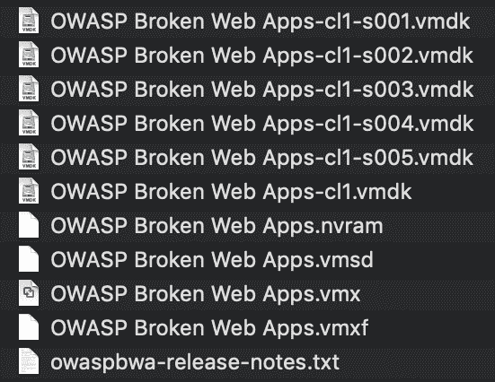

图 2：提取的 BWA 文件

将文件导入 VMware Workstation 非常简单。您只需要打开或导入`.vmx`文件。对于 VirtualBox，我们需要执行一些额外的步骤：

1.  打开 VirtualBox 并创建一个新的虚拟机。为虚拟机定义一个名称，然后选择 Linux Ubuntu（32 位）作为操作系统类型。

1.  继续使用向导，但当涉及硬盘组件时，选择使用现有的虚拟硬盘文件，而不是创建新的硬盘。在这里，您将选择 BWA 虚拟硬盘（`OWASP Broken Web Apps-cl1.vmdk`），如下面的屏幕截图所示：

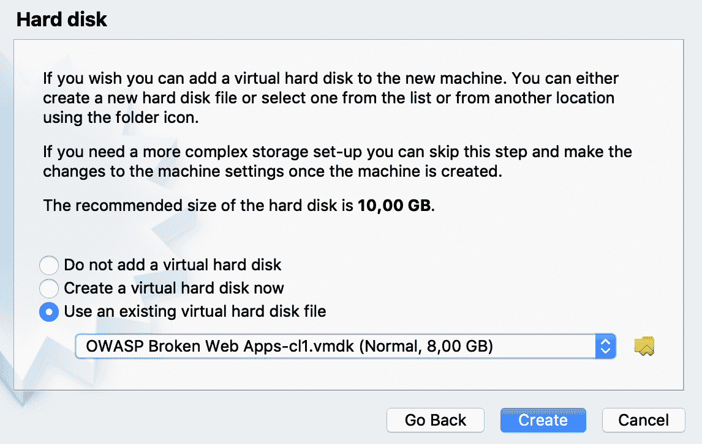

图 3：导入 BWA 虚拟硬盘

1.  单击“创建”以创建虚拟机。您可以根据需要调整处理能力和内存，但默认设置应该足够。

1.  确保您为这台虚拟机使用主机模式或网络地址转换（NAT）网络配置。不要直接将其暴露在公共互联网上，因为这台虚拟机是有意设计成易受攻击的。

1.  虚拟机启动后，它将提供可用于访问它的 IP 地址，如下截图所示：

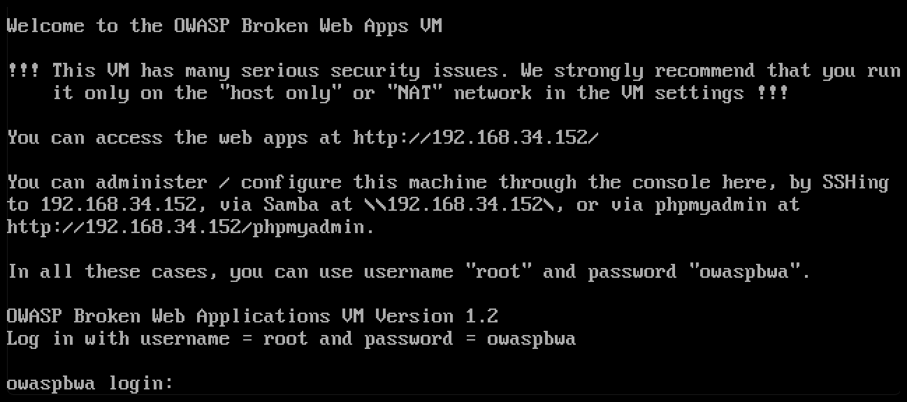

图 4：BWA 虚拟机信息

一旦您启动了 BWA，您会注意到它会提供有关如何通过 Web 浏览器和 SSH 访问它的信息。

# 配置您的浏览器

由于 Burp Suite 依赖于代理工具来执行其所有功能，因此您需要配置浏览器以使用代理。在 Kali Linux 2019.1 中，默认包含 Firefox ESR（Extended Support Release）。配置浏览器的代理设置很简单，但每次都必须手动更改代理设置可能会令人沮丧。

Firefox ESR 有一些代理管理插件。我个人喜欢使用 FoxyProxy（[`addons.mozilla.org/en-US/firefox/addon/foxyproxy-standard/`](https://addons.mozilla.org/en-US/firefox/addon/foxyproxy-standard/)），因为它提供了定义多个代理并通过 Firefox 的插件按钮进行切换的功能：

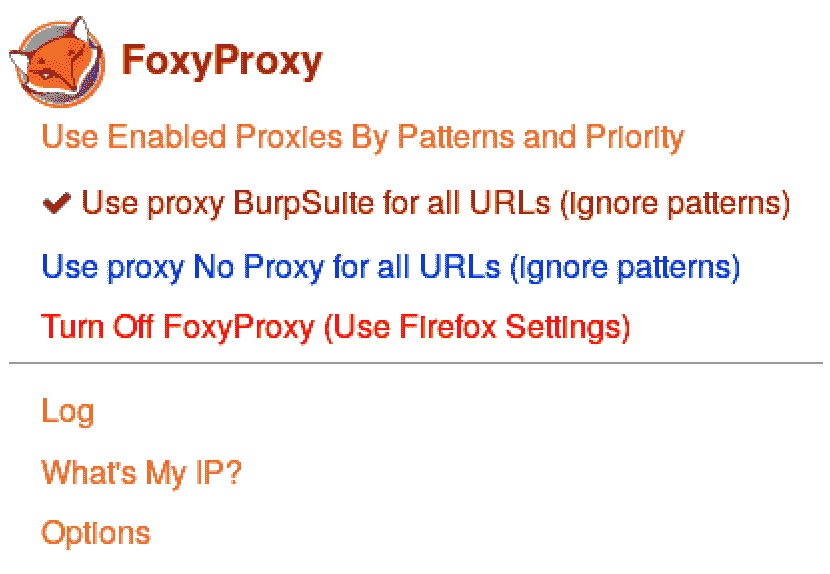

图 5：FoxyProxy 配置了多个代理

添加新代理就像点击“选项”并添加新代理一样简单。在下一节中，我们将介绍如何添加代理。

# 探索和配置 Burp Suite 组件

Burp Suite 拥有各种工具，可帮助渗透测试人员在整个 Web 应用程序测试过程中使用。这些工具使渗透测试人员能够映射环境，进行漏洞扫描并利用漏洞。

Burp Suite 有一个简单的图形界面，包含两行标签和各种面板（*图 6*）。第一行标签（**1**）是当前安装的工具。第二行标签是主要工具的子组件（**2**），在该子组件中，有各种面板（**3**）：

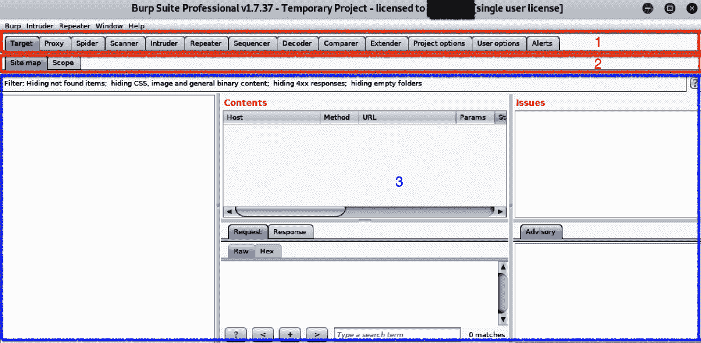

图 6：Burp Suite 的界面

*图 6*中的示例显示了“目标”主工具被选中，并且“站点地图”子组件被选中。在该子组件中，有多个面板，如“内容”和“问题”。

# Burp Suite 工具

现在让我们使用 Burp Suite 中的各种工具，并在攻击之前的部署的 OWASP BWA 项目中使用它们。

当您启动 Burp Suite Professional 时，在磁盘上创建一个新项目（*图 7*），这样您就可以随时查看结果。您可以使用 Burp Suite 默认的配置文件：

图 7：Burp Suite 的新项目

现在我们已经启动了我们的项目，我们可以深入了解工具并学习如何使用它们。

# 代理

这是 Burp Suite 的核心，允许您创建一个拦截代理，可在您的浏览器和目标 Web 应用程序之间进行操作。您可以使用此工具拦截、检查和修改所有请求和响应。

要配置代理选项，您需要访问代理工具并选择“选项”选项卡，如下截图所示：

图 8：代理工具中的代理监听器选项

`代理监听器`部分是您定义代理详细信息的地方。默认配置对我们将执行的活动足够。值得启用的另一个配置项位于代理选项的响应修改部分。此设置标题为`取消隐藏的表单字段`，如下截图所示：

图 9：启用取消隐藏的表单字段

隐藏的 HTML 表单是通过客户端进行表面不变的数据传输的常见机制。如果标记为隐藏，则该字段不会显示在屏幕上。但是，字段的名称和值存储在表单中，并在用户提交表单时返回给应用程序。Burp 代理可用于拦截提交表单的应用程序并更改值。

在 Firefox ESR 中配置如下：

1.  打开 Firefox ESR 并导航到首选项：

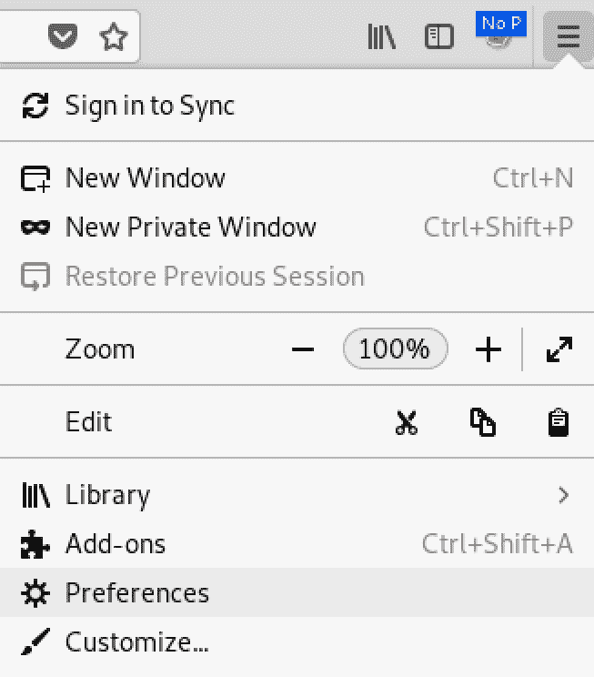

图 10：导航到 Firefox 首选项

更快的导航到首选项的方法是在 Firefox ESR 中导航到`about:preferences`URL。

1.  一旦您进入首选项，搜索`代理`并单击`设置`按钮。

1.  一旦进入代理设置，您可以根据以下截图定义 Burp Suite 代理：

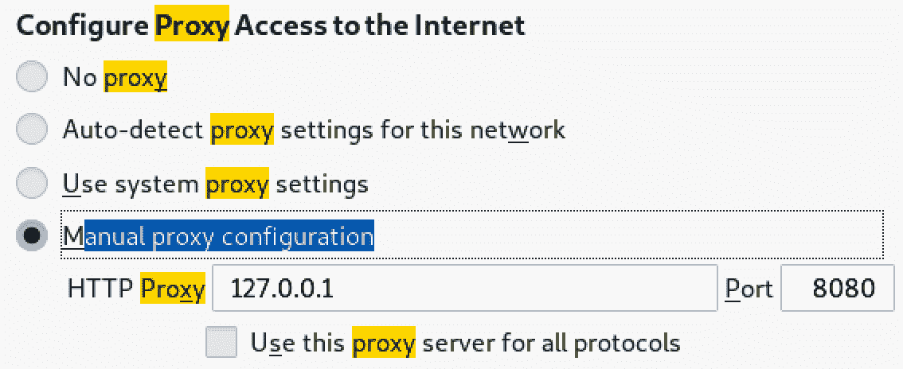

图 11：在 Firefox ESR 中定义 Burp Suite 代理

在上一节中，我们提到这种方法有时会变得令人沮丧，因为有时您需要在不使用 Burp Suite 代理的情况下浏览。

要在 FoxyProxy 等附加组件中配置 Burp Suite 代理，我们只需定义代理设置（*图 12*），保存配置后，您将能够在代理设置之间切换：

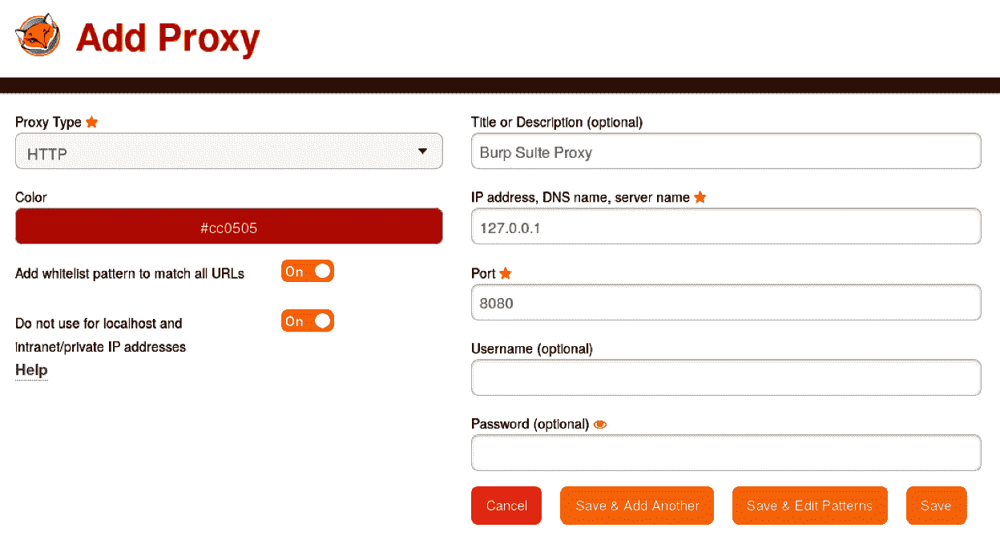

图 12：将 Burp Suite 代理添加到 FoxyProxy

现在我们已经设置和配置了代理，让我们继续下一个工具，我们将在其中定义目标并执行诸如绘制站点地图等活动。

因为 Burp Suite 中的代理作为拦截代理工作，所以当您浏览 URL 时，必须转发请求。如果不转发请求，URL 将无法在浏览器中加载。

# 目标

该工具提供有关目标应用程序的内容和工作流程的详细信息。它协助您引导测试过程。在此工具中，可以手动绘制目标站点（或使用集成的爬虫），并在绘制应用程序后修改范围。

我们将把目标定义为 BWA 虚拟机的主 IP 地址。例如，根据上一节的截图，我的 BWA 虚拟机的 IP 地址为`192.168.34.152`。

可以使用以下步骤定义目标：

1.  单击`目标`工具，然后选择`范围**。**

1.  在`目标范围`部分下单击`添加`，并输入 BWA 虚拟机的 IP 地址。

1.  Burp Suite 将提示您注销范围外的项目。在这种情况下，我们不想记录它们，因此选择`是`，以便 Burp Suite 不会将范围外的项目发送到其他工具：

图 13：在 Burp Suite 中定义目标

1.  一旦您将目标范围定义为 BWA 虚拟机 IP 地址，打开 Firefox 并导航到 BWA 虚拟机的 URL，例如`http://192.168.34.152`。您会注意到，在`代理`工具中不转发请求（*图 14*）的情况下，网页将无法加载：

图 14：使用代理工具转发请求

1.  一旦您转发了请求，BWA 主页将加载。在目标工具下的站点地图（*图 15*）中，您现在将拥有目标 Web 应用程序的完整站点地图：

图 15：基于定义的目标填充的站点地图

左侧树视图中包含内容的分层表示，URL 被分成域、目录、文件和参数化请求。要查看更多细节，您可以展开有趣的分支。如果您选择了树的一个或多个部分，右侧视图中子分支中的所有项目将显示相关的详细信息。右侧视图包含从树视图中选择的分支的内容的详细信息以及分支中识别的任何问题。

# 扫描器

这个工具在 Burp Suite 的专业版中可用。它提供了高级的 Web 漏洞扫描功能，具有自动爬行功能来发现内容。

利用扫描功能就像右键单击要扫描的分支，然后选择主动或被动扫描功能一样简单，如*图 16*所示：

图 16：启动扫描功能

有两种类型的扫描可以执行，主动和被动。以下详细介绍了两者之间的区别：

+   **被动扫描**：这种类型的扫描只是分析和检测现有请求和响应内容中的漏洞。使用这种扫描，您将能够限制对 Web 应用程序的噪音量。这种类型的扫描能够检测许多漏洞，因为许多漏洞可以使用被动技术来检测。

+   **主动扫描**：这种类型的扫描提交了许多定制的请求，并分析结果以寻找漏洞。主动扫描可以识别更广泛的漏洞，对于进行全面的应用程序测试是必不可少的。请记住，这种扫描将导致向应用程序发送更多的噪音。

以下图片显示了扫描器检测到的问题的输出：

图 17：主动扫描检测到的问题

打开问题会提供有关问题的更多信息，包括受影响的主机、路径、严重程度和信心水平，如*图 18*所示：

图 18：问题详情

扫描的每个结果都包含详细的建议，通常包括与特定漏洞相关的定制信息和适当的修复说明。每个结果还将包括报告问题的完整请求和响应，其中相关部分将被突出显示。这些请求可以像往常一样传输到其他 Burp 工具，以检查问题或进行进一步测试。

# Repeater

这用于手动操作和重新发出 HTTP 请求。一旦发送这些手动请求，您就能够分析响应。您可以从 Burp Suite 的任何位置向 Repeater 发送请求。

让我们使用 Repeater 进行登录操作：

1.  关闭 Burp Suite 代理 Firefox ESR，导航到 BWA 主页，然后单击 OWASP Mutillidae II。

1.  在左侧导航中，选择 OWASP 2007 | OWASP 2007 A6 – 不当的错误处理 | 登录(*图 19*)。这将带您到登录页面：

图 19：OWASP A6 – 不当的错误处理

1.  启用 Burp Suite 代理拦截。一旦启用，尝试使用任意随机凭据登录。在 Burp Suite 的代理工具中，您将看到登录请求被拦截。右键单击请求，然后选择“发送到 Repeater”。*在我的示例中，您将看到我使用了一个随机的`username`为`testing`和一个`password`为`test-user`，如*图 20*所示：

图 20：Burp Suite 代理工具拦截的登录请求

1.  点击**Repeater**工具，在左侧，您将看到拦截的登录请求。点击 Go 并观察结果。注意，Loggin-In-User 字段为空，如下图所示。如果单击 Render 选项卡，您将看到没有用户已登录。这告诉我们，我们使用的随机`username`不存在：

图 21：使用 Repeater 重放 HTTP 请求

从这里开始，我们可以修改初始请求中的任何参数。您可以尝试各种`username`和`password`并观察结果。为了演示目的，我们将使用常见的 SQL 注入技术（SQL 注入将在第八章中更详细地介绍，攻击 Web 应用程序）。

1.  在`username=`字段中，删除最初使用的随机用户名，并输入`' or 1=1 --` SQL 注入命令。点击 Go 并观察输出（*图 22*）。注意`Set-Cookie`参数现在设置为`username=admin`，Logged-In-User 设置为`admin`。这告诉我们，通过使用`' or 1=1 --`作为用户名和任何密码，我们能够执行 SQL 注入攻击并以管理员身份登录：

图 22：使用 Repeater 执行 SQL 注入攻击查询

如果您使用 Render 选项卡，您将看到已登录的用户是`admin`。

Repeater 在操纵请求和测试 Web 应用程序如何处理各种请求方面提供了很多功能。

# 入侵者

这允许对 Web 应用程序进行强大的自定义攻击自动化。它使您能够配置各种 payload、payload 选项和攻击选项。

让我们使用 Intruder 来查找 Multillidae 中的隐藏网页：

1.  导航到 BWA 主页应用程序，选择 OWAP Multillidae II。确保 Burp Proxy 设置为拦截模式。点击页面顶部的 Login/Register 链接。找到拦截的请求，右键单击它，然后选择 Send to Intruder，如*图 23*所示：

图 23：将拦截的请求发送到 Intruder

1.  点击 Intruder 选项卡。Intruder 会自动标记 payload 位置。在我们的情况下，我们对`POST`消息感兴趣。点击 Clear§*，这将清除所有自动放置的位置。双击`login.php`上的`POST`请求，然后点击*Add§*，如*图 24*所示。我们将使用 Sniper 攻击类型：

图 24：定义 payload 位置

Sniper 攻击类型允许您指定一个 payload 与您选择的每个输入字段一起尝试。如果您想要用可能的选项列表对单个输入字段进行暴力破解，那么它确实很有用。

Battering ram 攻击尝试同时跨所有选择的输入字段使用一个 wordlist。当您认为凭据可能具有相同的用户名和密码时，这非常有用。

**Pitchfork**攻击使用额外的 wordlist。这将使其使用一个 wordlist 用于用户名，第二个 wordlist 用于密码。Pitchfork 将用户名 wordlist 的第一个单词与密码 wordlist 的第一个单词进行匹配，因此它不提供广泛的覆盖范围。

Cluster bomb 攻击是最全面的攻击，也是最耗时的。此攻击尝试使用用户名 wordlist 的每个组合与密码 wordlist 的每个组合。

1.  点击 Payloads，Payload 类型我们将使用的是 Simple list。在 Payload Options 中，我们将定义一些众所周知的隐藏页面，如`admin.php`，`secret.php`，`_admin.php`和`_private.php`。一旦 payload 选项被定义（*图 25*），攻击可以使用 Start attack 按钮开始：

图 25：定义 payload 选项

攻击开始后，将出现一个新窗口，显示如*图 26*所示的结果：

图 26：入侵者攻击结果

从结果中，我们可以得出所有结果返回了相同的状态代码。这些都是可访问的，我们可以通过查看“响应”选项卡和“渲染”选项来确认这一点。

入侵者可以使用定义的单词或单词列表来暴力破解登录过程。执行简单的集群炸弹攻击可以按以下步骤完成：

1.  使用随机的“用户名”和“密码”登录 Multillidae。当请求被拦截时，将其发送给入侵者，如*图 27*所示：

图 27：将登录请求发送给入侵者

1.  在入侵者工具中，将攻击类型定义为集群炸弹，并将有效载荷位置定义为您使用的“用户名”和“密码”。在以下示例中，我使用了“测试”作为“用户名”和`test`作为“密码”，如*图 28*所示：

图 28：在集群炸弹攻击中定义有效载荷位置。

1.  单击“有效载荷”选项卡，并使用简单列表为每个有效载荷集定义“用户名”和“密码”。

1.  单击“有效载荷选项”选项卡，并注意请求引擎下的选项。在这里，您可以控制攻击，例如调整重试之间的暂停和节流。这使您能够将暴力破解尝试与正常流量混合在一起，最终避免提高过多无效登录尝试的风险。审核设置后，切换回“有效载荷”选项卡并开始攻击。

1.  攻击完成后，您将看到有效凭据返回了 HTTP 302 请求。我们可以通过“渲染”选项卡确认这一点，其中显示了`admin`登录用户，如下图所示：

图 29：使用入侵者找到的有效凭据

入侵者具有丰富的功能，可用于您的渗透测试。

# 顺序器

这使得可以分析目标应用程序重要数据项的随机性质。这些项可以是会话令牌、密码重置令牌等。这种类型的数据是不可预测的，可以发现导致漏洞被发现的缺陷。

一种常见的攻击称为**会话固定**攻击。这是一种允许攻击者检索有效用户会话的攻击。攻击查看易受攻击的 Web 应用程序管理会话 ID 的方式的限制。Web 应用程序要么不分配新的会话 ID，要么会话 ID 的随机性较弱。这使得攻击者可以使用现有用户的会话 ID。

顺序器的工作方式是基于令牌是随机生成的假设。当顺序器执行测试时，将计算可能发生的某些特征的概率。定义了一个显著性水平，如果这些特征的概率低于此水平，则将标记这些令牌为非随机。

让我们使用默认安装在 Metasploitable 2 中的**Damn Vulnerable Web Application**（**DVWA**）进行测试：

1.  确保您已将目标范围修改为 Metasploitable 2 虚拟机的 IP 地址。修改范围并将代理设置为拦截流量后，使用标准 HTTP 协议导航到虚拟机的 IP 地址。单击 DVWA 链接。注意您拦截到的两个请求。第一个是 HTTP GET 请求，如*图 30*所示：

图 30：DVWA GET 请求

第二个请求是设置唯一 Cookie 和**Personal Home Page**（**PHP**）会话 ID，如下所示：

图 31：DVWA 设置的 PHP 会话 ID 和 Cookie

1.  我们将在我们系统上设置的 cookie 上使用 Sequencer 进行测试。右键单击第一个 GET 请求，并选择“发送到 Sequencer”选项。Sequencer 选项卡将亮起，您应该选择它。在响应中的令牌位置部分，选择 PHPSESSID=值，如下截图所示：

图 32：定义令牌位置

1.  点击“开始实时捕获”按钮，让其运行几秒钟。一旦捕获到超过 200 个请求，您可以暂停或停止捕获，并选择“立即分析”。观察结果：

图 33：来自 Sequencer 的结果

在这个例子中，我们可以看到整体结果是优秀的。根据我们捕获的请求数量，Web 应用程序生成的会话令牌是强大的。

# 解码器

这可用于执行应用程序数据的各种类型的编码或解码。可以将数据的各个部分转换为代码，例如 Base64、十六进制和二进制。

使用解码器非常简单。您可以将文本编码或解码为各种输出。例如，在*图 34*中，一个简单的明文字符串可以编码为 Base64。

图 34：使用解码器将明文编码为 Base64

在渗透测试中，您可能会发现 Web 应用程序披露了可以解码为可读文本的信息。或者，您可能需要利用一个需要编码为 HTML 或 URL 并将该代码转发回 Web 应用程序以获取响应的漏洞。

# 比较器

当您需要查看两个数据项之间的视觉差异时，这非常方便；例如，当您查看有效和无效用户凭据之间的响应或检查会话令牌是否是随机的时。

当我们使用 Sequencer 工具时，我们讨论了会话固定攻击。让我们使用比较器工具在 Mutillidae 上执行测试，看看能发现什么。在这里，我们将不使用**Sequencer**工具，因为我们将执行一个简单的测试：

1.  确保您已将目标定义为 OWASP BWA 虚拟机，并将代理设置为拦截。配置目标后，使用 HTTP 协议导航到 BWA 应用程序的主页。

1.  选择 Mutillidae II 链接，并转发拦截的请求。接下来，点击“登录/注册”链接，并确保请求已转发。然后，使用`admin`的`username`和`admin`的`password`登录。登录后，转到代理工具的*HTTP 历史*选项卡。找到两个请求，即 GET 和 POST 请求。

1.  选择在我们点击“登录/注册”链接时捕获的 GET 请求。右键单击该请求，并选择“发送到比较器”，如下截图所示：

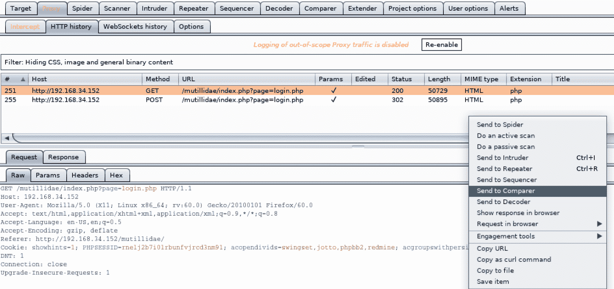

图 35：将相关请求发送到比较器

1.  重复*步骤 3*以进行 POST 请求，显示成功登录。

1.  点击“比较器”选项卡，并确保您选择要比较的两个不同请求，如*图 36*所示：

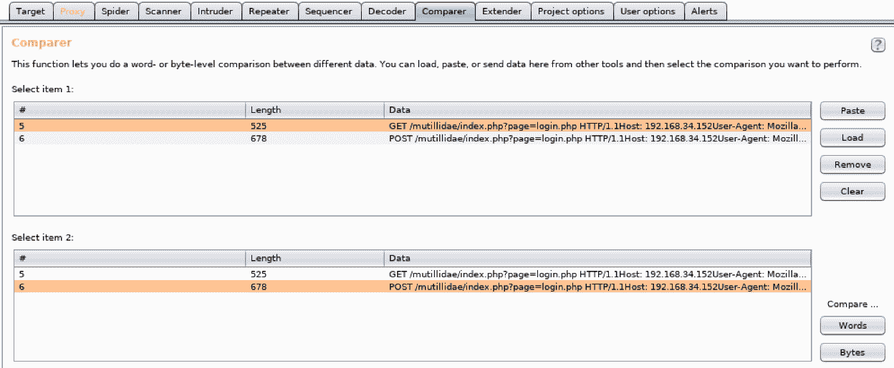

图 36：选择要比较的请求

1.  点击“单词”按钮，并观察结果，如下图所示：

图 37：比较请求的结果

注意到 PHPSESSID 对于两个请求是相同的。这意味着 Web 应用程序不生成唯一的会话 ID，因为对于经过身份验证和未经身份验证的请求，ID 是相同的。因此，Web 应用程序容易受到会话固定攻击的影响。

# 扩展器

在这里，您可以通过使用 BApp Store 的扩展或使用第三方代码来扩展 Burp Suite 的功能。这些扩展使您能够自定义程序的功能，例如用户界面（UI）更改和添加自定义扫描检查。

使用 Extender 工具，我们可以使用 BApp Store 添加额外的扩展。例如，添加软件漏洞扫描器，如下图所示，扩展了内置漏洞扫描器的功能：

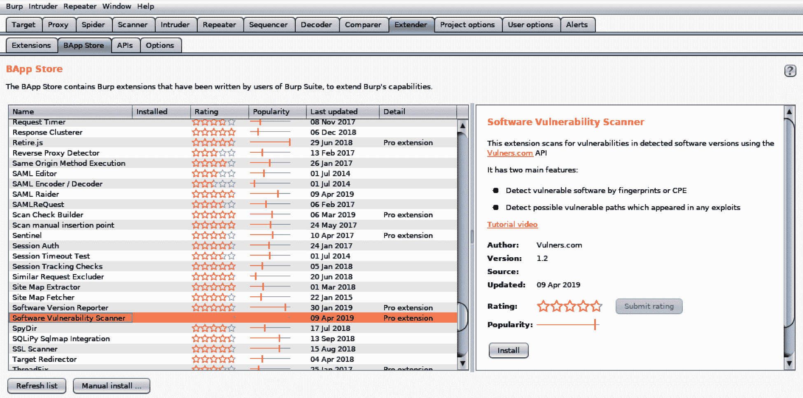

图 38：使用 BApp Store 添加扩展

一些扩展被详细说明为专业扩展，这意味着它们只能与 Burp Suite 专业版一起使用。在扩展选项卡下，您可以加载未在商店中列出的扩展。

# 摘要

在本章中，您已经了解了 Burp Suite 及其各种版本。您已经通过设置环境并学习如何通过利用互联网上免费提供的易受攻击的 Web 应用程序来准备您的实验室。您已经对 Burp Suite 中存在的各种工具有了很好的了解，并学会了如何通过在自己的实验室环境中使用实际示例来使用它们。

在下一章，第八章，*攻击 Web 应用程序*，我们将研究 Web 应用程序中存在的各种漏洞，并了解它们存在的原因和方式。我们将使用包括 Burp Suite 在内的各种工具对易受攻击的 Web 应用程序进行各种攻击。

# 问题

1.  Burp Suite 的中心是什么？

1.  何时适合使用被动扫描？

1.  Repeater 用于什么？

1.  Intruder 工具中最全面的攻击方法是什么？

1.  如何扩展 Burp Suite 的功能？
