# 开始无线攻击

无线行业继续增长，无线设备的数量不断增加。一般家庭拥有访问点、媒体中心、电话、游戏机、个人电脑，甚至安全系统。企业依赖无线网络以提高员工在公司内外自由移动的便利性。能够自由访问网络的缺点是，它使网络容易受到漏洞的攻击。因此，公司识别和修复无线网络中的漏洞是很重要的。

在本章中，您将学习无线攻击以及如何执行它们。我们将讨论无线数据包的各个组成部分，比如信标帧，以及数据包中包含的内容。您将了解可以用于无线数据包注入和监视的无线适配器的类型。我们将深入探讨可以用于执行不同攻击的各种工具。最后，您将学习如何破解各种无线加密协议。

随着本章的进行，您将学习以下主题：

+   探索无线攻击

+   兼容的硬件

+   无线攻击工具

+   破解 WPA/WPA2 和 WEP

# 技术要求

本章需要以下技术要求：

+   Kali Linux 2019.1

+   兼容数据包注入的网络适配卡

+   支持 WPA/WPA2 和 WEP 的无线路由器

# 探索无线攻击

无线网络从一个“好有”发展到组织中的一个“必须有”的需求。无线网络几乎无处不在。例如，您可能在家里运行无线网络以便接入互联网。这种接入可以让移动电话、智能电视、媒体播放器、游戏机、平板电脑和个人电脑随时连接到互联网。您的邻居可能也有类似的设置。

在企业中，无线网络是一个强大的工具，可以提高生产力并促进信息交流。员工可以自由漫游，并且无线网络提供了简单性、易用性、方便性和客人的网络访问，以及在难以到达的区域的网络访问。

遗憾的是，无线设备通常缺乏安全性，这导致了严重的漏洞。公司通常没有对无线设备进行安全配置，甚至有些公司可能会使用默认配置的无线设备。

了解无线网络的工作原理，以及各种加密算法和对无线网络的攻击，如果您想进行成功的渗透测试，这是至关重要的。

# 无线网络架构

在对无线网络进行盲目的渗透测试之前，了解无线网络的架构是很重要的。这将帮助您对不同的模式有一个很好的理解，并且从渗透测试的角度来看，了解哪些类型的无线帧是重要的。

无线网络有两种主要模式：

+   基础设施模式

+   点对点模式

在这两种模式中，有一个称为服务集标识（SSID）的共同组件，这是网络验证所必需的。在基础设施模式下，SSID 由访问点（AP）设置。在点对点模式下，SSID 由创建网络的站点设置。

在基础设施模式中，至少应该有一个访问点和一个站点。这两者组成了一个基本服务集（BSS）。当两个或更多访问点连接到相同的 IP 子网或虚拟局域网（VLAN）时，形成了扩展服务集（ESS），从而创建了一个单一的逻辑网络段。

在**自组网模式**中，当两个或更多站点开始在没有访问点的情况下进行通信时，将创建**独立基本服务集**（**IBSS**）。这种模式可以称为点对点模式。其中一个站点将自行处理访问点处理的责任，例如信标和认证新客户端。

# 无线帧

在无线网络中，通信是使用帧进行的。在无线帧中，前两个字节属于一个称为**帧控制**的组件。在这个帧控制帧内，我们有多个字段，其具有各种位大小。值得注意的是`类型`字段。

`类型`字段包含以下类别的帧：

+   **管理帧**：这些负责保持站点和访问点之间的通信。这些帧的一些子类型包括认证、去认证、关联、信标、探测请求和探测响应。

+   **控制帧**：这些负责访问点和站点之间的数据交换。这里的一些子类型包括请求发送、准备发送和 ACK。

+   **数据帧**：这些帧携带实际数据。它们没有子类型。

我想深入研究以下帧，因为这些帧可以揭示一些关键信息。

# 值得注意的无线帧

**信标帧**是在无线网络中发送的最常见的数据包。这些通常发送得相当快，通常每秒几次。当然，这可以在各种无线访问点中进行控制。信标帧包含有用的信息，例如以下内容：

+   SSID 名称（除非关闭 SSID 广播）

+   访问点的 MAC 地址

+   安全功能（WPA2 密码，WPA，WEP，WPA 企业）

+   信标间隔

+   信道和信道宽度

+   国家

+   访问点支持的连接速度

*图 1*显示了信标帧中包含的内容。您会注意到间隔为 0.102400 [秒]。点号 1 显示该帧由一个 AP 发送，由于第二位未设置，这表示这不是一个自组网。点号 2 包含有关 SSID、支持的数据速率、信道宽度和国家信息的详细信息：

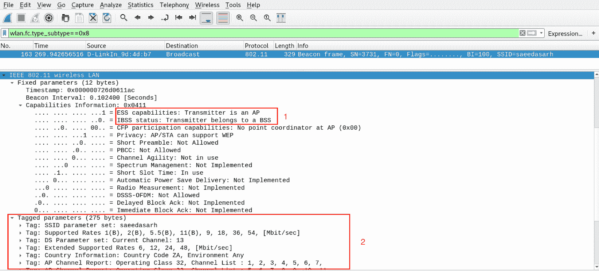

图 1：信标帧

应用的过滤器（`wlan.fc.type_subtype==0x8`）是特定于信标帧的，因为它们是管理帧（帧零）和子类型 8 的一部分。

**去认证**帧用于取消与访问点当前关联的客户端。有许多原因会导致您强制客户端取消关联；例如，如果您想揭示隐藏的 SSID 或者想捕获 WPA/WPA2 握手。

*图 2*显示了一个去认证数据包的示例捕获：

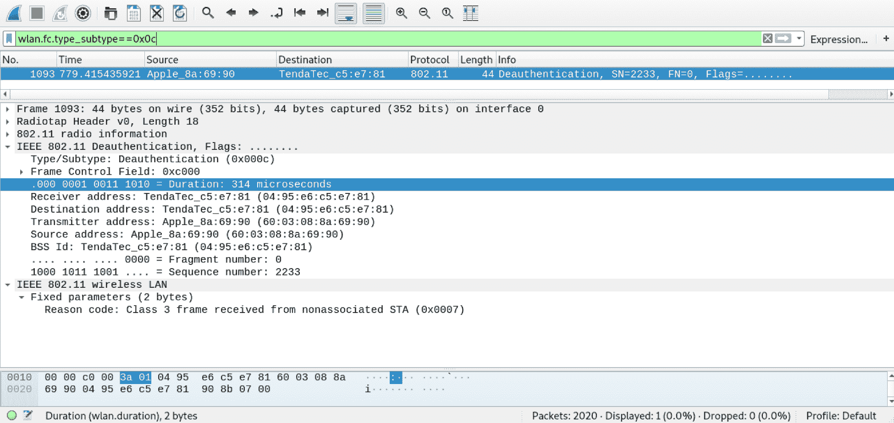

图 2：去认证帧

请注意，定义的原因代码为`class 3`表示站点正在离开或已离开独立基本服务集。这个去认证是使用 aireplay-ng 进行的。我们将在本章后面详细介绍这个工具。有许多原因代码，在*表 1*中我列出了常见的原因代码：

| **原因代码** | **描述** | **解释** |
| --- | --- | --- |
| `0` | 无原因代码 | 这是正常行为 |
| `1` | 未指明的原因 | 客户端目前已关联但不再被授权 |
| `2` | 先前的身份验证不再有效 | 客户端已关联但未经授权 |
| `3` | 离开去认证 | 站点已被取消认证，因为它正在离开 IBSS 或 ESS |
| `4` | 因不活动而取消关联 | 客户端会话已超时 |
| `5` | 关联 AP 繁忙 | 接入点当前繁忙，无法处理当前关联的客户端 |
| `6` | 非经过身份验证的站点的`Class2`帧 | 客户端尝试在身份验证之前传输数据 |
| `7` | `Class3` 非关联站的帧 | 客户端在与接入点关联之前尝试传输数据 |

**认证**帧构成了认证过程。交换的认证帧数量各不相同；**认证事务序列号**负责跟踪认证过程，并且可以处理从`1`到`65535`的值。**认证算法**用于识别正在使用的认证类型。下面的示例捕获（*图 3*）显示正在使用开放认证：


图 3：认证帧

使用值`0`表示正在使用开放认证。值`1`表示正在使用共享密钥认证。

# 无线安全协议

随着无线技术的发展和广泛应用，无线技术的安全协议也得到了提升。

在无线安全中，密码只是一半的战斗。选择正确的加密级别同样重要，正确的选择将决定您的无线局域网是否容易被利用。大多数无线接入点为无线加密启用了三种标准之一：**有线等效隐私**（**WEP**），或**Wi-Fi 保护访问**（**WPA**或**WPA2**）。

在进行对无线网络进行渗透测试之前，我们需要检查今天存在的加密标准，并了解它们的漏洞。

# WEP

WEP 是为了解决开放网络的问题而创建的，这些网络容易受到窃听，因为没有使用加密。它在创建时提供了合理程度的安全性。它使用**Rivest Cipher 4**（**RC4**）来加密流量，并使用 CRC32 校验和提供消息完整性。RC4 是对称密码，这意味着相同的密钥用于加密和解密数据。密码创建了一系列与明文进行异或运算的位，从而产生了加密数据。当然，可以通过简单地使用密钥流对加密数据进行异或运算来解密数据。

WEP 使用了 24 位的**初始化向量**（**IV**）。IV 用于确保加密的第一个明文数据块是随机的。这确保了如果相同的明文被加密，结果将是不同的密文。由于 IV 的大小较小，密钥重用的可能性很高，这使得破解加密变得容易。

2001 年，网络安全专家发现了 WEP 中的几个严重缺陷，导致业界普遍建议在商业和消费设备中淘汰 WEP 的使用。

# WPA

基于 WEP 的缺陷，迫切需要为无线设备提供更多安全性。这就是 WPA 被引入的时候。WPA 引入了两种新的链路层加密协议；这些是**临时密钥完整性协议**（**TKIP**）和**计数器模式与 CBC-MAC**（**CCMP**）。

WPA 有两种模式：

+   **WPA 个人**：这使用预共享密钥进行认证，该密钥由网络中的所有对等体共享。

+   **WPA 企业**：利用 radius 服务器进行**认证、授权和计费**（**AAA**）的 802.1x 认证。

WPA 仍然使用 WEP 作为加密算法以支持向后兼容和旧硬件。然而，通过使用 TKIP，它解决了一些安全漏洞，具体包括以下内容：

+   256 位密钥

+   通过为每个数据包生成一个唯一密钥进行数据包密钥混合

+   自动传输更新的密钥

+   完整性检查

+   48 位 IV 大小和 IV 排序以减少重放攻击

# Wi-Fi 保护访问版本 2（WPA2）

WPA2 作为 WPA 的继任者被引入。它使用更强大的**高级加密标准**（**AES**）算法。AES 由三个对称块密码组成，每个密码块为 128 位。块的加密和解密可以使用 128 位、192 位和 256 位密钥进行。AES 需要更多的计算能力，但随着无线设备的进步，性能问题只在旧硬件上普遍存在。

WPA2 使用**计数器模式和密码块链接消息认证码协议**（**CCMP**）。CCMP 通过只允许授权的设备或用户接收数据来提供数据机密性。密码块链接用于提供数据的完整性。

WPA2 与旧硬件不兼容，因为它是从头开始重新设计的。它支持 WPA 引入的**个人**和**企业**模式。

2017 年，宣布了一个严重的影响 WPA2 的漏洞。它被称为**KRACK**，代表**密钥重新安装攻击**。当攻击者欺骗目标重新安装已经使用的密钥时，就会发生密钥重新安装攻击。这可以通过操纵和重放 WPA2 的加密握手消息来实现。当安装此密钥时，参数（如 nonce（递增传输数据包编号）和重放计数器）被重置为其初始值。通过强制重用 nonce，数据包可以被重放、伪造和解密。

# Wi-Fi 保护访问版本 3（WPA3）

WPA3，于 2018 年宣布，旨在成为广泛使用的 WPA2 的继任者，并带来了一些核心增强功能，以增强个人和企业网络的安全保护和程序。

WPA3 引入了一个不同的握手过程，称为**对等的同时认证**（**SAE**），也被称为**Dragonfly**密钥交换。加密由 AES-GCM 处理，WPA3 使用的会话密钥长度为企业模式为 192 位，个人模式为 128 位（192 位是可选的）。数据完整性由**安全哈希算法 2**（**SHA2**）处理。

即使对于没有密码的 Wi-Fi 网络，WPA3 安全性也提供了一种称为**个人数据加密**的数据保护机制。该机制使用单独的密钥加密每个设备的数据包，因此其他设备无法解密彼此的数据。

WPA3 听起来确实很安全；然而，出现了一个名为**Dragonblood**的漏洞。这个漏洞允许攻击者通过滥用时间或基于缓存的侧信道泄漏来恢复密码。

WPA3 不在本书的范围内，但了解新标准和其中存在的漏洞是值得的。

有关 WPA3 的更多信息，您可以访问 Wi-Fi 联盟网页：[`www.wi-fi.org/discover-wi-fi/security`](https://www.wi-fi.org/discover-wi-fi/security)。

# 无线攻击类型

让我们来看看存在的各种类型的无线攻击：

+   **访问控制攻击**：这些类型的攻击试图通过规避访问控制保护（如 MAC 过滤器或`802.1x`端口安全）来获取对无线网络的访问权限。一些访问控制攻击的例子如下：

+   **流氓接入点**：这些是未经保护的接入点，用于在受信任的网络中创建后门。

+   **MAC 地址欺骗**：这种攻击试图欺骗已经获得授权的接入点或站点的 MAC 地址。

+   **临时关联**：这种类型的攻击试图通过临时模式直接连接到一个站点。这使得可以绕过接入点的安全性，因为可以攻击或使用该站点作为枢纽点。

+   **机密性攻击**：这些类型的攻击旨在拦截通过无线网络发送的流量。一些机密性攻击的例子如下：

+   邪恶的双子 AP：这是一个恶意接入点，伪装成合法的接入点，试图欺骗客户端对其进行认证。这可以用来窃取凭据或进行中间人攻击。

+   虚假门户：在这种攻击中，使用虚假的强制门户试图欺骗用户提供诸如预共享密钥、敏感信息或登录详细信息。

+   完整性攻击：这些类型的攻击利用伪造的帧来误导接收者。它们也可以用于执行拒绝服务攻击。一些完整性攻击的例子如下：

+   Radius 重放攻击：利用嗅探和拦截等技术，可以捕获和存储请求认证器、标识符和服务器响应。这些可以稍后用于恶意目的进行重放。

+   帧注入攻击：在这种攻击中，无线帧可以被操纵。例如，强制发出去认证帧，以迫使设备重新对接入点进行认证，以便捕获握手。

+   身份验证攻击：这些类型的攻击旨在窃取身份验证信息，这些信息可以用于访问资源或服务。一些身份验证攻击的例子如下：

+   WEP/WPA/WPA2 密钥破解：这种攻击涉及捕获认证握手并执行离线暴力破解以获取预共享密钥。

+   降级攻击：这些攻击可以针对`802.1x`，通过强制服务器使用伪造的 EAP 数据包提供更弱的认证。

# 兼容的硬件

拥有正确的硬件对于对无线网络进行渗透测试至关重要。并非所有无线适配器都能让您切换到监视模式或执行数据包注入。

监视模式允许无线适配器切换到**混杂**模式，以便**监视**数据包而不进行任何过滤。许多工具，如`airodump-ng`和`aireplay-ng`，需要将无线适配器置于监视模式才能运行。

# 无线适配器

选择合适的无线适配器可能会很棘手，特别是在当今存在许多选项的情况下。正确的适配器是根据您的需求而定的。您可能需要一个小巧的适配器或一个可以利用各种天线尺寸的适配器。这完全取决于您的偏好以及它是否适合您。

需要注意的一点是，无线适配器的传输功率和接收灵敏度应该考虑在内。例如，较低的灵敏度对于接收更好，但较高的功率对于数据传输更好。通常，只有在考虑范围时才会使用高功率适配器。

具有 Atheros、Realtek 或 Ralink 芯片组的无线适配器通常支持监视模式和数据包注入。但并非所有适配器都支持。互联网上有多篇评论和文章定期更新最新支持的硬件。在您喜欢的搜索引擎上快速搜索关键词，如“Kali Linux 兼容的无线适配器”，将为您提供丰富的结果。

最常用的无线适配器是 Alfa 无线适配器。这些适配器在亚马逊和其他供应商那里都可以找到，而且价格相对便宜。要小心假货，因为市场上有许多假货。我正在使用的无线适配器是 Alfa AWUSO36NH。该卡的传输功率为 2000 毫瓦。在撰写本文时，该适配器在亚马逊上的价格为 31.99 美元。由于一些网络使用 2.4 GHz 和 5 GHz 频率，您可能需要一个可以在两个频率上工作的无线适配器。Panda PAU09 在 Kali Linux 上运行良好，并支持 2.4 GHz 和 5 GHz 频率；在撰写本文时，该适配器在亚马逊上的价格为 39.99 美元。

重要的是要注意，一些无线网卡在 Kali Linux 中可以直接使用。有些需要编译驱动程序。有时，同一型号的微小修订版本会产生不同的结果。确保您对无线网卡进行彻底的研究。

2.4 GHz 和 5 GHz 频率之间的主要区别是范围。2.4 GHz 能够比 5 GHz 到达更远的距离。另外，2.4 GHz 受到的干扰比 5 GHz 多得多。2.4 GHz 中有更多的重叠信道，有三个不重叠的信道，而 5 GHz 有二十三个不重叠的信道。

一旦您有兼容的无线适配器，您可以通过执行以下操作将其设置为监控模式：

1.  在 Kali Linux 中打开一个终端窗口，并发出`iwconfig`命令。注意您的无线网卡的接口名称（*图 4*）。在下面的示例中，无线适配器接口名称是`wlan0`：


图 4：使用 iwconfig 识别无线适配器

1.  在更改模式之前，关闭接口是一个好习惯。这可以通过使用`ifconfig wlan0 down`命令来完成。要将模式从托管更改为监控，使用`iwconfig wlan0 mode monitor`命令。最后，使用`ifconfig wlan0 up`命令将接口重新上线，如*图 5*所示：

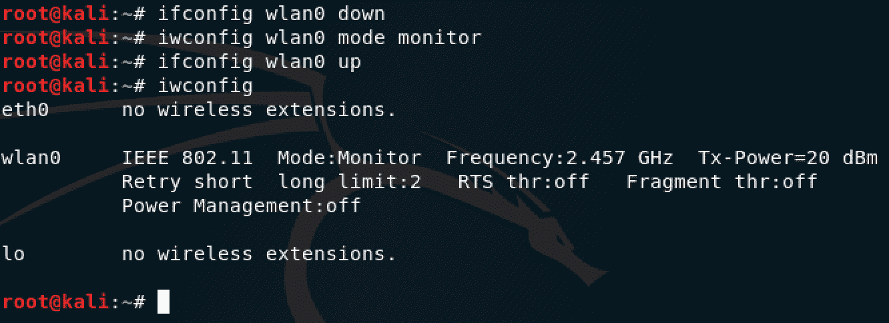

图 5：将无线适配器设置为监控模式

现在无线适配器正在监控模式下运行（`Mode:Monitor`）。要将接口切换回监控模式，请按照之前的*步骤 2*进行操作，但使用`iwconfig wlan0 mode managed`。

使用`airmon-ng`可以更快地启用监控模式；这将在下一节中介绍。

如果您使用的是支持 1000 mW 传输功率评级的 Alfa 无线网卡，根据您的位置，您的`Tx-Power`可能设置为 20 dBm（如*图 6*所示）。要启用卡的全部功能，请按照以下步骤操作：

1.  使用`ifconfig wlan0 down`命令关闭接口。`Wlan0`是接口名称；在您的环境中可能会有所不同。

1.  使用`iw reg set US`命令将区域设置为美国。

1.  使用`ifconfig wlan0 up`命令将接口上线。

1.  使用`iwconfig wlan0`命令检查功率评级：


图 6：增加 Alfa TX 功率

注意功率评级现在已经增加到`30 dBm`（*图 6*）。每`10 dBm`增加一次功率，以 mW 为单位增加 10 倍。

# 无线攻击工具

Kali Linux 包括一些内置工具，可用于攻击无线网络。我们将探讨各种工具及其用法。

请注意，随着您在本章的进展，您应该在自己的无线网络上执行攻击。

# Wifiphisher

Wifiphisher 是一个出色的恶意访问点工具，可用于进行渗透测试或 Wi-Fi 安全测试。该工具通过对执行对接入点进行关联的无线客户端进行中间人攻击来工作。Wifiphisher 可以通过使用第三方登录页面进行定制，或者您可以创建自己的页面。

Wifiphisher 默认安装在 Kali Linux 中。可以使用`wifiphisher`命令来运行它。请注意，`wifiphisher`需要`roguehostapd`，但是您可以使用 Kali 中安装的`hostapd`。要使用`hostapd`，您可以运行`wifiphisher --force-hostapd`命令。

让我们使用`wifiphisher`的内置钓鱼页面执行一个简单的钓鱼活动。记得将您的无线适配器设置为监控模式：

1.  从 Kali 终端窗口运行`wifiphisher --force-hostapd`命令。您将看到`wifiphisher`的主屏幕（*图 7*）。在这里，您将看到一个发现的无线网络列表。选择您想要创建一个恶意访问点的网络：


图 7：Wifiphisher 无线网络选择

1.  一旦选择了网络，你将看到一系列可用的钓鱼场景。我选择了标准的“固件升级页面”，如*图 8*所示：


图 8：wifiphisher 的钓鱼场景

你可以构建自己的钓鱼场景，并利用互联网上提供的预构建自定义页面。这些页面需要存储在`wifiphisher/data/phishingpages`目录中。

一旦你选择了页面，`wifiphisher`将自动创建伪造的接入点，并开始去认证任何连接的客户端。

一旦用户再次尝试连接到无线网络，他们将看到您选择的钓鱼页面。在我的情况下，就像*图 9*中显示的固件升级页面一样：

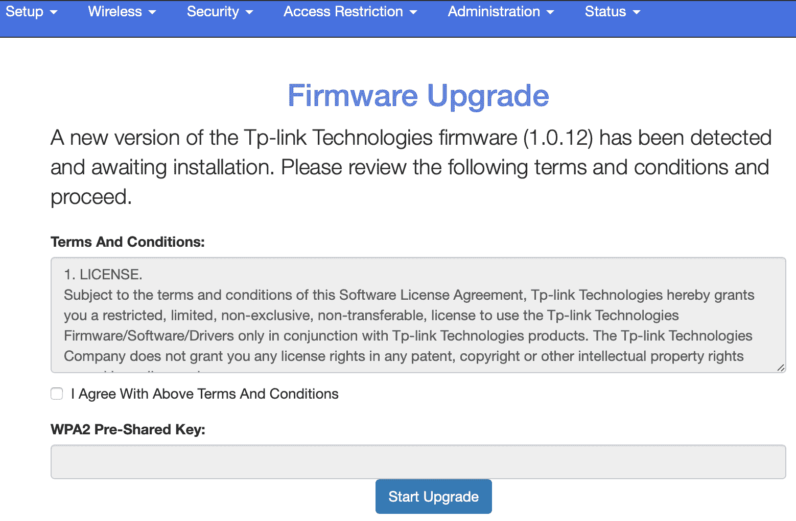

图 9：固件升级钓鱼页面

一旦提供了预共享密钥，页面就会开始“升级固件”，但当然，实际上什么都没有发生。然而，在 Wifiphisher 终端上，我们有明文显示的捕获凭据，如*图 10*所示：

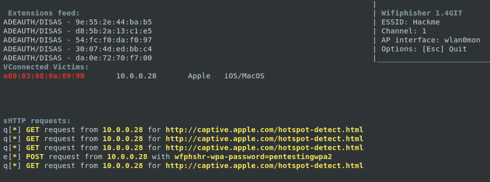

图 10：捕获的 PSK

在渗透测试中使用这个工具时，你需要让钓鱼页面令人信服。一些终端用户很懂技术，不会轻易上当一个简单的钓鱼页面。你还需要考虑，在企业 Wi-Fi 认证中使用他们的域凭据；在这种情况下，你需要创建一个巧妙的钓鱼页面，让它看起来像一个企业门户。

关于创建自定义钓鱼页面的更多信息可以在这里找到：[`wifiphisher.org/docs.html`](https://wifiphisher.org/docs.html)。

# Aircrack-ng 套件

Aircrack-ng 是预先安装在 Kali Linux 中的一套强大的工具。该套件包括以下类别的工具：

+   **监控**：执行数据包捕获，并提供将数据导出到文本文件以供第三方工具使用的能力

+   **攻击**：用于执行重放攻击、帧攻击（如去认证）等，使用数据包注入

+   **测试**：查看 Wi-Fi 适配器的功能，执行捕获和数据包注入

+   **破解**：对 WEP、WPA 和 WPA2 预共享密钥执行攻击

让我们深入了解各种工具以及如何用于渗透测试。请记住，你的无线适配器必须处于监视模式才能使用这些工具。我们将从使用`airmon-ng`启用监视模式开始。

# Airmon-ng

Airmon-ng 是一个脚本，用于在无线适配器上启用和禁用监视模式。运行`airmon-ng`而不带任何参数将显示当前的无线接口状态。

Airmon-ng 简单直接。使用以下步骤在无线适配器上启用监视模式：

1.  打开一个终端窗口，使用`airmon-ng`命令查看你的无线适配器的名称。这个命令将显示当前的无线适配器、它的接口名称、驱动程序和芯片组。

1.  要将适配器置于监视模式，你可以使用`airmon-ng start [interface name]`命令。例如，在*图 11*中，我的适配器的接口名称是`wlan0`：

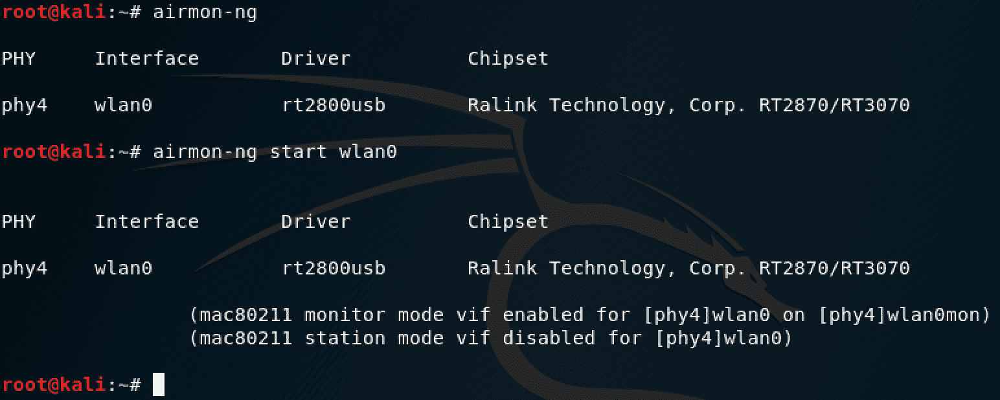

图 11：使用 airmon-ng 启用监视模式

`airmon-ng`可以用来检查是否有任何进程会干扰`aircrack-ng`套件的工具。检查的命令是`airmon-ng check`。

在*图 12*中，我们看到有一些进程可能会影响`aircrack-ng`工具套件：


图 12：识别有问题的进程

你可以让`airmon-ng`使用这个命令杀死任何会干扰的进程：`airmon-ng check kill`。

要将无线适配器重新设置为`managed`模式，可以使用以下命令：`airmon-ng stop [interface name]`。

`airmon-ng`使您能够在特定信道上将适配器设置为监视模式。可以使用以下命令完成：

```
airmon-ng start [interface name] [channel number]
```

当有很多无线网络并且您想专注于目标网络所在的特定信道时，这将非常有用。

# Airodump-ng

Airodump-ng 用于捕获原始 802.11 帧的数据包。该工具可用于收集 WPA 握手或弱 WEP 初始化向量，以供 Aircrack-ng 使用。它具有记录检测到的无线网络的 GPS 坐标的功能，这些坐标可以稍后导入在线 Wi-Fi 映射工具。

`airodump-ng`的命令语法是`airodump-ng [options][interface name]`。

`airodump-ng`有很多选项可供选择。只需输入`airodump-ng`命令即可显示完整列表。一些值得注意的选项如下：

+   `-w`：用于将输出写入文件。

+   `-c`：用于指定要捕获的信道。

+   `-bssid`：用于定义目标 BSSID。

使用`airodump-ng [interface name]`命令进行无线网络嗅探，不需要任何选项。显示的输出将显示范围内的当前无线网络，包括连接的站点，如*图 13*所示：

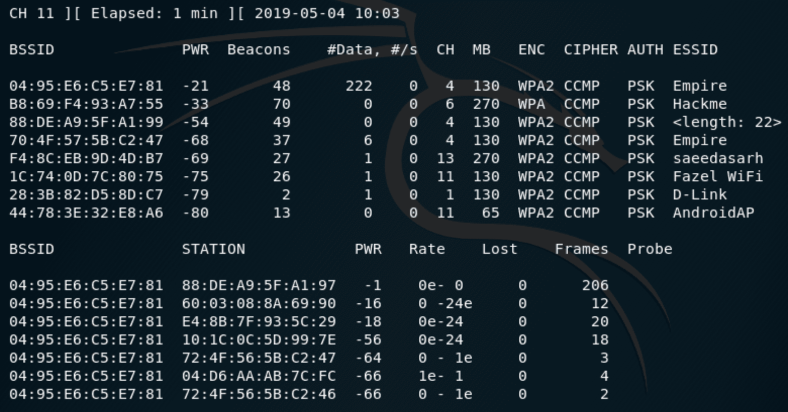

图 13：Airodump-ng 输出

不要被显示的信息所压倒，因为理解它很简单。Airodump-ng 有两个独立的部分。顶部显示了有关发现的网络的信息。字段描述如下：

| **字段** | **描述** |
| --- | --- |
| `BSSID`  | 这是接入点的 MAC 地址。 |
| `PWR`  | 这是信号级别。您离接入点越近，信号级别评分就越高。有些可能显示为`-1`，意味着您离得太远，或者检测信号级别时存在驱动程序问题。 |
| `Beacons`  | AP 发送的信标帧数量。 |
| `#Data`  | 捕获的数据包数量。如果使用 WEP，它将是唯一的 IV 计数。 |
| `#/s` | 在 10 秒内捕获的数据包数量。 |
| `CH` | 这是信道号，从信标帧中派生出来。 |
| `MB` | AP 支持的最大速度。 |
| `ENC`  | 正在使用的加密算法。 |
| `Cipher` | 检测到的加密算法。 |
| `Auth` | 正在使用的认证协议。 |
| `ESSID` | 网络的 SSID。如果 SSID 是隐藏的，那么这个值将为空；但是，`airodump-ng`将尝试从探测和关联响应中恢复 SSID。 |

底部部分显示了检测到的接入点和连接到接入点的客户端（站点）的 MAC 地址。

出于演示目的，我正在瞄准 Hackme 无线网络。我将告诉`airodump-ng`专注于该接入点和信道，并且我希望将捕获写入磁盘。可以使用以下命令完成：

```
airodump-ng -c 6 --bssid B8:69:F4:93:A7:55 -w hackme-cap [interface name]
```

在此命令中，`-c 6`表示信道号，`--bssid`表示接入点 MAC 地址，`-w`表示捕获的文件名，`interface name`是我的无线适配器，处于监视模式：


图 14：定制 airodump-ng 以针对特定网络

请注意*图 14*中的输出，其中捕获了 WPA 握手。我们将在本章后面的*Aircrack-ng*部分介绍如何破解该握手。

# Aireplay-ng

Aireplay-ng 主要用于注入帧并生成流量，以备后续使用`aircrack-ng`。常见的攻击之一是去认证攻击；这种攻击的目的是捕获握手数据。

`aireplay-ng`的命令语法如下：

```
aireplay-ng [options][interface name]
```

`aireplay-ng`具有丰富的选项，对于各种攻击方法，攻击方法可以用名称或数字来定义。例如，`去认证攻击是攻击编号 0`或者可以使用`--deauth`。`aireplay-ng`支持以下攻击方法：

+   **去认证**：此攻击的目的是使连接到接入点的客户端取消关联。这会迫使它们重新关联，并使您能够捕获握手过程。

+   **伪认证**：此攻击允许您与接入点关联。当您需要利用各种攻击而没有站点与接入点关联时，这是很有用的。

+   **交互式数据包重播**：当您想要选择特定数据包重播到接入点时使用此攻击。

+   **ARP 请求重播攻击**：此攻击有效地生成新的 IV。它通过将 ARP 数据包重新发送到接入点来工作，这迫使接入点用新的 IV 重复 ARP 数据包。

+   **KoreK** **chopchop** **攻击**：此攻击能够在没有密钥的情况下解密 WEP 数据包。它不会恢复 WEP 密钥，但会以明文形式显示出来。

+   **分段攻击**：此攻击用于获取**伪随机生成算法**（**PRGA**）。这个 PRGA 可以与`packetforge-ng`一起用于生成各种其他注入攻击的数据包。

+   **Cafe-latte 攻击**：此攻击使您能够从客户端站点而不是接入点获取 WEP 密钥。它操纵 ARP 数据包发送到客户端，客户端再将其发送回来，然后被捕获和分析。

+   **面向客户端的分段攻击**：这扩展了 cafe-latte 攻击，使用任何数据包而不仅仅是 ARP 数据包。

+   **WPA 迁移模式**：此攻击特定于 Cisco 接入点中发现的漏洞，使 WPA 和 WEP 客户端能够使用相同的 SSID 关联到接入点。

+   **注入测试**：此测试确定您的无线适配器是否能成功向接入点注入数据包。

每种攻击都可以用一个数字来定义。例如，去认证攻击可以定义为`-0`。您将在本章后面注意到，我们将使用数字来表示各种攻击。

让我们使用`aireplay-ng`来执行去认证攻击，如*图 15*所示，使用以下命令：

```
aireplay-ng -0 10 -a [BSSID] -c [Client MAC] [interface name]
```

在这个命令中，`-0 10`用于指定去认证攻击，只会发送`10`个数据包，`-a`用于定义接入点的 MAC 地址，`-c`用于定义客户端的 MAC 地址，`interface name`是无线适配器，处于监视模式。有时，可能需要更多的数据包才能使站点取消认证。您可以使用`-0 0`选项来发送无限数量的数据包：


图 15：去认证攻击

`ACKs`代表以下内容：

```
[Client ACKs received | Access point ACKs received]
```

这为您提供了一个很好的指示，表明数据包是否已被接收。数值越高越好。

# Airgeddon

摆脱了`aircrack-ng`套件中的多个工具，现在让我们专注于一个具有多种功能并且易于使用的工具。

Airgeddon（由`v1s1t0r1sh3r3`开发）是一个用`bash`编写的工具，用于对无线网络进行多种攻击。Airgeddon 的一些特点如下：

+   能够管理接口模式（监视和管理）

+   支持 2.4 GHz 和 5 GHz 频段

+   辅助 WPA/WPA2 握手捕获，清理和优化文件

+   WPA/WPA2 企业和个人的离线密码破解

+   恶意双胞胎攻击

+   WPS 攻击

Airgeddon 在 Kali Linux 中不是默认安装的。要安装它，请执行以下步骤：

1.  安装 Airgeddon 可以通过克隆存储库来完成。在 Kali Linux 中使用以下命令来克隆 Airgeddon：

```
git clone https://github.com/v1s1t0r1sh3r3/airgeddon
```

1.  一旦你克隆了 Airgeddon，就使用以下命令来运行它：

```
sudo bash airgeddon.sh
```

当 Airgeddon 启动时，它将执行一系列检查，以确保您拥有所有所需的工具。如果检测到缺少工具，它将突出显示这些工具，并包括软件包名称，如*图 16*所示：

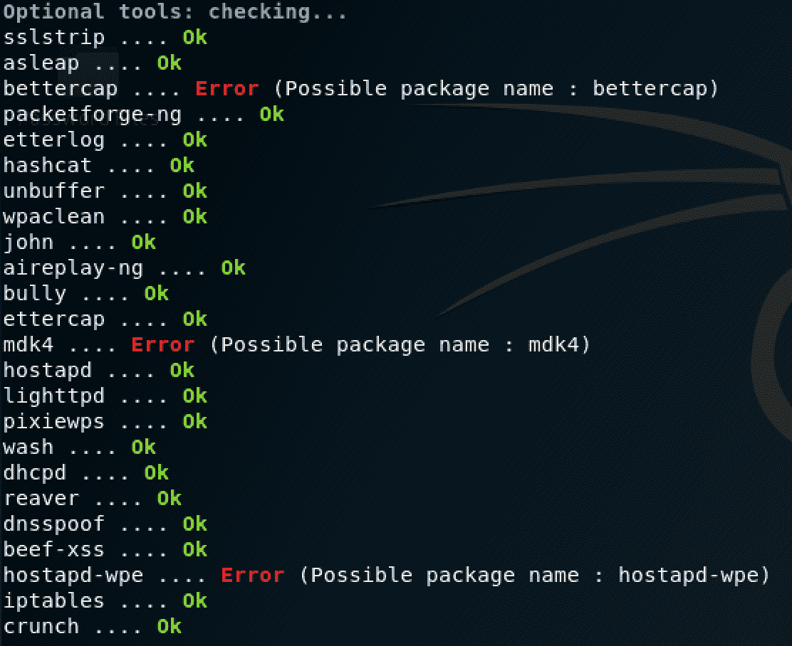

图 16：Airgeddon 可选工具检查

1.  在*图 16*中，有一些工具缺失。请注意软件包名称。要安装缺失的工具，我们可以简单地使用此命令：

```
apt get install bettercap mdk4 hostapd-wpe
```

1.  完成初始检查后，Airgeddon 将提示选择要使用的网络卡，如*图 17*所示：


图 17：接口选择

1.  选择您的接口后，您将看到 Airgeddon 的主菜单，如*图 18*所示：


图 18：Airgeddon 的主菜单

主菜单提供了许多选项。在第一部分中，我们可以将所选的接口设置为监视模式或托管模式。接下来的部分定义了 Airgeddon 能够执行的各种攻击。最后一部分是选项和积分。

# 邪恶孪生攻击

现在，我们将使用 Airgeddon 执行邪恶孪生攻击。邪恶孪生攻击是一种恶意接入点，旨在获取敏感信息、获取凭据或投放恶意有效负载。在我们的示例中，我们将创建一个邪恶孪生，旨在通过俘获门户窃取无线网络的预共享密钥：

您只应对您被授权的网络执行此攻击。出于学习目的，您应该对自己的无线网络执行此攻击。

1.  使用以下命令启动 Airgeddon：

```
sudo bash airgeddon.sh
```

1.  选择您的无线适配器，并使用 Airgeddon 的主菜单将其设置为监视模式。接下来，选择选项`7`，邪恶孪生攻击菜单（*图 19*）。菜单加载后，选择选项`9`：

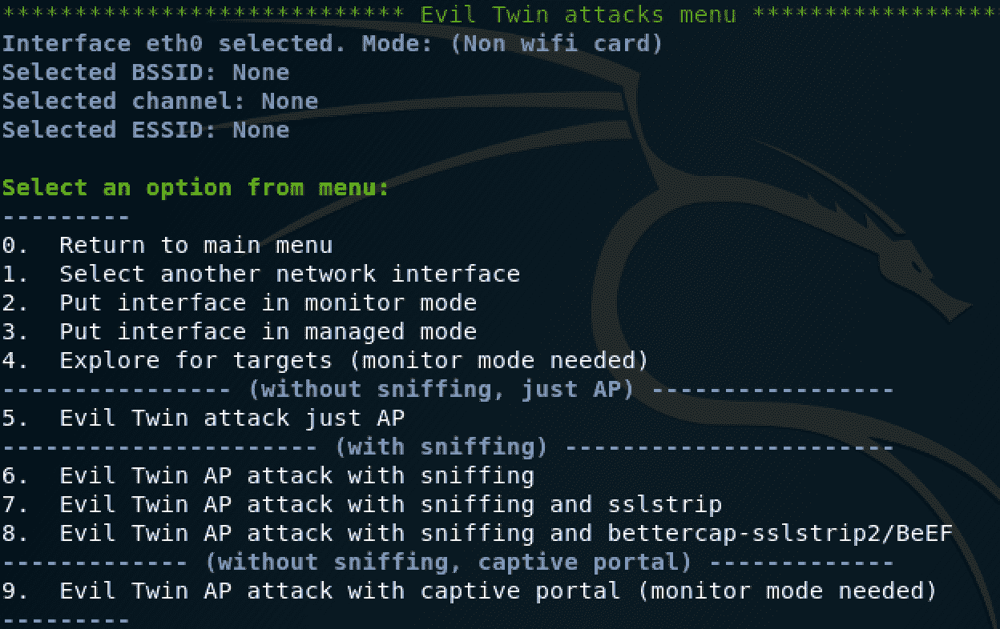

图 19：邪恶孪生攻击菜单

1.  Airgeddon 将执行的第一步是探索无线网络。它将自动设置 WPA/WPA2 的过滤器，并在新窗口中开始扫描，如*图 20*所示：

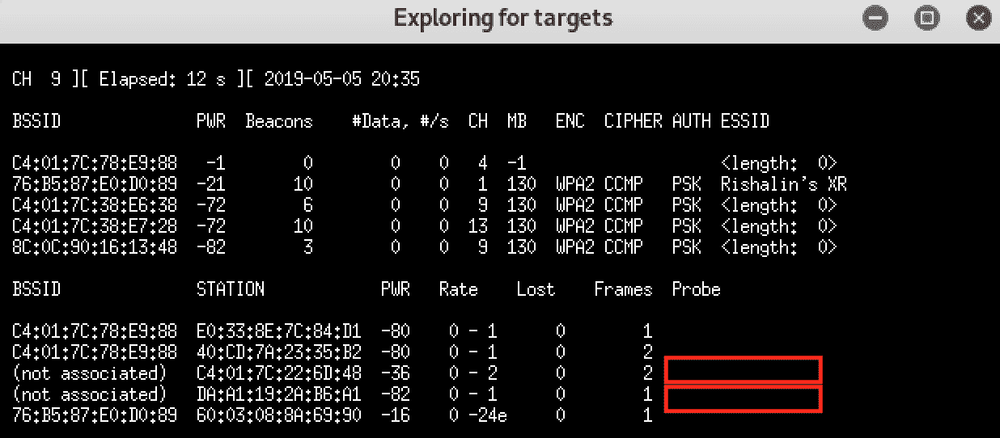

图 20：Airgeddon 探索目标

1.  请将此窗口保持打开一段时间，以便您可以获得无线网络的准确读数。一旦您关闭窗口，Airgeddon 将提示您选择要攻击的网络（*图 21*）。请注意，`*`表示这是一个活动网络：

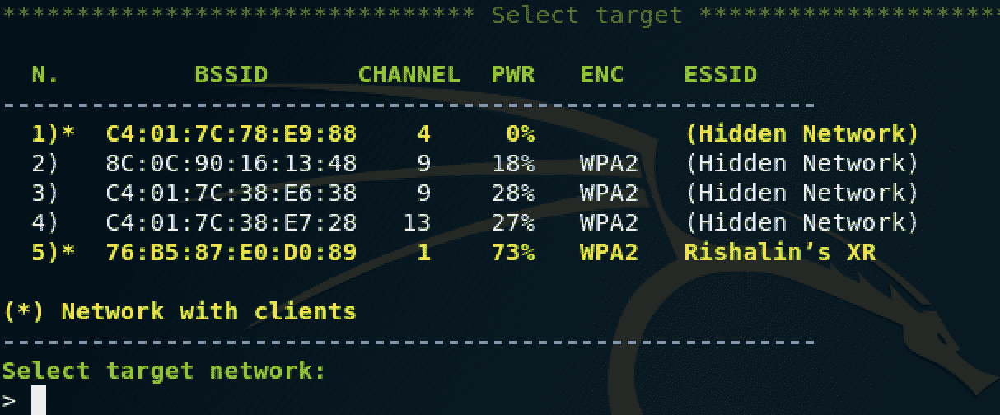

图 21：Airgeddon 网络选择

1.  选择要攻击的网络后，您将看到 deauth 攻击菜单，如*图 22*所示：


图 22：Deauth 攻击菜单

这里有一些选项可供选择；您需要找到与您攻击的网络最匹配的选项。通常，`mdk4`攻击非常有效。

1.  选择 deauth 模式后，Airgeddon 将提示您进行一些额外的设置，例如 DOS 追求模式和在接口上启用互联网访问。为简单起见，我们将选择`NO`。下一批选项与欺骗您的 mac 地址有关，并定义捕获文件（如果您已经有）。如果选择捕获文件的`NO`，则可以定义等待 WPA 提议的秒数。根据网络的活动程度，您需要增加此值。如果不这样做，并使用默认值，您可能无法获得 WPA 握手。

1.  完成选项后，将打开两个新窗口。一旦捕获到 WPA 握手，Airgeddon 将通知您继续下一步，即定义俘获门户的语言。一旦定义了语言，Airgeddon 将启动多个窗口（*图 23*）执行邪恶孪生攻击：


图 23：Airgeddon 邪恶孪生攻击

生成的窗口与 DNS（用于拦截 DNS 请求）、DHCP（用于为站点提供有效的网络地址，以便与虚假接入点通信）、虚假接入点（虚假接入点配置）、Web 服务器（用于托管俘获门户）和最后，信息窗口有关。所有这些都是为了托管虚假的俘获门户而需要的。

现在，当站点连接到接入点时，它将被呈现一个俘获门户。一旦输入预共享密钥，它将以明文形式呈现（*图 24*）。可以根据需要调整俘获门户：


图 24：捕获的预共享密钥

Airgeddon 非常简单易用。它具有丰富的攻击功能。随着您的进展，您可能会发现更多的工具，但是了解如何使用`aircrack-ng`中的工具仍然是有益的，因为您可能已经注意到 Airgeddon 中的一些攻击仍然利用了`aircrack-ng`套件的部分。

# 破解 WEP、WPA 和 WPA2

Aircrack-ng 是一个程序，可以破解 WEP、WPA 和 WPA2 预共享密钥。它支持一些用于破解密码的方法，这些方法如下：

+   **Pyshkin，Tews，Weinmann**（**PTW**），它使用 ARP 数据包来破解 WEP 密钥。

+   FMS/KoreK 使用统计攻击和暴力破解技术来破解 WEP 密钥。

+   字典方法利用字典文件，可用于暴力破解 WEP、WPA/WPA2 密钥。请注意，对于 WPA/WPA2 破解，这是唯一使用的方法。

`aircrack-ng`的命令语法如下：

```
aircrack-ng [options] <capture file(s)>
```

`aircrack-ng`有许多可用选项。可以通过运行`aircrack-ng`命令而不定义其他任何内容来查看这些选项。

# 破解 WPA/WPA2

让我们看一个使用`aircrack-ng`破解 WPA2 的例子。重要的是要注意，破解 WPA2 的唯一可能方法是使用带有暴力破解技术的字典文件。对于所有暴力破解尝试，成功取决于您的字典文件的质量。请记住，更大的字典文件将需要更多的时间和处理能力。

在*图 25*中，您会注意到捕获了一个 WPA 握手：


图 25：WPA 握手捕获

使用以下命令破解这个握手：

```
aircrack-ng -w [wordlist] [capture file]
```

`-w`开关表示将使用的字典文件的位置。您可以按名称定义捕获文件，或者如果有多个捕获文件，可以使用`*.cap`。使用该命令，观察结果如*图 26*所示：

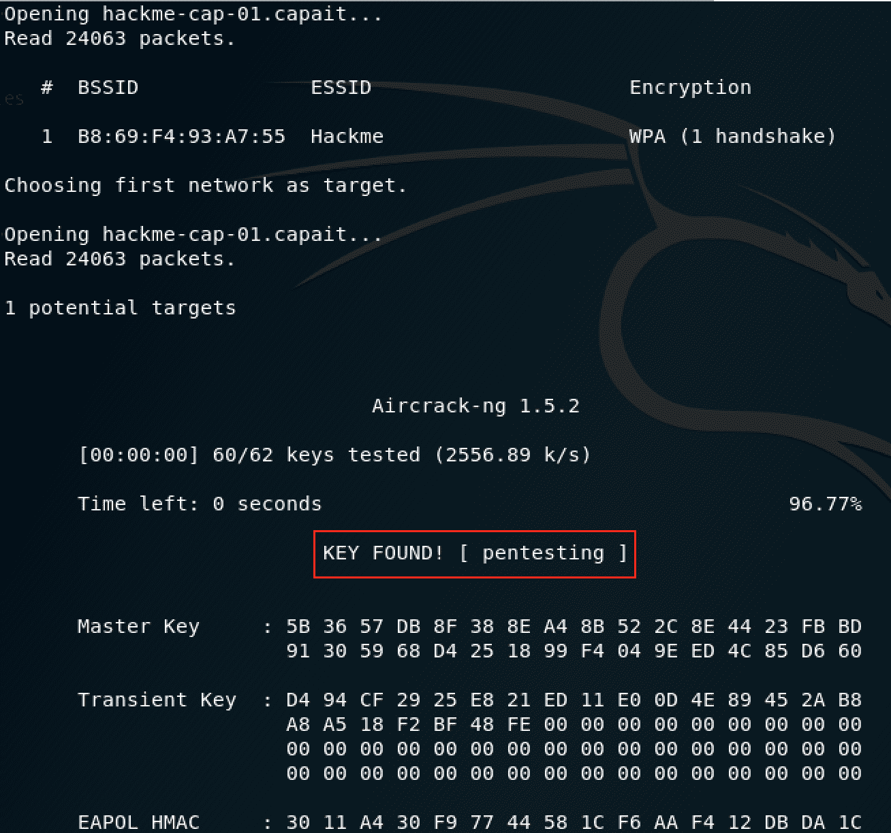

图 26：使用 aircrack-ng 破解 WPA 密钥

破解 WPA2 握手的过程与 WPA 的过程完全相同。

WPA/WPA2 除了预共享密钥之外，还支持许多认证方法。Aircrack-ng 只能破解使用预共享密钥的 WPA 网络。如果`airodump-ng`显示网络使用 PSK 以外的东西，请不要尝试破解，因为这会浪费您的时间。

# 破解 WEP

破解 WEP 密钥有多种方法。在前一节中，我们讨论了攻击，如伪身份验证、caffe-latte 攻击、PTW 攻击等。

现在，我们将执行一些攻击来破解 WEP 密钥。此攻击至少需要一个连接到接入点的站点。

在我的设置中，我已将我的主机机器用作连接的客户端。如果您用于测试此攻击的路由器支持 WEP，请在执行以下步骤之前在路由器上设置 WEP：

1.  确保您的无线适配器处于监视模式。使用`airodump-ng`，我们将指定使用 WEP 的无线网络并开始捕获数据包。在我的设置中，无线网络名为`Hackme`。使用`airodump-ng`部分中定义的命令，我正在调整`airodump`以使用以下命令专门捕获无线网络的数据包：

```
airodump-ng -c 6 --bssid B8:69:F4:93:A7:55 -w hackme-cap [interface name]
```

要破解 64 位 WEP 密钥需要大量的 IVs，至少需要大约 250,000 个。让捕获空闲，需要一些时间来获取足够数量的 IVs。为了加快这个过程，我们将捕获并重放数据包到接入点，以生成唯一的 IVs。在这之前，我们需要对接入点进行认证，否则我们发送的任何数据包都将被丢弃。

1.  为了对接入点进行认证，我们将执行一个伪身份验证攻击（*图 27*）。这种攻击通过说服接入点我们知道 WEP 密钥来进行，但我们并不发送它。为了执行这个攻击，我们使用这个命令：

```
aireplay-ng -1 0 -e Hackme -a [MAC Address] -h [MAC Address] [interface name]
```

在这个命令中，我们使用`-1`来定义攻击；`0`是重传时间，`-e`表示 SSID，`-a`是我们想要认证的接入点的 MAC 地址，`-h`是网络卡的 MAC 地址，`interface name`是处于监视模式的无线`interface name`：


图 27：执行伪身份验证攻击

注意认证成功了；我们可以开始向接入点发送数据包。除非先发送 WEP 密钥，否则接入点不会接受流量。由于我们还没有发送密钥（因为我们还不知道），我们需要捕获已认证的客户端的数据包，并重放它们。为此，我们将使用 ARP 请求重放攻击。

1.  利用`aireplay-ng`，我们将告诉它捕获并重新广播它收到的任何 ARP 数据包。我们将使用以下命令：

```
aireplay-ng -3 -b [MAC Address] -h [Mac Address] [interface name]
```

在这个命令（*图 28*）中，我们使用`-3`来定义攻击；`-b`用于定义接入点的 MAC 地址，`-h`用于定义处于监视模式的无线适配器的 MAC 地址，`接口名称`是处于监视模式的无线适配器的接口名称：


图 28：执行 ARP 请求重放攻击

注意警告。如果您定义了错误的 MAC 地址，`aireplay-ng`将会警告您。

当流量从经过认证的客户端到接入点，以及捕获 ARP 请求时，您会注意到 ARP 请求计数在增加。您可能会收到一条消息，说明您收到了`deauth/disassoc`数据包。如果发生这种情况，请确保重新运行伪身份验证攻击（*步骤 2*）；您可能需要多次这样做。

一旦您收到足够的 IVs，如*图 29*所示，在`#Data`列下，您就可以使用`aircrack-ng`来破解密钥：


图 29：通过#Data 列显示接收到大量 IVs

1.  要破解 WEP 密钥，使用以下命令：

```
aircrack-ng -b [MAC Address] [capture]
```

在这个命令中，我们使用`-b`选项定义了接入点的 MAC 地址，然后我们定义了捕获名称，也可以定义为`*.cap`。

如果您捕获了足够的 IVs，密钥将会被破解，如*图 30*所示：

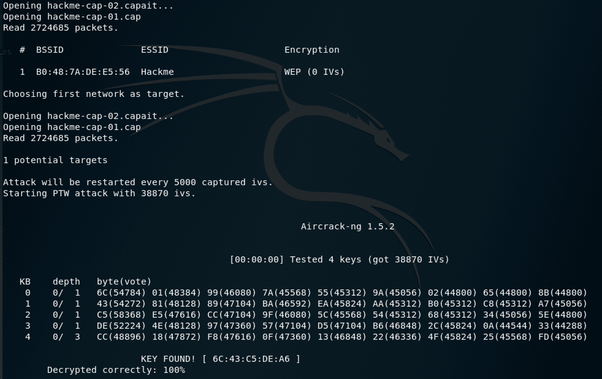

图 30：WEP 密钥破解

记住去掉冒号`:`，以获取实际的密钥。

破解 WPA/WPA2 和 WEP 之间的区别在于方法。WEP 使用统计方法，可以用来加快破解过程，但在 WPA/WPA2 中，唯一存在的选项是暴力破解。

# 总结

在这一章中，您已经了解了各种无线攻击方法。我们已经确定了无线网络的一个关键组成部分，无线帧，以及可以从其中一些帧中获取的各种信息。您已经了解了哪些网络卡能够执行数据包注入，拦截无线数据包，以及如何增加 Alfa 无线网卡的功率评级。

我们讨论了存在于无线网络中的各种加密方法，以及它们的漏洞。您已经了解了各种攻击工具，以及如何执行不同类型的攻击。最后，您已经学会了如何破解 WEP 和 WPA/WPA2 预共享密钥。

在第十章中，*横向移动和提升特权*，我们将探讨如何在网络中横向移动，以寻找高特权账户的目标。您还将学习如何在网络中提升特权。

# 问题

1.  列举三种无线帧的类型。

1.  从信标帧中可以获得什么类型的信息？

1.  为什么 WPA2 比 WPA 更安全？

1.  列举四种无线攻击类型。

1.  列举三种无线攻击工具的名称。
