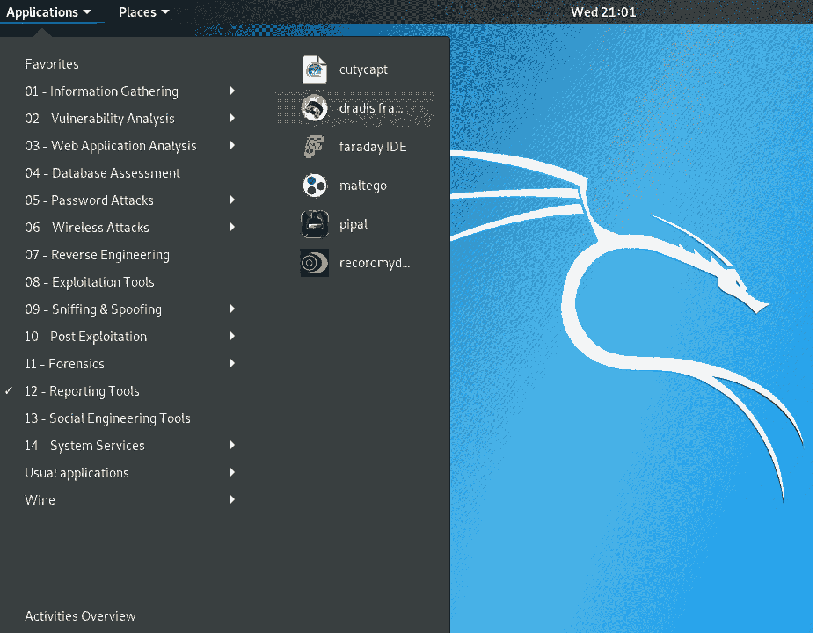
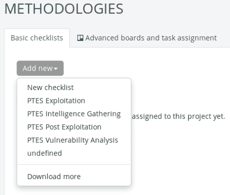
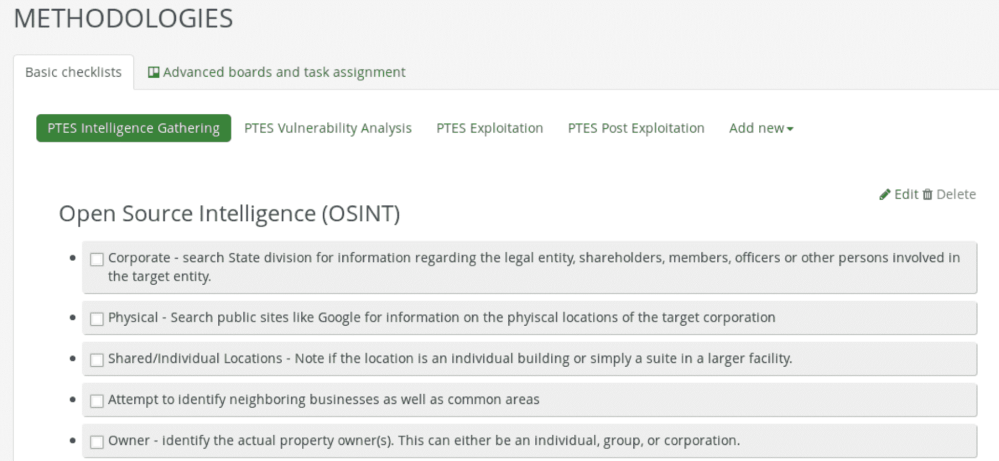
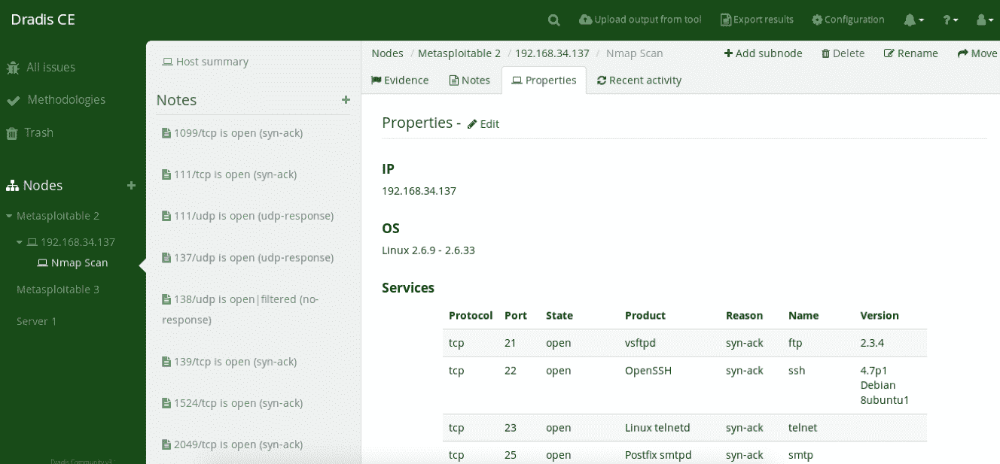

# 第十三章：报告和对发现的行动

渗透测试报告非常重要，因为它为客户提供了测试的详细结果。在本章中，你将能够了解渗透测试报告的具体内容。你将能够确定报告的受众及其对报告的看法有何不同。你将学会如何使用 Dradis，它可以帮助你跟踪发现、问题和证据，这些都可以用在你的报告中。你将学会推荐什么样的补救工作来帮助客户保护他们的环境。

随着你在本章的学习过程中，你将了解以下主题：

+   渗透测试报告的重要性

+   渗透测试报告的内容是什么？

+   报告撰写工具

+   推荐补救选项

# 技术要求

本章需要以下技术要求：

+   Kali Linux 2019.1

# 渗透测试报告的重要性

不要低估报告的重要性。渗透测试报告是你讲述在目标组织中导航和发现漏洞的故事的一种方式。它允许你向利益相关者传达重要信息，如高管和 IT 管理团队。这将帮助他们推动补救工作，并为可能需要制定或更新的政策提供高管支持，以解决发现的风险。请记住，在信息安全领域，如果没有高管利益相关者的支持，政策注定会失败。

对于技术团队，报告提供了他们环境有多脆弱的清晰图景。它将为他们提供有关哪些方面容易受攻击、为什么容易受攻击、会影响谁以及漏洞如何被利用的全部技术细节。拥有这些信息将帮助技术团队准备补救工作的路线图，并计划首先解决哪些问题。

不要陷入没有足够时间撰写体面报告的困境——确保你在计划中考虑了报告撰写。

在撰写报告时，不要假设阅读报告的人具有与你相同的技术水平。他们在 IT 领域工作，但他们的兴趣可能与你的迥然不同。学会如何在报告中解释你的发现是一门艺术；随着你在这个领域的成长和经验的积累，你将掌握这门艺术。最终，你希望你的报告能够帮助建立与客户的关系，然后他们会一次又一次地使用你的服务。

# 渗透测试报告的内容是什么？

一些客户可能会告诉你他们想在报告中看到什么，而有些客户则不会。无论如何，你都应该有一个报告遵循的基本结构。这里将讨论的结构绝不是一个模板；它只是帮助你了解报告中会有什么。如果你在一个联系其他组织进行渗透测试的组织工作，他们可能有自己的模板。如果你作为个人进行渗透测试，你将建立自己的模板。

让我们看看报告可能包含的一些部分。

# 封面

封面应包含渗透测试公司的名称和标志。客户的名称应显示，以及为渗透测试指定的任何标题。这将在为同一客户执行多次测试时提供清晰的区分。日期应出现在此页面上，以及文档的分类。报告中包含的细节是敏感的，不应该供所有人查看；因此，应使用**机密**或**高度机密**等分类。

# 执行摘要

执行摘要将以高层次传达渗透测试的具体目标和发现。这一部分的受众将是负责战略愿景、安全计划和组织监督的人员。这一部分通常包含我们将在下面描述的子部分。

# 背景

在这一部分，您需要定义测试的目的。确保您连接了预参与阶段讨论的细节，以便读者能够将风险、对抗措施或测试目标与测试的目标和结果联系起来。

您还可以在这一部分列出在参与过程中可能发生变化的任何目标。

# 整体态度

在这里，您将说明渗透测试的整体态度。您将说明渗透测试的有效性以及测试期间实现了哪些目标。在这一部分中，您可以说明它对组织的潜在影响。

# 风险排名

这一部分将定义组织的整体风险排名。您将使用在预参与阶段达成一致的评分机制。

一个例子是**损害潜力**，**可重现性**，**可利用性**，**受影响用户**和**可发现性**模型（**DREAD**）。每个方面可以定义如下：

+   **损害潜力**：资产受到多大影响？

+   **可重现性**：攻击有多容易重现？

+   **可利用性**：资产有多容易被利用？

+   **受影响用户**：有多少用户受到影响？

+   **可发现性**：漏洞有多容易被发现？

通过回答这些问题，您将为每个发现的项目分配一个风险评级值。这可以是**高**，**中**或**低**。风险评级值可以是一些简单的数字表示，例如，低=1，中=2，高=3。

将所有值相加将确定风险评级：

| **风险评级** | **结果** |
| --- | --- |
| 高 | 12-15 |
| 中等 | 8-11 |
| 低 | 5-7 |

使用 DREAD 模型对发现进行评估的一个例子如下：

**发现的漏洞**：缺乏输入过滤使得可以利用 SQL 注入攻击从 SQL 数据库中提取用户详细信息。

分析 DREAD 模型中项目的评级将确定风险评级：

| **项目** | **评级** |
| --- | --- |
| 损害潜力 | 3 |
| 可重现性 | 2 |
| 可利用性 | 3 |
| 受影响用户 | 3 |
| 可发现性 | 1 |

一旦将所有值相加，总和为 12，这意味着风险评级很高。

# 一般发现

在这一部分，您将得到对发现的整体视图。这不会是具体的详细发现，而是发现的统计表现。您可以使用图表或图形来表示已经测试的目标、结果、攻击场景和预参与阶段定义的其他指标。您可以查看使用图表来表示问题的原因，例如，操作系统未加固=35%，等等。

对抗措施的有效性也可以在这里列出。例如，当测试一个已经部署了 Web 应用程序防火墙的 Web 应用程序时，您可以说明五次攻击中有两次被防火墙阻止。

# 战略路线图

路线图提供了一个优先级排列的补救计划。这些必须与业务目标和影响程度相权衡。理想情况下，这一部分应该与组织定义的目标相匹配。

路线图可以分为短期、中期和长期活动。短期将定义组织在 1-3 个月内可以解决已发现问题的活动。中期可能是 3-6 个月，而长期可能是 6-12 个月。

# 技术报告

技术报告是您将传达您发现的所有技术细节的地方。这份文件的这一部分将详细描述参与范围。这一部分的受众将是具有深厚技术技能的人员，可能是解决发现问题的人员。

技术报告的第一部分将是介绍部分。这一部分将包括谁参与了渗透测试、联系信息、目标系统或应用程序、目标和范围等主题。

让我们专注于可能包括在技术报告中的主要主题。

# 使用的工具

在某些情况下，您的客户可能希望重现您进行的测试。为了让他们获得相同的结果，披露您使用的工具以及它们的版本将是有益的。

一个例子如下：

+   **测试平台**：Kali Linux 2019.1

+   **Metasploit Framework v5**：渗透测试框架

+   **Burp Suite 专业版 v1.7.34**：Web 应用测试框架

+   **Nmap v7.70**：端口扫描和枚举工具

您将继续列出在渗透测试期间使用的所有工具。

# 信息收集

在这一部分，您将写关于客户可获取多少信息。一定要突出公共和私人信息的范围。如果需要，您可以将这一部分分为两个类别：

+   **被动信息收集**：这一部分是您将展示在不向目标发送任何数据的情况下收集到的信息量。例如，您可以突出从精心设计的 Google dork、DNS 或公开可访问的文档中获取的任何信息。

+   **主动信息收集**：在这一部分，您将展示使用端口扫描和其他足迹活动等技术获取了多少信息。这一部分披露了通过直接向资产发送数据获取的数据。

公开可访问的信息对于任何组织来说都应该是一个巨大的关注点，特别是如果在公开可访问的文档中存在可能泄露组织用户名结构的元数据。

# 漏洞评估和利用

在这一部分，您将定义用于识别漏洞以及漏洞如何被利用的方法。您将包括漏洞的分类、证据以及 CVE 细节等内容。

在披露漏洞时，一定要将它们分为技术漏洞和逻辑漏洞。

技术漏洞是可以通过缺失的补丁、编码错误或注入恶意代码来利用的漏洞，例如，SQL 注入攻击。

逻辑漏洞是通过发现应用程序工作方式的缺陷来利用的，例如，一个未能执行权限检查的 Web 应用程序。

以下是您报告漏洞的一个例子：

+   **发现**：在这里，您将详细讨论发现。例如：我们发现 Server01（`192.168.10.15`）缺少 MS17-010 微软 Windows 补丁，并且该服务器已被手动利用 DoublePulsar。DoublePulsar 为系统创建了一个后门，可以被任何人使用。它为勒索软件（如 WannaCry 和 NotPetya）打开了一扇门，特别是在没有 MS17-010 补丁的系统上。我们能够利用这个缺失的补丁获得对具有完全管理权限的服务器的访问。由于我们可以访问服务器，我们能够使用 Metasploit 的 hashdump 提取本地管理员账户（`localadmin`）及其密码哈希。

+   **受影响的主机**：这里是您定义主机或应用程序的全名，例如，`CLIENT\Server01`（主机名）。

+   **使用的工具**：在这里，您将解释您使用的工具，例如，Metasploit Framework v5。

+   **证据**：这是您提供利用证据的地方。可以是截图或屏幕文本捕获的形式。

+   **业务影响**：在本节中，您定义了发现的风险是什么。例如，当系统未能及时打补丁时，它们可能会引入风险，这可能会被恶意软件、勒索软件和恶意用户滥用，以获取对敏感信息的访问权限。

+   **根本原因**：这定义了漏洞的根本原因。这可能是技术性的，比如缺少安全补丁，也可能是与流程相关的。例如，根本原因是与流程相关的，因为存在补丁管理系统。服务器未能及时打补丁。

+   **建议**：在这里，您将定义应采取的建议行动方案，以纠正这一发现。确保提供尽可能多的细节。例如，短期行动将是更新服务器，以确保其与所有 Microsoft 补丁保持最新。长期行动将是确保每月对整个网络进行漏洞评估，并确保服务器和工作站完全打补丁。管理层还应扫描网络，查找所有手动利用 DoublePulsar 的系统，并将其从网络中移除，因为它们为任何人创建了系统的后门。

在报告中获得正确的细节水平可能有些棘手。如果报告过于详细，一些客户可能会觉得不知所措，而有些客户可能会觉得缺乏细节。确定报告中应包含的正确细节量的最佳方法是花时间与客户一起，了解他们的期望和他们希望从报告中得到什么。

# 渗透后

一旦讨论了漏洞及其利用，您需要强调对客户的实际影响。请记住，这种影响将是客户在真实世界攻击中所经历的。

在本节中，您可以利用截图详细说明影响的程度。您可以在本节中讨论以下主题：

+   特权升级路径和使用的技术，例如哈希传递攻击，最终伪造黄金票证

+   使用持久性维持访问的能力

+   数据外泄的能力

+   可能使用枢纽点访问的其他系统

本节可以讨论反制措施的有效性，包括积极和消极的反制措施。检测能力也属于本节；例如，杀毒软件能否检测到您的有效载荷？

如果在渗透测试期间触发了任何事件响应活动，这些应该列在本节中。

# 结论

结论将对渗透测试进行最终概述。在本节中，您可以重申测试的部分内容以及客户如何提升其安全姿态。无论结果有多糟糕，都要以积极的态度结束。这将使您的客户对未来的测试活动有信心。

# 报告撰写工具

在撰写渗透测试报告时，您可能会想知道如何跟踪发现。也许您更喜欢使用文字处理器的手动方法，或者您可能希望使用更直观的工具。

Kali Linux 包含一个名为 Dradis 的工具，这是一个开源框架，安全专业人员用于有效信息共享。Dradis 有社区版和专业版。Kali Linux 包含社区版。专业版包含一些有趣的功能，如自定义品牌、双因素认证、一键报告以及导出到多种文件类型的能力。然而，社区版包含专业版本具有的核心功能，并允许您以 HTML 或 CSV 格式导出结果。

Dradis 可从应用程序 | 报告工具中访问：

图 1：访问 Dradis

当您第一次运行 Dradis 时，您将被提示创建共享服务器密码和一个新用户帐户。完成后，您将登录到 Dradis 的主要登录页面。

# 方法论

在 Dradis 中，有一个名为方法论的部分。这是您想要为给定项目执行的任务列表。您可以创建自己的方法论或导入现有的方法论：

图 2：Dradis 的方法论组件

如果您点击“添加新内容”并选择“下载更多”，您将被重定向到一个链接，您可以在那里下载合规包。下载 PTES 技术指南；这将是一个`.zip`文件，您需要解压缩。文件的内容中将会有一个名为`ptes_methodology`的文件夹；将这些文件解压缩到`/var/lib/dradis/templates/methodologies`。文件解压缩后，刷新 Dradis 页面。

现在，您将能够添加各种 PTES 方法论。继续添加它们：

图 3：添加 PTES 方法论

添加完后，注意输出。现在您有了一个可以在 PTES 方法论的不同阶段执行的各种任务的清单。这是确保在执行渗透测试时遵循方法论标准的好方法：

图 4：按照 PTES 方法论的清单

当然，并非所有的渗透测试都会遵循这种方法。随着您执行不同的渗透测试，您将创建针对客户定制的不同方法论。

# 节点

节点可以类比为文件系统中的文件夹。这是您将存储笔记、附件和证据文件等信息的地方。节点将帮助您构建项目结构。

要创建一个节点，请点击“节点”右侧的加号（+）号。在这里，您将添加一个顶级节点。您可以一次添加一个或全部添加：

图 5：添加多个节点

创建节点结构后，您可以从其他工具上传文件。在这里，您可以从 Nmap 扫描、Nessus、Nikto 等导入文件：

图 6：从其他工具上传文件

在下面的截图中，我上传了一个 Nmap 扫描。Dradis 已经填充了属性和笔记部分以反映扫描结果：

图 7：Nmap 扫描结果导入到 Dradis

当您导入各种工具输出时，Dradis 将利用其规则引擎自动填充数据到节点中。

# 问题和证据

**问题**包含有关问题或漏洞的信息。例如，您可以在这里提供描述、CVE、URL 引用等。

**证据**显示存在问题。例如，您可能会创建一个漏洞利用的证据。

在您创建证据之前，您需要创建一个问题。要创建问题，请点击“问题”右侧的加号（+）号。如果愿意，您可以使用模板，但不是必须的。定义您将展示证据的问题，如下所示：

图 8：创建问题

创建问题后，您可以导航到要记录证据的节点，并点击证据标志。接下来，您将从下拉列表中选择问题，然后编写您的证据：

图 9：创建证据

在节点中，您可以选择上传附件。附件可以是来自目标的截图、报告、文件等。

您可以通过点击项目顶部的“导出结果”链接来探索项目。

在进行渗透测试时，使用 Dradis 可以帮助您跟踪您的发现。方法论可以作为一个很好的提醒，以防您在渗透测试的特定阶段错过了一步。

# 推荐纠正选项

在渗透测试报告中，您需要提出如何保护所发现的发现的建议。重要的是要了解漏洞如何得到纠正，而不仅仅是知道如何利用它们。

让我们考虑一下本书中进行的一些攻击以及可以推荐的纠正活动。

# 信息收集

在信息收集阶段，我们看了如何使用公开可访问的来源（OSINT）收集有关我们目标的信息。组织不可避免地会公开发布信息。保护信息免受暴露（例如文档中的元数据）的关键是使用诸如**信息保护**之类的技术。信息保护保护数据免受未经授权的使用、披露、访问、破坏、中断和修改。信息保护利用了一些技术，如加密、数据分类、策略和流程来保护信息。

保护免受主动信息收集的攻击包括保护不应该打开的端口。还可以使用网络层防御，如交换机上的访问控制列表和防火墙进行过滤。

# 社会工程

社会工程学可能是攻击者可以利用的最危险的攻击向量之一。成功的社会工程攻击取决于攻击者能够获取的信息量。同样，在渗透测试中，成功的社会工程攻击将取决于您能够获取有关目标组织的信息量。

在保护免受社会工程攻击方面并没有银弹。归根结底，是我们的人性会使我们成为这类攻击的受害者。然而，组织可以采取一些措施，如下所示：

+   **教育**: 为最终用户提供教育对于任何组织都至关重要。如果用户不知道如何识别社会工程攻击，他们怎么能不成为受害者呢？教育的关键在于让最终用户关心安全。

+   **意识**: 组织需要意识到公开可获得的信息类型。这种信息是攻击者将首先访问的信息。如果信息披露了太多，以至于可以轻松制定社会工程攻击，那么组织就需要解决这个问题。

+   **身份验证**: 组织需要考虑多种识别用户的方式。例如，当用户通过自助门户请求重置密码时，应该有某种形式的双因素身份验证。

+   **技术**: 许多组织正在将他们的电子邮件转移到 Office 365 等云服务。在 Office 365 中，有许多可以启用的安全机制，以防范复杂的网络钓鱼攻击。大多数情况下，组织并不完全了解现有的防御措施，或者他们可能没有正确地调整它们。

社会工程对组织可能非常危险。这完全取决于可以用来攻击组织的信息量。如果社会工程是您渗透测试中的一个攻击向量，请确保披露您可以访问多少信息以成功发动攻击。这将帮助组织了解他们的弱点并加以解决。

# 漏洞和操作系统加固

软件很难做到没有错误，因此漏洞总是存在的。这在操作系统等大型软件中是显而易见的。操作系统是复杂的，有许多组件共同工作。只需一个组件中的一个缺陷就可以使系统被利用。

通常构建软件的组织遵循**软件开发生命周期**（**SDLC**）。这是一个定义了如何开发、维护和替换软件的详细步骤的框架。现在安全已经被纳入软件生命周期，以便构建安全的软件。这大大减少了代码中发现的错误数量，这可能导致漏洞，但这并不能完全消除编码错误的风险。

这就是补丁管理发挥作用的地方。建立一个适当的补丁管理流程，并且遵守这个流程将大大减少组织使用的软件相关的漏洞数量。

操作系统加固是确保不会利用已知易受攻击的不安全协议的另一个好方法。例如，SMBv1 的缺陷是已知的，并且容易被利用。**互联网安全中心**（**CIS**）维护着一个很好的基准库，并讨论了如何加固各种系统。CIS 基准可以在这里找到：[`www.cisecurity.org/cis-benchmarks/`](https://www.cisecurity.org/cis-benchmarks/)。

微软维护适用于其产品套件的安全基线。这些基线在其产品中启用特定的安全功能非常出色。这些基线可以在这里找到：[`blogs.technet.microsoft.com/secguide/`](https://blogs.technet.microsoft.com/secguide/)。

# 密码

基于密码的攻击是仍然在使用的最简单和最古老的攻击形式。今天，组织已经意识到拥有强密码的价值，但问题在于可用性。例如，强制执行 12 位字符的密码很容易，但最终用户会如何反应？很可能他们会使用常见密码，如`January@1234`，并按月份递增，或者他们会有一个非常安全的密码，最终会把它写下来或存储在某个地方。密码的另一个问题是人们倾向于重复使用它们。他们的域密码可能与在 Facebook 上使用的密码相同。

保护密码需要使用除密码之外的认证方式。多因素认证在当今是必不可少的。利用额外的认证方法，如令牌、短信或电话呼叫，增加了额外的保护层。将多因素认证与密码最佳实践相结合，如强制复杂性、更长的密码长度和强制禁用密码列表，将增加安全性。

# 网络应用程序

网络应用程序是攻击者的主要目标，因为它们是面向公众的。特别是如果网络应用程序服务器没有从网络层正确分割，它们可以作为进入网络的入口。

**开放式网络应用程序安全项目**（**OWASP**）维护着一个名为**OWASP 十大**的列表。这个十大列表讨论了 10 个最关键的网络应用程序安全风险以及对它们的缓解措施。它详细解释了攻击及其影响，并提供了攻击场景的参考。OWASP 十大可以在这里找到：[`www.owasp.org/index.php/Category:OWASP_Top_Ten_Project`](https://www.owasp.org/index.php/Category:OWASP_Top_Ten_Project)。

寻找网络应用程序攻击预防的另一个好资源是 OWASP 攻击类别，可以在这里找到：[`www.owasp.org/index.php/Category:Attack`](https://www.owasp.org/index.php/Category:Attack)。

# 权限提升和横向移动

横向移动是网络中最常见的攻击之一。螃蟹式地在环境中移动为攻击者提供了一个广阔的领域，可以浏览以检测高特权帐户。

横向移动中最容易使用的帐户之一是**本地管理员**帐户。通常，该帐户共享相同的名称和密码，这意味着如果您在一台计算机上破坏了它，可以轻松地在另一台计算机上重复使用。纠正这一点将需要在网络中强制执行随机本地管理员帐户密码。在 Windows 环境中，可以使用**本地管理员密码解决方案**（**LAPS**）来实现这一点。有关更多信息，请访问：[`www.microsoft.com/en-us/download/details.aspx?id=46899`](https://www.microsoft.com/en-us/download/details.aspx?id=46899)。

良好的凭证卫生习惯对于防止特权升级至关重要。这意味着不将高特权帐户暴露给较低信任的系统，例如，在工作站上限制使用**域管理员**帐户。如果工作站受到攻击，**域管理员**帐户的哈希值可能会被转储，游戏就结束了。在任何环境中，强制执行最小特权原则应该成为一种规范。

# 总结

在本章中，您已经对渗透测试报告中包含的内容有了很好的理解。您现在有能力创建一个针对高管和技术人员的报告。您已经亲身体验了使用报告工具 Dradis 来记录渗透测试中的发现。您已经深入了解了客户可以部署的各种安全措施，以增强其安全姿态。

在下一章（第十四章*，我接下来该怎么做？*），我们将介绍如何通过查看认证、在线培训资源和练习技能来在渗透测试领域发展您的职业生涯。

# 问题

1.  渗透测试报告的重要性是什么？

1.  报告的执行和技术部分有什么区别？

1.  有什么工具可以帮助你制作报告？

1.  寻找与 Web 应用程序攻击和预防相关信息的好来源是什么？

1.  保护免受特权升级和横向移动的影响涉及做什么？
