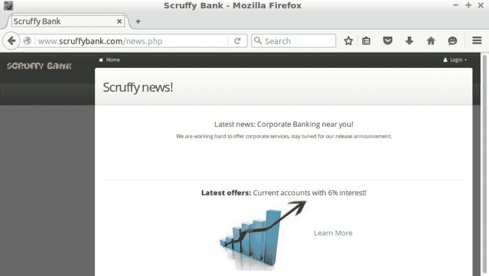

# 第一章：Web 应用渗透测试简介

在本章中，我们将讨论以下主题：

+   了解 Web 应用渗透测试的过程

+   典型的 Web 应用工具包

+   培训环境

让我们开始吧！

# 了解 Web 应用渗透测试的过程

在这一部分，我们将了解什么是 Web 应用渗透测试以及其背后的过程。我们将从了解什么是 Web 应用渗透测试，执行这些测试的重要性，专业方法的外观，以及我们将简要解释为什么有必要掌握使用 Python 编写自己的工具的技能开始。

渗透测试是一种安全测试，从攻击者的角度评估应用程序的安全性。这是一种进攻性的练习，你必须像攻击者一样思考，并了解开发人员以及涉及的技术，以揭示所有的缺陷。

目标是识别所有的缺陷，并展示它们如何被攻击者利用，以及对我们公司的影响。最后，报告将提供解决方案来修复已经检测到的问题。这是一个手动和动态测试。手动意味着它严重依赖于进行测试的人的知识，这就是为什么学习如何编写自己的渗透测试工具是重要的，它将在你的职业生涯中给你一个优势。动态测试是我们测试正在运行的应用程序的地方。这不是对源代码的静态分析。安全测试对我们来说是有用的，可以验证和验证应用程序安全控制的效果，并识别这些安全控制的松懈。

那么，为什么我们要进行渗透测试呢？如今，IT 已经席卷了整个世界。大部分公司的流程和数据都是由计算机处理的。这就是为什么公司需要投资于安全测试，以验证安全控制的有效性，以及很多时候它们的缺乏。

EMC 的一份报告（[`www.scmagazine.com/study-it-leaders-count-the-cost-of-breaches-data-loss-and-downtime/article/542793/`](https://www.scmagazine.com/study-it-leaders-count-the-cost-of-breaches-data-loss-and-downtime/article/542793/)）指出，每家公司的年度财务损失报告平均为停机 497,037 美元，安全漏洞 860,273 美元，数据丢失 585,892 美元。此外，公司资源都投入到事件响应和修复、测试和部署问题中：

这就是为什么进行渗透测试将帮助公司保护他们客户的数据、知识产权和服务。渗透测试是由四个主要部分组成的简单方法，如下所示：

+   侦察：在这个阶段，我们将收集信息，以识别所使用的技术、支持应用程序的基础设施、软件配置、负载平衡等。这个阶段也被称为指纹识别。

+   映射：然后我们进入映射阶段，在这个阶段，我们建立应用程序页面和功能的地图或图表。我们的目标是识别组件及其关系。支持映射的技术之一是蜘蛛或爬行。此外，在这个阶段，我们将通过进行暴力攻击来发现非链接资源。

+   漏洞：一旦我们将所有组件、参数、表单和功能映射出来，我们就会进入第三阶段，开始发现漏洞。

+   利用：在识别所有漏洞后，我们可以进入最后一个阶段，即利用漏洞。根据渗透测试的范围，一旦你利用了漏洞，你可以从新的优势点重新开始整个过程。通常，这是目标 DMZ，你会尝试进入他们的内部网络段。

这里没有代表的一步是报告阶段，您需要记录所有发现，以便向客户或公司呈现。

最后，有两种渗透测试，即黑盒和白盒。黑盒测试发生在您没有关于目标的任何信息时，这基本上与攻击者的情况相同，而白盒测试发生在客户提供文档、源代码和配置以加速过程时，我们只关注有趣的领域。

您可能想知道，在此过程中应该测试哪些领域？以下是一些最重要的要覆盖的领域：

+   配置和部署管理测试

+   身份管理测试

+   身份验证测试

+   授权测试

+   会话管理测试

+   输入验证

+   测试错误处理

+   密码学

+   业务逻辑测试

+   客户端测试

我们将在本章中涵盖其中一些领域。

您可以通过阅读 OWASP 测试指南来扩展对这些领域的了解：[`www.owasp.org/index.php/OWASP_Testing_Project`](https://www.owasp.org/index.php/OWASP_Testing_Project)。

那么，为什么要构建自己的工具？Web 应用程序非常不同，因为它们使用多种技术、组合、流程和实现。

这就是为什么没有一个单一的工具可以覆盖您在职业生涯中遇到的所有情况。很多时候，我们会编写脚本来测试特定问题或执行某些任务，并利用漏洞。在本书的过程中，我们将看到如何编写工具并测试不同领域，如身份验证、输入验证和发现，并最终编写一个简单的 HTTP 代理，它可能成为我们自己安全扫描仪的基础。编写自己的工具是一项宝贵的技能，将使您超越许多无法适应工具或编写自己工具的渗透测试人员。在某些渗透测试任务中，这可能产生重大影响。

# 典型的 Web 应用工具包

在本节中，我们将看看安全专业人员用于执行 Web 应用程序渗透测试的不同工具。

# HTTP 代理

测试 Web 应用程序最重要的工具是 HTTP 代理。这个工具允许您拦截浏览器和服务器之间的所有通信，双向都可以。这些代理被称为中间人代理。这些工具将让我们了解应用程序的工作方式，最重要的是，它将允许我们拦截请求、响应并修改它们。

通常，代理将在与您用于测试应用程序的浏览器相同的计算机上运行。安全专业人员最常用的 HTTP 代理是 PortSwigger 安全的 Burp Suite（[`portswigger.net/burp/proxy.html`](https://portswigger.net/burp/proxy.html)）和 OWASP 的 Zed Attack Proxy（ZAP）（[`www.owasp.org/index.php/OWASP_Zed_Attack_Proxy_Project`](https://www.owasp.org/index.php/OWASP_Zed_Attack_Proxy_Project)）。我们还有 MITM 代理。这是一个在 Python 中开发的较新的替代方案，适合构建工具或自动化某些场景。缺点是它只有控制台，没有图形用户界面，对于我们的目的来说，这是一个好处。

# 爬虫和蜘蛛

爬虫和蜘蛛用于映射 Web 应用程序，自动完成目录化所有内容和功能的任务。该工具通过跟踪找到的所有链接、提交表单、分析新内容的响应并重复此过程直到覆盖整个应用程序来自动爬行应用程序。

有独立的爬虫和蜘蛛，如 Scrapy（http://scrapy.org），它们是用 Python 编写的，或者命令行工具，如 HT track（http://www.httrack.com）。我们有与 Burp 和 ZAP 等代理集成的爬虫和蜘蛛，它们将受益于通过代理传递的内容，以丰富对应用程序的了解。

这是有价值的一个很好的例子，当应用程序使用大量 JavaScript 时。传统的爬虫无法解释 JS，但浏览器可以。因此，代理会看到它并将其添加到爬虫目录中。我们稍后会更详细地了解 Scrapy。

# 漏洞扫描器

现在，让我们进入更复杂的工具：漏洞扫描器。

这些工具被认为更复杂，因为它们必须在一个工具中自动化大部分安全测试方法。它们将进行爬行、发现、漏洞检测和一些利用。最常用的两个开源 Web 应用程序安全扫描器是 w3af（http://w3af.org/）（用 Python 编写）和 Arachni（http://www.arachni-scanner.com/）（用 Ruby 编写）。

有多种商业替代方案，比如 Acunetix（http://www.acunetix.com/），这是最便宜的之一，性价比很高。

# 暴力破解/可预测的资源定位器

Web 暴力破解或发现工具用于通过字典攻击查找文件、目录、servlet 或参数等内容。这些工具使用了安全专业人员在过去 10 年中收集的词汇表，其中包含已知的文件名目录或仅在不同产品或 Web 应用程序中找到的单词。

这些类型工具的前身是 DIRB（http://dirb.sourceforge.net/），它仍然可用，并由 Dark Raver 维护。另一个很好的选择是 Wfuzz（http://www.edge-security.com/wfuzz.php），我过去开发过，现在由 Xavier Mendez 维护和开发。您可以在 Kali 中找到这个工具，这是最常用的渗透测试发行版。

诸如 Burp 和 ZAP 之类的工具提供了这些功能。所有这些工具都受益于 FUZZDB 提供的词汇表，FUZZDB 是用于 Web 应用程序测试的词汇表数据库。我们将看到如何构建一个类似于 Wfuzz 的工具来实现这个目的。

# 特定任务工具

我们有大量专注于特定任务的工具，如编码器和哈希器，Base 64、MD5、SHA1 和 Unicode。

专门用于利用特定类型漏洞的工具，例如 SQL 注入器（如 SQL map）、XSS 控制台（如 Beef，用于演示 XSS 和 DOM XSS 的影响）、扫描器（如 Dominator）等。此外，工具包中的一个重要类型是后渗透工具。

一旦您成功利用了漏洞，并帮助您控制服务器、上传文件、Shells、代理内容到内部网络，并在内部扩展攻击，这些工具就会派上用场。在测试新应用程序和技术时，有许多其他工具可以克服无限的挑战。

# 测试环境

在本节中，我们将看一下我们的测试实验室环境。我们将首先安装 VirtualBox 软件来运行我们的实验室虚拟机。我们将访问易受攻击的 Web 应用程序，熟悉文本编辑器，最后，我会给你一个重要的警告。

我们需要的第一个工具是 VirtualBox。这将允许您运行为本培训创建的实验室环境虚拟机。您可以从[`www.virtualbox.org/wiki/Downloads`](https://www.virtualbox.org/wiki/Downloads)下载 VirtualBox。选择您的主机操作系统并下载安装程序。下载 VirtualBox 后，我们可以从[`drive.google.com/open?id=0ByatLxAqtgoqckVEeGZ4TE1faVE`](https://drive.google.com/open?id=0ByatLxAqtgoqckVEeGZ4TE1faVE)下载为本课程创建的虚拟机。

文件下载完成后，我们可以继续安装 VirtualBox。

安装 VirtualBox，在我的情况下，我必须双击`.dmg`文件进行安装。按照安装说明进行操作。完成后，解压实验室虚拟机。在我的情况下，我在 OS X 中使用存档。您可以在其他平台上使用 7 ZIP。

解压后，我们将启动 VirtualBox。

打开虚拟机。一旦虚拟机在 VirtualBox 中加载，我们将启动该机器，并等待它引导，直到我们收到登录提示符。我们将使用用户名`Packt`和密码`secret`登录。

root 用户密码是`packt2016`。

现在，我们的实验室已经准备好了。为了本书的目的，我们创建了一个易受攻击的 Web 应用程序，它将允许我们使用我们自己开发的工具来测试不同类型的漏洞。该应用程序模拟了一个非常简单的银行应用程序。

它是用 PHP 和 MySQL 开发的，并由 Apache 提供。现在，我们将在我们的虚拟机中打开浏览器。加载 URL`www.scruffybank.com`。我创建了一个`/ETC/hosts`条目，将该主机名重定向到本地主机。该应用程序在虚拟机中的 Apache 服务器上运行。

您应该看到索引页面。如果单击“了解更多”，您将看到以下信息：

在右上角，您可以访问登录页面。

我们实验室中的最后一个工具是文本编辑器，我们将在其中编写脚本。一个可能的选择是 Atom，这是一个由 GitHub 开发的跨平台开源免费编辑器。请随意安装或使用您喜欢的编辑器。

要启动 Atom，转到名为 Atom 的桌面项目，编辑器将以空白文件启动。您可以开始输入代码，但在保存文件并添加扩展名之前，它不会进行语法高亮显示。

我将在我的主目录中打开一个名为`Video-3.py`的示例。这就是 Atom 中 Python 脚本的样子：

我想强调的是，许多渗透测试活动，如果不是全部，都不允许在没有目标公司许可的情况下进行。

在许多国家，这些活动是非法的，没有适当的许可。每当你想尝试新的工具或技术时，都要使用测试环境。同样，每当你为客户执行渗透测试时，都要获得书面授权。

# 摘要

在本章中，我们看到了什么是 Web 应用程序渗透测试，为什么执行测试很重要，执行渗透测试时要遵循的方法论，需要涵盖的不同领域，以及为什么重要要学会用 Python 编写自己的工具。

我们还看到了使 Web 应用程序渗透测试工具包的工具。这有助于我们了解这些工具如何与方法论对齐，并在需要创建自己的工具时提供灵感，从中学习，并了解它们的工作原理。

我们还看到了在整本书中将要使用的实验室环境。

我们已经安装了 VirtualBox，运行了实验室虚拟机，并访问了测试 Web 应用程序 scruffy bank。我们看到了文本编辑器的一个快速示例，最后，我们看到了一个关于未经客户许可进行渗透测试后果的重要警告。

在第二章中，*与 Web 应用程序交互*，我们将学习如何使用 Python 与 Web 应用程序进行交互，了解 HTTP 请求、URL、标头、消息正文的结构，并创建一个脚本来执行请求并解释响应及其标头。
