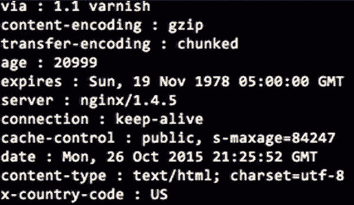
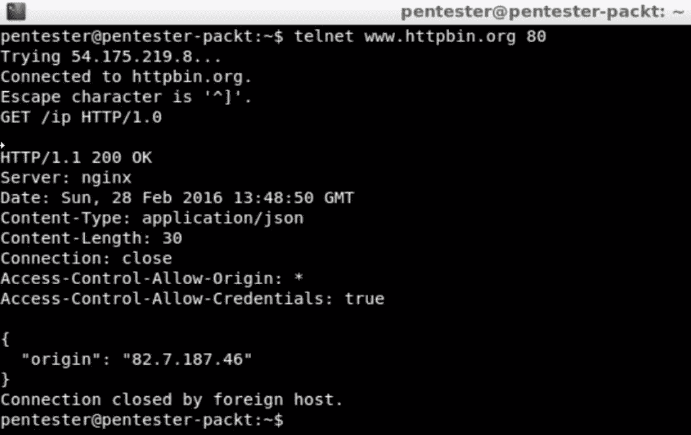
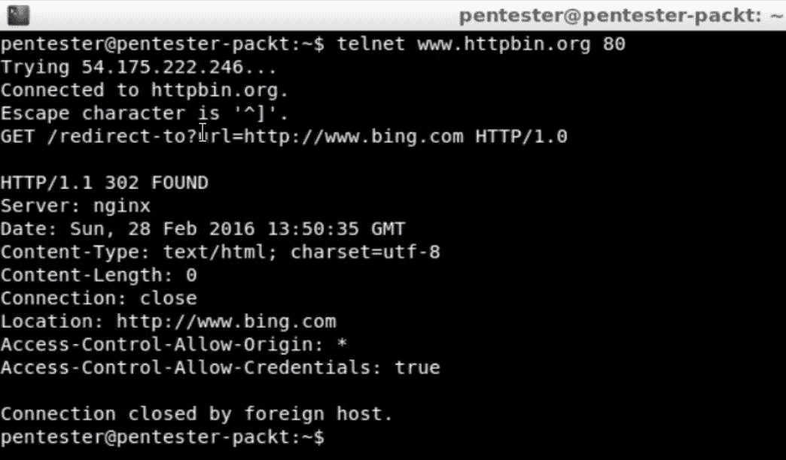
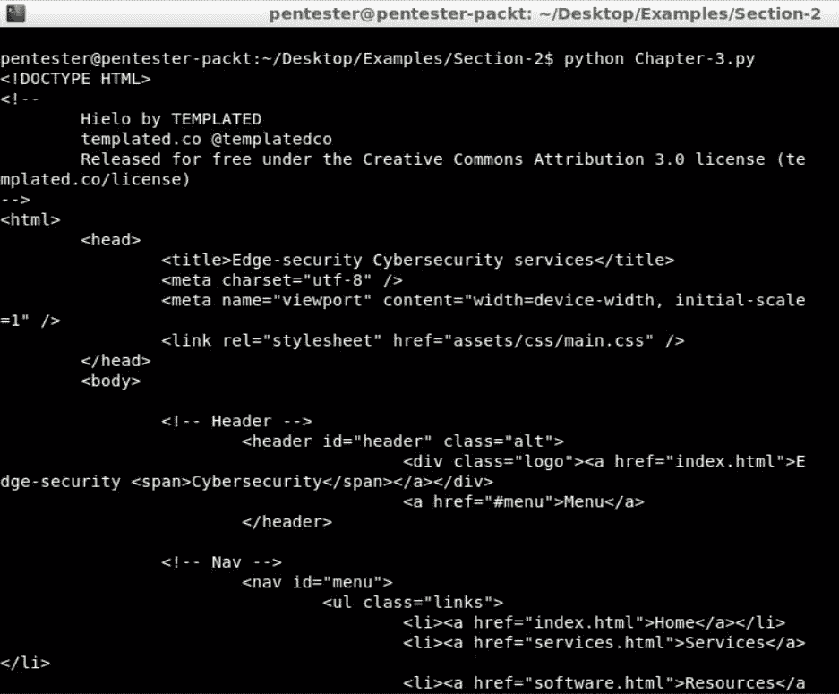
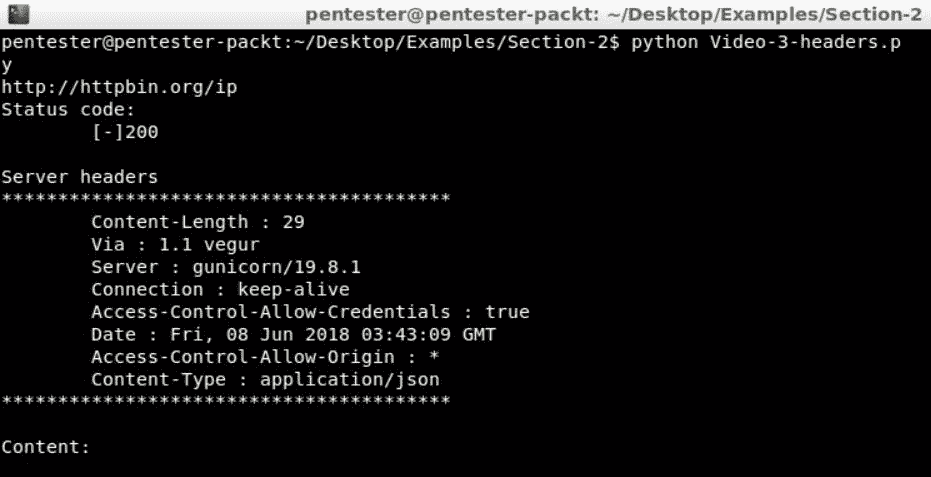
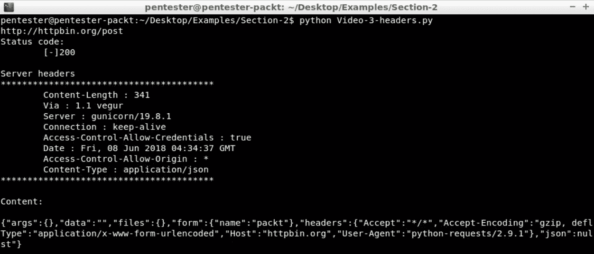
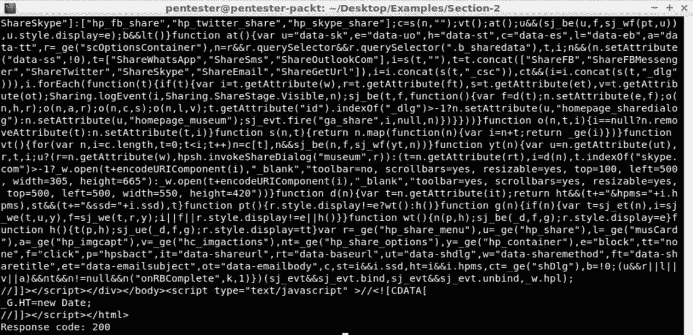
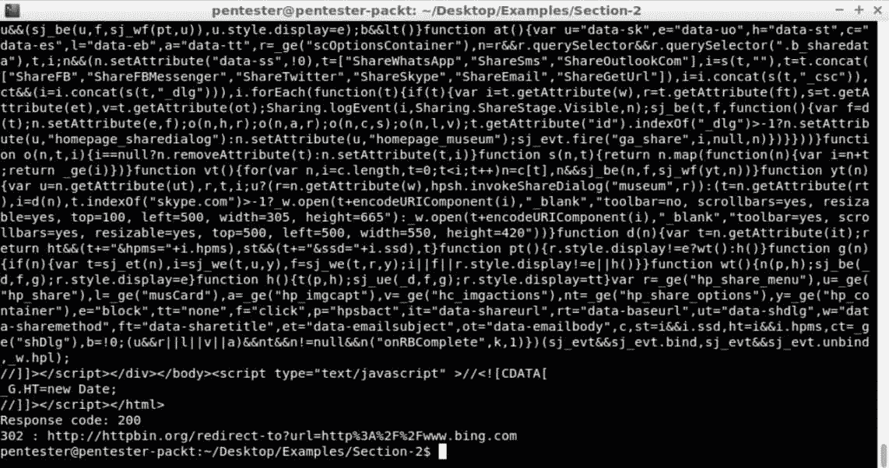

# 与 Web 应用程序交互

在上一章中，我们了解了 Web 应用程序安全流程以及为什么测试应用程序安全性很重要。在本章中，我们将看一下以下主题：

+   HTTP 协议基础知识

+   HTTP 请求的解剖

+   使用 requests 库与 Web 应用程序交互

+   分析 HTTP 响应

# HTTP 协议基础知识

在本节中，我们将学习 HTTP 协议，它是如何工作的，以及它的安全方面，以及在执行请求时支持哪些方法。

这将为您提供 HTTP 的基本知识，这对于理解如何构建工具并测试 Web 应用程序中的安全问题非常重要。

# HTTP 是什么以及它是如何工作的？

HTTP 旨在实现客户端和服务器之间的通信。

HTTP 是基于 TCP/IP 的通信协议，运行在应用层。通常，我们使用 Web 浏览器与 Web 应用程序进行交互，但在这个培训中，我们将放下浏览器，使用 Python 与 Web 应用程序进行交流。这个协议是媒体独立的。

这意味着只要客户端和服务器知道如何处理数据内容，就可以通过 HTTP 发送任何类型的数据。它是无状态的，这意味着在请求到事务期间，HTTP 服务器和客户端只是彼此知道对方的存在。由于这个特性，客户端和服务器都不会在请求之间保留信息，这在进行一些攻击时会有所帮助。

HTTP 协议有两个不同的版本：

+   **HTTP/1.0**：这为每个请求/响应事务使用一个新连接

+   **HTTP/1.1**：这是连接可以被一个或多个请求响应事务使用的地方

HTTP 不是一个安全协议，这意味着所有通信都是明文的，容易被拦截和篡改。

通常，HTTP 是在端口`80`上提供的。以下是一个简单交易的示例：


在左侧，我们有客户端，它向服务器发送一个 HTTP `GET`请求，请求资源`test.html`。如果服务器上存在`test.html`，服务器将返回一个带有`200 OK`代码、一些标头和内容`test.html`的 HTTP 响应。

如果不存在，它将返回`404 Not Found`响应代码。这代表了 Web 应用程序世界中最基本的`GET`请求。

1994 年，引入了 HTTPS 以在 HTTP 之上增加安全性。HTTPS 本身不是一个协议，而是在**安全套接字层**（**SSL**）或**传输层安全性**（**TLS**）之上叠加 HTTP 的结果。

HTTPS 在不安全的网络上创建了一个安全通道。这确保了合理的保护，使窃听者和中间人攻击者无法轻易窃取信息，前提是使用了足够的密码套件，并且服务证书经过验证和受信任。因此，每当应用程序处理敏感信息，如银行支付、购物网站、登录页面和个人资料页面时，应该使用 HTTPS。基本上，如果我们处理流程或存储客户数据，应该使用 HTTPS。

在 HTTP 中，方法表示对所选资源执行的期望操作，也称为 HTTP 动词。HTTP/1.0 定义了三种方法：

+   `HEAD`：这将只返回标头和状态代码，不包括内容

+   `GET`：这是用于检索资源内容的标准方法，给定一个 URI

+   `POST`：这是一种用于向服务器提交内容的方法，包括表单数据、文件等

然后，HTTP/1.1 引入了以下方法：

+   `OPTIONS`：这为目标资源提供通信选项

+   `PUT`：这请求存储由给定 URI 标识的资源

+   `DELETE`：这将删除由给定 URI 标识的目标资源的所有表示

+   `TRACE`：这个方法回显接收到的请求，以便客户端可以看到中间服务器所做的更改或编辑

+   `CONNECT`：这建立了一个由 HTTPS 使用的给定 URI 标识的服务器的隧道

+   `PATCH`：此方法对资源应用部分修改

`HEAD`，`GET`，`OPTIONS`和`TRACE`按照惯例被定义为安全的，这意味着它们仅用于信息检索，不应改变服务器的状态。

另一方面，诸如`POST`，`PUT`，`DELETE`和`PATCH`之类的方法旨在执行可能在服务器或外部产生副作用的操作。除了这些方法还有更多。我鼓励你去探索它们。

我们已经看到 HTTP 是一种无状态的客户端服务器协议。

该协议不提供任何安全性，因此 HTTPS 被创建用于在 HTTP 之上添加一个安全层。我们还了解到有一些不同的方法，它们将指示服务器对所选资源执行不同的操作。

# HTTP 请求的解剖

在本节中，我们将看一下 URL 的结构、请求和响应标头，并使用 Telnet 对`GET`请求进行示例，以了解它在低级别上是如何工作的。

我打赌你现在已经看过成千上万个 URL 了。现在是停下来思考 URL 结构的时候了。让我们看看每个部分的含义：


第一部分是 Web 应用程序中的协议。使用的两种协议是 HTTP 和 HTTPS。使用 HTTP 时，将使用端口`80`，使用 HTTPS 时，端口将是`443`。

接下来是我们要联系的主机。接下来，我们可以看到该服务器中的资源或文件位置。在这个例子中，目录是`content`，资源是`section`。然后，我们有问号符号，表示接下来要来的是查询字符串。这些是将传递给页面部分进行处理的参数。

还有一些替代方案，例如在主机之前添加用户名和密码进行身份验证，或者明确定义端口，以防 Web 服务器未在标准`80`或`443`端口上监听。

# HTTP 标头

现在，让我们谈谈标头。标头是 HTTP 请求和响应的核心部分。

它们描述了客户端和服务器之间的通信方式，并提供了有关交易的信息。我们有客户端标头，这些标头由浏览器发送。一些示例如下：

+   **User-agent**：这通知服务器用户使用的操作系统、浏览器和插件类型。

+   **Accept-encoding**：这定义了浏览器支持的编码，通常是 GZip 或 Deflate。这将压缩内容并减少每次交易的带宽时间。

+   **Referer**：这包含了引用 URL，基本上是你从哪个页面点击了该链接。

+   **Cookie**：如果我们的浏览器对其站点有 cookie，它将在 Cookie 标头中添加它们。我们还有服务器端标头，这些标头是由 Web 服务器设置的。

+   **Cache-Control**：这定义了所有缓存机制必须遵守的指令。

+   **位置**：这用于重定向。每当有`301`或`302`响应时，服务器必须发送此标头。

+   **Set-Cookie**：这是用于在用户浏览器中设置 cookie 的标头。

+   **WWW-Authenticate**：服务器使用此标头请求身份验证。当浏览器看到此标头时，它将打开一个登录窗口，要求输入用户名和密码。

这是在对[`www.packtpub.com/`](https://www.packtpub.com/)进行`GET`请求时响应标头的示例：



我们在这里提到了一些，比如`cache-control`，`content-encoding`和`content-type`。我建议你熟悉所有这些。每当你发现一个新的标头时，都要了解它的功能。

# GET 请求

在审查 URL 结构和标头之后，让我们尝试在真实服务器上进行`GET`请求。

为了做到这一点，我将使用终端和`telnet`命令向服务器发送原始的`GET`请求。这是我们尝试通过输入 Telnet 连接来模拟浏览器的方式。

执行以下步骤：

1.  让我们切换到我们的虚拟机，打开终端并键入以下内容：

```py
telnet www.httpbin.org 80
```

`80`是我们希望 Telnet 连接的端口。`httpbin.org`是一个提供 HTTP 请求和响应服务的网站，对于测试工具非常有用。

按*Enter*。

1.  一旦连接，我们将看到以下消息：


这意味着连接已建立。

1.  接下来，让我们键入`GET /ip HTTP/1.0`并按*Enter*两次。这是我们告诉服务器，我们正在使用`GET`请求名为`/ip`的资源。然后，我们指定`HTTP/1.0`协议，然后按两次*Enter*。结果，我们从服务器得到了第一个响应：



请注意，我们在请求中没有使用任何标头，但是我们从服务器接收了许多标头，以及资源 IP 的内容。

在这种情况下，内容是发出请求的机器的 IP 地址。

现在，让我们举一个例子，但这次请求一个带有参数的 URL。

打开终端并键入：

```py
telnet www.httpbin.org 80
GET /redirect-to?url=http://www.bing.com HTTP/1.0
```

再次，我们使用了`GET`，但这次我们请求将资源重定向到查询字符串中的 URL 参数的值[`www.bing.com`](http://www.bing.com)：



在这种情况下，服务器基本上将浏览器重定向到提供的 URL，使用位置标头并返回`302`重定向代码。在这种情况下，什么也不会发生，因为 Telnet 不解释该标头。请记住，这是一个规则连接。

# 使用 requests 库与 Web 应用程序进行交互

在本节中，我们将开始编写 Python 代码，使用 requests 库执行 HTTP 请求。

# 请求库

Requests 是一个在 Python 中编写的 Apache 2 许可的 HTTP 库。它旨在减少使用`urllib2`和其他当前可用的 HTTP 库时所需的复杂性和工作。

这是使用`urllib2`库进行对`api.github.com`进行身份验证请求所需的代码示例：

```py
import urllib2

gh_url = 'https://api.github.com'

req = urllib2.Request(gh_url)

password_manager = urllib2.HTTPPasswordMgrWithDefaultRealm()
password_manager.add_password(None, gh_url, 'user', 'pass')

auth_manager = urllib2.HTTPBasicAuthHandler(password_manager)
opener = urllib2.build_opener(auth_manager)

urllib2.install_opener(opener)

handler = urllib2.urlopen(req)

print handler.getcode()
print handler.headers.getheader('content-type')
```

这是使用`requests`库的相同函数：

```py
import requests

r = requests.get('https://api.github.com', auth=('user', 'pass'))

print r.status_code
print r.headers['content-type']
```

这种简单性非常明显。编写脚本时，它确实简化了我们的工作。

# 我们的第一个脚本

让我们开始用 Python 编程。在这个第一个示例中，我们将使用 Python 和`requests`库执行`GET`请求：

1.  让我们在虚拟机中打开 Atom 编辑器，并通过导航到`File | New File`来创建一个新文件。

1.  我们将导入`requests`库开始。这可以通过键入`import requests`来完成。

1.  现在，我们需要创建一个名为 R 的变量，其中我们将使用`GET`方法实例化一个 requests 对象，并且目标 URL 在这种情况下是`httpbin.org/ip`：

```py
import requests
r=requests.get('http://httpbin.org/ip')
```

1.  最后，我们使用`print r.text`打印响应的内容。

1.  将文件保存在`/Examples/Section-2`文件夹中，命名为`Chapter-3.py`。

1.  让我们在终端上运行它。打开终端，并使用以下命令将目录更改为`/Example/Section-2`：

```py
cd Desktop/Examples/Section-2/ 
```

1.  接下来，我们使用以下命令运行它：

```py
python Chapter-3.py
```

我们可以看到响应主体，我们可以再次看到我的 IP：


请记住，`/ip`在主体中返回调用者 IP。

这就是我们使用`requests`库的第一个脚本。恭喜，您正在使用 Python 与 Web 应用程序进行通信！

现在，让我们在`GET`请求中添加一个查询字符串：

1.  为了做到这一点，我们将添加一个名为**payload**的变量，其中包含一个字典，其中每个键是参数名称，值将是该参数的值。在这种情况下，参数是 URL，值将是`http://www.edge-security.com`。

1.  然后，我们将把资源更改为`/redirect-to`而不是 IP。该资源期望带有有效 URL 的参数 URL，这将重定向我们。

1.  我们还需要将有效载荷作为请求中`params`的值添加，`params=payload`：

```py
import requests
payload= {'url':'http://www.edge-security.com'}
r=requests.get('http://httpbin.org/redirect-to',params=payload)
print r.text
```

1.  然后，我们将保存它。

1.  现在，如果我们运行脚本，我们将在`python Chapter-3.py`终端中看到重定向页面的内容。就是这样。

在这里，我们在终端中有`www.edge-security.com`的所有内容：



这就是我们如何向查询字符串添加参数。

如果我们想要查看服务器返回的返回代码怎么办？我们需要添加以下代码：

1.  让我们通过输入`print "Status code:"`来打印一些标题。

1.  然后，我们可以使用以下命令打印一些格式：

```py
print "t *" + str(r.status_code)
```

我们可以删除`print r.text`以获得更清晰的响应。

1.  我们保存它，并在终端中用 Python 和脚本的名称运行它。我们可以看到状态`200`，这意味着请求是有效的：


现在，我们将看到如何访问响应的头部。

1.  我们将返回虚拟机中的编辑器并打开`Video-3-headers.py`文件，这样可以节省一些打字。这个脚本再次使用资源/IP。

为了访问响应头，我们使用请求对象的 headers 方法。

为了逐行打印它们，我们可以做一个循环并从`r.headers`中解压键和值。

1.  让我们尝试在终端中运行这个。

1.  我们将使用 Python 和脚本文件名。您可以看到服务器返回的不同头部，以及响应代码和响应体内容。

如果我们只想要请求头部以节省带宽并加快返回响应事务时间，我们回到编辑器并将`get`方法改为`head`方法。

我们保存脚本，然后转到控制台运行它。我们可以看到状态代码是`200`，我们得到了头部，但我们不再有响应体内容：



这是因为使用的方法是`head`，我们只从服务器得到了头部。

# 设置头部

现在，我们将看到如何设置请求的头部。

为什么我们要这样做？因为我们可能需要添加应用程序所期望的自定义头部。我们想要伪装我们的用户代理，以使服务器误以为我们是一个移动设备。我们可能想要更改`post`头部以欺骗服务器或负载平衡，或者我们可能想要暴力破解或篡改头部值并查看应用程序如何处理它。

让我们尝试设置一个标题：

1.  返回编辑器中的脚本。我们将修改请求，将方法改回`get`，将资源从`ip`改为`headers`。这将使`http://bin.org`将我们发送的爬行头部作为响应体返回，以进行调试：

```py
#!/usr/bin/env
import requests
r = requests.get('http://httpbin.org/ip')
print r.url
print 'Status code:'
print '\t[-]' + str(r.status_code) + '\n'

print 'Server headers'
print '****************************************'
for x in r.headers:
    print '\t' + x + ' : ' + r.headers[x]
print '****************************************\n'

print "Content:\n"
print r.text
```

1.  保存它，然后运行它。

1.  我们可以看到用户代理`requests`库在每个请求中都发送`python-requests`。

1.  现在，让我们返回编辑器并将`user-agent`头部设置为一个随机测试值。我们需要添加一个名为`myheaders`的字典，其中包含一个键名，用户代理，和测试值`Iphone 6`：

```py
myheaders={'user-agent':'Iphone 6'}
```

1.  我们还需要添加请求，一个名为 headers 的参数，值为`myheaders`：

```py
#!/usr/bin/env
import requests
myheaders={'user-agent':'Iphone 6'}
r = requests.post('http://httpbin.org/post',data={'name':'packt'})
print r.url
print 'Status code:'
print '\t[-]' + str(r.status_code) + '\n'

print 'Server headers'
print '****************************************'
for x in r.headers:
    print '\t' + x + ' : ' + r.headers[x]
print '****************************************\n'

print "Content:\n"
print r.text
```

1.  让我们在控制台中再次运行它。

我们可以看到服务器接收到我们修改后的用户代理伪装成`Iphone 6`：



现在，你知道如何操作头部了。

现在我们已经看到了`get`和`head`请求，让我们来看看`post`请求，我们将发送表单参数：

1.  返回 Atom 编辑器并用`post`替换`get`方法。

1.  我们还将更改 URL。这次，我们将使用 post 资源`http://bin.org/post`并添加数据字典。

这通常是你在 Web 应用程序中看到的表单数据。在这种情况下，我们在数据字典中添加一个参数，键名为 code，值为`packt`。我们保存它，然后在控制台中运行脚本。完美；我们可以在结果中看到我们提交的值的字典形式。

恭喜，现在你知道如何使用 Python 执行不同的 HTTP 请求了！

# 分析 HTTP 响应

在本节中，我们将学习不同的 HTTP 响应状态代码和不同类别的 HTTP 响应代码。

然后，我们将编写示例来查看成功的响应或错误，最后，我们将看到一个重定向示例。

# HTTP 代码

HTTP 协议定义了五类响应代码，用于指示请求的状态：

+   **1XX-信息**：100 范围的代码用于信息目的。它仅存在于 HTTP/1.1 中。

+   **2XX-成功**：200 范围的代码用于指示客户端请求的操作已收到、理解、接受和处理。最常见的是`200 OK`。

+   **3XX-重定向**：300 范围指示客户端必须采取其他操作才能完成请求。这些代码中的大多数用于 URL 重定向。这个组中最常见的是`302 Found`代码。

+   **4XX-客户端错误**：400 范围用于指示客户端发生错误。最常见的是`404 Not Found`。

+   **5XX-服务器端错误**：500 范围用于指示服务器端发生错误。最常见的是`500 Internal Server Error`。

我们建议您在这里学习每个组中的不同代码：

[`developer.mozilla.org/en-US/docs/Web/HTTP/Status`](https://developer.mozilla.org/en-US/docs/Web/HTTP/Status)

让我们写一些代码。让我们在虚拟机中打开我们的编辑器并创建一个新文件：

1.  首先，通过输入`import requests`来导入`requests`库。

1.  我们将为我们的目标 URL 创建一个变量。我们将再次使用`httpbin.org`并输入：

```py
url='http://httpbin.org/html'
```

1.  然后，我们将使用`req.status _code`打印响应代码。我们通过输入以下内容来执行此操作：

```py
req = requests.get(url) 
```

1.  打印`req.status_code`字符串的响应代码。可以这样做：

```py
print "Response code: " + str(req.status_code) 
```

1.  就是这样！我们将文件保存在`/Example/Section-2`中，命名为`Video-4.py`，然后切换到终端运行脚本。

1.  使用`python Video-4.py`。

您应该在响应中看到`200`状态代码，这意味着我们的请求成功：


干得好，让我们继续。

让我们回到编辑器：

1.  现在，让我们将目标 URL 更改为不存在的内容。为了看到错误代码，我们将更改 URL 并写入`fail`：

```py
import requests
url='http://httpbin.org/fail'
req = requests.get(url)
print "Response code: " + str(req.status_code)
```

1.  让我们保存并再次在终端中运行此脚本。

现在，当我们运行服务器时，它将返回`404`状态代码，这意味着服务器上找不到资源：


所以，现在我们知道我们可以向服务器请求目录和文件列表，并找出哪些存在，哪些不存在。有趣，对吧？

现在，让我们看看如何处理重定向。我们将使用一个示例页面，该页面将获取一个参数 URL 并将我们重定向到该定义的 URL：

1.  让我们回到我们的脚本，并修改它以获取一个名为`payload`的新目录，其中将包含我们要重定向到的 URL。

1.  我们将使用`payload='url'`来重定向到`www.bing.com`。我们可以这样做：

```py
payload={'url':'http://www.bing.com'} 
```

1.  现在，我们将使用这个资源`redirect-to`并添加`params`参数，并将其设置为`payload`。

1.  最后，我们将使用`print req.text`打印内容：

```py
import requests
url='http://httpbin.org/redirect-to'
payload = {'url':'http://www.bing.com'}
req = requests.get(url,params=payload)
print req.text
print "Response code: " + str(req.status_code)
```

1.  我们将保存并再次运行它。

现在，我们得到了什么？一个`200`代码和[`www.bing.com/`](https://www.bing.com/)的内容：



代码应该是`302`，对吧？我们需要访问请求的历史记录以查看重定向。

1.  让我们添加`print r.history`。历史记录是重定向链中所有响应的列表。我们将使用此循环将每个 URL 的 URL 和响应代码打印到我们的脚本中。

1.  对于`x in req.history`，打印此状态代码与 URL 连接：

```py
import requests
url='http://httpbin.org/redirect-to'
payload = {'url':'http://www.bing.com'}
req = requests.get(url,params=payload)
print req.text
print "Response code: " + str(req.status_code)
for x in req.history:
        print str(x.status_code) + ' : ' + x.url
```

1.  保存并运行：



现在，我们可以看到在`200`之前，有一个`302`重定向代码将我们的浏览器发送到[www.bing.com](http://www.bing.com)。

# 总结

在本章中，我们简要介绍了 HTTP，并看到了一个基本的`GET`请求示例。我们还看到了可用的不同 HTTP 方法，可以用来与 Web 应用程序进行交互。

我们还学习了关于 HTTP 请求。我们学习了如何使用 Python 和`requests`库与 Web 应用程序进行交互。我们进一步了解了 HTTP 请求解剖和不同的 HTTP 方法和响应代码。

在第三章中，*使用 Scrapy 进行网络爬虫-映射应用程序*，我们将学习如何编写网络爬虫，使用 Python 编写 Spider，以及如何使用 Scrappy 库。
