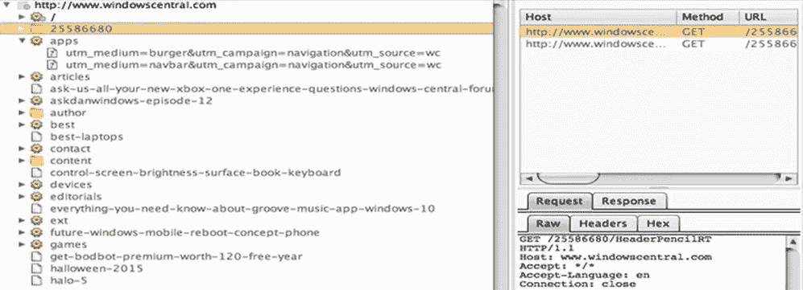
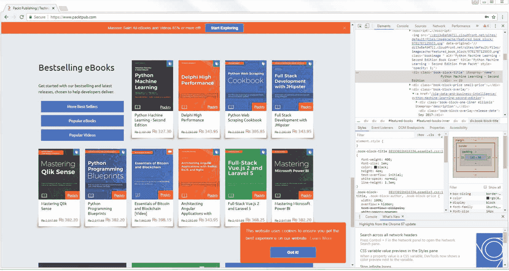
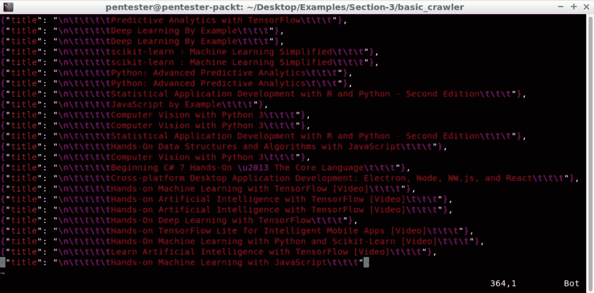
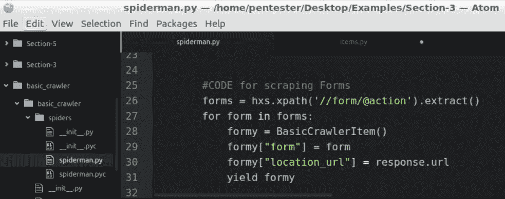
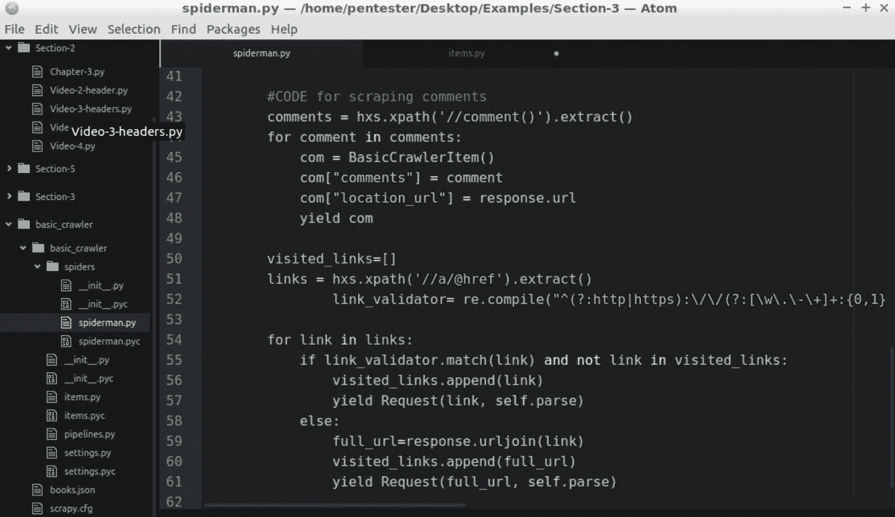

# 使用 Scrapy 进行 Web 爬行-映射应用程序

在第二章，*与 Web 应用程序交互*中，我们学习了如何使用 Python 和 requests 库以编程方式与 Web 应用程序进行交互。在本章中，我们将涵盖以下主题：

+   Web 应用程序映射

+   使用 Scrapy 创建我们自己的爬虫

+   使我们的爬虫递归

+   抓取有趣的东西

# Web 应用程序映射

还记得在第一章，*Web 应用程序渗透测试简介*中，我们学习了渗透测试过程。在该过程中，第二阶段是映射。

在映射阶段，我们需要构建应用程序资源和功能的地图或目录。作为安全测试人员，我们的目标是识别应用程序中的所有组件和入口点。我们感兴趣的主要组件是以输入参数为输入的资源、表单和目录。

映射主要是通过爬虫来执行的。爬虫也被称为蜘蛛，通常执行抓取任务，这意味着它们还将从应用程序中提取有趣的数据，如电子邮件、表单、评论、隐藏字段等。

为了执行应用程序映射，我们有以下选项：

+   第一种技术是爬行。其思想是请求第一页，传递所有内容，提取范围内的所有链接，并重复这个过程，直到整个应用程序都被覆盖。然后，我们可以使用 HTTP 代理来识别爬虫可能错过的所有资源和链接。基本上，浏览器中使用 JavaScript 动态生成的大多数 URL 将被爬虫忽略，因为爬虫不解释 JS。

+   另一种技术是通过使用字典攻击来发现应用程序中未链接到任何地方的资源。我们将在下一节中构建我们自己的 BruteForcer。

在这里，我们有 Burp 代理使用代理和蜘蛛功能创建应用程序映射的示例：



我们可以看到目录、静态页面和接受参数的页面，以及不同的参数和不同的值。

所有有趣的部分将用于使用不同的技术处理漏洞，如 SQL 注入，跨站脚本，XML 注入和 LDAP 注入。基本上，映射的目的是覆盖所有应用程序，以识别漏洞识别阶段的有趣资源。

在下一节中，我们将开始开发我们自己的爬虫。准备好了吗！

# 使用 Scrapy 创建我们自己的爬虫

在本节中，我们将创建我们的第一个 Scrapy 项目。我们将定义我们的目标，创建我们的爬虫，最后运行它并查看结果。

# 开始使用 Scrapy

首先，我们需要定义我们想要实现的目标。在这种情况下，我们想要创建一个爬虫，它将从[`www.packtpub.com/`](https://www.packtpub.com/)提取所有的书名。为了做到这一点，我们需要分析我们的目标。如果我们去[`www.packtpub.com/`](https://www.packtpub.com/)网站，右键单击书名并选择检查，我们将看到该元素的源代码。在这种情况下，我们可以看到书名的格式是这样的：



创建一个用于提取所有书名的爬虫

在这里，我们可以看到`div`的`class`是`book-block-title`，然后是标题名称。记住这一点，或者在笔记本中记下来，那会更好。我们需要这样做来定义我们在爬行过程中想要提取的内容。现在，让我们开始编码：

1.  让我们回到我们的虚拟机并打开一个终端。为了创建一个爬虫，我们将切换到`/Examples/Section-3`目录：

```py
cd Desktop/Examples/Section-3/
```

1.  然后，我们需要使用以下 Scrapy 命令创建我们的项目：

```py
scrapy startproject basic_crawler 
```

在我们的情况下，爬虫的名称是`basic_crawler`。

1.  当我们创建一个项目时，Scrapy 会自动生成一个具有爬虫基本结构的文件夹。

1.  在`basic_crawler`目录中，您会看到另一个名为`basic_crawler`的文件夹。我们对`items.py`文件和`spiders`文件夹中的内容感兴趣：


这是我们将要处理的两个文件。

1.  因此，我们打开 Atom 编辑器，并通过`Examples | Section-3 | basic crawler`下的`Add Project Folder...`添加我们的项目。

1.  现在，我们需要在 Atom 编辑器中打开`items.py`：


在使用 Scrapy 时，我们需要指定在爬取网站时我们感兴趣的内容。这些内容在 Scrapy 中称为 items，并且可以将它们视为我们的数据模块。

1.  因此，让我们编辑`items.py`文件并定义我们的第一个项目。我们可以在前面的截图中看到`BasicCrawlerItem`类已创建。

1.  我们将创建一个名为`title`的变量，它将是`Field`类的对象：

```py
title = scrappy.Field()
```

1.  我们可以删除`title = scrappy.Field()`之后的代码的其余部分，因为它没有被使用。

目前就是这些。

1.  让我们继续进行我们的爬虫。对于爬虫，我们将在为此练习创建的`spiderman.py`文件上进行操作，以节省时间。

1.  我们首先需要将其从`Examples/Section-3/examples/spiders/spiderman-base.py`复制到`/Examples/Section-3/basic_crawler/basic_crawler/spiders/spiderman.py`：

```py
cp examples/spiders/spiderman-base.py basic_crawler/basic_crawler/spiders/spiderman.py
```

1.  然后，打开编辑器中的文件，我们可以在文件顶部看到为其工作所需的导入。我们有`BaseSpider`，这是基本的爬取类。然后，我们有`Selector`，它将帮助我们使用交叉路径提取数据。`BasicCrawlerItem`是我们在`items.py`文件中创建的模型。最后，找到一个`Request`，它将执行对网站的请求：


然后，我们有`class MySpider`，它有以下字段：

+   `name`：这是我们爬虫的名称，以便以后调用它所需的名称。在我们的情况下，它是`basic_crawler`。

+   `allowed_domains`：这是允许被爬取的域名列表。基本上，这是为了将爬虫限制在项目的范围内；在这种情况下，我们使用`packtpub.com`。

+   `start_urls`：这是一个包含爬虫将开始处理的起始 URL 的列表。在这种情况下，它是`https://www.packtpub.com`。

+   `parse`：顾名思义，这里是结果解析的地方。我们用请求的`response`实例化`Selector`，对其进行解析。

然后，我们定义将包含执行以下交叉路径查询结果的`book_titles`变量。交叉路径查询是基于我们在本章开头进行的分析。这将导致一个包含使用响应内容中定义的交叉路径提取的所有书名的数组。现在，我们需要循环该数组，并创建`BasicCrawlerItem`类型的书籍，并将提取的书名分配给书的标题。

这就是我们的基本爬虫。让我们去终端，将目录更改为`basic_crawler`，然后使用`scrapy crawl basic_crawler`运行爬虫。

所有结果都打印在控制台上，我们可以看到书名被正确地抓取出来了：


现在，让我们通过添加`-o books.json -t`，后跟文件类型`json`，将文件夹的输出保存到文件中：

```py
scrapy crawl basic_crawler -o books.json -t json
```

现在运行它。我们将使用`vi books.json`打开`books.json`文件。

我们可以看到书名被提取出来了：


书名中有一些额外的制表符和空格，但我们已经得到了书名。这将是创建爬虫所需的最小结构，但您可能会想我们只是在抓取索引页面。我们如何使其递归地爬取整个网站？这是一个很好的问题，我们将在下一节中回答这个问题。

# 使我们的爬虫递归

在这一部分，我们将开始学习如何提取链接，然后我们将使用它们来使爬虫递归。现在我们已经创建了爬虫的基本结构，让我们添加一些功能：

1.  首先，让我们为这个练习复制准备好的`spiderman.py`文件。从`examples/spiders/spiderman-recursive.py`复制到`basic_crawler/basic_crawler/spiders/spiderman.py`。

1.  然后，回到我们的编辑器。由于我们想要使爬虫递归，为此目的，我们将再次处理`spiderman.py`文件，并开始添加另一个提取器。然而，这次我们将添加链接而不是标题，如下截图所示：


1.  此外，我们需要确保链接是有效和完整的，因此我们将创建一个正则表达式，用于验证以下截图中突出显示的链接：


1.  这个正则表达式应该验证所有的 HTTP 和 HTTPS 绝对链接。现在我们有了提取链接的代码，我们需要一个数组来控制已访问的链接，因为我们不想重复链接和浪费资源。

1.  最后，我们需要创建一个循环来遍历找到的链接，如果链接是绝对 URL 并且以前没有被访问过，我们就`yield`一个带有该 URL 的请求来继续这个过程：


如果链接未通过验证，这意味着它是一个相对 URL。因此，我们将通过将相对 URL 与获取该链接的基本 URL 结合来创建一个有效的绝对 URL。然后，我们将使用`yield`请求。

1.  保存它，然后去控制台。

1.  然后，我们将目录更改为`basic_crawler`，用`scrapy crawl basic_crawler -t json -o test.json`运行它，然后按*Enter*。

我们可以看到它现在正在工作。我们正在递归地爬行和抓取网站中的所有页面：


这可能需要很长时间，所以我们按*Ctrl* + *C*取消，然后我们将得到到目前为止的结果文件。

让我们用`vi test.json`命令打开`test.json`文件。

正如我们在下面的截图中看到的，我们有很多书名，来自多个页面：



恭喜！我们已经建立了一个 Web 应用程序爬虫。

想想现在你可以自动化的所有任务。

# 抓取有趣的东西

在这一部分，我们将看看如何提取其他有趣的信息，比如电子邮件、表单和评论，这些对我们的安全分析很有用。

我们已经为我们的爬虫添加了递归功能，所以现在我们准备添加更多功能。在这种情况下，我们将为电子邮件添加一些提取功能，因为拥有一个有效的账户总是很有用的，在我们的测试过程中可能会派上用场。表单将在从浏览器提交信息到应用程序的地方很有用。评论可能提供有趣的信息，开发人员可能在生产中留下了这些信息而没有意识到。

从 Web 应用程序中可以获得更多的东西，但这些通常是最有用的：

1.  首先，让我们将这些字段添加到我们的 item 中。在 Atom 中打开`items.py`文件并添加以下代码：

```py
    link_url = scrapy.Field()
    comment = scrapy.Field()
    location_url = scrapy.Field()
    form = scrapy.Field()
    email = scrapy.Field()
```

这将用于指示信息的来源。

1.  所以，让我们回到`spiderman.py`文件。我们将复制一个准备好的`spicderman.py`文件。我们将`examples/spiders/spiderman-c.py`复制到`basic_crawler/basic_crawler/spiders/spiderman.py`：

```py
cp examples/spiders/spiderman-c.py basic_crawler/basic_crawler/spiders/spiderman.py
```

1.  让我们回到编辑器。

1.  为了提取电子邮件，我们需要将突出显示的代码添加到我们的`spiderman.py`文件中：


这个选择器可能会产生一些误报，因为它会提取任何包含`@`符号的单词，以及将选择器检测到的结果存储到我们的 item 中的循环。

就是这样，有了这段代码，我们现在将提取我们在爬行过程中发现的所有电子邮件地址。

现在，我们需要做同样的事情来提取`forms`操作。交叉路径将获取表单的操作属性，该属性指向将处理用户提交的数据的页面。然后，我们遍历发现的内容并将其添加到`items.py`文件中：



表单就是这样。

现在，让我们对`comments`代码做同样的操作。我们将创建提取器，并再次迭代结果并将其添加到项目中。现在，我们可以运行爬虫并查看结果：



现在，让我们回到终端，在`basic_crawler`中，我们将输入`scrapy crawl basic_crawler -o results.json -t json`并按*Enter*。

完成爬行将需要很长时间。过一会儿我们将按*CTRL* + *C*来停止它。

完成后，我们可以用 Atom 编辑器打开`results.json`并检查结果：


恭喜！您已经扩展了爬虫，以提取有关网站的有趣信息。

您可以查看结果、表单、评论等。我建议您查看其他处理结果的方法，例如传递它们或将它们存储到 SQLite 或 MongoDB 中。

恭喜！您已经使用 Python 创建了您的第一个 Web 爬虫。

# 总结

在本章中，我们看到了什么是 Web 应用程序映射。我们学会了如何创建基本的 Web 应用程序爬虫。在本章中，我们添加了递归功能，并学会了如何使我们的爬虫递归。

最后，我们学会了如何使用 Python 和 Scrapy 库开发 Web 应用程序爬虫。这对于映射 Web 应用程序结构和从页面源代码中收集表单、电子邮件和评论等有趣信息将非常有用。

现在，我们知道如何使用爬虫映射 Web 应用程序，但大多数应用程序都有隐藏的资源。这些资源对所有用户不可访问，或者并非所有用户都链接。幸运的是，我们可以使用暴力攻击技术来发现目录、文件或参数，以找到我们可以在测试中使用的漏洞或有趣信息。

在第四章中，*资源发现*，我们将编写一个工具，在 Web 应用程序的不同部分执行暴力攻击。
