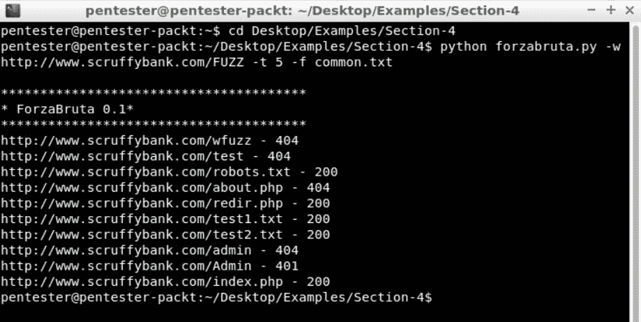
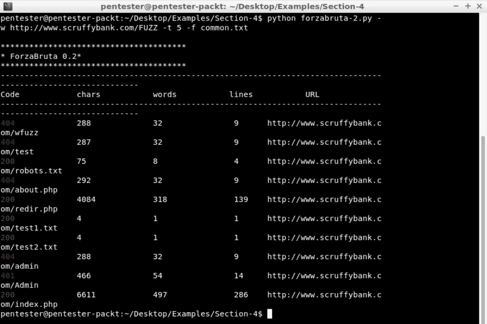
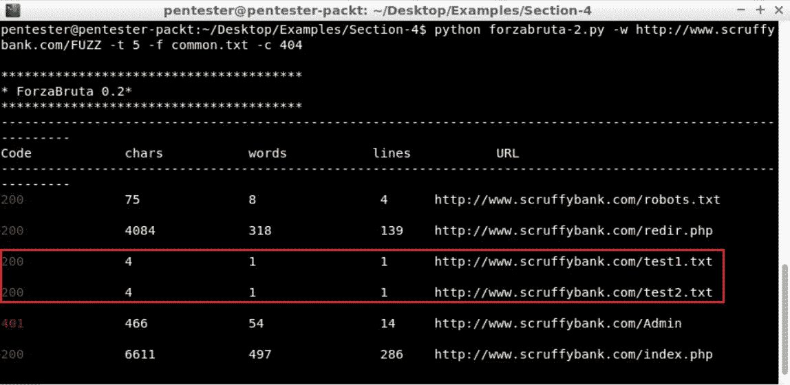
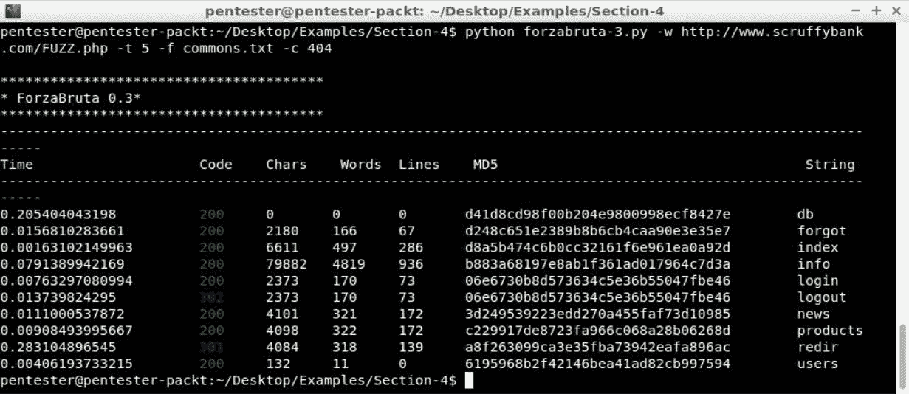
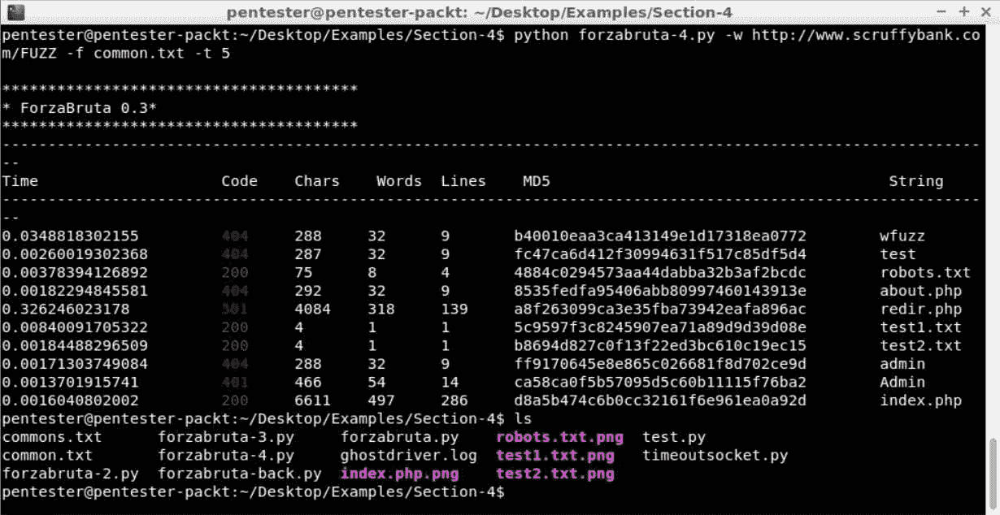

# 第四章：资源发现

在第三章中，*使用 Scrapy 进行 Web 爬虫-映射应用程序*，我们看到了如何使用 Python 和 Scrapy 库编写我们自己的爬虫。在本章中，我们将学习：

+   什么是资源发现？

+   构建我们的第一个 BruteForcer

+   分析结果

+   添加更多信息

+   对发现结果进行截图

# 什么是资源发现？

在这一部分，我们将学习什么是资源发现，以及在测试 Web 应用程序时为什么资源发现很重要。此外，我们将介绍 FUZZDB，它将在下一节作为我们的字典数据库使用。

您会记得，在第一章中，*Web 应用程序渗透测试简介*，我们学习了渗透测试过程。过程中的第二阶段是映射。在映射阶段，我们需要构建应用程序页面和功能的地图或目录。在较早的部分中，我们学习了如何使用爬虫执行应用程序映射。我们还了解到爬虫有一些局限性。例如，爬虫无法识别由 JS 生成的链接。这可以通过使用 HTTP 代理或使用 PhantomJS 等无头浏览器来克服。如果我们这样做，我们应该能够识别与 Web 应用程序中的某个地方链接的所有资源，但我的个人经验告诉我，我们可以找到许多未链接的资源。

为了发现这些资源，我们需要通过已知单词的字典执行资源发现。这些工具被称为：

+   字典攻击：在这里，我们使用已知单词的列表来识别资源

+   暴力破解：这是使用暴力破解来识别资源，当使用字符串的排列或组合列表时

+   模糊测试：这不是真正正确的，但经常用来指代资源发现

使用这些技术，我们能找到什么？

+   文件：例如备份文件、测试文件、笔记、脚本、文档和示例

+   目录：例如管理界面、备份、内部区域和上传目录

+   操作：每当选项或参数中有动词名称时，我们可以使用类似单词的字典来识别其他功能

+   Servlets：类似于带有文件的操作

+   参数：我们可以枚举参数中使用的潜在有效字符串的范围或组合

为了在进行资源恢复时取得成功，您需要具有高质量的列表。有许多字典数据库，您可以在其中找到适用于不同环境或场景的各种单词列表。FUZZDB（[`github.com/fuzzdb-project/fuzzdb`](https://github.com/fuzzdb-project/fuzzdb)）是互联网上最受欢迎和最完整的数据库之一。我们将在下一节中使用它。

对于资源发现，我们将专注于可预测的资源位置字典。我建议您在我们的虚拟机中查看它，在本节的代码示例下，熟悉可用的不同字典或字符串列表。

# 构建我们的第一个 BruteForcer

在这一部分，我们将构建一个脚本，帮助我们使用字典发现资源。我们将创建一个基本的 BruteForcer。我们将从定义工具的目标开始，然后查看 BruteForcer 的基本结构的代码。

最后，我们将使用以下步骤针对我们的测试 Web 应用程序运行它：

1.  返回到我们的编辑器，并通过选择文件|添加项目文件夹...|桌面|示例|第 4 节|确定，打开第 4 节的项目文件夹。

1.  然后，打开`forzabruta.py`文件。

1.  在这个脚本中，我们有了我们暴力破解器的基本结构。我们有我们典型的`import`，然后我们有`banner`函数，它将打印脚本的名称。`usage`函数提供了如何使用脚本的帮助。

1.  现在，让我们跳到`start`函数，当我们运行程序时会调用它：

```py
def start(argv):
    banner()
    if len(sys.argv) < 5:
           usage()
           sys.exit()
    try :
        opts, args = getopt.getopt(argv,"w:f:t:")
    except getopt.GetoptError:
               print "Error en arguments"
               sys.exit()

    for opt,arg in opts :
           if opt == '-w' :
                   url=arg
           elif opt == '-f':
                   dict= arg
           elif opt == '-t':
                   threads=arg
    try:
           f = open(dict, "r")
           words = f.readlines()
    except:
           print"Failed opening file: "+ dict+"\n"
           sys.exit()
    launcher_thread(words,threads,url)
```

打印`banner`，然后检查用来调用我们程序的参数。然后，传递参数并分配 URL 字典和线程数。打开字典并读取所有行，最后，使用`words`、`threads`和`url`调用`launcher_thread`。

由于我们希望我们的应用程序能够同时执行多个任务，我们可以使用线程。否则，我们的暴力破解器将是顺序的，对于大字典来说，速度会很慢。通过使用线程，我们可以加快这次攻击的速度。我们可以在其他工具中实现线程时重用这个脚本的框架，因为通常实现线程是棘手的。

1.  `launcher_thread`函数基本上会管理线程，并为字典中的每个单词和目标 URL 实例化请求执行者类，并启动线程。这将对加载在字典中的每个单词执行：

```py
def launcher_thread(names,th,url):
    global i
    i=[]
    resultlist=[]
    i.append(0)
    while len(names):
        try:
            if i[0]<th:
                n = names.pop(0)
                i[0]=i[0]+1
                thread=request_performer(n,url)
                thread.start()

        except KeyboardInterrupt:
            print "ForzaBruta interrupted by user. Finishing attack.."
            sys.exit()
        thread.join()
    return

if __name__ == "__main__":
    try:
        start(sys.argv[1:])
    except KeyboardInterrupt:
        print "ForzaBruta interrupted by user, killing all threads..!!"
```

1.  线程实例化了`request_performer`类。这个类有一个`init`方法，用于在创建对象后设置对象，基本上是构造函数。在这种情况下，我们基本上创建了属性`self.word`和`self.urly`，它们将用字典中的单词替换`FUZZ`标记。

然后，我们有`run`方法，它将执行请求并打印请求的 URL 和状态码：

```py
class request_performer(Thread):
    def __init__( self,word,url):
        Thread.__init__(self)
        try:
            self.word = word.split("\n")[0]
            self.urly = url.replace('FUZZ',self.word)
            self.url = self.urly
        except Exception, e:
            print e

    def run(self):
        try:
            r = requests.get(self.url)
            print self.url + " - " + str(r.status_code)
            i[0]=i[0]-1 #Here we remove one thread from the counter
        except Exception, e:
                print e
```

最后，更新线程计数器。当字典中的单词被消耗完时，程序将完成。

上述步骤展示了暴力破解器的基本结构。

让我们看一个使用我们易受攻击的测试应用程序的例子：

1.  转到终端，输入`python forzabruta.py`。

1.  现在我们有了第一个选项，即目标 URL 和单词`FUZZ`，它是将被字典中的每个单词替换的标记。这是我们想要测试的位置，在这种情况下是测试应用程序中的字典和文件的根目录。然后，我们有选项`-t 5`，这是我们想要使用的线程数，最后`-f comment.text`，这是为这个练习创建的字典文件。这很简单，但请记住，在真实测试中，您需要使用 FUZZDB 字典。

1.  运行后，我们应该看到以下截图中显示的结果：



我们在字典中每个单词有一个结果。我们有一些有效的`200`状态码，还有一个`401`，表示需要身份验证，以及许多`404`未找到的代码。

让我们在浏览器中看一些例子。我们特别感兴趣的是`/Admin`目录。当我们请求`/Admin`时，会弹出一个需要用户名和密码的身份验证表单；我们稍后会回到这个问题：


现在，让我们看看`robots.txt`是否有什么有趣的东西。`robots.txt`中有三个条目：


一个是`/admin`，另一个是`/includes/`目录。我们已经知道了`admin`，但`/backoffice`看起来很有趣。`robot.txt`经常为我们的测试目的提供一些有趣的发现。

哇，恭喜。你写了一个基本的 HTTP 暴力破解器。这个脚本很基础，结果也不是很好，但我们将在接下来的部分中改进它们。

# 分析结果

在本节中，我们将改进我们在上一节中创建的暴力破解器，以便更容易分析结果。我们将看到如何改进结果，然后将改进内容添加到我们的代码中，并最终测试代码而不测试 Web 应用程序。

在上一节中，我们创建了一个基本的 BruteForcer，但是我们发现结果有点基本，并且当我们有很多结果时，很难识别出有趣的发现。因此，我们可以根据状态码添加颜色。一个好的开始是以绿色打印所有状态码大于或等于 200 且小于 300 的结果；以红色打印状态码大于或等于 400 且小于 500 的结果；最后，以蓝色打印状态码大于或等于 300 且小于 400 的结果。这将帮助我们快速识别结果。我们主要感兴趣的是绿色和蓝色的结果。

我们还可以丰富我们的结果，提供有关响应的更多信息，例如字符数、单词数和行数。这将帮助我们区分返回多个资源相同内容的页面，因为我们可以通过查看字符、单词或行来识别它们。

最后，我们将添加根据状态码过滤或隐藏结果的选项。这将有助于删除通常为 404 的任何未找到的响应；尽管通常开发人员会自定义他们的应用程序或服务器返回 200、301 或 302：

1.  让我们回到我们的编辑器，打开文件`forzabruta-2.py`。

1.  添加一些更多的导入，比如`termcolor`，它将允许我们在终端中打印颜色，以及`re`用于正则表达式：

```py
import requests
from threading import Thread
import sys
import time
import getopt
import re
from termcolor import colored
```

1.  在`request_performer`中，我们从响应中获取所有信息，例如：

+   `lines`: 计算新行的数量

+   `chars`: 计算字符的数量

+   `words`: 计算单词的数量

+   `code`: 计算`status_code`：

```py
class request_performer(Thread):
    def __init__(self, word, url,hidecode):
        Thread.__init__(self)
        try:
            self.word = word.split("\n")[0]
            self.urly = url.replace('FUZZ', self.word)
            self.url = self.urly
            self.hidecode = hidecode
        except Exception, e:
            print e

    def run(self):
        try:
            r = requests.get(self.url)
            lines = str(r.content.count("\n"))
            chars = str(len(r._content))
            words = str(len(re.findall("\S+", r.content)))
            code = str(r.status_code)
```

1.  现在，我们将把它们全部添加到结果输出中。这一系列条件将允许我们根据特定隐藏代码的相等代码来过滤非感兴趣的响应，并以三种不同的颜色可视化其他类型的请求：

```py
            if self.hidecode != code:
                if '200' <= code < '300':
                    print colored(code,'green') + " \t\t" + chars + " \t\t" + words + " \t\t " + lines +"\t" + self.url + "\t\t "
                elif '400' <= code < '500':
                    print colored(code,'red') + " \t\t" + chars + " \t\t" + words + " \t\t " + lines +"\t" + self.url + "\t\t "
                elif '300' <= code < '400':
                    print colored(code,'blue') + " \t\t" + chars + " \t\t" + words + " \t\t " + lines +"\t" + self.url + "\t\t "
                else:
                    print colored(code,'yellow') + " \t\t" + chars + " \t\t" + words + " \t\t " + lines +"\t" + self.url + "\t\t "
```

我们将使用`green`表示大于或等于`200`且小于`300`的状态码，使用`red`表示大于或等于`400`且小于`500`的状态码，以及当结果大于或等于`300`且小于`400`时使用`blue`。

1.  现在，我们需要向我们的程序添加一个新参数。我们在`getopt`参数中添加`c`，然后将`-c`的值赋给变量`hidecode`：

```py
def start(argv):
    banner()
    if len(sys.argv) < 5:
        usage()
        sys.exit()
    try:
        opts, args = getopt.getopt(argv, "w:f:t:c:")
    except getopt.GetoptError:
        print "Error en arguments"
        sys.exit()
    hidecode = 000
    for opt, arg in opts:
        if opt == '-w':
            url = arg
        elif opt == '-f':
            dict = arg
        elif opt == '-t':
            threads = arg
        elif opt == '-c':
 hidecode = arg
    try:
        f = open(dict, "r")
        words = f.readlines()
    except:
        print"Failed opening file: " + dict + "\n"
        sys.exit()
    launcher_thread(words, threads, url,hidecode)
```

1.  我们将`hidecode`传递给`launcher_thread`，然后传递给`request_performer`。在`request_performer`中，在打印之前添加一个条件。为了过滤我们不感兴趣的代码，这通常是 404。

1.  让我们回到终端并运行程序。

1.  将命令更改为`forzabruta-2.py`并运行：



你可以看到结果更容易阅读，因为不同的代码可以很快被识别出来。让我们再试一次，添加参数`-c`并在命令行中隐藏响应`404`：

```py
python forzabruta-2.py -w http://scruffybank.com/FUZZ -t 5 -f common.txt -c 404
```

这好多了。

这将帮助我们快速识别有趣的内容所在的位置：



但是`test1.txt`和`test2.txt`看起来是相同的文件，对吧？它们有相同数量的`lines`、`chars`和`words`，就像前面的截图中所突出显示的那样。

通过输入`www.scruffybank.com/test1.txt`在浏览器中打开它们。你只能看到`test1.txt`只有`aaa`：


现在，让我们通过输入`www.scruffybank.com/test2.txt`来打开`test2.txt`。内容是`bbb`：


它们并不相同，但是使用我们当前的工具，我们无法区分这些文件。让我们看看在下一节中我们如何解决这个问题。

# 添加更多信息

在本节中，我们将继续为我们的 BruteForcer 添加功能，以改进检测并简化过滤。

首先，我们将添加代码来检测是否有重定向，然后我们将添加请求响应事务所花费的时间和响应的 MD5 哈希。最后，我们将测试改进后的脚本。

目前，`requests`库对遵循重定向的资源返回`200`状态码，因为它返回重定向链中最后一个资源的状态码。如果我们想知道是否有重定向，我们需要检查请求的历史记录：

1.  让我们回到 Atom 编辑器，打开文件`forzaBruta-3.py`。我们需要添加这段代码以改进重定向检测。

1.  在第 48 行之后，我们得到了请求的响应。这段代码将检查是否有重定向，并将代码更新为第一个重定向代码：

```py
            if r.history != []:
                first = r.history[0]
                code = str(first.status_code)
```

对于请求时间，我们可以这样做：

1.  记录请求前和请求后的时间，然后从经过的时间中减去开始时间。

为了做到这一点，我们将使用`time`库。我们将在开头添加`import`库，如下面的代码所示：

```py
import requests
from threading import Thread
import sys
import time
import getopt
import re

import md5
from termcolor import colored
```

1.  然后，在请求之前添加以下行以捕获那一刻的时间，请求执行后也是一样：

```py
            start = time.time()
```

1.  然后，我们从经过的时间中减去开始时间，得到响应到达所花费的时间：

```py
            r = requests.get(self.url)
            elaptime = time.time()
            totaltime = str(elaptime - start)
            lines = str(r.content.count("\n"))
            chars = str(len(r._content))
            words = str(len(re.findall("\S+", r.content)))
            code = str(r.status_code)
            hash = md5.new(r.content).hexdigest()
```

# 输入响应内容的哈希

还记得之前的例子中`test1.txt`和`test2.txt`的文件结果相似吗？那是因为`lines`、`chars`和`words`的数量相同。但是有时候你需要知道内容是否实际上有差异，为了做到这一点，我们可以计算内容的 MD5 哈希值，以获取资源的唯一指纹。

我们需要导入 MD5 并添加`forzabruta-3.py`的代码。该哈希将是唯一的，并且对于过滤具有相似`chars`、`words`、`lines`和`code`的资源非常有用。

让我们试试。

让我们回到终端，并使用与之前相同的参数运行`forzabruta-3.py`。现在，情况好多了：


现在结果非常丰富。看看`test1.txt`和`test2.txt`的`MD5`哈希的差异。很酷，对吧？

现在我们有一个值可以用来区分它们。此外，我们可以看到重定向是蓝色的，而不是`200`的结果。如果我们只想寻找`.php`文件怎么办？我们只需要在`FUZZ`字符串后添加`.php`。

同时，我们改为使用`commons`，因为它是这种情况下更大的字典。让我们运行它：



你可以看到我们有许多新的结果需要调查。做得好！现在你有一个功能齐全的网络应用程序—BruteForcer。

如果我们想让 BruteForcer 对资源进行截图，然后返回 200 状态码怎么办？让我们在下一节中看看。

# 对发现的资源进行截图

在这个简短的部分中，我们将学习如何从我们的 BruteForcer 自动截图。我们将看到为什么拍照可能有用，以及我们需要添加哪些库来使我们的脚本具备这种功能。最后，我们将运行一个新的 BruteForcer 并拍一些照片。

在本节中，我们想要实现什么？基本上，我们想对返回 200 状态码的每个资源进行截图。这将帮助我们加快大型应用程序的分析速度，或者在较短的时间内测试多个应用程序。

为此，我选择了 Python 的 selenium web driver（[`docs.seleniumhq.org`](http://docs.seleniumhq.org)）和 PhantomJS（[`phantomjs.org/`](http://phantomjs.org/)）。Selenium WebDriver 是一个用于自动化 Web 浏览器的工具，主要用于软件测试。Selenium WebDriver 将驱动 PhantomJS，它是一个无头浏览器，并且在 Python 中具有对 PhantomJS 功能的访问权限，本例中是截图功能。

但是我们也可以访问 DOM，这对于测试 DOM 注入非常有用。我已经在虚拟机中安装了 Selenium 和 PhantomJS 以方便培训。让我们看看如何将其添加到我们的 BruteForcer 中：

1.  回到我们的编辑器，打开`forzabruta-4.py`。我们将在`import`区域添加以下 selenium 库：

```py
import requests
from threading import Thread
import sys
import time
import getopt
import re
import md5
from termcolor import colored

from selenium import webdriver
from selenium.webdriver.common.keys import Keys
from selenium.webdriver.common.desired_capabilities import DesiredCapabilities
```

1.  我们定义了我们要使用 PhantomJS 的能力：

```py
                    dcap = dict(DesiredCapabilities.PHANTOMJS)
```

1.  然后，我们使用这些能力实例化 WebDriver，并等待`2`秒，只是为了确保页面加载：

```py
                    driver = webdriver.PhantomJS(desired_capabilities=dcap)
                    time.sleep(2)
```

1.  我们定义了屏幕截图的大小，然后加载页面，最后将屏幕截图保存为`word.png`，并附上找到的结果的名称：

```py
                    driver.set_window_size(1024, 768)
                    driver.get(self.url)
                    driver.save_screenshot(self.word+".png")
```

简短而简单，对吧？现在让我们运行它。

让我们回到终端，并使用与之前相同的参数运行`forzabruta-4.py`。我们会看到一些延迟，但这是因为我们等待了几秒钟，以确保页面加载。现在，如果我们查看运行脚本的目录，我们应该会看到一些`.png`图像：



让我们通过在桌面上选择 Examples 文件夹，然后点击 Section-4 | index.php.png 来打开`index.php.png`。这是`index.php`内容的屏幕截图：


index.php 的屏幕截图

然后，我们可以打开`robots.text.png`，最后是`test1.txt.png`。现在我们可以看到文件的内容。考虑到我们使用了两个工具来自动截取屏幕截图，这是非常有趣的：Selenium 让我们驱动 PhantomJS，而 PhantomJS 又让我们截取屏幕截图。

恭喜！现在你有了扩展 BruteForcer 并在将来可能需要的任何内容的知识。一些建议进一步发展的内容包括按`行`、`单词`、`字符`和`MD5`进行过滤，当检测到目录时添加递归，并生成结果的 HTML 报告。

# 摘要

在这一部分，我们学习了如何编写一个 BruteForcer 工具，它将帮助我们发现和枚举文件、目录和参数等资源。我们看到了如何添加过滤功能，以及如何扩展这一功能，以帮助我们过滤响应并识别感兴趣的内容。最后，我们看到了如何使用 Selenium 和 PhantomJS 自动截取屏幕截图。

在第五章，*密码测试*中，我们将学习有关密码质量测试，也称为密码破解。
